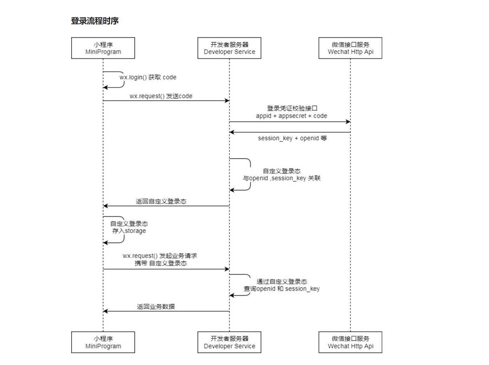

## 一，小程序登录[讲师：码路于老师/LY]


### 1，流程分析

用户登录是微信小程序的重要内容，那么今天就讲用户登录的一个流程，当然微信官方文档也有相关的一个登录流程图，这里也给大家附上地址：[官方 | 小程序登录](https://developers.weixin.qq.com/miniprogram/dev/framework/open-ability/login.html) 。


用户登录流程可以用这一句话简单概括：3个角色，4个步骤 ，3个角色就是

- 小程序 (通过微信开发者工具创建)

- 开发者服务器 （本地的服务器来实现）

- 微信接口服务  （微信官方提供文档）

  

4个步骤就是：

1. 小程序获取code
2. 将code发送到开发者服务器
3. 开发者服务器通过微信接口服务校验登录凭证 
4. 开发者服务自定义登录的状态




**流程：**

1. 首先小程序通过wx.login()获取登录凭证code，每次调用code均不同，有效时间是5分钟，该code被微信接口服务验证一次就会失效了，
2. 小程序获取到code之后，通过wx.request()将code发送到开发者服务器，开发者服务器将appid，appSecret（密钥），和code发送给微信接口服务去校验登录凭证，成功会返回session_key(会话信息记录)和openid(用户唯一标识)
3. 用户登录成功后，开发者服务器可以将openid和session_key保存，生成一个自定义登录态的token(令牌)响应回去给小程序
4. 通过token可以查询openid和session_key，小程序下次请求只要携带着token就可以证明已经登录。


### 2，搭建开发者服务器

在实际开发中是去购买服务器的，那么这里仅限了解和搭建，那么就用本地localhost:3000作为服务器的端口，选用node.js来搭建开发者服务器 。创建服务器代码如下：

```js
const express = require('express') 				
const bodyParser = require('body-parser')		
const request = require('request')	
const app = express()		

app.use(bodyParser.json())	

app.post('/login', (req, res) => {
    
})

app.listen(3000, () => {
    console.log('server running...');
})
```


### 3，获取code

创建小程序项目：


小程序通过wx.login()获取登录凭证code，那么在微信开发者工具中创建一个名为Login的小程序，在这里要实现一个小程序启动时自动执行登录的操作，在app.js文件中来编写代码，可以在onLaunch中进行触发；


```js
App({
    onLaunch:function(){
       this.login()  
    },
    login:function(){
        wx.login({
            success:(res)=>{
                console.log("code: " + res.code);
            }
        })
    }
})
```

以上就是获取code，此时可以在控制台上看到打印出来的code


### 3，将Code发送到开发服务器

通过wx.request()将code发送到开发者服务器


```js
login:function(){
    // wx.login()获取code
        wx.login({
            success:(res)=>{
                console.log("code: " + res.code);
                wx.request({
                    url:'http://127.0.0.1:3000/login',
                    method:'POST',
                    data:{
                        code : res.code
                    }
                })
            }
    })
}
```


在开发者服务器当中来个响应请求接口，请求的方式是post，那可以在index.js文件当中编写代码，这里如果你安装了nodemon的话可以不用重新启动，如果没有，则需要命令行重新输出node index.js重新运行。


```js
app.post('/login',(req,res)=>{
    console.log('code: '+req.body.code) 
})
```


可以看到小程序通过wx.request()的方式成功将code发送到开发者服务器上；


### 5，通过微信接口服务校验

​	开发者服务器将appid，appSecret（密钥），和code发送给微信接口服务去校验登录凭证，成功会返回session_key(会话信息记录)和openid(用户唯一标识)；这时主要是编写开发者服务器当中的代码，在此之间需要开发者将自己的appid和appSecret密钥准备好，这里也给大家将如何获取到；


获取appid和(用户唯一标识)，appSecret(用户密钥)，如下：


```
AppID(小程序ID)         wx154afd6feeabcd59
AppSecret(小程序密钥)	723d3311bd8d194789437b7b8e99ec33
```


现在编写开发者服务器当中的代码；有了code，appid，appsecret就可以进行微信接口服务校验了，附上这个官方链接用到复制即可，以防自己打错。连接：https://developers.weixin.qq.com/miniprogram/dev/api-backend/open-api/login/auth.code2Session.html


代码：


```js
const express = require('express') 				
const bodyParser = require('body-parser')		
const request = require('request')			
const app = express()

app.use(bodyParser.json())

const wx = {
    appid: 'wx154afd6feeabcd59',  // 填写用户自己的appid
    secret: '723d3311bd8d194789437b7b8e99ec33'  // 填写用户自己的密钥
}

app.post('/login', (req, res) => {
    console.log('code: ' + req.body.code) // 打印一下code
    var url = 'https://api.weixin.qq.com/sns/jscode2session?appid=' + wx.appid + '&secret=' + wx.secret + '&js_code=' + req.body.code + '&grant_type=authorization_code'
    request(url, (err, response, body) => {
        //	可以获取到 session_key(会话信息) 、 openid(用户唯一标识)
        console.log('session: ' + body)
        //  上面的session信息是字符串数据，通过JSON.parse()转成js对象
        var session = JSON.parse(body)
        console.log(session);
    })
})

app.listen(3000, () => {
    console.log('server running...');
})

```


成功之后会返回openid和session_key，openid是用户在这个小程序上唯一的id，不同小程序用户的id都不一样，session_key是用户的会话信息记录；将结果打印出来，可以在开发者服务器当中看到如下：


以上就是校验成功之后所返回的session_key和openid；这里注意的是账户不得是测试的账户，否则获取不到code，获取不到code，则校验不能通过；


### 6，开发者服务器自定义登录态

​	通过校验成功后返回的session_key和openid进行保存，实际开发中，通常会使用数据库来保存数据，比如可以用MongoDB，这里就不搭建数据库来存数据，将其作为数据保存到我们的变量当中；openid是用户的唯一标识，所以可以判断session中是否存有openid，如果有我们才返回一个token回去，返回去的token不能是固定的，固定存在一定的分析，这时可以用这个时间戳生成token，当然再实际开发中是推荐使用比较成熟模块生成token，避免token被伪造带来不好的影响，这里我们就通过时间戳的方式来生成token给大家演示这个过程；

```js
const express = require('express') 				
const bodyParser = require('body-parser')		
const request = require('request')				
const app = express()

app.use(bodyParser.json())

const wx = {
    appid: 'wx154afd6feeabcd59',  // 填写用户自己的appid
    secret: '723d3311bd8d194789437b7b8e99ec33'  // 填写用户自己的密钥
}

// 模拟数据库存放数据
var db = {
	user: {},		// userInfo
    session: {}		// 保存 openid 和session_key会话信息 
}

app.post('/login', (req, res) => {
    console.log('code: ' + req.body.code) // 打印一下code
    var url = 'https://api.weixin.qq.com/sns/jscode2session?appid=' + wx.appid + '&secret=' + wx.secret + '&js_code=' + req.body.code + '&grant_type=authorization_code'
    request(url, (err, response, body) => {
        //	可以获取到 session_key(会话信息) 、 openid(用户唯一标识)
        console.log('session: ' + body)
        //  上面的session信息是字符串数据，通过JSON.parse()转成js对象
        var session = JSON.parse(body)
        console.log(session);
        // 将openid和session_key保存后响应token回去,openid是用户的唯一标识
        if(session.openid){
            var token = 'token_' + new Date().getTime() 
            db.session[token] = session
            if(!db.user[session.openid]) {
                db.user[session.openid] = {
                    state:1  // 成功登录可以获取
                }
            }
            console.log(db);
        }
        res.json({
            token: token  // 返回token
        })
    })
})

app.listen(3000, () => {
    console.log('server running...');
})
```


打印结果测试：


成功之后返回token，可以在小程序当中的wx.request()请求校验当中添加请求成功之后将返回的数据进行打印到小程序的控制台上；


```js
App({
  onLaunch: function () {
    this.login()
  },
  login: function () {
    wx.login({
      success: (res) => {
        console.log("code: " + res.code);
        wx.request({
          url: 'http://127.0.0.1:3000/login',
          method: 'POST',
          data: {
            code: res.code
          },
          success: (res) => {
            // 将请求成功的token打印
            console.log("token : " + res.data.token);
          }
        })
      }
    })
  }
})
```


将返回到小程序的token进行一个缓存，小程序的下次请求时只要携带token，就可以证明用户已经登录，那么我们在进入小程序之前就需要将检查是否登录。


### 7，检查用户是否登录

在检查用户登录之前，将返回的token进行数据缓存，token是公共数据，是多个页面当中需要用到的，可以定义为全局的globalData；数据缓存可以用wx.setStorage()。

```js
App({
  globalData: {
    token: "",
  },
  onLaunch: function () {
    this.login()
  },
  login: function () {
    wx.login({
      success: (res) => {
        console.log("code: " + res.code);
        wx.request({
          url: 'http://127.0.0.1:3000/login',
          method: 'POST',
          data: {
            code: res.code
          },
          success: (res) => {
            // 将请求成功的token打印
            console.log("token : " + res.data.token);
            // 将token保存为公共数据（多页面使用->全局globalData）
            this.globalData.token = res.data.token
            // 将token保存在数据缓存中（下次无需重新获取token）
            wx.setStorage({
              key: 'token',
              data: res.data.token
            })
          }
        })
      }
    })
  }
})
```


可以查看是否已经缓存下来，打开控制台查看，如下图：


上述内容将返回token缓存下来，那么检查的是否需要先从缓存当中看是否有token，如果有则可以请求服务器去检验token是否有效，如果没有token，则按照原来的方式去调用login()来获取token；

```js
App({
  globalData: {
    token: "",
  },
  onLaunch: function () {
    // 检测用户是否登录
    this.checkLogin(res => {
      console.log('is_login : ', res.is_login);
      // 未登录 -> login()
      if (!res.is_login) {
        // 调用Login
        this.login();
      }
    })
    // this.login()
  },
  checkLogin:function(callback){
    var token = this.globalData.token
    if(!token){
      // 从缓存中获取token
      token = wx.getStorageSync('token')
      if(token){
        this.globalData.token = token
      }else{
        callback({ is_login : false })
      }
    }
     // 发送请求检验token是否存在
     wx.request({
      url: 'http://127.0.0.1:3000/checklogin',
      data:{
        token : token
      },
      success:(res)=>{
        console.log(res);
        callback({
          is_login:res.data.is_login
        })
      }
    }) 
  },
  login: function () {
    wx.login({
      success: (res) => {
        console.log("code: " + res.code);
        wx.request({
          url: 'http://127.0.0.1:3000/login',
          method: 'POST',
          data: {
            code: res.code
          },
          success: (res) => {
            // 将请求成功的token打印
            console.log("token : " + res.data.token);
            // 将token保存为公共数据（多页面使用->全局globalData）
            this.globalData.token = res.data.token
            // 将token保存在数据缓存中（下次无需重新获取token）
            wx.setStorage({
              key: 'token',
              data: res.data.token
            })
          }
        })
      }
    })
  }
})
```


响应接口请求，查询保存的数据库当中是否有该token的存在，判断取出的session是否为undefined，如是则表示token值已经失效了，如有缓存token且token有效则表示用户已经登录；

```js
const express = require('express') 				
const bodyParser = require('body-parser')		
const request = require('request')				
const app = express()

app.use(bodyParser.json())

const wx = {
    appid: 'wx154afd6feeabcd59',  // 填写用户自己的appid
    secret: '723d3311bd8d194789437b7b8e99ec33'  // 填写用户自己的密钥
}

// 模拟数据库存放数据
var db = {
	user: {},		// userInfo
    session: {}		// 保存 openid 和session_key会话信息 
}

app.post('/login', (req, res) => {
    console.log('code: ' + req.body.code) // 打印一下code
    var url = 'https://api.weixin.qq.com/sns/jscode2session?appid=' + wx.appid + '&secret=' + wx.secret + '&js_code=' + req.body.code + '&grant_type=authorization_code'
    request(url, (err, response, body) => {
        //	可以获取到 session_key(会话信息) 、 openid(用户唯一标识)
        console.log('session: ' + body)
        //  上面的session信息是字符串数据，通过JSON.parse()转成js对象
        var session = JSON.parse(body)
        console.log(session);
        // 将openid和session_key保存后响应token回去,openid是用户的唯一标识
        if(session.openid){
            var token = 'token_' + new Date().getTime() 
            db.session[token] = session
            // console.log(db);
            if(!db.user[session.openid]) {
                db.user[session.openid] = {
                    state:1  // 成功登录可以获取
                }
            }
            console.log(db);
        }
        res.json({
            token: token  // 返回token
        })
    })
})


app.get('/checklogin', (req, res) => {
    var session = db.session[req.query.token]
    console.log('checklogin: ', session)
    // 将用户是否已经登录的布尔值返回给客户端
    res.json({
        is_login: session !== undefined
    })
})

app.listen(3000, () => {
    console.log('server running...');
})
```


现在缓存当中有了token值，我们重新编译一下，此时缓存当中是有token值的，is_login的值为 true ，证明用户已经登录；


完整代码，客户端：

```js
App({
  globalData: {
    token: "",
  },
  onLaunch: function () {
    // 检测用户是否登录
    this.checkLogin(res => {
      console.log('is_login : ', res.is_login);
      // 未登录 -> login()
      if (!res.is_login) {
        // 调用Login
        this.login();
      }
    })
    // this.login()
  },
  checkLogin:function(callback){
    var token = this.globalData.token
    if(!token){
      // 从缓存中获取token
      token = wx.getStorageSync('token')
      if(token){
        this.globalData.token = token
      }else{
        callback({ is_login : false })
      }
    }
     // 发送请求检验token是否存在
     wx.request({
      url: 'http://127.0.0.1:3000/checklogin',
      data:{
        token : token
      },
      success:(res)=>{
        console.log(res);
        callback({
          is_login:res.data.is_login
        })
      }
    }) 
  },
  login: function () {
    wx.login({
      success: (res) => {
        console.log("code: " + res.code);
        wx.request({
          url: 'http://127.0.0.1:3000/login',
          method: 'POST',
          data: {
            code: res.code
          },
          success: (res) => {
            // 将请求成功的token打印
            console.log("token : " + res.data.token);
            // 将token保存为公共数据（多页面使用->全局globalData）
            this.globalData.token = res.data.token
            // 将token保存在数据缓存中（下次无需重新获取token）
            wx.setStorage({
              key: 'token',
              data: res.data.token
            })
          }
        })
      }
    })
  }
})
```


服务器：

```js
const express = require('express') 				
const bodyParser = require('body-parser')		
const request = require('request')				
const app = express()

app.use(bodyParser.json())

const wx = {
    appid: 'wx154afd6feeabcd59',  // 填写用户自己的appid
    secret: '723d3311bd8d194789437b7b8e99ec33'  // 填写用户自己的密钥
}

// 模拟数据库存放数据
var db = {
	user: {},		// userInfo
    session: {}		// 保存 openid 和session_key会话信息 
}

app.post('/login', (req, res) => {
    console.log('code: ' + req.body.code) // 打印一下code
    var url = 'https://api.weixin.qq.com/sns/jscode2session?appid=' + wx.appid + '&secret=' + wx.secret + '&js_code=' + req.body.code + '&grant_type=authorization_code'
    request(url, (err, response, body) => {
        //	可以获取到 session_key(会话信息) 、 openid(用户唯一标识)
        console.log('session: ' + body)
        //  上面的session信息是字符串数据，通过JSON.parse()转成js对象
        var session = JSON.parse(body)
        console.log(session);
        // 将openid和session_key保存后响应token回去,openid是用户的唯一标识
        if(session.openid){
            var token = 'token_' + new Date().getTime() 
            db.session[token] = session
            // console.log(db);
            if(!db.user[session.openid]) {
                db.user[session.openid] = {
                    state:1  // 成功登录可以获取
                }
            }
            console.log(db);
        }
        res.json({
            token: token  // 返回token
        })
    })
})


app.get('/checklogin', (req, res) => {
    var session = db.session[req.query.token]
    console.log('checklogin: ', session)
    // 将用户是否已经登录的布尔值返回给客户端
    res.json({
        is_login: session !== undefined
    })
})

app.listen(3000, () => {
    console.log('server running...');
})
```


项目中用到的依赖：

```json
"dependencies": {
    "body-parser": "^1.20.0",
    "express": "^4.18.1",
    "request": "^2.88.2"
}
```


## 二，前端到底死没死


### 1，互联网就业行情我的感受

关于目前互联网就业行情我的感受：

- 国家层面统计的就业情况我就不想去讨论，跟我们普通人没啥关系，只想说来自身边的真实感受。
- 2019年之前，随便投个简历就能有一大堆面试。
- 2023年开始，除了华为od、外包就真的没有好工作了。大量公司裁员，倒闭。
- 口罩之后，好像Jing Ji也并没有恢复，也没有出现类似互联网这种提供大量高薪的就业岗位。
- AI，半导体、新能源汽车行业有不错发展，终究难以创造大量的新增就业岗位。并且待遇相较于以前的互联网也是有着巨大差距。
- 半导体、新能源汽车行业，需要大量的前期资产投入，小微公司没法入场，只能是大公司和大资本的内部游戏。
- 这2年随着互联网红利的逐渐消失，大量普通公司所产生的高薪岗位消失了，叠加上大厂战略的收缩，涌出了大量的程序员和其它从业人员。


### 2，前端岗位依然存在，岗位减少了90%


除了个别职业，很少有职业能在短时间内彻底玩完的。总归有人能继续在行业里生存。都2024年了，jQuery代码现在还有人要写呢，python的django也有人在写。


土木工程现在依然存在，但现在还有谁会对土木抱有预期？


国企大下岗的时，同样有很多人依旧拿着铁饭碗。总会有能力高超、运气极好的人能在行业里生存下去。所以说，前端行业中依然会有一些人坚守下去，只是很多人已经入局不了了。


### 3，我是如何感觉前端已死


当**互联网、短视频** 上冒出来一堆自称很牛的人，吹嘘自己很厉害的人，出来拍 **短视频** ，或者出来唱衰互联网，引流的。无论是 **卖课** 也好，创业也罢，都无一证明着，前端这条路变难走了。


搞自媒体或短视频，需要学习拍摄、剪辑、配音、文案的功夫来赌一个不确定的自媒体行业，显然，对前端开发来说，**努力** 已经换不来收获了。


### 4，现在的行情

如果前端没死，你可以裸辞试一下，感受一下：

- 感受一下 **1%** 的投递回复率；
- 感受一下 **5%** 的面试邀请率；
- 感觉一下企业对学历的要求;
- 你有营业执照的话，你去发布一个岗位试2个小时，200份的简历;


### 5，未来

- 主前端：持续学习后端，争取在公司转型到后端开发，同时保持较高的前端开发能力
- 主后端：在后端深耕，前端要会但不要太把精力放在这里

- 前端能力强的：持续在前端深耕、尝试后端转向、尝试副业
- 前端能力弱的：尽早直接转后端，尽早尝试副业
- 拥抱自媒体，独立开发


## 三，IT岗位那么多，如何选择？


我的偏见：**适合写程序的人并不多**


### 1，语言的选择/岗位的选择


Java后端：

- 由美国SUN公司发明于1995年，是目前业界应用最广泛、使用人数最多的语言，连续多年排名世界第一，可以称之为“计算机语言界的英语”
- Java广泛应用于企业级软件开发、安卓移动开发、大数据云计算等领域，几乎涉及IT所有行业。
- 再怎么抨击Java，但目前仍是需要最大的开发岗，就业首选，易学，门槛低，天花板高。
- 培训机构输出了大量的Java程序员，导致Java非常卷。
- 专科直接放弃，至少本科起步（除非技术确实吊）
- 本科（二本以上）本专业，学Java还是可以的，不学Java你能做什么


前端（JS/TS）

- 2023年开始，已经被攻击的体无完肤了，大形式不好，先裁的就是测试和前端
- 前端的需求，要么压到一个人身上，要么后端程序员代替了
- 目前如果是本科学习，直接上全栈。专科直接放弃
- 研究生以上学历，不如直接上AI算法，大数据方法


Python AI方向

- 国内做AI的公司不多，岗位不多。

- 不是研究生以上学历，直接放弃，学历这一关就直接Pass掉了
- Python是一门万能语言，所以一直在排行榜最前面。
- AI方向，算法和大模型占95%，Python就占5%而已。


Python 爬虫方向

- 暂时不怎么吃学历，找工作岗位相对来说还可以的也就爬虫/逆向。
- 好的爬虫程序员待遇是非常高的
- 稍有不当，容易被叫去写保证书（注意法律风险）


Python数据分析

- 也是比较吃学历，建议也是研究生起


大数据方向：

- 本科玩不了，目前岗位也不多
- 有大数据的公司，不多


Go语言：

- Go 是一个开源的编程语言，它能让构造简单、可靠且高效的软件变得容易
- Go 语言被设计成一门应用于搭载 Web 服务器，存储集群或类似用途的巨型中央服务器的系统编程语言
- 对于高性能分布式系统领域而言，Go语言无疑比大多数其它语言有着更高的开发效率。它提供了海量并行的支持，这对于游戏服务端的开发而言是再好不过了。
- 大厂使用或初创小公司使用，开发效率高，岗位不多。
- 很多大厂主要的后端还是Java，可以个别系统会使用Go。
- PHP，C++程序员很多都在转Go。


C语言：

- C语言诞生于1972年，可称为现在高级语言的鼻祖，由著名的贝尔实验室发明。
- C语言是人为追求结构化，模块化，高效率的语言之花。
- 在底层编程，如嵌入式，病毒开发等应用，可以替代汇编语言来开发系统程序。
- 在高层应用，也可以开发从操作系统到各种应用软件。
- 嵌入式，网安，驱动开发等。


C++开发：

- 作为C语言的扩展，C++是贝尔实验室于80年代推出的。C++是一种混合语言，既可以实现面向对象编程，也可以开发C语言面向过程风格的程序。
- C++语言在科学计算、操作系统、网络通讯、系统开发、引擎开发中仍然被大量使
- 对开发者要求比较高，相当来说并不是特别卷，岗位不多
- 什么都能做，效率非常底，性能高。
- 游戏开发早期可能使用C++，现在有些会使用Go。
- 待遇非常高，比较难学。


C#开发：

- C#是微软公司发布的一种面向对象的、运行于.NET Framework之上的高级程序设计语言。
- C#在基于windows操作系统的应用开发这一领域在取代C++，占据主导地
- Unity3D开发游戏时，使用C#和avascript
- 国内用的不多，项目部署在window上。
- 上位机


PHP开发：

- 一般用于WEB开发领域
- 大量的中小型网站以及某些大型网站使用PHP开发
- 国内很少了已经。


Rust语言：

- Rust 语言是一种高效、可靠的通用高级语言。其高效不仅限于开发效率，它的执行效率也是令人称赞的，是一种少有的兼顾开发效率和执行效率的语言
- Rust 语言可以用于开发
  - 传统命令行程序- Rust 编译器可以直接生成目标可执行程序，不需要任何解释程序。
  - Web 应用- Rust 可以被编译成 WebAssembly，WebAssembly 是一种JavaScript 的高效替代品。
  - 网络服务器-Rust 用极低的资源消耗做到安全高效，且具备很强的大规模并发处理能力，十分适合开发普通或极端的服务器程序。
  - 嵌入式设备-Rust同时具有avaScript一般的高效开发语法和C语言的执行效率，支持底层平台的开发。


测试：

- 自动化测试，性能测试，测试平台开发
- 待遇比开发低一些

- 走测开，走自动化测试
- 岗位少，公司裁人，先裁测试


运维：

- 中不公司，很少有运维，运维的事都是程序员自己做了
- 专科起步就可以，但不要迷信抖音某个博主所谓的运维（云计算）形式大好
- Python在运维方向仅仅是一个工具


嵌入式或网安（最近火一点）：

- 岗位并不多，网安/Zhong Mei关系（大环境）/护网
- 大专就可以干，网安学的东西特别杂，起薪比较低。当然网络安全专家就另说了。
- 2023年开始，大量的人开始搞嵌入式和网安，现在也比较卷，慢慢也和java和前端差不多了，也会开始卡学历。
- 中国不缺人，每年都有上千万的大生学毕业


游戏：

- 现在走下坡路
- 待遇也非常高


区块链/web3/元宇宙

- 炒作，没有什么特别落地的东西出来
- 公司说被端了就被端了
- 国外会有一些职位


## 四，Vue权限管理上


## 五，Vue权限管理中


## 六，Vue权限管理下


## 七，Vue的.sync的使用


## 八，Grid网络布局


## 九，粘性定位


## 十一，滑动门


## 十二，瀑布流


## 十三，放大镜


## 十四，防抖和节流


## 十五，工厂模式


## 十六，单例模式


## 十七，原型模式


## 十八，适配器模式


## 十九，代理模式


## 二十，策略模式


## 二十一，迭代器模式


## 二十二，观察者模式


## 二十三，命令模式


## 二十四，状态模式


## 二十五，Fetch发请求[讲师：码路于老师/LY]

