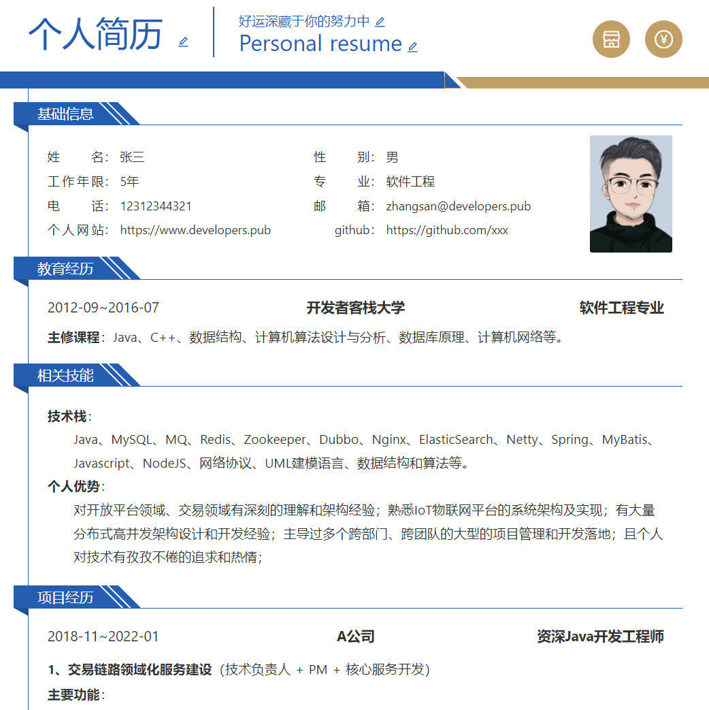
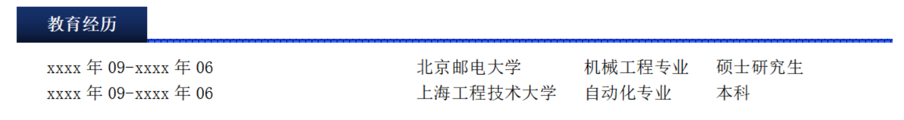
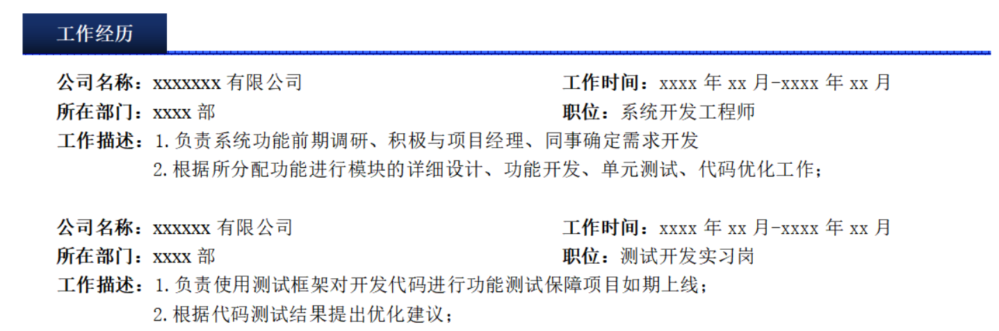
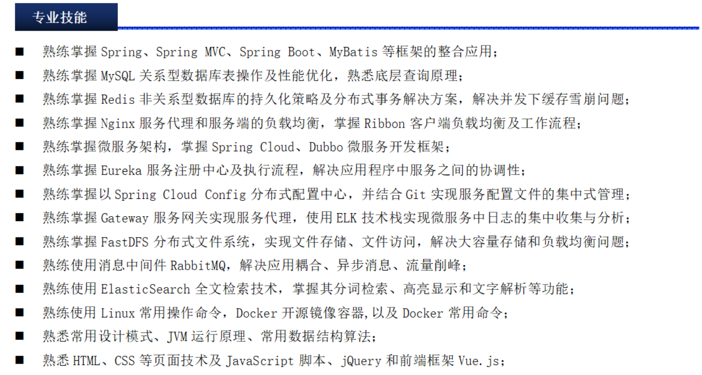
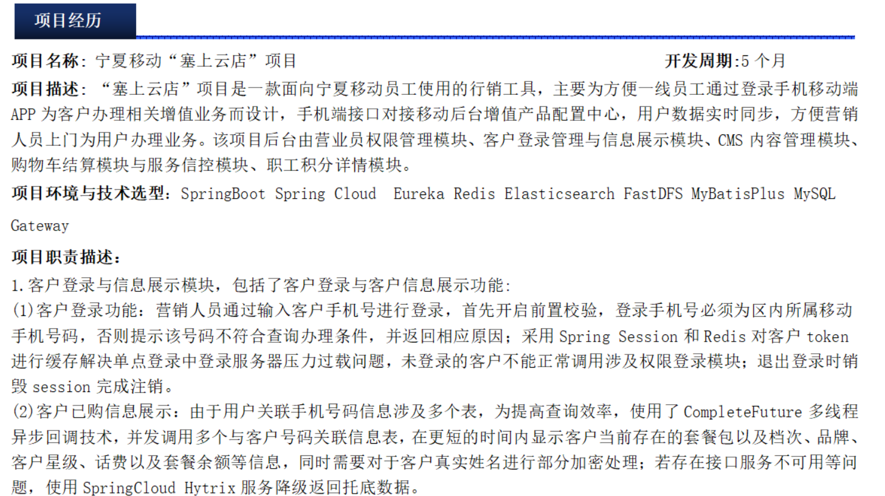
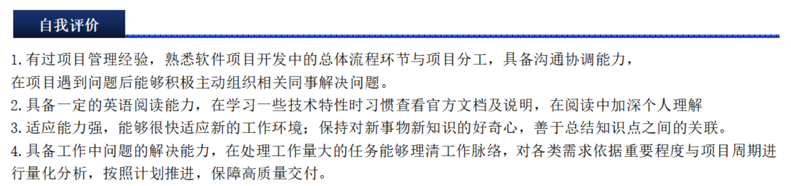

## 码路漫漫【面试和成功求职秘籍】

## 一，简历如何书写

### 1，如何写出更符合Java程序员气质的简历

**编写简历要点**

- 使用pdf格式，不要使用word格式
- 简历的命名，姓名-岗位-联系方式-简历.pdf
- 简历的页数控制在2~3页， 简约而不简单
- 打印简历时，使用标准的A4纸
- 打印时，不要出现空白页，也不要出现只有半页的情况，不要制作简历的封面
- 不要给简历添加背景图，不要添加水印，使用阅读变差
- 使用标准的字体，不要使用艺术字体，还有就是不要出现重复的内容
- 不要使用招聘平台生成的简历模板
- 避免口语化，也不是轻易地使用精通二字，也不要使用了解两字，注意用词
- 不要使用一些不确定的词语，如认为，觉得，应该之类的词语
- 英文大小写单词，如Java， 而不是java或者是JAVA，不要随意使用缩写
- 简历上的标点符号一定要规划
- 多注意细节问题

### 2，如何选择简历模板

网上的简历模板也是五花八门的，没有统一的要求，国家也没有统一地要求。

关于简历模板的选择：

- 美观而不花哨
- 简单而有内容
- 要有核心与关键词
- 在简历中可以适当使用一些线条做内容分隔符，这样阅读时会更方便

参考：

- 木及简历：https://www.mujicv.com/
- 牛客简历：https://www.zhiyeapp.com/
- 超级简历：https://www.wondercv.com/
- 其它：https://developers.pub/resume

### 3，个人信息如何写

个人信息部分中比较重要的是：

- 姓名
- 性别
- 现居
- 学历（放在教育经历模块写）
- 意向地点（求职意向模块中写也可以）
- 联系电话（千万不能写错了）
- 电子邮箱（千万不能写错了）
- 年龄和工作年限

注意：

- 除了这八项以外，其他信息根据自己的实际情况进行编写即可，如技术博客，github等。
- 写上有利于面试官或hr方便查看，不写也可以在其他部分中体现。例如：学历在教育经历中体现；工作时间在工作经历中体现。

### 4，求职意向如何写

求职意向，就是求职的方向，是根据个人的能力，对自己进行职业规划，明确自己所要从事的职业，工作地点等，从而有针对性的去寻找合适的工作。

在求职意向中也可以说明目标薪资，建议写成具体薪资或以具体信息为下限的区间薪资。

### 5，教育经历如何写

教育经历部分分为两种写法：

1. 如果是应届毕业生。除了教育经历基本信息以外，还要把在学校中获奖、学生会、社团、竞赛等有利于体现自己能力的经历写上。
2. 如果是往届毕业生。可以只写教育经历的基本信息。如果是985/211。就在简历中标注出来。如果获得过能突出编程能力的奖项也可以写上去。

### 6，工作经历如何写

工作经历中体现出自己任职公司、工作时间、职位和工作内容。尽量体现出自己的能力，在以往公司工作过程中自己身上的闪光点。如果任职过小组组长、研发经理、项目经理等职位也可以体现出。如果工作经历和我们找的岗位没有关系的话，就不要写了。对于应届生来说，有实习经历的，也算是你的工作经历。

### 7，专业技能如何写

专业技能是简历中非常重要的一部分，它是体现自己能力的部分。公司招聘者通常是根据求职者的专业技能来进行简历的筛选，因此，求职者需要在该部分充分的体现自己的能力，以此来赢得面试机会。

注意：

- 并不是越多越好，越多，别人看起来就越麻烦，不要追求量。

- 一般控制在10~15左右。

- 慎用精通，没有时间的沉淀，一般达不到精通。写熟练和熟悉是可以的。

  

### 8，项目经历如何写

项目经历是简历中非常重要的部分，是面试官非常关注的部分，也是自己能力体现的部分。如果个人简历中没有项目经历，其他部分写的多么完美，简历分数也会大打折扣。在项目经历中每个项目要明确体现出项目名称，项目周期，项目技术，核心逻辑等。也可以选择性的写出项目组人数等其他信息。

注意：

- 网上有很多项目，如果网友没有项目经历，把网上比较好的项目，写完后，也可以当成自己的项目经历。
- 不要造假，写过什么项目，就在简历上写什么项目。
- 不光要写出来，还要能讲清楚，讲的越清楚，被录用的概率就越大。
- 项目时间，一般3个月，5个月，半年，1年左右。
- 项目数量，结合自己的工作年限来写，如工作3个，写2~3个项目就可以了。
- 职责描述按模块来写，体现出项目你负责的模块，项目难点，项目两点等。

### 9，其它内容

自我评价就是对自己的简单介绍。如：

- 项目管理能力
- 英语6级+
- 接受出差
- 学习和解决问题能力强

## 二，面试前的准备

1，Java程序员如何应对笔试

笔试是面试中非常重要的环节，通过笔试环节可以了解每个人的基本能力，以便于筛选出更符合公司要求的应聘者。

一般笔试题包含：

- Java基础题
- JavaWeb题
- 开源框架题
- SQL语句题

可以提前在网上搜一下这个公司笔试题。在笔试时，按照要求写，尽量写的工整一些，写的详细一些。答完题后一般都是给前台或hr。谁给你的笔试题，就交还给谁。如果有特殊要求，也会直接告诉我们的。

答题场地：

- 有的公司在会议室笔试。
- 有的公司走廊，过道小桌子上进行笔试。
- 有的公司在面试官旁边的工位上笔试。

**备注**

不是所有公司都有笔试的。个别公司可能直接做上机。

有的公司笔试后会告诉你技术没在，就让我们回去。

有的公司又没有笔试，又没有机试。