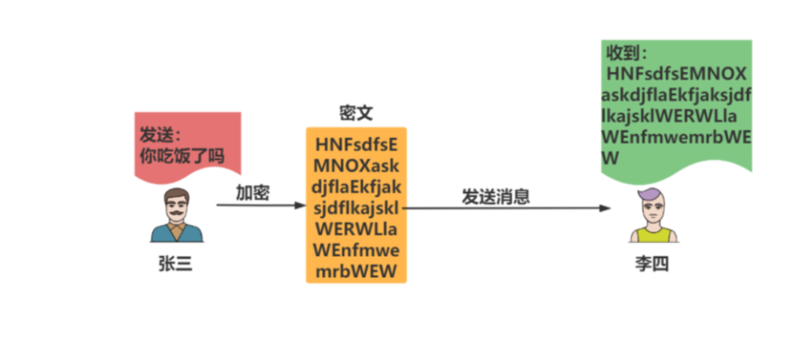
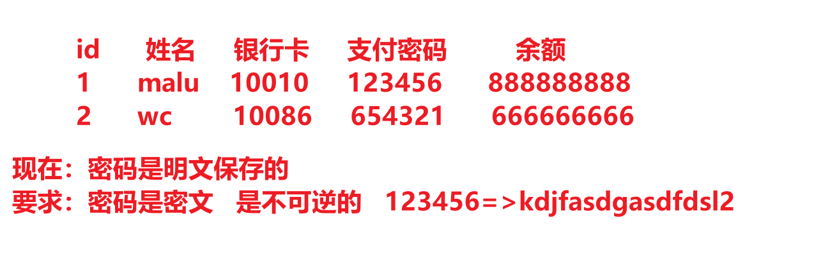
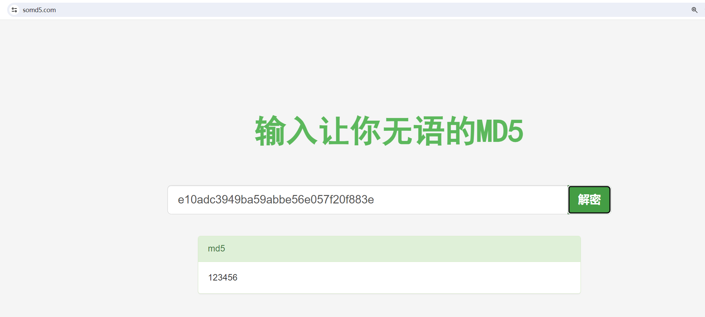
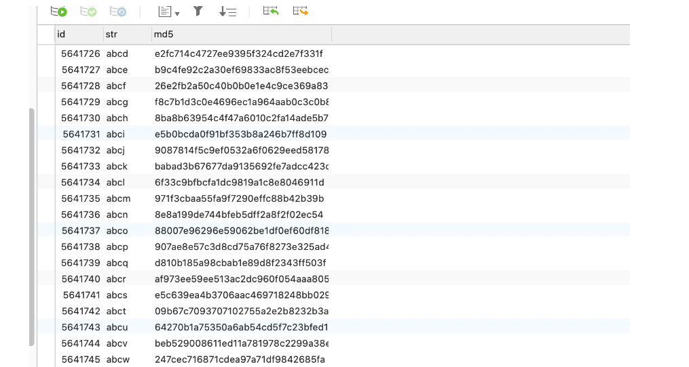
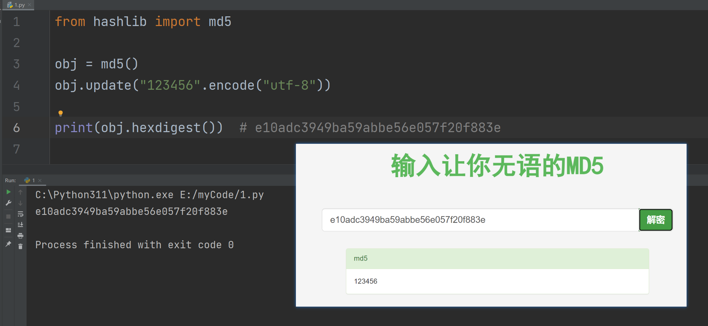
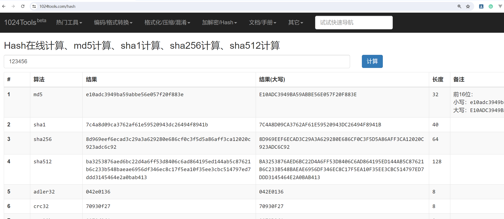
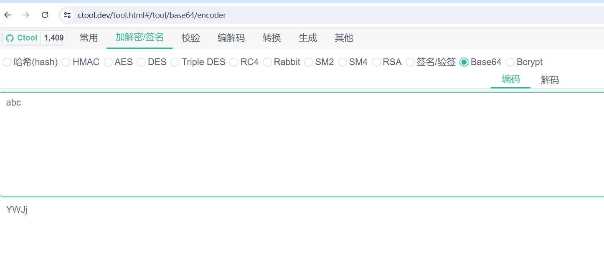

## 1，一切从MD5开始

明文：没有加密之前的消息叫明文


密文：加密后的文件叫密文




MD5是一个非常常见的摘要(hash)算法.. 其特点就是小巧. 速度快. 极难被破解(王小云女士). 所以, md5依然是国内非常多的互联网公司选择的密码摘要算法.

1. 这玩意不可逆. 所以. 摘要算法就不是一个加密逻辑.
2. 相同的内容计算出来的摘要应该是一样的，只要内容不一样，摘要出来的东西也不一样
3. 不同的内容(哪怕是一丢丢不一样) 计算出来的结果差别非常大


有一篇文章，大概有2000个字，从这篇文章中摘出来20个字代表这一篇文章。不能反着来，你根据这20个字，你是不能推出这一篇文章的。这个过程叫不可逆。至于MD5是如何摘要的，不要管。




摘要算法就是我们常说的散列函数、哈希函数（Hash Function），它能够把任意长度的数据“压缩”成固定长度、而且独一无二的“摘要”字符串，就好像是给这段数据生成了一个数字“指纹”。


**特点：**

- 不可逆：只有算法，没有秘钥，只能加密，不能解密
- 难题友好性：想要破解，只能暴力枚举
- 发散性：只要对原文进行一点点改动，摘要就会发生剧烈变化抗
- 碰撞性：原文不同，计算后的摘要也要不同


**常见算法：**

- MD5
- SHA1
- SHA256
- SHA512


使用python初识MD5：

```python
# hashlib是python标准库中支持各种hash计算的一个模块
from hashlib import md5

# 创建一个md5对象，把你要计算的东西传递给obj
obj = md5()
# "你吃饭了吗？" 是一个字符串，要求计算的内容必须是字节
obj.update("你吃饭了吗？".encode("utf-8"))

# 提取md5值  密文件
md5_val = obj.hexdigest()
print(md5_val) # 9bdc0941f37069c9a7fc34ff6a2b5296
```


使用md5时，上面的obj是一次性的，如下：

```python
# hashlib是python标准库中支持各种hash计算的一个模块
from hashlib import md5

# 创建一个md5对象，把你要计算的东西传递给obj
obj = md5()
# "你吃饭了吗？" 是一个字符串，要求计算的内容必须是字节
obj.update("你吃饭了吗？".encode("utf-8"))

# 提取md5值  密文件
md5_val = obj.hexdigest()
print(md5_val) # 9bdc0941f37069c9a7fc34ff6a2b5296

obj = md5() # md5计算时，obj是一次性的，多次使用，会产生叠加的效果，要避免
obj.update("你吃饭了吗？".encode("utf-8"))
print(obj.hexdigest()) # ab035e3a0a518b366af927d421ab5731  9bdc0941f37069c9a7fc34ff6a2b5296

# obj = md5()
# obj.update("你吃饭了吗？你吃饭了吗？".encode("utf-8"))
# print(obj.hexdigest())  # ab035e3a0a518b366af927d421ab5731
```


虽然md5是不可逆的，但是可以撞库破解：




我们把密文丢到网页里. 发现有些网站可以直接解密. 但其实不然. 这里并不是直接解密MD5. 而是"撞库"。就是它网站里存储了大量的MD5的值. 就像这样:



而需要进行查询的时候. 只需要一条select语句就可以查询到了. 这就是传说中的撞库。


比较123456的密文就可以通过撞库进行破解，如下：




如何避免撞库: md5在进行计算的时候可以加盐. 加盐之后. 就很难撞库了. 加盐演示：

```python
from hashlib import md5

# abc就是盐
# obj = md5(b'abc')
# obj.update("123456".encode("utf-8"))
# print(obj.hexdigest())  # 0659c7992e268962384eb17fafe88364

# 加盐的本质就是在源数据前面增加一些东西
# 明文：123456  加了盐：abc123456
obj = md5()
# obj.update(b"abc"+"123456".encode("utf-8"))
obj.update(b"asdgasdgasd2t2346gsdfgsdr"+"123456".encode("utf-8"))
print(obj.hexdigest())  # 0659c7992e268962384eb17fafe88364 f1acc97ca49b9f5ff88018e262c69072
```


## 2，sha系列

sha系列也属于摘要算法。不论是sha1, sha256, md5都属于摘要算法. 都是在计算hash值. 只是散列的程度不同而已. 这种算法有一个特性. 他们是散列. 不是加密. 而且, 由于hash算法是不可逆的, 所以不存在解密的逻辑.


摘要算法摘要出来的长度是不一样的：

- md5     32位     123456=>e10adc
- sha1     40位     123456=>7c
- sha256   64位
- sha512   128位


演示sha系统算法：

```python
from hashlib import md5, sha1, sha256, sha512

# obj = sha1();  #7c4a8d09ca3762af61e59520943dc26494f8941b
# obj = sha256();  #8d969eef6ecad3c29a3a629280e686cf0c3f5d5a86aff3ca12020c923adc6c92
obj = sha512();  #ba3253876aed6bc22d4a6ff53d8406c6ad864195ed144ab5c87621b6c233b548baeae6956df346ec8c17f5ea10f35ee3cbc514797ed7ddd3145464e2a0bab413
obj.update("123456".encode())
print(obj.hexdigest())  # 7c4a8d09ca3762af61e59520943dc26494f8941b
```


看一个网站：https://1024tools.com/hash




## 3，URLencode编码

### 1，什么是URL

一个url如下：

```
https://yujingbo1023.github.io/javablog/public/assets/img/1718853299072.eef915f3.png

https://yujingbo1023.github.io/javablog/public/blogs/javabase/01.html#_1-java%E5%8E%86%E5%8F%B2-%E4%BA%86%E8%A7%A3

https://www.baidu.com/
```


一个完整的URL是有固定格式的：

```
协议://域名:端口/虚拟路径/虚拟路径/资源?参数名=参数值&参数名=参数值#锚点
```


分析：

- 协议：规则，是客户端与服务器进行交流的规则
- 域名：IP地址，有了IP可以找到哪一台服务器
- 端口：服务器上，可以安装非常多的应用程序，不同的应用程序监听不同的端口，有了端口，才知道你访问的是哪一个应用程序。如果是http协议，那么端口默认是80。如果是https，那么端口默认是443。


```
https://www.baidu.com:443/

使用https协议，给百度的服务器上的某个应用程序发送一个请求。这个应用程序需要监听443端口。
```


比如malu买了一台服务器，在服务器上放很多的电影，别人访问之：

```
协议://域名:端口   此时就可以访问到malu的服务器上的某个应用程序了。

协议://域名:端口/动作电影/2024/制爆.html    这样就意味着所有人都可以访问电影了
```


给服务器传递参数：

```
协议://域名:端口/动作电影/2024/制爆.html?username=wc&pwd=123456#评论
```


如果传递的用户名是：`wc&1=1`

```
协议://域名:端口/动作电影/2024/制爆.html?username=wc&1=1&pwd=123456#评论
```


### 2，url编码与解码

在url中，有些符号需要单独处理，不能作为参数，浏览器会自动把参数中的内容，进行urlencode计算。在计算时，会把特殊符号(中文)进行转义。转义成%两位的十六进制数字 (%XX)表示一个字节。如果是英文的字符，1个字符是占用一个字节，一个中文的字符占几个字节，取决于它的编码，如果是gbk编码，占2个字节，如果是utf-8编码占3个字节。写代码演示：

```python
from urllib.parse import urlencode

params = {
    # "username":"wc&1=1"  # username=wc%261%3D1
    "username":"于老师"  # username=%E4%BA%8E%E8%80%81%E5%B8%88
}
print(urlencode(params))
```


url会进行编码：

```
https://yujingbo1023.github.io/javablog/public/blogs/javabase/01.html#_3-%E5%8F%98%E9%87%8F
```


除了urlencode进行编码之外，还可以使用quote进行编码：

```python
from urllib.parse import urlencode,quote,unquote

# urlencode:  username=%E4%BA%8E%E8%80%81%E5%B8%88
# quote:               %E4%BA%8E%E8%80%81%E5%B8%88
print(quote("于老师"))

s = "%E4%BA%8E%E8%80%81%E5%B8%88"
print(unquote(s)) # 于老师
```


参考网站：https://ctool.dev/tool.html#/tool/url/encoder


## 4， Base64编码

计算机底动存储的都是二进制数据，如: “程序开发常用工具”，这个数据也是需要转化成二进制数据进行存储的。如果想对这个数据进行加密，加密后，它就是一个密文了：“432562346324623463456"。加密之后得到的肯定是一堆乱七八糟的东西。432562346324623463456 =>转化成二进制=>0001010001010000010010010010101。需要每8位分成一个小组，每一个小组就是一个分节：00001010    00101000     00100100   10010101。


得到二进制数据后，进行网络传输时，直接发送字节，非常恶心。能不能把字节转化成字符串，直接传递字符串就非常方便了，现在说的base64就是把字节转化成字符串的编码规则。规则是：把字节处理成二进制, 进行六个01组合成一个新的字节. 把新的字节处理成十进制.然后去数组中进行映射。


有如下的数据：

```python
s = b"abc";
# a  97  01100001
# b  98  01100010
# c  99  01100011

# 正常字节
# 01100001 01100010 01100011     
# b64转化
# 00011000  00010110  00001001  00100011
#   24         22       9          35
# arr = "ABCDEFGHIJKLMNOPQRSTUVWXYZabcdefghijklmnopqrstuvwxyz0123456789+/";  # 64位

arr = "ABCDEFGHIJKLMNOPQRSTUVWXYZabcdefghijklmnopqrstuvwxyz0123456789+/";
print(arr[24]+arr[22]+arr[9]+arr[35]) # YWJj
```

验证：




上面的就是base64的编码逻辑，不论多么复杂的字节，都可以转化成base64字符串，方便数据传输和传递。


使用python代码演示：

```python
# 标准库
import base64

# b = b'abc'
# 把字节转化成base64
# r = base64.b64encode(b)  # b'YWJj'
# 再处理成字符串
# r = base64.b64encode(b).decode() # YWJj
# print(r)

s = "YWJj"
# 把base64的字符串处理成字节
bs = base64.b64decode(s)
print(bs)  # b'abc'
```


总结：

- 把字节转化成base64字节串： base64.b64encode(b).decode()
- 把base64字节串转化成字节： base64.b64decode(s)


你在电脑上见的所有东西，在计算机底层都是字节，都是可以转化成数字。base64是把字节转化成了字符串，还可以把字节转化成数字：

```python
# 10进制  0123456789   10
# 8进制   01234567   10
# 2进制   01     10
# 16进制  0123456789abcdef    f     10


s = "于老师".encode("utf-8")
print(s)  # b'\xe4\xba\x8e\xe8\x80\x81\xe5\xb8\x88'  这就是一个个的字节
# e4 ba 8e e8 80 81 e5 b8 88
# 字节不仅可以转化成base64字符串，还可以转化成16进制的字符串（每一个字节，都会单独处理成一个两位的16进制的数字）
```


有一个包，转门把字节转化成16进制数字，如下：

```python
s = "于老师".encode("utf-8")  # 把字符串转化成字节
# print(s)  # b'\xe4\xba\x8e\xe8\x80\x81\xe5\xb8\x88'

import binascii

# b 字节
# 2 two  to
# a  ascii
# 把字节转化成16进制的数字
r = binascii.b2a_hex(s).decode()
print(r)  # e4ba8ee88081e5b888

# 把16进制的数字转化成字节
s = "e4ba8ee88081e5b888"
bs = binascii.a2b_hex(s)
print(bs.decode("utf-8"))  # 于老师
```


同样一个字符串，因为一个字符串，是可以转化字节的，可以把字节转化成base64字符串，也可以把字节转化成16进制的字符串。如下：

```python
# 标准库
import base64

s = "于老师".encode("utf-8")  # 把字符串转化成字节
print(s)  # b'\xe4\xba\x8e\xe8\x80\x81\xe5\xb8\x88'

bs = b'\xe4\xba\x8e\xe8\x80\x81\xe5\xb8\x88'
r = base64.b64encode(bs).decode()
print(r)  # 如果转成base64字符串： 5LqO6ICB5biI
# 如果转化16进制字符串：# e4ba8ee88081e5b888
```


