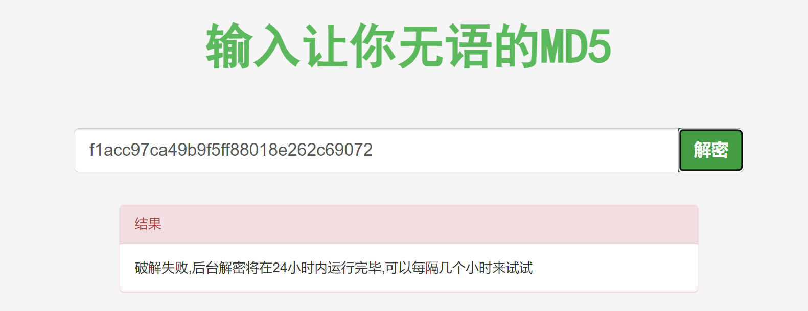
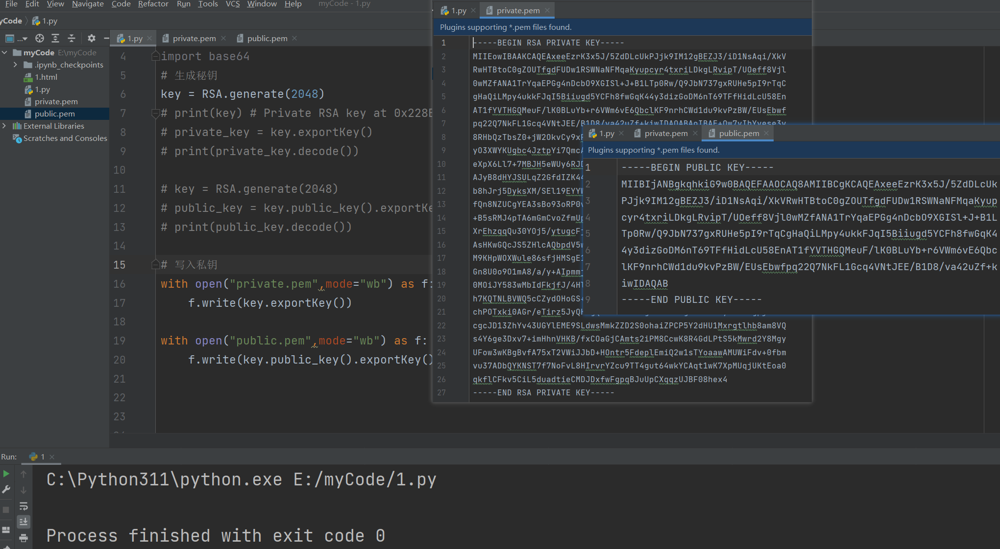

## 1，一切从MD5开始

明文：没有加密之前的消息叫明文


密文：加密后的文件叫密文


MD5是一个非常常见的摘要(hash)算法.. 其特点就是小巧. 速度快. 极难被破解(王小云女士). 所以, md5依然是国内非常多的互联网公司选择的密码摘要算法.

1. 这玩意不可逆. 所以. 摘要算法就不是一个加密逻辑.
2. 相同的内容计算出来的摘要应该是一样的，只要内容不一样，摘要出来的东西也不一样
3. 不同的内容(哪怕是一丢丢不一样) 计算出来的结果差别非常大


有一篇文章，大概有2000个字，从这篇文章中摘出来20个字代表这一篇文章。不能反着来，你根据这20个字，你是不能推出这一篇文章的。这个过程叫不可逆。至于MD5是如何摘要的，不要管。


摘要算法就是我们常说的散列函数、哈希函数（Hash Function），它能够把任意长度的数据“压缩”成固定长度、而且独一无二的“摘要”字符串，就好像是给这段数据生成了一个数字“指纹”。


**特点：**

- 不可逆：只有算法，没有秘钥，只能加密，不能解密
- 难题友好性：想要破解，只能暴力枚举
- 发散性：只要对原文进行一点点改动，摘要就会发生剧烈变化抗
- 碰撞性：原文不同，计算后的摘要也要不同


**常见算法：**

- MD5
- SHA1
- SHA256
- SHA512


使用python初识MD5：

```python
# hashlib是python标准库中支持各种hash计算的一个模块
from hashlib import md5

# 创建一个md5对象，把你要计算的东西传递给obj
obj = md5()
# "你吃饭了吗？" 是一个字符串，要求计算的内容必须是字节
obj.update("你吃饭了吗？".encode("utf-8"))

# 提取md5值  密文件
md5_val = obj.hexdigest()
print(md5_val) # 9bdc0941f37069c9a7fc34ff6a2b5296
```


使用md5时，上面的obj是一次性的，如下：

```python
# hashlib是python标准库中支持各种hash计算的一个模块
from hashlib import md5

# 创建一个md5对象，把你要计算的东西传递给obj
obj = md5()
# "你吃饭了吗？" 是一个字符串，要求计算的内容必须是字节
obj.update("你吃饭了吗？".encode("utf-8"))

# 提取md5值  密文件
md5_val = obj.hexdigest()
print(md5_val) # 9bdc0941f37069c9a7fc34ff6a2b5296

obj = md5() # md5计算时，obj是一次性的，多次使用，会产生叠加的效果，要避免
obj.update("你吃饭了吗？".encode("utf-8"))
print(obj.hexdigest()) # ab035e3a0a518b366af927d421ab5731  9bdc0941f37069c9a7fc34ff6a2b5296

# obj = md5()
# obj.update("你吃饭了吗？你吃饭了吗？".encode("utf-8"))
# print(obj.hexdigest())  # ab035e3a0a518b366af927d421ab5731
```


虽然md5是不可逆的，但是可以撞库破解：


我们把密文丢到网页里. 发现有些网站可以直接解密. 但其实不然. 这里并不是直接解密MD5. 而是"撞库"。就是它网站里存储了大量的MD5的值. 就像这样:


而需要进行查询的时候. 只需要一条select语句就可以查询到了. 这就是传说中的撞库。


比较123456的密文就可以通过撞库进行破解，如下：


如何避免撞库: md5在进行计算的时候可以加盐. 加盐之后. 就很难撞库了. 加盐演示：

```python
from hashlib import md5

# abc就是盐
# obj = md5(b'abc')
# obj.update("123456".encode("utf-8"))
# print(obj.hexdigest())  # 0659c7992e268962384eb17fafe88364

# 加盐的本质就是在源数据前面增加一些东西
# 明文：123456  加了盐：abc123456
obj = md5()
# obj.update(b"abc"+"123456".encode("utf-8"))
obj.update(b"asdgasdgasd2t2346gsdfgsdr"+"123456".encode("utf-8"))
print(obj.hexdigest())  # 0659c7992e268962384eb17fafe88364 f1acc97ca49b9f5ff88018e262c69072
```




## 2，sha系列

sha系列也属于摘要算法。不论是sha1, sha256, md5都属于摘要算法. 都是在计算hash值. 只是散列的程度不同而已. 这种算法有一个特性. 他们是散列. 不是加密. 而且, 由于hash算法是不可逆的, 所以不存在解密的逻辑.


摘要算法摘要出来的长度是不一样的：

- md5     32位     123456=>e10adc
- sha1     40位     123456=>7c
- sha256   64位
- sha512   128位


演示sha系统算法：

```python
from hashlib import md5, sha1, sha256, sha512

# obj = sha1();  #7c4a8d09ca3762af61e59520943dc26494f8941b
# obj = sha256();  #8d969eef6ecad3c29a3a629280e686cf0c3f5d5a86aff3ca12020c923adc6c92
obj = sha512();  #ba3253876aed6bc22d4a6ff53d8406c6ad864195ed144ab5c87621b6c233b548baeae6956df346ec8c17f5ea10f35ee3cbc514797ed7ddd3145464e2a0bab413
obj.update("123456".encode())
print(obj.hexdigest())  # 7c4a8d09ca3762af61e59520943dc26494f8941b
```


看一个网站：https://1024tools.com/hash


## 3，URLencode编码

### 1，什么是URL

一个url如下：

```
https://yujingbo1023.github.io/javablog/public/assets/img/1718853299072.eef915f3.png

https://yujingbo1023.github.io/javablog/public/blogs/javabase/01.html#_1-java%E5%8E%86%E5%8F%B2-%E4%BA%86%E8%A7%A3

https://www.baidu.com/
```


一个完整的URL是有固定格式的：

```
协议://域名:端口/虚拟路径/虚拟路径/资源?参数名=参数值&参数名=参数值#锚点
```


分析：

- 协议：规则，是客户端与服务器进行交流的规则
- 域名：IP地址，有了IP可以找到哪一台服务器
- 端口：服务器上，可以安装非常多的应用程序，不同的应用程序监听不同的端口，有了端口，才知道你访问的是哪一个应用程序。如果是http协议，那么端口默认是80。如果是https，那么端口默认是443。


```
https://www.baidu.com:443/

使用https协议，给百度的服务器上的某个应用程序发送一个请求。这个应用程序需要监听443端口。
```


比如malu买了一台服务器，在服务器上放很多的电影，别人访问之：

```
协议://域名:端口   此时就可以访问到malu的服务器上的某个应用程序了。

协议://域名:端口/动作电影/2024/制爆.html    这样就意味着所有人都可以访问电影了
```


给服务器传递参数：

```
协议://域名:端口/动作电影/2024/制爆.html?username=wc&pwd=123456#评论
```


如果传递的用户名是：`wc&1=1`

```
协议://域名:端口/动作电影/2024/制爆.html?username=wc&1=1&pwd=123456#评论
```


再看一个url：

```
https://www.sogou.com/web?query=%E5%90%83%E9%A5%AD%E7%9D%A1%E8%A7%89%E6%89%93%E8%B1%86%E8%B1%86&_asf=www.sogou.com&_ast=&w=01019900&p=40040100&ie=utf8&from=index-nologin&s_from=index&sut=3119&sst0=1630994614300&lkt=0%2C0%2C0&sugsuv=1606978591882752&sugtime=1630994614300
```

此时会发现, 在浏览器上明明是能看到中文的. 但是一旦复制出来. 或者在抓包工具里看到的. 都是这种%. 那么这个%是什么鬼? 也是加密么?

非也, 其实我们在访问一个url的时候. 浏览器会自动的进行urlencode操作. 会对我们请求的url进行编码. 这种编码规则被称为百分号编码. 是专门为url(统一资源定位符)准备的一套编码规则.


### 2，url编码与解码

在url中，有些符号需要单独处理，不能作为参数，浏览器会自动把参数中的内容，进行urlencode计算。在计算时，会把特殊符号(中文)进行转义。转义成%两位的十六进制数字 (%XX)表示一个字节。如果是英文的字符，1个字符是占用一个字节，一个中文的字符占几个字节，取决于它的编码，如果是gbk编码，占2个字节，如果是utf-8编码占3个字节。写代码演示：

```python
from urllib.parse import urlencode

params = {
    # "username":"wc&1=1"  # username=wc%261%3D1
    "username":"于老师"  # username=%E4%BA%8E%E8%80%81%E5%B8%88
}
print(urlencode(params))
```


url会进行编码：

```
https://yujingbo1023.github.io/javablog/public/blogs/javabase/01.html#_3-%E5%8F%98%E9%87%8F
```


除了urlencode进行编码之外，还可以使用quote进行编码：

```python
from urllib.parse import urlencode,quote,unquote

# urlencode:  username=%E4%BA%8E%E8%80%81%E5%B8%88
# quote:               %E4%BA%8E%E8%80%81%E5%B8%88
print(quote("于老师"))

s = "%E4%BA%8E%E8%80%81%E5%B8%88"
print(unquote(s)) # 于老师
```


参考：

```python
from urllib.parse import urlencode, unquote, quote

# 单独编码字符串
wq = "米饭怎么吃"
print(quote(wq))  # %E7%B1%B3%E9%A5%AD%E6%80%8E%E4%B9%88%E5%90%83
print(quote(wq, encoding="gbk")) # %C3%D7%B7%B9%D4%F5%C3%B4%B3%D4

# 多个数据统一进行编码
dic = {
    "wq": "米饭怎么吃",
    "new_wq": "想怎么吃就怎么吃"
}

print(urlencode(dic))  # wq=%E7%B1%B3%E9%A5%AD%E6%80%8E%E4%B9%88%E5%90%83&new_wq=%E6%83%B3%E6%80%8E%E4%B9%88%E5%90%83%E5%B0%B1%E6%80%8E%E4%B9%88%E5%90%83
print(urlencode(dic, encoding="utf-8"))  # 也可以指定字符集

# 一个完整的url编码过程
base_url = "http://www.baidu.com/s?"
params = {
    "wd": "大王"
}

url = base_url + urlencode(params)
print(url)  # http://www.baidu.com/s?wd=%E5%A4%A7%E7%8E%8B
```


解码：

```python
s = "http://www.baidu.com/s?wd=%E5%A4%A7%E7%8E%8B"
print(unquote(s))  # http://www.baidu.com/s?wd=大王
```


参考网站：https://ctool.dev/tool.html#/tool/url/encoder


## 4， Base64编码

计算机底动存储的都是二进制数据，如: “程序开发常用工具”，这个数据也是需要转化成二进制数据进行存储的。如果想对这个数据进行加密，加密后，它就是一个密文了：“432562346324623463456"。加密之后得到的肯定是一堆乱七八糟的东西。432562346324623463456 =>转化成二进制=>0001010001010000010010010010101。需要每8位分成一个小组，每一个小组就是一个分节：00001010    00101000     00100100   10010101。


得到二进制数据后，进行网络传输时，直接发送字节，非常恶心。能不能把字节转化成字符串，直接传递字符串就非常方便了，现在说的base64就是把字节转化成字符串的编码规则。规则是：把字节处理成二进制, 进行六个01组合成一个新的字节. 把新的字节处理成十进制.然后去数组中进行映射。


总结：

- base64其实很容易理解. 通常被加密后的内容是字节. 而我们的密文是用来传输的(不传输谁加密啊). 但是, 在http协议里想要传输字节是很麻烦的一个事儿. 相对应的. 如果传递的是字符串就好控制的多. 此时base64就应运而生了. 26个大写字母+26个小写字母+10个数字+2个特殊符号(+和/)组成了一组类似64进制的计算逻辑. 这就是base64了.


有如下的数据，下面是编码的原理（了解就可以了）：

```python
s = b"abc";
# a  97  01100001
# b  98  01100010
# c  99  01100011

# 正常字节
# 01100001 01100010 01100011     
# b64转化
# 00011000  00010110  00001001  00100011
#   24         22       9          35
# arr = "ABCDEFGHIJKLMNOPQRSTUVWXYZabcdefghijklmnopqrstuvwxyz0123456789+/";  # 64位

arr = "ABCDEFGHIJKLMNOPQRSTUVWXYZabcdefghijklmnopqrstuvwxyz0123456789+/";
print(arr[24]+arr[22]+arr[9]+arr[35]) # YWJj
```

验证：


上面的就是base64的编码逻辑，不论多么复杂的字节，都可以转化成base64字符串，方便数据传输和传递。


使用python代码演示：

```python
# 标准库
import base64

# b = b'abc'
# 把字节转化成base64
# r = base64.b64encode(b)  # b'YWJj'
# 再处理成字符串
# r = base64.b64encode(b).decode() # YWJj
# print(r)

s = "YWJj"
# 把base64的字符串处理成字节
bs = base64.b64decode(s)
print(bs)  # b'abc'
```


总结：

- 把字节转化成base64字节串： base64.b64encode(b).decode()
- 把base64字节串转化成字节： base64.b64decode(s)


b64处理后的字符串长度. 一定是4的倍数. 如果在网页上看到有些密文的b64长度不是4的倍数. 会报错。

```python
import base64

s = "ztKwrsTj0b0"
bb = base64.b64decode(s)
print(bb)


此时运行出现以下问题
C:\Python311\python.exe E:/myCode/1.py
Traceback (most recent call last):
  File "E:\myCode\1.py", line 7, in <module>
    bb = base64.b64decode(s)
         ^^^^^^^^^^^^^^^^^^^
  File "C:\Python311\Lib\base64.py", line 88, in b64decode
    return binascii.a2b_base64(s, strict_mode=validate)
           ^^^^^^^^^^^^^^^^^^^^^^^^^^^^^^^^^^^^^^^^^^^^
binascii.Error: Incorrect padding

```


解决思路. base64长度要求. 字符串长度必须是4的倍数. 填充一下即可


```python
import base64

s = "ztKwrsTj0b0"
s += ("=" * (4 - len(s) % 4))
print("填充后", s)
bb = base64.b64decode(s).decode("gbk")
print(bb)

运行：
填充后 ztKwrsTj0b0=
我爱你呀
```


你在电脑上见的所有东西，在计算机底层都是字节，都是可以转化成数字。base64是把字节转化成了字符串，还可以把字节转化成数字：

```python
# 10进制  0123456789   10
# 8进制   01234567   10
# 2进制   01     10
# 16进制  0123456789abcdef    f     10


s = "于老师".encode("utf-8")
print(s)  # b'\xe4\xba\x8e\xe8\x80\x81\xe5\xb8\x88'  这就是一个个的字节
# e4 ba 8e e8 80 81 e5 b8 88
# 字节不仅可以转化成base64字符串，还可以转化成16进制的字符串（每一个字节，都会单独处理成一个两位的16进制的数字）
```


有一个包，转门把字节转化成16进制数字，如下：

```python
s = "于老师".encode("utf-8")  # 把字符串转化成字节
# print(s)  # b'\xe4\xba\x8e\xe8\x80\x81\xe5\xb8\x88'

import binascii

# b 字节
# 2 two  to
# a  ascii
# 把字节转化成16进制的数字
r = binascii.b2a_hex(s).decode()
print(r)  # e4ba8ee88081e5b888

# 把16进制的数字转化成字节
s = "e4ba8ee88081e5b888"
bs = binascii.a2b_hex(s)
print(bs.decode("utf-8"))  # 于老师
```


同样一个字符串，因为一个字符串，是可以转化字节的，可以把字节转化成base64字符串，也可以把字节转化成16进制的字符串。如下：

```python
# 标准库
import base64

s = "于老师".encode("utf-8")  # 把字符串转化成字节
print(s)  # b'\xe4\xba\x8e\xe8\x80\x81\xe5\xb8\x88'

bs = b'\xe4\xba\x8e\xe8\x80\x81\xe5\xb8\x88'
r = base64.b64encode(bs).decode()
print(r)  # 如果转成base64字符串： 5LqO6ICB5biI
# 如果转化16进制字符串：# e4ba8ee88081e5b888
```


注意：

```
由于标准的Base64编码后可能出现字符+和/，但是这两个字符在URL中就不能当做参数传递，所以就出现了Base64URL，下面是它们的区别：

1. Base64编码后出现的+和/在Base64URL会分别替换为-和_
2. Base64编码中末尾出现的=符号用于补位，这个字符和queryString中的key=value键值对会发生冲突，所以在Base64URL中=符号会被省略，去掉=后怎么解码呢？因为Base64是把3个字节变为4个字节，所以，Base64编码的长度永远是4的倍数，因此，需要加上=把Base64字符串的长度变为4的倍数，就可以正常解码了。

我们的应对方案:
在处理base64的时候.如果遇到了没有+和/的情况. 可以采用下面的方案来替换掉+和/
b64 = base64.b64decode(mi, b"-_")
```


演示一下：

```python
import base64

# s = b'When I see the TV series,the image of good person is to keep silence all the time,so that they won t get into the trouble or cause problem'
s = "在学习、工作乃至生活中，大家都写过作文，肯定对各类作文都很熟悉吧，借助作文可以提高我们的语言组织能力。你所见过的作文是什么样的呢？下面是小编为大家收集的英文作文，仅供参考，大家一起来看看吧。"
bs = base64.b64encode(s.encode())
# bs = base64.b64encode(s)
# print(bs) # b'YWJj'
# print(bs.decode()) # V2hlbiBJIHNlZSB0aGUgVFYgc2VyaWVzLHRoZSBpbWFnZSBvZiBnb29kIHBlcnNvbiBpcyB0byBrZWVwIHNpbGVuY2UgYWxsIHRoZSB0aW1lLHNvIHRoYXQgdGhleSB3b24gdCBnZXQgaW50byB0aGUgdHJvdWJsZSBvciBjYXVzZSBwcm9ibGVt==

s1 = '5Zyo5a2m5Lmg44CB5bel5L2c5LmD6Iez55Sf5rS75Lit77yM5aSn5a626YO95YaZ6L+H5L2c5paH77yM6IKv5a6a5a+55ZCE57G75L2c5paH6YO95b6I54af5oKJ5ZCn77yM5YCf5Yqp5L2c5paH5Y+v5Lul5o+Q6auY5oiR5Lus55qE6K+t6KiA57uE57uH6IO95Yqb44CC5L2g5omA6KeB6L+H55qE5L2c5paH5piv5LuA5LmI5qC355qE5ZGi77yf5LiL6Z2i5piv5bCP57yW5Li65aSn5a625pS26ZuG55qE6Iux5paH5L2c5paH77yM5LuF5L6b5Y+C6ICD77yM5aSn5a625LiA6LW35p2l55yL55yL5ZCn44CC'
s2 = s1.replace("+","-").replace("/","_")  # 自己手动替换
s3 = base64.b64decode(s2, b"-_")
print(s3.decode())

# base 64组成： A-Z a-z 0-9 + / =
```


## 5，对称加密


### 1，AES

所谓对称加密就是加密和解密用的是同一个秘钥. 就好比. 我要给你邮寄一个箱子. 上面怼上锁. 提前我把钥匙给了你一把, 我一把. 那么我在邮寄之前就可以把箱子锁上. 然后快递到你那里. 你用相同的钥匙就可以打开这个箱子. 条件: 加密和解密用的是同一个秘钥. 那么两边就必须同时拥有钥匙才可以. 


常见的对称加密:

- AES
- DES（DES加密算法规定，密钥key必须是8个字节，key="12345678"）
- 3DES


特点：

- 加密速度快，可以加密大文件
- 密文可逆，一旦密钥泄露，就会导致数据暴露
- 加密后编码表找不到对应的字符，出现乱码
- 一般结合Base64使用


测试网站：https://the-x.cn/cryptography/Aes.aspx


AES加密：

```python
from Crypto.Cipher import AES
from Crypto.Util.Padding import pad
import base64
import binascii

ming = "你还爱我吗？"

# 创建一个加密器
  # key, 秘钥, 长度必须是16(最常用), 24, 32位的字节.
  # mode，加密的模式
    # CBC,  需要iv 的
    # ECB,  可以没有iv
aes = AES.new(key=b'1234567890abcdef', mode=AES.MODE_CBC, iv=b'1234567890abcdef')

# 开始加密  加密之前需要对数据进行填充
# print(ming.encode("utf-8"))  # b'\xe4\xbd\xa0\xe8\xbf\x98\xe7\x88\xb1\xe6\x88\x91\xe5\x90\x97\xef\xbc\x9f'
# print(pad(ming.encode("utf-8"),16))  # b'\xe4\xbd\xa0\xe8\xbf\x98\xe7\x88\xb1\xe6\x88\x91\xe5\x90\x97\xef\xbc\x9f'
data = pad(ming.encode("utf-8"),16);
result = aes.encrypt(data)
# 加密之后，也是一堆的字节, 杂乱无章的字节. 是乱序的. 是无法识别的, 不能decode
# print(result);  # b'\x8b\xb9\x15m\x049\x87\xfc\xf1.)ly\xb7\xf9\x92\x90\xfb\xbf"4Z\xee\x92\x05\xdd\xdc\xd5\x8d\x81\xb5d'

# 加密后，需要传输，可以转化成base64
# base64:i7kVbQQ5h/zxLilsebf5kpD7vyI0Wu6SBd3c1Y2BtWQ=
print(base64.b64encode(result).decode())
# 8bb9156d043987fcf12e296c79b7f99290fbbf22345aee9205dddcd58d81b564
print(binascii.b2a_hex(result).decode())

# print(result.decode("utf-8"))
```


MODE 加密模式，常见的ECB, CBC：

- ECB：是一种基础的加密方式，密文被分割成分组长度相等的块（不足补齐），然后单独一个个加密，一个个输出组成密文。
- CBC：是一种循环模式，前一个分组的密文和当前分组的明文异或或操作后再加密，这样做的目的是增强破解难度。
-  CFB/OFB：实际上是一种反馈模式，目的也是增强破解的难度。
- FCB和CBC的加密结果是不一样的，两者的模式不同，而且CBC会在第一个密码块运算时加入一个初始化向量。


AES解密：

```python
# base64:i7kVbQQ5h/zxLilsebf5kpD7vyI0Wu6SBd3c1Y2BtWQ=
# hex:8bb9156d043987fcf12e296c79b7f99290fbbf22345aee9205dddcd58d81b564

mi = "i7kVbQQ5h/zxLilsebf5kpD7vyI0Wu6SBd3c1Y2BtWQ="

# 创建解密器材
aes = AES.new(key=b'1234567890abcdef', mode=AES.MODE_CBC, iv=b'1234567890abcdef')

# 先解码，得到一堆的破字节
# print(base64.b64decode(mi)) # b'\x8b\xb9\x15m\x049\x87\xfc\xf1.)ly\xb7\xf9\x92\x90\xfb\xbf"4Z\xee\x92\x05\xdd\xdc\xd5\x8d\x81\xb5d'

# 把密文处理成字节(看好, 是b64还是hex)
data = base64.b64decode(mi)

# 解密
r = aes.decrypt(data)

# 去掉填充
r = unpad(r, 16)

# 还原成字符串.
print(r.decode("utf-8"))

# 开始解密
# print(unpad(aes.decrypt(base64.b64decode(mi)),16).decode("utf-8")) # 你还爱我吗？
```


### 2，DES


DES加密：

```python
from Crypto.Cipher import AES, DES
from Crypto.Util.Padding import pad, unpad
import base64
import binascii

ming = "你还爱我吗？"

# 创建一个加密器  DES的key是8个字节
des = DES.new(key=b'12345678', mode=AES.MODE_CBC, iv=b'abcdefgh')

r = des.encrypt(pad(ming.encode("utf-8"),8))
print(r) # b'\xd9\x07\xe9\xfc\x90T.\x85\xb4\xbeq\xb4\x9a\x96\xac\xdd\xa1\xbaf=F,\xb6v'
r = base64.b64encode(r)
print(r) # b'2Qfp/JBULoW0vnG0mpas3aG6Zj1GLLZ2'
print(r.decode()) # 2Qfp/JBULoW0vnG0mpas3aG6Zj1GLLZ2
```


DES解密：

```python
from Crypto.Cipher import AES, DES
from Crypto.Util.Padding import pad, unpad
import base64

mi = "2Qfp/JBULoW0vnG0mpas3aG6Zj1GLLZ2"

# 创建解密器
des = DES.new(key=b'12345678', mode=AES.MODE_CBC, iv=b'abcdefgh')

# 把密文处理成字节(看好, 是b64还是hex)
data = base64.b64decode(mi)

# 解密
r = des.decrypt(data)

# 去掉填充
r = unpad(r, 8)

# 还原成字符串.
print(r.decode("utf-8")) # 你还爱我吗？
```


## 6，非对称加密

非对称加密. 加密和解密的秘钥不是同一个秘钥. 这里需要两把钥匙. 一个公钥, 一个私钥.  公钥发送给客户端. 发送端用公钥对数据进行加密. 再发送给接收端, 接收端使用私钥来对数据解密. 由于私钥只存放在接受端这边. 所以即使数据被截获了. 也是无法进行解密的. 


总结：

- 非对称加密指的是：加密和解密使用不同的秘钥，一把作为公开的公钥，另一把作为私钥。公钥加密的信息，只有私钥才能解密。私钥加密的信息，只有公钥才能解密。


非对称加密算法:

- RSA（最常见的一种加密方案）
- ECC
- DSA


特点:

- 加密和解密使用不同的密钥
- 如果使用私钥加密, 只能使用公钥解密
- 如果使用公钥加密, 只能使用私钥解密
- 处理数据的速度较慢, 因为安全级别高


### 1，RSA创建公钥和私钥


直接上代码：


```python
from Crypto.PublicKey import RSA
import base64
# 生成秘钥
# key = RSA.generate(2048)
# print(key) # Private RSA key at 0x228B2E2EA90
# private_key = key.exportKey()
# print(private_key.decode())

key = RSA.generate(2048)
public_key = key.public_key().exportKey()
print(public_key.decode())
```


把公钥和私钥放到文件中，如下：



```python
from Crypto.PublicKey import RSA
import base64
# 生成秘钥
key = RSA.generate(2048)
# print(key) # Private RSA key at 0x228B2E2EA90
# private_key = key.exportKey()
# print(private_key.decode())

# key = RSA.generate(2048)
# public_key = key.public_key().exportKey()
# print(public_key.decode())

# 写入私钥
with open("private.pem",mode="wb") as f:
    f.write(key.exportKey())

with open("public.pem",mode="wb") as f:
    f.write(key.public_key().exportKey())
```


### 2，加密

使用公钥进行加密，把加密后的密文，传输给服务器，服务器使用私钥进行解密。加密如下：

```python
from Crypto.PublicKey import RSA  # 管理秘钥的
from Crypto.Cipher import PKCS1_v1_5  # 用来加密的
import base64

# 读取公钥
pub_key = RSA.import_key(open("public.pem", mode="rb").read())
# print(pub_key)
# 创建加密器
rsa = PKCS1_v1_5.new(key=pub_key)
# 开始加密
s = "你还爱我吗？".encode("utf-8")
bs = rsa.encrypt(s)
# 你加密后的也是一堆杂乱无章的字节
# print(bs) # b'\x93\x16\xbc\x10\x95R\x9a\x171\xc8X\x11/\x12\x84\xe5\\h]\x82xj&{q\xb2\x9a\xf7(R-+\xd7Ou\t\xed\x82da4\xa4\x
# 每次进行，得到的密文都是不一样的
print(base64.b64encode(bs).decode()) # GQoteQAhbkkp7KFnnD+9oYNvze+cVaaiP6UtYaXg3u3KdfOIo2Z6A/XVTtcdSMcNbU
```


### 3，解密

直接上代码：

```python
mi = 'bbCYNXSbNAJiuwaJiraDl2kGHMI4/dkLlhQrjp8vKMQ9Cog1tizvzAiVECtkzTjYmG3oxPBhf4IFgTr/NiqWTEv4PmsaKTILXyyOvklxzgD/2HfpHmLmNyp7K6R6Q3CLtnUJjIudU4KEwt4O8UzoEIQDDwpn2iU+K8v6rXMHGWNqhKWtGkiq7qeRHX9AasiRtxxZJMN5Xup0+f7VF6MMf1vYMt6AuhXERpTPZ305X9uUHxFn90CwTfOiDFQMAZBNXQZYOlcUjfp1CA+ETGrCGYrsSiZGSuo233dgg6PZyT5GxHAN5MDUx+iDHlJw3QhiULxbEttdzdqF8+M/zNRLBg=='
from Crypto.PublicKey import RSA  # 管理秘钥的
from Crypto.Cipher import PKCS1_v1_5  # 用来加密的
import base64

# 加载么钥
private_key = RSA.import_key(open("private.pem", mode="rb").read())
# 创建解密器
rsa = PKCS1_v1_5.new(key=private_key)
# 解密
result = rsa.decrypt(base64.b64decode(mi),"解密失败~")
print(result.decode("utf-8"))  # 你还爱我吗？
```


## 7，数字签名


**数字签名是什么：**

数字签名（又称公钥数字签名）是只有信息的发送者才能产生的别人无法伪造的一段数字串，这段数字串同时也是对信息的发送者发送信息真实性的一个有效证明。数字签名是非对称密钥加密技术与数字摘要技术的应用。


**生活中的数据签名：**

相信我们都写过信，在写信的时候落款处总是要留下自己的名字，用来表示写信的人是谁。我们签的这个字就是生活中的签名。


**注意:**

在网络中传输数据时候，给数据添加一个数字签名，表示是谁发的数据，而且还能证明数据没有被篡改。OK，数字签名的主要作用就是保证了数据的有效性（验证是谁发的）和完整性（证明信息没有被篡改）。


**基本原理：**


张三有两把钥匙，一把是公钥，另一把是私钥。张三把公钥送给他的朋友们----铁蛋、幺妹、李四----每人一把。


幺妹要给张三写一封保密的信。她写完后用张三的公钥加密，就可以达到保密的效果。


张三收信后，用私钥解密，就看到了信件内容。这里要强调的是，只要张三的私钥不泄露，这封信就是安全的，即使落在别人手里，也无法解密。


张三给幺妹回信，决定采用"数字签名"。他写完后先用Hash函数，生成信件的摘要（digest）。


张三使用私钥，对这个摘要加密，生成"数字签名"（signature）。幺妹收信后，取下数字签名，用张三的公钥解密，得到信件的摘要。由此证明，这封信确实是张三发出的。幺妹再对信件本身使用Hash函数，将得到的结果，与上一步得到的摘要进行对比。如果两者一致，就证明这封信未被修改过。


## 8，数字证书

**数字证书解决公钥不信任问题**

**为什么需要数字证书：**

复杂的情况出现了。李四想欺骗幺妹，他偷偷使用了幺妹的电脑，用自己的公钥换走了张三的公钥。此时，幺妹实际拥有的是李四的公钥，但是还以为这是张三的公钥。因此，李四就可以冒充张三，用自己的私钥做成"数字签名"，写信给幺妹，让幺妹用假的张三公钥进行解密。


后来，幺妹感觉不对劲，发现自己无法确定公钥是否真的属于张三。她想到了一个办法，要求张三去找"证书中心"（certificate authority，简称CA），为公钥做认证。证书中心用自己的私钥，对张三的公钥和一些相关信息一起加密，生成"数字证书"（Digital Certificate）。


**理解数据证书：**

比如说我们的毕业证书，任何公司都会承认。为什么会承认？因为那是国家发得，大家都信任国家。也就是说只要是国家的认证机构，我们都信任它是合法的。


**原理：**

为了解决公钥的信任问题，张三和幺妹找一家认证公司（CA *Ca*tificate Authority），把公钥进行认证，证书中心用自己的私钥，对A的公钥和一些相关信息一起加密，生成“**数字证书**”（Digital Certificate）


幺妹如果获取到证书，证书可以用CA的公钥（认证中心信用背书）进行解密，会得到发公钥人的信息，以及他的公钥，此时这个A的公钥是可信的。


所以张三给幺妹发送信息的时候，就会带上签名，和证书一并发送给到互联网上，幺妹接收到消息的时候，先用CA发布的公钥解密数字证书，得到张三的公钥，用张三的公钥解密签名，得到摘要，幺妹在用hash算法得到消息的摘要，对两个摘要对比，如果相等，说明消息在网络上没有被不法分子修改。

