## 一，分支结构

### 1，if和switch语句

流程控制一般分为3种：

* 顺序结构
* 分支结构
* 循环结构

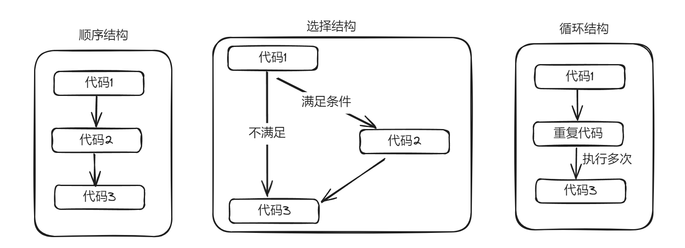


对于if分支结构，和JS是一样的。参考代码：

```java
int score = 298;
if(score >= 0 && score < 60) {
    System.out.println("您的绩效级别是： D");
}else if(score >= 60 && score < 80){
    System.out.println("您的绩效级别是： C");
}else if(score >= 80 && score < 90){
    System.out.println("您的绩效级别是： B");
}else if(score >= 90 && score <= 100){
    System.out.println("您的绩效级别是： A");
}else {
    System.out.println("您录入的分数有毛病~~");
}
```


注意：

- 如果 if 语句不写{}，则只能作用于后面的第一条语句。
- 强烈建议，任何时候都写上{}，即使里面只有一句话！


if实现**掷骰子游戏**

```java
public class Test1 {
	public static void main(String[ ] args) {
        //通过掷三个骰子看看今天的手气如何？
        int i = (int)(6 * Math.random()) + 1;//通过 Math.random()产生随机数
        int j = (int)(6 * Math.random()) + 1;
        int k = (int)(6 * Math.random()) + 1;
        int count = i + j + k;
        //如果三个骰子之和大于 15，则手气不错
        if(count > 15) {
        	System.out.println("今天手气不错");
        }
        //如果三个骰子之和在 10 到 15 之间，则手气一般
        if(count >= 10 && count <= 15) { //错误写法：10<=count<=15
        	System.out.println("今天手气很一般");
        }
        //如果三个骰子之和小于 10，则手气不怎么样
        if(count < 10) {
        	System.out.println("今天手气不怎么样");
        }
   		System.out.println("得了" + count + "分");
    }
}
```


注意：

- Math.random()该方法用于产生 0 到 1 区间的 double 类型的随机数，但是不包括 1。int i = (int) (6 * Math.*random*()); //产生：[0，5]之间的随机整数


switch分支和JS也是一样的，switch小括号中的表达式类型可以是byte、short、int、char、枚举、String。不支持double、float。case后面的值，只能是字面量不能是变量。

参考代码：

```java
String week = "周三";
switch (week){
    case "周一":
        System.out.println("埋头苦干，解决bug");
        break;
    case "周二":
        System.out.println("请求大牛程序员帮忙");
        break;
    case "周三":
        System.out.println("今晚啤酒、龙虾、小烧烤");
        break;
    case "周四":
        System.out.println("主动帮助新来的女程序解决bug");
        break;
    case "周五":
        System.out.println("今晚吃鸡");
        break;
    case "周六":
        System.out.println("与王婆介绍的小芳相亲");
        break;
    case "周日":
        System.out.println("郁郁寡欢、准备上班");
        break;
    default:
        System.out.println("您输入的星期信息不存在~~~");
}
```


注意：

- switch 会根据表达式的值从相匹配的 case 标签处开始执行，一直执行到 break 处或者是 switch 的末尾。如果表达式的值与任一 case 值不匹配，则进入 default 语句。 
- switch 中表达式的值，是 int(byte、short、char 也可，long 不行)、枚举，字符串。


### 2，写一些小案例

请输入用户名，如果用户名是malu，控制台提示欢迎malu，否提示你输入的用户名不正确，如下：

```java
package com.malu.hello;

import java.util.Scanner;

public class HelloWorld {
    public static void main(String[] args) {
        Scanner sc = new Scanner(System.in);
        String name = sc.next(); // next() 表示输入字符串
        System.out.println(name == "malu");
        System.out.println(name.equals("malu"));
        if(name.equals("malu")){
            System.out.println("欢迎访问XXX系统");
        }else{
            System.out.println("你输入的用户名不正确，请重新输入~");
        }
    }
}
```

提示用户输入用户名和密码，用户名等于"admin"且密码等于"123"就输出登录成功；否则输出登录失败。

```java
package com.malu.hello;

import java.util.Scanner;

public class HelloWorld {
    public static void main(String[] args) {
        // 提示用户输入用户名和密码，用户名等于"admin"且密码等于"123"就输出登录成功；否则输出登录失败。
        Scanner sc = new Scanner(System.in);
        System.out.println("请输入用户名：");
        String name = sc.next(); // next() 表示输入字符串

        System.out.println("请输入密码：");
        String pwd = sc.next(); // next() 表示输入字符串

        if(name.equals("admin") && pwd.equals("123")){
            System.out.println("登录成功");
        }else{
            System.out.println("登录失败");
        }
    }
}
```

接收用户输入的数据，判断这个数据是偶数还是奇数，如果是偶数，输出yes，如果是奇数，输出no

```java
package com.malu.hello;

import java.util.Scanner;

public class HelloWorld {
    public static void main(String[] args) {
        //接收用户输入的数据，判断这个数据是偶数还是奇数，如果是偶数，输出yes，如果是奇数，输出no
        Scanner sc = new Scanner(System.in);
        System.out.println("请输入一个数字：");
        int count = sc.nextInt();

        // 如果是字符串，== 判断不行，如果是数字，== 判断是可以的
        if(count % 2 == 0){
            System.out.println("yes");
        }else{
            System.out.println("no");
        }
    }
}
```

接收用户输入的1~12的数据，判断是什么季节后输出

```java
package com.malu.hello;

import java.util.Scanner;

public class HelloWorld {
    public static void main(String[] args) {
        // 接收用户输入的1~12的数据，判断是什么季节后输出
        Scanner sc = new Scanner(System.in);
        System.out.println("请输入一个数字：");
        int num = sc.nextInt();

        if(3 == num || 4 == num || 5 == num){
            System.out.println("chun");
        }else if(6 == num || 7 == num || 8 == num){
            System.out.println("xia");
        }else if(9 == num || 10 == num || 11 == num){
            System.out.println("qiu");
        }else if(12 == num || 1 == num || 2 == num){
            System.out.println("dong");
        }else {
            System.out.println("你输入的数据不符合要求");
        }
    }
}
```

判断一个年份是否是闰年（闰年：能被4整除，不能整除100为闰年 或者 能被400整除 就是闰年。）

```java
package com.malu.hello;

import java.util.Scanner;

public class HelloWorld {
    public static void main(String[] args) {
        // 判断一个年份是否是闰年（闰年：能被4整除，不能整除100为闰年 或者 能被400整除 就是闰年。）
        Scanner sc = new Scanner(System.in);
        System.out.println("请输入一个年份：");
        int year = sc.nextInt();

        if(((year % 4 == 0) && (year % 100 != 0)) || (year % 400 == 0)){
            System.out.println(year+"是润年");
        }else{
            System.out.println(year+"是平年");
        }
    }
}
```

if和switch选择：

* if 分支 的功能是更加强大的，switch分支能做的事情if 分支都能做
* 如果是对一个范围进行判断，建议使用if分支结构
* 如果是与一个一个的值比较的时候，建议使用switch分支结构


练习（把下面的python代码翻译成java代码）：

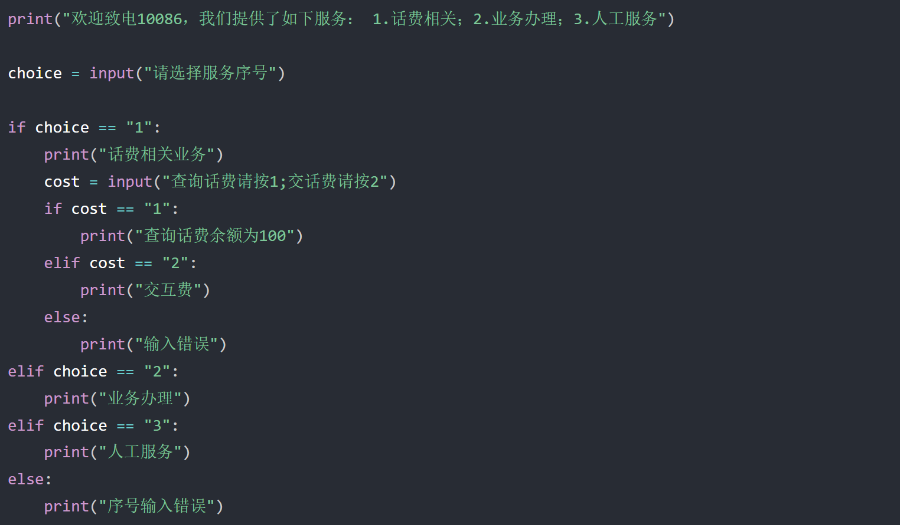


## 二，循环结构

### 1，for循环

for循环和JS也是一样的，求1~100中所有整数的和：

```java
// 求1~100中所有整数的和
int sum = 0;
//定义一个循环，先产生1-100，这100个数
for (int i = 1; i <= 100; i++) {
    //每产生一个数据，就把这个数和sum累加
    sum += i; //sum = sum  + i;
}
System.out.println("1-100的数据和：" +  sum);
```

求奇数和：

```java
//1)定义一个变量用于求和
int sum1 = 0;
//2)定义一个循环产生1-100之间的奇数
for (int i = 1; i < 100; i+=2) {
    // i = 1 3 5 7 ...
    //3)让需要求和的数据和sum1累加，
    sum1 += i;
}
System.out.println("1-100之间的奇数和：" +  sum1);

// --------------------------------------------

// 另一种写法：
//1)首先需要定义一个求和变量，这里命名为sum2
int sum2 = 0; 
//2)再遍历得到所有需要求和的数据(1~100之间的所有整数)
for (int i = 1; i <= 100; i++) {
    //i = 1 2 3 4 5 6 ... 99 100
    //3)在求和之前先对数据判断，如果是奇数，才和sum1累加；否则什么也不干
    if(i % 2 == 1){
        // i = 1 3 5 7 9 ... 99
        sum2 += i;
    }
}
System.out.println("1-100之间的奇数和：" + sum2);
```

操场上跑圈，一圈500米，跑5圈，计算跑了多少米

```java
package com.malu.hello;

public class HelloWorld {
    public static void main(String[] args) {
        // 操场上跑圈，一圈500米，跑5圈，计算跑了多少米
        int distance = 0;
        for (int i = 0; i < 5; i++) {
            distance += 500;
        }
        System.out.println("一共跑了"+distance+"米");
    }
}
```

打印九九乘法表

```java
package com.malu.hello;

public class HelloWorld {
    public static void main(String[] args) {
        // 打印九九乘法表
        String str = "";
        for (int i = 1; i <= 9; i++) {  // 控制行数
            for (int j = 1; j <= i; j++) {  // 控制列数
                str += j + "*" + i + "=" + j*i;
                str += "  ";
            }
            str += "\n";
        }
        System.out.println(str);
    }
}
```


### 2，while循环

while循环和JS是一样的。直接做一些题目，如下：

for和while的选择：

* 从功能来说：能够用for循环做的，都能用while循环做。
* 使用规范上来说：知道循环几次，建议使用for；不知道循环几次建议使用while

再看一下题目：世界最高山峰珠穆朗玛峰高度是：8848.86米=8848860毫米，假如我有一张足够大的它的厚度是0.1毫米。请问：该纸张折叠多少次，可以折成珠穆朗玛峰的高度？

```java
package com.malu.hello;

public class HelloWorld {
    public static void main(String[] args) {
        // 世界最高山峰珠穆朗玛峰高度是：8848.86米=8848860毫米，
        // 假如我有一张足够大的它的厚度是0.1毫米。请问：该纸张折叠多少次，可以折成珠穆朗玛峰的高度？
        double peakHeight = 8848860;
        double paperThickness = 0.1;
        int count = 0;

        while (paperThickness<peakHeight){
            paperThickness = paperThickness * 2;
            count++;
        }

        System.out.println("需要折叠多少次：" + count);
        System.out.println("最终纸张的厚度是：" + paperThickness);
    }
}
```

把一个四位数拆成一位一位，1234, 千位数是1, 百位数是2, 十位数是3, 个位数是4

```java
package com.malu.hello;

import java.util.Scanner;

public class HelloWorld {
    public static void main(String[] args) {
        // 把一个四位数拆成一位一位，1234, 千位数是1, 百位数是2, 十位数是3, 个位数是4
        Scanner sc = new Scanner(System.in);
        int num = sc.nextInt();
        int gw = num % 10;
        int sw = num / 10 % 10;
        int bw = num / 100 % 10;
        int qw = num / 1000;
        System.out.println("个位数是："+gw);
        System.out.println("十位数是："+sw);
        System.out.println("百位数是："+bw);
        System.out.println("千位数是："+qw);
    }
}
```


小练习（请实现一个用户登录系统，如果密码错误则反复提示让用户重新输入，直到输入正确才停止）：

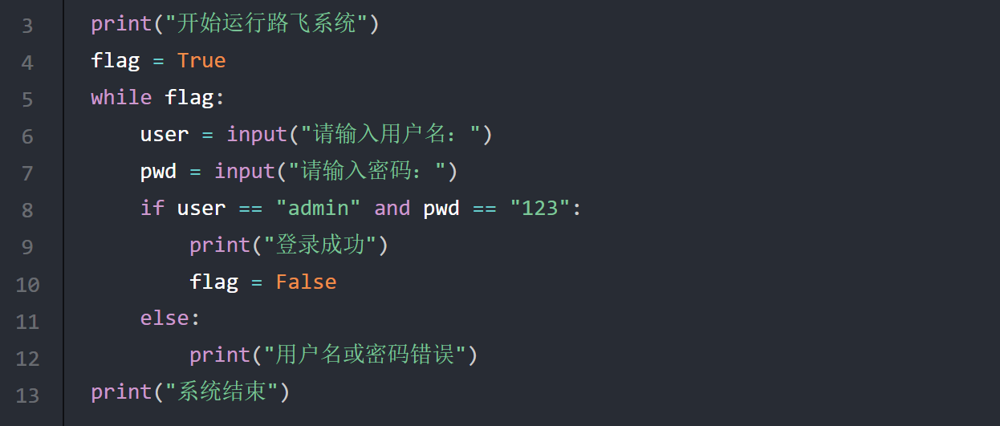


### 3，回顾


```java
编程语言分类：
  - 编译型语言： C++, Java... 
  - 解释型语言： python, js, php...
    
解释型语言:
  - 有一个解释器，写好代码后，让解释器去执行你的代码，天然跨平台，没有编译的过程，如果要把代码给别人==>别人可以看到我们的源代码。没有入口。
  
Java是编译型语言：
  - 开发需要jdk环境，java源代码 ==> 需要编译 ==> 字节码文件 ==> 字节码文件运行在java虚拟机之上。
  - 跨平台 ==> java的字节码文件运行在 虚拟机之上 ==> 不同平台安装不同平台的虚拟机，java字节码可以顺利运行
  - java运行是字节码文件，不是原代码 ==> 不会泄露掉真正的java代码

C/C++/GO编译型语言：
  - 需要编译 ==> 区别于java ==> 直接编译成 可执行文件（win:exe,mac,Linux:这个平台可执行文件）
  - 如果在win平台上编译后的可执行文件，无法运行在 mac，linux上的
  - 好处：一旦编译过后，就是可执行文件，不需要额外安装其他的东西
  - 坏处：不跨平台，需要在不同平台编译
  
Java的体系：
  - JavaSE: java基础 ==> 变量，方法，面向对象，包，文件操作，并发，网络
  	- JAVAEE开发的基本
  	- 要做安卓开发必须学习JavaSE
  - JavaEE: java web方向，jsp，请求与响应 ==> java工作基本上都是这个方向
    - java工程师==> 本质大部分都是java EE工程师。ssh，ssm，SpringBoot，SpringCloud：spring公司的框架，方便做java ee
  - JavaME: java手机方向开发  ==>  不是安卓  ==>  没有这个方向了
  
JDK JRE JVM
  - jdk:Java Development Kit:java集成开发工具包  ==>  java开发者必须下载安装这个软件，装在不同平台  ==>  包含 jre，和内置的jar包 
  - jre:Java Runtime Environment 即Java运行环境  ==>  java程序要运行，必须安装这个软件，装在不同平台上
  - jvm：java虚拟机，java的字节码文件必须运行在java虚拟机之上
  - 正是因为jvm的跨平台，可以装在不同操作系统上，java程序是跨平台的
  - java -version
  
- 关于JDK的版本
  - JDK 22  最新
  - 咱们用jdk 1.8
  - 百分之85以上的做java的公司，都在用jdk 1.8  ==>  jdk8
  
- 收费问题
  - java 是 sun公司推出的  ==>  被甲骨文 收购了  ==>  oracle 官网下载
  - java 本来是开源免费的
  - 被oracle收购后  ==>  oracle收费
     - jdk源代码 开源的
        - 更新，加新功能  ==>  oracle要收费
        - 第三方基于开源代码编译成自己的jdk
     - oracle JDK # 非商业用途也免费
     - open JDK  # 免费的
     - 毕昇jdk   
```


配置环境变量：

```java
#1 安装  把老师给的安装包，一路下一步安装即可
    -安装完  ==>  弹出一个是否安装jre提示
    -可以装可以不装：
    -不装：jdk中自带jre  ==>  不用装了
    -装了：在别的位置又有个jre的环境
    
    
# 2 配置环境变量  ==>  正常可以用  ==>  但是作为专业的java开发  ==>  咱们需要配一下
    2.1 新建 JAVA_HOME  D:\develop\java8  # java的安装目录
            -以后JAVA_HOME 就代指后面的路径
    2.2 新建一个 CLASSPATH
        CLASSPATH     .;%JAVA_HOME%\lib\dt.jar;%JAVA_HOME%\lib\tools.jar;
        
    2.3 path中加入--》可执行文件，在任意路径下执行都会有反应
        %JAVA_HOME%\bin
        %JAVA_HOME%\jre\bin
```

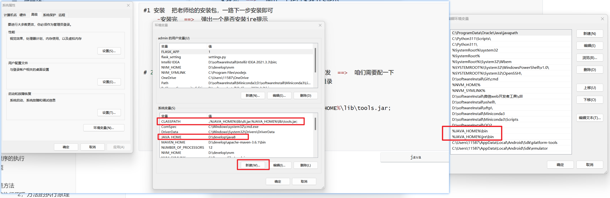


第一个HelloWorld

```java
public class HelloWorld {
    public static void main(String[] args) {
        System.out.println("hello world");
    }
}

// 编译代码  生成字节码文件 HelloWorld.class
javac HelloWorld.java
// 执行
java HelloWorld
```


IDE：

```java
// 1 Eclipse  https://www.eclipse.org/downloads/
Eclipse是一个免费的开源Java IDE，提供了丰富的功能和插件扩展。它支持Java应用程序、Web应用程序和企业级应用程序的开发，并具有强大的代码编辑、调试和测试工具。

// 2 My Eclipse  https://www.genuitec.com/products/myeclipse/
MyEclipse是一个专为Java开发而设计的集成开发环境（IDE），它是Eclipse IDE的一个商业化版本。MyEclipse提供了许多功能和工具，旨在提高Java开发人员的生产力和效率

// 3 IntelliJ IDEA：https://www.jetbrains.com/idea/download/other.html
// 捷克 JetBrains公司  ==>  IDEA  ==>  编辑器全家桶
    -Pycharm
    -Goland
    -Clion
    -IDEA
    -WebStorm
    
IntelliJ IDEA是一种商业化的Java IDE，也有免费的社区版可用。它提供了智能代码完成、代码检查和重构等功能，支持Java开发以及其他相关技术，如Spring和Hibernate，同属于Jetbrains系列，使用习惯跟Pycharm类似，我们选择此编辑器。

// vscode：微软出的，免费
//   - python, java, go, 前端...
```


破解：

```python
# 1 安装，科学使用（跟pycharm科学使用一样）
    -ideaIU-2023.1.3.exe  一路下一步，跟pychrm安装一模一样
    
# 2 先打开 idea，让你输入 验证，咱们没有（花钱）  ==>  关闭软件

# 3 运行老师给的激活工具（运行脚本）
    等着它弹出 done
    
# 4 打开idea，输入激活码，就可以了
    -pycharm
    -Clion
    -IDEA
    -GOland
```


类文件和类文件中的类的注意点：

```java
package com.malu.hello;

// 1. 文件中【HellWorld.java】,只能有一个public类，并且 文件名 必须和  类名  一致
// 2. 文件中可以有多个类，但是只能有一个public类，并且public类的名字需要和文件名一致
// 3. 如果文件中，有多个类，并且不用public修饰，文件名可以是任意类

// 类名首字母必须大写，使用驼峰命名
public class HelloWorld {
    // java程序入口为类中的static的viod的main函数，参数固定为字符串数组
    public static void main(String[] args) {

    // 代码，程序从这里开始执行的

    }
}

// class A{ }
// class B{}
```


注释：

```java
// 单行注释    代码前加 //      
// 快捷键：【注释 ctrl+/ 】  【 取消注释 ctrl+/ 】

// 多行注释
	/*
        多行注释
        多多行注释
        可以换行
    */
// 快捷键：【注释 ctrl+shift+/ 】 【取消注释 ctrl+shift+\ 】

// 文档注释
// 包含在“/**”和“*/”之间，也能注释多行内容，一般用在类、方法和变量上面，用来描述其作用。注释后，鼠标放在类和变量上面会自动显示出我们注释的内容
```

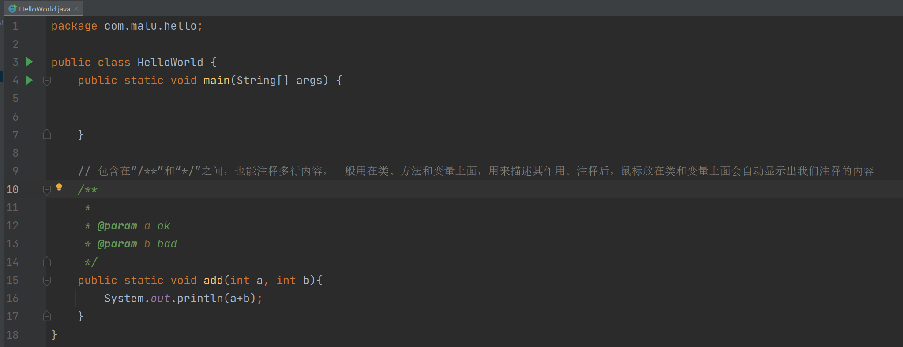


变量和常量：

```java
// 1 定义变量
// 类型 变量名 = 变量值
String name = "malu";
name = "ityls";
System.out.println(name); // 在控制台打印

String hobby;
hobby = "篮球";

// 常量==>恒定不变，一旦定义，以后不能改 final 关键字修饰
final String schoolName = "清华大学";
// schoolName = "北大"; // 以后不能改，改了就报错
```


输入和输出：

```java
// 输出
System.out.println("hello"); // 打印并换行
System.out.print("world"); // 打印，不换行

String name = "malu";
System.out.print(name);
System.out.printf("变量的值是：%s\n",name);

// 输入
import java.util.Scanner;
System.out.print("请输入名字：");
Scanner sc = new Scanner(System.in);
String inputName=sc.nextLine();
System.out.printf("您输入的名字是：%s",inputName);
```


条件语句：

```java
public class HelloWorld {
    public static void main(String[] args) {
        // 接受用户输入
        System.out.print("请输入您的分数：");
        Scanner scanner = new Scanner(System.in);
        // int score=scanner.nextLine();
        int score = Integer.valueOf(scanner.nextLine()); // 强制类型转换，字符串转成int

        if (score >= 90 && score <= 100) {
            System.out.println("优秀");
        } else if (score >= 70 && score < 90) {
            System.out.println("良好");
        } else if (score >= 60 && score < 70) {
            System.out.println("及格");
        } else {
            System.out.println("不及格");
        }
    }
}
```


循环语句：

```java
public class HelloWorld {
    public static void main(String[] args) {
        for (int i = 0; i < 10; i++) {
            System.out.println(i);
        }
    }
}
```

```java
public class HelloWorld {
    public static void main(String[] args) {
        int i=0;
        while (i<10){
            System.out.println(i);
            i++;
        }
    }
}
```


数据类型：

```java
字节类型 byte

整数类型
   byte	    带符号字节型     8位   	-128 ~ 127
   short    带符号字节型	  16位  	    -32768 ~ 32767
   int	    带符号字节型	  32位		-2147483648 ~ 2147483647
   long     带符号字节型	  64位       -9223372036854775808 ~ 9223372036854775807
    
小数类型，浮点型
   float
   double 
   
字符类型
   char  英文的字符   中文的字符   'a'  '@'  '中'  '人'
    
字符串类型
   string   重要
   
布尔类型
   boolean
   
数组类型：今天会讲到
```


字节类型：

```java
字节类型 byte

public class HelloWorld {
    public static void main(String[] args) {
        // 一个字节占8位  00000001
        byte a = 1;
        // ACCISS码中，英文的字符就是占一个字节
        byte b = 'a';
        System.out.println(a);
        System.out.println(b);  // 97
    }
}
```


整数类型：

```java
public class HelloWorld {
    public static void main(String[] args) {
        byte a = 127;
        // byte a1 = 128; // 不能超范围
        // System.out.println(a1);

        // short v2 = 32768;  // 不能超范围

        int v3 = 2147483647;

        // long类型,需要在数据后面加上L
        long v4 = 9223372036854775807L;
    }
}
```


小数类型：

```java
public class HelloWorld {
    public static void main(String[] args) {
        // float类型后面需要加f
        float f1 = 1.1111f;

        // d可加可不加
        double d = 1.1315354135d;
        System.out.println(f1);
        System.out.println(d);
    }
}
```


字符类型：

```java
public class HelloWorld {
    public static void main(String[] args) {
        char v1 = 'a';
        char v2 = 'b';
        char v3 = '!';
        System.out.println(v1);
        System.out.println(v2);
        System.out.println(v3);

        char v4 = '中';
        char v5 = '国';
        // ! 也分英文状态下的和中文状态下的
        char v6 = '!';
        System.out.println(v4);
        System.out.println(v5);
        System.out.println(v6);
    }
}
```


字符串类型：

```java
public class HelloWorld {
    public static void main(String[] args) {
        // 在java中字符串类型需要使用双引号包起来
        String name = "malu";
        String pwd = "123";

        System.out.println(name);
        System.out.println(pwd);
    }
}
```


布尔类型：

```java
public class HelloWorld {
    public static void main(String[] args) {
        boolean b = true;
      
        b = false;
        System.out.println(b);
    }
}
```


字节和字符：

```java
字节：一个字节是8个比特位，一个英文字符 a 永远占一个字节，
    一个中文字符，占多少字节，取决于编码方式
    - GBK编码：一个中文字符， 占2字节
    - utf8编码：一个中文字符，占3个字节
    
字符： 一个符号 比如：  中   国   ?   ？   ！  a 
```


### 4，do...while循环

while循环和do..while循环的区别：

* while循环，循环体可能一次也不执行

* do...while循环，循环体至少要执行一次


代码：

```java
public class HelloWorld {
    public static void main(String[] args) {
        for (int i = 0; i < 10; i++) {
            System.out.println(i);
        }

        System.out.println("-------");

        int count = 0;
        while (count<10){
            System.out.println(count);
            count++;
        }

        System.out.println("-------");

        int num = 0;
        do{
            System.out.println(num);
            num++;
        }while (num<10);
    }
}
```


### 5，死循环

死循环的应用场景：最典型的是可以用死循环来做服务器程序， 比如百度的服务器程序就是一直在执行的，你随时都可以通过浏览器去访问百度。如果哪一天百度的服务器停止了运行，有就意味着所有的人都永不了百度提供的服务了。

```java
//for死循环
for ( ; ; ){
    System.out.println("Hello World1");
}

//while死循环
while (true) {
    System.out.println("Hello World2");
}

//do-while死循环
do {
    System.out.println("Hello World3");
}while (true);
```

### 6，跳转语句break，continue

要在循环过程中提前跳出循环怎么做呢？

* break作用：跳出并结束当前所在循环的执行，只能用于结束所在循环，或结束所在的switch分支的执行。
* continue作用：结束本次循环，进入下一次循环，只能在循环中使用。

操场上跑圈，一圈500米，打算跑5圈，准备跑第4圈的时候，不舒服，不跑了，回宿舍了，问一次跑了多米。如下

```java
package com.malu.hello;

public class HelloWorld {
    public static void main(String[] args) {
        // 操场上跑圈，一圈500米，打算跑5圈，准备跑第4圈的时候，不舒服，不跑了，回宿舍了，问一次跑了多米。如下
        int count = 0;
        int distance = 0;
        while (count<5){
            if(count == 3){
                break; // 结束整体循环
            }
            distance += 500;
            count++;
        }
        System.out.println("跑了"+distance+"米");
    }
}
```

操场上跑圈，一圈500米，打算跑5圈，准备跑第4圈的时候，不舒服，休息一圈，第4圈不跑了，还要跑第5圈，问一次跑了多米。如下

```java
package com.malu.hello;

public class HelloWorld {
    public static void main(String[] args) {
        // 操场上跑圈，一圈500米，打算跑5圈，准备跑第4圈的时候，不舒服，休息一圈，第4圈不跑了，还要跑第5圈，问一次跑了多米。
        int count = 0;
        int distance = 0;
        while (count<5){
            count++;
            if(count == 3){
                continue; // 结束本次循环，继续下次循环
            }
            distance += 500;
        }
        System.out.println("跑了"+distance+"米");
    }
}
```

## 三，生成随机数

### 1，生成随机数

生成随机数的功能，其实 Java已经给我们提供了，在JDK中提供了一个类叫做Random，我们只需要调用Random这个类提供的功能就可以了。

参考代码：

```java
package com.malu.hello;

import java.util.Random;

public class HelloWorld {
    public static void main(String[] args) {
        // r表示random对象，用于生成随机数
        Random r = new Random();
        // 生成一个0~10之间的随机数，不包含10的
        //System.out.println(r.nextInt(10));
        //System.out.println(r.nextInt());
        for (int i = 1; i <= 20; i++) {
            // 生成0-9之间的随机数
            int data = r.nextInt(10);
            System.out.println(data);
        }
    }
}
```

### 2，猜数字小游戏

需求：随机生成一个1-100之间的数据，提示用户猜测，猜大提示过大，猜小提示过小，直到猜中结束游戏。


猜数字，设定一个理想数字比如：66，一直提示让用户输入数字，如果比66大，则显示猜测的结果大了；如果比66小，则显示猜测的结果小了; 只有输入等于66，显示猜测结果正确，然后退出循环。


python代码：

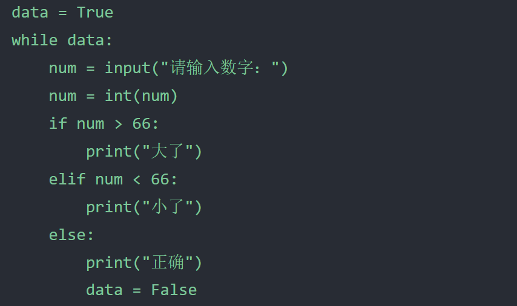


参考代码：

```java
package com.malu.hello;

import java.util.Random;
import java.util.Scanner;

public class HelloWorld {
    public static void main(String[] args) {
        // 随机生成一个1-100之间的数据，提示用户猜测，猜大提示过大，猜小提示过小，直到猜中结束游戏。
        Random r = new Random();
        // 生成的一个1-100之间的数据
        int data = r.nextInt(100)+1;  // 30

        Scanner sc = new Scanner(System.in);
        while (true){
            System.out.println("请输入你猜测的数据：");
            // guessNumber表示人家猜测的数据
            int guessNumber = sc.nextInt();
            if(guessNumber > data){
                System.out.println("你猜测的数据过大~");
            }else if(guessNumber<data){
                System.out.println("你猜测的数据过小~");
            }else{
                System.out.println("恭喜你，猜测的数据正确~");
                break; // 结束整个循环
            }
        }

    }
}
```


练习：

```java
1. 使用循环输出1~100所有整数。
2. 使用循环输出 1 2 3 4 5 6   8 9 10，即：10以内除7以外的整数。
3. 输出 1~100 内的所有奇数。
4. 输出 1~100 内的所有偶数。
5. 求 1~100 的所有整数的和。
6. 思考题：求 1~100 的所有整数这样的结果： 1 - 2 + 3 - 4 + 5 - 6 = ?
```


实现用户登录系统，并且要支持连续三次输错之后直接退出，并且在每次输错误时显示剩余错误次数。

```java
public class HelloWorld {
    public static void main(String[] args) {
        int count = 0;
        Scanner sc = new Scanner(System.in);
        while (count<3){
            count++;
            System.out.println("请输入用户名：");
            String user = sc.nextLine();
            System.out.println("请输入密码：");
            String pwd = sc.nextLine();
            System.out.println(user);
            System.out.println(pwd);
            if(user.equals("admin") && pwd.equals("123")){
                System.out.println("登录成功~");
                break;
            }else{
                System.out.println("用户名或者密码错误，剩余错误次数为"+(3-count)+"次");
            }
        }
    }
}
```


猜年龄游戏 要求：允许用户最多尝试3次，3次都没猜对的话，就直接退出，如果猜对了，打印恭喜信息并退出。

```java
public class HelloWorld {
    public static void main(String[] args) {
        int count = 0;
        Scanner sc = new Scanner(System.in);
        while (count<3){
            count++;
            System.out.println("请输入你猜的年龄：");
            int age = sc.nextInt();
            if(age == 33){
                System.out.println("恭喜你猜对了");
                break;
            }else{
                System.out.println("猜错了");
            }
        }
    }
}
```


猜年龄游戏升级版 要求：允许用户最多尝试3次，每尝试3次后，如果还没猜对，就问用户是否还想继续玩，如果回答Y，就继续让其猜3次，以此往复，如果回答N，就退出程序，如何猜对了，就直接退出。

```java
public class HelloWorld {
    public static void main(String[] args) {
        int count = 0;
        Scanner sc = new Scanner(System.in);
        while (count<3){
            count++;
            System.out.println("请输入你猜的年龄：");
            int age = sc.nextInt();
            if(age == 33){
                System.out.println("恭喜你猜对了");
                break;
            }else{
                System.out.println("猜错了");
            }

            if(count == 3){
                // System.out.println("3次机会你都使用完毕了~");
                System.out.println("是否想继续玩(Y/N)？");
                String choice = sc.next();
                if(choice.equals("N")){
                    break;
                }else if(choice.equals("Y")){
                    count = 0;
                    continue;
                }else{
                    System.out.println("你输入的内容有误~");
                    break;
                }
            }

        }
    }
}
```


## 四，数组

Java中的数组和JS中的数组还是有区别的，Java中的数组是用来存一批同种类型的数据的。如：想要存储 20, 10, 80, 60, 90 这些数据。 我们可以把代码写成这样：

```java
// 数组是一种引用数据类型
int[] array = {20,10,60,30};
System.out.println(array);
```

数组变量名中存储的是数组在内存中的地址，数组是一种引用数据类型。

### 1，数组的静态初始化

数组有两种初始化的方式：

* 静态初始化
* 动态初始化

所谓静态初始化指的是：在定义数组时直接给数组中的数据赋值。格式：

```java
package com.malu.hello;

public class HelloWorld {
    public static void main(String[] args) {
        // 静态初始化的完整格式：数据类型[] 变量名 = new 数据类型[]{元素1,元素2,元素3};

        // 定义了一个数组，此数组中只能放int类型的数据
        int[] nums = new int[]{1,2,19,88};
        System.out.println(nums);  // [I@1540e19d

        // 此数组中，只能放double类型的数据
        double[] scores = new double[]{1.1, 2.2, 3.4, 11.0};
        System.out.println(scores);  // [D@677327b6
    }
}
```

静态初始化简化格式：

```java
package com.malu.hello;

public class HelloWorld {
    public static void main(String[] args) {
        // 数据类型[] 变量名 = {元素1,元素2,元素3};

        // 静态初始化的简写形式
        int[] nums = {1,2,19,88};
        System.out.println(nums);  // [I@1540e19d

        // 静态初始化的简写形式
        double[] scores = {1.1, 2.2, 3.4, 11.0};
        System.out.println(scores);  // [D@677327b6
        
        // 下面的两种写法都是OK的，推荐使用第一种写法，因为这种写法，用的更普遍
        int[] ages1 = {10,11,14,18};
        int age2[] = {22,19,17,25};
    }
}
```

### 2，数组的元素访问

访问数组中的元素也是通过索引来访问的，如下：

```java
package com.malu.hello;

public class HelloWorld {
    public static void main(String[] args) {
        // 容器   只要是容器，立马想到CRUD  create read update delete
        // 只要是容器，还需要想到遍历  所谓的遍历就是把容器中的元素一个个取出来
        int[] nums = {1,2,19,88};
        // 访问数组中的元素
        System.out.println(nums[0]);
        System.out.println(nums[1]);
        System.out.println(nums[2]);
        System.out.println(nums[3]);
        // 报错了：ArrayIndexOutOfBoundsException  索引越界了
        //System.out.println(nums[4]);

        // 修改数组中的元素
        nums[0] = 666;
        nums[1] = 888;
        System.out.println(nums[0]);
        System.out.println(nums[1]);

        // 通过数组名.length,可以得到数组的长度
        System.out.println(nums.length);

        // 获取数组的最大索引
        System.out.println(nums.length-1);
        
        double[] scores = {};
        System.out.println(scores.length-1);
    }
}
```

### 3，数组遍历

使用for循环对数组进行遍历：

```java
int[] ages = {12, 24, 36};
for (int i = 0; i < ages.length; i++) {
    // i的取值 = 0,1,2
    System.out.println(ages[i]); 
}
```

需求：某部门5名员工的销售额分别是：16、26、36、6、100，请计算出他们部门的总销售额。

参考代码：

```java
package com.malu.hello;

public class HelloWorld {
    public static void main(String[] args) {
        // 某部门5名员工的销售额分别是：16、26、36、6、100，请计算出他们部门的总销售额。
        int[] money = {16,26,36,6,100};
        int sum = 0; // 总的销售额
        for (int i = 0; i < money.length; i++) {
            sum += money[i];
        }
        System.out.println("员工的销售总额："+sum);
    }
}
```

### 4，数组的动态初始化

另一个初始化数组的方式叫 **动态初始化**。动态初始化不需要我们写出具体的元素，而是指定元素类型和长度就行。格式如下：

```java
// 数据类型[]  数组名 = new 数据类型[长度];
// 数组中的元素默认值是0
int[] arr = new int[3];
System.out.println(arr[0]);  // 0
System.out.println(arr[1]);  // 0
System.out.println(arr[2]);  // 0
```

使用动态初始化定义数组时，根据元素类型不同，默认值也有所不同。

* byte, short, char, int, long  默认值是0
* float, double 默认值是0.0
* boolean 默认值是false
* 引用类型（类，接口，数组，String） 默认值是null

案例需求：某歌唱比赛，需要开发一个系统：可以录入6名评委的打分，录入完毕后立即输出平均分

```java
package com.malu.hello;

import java.util.Scanner;

public class HelloWorld {
    public static void main(String[] args) {
        // 没有放元素，但是它有默认值：
        //    byte  short  char   int   long  默认值是0
        //    double  float  默认值是0
        //    boolean  默认值是false
        //    引用类型（数组，字符串，类，接口）  默认值是null

        // 某歌唱比赛，需要开发一个系统：可以录入6名评委的打分，录入完毕后立即输出平均分
        // 表示创建一个数组，里面放6个元素，现在还没有放元素
        double[] arr = new double[6];
        //System.out.println(arr.length); // 6

        Scanner sc = new Scanner(System.in);
        for (int i = 0; i < arr.length; i++) {
            System.out.println("请你输入当前第"+(i+1)+"个评委的分数：");
            double score = sc.nextDouble();
            arr[i] = score;
        }

        double sum = 0;
        for (int i = 0; i < arr.length; i++) {
            sum += arr[i];
        }
        System.out.println("选手最终得分是"+sum/arr.length);
    }
}
```


java中的字节数组和字符串的转化：

```java
public class HelloWorld {
    public static void main(String[] args) throws Exception {
        // 字节 byte  1byte = 8个比特位
        // 把字符串转化成字节数组  int[] arr = {1,2,3}
        // byte[] b = {1,'a','@'}

        String v = "hello world 中国";

        byte[] b = v.getBytes("utf-8");
        // [104, 101, 108, 108, 111, 32, 119, 111, 114, 108, 100, 32, -28, -72, -83, -27, -101, -67]
        System.out.println(Arrays.toString(b));
        b[0] = 97;
        // 把字节数组转化成字符串
        String v1 = new String(b);
        System.out.println(v1);

        // byte[] b = v.getBytes("gbk");
        // [104, 101, 108, 108, 111, 32, 119, 111, 114, 108, 100, 32, -42, -48, -71, -6]
        // System.out.println(Arrays.toString(b));

    }
}

1 字符串转字节数组
  String v="hello world 中国";  
  v.getBytes("utf-8");  // 以后会经常看到这个东西

2 把字节数组转回字符串
  byte[] b =new byte[]{99,98,97}
  String v1=new String(b,"utf-8");
```


java中的字符数组和字符串的转化：

```java
public class HelloWorld {
    public static void main(String[] args) throws Exception {

        // char[] c1 = {'a','b','c','中', '国'}
        String v="hello 中国";
        char[] c1 = v.toCharArray();
        System.out.println(c1);
        System.out.println(c1[0]);
        System.out.println(c1[6]);

        char[] c= {'h','e','l','l','o','中','国'};
        String str1 = new String(c);
        System.out.println(str1);
    }
}

总结：
1 字符串转字符数组
  String v="hello world 中国";  
  char[] c1=v.toCharArray(); 

2 把字符数组转回字符串
   char[] c=new char[]{'h','e','l','l','o','中','国'};
   String v=new String(c);
```


### 5，Java程序的执行

Java为了便于虚拟机执行Java程序，将虚拟机的内存划分为 方法区、栈、堆、本地方法栈、寄存器 这5块区域。同学们需要重点关注的是  **方法区、栈、堆**。

下面把每一个块内存区域作用介绍一下，我们大致只需要知道每一部分存储什么内容就行。

* **方法区**：字节码文件先加载到这里
* **栈**：方法运行时所进入的内存区域，由于变量在方法中，所以变量也在这一块区域中
* **堆**：存储new出来的东西，并分配地址。由于数组是new 出来的，所以数组也在这块区域。

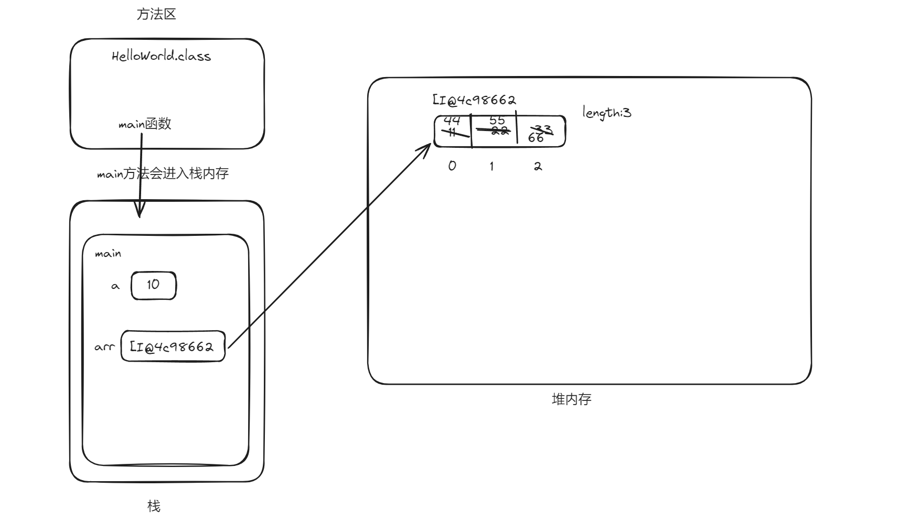

有如下程序：

```java
package com.malu.hello;

public class HelloWorld {
    public static void main(String[] args) {
        // java虚拟机，执行的不是java源码，执行的是.class文件（字节码）
        // .class文件（字节码）是在JVM中执行的。JVM把内存分成几个区域？
        //    方法区
        //    栈
        //    堆
        //    本地方法栈
        //    寄存器
        // 上面的5个区域中，目前我们重点关注三个区域：方法区，栈，堆
        //   字节码文件，是先加载到方法区的
        //   定义的一些变量是存储在栈区的
        //   new出来的对象，是存储在堆区的

        int a = 10;
        System.out.println(a);

        int[] arr = new int[]{11, 22, 33};
        System.out.println(arr);

        System.out.println(arr[1]);

        arr[0] = 44;
        arr[1] = 55;
        arr[2] = 66;

        System.out.println(arr[0]);
        System.out.println(arr[1]);
        System.out.println(arr[2]);
    }
}
```

执行流程：

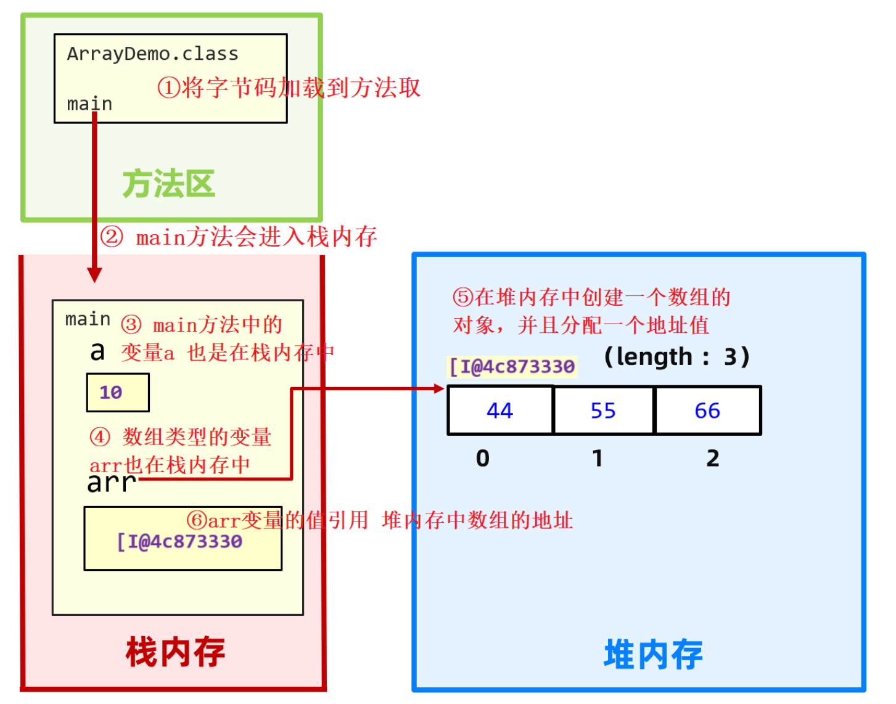

### 6，练习题

需求：定义一个int类型数组，求数组中元素的最大值，并打印最大值

参考代码：

```java
package com.malu.hello;

public class HelloWorld {
    public static void main(String[] args) {
        //定义一个int类型数组，求数组中元素的最大值，并打印最大值
        int[] arr = {3,2,8,9,4,2};

        // 假定第1个元素是最大值
        int max = arr[0];

        for (int i = 1; i < arr.length; i++) {
            if(arr[i] >max){
                max = arr[i];
            }
        }

        System.out.println("最大值是："+max);
    }
}
```


需求：用户可以输入N个用户名，存储到数组中，不想输入了，按Q键可以退出，最后打印出数组

参考代码：

```java
package com.malu.hello;

import java.util.ArrayList;
import java.util.Scanner;

public class HelloWorld {
    public static void main(String[] args) {
        //用户可以输入N个用户名，存储到数组中，不想输入了，按Q键可以退出，最后打印出数组
        ArrayList<String> list = new ArrayList<>();
        Scanner sc = new Scanner(System.in);
        while (true){
            System.out.println("请输入用户名（Q退出）");
            String userName = sc.next();
            if(userName.equals("Q")){
                break;  // 结束整个循环
            }
            list.add(userName);
        }
        System.out.println(list);  // list可以直接打印出来
    }
}
```


需求：某个数组有5个数据：10, 20, 30, 40, 50，请将这个数组中的数据进行反转。

      [10, 20, 30, 40, 50]  反转后 [50, 40, 30, 20, 10]

参考代码：

```java
package com.malu.hello;

public class HelloWorld {
    public static void main(String[] args) {
        //某个数组有5个数据：10, 20, 30, 40, 50，请将这个数组中的数据进行反转。

        int[] arr = {10,20,30,40,50};
        for(int i=0, j=arr.length-1; i<j; i++, j--){
            //arr[j]  arr[i]
            int temp = arr[j];
            arr[j] = arr[i];
            arr[i] = temp;
        }
        System.out.println(arr);  // [I@1540e19d
        for (int i = 0; i < arr.length; i++) {
            System.out.println(arr[i] + " ");
        }
    }
}
```

需求：某公司开发部5名开发人员，要进行项目进展汇报演讲，现在采取随机排名后进行汇报。请先依次录入5名员工的工号，然后展示出一组随机的排名顺序。

参考代码：

```java
package com.malu.hello;

import java.util.Random;
import java.util.Scanner;

public class HelloWorld {
    public static void main(String[] args) {
        //某公司开发部5名开发人员，要进行项目进展汇报演讲，现在采取随机排名后进行汇报。
        // 请先依次录入5名员工的工号，然后展示出一组随机的排名顺序。

        int[] coders = new int[5];
        //System.out.println(coders[1]);

        Scanner sc = new Scanner(System.in);

        for (int i = 0; i < coders.length; i++) {
            System.out.println("请你输入第"+(i+1)+"个员工的工号：");
            int code = sc.nextInt();
            coders[i] = code;
        }

        // 打乱数据中元素的顺序
        Random rd = new Random();
        for (int i = 0; i < coders.length; i++) {
            // index范围是： 0~4
            int index = rd.nextInt(coders.length);
            int temp = coders[index];
            coders[index] = coders[i];
            coders[i] = temp;
        }

        // 输入数组
        for (int i = 0; i < coders.length; i++) {
            System.out.println(coders[i] + " ");
        }
    }
}
```


作业：

```java
1. 使用for循环实现输出倒计时效果，例如：输出内容依次是："倒计时3秒"，"倒计时2秒"，"倒计时1秒"。
2. 让用户输入一段文本，请计算文本中 "码" 出现的次数，并输入结果。
```


## 五，方法

### 1，什么是方法

在一个类中可以写多个方法，格式：

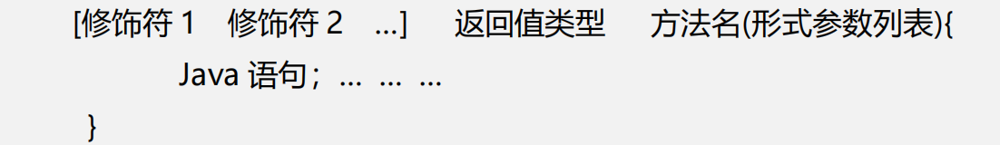


方法的调用方法：

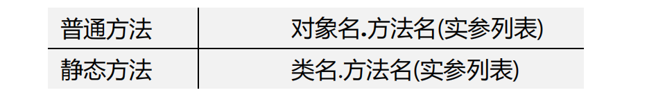


说明：

* 方法的修饰符：暂时都使用public static 修饰。（目前看做是固定写法，后面是可以改动的）

* 方法申明了具体的返回值类型，内部必须使用return返回对应类型的数据。

* 形参列表可以有多个，甚至可以没有； 如果有多个形参，多个形参必须用“，”隔开，且不能给初始化值。

  

设计一个方法原则：

* 如果方法不需要返回数据，返回值类型必须申明成void（无返回值申明）, 此时方法内部不可以使用return返回数据。
* 方法如果不需要接收外部传递进来的数据，则不需要定义形参，且调用方法时也不可以传数据给方法。
* 没有参数，且没有返回值类型（void）的方法，称为值无参数、无返回值方法。此时调用方法时不能传递数据给方法。


定义一个方法，计算1~n的和，如下：

```java
package com.malu.hello;

import java.util.Random;
import java.util.Scanner;

//HelloWorld 是一个类  类中可以放很多的方法
//封装：就是把数据和操作数据的方法放到的一个类中
public class HelloWorld {
    // public static 叫修饰符
    // void 方法的返回值类型  void表示没有返回值
    // main 方法名   (String[] args)形参列表
    public static void main(String[] args) {
        int res = add(3);
        System.out.println("1~3的和是："+res);
        int res2 = add(100);
        System.out.println("1~100的和是："+res2);
    }

    // 封装一个方法，这个方法，可以计算1~n的和
    public static int add(int n){
        int sum = 0;
        for (int i = 0; i <= n; i++) {
            sum += i;
        }
        return  sum;
    }
}
```

定义一个方法，判断一个整数是奇数还是偶数：

```java
package com.malu.hello;

public class HelloWorld {
    public static void main(String[] args) {
        fn(3);
        fn(6);
    }
    public static void fn(int number){
       if(number % 2 == 0){
           System.out.println(number+"是一个偶数");
       }else {
           System.out.println(number+"是一个奇数");
        }
    }
}
```

### 2，方法的执行原理

每次调用方法，方法都会进栈执行；执行完后，又会弹栈出去。假设在main方法中依次调用A方法、B方法、C方法，在内存中的执行流程如下：

* 每次调用方法，方法都会从栈顶压栈执行没执行
* 每个方法执行完后，会从栈顶弹栈出去

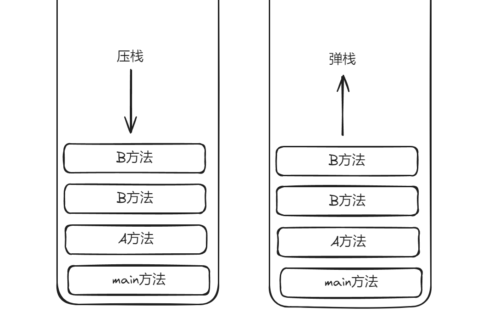

有返回值的方法，内存分析，代码：

```java
public class Test {
    public static void main(String[] args) {
        int rs = sum(10, 20);
        System.out.println(rs);
	}
    public static int sum(int a, int b ){
        int c = a + b; 
        return c;  
    }
}
```

如下图所示：以上代码在内存中的执行过程，按照①②③④⑤⑥⑦的步骤执行


无返回值的方法，内存分析，代码：

```java
public class Test {
    public static void main(String[] args) {
        study();
    }

    public static void study(){
		eat();
		System.out.println("学习");
		sleep();
	}
    public static void eat(){
        System.out.println("吃饭");
    }
    
    public static void sleep(){
        System.out.println("睡觉");
    }
}
```

分析：

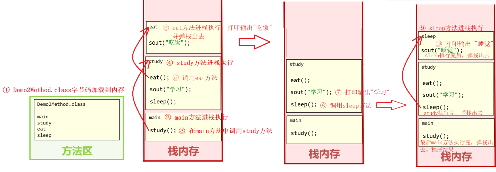

### 3，参数传递机制

Java的参数传递机制都是：值传递。

* 如果传递的基本类型，那么形参相当于函数内部的局部变量
* 如果传递的引用类型，那么传送的地址

需求：输出一个int类型的数组内容，要求输出格式为：[11, 22, 33, 44, 55]。

```java
package com.malu.hello;

import java.sql.SQLOutput;

public class HelloWorld {
    public static void main(String[] args) {
        // 函数调用就是把实参赋值给形参
        // 现在你传递的参数是基本数据类型
        int res = add(1,2);
        System.out.println("res:"+res);

        // arr是一个地址
        //{10,20,30} 是存储在堆区   在栈区有一个arr变量指向了堆区
        //int[] arr = null;
        int[] arr = {30,22,55,11};
        printArray(arr);
    }
    // 形参相当于是函数内部的局部变量
    public static int add(int a, int b){
        return  a+b;
    }

    public static void printArray(int[] arr){
        if(arr == null){
            System.out.println(arr);
            return;
        }
        System.out.print("[");
        for (int i = 0; i < arr.length; i++) {
            if(i == arr.length-1){
                System.out.print(arr[i]);
            }else{
                System.out.print(arr[i]+", ");
            }
        }
        System.out.println("]");
    }
}

```

需求：比较两个int类型的数组是否一样，返回true或者false

```java
package com.malu.hello;

public class HelloWorld {
    public static void main(String[] args) {
        // 比较两个int类型的数组是否一样，返回true或者false
        int[] arr1 = {1,2,3};
        int[] arr2 = {1,2,3};
        System.out.println(arrEquals(arr1,arr2));
    }
    public static boolean arrEquals(int[] arr1, int[] arr2){
        if(arr1 == null && arr2 == null){
            return  true;
        }
        if(arr1 == null || arr2 == null){
            return  false;
        }
        if(arr1.length != arr2.length){
            return  false;
        }
        for (int i = 0; i < arr1.length; i++) {
            if(arr1[i] != arr2[i]){
                return  false;
            }
        }
        return  true;
    }
}
```

### 4，方法重载

重载指的是：一个类中，出现多个相同的方法名，但是它们的形参列表是不同的，那么这些方法就称为方法重载了。其它的都不管（如：修饰符，返回值类型是否一样都无所谓）。

```java
package com.malu.hello;

public class HelloWorld {
    public static void main(String[] args) {
        fn();
        fn(1);
    }
    // 方法重截：1）方法名一样  2）形参列表不一样（返回值类型和修饰符无所谓）
    //   形参的数据类型不一样也是所谓的形参列表一样
    //   形参的个数不一样，也是所谓的形参列表不一样
    // 在调用方法，就会根据你传递的参数来确定你要调用哪一个方法
    public static void fn(){
        System.out.println("====第1上fn执行了====");
    }
    public static void fn(int a){
        System.out.println("====第2上fn执行了===="+a);
    }
    void fn(double a) {
        System.out.println("====第3上fn执行了====" + a);
    }
    void fn(double a,double b){
        System.out.println("====第4上fn执行了===="+a);
    }
    int fn(int a,int b){
        System.out.println("====第5上fn执行了===="+a);
        return  110;
    }
}
```


方法重载有啥应用场景？
答：开发中我们经常需要为处理一类业务，提供多种解决方案，此时用方法重载来设计是很专业的。

### 5，return单独使用

单独使用return语句，可以结束函数调用。

```java
package com.malu.hello;

public class HelloWorld {
    public static void main(String[] args) {
        fn(2,2);
        fn(2,0);
    }
    public static void fn(int a,int b){
        if(b == 0){
            System.err.println("你输入的数据有误");
            return;
        }
        int c = a/b;
        System.out.println("相除的结果是："+c);
    }
}
```

### 6，练习题

封装方法，判断一个年份是否是润年。

```java
package com.malu.hello;

public class HelloWorld {
    public static void main(String[] args) {
        System.out.println(isRunYear(2000));
        System.out.println(isRunYear(2001));
        System.out.println(isRunYear(2002));
    }

    // 封装方法，判断一个年份是否是润年。
    public static boolean isRunYear(int year){
        if(((year%4 ==0)&&(year%100 != 0)) || (year % 400 == 0)){
            return true;
        }
        return false;
    }
}
```


封装方法，翻转任意数组。

```java
package com.malu.hello;

public class HelloWorld {
    public static void main(String[] args) {
        int[] arr = {1,2,3,4,5};
        System.out.println(reverse(arr));

    }

    // 封装方法，翻转任意数组。
    public static int[] reverse(int[] arr){
        for (int i = 0,j=arr.length-1; i < j; i++,j--) {
            int tmep = arr[j];
            arr[j] = arr[i];
            arr[i] = tmep;
        }
        System.out.print("[");
        for (int i = 0; i < arr.length; i++) {
            System.out.print(arr[i]+", ");
        }
        System.out.print("]");
        return arr;
    }
}
```


开发一个程序，生成指定位数的验证码。考虑到实际工作中生成验证码的功能很多地方都会用到，为了提高代码的复用性，我们还是把生成验证码的功能写成方法比较好。

```java
package com.malu.hello;

import java.util.Random;

public class HelloWorld {
    public static void main(String[] args) {
        System.out.println(createCode(4));
        System.out.println(createCode(8));
        System.out.println(createCode(12));
    }

    public static String createCode(int n){
        Random rd = new Random();
        String code = "";
        for (int i = 0; i <=n; i++) {
            int type = rd.nextInt(3);
            switch (type){
                case 0:
                    // 随机一个数字
                    code += rd.nextInt(10);
                    break;
                case 1:
                    // 随机一个大写字母
                    char ch1 = (char)(rd.nextInt(26)+65);
                    code += ch1;
                    break;
                case 2:
                    // 随机一个小写字母
                    char ch2 = (char)(rd.nextInt(26)+97);
                    code += ch2;
                    break;
            }
        }
        return  code;
    }
}
```

在唱歌比赛中，可能有多名评委要给选手打分，分数是0~100之间，选手最后得分是去掉最高分，去掉最低分后剩余平均分，请编写程序录入多名评委的分数，并算出选手最终得分。

```java
package com.malu.hello;

import java.util.Scanner;

public class HelloWorld {
    public static void main(String[] args) {
       // 在唱歌比赛中，可能有多名评委要给选手打分，分数是0~100之间，选手最后得分是去掉最高分，
        // 去掉最低分后剩余平均分，请编写程序录入多名评委的分数，并算出选手最终得分。
        System.out.println("当前选手得分是:"+getAverageScore(6));
    }
    public static double getAverageScore(int n){
        int[] scores = new int[n];
        // scores = [0,0,0,0,0,0]

        Scanner sc = new Scanner(System.in);
        for (int i = 0; i < scores.length; i++) {
            System.out.println("请你录入第"+(i+1)+"个评委的分数：");
            int score = sc.nextInt();
            scores[i] = score;
        }

        int sum = 0; // 总分
        int max = scores[0];  // 最高分
        int min = scores[0];  // 最低分

        for (int i = 0; i < scores.length; i++) {
            int score = scores[i];
            sum += score;// 总分
            if(score>max){
                max = score;
            }
            if(score<min){
                min = score;
            }
        }
        System.out.println("sum:"+sum);
        System.out.println("max:"+max);
        System.out.println("min:"+min);
        System.out.println((sum - min - max) / (n-2));
        return 1.0 * (sum - min - max) / (n-2) ;
    }
}
```

某系统的数字密码是一个四位数，如1983，为了安全，需要加密后再传输，加密规则是：对密码中的每位数，都加5，再对10取余，最后将所有数字顺序反转，得到一串加密后的新数，请设计出满足需求的加密程序。

```java
package com.malu.hello;

public class HelloWorld {
    public static void main(String[] args) {
        // 某系统的数字密码是一个四位数，如1983，为了安全，需要加密后再传输，
        // 加密规则是：对密码中的每位数，都加5，再对10取余，最后将所有数字顺序反转，
        // 得到一串加密后的新数，请设计出满足需求的加密程序。

        System.out.println("加密后的结果是："+encrypt(1864));
    }
    public static String encrypt(int number){
        // numbers = [1,8,6,4]
        int[] numbers = split(number);
        for (int i = 0; i < numbers.length; i++) {
            numbers[i] = (numbers[i] + 5) % 10;
            System.out.println(numbers[i]);
        }
        reverse(numbers);
        String data = "";
        for (int i = 0; i < numbers.length; i++) {
            //System.out.println(numbers[i]);
            data += numbers[i];
        }
        return data;
    }
    // 封装方法，翻转任意数组。
    public static void reverse(int[] arr){
        for (int i = 0,j=arr.length-1; i < j; i++,j--) {
            int tmep = arr[j];
            arr[j] = arr[i];
            arr[i] = tmep;
        }
    }
    public static int[] split(int number){
        int[] numbers = new int[4];
        numbers[0] = number / 1000;
        numbers[1] = (number /100) % 10;
        numbers[2] = (number /10) % 10;
        numbers[3] = number % 10;
        return  numbers;
    }
}
```

请把一个整型数组，例如存了数据：11, 22, 33, 拷贝成一个一模一样的新数组来。

```java
package com.malu.hello;

public class HelloWorld {
    public static void main(String[] args) {
        int[] arr1 = {11,22,33};
        // 浅copy
        //int[] arr2 = arr1;
        //arr1[0] = 666;
        //System.out.println(arr2[0]);

        // 深copy
        int[] arr2 = copy(arr1);
        arr1[0] = 666;
        System.out.println(arr2[0]);
        printArray(arr2);
    }
    public static int[] copy(int[] oldArr){
        int[] newArr = new int[oldArr.length];

        for (int i = 0; i < oldArr.length; i++) {
            newArr[i] = oldArr[i];
        }

        return newArr;
    }
    public static void printArray(int[] arr){
        System.out.print("[");
        for (int i = 0; i < arr.length; i++) {
            System.out.print(i==arr.length-1 ? arr[i] : arr[i] + ", ");
        }
        System.out.println("]");
    }
}

```

分别有9, 666, 188, 520, 99999五个红包，请模拟粉丝抽奖，按照先来先得，随机抽取，抽完为止，一个红包只能被抽一次，先抽或后抽哪一个红包是随机的。

```java
package com.malu.hello;

import java.util.Random;
import java.util.Scanner;

public class HelloWorld {
    public static void main(String[] args) {
        //              0
        int[] moneys = {9, 666, 188, 520, 99999};
        // 分别有9, 666, 188, 520, 99999五个红包，请模拟粉丝抽奖，
        // 按照先来先得，随机抽取，抽完为止，一个红包只能被抽一次，
        // 先抽或后抽哪一个红包是随机的。
        start(moneys);
    }

    public static void start(int[] moneys){
        for (int i = 0; i < moneys.length; i++) {
           while (true){
               Scanner sc = new Scanner(System.in);
               System.out.println("用户输入任意键开始抽奖：");
               String msg = sc.next();

               Random rd = new Random();
               int index = rd.nextInt(moneys.length);
               System.out.println("index:"+index);
               int money = moneys[index];

               if(money != 0){
                   System.out.println("恭喜你，你抽中了"+money+"元");
                   moneys[index] = 0;
                   break;
               }else{
                   i--;
               }
           }
        }
    }
}
```

打印输出101~200之间 或 n~m之间的素数，并求有多少个？

```java
package com.malu.hello;

public class HelloWorld {
    public static void main(String[] args) {
        System.out.println("当前素数的个数是："+search(101,200));
    }

    public static int search(int start,int end){
        int count = 0;

        for (int i = start; i <= end; i++) {
            boolean flag = true;
            for(int j=2;j<=i/2;j++){
                if(i%j == 0){
                    flag = false;
                    break;
                }
            }
            if(flag){
                System.out.println(i);
                count++;
            }
        }
        return count;
    }
}
```


### 7，递归


递归是一种常见的算法思路，在很多算法中都会用到。比如：深度优先搜索（DFS:Depth First Search）等。递归的基本思想就是“自己调用自己”。


使用递归求阶乘：

```java
public class Test22 {
	public static void main(String[ ] args) {
        long d1 = System.currentTimeMillis(); 
        factorial(10);
        long d2 = System.currentTimeMillis();
        System.out.printf("递归费时:"+(d2-d1)); //耗时：32ms
    }
    /** 求阶乘的方法*/
    static long factorial(int n){
        if(n==1){//递归头
        	return 1;
        }else{//递归体
        	return n*factorial(n-1);//n! = n * (n-1)!
        }
    }
}
```


执行结果如图所示：

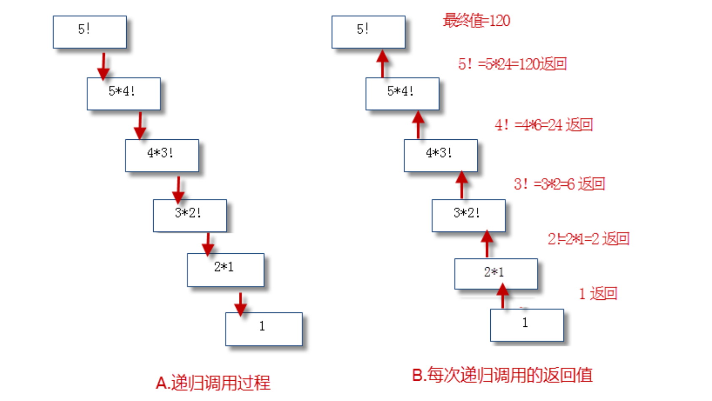


注意：

- 算法简单是递归的优点之一。但是递归调用会占用大量的系统堆栈，内存耗用多，在递归调用层次多时速度要比循环慢的多，所以在使用递归时要慎重。


比如上面的递归耗时 558ms(看电脑配置)。但是用普通循环的话快得多，如下所示。

```java
public class Test23 {
    public static void main(String[ ] args) {
        long d3 = System.currentTimeMillis();
        int a = 10;
        int result = 1;
        while (a > 1) {
        	result *= a * (a - 1);
        	a -= 2;
    	}
        long d4 = System.currentTimeMillis();
        System.out.println(result);
        System.out.printf("普通循环费时："+(d4 - d3));
    }
}
```

