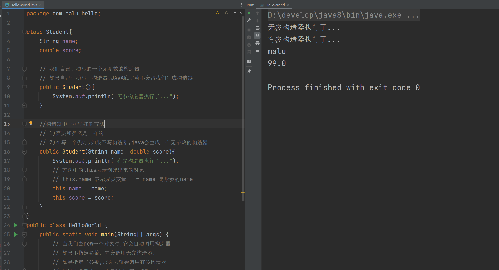

## 一，面向对象基础


类：在一个类中可以放很我的数据。在类中也可以有很多操作数据的方法。


new一个类就可以得到一个对象，对象是引用数据类型，是存储在堆区，在栈区仅仅保留了地址。


```java
package com.malu.hello;

class Student{
    int no;
    double score;

    public void gn(){
        if(this.score>80){
            System.out.println("恭喜你，你考入到了北大~");
        }
    }
}
public class HelloWorld {
    public static void main(String[] args) {
        // new一个类就可以得到一个对象
        // 对象中就有no和score
        Student wc = new Student();
        // 给对象中的数据赋值
        wc.no = 1;
        wc.score = 88;
        wc.gn();
    }
}
```


### 1，什么是面向对象

所谓的面向对象，就是把要处理的数据和操作数据的方法，封装成一个对象，我们只需要操作这个对象就可以了。

我们之前讲过：

* JS中的面向对象
* TS中的面向对象

今天讲的Java中的面向对象和JS或TS中的面向对象类似。

对象是什么？

* 对象就是对数据和操作数据的方法进行的封装
* 有了类，我们就可以去new对象了
* 和JS一样，对象都是存储在堆区的，在栈区仅仅保存了地址

类和对象注意点：

* 类名首字母大写，满足驼峰命名
* 类中定义的变量叫成员变量，说白了就是封装的数据
* 类中定义的方法叫成员方法，说白了就是操作数据的
* 成员变量都有默认值（和基本类型默认值一样），在定义成员变量时，一般不赋初始
* 一个文件中，可以有多个类，但只能一个用public修饰，且public修饰的类名必须是文件名。

### 2，this和构造器

this是什么？

```java
package com.malu.hello;

// 一个Java文件可以同时定义多个class
class Student{
    public void fn(){
        // com.malu.hello.Student@4554617c
        // this表示new出来的对象
        System.out.println("this=>"+this);
    }
}

public class HelloWorld {
    public static void main(String[] args) {
        Student s1 = new Student();
        // com.malu.hello.Student@4554617c
        System.out.println("s1=>"+s1); // s1是包名+类名+地址

        s1.fn();
    }
}
```

结果如下：


通过this在方法中可以访问本类对象的成员变量。代码演示：

```java
package com.malu.hello;

class Student{
    int no; // 成员变量  类中的数据
    double score; // 成员变量  类中的数据

    // 成员方法
    public void fn(){
        System.out.println("this=>"+this);
    }
    public void gn(){
        System.out.println("gn..."+this);
        System.out.println(this.no);
        System.out.println(this.score);
        if(this.score>80){
            System.out.println("你可以上北大啦~");
        }
    }
}
public class HelloWorld {
    public static void main(String[] args) {
        Student s1 = new Student();
        System.out.println(s1.no);  // 没有赋值,它是有默认值的,int类型 默认值进0
        System.out.println(s1.score); // 没有赋值,它是有默认值的,double类型 默认值进0.0
        // 给对象中的成员变量赋值
        s1.no = 111;
        s1.score = 88;
        System.out.println(s1.no);  // 111
        System.out.println(s1.score);  // 88

        System.out.println("s1=>"+s1);

        // s1.fn();

        // 调用对象中的方法
        s1.gn();
    }
}

```

运行结果如下：


构造器其实是一种特殊的方法，但是这个方法没有返回值类型，方法名必须和类名相同。构造器可以有形参，也可以没有形参，构造器是没有返回值类型。代码如下：

```java
package com.malu.hello;

class Student{
    // 无参构造器
    public Student(){
        System.out.println("无参构造器执行了~");
    }
    // 有叁构造器
    public Student(String name,double score){
        System.out.println("有参构造器执行了~");
    }
}

public class HelloWorld {
    public static void main(String[] args) {
        Student s1 = new Student();
        Student s2 = new Student("malu", 100);
    }
}
```

当new一个类时，构造器会自动执行，构造器执行完毕，就意味着这个对象创建完毕了。new的时候，如果传递了参数，那么就会调用有参构建器。效果如下：


在创建对象时，可以通过构造器给对象赋初始值。如下：

```java
package com.malu.hello;

class Student{
    String name;
    double score;

    // 我们自己手动写的一个无参数的构造器
    // 如果自己手动写了构造器,JAVA底层就不会帮我们生成构造器
    public Student(){
        System.out.println("无参构造器执行了...");
    }

    //构造器中一种特殊的方法
    // 1)需要和类名是一样的
    // 2)在写一个类时,如果不写构造器,java会生成一个无参数的构造器
    public Student(String name, double score){
        System.out.println("有参构造器执行了...");
        // 方法中的this表示创建出来的对象
        // this.name 表示成员变量   = name 是形参的name
        this.name = name;
        this.score = score;
    }
}
public class HelloWorld {
    public static void main(String[] args) {
        // 当我们去new一个对象时,它会自动调用构造器
        // 如果不指定参数，它会调用无参构造器，
        // 如果指定了参数,那么它就会调用有参构造器
        // 通过构造器给成员变量赋值,更加优雅一些
        Student s1 = new Student();
        Student s2 = new Student("malu",99);
        System.out.println(s2.name);
        System.out.println(s2.score);

        // 下面的赋值方法 不优雅
        // s1.name = "malu";
        // s1.score = 88;
    }
}

```

运行效果如下：




构造器的注意细节:

* 在设计一个类时，如果不写构造器，Java会自动生成一个无参数构造器。

  

```java
  package com.malu.hello;
  
  class Student{
      // 如果没有指定构造器，JAVA底层会帮我们创建一个无参的构造器
      String name;
      double score;
  }
  
  public class HelloWorld {
      public static void main(String[] args) {
          Student s1 = new Student();
          System.out.println(s1);
      }
  }
```

* 一定定义了有参数构造器，Java就不再提供空参数构造器，此时建议自己加一个无参数构造器。

  

```java
  package com.malu.hello;
  
  class Student{
      // 如果没有指定构造器，JAVA底层会帮我们创建一个无参的构造器
      String name;
      double score;
  
      // 手动写出无参构造器
      public Student(){}
  
      // 如果方法构造中形参名与属性名相同时，需要使用 this 关键字区分属性与形参。
 	  // this.name 表示属性 name；name 表示形参 name
      public Student(String name, double score){
          this.name = name;
          this.score = score;
      }
  }
  
  public class HelloWorld {
      public static void main(String[] args) {
          Student s1 = new Student("wc",100);
          Student s2 = new Student("xq",110);
  
          // 如果手动指定了有参构造器，创建对象时，必须指定参数
          // 如果不指定参数，它会调用无参构造器，
          // 由于你写了有参构造器，无参构造器，它默认就不会提供了
          // 所以我们需要手动地提供无参数构造器
          Student s3 = new Student();
      }
  }
```

无参构造器和有参构造器，是可能通过快捷键生的，如下：


生成的构造器如下：

```java
class Student{
    String name;
    double score;

    public Student() {
    }

    public Student(String name, double score) {
        this.name = name;
        this.score = score;
    }
}
```


构造器总结：

- 构造器通过 new 关键字调用！！

- 构造器虽然有返回值，但是不能定义返回值类型(返回值的类型肯定是本类)，不能在构造器里使用 return 返回某个值。 
- 如果我们没有定义构造器，则编译器会自动定义一个无参的构造方法。如果已定义则编译器不会自动添加！ 
- 构造器的方法名必须和类名一致！


练习：定义一个“点”（Point）类用来表示二维空间中的点（有两个坐标）。要求如下：

- 可以生成具有特定坐标的点对象。
- 提供可以计算该“点”距另外一点距离的方法。


参考答案：

```java
package com.malu.hello;


class Point{
    double x;
    double y;

    public Point(double x, double y) {
        this.x = x;
        this.y = y;
    }

    public double getDistance(Point p){
        // System.out.println(this.x);
        // System.out.println(this.y);
        // System.out.println(p.x);
        // System.out.println(p.y);
        return  Math.sqrt((p.x-this.x)*(p.x-this.x) + (p.y-this.y)*(p.y-this.y));
    }
}


public class HelloWorld {
    public static void main(String[] args) {
        Point p1 = new Point(2.0, 2.0);
        Point p2 = new Point(4.0, 4.0);

        System.out.println(p1.getDistance(p2));

        // System.out.println(p1.x);
        // System.out.println(p1.y);
        // System.out.println(p2.x);
        // System.out.println(p2.y);
    }
}
```


练习一：封装一个UserInfo类，它里面有姓名，有密码，年龄。

```java
package com.malu.hello;

import java.util.Scanner;

class UserInfo{
    String name;
    String pwd;
    int age;

    public UserInfo(String name, String pwd, int age) {
        this.name = name;
        this.pwd = pwd;
        this.age = age;
    }
}

public class HelloWorld {
    public static void main(String[] args) {
        // UserInfo u1 = new UserInfo("malu","123",100);
        // // u1.name = "malu";
        // // u1.pwd = "123";
        // // u1.age = 100;
        // System.out.println(u1.name);
        // System.out.println(u1.pwd);
        // System.out.println(u1.age);

        regiter();
    }

    public static void regiter(){
        Scanner sc = new Scanner(System.in);
        while (true){
            System.out.println("请输入用户名:");
            String user_name = sc.next();
            if(user_name.toUpperCase().equals("Q")){
                break;
            }
            System.out.println("请输入密码");
            String user_pwd = sc.next();
            System.out.println("请输入年龄");
            int user_age = sc.nextInt();
            UserInfo u = new UserInfo(user_name, user_pwd, user_age);
            System.out.println(u.name);
            System.out.println(u.pwd);
            System.out.println(u.age);
        }
    }
}
```


练习二：创建一个警察类，有名字，有角色，角色有两个，一个是队长，一个队员。队长的生命值是500，队员的生命值是200。还有两个方法，一个是查看警察的状态，也就是查某个警察的生命值。还有一个方法，是用投炸弹，去炸掉恐怖分子。炸一个恐怖分子血量减200（先不写，因为需要使用到ArrayList容器）。

```java
class Police{
    String name;
    String role;
    int hit_points;

    public Police(String name, String role) {
        if(role.equals("队员")){
            this.hit_points = 200;
        }else{
            this.hit_points = 500;
        }
        this.name = name;
        this.role = role;
    }
    // 查看警察的生命值
    public void show_status(){
        String msg = "警察"+this.name+"的生命值为:"+this.hit_points;
        System.out.println(msg);
    }
}
public class HelloWorld {
    public static void main(String[] args) {
        Police wc = new Police("wc", "队员");  // 生命值是:200
        Police xq = new Police("xq", "队员");  // 生命值是:200
        Police ml = new Police("ml", "队长");  // 生命值是:500

        wc.show_status();
        xq.show_status();
        ml.show_status();
    }
}
```


练习三：恐怖分子类，有名字，有血量。也就说有两个实例变量。还有三个方法，一个是射击某个警察，射击一次，警察的生命值减5，自身血量减2。另一个方法是扫射某些警察，扫射时，警察的生命值减8。最后一个方法是查看恐怖分子的状态，说白了就是查看某个恐怖分子的血量。

```java
package com.malu.hello;

class Police{
    String name;
    String role;
    int hit_points;

    public Police(String name, String role) {
        if(role.equals("队员")){
            this.hit_points = 200;
        }else{
            this.hit_points = 500;
        }
        this.name = name;
        this.role = role;
    }
    // 查看警察的生命值
    public void show_status(){
        String msg = "警察"+this.name+"的生命值为:"+this.hit_points;
        System.out.println(msg);
    }
}

class Terrorist{
    String name;
    int blood;

    public Terrorist(String name, int blood) {
        this.name = name;
        this.blood = blood;
    }
    // 查看警察的生命值
    public void show_status(){
        String msg = "恐怖分子"+this.name+"的血量为:"+this.blood;
        System.out.println(msg);
    }
    public void shoot(Police p){
        p.hit_points -= 5;
        p.show_status();
        this.blood -= 2;
        this.show_status();
    }
}

public class HelloWorld {
    public static void main(String[] args) {
        Police wc = new Police("wc", "队员");  // 生命值是:200
        Police xq = new Police("xq", "队员");  // 生命值是:200
        Police ml = new Police("ml", "队长");  // 生命值是:500

        // wc.show_status();
        // xq.show_status();
        // ml.show_status();

        Terrorist a1 = new Terrorist("a1",300);
        Terrorist a2 = new Terrorist("a2",200);
        // a1.show_status();
        // a2.show_status();
        a1.shoot(wc);
    }
}
```


### 3，封装

所谓的封装就是把数据和操作数据的方法封装到一个类（对象）中。封装的设计规范用8个字总结，就是：**合理隐藏、合理暴露**。

为什么要合理隐藏，合理暴露？

* 比如，设计一辆汽车时，汽车的发动机、变速箱等一些零件并不需要让每一个开车的知道，所以就把它们隐藏到了汽车的内部。把发动机、变速箱等这些零件隐藏起来，这样做其实更加安全，因为并不是所有人都很懂发动机、变速箱，如果暴露在外面很可能会被不懂的人弄坏。除了隐藏部分零件，但是还是得合理的暴露一些东西出来，让司机能够操纵汽车，让汽车跑起来。比如：点火按钮啊、方向盘啊、刹车啊、油门啊、档把啊... 这些就是故意暴露出来让司机操纵汽车的。


合理隐藏：

* 被private修饰的变量或者方法，只能在本类中被访问

合理暴露：

* 被public修饰的变量或方法，就可以在本类或类外访问

代码演示：

```java
package com.malu.hello;

class Student{
    // 成没变量没有修饰符修饰，默认是public
    // public 公有的，类内和类外都可以访问
    //String name;
    //double score;

    // private表示私有的，只有类内可以访问，类外是不以访问的
    private String name;
    private double score;

    // getScore是被访问public修饰的，所以类外也是可以访问的
    //private double getScore(){
    // getter（访问器）: 主要是用地访问类中私有的成员变量
    public double getScore(){
        //System.out.println(this.score);
        // 类内是可以访问私有的成员变量
        return score;
    }
    // setter（设置器）：主要是用来修改类中的成员变量
    public void setScore(double score){
        if(score >=0 && score<=100){
            this.score = score;
        }else{
            System.out.println("数据非法~");
        }
    }

    public Student() {
    }

    public Student(String name, double score) {
        this.name = name;
        this.score = score;
    }
}

public class HelloWorld {
    public static void main(String[] args) {
        Student s1 = new Student("wc",100);
        Student s2 = new Student("xq",110);
        //System.out.println(s1.name);
        //System.out.println(s1.score);

        System.out.println(s1.getScore());
        s1.setScore(666);
        System.out.println(s1.getScore());
    }
}
```

getter和setter可以自动生成，如下：


### 4，实体JavaBean

实体类就是一种特殊的类，它需要满足下面的要求：

* 类中成员变量都是私有的，并且对外提供getXxx和setXxx方法。
* 类中必须要有一个公共的无参构造器

实体类的作用：

* 实体类中除了有给对象存、取值的方法就没有提供其他方法了。所以实体类仅仅只是用来封装数据用的。

书写一个Student实例类：

```java
package com.malu.hello;

public class Student {
    private String name;
    private String sex;
    private double score;
    private int num;

    public Student() {
    }

    public Student(String name, String sex, double score, int num) {
        this.name = name;
        this.sex = sex;
        this.score = score;
        this.num = num;
    }

    public String getName() {
        return name;
    }

    public void setName(String name) {
        this.name = name;
    }

    public String getSex() {
        return sex;
    }

    public void setSex(String sex) {
        this.sex = sex;
    }

    public double getScore() {
        return score;
    }

    public void setScore(double score) {
        this.score = score;
    }

    public int getNum() {
        return num;
    }

    public void setNum(int num) {
        this.num = num;
    }
}
```

有了实体类，就可以去new了，new完之后，就可以得到对象，如下：

```java
package com.malu.hello;

//import com.malu.hello.Student;  // 这一行代码不用写

// 导入某个类，如果这个类文件是同包，那么就不需要手动导入
public class HelloWorld {
    public static void main(String[] args) {
        // s1和s2封装了4个数据
        Student s1 = new Student("wc", "man", 100, 1);
        Student s2 = new Student("xq", "man", 110, 2);
    }
}

```

实体类应用场景：

* 实体类仅仅只用来封装数据，而对数据的处理交给其他类来完成，以实现数据和数据业务处理相分离。

上面已经创建好了实体类，再创建一个业务处理的类，如下：

```java
package com.malu.hello;

public class StudentOperator {
    // Student是一个类型，是我们自己写的类型
    // 成员变量
    private Student student;

    public StudentOperator(Student student) {
        this.student = student;
    }

    public void printPass(){
        if(student.getScore() >= 60){
            System.out.println(student.getName() + "学生成绩及格");
        }else{
            System.out.println(student.getName() + "学生成绩不及格");
        }
    }
}
```

在main方法中，调用之，如下：

```java
package com.malu.hello;

public class HelloWorld {
    public static void main(String[] args) {
        Student s1 = new Student("wc", "man", 10, 1);
        Student s2 = new Student("xq", "man", 90, 2);

        StudentOperator studentOperator = new StudentOperator(s2);
        studentOperator.printPass();
    }
}
```

目前工程目录是这样的：


### 5，案例

需求：

* 想要展示系统中全部的电影信息（每部电影：编号、名称、价格）
* 允许用户根据电影的编号（id），查询出某个电影的详细信息
* 运行程序时，能够根据用户的选择，执行不同的功能

第一步：定义电影实体类，包含这部电影的相关信息，比如：电影的编号（id）、电影的名称（name）、电影的价格（price）、电影的分数（score）、电影的导演（director）、电影的主演（actor）、电影的简介（info）。 

定义Movie实体类：

```java
package com.malu.movie;

public class Movie {
    private int id;
    private String name;
    private double price;
    private double score;
    private String director;
    private String actor;
    private String info;

	// .... 省略了构造器, getter和setter
}
```

第二步：定义电影操作类，电影操作类中MovieOperator，需要有一个 `Movie[] movies;` 用来存储多部电影对象；在MovieOperator类中，提供对外提供，对电影数组进行操作的方法。如 `printAllMovies()` 用于打印数组中所有的电影信息， `searchMovieById(int id)` 方法根据id查找一个电影的信息并打印。

定义电影操作类MovieOperator类：

```java
package com.malu.movie;

public class MovieOperator {
    
    private Movie[] movies;

    public MovieOperator(Movie[] movies) {
        this.movies = movies;
    }

    // 展示所有的电影
    public void printAllMovies(){
        
    }

    // 根据ID找到某个电影
    public void findMovieById(int id){

    }
}

```


第三步：定义测试类，准备好所有的电影数据，并用一个数组保存起来。每一部电影的数据可以封装成一个对象。然后把对象用数组存起来即可。

定义测试类Test，如下：

```
package com.malu.movie;

public class Test {
    public static void main(String[] args) {
        Movie[] movies = new Movie[4];
        //int id, String name, double price, double score, String director, String actor, String info
        movies[0] = new Movie(1,"肖申克的救赎",12.0,9.8,"wc","xq","12万人想看");
        movies[1] = new Movie(2,"霸王别姬",13.0,6.8,"wc","xq","11万人想看");
        movies[2] = new Movie(3,"阿甘正传",14.0,7.8,"wc","xq","14万人想看");
        movies[3] = new Movie(4,"千与千寻",15.0,9.8,"wc","xq","19万人想看");
    }
}
```


目前为止，工程的目录结构如下：


测试数据准备好了，然后就需对电影数据进行操作了，创建一个MovieOperator类，如下：

```java
package com.malu.movie;

import java.util.Scanner;

public class Test {
    public static void main(String[] args) {
        Movie[] movies = new Movie[4];
        //int id, String name, double price, double score, String director, String actor, String info
        movies[0] = new Movie(1,"肖申克的救赎",12.0,9.8,"wc","xq","12万人想看");
        movies[1] = new Movie(2,"霸王别姬",13.0,6.8,"wc","xq","11万人想看");
        movies[2] = new Movie(3,"阿甘正传",14.0,7.8,"wc","xq","14万人想看");
        movies[3] = new Movie(4,"千与千寻",15.0,9.8,"wc","xq","19万人想看");


        MovieOperator movieOperator = new MovieOperator(movies);
        Scanner sc = new Scanner(System.in);
        while (true){
            System.out.println("===欢迎访问XXX电影信息系统===");
            System.out.println("1. 输入1，查询所有的电影");
            System.out.println("2. 输入2，根据ID查询某个电影详情");
            System.out.println("请输入1或2：");
            int command = sc.nextInt();
            switch (command){
                case 1:
                    movieOperator.printAllMovies();
                    break;
                case 2:
                    System.out.println("请输入你要查询的电影ID");
                    int id = sc.nextInt();
                    movieOperator.findMovieById(id);
                    break;
                default:
                    System.out.println("你输入的命令有误~");
            }
        }
    }
}

```


实现movieOperator它里面的两个方法，如下：

```java
package com.malu.movie;

public class MovieOperator {

    private Movie[] movies;

    public MovieOperator(Movie[] movies) {
        this.movies = movies;
    }

    // 展示所有的电影
    public void printAllMovies(){
        System.out.println("----------- 系统全部电影信息如下：-----------");
        for (int i = 0; i < movies.length; i++) {
            Movie m = movies[i];
            System.out.println("编号："+m.getId());
            System.out.println("名称："+m.getName());
            System.out.println("价格："+m.getPrice());
        }
        System.out.println("-------------------------");
    }

    // 根据ID找到某个电影
    public void findMovieById(int id){
        for (int i = 0; i < movies.length; i++) {
            Movie m = movies[i];
            if(m.getId() == id){
                System.out.println("此电影详情如下：");
                System.out.println("编号："+m.getId());
                System.out.println("名称："+m.getName());
                System.out.println("价格："+m.getPrice());
                System.out.println("得分："+m.getScore());
                System.out.println("导演："+m.getDirector());
                System.out.println("主演："+m.getActor());
                System.out.println("其它信息："+m.getInfo());
                return;
            }
        }
        System.out.println("没有此电影信息~");
    }
}
```


测试之，如下：


### 6，成员变量和局部变量的区别

区别如下：

| 区别         | 成员变量                   | 局部变量                                   |
| ------------ | -------------------------- | ------------------------------------------ |
| 类中位置不同 | 类中，方法外               | 常见于方法中                               |
| 初始化值不同 | 有默认值，不需要初始化赋值 | 没有默认值，使用之前必须完成赋值           |
| 内存位置不同 | 堆内存                     | 栈内存                                     |
| 作用域不同   | 整体对象                   | 在所归属的大括号中                         |
| 生命周期不同 | 与对象共存亡               | 随着方法的调用而生，随着方法的运行结束而亡 |


面向对象的核心点就是封装，将数据和数据的处理方式，都封装到对象中； 至于对象要封装哪些数据？对数据进行怎样的处理？ 需要通过类来设计。需要注意的是，不同的人，对同一个对象进行设计，对象封装那些数据，提供哪些方法，可能会有所不同；只要能够完成需求，符合设计规范，都是合理的设计。


代码演示：

```java
package com.malu.variable;

class Student{
    // 成员变量
    //    位置：类里面，方法外面
    //    初始值：有默认值的，不需要初始化，当然它也是可以初始化的，一般不去初始化
    //    内存位置：堆内存
    //    作用域：整体对象，与对象共存亡
    private String name = "malu";
    private double score;

    public void fn(){
        // 局部变量
        //    位置：在方法里面
        //    初始值：使用之前必须完成赋值
        //    内存位置：栈内存
        //    作用域：在所属的{}中有效，随着方法的运行结束而死亡
        String name;
        double score = 10;

        //System.out.println(name);
    }
}
```


## 二，常用API

### 1，包

API的翻译是Application Program Interface，叫应用程序接口，说白了，就是别人写好的一些程序，给咱们程序员直接拿去调用。Java官方其实已经给我们写好了很多很多类，每一个类中又提供了一系列方法来解决与这个类相关的问题。如：

* 比如String类，表示字符串，提供的方法全都是对字符串操作的。
* 比如ArrayList类，表示一个容器，提供的方法都是对容器中的数据进行操作的。

为什么要学习这些API？

* 不要重复造轮子

API分类：

* 官方的API，只需要学习一些常用的就行。
* 第三方的API，有的第三方API比官方的还好用。


在讲一些API之，我们先说一下包，Java官方提供的类有很多，为了对这些类进行分门别类的管理，别人把写好的类都是放在不同的包里的。包其实类似于文件夹，一个包中可以放多个类文件。


关于包的一些知识点：

* 要调用自己所在包下的其他程序，可以直接调用。（同一个包下的类，互相可以直接调用）
* 要调用其他包下的程序，则必须在当前程序中导包, 才可以访问！导包格式：`import 包名.类名`
* 要调用Java.lang包下的程序，不需要我们导包的，可以直接使用。
* 要调用多个不同包下的程序，而这些程序名正好一样，此时默认只能导入一个程序，另一个程序必须带包名访问。

代码演示：


### 2，String类

Java为了方便我们处理字符串，所以给我们提供了一个String类来代表字符串，这个类就是 `java.lang` 包下。按照面向对象的编程思想，对于字符串的操作，只需要创建字符串对象，用字符串对象封装字符串数据，然后调用String类的方法就可以了。Java程序中的所有字符串字面值（如"abc"）都是字符串的实例实现，实例实例，其实指的就是字符串对象。

创建String对象的第一种方式：

```java
//  方式一：字符串字面量创建
String s1 = "ok";  // "ok"是字符串对象
String s2 = "malu";

System.out.println(s1);
System.out.println(s2);
```

创建String对象的第二种方式：

```java
//方式二：new String类
String s3 = new String();
System.out.println(s3);  // 创建一个空白字符串对象，不含有任何内容

String s4 = new String("hello java"); // 根据传入的字符串内容生成一个字符串对象
System.out.println(s4);

char[] chars = {'a','b','码','路'};
String s5 = new String(chars);  // 根据字符数组，创建字符串对象
System.out.println(s5);

byte[] bytes = {97,98,99};
String s6 = new String(bytes); // 根据字节数组，创建字符串对象
System.out.println(s6);
```


创建字符串对象，它里面封装了字符串数据，利用字符串对象，可以对字符串数据进行处理。创建字符串对象有两种方式：

- 直接使用双引号 " "
- new String类，new时，它会调用类中的构造器去初始化字符串对象


学会了创建字符串，还需要知道都有哪些常用操作字符串的方法：


上面的API，不需要刻意去记忆，用的时候简单去查一下，用的多了，自然就记住了。代码如下：

```java
package com.malu.hello;

public class HelloWorld {
    public static void main(String[] args) {
        String s1 = "malu";

        // 获取字符串长度
        System.out.println(s1.length());

        // 根据索引获取某个字符
        char c = s1.charAt(1);
        System.out.println(c);

        //遍历字符串
        for (int i = 0; i < s1.length(); i++) {
            char ch = s1.charAt(i);
            System.out.println(ch);
        }

        System.out.println("-------------");

        //把字符串转化成字符数组
        char[] chars = s1.toCharArray();
        for (int i = 0; i < chars.length; i++) {
            System.out.println(chars[i]);
        }

        // s2 和 s3都是字符串对象
        String s2 = new String("malu001");
        String s3 = new String("malu001");
        System.out.println(s2 == s3);
        // equals判断字符串中的内容是否一样，一样就返回true
        System.out.println(s2.equals(s3));

        String s4 = new String("malu002");
        String s5 = new String("MaLu002");
        // 忽略大小写后，进行比较，看内容是否一样
        System.out.println(s4.equalsIgnoreCase(s5));

        String s6 = new String("Java是最好的编程语言之一");
        // substring 截取字符串中的内容，包前不包后
        String substr = s6.substring(0, 3);
        System.out.println(substr);
        // 只传一个索引，表示从这个索引位置截取到最后
        String substr2 = s6.substring(3);
        System.out.println(substr2);

        String s7 = "这个电影真垃圾，垃圾电影";
        // 把字符串中某个内容替换成新的内容，返回新的字符串对象给我们
        String res1 = s7.replace("垃圾", "**");
        System.out.println(res1);

        String s8 = new String("Java是最好的编程语言之一，我爱Java，Java不爱我");
        // 判断字符串是否包含某个子串
        System.out.println(s8.contains("java"));
        System.out.println(s8.contains("Java"));
        System.out.println(s8.contains("Java1"));
        System.out.println(s8.contains("Java是"));

        String s9 = "malu";
        // 判断字符串是否以ma开头
        System.out.println(s9.startsWith("ma"));
        System.out.println(s9.startsWith("ma2"));

        String s10 = "malu,wangcai,xiaoqiang,zhangsan,lisi";
        String[] names = s10.split(",");
        for (int i = 0; i < names.length; i++) {
            System.out.println(names[i]);
        }
    }
}
```

关于字符串的注意细节：

* String对象的内容不可改变，被称为不可变字符串对象。
* 双引号写的字符串对象，会存储到字符串常量池中，且相同内容的字符串只存储一份。
* 通过new创建的字符串对象，每new一次都会产生一个新的对象存储到堆中。

关于字符串的注意细节，看如下代码：

```java
String name = "你好";
name += "Java";
name += "malu";
System.out.println(name);
```

只要是以 `“”` 方式写出的字符串对象，会在堆内存中的**字符串常量池**中存储，执行第一句话时，会在堆内存的常量池中，创建一个字符串对象 `“你好”` ，然后把 `“你好”` 的地址赋值给 `String name` 。


当执行第二句话时，又会再堆内存的常量池中创建一个字符串 `“Java”` ，和 `“你好”` 拼接，拼接之后还会产生一个新的字符串对象 `”你好JAVA“` ，然后将新产生的 `“你好JAVA”` 对象的地址赋值给 `String name` 变量。


当执行第三句话时，又会再堆内存的常量池中创建一个字符串 `“malu”` ，和 `“你好java”` 拼接，拼接之后还会产生一个新的字符串对象 `”你好JAVAmalu“` ，然后将新产生的 `“你好JAVAmalu”` 对象的地址赋值给 `String name` 变量。


结论：使用双引号创建的“你好","Java","malu"这三个字符串对象，从始到终，它们都是存储在字符串常量池的，它们的内容是没有发生变化的，所以说String对象是不可变的。


使用又引号创建的字符串对象 和 new出来的字符串对象的区别？

- 使用`“...”`方式写出的字符串对象，会存储到字符串常量池，且相同内容的字符串只存储一份。

  

- 通过`new`方式创建字符串对象，每new一次都会产生一个新的对象放在堆内存中。

  


案例：系统正确的登录名和密码是amdin，123456, 。请在控制台开发一个登录界面，接收用户输入的登录名和密码，判断用户是否登录成功，登录成功后，展示：欢迎进入系统，即可停止程序，最多三次机会。

```java
package com.malu.hello;

import java.util.Scanner;

public class HelloWorld {
    public static void main(String[] args) {
        for (int i = 0; i < 3; i++) {
            Scanner sc = new Scanner(System.in);
            System.out.println("请输入用户名：");
            String userName = sc.next();
            System.out.println("请输入密码：");
            String pwd = sc.next();
            boolean res = login(userName,pwd);
            if(res){
                System.out.println("欢迎访问XXXX系统");
                break;
            }else{
                System.out.println("用户名或密码不对，请再次输入");
            }
        }
    }
    public static boolean login(String userName,String pwd){
        String okUserName = "admin";
        String okPwd = "123456";
        //if(okUserName.equals(userName) && okPwd.equals(pwd)){
        //    return true; // 登录成功
        //}else{
        //    return false;
        //}
        return  okUserName.equals(userName) && okPwd.equals(pwd);
    }
}
```

需求：随机产生验证码，验证码的每位可能是数字，大写字母，小写字母。

```java
package com.malu.hello;

import java.util.Random;
import java.util.Scanner;

public class HelloWorld {
    public static void main(String[] args) {
        // 随机产生验证码，验证码的每位可能是数字，大写字母，小写字母。
        System.out.println(createCode(4));
        System.out.println(createCode(6));
    }
    public static String createCode(int n){
        String code = "";
        String data = "abcdefghijklmnopqrstuvwxyzABCDEFGHIJKLMNOPQRSTUVWXYZ0123456789";

        Random rd = new Random();
        for (int i = 0; i < n; i++) {
            int index = rd.nextInt(data.length());
            code += data.charAt(index);
        }

        return code;
    }
}
```

### 3，ArrayList类

数组一旦创建大小不变，比如创建一个长度为3的数组，就只能存储3个元素，想要存储第4个元素就不行。而集合是大小可变的，想要存储几个元素就存储几个元素，在实际工作中用得更多。ArrayList就是一种集合，集合其实有很多，ArrayList只是其中的一种。

集合学习要点：

* 创建集合
* 调用集合中的方法对集合中的数据进行CRUD操作

  集合有哪些特点

创建集合：

```java
package com.malu.hello;

import java.util.ArrayList;

public class HelloWorld {
    public static void main(String[] args) {
        // 创建出了ArrayList集合对象，创建出来的是一个空的集合对象
        ArrayList<String> list1 = new ArrayList<String>();
        // 从jdk1.7开始支持
        ArrayList<String> list2 = new ArrayList<>();
    }
}
```


上代码：

```java
package com.malu.hello;

import java.util.ArrayList;

public class HelloWorld {
    public static void main(String[] args) {
        ArrayList<String> list = new ArrayList<>();

        list.add("aaa");
        list.add("bbb");
        list.add("ccc");
        System.out.println(list);

        // 给某个索引位置添加数据
        list.add(1,"java");
        System.out.println(list);

        // 获取集合的大小，集合中存储的元素个数
        System.out.println(list.size());

        // remove删除一个元素，返回的就是被删除的那个元素
        System.out.println(list.remove(1));
        System.out.println(list);

        System.out.println(list.get(2));

        list.add("aaa");
        System.out.println(list);

        // 默认删除第1次出现的那个元素
        System.out.println(list.remove("aaa"));
        System.out.println(list);

        // set是根据索引修改某一个元素，返回修改的那个元素
        System.out.println(list.set(1,"ccc666"));
        System.out.println(list);
    }
}
```

案例：

现在假如购物车中存储了如下商品：枸杞，Java入门，宁夏枸杞，黑枸杞，人字拖，特级枸杞，枸杞子。现在用户不想买枸杞了，选择批量删除，完成需求。

```java
package com.malu.hello;

import java.util.ArrayList;

public class HelloWorld {
    public static void main(String[] args) {
        //现在假如购物车中存储了如下商品：枸杞，Java入门，宁夏枸杞，
        // 黑枸杞，人字拖，特级枸杞，枸杞子。现在用户不想买枸杞了，
        // 选择批量删除，完成需求。

        ArrayList<String> list = new ArrayList<>();
        list.add("Java入门");
        list.add("宁夏枸杞");
        list.add("黑枸杞");
        list.add("人字拖");
        list.add("特级枸杞");
        list.add("枸杞子");
        System.out.println(list);

        for (int i = 0; i < list.size(); i++) {
            String ele = list.get(i);
            if(ele.contains("枸杞")){
                list.remove(ele);
            }
        }
        System.out.println(list);
    }
}

```

发现并不能完成功能，因为，调用remove后，改变了原Arraylist集合。分析上面的程序执行不成功的原因。对应的解决办完：

```java
package com.malu.hello;

import java.util.ArrayList;

public class HelloWorld {
    public static void main(String[] args) {
        //现在假如购物车中存储了如下商品：枸杞，Java入门，宁夏枸杞，
        // 黑枸杞，人字拖，特级枸杞，枸杞子。现在用户不想买枸杞了，
        // 选择批量删除，完成需求。

        ArrayList<String> list = new ArrayList<>();
        list.add("Java入门");
        list.add("宁夏枸杞");
        list.add("黑枸杞");
        list.add("人字拖");
        list.add("特级枸杞");
        list.add("枸杞子");
        System.out.println(list);

        for (int i = 0; i < list.size(); i++) {
            String ele = list.get(i);
            if(ele.contains("枸杞")){
                list.remove(ele);
                i--;
            }
        }
        System.out.println(list);
    }
}
```


还有一种解决办法，倒着删除，如下：

```java
package com.malu.hello;

import java.util.ArrayList;

public class HelloWorld {
    public static void main(String[] args) {
        //现在假如购物车中存储了如下商品：枸杞，Java入门，宁夏枸杞，
        // 黑枸杞，人字拖，特级枸杞，枸杞子。现在用户不想买枸杞了，
        // 选择批量删除，完成需求。

        ArrayList<String> list = new ArrayList<>();
        list.add("Java入门");
        list.add("宁夏枸杞");
        list.add("黑枸杞");
        list.add("人字拖");
        list.add("特级枸杞");
        list.add("枸杞子");
        System.out.println(list);

        for (int i = list.size()-1; i >=0; i--) {
            String ele = list.get(i);
            if(ele.contains("枸杞")){
                list.remove(ele);
            }
        }
        System.out.println(list);
    }
}
```


案例：完成菜品上架，以及菜品信息浏览功能。使用ArrayList和面向对象编程。

分析需求发现：

1. 在外卖系统中，每一份菜都包含，菜品的名称、菜品的原价、菜品的优惠价、菜品的其他信息。那我们就可以定义一个菜品类（Food类），用来描述每一个菜品对象要封装那些数据。

2. 接着再写一个菜品管理类（FoodManager类），提供展示操作界面、上架菜品、浏览菜品的功能。

   


首先我们先定义一个菜品类（Food类），用来描述每一个菜品对象要封装那些数据。

```java
package com.malu.hello;

public class Food {
    private String name;	//菜品名称
    private double originalPrice; //菜品原价
    private double specialPrice; //菜品优惠价
    private String info; //菜品其他信息

    public Food() {
    }

    public Food(String name, double originalPrice, double specialPrice, String info) {
        this.name = name;
        this.originalPrice = originalPrice;
        this.specialPrice = specialPrice;
        this.info = info;
    }

    public String getName() {
        return name;
    }

    public void setName(String name) {
        this.name = name;
    }

    public double getOriginalPrice() {
        return originalPrice;
    }

    public void setOriginalPrice(double originalPrice) {
        this.originalPrice = originalPrice;
    }

    public double getSpecialPrice() {
        return specialPrice;
    }

    public void setSpecialPrice(double specialPrice) {
        this.specialPrice = specialPrice;
    }

    public String getInfo() {
        return info;
    }

    public void setInfo(String info) {
        this.info = info;
    }
}
```

定义菜品管理类FoodManager，提供上架菜品的功能、浏览菜品的功能、展示操作界面的功能。

```java
package com.malu.hello;

import java.util.ArrayList;
import java.util.Scanner;

public class FoodManager {
    private ArrayList<Food> foods = new ArrayList<>();
    private Scanner sc = new Scanner(System.in);

    // 上架菜品
    public void add(){
        System.out.println("===菜品上架==");
        Food food = new Food();
        System.out.println("请您输入上架菜品的名称：");
        String name = sc.next();
        food.setName(name);

        System.out.println("请您输入上架菜品的原价：");
        double originalPrice = sc.nextDouble();
        food.setOriginalPrice(originalPrice);

        System.out.println("请您输入上架菜品的优惠价：");
        double specialPrice = sc.nextDouble();
        food.setSpecialPrice(specialPrice);

        System.out.println("请您输入上架菜品的其他信息：");
        String info = sc.next();
        food.setInfo(info);

        foods.add(food);
        System.out.println("恭喜你，上加成功~");
    }

    // 打印所有的菜品
    public void printAllFoods(){
        System.out.println("==当前菜品信息如下：==");
        for (int i = 0; i < foods.size(); i++) {
            Food food = foods.get(i);
            System.out.println("菜品名称：" + food.getName());
            System.out.println("菜品原价：" + food.getOriginalPrice());
            System.out.println("菜品优惠价：" + food.getSpecialPrice());
            System.out.println("其他描述信息：" + food.getInfo());
            System.out.println("------------------------");
        }
    }

    // 提供操作界面
    public void start(){
        while (true){
            System.out.println("====欢迎进入商家后台管理系统=====");
            System.out.println("1、上架菜品（add）");
            System.out.println("2、浏览菜品（query）");
            System.out.println("3、退出系统（exit）");
            System.out.println("请您选择操作命令：");
            String command = sc.next();
            switch (command){
                case "add":
                    add();
                    break;
                case "query":
                    printAllFoods();
                    break;
                case "exit":
                    return;
                default:
                    System.out.println("你输入的指令有误~");
            }
        }
    }
}
```

测试类Test，在测试类中进行测试。其实测试类，只起到一个启动程序的作用。

```java
package com.malu.hello;

import java.util.ArrayList;
import java.util.Scanner;

public class FoodManager {
    private ArrayList<Food> foods = new ArrayList<>();
    private Scanner sc = new Scanner(System.in);

    // 上架菜品
    public void add(){
        System.out.println("===菜品上架==");
        Food food = new Food();
        System.out.println("请您输入上架菜品的名称：");
        String name = sc.next();
        food.setName(name);

        System.out.println("请您输入上架菜品的原价：");
        double originalPrice = sc.nextDouble();
        food.setOriginalPrice(originalPrice);

        System.out.println("请您输入上架菜品的优惠价：");
        double specialPrice = sc.nextDouble();
        food.setSpecialPrice(specialPrice);

        System.out.println("请您输入上架菜品的其他信息：");
        String info = sc.next();
        food.setInfo(info);

        foods.add(food);
        System.out.println("恭喜你，上加成功~");
    }

    // 打印所有的菜品
    public void printAllFoods(){
        System.out.println("==当前菜品信息如下：==");
        for (int i = 0; i < foods.size(); i++) {
            Food food = foods.get(i);
            System.out.println("菜品名称：" + food.getName());
            System.out.println("菜品原价：" + food.getOriginalPrice());
            System.out.println("菜品优惠价：" + food.getSpecialPrice());
            System.out.println("其他描述信息：" + food.getInfo());
            System.out.println("------------------------");
        }
    }

    // 提供操作界面
    public void start(){
        while (true){
            System.out.println("====欢迎进入商家后台管理系统=====");
            System.out.println("1、上架菜品（add）");
            System.out.println("2、浏览菜品（query）");
            System.out.println("3、退出系统（exit）");
            System.out.println("请您选择操作命令：");
            String command = sc.next();
            switch (command){
                case "add":
                    add();
                    break;
                case "query":
                    printAllFoods();
                    break;
                case "exit":
                    return;
                default:
                    System.out.println("你输入的指令有误~");
            }
        }
    }
}
```
