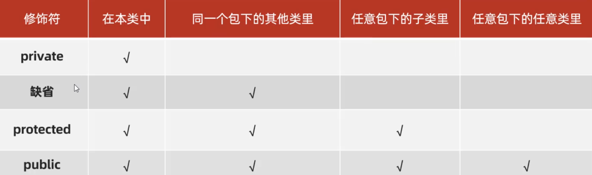

## 一，静态

面向对象最核心的套路是：**设计对象来处理数据，解决问题。** 学习OOP进阶，目的就是让我们设计出来的对象更加好用。接下来，我们会学习很多小的知识点，这些小的知识点需要我们尽可能学生，到后面我们利用这些知识点去设计对象。

### 1，Static修饰成员变量

先学习一个static关键字，static读作静态，可以用来修饰成员变量，也能修饰成员方法。当static修饰成员变量时，被static修饰的成员变量，叫类变量，反之叫实例变量。

* 类变量：有static修饰，属于类，在计算机中只有一份，会被类的全部对象共享，用类名调用。
* 实例变量：无static修饰，属于每个对象的，每一个对象都有一份，用对象调用。


访问或调用方式：

* 由于静态变量是属于类的，只需要通过类名就可以调用：**类名. 静态变量**
* 实例变量是属于对象的，需要通过对象才能调用：**对象. 实例变量**


**只要看到static，就必须知道，这个成员是属于类的，不是属于对象的。**


代码：

```java
class Student{
    int age;  // 实例变量(成员属性,成员)  实例就是对象
    // 看到static,就知道它是属于一个类的
    // 一个类中的成员,可以通过state进行修改,是属于类的,只有一份,所有对象共享
    // 通过类名来调用
    static String name; // 类变量

    // 静态变量,是属于类的,被所有的对象共享
    static int num = 1000000;
}

public class HelloWorld {
    public static void main(String[] args) {
        // s1叫对象,也叫实例
        Student s1 = new Student();
        // s1.age  .是一个运算符  叫成员访问运算符
        System.out.println(s1.age); // 0
        s1.age = 110;
        System.out.println(s1.age);  // 110

        // 类变量是属于类的,需要通过类名打点来访问
        System.out.println(Student.name);
        Student.name = "malu";
        System.out.println(Student.name);

        // 测试发现,通过对象打点也能访问,这种写法不推荐,不推荐,不推荐
        // System.out.println(s1.name);
        // s1.name = "malu";  // 不推荐,不推荐,不推荐
        // System.out.println(s1.name); // 不推荐,不推荐,不推荐

        System.out.println(s1.num);
        Student s2 = new Student();
        s2.age = 220;
        System.out.println(s2.age);
    }
}
```

在实际开发中，如果某个数据只需要一份，且希望能够被共享（访问、修改），则该数据可以定义成类变量来记住。需求：系统启动后，要求用于类可以记住自己创建了多少个用户对象。

第一步：先定义一个 `Student` 类，在用户类中定义一个static修饰的变量，用来表示在线人数；

```java
class Student{
    // public 表示number成员是公共
    // state 表示number是静态的,属于类的,类变量
    public static int number;  // 默认值是0

    // 自动调用无参构造器
    public Student() {
        // System.out.println("------");
        // 修改类变量  类变量是属于类的,通过类名去打点访问
        // Student.number++; // ok
        
        // 在类内访问类变量，类名是可以不用写
        number++;
    }
}
```

第二步：再写一个测试类，再测试类中创建5个Student对象，再打印number的值，观察number的值是否再自增。

```java
public class HelloWorld {
    public static void main(String[] args) {
        Student s1 = new Student();
        Student s2 = new Student();
        Student s3 = new Student();
        Student s4 = new Student();
        Student s5 = new Student();
        Student s6 = new Student();

        System.out.println("根据Student类创建出来的对象个数为:"+Student.number);
    }
}
```

### 2，Static修饰成员方法

成员方法根据有无static也分为两类：**类方法、实例方法**

* 类方法：有static修饰的成员方法，属于类。调用时直接用类名调用即可。
* 实例方法：无static修饰的成员方法，属于对象。调用时，需要使用对象调用。

定义一个Student类，在类中定义一个类方法、定义两个实例方法：

```java
class Student{
    // 没有使用static修改  也没有使用public修改(类外是可以访问)
    double score = 88; // 实例变量
    static int num = 666;  // 类变量 静态变量 属于类的

    // 此访问使用static修改，叫类访问，或叫静态访问
    // 只要是静态的东西，都是通过类来调用的
    public static void printHello(){
        System.out.println("hello java");
        System.out.println("hello java");
    }

    // 也没有使用public修改，类外也是可以访问的
    // 此访问没有使用static修改，叫实例访问
    public void printHi(){
        System.out.println("hi java");
        System.out.println("hi java");
    }

    // 实例方法  没有写static
    public void printPass(){
        // System.out.println("成绩"+(this.score >= 60 ? "及格" : "不及格"));

        // this可以不写
        System.out.println("成绩"+(score >= 60 ? "及格" : "不及格"));
        // System.out.println(Student.num);
        System.out.println(num);
    }
}
```

在定义一个测试类，注意类方法、对象方法调用的区别：

```java
public class HelloWorld {
    public static void main(String[] args) {
        Student s1 = new Student();
        System.out.println(s1.score);

        // 对象调用实例方法
        // s1.printHi();

        // 通过测试发现一个对象，是可以调用静态方法的，不推荐，不推荐，不推荐
        // s1.printHello();

        // 通过类来调用静态方法，推荐
        // Student.printHello();

        // 通过类名只能调用静态访问，不能调用实例方法
        // Student.printHi();

        s1.printPass();

        System.out.println(s1.score);
        System.out.println(Student.num);
    }
}
```

类方法细节：

* static修饰的方法，可以被类名调用，是因为它是随着类的加载而加载的，所以类名直接就可以找到static修饰的方法。
* 非static修饰的方法，需要创建对象后才能调用，是因为实例方法中可能会访问实例变量，而实例变量需要创建对象后才存在。所以实例方法，必须创建对象后才能调用。

### 3，工具类

类方法的一个应用场景之一就是做工具类，一个工具类它里面的方法可以全都是静态的，那么这个类中的方法就全都可以被类名直接调用，调用起来非常方便。

实现一个生成验证码的工具类：

```java
class MyUtils{
    public static String createCode(int n){
        String code = "";
        String data = "abcdefghijklmnopqrstuvwxyzABCDEFGHIJKLMNOPQRSTUVWXYZ0123456789";

        Random rd = new Random();
        for (int i = 0; i < n; i++) {
            int index = rd.nextInt(data.length());
            code += data.charAt(index);
        }
        return code;
    }
}
```

调用 `MyUtils` 的 `createCOde()方法` 产生任意个数的验证码：

```java
public class HelloWorld {
    public static void main(String[] args) {
        System.out.println(MyUtils.createCode(6));;
        System.out.println(MyUtils.createCode(8));;
        System.out.println(MyUtils.createCode(12));;
    }
}
```

工具类里的方法全都是静态的，推荐用类名调用为了防止使用者用对象调用。我们可以把工具类的构造方法私有化。如下：

```java
// 工具类 不想让别人去new
class MyUtils{
    // 把构造器变成私有的，就不能new了
    private MyUtils() {
    }

    static String createCode(int n){
        String code = "";
        String data = "abcdefghijklmnopqrstuvwxyzABCDEFGHIJKLMNOPQRSTUVWXYZ0123456789";
        Random rd = new Random();
        for (int i = 0; i < n; i++) {
            int index = rd.nextInt(data.length());
            code += data.charAt(index);
        }
        return code;
    }
}


public class HelloWorld {
    public static void main(String[] args) {
        System.out.println(MyUtils.createCode(6));
        System.out.println(MyUtils.createCode(8));
        System.out.println(MyUtils.createCode(12));

        MyUtils myUtils = new MyUtils();
    }
}
```

### 4，Static注意事项

注意事项：

* 类方法中可以直接访问类的成员，不可以直接访问实例成员。

* 实例方法中即可以直接访问类成员，也可以直接访问实例成员。

* 实例方法中可以出现this关键字，类方法中不可以出现this关键字。

代码：

```java
// - 类方法中可以直接访问类的成员，不可以直接访问实例成员。
// - 实例方法中即可以直接访问类成员，也可以直接访问实例成员。
// - 实例方法中可以出现this关键字，类方法中不可以出现this关键字。
class Student{
    static String schoolName; // 类变量
    double score; // 实例变量

    // 类方法
    public static void printHello(){
        System.out.println(Student.schoolName);  // null
        Student.schoolName = "bd";
        System.out.println(Student.schoolName); // bd
        Student.printHi();

        // 类方法中不可以直接访问实例成员(实例变量，实例方法)
        // this.score = 100;
        // score = 1000
        // printHi2();
    }

    // 类方法
    public static void printHi(){
        System.out.println("printHi");
    }

    // 实例方法
    public void printHi2(){
        System.out.println("printHi2");

        System.out.println(Student.schoolName);
        System.out.println(this.score);
        
        Student.printHi();
    }
}


public class HelloWorld {
    public static void main(String[] args) {
        // Student.printHello();

        Student s1 = new Student();
        s1.printHi2();
    }
}
```

### 5，代码块

代码块根据有无static修饰分为两种：静态代码块、实例代码块

* 静态代码块，类加载时自动执行，类只会加载一次，所以静态代码块也只会加载一次。可以大静态代码块中，对类变量进行初始化赋值。静态代码块不需要创建对象就能够执行。
* 每次创建对象，就会执行实例代码块，在构造器之前执行。和构造器一样，都是用来完成对象初始化的，可以对实例变量进行初始化赋值。作用和构造器作用是一样的。

静态代码块和实例代码块代码：

```java
class Student{
    static String schoolName; // 类变量
    double score = 88; // 实例变量  如果不赋值，也是有默认值的

    public Student() {
        System.out.println("无参构造器执行啦~");
    }

    // 构造器只能给实例变量赋值
    public Student(double score) {
        this.score = score;
        System.out.println("有参构造器执行啦~");
    }

    // 静态代码块 通过static修饰
    // 静态代码块，也是随着类的加载的而加载的，只会加载一次
    //  作用：在静态代码块中，可以给类变量进行初始化。不需要创建对象，就会执行
    static {
        System.out.println("静态代码块执行了~");
        // Student.schoolName = "bd";
        // 可以在静态代码块中，给类变量赋初值
        schoolName = "bd";
    }

    // 实例代码块：没有static修改的,每次创建对象，实例代码块都会执行
    // 实例代码块是在构造器之前执行的，和构造器一样，可以对实例变量进行赋值
    // 作用和构造器一样，项目中基本不用
    {
        System.out.println("实例代码块执行了~");
        // this.score = 100;
        score = 100;
    }
}

public class HelloWorld {
    public static void main(String[] args) {
        // Student.schoolName = "bd";
        System.out.println(Student.schoolName);
        System.out.println(Student.schoolName);
        System.out.println(Student.schoolName);
        System.out.println(Student.schoolName);

        // System.out.println("-------------------------");

        Student s1 = new Student();
        System.out.println(s1.score);

        // System.out.println("-------------------------");

        Student s2 = new Student();
        System.out.println(s2.score);
    }
}
```

### 6，单例

单例设计模式，所谓设计模式指的是，一类问题可能会有多种解决方案，而设计模式是在编程实践中，多种方案中的一种最优方案。讲两种单例：

* 饿汉式单例
* 懒汉式单例

饿汉式单例：

```java
class A{
    // a叫类变量（静态变量）  A是类（类型）
    // private 表示这个类变量是私有的
    private static A a = new A();

    // 把构造器私有，就不能new了
    private A(){}

    public static A getObj(){
        return a;
    }
}


public class HelloWorld {
    public static void main(String[] args) {
        // new一次，就会创建一个对象，new一次，就会创建一个对象
        // 单例：一个类，只能创建一个对象，就叫单例设计模式
        // A a1 = new A();
        // A a2 = new A();
        // A a3 = new A();
        // A a4 = new A();

        A a1 = A.getObj();
        A a2 = A.getObj();
        System.out.println(a1); // com.malu.hello.A@4554617c
        System.out.println(a2);  // com.malu.hello.A@4554617c
    }
}
```

懒汉式单例:

```java
package com.malu.hello;

class A{
    // 类变量：值是一个实例    懒汉式单例
    private static A a;

    private A(){}

    // 返回A这个类所对应的实例
    public static A getObj(){
        if(a == null){
            System.out.println("第一次创建对象~");
            a = new A();  // 第一次才会new
        }
        return a;
    }
}

public class Test {
    public static void main(String[] args) {
        A a1 = A.getObj();
        A a2 = A.getObj();
        System.out.println(a1);  // com.malu.hello.A@1540e19d
        System.out.println(a2);  // com.malu.hello.A@1540e19d
    }
}
```

## 二，继承

### 1，什么是继承

面向对象的三大特征：

* 封装
* 继承
* 多态

子类能继承父类的非私有成员（成员变量和成员方法），创建子类对象是由子类和父类共同完成的。代码演示：

```java
package com.malu.hello;

class A{
    public int i; // 成员变量（实例变量）
    public void printHello(){  // 成员方法（实例方法）
        System.out.println("hello java");
    }

    private int j; // 成员变量（实例变量）
    private void printHello2(){  // 成员方法（实例方法）
        System.out.println("hello java2");
    }
}

class B extends A{
    public int m; // 成员变量（实例变量）
    public void printHi(){  // 成员方法（实例方法）
        System.out.println("hi java");
    }

    private int n; // 成员变量（实例变量）
    private void printHi2(){  // 成员方法（实例方法）
        System.out.println("hi java2");
    }
}

public class Test {
    public static void main(String[] args) {

        B b = new B();
        System.out.println(b.m);
        b.printHi();
        //System.out.println(b.n);  // 不OK
        //b.printHi2();  // 不OK

        System.out.println(b.i);
        b.printHello();

        System.out.println(b.j);
    }
}
```

### 2，继承的好处

如果多个类，有相同的代码，可以把相同的代码抽到一个类中，让别人类去继承这个类，这样可以提高代码的复用性。**继承可以提高代码的复用性**，如下：


代码如下：

```java
package com.malu.hello;

// People   name
// Teacher  extends People  name(不要了)  skill
// Sale  extends People    name(不要了)   number

//父类，也叫基类
class People{
    private String name;

    public String getName() {
        return name;
    }

    public void setName(String name) {
        this.name = name;
    }
}

//子类，也叫派生类
class Teacher extends People{
    private String skill;  // 技能

    public String getSkill() {
        return skill;
    }

    public void setSkill(String skill) {
        this.skill = skill;
    }

    public void printInfo(){
        System.out.println(getName() + "具备的技能："+skill);
    }
}

public class Test {
    public static void main(String[] args) {
        Teacher t1 = new Teacher();
        t1.setName("wc");
        t1.setSkill("java, fe");
        System.out.println(t1.getName());
        System.out.println(t1.getSkill());
        t1.printInfo();
    }
}
```

### 3，权限修饰符

之前我们使用过两个修饰符，一个public，一个private，实际上还有两个权限修饰符，如下：

* protectedd 受保护的
* 缺省（不写任何修饰符）

权限修饰符是用来限制类的成员（成员变量、成员方法、构造器...）能够被访问的范围。



演示本类中可以访问到哪些权限修饰的方法，如下：

```java
package com.malu.hello;

// public
//    使用public修饰的成员，在本类中，在同一个包下的其它类中，在任意包下的子类里，在任意包下的任意类中
//    都是可以访问的。
// private
//    使用private修饰的成员，只能在本类中访问
// protected
//    使用protected修饰的成员，能在本类中访问，也可以在同一个包下的其它类中访问，也可以在任意包下的子类中访问
// 缺省
//    没有写修饰符，能在本类中访问，也可以在同一个包下的其它类中访问，

//在同一个类中，可以访问哪些修饰符
class Fu{
    // 私有成员
    private void printHello(){
        System.out.println("===private===");
    }
    // 缺省
    void printHello2(){
        System.out.println("===缺省===");
    }
    // protected
    protected void printHello3(){
        System.out.println("===protected===");
    }
    // public
    public void printHello4(){
        System.out.println("===public===");
    }
    public  void test(){
        printHello();
        printHello2();
        printHello3();
        printHello4();
    }
}

public class Test {
    public static void main(String[] args) {
        Fu f = new Fu();
        f.test();
    }
}
```

演示同一个包下可以访问到哪些权限修饰的方法。


```java
package com.malu.hello;

public class Fu{
    // 私有成员
    private void printHello(){
        System.out.println("===private===");
    }
    // 缺省
    void printHello2(){
        System.out.println("===缺省===");
    }
    // protected
    protected void printHello3(){
        System.out.println("===protected===");
    }
    // public
    public void printHello4(){
        System.out.println("===public===");
    }

    public  void test(){
        printHello();
        printHello2();
        printHello3();
        printHello4();
    }
}
```


演示不同包下的子类中可以访问哪些权限修饰的方法。在另一个包下创建一个Fu类的子类，


演示任意包下的子类的访问修饰符：


```java
package com.malu.hi;

public class Fu{
    // 私有成员
    private void printHello(){
        System.out.println("===private===");
    }
    // 缺省
    void printHello2(){
        System.out.println("===缺省===");
    }
    // protected
    protected void printHello3(){
        System.out.println("===protected===");
    }
    // public
    public void printHello4(){
        System.out.println("===public===");
    }

    public  void test(){
        printHello();
        printHello2();
        printHello3();
        printHello4();
    }
}
```


### 4，单继承，Object

**Java语言只支持单继承，不支持多继承，但是可以多层继承**。代码如下：

```java
package com.malu.hello;

//class A{}
//class B{}
//class C extends B,A{}; // 报红了，JAVA中不支持多继承

// JAVA是支持多层继承
//class A{}
//class B extends A{}
//class C extends B{}  // 这样写是OK的

import java.util.ArrayList;

//通常我们写的类，默认都是继承Object类
// 所有类都是Object类的子类，或者说Object类是所有类的祖宗
class A extends Object{}


public class Test {
    public static void main(String[] args) {
        // Java只支持单继承，C++是可以支持多继承

        ArrayList<String> list = new ArrayList<>();
        list.add("java");
        System.out.println(list.toString());
    }
}
```

### 5，方法重写

当子类觉得父类方法不好用，或者无法满足父类需求时，子类可以重写一个方法名称、参数列表一样的方法，去覆盖父类的这个方法，这就是方法重写。

A类是父类：

```java
class A{
    public void printHello1(){
        System.out.println("123");
    }
    public void printHello2(int a,int b){
        System.out.println("321");
    }
}
```

再写一个B类，当成子类，重写上面两个方法：

```java
class B extends A{
    // 方法重写  子类去重写父类中的某个方法
    //@Override  是注释  翻译是就重写
    @Override
    public void printHello1() {
        System.out.println("666");
    }

    @Override
    public void printHello2(int a, int b) {
        System.out.println("888");
    }
}
```

测试类：

```java
public class Test {
    public static void main(String[] args) {
        B b = new B();
        b.printHello1();
        b.printHello2(1,2);
    }
}
```


对于方法重写，还是有注意细节，这些注意细节，了解，如下：

```java
package com.malu.hello;


class A{
    void printHello1(){
        System.out.println("123");
    }
}

class B extends A{
    // 重写是方法名不会变，方法名变了，就不是重写
    // 重定的方法，上面会自动添加@Override这个注解
    // 子类重写父类的方法时，访问权限必须大于或等于父类的方法权限
    //    public > protected > 缺省
    // 私有方法，静态方法，不能被重写，如果重写就会报错
    // 重写的方法返回值类型，必须与被重写的方法返回值类型一样，或范围更小
    @Override
    public void printHello1() {
        System.out.println("666");
    }
}

public class Test {
    public static void main(String[] args) {
        B b = new B();
        b.printHello1();
    }
}
```


关于这些注意事项，同学们其实只需要了解一下就可以了。实际上我们实际写代码时，只要和父类写的一样就可以。总结起来就8个字，**声明不变，重新实现**

重写的应用场景之一，重写toString方法，如下：

```java
package com.malu.hello;


class Student{
    private String name;
    private int age;

    public Student() {
    }

    public Student(String name, int age) {
        this.name = name;
        this.age = age;
    }

    public String getName() {
        return name;
    }

    public void setName(String name) {
        this.name = name;
    }

    public int getAge() {
        return age;
    }

    public void setAge(int age) {
        this.age = age;
    }
    
}

public class Test {
    public static void main(String[] args) {

        Student wc = new Student("wc", 18);
        // com.malu.hello.Student@1540e19d

        System.out.println(wc);
        // Student这个类，会默认继承Object这个类
        // wc这个对象中不有toString方法，它会调用Object这个类的toString方法
        // 调用Object的toString方法，得到一个对象的地址值
        System.out.println(wc.toString());
    }
}
```

此时不想调用父类Object的toString()方法，那就可以在Student类中重新写一个toSting()方法，用于返回对象的属性值。代码如下：

```java
package com.malu.hello;


class Student{
    private String name;
    private int age;

    public Student() {
    }

    public Student(String name, int age) {
        this.name = name;
        this.age = age;
    }

    public String getName() {
        return name;
    }

    public void setName(String name) {
        this.name = name;
    }

    public int getAge() {
        return age;
    }

    public void setAge(int age) {
        this.age = age;
    }

    @Override
    public String toString() {
        return "Student{" +
                "name='" + name + '\'' +
                ", age=" + age +
                '}';
    }
}

public class Test {
    public static void main(String[] args) {

        Student wc = new Student("wc", 18);
        // com.malu.hello.Student@1540e19d

        System.out.println(wc);
        // Student这个类，会默认继承Object这个类
        // wc这个对象中不有toString方法，它会调用Object这个类的toString方法
        // 调用Object的toString方法，得到一个对象的地址值
        System.out.println(wc.toString());
    }
}
```

### 6，子类访问成员的特点

子类和父类有相同成员的情况，在子类中访问其他成员（成员变量、成员方法），是依据就近原则的。如下：

```java
class F{
    String name = "父类的名字";
    public void sayHello(){
        System.out.println("---父类的sayHello方法执行了---");
    }
}
class Z extends F{
    String name = "子类的名字";

    public void showName(){
        String name = "局部名字";
        // 局部变量 和 成员变量同名，访问时，采用就近原则
        System.out.println(name); // 局部名字
    }

    @Override
    public void sayHello() {
        System.out.println("---子类的sayHello方法执行了---");
    }

    public void foo(){
        // 在本类调用和父类同的方法，调用的也是自己的方法
        sayHello();

        System.out.println(name);
    }
}
```

测试方法：

```java
public class Test {
    public static void main(String[] args) {
        Z z = new Z();
        z.showName();
        // 子中有和父同名的方法，也是优先访问自己的方法
        z.sayHello();

        z.foo();
    }
}
```

子类和父类出现同名变量或者方法，优先使用子类的；此时如果一定要在子类中使用父类的成员，可以加this或者super进行区分。如下：

```java
package com.malu.hello;

class F{
    String name = "父类的名字";
    public void sayHello(){
        System.out.println("---父类的sayHello方法执行了---");
    }
}
class Z extends F{
    String name = "子类的名字";

    public void showName(){
        String name = "局部名字";
        System.out.println(name); // 局部名字
        // 就想访问自己的成员变量name
        System.out.println(this.name);  //  子类的名字   子类的成员变量
        System.out.println(super.name);  // 父类的名字
    }

    @Override
    public void sayHello() {
        System.out.println("---子类的sayHello方法执行了---");
    }

    public void foo(){
        System.out.println("------");
        sayHello();  // 调用的是子类的sayHello
        this.sayHello();  //  调用的是子类的sayHello
        System.out.println("------");
        super.sayHello();  // 调用的是父类的sayHello
        System.out.println("------");


    }
}

public class Test {
    public static void main(String[] args) {
        Z z = new Z();
        z.showName();
        z.foo();
    }
}
```

### 7，子类访问构造器的特点

new子类时，子类的构造器会执行，但是会先执行父类的构造器，再执行自己。如下：

```java
package com.malu.hello;

class F{
    public F() {
        System.out.println("--父类的 无参构造器 执行了--");
    }
}
class Z extends F{
    public Z() {
        System.out.println("--子类的 无参构造器 执行了--");
    }
    public Z(String name) {
        System.out.println("--子类的 有参构造器 执行了--");
    }
}

public class Test {
    public static void main(String[] args) {
        Z z = new Z();
        Z z2 = new Z("wc");
    }
}

```


在子的构造器中，默认有一个super()，它就是为了执行父类的构造器的，如下：

```java
package com.malu.hello;

class F{
    public F() {
        System.out.println("--父类的 无参构造器 执行了--");
    }
}
class Z extends F{
    public Z() {
        // super(); // 默认有这一行代码，这一行代码就是为了执行父类的构造器
        System.out.println("--子类的 无参构造器 执行了--");
    }
    public Z(String name) {
        // super(); // 默认有这一行代码，这一行代码就是为了执行父类的构造器
        System.out.println("--子类的 有参构造器 执行了--");
    }
}

public class Test {
    public static void main(String[] args) {
        Z z = new Z();
        Z z2 = new Z("wc");
    }
}
```


如果不想使用默认的 `super()` 方式调用父类构造器，还可以手动使用 `super(参数)` 调用父类有参数构造器。代码：

```java
package com.malu.hello;

class F{
    private String name;
    private int age;

    public F() {
        System.out.println("--父类的 无参构造器 执行了--");
    }

    public F(String name, int age) {
        this.name = name;
        this.age = age;
        System.out.println("--父类的 有参构造器 执行了--");
    }

    public String getName() {
        return name;
    }

    public void setName(String name) {
        this.name = name;
    }

    public int getAge() {
        return age;
    }

    public void setAge(int age) {
        this.age = age;
    }
}
class Z extends F{
    private String skill;

    public Z() {
        System.out.println("--子类的 无参构造器 执行了--");
    }
    // 子的有参构造
    public Z(String name, int age, String skill) {
        //super(name, age);    调用父类的有参构造器
        //super()  调用父类的无参构造器
        super(name, age);
        this.skill = skill;
    }
}

public class Test {
    public static void main(String[] args) {
        Z z = new Z();
        Z z2 = new Z("wc",10,"全栈开发~");
        System.out.println(z2.getName());
    }
}
```

访问自己类的构造器。通过this()或this(参数)来调用，代码如下：

```java
package com.malu.hello;

class Z{
    private String name;
    private int age;
    private String skill;

    // 无参构造器
    public Z() {
        System.out.println("-- 无参构造器 执行了--");
    }

    // 有两个参数的构造器
    public Z(String name, int age) {
        this.name = name;
        this.age = age;
    }

    // 全参构造器
    public Z(String name, int age, String skill) {
        //this.name = name;
        //this.age = age;
        
        this(name,age);  //   this(name,age);  调用有两个参数的构造器又又
        this.skill = skill;
    }
}

public class Test {
    public static void main(String[] args) {
        Z z = new Z();  // 调用无参构造
        Z z1 = new Z("wc",19);  // 调用有两个参数的构造器
        Z z2 = new Z("wc",10,"全栈开发~");   // 调用全参构造器
    }
}
```

总结this和super的使用：

访问本类成员：

- this.成员变量     可以访问本类的成员变量
- this.成员方法     可以访问本类的成员方法
- this()   调用本类的无参构造
- this(参数)   调用本类的有参构造

访问父类成员：

- super.成员变量     可以访问父类的成员变量
- super.成员方法       可以访问父类的成员方法
- super()    调用父类的无参构造
- super(参数)    调用父类的有参构造


## 三，多态

### 1，什么是多态

多态是在继承、实现情况下的一种现象，表现为：对象多态、行为多态。比如：Teacher和Student都是People的子类，代码可以写成下面的样子


代码：

```java
package com.malu.hello;

//父类
class People{
    String name = "父类";
    public void run(){
        System.out.println("人会跑~");
    }
}

//子类
class Student extends People{
    String name = "学生";

    @Override
    public void run(){
        System.out.println("学生跑的飞快~");
    }

    public void study(){
        System.out.println("学生好好学习~");
    }
}

//子类
class Teacher extends People{
    String name = "老师";

    @Override
    public void run(){
        System.out.println("老师跑的比较慢~");
    }

    public void teach(){
        System.out.println("老师在教学生学习java~");
    }
}


public class Test {
    public static void main(String[] args) {
        //Student s1 = new Student();
        //System.out.println(s1.name);
        //s1.run();
        //
        //Teacher t1 = new Teacher();
        //System.out.println(t1.name);
        //t1.run();

        //父类变量 接收 子类对象的现象叫对象多态
        // p1和p2都是Peaple类型   但是它们指向的对象是不一样的，这种现象叫对象多态
        People p1 = new Student();
        System.out.println(p1.name);
        // p1是Peaple类型  p2也是People。
        // p1的本质表示的是学生对象  p2的本质是老师对象
        // p1和p2都可以调用run方法，但是这两个run方法，表现的行为是不一样的
        // 这种现象叫行为多态
        p1.run();

        People p2 = new Teacher();
        System.out.println(p2.name);
        p2.run();
    }
}
```

多态的好处：在多态形式下，左边的代码是解耦合的，更便于扩展和维护。定义方法时，使用父类类型作为形参，可以接收一切子类对象，扩展行更强，更便利。代码如下：

```java
package com.malu.hello;

//父类
class People{
    String name = "父类";
    public void run(){
        System.out.println("人会跑~");
    }
}

//子类
class Student extends People{
    String name = "学生";

    @Override
    public void run(){
        System.out.println("学生跑的飞快~");
    }

    public void study(){
        System.out.println("学生好好学习~");
    }
}

//子类
class Teacher extends People{
    String name = "老师";

    @Override
    public void run(){
        System.out.println("老师跑的比较慢~");
    }

    public void teach(){
        System.out.println("老师在教学生学习java~");
    }
}


public class Test {
    public static void main(String[] args) {
        Student s1 = new Student();
        foo(s1);
        Teacher t1 = new Teacher();
        foo(t1);

        People p1 = new Student();  //  这一行代码也体现出对象多态
        foo(p1);
    }

    // 在定义方法时，使用父类类型作为形参，可以接收一切子类对象，扩展性更加强大。
    public static void foo(People p){
        System.out.println("-------- 开始 ---------");
        p.run();
        System.out.println("-------- 结束 ---------");
    }
}
```

### 2，类型转化

虽然多态形式下有一些好处，但是也有一些弊端。在多态形式下，不能调用子类特有的方法，比如在Teacher类中多了一个teach方法，在Student类中多了一个study方法，这两个方法在多态形式下是不能直接调用的。代码如下：

```java
package com.malu.hello;

//父类
class People{
    String name = "父类";
    public void run(){
        System.out.println("人会跑~");
    }
}

//子类
class Student extends People{
    String name = "学生";

    @Override
    public void run(){
        System.out.println("学生跑的飞快~");
    }

    public void study(){
        System.out.println("学生好好学习~");
    }
}

//子类
class Teacher extends People{
    String name = "老师";

    @Override
    public void run(){
        System.out.println("老师跑的比较慢~");
    }

    public void teach(){
        System.out.println("老师在教学生学习java~");
    }
}


public class Test {
    public static void main(String[] args) {
        People p1 = new Student();
        // 多态是有弊端的：在多态形式下，不能调用子类特有的方法
        p1.study();  // 不OK

        People p2 = new Teacher();
        p2.teach();  // 不OK
    }
}
```


子类不能直接调用子类特有方法，需要进行类型转化，如下：

```java
package com.malu.hello;

//父类
class People{
    String name = "父类";
    public void run(){
        System.out.println("人会跑~");
    }
}

//子类
class Student extends People{
    String name = "学生";

    @Override
    public void run(){
        System.out.println("学生跑的飞快~");
    }

    public void study(){
        System.out.println("学生好好学习~");
    }
}

//子类
class Teacher extends People{
    String name = "老师";

    @Override
    public void run(){
        System.out.println("老师跑的比较慢~");
    }

    public void teach(){
        System.out.println("老师在教学生学习java~");
    }
}


public class Test {
    public static void main(String[] args) {
        People p1 = new Student();
        // (Student)p1;  把People类型转化成Student类型
        Student s1 = (Student)p1;
        s1.study();

        People p2 = new Teacher();
        Teacher t2 = (Teacher)p2;
        t2.teach();
    }
}
```


也就是说多态形式下不能直接调用子类特有方法，但是转型后是可以调用的。这里所说的转型就是把父类变量转换为子类类型。格式如下：

```java
//如果p接收的是子类对象
if(父类变量 instance 子类){
    //则可以将p转换为子类类型
    子类 变量名 = (子类)父类变量;
}
```

代码：

```java
package com.malu.hello;

//父类
class People{
    String name = "父类";
    public void run(){
        System.out.println("人会跑~");
    }
}

//子类
class Student extends People{
    String name = "学生";

    @Override
    public void run(){
        System.out.println("学生跑的飞快~");
    }

    public void study(){
        System.out.println("学生好好学习~");
    }
}

//子类
class Teacher extends People{
    String name = "老师";

    @Override
    public void run(){
        System.out.println("老师跑的比较慢~");
    }

    public void teach(){
        System.out.println("老师在教学生学习java~");
    }
}


public class Test {
    public static void main(String[] args) {
        Student s1 = new Student();
        foo(s1);

        Teacher t1 = new Teacher();
        foo(t1);
    }

    public static void foo(People p){
        System.out.println("-------- 开始 ---------");
        p.run();
        if(p instanceof Student){
            Student s = (Student)p;
            s.study();
        }else if(p instanceof Teacher){
            Teacher t = (Teacher)p;
            t.teach();
        }
        System.out.println("-------- 结束 ---------");
    }
}
```

如果类型转换错了，就会出现类型转换异常ClassCastException，比如把Teacher类型转换成了Student类型，如下：

```java
public class Test {
    public static void main(String[] args) {
        Student s1 = new Student();
        foo(s1);
    }

    public static void foo(People p){
        System.out.println("-------- 开始 ---------");
        p.run();
        // 注意：它本质是什么类型，你才能转化成什么类型
        Teacher t = (Teacher)p;
        t.teach();
        System.out.println("-------- 结束 ---------");
    }
}
```

结论：关于多态转型问题，**原本是什么类型，才能还原成什么类型**
