## 一，常用API介绍

### 1，常用API介绍

API（Application Programming interface）意思是应用程序编程接口，说人话就是Java帮我们写好的一些程序，如：类、方法等，我们直接拿过来用就可以解决一些问题。下图中展示了常用API对应的类：

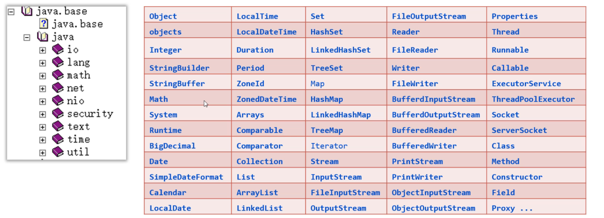

学习API有一个特点就是听都可以听懂，但是记不住，这个大家不要担心，多记、多查、多写代码、孰能生巧！

```java
// API  内置了很多的类, 一个类中有很多的数据和方法
// 非常多,不需要记,讲一遍能听懂,下去要大量的练习就可以了
// 把很多的类,放到的不同的包中,内置的类都是在不同的包里的
```


### 2，Object类

Object类是Java中所有类的祖宗类，因此，Java中所有类的对象都可以直接使用Object类中提供的一些方法。在API文档中可以找以Object类，如下：

Object类中的toString方法可以返回对象的字符串表示形式。默认的格式是：“包名. 类名@哈希值16进制”。有一个学生类，如下：

```java
// 默认都是继承Object类的
class Student{
    private String name;
    private int age;

    public Student() {
    }

    public Student(String name, int age) {
        this.name = name;
        this.age = age;
    }
}
```

测试类：

```java
public class Test {
    public static void main(String[] args) {
        Student s1 = new Student("wc", 19);
        // 在Object类中有一个toString方法
        // toString方法，返回的是对象的字符串表示形式
        // 格式：包名.类名@哈希值
        System.out.println(s1.toString());
    }
}
```

打印结果如下：

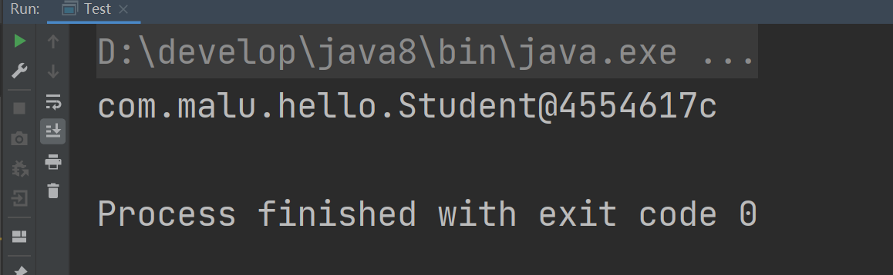


在Student类重写toString()方法，那么我们可以返回对象的属性值，代码如下：

```java
class Student{
    private String name;
    private int age;

    public Student() {
    }

    public Student(String name, int age) {
        this.name = name;
        this.age = age;
    }

    @Override
    public String toString() {
        return "Student{" +
                "name='" + name + '\'' +
                ", age=" + age +
                '}';
    }
}
```

打印结果如下：

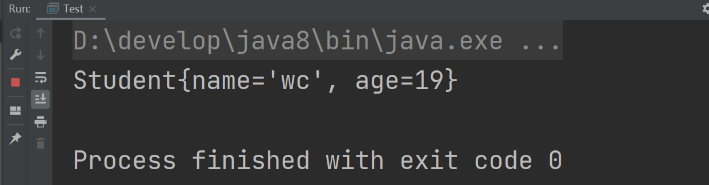


Object类的equals方法可以判断此对象与参数对象是否"相等"，测试如下：

```java
public class Test {
    public static void main(String[] args) {
        Student s1 = new Student("wc", 19);
        Student s2 = new Student("wc", 19);
        System.out.println(s1 == s2);   // false == 比较的是地址
        // equals是Object类的方法
        System.out.println(s1.equals(s2));  // false  默认情况下，equals效果和==是一样的，比较的都是地址
    }
}
```

重写equals方法，按照对象的属性值进行比较，如下：

```java
// 默认都是继承Object类的
class Student{
    private String name;
    private int age;

    public Student() {
    }

    public Student(String name, int age) {
        this.name = name;
        this.age = age;
    }

    @Override
    public boolean equals(Object o) {
        if (this == o) return true;
        if (o == null || getClass() != o.getClass()) return false;
        Student student = (Student) o;
        return age == student.age && Objects.equals(name, student.name);
    }

    @Override
    public int hashCode() {
        return Objects.hash(name, age);
    }

    @Override
    public String toString() {
        return "Student{" +
                "name='" + name + '\'' +
                ", age=" + age +
                '}';
    }
}


public class Test {
    public static void main(String[] args) {
        Student s1 = new Student("wc", 19);
        Student s2 = new Student("wc", 19);
        Student s3 = new Student("xq", 19);
        System.out.println(s1 == s2);   // false == 比较的是地址
        // equals是Object类的方法
        System.out.println(s1.equals(s2));  // true  重写了equals和hashCode方法，此时比较的就不是地址了
        System.out.println(s1.equals(s3));  // false
    }
}
```

Object类的clone()方法，会复制一个一模一样的新对象，并返回。说白了，就是克隆当前对象，返回一个新对象。想要调用clone()方法，必须让被克隆的类实现Cloneable接口。代码如下：

```java
class User implements Cloneable{
    private String id; //编号
    private String username; //用户名
    private String password; //密码
    private double[] scores; //分数

    public User() {
    }

    public User(String id, String username, String password, double[] scores) {
        this.id = id;
        this.username = username;
        this.password = password;
        this.scores = scores;
    }

    public String getId() {
        return id;
    }

    public void setId(String id) {
        this.id = id;
    }

    public String getUsername() {
        return username;
    }

    public void setUsername(String username) {
        this.username = username;
    }

    public String getPassword() {
        return password;
    }

    public void setPassword(String password) {
        this.password = password;
    }

    public double[] getScores() {
        return scores;
    }

    public void setScores(double[] scores) {
        this.scores = scores;
    }

    @Override
    protected Object clone() throws CloneNotSupportedException {
        return super.clone();
    }
}
```

测试类：

```java
public class Test {
    public static void main(String[] args) throws CloneNotSupportedException {
        User u1 = new User("1", "wc", "123", new double[]{99, 88, 50});
        User u2 = (User) u1.clone();
        System.out.println(u2.getId());
        System.out.println(u2.getUsername());
        System.out.println(u2.getPassword());
        System.out.println(u2.getScores());
    }
}
```

打印结果发现克隆得到的对象u2它的属性值和原来u1对象的属性值是一样的。如下：

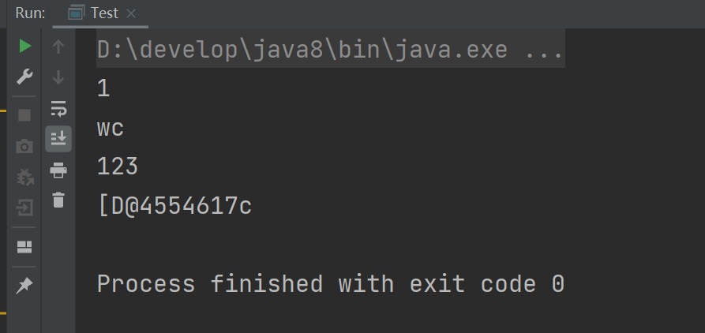


上面演示的克隆方式，是一种浅克隆的方法，浅克隆的意思：拷贝出来的对象封装的数据与原对象封装的数据一模一样（引用类型拷贝的是地址值）。

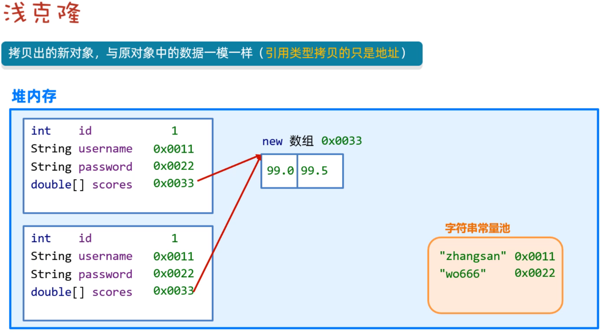

还有一种拷贝方式，称之为深拷贝，拷贝原理如下图所示：


演示深拷贝User对象，如下：

```java
class User implements Cloneable{
    private String id; //编号
    private String username; //用户名
    private String password; //密码
    private double[] scores; //分数

    public User() {
    }

    public User(String id, String username, String password, double[] scores) {
        this.id = id;
        this.username = username;
        this.password = password;
        this.scores = scores;
    }

    public String getId() {
        return id;
    }

    public void setId(String id) {
        this.id = id;
    }

    public String getUsername() {
        return username;
    }

    public void setUsername(String username) {
        this.username = username;
    }

    public String getPassword() {
        return password;
    }

    public void setPassword(String password) {
        this.password = password;
    }

    public double[] getScores() {
        return scores;
    }

    public void setScores(double[] scores) {
        this.scores = scores;
    }

    @Override
    protected Object clone() throws CloneNotSupportedException {
        // 先克隆得到一个新的对象
        User u = (User)super.clone();
        // 把新对象中的引用类型再次克隆
        u.scores = u.scores.clone();
        return u;

        //return super.clone();
    }
}
```

测试类：

```java
public class Test {
    public static void main(String[] args) throws CloneNotSupportedException {
        User u1 = new User("1", "wc", "123", new double[]{99, 88, 50});
        System.out.println(u1.getId());
        System.out.println(u1.getUsername());
        System.out.println(u1.getPassword());
        System.out.println(u1.getScores());

        System.out.println("---------------------------");

        User u2 = (User) u1.clone();
        System.out.println(u2.getId());
        System.out.println(u2.getUsername());
        System.out.println(u2.getPassword());
        System.out.println(u2.getScores());
    }
}
```

结果如下：

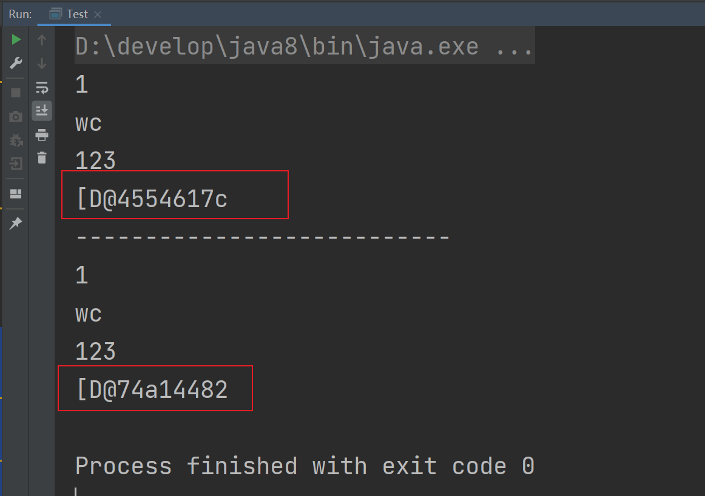


### 3，Objects类

Objects是一个工具类，提供了一些方法可以对任意对象进行操作。主要方法如下：

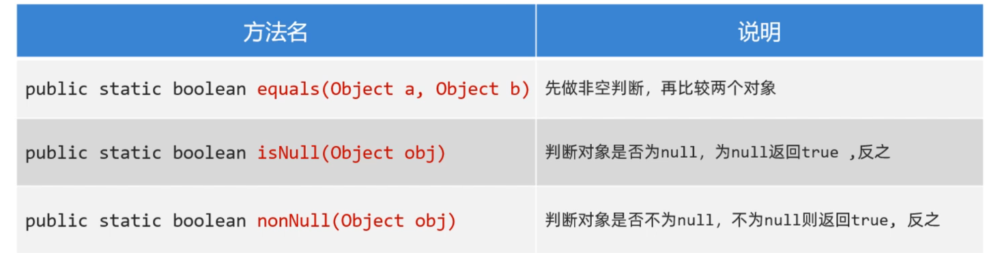

代码演示：

```java
public class Test {
    public static void main(String[] args){
        // Objects 是一个工具类  提供了一些API
        //      equals  也是比较两个对象的  会先做非空判断
        //      isNull  判断对象是否为null，是返回true
        //      nonNull  判断对象是否不为null，不为null是返回true

        String s1 = "java";
        String s2 = "java";
        System.out.println(s1.equals(s2));

        String s3 = null;
        String s4 = "java";
        // 这里会出异常:NullPointerException(空指针异常)，调用者不能为null
        //System.out.println(s3.equals(s3));
        System.out.println(Objects.equals(s3,s4));

        // 判断对象是否为null  等价于==
        System.out.println(Objects.isNull(s3));
        System.out.println(Objects.isNull(s4));

        // 判断对象是否不为null  等价于!=
        System.out.println(Objects.nonNull(s3));
        System.out.println(Objects.nonNull(s4));
    }
}
```

### 4，基础类型包装类

Java中万物皆对象。Java中的8种基本数据类型还不是对象，所以要把它们变成对象，变成对象之后，可以提供一些方法对数据进行操作。Java中8种基本数据类型都用一个包装类与之对应，如下：

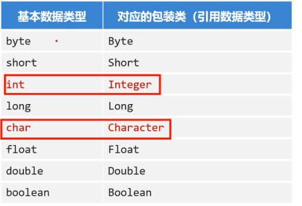

学习包装类，需要注意两点：

* 创建包装类的对象方式、自动装箱和拆箱的特性
* 利用包装类提供的方法对字符串和基本类型数据进行相互转换

创建包装类对象，代码演示：

```java
public class Test {
    public static void main(String[] args){
        // 基础类型的包装类
        // 在JAVA中，一切都是对象。前面学习的8种基本类型还不是对象
        // 给那8种基本类型变成对象，JAVA提供了对应的包装类
        //  基本类型      对应的包装类(引用类型)
        //   byte           Byte
        //   short          Short
        //   int            Integer
        //   long           Long
        //   float          Float
        //   double         Double
        //   char           Character
        //   boolean        Boolean


        // 创建Integer对象，封装了基本数据类型10
        Integer a = new Integer(10);
        System.out.println(a);

        // 利用Integer的静态方法valueOf(数据)得到Integer对象
        Integer b = Integer.valueOf(10);

        // 11是字面量，是基本数据类型。自动将基本类型转化成引用类型
        // 自动装箱  c是引用类型  11是基本类型
        Integer c = 11;
        System.out.println(c);
        
        // c是Integer，是引用类型。d是一个基本类型。把引用类型赋值给基本类型
        // 自动拆箱  就是把引用类型转化成基本类型
        int d = c;

        // ArrayList中要求放Integer类型
        ArrayList<Integer> list = new ArrayList<>();
        // 111是基本类型，放List中也是OK的。因为它会自动装箱。就是把基本类型转化成引用类型。
        list.add(111);

        // 得到的元素是Integer类型，使用int ele接收，也是可以。因为这里会自动的拆箱。
        // 自动拆箱就是把引用类型转化成基本类型
        int ele = list.get(0);
        System.out.println(ele);
    }
}
```

在开发中，经常使用包装类对字符串和基本类型数据进行相互转换。

* 把字符串转换为数值型数据：包装类.parseXxx(字符串)
* 将数值型数据转换为字符串：包装类.valueOf(数据)

代码演示：

```java
public class Test {
    public static void main(String[] args){

        //把一个字符串转化成数值类型：包装类.parseXxx(字符串)
        //把一个数值类型转化成字符串：包装类.valueOf(数值类型数据)
        //把一个数值类型转化成字符串：包装类.toString
        //把一个数值类型转化成字符串：包装类对象.toString

        // 创建一个字符串对象  在Java中，使用“”写的字符串，都会放到堆内部的字符串常量池。
        String ageStr = "18";

        // 把字符串转化成整形  parseInt是一个静态方法（类方法）
        int i = Integer.parseInt(ageStr);

        // 把字符串转化成小数
        String scoreStr = "110.5";
        double score = Double.parseDouble(scoreStr);

        // 把一个整数转化成字符中，方式有多种，你用哪一种都是OK的。
        Integer a = 123;
        String s1 = Integer.toString(a);
        System.out.println(s1);
        String s2 = a.toString();
        System.out.println(s2);
        String s3 = String.valueOf(a);
        System.out.println(s3);
    }
}
```


### 5，StringBuilder类

StringBuilder是可变字符串对象，相当于是一个容器，它里面的字符串是可以改变的，就是用来操作字符串的。StringBuilder比String更合适做字符串的修改操作，效率更高，代码也更加简洁。


代码演示：

```java
public class Test {
    public static void main(String[] args){
        // String    不可变字符串对象
        // StringBuilder 可变字符串对象  相当一个容器，这个容器中字符串是可变的，利用这个容器就可以操作字符串
        // 相比String来说，操作字符串效率更高，更适合做字符串的修改操作

        StringBuilder sb = new StringBuilder("001");

        // 往容器中放其它内容
        sb.append(2);
        sb.append("java");
        sb.append(true);
        System.out.println(sb);  // 0012javatrue

        // 支持链式编程
        sb.append("ok1").append("ok2").append("ok3");
        System.out.println(sb);

        // 反转
        sb.reverse();
        System.out.println(sb);

        // 获取字符串的长度
        System.out.println(sb.length());

        // 还可以转化成字符串
        String s = sb.toString();
        System.out.println(s);
    }
}
```


为什么要用StringBuilder对字符串进行操作呢？因为它的效率比String更高，我们可以下面两段代码验证一下。

```java
public class Test {
    // 使用String拼接字符串时，等等等等等等等等...
    //public static void main(String[] args){
    //  String str = "";
    //    for (int i = 0; i < 1000000; i++) {
    //        str = str+"abc";
    //    }
    //    System.out.println(str);
    //}

    // 结果瞬间就出来了
    public static void main(String[] args){
        StringBuilder sb = new StringBuilder();
        for (int i = 0; i < 1000000; i++) {
            sb.append("abc");
        }
        System.out.println(sb);
    }
}
```


经过验证，直接使用Stirng拼接100万次，等了1分钟，还没结束，我等不下去了；但是使用StringBuilder做拼接，不到1秒钟出结果了。


StringBuilder应用案例，代码如下：

```java
public class Test {
    public static void main(String[] args){
        int[] arr = new int[]{11,22,33};

        String str = getArrayData(arr);
        // [11,22,33]
        System.out.println(str);

        //System.out.println(arr);
    }

    public static String getArrayData(int[] arr){
        // 先判断一个数组是否为null
        if(arr == null){
            return  null;
        }

        StringBuffer sb = new StringBuffer("[");
        // 数据不是null，再遍历，拼接数组中的元素
        for (int i = 0; i < arr.length; i++) {
            if(i == arr.length-1){
                sb.append(arr[i]).append("]");
            }else{
                sb.append(arr[i]).append(", ");
            }
        }
        // 把StringBuild转化成字符串
        return sb.toString();
    }
}
```


### 6，StringJoiner类

前面使用StringBuilder拼接字符串的时，代码写起来还是有一点麻烦，而StringJoiner号称是拼接神器，不仅效率高，而且代码简洁。代码演示：

```java
public class Test {
    public static void main(String[] args){
        // StringJoiner类 主要是用于字符串拼接的，效率高，代码简洁

        StringJoiner sj = new StringJoiner(",");
        sj.add("java1");
        sj.add("java2");
        sj.add("java3");
        sj.add("java4");
        System.out.println(sj);  // java1,java2,java3,java4

        // 参数1表示间隔符，参数2表示开头，参数3表示结尾
        StringJoiner sj2 = new StringJoiner(",", "[", "]");
        sj2.add("java1");
        sj2.add("java2");
        sj2.add("java3");
        sj2.add("java4");
        System.out.println(sj2);
    }
}
```


使用StirngJoiner改写前面把数组转换为字符串的案例，代码如下：

```java
public class Test {
    public static void main(String[] args){
        int[] arr = new int[]{11,22,33};
        String str = getArrayData(arr);
        System.out.println(str);
    }
    public static String getArrayData(int[] arr){
        if(arr == null){
            return  null;
        }
        StringJoiner sj = new StringJoiner(",", "[", "]");
        for (int i = 0; i < arr.length; i++) {
            sj.add(String.valueOf(arr[i]));
        }
        return sj.toString();
    }
}
```


### 7，Math类

Math是数学的意思，该类提供了很多个进行数学运算的方法，如求绝对值，求最大值，四舍五入等，直接上代码：

```java
public class Test {
    public static void main(String[] args){

        // abc表示取绝对值，得到的一定是正数
        System.out.println(Math.abs(-11));
        System.out.println(Math.abs(11));
        System.out.println(Math.abs(3.14));

        // ceil表示向上取整
        System.out.println(Math.ceil(1.000000001));
        System.out.println(Math.ceil(1.0));

        // floor表示向下取整
        System.out.println(Math.floor(1.9999999));
        System.out.println(Math.floor(1.0));

        //round 四舍五入
        System.out.println(Math.round(1.499999));
        System.out.println(Math.round(1.500001));

        // max表示取较大值  min表示取较小值
        System.out.println(Math.max(1,2));
        System.out.println(Math.min(1,2));

        // pow 取次方
        System.out.println(Math.pow(2,3));
        System.out.println(Math.pow(3,2));

        // 取随机数：[0.0, 1.0)
        System.out.println(Math.random());
    }
}
```


### 8，System类

System是系统类，提供了一些获取获取系统数据的方法。比如获取系统时间。代码如下：

```java
public class Test {
    public static void main(String[] args) {

        // System类  系统类  获取一些系统数据  如获取系统时间\

        // java代码先转化成字节码，字节码是运行在JVM中
        // exit 终止运行java虚拟机  非0表示异常终止
        // 人为写代码终止JVM，不要使用
        System.exit(0);

        // currentTimeMillis 获取当前系统时间
        // 返回的是long类型的毫秒值：指的是从1970-1-1 0:0:0开始走过的毫秒值
        long time1 = System.currentTimeMillis();
        //System.out.println(time1);  // 1703039712628

        for (int i = 0; i < 100000; i++) {
            System.out.println("输出："+i);
        }

        long time2 = System.currentTimeMillis();
        System.out.println((time2-time1)/1000.0 + "s");
    }
}
```


### 9，Runtime类

Runtime类是一个Java的运行时类，这个类可以用来获取JVM的一些信息，也可以用这个类去执行其他的程序。代码如下：

```java
public class Test {
    public static void main(String[] args) throws IOException, InterruptedException {
        // Runtime类  运行时类
        // 字节码是运行在JVM中,  运行时类可以获取JVM相关的信息
        // 运行时类也可以执行其它的程序

        // 获取与当前java应用程序关联的运行时对象
        // r表示运行时对象  getRuntime是一个静态方法
        Runtime r = Runtime.getRuntime();

        // 终止当前运行的JVM,非0表示异常终止,不要使用
        //r.exit(0);

        // availableProcessors 当前JVM可以使用的处理器数量
        System.out.println(r.availableProcessors());

        // totalMemory 获取JVM中内存总量
        System.out.println(r.totalMemory()/1024.0/1024.0 + "MB");

        // freeMemory 获取JVM中可用的内存量
        System.out.println(r.freeMemory()/1024.0/1024.0 + "MB");

        // exec 启动某个程序,返回代表这个程序的对象   p表示QQ程序
        Process p = r.exec("D:\\softwareInstall\\QQ\\Bin\\QQScLauncher.exe");
        Thread.sleep(1000); // 让程序在这里停止5s
        //p.destroy();  // 销毁,关闭程序
    }
}
```


### 10，BigDecimal类


先看如下代码的执行结果，结果并和我们想看到的不太一样。如下：：

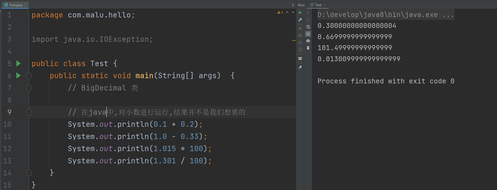


为了解决计算精度损失的问题，Java给我们提供了BigDecimal类，它提供了一些方法可以对数据进行四则运算，而且不丢失精度，同时还可以保留指定的小数位。代码如下：

```java
import java.math.BigDecimal;
import java.math.RoundingMode;

public class Test {
    public static void main(String[] args)  {
        //  为了解决小数运行精度丢失问题,java帮我们提供一个类,叫BigDecimal
        //  这个提供了一些方法,可以对数据进行运算,不会丢失精度,并且可以指定你要保留的小数位数

        double a = 0.1;
        double b = 0.2;


        // 通过new 得到BigDecimal对象,它的构造方法是非常多的
        //BigDecimal b1 = new BigDecimal("1.11");

        // 通过valueOf这个静态方法也可以得到BigDecimal对象
        BigDecimal b2 = BigDecimal.valueOf(a);
        BigDecimal b3 = BigDecimal.valueOf(b);

        BigDecimal res1 = b2.add(b3);
        System.out.println(res1);

        BigDecimal res2 = b2.subtract(b3);
        System.out.println(res2);

        BigDecimal res3 = b2.multiply(b3);
        System.out.println(res3);

        BigDecimal res4 = b2.divide(b3);
        System.out.println(res4);


        //BigDecimal b4 = BigDecimal.valueOf(0.1);
        //BigDecimal b5 = BigDecimal.valueOf(0.3);
        //BigDecimal res5 = b4.divide(b5);
        //System.out.println(res5);

        BigDecimal b4 = BigDecimal.valueOf(0.1);
        BigDecimal b5 = BigDecimal.valueOf(0.3);
        // 参数1是另一个BigDecimal对象, 参数2表示精确位数,参数3表示舍入模式(自己看一下文档)
        BigDecimal res5 = b4.divide(b5, 2, RoundingMode.HALF_UP);  // 2表示精确几位
        System.out.println(res5);

        // 把BigDecimal转化成double类型
        double db1 = res5.doubleValue();
        System.out.println(db1);
    }
}
```


### 11，Date类


在Java中，使用Date类来表示日期或者时间。Date对象记录的时间是用毫秒值来表示的。Java语言规定，1970年1月1日0时0分0秒认为是时间的起点，此时记作0，那么1000（1秒=1000毫秒）就表示1970年1月1日0时0分1秒，依次内推。

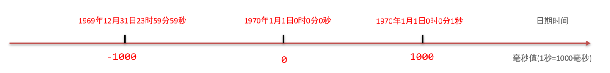


Date类的构造方法和常见方法：

- public Date()   创建一个Date对象，代表的是系统当前此刻日期时间。
- public Date(long time)  把时间毫秒值转换成Date日期对象
- public long getTime()  返回从1970年1月1日  00:00:00 走到此刻的总的毫秒数
- public void setTime()  设置日期对象的时间为当前时间毫秒值对应的时间


直接上代码：

```java
public class Test {
    public static void main(String[] args)  {
        // Date类  表示日期和时间
        // Date记录的时间是使用毫秒值表示的.  规定: 1970-1-1 0:0:0认为是时间的起点
        // 1000

        // Date对象,代表当前日期时间信息
        Date d = new Date();
        System.out.println(d);  // Wed Dec 20 11:32:19 CST 2023

        //1703043196667  毫秒值
        long time = d.getTime();
        System.out.println(time);

        time += 2*1000;
        // 得到2s之后的时间
        Date d2 = new Date(time);
        System.out.println(d2.getTime());

        time += 2*1000;
        Date d3 = new Date();
        d3.setTime(time);
        System.out.println(d3.getTime());
    }
}
```


### 12，SimpleDateFormat类

SimpleDateFormat类可以转换Date对象表示日期时间的显示格式。把Date对象转换为指定格式的日期字符串这个操作，叫做日期格式化。反过来把指定格式的日期符串转换为Date对象的操作，叫做日期解析。常见的构造器和格式化时间的方法：

- public SimpleDateFormat(String pattern) 创建简单日期格式化对象，并封装时间格式。
- public final String format(Date date) 将日期格式化成日期/时间字符串
- public final String format(Object time) 将时间毫秒值格式化成日期/时间字符串


创建SimpleDateFormat对象时，在构造方法的参数位置传递日期格式，而日期格式是由一些特定的字母拼接而来的。我们需要记住常用的几种日期/时间格式。

```txt
字母	   表示含义
yyyy	年
MM		月
dd		日
HH		时
mm		分
ss		秒
SSS		毫秒

"2024年12月12日" 的格式是 "yyyy年MM月dd日"
"2024-12-12 12:12:12" 的格式是 "yyyy-MM-dd HH:mm:ss"
按照上面的格式可以任意拼接，但是字母不能写错
```


代码演示：

```java
import java.text.ParseException;
import java.text.SimpleDateFormat;
import java.util.Date;

public class Test {
    public static void main(String[] args) throws ParseException {
        // SimpleDateFormat类  转换Date对象表示的日期格式
        //  把Date对象转换为指定的格式,叫日期格式化
        //  反过来,把指定格式的日期字符串转化为Date对象,叫日期解析

        // Wed Dec 20 11:32:19 CST 2023  ==> 2023-01-01 1:1:1

        // d1表示日期对象
        Date d1 = new Date();
        System.out.println(d1);

        long time = d1.getTime();
        System.out.println(time);

        // sdf 叫格式化日期的对象
        SimpleDateFormat sdf = new SimpleDateFormat("yyyy年MM月dd日 HH:mm:ss");

        String res1 = sdf.format(d1);   // 日期格式化
        System.out.println(res1);

        String res2 = sdf.format(time);   // 日期格式化
        System.out.println(res2);

        // --------------------------------------------

        String dataStr1 = "2023年12月20日 11:47:55";
        String dataStr2 = "2023-12-20 11:47:55";

        SimpleDateFormat sdf2 = new SimpleDateFormat("yyyy-MM-dd HH:mm:ss");
        Date parse1 = sdf.parse(dataStr1);
        Date parse2 = sdf2.parse(dataStr2);
        System.out.println(parse1);
        System.out.println(parse2);

    }
}
```


秒杀案例：

- 秒杀开始时间为：2023年11月11日 0:0:0 
- 秒杀结束时间为：2023年11月11日 0:10:0 
- wc下单并付款时间为：2023年11月11日 0:01:18 
- xq下单并付款时间为：2023年11月11日 0:10:18 
- 写代码说明这两位同学有没有参加上秒杀活动


代码如下：

```java
import java.text.ParseException;
import java.text.SimpleDateFormat;
import java.util.Date;

public class Test {
    public static void main(String[] args) throws ParseException {
        // Date  日期时间对象
        // SimpleDateFormat  日期时间格式化对象

        //               日期时间对象                              日期时间字符串
        //    new Date()/ Wed Dec 20 11:52:02 CST 2023     "2023年12月20日 11:52:02"

        // 日期时间格式化
        // 日期时间解析

        // 定义秒杀活动的开始时间和结束时间
        String start = "2023年11月11日 0:0:0";
        String end = "2023年11月11日 23:50:0";

        String wc = "2023年11月11日 0:10:0";
        String xq = "2023年11月11日 23:55:0";

        SimpleDateFormat sdf = new SimpleDateFormat("yyyy年MM月dd日 HH:mm:ss");
        Date startDate = sdf.parse(start);
        Date endDate = sdf.parse(end);
        Date wcDate = sdf.parse(wc);
        Date xqDate = sdf.parse(xq);


        long startTime = startDate.getTime();
        long endTime = endDate.getTime();
        long wcTime = wcDate.getTime();
        long xqTime = xqDate.getTime();

        if(wcTime>=startTime && wcTime<=endTime){
            System.out.println("wc秒杀成功了~");
        }else{
            System.out.println("wc秒杀失败了~");
        }
        if(xqTime>=startTime && xqTime<=endTime){
            System.out.println("xq秒杀成功了~");
        }else{
            System.out.println("xq秒杀失败了~");
        }
    }
}
```


### 13，Calendar类

Calendar类表示日历，也是一个和日期相关的类，它提供了一些比Date类更好用的方法。有些案例使用Date类就不太好做，使用Calendar就非常方便。因为Calendar类提供了方法可以直接对日历中的年、月、日、时、分、秒等进行运算。Calendar常见方法：

- public static Calendar getInstance() 获取当前日历对象
- public int get(int field) 获取日历中的某个信息
- public final Date  getTime() 获取日期对象
- public long getTimeInMillis() 获取时间毫秒值
- public void set(int field, int value) 修改日历的某个时间
- public void add(int field, int amount) 为某个信息增加/减少指定的值


案例：将2023年10月10日增加一个月。


代码如下：

```java
import java.text.ParseException;
import java.util.Calendar;
import java.util.Date;

public class Test {
    public static void main(String[] args) throws ParseException {
       // Calendar类  日历类  也是和日期时间相关的
       // 有时Date类不太好用, 日历类用起来就非常方便,可以对年月日时分秒进行运算.

        // cal是日历类
        Calendar cal = Calendar.getInstance();
        System.out.println(cal);

        // 获取日历类下的某个信息
        int year = cal.get(Calendar.YEAR);
        int month = cal.get(Calendar.MONTH);
        int days = cal.get(Calendar.DAY_OF_YEAR);
        System.out.println(year);
        System.out.println(month);
        System.out.println(days);

        // 通过日历,得到日期时间对象
        Date d1 = cal.getTime();
        System.out.println(d1);

        // 得到时间的毫秒值
        long time = cal.getTimeInMillis();
        System.out.println(time);

        // 修改某个信息
        //cal.set(Calendar.YEAR, 2025);
        //System.out.println(cal.get(Calendar.YEAR));
        //cal.set(Calendar.MONTH, 1);
        //System.out.println(cal.get(Calendar.MONTH));

        cal.add(Calendar.DAY_OF_YEAR,-10);
        cal.add(Calendar.YEAR,1);
        cal.add(Calendar.HOUR,1);
        System.out.println(cal.get(Calendar.DAY_OF_YEAR));
        System.out.println(cal.get(Calendar.YEAR));
        System.out.println(cal.get(Calendar.HOUR));

        cal.set(2050,1,1);
        System.out.println(cal.get(Calendar.YEAR));
    }
}
```


### 14，JDK8日期、时间、日期时间


传统的时间类（Date、SimpleDateFormat、Calendar）存在如下问题：

- 设计不合理，使用不方便，很多都被淘汰了。
- 都是可变对象，修改后会丢失最开始的时间信息。
- 线程不安全。
- 不能精确到纳秒，只能精确到毫秒。


代码演示：

```java
public class Test {
    public static void main(String[] args) throws ParseException {
        // 到目前为止,我们学习三个关于日期时间的类
        //    Date      日期时间类
        //    SimpleDateFormat    日期时间格式化类
        //    Calendar   日历类

        // 上面的三个类是JDK8版本之前的日期时间相关的类  是有一些不足:
        //    设计不合理,使用不方便,很多API都淘汰了
        //    都是可变对象,修改后会丢失最开始的日期时间信息
        //    线程不安全  后面才会学习线程
        //    时间只能精确到毫秒,不能精确到纳秒  1s = 1000毫秒    1毫秒=1000微妙    1微妙=1000纳秒

        Date d1 = new Date();
        System.out.println(d1.getYear()+1900);

        Calendar cal = Calendar.getInstance();
        int year = cal.get(Calendar.YEAR);
        System.out.println(year);

        cal.add(Calendar.YEAR,1);
        int year2 = cal.get(Calendar.YEAR);
        System.out.println(year2);

        System.out.println(cal.get(Calendar.YEAR));
        System.out.println(cal.get(Calendar.YEAR));
        System.out.println(cal.get(Calendar.YEAR));
        System.out.println(cal.get(Calendar.YEAR));
        System.out.println(cal.get(Calendar.YEAR));
    }
}
```


JDK8新增的日期类，相比JDK8之前传统的时间API，优势：

- 设计更合理，功能丰富，使用方便
- 都是不可变对象，修改后会返回新的时间对象，不会丢失最开始时间
- 线程安全
- 能精确到毫秒，纳秒


JDK8新增的日期类分得更细致一些，比如表示年月日用LocalDate类、表示时间秒用LocalTime类、而表示年月日时分秒用LocalDateTime类等；除了这些类还提供了对时区、时间间隔进行操作的类等。它们几乎把对日期/时间的所有操作都通过了API方法，用起来特别方便。


先学习表示日期、时间、日期时间的类；有LocalDate、LocalTime、以及LocalDateTime类。这三个类的用法套路都是一样的。LocalDate类代码演示：

```java
import java.time.LocalDate;

public class Test {
    public static void main(String[] args)  {
        // LocalCate类   日期类   不可变对象

        // 得到 日期对象
        LocalDate ld = LocalDate.now();

        int year = ld.getYear(); // 年
        int month = ld.getMonthValue(); // 月(1-12)
        int day = ld.getDayOfMonth(); // 日
        int dayOfYear = ld.getDayOfYear();  // 一年中的第几天
        int dayOfWeek = ld.getDayOfWeek().getValue(); // 星期几
        System.out.println(year);
        System.out.println(month);
        System.out.println(day);
        System.out.println(dayOfYear);
        System.out.println(dayOfWeek);

        //直接修改某个信息: withYear、withMonth、withDayOfMonth、withDayOfYear
        LocalDate ld2 = ld.withYear(2099);
        LocalDate ld3 = ld.withMonth(1);
        System.out.println(ld2);
        System.out.println(ld3);
        System.out.println(ld);

        //把某个信息加多少: plusYears、plusMonths、plusDays、plusWeeks
        LocalDate ld4 = ld.plusYears(2);
        LocalDate ld5 = ld.plusMonths(2);
        System.out.println(ld4);
        System.out.println(ld5);

        //把某个信息减多少：minusYears、minusMonths、minusDays、minusWeeks
        LocalDate ld6 = ld.minusYears(2);
        LocalDate ld7 = ld.minusMonths(2);
        System.out.println(ld6);
        System.out.println(ld7);

        //获取指定日期的LocalDate对象
        LocalDate ld8 = LocalDate.of(2099, 12, 12);
        LocalDate ld9 = LocalDate.of(2099, 12, 12);
        System.out.println(ld8);
        System.out.println(ld9);

        //判断2个日期对象，是否相等，在前还是在后： equals isBefore isAfter
        System.out.println(ld8.equals(ld9));// true
        System.out.println(ld8.isAfter(ld)); // true
        System.out.println(ld8.isBefore(ld)); // false
    }
}
```


LocalTime类的基本使用，代码演示：

```java
import java.time.LocalTime;

public class Test {
    public static void main(String[] args)  {
        // LocalTime  时间对象

        // 得到时间对象
        LocalTime lt = LocalTime.now(); // 时 分 秒 纳秒 不可变的
        System.out.println(lt);

        //获取时间中的信息
        int hour = lt.getHour(); //时
        int minute = lt.getMinute(); //分
        int second = lt.getSecond(); //秒
        int nano = lt.getNano(); //纳秒
        System.out.println(hour);
        System.out.println(minute);
        System.out.println(second);
        System.out.println(nano);

        //修改时间：withHour、withMinute、withSecond、withNano
        LocalTime lt3 = lt.withHour(10);
        LocalTime lt4 = lt.withMinute(10);
        LocalTime lt5 = lt.withSecond(10);
        LocalTime lt6 = lt.withNano(10);
        System.out.println(lt3);
        System.out.println(lt4);
        System.out.println(lt5);
        System.out.println(lt6);

        //加多少：plusHours、plusMinutes、plusSeconds、plusNanos
        LocalTime lt7 = lt.plusHours(10);
        LocalTime lt8 = lt.plusMinutes(10);
        LocalTime lt9 = lt.plusSeconds(10);
        LocalTime lt10 = lt.plusNanos(10);

        //减多少：minusHours、minusMinutes、minusSeconds、minusNanos
        LocalTime lt11 = lt.minusHours(10);
        LocalTime lt12 = lt.minusMinutes(10);
        LocalTime lt13 = lt.minusSeconds(10);
        LocalTime lt14 = lt.minusNanos(10);

        //获取指定时间的LocalTime对象：
        // public static LocalTime of(int hour, int minute, int second)
        LocalTime lt15 = LocalTime.of(12, 12, 12);
        LocalTime lt16 = LocalTime.of(12, 12, 12);

        //判断2个时间对象，是否相等，在前还是在后： equals isBefore isAfter
        System.out.println(lt15.equals(lt16)); // true
        System.out.println(lt15.isAfter(lt)); // false
        System.out.println(lt15.isBefore(lt)); // true
    }
}
```


LocalDateTime类的基本使用，代码演示：

```java
import java.time.LocalDate;
import java.time.LocalDateTime;
import java.time.LocalTime;

public class Test {
    public static void main(String[] args)  {
        // 获取本地日期和时间对象。
        LocalDateTime ldt = LocalDateTime.now(); // 年 月 日 时 分 秒 纳秒
        System.out.println(ldt);

        // 可以获取日期和时间的全部信息
        int year = ldt.getYear(); // 年
        int month = ldt.getMonthValue(); // 月
        int day = ldt.getDayOfMonth(); // 日
        int dayOfYear = ldt.getDayOfYear();  // 一年中的第几天
        int dayOfWeek = ldt.getDayOfWeek().getValue();  // 获取是周几
        int hour = ldt.getHour(); //时
        int minute = ldt.getMinute(); //分
        int second = ldt.getSecond(); //秒
        int nano = ldt.getNano(); //纳秒

        // 修改时间信息：
        // withYear withMonth withDayOfMonth withDayOfYear withHour
        // withMinute withSecond withNano
        LocalDateTime ldt2 = ldt.withYear(2029);
        LocalDateTime ldt3 = ldt.withMinute(59);

        // 加多少:
        // plusYears  plusMonths plusDays plusWeeks plusHours plusMinutes plusSeconds plusNanos
        LocalDateTime ldt4 = ldt.plusYears(2);
        LocalDateTime ldt5 = ldt.plusMinutes(3);

        // 减多少：
        // minusDays minusYears minusMonths minusWeeks minusHours minusMinutes minusSeconds minusNanos
        LocalDateTime ldt6 = ldt.minusYears(2);
        LocalDateTime ldt7 = ldt.minusMinutes(3);


        // 5、获取指定日期和时间的LocalDateTime对象：
        // public static LocalDateTime of(int year, Month month, int dayOfMonth, int hour,
        //                                  int minute, int second, int nanoOfSecond)
        LocalDateTime ldt8 = LocalDateTime.of(2029, 12, 12, 12, 12, 12, 1222);
        LocalDateTime ldt9 = LocalDateTime.of(2029, 12, 12, 12, 12, 12, 1222);

        // 判断2个日期、时间对象，是否相等，在前还是在后： equals、isBefore、isAfter
        System.out.println(ldt9.equals(ldt8));
        System.out.println(ldt9.isAfter(ldt));
        System.out.println(ldt9.isBefore(ldt));

        // 7、可以把LocalDateTime转换成LocalDate和LocalTime
        // public LocalDate toLocalDate()
        // public LocalTime toLocalTime()
        // public static LocalDateTime of(LocalDate date, LocalTime time)
        LocalDate ld = ldt.toLocalDate();
        LocalTime lt = ldt.toLocalTime();
        LocalDateTime ldt10 = LocalDateTime.of(ld, lt);
    }
}
```


### 15，时区

由于世界各个国家与地区的经度不同，各地区的时间也有所不同，因此会划分为不同的时区。每一个时区的时间也不太一样。ZoneId（时区）和ZonedDateTime（带时区的时间）是代表时区的两个类。代码演示：

```java
import java.time.*;

public class Test {
    public static void main(String[] args)  {

        // 关于时区时间的历史，大家可以自行搜索。
        
        // ZoneId: 时区    ZoneDateTime: 带时区的日期时间

        // 1、ZoneId的常见方法：
        // public static ZoneId systemDefault(): 获取系统默认的时区
        ZoneId zoneId = ZoneId.systemDefault();
        System.out.println(zoneId.getId());  // Asia/Shanghai
        System.out.println(zoneId);  // Asia/Shanghai

        // public static Set<String> getAvailableZoneIds(): 获取Java支持的全部时区Id
        System.out.println(ZoneId.getAvailableZoneIds());  // [Asia/Aden, America/Cuiaba, Etc/GMT+9,....

        // public static ZoneId of(String zoneId) : 把某个时区id封装成ZoneId对象。
        ZoneId zoneId1 = ZoneId.of("America/New_York");  // "America/New_York" 字符串

        // 2、ZonedDateTime：带时区的时间。
        // public static ZonedDateTime now(ZoneId zone): 获取某个时区的ZonedDateTime对象。
        ZonedDateTime now = ZonedDateTime.now(zoneId1);
        System.out.println(now);  // 2023-12-20T03:00:32.278-05:00[America/New_York]

        // 世界标准时间了
        ZonedDateTime now1 = ZonedDateTime.now(Clock.systemUTC());
        System.out.println(now1);  // 2023-12-20T08:00:32.284Z

        // public static ZonedDateTime now()：获取系统默认时区的ZonedDateTime对象
        ZonedDateTime now2 = ZonedDateTime.now();
        System.out.println(now2);  // 2023-12-20T16:00:32.284+08:00[Asia/Shanghai]

        // Calendar instance = Calendar.getInstance(TimeZone.getTimeZone(zoneId1));
    }
}
```


### 16，Instant类


前面我们学习的LocalDate, LocalTime, LocalDateTime, ZoneId, ZonedDateTime等都是为了代替Calendar。还有一个代替Date的类，叫Instant类（时间线上的某个时刻/时间戳）。通过获取Instant的对象可以拿到此刻的时间，该时间由两部分组成：从1970-01-01 00:00:00 开始走到此刻的总秒数+不够1秒的纳秒数。


该类提供的方法如下图所示，可以用来获取当前时间，也可以对时间进行加、减、获取等操作。

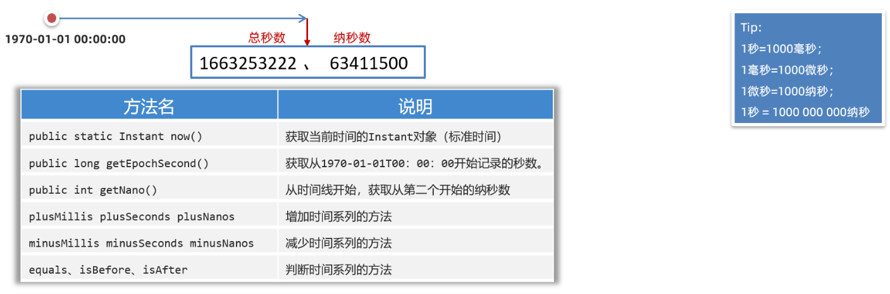


作用：可以用来记录代码的执行时间，或用于记录用户操作某个事件的时间点。代码演示：

```java
public class Test {
    public static void main(String[] args)  {

        // Instant类  得到此刻的时间  代替之前的Date类
        // 作用：记录代码的执行时间，记录用户操作某个事件的时间

        // 得到Instant对象，得到的是此刻的时间信息
        Instant now = Instant.now();
        System.out.println(now);  // 不可变对象

        // 获取总秒数
        long secod = now.getEpochSecond();
        System.out.println(secod);

        // 获取不够1s的纳秒数
        int nano = now.getNano();
        System.out.println(nano);

        Instant instant = now.plusNanos(111);

        // 记录代码的执行时间
        Instant now1 = Instant.now();
        // ..............  代码执行
        Instant now2 = Instant.now();
    }
}
```


### 17，DateTimeFormater类


DateTimeFormater是新的日期格式化类，用于代替之前的SimpleDateFormat类的。常用方法：

- public static DateTimeFormatter ofPattern   获取格式化器对象
- public String format  格式化时间
- public String format(DateTimeFormatter formatter)  格式化时间
- public static LocalDateTime parse(CharSequence text, DateTimeFormatter formatter)  解析时间


代码演示：

```java
import java.time.LocalDateTime;
import java.time.format.DateTimeFormatter;

public class Test {
    public static void main(String[] args)  {

        // DateTimeFormater类  对时期时间进行格式化

        // 创建日期时间格式化对象
        DateTimeFormatter formatter = DateTimeFormatter.ofPattern("yyyy年MM月dd日 HH:mm:ss");

        LocalDateTime now = LocalDateTime.now();
        System.out.println(now);

        String res1 = now.format(formatter);  // 格式化
        System.out.println(res1);

        String str1 = "2023年12月21日 16:31:26";
        LocalDateTime ldt = LocalDateTime.parse(str1, formatter);
        System.out.println(ldt);
    }
}
```


### 18，Period类和Duration类

JDK8还补充了两个类，一个叫Period类、一个叫Duration类；这两个类可以用来对计算两个时间点的时间间隔。其中Period用来计算日期间隔（年、月、日），Duration用来计算时间间隔（时、分、秒、纳秒）


Period类只能两个计算LocalDate对象之间的间隔。可以用来计算两个日期之间相隔的年、相隔的月、相隔的日。常用方法：

- public static Period between(LocalDate start, LocalDate end)  传入2个日期对象，得到Period对象
- public int get Years()  计算隔几年，并返回
- public int getMonths()  计算隔几个月，并返回
- public int getDays()  计算隔多少天，并返回


代码演示：

```java
import java.time.LocalDate;
import java.time.Period;

public class Test {
    public static void main(String[] args)  {

        // Period类  Duration类  计算两个时间点的间隔
        // Period类 计算年月日的时间间隔  计算日期的时间间隔
        // Duration类 计算时分秒纳秒的时间间隔    计算时间的时间间隔

        LocalDate start = LocalDate.of(2021, 01, 01);
        LocalDate end = LocalDate.of(2023, 02, 05);

        Period p = Period.between(start, end);

        System.out.println(p.getYears());
        System.out.println(p.getMonths());
        System.out.println(p.getDays());

    }
}
```


Duration类可以用于计算两个时间对象相差的天数、小时数、分数、秒数、纳秒数；支持LocalTime、LocalDateTime、Instant等时间。常用方法：

- public static Duration between(开始时间对象1，截止时间对象2)   传入2个时间对象，得到Duration对象
- public long toDays()   计算隔多少天，并返回
- public long toHours()   计算隔多少小时，并返回
- public long toMinutes()   计算隔多少分，并返回
- public long toSeconds()   计算隔多少秒，并返回
- public long toMillis()   计算隔多少毫秒，并返回
- public long toNanos()    计算隔多少纳秒，并返回


代码演示：

```java
import java.time.Duration;
import java.time.LocalDateTime;

public class Test {
    public static void main(String[] args)  {

        // Period类  Duration类  计算两个时间点的间隔
        // Period类 计算年月日的时间间隔  计算日期的时间间隔
        // Duration类 计算时分秒纳秒的时间间隔    计算时间的时间间隔

        LocalDateTime start = LocalDateTime.of(2021, 01, 01,10,10,10);
        LocalDateTime end = LocalDateTime.of(2021, 01, 02,11,12,15);

        Duration dur = Duration.between(start, end);

        System.out.println(dur.toDays()); // 间隔几天
        System.out.println(dur.toHours()); // 间隔多少小时
        System.out.println(dur.toMinutes()); // 间隔多少分
        System.out.println(dur.toMillis()); // 间隔多少毫秒
        System.out.println(dur.toNanos()); // 间隔多少纳秒
    }
}
```


### 19，Arrays类

Arrays是操作数组的工具类，它可以很方便的对数组中的元素进行遍历、拷贝、排序等操作。演示几个常用的方法

- public static String toString(类型[] arr)  返回数组内容
- public static int[] copyOfRange(类型[] arr, 起始索引，结束索引)  拷贝数组（指定范围）
- public static copyOf(类型[] arr, int newLength) 拷贝数组
- public static setAll(double[] array, IntToDoubleFunction generator)  把数组中的原数据改为新数据
- public static void sort(类型[] arr) 对数组进行排序（默认是升序排序）


代码演示：

```java
import java.util.Arrays;
import java.util.function.IntToDoubleFunction;

public class Test {
    public static void main(String[] args)  {

        // Arrays类 是一个工具类，用于操作数组，可以对于数据进行遍历，copy，排序...

        int[] arr1 = {10,20,30,40,50,60};

        // 把一个数组转成字符串，字符串中包含数据的内容
        System.out.println(Arrays.toString(arr1));  // [10, 20, 30, 40, 50, 60]

        // 包前不包后  copy数组的，指定范围
        int[] arr2 = Arrays.copyOfRange(arr1, 1, 4);
        System.out.println(Arrays.toString(arr2));

        // copy数据，并指定新数组的长度
        int[] arr3 = Arrays.copyOf(arr1, 10);
        System.out.println(Arrays.toString(arr3));

        // 定义double数据，里面存放了一些价格，把所有的价格都打8折再存进去
        double[] prices = {8.88, 100, 60, 35.2};
        Arrays.setAll(prices, new IntToDoubleFunction() {
            @Override
            public double applyAsDouble(int value) {
                System.out.println("value:"+value);   // 索引
                return prices[value] * 0.8;
            }
        });
        System.out.println(Arrays.toString(prices));

        // 排序，默认是升序
        Arrays.sort(prices);
        System.out.println(Arrays.toString(prices));
    }
}
```


前面我们使用Arrays操作数组时，数组中存储存储的元素是int类型、double类型，是可以直接排序的，而且默认是升序排列。如果数组中存储的元素类型是自定义的对象，如何进行排序呢，先准备一个Student类，如下：

```java
class Student{
    private String name;
    private double height;
    private int age;

    public Student() {
    }

    public Student(String name, double height, int age) {
        this.name = name;
        this.height = height;
        this.age = age;
    }

    @Override
    public String toString() {
        return "Student{" +
                "name='" + name + '\'' +
                ", height=" + height +
                ", age=" + age +
                '}';
    }
}
```


测试类，往数组中存储4个学生对象，如下：

```java
public class Test {
    public static void main(String[] args)  {

        Student[] students = new Student[4];
        students[0] = new Student("wc",110,8);
        students[1] = new Student("xq",120,11);
        students[2] = new Student("ml",90,15);
        students[3] = new Student("z3",108,4);

        // 对学生进行排序
        Arrays.sort(students);
        System.out.println(Arrays.toString(students));
    }
}
```


测试如下：

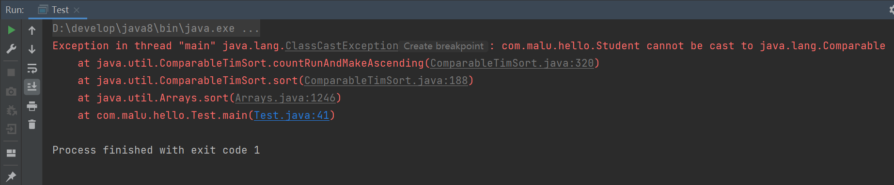


上面代码报错的原因是Arrays根本不知道按什么规则进行排序。为了让Arrays知道按照什么规则排序，我们有如下的两种办法。

- 排序方式1：让Student类实现Comparable接口，同时重写compareTo方法。
- 排序方式2：在调用`Arrays.sort(数组,Comparator比较器);`时，除了传递数组之外，传递一个Comparator比较器对象。


排序方式1：让Student类实现Comparable接口，同时重写compareTo方法。Arrays的sort方法底层会根据compareTo方法的返回值是正数、负数、还是0来确定谁大、谁小、谁相等。代码如下：

```java
class Student implements Comparable<Student>{
    private String name;
    private double height;
    private int age;

    public Student() {
    }

    public Student(String name, double height, int age) {
        this.name = name;
        this.height = height;
        this.age = age;
    }

    @Override
    public String toString() {
        return "Student{" +
                "name='" + name + '\'' +
                ", height=" + height +
                ", age=" + age +
                '}';
    }

    // 此方法就是用来指定比较规则的，哪两个进行比较呢？
    //    this   o
    //  约定1： 认为左边的对象 大于 右边的对象  返回正整数
    //  约定2： 认为左边的对象 小于 右边的对象  返回负整数
    //  约定3： 认为左边的对象 等于 右边的对象  返回0
    @Override
    public int compareTo(Student o) {
        // 下面的代码就实现年龄从小到到的排序
        //if(this.age > o.age){
        //    return  1;
        //}else if(this.age < o.age){
        //    return  -1;
        //}
        //return 0;

        // 下面的代码就是对上面的代码进行简化
        //return this.age - o.age;  // 实现从小到大排序
        return o.age - this.age;  // 实现从大到小排序
    }
}
```


排序方式2：在调用`Arrays.sort(数组,Comparator比较器);`时，除了传递数组之外，传递一个Comparator比较器对象。Arrays的sort方法底层会根据Comparator比较器对象的compare方法方法的返回值是正数、负数、还是0来确定谁大、谁小、谁相等。代码如下：

```java
public class Test {
    public static void main(String[] args)  {

        Student[] students = new Student[4];
        students[0] = new Student("wc",110,8);
        students[1] = new Student("xq",120,11);
        students[2] = new Student("ml",90,15);
        students[3] = new Student("z3",108,4);

        // 对学生进行排序
        Arrays.sort(students, new Comparator<Student>() {
            @Override
            public int compare(Student o1, Student o2) {
                // 制定比较规则了：左边对象 o1   右边对象 o2
                // 约定1：认为左边对象 大于 右边对象 请您返回正整数
                // 约定2：认为左边对象 小于 右边对象 请您返回负整数
                // 约定3：认为左边对象 等于 右边对象 请您一定返回0
                //if(o1.getHeight() > o2.getHeight()){
                //    return 1;
                //}else if(o1.getHeight() < o2.getHeight()){
                //    return -1;
                //}
                //return 0; // 升序

                //return Double.compare(o1.getHeight(), o2.getHeight());  // 升序
                return Double.compare(o2.getHeight(), o1.getHeight());  // 降序
            }
        });
        System.out.println(Arrays.toString(students));
    }
}
```


