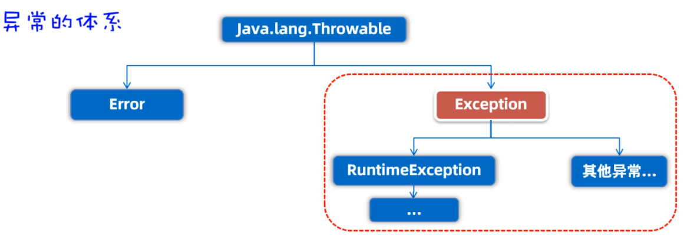
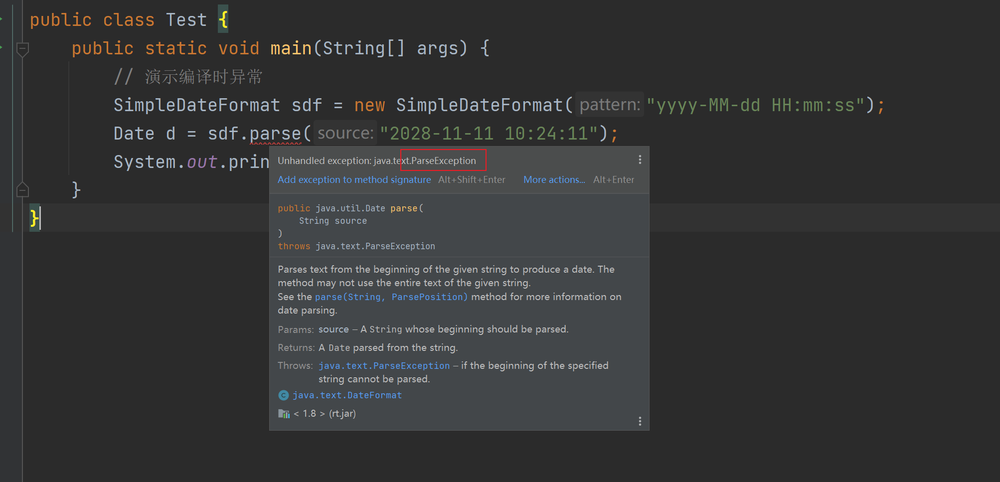

## 一，Lambda表达式

Lambda表达式是JDK8新增的一种语法形式，用于简化匿名内部类代码的书写。


### 1，Lambda表达式的基本使用

在使用Lambda表达式之前，必须先有一个接口，而且接口中只能有一个抽象方法。（注意：不能是抽象类，只能是接口）。如下的接口，我们叫函数式接口，只有基于函数式接口的匿名内部类才能被Lambda表达式简化。

```java
// Lambda表达式：用于简化匿名内部类的书写
// 要求：
//   1）必须是基于接口创建出来的匿名内部类，不能是抽象类
//   2）接口中只能有一个抽象方法
// 像下面的接口，叫函数式接口
interface Swimming{
    void swim();  // 抽象方法
}
```

有了以上的Swimming接口之后，使用匿名内部类，如下：

```java
public class Test {
    public static void main(String[] args)  {
        // 创建一个Swimming接口的匿名内部类对象
        Swimming s =  new Swimming(){
            @Override
            public void swim() {
                System.out.println("游泳~~~");
            }
        };
        s.swim();

        // 使用Lambda表达式简化上面的代码
        Swimming s2 =  ()->{
            System.out.println("游泳2~~~");
        };
        s2.swim();
    }
}
```


然后，开始演示Lanmbda表达式。Lamdba是有特有的格式的，按照下面的格式来编写Lamdba。

```java
(被重写方法的形参列表) -> {
    被重写方法的方法体代码;
}
```


开始演示，使用Lambda表达式，简化匿名内部类书写。代码如下：

```java
import java.util.Arrays;
import java.util.function.IntToDoubleFunction;

public class Test {
    public static void main(String[] args)  {
        double[] prices = {10,20,30};
        Arrays.setAll(prices, new IntToDoubleFunction() {
            @Override
            public double applyAsDouble(int value) {
                return prices[value]*0.8;
            }
        });
        System.out.println(Arrays.toString(prices));

        // 使用Lambda表达式简化上面的代码
        Arrays.setAll(prices, (int value)->{
                return prices[value]*0.7;
            }
        );
        System.out.println(Arrays.toString(prices));
    }
}
```


我们现在已经知道Lamdba表达式可以简化基于函数式接口的匿名内部类的书写。接下来，我们可以把刚才使用Arrays方法时的代码，使用Lambda表达式简化一下了。代码如下：

```java
package com.malu.hello;

import java.util.Arrays;
import java.util.function.IntToDoubleFunction;


class Student{
    private String name;
    private double height;
    private int age;

    public Student() {
    }

    public Student(String name, double height, int age) {
        this.name = name;
        this.height = height;
        this.age = age;
    }

    public String getName() {
        return name;
    }

    public void setName(String name) {
        this.name = name;
    }

    public double getHeight() {
        return height;
    }

    public void setHeight(double height) {
        this.height = height;
    }

    public int getAge() {
        return age;
    }

    public void setAge(int age) {
        this.age = age;
    }

    @Override
    public String toString() {
        return "Student{" +
                "name='" + name + '\'' +
                ", height=" + height +
                ", age=" + age +
                '}';
    }
}


public class Test {
    public static void main(String[] args)  {
        double[] prices = {10,20,30};
        Arrays.setAll(prices, new IntToDoubleFunction() {
            @Override
            public double applyAsDouble(int value) {
                return prices[value]*0.8;
            }
        });
        System.out.println(Arrays.toString(prices));

        // 使用Lambda表达式简化上面的代码
        Arrays.setAll(prices, (int value)->{
                return prices[value]*0.7;
            }
        );
        System.out.println(Arrays.toString(prices));

        System.out.println("--------------------------");

        Student[] students = new Student[4];
        students[0] = new Student("wc",110,8);
        students[1] = new Student("xq",120,11);
        students[2] = new Student("ml",90,15);
        students[3] = new Student("z3",108,4);

        //Arrays.sort(students, new Comparator<Student>() {
        //    @Override
        //    public int compare(Student o1, Student o2) {
        //        return Double.compare(o1.getHeight(), o2.getHeight());  // 升序
        //    }
        //});

        Arrays.sort(students, (Student o1, Student o2) ->{
                return Double.compare(o1.getHeight(), o2.getHeight());  // 升序
            }
        );

        System.out.println(Arrays.toString(students));
    }
}
```


### 2，Lambda表达式的省略规则

Lamdba表达式有几种简化写法。具体的简化规则如下：

```java
1.Lambda的标准格式
	(参数类型1 参数名1, 参数类型2 参数名2)->{
		...方法体的代码...
		return 返回值;
	}

2.在标准格式的基础上()中的参数类型可以直接省略
	(参数名1, 参数名2)->{
		...方法体的代码...
		return 返回值;
	}
	
3.如果{}总的语句只有一条语句，则{}可以省略、return关键字、以及最后的“;”都可以省略
	(参数名1, 参数名2)-> 结果
	
4.如果()里面只有一个参数，则()可以省略
	(参数名)->结果
```

接下来从匿名内部类开始、到Lambda标准格式、再到Lambda简化格式，一步一步来简化一下。代码如下：

```java
package com.malu.hello;

import java.util.Arrays;

public class Test {
    public static void main(String[] args)  {
        double[] prices = {10,20,30};
        // 最开始的写法
        //Arrays.setAll(prices, new IntToDoubleFunction() {
        //    @Override
        //    public double applyAsDouble(int value) {
        //        return prices[value]*0.8;
        //    }
        //});

        // 1）使用Lambda表达式简化上面的代码，Lambda的标签格式
        //Arrays.setAll(prices, (int value)->{
        //        return prices[value]*0.8;
        //    }
        //);

        //// 2）省略参数类型，int不用写了
        //Arrays.setAll(prices, (value)->{
        //        return prices[value]*0.8;
        //    }
        //);

        //// 3）形参只有一个  ()不用写
        //Arrays.setAll(prices, value->{
        //            return prices[value]*0.8;
        //        }
        //);

        // 4）函数体只有一行代码，{}，return和分号 都可以省略
        Arrays.setAll(prices, value-> prices[value]*0.8);

        System.out.println(Arrays.toString(prices));
    }
}
```


## 二，方法引用


方法引用是JDK8的另一个新特性。Lambda是用来简化匿名代码的书写格式的，而方法引用是用来进一步简化Lambda表达式的，它简化的更加过分。


### 1，静态方法引用

用之前Arrays代码来做演示。现在准备好下面的代码：

```java
public class Test {
    public static void main(String[] args)  {
        Student[] students = new Student[4];
        students[0] = new Student("wc",110,8);
        students[1] = new Student("xq",120,11);
        students[2] = new Student("ml",90,15);
        students[3] = new Student("z3",108,4);

        // 最原始的写法
        //Arrays.sort(students, new Comparator<Student>() {
        //    @Override
        //    public int compare(Student o1, Student o2) {
        //        return o1.getAge() - o2.getAge();  // 按年龄进行升序排列
        //    }
        //});

        // 使用Lambda表达式进行简化
        Arrays.sort(students, ( o1,  o2)->o1.getAge() - o2.getAge());

        System.out.println(Arrays.toString(students));
    }
}
```

现在，我想要把Lambda表达式的方法体，用一个静态方法代替。准备另外一个类CompareByData类，用于封装Lambda表达式的方法体代码；

```java
// 准备一个类，封装了Lambda表达式的方法体代码
class CompareByData{
    public static int compareByAge(Student o1, Student o2){
        return o1.getAge() - o2.getAge();  // 按年龄进行升序排列
    }
}
```

现在我们就可以把Lambda表达式的方法体代码，改为下面的样子：

```java
// 使用Lambda表达式进行简化
Arrays.sort(students, ( o1,  o2)->o1.getAge() - o2.getAge());
```

Java为了简化上面Lambda表达式的写法，利用方法引用可以改进为下面的样子。**实际上就是用类名调用方法，但是把参数给省略了。**这就是静态方法引用。代码如下：

```java
// 准备一个类，封装了Lambda表达式的方法体代码
class CompareByData{
    public static int compareByAge(Student o1, Student o2){
        return o1.getAge() - o2.getAge();  // 按年龄进行升序排列
    }
}

public class Test {
    public static void main(String[] args)  {
        Student[] students = new Student[4];
        students[0] = new Student("wc",110,8);
        students[1] = new Student("xq",120,11);
        students[2] = new Student("ml",90,15);
        students[3] = new Student("z3",108,4);

        // 最原始的写法
        //Arrays.sort(students, new Comparator<Student>() {
        //    @Override
        //    public int compare(Student o1, Student o2) {
        //        return o1.getAge() - o2.getAge();  // 按年龄进行升序排列
        //    }
        //});

        // 使用Lambda表达式进行简化
        //Arrays.sort(students, ( o1,  o2)->o1.getAge() - o2.getAge());

        // 使用静态方法引用，简化Lambda表达式  通过类名调用方法，可以把参数省略了。
        Arrays.sort(students, CompareByData::compareByAge);

        System.out.println(Arrays.toString(students));
    }
}
```


### 2，实例方法引用


还是上面的案例，想要把Lambda表达式的方法体，用一个实例方法代替。在CompareByData类中，再添加一个实例方法，用于封装Lambda表达式的方法体。如下：

```java
// 准备一个类，封装了Lambda表达式的方法体代码
class CompareByData{
    // 静态方法
    public static int compareByAge(Student o1, Student o2){
        return o1.getAge() - o2.getAge();  // 按年龄进行升序排列
    }
    // 实例方法
    public int compareByAgeDesc(Student o1, Student o2){
        return o2.getAge() - o1.getAge();  // 按年龄进行降序序排列  Desc是降序
    }
}
```

把Lambda表达式的方法体，改用对象调用方法，如下：

```java
CompareByData comapare = new CompareByData();
// 实例方法引用
Arrays.sort(students, comapare::compareByAgeDesc);
```

最后，再将Lambda表达式的方法体，直接改成方法引用写法。**实际上就是用类名调用方法，但是省略的参数**。这就是实例方法引用，如下：

```java
// 准备一个类，封装了Lambda表达式的方法体代码
class CompareByData{
    // 静态方法
    public static int compareByAge(Student o1, Student o2){
        return o1.getAge() - o2.getAge();  // 按年龄进行升序排列
    }
    // 实例方法
    public int compareByAgeDesc(Student o1, Student o2){
        return o2.getAge() - o1.getAge();  // 按年龄进行降序序排列  Desc是降序
    }
}

public class Test {
    public static void main(String[] args)  {
        Student[] students = new Student[4];
        students[0] = new Student("wc",110,8);
        students[1] = new Student("xq",120,11);
        students[2] = new Student("ml",90,15);
        students[3] = new Student("z3",108,4);

        // 最原始的写法
        //Arrays.sort(students, new Comparator<Student>() {
        //    @Override
        //    public int compare(Student o1, Student o2) {
        //        return o1.getAge() - o2.getAge();  // 按年龄进行升序排列
        //    }
        //});

        // 使用Lambda表达式进行简化
        //Arrays.sort(students, ( o1,  o2)->o1.getAge() - o2.getAge());

        // 使用静态方法引用，简化Lambda表达式  通过类名调用方法，可以把参数省略了。
        //Arrays.sort(students, CompareByData::compareByAge);

        CompareByData comapare = new CompareByData();
        // 实例方法引用
        Arrays.sort(students, comapare::compareByAgeDesc);

        System.out.println(Arrays.toString(students));
    }
}
```


### 3，特定类型的方法引用

特定类型的方法引用是没有什么道理的，只是语法的一种约定，遇到这种场景，就可以这样用。如果某个Lambda表达式里只是调用一个实例方法，并且前面参数列表中的第一个参数作为方法的主调，后面的所有参数都是作为该实例方法的入参时，则就可以使用特定类型的方法引用。代码如下：

```java
public class Test {
    public static void main(String[] args)  {
       // 特定类型方法引用   类型::方法名
        String[] names = {"bac","aki","bok","aaa","abc","dac"};

        // 最原始的写法
        //Arrays.sort(names, new Comparator<String>() {
        //    @Override
        //    public int compare(String o1, String o2) {
        //        //System.out.println("o1="+o1);
        //        //System.out.println("o2="+o2);
        //        return o1.compareToIgnoreCase(o2);
        //    }
        //});

        // 使用lambda表达式进行简写
        //Arrays.sort(names, (o1, o2)->o1.compareToIgnoreCase(o2));

        // 使用特定类型的方法引用进一步简写
        Arrays.sort(names, String::compareToIgnoreCase);

        System.out.println(Arrays.toString(names));
    }
}
```


### 4，构造器引用

构造器引用在实际开发中应用的并不多，目前还没有找到构造器的应用场景。所以大家在学习的时候，也只是关注语法就可以了。准备一个JavaBean类（Car类），如下：

```java
class Car{
    private String name;
    private double price;

    public Car() {
    }

    public Car(String name, double price) {
        this.name = name;
        this.price = price;
    }

    public String getName() {
        return name;
    }

    public void setName(String name) {
        this.name = name;
    }

    public double getPrice() {
        return price;
    }

    public void setPrice(double price) {
        this.price = price;
    }

    @Override
    public String toString() {
        return "Car{" +
                "name='" + name + '\'' +
                ", price=" + price +
                '}';
    }
}
```


因为方法引用是基于Lamdba表达式简化的，所以也要按照Lamdba表达式的使用前提来用，需要一个函数式接口，接口中代码的返回值类型是Car类型，如下：

```java
interface CreateCar{
    Car create(String name, double price);
}
```

在测试类中创建CreateCar接口的实现类对象，先用匿名内部类创建、再用Lambda表达式创建，最后改用方法引用创建。同学们只关注格式就可以，不要去想为什么（语法就是这么设计的）。如下：

```java
public class Test {
    public static void main(String[] args)  {
        // 使用匿名内部类的原始写法
        //CreateCar car1 = new CreateCar(){
        //   @Override
        //   public Car create(String name, double price) {
        //       return new Car(name,price);
        //   }
        //};

        // 使用Lambda表达式进行简化
        CreateCar car1 = ( name, price)->new Car(name,price);

        Car bm = car1.create("bm",10);
        System.out.println(bm);

        // 构造器的引用，了解，基本上用不到
        CreateCar car2 = Car::new;
        Car bc = car2.create("bc",10);
        System.out.println(bc);
    }
}
```


## 三，正则表达式

正则表达式其实是由一些特殊的符号组成的，它代表的是某种规则。作用有二：

- 作用1：用来校验字符串数据是否合法
- 作用2：可以从一段文本中查找满足要求的内容


### 1，初识正则表达式


不使用正则表达式，校验QQ号码代码是这样的，代码如下：

```java
public class Test {
    public static void main(String[] args)  {
        // 正则表达式：由一些特殊的符号组成的，代表某个规则。
        //   作用：1）校验某个数据是否符合某个规则  2）从一片数据中，找到符合要求的数据

        // 不使用正则，使用java校验QQ号是否符合QQ号的规则

        System.out.println(checkQQ(null));
        System.out.println(checkQQ("001242546"));  // 假定QQ号不能以0打头
        System.out.println(checkQQ("123"));  // 假定QQ号至少6位
        System.out.println(checkQQ("234565432345677345645687656756"));  // 假定QQ号最多20位
        System.out.println(checkQQ("abcfdfwetw"));  // QQ号不能包含字母
        System.out.println(checkQQ("23456543"));  // 符合要求的
    }

    public static boolean checkQQ(String qq){
        if(qq == null || qq.startsWith("0") || qq.length() < 6 || qq.length() > 20){
            return false;
        }
        for (int i = 0; i < qq.length(); i++) {
            char ch = qq.charAt(i);
            if(ch<'0' || ch>'9'){
                return false;
            }
        }
        return true; // QQ号符合要求
    }
}
```


使用正则表达式，如下：

```java
public class Test {
    public static void main(String[] args)  {
        // 正则表达式：由一些特殊的符号组成的，代表某个规则。
        //   作用：1）校验某个数据是否符合某个规则  2）从一片数据中，找到符合要求的数据

        // 不使用正则，使用java校验QQ号是否符合QQ号的规则

        System.out.println(checkQQ(null));
        System.out.println(checkQQ("001242546"));  // 假定QQ号不能以0打头
        System.out.println(checkQQ("123"));  // 假定QQ号至少6位
        System.out.println(checkQQ("234565432345677345645687656756"));  // 假定QQ号最多20位
        System.out.println(checkQQ("abcfdfwetw"));  // QQ号不能包含字母
        System.out.println(checkQQ("23456543"));  // 符合要求的
    }

    public static boolean checkQQ(String qq){
        return qq != null && qq.matches("[1-9]\\d{5,19}");
    }
}
```


### 2，正则书写规则

前面我们已经体验过正则表达式可以简化校验数据的代码书写。使用到的方法叫matches是属于String类的方法。此方法用于判断字符串是否匹配正则表达式，匹配返回true，不匹配返回false。参数需要调用者传递一个正则表达式。正则表达式是有特定规则的，接下来，我们学习一下，正则表达式的规则。规则如下：

- 只匹配单个字符（字符类）

  

- 只匹配单个字符（预定义字符）

  

- 数量词

  


代码演示：

```java
public class Test {
    public static void main(String[] args) {
        // matches  判断字符串是否满足某个正则，满足返回true，不满足就返回false
        // 在JS中，叫test


        // 学习正则中的规则：
        //     获取单个字符
        //         [abc]    只能是a，或者b，或者c
        //         [^abc]   除了a,b,c之外的任意字符
        //         [a-zA-Z]   表示a到z，和A到Z
        //         [a-d[m-p]]   a到d，或m到p
        //         [a-z&&[def]]   d,e,f  交集
        //         [a-z&&[^bc]]   a-z，但是除了b,c
        //         [a-z&&[^m-p]]   a-z，但是除了m到p
        //     预定义字符
        //         .    任何字符
        //         \d    数字  0~9   [0-9]
        //         \D    非数字   [^0-9]
        //         \s    一个空白字符
        //         \S    非空白字符    [^\s]
        //         \w    [a-zA-Z0-9]
        //         \W    [^\w]
        //     数量词
        //         X?        X出现一次或0次
        //         X*        X出现0次或多次
        //         X+        X出现一次或多次
        //         X{n}      X出现正好n次
        //         X{n,}     X出现至少n次
        //         X{n,m}    X出现至少n次，但不超过m次


        System.out.println("a".matches("[abc]"));
        System.out.println("e".matches("[abcd]"));
        System.out.println("d".matches("[^abc]"));
        System.out.println("a".matches("[^abc]"));
        System.out.println("b".matches("[a-zA-Z]"));
        System.out.println("2".matches("[a-zA-Z]"));
        System.out.println("k".matches("[a-z&&[^bc]]"));
        System.out.println("b".matches("[a-z&&[^bc]]"));
        System.out.println("ab".matches("[a-zA-Z0-9]"));

        System.out.println("码".matches("."));
        System.out.println("码路".matches("."));
        System.out.println("c".matches("."));

        // \ 表示转义符
        System.out.println("\"");
        System.out.println("3".matches("\\d"));
        System.out.println("a".matches("\\d"));
        System.out.println(" ".matches("\\s"));
        System.out.println("a".matches("\\s"));
        System.out.println(" ".matches("\\S"));
        System.out.println("a".matches("\\S"));
        System.out.println("a".matches("\\w"));
        System.out.println("_".matches("\\w"));
        System.out.println("_".matches("\\W"));
        System.out.println("a".matches("\\W"));
        System.out.println("123".matches("\\d"));


        System.out.println("".matches("\\w?"));
        System.out.println("a".matches("\\w?"));
        System.out.println("aa".matches("\\w?"));

        System.out.println("".matches("\\w*"));
        System.out.println("a".matches("\\w*"));
        System.out.println("aa".matches("\\w*"));
        System.out.println("aa码".matches("\\w*"));

        System.out.println("".matches("\\w+"));
        System.out.println("a".matches("\\w+"));
        System.out.println("aa".matches("\\w+"));

        System.out.println("".matches("\\w{3}"));
        System.out.println("a".matches("\\w{3}"));
        System.out.println("aa".matches("\\w{3}"));
        System.out.println("aaa".matches("\\w{3}"));

        System.out.println("aa".matches("\\w{3,}"));
        System.out.println("aaa".matches("\\w{3,}"));
        System.out.println("aaaa".matches("\\w{3,}"));
        System.out.println("aaaaa".matches("\\w{3,}"));
        System.out.println("aaa6aa".matches("\\w{3,}"));

        System.out.println("aa".matches("\\w{3,5}"));
        System.out.println("aaa".matches("\\w{3,5}"));
        System.out.println("aaaa".matches("\\w{3,5}"));
        System.out.println("aaaaa".matches("\\w{3,5}"));
        System.out.println("aaaaaa".matches("\\w{3,5}"));

        // (?i) 忽略大小写
        System.out.println("abc".matches("(?i)abc"));
        System.out.println("ABC".matches("(?i)abc"));
        System.out.println("Abc".matches("(?i)abc"));
        System.out.println("Abc".matches("a((?i)b)c"));
        System.out.println("aBc".matches("a((?i)b)c"));

        //|  表示或者  [a-z]{3} 表示3个小写字母    d{3} 表示3个数字
        System.out.println("abc".matches("[a-z]{3}|\\d{3}"));
        System.out.println("ABC".matches("[a-z]{3}|\\d{3}"));
        System.out.println("123".matches("[a-z]{3}|\\d{3}"));
        System.out.println("1234".matches("[a-z]{3}|\\d{3}"));
        System.out.println("a12".matches("[a-z]{3}|\\d{3}"));

        // 分组  () 表示分组  以我爱打头，中间至少有一个编程  最后至少要有一个666
        System.out.println("我爱编程编程666666".matches("我爱(编程)+(666)+"));
        System.out.println("我爱编程编程66666".matches("我爱(编程)+(666)+"));
    }
}
```


### 3，正则案例


案例一：校验手机号码

```java
import java.util.Scanner;

public class Test {
    public static void main(String[] args) {
        checkPhone();
    }
    public static void checkPhone(){
        while (true){
            System.out.println("请你输入你的手机号：");
            Scanner sc = new Scanner(System.in);
            String phone = sc.nextLine();
            // 0391-
            if(phone.matches("(1[3-9]\\d{9})")){
                System.out.println("你输入的正确");
            }else{
                System.out.println("你输入的不正确");
            }
        }
    }
}
```


案例二：校验邮箱

```java
import java.util.Scanner;

public class Test {
    public static void main(String[] args) {
        checkEmail();
    }
    public static void checkEmail(){
        while (true){
            System.out.println("请你输入你的邮箱：");
            Scanner sc = new Scanner(System.in);
            String phone = sc.nextLine();
            // 64325@163.com  xxx@qq.com
            if(phone.matches("\\w{2,}@\\w{2,10}\\.\\w{2,10}")){
                System.out.println("你输入的正确");
            }else{
                System.out.println("你输入的不正确");
            }
        }
    }
}
```


### 4，搜索，替换


之前我们学习过String类中两个方法：

- public String replaceAll(String regex, String newStr)  按照正则表达式匹配的内容进行替换
- public String[] split(String regex) 按照正则表达式匹配的内容进行分割字符串，返回一个字符串数组


上面两个方法，我们可以指定正则，代码如下：

```java
import java.util.Arrays;

public class Test {
    public static void main(String[] args) {

        String str1 = "需要无可奈af何a花落去珈用加fdf时魂23牵梦24萦地下城452额头纹";
        System.out.println(str1.replaceAll("\\w+","-"));

        String str2 = "需要无可奈af何a花落去珈用加fdf时魂23牵梦24萦地下城452额头纹";
        String[] data = str2.split("\\w+");
        System.out.println(Arrays.toString(data));
    }
}
```


## 四，异常


### 1，什么是异常

 我们调用一个方法时，经常一部小心就出异常了，然后在控制台打印一些异常信息。其实打印的这些异常信息，就叫做异常。我们需要知道异常是如何产生的，只有你知道异常是如何产生的，才能避免出现异常。以及产生异常之后如何处理。


看如下代码：

```java
public class Test {
    public static void main(String[] args) {
        Integer a = Integer.valueOf("123");
        System.out.println(a);  // 123

        Integer b = Integer.valueOf("abc");
        System.out.println(b);
    }
}
```


测试如下：


写代码时经常会出现问题，Java的设计者们早就为我们写好了很多个异常类，来描述不同场景下的问题。而有些类是有共性的所以就有了异常的继承体系，如下：




解释：

- Error：表示系统级别错误，属于严重问题。也就是说系统一旦出现问题，sun公司会把这些问题封装成Error对象给抛出来。说白了，Error是给Sun公司自己用的，不是给我们程序员用的，我们开发者不用管它。
- Exception：叫异常，它代表的才是我们程序可能出现的问题。所以，我们程序员通常会用Exception以及它的孩子封装程序出现的问题。
  - RuntimeException：运行时异常 ，编译阶段不会出现错误提醒，运行时才出现，如数组索引越界异常
  - 编译时异常：在编译阶段就会出现错误提醒的，如日期解析异常


**演示运行时异常：**

```java
public class Test {
    public static void main(String[] args) {
        // Java设计者，一开始就写好了很多的异常类，描述不同场景下的问题
        // 异常体系
        //    Java.lang.Throwable
        //       Error
        //           表示系统级别的错误，是给Sun公司自己使用的，不是给程序员使用的，我们不需要管它。
        //       Exception
        //           RuntimeException  运行时异常   
        //                编译阶段不会出现错误提醒，只有把代码运行起来后，才会出现异常
        //           编译时异常   编译阶段就会出现错误提醒，也就是在写代码期间，就提醒出来了

        // 演示运行时异常
        Integer b = Integer.valueOf("abc");  // NumberFormatException
        System.out.println(b);
        int[] arr = {1,2,3};
        System.out.println(arr[3]);  // ArrayIndexOutOfBoundsException
    }
}
```


只有把代码运行起来后，才会看到异常信息：


ArrayIndexOutOfBoundsExcpetion类的继承体系：


**演示编译时异常：**


鼠标摸一下：




编译时异常的目的：意思就是告诉你，你小子注意了！！，这里小心点容易出错，仔细检查一下。有人说，我检查过了，我确认我的代码没问题，为了让它不报错，继续将代码写下去。我们这里有两种解决方案。


第一种：使用throws在方法上声明，意思就是告诉下一个调用者，这里面可能有异常啊，你调用时注意一下。


第二种：使用try...catch语句块异常进行处理。


### 2，自定义异常

我们无法为这个世界上的全部问题都提供异常类，如果企业自己的某种问题，想通过异常来表示，那就需要自己来定义异常类了。通过一个实际场景，来给大家演示自定义异常。需求：

- 写一个saveAge(int age)方法，在方法中对参数age进行判断，如果age<0或者>=150就认为年龄不合法，如果年龄不合法，就给调用者抛出一个年龄非法异常。（Java的API中是没有年龄非常这个异常的，所以我们可以自定义一个异常类，用来表示年龄非法异常，然后再方法中抛出自定义异常即可。）


先写一个异常类AgeIllegalException，必须让这个类继承自Exception，才能成为一个编译时异常类。如下：

```java
// 自定义一个异常类
// 让AgeIllegalException 继承 Exception 才能成为一个编译时异常类
class AgeIllegalException extends Exception{
    public AgeIllegalException(){}
    public AgeIllegalException(String message){
        super(message);
    }
}
```


在测试类中定义一个saveAge(int age)方法，对age判断如果年龄不在0~150之间，就抛出一个AgeIllegalException异常对象给调用者。

```java
public class Test {
    //public static void main(String[] args) throws  AgeIllegalException {
    public static void main(String[] args){
        // Java设计者在设计了很多的Java异常类，不能满足世界上所有的问题。
        // 如果我们代码中有属于我们业务自己的问题，可以使用自定义异常
        //   setAge()  setAge(20)   setAge(200)   setAge(-200)
        // Java中，没有关于年龄非法的异常。此时就可以自定义一个异常类。

        // 调用setAge方法，此时报红了，有编译时异常
        // 处理办法有两种：1）throws  2）try catch
        try{
            setAge(1000);
        }catch (AgeIllegalException e){
            e.printStackTrace();
            System.out.println("setAge时，年龄设置不合法~");
        }
    }

    // 在方法中，抛出一个编译时异常，必须在方法上使用throws声明，强调调用者处理
    public static void setAge(int age) throws AgeIllegalException{
        if(age>0 && age<150){
            System.out.println("年龄被成功保存了："+age);
        }else{
            // throw 表示抛出异常对象  抛出去了一个编译时异常
            throw new AgeIllegalException("年龄非法，你输入的age是："+age);
        }
    }
}
```


自定义异常可能是编译时异常，也可以是运行时异常

- 如果自定义异常类继承Excpetion，则是编译时异常。特点：方法中抛出的是编译时异常，必须在方法上使用throws声明，强制调用者处理。
- 如果自定义异常类继承RuntimeException，则运行时异常。特点：方法中抛出的是运行时异常，不需要在方法上用throws声明。

### 3，异常处理

有这样一个场景：A调用用B，B调用C；C中有异常产生抛给B，B中有异常产生又抛给A；异常到了A这里就不建议再抛出了，因为最终抛出被JVM处理程序就会异常终止，并且给用户看异常信息，用户也看不懂，体验很不好。此时比较好的做法就是：1.将异常捕获，将比较友好的信息显示给用户看；2.尝试重新执行，看是是否能修复这个问题。


main方法调用test1方法，test1方法调用test2方法，test1和test2方法中都有扔异常。第一种处理方式是，在main方法中对异常进行try...catch捕获处理了，给出友好提示。

```java
public class Test {
    //public static void main(String[] args) throws FileNotFoundException{
    public static void main(String[] args){
        try{
            test001();
        }catch (FileNotFoundException e){
            System.out.println("你要找的文件不存在~");
            e.printStackTrace();
        }catch (ParseException e){
            System.out.println("你解析的时间有问题");
            e.printStackTrace();
        }
    }

    public static void test001() throws FileNotFoundException, ParseException {
        test002();

        SimpleDateFormat sdf = new SimpleDateFormat("yyyy-MM-dd HH:mm:ss");
        Date d = sdf.parse("2028-11#11 10:24:11");
        System.out.println(d);
    }

    public static void test002() throws FileNotFoundException{
        // 这里报红了，编译时异常
        FileInputStream is = new FileInputStream("D:/b.mp4");
    }
}
```


第二种处理方式是：在main方法中对异常进行捕获，并尝试修复

```java
public class Test {
    public static void main(String[] args){
       // try{
       //    System.out.println(getMoney());
       //}catch (Exception e){
       //    System.out.println("你输入的不是合法数字~");
       //}

        while (true){
           try{
               System.out.println(getMoney());
               break;
           }catch (Exception e){
               System.out.println("你输入的不是合法数字~");
           }
        }
    }

    public static double getMoney(){
        Scanner scanner = new Scanner(System.in);
        while (true){
            System.out.println("请输入合适的价格：");
            double money = scanner.nextDouble();
            if(money >= 0){
                return money;
            }else{
                System.out.println("你输入的价格不合适");
            }
        }
    }
}
```


