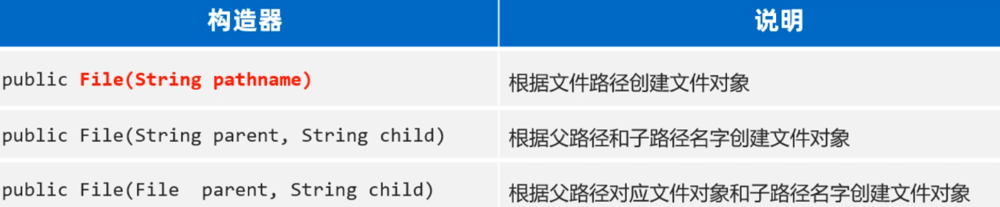
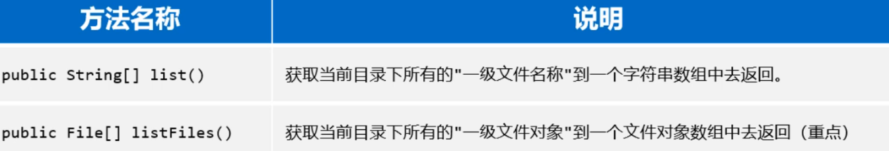
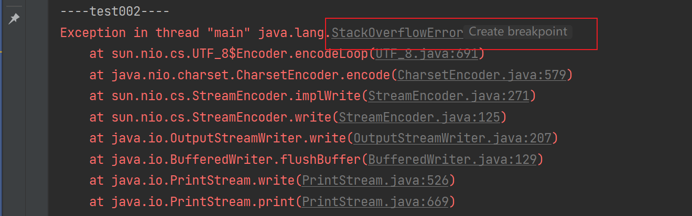
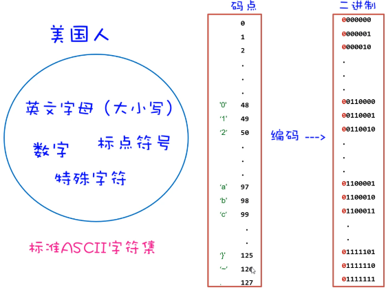

## 一，File类


### 1，File类介绍与创建

存储数据，可以把数据存储到变量，数组，对象，集合中，但是这些数据都是存储在内存中的，只要程序执行结束，或者断电了，数据就消失了。不能永久存储。有些数据要长久保存，可以将数据以文件的形式存在硬盘里，即使程序结束了，断电了只要硬盘没坏，数据就永久存在。<br/><br/>


我们要学习的File类，它的就用来表示当前系统下的文件（也可以是文件夹），通过File类提供的方法可以获取文件大小、判断文件是否存在、创建文件、创建文件夹等。需要我们注意：File对象只能对文件进行操作，不能操作文件中的内容。<br/><br/>


学习File类和其他类一样，第一步是创建File类的对象。 想要创建对象，我们得看File类有哪些构造方法




代码演示：

```java
package com.malu.hello;

import java.io.File;

public class Test {
    public static void main(String[] args) {
        // File
        // 前面学习了变量，数组，对象，集合。这些数据都是存储在内存中的。
        // 当程序执行结束，或断电了，数据就消失了，在内存中的数据不会永久存储。

        // 如果确实需要把数据永久存储，可以把数据存储到硬盘上。
        // 在计算机中，任何数据，在计算机中都是存储的01代码
        //  a.txt   xx.png   b.mp4

        // File类，表示当前系统下的文件，也可以是文件夹，通过这个类，操作操作文件
        // 所谓的操作文件：获取文件大小，判断文件是否存在，创建文件，创建文件夹...
        // File对象只能对文件进行操作，不能对文件中的内容进行操作

        // 学习一个类，肯定要学习如何创建对象，要搞清这个类，有哪些构造器？

        // 根据文件路径创建文件对象
        // 路径中 \  需要写成 \\。  或者说写成 /
        //File f1 = new File("F:\\resource\\a.txt");
        //File f1 = new File("F:/resource/a.txt");
        File f1 = new File("F:"+File.separator+"resource"+File.separator+"a.txt");
        System.out.println(f1);
        System.out.println(f1.length()); // 文件大小  返回的是字节数

        File f2 = new File("F:/resource");
        System.out.println(f2.length());

        File f3 = new File("F:/resource/b.txt");
        System.out.println(f3.length());
        System.out.println(f3.exists()); // 判断当前文件对象，对应的文件路径是否存在，存在就返回true

        // 带盘符的，是绝对路径
        File f4 = new File("E:\\lession\\202308java\\03-前端转java之javase进阶\\code\\javaCode\\module01\\src\\d.txt");
        System.out.println(f4);
        System.out.println(f4.exists());

        // 不带盘符的，默认是直接去工程下找
        // module01\\src\\d.txt   找module01，是去工程目录下面找
        File f5 = new File("module01\\src\\d.txt");
        System.out.println(f5);
        System.out.println(f5.exists());
        System.out.println(f5.length());
    }
}
```


### 2，File判断和获取方法

File对象封装的路径是存在还是不存在，是文件还是文件夹其实是不清楚的。好在File类提供了方法可以帮我们做判断。


判断文件路径是否存在，判断文件类型，如下：

```java
public class Test {
    public static void main(String[] args) {

        File f1 = new File("F:\\resource\\a.txt");
        System.out.println(f1);
        System.out.println(f1.length()); // 文件大小  返回的是字节数
        // 判断当前文件对象，对应的文件路径是否存在，存在返回true
        System.out.println(f1.exists());
        // 判断当前文件对象指代的是否是文件，是文件返回true，反之。
        System.out.println(f1.isFile());
        // 判断当前文件对象指代的是否是文件夹，是文件夹返回true，反之。
        System.out.println(f1.isDirectory());
    }
}

```


除了判断功能还有一些获取功能，如下：

```java
public class Test {
    public static void main(String[] args) {

        File f1 = new File("F:\\resource\\a.txt");
        System.out.println(f1);

        // 获取文件的名称，包含后缀
        System.out.println(f1.getName());

        // 获取文件最后的修改时间
        long time = f1.lastModified();
        System.out.println(time);  // 1703468246068 时间戳

        SimpleDateFormat sdf = new SimpleDateFormat("yyyy/MM/dd HH:mm:ss");
        System.out.println(sdf.format(time));

        // 获取创建文件对象时，指定的路径
        System.out.println(f1.getPath());

        File f2 = new File("module01\\src\\d.txt");
        System.out.println(f2.getPath());
        System.out.println(f2.getAbsolutePath());
    }
}
```


### 3，创建和删除方法


File类提供了创建和删除文件的方法，代码如下：

```java
public class Test {
    public static void main(String[] args) throws Exception {

        // f1是一个文件对象  "F:\\resource\\b.txt" 是一个路径
        File f1 = new File("F:\\resource\\b.txt");
        System.out.println(f1);

        // 创建一个新的文件，创建成功，返回true。
        System.out.println(f1.createNewFile());

        File f2 = new File("F:\\resource\\malu");
        // mkdir用于创建文件夹，注意：只能创建一级文件夹
        System.out.println(f2.mkdir());

        File f3 = new File("F:\\resource\\wc\\xq\\z3");
        // mkdirs可以创建多级
        System.out.println(f3.mkdirs());

        // 删除文件 或者文件夹   只能删除空的文件夹
        System.out.println(f1.delete());
        System.out.println(f2.delete());
        System.out.println(f3.delete());

        // 文件中有内容，是可以被删除掉的。文件夹中有东西，是不能被删除掉
        File f4 = new File("F:\\resource\\a.txt");
        System.out.println(f4.delete());
    }
}

```


### 4，遍历文件夹

有如下两个方法：




代码演示：

```java
public class Test {
    public static void main(String[] args) throws Exception {

        // 根据路径，创建一个文件对象
        File f1 = new File("F:\\resource\\wc");
        System.out.println(f1);

        // list 获取当前目录下所有的一级文件名称到一个字符串数组中
        String[] list = f1.list();
        for(String ele:list){
            System.out.println(ele);
        }

        System.out.println("-----------------");

        // listFiles 获取当前目录下所有的一级文件对象到一个文件对象数组中
        File[] files = f1.listFiles();
        for(File file:files){
            System.out.println(file);
        }

        System.out.println(Arrays.toString(files));
    }
}
```


注意细节：

1. 当主调是文件时，或者路径不存在时，返回null
2. 当主调是空文件夹时，返回一个长度为0的数组
3. 当主调是一个有内容的文件夹时，将里面所有一级文件和文件夹路径放在File数组中，并把数组返回
4. 当主调是一个文件夹，且里面有隐藏文件时，将里面所有文件和文件夹的路径放在FIle数组中，包含隐藏文件
5. 当主调是一个文件夹，但是没有权限访问时，返回null


如果想要获取文件夹中子文件夹的内容，那目前还做不到。需要使用到递归内容。下面就开始学习递归内容。


## 二，递归


### 1，什么是递归

为了获取文件夹中子文件夹的内容，我们就需要学习递归这个知识点。递归是一种算法，从形式上来说，方法调用自己的形式称之为递归。有直接递归、间接递归，如下面的代码。代码演示：

```java
public class Test {
    public static void main(String[] args) throws Exception {
        // test001();
        test002();
    }

    // 函数内部自己调用自己
    public static void test001(){
        System.out.println("----test001----");
        test001();  // 直接递归
    }

    // 下面的递归方式就是间接递归
    public static void test002(){
        System.out.println("----test002----");
        test003();
    }

    public static void test003(){
        test002();
    }
}
```


直接执行上面的代码，会进入死循环，最终导致栈内存溢出，如下：




### 2，递归算法的执行流程

案例需求：计算n的阶乘，比如5的阶乘 = 1 * 2 * 3 * 4 * 5 ； 6 的阶乘 =  1 * 2 * 3 * 4 * 5 * 6


把f(n)当做一个方法，那么方法的写法如下

```java
public class Test {
    public static void main(String[] args) throws Exception {
        // 5! = 5*4*3*2*1
        // 6! = 6*5*4*3*2*1
        // 7! = 7*6*5*4*3*2*1
        // f(5) = 5*4*3*2*1
        // f(5) = f(4)*5
        // f(4) = f(3)*4
        // f(3) = f(2)*3
        // f(2) = f(1)*2

        System.out.println("5的阶乘："+test001(3));
    }

    // 总之：所谓的递归，就是一层层的调用，再一层层返回。
    public static int test001(int n){
        if(n==1){
            return 1;
        }else{
            return test001(n-1) * n;
        }
    }
}
```


这个代码的执行流程，我们用内存图的形式来分析一下，该案例中递归调用的特点是：一层一层调用，再一层一层往回返。


### 3，递归文件搜索


使用递归来遍历文件夹，在D盘中，搜索QQ.exe这个文件，然后直接输出。分析：

1. 先调用文件夹的listFiles方法，获取文件夹的一级内容，得到一个数组

2. 然后再遍历数组，获取数组中的File对象

3. 因为File对象可能是文件也可能是文件夹，所以接下来就需要判断

   a. 判断File对象如果是文件，就获取文件名，如果文件名是`QQ.exe`则打印，否则不打印

   b. 判断File对象如果是文件夹，就递归执行1,2,3步骤

4. 把1，2,3步骤写成方法，递归调用即可。


代码演示：

```java
public class Test {
    public static void main(String[] args) throws Exception {
        searchFile(new File("D:/"),"QQ.exe");
    }

    // 查找某个目录下的某个文件 QQ.exe
    public static void searchFile(File dir, String filename) throws Exception {
        // 先把一些特殊情况排除了
        if(dir == null || dir.isFile() || !dir.exists()){
            return; // 结束函数调用
        }
        // 说明dir是一个存在的目录
        File[] files = dir.listFiles();


        if(files != null&&files.length>0){
            for (File file : files) {
                //System.out.println("file:"+file);
                if(file.isFile()){
                    if(file.getName().contains(filename)){
                        System.out.println("找到了："+file.getAbsolutePath());
                        Runtime runtime = Runtime.getRuntime();
                        runtime.exec(file.getAbsolutePath());
                    }
                }else{
                    searchFile(file,filename);
                }
            }
        }
    }
}
```


## 三，字符集


### 1，字符集的历史

我们前面学习的File类，不能操作文件中的内容。要想操作文件中的内容，我们还得学习IO流。要是要把IO流搞懂，我们必须把字符集搞清楚。


计算机是美国人发明的，由于计算机能够处理的数据只能是0和1组成的二进制数据，为了让计算机能够处理字符，于是美国人就把他们会用到的每一个字符进行了编码（**所谓编码，就是为一个字符编一个二进制数据**），如下图所示：




美国人常用的字符有英文字母、标点符号、数字以及一些特殊字符，这些字符一共也不到128个，所以他们用1个字节来存储1字符就够了。 美国人把他们用到的字符和字符对应的编码总结成了一张码表，这张码表叫做ASCII码表（也叫ASCII字符集）。


其实计算机只在美国用是没有问题的，但是计算机慢慢的普及到全世界，当普及到中国的时候，在计算机中想要存储中文，那ASCII字符集就不够用了，因为中文太多了，随便数一数也有几万个字符。


于是中国人为了在计算机中存储中文，也编了一个中国人用的字符集叫做GBK字符集，这里面包含2万多个汉字字符，**GBK中一个汉字采用两个字节来存储**，为了能够显示英文字母，GBK字符集也兼容了ASCII字符集，**在GBK字符集中一个字母还是采用一个字节来存储**。


### 2，汉字和字母的编码特点

 如果一个文件中既有中文，也有英文，那计算机怎么知道哪几个字节表示一个汉字，哪几个字节表示一个字母呢？在文件中存储一个`我a你`，底层其实存储的是这样的二进制数据。


需要我们注意汉字和字母的编码特点：

- 如果是存储字母，采用1个字节来存储，一共8位，其中第1位是0
- 如果是存储汉字，采用2个字节来存储，一共16位，其中第1位是1


当读取文件中的字符时，通过识别读取到的第1位是0还是1来判断是字母还是汉字

- 如果读取到第1位是0，就认为是一个字母，此时往后读1个字节。
- 如果读取到第1位是1，就认为是一个汉字，此时往后读2个字节。


### 3，Unicode字符集

咱们国家可以用GBK字符集来表示中国人使用的文字，那世界上还有很多其他的国家，他们也有自己的文字，他们也想要自己国家的文字在计算机中处理，于是其他国家也在搞自己的字符集，就这样全世界搞了上百个字符集，而且各个国家的字符集互不兼容。 这样其实很不利于国际化的交流，可能一个文件在我们国家的电脑上打开好好的，但是在其他国家打开就是乱码了。


为了解决各个国家字符集互不兼容的问题，由国际化标准组织牵头，设计了一套全世界通用的字符集，叫做Unicode字符集。在Unicode字符集中包含了世界上所有国家的文字，一个字符采用4个字节才存储。


在Unicode字符集中，采用一个字符4个字节的编码方案，又造成另一个问题：如果是说英语的国家，他们只需要用到26大小写字母，加上一些标点符号就够了，本身一个字节就可以表示完，用4个字节就有点浪费。


于是又对Unicode字符集中的字符进行了重新编码，一共设计了三种编码方案。分别是UTF-32、UTF-16、UTF-8;  其中比较常用的编码方案是UTF-8


UTF-8这种编码方案的特点：

- UTF-8是一种可变长的编码方案，工分为4个长度区
- 英文字母、数字占1个字节兼容(ASCII编码)
- 汉字字符占3个字节
- 极少数字符占4个字节


### 4，字符集小结


字符集小结：

- ASCII字符集：《美国信息交换标准代码》，包含英文字母、数字、标点符号、控制字符
  - 特点：1个字符占1个字节
- GBK字符集：中国人自己的字符集，兼容ASCII字符集，还包含2万多个汉字
  - 特点：1个字母占用1个字节；1个汉字占用2个字节
- Unicode字符集：包含世界上所有国家的文字，有三种编码方案，最常用的是UTF-8
  - UTF-8编码方案：英文字母、数字占1个字节兼容(ASCII编码)、汉字字符占3个字节


### 5，编码和解码


其实String类类中就提供了相应的方法，可以完成编码和解码的操作。

- 编码：把字符串按照指定的字符集转换为字节数组
- 解码：把字节数组按照指定的字符集转换为字符串


代码演示：

```java
public class Test {
    public static void main(String[] args) throws Exception {
        // 计算机只能处理0 1
        // 计算机是美国人发明的  美国：英文字母（大小写） 数字  标点符号  特殊字符
        // 编码 a: 97  b:98  c  0:48 1 2 & ^  ) (
        // 美国一共不到128个字符 所以他们用1你上字节来存储1个字符就可以了。1个字节有8位。
        // 美国就把上面的字符进行了编码：ASCII字符集


        // GBK字符集 把2万多个汉字进行了编译   GBK使用两个字节进行存储
        // GBK字符集 也兼容了 ASCII字符集  一个符号使用一个字节进行表示

        // 我a你  底层存储的都是二进制数据
        // 如果存储的是字母，使用1个字节来存储，一共8位，第1位是0。
        // 如果存储的是汉字，使用2个字节来存储，一共16位，第1位是1。
        // 1xxxxxxx xxxxxxxx  0xxxxxxx  1xxxxxxx xxxxxxxx
        // GBK规定：汉字的第1个字节的第1位必须是1

        // Unicode字符集，把世界上所有的文字都进行了编码，一个字符使用4字节表示。
        // 美国的的字符，使用4个字节表示，浪费了

        // 后来，就Unicode字符集进行了重新编码，共有三种编码方案：UTF-32，UTF-16，UTF-8.
        // 用的最多的是UTF-8。

        // UTF-8是一种可变长的编码方案。
        // 英文字母，数字占1个字节，兼容ASCII字符集
        // 汉字占3个字节
        // 极少数字符占4个字节

        // 编码和解码
        // 编码：把字符串按照指定的字符集转换为字节数组。
        // 解码：把字节数组按照指定的字符集转换为字符串。

        //String str1 = "hi";
        //String str1 = "110";
        String str1 = "我a你";  // 1个汉字占3个字节
        byte[] bytes = str1.getBytes(); // 默认是按平台的字符集编译的
        System.out.println(Arrays.toString(bytes));

        String str2 = "我a你";
        byte[] gbks = str2.getBytes("GBK");
        System.out.println(Arrays.toString(gbks));  // 两个字节表示一个汉字

        // 根据一个字节数组创建一个字符串，会自动解码
        // 也是按平台的默认编码进行解码
        String s1 = new String(bytes);
        System.out.println(s1);

        String s2 = new String(gbks,"GBK");
        System.out.println(s2);
    }
}
```


