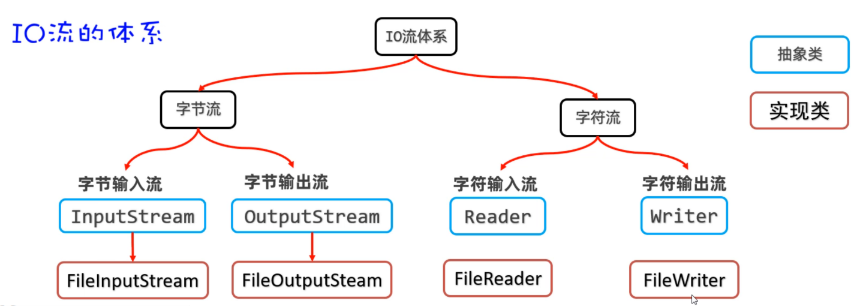

## 一，字符流

前面我们学习了字节流，使用字节流可以读取文件中的字节数据。但是如果文件中有中文使用字节流来读取，就有可能读到半个汉字的情况，这样会导致乱码。虽然使用读取全部字节的方法不会出现乱码，但是如果文件过大又不太合适。

所以Java专门为我们提供了另外一种流，叫字符流，字符流是专门为读取文本数据而生的。

### 1，FileReader类

字符流中的FileReader类，是字符输入流，用来将文件中的字符数据读取到程序中来。


FileReader读取文件的步骤如下：

- 第一步：创建FileReader对象与要读取的源文件接通
- 第二步：调用read()方法读取文件中的字符
- 第三步：调用close()方法关闭流


构造器：

- public FileReader(File filee)  创建字符输入流管道与源文件接通
- public FileReader(String pathname) 创建字符输入流管道与源文件接通


两个read方法：

- public int read()  每次读取一个字符返回，如果发现没有字符可读，返回-1
- public int read(char[] buffer)  每次用一个字符数组去读取数据，返回字符数组读取了多少个字符，如果发现没有数据可读，返回-1


代码演示：

```java
public class Test {
    public static void main(String[] args) {
        // 字符流：

        try(
                // 字符输入流管道，与源文件关联
                FileReader fr = new FileReader("module01/src/01.txt")
        ){

            //System.out.println(fr.read());
            //System.out.println(fr.read());
            //System.out.println(fr.read());
            //// 如果发现没有数据可读了，就会返回-1
            //System.out.println(fr.read());

            // 也是一个字符一个字符地读
            //int c;
            //while ((c=fr.read())!= -1){
            //    System.out.println((char) c);
            //}

            // 可以一次读取多个字符,性能高一点
            char[] buffer = new char[3];
            int len;
            while ((len=fr.read(buffer))!= -1){
                System.out.println(new String(buffer,0,len));
            }

        }catch (Exception e){
            e.printStackTrace();
        }
    }
}
```


### 2，FileWriter类

FileWriter类可以将程序中的字符数据写入文件。




FileWriter往文件中写字符数据的步骤如下：

- 第一步：创建FileWirter对象与要读取的目标文件接通
- 第二步：调用write(字符数据/字符数组/字符串)方法读取文件中的字符
- 第三步：调用close()方法关闭流


构造器：

- public FileWriter(File file)  创建字符输出流管道与源文件对象接通
- public FileWriter(String filepath)  创建字符输出流管道与源文件对象接通
- public FileWriter(File file, boolean append)  创建字符输出流管道与源文件对象接通,  可追加数据
- public FileWriter(String filepath, boolean append)  创建字符输出流管道与源文件对象接通,  可追加数据


常见write方法：

- void write(int c)  写一个字符
- void write(String str)  写一个字符串
- void write(String str，int off,  int len)  写一个字符串的一部分
- void write(char[] cbuf)  写入一个字符数组
- void write(char[] cbuf， int off,  int len)  写入一个字符数组的一部分


代码演示：

```java
public class Test {
    public static void main(String[] args) {
        // 字符流：

        try(
                // 字符输出流管道，与源文件关联
                FileWriter fw = new FileWriter("module01/src/01.txt",true)
        ){

            // 写一个字符出去
            //fw.write('a');
            //fw.write(97);
            //fw.write('码');
            //fw.write("\r\n");
            //fw.write('路');

            //fw.write("我爱Java~");

            // 写字符串的一部分出去
            //fw.write("我爱Java~",0,1);

            // 写一个字符数组出去
            //char[] buffer = {'a','b','c','码','路'};
            //fw.write(buffer);
            //fw.write("\r\n");

            // 写字符数组的一部分出去
            char[] buffer = {'a','b','c','码','路'};
            fw.write(buffer,0,3);
            fw.write("\r\n");

        }catch (Exception e){
            e.printStackTrace();
        }
    }
}
```


### 3，FileWriter注意事项

FileWriter写完数据之后，必须刷新或者关闭，写出去的数据才能生效。比如：下面的代码只调用了写数据的方法，没有关流的方法。当你打开目标文件时，是看不到任何数据的。


```java
public class Test {
    public static void main(String[] args) throws IOException {
        // 字符输出流管道，与源文件关联
        FileWriter fw = new FileWriter("module01/src/01.txt",true);

        // 写一个字符出去
        fw.write('a');
        fw.write('码');
        fw.write('路');
    }
}
```


加上flush()方法之后，数据就会立即到目标文件中去。

```java
public class Test {
    public static void main(String[] args) throws IOException {
        // 字符输出流管道，与源文件关联
        FileWriter fw = new FileWriter("module01/src/01.txt",true);

        // 写一个字符出去
        fw.write('a');
        fw.write('码');
        fw.write('路');

        // 使用FilWriter写数据之后，必须刷新，写出去的数据才能生效
        fw.flush();
    }
}
```


调用close()方法，数据也会立即到文件中去。因为close()方法在关闭流之前，会将内存中缓存的数据先刷新到文件，再关流。

```java
public class Test {
    public static void main(String[] args) throws IOException {
        // 字符输出流管道，与源文件关联
        FileWriter fw = new FileWriter("module01/src/01.txt",true);

        // 写一个字符出去
        fw.write('a');
        fw.write('码');
        fw.write('路');

        // 使用FilWriter写数据之后，必须刷新，写出去的数据才能生效
        //fw.flush();

        // close是关闭流，在关闭流之前，会将内存中缓存的数据先刷新到文件中，再关闭
        fw.close();
    }
}
```


如果流关闭了，就不能再操作了，如下：


## 二，缓冲流

缓冲流有四种，如下：


**缓冲流的作用**：可以对原始流进行包装，提高原始流读写数据的性能。


### 1，字节缓冲流

缓冲流不能单独使用，它需要依赖于原始流。缓冲流的底层自己封装了一个长度为8KB（8129byte）的字节数组，这样就可以提高读写数据的性能的。


**读数据时：**它先用原始字节输入流一次性读取8KB的数据存入缓冲流内部的数组中（ps: 先一次多囤点货），再从8KB的字节数组中读取一个字节或者多个字节（消耗屯的货）。


**写数据时：** 它是先把数据写到缓冲流内部的8BK的数组中（ps: 先攒一车货），等数组存满了，再通过原始的字节输出流，一次性写到目标文件中去（把囤好的货，一次性运走）。


创建缓冲字节流对象时，需要封装一个原始流对象进来。构造方法：

- public BufferedInputStream(InputStream is)  把低级的字节输入流包装成一个高级的缓冲字节输入流，从而提高读数据的性能
- public BufferedOutputStream(OutputStream os)把低级的字节输出流包装成一个高级的缓冲字节输出流，从而提高写数据的性能


使用缓冲流复制文件，如下：

```java
public class Test {
    public static void main(String[] args) throws IOException {
       // 字节流
       //     字节输入流  InputStream 接口
       //                FileInputStream  实现类  字节输入流    原始流/低级流
       //                BufferedInputStream  实现类  字节缓冲输入流   包装流/处理流
       //     字节输出流  OutputStream 接口
       //                FileOutputStream  实现类  字节输出流   原始流/低级流
       //                BufferedOutputStream  实现类  字节缓冲输出流    包装流/处理流
       // 字符流
       //     字符输入流  Reader 接口
       //                FileReader  实现类   字符输入流    原始流/低级流
       //                BufferedReader  实现类   字符缓冲输入流    包装流/处理流
       //     字符输出流  Writer 接口
       //                FileWriter  实现类   字符输出流   原始流/低级流
       //                BufferedWriter  实现类   字符缓冲输出流    包装流/处理流


        // 包装流就是对原始流进行包装，目的就是提高原始流读写数据的性能。

        try(
                // 原始流  字节输入流
                InputStream is = new FileInputStream("D:/resource/1.txt");
                // 把原始流包装一下，得到一个缓冲流     字节缓冲输入流
                InputStream bis = new BufferedInputStream(is);

                // 原始流  字节输出流
                OutputStream os = new FileOutputStream("E:/resource/1.txt");
                // 把原始流包装一下，得到一个缓冲流   字节缓冲输出流
                OutputStream bos = new BufferedOutputStream(os);
        ){
            byte[] buffer = new byte[1024];
            int len;
            while ((len=bis.read(buffer))!=-1){
                bos.write(buffer,0,len);
            }
            System.out.println("复制完成~");
        }catch (Exception e){
            e.printStackTrace();
        }

    }
}
```


### 2，字符缓冲流

字符缓冲流的原理和字节缓冲流是类似的，它底层也会有一个8KB的数组，但是这里是字符数组。字符缓冲流也不能单独使用，它需要依赖于原始字符流一起使用。


**BufferedReader读数据时：**它先原始字符输入流一次性读取8KB的数据存入缓冲流内部的数组中（ps: 先一次多囤点货），再从8KB的字符数组中读取一个字符或者多个字符（把消耗屯的货）。


创建BufferedReader对象需要用到BufferedReader的构造方法，内部需要封装一个原始的字符输入流，我们可以传入FileReader

- public BufferedReadeer(Reader r) 把低级的字符输入流包装成字符缓冲输入流管道，从而提高字符输入流读字符数据的性能。


BufferedReader还要特有的方法，一次可以读取文本文件中的一行：

- public String readLine()  读取一行数据返回，如果没有数据可读，会返回null


BufferedReader读取数据代码演示：

```java
public class Test {
    public static void main(String[] args) throws IOException {

        try(
                // 原始流  字符输入流
                Reader fr = new FileReader("D:/resource/1.txt");
                // 把原始流包装一下，得到一个缓冲流     字符缓冲输入流
                BufferedReader br = new BufferedReader(fr);
        ){
            char[] buffer = new char[3];
            int len;
            //while ((len=br.read(buffer))!=-1){
            //    System.out.println(new String(buffer,0,len));
            //}
            // 直接取读一行数据并返回，如果没有数据可读了，会返回null
            //System.out.println(br.readLine());

            String line; // 记录每次读取的一行数据
            while ((line=br.readLine())!=null){
                System.out.println(line);
            }
        }catch (Exception e){
            e.printStackTrace();
        }

    }
}
```


**BufferedWriter写数据时：** 它是先把数据写到字符缓冲流内部的8BK的数组中（ps: 先攒一车货），等数组存满了，再通过原始的字符输出流，一次性写到目标文件中去（把囤好的货，一次性运走）。如下


创建BufferedWriter对象时需要用到BufferedWriter的构造方法，而且内部需要封装一个原始的字符输出流，我们这里可以传递FileWriter。

- public BufferedWriter(Writer r)  把低级的字符输出流包装成一个高级的缓冲字符输出流管道，从而提高字符输出流写数据的性能。


BufferedWriter新增了一个功能，可以用来写一个换行符：

- public void newLine()  换行


代码演示BufferedWriter往文件中写入字符数据：

```java
public class Test {
    public static void main(String[] args) throws IOException {

        try(
                // 原始流  字符输出流
                Writer fw = new FileWriter("D:/resource/1.txt",true);
                // 把原始流包装一下，得到一个缓冲流     字符缓冲输出流
                BufferedWriter bw = new BufferedWriter(fw);
        ){
           bw.write('a');
           bw.write(97);
           bw.write('码');
           bw.newLine();  // 换行

           bw.write("我爱Java~");
           bw.newLine();  // 换行
        }catch (Exception e){
            e.printStackTrace();
        }

        // 找一个1G的文件，从一个地方，复制到另一个地方，做性能测试
        //  1）使用原始流1个字节1个字节复制
        //  2）使用原始流按字节数组形式复制
        //  3）使用缓冲流1个字节1个字节复制
        //  4）使用缓冲流按字节数组形式复制
    }
}
```


## 三，转换流

FileReader读取文件中的字符时，默认只能读取UTF-8编码格式的文件。如果使用FileReader读取GBK格式的文件，可能存在乱码，因为FileReader它遇到汉字默认是按照3个字节来读取的，而GBK格式的文件一个汉字是占2个字节，这样就会导致乱码。java给我们提供了另外两种流InputStreamReader，OutputStreamWriter，这两个流我们把它叫做转换流。它们可以将字节流转换为字符流，并且可以指定编码方案。

### 1，InputStreamReader类

我们先学习InputStreamReader类，你看这个类名就比较有意思，前面是InputStream表示字节输入流，后面是Reader表示字符输入流，合在一起意思就是表示可以把InputStream转换为Reader，最终InputStreamReader其实也是Reader的子类，所以也算是字符输入流。

InputStreamReader也是不能单独使用的，它内部需要封装一个InputStream的子类对象，再指定一个编码表，如果不指定编码表，默认会按照UTF-8形式进行转换。


准备一个GBK格式的文件，然后使用下面的代码进行读取，看是是否有乱码。


开始读取：

```java
public class Test {
    public static void main(String[] args) throws IOException {

        // 字节流
        //    字节输入流 InputStream
        //             FileInputStream
        //             BufferedInputStream
        //    字节输出流 OutputStream
        //             FileOutputStream
        //             BufferedOutputStream
        // 字符流
        //    字符输入流   Reader
        //               FileReader
        //               BufferedReader
        //    字符输出流   Writer
        //               FileWriter
        //               BufferedWriter


        // 转换流
        try(
                // 字符输入流管道，与源文件关联
                FileReader fr = new FileReader("module01/src/01.txt")
        ){
            // 一次读取1个字符,性能高一点
            char[] buffer = new char[1];
            int len;
            while ((len=fr.read(buffer))!= -1){  // 读取时，是按UTF-8格式读取的
                System.out.println(new String(buffer,0,len));
            }
        }catch (Exception e){
            e.printStackTrace();
        }
    }
}
```


测试如下：


使用转换流，如下：

```java
public class Test {
    public static void main(String[] args) throws IOException {
        try(
                // 得到原始的字节输入流，01.txt里面的文件编码是GBK编码
                InputStream is = new FileInputStream("module01/src/01.txt");

                // 把原始的字节输入流按指定的字符集转换成字符输入流
                Reader isr = new InputStreamReader(is,"GBK");

                // 也可以把字符输入流包装成缓冲字符输入流
                BufferedReader br = new BufferedReader(isr)
        ){
            // 一次读取1个字符,性能高一点
            //char[] buffer = new char[1];
            //int len;
            //while ((len=isr.read(buffer))!= -1){
            //    System.out.println(new String(buffer,0,len));
            //}

            String line;
            while ((line=br.readLine())!= null){
                System.out.println(line);
            }
        }catch (Exception e){
            e.printStackTrace();
        }
    }
}
```


### 2，OutputStreamWriter类

OutputStreamWriter类，前面是OutputStream表示字节输出流，后面是Writer表示字符输出流，合在一起意思就是表示可以把OutputStream转换为Writer，最终OutputStreamWriter其实也是Writer的子类，所以也算是字符输出流。


OutputStreamReader也是不能单独使用的，它内部需要封装一个OutputStream的子类对象，再指定一个编码表，如果不指定编码表，默认会按照UTF-8形式进行转换。


准备一个GBK格式的文件，使用下面代码往文件中写字符数据。

```java
public class Test {
    public static void main(String[] args) throws IOException {
        try(
                // 创建一个字节输出流
                OutputStream os = new FileOutputStream("module01/src/01.txt");

                // 把原始的字节输出流按指定的字符集转换成字符输出转换流
                Writer osw = new OutputStreamWriter(os,"GBK");

                // 把字符输入流包装成缓冲字符输出流
                BufferedWriter bw = new BufferedWriter(osw)
        ){
            bw.write("码路123");
        }catch (Exception e){
            e.printStackTrace();
        }
    }
}
```


## 四，打印流

打印流我们从第一天就一直再使用，只是没有学到你感受不到而已。打印流可以实现更加方便，更加高效的写数据的方式。


### 1，打印流基本使用

打印流，这里所说的打印其实就是写数据的意思，它和普通的write方法写数据还不太一样，一般会使用打印流特有的方法叫`print(数据)`或者`println(数据)`，它打印啥就输出啥。

打印流有两个，一个是字节打印流PrintStream，一个是字符打印流PrintWriter，如下


PrintStream和PrintWriter的用法是一样的，代码演示：

```java
public class Test {
    public static void main(String[] args) throws IOException {
        try(
                // 创建一个字节打印流
                //PrintStream ps = new PrintStream("module01/src/01.txt");

                // 把一个字节输出流包装成一个打印
                PrintStream ps = new PrintStream(new FileOutputStream("module01/src/01.txt",true));
        ){
            //ps.print(97);  // 文件中显示的就是97
            //ps.print('a');
            //ps.println("我爱Java");

            //ps.println(true);
            ps.println(3.14);
        }catch (Exception e){
            e.printStackTrace();
        }
    }
}
```


### 2，重定向输出语句

前面讲过`System.out.println()`这句话表示打印输出，但是至于为什么能够输出，其实我们一直不清楚。


以前是因为知识储备还不够，无法解释，到现在就可以给同学们揭晓谜底了，因为System里面有一个静态变量叫out，out的数据类型就是PrintStream，它就是一个打印流，而且这个打印流的默认输出目的地是控制台，所以我们调用`System.out.pirnln()`就可以往控制台打印输出任意类型的数据，而且打印啥就输出啥。


而且System还提供了一个方法，可以修改底层的打印流，这样我们就可以重定向打印语句的输出目的地了。我们玩一下, 直接上代码：

```java
public class Test {
    public static void main(String[] args)  {

        System.out.println("我爱Java");
        System.out.println("我爱Vue");
        try(
                PrintStream ps = new PrintStream("module01/src/01.txt");
        ){
            // 把系统默认的打印流对象改成自己设置的打印流
            System.setOut(ps);

            System.out.println("我爱Java 6");
            System.out.println("我爱Vue 6");
        }catch (Exception e){
            e.printStackTrace();
        }
    }
}
```

此时打印语句，将往文件中打印数据，而不在控制台。


## 五，数据流

数据流，我们在开发中偶尔也会用到。比如，我们想把数据和数据的类型一并写到文件中去，读取的时候也将数据和数据类型一并读出来。这就可以用到数据流，有两个DataInputStream和DataOutputStream.


### 1，DataOutputStream类

DataOutputStream类也是一种包装流，创建DataOutputStream对象时，底层需要依赖于一个原始的OutputStream流对象。然后调用它的wirteXxx方法，写的是特定类型的数据。


构造器：


方法：


代码演示：

```java
public class Test {
    public static void main(String[] args)  {

        // 数据流：
        //   DataOutputStream  也是一种包装流  也需要包装一个原始流 OutputStream
        //   writeXxx就可以写特定类型的数据

        try(
                // 创建一个数据输出流，包装了原始字节输出流
                DataOutputStream dos = new DataOutputStream(new FileOutputStream("module01/src/01.txt"));
        ){
            dos.writeInt(110);
            dos.writeDouble(3.14);
            dos.writeBoolean(true);
        }catch (Exception e){
            e.printStackTrace();
        }
    }
}
```


### 2，DataInputStream类

DataIntputStream也是一种包装流，创建DataInputStream对象时，底层需要依赖于一个原始的InputStream流对象。然后调用它的readXxx()方法就可以读取特定类型的数据。


构造器：


方法：


读取文件中特定类型的数据（整数、小数、字符串等），代码演示：

```java
public class Test {
    public static void main(String[] args)  {

        // 数据流：
        //   DataOutputStream  也是一种包装流  也需要包装一个原始流 OutputStream
        //   writeXxx就可以写特定类型的数据

        try(
                // 创建一个数据输入流，包装了原始字节输入流
                DataInputStream dis = new DataInputStream(new FileInputStream("module01/src/01.txt"));
        ){
            int i = dis.readInt();
            System.out.println(i);

            double d = dis.readDouble();
            System.out.println(d);

            boolean b = dis.readBoolean();
            System.out.println(b);
        }catch (Exception e){
            e.printStackTrace();
        }
    }
}
```


## 六，序列化流

字节流是以字节为单位来读写数据、字符流是按照字符为单位来读写数据、而对象流是以对象为单位来读写数据。也就是把对象当做一个整体，可以写一个对象到文件，也可以从文件中把对象读取出来。


这里有一个新词叫序列化：

- 序列化：意思就是把对象写到文件或者网络中去。（简单记：写对象）
- 反序列化：意思就是把对象从文件或者网络中读取出来。（简单记：读对象）


### 1，ObjectOutputStraem类

ObjectOutputStream也是一个包装流，不能单独使用，需要结合原始的字节输出流使用。将一个User对象写到文件中去。先准备一个Student类，必须让其实现Serializable接口。

```java
// 对象要想序列化，必须实现序列化接口
class Student implements Serializable{
    private String userName;
    private int age;

    public Student() {
    }

    public Student(String userName, int age) {
        this.userName = userName;
        this.age = age;
    }

    @Override
    public String toString() {
        return "Student{" +
                "userName='" + userName + '\'' +
                ", age=" + age +
                '}';
    }
}
```

再创建ObjectOutputStream流对象，调用writeObject方法对象到文件，如下：

```java
public class Test {
    public static void main(String[] args)  {

        // 序列化流：
        //   序列化就是把一个对象写到文件中或网络中  写对象     ObjectOutputStream
        //   反序列化就是把对象从文件或网络中读取出来   读对象   ObjectInputStream

        try(
                // 创建一个对象字节输出流，包装了原始字节输出流
                ObjectOutputStream oos = new ObjectOutputStream(new FileOutputStream("module01/src/01.txt"));
        ){
            Student stu1 = new Student("wc", 18);

            // 序列化对象到文件中
            oos.writeObject(stu1);
            System.out.println("序列化成功~");
        }catch (Exception e){
            e.printStackTrace();
        }
    }
}
```

写到文件中的对象，是不能用记事本打开看的。因为对象本身就不是文本数据，打开是乱码，如下：


怎样才能读懂文件中的对象是什么呢？这里必须用反序列化，自己写代码读。

### 2，ObjectInputStream类

ObjectInputStream也是一个包装流，不能单独使用，需要结合原始的字节输入流使用。接着前面的案例，文件中已经有一个Student对象，现在要使用ObjectInputStream读取出来。称之为反序列化。

```java
public class Test {
    public static void main(String[] args)  {

        // 序列化流：
        //   序列化就是把一个对象写到文件中或网络中  写对象     ObjectOutputStream
        //   反序列化就是把对象从文件或网络中读取出来   读对象   ObjectInputStream

        try(
                // 创建一个对象字节输入流，包装了原始字节输入流
                ObjectInputStream ois = new ObjectInputStream(new FileInputStream("module01/src/01.txt"));
        ){
            Student o = (Student)ois.readObject();
            System.out.println(o);
            System.out.println("反序列化成功~");
        }catch (Exception e){
            e.printStackTrace();
        }
    }
}
```


如果有些字段不想序列化，如下：

```
// 对象要想序列化，必须实现序列化接口
class Student implements Serializable{
    private String userName;
    private int age;
    // 不想让pwd进行序列化，可以使用一个关键字，叫transient
    // transient 表示此成员变量不参与序列化
    private transient String pwd;

    public Student() {
    }

    public Student(String userName, int age) {
        this.userName = userName;
        this.age = age;
    }

    @Override
    public String toString() {
        return "Student{" +
                "userName='" + userName + '\'' +
                ", age=" + age +
                '}';
    }
}
```


## 七，IO框架

为了简化对IO操作，由apache开源基金组织提供了一组有关IO流小框架，可以提高IO流的开发效率。这个框架的名字叫commons-io：其本质是别人写好的一些字节码文件（class文件），打包成了一个jar包。我们只需要把jar包引入到我们的项目中，就可以直接用了。 jar包中提供的工具类叫FileUtils，它的部分功能如下:


引入jar包，具体步骤如下

1. 在模块的目录下，新建一个lib文件夹
2. 把jar包复制粘贴到lib文件夹下
3. 选择lib下的jar包，右键点击Add As Library，然后就可以用了


代码如下：

```java
public class Test {
    public static void main(String[] args) throws Exception {
        //  IO框架  commons
        //  jar包

        // copy文件
        FileUtils.copyFile(new File("D:\\resource\\1.txt"),new File("E:\\resource\\1.txt"));

        // copy文件夹
        FileUtils.copyDirectory(new File("D:\\resource"),new File("E:\\resource"));

        // 删除文件夹
        FileUtils.deleteDirectory(new File("E:\\resource"));
    }
}
```


