## 一，属性文件

### 1，特殊文件概述

前面我们学习了IO流，IO流是用来读写文件中的数据的，但是我们接触到的文件都是普通的文本文件，普通的文本文件里面的数据是没有任何格式规范的，用户可以随意编写。这种普通文件不方便程序对文件中的数据信息处理。


以后的Java开发过程中还会遇到一些特殊的文本文件，这些文件是有一些格式要求的，方便程序对文件中的数据进行处理。比如，后面我们会用到两种特殊的文本文件，一种是properties文件，还有一种是xml文件。


properties文件和xml文件介绍：

- 后缀为.properties的文件，称之为属性文件，它可以很方便的存储一些类似于键值对的数据。经常当做软件的配置文件使用。
- xml文件能够表示更加复杂的数据关系，比如要表示多个用户的用户名、密码、家乡、性别等。在后面，也经常当做软件的配置文件使用。


对于上面两种特殊文件学习时，只需要把握三点：

- 特殊文件的特点和作用
- 如何读取它里面的数据
- 如何使用程序把数据写到特殊文件中


### 2，Properties属性文件

属性文件的格式：

- 属性文件后缀以`.properties`结尾
- 属性文件里面的每一行都是一个键值对，键和值中间用=隔开。比如: `admin=123456` 
- `#`表示这样是注释信息，是用来解释这一行配置是什么意思。
- 每一行末尾不要习惯性加分号，以及空格等字符；不然会把分号，空格会当做值的一部分。
- 键不能重复，值可以重复


演示如下：

```properties
# 表示注释
# 表示用户名
admin=malu
# 每一行结束，不要加分号，也不要加空格等字符，如果你加了，会当成值的一部分
age=18
pwd=123
# 键不能重复
#pwd=456
```


读取属性文件中的数据，需要使用Properties，Properties是Map接口下面的一个实现类，所以Properties也是一种双列集合，用来存储键值对。但是一般不会把它当做集合来使用。Properties类的对象，用来表示属性文件，可以用来读取属性文件中的键值对。


使用Properties读取属性文件中的键值对，需要用到的方法如下：

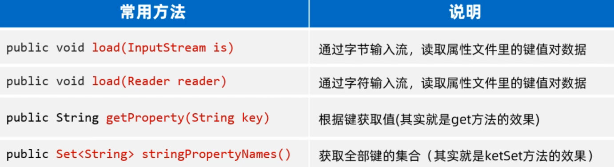


使用Properties读取属性文件的步骤如下

1. 创建一个Properties的对象出来（键值对集合，空容器）
2. 调用load(字符输入流/字节输入流)方法，开始加载属性文件中的键值对数据到properties对象中去
3. 调用getProperty(键)方法，根据键取值


代码演示：

```java
public class Test {
    public static void main(String[] args) throws Exception {
        // .txt  .java  .class  .vue  .wxml  .png  .jpg....
        // .txt
        //    admin=malu pwd=123 age=10
        // 在java它帮我们提供一些特殊的文件，今天需要学习两个特殊文件，后面还需要学习一些其它的特殊文件
        //    properties   xml(html文件)

        // properties文件  叫属性文件  后缀是.properties  存储的数据类似键值对，通常会作为项目的配置文件使用
        // xml文件  通常会作为项目的配置文件使用  很早之前，前后端通信也会使用到xml格式的文件

        // properties 每一行都是一个键值对，键和值中间使用=隔开。如admin=malu

        // 创建一个Properties对象
        Properties properties = new Properties();
        System.out.println(properties);  // 空容器

        // 加载属性文件中的键值对数据到properties这个对象中
        properties.load(new FileReader("module01\\src\\config.properties"));
        System.out.println(properties);


        // 根据键取值
        System.out.println(properties.getProperty("admin"));
        System.out.println(properties.getProperty("age"));

        // 遍历全部的键值对
        // 获取键的集合
        Set<String> keys = properties.stringPropertyNames();
        for (String key : keys) {
            //System.out.println("key-->"+key);
            String value = properties.getProperty(key);
            System.out.println(key+"==>"+value);
        }

        System.out.println("-------------------");

        properties.forEach((k,v)->{
            System.out.println(k+"==>"+v);
        });
    }
}
```


使用Properties往属性文件中写键值对，需要用到的方法如下


往Properties属性文件中写键值对的步骤如下

1. 先准备一个.properties属性文件，按照格式写几个键值对
2. 创建Properties对象出来，
3. 调用setProperty存储一些键值对数据
4. 调用store(字符输出流/字节输出流, 注释)，将Properties集合中的键和值写到文件中，注意：第二个参数是注释，必须得加；


先准备一个config.properties，如下：

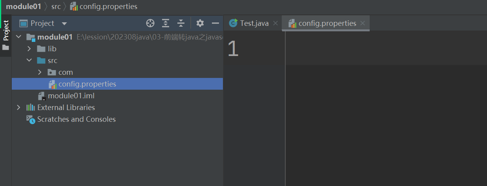


写键值对，代码演示：

```java
public class Test {
    public static void main(String[] args) throws Exception {

        Properties properties = new Properties();
        System.out.println(properties);  // 空容器

        // 通过setProperty存储一些数据到properties
        properties.setProperty("userName","malu");
        properties.setProperty("pwd","malu");
        properties.setProperty("age","11");

        // 调用store方法，将properties集合中的键值对写到文件中。
        // 第2个参数是注释，必须要加
        properties.store(new FileWriter("module01\\src\\config.properties"),"save user");
    }
}

```


测试如下：

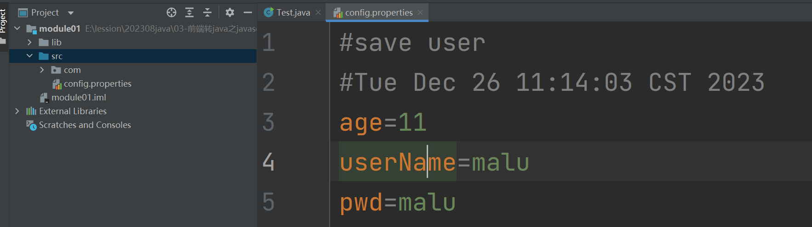


## 二，XML文件

### 1，什么是XML文件

XML是可扩展的标记语言，意思是它是由一些标签组成	的，而这些标签是自己定义的。本质上一种数据格式，可以用来表示复杂的数据关系。

XML文件有如下的特点：

- XML中的`<标签名>` 称为一个标签或者一个元素，一般是成对出现的。
- XML中的标签名可以自己定义（可扩展），但是必须要正确的嵌套
- XML中只能有一个根标签。
- XML标准中可以有属性
- XML必须第一行有一个文档声明，格式是固定的`<?xml version="1.0" encoding="UTF-8"?>`
- XML文件必须是以.xml为后缀结尾


代码演示：

```xml
<?xml version="1.0" encoding="utf-8" ?>
<!--上面的代码是文档声明-->

<!-- 需要唯一的根标签，根标签中的其它标签是双标签-->
<users>
    <user id="1">
        <name>malu</name>
        <password>123</password>
        <age>10</age>
        <sex>man</sex>
        <address>bj</address>
    </user>
    <user id="2">
        <name>xq</name>
        <password>456</password>
        <age>11</age>
        <sex>man</sex>
        <address>sh</address>
    </user>
</users>
```


上面XML文件中的数据格式是最为常见的，标签有属性、文本、还有合理的嵌套。XML文件中除了写以上的数据格式之外，还有一些特殊的字符不能直接写。

- 像 `<,>,& `等这些符号不能出现在标签的文本中，会和标签格式冲突。如果标签文本中有这些特殊字符，需要用一些占位符代替。

  ```text
  &lt;  表示 <
  &gt;  表示 >
  &amp; 表示 &
  &apos; 表示 '
  &quot; 表示 "
  
  <data> 3 &lt; 2 &amp;&amp; 5 &gt; 4 </data>
  ```

  

- 如果在标签文本中，出现大量的特殊字符，不想使用特殊字符，此时可以用CDATA区，格式如下

  ```xml
  <data1>
      <![CDATA[
     		3 < 2 && 5 > 4
      ]]>
  </data1>
  ```


代码演示：

```xml
<?xml version="1.0" encoding="utf-8" ?>
<!--上面的代码是文档声明-->

<!-- 需要唯一的根标签，根标签中的其它标签是双标签-->
<users>
    <user id="1">
        <name>malu&lt;</name>
        <password>123</password>
        <age>10</age>
        <sex>man</sex>
        <address>bj</address>
        <data> 3 &lt; 2 &amp;&amp; 5 &gt; 4 </data>
        <data1>
            <![CDATA[
                3 < 2 && 5 > 4
            ]]>
        </data1>
    </user>
    <user id="2">
        <name>xq</name>
        <password>456</password>
        <age>11</age>
        <sex>man</sex>
        <address>sh</address>
    </user>
</users>
```


浏览器测试：

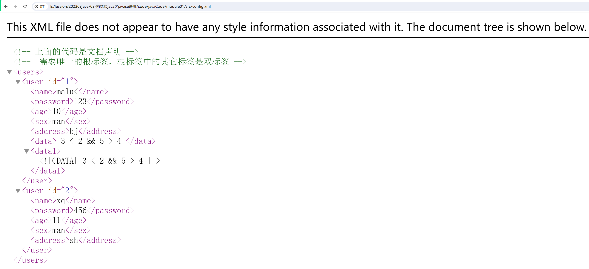


### 2，XML的作用


xml的作用：

- 网络传输中的一种数据格式，现在主流的格式是JSON
- 项目的配置文件


### 3，XML解析

使用程序读取XML文件中的数据，称之为XML解析。这里并不需要我们自己写IO流代码去读取xml文件中的数据。其实有很多开源的，好用的XML解析框架，最知名的是DOM4J（第三方开发的）


DOM4J解析XML文件的思想是：文档对象模型（意思是把整个XML文档、每一个标签、每一个属性都等都当做对象来看待）。Dowument对象表示真个XML文档、Element对象表示标签（元素）、Attribute对象表示属性、标签中的内容就是文本。


DOM4J解析XML需要用到的方法如下

- public SAXReader()  构建Dom4J的解析器对象，可以认为代表整个Dom4j框架
- public Document read(String url) 把XML文件读成Document对象
- public Document read(InputStream is) 通过字节输入流读取XML文件
- Element getRootElement 获取根元素对象


XML解析的过程，是从根元素开始，从外层往里层解析。 我们先把Document对象，和根元素获取出来

```java
import org.dom4j.Document;
import org.dom4j.Element;
import org.dom4j.io.SAXReader;

public class Test {
    public static void main(String[] args) throws Exception {
        // 创建一个解析器对象，是Dom4J提供的
        SAXReader saxReader = new SAXReader();

        // 把整个xml文件解析成一个document对象
        Document document = saxReader.read("module01\\src\\config.xml");

        // 得到根元素
        Element root = document.getRootElement();
        System.out.println(root.getName());
    }
}
```


获取到XML文件的根元素之后，接下来，就可以用根元素在获取到它里面的子元素（包括子标签、表属性等）。需要用到的方法如下

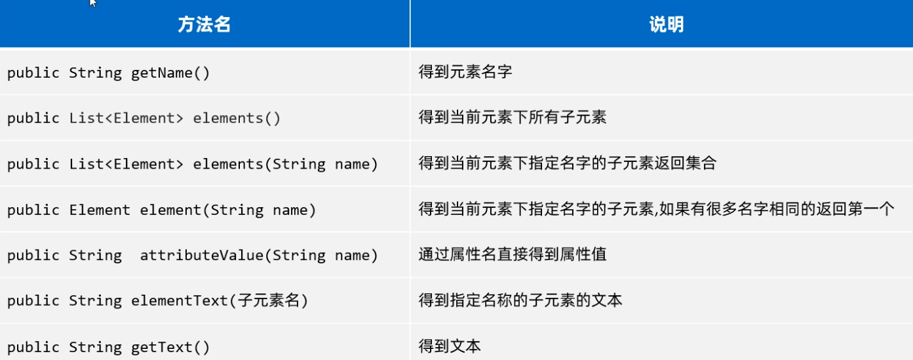


代码演示，xml文件中的代码：

```xml
<?xml version="1.0" encoding="utf-8" ?>
<!--上面的代码是文档声明-->

<!-- 需要唯一的根标签，根标签中的其它标签是双标签-->
<users>
    <user id="1">
        <name>malu&lt;</name>
        <password>123</password>
        <age>10</age>
        <sex>man</sex>
        <address>bj</address>
        <data> 3 &lt; 2 &amp;&amp; 5 &gt; 4 </data>
        <data1>
            <![CDATA[
                3 < 2 && 5 > 4
            ]]>
        </data1>
    </user>
    <user id="2">
        <name>xq</name>
        <password>456</password>
        <age>11</age>
        <sex>man</sex>
        <address>sh</address>
    </user>
    <student id="s1">
        <name>ok</name>
    </student>
    <student id="s2">bad</student>
</users>
```


Java代码如下：

```java
public class Test {
    public static void main(String[] args) throws Exception {
        // 创建一个解析器对象，是Dom4J提供的
        SAXReader saxReader = new SAXReader();

        // 把整个xml文件解析成一个document对象
        Document document = saxReader.read("module01\\src\\config.xml");

        // 得到根元素
        Element root = document.getRootElement();
        System.out.println(root.getName());

        // 获取根元素下面的直接子元素
        //List<Element> elements = root.elements();
        List<Element> elements = root.elements("user");
        for (Element element : elements) {
            System.out.println(element.getName());
        }

        System.out.println("----------");

        // 获取某个子元素，默认是获取第1个
        Element student = root.element("student");
        System.out.println(student);

        String id = student.attributeValue("id");
        System.out.println(id);

        String name = student.elementText("name");
        System.out.println(name);
    }
}
```


### 4，XML文件写入

DOM4J也提供了往XML文件中写标签的方法，但是用起来比较麻烦。这里不建议使用。我们自己使用StringBuilder按照标签的格式拼接，然后再使用BufferedWriter写到XML文件中去就可以了。代码演示：

```java
public class Test {
    public static void main(String[] args) throws Exception {
        // 1、使用一个StringBuilder对象来拼接XML格式的数据。
        StringBuilder sb = new StringBuilder();
        sb.append("<?xml version=\"1.0\" encoding=\"UTF-8\" ?>\r\n");
        sb.append("<book>\r\n");
        sb.append("\t<name>").append("从入门到跑路").append("</name>\r\n");
        sb.append("\t<author>").append("dlei").append("</author>\r\n");
        sb.append("\t<price>").append(999.99).append("</price>\r\n");
        sb.append("</book>");

        try (
                BufferedWriter bw = new BufferedWriter(new FileWriter("module01\\src\\config.xml"));
        ){
            bw.write(sb.toString());
        } catch (Exception e) {
            e.printStackTrace();
        }
    }
}
```


### 5，XML约束

参考连接：https://blog.csdn.net/weixin_45187434/article/details/131504060


XML约束指的是限制XML文件中的标签或者属性，只能按照规定的格式写。比如我在项目中，想约束一个XML文件中的标签只能写<书>、<书名>、<作者>、<售价>这几个标签，如果写其他标签就报错。


怎么才能达到上面的效果呢？有两种约束技术，一种是DTD约束、一种是Schame约束。


book.xml中引入了DTD约束文件，book.xml文件中的标签就受到DTD文件的约束。如下：

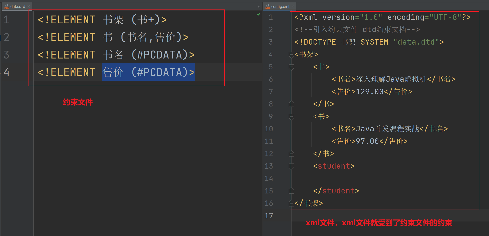


DTD文件解释：

- 在第 1 行中，使用 <!ELEMENT…> 语句定义了一个元素，其中 “书架” 是元素的名称，“(书+)” 表示书架元素中有一个或者多个书元素，字符 + 用来表示它所修饰的成分必须出现一次或者多次；
- 在第 2 行中，“书” 是元素名称，“(书名,售价)” 表示元素书包含书名、售价这两个子元素，并且这些子元素要按照顺序依次出现；
- 在第 3-4 行中，“书名”、和 “售价” 都是元素名称，“(#PCDATA)” 表示元素的内容是可解析字符数据（Parsed Character Data），就是普通文本字符串。
  


Schame约束，config.xml文件就受到右边schame文件（.xsd结尾的文件）的约束。

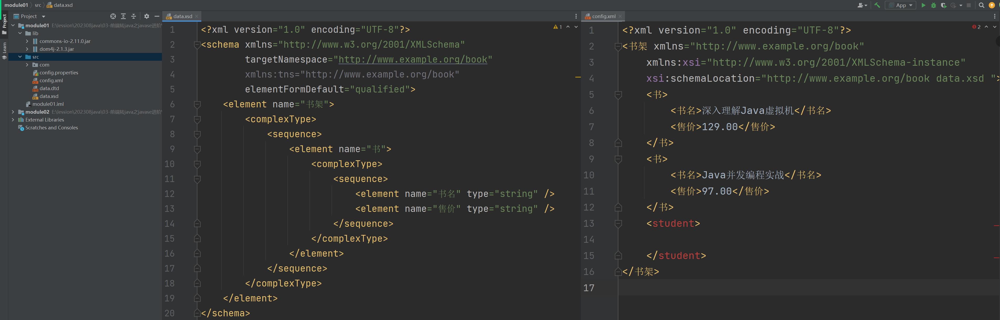


## 三，日志技术


### 1，日志概述

想搞清楚什么是日志，其实可以通过下面几个问题来了解的。

- 系统系统能记住某些数据被谁操作，比如被谁删除了？
- 想分析用户浏览系统的具体情况，比如挖掘用户的具体喜好？
- 当系统在开发中或者上线后出现了Bug，崩溃了，该通过什么去分析，定位Bug?

而日志就可以帮我们解决以上的问题。所以日志就好比生活中的日记，日记可以记录生活中的点点滴滴；而程序中的日志，通常就是一个文件，里面记录了程序运行过程中产生的各种数据。

日志技术有如下好处

1. 日志可以将系统执行的信息，方便的记录到指定位置，可以是控制台、可以是文件、可以是数据库中。
2. 日志可以随时以开关的形式控制启停，无需侵入到源代码中去修改。


### 2，日志体系

在行内，其实有很多日志框架给开发者使用。所谓日志框架就是由一些牛人或者第三方公司已经做好的实现代码，后来者就可以直接拿过去使用。

日志框架有很多种，比如有JUL（java.util.logging）、Log4j、logback等。但是这些日志框架如果使用的API方法都不一样的话，使用者的学习成本就很高。为了降低程序员的学习压力，行内提供了一套日志接口，然后所有的日志框架都按照日志接口的API来实现就可以了。

这样程序员只要会一套日志框架，那么其他的也就可以通过用，甚至可以在多套日志框架之间来回切换。


相当的概念：

- 日志接口：设计日志框架的一套标签，日志框架需要实现这些接口。 JCL  Java Commons Logging。SLF4J
- 日志框架：基于上面的日志接口实现的框架。JUL，Log4j，Logback...  
- Logback是一个日志框架，是基于SLF4J的日志接口实现的。推荐使用Logback这个日志框架。


推荐同学们使用Logback日志框架，也在行业中最为广泛使用的。Logback日志分为哪几个模块：

- logback-core  基础模块，是其它两个模块依赖的基础，必须有
- logback-classic 完整实现了slf4j API的模块，必须有
- logback-access 与Tomcat和Jetty等Servlet容器集成，以提供Http访问的日志功能。后面会用到


想使用Logback日志框架，至少需要在项目中整合三个模块：

- slf4j-api: 日志接口
- logback-core
- logback-classic


### 3，Logback快速入门


由于Logback是第三方提供的技术，所以首先需要啊将Jar包引入到项目中，具体步骤如下:

1. 将`slftj-api.jar、logback-core.jar、logback-classes.jar` 这三个jar包，复制一下
2. 在当前模块下面新建一个lib文件夹，把刚刚复制的三个jar包都粘贴到此处
3. 在src目录下写`logback.xml`配置文件（必须是src目录）
4. 然后就可以开始写代码了，在代码中创建一个日志记录日对象
5. 开始记录日志，代码如下

```java
public class Test {
    // 表示创建一个logger日志对象
    public static final Logger LOGGER = LoggerFactory.getLogger("Test");

    public static void main(String[] args)  {
       try{
           LOGGER.info("test001方法开始执行~");
           test001(4,0);
           LOGGER.info("test001方法执行成功~");
       }catch (Exception e){
           LOGGER.error("test001方法执行失败了，出现bug了~");
       }
    }

    public static void test001(int a, int b){
        LOGGER.debug("参数a:"+a);
        LOGGER.debug("参数b:"+b);
        int c = a/b;
        LOGGER.info("结果是："+c);
    }
}
```


当我们运行程序时，就可以看到控制台记录的日志，如下：

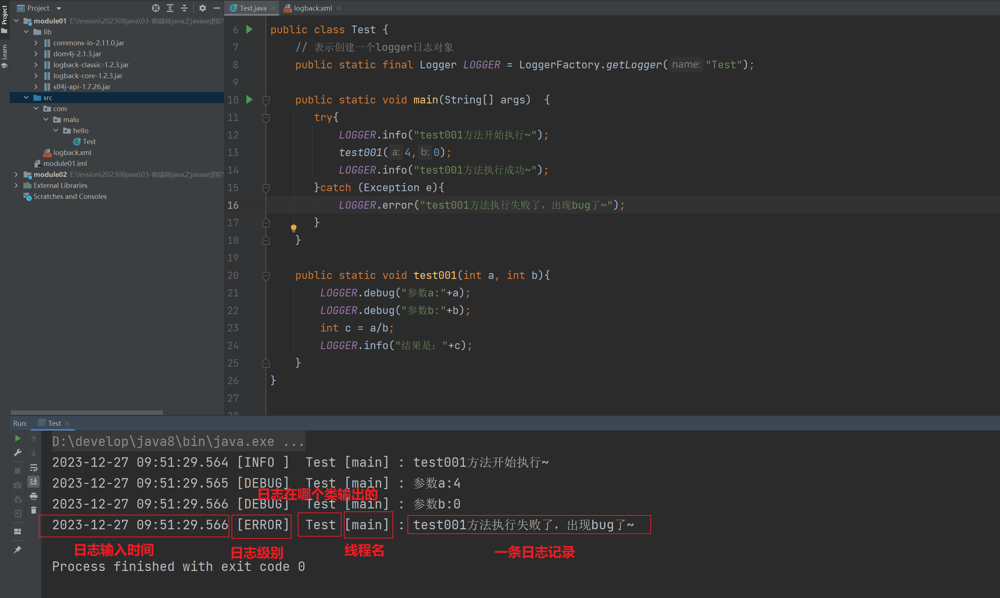

同时在文件中，也有一份这样的日志信息。文件在哪里内，从配置文件中去找，如下：

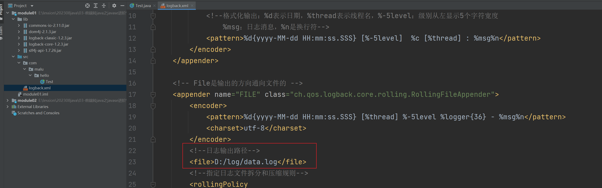

打开此文件，如下：

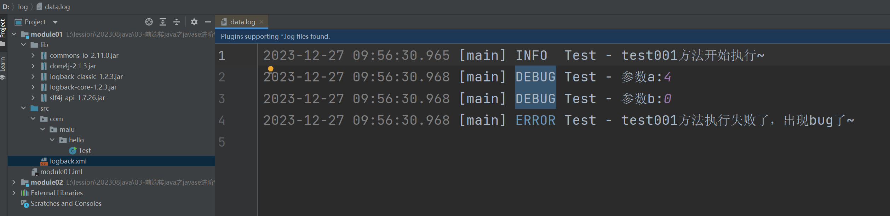

关于Logback的快速入门我们就做完了。


### 4，日志配置文件


Logback提供了一个核心配置文件logback.xml，日志框架在记录日志时会读取配置文件中的配置信息，从而记录日志的形式。具体可以做哪些配置呢？

1. 可以配置日志输出的位置是文件、还是控制台
2. 可以配置日志输出的格式
3. 还可以配置日志关闭和开启、以及哪些日志输出哪些日志不输出。


控制日志往文件中输出，还是往控制台输出：

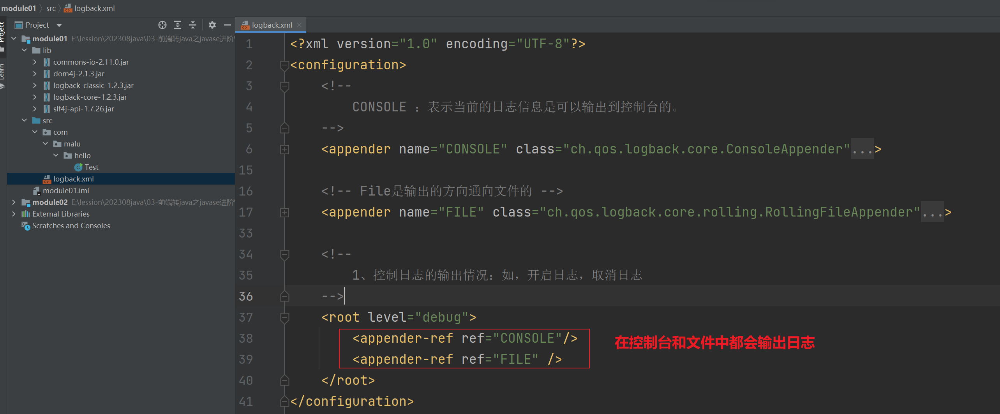


控制打开和关闭日志，如下：

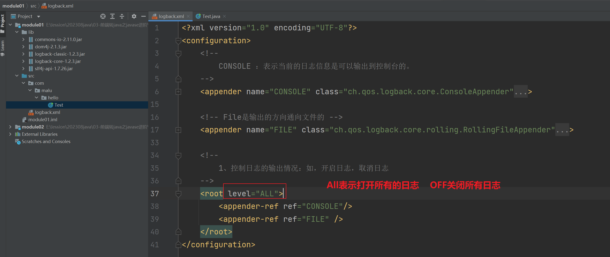


控制日志的输出的格式，日志格式是由一些特殊的符号组成，可以根据需要删减不想看到的部分。比如不想看到线程名那就不要[%thread]。但是不建议同学们更改这些格式，因为这些都是日志很基本的信息。

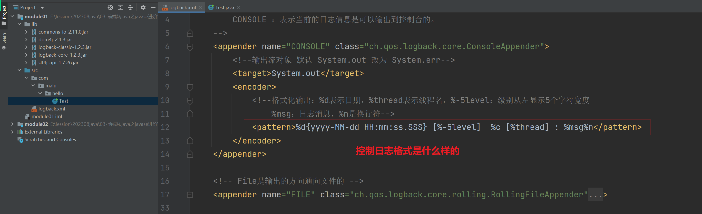


### 5，配置日志级别


日志级别指的是日志信息的类型，日志都会分级别，常见的日志级别如下（优先级依次升高）：

- trace  追踪，指明程序运行轨迹
- debug  调试，实际应用中一般将其作为最低级别，而trace则很少使用
- info 输出重要的运行信息，数据连接，网络连接，IO操作等，使用较多
- warn 警告信息，可能会发生问题，使用较多
- error 错误信息，使用较多


配置日志级别，如下：

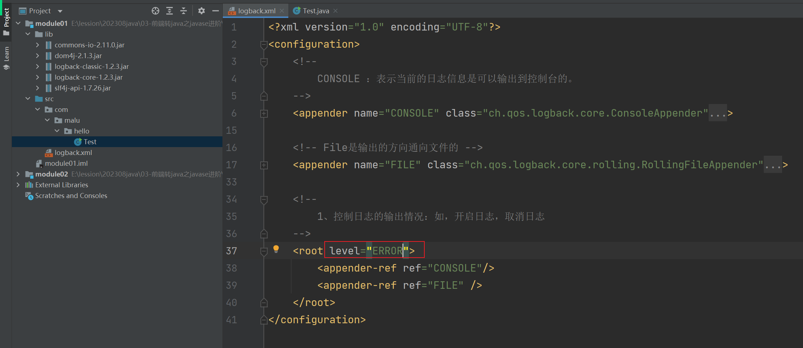


测试：

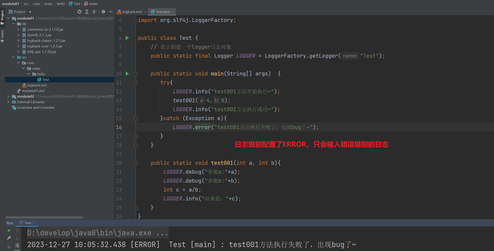


Logback只输出大于或者等于核心配置文件配置的日志级别信息。小于配置级别的日志信息，不被记录。

- 配置的是trace，则trace、debug、info、warn、error级别的日志都被输出
- 配置的是debug, 则debug、info、warn、error级别的日志被输出
- 配置的是info,则info、warn、error级别的日志被输出
- .... 


