## 一，线程的创建


我们之前写过的程序，其实都是单线程程序，代码都是从上下到执行。但有些程序是多线程程序，如12306网站就是支持多线程的，因为同时可以有很多人一起进入网站购票，而且每一个人互不影响。再比如百度网盘，可以同时下载或者上传多个文件。这些程序中其实就有多条执行路径，每一条执行执行路径就是一条线程，所以这样的程序就是多线程程序。Java提供了几种创建线程的方式。


### 1，线程创建方式一


Java为开发者提供了一个类叫做Thread，此类的对象用来表示线程。创建线程并执行线程的步骤如下：

1. 定义一个子类继承Thread类，并重写run方法
2. 创建Thread的子类对象
3. 调用start方法启动线程（启动线程后，会自动执行run方法中的代码）


代码演示：

```java
// 定义一个类，继承Thread，重写run方法
class MyThread extends Thread{
    @Override
    public void run() {
        // 书写这个线程要执行的任务
        for (int i = 0; i < 10; i++) {
            System.out.println("子线程MyThead线程输出："+i);
        }
    }
}
```


定义一个测试类，在测试类中创建MyThread线程对象，并启动线程：

```java
public class Test {

    public static void main(String[] args)  {
        // JS中主线程是单线程，如果有耗时任务，在JS中靠异步解决。
        // 在Java中可以创建很多线程。

        // 创建MyThread线程类的对象，表示一个线程
        MyThread t = new MyThread();
        // 启动线程，会自动执行run方法
        t.start();

        for (int i = 0; i < 10; i++) {
            System.out.println("主线程main输出："+i);
        }
    }
}
```


打印结果如下图所示，我们会发现MyThread和main线程在相互抢夺CPU的执行权（**注意：哪一个线程先执行，哪一个线程后执行，目前我们是无法控制的，每次输出结果都会不一样**）

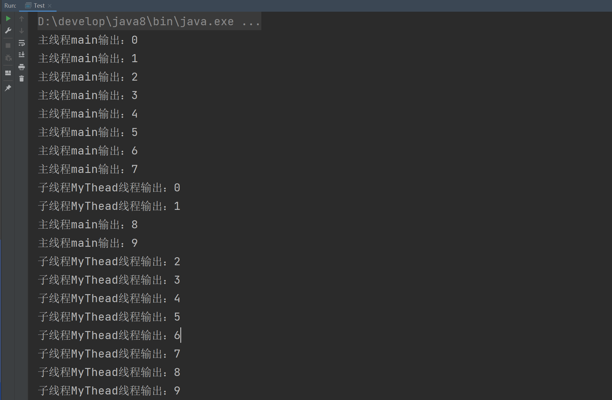


**最后我们还需要注意一点**：不能直接去调用run方法，如果直接调用run方法就不认为是一条线程启动了，而是把Thread当做一个普通对象，此时run方法中的执行的代码会成为主线程的一部分。此时执行结果是这样的。

```java
public class Test {
    public static void main(String[] args)  {
        // JS中主线程是单线程，如果有耗时任务，在JS中靠异步解决。
        // 在Java中可以创建很多线程。

        // 创建MyThread线程类的对象，表示一个线程
        MyThread t = new MyThread();
        // 启动线程，会自动执行run方法
        // start表示启动线程，直接调用run方法，它会把MyThread当成一个普通类
        // 仅仅是调用了run这个方法，没有开线程
        t.run();

        for (int i = 0; i < 10; i++) {
            System.out.println("主线程main输出："+i);
        }
    }
}
```


结果：

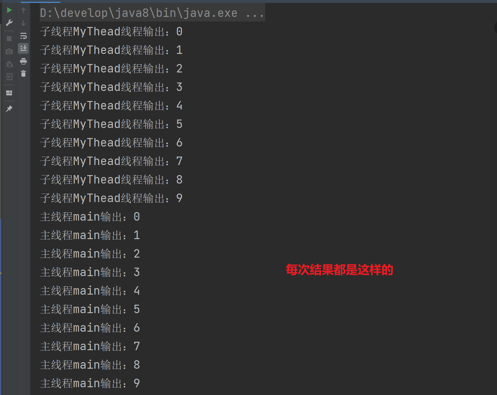


### 2，线程创建方式二


Java为开发者提供了一个Runnable接口，该接口中只有一个run方法，意思就是通过Runnable接口的实现类对象专门来表示线程要执行的任务。具体步骤如下

1. 先写一个Runnable接口的实现类，重写run方法(这里面就是线程要执行的代码)
2. 再创建一个Runnable实现类的对象
3. 创建一个Thread对象，把Runnable实现类的对象传递给Thread
4. 调用Thread对象的start()方法启动线程（启动后会自动执行Runnable里面的run方法）


先准备一个Runnable接口的实现类：

```java
// 写一个类（任务类），实现Runnable接口，重写run方法
class MyRunnable implements Runnable{
    @Override
    public void run() {
        // 在这个run方法中，书写要个线程要执行的代码
        for (int i = 0; i < 10; i++) {
            System.out.println("子线程输出："+i);
        }
    }
}
```


写一个测试类，在测试类中创建线程对象，并执行线程

```java
public class Test {
    public static void main(String[] args)  {
        // 创建一个任务对象  target 表示任务对象
        MyRunnable target = new MyRunnable();

        // 把任务对象交给线程对象来处理
        // new Thread(target) 整体是一个线程对象  .start就杺开启线程
        //Thread t = new Thread(target);
        //t.start(); // 开启线程
        new Thread(target).start();

        for (int i = 0; i < 10; i++) {
            System.out.println("主线程main输出："+i);
        }
    }
}
```


运行上面代码，结果如下图所示（注意：没有出现下面交替执行的效果，也是正常的）:

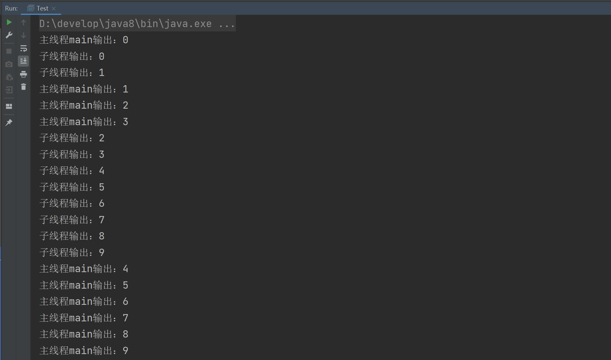


第二种线程的创建方式，需要写一个Runnable接口的实现类，然后再把Runnable实现类的对象传递给Thread对象。现在我不想写Runnable实现类，于是可以直接创建Runnable接口的匿名内部类对象，传递给Thread对象。代码演示：

```java
public class Test {
    public static void main(String[] args)  {
        // 直接创建Runnable接口的匿名内部类（任务对象）
       Runnable target = new Runnable(){
           @Override
           public void run() {
               for (int i = 0; i < 10; i++) {
                   System.out.println("子线程输出："+i);
               }
           }
       };
       new Thread(target).start();

        for (int i = 0; i < 10; i++) {
            System.out.println("主线程main输出："+i);
        }
    }
}
```


上面的代码是可以简写的，如下：

```java
public class Test {
    public static void main(String[] args)  {
        
       new Thread(new Runnable(){
           @Override
           public void run() {
               for (int i = 0; i < 10; i++) {
                   System.out.println("子线程输出："+i);
               }
           }
       }).start();

        for (int i = 0; i < 10; i++) {
            System.out.println("主线程main输出："+i);
        }
    }
}
```


继续简写，如下：

```java
public class Test {
    public static void main(String[] args)  {

       new Thread(()->{
           for (int i = 0; i < 10; i++) {
               System.out.println("子线程输出："+i);
           }
       }).start();

        for (int i = 0; i < 10; i++) {
            System.out.println("主线程main输出："+i);
        }
    }
}
```


### 3，线程创建方式三


分析一下前面两种都存在的一个问题。然后再引出第三种可以解决这个问题。

- 假设线程执行完毕之后有一些数据需要返回，前面两种方式重写的run方法均没有返回结果。

  ```java
  public void run(){
      ...线程执行的代码...
  }
  ```

  

- JDK5提供了Callable接口和FutureTask类来创建线程，它最大的优点就是有返回值。在Callable接口中有一个call方法，重写call方法就是线程要执行的代码，它是有返回值的

  ```java
  public T call(){
      ...线程执行的代码...
      return 结果;
  }
  ```

  


第三种创建线程的方式，步骤如下：

1. 先定义一个Callable接口的实现类，重写call方法
2. 创建Callable实现类的对象
3. 创建FutureTask类的对象，将Callable对象传递给FutureTask
4. 创建Thread对象，将Future对象传递给Thread
5. 调用Thread的start()方法启动线程(启动后会自动执行call方法)，等call()方法执行完之后，会自动将返回值结果封装到FutrueTask对象中
6. 调用FutrueTask对的get()方法获取返回结果


先准备一个Callable接口的实现类：

```java
// 定义一个Callable接口的实现类，重写call方法
class MyCallable implements Callable<String> {
    private int n;

    public MyCallable(int n) {
        this.n = n;
    }

    @Override
    public String call() throws Exception {
        int sum = 0;
        for (int i = 1; i <=n; i++) {
            sum += i;
        }
        return "子线程求出的和是："+sum;
    }
}
```


在测试类中创建线程并启动线程，还要获取返回结果：

```java
public class Test {
    public static void main(String[] args) throws Exception  {

        // 创建一个Callable对象
        Callable call = new MyCallable(100);

        // 需要把Callable对象封装成任务对象  FutrueTask
        // f1是一个未来任务对象，实现了Runnable接口
        // 在线程执行完毕后，用未来任务对象调用get方法获取线程执行完毕后的结果
        FutureTask<String> f1 = new FutureTask<>(call);
        new Thread(f1).start();

        String res1 = f1.get();
        System.out.println(res1);

        System.out.println("---------------");

        Callable call2 = new MyCallable(200);
        FutureTask<String> f2 = new FutureTask<>(call2);
        new Thread(f2).start();


        String res2 = f2.get();
        System.out.println(res2);
    }
}
```


结果如下：


## 二，线程的常用方法


### 1，线程的常用方法


Thread提供的常见构造器如下：


Thread提供的常见方法如下：

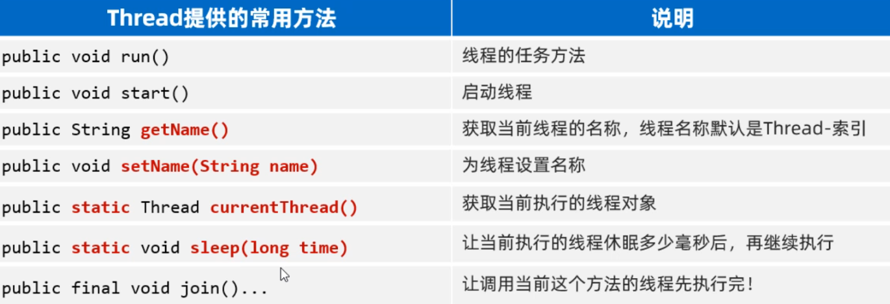


演示一下`getName()`、`setName(String name)`、`currentThread()`、`sleep(long time)`这些方法的使用效果。创建MyThread类，演示`getName()`,`currentThread()`

```java
class MyThread extends Thread{
    @Override
    public void run() {
        // 哪个线程执行下面的代码，就会得到哪个线程对象
        Thread t = Thread.currentThread();
        for (int i = 0; i < 3; i++) {
            System.out.println(t.getName()+"线程输出："+i);
        }
    }
}

public class Test {
    public static void main(String[] args) throws Exception  {
        MyThread t1 = new MyThread();
        t1.start();
        //System.out.println(t1.getName());  // Thread-0

        // 得到主线程对象
        // 哪个线程执行下面的代码，就会得到哪个线程对象
        Thread m = Thread.currentThread();
        for (int i = 0; i < 3; i++) {
            System.out.println(m.getName()+"线程输出:"+i);
        }
    }
}

```

效果如下：

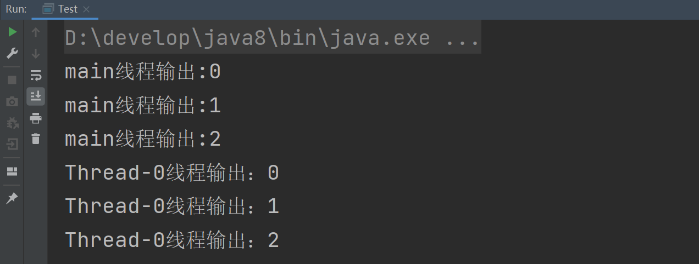


演示`setName(String name)`API的使用：

```java
class MyThread extends Thread{
    public MyThread() {
    }
    public MyThread(String name) {
        // 执行父类Thread的构建器，也可以为当前线程设置名字
        super(name);
    }
    @Override
    public void run() {
        // 哪个线程执行下面的代码，就会得到哪个线程对象
        Thread t = Thread.currentThread();
        for (int i = 0; i < 3; i++) {
            System.out.println(t.getName()+"线程输出："+i);
        }
    }
}

public class Test {
    public static void main(String[] args) throws Exception  {
        MyThread t1 = new MyThread();
        t1.setName("1号线程");
        t1.start();
        //System.out.println(t1.getName());  // Thread-0

        MyThread t2 = new MyThread("2号线程");
        t2.start();

        // 得到主线程对象
        // 哪个线程执行下面的代码，就会得到哪个线程对象
        Thread m = Thread.currentThread();
        m.setName("最牛的线程");
        for (int i = 0; i < 3; i++) {
            System.out.println(m.getName()+"线程输出:"+i);
        }
    }
}

```


执行上面代码，效果如下图所示，我们发现每一条线程都有自己了名字了：


演示`sleep(long time)`这个API，如下：

```java
public class Test {
    public static void main(String[] args) throws Exception  {
        Thread m = Thread.currentThread();
        m.setName("最牛的线程");
        for (int i = 0; i < 3; i++) {
            System.out.println(m.getName()+"线程输出:"+i);
        }

        // sleep是一个静态方法，直接通过类名调用
        // 让当前执行的线程休眠多少毫秒后，再继续执行
        Thread.sleep(3000);

        for (int i = 5; i < 10; i++) {
            System.out.println(m.getName()+"线程输出:"+i);
        }
    }
}
```


效果如下：

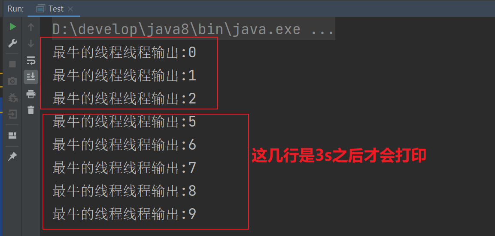


演示一下join这个方法（让调用当前这个方法的线程先执行完），如下：

```java
class MyThread extends Thread{
    public MyThread() {
    }
    public MyThread(String name) {
        // 执行父类Thread的构建器，也可以为当前线程设置名字
        super(name);
    }
    @Override
    public void run() {
        // 哪个线程执行下面的代码，就会得到哪个线程对象
        Thread t = Thread.currentThread();
        for (int i = 0; i < 3; i++) {
            System.out.println(t.getName()+"线程输出："+i);
        }
    }
}

public class Test {
    public static void main(String[] args) throws Exception  {
        // 最终执行的效果是1号线程先执行完，再执行2号线程，2号线程执行完，再执行3号线程，3号线程执行完毕后就结束了。
        MyThread t1 = new MyThread("1号线程");
        t1.start();
        // 让调用当前这个方法的线程先执行完，t1调用了join，就让t1这个线程先执行完
        t1.join();

        MyThread t2 = new MyThread("2号线程");
        t2.start();
        t2.join();

        MyThread t3 = new MyThread("3号线程");
        t3.start();
        t3.join();
    }
}

```

执行效果是1号线程先执行完，再执行2号线程；2号线程执行完，再执行3号线程；3号线程执行完就结束了。

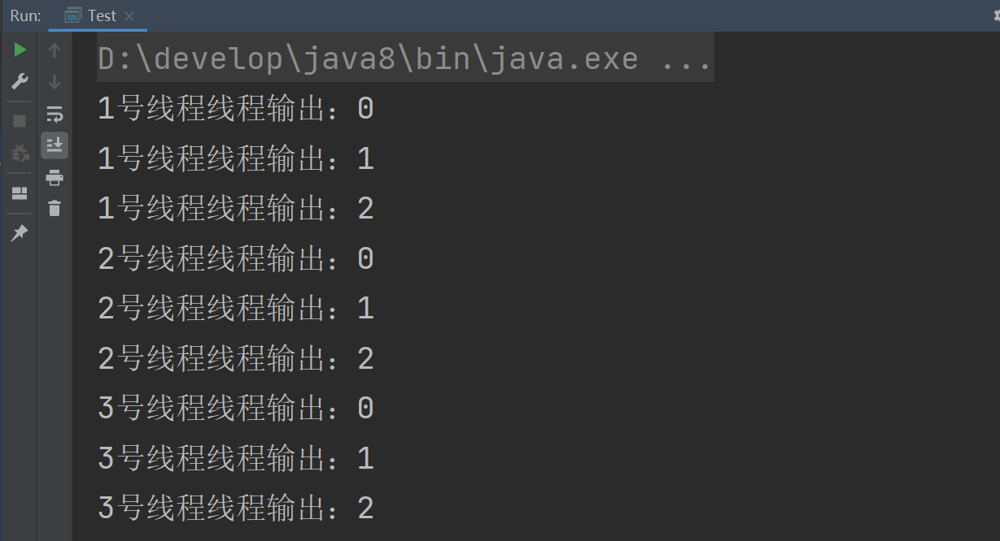


## 三，线程的安全问题

前面我们已经学习了如何创建线程，以及线程的常用方法。接下来，我们要学习一个在实际开发过程中，使用线程时最重要的一个问题，叫线程安全问题。


### 1，线程安全概述

线程安全问题指的是，多个线程同时操作同一个共享资源的时候，可能会出现业务安全问题。下面通过一个取钱的案例给同学们演示一下。案例需求如下：

- 小明和小红是一对夫妻，他们有一个共享账户，余额是10万元，小红和小明同时来取钱，并且2人各自都在取钱10万元，可能出现什么问题呢？


小明和小红假设都是一个线程，本类每个线程都应该执行完三步操作，才算是完成的取钱的操作。但是真实执行过程可能是下面这样子的：

-  小红线程只执行了判断余额是否足够（条件为true），然后CPU的执行权就被小红线程抢走了。
- 小明线程也执行了判断了余额是否足够（条件也是true）, 然后CPU执行权又被小明线程抢走了。
- 小明线程由于刚才已经判断余额是否足够了，直接执行第2步，吐出了10万元钱，此时共享账户月为0。然后CPU执行权又被小红线程抢走。 
- 小红线程由于刚刚也已经判断余额是否足够了，直接执行第2步，吐出了10万元钱，此时共享账户月为-10万。
- 结果：2人都取了10万，银行亏了10万。


这个取钱案例中，两个人把共享账户的钱都取了10万，但问题是只有10万块钱。这个取钱案例中的问题，就是线程安全问题的一种体现。


### 2，代码演示线程安全问题


定义一个共享的账户类：

```java
public class Account {
    private String cardId; // 卡号
    private double money; // 余额

    public Account() {
    }

    public Account(String cardId, double money) {
        this.cardId = cardId;
        this.money = money;
    }
    
    // 取钱的一个方法 可能是小红和小明同时过来的
    public void drawMoney(double money){
        // 得到某个线程的名字，可能是小红，也可能是小明
        String name = Thread.currentThread().getName();
        if(this.money>=money){
            System.out.println(name+"来取钱"+money+"成功！");
            this.money -= money;
            System.out.println(name+"来取钱后，余额剩余："+this.money);
        }else{
            System.out.println(name+"来取钱：余额不足");
        }
    }

    public String getCardId() {
        return cardId;
    }

    public void setCardId(String cardId) {
        this.cardId = cardId;
    }

    public double getMoney() {
        return money;
    }

    public void setMoney(double money) {
        this.money = money;
    }

    @Override
    public String toString() {
        return "Account{" +
                "cardId='" + cardId + '\'' +
                ", money=" + money +
                '}';
    }
}
```


定义一个是取钱的线程类：

```java
// 定义取线的线程类
public class DrawThread extends Thread {

    private Account acc;
    
    public DrawThread(Account acc, String name){
        super(name);
        this.acc = acc;
    }
    
    @Override
    public void run() {
        acc.drawMoney(100000);
    }
}
```


写一个测试类，在测试类中创建两个线程对象：

```java
public class Test {
    public static void main(String[] args)  {
        Account acc = new Account("ICBC-110", 100000);

        // 创建两个线程，分别代表小红和小明，它前共享一个账户
        new DrawThread(acc,"小明").start();
        new DrawThread(acc,"小红").start();
    }
}

```


运行程序，执行效果如下。你会发现两个人都取了10万块钱，余额为-10完了。如下：


### 3，线程同步方案

为了解决前面的线程安全问题，我们可以使用线程同步思想。同步最常见的方案就是加锁，意思是每次只允许一个线程加锁，加锁后才能进入访问，访问完毕后自动释放锁，然后其他线程才能再加锁进来。


等小红线程执行完了，把余额改为0，出去了就会释放锁。这时小明线程就可以加锁进来执行，如下图所示。


采用加锁的方案，就可以解决前面两个线程都取10万块钱的问题。怎么加锁呢？Java提供了三种方案：

- 同步代码块
- 同步方法
- Lock锁


### 4，同步代码块

同步代码块。它的作用就是把访问共享数据的代码锁起来，以此保证线程安全。

```java
//锁对象：必须是一个唯一的对象（同一个地址）
synchronized(锁对象){
    //...访问共享数据的代码...
}
```


使用同步代码块，来解决前面代码里面的线程安全问题。我们只需要修改DrawThread类中的代码即可。

```java
// 取钱的一个方法 可能是小红和小明同时过来的
public void drawMoney(double money){
    // 得到某个线程的名字，可能是小红，也可能是小明
    String name = Thread.currentThread().getName();

    // 同步代码块，作用就是把访问共享数据的代码锁起来，保证线程安全
    // drawMoney是一个实例方法，建议使用this作为锁对象。不要将随便无关的对象当做锁对象
    // 实例方法，建议使用this当锁。静态方法，建议把类的字节码（类名.class）当做锁对象
    synchronized (this){
        if(this.money>=money){
            System.out.println(name+"来取钱"+money+"成功！");
            this.money -= money;
            System.out.println(name+"来取钱后，余额剩余："+this.money);
        }else{
            System.out.println(name+"来取钱：余额不足");
        }
    }
}
```


测试如下：


锁对象如何选择：

- 建议把共享资源作为锁对象, 不要将随便无关的对象当做锁对象
- 对于实例方法，建议使用this作为锁对象
- 对于静态方法，建议把类的字节码(类名.class)当做锁对象


### 5，同步方法

同步方法，就是把整个方法给锁住，一个线程调用这个方法，另一个线程调用的时候就执行不了，只有等上一个线程调用结束，下一个线程调用才能继续执行。


```java
// 下面的方法就是一个同步方法，说白了，就是把整个方法锁住。
// 一个线程调用这个方法，另一个线程就调用不了。
// 只能等上一个线程调用完毕后，下一个线程才能执行。
// 同步方法，也是有锁对象的，只是不需要我们显示写出来
// 对于实例方法，锁对象是this
// 对于静态方法，锁对象是类的字节码对象  类名.class
// 对于同步代码块和同步方法相比。一个锁的范围大，一个锁的范围小。
// 同步方法是将方法中所有的代码都锁住
// 同步代码块是将方法中部分代码锁住
// 不存在哪一个好，哪一个不好
public synchronized void drawMoney(double money){
    String name = Thread.currentThread().getName();

    if(this.money>=money){
        System.out.println(name+"来取钱"+money+"成功！");
        this.money -= money;
        System.out.println(name+"来取钱后，余额剩余："+this.money);
    }else{
        System.out.println(name+"来取钱：余额不足");
    }
}
```


测试如下：


同步方法也是有锁对象，只不过这个锁对象没有显示的写出来而已。

- 对于实例方法，锁对象其实是this（也就是方法的调用者）
- 对于静态方法，锁对象时类的字节码对象（类名.class）


总结一下同步代码块和同步方法有什么区别

- 不存在哪个好与不好，只是一个锁住的范围大，一个范围小
- 同步方法是将方法中所有的代码锁住
- 同步代码块是将方法中的部分代码锁住


### 6，Lock锁

Lock锁是JDK5版本专门提供的一种锁对象，通过这个锁对象的方法来达到加锁，和释放锁的目的，使用起来更加灵活。格式如下：

```java
// 1.首先在成员变量位子，需要创建一个Lock接口的实现类对象（这个对象就是锁对象）
private final Lock lk = new ReentrantLock();
// 2.在需要上锁的地方加入下面的代码
lk.lock(); // 加锁
//...中间是被锁住的代码...
lk.unlock(); // 解锁
```


使用Lock锁改写前面DrawThread中取钱的方法，代码如下：

```java
private final Lock lk = new ReentrantLock();

public void drawMoney(double money){
    String name = Thread.currentThread().getName();
    try{
        lk.lock(); // 加锁
        if(this.money>=money){
            System.out.println(name+"来取钱"+money+"成功！");
            this.money -= money;
            // int a = 1/0
            System.out.println(name+"来取钱后，余额剩余："+this.money);
        }else{
            System.out.println(name+"来取钱：余额不足");
        }
    }catch (Exception e){
        e.printStackTrace();
    }finally {
        lk.unlock(); // 解锁
    }
}
```


执行效果：


## 四，线程通信（了解）

### 1，线程的生命周期

6种状态

- NEW: 新建状态，线程还没有启动
- RUNNABLE: 可以运行状态，线程调用了start()方法后处于这个状态
- BLOCKED: 锁阻塞状态，没有获取到锁处于这个状态BLOCKED: 锁阻塞状态，没有获取到锁处于这个状态
- WAITING: 无限等待状态，线程执行时被调用了wait方法处于这个状态
- TIMED_WAITING: 计时等待状态，线程执行时被调用了sleep(毫秒)或者wait(毫秒)方法处于这个状态
- TERMINATED: 终止状态, 线程执行完毕或者遇到异常时，处于这个状态。


画图：

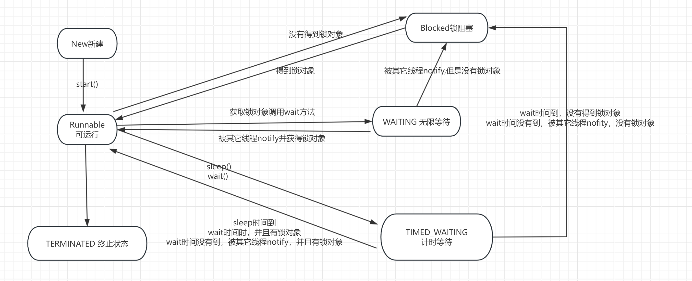


### 2，线程通信

当多个线程共同操作共享资源时，线程间通过某种方式互相告知自己的状态，以相互协调，避免无效的资源挣抢。


线程通信的常见模式：是生产者与消费者模型

- 生产者线程负责生成数据
- 消费者线程负责消费生产者生成的数据
- 生产者生产完数据后应该让自己等待，通知其他消费者消费；消费者消费完数据之后应该让自己等待，同时通知生产者生成。


案例：有3个厨师（生产者线程），两个顾客（消费者线程）。

- 3个生产者线程，负责生产包子，每个线程每次只能生产1个包子放在桌子上。
- 2个消费者线程负责吃包子，每人每次只能从桌子上拿1个包子吃


分析一下完成这个案例的思路

1. 先确定在这个案例中，什么是共享数据？

   答：这里案例中桌子是共享数据，因为厨师和顾客都需要对桌子上的包子进行操作。

2. 再确定有那几条线程？哪个是生产者，哪个是消费者？

   答：厨师是生产者线程，3条生产者线程；顾客是消费者线程，2条消费者线程

3. 什么时候将哪一个线程设置为什么状态

   生产者线程(厨师)放包子：

   - 先判断是否有包子
   - 没有包子时，厨师开始做包子, 做完之后把别人唤醒，然后让自己等待
   - 有包子时，不做包子了，直接唤醒别人、然后让自己等待

   消费者线程(顾客)吃包子：

   - 先判断是否有包子
   - 有包子时，顾客开始吃包子, 吃完之后把别人唤醒，然后让自己等待
   - 没有包子时，不吃包子了，直接唤醒别人、然后让自己等待

   

先写桌子类，代码如下：

```java
public class Desk {

    private List<String> list = new ArrayList<>();

    // 放1个包子的方法  厨师1   厨师2   厨师3
    public synchronized void put() {
       try{
           // 获取线程名
           String name = Thread.currentThread().getName();
           if(list.size() == 0){
               // 没有包子，做包子
               list.add(name+"做的肉包子");
               System.out.println(name+"做了一个肉包子~");
               Thread.sleep(2000);

               // 唤醒别人，等待自己
               this.notify();
               this.wait();
           }else{
               // 有包子，不做了

               // 唤醒别人，等待自己
               this.notify();
               this.wait();
           }
       }catch (Exception e){
           e.printStackTrace();
       }
    }

    // 吃包子  吃货1    吃货2
    public synchronized void get(){
        try{
            String name = Thread.currentThread().getName();
            if(list.size() == 1){
                // 有包子，做包子
                System.out.println(name+"吃了："+list.get(0));
                list.clear();
                Thread.sleep(1000);

                // 唤醒别人，等待自己
                this.notify();
                this.wait();
            }else{
                // 没有包子

                // 唤醒别人，等待自己
                this.notify();
                this.wait();
            }
        }catch (Exception e){
            e.printStackTrace();
        }
    }
}
```


在测试类中，创建3个厨师线程对象，再创建2个顾客对象，并启动所有线程：

```java
public class Test {
    public static void main(String[] args)  {
        Desk desk = new Desk();

        // 定义3个生产者，3个厨师
        new Thread(()->{
            while (true){
                desk.put();
            }
        },"厨师1").start();

        new Thread(()->{
            while (true){
                desk.put();
            }
        },"厨师2").start();

        new Thread(()->{
            while (true){
                desk.put();
            }
        },"厨师3").start();

        // 定义2个消费者，2个吃货
        new Thread(()->{
            while (true){
                desk.get();
            }
        },"吃货1").start();

        new Thread(()->{
            while (true){
                desk.get();
            }
        },"吃货2").start();
    }
}
```


执行上面代码，运行结果如下：你会发现多个线程相互协调执行，避免无效的资源挣抢。如下：

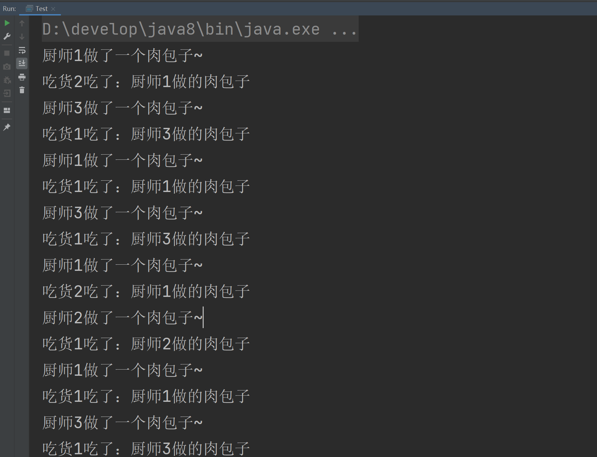


## 五，线程池


### 1，线程池概述

线程池就是一个可以复用线程的技术。要理解什么是线程复用技术，我们先得看一下不使用线程池会有什么问题，理解了这些问题之后，我们在解释线程复用同学们就好理解了。

- 假设：用户每次发起一个请求给后台，后台就创建一个新的线程来处理，下次新的任务过来肯定也会创建新的线程，如果用户量非常大，创建的线程也讲越来越多。然而，创建线程是开销很大的，并且请求过多时，会严重影响系统性能。


而使用线程池，就可以解决上面的问题。如下图所示，线程池内部会有一个容器，存储几个核心线程，假设有3个核心线程，这3个核心线程可以处理3个任务。但是任务总有被执行完的时候，假设第1个线程的任务执行完了，那么第1个线程就空闲下来了，有新的任务时，空闲下来的第1个线程可以去执行其他任务。依此内推，这3个线程可以不断的复用，也可以执行很多个任务。


### 2，创建线程池

在JDK5版本中提供了代表线程池的接口ExecutorService，而这个接口下有一个实现类叫ThreadPoolExecutor类，使用ThreadPoolExecutor类就可以用来创建线程池对象。它的构建器如下：

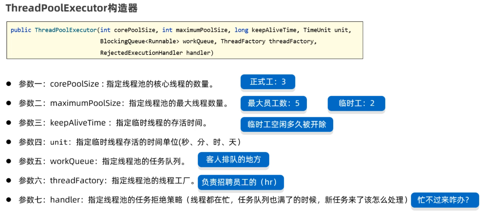

接下来，用这7个参数的构造器来创建线程池的对象。代码如下

```java
ExecutorService pool = new ThreadPoolExecutor(
    3,	//核心线程数有3个
    5,  //最大线程数有5个。   临时线程数=最大线程数-核心线程数=5-3=2
    8,	//临时线程存活的时间8秒。 意思是临时线程8秒没有任务执行，就会被销毁掉。
    TimeUnit.SECONDS,//时间单位（秒）
    new ArrayBlockingQueue<>(4), //任务阻塞队列，没有来得及执行的任务在，任务队列中等待
    Executors.defaultThreadFactory(), //用于创建线程的工厂对象
    new ThreadPoolExecutor.CallerRunsPolicy() //拒绝策略
);
```


临时线程什么时候创建？

- 新任务提交时，发现核心线程都在忙、任务队列满了、并且还可以创建临时线程，此时会创建临时线程。


什么时候开始拒绝新的任务？

- 核心线程和临时线程都在忙、任务队列也满了、新任务过来时才会开始拒绝任务。


### 3，线程池执行Runnable任务

创建好线程池之后，接下来我们就可以使用线程池执行任务了。线程池执行的任务可以有两种，一种是Runnable任务；一种是callable任务。下面的execute方法可以用来执行Runnable任务。


准备一个线程任务类：

```java
class MyRunnable implements Runnable{
    @Override
    public void run() {
        // 任务是干啥的？
        System.out.println(Thread.currentThread().getName() + " ==> 输出666~~");
        //为了模拟线程一直在执行，这里睡久一点
        try {
            Thread.sleep(Integer.MAX_VALUE);
        } catch (InterruptedException e) {
            e.printStackTrace();
        }
    }
}
```


执行Runnable任务的代码，注意阅读注释，对照着前面的7个参数理解。

```java
public class Test {
    public static void main(String[] args)  {
        ThreadPoolExecutor pool = new ThreadPoolExecutor(
                3,
                5,
                8,
                TimeUnit.SECONDS,
                new ArrayBlockingQueue<>(4),
                Executors.defaultThreadFactory(),
                new ThreadPoolExecutor.CallerRunsPolicy());

        MyRunnable target = new MyRunnable();
        pool.execute(target); // 线程池会自动创建一个新线程，自动处理这个任务，自动执行的！
        pool.execute(target); // 线程池会自动创建一个新线程，自动处理这个任务，自动执行的！
        pool.execute(target); // 线程池会自动创建一个新线程，自动处理这个任务，自动执行的！

        //下面4个任务在任务队列里排队
        pool.execute(target);
        pool.execute(target);
        pool.execute(target);
        pool.execute(target);

        //下面2个任务，会被临时线程的创建时机了
        pool.execute(target);
        pool.execute(target);

        // 到了新任务的拒绝时机了！
        pool.execute(target);
    }
}
```


代码执行测试如下：

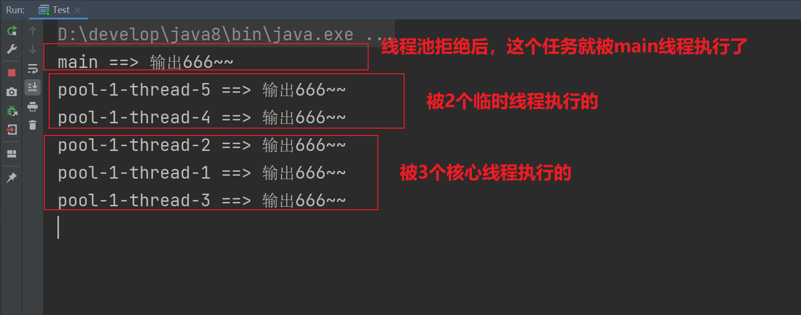


### 4，线程池执行Callable任务

使用线程池执行Callable任务。callable任务相对于Runnable任务来说，就是多了一个返回值。执行Callable任务需要用到下面的submit方法


准备一个Callable线程任务，如下：

```java
class MyCallable implements Callable<String> {
    private int n;
    public MyCallable(int n) {
        this.n = n;
    }

    // 2、重写call方法
    @Override
    public String call() throws Exception {
        // 描述线程的任务，返回线程执行返回后的结果。
        // 需求：求1-n的和返回。
        int sum = 0;
        for (int i = 1; i <= n; i++) {
            sum += i;
        }
        return Thread.currentThread().getName() + "求出了1-" + n + "的和是：" + sum;
    }
}
```


在测试类中创建线程池，并执行callable任务。

```java
public class Test {
    public static void main(String[] args) throws Exception  {
        ThreadPoolExecutor pool = new ThreadPoolExecutor(
                3,
                5,
                8,
                TimeUnit.SECONDS,
                new ArrayBlockingQueue<>(4),
                Executors.defaultThreadFactory(),
                new ThreadPoolExecutor.CallerRunsPolicy());


        Future<String> f1 = pool.submit(new MyCallable(100));
        Future<String> f2 = pool.submit(new MyCallable(200));
        Future<String> f3 = pool.submit(new MyCallable(300));
        Future<String> f4 = pool.submit(new MyCallable(400));

        System.out.println(f1.get());
        System.out.println(f2.get());
        System.out.println(f3.get());
        System.out.println(f4.get());
    }
}
```


执行后，结果如下图所示：

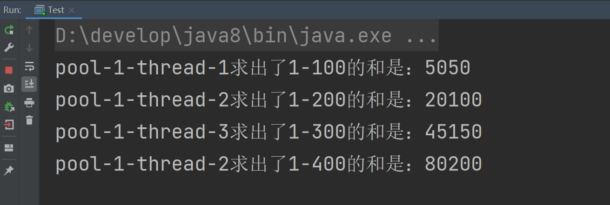


### 5，线程池工具类（Executors）

有同学可能会觉得前面创建线程池的代码参数太多、记不住，有没有快捷的创建线程池的方法呢？有的。Java为开发者提供了一个创建线程池的工具类，叫做Executors，它提供了方法可以创建各种不能特点的线程池。如下图所示


演示一下创建固定线程数量的线程池。这几个方法用得不多，所以这里不做过多演示，同学们了解一下就行了。

```java
public class Test {
    public static void main(String[] args) throws Exception  {

        // 通过Execetors创建一个线程池对象
        ExecutorService pool = Executors.newFixedThreadPool(17);


        Future<String> f1 = pool.submit(new MyCallable(100));
        Future<String> f2 = pool.submit(new MyCallable(200));
        Future<String> f3 = pool.submit(new MyCallable(300));
        Future<String> f4 = pool.submit(new MyCallable(400));

        System.out.println(f1.get());
        System.out.println(f2.get());
        System.out.println(f3.get());
        System.out.println(f4.get());
    }
}
```


效果如下：

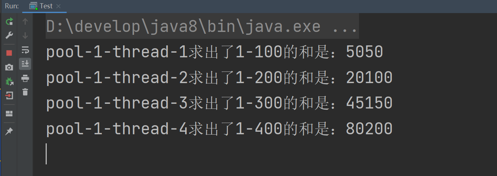


Executors创建线程池这么好用，为什么不推荐同学们使用呢？原因在这里：看下图，这是《阿里巴巴Java开发手册》提供的强制规范要求。


## 六，其它


### 1，并发和并行

什么是进程、线程？

- 正常运行的程序（软件）就是一个独立的进程
- 线程是属于进程，一个进程中包含多个线程
- 进程中的线程其实并发和并行同时存在


我们可以打开系统的任务管理器看看（快捷键：Ctrl+Shfit+Esc），自己的电脑上目前有哪些进程。


知道了什么是进程和线程之后，接着我们再来学习并发和并行的含义。


什么是并发？

- 进程中的线程由CPU负责调度执行，但是CPU同时处理线程的数量是有限的，为了保证全部线程都能执行到，CPU采用轮询机制为系统的每个线程服务，由于CPU切换的速度很快，给我们的感觉这些线程在同时执行，这就是并发。（简单记：并发就是多条线程交替执行）


什么是并行？

- 并行指的是，多个线程同时被CPU调度执行。如下图所示，多个CPU核心在执行多条线程并行指的是，多个线程同时被CPU调度执行。如下图所示，多个CPU核心在执行多条线程

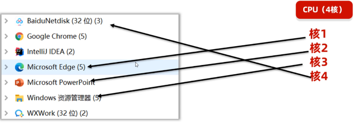


多线程到底是并发还是并行呢？

- 其实多个线程在我们的电脑上执行，并发和并行是同时存在的。


