### IDEA调试功能


调试的核心是断点。程序执行到断点时，暂时挂起，停止执行。就像看视频按下停止一样，我们可以详细的观看停止处的每一个细节。


**断点breakpoint：**程序运行到此处，暂时挂起，停止执行。我们可以详细在此时观察程序的运行情况，方便做出进一步的判断。


设置断点：在行号后面单击即可增加断点。在断点上再单击就可取消断点。

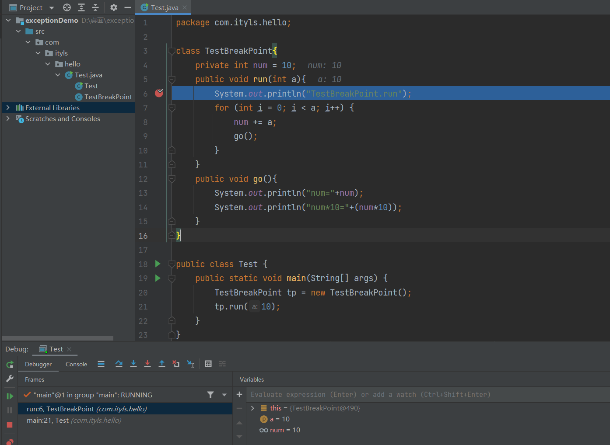


代码：

```java
package com.ityls.hello;

class TestBreakPoint{
    private int num = 10;
    public void run(int a){
        System.out.println("TestBreakPoint.run");
        for (int i = 0; i < a; i++) {
            num += a;
            go();
        }
    }
    public void go(){
        System.out.println("num="+num);
        System.out.println("num*10="+(num*10));
    }
}

public class Test {
    public static void main(String[] args) {
        TestBreakPoint tp = new TestBreakPoint();
        tp.run(10);
    }
}
```


进入调试视图后，布局如下：

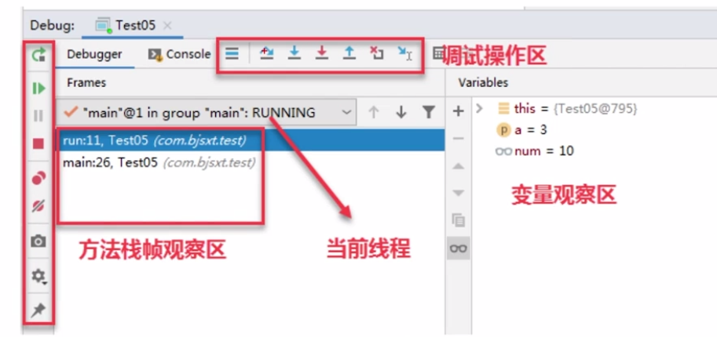


解释：

- 左侧为“浏览帧”：调试器列出断点处，当前线程正在运行的方法，每个方法对应一个“栈帧”。最上面的是当前断点所处的方法。
- 变量值观察区：调试器列出了断点处所在方法相关的变量值。我们可以通过它，查看变量的值的变化。


**调试操作区：**

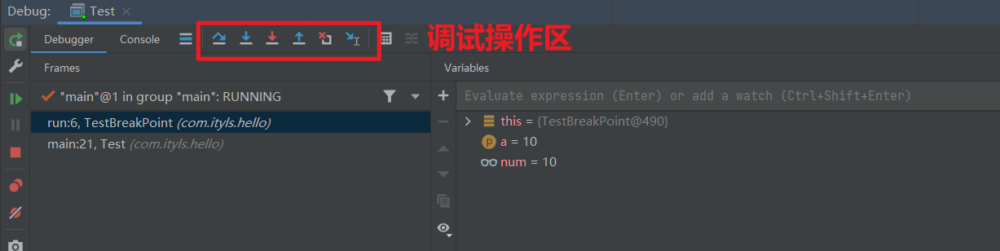


我们通过上图中的按钮进行调试操作，它们的含义如下：

- 定位断点（定位到正在执行的断点处，并且在断点所在行进行高亮展示）

  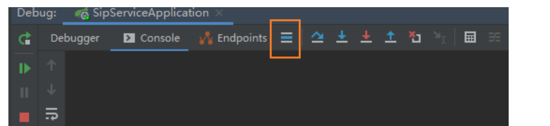

- 逐行执行（不进入方法）

  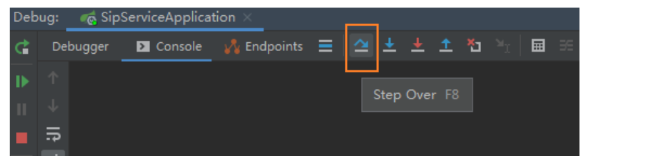

- 逐行执行（进入【自定义】方法），遇到自定义方法后进入

  

- 强步入：逐行执行（进入【所有】方法），遇到自定义方法后进入；遇到其他类库的方法也进入

  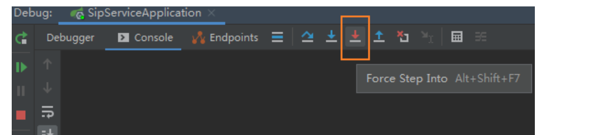

- 步出：执行并跳出当前方法（回到调用处），执行完当前方法，并跳出该方法，回到该方法调用处

  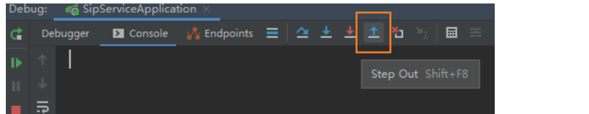

- 回退：停止执行当前方法并跳出（回到调用处），不执行完当前方法，并跳出该方法，回到该方法调用处。仅限于，当前方法还没有调用完，可以再次debug一次；但是对于数据库增删改操作无法回退

  

- 跳转至光标处执行，将debug执行位置跳转到光标位置，然后继续debug，只能往后面跳，如果光标在debug执行位置前面，就会终止debug

  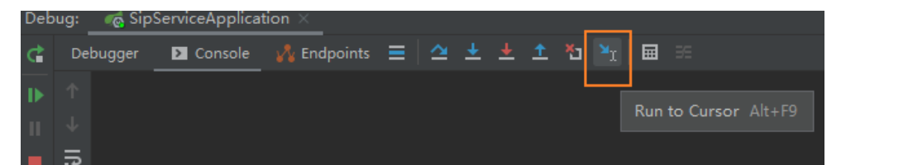

- 表达式计算，获取、计算已经debug过的参数的值，包含表达式、方法等

  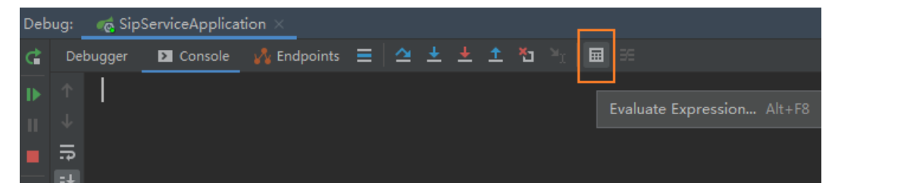

- 放行、恢复程序，或有多个断点时使用可直接跳转到下一个断点的位置

  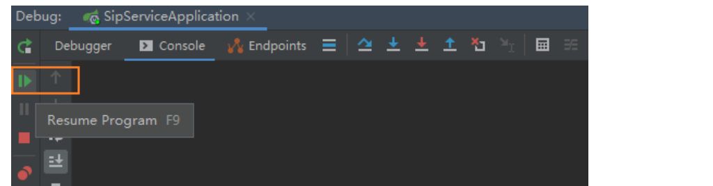

- 停止debug，停止debug，会继续执行完程序

  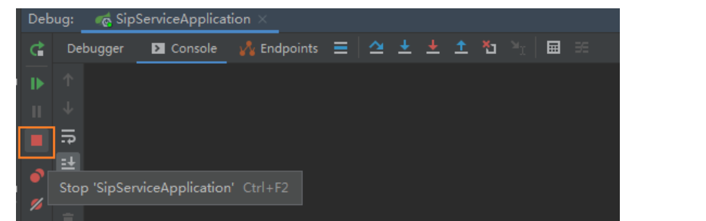

- 显示所有断点，可查看所有断点并进行相关设置操作

  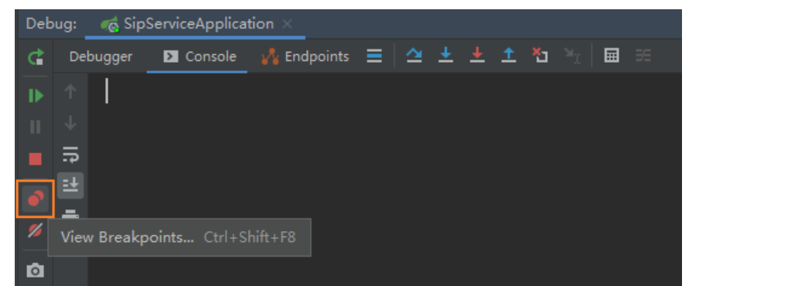

- 禁用断点，禁用所有断点，放行程序

  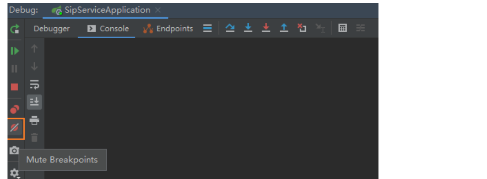


