### 1，引出异常

我们调用一个方法时，经常一部小心就出异常了，然后在控制台打印一些异常信息。其实打印的这些异常信息，就叫做异常。我们需要知道异常是如何产生的，只有你知道异常是如何产生的，才能避免出现异常。以及产生异常之后如何处理。


看如下代码：

```java
public class Test {
    public static void main(String[] args) {
        Integer a = Integer.valueOf("123");
        System.out.println(a);  // 123

        Integer b = Integer.valueOf("abc");
        System.out.println(b);
    }
}
```


测试如下：

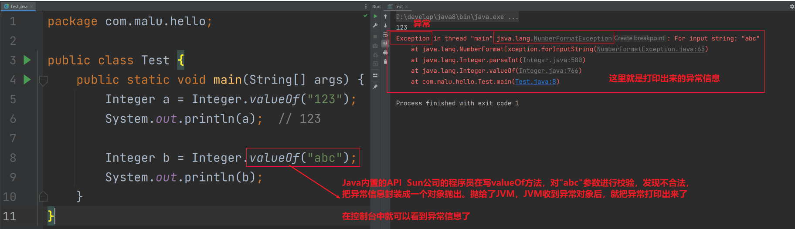


写代码时经常会出现问题，Java的设计者们早就为我们写好了很多个异常类，来描述不同场景下的问题。而有些类是有共性的所以就有了异常的继承体系，如下：


解释：

- Error：表示系统级别错误，属于严重问题。也就是说系统一旦出现问题，sun公司会把这些问题封装成Error对象给抛出来。说白了，Error是给Sun公司自己用的，不是给我们程序员用的，我们开发者不用管它。
- Exception：叫异常，它代表的才是我们程序可能出现的问题。所以，我们程序员通常会用Exception以及它的孩子封装程序出现的问题。
  - RuntimeException：运行时异常 ，编译阶段不会出现错误提醒，运行时才出现，如数组索引越界异常
  - 编译时异常：在编译阶段就会出现错误提醒的，如日期解析异常


再看一个例子：如果要拷贝文件，在没有异常机制的情况下，我们需要考虑各种异常情况，使用if处理程序中可能出现的各种情况，伪代码如下：


**这种方式，有两个坏处：**

1. 逻辑代码和错误处理代码放一起！
2. 程序员本身需要考虑的例外情况较复杂，对程序员本身要求较高！


如上情况，如果是用Java的异常机制来处理，对比如下：


**异常机制本质：**当程序出现异常，程序安全的退出、处理完后继续执行的机制


异常指程序运行过程中出现的非正常现象，例如除数为零、需要处理的文件不存在、数组下标越界等。在Java的异常处理机制中，引进了很多用来描述和处理异常的类，称为异常类。异常类定义中包含了该类异常的信息和对异常进行处理的方法。我们开始看我们的第一个异常对象，并分析一下异常机制是如何工作的。

```java
public class Test {
  public static void main(String[] args) {
    System.out.println("111");
    int a = 1/0;
    System.out.println("222");
   }
}
```

执行结果如图所示：

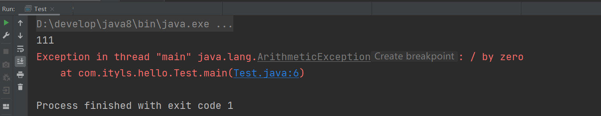

根据结果，我们可以看到执行“1/0”时发生了异常，程序终止了，没有执行后面的打印“222”的动作。如果我们使用try-catch来处理，程序遇到异常可以正常的处理，处理完成后，程序继续往下执行：

```java
public class Test {
  public static void main(String[] args) {
    System.out.println("111");
    try {
      int a = 1/0;
     } catch (Exception e) {
      e.printStackTrace();
     }
    System.out.println("222");
   }
}
```


执行结果如下：

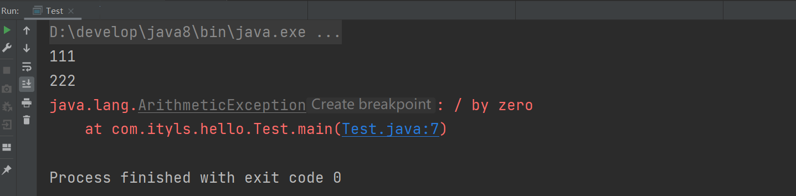


程序在执行“1/0”仍然遇到异常，然后进行try-catch处理。处理完毕后，程序继续往下执行，打印了“222”内容。


### 2，运行时异常处理

Java中定义了很多异常类，这些类对应了各种各样可能出现的异常事件，所有异常对象都是派生于`Throwable`类的一个实例。如果内置的异常类不能够满足需要，还可以创建自己的异常类。


Java对异常进行了分类，不同类型的异常分别用不同的Java类表示，所有异常的根类为`java.lang.Throwable`，`Throwable`下面又派生了两个子类：`Error`和`Exception`。Java异常类的层次结构如图所示：


**Error**

Error是程序无法处理的错误，表示运行应用程序中较严重问题。大多数错误与代码编写者执行的操作无关，而表示代码运行时 JVM（Java 虚拟机）出现的问题。例如，Java虚拟机运行错误（Virtual MachineError），当 JVM 不再有继续执行操作所需的内存资源时，将出现 OutOfMemoryError。这些异常发生时，Java虚拟机（JVM）一般会选择线程终止。Error表明系统JVM已经处于不可恢复的崩溃状态中。


**Exception**

Exception是程序本身能够处理的异常。

Exception类是所有异常类的父类，其子类对应了各种各样可能出现的异常事件。 通常Java的异常可分为：

1. RuntimeException 运行时异常
2. CheckedException 已检查异常


**Error与Exception的区别**

- 我开着车走在路上，一头猪冲在路中间，我刹车。这叫一个异常。表示系统级别的错误，是给Sun公司自己使用的，不是给程序员使用的，我们不需要管它。
- 我开着车在路上，发动机坏了，我停车，这叫错误。系统处于不可恢复的崩溃状态。发动机什么时候坏？我们普通司机能管吗？不能。发动机什么时候坏是汽车厂发动机制造商的事。


**RuntimeException运行时异常：**编译阶段不会出现错误提醒，只有把代码运行起来后，才会出现异常

派生于RuntimeException的异常，如被 0 除、数组下标越界、空指针等，其产生比较频繁，处理麻烦，如果显式的声明或捕获将会对程序可读性和运行效率影响很大。因此由系统自动检测并将它们交给缺省的异常处理程序。编译器不处理RuntimeException, 程序员需要增加“逻辑处理来避免这些异常”。


ArithmeticException异常：试图除以0

```java
public class Test {
    public static void main(String[ ] args) {
        int b=0;
        System.out.println(1/b);
    }
}
```


执行结果如图所示：

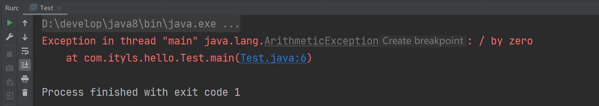


解决如上异常需要修改代码：

```java
public class Test {
    public static void main(String[ ] args) {
        int b=0;
        if(b!=0){
            System.out.println(1/b);
        }
    }
}
```


NullPointerException异常:

```java
public class Test {
    public static void main(String[ ] args) {
        String str=null;
        System.out.println(str.charAt(0));
    }
}
```

执行结果如图所示：

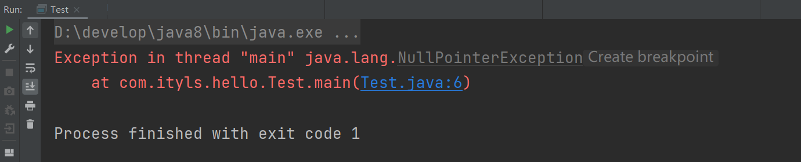


解决如上异常需要修改代码：

```java
public class Test {
    public static void main(String[ ] args) {
        String str=null;
        if(str!=null){
            System.out.println(str.charAt(0));
        }
    }
}
```


ClassCastException异常:

```java
class Animal{
    
}
class Dog extends Animal{
    
}
class Cat extends Animal{
    
}
public class Test {
    public static void main(String[ ] args) {
        Animal a=new Dog();
        Cat c=(Cat)a;
    }
}
```


执行结果如图所示：

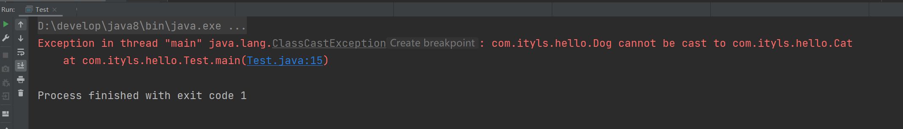


解决ClassCastException的典型方式：

```java
public class Test {
    public static void main(String[ ] args) {
        Animal a = new Dog();
        if (a instanceof Cat) {
            Cat c = (Cat) a;
        }
    }
}
```


ArrayIndexOutOfBoundsException异常

```java
public class Test {
    public static void main(String[ ] args) {
        int[ ] arr = new int[5];
        System.out.println(arr[5]);
    }
}
```


执行结果如图所示：

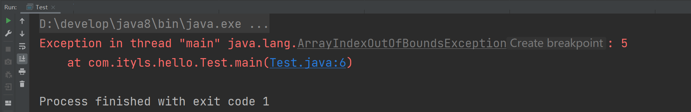


解决数组索引越界异常的方式，增加关于边界的判断：

```java
public class Test {
    public static void main(String[ ] args) {
        int[ ] arr = new int[5];
        int a = 5;
        if (a < arr.length) {
            System.out.println(arr[a]);
        }
    }
}
```


NumberFormatException异常

```java
public class Test {
    public static void main(String[ ] args) {
        String str = "1234abcf";
        System.out.println(Integer.parseInt(str));
    }
}
```


执行结果如图所示：

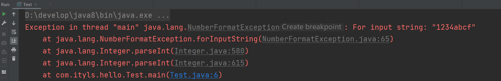


数字格式化异常的解决，可以引入正则表达式判断是否为数字：

```java
import java.util.regex.Matcher;
import java.util.regex.Pattern;

public class Test {
    public static void main(String[ ] args) {
        String str = "1234abcf";
        Pattern p = Pattern.compile("^\\d+$");
        Matcher m = p.matcher(str);
        if (m.matches()) { // 如果str匹配代表数字的正则表达式,才会转换
            System.out.println(Integer.parseInt(str));
        }
    }
}
```

```java
public class Test {
    public static void main(String[] args) {
        String str = "1234abcf";
        if(str.matches("^\\d+$")){
            System.out.println(Integer.valueOf(str));
        }
    }
}
```


### 3，已检查异常

`CheckedException`异常在编译时就必须处理，否则无法通过编译。如图所示。

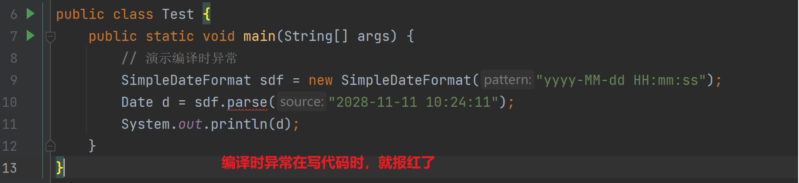


鼠标摸一下：

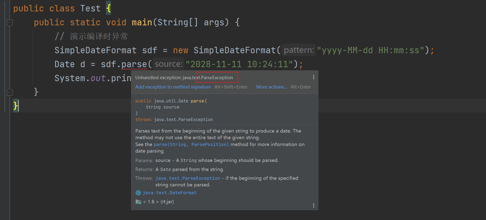


编译时异常的目的：意思就是告诉你，你小子注意了！！，这里小心点容易出错，仔细检查一下。有人说，我检查过了，我确认我的代码没问题，为了让它不报错，继续将代码写下去。我们这里有两种解决方案。


`CheckedException`异常的处理方式有两种：

1. 使用`try/catch`捕获异常。使用try...catch语句块异常进行处理。

   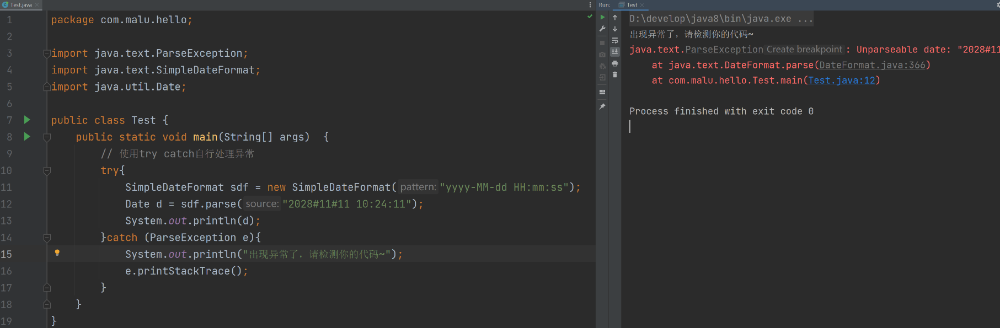

2. 使用`throws`声明异常。使用throws在方法上声明，意思就是告诉下一个调用者，这里面可能有异常啊，你调用时注意一下。

   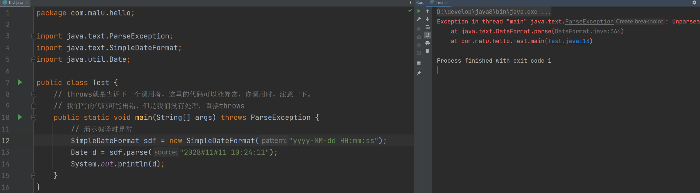


### 4，异常的处理方式之一：捕获异常

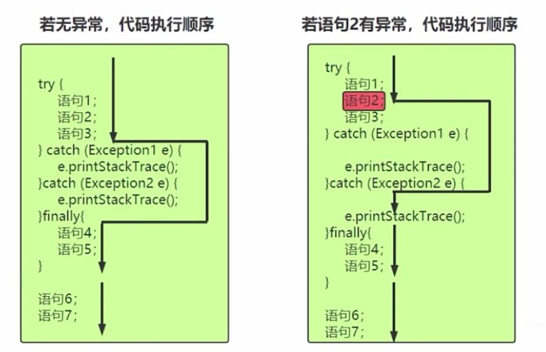


**try：**

`try`语句指定了一段代码，该段代码就是异常捕获并处理的范围。在执行过程中，当任意一条语句产生异常时，就会跳过该条语句中后面的代码。代码中可能会产生并抛出一种或几种类型的异常对象，它后面的`catch`语句要分别对这些异常做相应的处理。一个try语句必须带有至少一个`catch`语句块或一个`finally`语句块。

注意：当异常处理的代码执行结束以后，不会回到`try`语句去执行尚未执行的代码。

**catch：**

1. 每个`try`语句块可以伴随一个或多个`catch`语句，用于处理可能产生的不同类型的异常对象。

2. `catch`捕获异常时的捕获顺序：

   如果异常类之间有继承关系，先捕获子类异常再捕获父类异常。

**finally：**

1. 不管是否发生了异常，都必须要执行。
2. 通常在`finally`中关闭已打开的资源，比如：关闭文件流、释放数据库连接等。


**try-catch-finally语句块的执行过程详细分析：**

1. 程序首先执行可能发生异常的`try`语句块。
2. 如果`try`语句没有出现异常则执行完后跳至`finally`语句块执行；
3. 如果`try`语句出现异常，则中断执行并根据发生的异常类型跳至相应的`catch`语句块执行处理。
4. `catch`语句块可以有多个，分别捕获不同类型的异常。
5. `catch`语句块执行完后程序会继续执行`finally`语句块。
6. `finally`语句是可选的，如果有的话，则不管是否发生异常，`finally`语句都会被执行。


异常处理的典型代码(捕获异常)

```java
import java.io.FileNotFoundException;
import java.io.FileReader;
import java.io.IOException;
public class Test {
    public static void main(String[ ] args) {
        FileReader reader = null;
        try {
            reader = new FileReader("d:/a.txt");
            char c = (char) reader.read();
            char c2 = (char) reader.read();
            System.out.println("" + c + c2);
        } catch (FileNotFoundException e) {
            e.printStackTrace();
        } catch (IOException e) {
            e.printStackTrace();
        } finally {
            try {
                if (reader != null) {
                    reader.close();
                }
            } catch (Exception e) {
                e.printStackTrace();
            }
        }
    }
}
```


**常用开发环境中，自动增加try-catch代码块的快捷键：**

1. 将需要处理异常的代码选中。
2. IDEA中，使用：ctrl+alt+t
3. eclipse中，使用：ctrl+shift+z


### 5，异常的处理方式之二：声明异常

1. CheckedException产生时，不一定立刻处理它，可以把异常throws，由调用者处理。
2. 一个方法抛出多个已检查异常，就必须在方法的首部列出所有的异常。


异常处理的典型代码（声明异常抛出throws）

```java
package com.bjsxt;


import java.io.FileNotFoundException;
import java.io.FileReader;
import java.io.IOException;


public class Test9 {
  public static void main(String[ ] args) {
    try {
      readFile("joke.txt");
     } catch (FileNotFoundException e) {
      System.out.println("所需文件不存在！");
     } catch (IOException e) {
      System.out.println("文件读写错误！");
     }
   }
  public static void readFile(String fileName) throws FileNotFoundException,
      IOException {
    FileReader in = new FileReader(fileName);
    int tem = 0;
    try {
      tem = in.read();
      while (tem != -1) {
        System.out.print((char) tem);
        tem = in.read();
       }
     } finally {
      if(in!=null) {
        in.close();
       }
     }
   }
}
```


方法重写中声明异常原则：子类重写父类方法时，如果父类方法有声明异常，那么子类声明的异常范围不能超过父类声明的范围。


### 6，try-with-resource


JAVA中，JVM的垃圾回收机制可以对内部资源实现自动回收，给开发者带来了极大的便利。但是JVM对外部资源(调用了底层操作系统的资源)的引用却无法自动回收，例如数据库连接，网络连接以及输入输出IO流等。这些连接就需要我们手动去关闭，不然会导致外部资源泄露，连接池溢出以及文件被异常占用等。


JDK7之后，新增了“try-with-resource”。它可以自动关闭实现了`AutoClosable`接口的类，实现类需要实现`close()`方法。”try-with-resources “ 将`try-catch-finally` 简化为`try-catch`，这其实是一种语法糖，在编译时仍然会进行转化为`try-catch-finally` 语句。


```java
package com.ityls.hello;

import java.io.FileReader;
public class Test {
  public static void main(String[ ] args) {
    try(FileReader reader = new FileReader("d:/a.txt");) {
      char c = (char) reader.read();
      char c2 = (char) reader.read();
      System.out.println("" + c + c2);
     } catch (Exception e) {
      e.printStackTrace();
     }
   }
}
```


### 8，自定义异常


我们无法为这个世界上的全部问题都提供异常类，如果企业自己的某种问题，想通过异常来表示，那就需要自己来定义异常类了。通过一个实际场景，来给大家演示自定义异常。需求：

- 写一个saveAge(int age)方法，在方法中对参数age进行判断，如果age<0或者>=150就认为年龄不合法，如果年龄不合法，就给调用者抛出一个年龄非法异常。（Java的API中是没有年龄非常这个异常的，所以我们可以自定义一个异常类，用来表示年龄非法异常，然后再方法中抛出自定义异常即可。）


关于自定义异常：

- 在程序中，可能会遇到JDK提供的任何标准异常类都无法充分描述清楚我们想要表达的问题，这种情况下可以创建自己的异常类，即自定义异常类。
- 自定义异常类只需从Exception类或者它的子类派生一个子类即可。
- 自定义异常类如果继承Exception类，则为CheckedException异常，必须对其进行处理；如果不想处理，可以让自定义异常类继承运行时异常RuntimeException类。
- 习惯上，自定义异常类应该包含2个构造器：一个是默认的构造器，另一个是带有详细信息的构造器。


先写一个异常类AgeIllegalException，必须让这个类继承自Exception，才能成为一个编译时异常类。如下：

```java
// 自定义一个异常类
// 让AgeIllegalException 继承 Exception 才能成为一个编译时异常类
class AgeIllegalException extends Exception{
    public AgeIllegalException(){}
    public AgeIllegalException(String message){
        super(message);
    }
}
```


在测试类中定义一个saveAge(int age)方法，对age判断如果年龄不在0~150之间，就抛出一个AgeIllegalException异常对象给调用者。

```java
public class Test {
    //public static void main(String[] args) throws  AgeIllegalException {
    public static void main(String[] args){
        // Java设计者在设计了很多的Java异常类，不能满足世界上所有的问题。
        // 如果我们代码中有属于我们业务自己的问题，可以使用自定义异常
        //   setAge()  setAge(20)   setAge(200)   setAge(-200)
        // Java中，没有关于年龄非法的异常。此时就可以自定义一个异常类。

        // 调用setAge方法，此时报红了，有编译时异常
        // 处理办法有两种：1）throws  2）try catch
        try{
            setAge(1000);
        }catch (AgeIllegalException e){
            e.printStackTrace();
            System.out.println("setAge时，年龄设置不合法~");
        }
    }

    // 在方法中，抛出一个编译时异常，必须在方法上使用throws声明，强调调用者处理
    public static void setAge(int age) throws AgeIllegalException{
        if(age>0 && age<150){
            System.out.println("年龄被成功保存了："+age);
        }else{
            // throw 表示抛出异常对象  抛出去了一个编译时异常
            throw new AgeIllegalException("年龄非法，你输入的age是："+age);
        }
    }
}
```


执行结果如图所示：

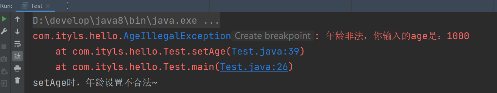


**使用异常机制的建议**

- 要避免使用异常处理代替错误处理，这样会降低程序的清晰性，并且效率低下。
- 处理异常不可以代替简单测试---只在异常情况下使用异常机制。
- 不要进行小粒度的异常处理---应该将整个任务包装在一个try语句块中。
- 异常往往在高层处理(先了解！后面做项目会说！) 。


