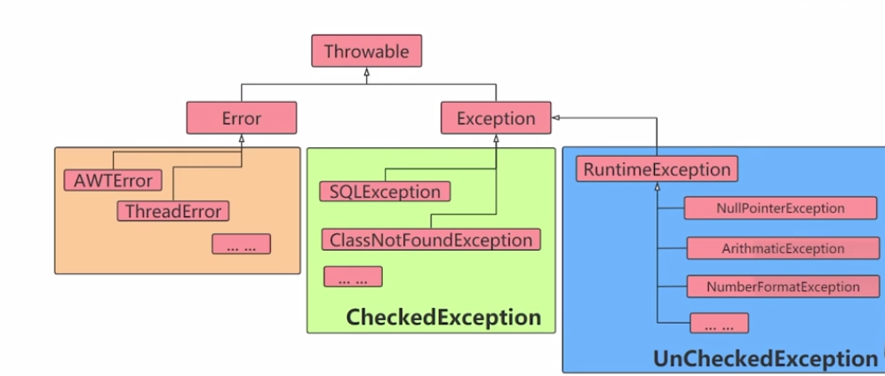
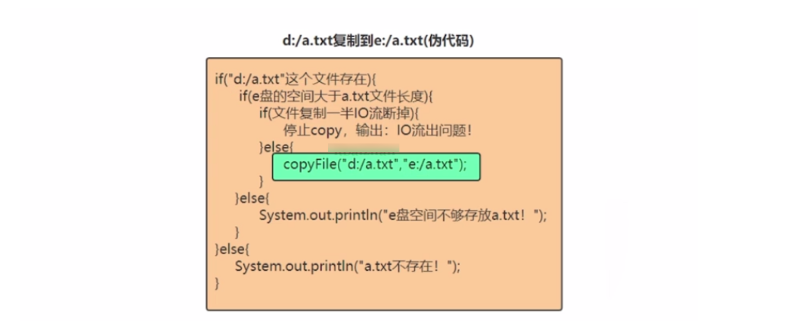
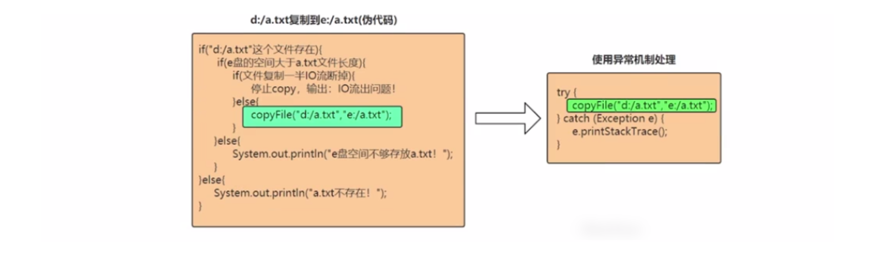
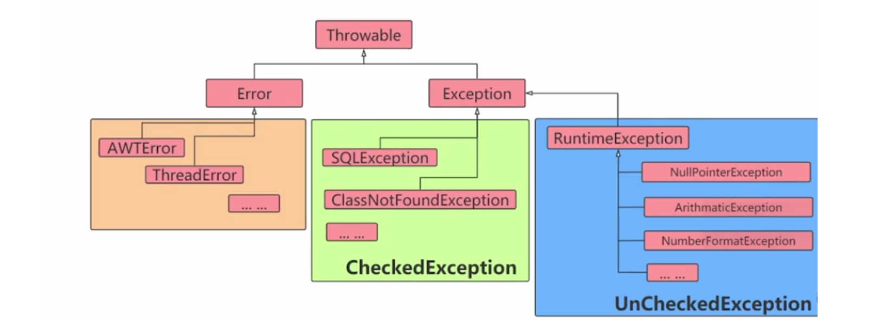
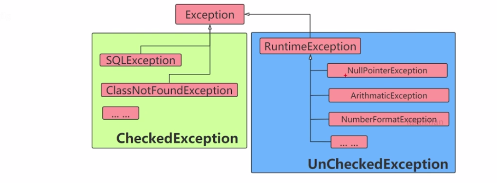

### 1，引出异常



工作中，程序遇到的情况不可能完美。比如：程序要打开某个文件，这个文件可能不存在或者文件格式不对；程序在运行着，但是内存或硬盘可能满了等等。


软件程序在运行过程中，非常可能遇到刚刚提到的这些问题，我们称之为异常，英文是：Exception，意思是例外。遇到这些例外情况，或者叫异常，我们怎么让写的程序做出合理的处理，安全的退出，而不至于程序崩溃呢？我们本章就要讲解这些问题。


如果要拷贝文件，在没有异常机制的情况下，我们需要考虑各种异常情况，使用if处理程序中可能出现的各种情况，伪代码如下：




**这种方式，有两个坏处：**

1. 逻辑代码和错误处理代码放一起！
2. 程序员本身需要考虑的例外情况较复杂，对程序员本身要求较高！


如上情况，如果是用Java的异常机制来处理，对比如下：



**异常机制本质：**当程序出现异常，程序安全的退出、处理完后继续执行的机制


**异常（Exception）的概念**

异常指程序运行过程中出现的非正常现象，例如除数为零、需要处理的文件不存在、数组下标越界等。在Java的异常处理机制中，引进了很多用来描述和处理异常的类，称为异常类。异常类定义中包含了该类异常的信息和对异常进行处理的方法。我们开始看我们的第一个异常对象，并分析一下异常机制是如何工作的。

```java
public class Test {
  public static void main(String[] args) {
    System.out.println("111");
    int a = 1/0;
    System.out.println("222");
   }
}
```

执行结果如图所示：


根据结果，我们可以看到执行“1/0”时发生了异常，程序终止了，没有执行后面的打印“222”的动作。如果我们使用try-catch来处理，程序遇到异常可以正常的处理，处理完成后，程序继续往下执行：

```java
public class Test {
  public static void main(String[] args) {
    System.out.println("111");
    try {
      int a = 1/0;
     } catch (Exception e) {
      e.printStackTrace();
     }
    System.out.println("222");
   }
}
```


执行结果如下：


程序在执行“1/0”仍然遇到异常，然后进行try-catch处理。处理完毕后，程序继续往下执行，打印了“222”内容。


**Java是采用面向对象的方式来处理异常的。处理过程：**

- **抛出异常：**在执行一个方法时，如果发生异常，则这个方法生成**代表该异常的一个对象**，停止当前执行路径，并把异常对象提交给JRE。
- **捕获异常：**JRE得到该异常后，寻找相应的代码来处理该异常。JRE在方法的调用栈中查找，从生成异常的方法开始回溯，直到找到相应的异常处理代码为止。


### 2，运行时异常处理

Java中定义了很多异常类，这些类对应了各种各样可能出现的异常事件，所有异常对象都是派生于`Throwable`类的一个实例。如果内置的异常类不能够满足需要，还可以创建自己的异常类。

Java对异常进行了分类，不同类型的异常分别用不同的Java类表示，所有异常的根类为`java.lang.Throwable`，`Throwable`下面又派生了两个子类：`Error`和`Exception`。Java异常类的层次结构如图所示：



**Error**

Error是程序无法处理的错误，表示运行应用程序中较严重问题。大多数错误与代码编写者执行的操作无关，而表示代码运行时 JVM（Java 虚拟机）出现的问题。例如，Java虚拟机运行错误（Virtual MachineError），当 JVM 不再有继续执行操作所需的内存资源时，将出现 OutOfMemoryError。这些异常发生时，Java虚拟机（JVM）一般会选择线程终止。Error表明系统JVM已经处于不可恢复的崩溃状态中。


**Exception**

Exception是程序本身能够处理的异常。

Exception类是所有异常类的父类，其子类对应了各种各样可能出现的异常事件。 通常Java的异常可分为：

1. RuntimeException 运行时异常
2. CheckedException 已检查异常




**Error与Exception的区别**

- 我开着车走在路上，一头猪冲在路中间，我刹车。这叫一个异常。
- 我开着车在路上，发动机坏了，我停车，这叫错误。系统处于不可恢复的崩溃状态。发动机什么时候坏？我们普通司机能管吗？不能。发动机什么时候坏是汽车厂发动机制造商的事。


**RuntimeException运行时异常**

派生于RuntimeException的异常，如被 0 除、数组下标越界、空指针等，其产生比较频繁，处理麻烦，如果显式的声明或捕获将会对程序可读性和运行效率影响很大。因此由系统自动检测并将它们交给缺省的异常处理程序。编译器不处理RuntimeException, 程序员需要增加“逻辑处理来避免这些异常”。ArithmeticException异常：试图除以0

```java
public class Test3 {
    public static void main(String[ ] args) {
        int b=0;
        System.out.println(1/b);
    }
}
```


执行结果如图所示：


**解决如上异常需要修改代码：**

```java
public class Test3 {
    public static void main(String[ ] args) {
        int b=0;
        if(b!=0){
            System.out.println(1/b);
        }
    }
}
```


NullPointerException异常:

```java
public class Test4 {
    public static void main(String[ ] args) {
        String str=null;
        System.out.println(str.charAt(0));
    }
}
```

执行结果如图所示：


**解决如上异常需要修改代码：**

```java
public class Test3 {
    public static void main(String[ ] args) {
        int b=0;
        if(b!=0){
            System.out.println(1/b);
        }
    }
}
```


NullPointerException异常:

```java
public class Test4 {
    public static void main(String[ ] args) {
        String str=null;
        System.out.println(str.charAt(0));
    }
}
```


执行结果如图所示：


解决空指针异常，通常是增加非空判断：

```java
public class Test4 {
    public static void main(String[ ] args) {
        String str=null;
        if(str!=null){
            System.out.println(str.charAt(0));
        }
    }
}
```


ClassCastException异常:

```java
class Animal{
    
}
class Dog extends Animal{
    
}
class Cat extends Animal{
    
}
public class Test5 {
    public static void main(String[ ] args) {
        Animal a=new Dog();
        Cat c=(Cat)a;
    }
}
```


执行结果如图所示：


解决ClassCastException的典型方式：

```java
public class Test5 {
    public static void main(String[ ] args) {
        Animal a = new Dog();
        if (a instanceof Cat) {
            Cat c = (Cat) a;
        }
    }
}
```


ArrayIndexOutOfBoundsException异常

```java
public class Test6 {
    public static void main(String[ ] args) {
        int[ ] arr = new int[5];
        System.out.println(arr[5]);
    }
}
```


执行结果如图所示：


解决数组索引越界异常的方式，增加关于边界的判断：

```java
public class Test6 {
    public static void main(String[ ] args) {
        int[ ] arr = new int[5];
        int a = 5;
        if (a < arr.length) {
            System.out.println(arr[a]);
        }
    }
}
```


NumberFormatException异常

```java
public class Test7 {
    public static void main(String[ ] args) {
        String str = "1234abcf";
        System.out.println(Integer.parseInt(str));
    }
}
```


执行结果如图所示：


数字格式化异常的解决，可以引入正则表达式判断是否为数字：

```java
import java.util.regex.Matcher;
import java.util.regex.Pattern;


public class Test7 {
    public static void main(String[ ] args) {
        String str = "1234abcf";
        Pattern p = Pattern.compile("^\\d+$");
        Matcher m = p.matcher(str);
        if (m.matches()) { // 如果str匹配代表数字的正则表达式,才会转换
            System.out.println(Integer.parseInt(str));
        }
    }
}
```


### 3，已检查异常


