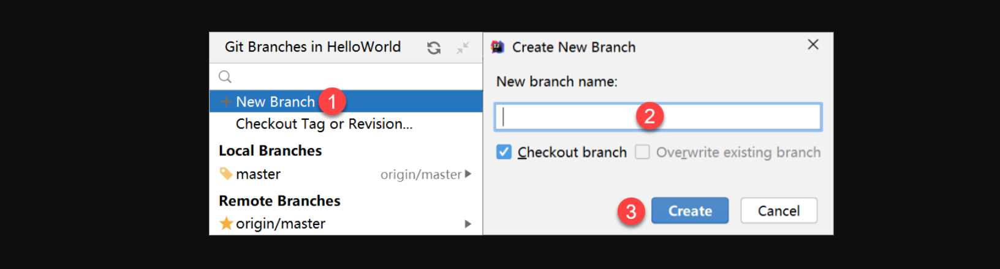

### 1, 在IDEA使用Git_配置Git环境

安装好IntelliJ IDEA后，如果Git安装在默认路径下，那么idea会自动找到git的位置，如果更改了Git的安装位置则需要手动配置下Git的路径。 选择File→Settings打开设置窗口，找到Version Control下的git选项:


配置git


将工程添加至Git


### 2, 在IDEA使用Git_Git基本操作

忽略列文件:


安装ignore插件并重启:


新建.gitignore文件:


添加忽略项:

```
# Created by .ignore support plugin (hsz.mobi)
.gitignore
.idea/*
HelloWorld.iml
target
```


将文件加入暂存区:


提交文件:


编写提交信息:


推送至远程仓:


填写远程仓库url地址：


提交到远程仓库：


从远程仓克隆：


从远程仓库拉取：


版本对比：


### 3, 在IDEA使用Git_Git分支操作

创建分支：


创建并切换：




切换分支：


分支合并：


### 4, 在IDEA使用Git_解决冲突


制造冲突：


出现冲突：


手动解决冲突：


手动修改最终版本


最后提交代码：


