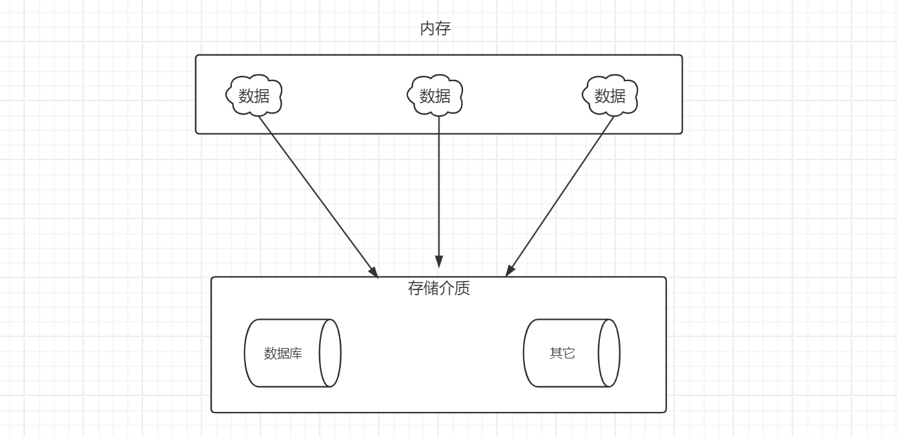
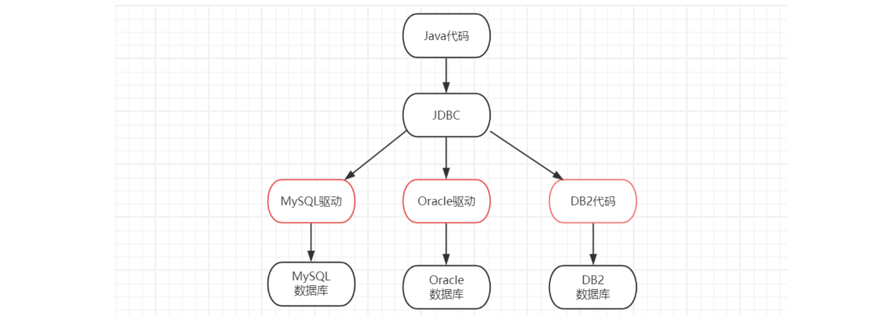
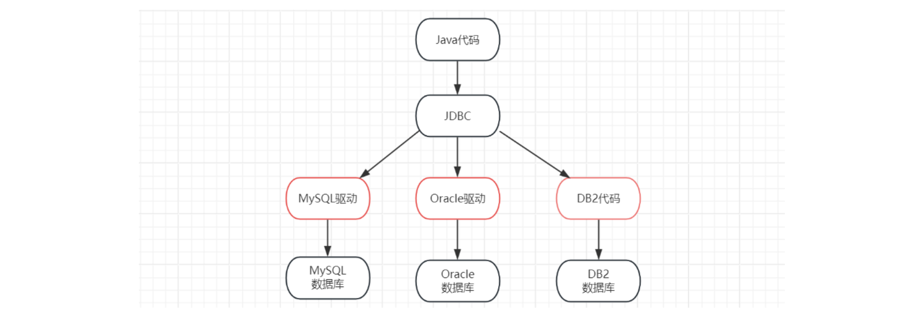
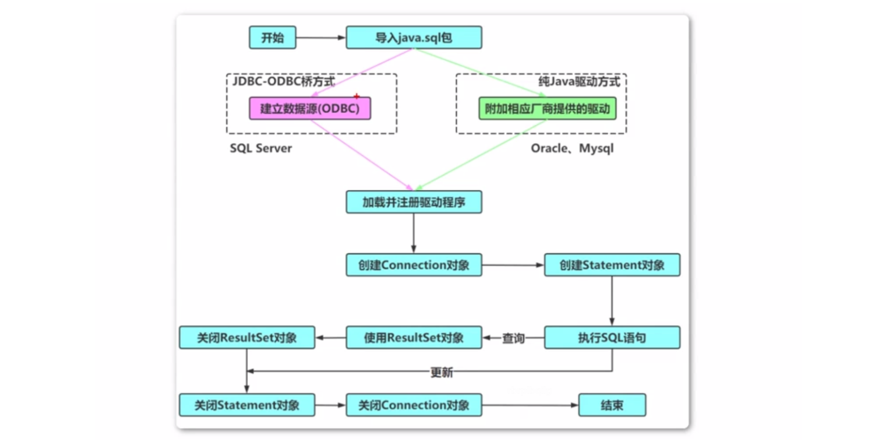

### 1, JDBC概述


**数据的持久化**

- 持久化(persistence)：将内存中的数据保存到可永久保存的存储设备中（如磁盘）。
- 持久化的主要应用是将内存中的数据存储在关系型数据库中，当然也可以存储在磁盘文件、XML数据文件中。




**数据库切换所面临的问题：**

​	同一套Java代码是无法操作不同的关系型数据库，因为每一个关系型数据库的底层实现细节都不一样。如果这样，问题就很大了，在公司中可以在开发阶段使用的是MySQL数据库，而上线时公司最终选用oracle数据库，我们就需要对代码进行大批量修改，这显然并不是我们想看到的。我们要做到的是同一套Java代码操作不同的关系型数据库，而此时sun公司就指定了一套标准接口（JDBC），JDBC中定义了所有操作关系型数据库的规则。众所周知接口是无法直接使用的，我们需要使用接口的实现类，而这套实现类（称之为：驱动）就由各自的数据库厂商给出。


**什么是JDBC**

- 官方（sun公司）定义的一套操作所有关系型数据库的规则，即接口
- 各个数据库厂商去实现这套接口，提供数据库驱动jar包
- 可以使用这套接口（JDBC）编程，真正执行的代码是驱动jar包中的实现类


**什么是数据库驱动程序**



- 数据库驱动就是直接操作数据库的一个程序
- 不同数据产品的数据库驱动名字有差异
- 在程序中需要依赖数据库驱动来完成对数据库的操作


**Java中访问数据库技术**

- 基于JDBC标准访问数据库
- 使用第三方ORM 框架，如Hibernate, Mybatis 等访问数据库


**程序操作数据库流程**

- 如果没有JDBC，那么Java程序访问数据库时是这样的：


有了JDBC，Java程序访问数据库时是这样的：




### 2, JDBC中常用的类与接口

1. **Driver** **接口**

   Driver 接口的作用是来定义数据库驱动对象应该具备的一些能力。比如与数据库建立连接的方法的定义，该接口是提供给数据库厂商使用的，所有支持 java 语言连接的数据库都实现了该接口，实现该接口的类我们称之为数据库驱动类。

2. **DriverManager** **类**

   DriverManager是驱动程序管理器，是负责管理数据库驱动程序的。驱动注册以后，会保存在DriverManager中的已注册列表中。 DriverManager 通过实例化的数据库驱动对象，能够建立应用程序与数据库之间建立连 接。并返回 Connection 接口类型的数据库连接对象。

   - getConnection(String jdbcUrl, String user, String password)

     该方法通过访问数据库的 url、用户以及密码，返回对应的数据库的 Connection 对象。

   - JDBC URL

     与数据库连接时，用来连接到指定数据库标识符。在 URL 中包括了该数据库的类型、 地址、端口、库名称等信息。不同品牌数据库的连接 URL 不同。

     - 连接 MySql 数据库：

       ```java
       Connection conn = DriverManager.getConnection("jdbc:mysql://host:port/database", "user", "password");
       ```

     - 连接 Oracle 数据库：

       ```java
       Connection conn = DriverManager.getConnection("jdbc:oracle:thin:@host:port:database", "user", "password");
       ```

3. **Connection** **接口**

   Connection 是数据库的连接（会话）对象。对数据库的一切操作都是在这个连接基础之上进行的，我们可以通过该对象执行 sql 语句并返回结果。

   **常用方法**

   - createStatement()

     创建向数据库发送 sql 的 Statement 接口类型的对象。

   - preparedStatement(sql)

     创建向数据库发送预编译 sql 的 PrepareSatement 接口类型的对象。

   - setAutoCommit(boolean autoCommit)

     设置事务是否自动提交。

   - commit()

     在链接上提交事务。

   - rollback()

     在此链接上回滚事务。

4. **Statement** **接口**

   用于执行静态 SQL 语句并返回它所生成结果的对象。 由 createStatement 创建，用于发送简单的 SQL 语句（不支持动态绑定）。

   **常用方法**

   - execute(String sql)

     执行参数中的 SQL，返回是否有结果集。

   - executeQuery(String sql)

     运行 select 语句，返回 ResultSet 结果集。

   - executeUpdate(String sql)

     运行 insert/update/delete 操作，返回更新的行数。

   - addBatch(String sql)

     把多条 sql 语句放到一个批处理中。

   - executeBatch()

     向数据库发送一批 sql 语句执行。

5. **PreparedStatement接口**

   继承自 Statement 接口，由 preparedStatement 创建，用于发送含有一个或多个参数的 SQL 语句。PreparedStatement 对象比 Statement 对象的效率更高，由于实现了动态的参数绑定，所以可以防止 SQL 注入，所以我们一般都使用 PreparedStatement。

   **常用方法**

   - addBatch()

     把当前 sql 语句加入到一个批处理中。

   - execute()

     执行当前 SQL，返回个 boolean 值

   - executeUpdate()

     运行 insert/update/delete 操作，返回更新的行数。

   - executeQuery()

     执行当前的查询，返回一个结果集对象

   - setDate(int parameterIndex, Date x)

     向当前SQL语句中的指定位置绑定一个java.sql.Date值

   - setDouble(int parameterIndex, double x)

     向当前 SQL 语句中的指定位置绑定一个 double值

   - setFloat(int parameterIndex, float x)

     向当前 SQL 语句中的指定位置绑定一个 float 值

   - setInt(int parameterIndex, int x)

     向当前 SQL 语句中的指定位置绑定一个 int 值

   - setString(int parameterIndex, String x)

     向当前 SQL 语句中的指定位置绑定一个 String 值

6. **ResultSet** **接口**

   ResultSet 用来暂时存放数据库查询操作获得结果集。

   **常用方法**

   - getString(int index)、getString(String columnName)

     获得在数据库里是 varchar、char 等类型的数据对象。

   - getFloat(int index)、getFloat(String columnName)

     获得在数据库里是 Float 类型的数据对象。

   - getDate(int index)、getDate(String columnName)

     获得在数据库里是 Date 类型的数据。

   - getBoolean(int index)、getBoolean(String columnName)

     获得在数据库里是 Boolean 类型的数据。

   - getObject(int index)、getObject(String columnName)

     获取在数据库里任意类型的数据。

### 3, JDBC的编写步骤




ODBC(**Open Database Connectivity**，开放式数据库连接)，是微软在Windows平台下推出的。使用者在程序中只需要调用ODBC API，由 ODBC 驱动程序将调用转换成为对特定的数据库的调用请求。


### 4, JDBC快速入门


**环境：**

- 数据库Mysql5.7

- 数据库驱动版本5.1.48

- 数据库名db1


**准备工作：**

- 新建JavaProject工程

- 添加数据库驱动jar包

- 获取数据库连接对象


**下载数据库驱动:**https://downloads.mysql.com/archives/c-j/


代码：

```java
package com.ityls;

import java.sql.Connection;
import java.sql.DriverManager;
import java.sql.Statement;

public class JDBCDemo {
    public static void main(String[] args) throws Exception {
        // 1, 注册驱动
        Class.forName("com.mysql.jdbc.Driver");

        // 2, 获取连接对象
        String url = "jdbc:mysql://127.0.0.1:3306/db1";
        String username = "root";
        String password = "root";
        Connection conn = DriverManager.getConnection(url, username, password);

        // 3，定义SQL语句
        String sql = "update account set money = 2000 where id = 1";

        // 4, 创建Statement对象
        Statement stmt = conn.createStatement();

        // 5, 执行sql语句
        int count = stmt.executeUpdate(sql);  // 返回的是受影响的函数

        System.out.println(count);

        // 6, 释放资源
        stmt.close();
        conn.close();
    }
}
```


