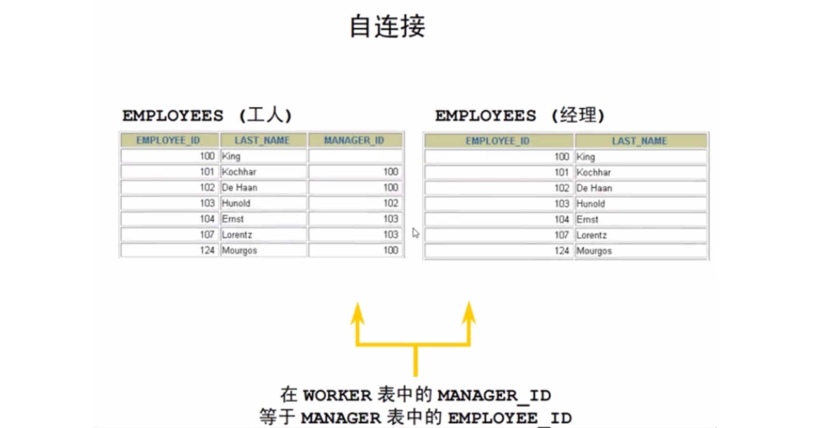

### 1，数据库基本概念

1. **数据**

   数据（Data）是指对客观事物进行描述并可以鉴别的符号，这些符号是可识别的、抽象的。它不仅指狭义上的数字，而是有多种表现形式：字母、文字、文本、图形、音频、视频等。

2. **数据库**

   数据库是数据管理的有效技术，是由一批数据构成的有序集合，这些数据被存放在结构化的数据表里。数据表之间相互关联，反映客观事物间的本质联系。

3. **数据库管理系统**

   数据库管理系统（Database Management System，DBMS）是用来定义和管理数据的软件。电脑上安装了数据库管理系统后，就可以通过数据库管理系统创建数据库来存储数据，也可以通过该系统对数据库中的数据进行数据的增删改查相关的操作。我们平时说的MySQL数据库其实是MySQL数据库管理系统。

4. **数据库管理员**

   数据库管理员（Database Administrator，DBA）是指对数据库管理系统进行操作的人员，其主要负责数据库的运营和维护。

   

常见的数据库管理系统：


**数据库分类：**

- 关系型数据库
- 非关系型数据库


**关系型数据库：**关系型数据库最典型的数据结构是表，由二维表及其之间的联系所组成的一个数据组 织。可以采用结构化查询语言（SQL）对数据库进行操作。

- 优点：
  - 易于维护：都是使用表结构，格式一致；
  - 使用方便：SQL语言通用，可用于复杂查询；
  - 复杂操作：支持SQL，可用于一个表以及多个表之间非常复杂的查询。
- 缺点：
  - 读写性能比较差，尤其是海量数据的高效率读写；
  - 固定的表结构，灵活度稍欠；
  - 高并发读写需求，传统关系型数据库来说，硬盘I/O是一个很大的瓶颈。


**非关系型数据库：**非关系型数据库也称之为NoSQL数据库，是一种数据结构化存储方法的集合，可以是文档或者键值对等。

- 优点：
  - 格式灵活：存储数据的格式可以是key,value形式、文档形式、图片形式等等，文档形式、图片形式等等，使用灵活，应用场景广泛，而关系型数据库则只支持基础类型。
  - 速度快：nosql可以使用硬盘或者随机存储器作为载体，而关系型数据库只能使用硬盘；
  - 高扩展性；
  - 成本低：nosql数据库部署简单，基本都是开源软件。

- 缺点：
  - 不提供sql支持，学习和使用成本较高；
  - 无事务处理；
  - 数据结构相对复杂，复杂查询方面稍欠。


### 2，MySQL介绍与安装

MySQL 是一个关系型数据库管理系统， 由瑞典 MySQL AB 公司开发， 目前属于 Oracle 公司。MySQL 是一种关系型数据库管理系统，关系型数据库将数据保存在不同的表中，而不是将所有数据放在一个大仓库内，这样就增加了速度并提高了灵活性。


**关系型数据库：**

- 关系型数据库是建立在关系模型基础上的数据库，简单说，关系型数据库是由多张能互相连接的 二维表 组成的数据库
- 关系型数据库都可以通过SQL进行操作，所以使用方便。
- 数据存储在磁盘中，安全。


`订单信息表` 和 `客户信息表` 都是有行有列二维表我们将这样的称为关系型数据库。如下：


**数据模型：**


通过客户端可以通过数据库管理系统创建数据库，在数据库中创建表，在表中添加数据。创建的每一个数据库对应到磁盘上都是一个文件夹。一个数据库下可以创建多张表，我们到MySQL中自带的mysql数据库的文件夹目录下：`db.frm` 是表文件， `db.MYD` 是数据文件，通过这两个文件就可以查询到数据展示成二维表的效果。


**MySQL特点：**

- MySQL 是开源的。
- MySQL 支持大型系统的数据库。可以处理拥有上千万条记录的大型数据库。 MySQL 使用标准的 SQL 数据语言形式。
- MySQL 可以运行于多个系统上，并且支持多种语言。这些编程语言包括 C 、C++、 Python 、Java 、Perl 、PHP 等。
- MySQL 存储数据量较大，32 位系统表文件最大可支持 4GB ，64 位系统支持最大的 表文件为 8TB。
- MySQL 是可以定制的，采用了 GPL 协议，你可以修改源码来开发自己的 MySQL 系 统。


**MySQL分类：**

- MySQL分为社区版，社区版是完全开源免费的，社区版也支持多种数据类型和标准的SQL查询语言，能够对数据进行各种查询、增加、删除、修改等操作，所以一般情况下社区版就可以满足开发需求了。
- 企业版，企业版是收费的。即使在开发中需要用到一些付费的附加功能，价格相对于昂贵的 Oracle、DB2等也是有很大优势的。对数据库可靠性要求比较高的企业可以选择企业版。


**MySQL的安装：**大家直接安装小皮就行，简单粗暴，这个小皮软件中，内置了很多的软件，其中就包含mysql。如果我们直接下载mysql安装的话，过程比较烦索。如下：


**Navicat for MySQL安装：**安装了mysql，我后我们可以安装Navicat for MySQL软件，这个软件是用来连接mysql管理系统的。连接上后，可以通过可视化操作mysql。


### 3，SQL语言介绍

结构化查询语言(Structured Query Language)简称 SQL(发音：sequal['si:kwəl])，是一种数据库查询和程序设计语言，用于存取数据以及查询、更新和管理关系数据库系统。


SQL能做什么：

- SQL 面向数据库执行查询
- SQL 可在数据库中插入新的记录
- SQL 可更新数据库中的数据
- SQL 可从数据库删除记录
- SQL 可创建新数据库
- SQL 可在数据库中创建新表
- SQL 可在数据库中创建存储过程
- SQL 可在数据库中创建视图
- SQL 可以设置表、存储过程和视图的权限


**SQL语言分类：**

1. 数据查询语言（DQL：Data Query Language）其语句，也称为“数据检索语句”，用以从表中获得数据，确定数据怎样在应用程序给出。关键字 SELECT 是 DQL（也是所有 SQL）用得最多的动词。（对数据进行查询操作，从数据库表中查询到我们想要的数据）

   - SELECT
   - FROM
   - WHERE
   - ORDER BY
   - HAVING

2. 数据操作语言（DML：Data Manipulation Language）其语句包括动词 INSERT，UPDATE 和 DELETE。它们分别用于添加，修改和删除表中的行（对表中数据进行增删改的）。

   - INSERT：添加数据
   - UPDATE：更新数据
   - DELETE：删除数据

   

3. 数据定义语言（DDL：Data Definition Language）定义数据库对象语言，其语句包括动词 CREATE 和 DROP 等。（就是用来操作数据库，表等）

   - CREATE：创建数据库对象

   - ALTER：修改数据库对象

   - DROP：删除数据库对象

     

4. 数据控制语言（DCL：Data Control Language）它的语句通过 GRANT 或 REVOKE 获得许可，确定用户对数据库对象的访问。

   - GRANT：授予用户某种权限
   - REVOKE：回收授予的某种权限

5. 事务控制语言（TCL ：Transaction Control Language）它的语句能确保被 DML 语句影响的表的所有行及时得以更新。

   - COMMIT：提交事务
   - ROLLBACK：回滚事务
   - SAVEPOINT：设置回滚点


**SQL语言的语法：**

- SQL语句不区分大小写，关键字建议大写。
- SQL语句可以单行或多行书写，以分号结尾。
- 单行注释: -- 注释内容 或 #注释内容(MySQL 特有)。使用-- 添加单行注释时，--后面一定要加空格，而#没有要求。
- 多行注释: /* 注释 */


### 4，DDL操作数据库

使用DDL语句创建数据库：

```sql
CREATE DATABASE  数据库名 DEFAULT CHARACTER SET  字符编码;
```


创建一个test 的数据库，并查看该数据库，以及该数据库的编码。创建数据库：

```sql
create database test default character set utf8;
```


查看数据库：

```sql
show databases;
```


查看数据库编码：

```sql
select schema_name,default_character_set_name from information_schema.schemata 
where schema_name = 'test';
```


使用DDL语言删除数据库:

```sql
DROP DATABASE  数据库名称;
```


删除 test 数据库，删除完后需要刷新一下:

```sql
drop database test;
```


在创建表时，需要先选择数据库:

```sql
USE 数据库名;
```


创建一个名称为 malu 的数据库，编码为 utf8。并选择该数据库：

```sql
create database malu default character set utf8;
use malu;
```


已经有了malu数据库，再去创建时，就会报错，如下：


为了避免上面的错误，在创建数据库的时候先做判断，如果不存在再创建。

```sql
CREATE DATABASE IF NOT EXISTS malu DEFAULT CHARACTER SET utf8;
```


同理，在删除数据库时，也可以做一个判断：

```sql
DROP DATABASE IF EXISTS malu;
```


数据库创建好了，要在数据库中创建表，得先明确在哪儿个数据库中操作，此时就需要使用数据库。

```sql
create database malu default character set utf8;
use malu;
```


查看当前使用的数据库：

```sql
SELECT DATABASE();
```


### 5，MYSQL中的数据类型


不同的数据，要开辟不同的存储空间，目的就是为了更加合理地使用存储空间。


**整数类型：**

| **MySQL数据类型** | **含义（有符号）**                   |
| ----------------- | ------------------------------------ |
| tinyint(m)        | 1个字节 范围(-128~127)               |
| smallint(m)       | 2个字节 范围(-32768~32767)           |
| mediumint(m)      | 3个字节 范围(-8388608~8388607)       |
| int(m)            | 4个字节 范围(-2147483648~2147483647) |
| bigint(m)         | 8个字节 范围(+-9.22*10的18次方)      |

数值类型中的长度 m 是指显示长度，并不表示存储长度，只有字段指定 zerofill 时有用。例如： int(3) ，如果实际值是 2 ，如果列指定了 zerofill ，查询结果就是 002 ，左边用 0 来 填充


使用最多的：tinyint和int

- tinyint : 小整数型，占一个字节
- int： 大整数类型，占四个字节。eg： age int


**浮点类型：**

| **MySQL数据类型** | **含义**                                      |
| ----------------- | --------------------------------------------- |
| float(m,d)        | 单精度浮点型 8位精度(4字节) m总个数，d小数位  |
| double(m,d)       | 双精度浮点型 16位精度(8字节) m总个数，d小数位 |

double ： 浮点类型，使用格式： 字段名 double(总长度, 小数点后保留的位数)。eg： score double(5, 2)


**字符类型：**

| **MySQL数据类型** | **含义**                        |
| ----------------- | ------------------------------- |
| char(n)           | 固定长度，最多255个字符         |
| tinytext          | 可变长度，最多255个字符         |
| varchar(n)        | 可变长度，最多65535个字符       |
| text              | 可变长度，最多65535个字符       |
| mediumtext        | 可变长度，最多2的24次方-1个字符 |
| longtext          | 可变长度，最多2的32次方-1个字符 |

char和varchar：

1. char长度固定， 即每条数据占用等长字节空间；适合用在身份证号码、手机号码等定长。
2. varchar可变长度，可以设置最大长度；适合用在长度可变的属性。
3. text不设置长度， 当不知道属性的最大长度时，适合用text。
4. 按照查询速度： char最快， varchar次之，text最慢。


总结 char和varchar：

- char： 定长字符串。优点：存储性能高。缺点：浪费空间。eg： name char(10) 如果存储的数据字符个数不足10个，也会占10个的空间
- varchar： 变长字符串。优点：节约空间。缺点：存储性能底。eg： name varchar(10) 如果存储的数据字符个数不足10个，那就数据字符个数是几就占几个的空间


字符串型使用建议：

1. 经常变化的字段用varchar
2. 知道固定长度的用char
3. 尽量用varchar
4. 超过255字符的只能用varchar或者text
5. 能用varchar的地方不用text


**日期类型：**

| **MySQL数据类型** | **含义**                     |
| ----------------- | ---------------------------- |
| date              | 日期 YYYY-MM-DD              |
| time              | 时间 HH:MM:SS                |
| datetime          | 日期时间 YYYY-MM-DD HH:MM:SS |
| timestamp         | 时间戳YYYYMMDD HHMMSS        |

- date：日期值。只包含年月日。eg：birthday date ：
- datetime ： 混合日期和时间值。包含年月日时分秒


**二进制数据(BLOB)：**

1. BLOB和TEXT存储方式不同，TEXT以文本方式存储，英文存储区分大小写，而Blob是以二进制方式存储，不分大小写。
2. BLOB存储的数据只能整体读出。
3. TEXT可以指定字符集，BLOB不用指定字符集。


总结：


### 5，DDL操作表


使用DDL语句创建表：

```sql
CREATE TABLE 表名(列名 类型,列名 类型......);
```


创建一个 employees 表包含雇员 ID ，雇员名字，雇员薪水:

```sql
create table employees(employee_id int,employee_name varchar(10),salary float(8,2));
```


查看已创建的表:

```sql
show tables;
```


使用DDL语句删除表：

```sql
DROP TABLE 表名;
```


删除 employees 表:

```sql
drop table employees;
```


使用DDL语句修改表:

```sql
ALTER TABLE  旧表名 RENAME  新表名;
```


创建一个 employees 表包含雇员 ID ，雇员名字，雇员薪水:

```sql
create table employees(employee_id int,employee_name varchar(10),salary float(8,2));
```


将 employees 表名修改为 emp:

```sql
alter table employees rename emp;
```


使用DDL语句修改列名:

```sql
ALTER TABLE  表名 CHANGE COLUMN  旧列名 新列名 类型;
```


将 emp 表中的 employee_name 修改为 name:

```sql
alter table emp change column employee_name name varchar(20);
```


使用DDL语句修改列类型:

```sql
ALTER TABLE  表名 MODIFY  列名 新类型;
```


将 emp 表中的 name 的长度指定为 40:

```sql
alter table emp modify name varchar(40);
```


使用DDL语句添加新列:

```sql
ALTER TABLE  表名 ADD COLUMN  新列名 类型;
```


在 emp 表中添加佣金列，列名为 commission_pct:

```sql
alter table emp add column commission_pct float(4,2);
```


使用DDL语句删除指定的列:

```sql
ALTER TABLE  表名 DROP COLUMN  列名;
```


删除 emp 表中的 commission_pct:

```sql
alter table emp drop column commission_pct;
```


### 6，MySQL中的约束


看如下表：


上面表存在的一些问题：

- id 列一般是用标示数据的唯一性的，而上述表中的id为1的有三条数据，并且 `马花疼` 没有id进行标示

- `柳白` 这条数据的age列的数据是3000，而人也不可能活到3000岁

- `马运` 这条数据的math数学成绩是-5，而数学学得再不好也不可能出现负分

- `柳青` 这条数据的english列（英文成绩）值为null，而成绩即使没考也得是0分

  

针对上面的遇到的问题，从数据库层面在添加数据的时候进行限制，这个就是约束。约束是作用于表中列上的规则，用于限制加入表的数据。例如：我们可以给id列加约束，让其值不能重复，不能为null值。


约束的存在保证了数据库中数据的正确性、有效性和完整性。添加约束可以在添加数据的时候就限制不正确的数据，年龄是3000，数学成绩是-5分这样无效的数据，继而保障数据的完整性。


数据库约束是对表中的数据进行进一步的限制，保证数据的正确性、有效性和完整性。

- 主键约束(Primary Key) PK

  > 主键约束是使用最频繁的约束。在设计数据表时，一般情况下，都会要求表中设置一个主键。 主键是表的一个特殊字段，该字段能唯一标识该表中的每条信息。例如，学生信息表中的学号是唯一的。
  >
  > 主键是一行数据的唯一标识，要求非空且唯一。一般我们都会给没张表添加一个主键列用来唯一标识数据。
  >
  > 例如：上图表中id就可以作为主键，来标识每条数据。那么这样就要求数据中id的值不能重复，不能为null值。

- 外键约束(Foreign Key) FK

  > 外键约束经常和主键约束一起使用，用来确保数据的一致性。
  >
  > 外键用来让两个表的数据之间建立链接，保证数据的一致性和完整性。
  >
  > 外键约束现在可能还不太好理解，后面我们会重点进行讲解。

- 唯一性约束(Unique)

  > 唯一约束与主键约束有一个相似的地方，就是它们都能够确保列的唯一性。与主键约束不同的是，唯一约束在一个表中可以有多个，并且设置唯一约束的列是允许有空值的。
  >
  > 保证列中所有数据各不相同。
  >
  > 例如：id列中三条数据的值都是1，这样的数据在添加时是绝对不允许的。

- 非空约束(Not Null)

  > 非空约束用来约束表中的字段不能为空。
  >
  > 保证列中所有的数据不能有null值。
  >
  > 例如：id列在添加 `马花疼` 这条数据时就不能添加成功。

- 检查约束(Check)

  > 检查约束也叫用户自定义约束，是用来检查数据表中，字段值是否有效的一个手段，但目前 MySQL 数据库不支持检查约束。
  >
  > 保证列中的值满足某一条件。
  >
  > 例如：我们可以给age列添加一个范围，最低年龄可以设置为1，最大年龄就可以设置为300，这样的数据才更合理些。
  >
  > MySQL不支持检查约束。从数据库层面不能保证，以后可以在java代码中进行限制，一样也可以实现要求。

- 默认约束： 关键字是 DEFAULT

  > 保存数据时，未指定值则采用默认值。
  >
  > 例如：我们在给english列添加该约束，指定默认值是0，这样在添加数据时没有指定具体值时就会采用默认给定的0。


#### a）非空约束

非空约束用于保证列中所有数据不能有NULL值。添加约束：

```sql
-- 创建表时添加非空约束
CREATE TABLE 表名(
   列名 数据类型 NOT NULL,
   …
); 

-- 建完表后添加非空约束
ALTER TABLE 表名 MODIFY 字段名 数据类型 NOT NULL;
```


操作一下：


删除约束：

```sql
ALTER TABLE 表名 MODIFY 字段名 数据类型;
```


#### b）唯一约束

唯一约束用于保证列中所有数据各不相同。添加约束语法：  id:1   id:2   id:3 

```sql
-- 创建表时添加唯一约束
CREATE TABLE 表名(
   列名 数据类型 UNIQUE [AUTO_INCREMENT],
   -- AUTO_INCREMENT: 当不指定值时自动增长
   …
); 
CREATE TABLE 表名(
   列名 数据类型,
   …
   [CONSTRAINT] [约束名称] UNIQUE(列名)
); 

-- 建完表后添加唯一约束
ALTER TABLE 表名 MODIFY 字段名 数据类型 UNIQUE;
```


删除约束：

```sql
ALTER TABLE 表名 DROP INDEX 字段名;
```


#### c）主键约束

键是一行数据的唯一标识，要求非空且唯一。一张表只能有一个主键。添加约束语法：

```sql
-- 创建表时添加主键约束
CREATE TABLE 表名(
   列名 数据类型 PRIMARY KEY [AUTO_INCREMENT],
   …
); 
CREATE TABLE 表名(
   列名 数据类型,
   [CONSTRAINT] [约束名称] PRIMARY KEY(列名)
); 

-- 建完表后添加主键约束
ALTER TABLE 表名 ADD PRIMARY KEY(字段名);
```


删除约束：

```sql
ALTER TABLE 表名 DROP PRIMARY KEY;
```


#### d）默认约束

保存数据时，未指定值则采用默认值，添加约束语法：

```sql
-- 创建表时添加默认约束
CREATE TABLE 表名(
   列名 数据类型 DEFAULT 默认值,
   …
); 

-- 建完表后添加默认约束
ALTER TABLE 表名 ALTER 列名 SET DEFAULT 默认值;
```


删除约束：

```sql
ALTER TABLE 表名 ALTER 列名 DROP DEFAULT;
```


#### e）约束练习

需求：

```sql
-- 员工表
CREATE TABLE emp (
	id INT,  -- 员工id，主键且自增长
    ename VARCHAR(50), -- 员工姓名，非空且唯一
    joindate DATE,  -- 入职日期，非空
    salary DOUBLE(7,2),  -- 工资，非空
    bonus DOUBLE(7,2)  -- 奖金，如果没有将近默认为0
);
```


上面一定给出了具体的要求，我们可以根据要求创建这张表，并为每一列添加对应的约束。建表语句如下：

```sql
-- 员工表
CREATE TABLE emp (
    id INT PRIMARY KEY AUTO_INCREMENT,  -- 员工id，主键且自增长
    ename VARCHAR(50) NOT NULL UNIQUE, -- 员工姓名，非空且唯一
    joindate DATE NOT NULL,  -- 入职日期，非空
    salary DOUBLE(7,2) NOT NULL,  -- 工资，非空
    bonus DOUBLE(7,2) DEFAULT 0  -- 奖金，如果没有将近默认为0
);
```


通过上面语句可以创建带有约束的 `emp` 表，约束能不能发挥作用呢。接下来我们一一进行验证，先添加一条没有问题的数据：

```sql
INSERT INTO emp(id,ename,joindate,salary,bonus) values(1,'张三','1999-11-11',8800,5000);
```


验证主键约束，非空且唯一：

```sql
INSERT INTO emp(id,ename,joindate,salary,bonus) values(null,'malu','1999-11-11',8800,5000);
```


从上面的结果可以看到，字段 `id` 不能为null。那我们重新添加一条数据，如下：

```sql
INSERT INTO emp(id,ename,joindate,salary,bonus) values(1,'wc','1999-11-11',8800,5000);
```


从上面结果可以看到，1这个值重复了。所以主键约束是用来限制数据非空且唯一的。那我们再添加一条符合要求的数据

```sql
INSERT INTO emp(id,ename,joindate,salary,bonus) values(3,'李四','1999-11-11',8800,5000);
```


验证非空约束：

```sql
INSERT INTO emp(id,ename,joindate,salary,bonus) values(null,null,'1999-11-11',8800,5000);
```


从上面结果可以看到， `ename` 字段的非空约束生效了。


验证唯一约束：

```sql
INSERT INTO emp(id,ename,joindate,salary,bonus) VALUES(NULL,'李四','1999-11-11',8800,5000);
```


从上面结果可以看到， `ename` 字段的唯一约束生效了。


验证默认约束：

```sql
INSERT INTO emp(id,ename,joindate,salary) values(null,'王五','1999-11-11',8800);
```


默认约束只有在不给值时才会采用默认值。如果给了null，那值就是null值。

```sql
INSERT INTO emp(id,ename,joindate,salary,bonus) values(null,'赵六','1999-11-11',8800,null);
```


### 7，DQL(非常重要)

准备数据：

```sql
/*
 Navicat Premium Data Transfer

 Source Server         : mysql
 Source Server Type    : MySQL
 Source Server Version : 50712
 Source Host           : localhost:3306
 Source Schema         : test

 Target Server Type    : MySQL
 Target Server Version : 50712
 File Encoding         : 65001

 Date: 08/11/2021 15:11:40
*/

SET NAMES utf8mb4;
SET FOREIGN_KEY_CHECKS = 0;

-- ----------------------------
-- Table structure for countries
-- ----------------------------
DROP TABLE IF EXISTS `countries`;
CREATE TABLE `countries`  (
  `COUNTRY_ID` char(2) CHARACTER SET utf8 COLLATE utf8_general_ci NOT NULL COMMENT 'Primary key of countries table.',
  `COUNTRY_NAME` varchar(40) CHARACTER SET utf8 COLLATE utf8_general_ci NULL DEFAULT NULL COMMENT 'Country name',
  `REGION_ID` int NULL DEFAULT NULL COMMENT 'Region ID for the country. Foreign key to region_id column in the departments table.',
  PRIMARY KEY (`COUNTRY_ID`) USING BTREE,
  INDEX `COUNTR_REG_FK`(`REGION_ID`) USING BTREE,
  CONSTRAINT `COUNTR_REG_FK` FOREIGN KEY (`REGION_ID`) REFERENCES `regions` (`REGION_ID`) ON DELETE RESTRICT ON UPDATE RESTRICT
) ENGINE = InnoDB CHARACTER SET = utf8 COLLATE = utf8_general_ci COMMENT = 'country table. Contains 25 rows. References with locations table.' ROW_FORMAT = Dynamic;

-- ----------------------------
-- Records of countries
-- ----------------------------
INSERT INTO `countries` VALUES ('AR', 'Argentina', 2.000000000000000000000000000000);
INSERT INTO `countries` VALUES ('AU', 'Australia', 3.000000000000000000000000000000);
INSERT INTO `countries` VALUES ('BE', 'Belgium', 1.000000000000000000000000000000);
INSERT INTO `countries` VALUES ('BR', 'Brazil', 2.000000000000000000000000000000);
INSERT INTO `countries` VALUES ('CA', 'Canada', 2.000000000000000000000000000000);
INSERT INTO `countries` VALUES ('CH', 'Switzerland', 1.000000000000000000000000000000);
INSERT INTO `countries` VALUES ('CN', 'China', 3.000000000000000000000000000000);
INSERT INTO `countries` VALUES ('DE', 'Germany', 1.000000000000000000000000000000);
INSERT INTO `countries` VALUES ('DK', 'Denmark', 1.000000000000000000000000000000);
INSERT INTO `countries` VALUES ('EG', 'Egypt', 4.000000000000000000000000000000);
INSERT INTO `countries` VALUES ('FR', 'France', 1.000000000000000000000000000000);
INSERT INTO `countries` VALUES ('IL', 'Israel', 4.000000000000000000000000000000);
INSERT INTO `countries` VALUES ('IN', 'India', 3.000000000000000000000000000000);
INSERT INTO `countries` VALUES ('IT', 'Italy', 1.000000000000000000000000000000);
INSERT INTO `countries` VALUES ('JP', 'Japan', 3.000000000000000000000000000000);
INSERT INTO `countries` VALUES ('KW', 'Kuwait', 4.000000000000000000000000000000);
INSERT INTO `countries` VALUES ('ML', 'Malaysia', 3.000000000000000000000000000000);
INSERT INTO `countries` VALUES ('MX', 'Mexico', 2.000000000000000000000000000000);
INSERT INTO `countries` VALUES ('NG', 'Nigeria', 4.000000000000000000000000000000);
INSERT INTO `countries` VALUES ('NL', 'Netherlands', 1.000000000000000000000000000000);
INSERT INTO `countries` VALUES ('SG', 'Singapore', 3.000000000000000000000000000000);
INSERT INTO `countries` VALUES ('UK', 'United Kingdom', 1.000000000000000000000000000000);
INSERT INTO `countries` VALUES ('US', 'United States of America', 2.000000000000000000000000000000);
INSERT INTO `countries` VALUES ('ZM', 'Zambia', 4.000000000000000000000000000000);
INSERT INTO `countries` VALUES ('ZW', 'Zimbabwe', 4.000000000000000000000000000000);

-- ----------------------------
-- Table structure for departments
-- ----------------------------
DROP TABLE IF EXISTS `departments`;
CREATE TABLE `departments`  (
  `DEPARTMENT_ID` int NOT NULL COMMENT 'Primary key column of departments table.',
  `DEPARTMENT_NAME` varchar(30) CHARACTER SET utf8 COLLATE utf8_general_ci NOT NULL COMMENT 'A not null column that shows name of a department. Administration,\nMarketing, Purchasing, Human Resources, Shipping, IT, Executive, Public\nRelations, Sales, Finance, and Accounting. ',
  `MANAGER_ID` int NULL DEFAULT NULL COMMENT 'Manager_id of a department. Foreign key to employee_id column of employees table. The manager_id column of the employee table references this column.',
  `LOCATION_ID` int NULL DEFAULT NULL COMMENT 'Location id where a department is located. Foreign key to location_id column of locations table.',
  PRIMARY KEY (`DEPARTMENT_ID`) USING BTREE,
  INDEX `DEPT_LOCATION_IX`(`LOCATION_ID`) USING BTREE,
  INDEX `DEPT_MGR_FK`(`MANAGER_ID`) USING BTREE,
  CONSTRAINT `DEPT_LOC_FK` FOREIGN KEY (`LOCATION_ID`) REFERENCES `locations` (`LOCATION_ID`) ON DELETE RESTRICT ON UPDATE RESTRICT,
  CONSTRAINT `DEPT_MGR_FK` FOREIGN KEY (`MANAGER_ID`) REFERENCES `employees` (`EMPLOYEE_ID`) ON DELETE RESTRICT ON UPDATE RESTRICT
) ENGINE = InnoDB CHARACTER SET = utf8 COLLATE = utf8_general_ci COMMENT = 'Departments table that shows details of departments where employees\nwork. Contains 27 rows; references with locations, employees, and job_history tables.' ROW_FORMAT = Dynamic;

-- ----------------------------
-- Records of departments
-- ----------------------------
INSERT INTO `departments` VALUES (10, 'Administration', 200, 1700);
INSERT INTO `departments` VALUES (20, 'Marketing', 201, 1800);
INSERT INTO `departments` VALUES (30, 'Purchasing', 114, 1700);
INSERT INTO `departments` VALUES (40, 'Human Resources', 203, 2400);
INSERT INTO `departments` VALUES (50, 'Shipping', 121, 1500);
INSERT INTO `departments` VALUES (60, 'IT', 103, 1400);
INSERT INTO `departments` VALUES (70, 'Public Relations', 204, 2700);
INSERT INTO `departments` VALUES (80, 'Sales', 145, 2500);
INSERT INTO `departments` VALUES (90, 'Executive', 100, 1700);
INSERT INTO `departments` VALUES (100, 'Finance', 108, 1700);
INSERT INTO `departments` VALUES (110, 'Accounting', 205, 1700);
INSERT INTO `departments` VALUES (120, 'Treasury', NULL, 1700);
INSERT INTO `departments` VALUES (130, 'Corporate Tax', NULL, 1700);
INSERT INTO `departments` VALUES (140, 'Control And Credit', NULL, 1700);
INSERT INTO `departments` VALUES (150, 'Shareholder Services', NULL, 1700);
INSERT INTO `departments` VALUES (160, 'Benefits', NULL, 1700);
INSERT INTO `departments` VALUES (170, 'Manufacturing', NULL, 1700);
INSERT INTO `departments` VALUES (180, 'Construction', NULL, 1700);
INSERT INTO `departments` VALUES (190, 'Contracting', NULL, 1700);
INSERT INTO `departments` VALUES (200, 'Operations', NULL, 1700);
INSERT INTO `departments` VALUES (210, 'IT Support', NULL, 1700);
INSERT INTO `departments` VALUES (220, 'NOC', NULL, 1700);
INSERT INTO `departments` VALUES (230, 'IT Helpdesk', NULL, 1700);
INSERT INTO `departments` VALUES (240, 'Government Sales', NULL, 1700);
INSERT INTO `departments` VALUES (250, 'Retail Sales', NULL, 1700);
INSERT INTO `departments` VALUES (260, 'Recruiting', NULL, 1700);
INSERT INTO `departments` VALUES (270, 'Payroll', NULL, 1700);

-- ----------------------------
-- Table structure for employees
-- ----------------------------
DROP TABLE IF EXISTS `employees`;
CREATE TABLE `employees`  (
  `EMPLOYEE_ID` int NOT NULL COMMENT 'Primary key of employees table.',
  `FIRST_NAME` varchar(20) CHARACTER SET utf8 COLLATE utf8_general_ci NULL DEFAULT NULL COMMENT 'First name of the employee. A not null column.',
  `LAST_NAME` varchar(25) CHARACTER SET utf8 COLLATE utf8_general_ci NOT NULL COMMENT 'Last name of the employee. A not null column.',
  `EMAIL` varchar(25) CHARACTER SET utf8 COLLATE utf8_general_ci NOT NULL COMMENT 'Email id of the employee',
  `PHONE_NUMBER` varchar(20) CHARACTER SET utf8 COLLATE utf8_general_ci NULL DEFAULT NULL COMMENT 'Phone number of the employee; includes country code and area code',
  `HIRE_DATE` datetime NOT NULL COMMENT 'Date when the employee started on this job. A not null column.',
  `JOB_ID` varchar(10) CHARACTER SET utf8 COLLATE utf8_general_ci NOT NULL COMMENT 'Current job of the employee; foreign key to job_id column of the\njobs table. A not null column.',
  `SALARY` float(8, 2) NULL DEFAULT NULL COMMENT 'Monthly salary of the employee. Must be greater\nthan zero (enforced by constraint emp_salary_min)',
  `COMMISSION_PCT` int NULL DEFAULT NULL COMMENT 'Commission percentage of the employee; Only employees in sales\ndepartment elgible for commission percentage',
  `MANAGER_ID` int NULL DEFAULT NULL COMMENT 'Manager id of the employee; has same domain as manager_id in\ndepartments table. Foreign key to employee_id column of employees table.\n(useful for reflexive joins and CONNECT BY query)',
  `DEPARTMENT_ID` int NULL DEFAULT NULL COMMENT 'Department id where employee works; foreign key to department_id\ncolumn of the departments table',
  PRIMARY KEY (`EMPLOYEE_ID`) USING BTREE,
  INDEX `EMP_DEPARTMENT_IX`(`DEPARTMENT_ID`) USING BTREE,
  INDEX `EMP_JOB_IX`(`JOB_ID`) USING BTREE,
  INDEX `EMP_MANAGER_IX`(`MANAGER_ID`) USING BTREE,
  INDEX `EMP_NAME_IX`(`LAST_NAME`, `FIRST_NAME`) USING BTREE,
  CONSTRAINT `EMP_DEPT_FK` FOREIGN KEY (`DEPARTMENT_ID`) REFERENCES `departments` (`DEPARTMENT_ID`) ON DELETE RESTRICT ON UPDATE RESTRICT,
  CONSTRAINT `EMP_JOB_FK` FOREIGN KEY (`JOB_ID`) REFERENCES `jobs` (`JOB_ID`) ON DELETE RESTRICT ON UPDATE RESTRICT,
  CONSTRAINT `EMP_MANAGER_FK` FOREIGN KEY (`MANAGER_ID`) REFERENCES `employees` (`EMPLOYEE_ID`) ON DELETE RESTRICT ON UPDATE RESTRICT
) ENGINE = InnoDB CHARACTER SET = utf8 COLLATE = utf8_general_ci COMMENT = 'employees table. Contains 107 rows. References with departments,\njobs, job_history tables. Contains a self reference.' ROW_FORMAT = Dynamic;

-- ----------------------------
-- Records of employees
-- ----------------------------
INSERT INTO `employees` VALUES (100, 'Steven', 'King', 'SKING', '515.123.4567', '2003-06-17 00:00:00', 'AD_PRES', 24000.00, NULL, NULL, 90);
INSERT INTO `employees` VALUES (101, 'Neena', 'Kochhar', 'NKOCHHAR', '515.123.4568', '2005-09-21 00:00:00', 'AD_VP', 17000.00, NULL, 100, 90);
INSERT INTO `employees` VALUES (102, 'Lex', 'De Haan', 'LDEHAAN', '515.123.4569', '2001-01-13 00:00:00', 'AD_VP', 17000.00, NULL, 100, 90);
INSERT INTO `employees` VALUES (103, 'Alexander', 'Hunold', 'AHUNOLD', '590.423.4567', '2006-01-03 00:00:00', 'IT_PROG', 9000.00, NULL, 102, 60);
INSERT INTO `employees` VALUES (104, 'Bruce', 'Ernst', 'BERNST', '590.423.4568', '2007-05-21 00:00:00', 'IT_PROG', 6000.00, NULL, 103, 60);
INSERT INTO `employees` VALUES (105, 'David', 'Austin', 'DAUSTIN', '590.423.4569', '2005-06-25 00:00:00', 'IT_PROG', 4800.00, NULL, 103, 60);
INSERT INTO `employees` VALUES (106, 'Valli', 'Pataballa', 'VPATABAL', '590.423.4560', '2006-02-05 00:00:00', 'IT_PROG', 4800.00, NULL, 103, 60);
INSERT INTO `employees` VALUES (107, 'Diana', 'Lorentz', 'DLORENTZ', '590.423.5567', '2007-02-07 00:00:00', 'IT_PROG', 4200.00, NULL, 103, 60);
INSERT INTO `employees` VALUES (108, 'Nancy', 'Greenberg', 'NGREENBE', '515.124.4569', '2002-08-17 00:00:00', 'FI_MGR', 12008.00, NULL, 101, 100);
INSERT INTO `employees` VALUES (109, 'Daniel', 'Faviet', 'DFAVIET', '515.124.4169', '2002-08-16 00:00:00', 'FI_ACCOUNT', 9000.00, NULL, 108, 100);
INSERT INTO `employees` VALUES (110, 'John', 'Chen', 'JCHEN', '515.124.4269', '2005-09-28 00:00:00', 'FI_ACCOUNT', 8200.00, NULL, 108, 100);
INSERT INTO `employees` VALUES (111, 'Ismael', 'Sciarra', 'ISCIARRA', '515.124.4369', '2005-09-30 00:00:00', 'FI_ACCOUNT', 7700.00, NULL, 108, 100);
INSERT INTO `employees` VALUES (112, 'Jose Manuel', 'Urman', 'JMURMAN', '515.124.4469', '2006-03-07 00:00:00', 'FI_ACCOUNT', 7800.00, NULL, 108, 100);
INSERT INTO `employees` VALUES (113, 'Luis', 'Popp', 'LPOPP', '515.124.4567', '2007-12-07 00:00:00', 'FI_ACCOUNT', 6900.00, NULL, 108, 100);
INSERT INTO `employees` VALUES (114, 'Den', 'Raphaely', 'DRAPHEAL', '515.127.4561', '2002-12-07 00:00:00', 'PU_MAN', 11000.00, NULL, 100, 30);
INSERT INTO `employees` VALUES (115, 'Alexander', 'Khoo', 'AKHOO', '515.127.4562', '2003-05-18 00:00:00', 'PU_CLERK', 3100.00, NULL, 114, 30);
INSERT INTO `employees` VALUES (116, 'Shelli', 'Baida', 'SBAIDA', '515.127.4563', '2005-12-24 00:00:00', 'PU_CLERK', 2900.00, NULL, 114, 30);
INSERT INTO `employees` VALUES (117, 'Sigal', 'Tobias', 'STOBIAS', '515.127.4564', '2005-07-24 00:00:00', 'PU_CLERK', 2800.00, NULL, 114, 30);
INSERT INTO `employees` VALUES (118, 'Guy', 'Himuro', 'GHIMURO', '515.127.4565', '2006-11-15 00:00:00', 'PU_CLERK', 2600.00, NULL, 114, 30);
INSERT INTO `employees` VALUES (119, 'Karen', 'Colmenares', 'KCOLMENA', '515.127.4566', '2007-08-10 00:00:00', 'PU_CLERK', 2500.00, NULL, 114, 30);
INSERT INTO `employees` VALUES (120, 'Matthew', 'Weiss', 'MWEISS', '650.123.1234', '2004-07-18 00:00:00', 'ST_MAN', 8000.00, NULL, 100, 50);
INSERT INTO `employees` VALUES (121, 'Adam', 'Fripp', 'AFRIPP', '650.123.2234', '2005-04-10 00:00:00', 'ST_MAN', 8200.00, NULL, 100, 50);
INSERT INTO `employees` VALUES (122, 'Payam', 'Kaufling', 'PKAUFLIN', '650.123.3234', '2003-05-01 00:00:00', 'ST_MAN', 7900.00, NULL, 100, 50);
INSERT INTO `employees` VALUES (123, 'Shanta', 'Vollman', 'SVOLLMAN', '650.123.4234', '2005-10-10 00:00:00', 'ST_MAN', 6500.00, NULL, 100, 50);
INSERT INTO `employees` VALUES (124, 'Kevin', 'Mourgos', 'KMOURGOS', '650.123.5234', '2007-11-16 00:00:00', 'ST_MAN', 5800.00, NULL, 100, 50);
INSERT INTO `employees` VALUES (125, 'Julia', 'Nayer', 'JNAYER', '650.124.1214', '2005-07-16 00:00:00', 'ST_CLERK', 3200.00, NULL, 120, 50);
INSERT INTO `employees` VALUES (126, 'Irene', 'Mikkilineni', 'IMIKKILI', '650.124.1224', '2006-09-28 00:00:00', 'ST_CLERK', 2700.00, NULL, 120, 50);
INSERT INTO `employees` VALUES (127, 'James', 'Landry', 'JLANDRY', '650.124.1334', '2007-01-14 00:00:00', 'ST_CLERK', 2400.00, NULL, 120, 50);
INSERT INTO `employees` VALUES (128, 'Steven', 'Markle', 'SMARKLE', '650.124.1434', '2008-03-08 00:00:00', 'ST_CLERK', 2200.00, NULL, 120, 50);
INSERT INTO `employees` VALUES (129, 'Laura', 'Bissot', 'LBISSOT', '650.124.5234', '2005-08-20 00:00:00', 'ST_CLERK', 3300.00, NULL, 121, 50);
INSERT INTO `employees` VALUES (130, 'Mozhe', 'Atkinson', 'MATKINSO', '650.124.6234', '2005-10-30 00:00:00', 'ST_CLERK', 2800.00, NULL, 121, 50);
INSERT INTO `employees` VALUES (131, 'James', 'Marlow', 'JAMRLOW', '650.124.7234', '2005-02-16 00:00:00', 'ST_CLERK', 2500.00, NULL, 121, 50);
INSERT INTO `employees` VALUES (132, 'TJ', 'Olson', 'TJOLSON', '650.124.8234', '2007-04-10 00:00:00', 'ST_CLERK', 2100.00, NULL, 121, 50);
INSERT INTO `employees` VALUES (133, 'Jason', 'Mallin', 'JMALLIN', '650.127.1934', '2004-06-14 00:00:00', 'ST_CLERK', 3300.00, NULL, 122, 50);
INSERT INTO `employees` VALUES (134, 'Michael', 'Rogers', 'MROGERS', '650.127.1834', '2006-08-26 00:00:00', 'ST_CLERK', 2900.00, NULL, 122, 50);
INSERT INTO `employees` VALUES (135, 'Ki', 'Gee', 'KGEE', '650.127.1734', '2007-12-12 00:00:00', 'ST_CLERK', 2400.00, NULL, 122, 50);
INSERT INTO `employees` VALUES (136, 'Hazel', 'Philtanker', 'HPHILTAN', '650.127.1634', '2008-02-06 00:00:00', 'ST_CLERK', 2200.00, NULL, 122, 50);
INSERT INTO `employees` VALUES (137, 'Renske', 'Ladwig', 'RLADWIG', '650.121.1234', '2003-07-14 00:00:00', 'ST_CLERK', 3600.00, NULL, 123, 50);
INSERT INTO `employees` VALUES (138, 'Stephen', 'Stiles', 'SSTILES', '650.121.2034', '2005-10-26 00:00:00', 'ST_CLERK', 3200.00, NULL, 123, 50);
INSERT INTO `employees` VALUES (139, 'John', 'Seo', 'JSEO', '650.121.2019', '2006-02-12 00:00:00', 'ST_CLERK', 2700.00, NULL, 123, 50);
INSERT INTO `employees` VALUES (140, 'Joshua', 'Patel', 'JPATEL', '650.121.1834', '2006-04-06 00:00:00', 'ST_CLERK', 2500.00, NULL, 123, 50);
INSERT INTO `employees` VALUES (141, 'Trenna', 'Rajs', 'TRAJS', '650.121.8009', '2003-10-17 00:00:00', 'ST_CLERK', 3500.00, NULL, 124, 50);
INSERT INTO `employees` VALUES (142, 'Curtis', 'Davies', 'CDAVIES', '650.121.2994', '2005-01-29 00:00:00', 'ST_CLERK', 3100.00, NULL, 124, 50);
INSERT INTO `employees` VALUES (143, 'Randall', 'Matos', 'RMATOS', '650.121.2874', '2006-03-15 00:00:00', 'ST_CLERK', 2600.00, NULL, 124, 50);
INSERT INTO `employees` VALUES (144, 'Peter', 'Vargas', 'PVARGAS', '650.121.2004', '2006-07-09 00:00:00', 'ST_CLERK', 2500.00, NULL, 124, 50);
INSERT INTO `employees` VALUES (145, 'John', 'Russell', 'JRUSSEL', '011.44.1344.429268', '2004-10-01 00:00:00', 'SA_MAN', 14000.00, 0.40, 100, 80);
INSERT INTO `employees` VALUES (146, 'Karen', 'Partners', 'KPARTNER', '011.44.1344.467268', '2005-01-05 00:00:00', 'SA_MAN', 13500.00, 0.30, 100, 80);
INSERT INTO `employees` VALUES (147, 'Alberto', 'Errazuriz', 'AERRAZUR', '011.44.1344.429278', '2005-03-10 00:00:00', 'SA_MAN', 12000.00, 0.30, 100, 80);
INSERT INTO `employees` VALUES (148, 'Gerald', 'Cambrault', 'GCAMBRAU', '011.44.1344.619268', '2007-10-15 00:00:00', 'SA_MAN', 11000.00, 0.30, 100, 80);
INSERT INTO `employees` VALUES (149, 'Eleni', 'Zlotkey', 'EZLOTKEY', '011.44.1344.429018', '2008-01-29 00:00:00', 'SA_MAN', 10500.00, 0.20, 100, 80);
INSERT INTO `employees` VALUES (150, 'Peter', 'Tucker', 'PTUCKER', '011.44.1344.129268', '2005-01-30 00:00:00', 'SA_REP', 10000.00, 0.30, 145, 80);
INSERT INTO `employees` VALUES (151, 'David', 'Bernstein', 'DBERNSTE', '011.44.1344.345268', '2005-03-24 00:00:00', 'SA_REP', 9500.00, 0.25, 145, 80);
INSERT INTO `employees` VALUES (152, 'Peter', 'Hall', 'PHALL', '011.44.1344.478968', '2005-08-20 00:00:00', 'SA_REP', 9000.00, 0.25, 145, 80);
INSERT INTO `employees` VALUES (153, 'Christopher', 'Olsen', 'COLSEN', '011.44.1344.498718', '2006-03-30 00:00:00', 'SA_REP', 8000.00, 0.20, 145, 80);
INSERT INTO `employees` VALUES (154, 'Nanette', 'Cambrault', 'NCAMBRAU', '011.44.1344.987668', '2006-12-09 00:00:00', 'SA_REP', 7500.00, 0.20, 145, 80);
INSERT INTO `employees` VALUES (155, 'Oliver', 'Tuvault', 'OTUVAULT', '011.44.1344.486508', '2007-11-23 00:00:00', 'SA_REP', 7000.00, 0.15, 145, 80);
INSERT INTO `employees` VALUES (156, 'Janette', 'King', 'JKING', '011.44.1345.429268', '2004-01-30 00:00:00', 'SA_REP', 10000.00, 0.35, 146, 80);
INSERT INTO `employees` VALUES (157, 'Patrick', 'Sully', 'PSULLY', '011.44.1345.929268', '2004-03-04 00:00:00', 'SA_REP', 9500.00, 0.35, 146, 80);
INSERT INTO `employees` VALUES (158, 'Allan', 'McEwen', 'AMCEWEN', '011.44.1345.829268', '2004-08-01 00:00:00', 'SA_REP', 9000.00, 0.35, 146, 80);
INSERT INTO `employees` VALUES (159, 'Lindsey', 'Smith', 'LSMITH', '011.44.1345.729268', '2005-03-10 00:00:00', 'SA_REP', 8000.00, 0.30, 146, 80);
INSERT INTO `employees` VALUES (160, 'Louise', 'Doran', 'LDORAN', '011.44.1345.629268', '2005-12-15 00:00:00', 'SA_REP', 7500.00, 0.30, 146, 80);
INSERT INTO `employees` VALUES (161, 'Sarath', 'Sewall', 'SSEWALL', '011.44.1345.529268', '2006-11-03 00:00:00', 'SA_REP', 7000.00, 0.25, 146, 80);
INSERT INTO `employees` VALUES (162, 'Clara', 'Vishney', 'CVISHNEY', '011.44.1346.129268', '2005-11-11 00:00:00', 'SA_REP', 10500.00, 0.25, 147, 80);
INSERT INTO `employees` VALUES (163, 'Danielle', 'Greene', 'DGREENE', '011.44.1346.229268', '2007-03-19 00:00:00', 'SA_REP', 9500.00, 0.15, 147, 80);
INSERT INTO `employees` VALUES (164, 'Mattea', 'Marvins', 'MMARVINS', '011.44.1346.329268', '2008-01-24 00:00:00', 'SA_REP', 7200.00, 0.10, 147, 80);
INSERT INTO `employees` VALUES (165, 'David', 'Lee', 'DLEE', '011.44.1346.529268', '2008-02-23 00:00:00', 'SA_REP', 6800.00, 0.10, 147, 80);
INSERT INTO `employees` VALUES (166, 'Sundar', 'Ande', 'SANDE', '011.44.1346.629268', '2008-03-24 00:00:00', 'SA_REP', 6400.00, 0.10, 147, 80);
INSERT INTO `employees` VALUES (167, 'Amit', 'Banda', 'ABANDA', '011.44.1346.729268', '2008-04-21 00:00:00', 'SA_REP', 6200.00, 0.10, 147, 80);
INSERT INTO `employees` VALUES (168, 'Lisa', 'Ozer', 'LOZER', '011.44.1343.929268', '2005-03-11 00:00:00', 'SA_REP', 11500.00, 0.25, 148, 80);
INSERT INTO `employees` VALUES (169, 'Harrison', 'Bloom', 'HBLOOM', '011.44.1343.829268', '2006-03-23 00:00:00', 'SA_REP', 10000.00, 0.20, 148, 80);
INSERT INTO `employees` VALUES (170, 'Tayler', 'Fox', 'TFOX', '011.44.1343.729268', '2006-01-24 00:00:00', 'SA_REP', 9600.00, 0.20, 148, 80);
INSERT INTO `employees` VALUES (171, 'William', 'Smith', 'WSMITH', '011.44.1343.629268', '2007-02-23 00:00:00', 'SA_REP', 7400.00, 0.15, 148, 80);
INSERT INTO `employees` VALUES (172, 'Elizabeth', 'Bates', 'EBATES', '011.44.1343.529268', '2007-03-24 00:00:00', 'SA_REP', 7300.00, 0.15, 148, 80);
INSERT INTO `employees` VALUES (173, 'Sundita', 'Kumar', 'SKUMAR', '011.44.1343.329268', '2008-04-21 00:00:00', 'SA_REP', 6100.00, 0.10, 148, 80);
INSERT INTO `employees` VALUES (174, 'Ellen', 'Abel', 'EABEL', '011.44.1644.429267', '2004-05-11 00:00:00', 'SA_REP', 11000.00, 0.30, 149, 80);
INSERT INTO `employees` VALUES (175, 'Alyssa', 'Hutton', 'AHUTTON', '011.44.1644.429266', '2005-03-19 00:00:00', 'SA_REP', 8800.00, 0.25, 149, 80);
INSERT INTO `employees` VALUES (176, 'Jonathon', 'Taylor', 'JTAYLOR', '011.44.1644.429265', '2006-03-24 00:00:00', 'SA_REP', 8600.00, 0.20, 149, 80);
INSERT INTO `employees` VALUES (177, 'Jack', 'Livingston', 'JLIVINGS', '011.44.1644.429264', '2006-04-23 00:00:00', 'SA_REP', 8400.00, 0.20, 149, 80);
INSERT INTO `employees` VALUES (178, 'Kimberely', 'Grant', 'KGRANT', '011.44.1644.429263', '2007-05-24 00:00:00', 'SA_REP', 7000.00, 0.15, 149, NULL);
INSERT INTO `employees` VALUES (179, 'Charles', 'Johnson', 'CJOHNSON', '011.44.1644.429262', '2008-01-04 00:00:00', 'SA_REP', 6200.00, 0.10, 149, 80);
INSERT INTO `employees` VALUES (180, 'Winston', 'Taylor', 'WTAYLOR', '650.507.9876', '2006-01-24 00:00:00', 'SH_CLERK', 3200.00, NULL, 120, 50);
INSERT INTO `employees` VALUES (181, 'Jean', 'Fleaur', 'JFLEAUR', '650.507.9877', '2006-02-23 00:00:00', 'SH_CLERK', 3100.00, NULL, 120, 50);
INSERT INTO `employees` VALUES (182, 'Martha', 'Sullivan', 'MSULLIVA', '650.507.9878', '2007-06-21 00:00:00', 'SH_CLERK', 2500.00, NULL, 120, 50);
INSERT INTO `employees` VALUES (183, 'Girard', 'Geoni', 'GGEONI', '650.507.9879', '2008-02-03 00:00:00', 'SH_CLERK', 2800.00, NULL, 120, 50);
INSERT INTO `employees` VALUES (184, 'Nandita', 'Sarchand', 'NSARCHAN', '650.509.1876', '2004-01-27 00:00:00', 'SH_CLERK', 4200.00, NULL, 121, 50);
INSERT INTO `employees` VALUES (185, 'Alexis', 'Bull', 'ABULL', '650.509.2876', '2005-02-20 00:00:00', 'SH_CLERK', 4100.00, NULL, 121, 50);
INSERT INTO `employees` VALUES (186, 'Julia', 'Dellinger', 'JDELLING', '650.509.3876', '2006-06-24 00:00:00', 'SH_CLERK', 3400.00, NULL, 121, 50);
INSERT INTO `employees` VALUES (187, 'Anthony', 'Cabrio', 'ACABRIO', '650.509.4876', '2007-02-07 00:00:00', 'SH_CLERK', 3000.00, NULL, 121, 50);
INSERT INTO `employees` VALUES (188, 'Kelly', 'Chung', 'KCHUNG', '650.505.1876', '2005-06-14 00:00:00', 'SH_CLERK', 3800.00, NULL, 122, 50);
INSERT INTO `employees` VALUES (189, 'Jennifer', 'Dilly', 'JDILLY', '650.505.2876', '2005-08-13 00:00:00', 'SH_CLERK', 3600.00, NULL, 122, 50);
INSERT INTO `employees` VALUES (190, 'Timothy', 'Gates', 'TGATES', '650.505.3876', '2006-07-11 00:00:00', 'SH_CLERK', 2900.00, NULL, 122, 50);
INSERT INTO `employees` VALUES (191, 'Randall', 'Perkins', 'RPERKINS', '650.505.4876', '2007-12-19 00:00:00', 'SH_CLERK', 2500.00, NULL, 122, 50);
INSERT INTO `employees` VALUES (192, 'Sarah', 'Bell', 'SBELL', '650.501.1876', '2004-02-04 00:00:00', 'SH_CLERK', 4000.00, NULL, 123, 50);
INSERT INTO `employees` VALUES (193, 'Britney', 'Everett', 'BEVERETT', '650.501.2876', '2005-03-03 00:00:00', 'SH_CLERK', 3900.00, NULL, 123, 50);
INSERT INTO `employees` VALUES (194, 'Samuel', 'McCain', 'SMCCAIN', '650.501.3876', '2006-07-01 00:00:00', 'SH_CLERK', 3200.00, NULL, 123, 50);
INSERT INTO `employees` VALUES (195, 'Vance', 'Jones', 'VJONES', '650.501.4876', '2007-03-17 00:00:00', 'SH_CLERK', 2800.00, NULL, 123, 50);
INSERT INTO `employees` VALUES (196, 'Alana', 'Walsh', 'AWALSH', '650.507.9811', '2006-04-24 00:00:00', 'SH_CLERK', 3100.00, NULL, 124, 50);
INSERT INTO `employees` VALUES (197, 'Kevin', 'Feeney', 'KFEENEY', '650.507.9822', '2006-05-23 00:00:00', 'SH_CLERK', 3000.00, NULL, 124, 50);
INSERT INTO `employees` VALUES (198, 'Donald', 'OConnell', 'DOCONNEL', '650.507.9833', '2007-06-21 00:00:00', 'SH_CLERK', 2600.00, NULL, 124, 50);
INSERT INTO `employees` VALUES (199, 'Douglas', 'Grant', 'DGRANT', '650.507.9844', '2008-01-13 00:00:00', 'SH_CLERK', 2600.00, NULL, 124, 50);
INSERT INTO `employees` VALUES (200, 'Jennifer', 'Whalen', 'JWHALEN', '515.123.4444', '2003-09-17 00:00:00', 'AD_ASST', 4400.00, NULL, 101, 10);
INSERT INTO `employees` VALUES (201, 'Michael', 'Hartstein', 'MHARTSTE', '515.123.5555', '2004-02-17 00:00:00', 'MK_MAN', 13000.00, NULL, 100, 20);
INSERT INTO `employees` VALUES (202, 'Pat', 'Fay', 'PFAY', '603.123.6666', '2005-08-17 00:00:00', 'MK_REP', 6000.00, NULL, 201, 20);
INSERT INTO `employees` VALUES (203, 'Susan', 'Mavris', 'SMAVRIS', '515.123.7777', '2002-06-07 00:00:00', 'HR_REP', 6500.00, NULL, 101, 40);
INSERT INTO `employees` VALUES (204, 'Hermann', 'Baer', 'HBAER', '515.123.8888', '2002-06-07 00:00:00', 'PR_REP', 10000.00, NULL, 101, 70);
INSERT INTO `employees` VALUES (205, 'Shelley', 'Higgins', 'SHIGGINS', '515.123.8080', '2002-06-07 00:00:00', 'AC_MGR', 12008.00, NULL, 101, 110);
INSERT INTO `employees` VALUES (206, 'William', 'Gietz', 'WGIETZ', '515.123.8181', '2002-06-07 00:00:00', 'AC_ACCOUNT', 8300.00, NULL, 205, 110);

-- ----------------------------
-- Table structure for job_history
-- ----------------------------
DROP TABLE IF EXISTS `job_history`;
CREATE TABLE `job_history`  (
  `EMPLOYEE_ID` int NOT NULL COMMENT 'A not null column in the complex primary key employee_id+start_date.\nForeign key to employee_id column of the employee table',
  `START_DATE` datetime NOT NULL COMMENT 'A not null column in the complex primary key employee_id+start_date.\nMust be less than the end_date of the job_history table. (enforced by\nconstraint jhist_date_interval)',
  `END_DATE` datetime NOT NULL COMMENT 'Last day of the employee in this job role. A not null column. Must be\ngreater than the start_date of the job_history table.\n(enforced by constraint jhist_date_interval)',
  `JOB_ID` varchar(10) CHARACTER SET utf8 COLLATE utf8_general_ci NOT NULL COMMENT 'Job role in which the employee worked in the past; foreign key to\njob_id column in the jobs table. A not null column.',
  `DEPARTMENT_ID` int NULL DEFAULT NULL COMMENT 'Department id in which the employee worked in the past; foreign key to deparment_id column in the departments table',
  PRIMARY KEY (`EMPLOYEE_ID`, `START_DATE`) USING BTREE,
  INDEX `JHIST_DEPARTMENT_IX`(`DEPARTMENT_ID`) USING BTREE,
  INDEX `JHIST_EMPLOYEE_IX`(`EMPLOYEE_ID`) USING BTREE,
  INDEX `JHIST_JOB_IX`(`JOB_ID`) USING BTREE,
  CONSTRAINT `JHIST_DEPT_FK` FOREIGN KEY (`DEPARTMENT_ID`) REFERENCES `departments` (`DEPARTMENT_ID`) ON DELETE RESTRICT ON UPDATE RESTRICT,
  CONSTRAINT `JHIST_EMP_FK` FOREIGN KEY (`EMPLOYEE_ID`) REFERENCES `employees` (`EMPLOYEE_ID`) ON DELETE RESTRICT ON UPDATE RESTRICT,
  CONSTRAINT `JHIST_JOB_FK` FOREIGN KEY (`JOB_ID`) REFERENCES `jobs` (`JOB_ID`) ON DELETE RESTRICT ON UPDATE RESTRICT
) ENGINE = InnoDB CHARACTER SET = utf8 COLLATE = utf8_general_ci COMMENT = 'Table that stores job history of the employees. If an employee\nchanges departments within the job or changes jobs within the department,\nnew rows get inserted into this table with old job information of the\nemployee. Contains a complex primary key: employee_id+start_date.\nContains 25 rows. References with jobs, employees, and departments tables.' ROW_FORMAT = Dynamic;

-- ----------------------------
-- Records of job_history
-- ----------------------------
INSERT INTO `job_history` VALUES (101, '1997-09-21 00:00:00', '2001-10-27 00:00:00', 'AC_ACCOUNT', 110);
INSERT INTO `job_history` VALUES (101, '2001-10-28 00:00:00', '2005-03-15 00:00:00', 'AC_MGR', 110);
INSERT INTO `job_history` VALUES (102, '2001-01-13 00:00:00', '2006-07-24 00:00:00', 'IT_PROG', 60);
INSERT INTO `job_history` VALUES (114, '2006-03-24 00:00:00', '2007-12-31 00:00:00', 'ST_CLERK', 50);
INSERT INTO `job_history` VALUES (122, '2007-01-01 00:00:00', '2007-12-31 00:00:00', 'ST_CLERK', 50);
INSERT INTO `job_history` VALUES (176, '2006-03-24 00:00:00', '2006-12-31 00:00:00', 'SA_REP', 80);
INSERT INTO `job_history` VALUES (176, '2007-01-01 00:00:00', '2007-12-31 00:00:00', 'SA_MAN', 80);
INSERT INTO `job_history` VALUES (200, '1995-09-17 00:00:00', '2001-06-17 00:00:00', 'AD_ASST', 90);
INSERT INTO `job_history` VALUES (200, '2002-07-01 00:00:00', '2006-12-31 00:00:00', 'AC_ACCOUNT', 90);
INSERT INTO `job_history` VALUES (201, '2004-02-17 00:00:00', '2007-12-19 00:00:00', 'MK_REP', 20);

-- ----------------------------
-- Table structure for jobs
-- ----------------------------
DROP TABLE IF EXISTS `jobs`;
CREATE TABLE `jobs`  (
  `JOB_ID` varchar(10) CHARACTER SET utf8 COLLATE utf8_general_ci NOT NULL COMMENT 'Primary key of jobs table.',
  `JOB_TITLE` varchar(35) CHARACTER SET utf8 COLLATE utf8_general_ci NOT NULL COMMENT 'A not null column that shows job title, e.g. AD_VP, FI_ACCOUNTANT',
  `MIN_SALARY` int NULL DEFAULT NULL COMMENT 'Minimum salary for a job title.',
  `MAX_SALARY` int NULL DEFAULT NULL COMMENT 'Maximum salary for a job title',
  PRIMARY KEY (`JOB_ID`) USING BTREE
) ENGINE = InnoDB CHARACTER SET = utf8 COLLATE = utf8_general_ci COMMENT = 'jobs table with job titles and salary ranges. Contains 19 rows.\nReferences with employees and job_history table.' ROW_FORMAT = Dynamic;

-- ----------------------------
-- Records of jobs
-- ----------------------------
INSERT INTO `jobs` VALUES ('AC_ACCOUNT', 'Public Accountant', 4200, 9000);
INSERT INTO `jobs` VALUES ('AC_MGR', 'Accounting Manager', 8200, 16000);
INSERT INTO `jobs` VALUES ('AD_ASST', 'Administration Assistant', 3000, 6000);
INSERT INTO `jobs` VALUES ('AD_PRES', 'President', 20080, 40000);
INSERT INTO `jobs` VALUES ('AD_VP', 'Administration Vice President', 15000, 30000);
INSERT INTO `jobs` VALUES ('FI_ACCOUNT', 'Accountant', 4200, 9000);
INSERT INTO `jobs` VALUES ('FI_MGR', 'Finance Manager', 8200, 16000);
INSERT INTO `jobs` VALUES ('HR_REP', 'Human Resources Representative', 4000, 9000);
INSERT INTO `jobs` VALUES ('IT_PROG', 'Programmer', 4000, 10000);
INSERT INTO `jobs` VALUES ('MK_MAN', 'Marketing Manager', 9000, 15000);
INSERT INTO `jobs` VALUES ('MK_REP', 'Marketing Representative', 4000, 9000);
INSERT INTO `jobs` VALUES ('PR_REP', 'Public Relations Representative', 4500, 10500);
INSERT INTO `jobs` VALUES ('PU_CLERK', 'Purchasing Clerk', 2500, 5500);
INSERT INTO `jobs` VALUES ('PU_MAN', 'Purchasing Manager', 8000, 15000);
INSERT INTO `jobs` VALUES ('SA_MAN', 'Sales Manager', 10000, 20080);
INSERT INTO `jobs` VALUES ('SA_REP', 'Sales Representative', 6000, 12008);
INSERT INTO `jobs` VALUES ('SH_CLERK', 'Shipping Clerk', 2500, 5500);
INSERT INTO `jobs` VALUES ('ST_CLERK', 'Stock Clerk', 2008, 5000);
INSERT INTO `jobs` VALUES ('ST_MAN', 'Stock Manager', 5500, 8500);

-- ----------------------------
-- Table structure for locations
-- ----------------------------
DROP TABLE IF EXISTS `locations`;
CREATE TABLE `locations`  (
  `LOCATION_ID` int NOT NULL COMMENT 'Primary key of locations table',
  `STREET_ADDRESS` varchar(40) CHARACTER SET utf8 COLLATE utf8_general_ci NULL DEFAULT NULL COMMENT 'Street address of an office, warehouse, or production site of a company.\nContains building number and street name',
  `POSTAL_CODE` varchar(12) CHARACTER SET utf8 COLLATE utf8_general_ci NULL DEFAULT NULL COMMENT 'Postal code of the location of an office, warehouse, or production site\nof a company. ',
  `CITY` varchar(30) CHARACTER SET utf8 COLLATE utf8_general_ci NOT NULL COMMENT 'A not null column that shows city where an office, warehouse, or\nproduction site of a company is located. ',
  `STATE_PROVINCE` varchar(25) CHARACTER SET utf8 COLLATE utf8_general_ci NULL DEFAULT NULL COMMENT 'State or Province where an office, warehouse, or production site of a\ncompany is located.',
  `COUNTRY_ID` char(2) CHARACTER SET utf8 COLLATE utf8_general_ci NULL DEFAULT NULL COMMENT 'Country where an office, warehouse, or production site of a company is\nlocated. Foreign key to country_id column of the countries table.',
  PRIMARY KEY (`LOCATION_ID`) USING BTREE,
  INDEX `LOC_CITY_IX`(`CITY`) USING BTREE,
  INDEX `LOC_COUNTRY_IX`(`COUNTRY_ID`) USING BTREE,
  INDEX `LOC_STATE_PROVINCE_IX`(`STATE_PROVINCE`) USING BTREE,
  CONSTRAINT `LOC_C_ID_FK` FOREIGN KEY (`COUNTRY_ID`) REFERENCES `countries` (`COUNTRY_ID`) ON DELETE RESTRICT ON UPDATE RESTRICT
) ENGINE = InnoDB CHARACTER SET = utf8 COLLATE = utf8_general_ci COMMENT = 'Locations table that contains specific address of a specific office,\nwarehouse, and/or production site of a company. Does not store addresses /\nlocations of customers. Contains 23 rows; references with the\ndepartments and countries tables. ' ROW_FORMAT = Dynamic;

-- ----------------------------
-- Records of locations
-- ----------------------------
INSERT INTO `locations` VALUES (1000, '1297 Via Cola di Rie', '00989', 'Roma', NULL, 'IT');
INSERT INTO `locations` VALUES (1100, '93091 Calle della Testa', '10934', 'Venice', NULL, 'IT');
INSERT INTO `locations` VALUES (1200, '2017 Shinjuku-ku', '1689', 'Tokyo', 'Tokyo Prefecture', 'JP');
INSERT INTO `locations` VALUES (1300, '9450 Kamiya-cho', '6823', 'Hiroshima', NULL, 'JP');
INSERT INTO `locations` VALUES (1400, '2014 Jabberwocky Rd', '26192', 'Southlake', 'Texas', 'US');
INSERT INTO `locations` VALUES (1500, '2011 Interiors Blvd', '99236', 'South San Francisco', 'California', 'US');
INSERT INTO `locations` VALUES (1600, '2007 Zagora St', '50090', 'South Brunswick', 'New Jersey', 'US');
INSERT INTO `locations` VALUES (1700, '2004 Charade Rd', '98199', 'Seattle', 'Washington', 'US');
INSERT INTO `locations` VALUES (1800, '147 Spadina Ave', 'M5V 2L7', 'Toronto', 'Ontario', 'CA');
INSERT INTO `locations` VALUES (1900, '6092 Boxwood St', 'YSW 9T2', 'Whitehorse', 'Yukon', 'CA');
INSERT INTO `locations` VALUES (2000, '40-5-12 Laogianggen', '190518', 'Beijing', NULL, 'CN');
INSERT INTO `locations` VALUES (2100, '1298 Vileparle (E)', '490231', 'Bombay', 'Maharashtra', 'IN');
INSERT INTO `locations` VALUES (2200, '12-98 Victoria Street', '2901', 'Sydney', 'New South Wales', 'AU');
INSERT INTO `locations` VALUES (2300, '198 Clementi North', '540198', 'Singapore', NULL, 'SG');
INSERT INTO `locations` VALUES (2400, '8204 Arthur St', NULL, 'London', NULL, 'UK');
INSERT INTO `locations` VALUES (2500, 'Magdalen Centre, The Oxford Science Park', 'OX9 9ZB', 'Oxford', 'Oxford', 'UK');
INSERT INTO `locations` VALUES (2600, '9702 Chester Road', '09629850293', 'Stretford', 'Manchester', 'UK');
INSERT INTO `locations` VALUES (2700, 'Schwanthalerstr. 7031', '80925', 'Munich', 'Bavaria', 'DE');
INSERT INTO `locations` VALUES (2800, 'Rua Frei Caneca 1360 ', '01307-002', 'Sao Paulo', 'Sao Paulo', 'BR');
INSERT INTO `locations` VALUES (2900, '20 Rue des Corps-Saints', '1730', 'Geneva', 'Geneve', 'CH');
INSERT INTO `locations` VALUES (3000, 'Murtenstrasse 921', '3095', 'Bern', 'BE', 'CH');
INSERT INTO `locations` VALUES (3100, 'Pieter Breughelstraat 837', '3029SK', 'Utrecht', 'Utrecht', 'NL');
INSERT INTO `locations` VALUES (3200, 'Mariano Escobedo 9991', '11932', 'Mexico City', 'Distrito Federal,', 'MX');

-- ----------------------------
-- Table structure for regions
-- ----------------------------
DROP TABLE IF EXISTS `regions`;
CREATE TABLE `regions`  (
  `REGION_ID` int NOT NULL,
  `REGION_NAME` varchar(25) CHARACTER SET utf8 COLLATE utf8_general_ci NULL DEFAULT NULL,
  PRIMARY KEY (`REGION_ID`) USING BTREE
) ENGINE = InnoDB CHARACTER SET = utf8 COLLATE = utf8_general_ci ROW_FORMAT = Dynamic;

-- ----------------------------
-- Records of regions
-- ----------------------------
INSERT INTO `regions` VALUES (1.000000000000000000000000000000, 'Europe');
INSERT INTO `regions` VALUES (2.000000000000000000000000000000, 'Americas');
INSERT INTO `regions` VALUES (3.000000000000000000000000000000, 'Asia');
INSERT INTO `regions` VALUES (4.000000000000000000000000000000, 'Middle East and Africa');

SET FOREIGN_KEY_CHECKS = 1;
```


表：


#### a）select基本查询介绍


SELECT 语句从数据库中返回信息。使用一个 SELECT 语句，可以做下面的事：

- **列选择：**能够使用 SELECT 语句的列选择功能选择表中的列，这些列是想要用查询返回的。当查询时，能够返回列中的数据。

- **行选择：**能够使用 SELECT 语句的行选择功能选择表中的行，这些行是想要用查询返回的。能够使用不同的标准限制看见的行。

- **连接：**能够使用 SELECT 语句的连接功能来集合数据，这些数据被存储在不同的表中，在它们之间可以创建连接，查询出我们所关心的数据。


**SELECT基本语法：**

在最简单的形式中，SELECT 语句必须包含下面的内容：

- 一个 SELECT 子句，指定被显示的列
- 一个 FROM 子句，指定表，该表包含 SELECT 子句中的字段列表

| 语句                 | 含义                   |
| -------------------- | ---------------------- |
| SELECT               | 是一个或多个字段的列表 |
| *                    | 选择所有的列           |
| DISTINCT             | 禁止重复               |
| column \| expression | 选择指定的字段或表达式 |
| alias                | 给所选择的列不同的标题 |
| FROM table           | 指定包含列的表         |


#### b）选择所有列和指定列

选择所有列：


用跟在 SELECT 关键字后面的星号 (*)，你能够显示表中数据的所有列。

示例：查询 departments 表中的所有数据。

```sql
select * from departments;
```


选择指定列：


能够用 SELECT 语句来显示表的指定列，指定列名之间用逗号分隔。

示例：查询 departments 表中所有部门名称。

```sql
select department_name from departments;
```


#### c）查询中的算术表达式


需要修改数据显示方式，如执行计算，或者作假定推测，这些都可能用到算术表达式。一个算术表达式可以包含列名、固定的数字值和算术运算符。


查询雇员的年薪，并显示他们的雇员ID，名字。

```sql
select employees_id,last_name, 12*salary from employees;
```


运算符的优先级：


如果算术表达式包含有一个以上的运算，乘法和除法先计算。如果在一个表达式中的运算符优先级相同，计算从左到右进行。可以用圆括号强制其中的表达式先计算。


计算 employees 表中的员工全年薪水加 100 以后的薪水是多少，并显示他们的员工ID与名字。

```sql
select employees_id,last_name, 12*salary+100 from employees;
```


计算 employees 表中的员工薪水加 100 以后的全年薪水是多少，并显示他们的员工ID与名字。

```sql
select employees_id,last_name, 12*(salary+100) from employees;
```


#### d）mysql中定义空值


如果一行中的某个列缺少数据值，该值被置为 *null*， 或者说包含一个空。空是一个难以获得的、未分配的、未知的，或不适用的值。空和 0 或者空格不相同。 0 是一个数字，而空格是一个字符。


**算术表达式中的空值**


计算年薪包含佣金：

```sql
select 12*salary+commission_pct from employees;
```


#### e）别名

**使用列别名：**


```sql
SELECT  列名 AS  列别名 FROM  表名 WHERE  条件;
```


查询 employees 表将雇员 last_name 列定义别名为 name:

```sql
select last_name as name from employees;
select last_name name from employees;
```


**使用表别名:**

```sql
SELECT  表别名.列名 FROM  表名 as 表别名 WHERE  条件;
```

查询 employees 表为表定义别名为emp，将雇员 last_name 列定义别名为 name：

```sql
select emp.last_name name from employees emp;
```


#### f）mysql去重复


去掉相同的行：


```sql
SELECT DISTINCT 列名 FROM 表名;
```


查询 employees 表，显示唯一的部门 ID:

```sql
select distinct department_id from employees;
```


#### g）查询中的行选择


用 WHERE 子句限制从查询返回的行。一个 WHERE 子句包含一个必须满足的条件，WHERE 子句紧跟着 FROM 子句。如果条件是 true，返回满足条件的行。

在语法中：WHERE 限制查询满足条件的行。*condition* 由列名、表达式、常数和比较操作组成

```sql
SELECT * |  投影列 FROM  表名 WHERE  选择条件;
```


查询 departments 表中部门 ID 为 90 的部门名称与工作地点 ID:

```sql
select department_name,location_id from departments where department_id =4;
```


#### h）mysql中的比较条件


符号 != 也能够表示 不等于条件。


查询 employees 表中员工薪水大于等于 3000 的员工的姓名与薪水：

```sql
select last_name,salary from employees where salary >= 3000;
```


查询 employees 表中员工薪水不等于 5000 的员工的姓名与薪水:

```sql
select last_name,salary from employees where salary<>5000;
```


#### i）其它比较条件


可以用 BETWEEN 范围条件显示基于一个值范围的行。指定的范围包含一个下限和一个上限。


查询 employees 表，薪水在 3000-8000 之间的雇员ID、名字与薪水：

```sql
select employee_id,last_name,salary from employees where salary between 3000 and 8000;
```


使用IN条件:


查询 employees 表，找出薪水是 5000,6000,8000 的雇员ID、名字与薪水:

```sql
select employee_id,last_name,salary from employees where salary in(5000,6000,8000);
```


使用LIKE条件:


查询 employees 中雇员名字第二个字母是 e 的雇员名字:

```sql
select last_name from employees where last_name like '_e%';
```


使用NULL条件:


NULL 条件，包括 IS NULL 条件和 IS NOT NULL 条件。IS NULL 条件用于空值测试。空值的意思是难以获得的、未指定的、未知的或者不适用的。因此，你不能用 = ，因为 null 不能等于或不等于任何值。


找出 emloyees 表中那些没有佣金的雇员雇员ID、名字与佣金:

```sql
select employee_id,last_name,commission_pct from employees where commission_pct is null;
```


找出 employees 表中那些有佣金的雇员ID、名字与佣金:

```sql
select employee_id,last_name,commission_pct from employees where commission_pct is not null;
```


#### j）逻辑条件


逻辑条件组合两个比较条件的结果来产生一个基于这些条件的单个的结果，或者逆转一个单个条件的结果。当所有条件的结果为真时，返回行。SQL 的三个逻辑运算符是：

- AND
- OR
- NOT

可以在 WHERE 子句中用 AND 和 OR 运算符使用多个条件。


查询 employees 表中雇员薪水是 8000 的并且名字中含有e 的雇员名字与薪水：

```sql
select last_name,salary from employees where salary = 8000 and last_name like '%e%';
```


查询 employees 表中雇员薪水是 8000 的或者名字中含有e 的雇员名字与薪水:

```sql
select last_name,salary from employees where salary = 8000 or last_name like '%e%';
```


查询 employees 表中雇员名字中不包含 u 的雇员的名字:

```sql
select last_name from employees where last_name not like '%u%';
```


#### k）优先规则


在图片的例子中，有两个条件：

- 第一个条件是 job_id 是 AD_PRES 并且薪水高于 15,000。
- 第二个条件是 job_id 是 SA_REP。


在图片中的例子有两个条件：

- 第一个条件是 job_id 是 AD_PRES 或者 SA_REP 。
- 第二个条件是薪水高于$15,000


#### l）order by排序


在一个不明确的查询结果中排序返回的行。ORDER BY 子句用于排序。如果使用了 ORDER BY 子句，它必须位于 SQL 语句的最后。

**SELECT 语句的执行顺序如下：**

- FROM 子句
- WHERE 子句
- SELECT 子句
- ORDER BY 子句


查询 employees 表中的所有雇员，显示他们的ID、名字与薪水，并按薪水升序排序：

```sql
select employee_id,last_name,salary from employees order by salary;
select employee_id,last_name,salary from employees order by salary asc;
```


查询 employees 表中的所有雇员，显示他们的ID与名字，并按雇员名字降序排序:

```sql
select employee_id,last_name from employees order by last_name desc;
```


使用别名排序：


显示雇员ID，名字。计算雇员的年薪，年薪列别名为annsal，并对该列进行升序排序:

```sql
select employee_id,last_name ,12*salary annsal from employees order by annsal;
```


多列排序：


以升叙排序显示 DEPARTMENT_ID 列，同时以降序排序显示 SALARY 列：

```sql
select department_id,salary from employees order by department_id asc ,salary desc;
```


#### m）实操

创建一个查询，显示收入超过 12,000 的雇员的名字和薪水。

```sql
select 
LAST_NAME,SALARY
from employees
WHERE SALARY > 12000;
```


创建一个查询，显示雇员号为 176 的雇员的名字和部门号。

```sql
SELECT
LAST_NAME,DEPARTMENT_ID
from employees
where EMPLOYEE_ID = 176;
```


显示所有薪水不在 5000 和 12000 之间的雇员的名字和薪水。

```sql
select
LAST_NAME,SALARY
from employees
where salary not BETWEEN 5000 and 12000;
```


显示所有在部门 20 和 50 中的雇员的名字和部门号，并以名字按字母顺序排序。

```sql
SELECT last_name, department_id
FROM employees
WHERE department_id IN (20,50)
ORDER BY last_name ASC;
```


列出收入在 5,000 和 12,000 之间，并且在部门 20 或50 工作的雇员的名字和薪水。将列标题分别显示为 Employee 和 Monthly Salary

```sql
SELECT
LAST_NAME Employee,SALARY 'Monthly Salary'
FROM employees
WHERE SALARY BETWEEN 5000 and 12000
AND
DEPARTMENT_ID in(20,50);
```


显示所有没有主管经理的雇员的名字和工作岗位。

```sql
SELECT
LAST_NAME,JOB_ID
FROM employees
WHERE MANAGER_ID is null;
```


显示所有有佣金的雇员的名字、薪水和佣金。以薪水和佣金的降序排序数据。

```sql
SELECT
LAST_NAME,SALARY,COMMISSION_PCT
from employees
where COMMISSION_PCT is not NULL
ORDER BY SALARY DESC , COMMISSION_PCT desc;
```


显示所有名字中有一个 a 和一个 e 的雇员的名字。

```sql
SELECT
LAST_NAME
from employees
where LAST_NAME LIKE '%a%'
AND
LAST_NAME LIKE '%e%';
```


显示所有工作岗位是销售代表（SA_REP）或者普通职员(ST_CLERK)，并且薪水不等于 2,500、3,500 或 7,000 的雇员的名字、工作岗位和薪水。

```sql
SELECT
LAST_NAME,JOB_ID,SALARY
from employees
WHERE
JOB_ID in('SA_REP','ST_CLERK')
AND
SALARY not IN(2500,3500,7000)
```


### 8，sql中的函数

把函数当成别人封装好的功能块，你去调用这个函数，就可以实现某个功能。参考：

https://blog.csdn.net/weixin_55076626/article/details/127341913


函数是 SQL 的一个非常强有力的特性，函数能够用于下面的目的：

- 执行数据计算
- 修改单个数据项
- 操纵输出进行行分组
- 格式化显示的日期和数字
- 转换列数据类型


SQL 函数有输入参数，并且总有一个返回值。函数分类：


1. 单行函数：单行函数仅对单个行进行运算，并且每行返回一个结果。

   常见的函数类型：

   - 字符
   - 数字
   - 日期
   - 转换

2. 多行函数：多行函数能够操纵成组的行，每个行组给出一个结果，这些函数也被称为组函数。


#### a）单行函数


**单行函数分类：**


#### b）字符函数

**大小写处理函数：**

| **函数**           | 描述                  | 实例                                                        |
| ------------------ | --------------------- | ----------------------------------------------------------- |
| LOWER(s)\|LCASE(s) | 将字符串 s 转换为小写 | 将字符串 OLDLU转换为小写：`SELECT LOWER("OLDLU"); -- oldlu` |
| UPPER(s)\|UCASE(s) | 将字符串s转换为大写   | 将字符串 oldlu转换为大写：`SELECT UPPER("oldlu"); -- OLDLU` |


显示雇员 Davies 的雇员号、姓名和部门号，将姓名转换为大写。

```sql
select employee_id,UPPER(last_name),department_id from employees where last_name = 'davies';
```


**字符处理函数:**

| 函数                        | 描述                                                      | 实例                                                         |
| --------------------------- | --------------------------------------------------------- | ------------------------------------------------------------ |
| LENGTH(s)                   | 返回字符串 s 的长度                                       | 返回字符串oldlu的字符数`SELECT LENGTH("oldlu"); --5;`        |
| CONCAT(s1,s2...sn)          | 字符串 s1,s2 等多个字符串合并为一个字符串                 | 合并多个字符串`SELECT CONCAT("sxt ", "teacher ", "oldlu"); --sxt teacher oldlu;` |
| LPAD(s1,len,s2)             | 在字符串 s1 的开始处填充字符串 s2，使字符串长度达到 len   | 将字符串 x 填充到 oldlu字符串的开始处：`SELECT LPAD('oldlu',8,'x'); -- xxxoldlu` |
| LTRIM(s)                    | 去掉字符串 s 开始处的空格                                 | 去掉字符串 oldlu开始处的空格：`SELECT LTRIM(" oldlu") ;-- oldlu` |
| REPLACE(s,s1,s2)            | 将字符串 s2 替代字符串 s 中的字符串 s1                    | 将字符串 oldlu 中的字符 o 替换为字符 O：`SELECT REPLACE('oldlu','o','O'); --Oldlu` |
| REVERSE(s)                  | 将字符串s的顺序反过来                                     | 将字符串 abc 的顺序反过来：`SELECT REVERSE('abc'); -- cba`   |
| RPAD(s1,len,s2)             | 在字符串 s1 的结尾处添加字符串 s2，使字符串的长度达到 len | 将字符串 xx填充到 oldlu字符串的结尾处：`SELECT RPAD('oldlu',8,'x'); -- oldluxxx` |
| RTRIM(s)                    | 去掉字符串 s 结尾处的空格                                 | 去掉字符串 oldlu 的末尾空格：`SELECT RTRIM("oldlu "); -- oldlu` |
| SUBSTR(s, start, length)    | 从字符串 s 的 start 位置截取长度为 length 的子字符串      | 从字符串 OLDLU中的第 2 个位置截取 3个 字符：`SELECT SUBSTR("OLDLU", 2, 3); -- LDL` |
| SUBSTRING(s, start, length) | 从字符串 s 的 start 位置截取长度为 length 的子字符串      | 从字符串 OLDLU中的第 2 个位置截取 3个 字符：`SELECT SUBSTRING("OLDLU", 2, 3); --LDL` |
| TRIM(s)                     | 去掉字符串 s 开始和结尾处的空格                           | 去掉字符串 oldlu 的首尾空格：`SELECT TRIM(' oldlu ');--oldlu` |


显示所有工作岗位名称从第 4 个字符位置开始，包含字符串 REP的雇员的ID信息，将雇员的姓和名连接显示在一起，还显示雇员名的的长度，以及名字中字母 a 的位置。

```sql
SELECT employee_id, CONCAT(last_name，first_name) NAME, 
job_id, LENGTH(last_name),INSTR(last_name, 'a') "Contains 'a'?" FROM employees WHERE SUBSTR(job_id, 4) = 'REP';
```


#### c）数学函数

| 函数名                             | 描述                                                         | 实例                                                         |
| ---------------------------------- | ------------------------------------------------------------ | ------------------------------------------------------------ |
| ABS(x)                             | 返回 x 的绝对值                                              | 返回 -1 的绝对值：`SELECT ABS(-1) -- 返回1`                  |
| ACOS(x)                            | 求 x 的反余弦值(参数是弧度)                                  | `SELECT ACOS(0.25);`                                         |
| ASIN(x)                            | 求反正弦值(参数是弧度)                                       | `SELECT ASIN(0.25);`                                         |
| ATAN(x)                            | 求反正切值(参数是弧度)                                       | `SELECT ATAN(2.5);`                                          |
| ATAN2(n, m)                        | 求反正切值(参数是弧度)                                       | `SELECT ATAN2(-0.8, 2);`                                     |
| AVG(expression)                    | 返回一个表达式的平均值，expression 是一个字段                | 返回 Products 表中Price 字段的平均值：`SELECT AVG(Price) AS AveragePrice FROM Products;` |
| CEIL(x)                            | 返回大于或等于 x 的最小整数                                  | `SELECT CEIL(1.5) -- 返回2`                                  |
| CEILING(x)                         | 返回大于或等于 x 的最小整数                                  | `SELECT CEILING(1.5); -- 返回2`                              |
| COS(x)                             | 求余弦值(参数是弧度)                                         | `SELECT COS(2);`                                             |
| COT(x)                             | 求余切值(参数是弧度)                                         | `SELECT COT(6);`                                             |
| COUNT(expression)                  | 返回查询的记录总数，expression 参数是一个字段或者 * 号       | 返回 Products 表中 products 字段总共有多少条记录：`SELECT COUNT(ProductID) AS NumberOfProducts FROM Products;` |
| DEGREES(x)                         | 将弧度转换为角度                                             | `SELECT DEGREES(3.1415926535898) -- 180`                     |
| n DIV m                            | 整除，n 为被除数，m 为除数                                   | 计算 10 除于 5：`SELECT 10 DIV 5; -- 2`                      |
| EXP(x)                             | 返回 e 的 x 次方                                             | 计算 e 的三次方：`SELECT EXP(3) -- 20.085536923188`          |
| FLOOR(x)                           | 返回小于或等于 x 的最大整数                                  | 小于或等于 1.5 的整数：`SELECT FLOOR(1.5) -- 返回1`          |
| GREATEST(expr1, expr2, expr3, ...) | 返回列表中的最大值                                           | 返回以下数字列表中的最大值：`SELECT GREATEST(3, 12, 34, 8, 25); -- 34`返回以下字符串列表中的最大值：`SELECT GREATEST("Google", "Runoob", "Apple"); -- Runoob` |
| LEAST(expr1, expr2, expr3, ...)    | 返回列表中的最小值                                           | 返回以下数字列表中的最小值：`SELECT LEAST(3, 12, 34, 8, 25); -- 3`返回以下字符串列表中的最小值：`SELECT LEAST("Google", "Runoob", "Apple"); -- Apple` |
| LN                                 | 返回数字的自然对数，以 e 为底。                              | 返回 2 的自然对数：`SELECT LN(2); -- 0.6931471805599453`     |
| LOG(x) 或 LOG(base, x)             | 返回自然对数(以 e 为底的对数)，如果带有 base 参数，则 base 为指定带底数。 | `SELECT LOG(20.085536923188) -- 3 SELECT LOG(2, 4); -- 2`    |
| LOG10(x)                           | 返回以 10 为底的对数                                         | `SELECT LOG10(100) -- 2`                                     |
| LOG2(x)                            | 返回以 2 为底的对数                                          | 返回以 2 为底 6 的对数：`SELECT LOG2(6); -- 2.584962500721156` |
| MAX(expression)                    | 返回字段 expression 中的最大值                               | 返回数据表 Products 中字段 Price 的最大值：`SELECT MAX(Price) AS LargestPrice FROM Products;` |
| MIN(expression)                    | 返回字段 expression 中的最小值                               | 返回数据表 Products 中字段 Price 的最小值：`SELECT MIN(Price) AS MinPrice FROM Products;` |
| MOD(x,y)                           | 返回 x 除以 y 以后的余数                                     | 5 除于 2 的余数：`SELECT MOD(5,2) -- 1`                      |
| PI()                               | 返回圆周率(3.141593）                                        | `SELECT PI() --3.141593`                                     |
| POW(x,y)                           | 返回 x 的 y 次方                                             | 2 的 3 次方：`SELECT POW(2,3) -- 8`                          |
| POWER(x,y)                         | 返回 x 的 y 次方                                             | 2 的 3 次方：`SELECT POWER(2,3) -- 8`                        |
| RADIANS(x)                         | 将角度转换为弧度                                             | 180 度转换为弧度：`SELECT RADIANS(180) -- 3.1415926535898`   |
| RAND()                             | 返回 0 到 1 的随机数                                         | `SELECT RAND() --0.93099315644334`                           |
| ROUND(x)                           | 返回离 x 最近的整数                                          | `SELECT ROUND(1.23456) --1`                                  |
| SIGN(x)                            | 返回 x 的符号，x 是负数、0、正数分别返回 -1、0 和 1          | `SELECT SIGN(-10) -- (-1)`                                   |
| SIN(x)                             | 求正弦值(参数是弧度)                                         | `SELECT SIN(RADIANS(30)) -- 0.5`                             |
| SQRT(x)                            | 返回x的平方根                                                | 25 的平方根：`SELECT SQRT(25) -- 5`                          |
| SUM(expression)                    | 返回指定字段的总和                                           | 计算 OrderDetails 表中字段 Quantity 的总和：`SELECT SUM(Quantity) AS TotalItemsOrdered FROM OrderDetails;` |
| TAN(x)                             | 求正切值(参数是弧度)                                         | `SELECT TAN(1.75); -- -5.52037992250933`                     |
| TRUNCATE(x,y)                      | 返回数值 x 保留到小数点后 y 位的值（与 ROUND 最大的区别是不会进行四舍五入） | `SELECT TRUNCATE(1.23456,3) -- 1.234`                        |


ROUND 函数四舍五入列、表达式或者 n 位小数的值。如果第二个参数是 0 或者缺少，值被四舍五入为整数。如果第二个参数是 2值被四舍五入为两位小数。如果第二个参数是–2，值被四舍五入到小数点左边两位。

```sql
SELECT ROUND(45.923,2), ROUND(45.923,0),ROUND(45.923,-1);
```


TRUNCATE函数的作用类似于 ROUND 函数。如果第二个参数是 0 或者缺少，值被截断为整数。如果第二个参数是 2，值被截断为两位小数。如果第二个参数是–2，值被截断到小数点左边两位。与 ROUND 最大的区别是不会进行四舍五入。

```sql
SELECT TRUNCATE(45.923,2);
```


MOD 函数找出m 除以n的余数。所有job_id是SA_REP的雇员的名字，薪水以及薪水被5000除后的余数。

```sql
SELECT last_name, salary, MOD(salary, 5000) FROM employees
WHERE job_id = 'SA_REP';
```


#### d）日期函数

在MySQL中允许直接使用字符串表示日期，但是要求字符串的日期格式必须为：‘YYYY-MM-DD HH:MI:SS’ 或者‘YYYY/MM/DD HH:MI:SS’;

| 函数名                 | 描述                                              | 实例                                                   |
| ---------------------- | ------------------------------------------------- | ------------------------------------------------------ |
| CURDATE()              | 返回当前日期                                      | `SELECT CURDATE(); -> 2018-09-19`                      |
| CURTIME()              | 返回当前时间                                      | `SELECT CURTIME(); -> 19:59:02`                        |
| CURRENT_DATE()         | 返回当前日期                                      | `SELECT CURRENT_DATE(); -> 2018-09-19`                 |
| CURRENT_TIME()         | 返回当前时间                                      | `SELECT CURRENT_TIME(); -> 19:59:02`                   |
| DATE()                 | 从日期或日期时间表达式中提取日期值                | `SELECT DATE("2017-06-15"); -> 2017-06-15`             |
| DATEDIFF(d1,d2)        | 计算日期 d1->d2 之间相隔的天数                    | `SELECT DATEDIFF('2001-01-01','2001-02-02') -> -32`    |
| DAY(d)                 | 返回日期值 d 的日期部分                           | `SELECT DAY("2017-06-15"); -> 15`                      |
| DAYNAME(d)             | 返回日期 d 是星期几，如 Monday,Tuesday            | `SELECT DAYNAME('2011-11-11 11:11:11') ->Friday`       |
| DAYOFMONTH(d)          | 计算日期 d 是本月的第几天                         | `SELECT DAYOFMONTH('2011-11-11 11:11:11') ->11`        |
| DAYOFWEEK(d)           | 日期 d 今天是星期几，1 星期日，2 星期一，以此类推 | `SELECT DAYOFWEEK('2011-11-11 11:11:11') ->6`          |
| DAYOFYEAR(d)           | 计算日期 d 是本年的第几天                         | `SELECT DAYOFYEAR('2011-11-11 11:11:11') ->315`        |
| HOUR(t)                | 返回 t 中的小时值                                 | `SELECT HOUR('1:2:3') -> 1`                            |
| LAST_DAY(d)            | 返回给给定日期的那一月份的最后一天                | `SELECT LAST_DAY("2017-06-20"); -> 2017-06-30`         |
| MONTHNAME(d)           | 返回日期当中的月份名称，如 November               | `SELECT MONTHNAME('2011-11-11 11:11:11') -> November`  |
| MONTH(d)               | 返回日期d中的月份值，1 到 12                      | `SELECT MONTH('2011-11-11 11:11:11') ->11`             |
| NOW()                  | 返回当前日期和时间                                | `SELECT NOW() -> 2018-09-19 20:57:43`                  |
| SECOND(t)              | 返回 t 中的秒钟值                                 | `SELECT SECOND('1:2:3') -> 3`                          |
| SYSDATE()              | 返回当前日期和时间                                | `SELECT SYSDATE() -> 2018-09-19 20:57:43`              |
| TIMEDIFF(time1, time2) | 计算时间差值                                      | `SELECT TIMEDIFF("13:10:11", "13:10:10"); -> 00:00:01` |
| TO_DAYS(d)             | 计算日期 d 距离 0000 年 1 月 1 日的天数           | `SELECT TO_DAYS('0001-01-01 01:01:01') -> 366`         |
| WEEK(d)                | 计算日期 d 是本年的第几个星期，范围是 0 到 53     | `SELECT WEEK('2011-11-11 11:11:11') -> 45`             |
| WEEKDAY(d)             | 日期 d 是星期几，0 表示星期一，1 表示星期二       | `SELECT WEEKDAY("2017-06-15"); -> 3`                   |
| WEEKOFYEAR(d)          | 计算日期 d 是本年的第几个星期，范围是 0 到 53     | `SELECT WEEKOFYEAR('2011-11-11 11:11:11') -> 45`       |
| YEAR(d)                | 返回年份                                          | `SELECT YEAR("2017-06-15"); -> 2017`                   |


向 employees 表中添加一条数据，雇员ID：300，名字：kevin ，email：mailto:kevin@qq.com，入职时间：2049-5-1 8:30:30，工作部门：‘IT_PROG’。

```sql
insert into employees(EMPLOYEE_ID,last_name,email,HIRE_DATE,JOB_ID) values(300,'kevin','kevin@qq.com','2049-5-1 8:30:30','IT_PROG');
```


#### e）转换函数

**隐式数据类型转换**

隐式数据类型转换是指MySQL服务器能够自动地进行类型转换。如：可以将标准格式的字串日期自动转换为日期类型。

MySQL字符串日期格式为：‘YYYY-MM-DD HH:MI:SS’ 或 ‘YYYY/MM/DD HH:MI:SS’;


**显示数据类型转换**

显示数据类型转换是指需要依赖转换函数来完成相关类型的转换。

如：

- DATE_FORMAT(date,format) 将日期转换成字符串;
- STR_TO_DATE(str,format) 将字符串转换成日期;


向 employees 表中添加一条数据，雇员ID：400，名字：malu，email：123@qq.com ，入职时间：2049 年 5 月 5 日，工作部门：‘IT_PROG’。

```sql
insert into employees(EMPLOYEE_ID,last_name,email,HIRE_DATE,JOB_ID) values(400,'malu','123@qq.com ', STR_TO_DATE('2049 年 5 月 5 日','%Y 年%m 月%d 日'),'IT_PROG');
```


查询 employees 表中雇员名字为 King 的雇员的入职日期，要求显示格式为 yyyy 年 MM 月 dd 日。

```sql
select DATE_FORMAT(hire_date,'%Y 年%m 月%d 日') from employees where last_name = 'King';
```


#### f）通用函数

| 函数名                                                       | 描述                                                         | 实例                                                         |
| ------------------------------------------------------------ | ------------------------------------------------------------ | ------------------------------------------------------------ |
| IF(expr,v1,v2)                                               | 如果表达式 expr 成立，返回结果 v1；否则，返回结果 v2。       | `SELECT IF(1 > 0,'正确','错误') ->正确`                      |
| IFNULL(v1,v2)                                                | 如果 v1 的值不为 NULL，则返回 v1，否则返回 v2。              | `SELECT IFNULL(null,'Hello Word') ->Hello Word`              |
| ISNULL(expression)                                           | 判断表达式是否为 NULL                                        | `SELECT ISNULL(NULL); ->1`                                   |
| NULLIF(expr1, expr2)                                         | 比较两个参数是否相同，如果参数 expr1 与 expr2 相等 返回 NULL，否则返回 expr1 | `SELECT NULLIF(25, 25); ->`                                  |
| COALESCE(expr1, expr2, ...., expr_n)                         | 返回参数中的第一个非空表达式（从左向右）                     | `SELECT COALESCE(NULL, NULL, NULL, 'bjsxt.com', NULL, 'google.com'); -> bjsxt.com` |
| `CASE expression WHEN condition1 THEN result1 WHEN condition2 THEN result2 ... WHEN conditionN THEN resultN ELSE result END` | CASE 表示函数开始，END 表示函数结束。如果 condition1 成立，则返回 result1, 如果 condition2 成立，则返回 result2，当全部不成立则返回 result，而当有一个成立之后，后面的就不执行了。 | `SELECT CASE 'oldlu' WHEN 'oldlu' THEN 'OLDLU' WHEN 'admin' THEN 'ADMIN' ELSE 'kevin' END;` |


查询部门编号是50或者80的员工信息，包含他们的名字、薪水、佣金。在income列中，如果有佣金则显示‘SAL+COMM’，无佣金则显示'SAL'。

```sql
SELECT last_name, salary, commission_pct,   if(ISNULL(commission_pct),
'SAL','SAL+COMM') income 
FROM employees 
WHERE department_id IN (50, 80);
```


计算雇员的年报酬，你需要用 12 乘以月薪，再加上它的佣金 (等于年薪乘以佣金百分比)。

```sql
SELECT last_name, salary, IFNULL(commission_pct, 0), (salary*12) +(salary*12*IFNULL(commission_pct, 0)) AN_SAL 
FROM employees;
```


查询员工表，显示他们的名字、名字的长度该列名为expr1，姓氏、姓氏的长度该列名为expr2。在result列中，如果名字与姓氏的长度相同则显示空，如果不相同则显示名字长度。

```sql
SELECT first_name, LENGTH(first_name) "expr1",
    last_name, LENGTH(last_name) "expr2",    NULLIF(LENGTH(first_name), LENGTH(last_name)) result
FROM employees;
```


查询员工表，显示他们的名字，如果 COMMISSION_PCT 值是非空，显示它。如果COMMISSION_PCT 值是空，则显示 SALARY 。如果 COMMISSION_PCT 和SALARY 值都是空，那么显示 10。在结果中对佣金列升序排序。

```sql
SELECT last_name,
COALESCE(commission_pct, salary, 10) comm 
FROM employees 
ORDER BY commission_pct;
```


查询员工表，如果 JOB_ID 是 IT_PROG，薪水增加 10%；如果 JOB_ID 是 ST_CLERK，薪水增加 15%；如果 JOB_ID 是 SA_REP，薪水增加 20%。对于所有其他的工作角色，不增加薪水。

```sql
SELECT last_name, job_id, salary, 
    CASE job_id WHEN 'IT_PROG' THEN 1.10*salary 
          WHEN 'ST_CLERK' THEN 1.15*salary 
          WHEN 'SA_REP' THEN 1.20*salary 
    ELSE salary END "REVISED_SALARY"
FROM employees;
```


#### g）实操

显示受雇日期在 1998 年 2 月 20 日 和 2005 年 5 月 1 日 之间的雇员的名字、岗位和受雇日期。按受雇日期顺序排序查询结果。

```sql
SELECT
LAST_NAME,JOB_ID,HIRE_DATE
FROM employees
WHERE HIRE_DATE BETWEEN '1998-2-20' AND '2005-5-1'
order by HIRE_DATE;
```


显示每一个在 2002 年受雇的雇员的名字和受雇日期。

```sql
select 
LAST_NAME,HIRE_DATE
FROM employees
where HIRE_DATE like '2002%'
```

对每一个雇员，显示 employee number、last_name、salary 和 salary 增加 15%，并且表示成整数，列标签显示为 New Salary。

```sql
SELECT
EMPLOYEE_ID,LAST_NAME,SALARY,
ROUND(SALARY *1.15,0)
FROM employees
```

写一个查询，显示名字的长度，对所有名字开始字母是 J、A 或 M 的雇员。用雇员的 lastname排序结果。

```sql
SELECT
LAST_NAME,
LENGTH(LAST_NAME)
FROM employees
WHERE LAST_NAME LIKE 'J%'
OR
LAST_NAME LIKE 'A%'
OR
LAST_NAME LIKE 'M%'
ORDER BY LAST_NAME;
```

创建一个查询显示所有雇员的 last name 和 salary。将薪水格式化为 15 个字符长度，用 $左填充 。

```sql
SELECT
LAST_NAME,LPAD(SALARY,15,'$')
FROM employees;
```


创建一个查询显示雇员的 last names 和 commission (佣金) 比率。如果雇员没有佣金，显示 “No Commission”，列标签 COMM。

```sql
SELECT
LAST_NAME,IFNULL(COMMISSION_PCT,'No Commission') COMM
FROM employees
```

写一个查询，按照下面的数据显示所有雇员的基于 JOB_ID 列值的级别。

| **工作**   | **级别** |
| ---------- | -------- |
| AD_PRES    | A        |
| ST_MAN     | B        |
| IT_PROG    | C        |
| SA_REP     | D        |
| ST_CLERK   | E        |
| 不在上面的 | 0        |


```sql
SELECT JOB_ID, 
  CASE JOB_ID WHEN 'AD_PRES' THEN 'A'
        WHEN 'ST_MAN' THEN 'B'
          WHEN 'IT_PROG' THEN 'C'
          WHEN 'SA_REP' THEN 'D'
        WHEN 'ST_CLERK' THEN 'E'
  ELSE 0 END 
FROM employees;
```


### 9，多表查询（非常重要）


补充一个概念：外键约束


外键用来让两个表的数据之间建立链接，保证数据的一致性和完整性。如何理解上面的概念呢？如下图有两张表，员工表和部门表：


员工表中的dep_id字段是部门表的id字段关联，也就是说1号学生张三属于1号部门研发部的员工。现在我要删除1号部门，就会出现错误的数据（员工表中属于1号部门的数据）。而我们上面说的两张表的关系只是我们认为它们有关系，此时需要通过外键让这两张表产生数据库层面的关系，这样你要删除部门表中的1号部门的数据将无法删除。


添加外键约束语法：

```sql
-- 创建表时添加外键约束
CREATE TABLE 表名(
   列名 数据类型,
   …
   [CONSTRAINT] [外键名称] FOREIGN KEY(外键列名) REFERENCES 主表(主表列名) 
); 

-- 建完表后添加外键约束
ALTER TABLE 表名 ADD CONSTRAINT 外键名称 FOREIGN KEY (外键字段名称) REFERENCES 主表名称(主表列名称);
```


删除外键约束：

```sql
ALTER TABLE 表名 DROP FOREIGN KEY 外键名称;
```


据上述语法创建员工表和部门表，并添加上外键约束：

```sql
-- 删除表
DROP TABLE IF EXISTS emp;
DROP TABLE IF EXISTS dept;

-- 部门表
CREATE TABLE dept(
	id INT PRIMARY KEY AUTO_INCREMENT,
	dep_name VARCHAR(20),
	addr VARCHAR(20)
);
-- 员工表 
CREATE TABLE emp(
	id INT PRIMARY KEY AUTO_INCREMENT,
	NAME VARCHAR(20),
	age INT,
	dep_id INT,

	-- 添加外键 dep_id,关联 dept 表的id主键
	CONSTRAINT fk_emp_dept FOREIGN KEY(dep_id) REFERENCES dept(id)	
);
```


创建好了两张表：


结构：


添加数据：

```sql
-- 添加 2 个部门
insert into dept(dep_name,addr) values
('研发部','广州'),('销售部', '深圳');

-- 添加员工,dep_id 表示员工所在的部门
INSERT INTO emp (NAME, age, dep_id) VALUES 
('张三', 20, 1),
('李四', 20, 1),
('王五', 20, 1),
('赵六', 20, 2),
('孙七', 22, 2),
('周八', 18, 2);
```


此时删除 `研发部` 这条数据，会发现无法删除。


删除外键：

```sql
alter table emp drop FOREIGN key fk_emp_dept;
```


此时，就可以删除研发部了。


重新添加外键：

```sql
alter table emp add CONSTRAINT fk_emp_dept FOREIGN key(dep_id) REFERENCES dept(id);
```


#### a）多表查询介绍


**笛卡尔乘积：**


笛卡尔乘积 ：

当一个连接条件无效或被遗漏时，其结果是一个笛卡尔乘积 (*Cartesian product*)，其中所有行的组合都被显示。第一个表中的所有行连接到第二个表中的所有行。一个笛卡尔乘积会产生大量的行，其结果没有什么用。你应该在 WHERE 子句中始终包含一个有效的连接条件，除非你有特殊的需求，需要从所有表中组合所有的行。


#### b）等值连接


**等值连接**

为了确定一个雇员的部门名，需要比较 EMPLOYEES 表中的 DEPARTMENT_ID 列与DEPARTMENTS 表中的 DEPARTMENT_ID 列的值。在 EMPLOYEES 和DEPARTMENTS 表之间的关系是一个相等 (*equijoin*) 关系，即，两 个 表 中DEPARTMENT_ID 列的值必须相等。


**等值连接特点：**等值连接也被称为简单连接 (*simple joins*) 或内连接 (*inner joins*)。

1. 多表等值连接的结果为多表的交集部分；
2. n表连接，至少需要n-1个连接条件；
3. 多表不分主次，没有顺序要求；
4. 一般为表起别名，提高阅读性和性能；
5. 可以搭配排序、分组、筛选….等子句使用；


**等值连接的使用：**


SELECT 子句指定要返回的列名：

- employee last name、employee number 和 department number，这些是EMPLOYEES 表中的列
- department number、department name 和 location ID，这些是 DEPARTMENTS 表中的列


FROM 子句指定数据库必须访问的两个表：

- EMPLOYEES 表
- DEPARTMENTS 表


WHERE 子句指定表怎样被连接：

- EMPLOYEES.DEPARTMENT_ID = DEPARTMENTS.DEPARTMENT_ID，因为 DEPARTMENT_ID 列是两个表的同名列，它必须用表名做前缀以避免混淆。


增加搜索条件：


**添加查询条件:**

除连接之外，可能还要求用 WHERE 子句在连接中限制一个或多个表中的行。


**限制不能缺的列：**


**限制不明确的列名：**

- 需要在 WHERE 子句中用表的名字限制列的名字以避免含糊不清。没有表前缀，DEPARTMENT_ID 列可能来自 DEPARTMENTS 表，也可能来自 EMPLOYEES 表，这种情况下需要添加表前缀来执行查询。
- 如果列名在两个表之间不相同，就不需要限定列。但是，使用表前缀可以改善性能，因为MySQL服务器可以根据表前缀找到对应的列。
- 必须限定不明确的列名也适用于在其它子句中可能引起混淆的那些列，例如 SELECT子句或 ORDER BY 子句。


**使用表别名：**


**表别名定义原则：**

- 表别名不易过长，短一些更好。
- 表别名应该是有意义的。
- 表别名只对当前的 SELECT 语句有效。


**多表连接：**


查询雇员 King 所在的部门名称。

```sql
select d.department_name from employees e,departments d  where e.dept_id = d.department_id and e.last_name = 'King';
```


显示每个雇员的 last name、departmentname 和 city。

```sql
SELECT e.last_name, d.department_name, l.city 
FROM employees e, departments d, locations l 
WHERE e.department_id = d.department_id 
AND d.location_id = l.location_id;
```


#### c）非等值连接


**非等值连接**

一个非等值连接是一种不同于等值操作的连接条件。 EMPLOYEES 表 和JOB_GRADES A 表之间的关系有一个非等值连接例子。在两个表之间的关系是EMPLOYEES 表中的 SALARY 列必须是 JOB_GRADES 表的 LOWEST_SALARY 和HIGHEST_SALARY 列之间的值。使用不同于等于 (=) 的操作符获得关系。


创建 job_grades 表，包含 lowest_sal ，highest_sal ，grade_level。

```sql
create table job_grades(lowest_sal int,highest_sal int ,grade_level varchar(30));
```


插入数据 1000 2999 A 2000 4999 B 5000 7999 C 8000 12000 D

```sql
insert into job_grades values(1000,2999,'A');
insert into job_grades values(2000,4999,'B');
insert into job_grades values(5000,7999,'C');
insert into job_grades values(8000,12000,'D');
```


查询所有雇员的薪水级别。

```sql
select e.last_name,j.grade_level from employees e ,job_grades j where e.salary between j.lowest_sal and j.highest_sal;
```


#### d）自连接




**自连接**

连接一个表到它自己。有时需要连接一个表到它自己。为了找到每个雇员的经理的名字，则需要连接EMPLOYEES 表到它自己，或执行一个自连接。


图片中的例子连接 EMPLOYEES 表到它自己。为了在 FROM 子句中模拟两个表，对于相同的表 EMPLOYEES，用两个别名，分别为 worker 和 manager。在该例中，WHERE 子句包含的连接意味着 “一个工人的经理号匹配该经理的雇员号”。


查询每个雇员的经理的名字以及雇员的名字，雇员名字列别名为W，经理列别名为M。

```sql
SELECT
worker.LAST_NAME W,manager.LAST_NAME M
from employees worker,employees manager
where worker.MANAGER_ID = manager.EMPLOYEE_ID;
```


查询Fox的经理是谁？显示他的名字。

```sql
SELECT
worker.LAST_NAME,manager.LAST_NAME
from employees worker,employees manager
where worker.MANAGER_ID = manager.EMPLOYEE_ID
AND
worker.LAST_NAME = 'Fox';
```


#### e）交叉连接


使用交叉连接查询 employees 表与 departments 表。

```sql
select * from employees cross join departments;
```


#### f）自然连接


**自然连接**

连接只能发生在两个表中有相同名字和数据类型的列上。如果列有相同的名字，但数据类型不同，NATURAL JOIN 语法会引起错误。


**自然连接查询**


在图片例子中，LOCATIONS 表被用 LOCATION_ID 列连接到 DEPARTMENT表，这是在两个表中唯一名字相同的列。如果存在其它的同名同类型的列，自然连接会使用等值连接的方式连接他们，连接条件的关系为and。


自然连接也可以被写为等值连接：

```sql
SELECT d.department_id, d.department_name,
d.location_id , l.city
FROM
departments d , locations l
WHERE
d.location_id = l.location_id;
```


使用自然连接查询所有有部门的雇员的名字以及部门名称。

```sql
select e.last_name,d.department_name from employees e natural join departments d;
```


#### g）内连接


**语法：**

- SELECT 查询列表;
- FROM 表1 别名;
- INNER JOIN 连接表(INNER关键字可省略);
- ON 连接条件;


**用ON子句指定连接条件**


**用ON子句指定更多的连接条件**


查询雇员名字为 Fox 的雇员 ID ，薪水与部门名称。

```sql
select e.employee_id,e.salary,d.department_name from employees e inner JOIN departments d on e.department_id = d.department_id where e.last_name = 'Fox';
```


#### h）左外连接与右外连接


**孤儿数据(Orphan Data)**

孤儿数据是指被连接的列的值为空的数据。


**左外连接(LEFT OUTER JOIN)：**


**左外连接**

左边的表 (EMPLOYEES) 中即使没有与 DEPARTMENTS 表中匹配的行，该查询也会取回 EMPLOYEES 表中所有的行。


查询所有雇员的名字以及他们的部门名称，包含那些没有部门的雇员。

```sql
select e.last_name,d.department_name from employees e LEFT OUTER JOIN departments d on e.dept_id = d.department_id;
```


**右外连接(RIGTH OUTER JOIN)**


**右外连接**

右边的表 (DEPARTMENTS ) 中即使没有与 EMPLOYEES 表中匹配的行，该查询也会取回 DEPARTMENTS 表中所有的行。


查询所有雇员的名字以及他们的部门名称，包含那些没有雇员的部门。

```sql
select  e.last_name,d.department_name from  employees  e RIGHT OUTER JOIN  departments  d on e.DEPARTMENT_ID = d.department_id;
```


#### i）全外连接


注意： MySQL 中不支持 FULL OUTER JOIN 连接

可以使用 union 实现全完连接。

- UNION: 可以将两个查询结果集合并，返回的行都是唯一的，如同对整个结果集合使用了 DISTINCT。
- UNION ALL: 只是简单的将两个结果合并后就返回。这样，如果返回的两个结果集中有重复的数据， 那么返回的结果集就会包含重复的数据了。


**语法结构**

```sql
(SELECT  投影列 FROM 表名 LEFT OUTER JOIN  表名 ON  连接条件) 
UNION 
(SELECT  投影列 FROM 表名 RIGHT OUTER JOIN  表名 ON  连接条件)
```


查询所有雇员的名字以及他们的部门名称，包含那些没有雇员的部门以及没有部门的雇 员。

```sql
(select e.last_name,d.department_name from employees e LEFT OUTER JOIN departments d on  e.department_id =  d.department_id) 
UNION 
(select  e1.last_name,d1.department_name from employees e1 RIGHT OUTER JOIN departments d1 on d1.department_id = e1.department_id)
```


#### j）连接查询实操

写一个查询显示所有雇员的 last name、department id、and department name。

```sql
SELECT e.last_name, e.department_id, d.department_name
FROM employees e,departments d
WHERE e.department_id = d.department_id;

SELECT e.last_name, e.department_id, d.department_name
FROM employees e
INNER JOIN departments d
ON e.department_id = d.department_id;
```


创建一个在部门 80 中的所有工作岗位的唯一列表，在输出中包括部门的地点

```sql
SELECT e.job_id, d.location_id
FROM employees e,departments d
WHERE e.department_id = d.department_id
AND e.department_id = 80;

SELECT e.job_id, d.location_id
FROM employees e
INNER JOIN departments d
ON e.department_id = d.department_id
WHERE e.department_id = 80;
```


写一个查询显示所有有佣金的雇员的 last name、department name、location ID 和城市

```sql
SELECT e.last_name, d.department_name, d.location_id, l.city
FROM employees e,departments d, locations l
WHERE e.department_id = d.department_id
AND d.location_id = l.location_id
AND e.commission_pct IS NOT NULL;

SELECT e.last_name, d.department_name, d.location_id, l.city
FROM employees e
INNER JOIN departments d
ON e.department_id = d.department_id
INNER JOIN locations l
ON d.location_id = l.location_id
WHERE e.commission_pct IS NOT NULL;
```


显示所有在其 last names 中有一个小写 *a* 的雇员的 last name 和 departmentname。

```sql
SELECT e.last_name, d.department_name
FROM employees e,departments d
WHERE e.department_id = d.department_id
AND e.last_name LIKE '%a%';


SELECT e.last_name, d.department_name
FROM employees e
INNER JOIN departments d
ON e.department_id = d.department_id
WHERE e.last_name LIKE '%a%';
```


用sql99的内连接写一个查询显示那些工作在 Toronto 的所有雇员的 last name、job、department number 和 department name。

```sql
SELECT e.last_name, e.job_id, e.department_id, d.department_name
FROM employees e,departments d,locations l
WHERE e.department_id = d.department_id
AND d.location_id = l.location_id
AND l.city = 'Toronto';


SELECT e.last_name, e.job_id, e.department_id, d.department_name
FROM employees e
INNER JOIN departments d
ON e.department_id = d.department_id
INNER JOIN locations l
ON d.location_id = l.location_id
WHERE l.city = 'Toronto';
```


显示雇员的 last name 和 employee number 连同他们的经理的 last name 和manager number。列标签分别为 Employee、Emp#、Manager 和 Mgr#

```sql
SELECT w.last_name '员工名字', w.employee_id '员工Id', m.last_name '经理名字', m.employee_id '经理id'
FROM employees w
INNER JOIN employees m
ON w.manager_id = m.employee_id;
```


### 10，聚合函数

#### a）什么是聚合函数


**聚合函数**

聚合函数也称之为多行函数，组函数或分组函数。聚合函数不象单行函数，聚合函数对行的分组进行操作，对每组给出一个结果。如果在查询中没有指定分组，那么聚合函数则将查询到的结果集视为一组。


**聚合函数类型**


聚合函数说明：

| 函数名            | 描述                                                   | 实例                                                         |
| ----------------- | ------------------------------------------------------ | ------------------------------------------------------------ |
| AVG(expression)   | 返回一个表达式的平均值，expression 是一个字段          | 返回 Products 表中Price 字段的平均值：`SELECT AVG(Price) AS AveragePrice FROM Products;` |
| COUNT(expression) | 返回查询的记录总数，expression 参数是一个字段或者 * 号 | 返回 Products 表中 products 字段总共有多少条记录：`SELECT COUNT(ProductID) AS NumberOfProducts FROM Products;` |
| MAX(expression)   | 返回字段 expression 中的最大值                         | 返回数据表 Products 中字段 Price 的最大值：`SELECT MAX(Price) AS LargestPrice FROM Products;` |
| MIN(expression)   | 返回字段 expression 中的最小值                         | 返回数据表 Products 中字段 Price 的最小值：`SELECT MIN(Price) AS MinPrice FROM Products;` |
| SUM(expression)   | 返回指定字段的总和                                     | 计算 OrderDetails 表中字段 Quantity 的总和：`SELECT SUM(Quantity) AS TotalItemsOrdered FROM OrderDetails;` |


**聚合函数使用方式**


**使用聚合函数的原则**

- DISTINCT 使得函数只考虑不重复的值；
- 所有聚合函数忽略空值。为了用一个值代替空值，用 IFNULL 或 COALESCE 函数。


#### b）avg函数和sum函数

**AVG(arg)函数：**对分组数据做平均值运算。arg:参数类型只能是数字类型。


**SUM(arg)函数：**对分组数据求和。arg:参数类型只能是数字类型。


计算员工表中工作编号含有REP的工作岗位的平均薪水与薪水总和。

```sql
SELECT AVG(salary),SUM(salary)
FROM employees
WHERE job_id LIKE '%REP%';
```


#### c）min函数和max函数

**MIN(arg)函数：**求分组中最小数据。arg:参数类型可以是字符、数字、 日期。


**MAX(arg)函数：**求分组中最大数据。arg:参数类型可以是字符、数字、 日期。


查询员工表中入职时间最短与最长的员工，并显示他们的入职时间。

```sql
SELECT MIN(hire_date), MAX(hire_date) FROM employees;
```


#### d）count函数


返回分组中的总行数。COUNT 函数有三种格式：

- COUNT(*)：返回表中满足 SELECT 语句的所有列的行数，包括重复行，包括有空值列

  的行。

- COUNT(expr)：返回在列中的由 *expr* 指定的非空值的数。

- COUNT(DISTINCT expr)：返回在列中的由 *expr* 指定的唯一的非空值的数。


**使用 DISTINCT 关键字**

- COUNT(DISTINCT expr) 返回对于表达式 *expr* 非空并且值不相同的行数
- 显示 EMPLOYEES 表中不同部门数的值


显示员工表中部门编号是80中有佣金的雇员人数。

```sql
SELECT COUNT(commission_pct) FROM employees WHERE department_id = 80;
```


显示员工表中的部门数。

```sql
SELECT COUNT(DISTINCT department_id) FROM employees;
```


在组函数中使用 IFNULL 函数。

```sql
SELECT AVG(IFNULL(commission_pct, 0)) FROM employees;
```


#### e）创建分组数据


**创建数据组**

在没有进行数据分组之前，所有聚合函数是将结果集作为一个大的信息组进行处理。但是，有时，则需要将表的信息划分为较小的组，可以用 GROUP BY 子句实现。


**GROUP BY 子句语法**


**原则**

- 使用 WHERE 子句，可以在划分行成组以前过滤行。
- 如果有WHERE子句，那么GROUP BY 子句必须在WHERE的子句后面。
- 在 GROUP BY 子句中必须包含列。


**GROUP BY 子句**


下面是包含一个 GROUP BY 子句 SELECT 语句的求值过程：

- SELECT 子句指定要返回的列：

- 在 EMPLOYEES 表中的部门号

  − GROUP BY 子句中指定分组的所有薪水的平均值

  − FROM 子句指定数据库必须访问的表：EMPLOYEES 表。

- WHERE 子句指定被返回的行。因为无 WHERE 子句默认情况下所有行被返回。

- GROUP BY 子句指定行怎样被分组。行用部门号分组，所以 AVG 函数被应用于薪水列，以计算每个部门的平均薪水。


计算每个部门的员工总数。

```sql
SELECT DEPARTMENT_ID, COUNT(*) FROM employees GROUP BY DEPARTMENT_ID;
```


#### f）在多列上使用分组


**在组中分组**

可以列出多个 GROUP BY 列返回组和子组的摘要结果。可以用 GROUP BY子句中的列的顺序确定结果的默认排序顺序。下面是图片中的 SELECT 语句中包含一个 GROUP BY 子句时的求值过程：

- SELECT 子句指定被返回的列：

  − 部门号在 EMPLOYEES 表中

  − Job ID 在 EMPLOYEES 表中

  − 在 GROUP BY 子句中指定的组中所有薪水的合计

- FROM 子句指定数据库必须访问的表：EMPLOYEES 表。

- GROUP BY 子句指定你怎样分组行：

  − 首先，用部门号分组行。

  − 第二，在部门号的分组中再用 job ID 分组行。

如此 SUM 函数被用于每个部门号分组中的所有 job ID 的 salary 列。


计算每个部门的不同工作岗位的员工总数。

```sql
SELECT e.DEPARTMENT_ID, e.JOB_ID,COUNT(*)FROM employees e
GROUP BY e.DEPARTMENT_ID,e.JOB_ID;
```


#### g）约束分组结果


**HAVING** **子句**

HAVING 子句是对查询出结果集分组后的结果进行过滤。


**约束分组结果**

用 WHERE 子句约束选择的行，用 HAVING 子句约束组。为了找到每个部门中的最高薪水，而且只显示最高薪水大于 $10,000 的那些部门，可以象下面这样做：

1. 用部门号分组，在每个部门中找最大薪水。
2. 返回那些有最高薪水大于 $10,000 的雇员的部门

```sql
SELECT department_id, MAX(salary) FROM employees GROUP BY department_id HAVING MAX(salary)>10000 ;
```


**HAVING子句语法**


显示那些合计薪水超过 13,000 的每个工作岗位的合计薪水。排除那些JOB_ID中含有REP的工作岗位，并且用合计月薪排序列表。

```sql
SELECT job_id, SUM(salary) PAYROLL FROM employees WHERE job_id NOT LIKE '%REP%'GROUP BY job_id HAVING SUM(salary) > 13000 ORDER BY SUM(salary);
```


#### h）聚合函数与数据分组练习

显示所有雇员的最高、最低、合计和平均薪水，列标签分别为：Max、Min、Sum 和 Avg。四舍五入结果为最近的整数。

```sql
SELECT
ROUND(MAX(e.SALARY)) max,ROUND(MIN(e.SALARY)) min,ROUND(SUM(e.SALARY)) sum ,
ROUND(AVG(e.SALARY)) avg
FROM employees e;
```


写一个查询显示每一工作岗位的人数。

```sql
SELECT
e.JOB_ID,COUNT(*)
FROM employees e
GROUP BY e.JOB_ID;
```


确定经理人数，不需要列出他们，列标签是 Number of Managers。提示：用MANAGER_ID列决定经理号。

```sql
SELECT
COUNT(DISTINCT e.MANAGER_ID)
FROM employees e;
```


写一个查询显示最高和最低薪水之间的差。

```sql
SELECT
MAX(e.SALARY) - MIN(e.SALARY)
FROM employees e;
```


显示经理号和经理付给雇员的最低薪水。排除那些经理未知的人。排除最低薪水小于等于 $6,000 的组。按薪水降序排序输出。

```sql
SELECT e.MANAGER_ID,MIN(e.SALARY)
FROM employees e
WHERE e.MANAGER_ID is not null
GROUP BY e.MANAGER_ID 
HAVING min(e.SALARY) > 6000
ORDER BY min(e.SALARY) desc;
```


写一个查询显示每个部门的名字、地点、人数和部门中所有雇员的平均薪水。四舍五入薪水到两位小数。

```sql
SELECT 
d.DEPARTMENT_NAME,d.LOCATION_ID,COUNT(*),ROUND(AVG(e.SALARY))
FROM employees e,departments d
where e.DEPARTMENT_ID = d.DEPARTMENT_ID
GROUP BY d.DEPARTMENT_NAME,d.LOCATION_ID
```


### 11，子查询


班级表：classes

| clsid | clsname |
| ----- | ------- |
| 1     | 超越班  |
| 2     | 火箭班  |
| 3     | 先驱班  |


学生表：student

| sid  | sname  | sgender | sbrithday  | clsid |
| ---- | ------ | ------- | ---------- | ----- |
| 1    | 张三丰 | 男      | 1890-01-01 | 1     |
| 2    | 张无忌 | 男      | 1992-12-12 | 1     |
| 3    | 周芷若 | 女      | 1992-10-10 | 2     |
| 4    | 赵敏   | 女      | 1992-07-07 | 2     |
| 5    | 蛛儿   | 女      | 1994-06-06 | 3     |
| 6    | 韦一笑 | 男      | 1972-08-19 | 3     |


老师表：teachers

| tid  | tname   |
| ---- | ------- |
| 1    | Malu    |
| 2    | Admin   |
| 3    | Wangcai |


课程表：course

| cid  | cname  | tid  |
| ---- | ------ | ---- |
| 1    | Java   | 1    |
| 2    | Python | 2    |
| 3    | 前端   | 3    |


成绩表score

| sid  | student_id | course_id | Number |
| ---- | ---------- | --------- | ------ |
| 1    | 1          | 1         | 90     |
| 2    | 1          | 2         | 80     |
| 3    | 1          | 3         | 60     |
| 4    | 2          | 1         | 100    |
| 5    | 2          | 3         | 100    |
| 6    | 3          | 2         | 100    |
| 7    | 4          | 3         | 59     |
| 8    | 5          | 1         | 40     |
| 9    | 5          | 2         | 60     |
| 10   | 6          | 2         | 60     |
| 11   | 6          | 3         | 80     |


练习：

- 创建表classes，clsid设置为主键并自增

- 创建表student，sid设置为主键并自增，clsid设置为外键，参照表为classes表，参照列为clsid，外键名为pk_cls

- 创建表course, 为course添加tid的外键约束，参照表为teacher表，外键名为pk_tea ， cid为主键并自增

- 创建表teacher，tid为主键并自增

- 创建表score，sid为主键并自增，student_id为外键，参照表student，参照列为sid，外键名自定义，coursed_id为外键，参照表为course，参照列为cid，外键名自定义。

- 学生表添加三条数据：

  

- 


