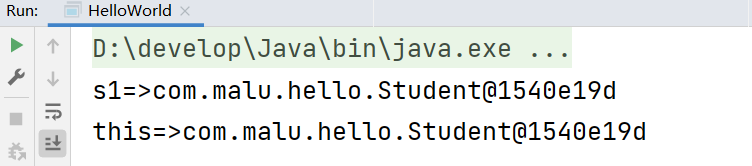
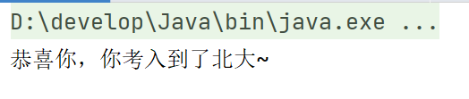
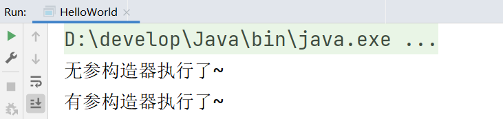
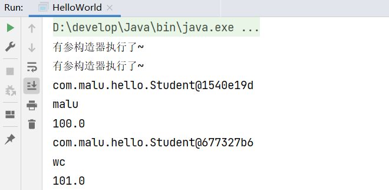

## 一，面向对象基础

### 1，什么是面向对象

所谓的面向对象，就是把要处理的数据和操作数据的方法，封装成一个对象，我们只需要操作这个对象就可以了。

我们之前讲过：

* JS中的面向对象
* TS中的面向对象

今天讲的Java中的面向对象和JS或TS中的面向对象类似。

对象是什么？

* 对象就是对数据和操作数据的方法进行的封装
* 有了类，我们就可以去new对象了
* 和JS一样，对象都是存储在堆区的，在栈区仅仅保存了地址

类和对象注意点：

* 类名首字母大写，满足驼峰命名
* 类中定义的变量叫成员变量，说白了就是封装的数据
* 类中定义的方法叫成员方法，说白了就是操作数据的
* 成员变量都有默认值（和基本类型默认值一样），在定义成员变量时，一般不赋初始
* 一个文件中，可以有多个类，但只能一个用public修饰，且public修饰的类名必须是文件名。

### 2，this和构造器

this是什么？

```java
package com.malu.hello;

class Student{
    public void fn(){
        // 想想，js中的new的实例原理
        System.out.println("this=>"+this); // this表示new出来的对象
    }
}

public class HelloWorld {
    public static void main(String[] args) {
        Student s1 = new Student();
        System.out.println("s1=>"+s1);  // s1是一个地址

        s1.fn();
    }
}
```

结果如下：



通过this在方法中可以访问本类对象的成员变量。代码演示：

```java
package com.malu.hello;

class Student{
    // 成员变量（数据）
    int no;
    double score;

    // 方法（操作数据的）
    public void fn(){
        System.out.println("this=>"+this); // this表示new出来的对象
    }
    public void gn(){
        if(this.score>80){
            System.out.println("恭喜你，你考入到了北大~");
        }
    }
}

public class HelloWorld {
    public static void main(String[] args) {
        Student s1 = new Student();
        s1.no = 1;
        s1.score = 88;

        s1.gn();
    }
}
```

运行结果如下：



构造器其实是一种特殊的方法，但是这个方法没有返回值类型，方法名必须和类名相同。构造器可以有形参，也可以没有形参，构造器是没有返回值类型。代码如下：

```java
package com.malu.hello;

class Student{
    // 无参构造器
    public Student(){
        System.out.println("无参构造器执行了~");
    }
    // 有叁构造器
    public Student(String name,double score){
        System.out.println("有参构造器执行了~");
    }
}

public class HelloWorld {
    public static void main(String[] args) {
        Student s1 = new Student();
        Student s2 = new Student("malu", 100);
    }
}
```

当new一个类时，构造器会自动执行，构造器执行完毕，就意味着这个对象创建完毕了。new的时候，如果传递了参数，那么就会调用有参构建器。效果如下：



在创建对象时，可以通过构造器给对象赋初始值。如下：

```java
package com.malu.hello;

class Student{
    // 成员属性（数据）
    String name;
    double score;

    // 无参构造器
    public Student(){
        System.out.println("无参构造器执行了~");
    }
    // 有叁构造器
    public Student(String name,double score){
        System.out.println("有参构造器执行了~");
        this.name = name;
        this.score = score;
    }
}

public class HelloWorld {
    public static void main(String[] args) {
        Student s1 = new Student("malu", 100);
        Student s2 = new Student("wc", 101);
        System.out.println(s1);
        System.out.println(s1.name);
        System.out.println(s1.score);
        System.out.println(s2);
        System.out.println(s2.name);
        System.out.println(s2.score);
    }
}
```

运行效果如下：



构造器的注意细节:

* 在设计一个类时，如果不写构造器，Java会自动生成一个无参数构造器。

  

```java
  package com.malu.hello;
  
  class Student{
      // 如果没有指定构造器，JAVA底层会帮我们创建一个无参的构造器
      String name;
      double score;
  }
  
  public class HelloWorld {
      public static void main(String[] args) {
          Student s1 = new Student();
          System.out.println(s1);
      }
  }
  ```

* 一定定义了有参数构造器，Java就不再提供空参数构造器，此时建议自己加一个无参数构造器。

  

```java
  package com.malu.hello;
  
  class Student{
      // 如果没有指定构造器，JAVA底层会帮我们创建一个无参的构造器
      String name;
      double score;
  
      // 手动写出无参构造器
      public Student(){}
  
      public Student(String name, double score){
          this.name = name;
          this.score = score;
      }
  }
  
  public class HelloWorld {
      public static void main(String[] args) {
          Student s1 = new Student("wc",100);
          Student s2 = new Student("xq",110);
  
          // 如果手动指定了有参构造器，创建对象时，必须指定参数
          // 如果不指定参数，它会调用无参构造器，
          // 由于你写了有参构造器，无参构造器，它默认就不会提供了
          // 所以我们需要手动地提供无参数构造器
          Student s3 = new Student();
      }
  }
  ```

无参构造器和有参构造器，是可能通过快捷键生的，如下：


生成的构造器如下：

```java
class Student{
    String name;
    double score;

    public Student() {
    }

    public Student(String name, double score) {
        this.name = name;
        this.score = score;
    }
}
```

### 3，封装

所谓的封装就是把数据和操作数据的方法封装到一个类（对象）中。封装的设计规范用8个字总结，就是：**合理隐藏、合理暴露**。

为什么要合理隐藏，合理暴露？

* 比如，设计一辆汽车时，汽车的发动机、变速箱等一些零件并不需要让每一个开车的知道，所以就把它们隐藏到了汽车的内部。把发动机、变速箱等这些零件隐藏起来，这样做其实更加安全，因为并不是所有人都很懂发动机、变速箱，如果暴露在外面很可能会被不懂的人弄坏。除了隐藏部分零件，但是还是得合理的暴露一些东西出来，让司机能够操纵汽车，让汽车跑起来。比如：点火按钮啊、方向盘啊、刹车啊、油门啊、档把啊... 这些就是故意暴露出来让司机操纵汽车的。


合理隐藏：

* 被private修饰的变量或者方法，只能在本类中被访问

合理暴露：

* 被public修饰的变量或方法，就可以在本类或类外访问

代码演示：

```java
package com.malu.hello;

class Student{
    // 成没变量没有修饰符修饰，默认是public
    // public 公有的，类内和类外都可以访问
    //String name;
    //double score;

    // private表示私有的，只有类内可以访问，类外是不以访问的
    private String name;
    private double score;

    // getScore是被访问public修饰的，所以类外也是可以访问的
    //private double getScore(){
    // getter（访问器）: 主要是用地访问类中私有的成员变量
    public double getScore(){
        //System.out.println(this.score);
        // 类内是可以访问私有的成员变量
        return score;
    }
    // setter（设置器）：主要是用来修改类中的成员变量
    public void setScore(double score){
        if(score >=0 && score<=100){
            this.score = score;
        }else{
            System.out.println("数据非法~");
        }
    }

    public Student() {
    }

    public Student(String name, double score) {
        this.name = name;
        this.score = score;
    }
}

public class HelloWorld {
    public static void main(String[] args) {
        Student s1 = new Student("wc",100);
        Student s2 = new Student("xq",110);
        //System.out.println(s1.name);
        //System.out.println(s1.score);

        System.out.println(s1.getScore());
        s1.setScore(666);
        System.out.println(s1.getScore());
    }
}
```

getter和setter可以自动生成，如下：


### 4，实体JavaBean

实体类就是一种特殊的类，它需要满足下面的要求：

* 类中成员变量都是私有的，并且对外提供getXxx和setXxx方法。
* 类中必须要有一个公共的无参构造器

实体类的作用：

* 实体类中除了有给对象存、取值的方法就没有提供其他方法了。所以实体类仅仅只是用来封装数据用的。

书写一个Student实例类：

```java
package com.malu.hello;

public class Student {
    private String name;
    private String sex;
    private double score;
    private int num;

    public Student() {
    }

    public Student(String name, String sex, double score, int num) {
        this.name = name;
        this.sex = sex;
        this.score = score;
        this.num = num;
    }

    public String getName() {
        return name;
    }

    public void setName(String name) {
        this.name = name;
    }

    public String getSex() {
        return sex;
    }

    public void setSex(String sex) {
        this.sex = sex;
    }

    public double getScore() {
        return score;
    }

    public void setScore(double score) {
        this.score = score;
    }

    public int getNum() {
        return num;
    }

    public void setNum(int num) {
        this.num = num;
    }
}
```

有了实体类，就可以去new了，new完之后，就可以得到对象，如下：

```java
package com.malu.hello;

//import com.malu.hello.Student;  // 这一行代码不用写

// 导入某个类，如果这个类文件是同包，那么就不需要手动导入
public class HelloWorld {
    public static void main(String[] args) {
        // s1和s2封装了4个数据
        Student s1 = new Student("wc", "man", 100, 1);
        Student s2 = new Student("xq", "man", 110, 2);
    }
}

```

实体类应用场景：

* 实体类仅仅只用来封装数据，而对数据的处理交给其他类来完成，以实现数据和数据业务处理相分离。

上面已经创建好了实体类，再创建一个业务处理的类，如下：

```java
package com.malu.hello;

public class StudentOperator {
    // Student是一个类型，是我们自己写的类型
    // 成员变量
    private Student student;

    public StudentOperator(Student student) {
        this.student = student;
    }

    public void printPass(){
        if(student.getScore() >= 60){
            System.out.println(student.getName() + "学生成绩及格");
        }else{
            System.out.println(student.getName() + "学生成绩不及格");
        }
    }
}
```

在main方法中，调用之，如下：

```java
package com.malu.hello;

public class HelloWorld {
    public static void main(String[] args) {
        Student s1 = new Student("wc", "man", 10, 1);
        Student s2 = new Student("xq", "man", 90, 2);

        StudentOperator studentOperator = new StudentOperator(s2);
        studentOperator.printPass();
    }
}
```

目前工程目录是这样的：


### 5，案例

需求：

* 想要展示系统中全部的电影信息（每部电影：编号、名称、价格）
* 允许用户根据电影的编号（id），查询出某个电影的详细信息
* 运行程序时，能够根据用户的选择，执行不同的功能

第一步：定义电影实体类，包含这部电影的相关信息，比如：电影的编号（id）、电影的名称（name）、电影的价格（price）、电影的分数（score）、电影的导演（director）、电影的主演（actor）、电影的简介（info）。 

定义Movie实体类：

```java

```

第二步：定义电影操作类，电影操作类中MovieOperator，需要有一个 `Movie[] movies;` 用来存储多部电影对象；在MovieOperator类中，提供对外提供，对电影数组进行操作的方法。如 `printAllMovies()` 用于打印数组中所有的电影信息， `searchMovieById(int id)` 方法根据id查找一个电影的信息并打印。

定义电影操作类MovieOperator类：

```java

```

第三步：定义测试类，准备好所有的电影数据，并用一个数组保存起来。每一部电影的数据可以封装成一个对象。然后把对象用数组存起来即可。

定义测试类Test，如下：

```java

```

### 6，成员变量和局部变量的区别

区别如下：


面向对象的核心点就是封装，将数据和数据的处理方式，都封装到对象中； 至于对象要封装哪些数据？对数据进行怎样的处理？ 需要通过类来设计。需要注意的是，不同的人，对同一个对象进行设计，对象封装那些数据，提供哪些方法，可能会有所不同；只要能够完成需求，符合设计规范，都是合理的设计。

## 二，常用API

### 1，包

API的翻译是Application Program Interface，叫应用程序接口，说白了，就是别人写好的一些程序，给咱们程序员直接拿去调用。Java官方其实已经给我们写好了很多很多类，每一个类中又提供了一系列方法来解决与这个类相关的问题。如：

* 比如String类，表示字符串，提供的方法全都是对字符串操作的。
* 比如ArrayList类，表示一个容器，提供的方法都是对容器中的数据进行操作的。

为什么要学习这些API？

* 不要重复造轮子

API分类：

* 官方的API，只需要学习一些常用的就行。
* 第三方的API，有的第三方API比官方的还好用。

在讲一些API之，我们先说一下包，Java官方提供的类有很多，为了对这些类进行分门别类的管理，别人把写好的类都是放在不同的包里的。包其实类似于文件夹，一个包中可以放多个类文件。

关于包的一些知识点：

* 要调用自己所在包下的其他程序，可以直接调用。（同一个包下的类，互相可以直接调用）
* 要调用其他包下的程序，则必须在当前程序中导包, 才可以访问！导包格式：`import 包名.类名`
* 要调用Java.lang包下的程序，不需要我们导包的，可以直接使用。
* 要调用多个不同包下的程序，而这些程序名正好一样，此时默认只能导入一个程序，另一个程序必须带包名访问。

代码演示：

```java

```

### 2，String类

Java为了方便我们处理字符串，所以给我们提供了一个String类来代表字符串，这个类就是 `java.lang` 包下。按照面向对象的编程思想，对于字符串的操作，只需要创建字符串对象，用字符串对象封装字符串数据，然后调用String类的方法就可以了。Java程序中的所有字符串字面值（如"abc"）都是字符串的实例实现，实例实例，其实指的就是字符串对象。

创建String对象的第一种方式：

```java
String s1 = "abc"; //这里"abc"就是一个字符串对象，用s1变量接收
```

创建String对象的第二种方式：

```java
String rs1 = new String();
System.out.println(rs1); // ""  空串

String rs2 = new String("malu");   // 根据传入字符串内容，来创建字符串对象
System.out.println(rs2);  

char[] chars = {'a', '中', '美'};  // 根据传入字符数组内容，来创建字符串对象
String rs3 = new String(chars);
System.out.println(rs3);

byte[] bytes = {97, 98, 99};  // 根据传入字节数组内容，来创建字符串对象
String rs4 = new String(bytes);
System.out.println(rs4);
```

学会了创建字符串，还需要知道都有哪些常用操作字符串的方法：


上面的API，不需要刻意去记忆，用的时候简单去查一下，用的多了，自然就记住了。代码如下：

```java
public class Test {
    public static void main(String[] args) {
        //目标：快速熟悉String提供的处理字符串的常用方法。
        String s = "hello Java";
        // 1、获取字符串的长度
        System.out.println(s.length());

        // 2、提取字符串中某个索引位置处的字符
        char c = s.charAt(1);
        System.out.println(c);

        // 字符串的遍历
        for (int i = 0; i < s.length(); i++) {
            // i = 0 1 2 3 4 5
            char ch = s.charAt(i);
            System.out.println(ch);
        }

        // 3、把字符串转换成字符数组，再进行遍历
        char[] chars = s.toCharArray();
        for (int i = 0; i < chars.length; i++) {
            System.out.println(chars[i]);
        }

        // 4、判断字符串内容，内容一样就返回true
        String s1 = new String("码路");
        String s2 = new String("码路");
        System.out.println(s1 == s2); // false
        System.out.println(s1.equals(s2)); // true

        // 5、忽略大小写比较字符串内容
        String c1 = "34AeFG";
        String c2 = "34aEfg";
        System.out.println(c1.equals(c2)); // false
        System.out.println(c1.equalsIgnoreCase(c2)); // true

        // 6、截取字符串内容 (包前不包后的)
        String s3 = "Java是最好的编程语言之一";
        String rs = s3.substring(0, 8);
        System.out.println(rs);

        // 7、从当前索引位置一直截取到字符串的末尾
        String rs2 = s3.substring(5);
        System.out.println(rs2);

        // 8、把字符串中的某个内容替换成新内容，并返回新的字符串对象给我们
        String info = "这个电影简直是个垃圾，垃圾电影！！";
        String rs3 = info.replace("垃圾", "**");
        System.out.println(rs3);

        // 9、判断字符串中是否包含某个关键字
        String info2 = "Java是最好的编程语言之一，我爱Java,Java不爱我！";
        System.out.println(info2.contains("Java"));
        System.out.println(info2.contains("java"));
        System.out.println(info2.contains("Java2"));

        // 10、判断字符串是否以某个字符串开头。
        String rs4 = "张三丰";
        System.out.println(rs4.startsWith("张"));
        System.out.println(rs4.startsWith("张三"));
        System.out.println(rs4.startsWith("张三2"));

        // 11、把字符串按照某个指定内容分割成多个字符串，放到一个字符串数组中返回给我们
        String rs5 = "张无忌,周芷若,殷素素,赵敏";
        String[] names = rs5.split(",");
        for (int i = 0; i < names.length; i++) {
            System.out.println(names[i]);
        }
    }
}
```

案例练习：

```java

```

关于字符串的注意细节：

* String对象的内容不可改变，被称为不可变字符串对象。
* 双引号写的字符串对象，会存储到字符串常量池中，且相同内容的字符串只存储一份。
* 通过new创建的字符串对象，每new一次都会产生一个新的对象存储到堆中。

关于字符串的注意细节，看如下代码：

```java
String name = "你好";
name += "Java";
```

只要是以 `“”` 方式写出的字符串对象，会在堆内存中的**字符串常量池**中存储，执行第一句话时，会在堆内存的常量池中，创建一个字符串对象 `“你好”` ，然后把 `“你好”` 的地址赋值给 `String name` 。当执行第二句话时，又会再堆内存的常量池中创建一个字符串 `“Java”` ，和 `“你好”` 拼接，拼接之后还会产生一个新的字符串对象 `”你好JAVA“` ，然后将新产生的 `“你好JAVA”` 对象的地址赋值给 `String name` 变量。

看如下代码：

```java
String s1 = "abc";
String s2 = "abc";
// 只要是以“...”方式写出的字符串对象，会存储到字符串常量池，且相同内容的字符串只存储一份；
System.out.println(s1==s1); // true   在字符串常量池中只有一份abc

char[] chs = {'a','b','c'};
// 通过new方式创建字符串对象，每new一次都会产生一个新的对象放在堆内存中
String s3 = new String(chs);
String s4 = new String(chs);
System.out.println(s1==s1); // false   只要new就是一个新的对象，一个新的地址
```

案例：系统正确的登录名和密码是amdin，123456, 。请在控制台开发一个登录界面，接收用户输入的登录名和密码，判断用户是否登录成功，登录成功后，展示：欢迎进入系统，即可停止程序，最多三次机会。

```java
/**
   目标：完成用户的登录案例。
 */
public class Test {
    public static void main(String[] args) {
        // 1、开发一个登录界面
        for (int i = 0; i < 3; i++) {
            Scanner sc = new Scanner(System.in);
            System.out.println("请您输入登录名称：");
            String loginName = sc.next();
            System.out.println("请您输入登录密码：");
            String passWord = sc.next();

            // 5、开始调用登录方法，判断是否登录成功
            boolean rs = login(loginName, passWord);
            if(rs){
                System.out.println("恭喜您，欢迎进入系统~~");
                break; // 跳出for循环，代表登录完成
            }else {
                System.out.println("登录名或者密码错误，请您确认~~");
            }
        }
    }

    /**
      2、开发一个登录方法，接收用户的登录名和密码，返回认证的结果
     */
    public static boolean login(String loginName, String passWord){
        // 3、准备一份系统正确的登录名和密码
        String okLoginName = "admin";
        String okPassWord = "123456";

        // 4、开始正式判断用户是否登录成功
        /*if(okLoginName.equals(loginName) && okPassWord.equals(passWord)){
            // 登录成功的
            return true;
        }else {
            return false;
        }*/
        return okLoginName.equals(loginName) && okPassWord.equals(passWord);
    }
}
```

需求：随机产生验证码，验证码的每位可能是数字，大写字母，小写字母。

```java
import java.util.Random;
/**
    目标：完成随机产生验证码，验证码的每位可能是数字、大写字母、小写字母
 */
public class Test {
    public static void main(String[] args) {
        System.out.println(createCode(4));
        System.out.println(createCode(6));
    }
    /**
       1、设计一个方法，返回指定位数的验证码
     */
    public static String createCode(int n){
        // 2、定义2个变量 
        //一个是记住最终产生的随机验证码 
        //一个是记住可能用到的全部字符
        String code = "";
        String data = "abcdefghijklmnopqrstuvwxyzABCDEFGHIJKLMNOPQRSTUVWXYZ0123456789";

        Random r = new Random();
        // 3、开始定义一个循环产生每位随机字符
        for (int i = 0; i < n; i++) {
            // 4、随机一个字符范围内的索引。
            int index = r.nextInt(data.length());
            // 5、根据索引去全部字符中提取该字符
            code += data.charAt(index); // code = code + 字符
        }
        // 6、返回code即可
        return code;
    }
}
```

### 3，ArrayList类

数组一旦创建大小不变，比如创建一个长度为3的数组，就只能存储3个元素，想要存储第4个元素就不行。而集合是大小可变的，想要存储几个元素就存储几个元素，在实际工作中用得更多。ArrayList就是一种集合，集合其实有很多，ArrayList只是其中的一种。

集合学习要点：

* 创建集合
* 调用集合中的方法对集合中的数据进行CRUD操作
* 集合有哪些特点

创建集合：

```java
// 创建一个ArrayList的集合对象，一般使用空参数构造方法
// ArrayList<String> list = new ArrayList<String>();
// 从jdk 1.7开始才支持的
ArrayList<String> list = new ArrayList<>();
```

集合中的方法：


上代码：

```java
public class ArrayListDemo1 {
    public static void main(String[] args) {
        ArrayList<String> list = new ArrayList<>();

        list.add("你好");
        list.add("世界");
        list.add("Java");
        System.out.println(list);

        // 2、往集合中的某个索引位置处添加一个数据
        list.add(1, "MySQL");
        System.out.println(list);

        // 3、根据索引获取集合中某个索引位置处的值
        String rs = list.get(1);
        System.out.println(rs);

        // 4、获取集合的大小（返回集合中存储的元素个数）
        System.out.println(list.size());

        // 5、根据索引删除集合中的某个元素值，会返回被删除的元素值给我们
        System.out.println(list.remove(1));
        System.out.println(list);

        // 6、直接删除某个元素值，删除成功会返回true，反之
        System.out.println(list.remove("Java"));
        System.out.println(list);

        list.add(1, "html");
        System.out.println(list);

        // 默认删除的是第一次出现的这个黑马的数据的
        System.out.println(list.remove("你好"));
        System.out.println(list);

        // 7、修改某个索引位置处的数据，修改后会返回原来的值给我们
        System.out.println(list.set(1, "码路"));
        System.out.println(list);
    }
}
```

案例：

现在假如购物车中存储了如下商品：枸杞，Java入门，宁夏枸杞，黑枸杞，人字拖，特级枸杞，枸杞子。现在用户不想买枸杞了，选择批量删除，完成需求。

```java
public class Test {
    public static void main(String[] args) {
        // 1、创建一个ArrayList集合对象
        ArrayList<String> list = new ArrayList<>();
        list.add("枸杞");
        list.add("Java入门");
        list.add("宁夏枸杞");
        list.add("黑枸杞");
        list.add("人字拖");
        list.add("特级枸杞");
        list.add("枸杞子");
        System.out.println(list);
        //运行结果如下： [Java入门, 宁夏枸杞, 黑枸杞, 人字拖, 特级枸杞, 枸杞子]
       
        // 2、开始完成需求：从集合中找出包含枸杞的数据并删除它
        for (int i = 0; i < list.size(); i++) {
            // i = 0 1 2 3 4 5
            // 取出当前遍历到的数据
            String ele = list.get(i);
            // 判断这个数据中包含枸杞
            if(ele.contains("枸杞")){
                // 直接从集合中删除该数据
                list.remove(ele);
            }
        }
        System.out.println(list);
        //删除后结果如下：[Java入门, 黑枸杞, 人字拖, 枸杞子]
    }
}
```

分析上面的程序执行不成功的原因。对应的解决办完：

```java
// 方式一：每次删除一个数据后，就让i往左边退一步
for (int i = 0; i < list.size(); i++) {
    // i = 0 1 2 3 4 5
    // 取出当前遍历到的数据
    String ele = list.get(i);
    // 判断这个数据中包含枸杞
    if(ele.contains("枸杞")){
        // 直接从集合中删除该数据
        list.remove(ele);
        i--;
    }
}
System.out.println(list);

// 方式二：从集合的后面倒着遍历并删除
for (int i = list.size() - 1; i >= 0; i--) {
    // 取出当前遍历到的数据
    String ele = list.get(i);
    // 判断这个数据中包含枸杞
    if(ele.contains("枸杞")){
        // 直接从集合中删除该数据
        list.remove(ele);
    }
}
System.out.println(list);
```

案例：完成菜品上架，以及菜品信息浏览器功能。使用ArrayList和面向对象编程。

分析需求发现：

1. 在外卖系统中，每一份菜都包含，菜品的名称、菜品的原价、菜品的优惠价、菜品的其他信息。那我们就可以定义一个菜品类（Food类），用来描述每一个菜品对象要封装那些数据。

2. 接着再写一个菜品管理类（FoodManager类），提供展示操作界面、上架菜品、浏览菜品的功能。

   

   

首先我们先定义一个菜品类（Food类），用来描述每一个菜品对象要封装那些数据。

```java
public class Food {
    private String name;	//菜品名称
    private double originalPrice; //菜品原价
    private double specialPrice; //菜品优惠价
    private String info; //菜品其他信息

    public Food() {
    }

    public Food(String name, double originalPrice, double specialPrice, String info) {
        this.name = name;
        this.originalPrice = originalPrice;
        this.specialPrice = specialPrice;
        this.info = info;
    }

    public String getName() {
        return name;
    }

    public void setName(String name) {
        this.name = name;
    }

    public double getOriginalPrice() {
        return originalPrice;
    }

    public void setOriginalPrice(double originalPrice) {
        this.originalPrice = originalPrice;
    }

    public double getSpecialPrice() {
        return specialPrice;
    }

    public void setSpecialPrice(double specialPrice) {
        this.specialPrice = specialPrice;
    }

    public String getInfo() {
        return info;
    }

    public void setInfo(String info) {
        this.info = info;
    }
}
```

定义菜品管理类FoodManager，提供上架菜品的功能、浏览菜品的功能、展示操作界面的功能。

```java
public class FoodManager{
    //为了存储多个菜品，预先创建一个ArrayList集合；
    //上架菜品时，其实就是往集合中添加菜品对象
    //浏览菜品时，其实就是遍历集合中的菜品对象，并打印菜品对象的属性信息。
    private ArrayList<Food> foods = new ArrayList<>(); 
    //为了在下面的多个方法中，能够使用键盘录入，提前把Scanner对象创建好；
    private Scanner sc = new Scanner(System.in);
   
    /**
     1、商家上架菜品
     */
    public void add(){
        System.out.println("===菜品上架==");
        // 2、提前创建一个菜品对象，用于封装用户上架的菜品信息
        Food food = new Food();
        System.out.println("请您输入上架菜品的名称：");
        String name = sc.next();
        food.setName(name);

        System.out.println("请您输入上架菜品的原价：");
        double originalPrice = sc.nextDouble();
        food.setOriginalPrice(originalPrice);

        System.out.println("请您输入上架菜品的优惠价：");
        double specialPrice = sc.nextDouble();
        food.setSpecialPrice(specialPrice);

        System.out.println("请您输入上架菜品的其他信息：");
        String info = sc.next();
        food.setInfo(info);

        // 3、把菜品对象添加到集合容器中去
        foods.add(food);
        System.out.println("恭喜您，上架成功~~~");
    }

    /**
       2、菜品；浏览功能
     */
    public void printAllFoods(){
        System.out.println("==当前菜品信息如下：==");
        for (int i = 0; i < foods.size(); i++) {
            Food food = foods.get(i);
            System.out.println("菜品名称：" + food.getName());
            System.out.println("菜品原价：" + food.getOriginalPrice());
            System.out.println("菜品优惠价：" + food.getSpecialPrice());
            System.out.println("其他描述信息：" + food.getInfo());
            System.out.println("------------------------");
        }
    }
    /**
    3、专门负责展示系统界面的
    */
    public void start(){
        while (true) {
            System.out.println("====欢迎进入商家后台管理系统=====");
            System.out.println("1、上架菜品（add）");
            System.out.println("2、浏览菜品（query）");
            System.out.println("3、退出系统（exit）");
            System.out.println("请您选择操作命令：");
            String command = sc.next();
            switch (command) {
                case "add":
                    add();
                    break;
                case "query":
                    printAllFoods();
                    break;
                case "exit":
                    return; // 结束当前方法！
                default:
                    System.out.println("您输入的操作命令有误~~");
            }
        }
	}
}
```

测试类Test，在测试类中进行测试。其实测试类，只起到一个启动程序的作用。

```java
public class Test {
    public static void main(String[] args) {
        FoodManager manager = new FoodManager();
        manager.start();
    }
}
```
