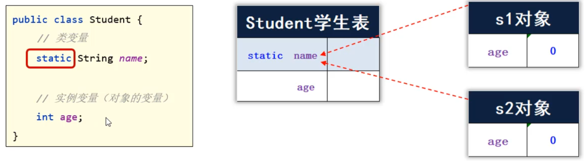
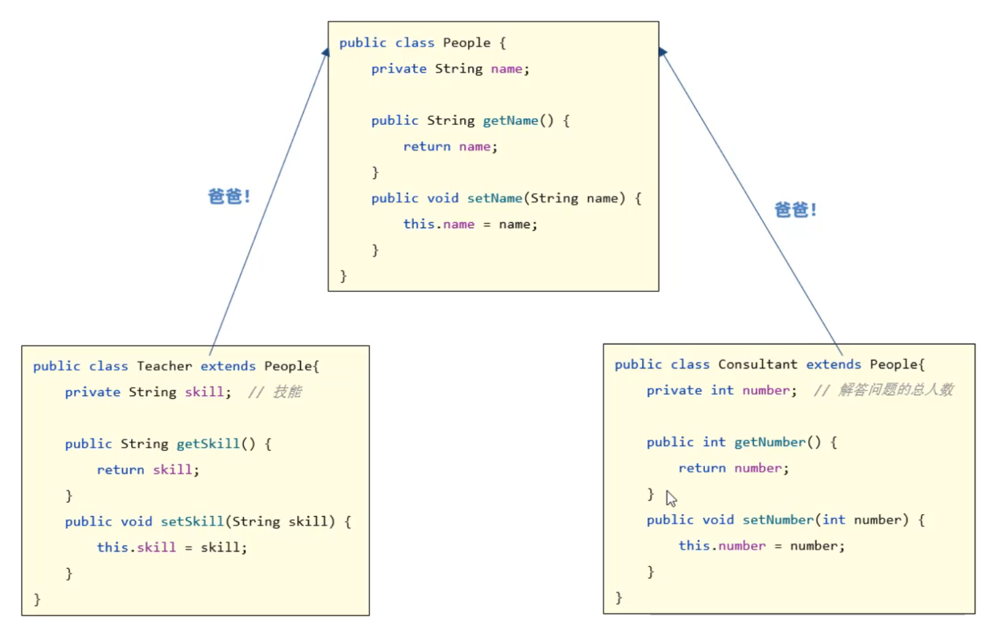
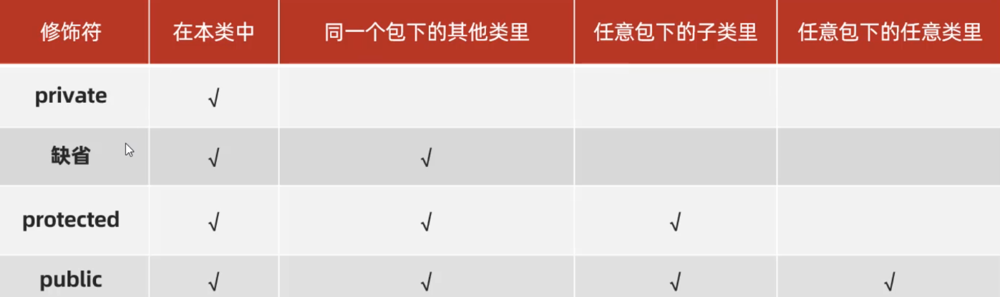
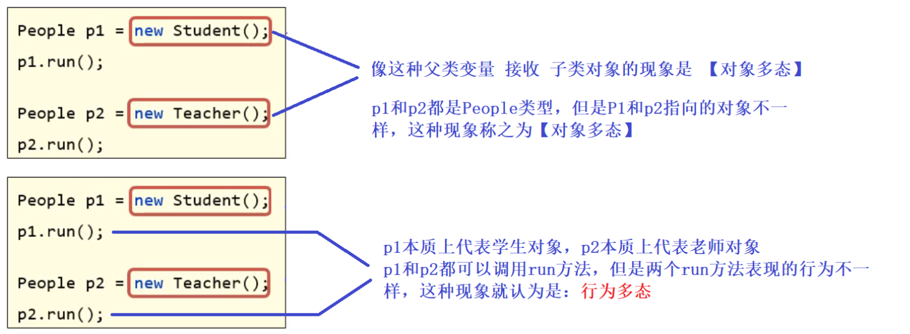

## 一，静态

面向对象最核心的套路是：**设计对象来处理数据，解决问题。** 学习OOP进阶，目的就是让我们设计出来的对象更加好用。接下来，我们会学习很多小的知识点，这些小的知识点需要我们尽可能学生，到后面我们利用这些知识点去设计对象。

### 1，Static修饰成员变量

先学习一个static关键字，static读作静态，可以用来修饰成员变量，也能修饰成员方法。当static修饰成员变量时，被static修饰的成员变量，叫类变量，反之叫实例变量。

* 类变量：有static修饰，属于类，在计算机中只有一份，会被类的全部对象共享，用类名调用。
* 实例变量：无static修饰，属于每个对象的，每一个对象都有一份，用对象调用。



访问或调用方式：

* 由于静态变量是属于类的，只需要通过类名就可以调用：**类名. 静态变量**
* 实例变量是属于对象的，需要通过对象才能调用：**对象. 实例变量**

代码：

```java
public class Student {
    // 类变量
    static String name;
    // 实例变量（对象的变量）
    int age;
}

public class Test {
    public static void main(String[] args) {
        // 1、类变量的用法。
        // 类名.类变量（推荐）
        Student.name = "袁华";

        // 对象.类变量（不推荐）
        Student s1 = new Student();
        s1.name = "马冬梅";

        Student s2 = new Student();
        s2.name = "秋雅";

        System.out.println(s1.name); // 秋雅
        System.out.println(Student.name); // 秋雅

        // 2、实例变量的用法：属于每个对象的变量
        // 对象.实例变量
        s1.age = 23;
        s2.age = 18;
        System.out.println(s1.age); // 23

        // System.out.println(Student.age); // 报错
    }
}
```

在实际开发中，如果某个数据只需要一份，且希望能够被共享（访问、修改），则该数据可以定义成类变量来记住。需求：系统启动后，要求用于类可以记住自己创建了多少个用户对象。

第一步：先定义一个 `User` 类，在用户类中定义一个static修饰的变量，用来表示在线人数；

```java
public class User {
    // 类变量
    public static int number;

    public User(){
        // User.number++;
        // 注意：在同一个类中，访问自己类的类变量，才可以省略类名不写。
        number++;
    }
}
```

第二步：再写一个测试类，再测试类中创建4个User对象，再打印number的值，观察number的值是否再自增。

```java
public class Test{
    public static void main(String[] args){
        //创建4个对象
        new User();
        new User();
        new User();
        new User(); 
        
        //查看系统创建了多少个User对象
        System.out.println("系统创建的User对象个数："+User.number);
    }
}
```

### 2，Static修饰成员方法

成员方法根据有无static也分为两类：**类方法、实例方法**

* 类方法：有static修饰的成员方法，属于类。调用时直接用类名调用即可。
* 实例方法：无static修饰的成员方法，属于对象。调用时，需要使用对象调用。

定义一个Student类，在类中定义一个类方法、定义一个实例方法：

```java
public class Student {
    double score;
    // 类方法
    public static void printHelloWorld(){
        System.out.println("Hello World");
        System.out.println("Hello World");
    }

    // 实例方法（对象的方法）
    public void printPass(){
        System.out.println("成绩：" +
                (score >= 60 ? "及格": "不及格"));
    }
}
```

在定义一个测试类，注意类方法、对象方法调用的区别：

```java
public class Test {
    public static void main(String[] args) {
        // 1、类方法的用法
        // 类名.类方法（推荐）
        Student.printHelloWorld();

        // 对象.类方法（不推荐）
        Student s = new Student();
        s.printHelloWorld();

        // 2、实例方法的用法
        // 对象.实例方法
        s.printPass();
        // Student.printPass(); // 报错
    }
}
```

类方法细节：

* static修饰的方法，可以被类名调用，是因为它是随着类的加载而加载的，所以类名直接就可以找到static修饰的方法。
* 非static修饰的方法，需要创建对象后才能调用，是因为实例方法中可能会访问实例变量，而实例变量需要创建对象后才存在。所以实例方法，必须创建对象后才能调用。

### 3，工具类

类方法的一个应用场景之一就是做工具类，一个工具类它里面的方法可以全都是静态的，那么这个类中的方法就全都可以被类名直接调用，调用起来非常方便。

实现一个生厉验证码的工具类：

```java
import java.util.Random;

public class MyUtil {
    public static String createCode(int n){
        String code = "";
        String data = "abcdefghijklmnopqrstuvwxyzABCDEFGHIJKLMNOPQRSTUVWXYZ0123456789";

        Random r = new Random();
        // 2、开始定义一个循环产生每位随机字符
        for (int i = 0; i < n; i++) {
            // 3、随机一个字符范围内的索引。
            int index = r.nextInt(data.length());
            // 4、根据索引去全部字符中提取该字符
            code += data.charAt(index); // code = code + 字符
        }
        return code;
    }
}
```

调用 `MyUtils` 的 `createCOde()方法` 产生任意个数的验证码：

```java
public class Test{
    public static void main(String[] args){
        System.out.println(MyUtils.createCode());
    }
}
```

工具类里的方法全都是静态的，推荐用类名调用为了防止使用者用对象调用。我们可以把工具类的构造方法私有化。如下：

```java
import java.util.Random;

public class MyUtil {
    // 私有化构造方法：这样别人就不能使用构造方法new对象了
    private MyUtil(){
    }

    public static String createCode(int n){
        String code = "";
        String data = "abcdefghijklmnopqrstuvwxyzABCDEFGHIJKLMNOPQRSTUVWXYZ0123456789";

        Random r = new Random();
        // 2、开始定义一个循环产生每位随机字符
        for (int i = 0; i < n; i++) {
            // 3、随机一个字符范围内的索引。
            int index = r.nextInt(data.length());
            // 4、根据索引去全部字符中提取该字符
            code += data.charAt(index); // code = code + 字符
        }
        return code;
    }
}
```

### 4，Static注意事项

注意事项：

* 类方法中可以直接访问类的成员，不可以直接访问实例成员。

* 实例方法中即可以直接访问类成员，也可以直接访问实例成员。

* 实例方法中可以出现this关键字，类方法中不可以出现this关键字。

代码：

```java
public class Student {
    static String schoolName; // 类变量
    double score; // 实例变量

    // 1、类方法中可以直接访问类的成员，不可以直接访问实例成员。
    public static void printHelloWorld(){
        // 注意：同一个类中，访问类成员，可以省略类名不写。
        schoolName = "中国";
        printHelloWorld2();

        // System.out.println(score); // 报错的
        // printPass(); // 报错的

        // System.out.println(this); // 报错的
    }

    // 类方法
    public static void printHelloWorld2(){

    }

    // 2、实例方法中既可以直接访问类成员，也可以直接访问实例成员。
    // 实例方法
    // 3、实例方法中可以出现this关键字，类方法中不可以出现this关键字的
    public void printPass(){
        schoolName = "中国2";
        printHelloWorld2();

        System.out.println(score);
        printPass2();

        System.out.println(this);
    }

    // 实例方法
    public void printPass2(){

    }
}
```

### 5，代码块

代码块根据有无static修饰分为两种：静态代码块、实例代码块

* 静态代码块，类加载时自动执行，类只会加载一次，所以静态代码块也只会加载一次。可以大静态代码块中，对类变量进行初始化赋值。静态代码块不需要创建对象就能够执行。
* 每次创建对象，就会执行实例代码块，在构造器之前执行。和构造器一样，都是用来完成对象初始化的，可以对实例变量进行初始化赋值。作用和构造器作用是一样的。

静态代码块和实例代码块代码：

```java
public class Student {
    static int number = 80;
    static String schoolName = "北大";
    // 静态代码块
    static {
        System.out.println("静态代码块执行了~~");
        // schoolName = "北大";
    }
    int age;
    // 实例代码块
    {
        System.out.println("实例代码块执行了~~");
        // age = 18;
        System.out.println("有人创建了对象：" + this);
    }

    public Student(){
        System.out.println("无参数构造器执行了~~");
    }

    public Student(String name){
        System.out.println("有参数构造器执行了~~");
    }
}

public class Test {
    public static void main(String[] args) {
        // 目标：认识两种代码块，了解他们的特点和基本作用。
        System.out.println(Student.number);
        System.out.println(Student.number);
        System.out.println(Student.number);

        System.out.println(Student.schoolName); // 北大

        System.out.println("---------------------------------------");
        Student s1 = new Student();
        Student s2 = new Student("张三");
        System.out.println(s1.age);
        System.out.println(s2.age);
    }
}
```

### 6，单例

单例设计模式，所谓设计模式指的是，一类问题可能会有多种解决方案，而设计模式是在编程实践中，多种方案中的一种最优方案。讲两种单例：

* 饿汉式单例
* 懒汉式单例

饿汉式单例：

```java
public class A {
    // 2、定义一个类变量记住类的一个对象
    private static A a = new A();

    // 1、必须私有类的构造器
    private A(){

    }

    // 3、定义一个类方法返回类的对象
    public static A getObject(){
        return a;
    }
}

public class Test {
    public static void main(String[] args) {
        // 目标：掌握单例设计模式的写法。
        A a1 = A.getObject();
        A a2 = A.getObject();
        System.out.println(a1);
        System.out.println(a2);
    }
}
```

懒汉式单例:

```java
public class B {
    // 2、定义一个类变量，用于存储这个类的一个对象。
    private static B b;

    // 1、把类的构造器私有
    private B(){

    }

    // 3、定义一个类方法，这个方法要保证第一次调用时才创建一个对象，后面调用时都会用这同一个对象返回。
    public static B getInstance(){
        if(b == null){
            System.out.println("第一次创建对象~");
            b = new B();
        }
        return b;
    }
}

public class Test {
    public static void main(String[] args) {
        B b1 = B.getInstance(); // 第一次拿对象
        B b2 = B.getInstance();
        System.out.println(b1 == b2);
    }
}
```

## 二，继承

### 1，什么是继承

面向对象的三大特征：

* 封装
* 继承
* 多态

子类能继承父类的非私有成员（成员变量和成员方法），创建子类对象是由子类和父类共同完成的。代码演示：

```java
public class A {
    // 公开成员
    public int i;
    public void print1(){
        System.out.println("===print1===");
    }

    // 私有成员
    private int j;
    private void print2(){
        System.out.println("===print2===");
    }
}

// 子类
public class B extends A{
    private int k;
    // 子类是可以继承父类的非私有成员
    public void print3(){
        System.out.println(i);
        print1();

        // System.out.println(j);
        // print2();
    }
}

public class Test {
    public static void main(String[] args) {
        B b = new B();
        System.out.println(b.i);
        // System.out.println(b.j);
        // System.out.println(b.k);

        b.print1();
        //b.print2();
        b.print3();
    }
}
```

### 2，继承的好处

如果多个类，有相同的代码，可以把相同的代码抽到一个类中，让别人类去继承这个类，这样可以提高代码的复用性。**继承可以提高代码的复用性**，如下：



代码如下：

```java
// 父类 People，用来设计Teacher和Consultant公有的成员
public class People{
    private String name;
    
    public String getName(){
        return name;
    }
    public void setName(String name){
        this.name=name;
    }
}

// 子类Teacher继承People类，同时在子类中加上自己特有的成员。
public class Teacher extends People{
    private String skill; //技能
    
    public String getSkill(){
        return skill;
    }
    
    public void setSkill(String skill){
        this.skill=skill;
    }
    
    public void printInfo(){
        System.out.println(getName()+"具备的技能："+skill);
    }
}

// 测试类，再测试类中创建Teacher对象，并调用方法
public class Test {
    public static void main(String[] args) {
        Teacher t = new Teacher();
        t.setName("wc");
        t.setSkill("Java、Spring");
        System.out.println(t.getName());
        System.out.println(t.getSkill());
        t.printInfo();
    }
}
```

### 3，权限修饰符

之前我们使用过两个修饰符，一个public，一个private，实际上还有两个权限修饰符，如下：

* protectedd 受保护的
* 缺省（不写任何修饰符）

权限修饰符是用来限制类的成员（成员变量、成员方法、构造器...）能够被访问的范围。



演示本类中可以访问到哪些权限修饰的方法，如下：

```java
public class Fu {
    // 1、私有:只能在本类中访问
    private void privateMethod(){
        System.out.println("==private==");
    }

    // 2、缺省：本类，同一个包下的类
    void method(){
        System.out.println("==缺省==");
    }

    // 3、protected: 本类，同一个包下的类，任意包下的子类
    protected void protectedMethod(){
        System.out.println("==protected==");
    }

    // 4、public： 本类，同一个包下的类，任意包下的子类，任意包下的任意类
    public void publicMethod(){
        System.out.println("==public==");
    }

    public void test(){
        //在本类中，所有权限都可以被访问到
        privateMethod(); //正确
        method(); //正确
        protectedMethod(); //正确
        publicMethod(); //正确
    }
}

// 测试类
public class Test {
    public static void main(String[] args) {
        Fu f = new Fu();
		f.test();
    }
}
```

演示同一个包下可以访问到哪些权限修饰的方法。

```java
public class Fu {
    // 1、私有:只能在本类中访问
    private void privateMethod(){
        System.out.println("==private==");
    }

    // 2、缺省：本类，同一个包下的类
    void method(){
        System.out.println("==缺省==");
    }

    // 3、protected: 本类，同一个包下的类，任意包下的子类
    protected void protectedMethod(){
        System.out.println("==protected==");
    }

    // 4、public： 本类，同一个包下的类，任意包下的子类，任意包下的任意类
    public void publicMethod(){
        System.out.println("==public==");
    }

    public void test(){
        //在本类中，所有权限都可以被访问到
        privateMethod(); //正确
        method(); //正确
        protectedMethod(); //正确
        publicMethod(); //正确
    }
}

public class Test {
    public static void main(String[] args) {
        Fu f = new Fu();
        // f.privateMethod();	//私有方法无法使用
        f.method();
        f.protectedMethod();
        f.publicMethod();
    }
}
```

演示不同包下的子类中可以访问哪些权限修饰的方法。在另一个包下创建一个Fu类的子类，

```java
public class Zi extends Fu {
    public void test(){
        // privateMethod(); // 报错
        // method(); // 报错
        protectedMethod();
        publicMethod();
    }
}

// 测试类
public class Test {
    public static void main(String[] args) {
        Zi zi = new Zi();
        zi.test();
    }
}
```

### 4，单继承，Object

**Java语言只支持单继承，不支持多继承，但是可以多层继承**。代码如下：

```java
public class Test {
    public static void main(String[] args) {
        // 1、Java是单继承的：一个类只能继承一个直接父类；Java中的类不支持多继承，但是支持多层继承。
        // 2、Object类是Java中所有类的祖宗。
        A a = new A();

        B b = new B();

        ArrayList list = new ArrayList();
        list.add("java");
        System.out.println(list.toString());
    }
}

class A {} //extends Object{}
class B extends A{}
// class C extends B , A{} // 报错
class D extends B{}
```

### 5，方法重写

当子类觉得父类方法不好用，或者无法满足父类需求时，子类可以重写一个方法名称、参数列表一样的方法，去覆盖父类的这个方法，这就是方法重写。

A类是父类：

```java
public class A {
    public void print1(){
        System.out.println("111");
    }

    public void print2(int a, int b){
        System.out.println("111111");
    }
}
```

再写一个B类，当成子类，重写上面两个方法：

```java
public class B extends A{
    // 1)重写的方法上面，可以加一个注解@Override,用于标注这个方法是复写的父类方法
    // 2)子类复写父类方法时，访问权限必须大于或者等于父类方法的权限
    // 	 public > protected > 缺省
    // 3)重写的方法返回值类型，必须与被重写的方法返回值类型一样，或者范围更小
    // 4)私有方法、静态方法不能被重写，如果重写会报错。
    @Override // 安全，可读性好
    public void print1(){
        System.out.println("666");
    }

    // 方法重写
    @Override
    public void print2(int a, int b){
        System.out.println("666666");
    }
}
```

测试类：

```java
public class Test {
    public static void main(String[] args) {
        B b =  new B();
        b.print1();
        b.print2(2, 3);
    }
}
```

关于这些注意事项，同学们其实只需要了解一下就可以了。实际上我们实际写代码时，只要和父类写的一样就可以。总结起来就8个字，**声明不变，重新实现**

重写的应用场景之一，重写toString方法，如下：

```java
public class Student extends Object{
    private String name;
    private int age;

    public Student() {
    }

    public Student(String name, int age) {
        this.name = name;
        this.age = age;
    }

    public String getName() {
        return name;
    }

    public void setName(String name) {
        this.name = name;
    }

    public int getAge() {
        return age;
    }

    public void setAge(int age) {
        this.age = age;
    }
}

public class Test {
    public static void main(String[] args) {
        Student s = new Student("wc", 19);
        // System.out.println(s.toString());
        // 直接通过Student对象调用Object的toString()方法，会得到对象的地址值。
        System.out.println(s); 
    }
}
```

此时不想调用父类Object的toString()方法，那就可以在Student类中重新写一个toSting()方法，用于返回对象的属性值。代码如下：

```java
public class Student extends Object{
    private String name;
    private int age;

    public Student() {
    }

    public Student(String name, int age) {
        this.name = name;
        this.age = age;
    }

    public String getName() {
        return name;
    }

    public void setName(String name) {
        this.name = name;
    }

    public int getAge() {
        return age;
    }

    public void setAge(int age) {
        this.age = age;
    }

    @Override
    public String toString() {
        return "Student{" +
                "name='" + name + '\'' +
                ", age=" + age +
                '}';
    }
}
```

### 6，子类访问成员的特点

子类和父类有相同成员的情况，在子类中访问其他成员（成员变量、成员方法），是依据就近原则的。如下：

```java
public class F {
    String name = "父类名字";

    public void print1(){
        System.out.println("==父类的print1方法执行==");
    }
}

public class Z extends F {
    String name = "子类名称";
    public void showName(){
        String name = "局部名称";
        System.out.println(name); // 局部名称
    }

    @Override
    public void print1(){
        System.out.println("==子类的print1方法执行了=");
    }

    public void showMethod(){
        print1(); // 子类的
    }
}
```

测试方法：

```java
public class Test {
    public static void main(String[] args) {
        // 目标：掌握子类中访问其他成员的特点：就近原则。
        Z z = new Z();
        z.showName();
        z.showMethod();
    }
}
```

子类和父类出现同名变量或者方法，优先使用子类的；此时如果一定要在子类中使用父类的成员，可以加this或者super进行区分。如下：

```java
public class Z extends F {
    String name = "子类名称";

    public void showName(){
        String name = "局部名称";
        System.out.println(name); // 局部名称
        System.out.println(this.name); // 子类成员变量
        System.out.println(super.name); // 父类的成员变量
    }

    @Override
    public void print1(){
        System.out.println("==子类的print1方法执行了=");
    }

    public void showMethod(){
        print1(); // 子类的
        super.print1(); // 父类的
    }
}
```

### 7，子类访问构造器的特点

子类全部构造器，都会先调用父类构造器，再执行自己。如下：

```java
class F{
    public F(){
        System.out.println("---父类F的 无参构造器 执行了 ---");
    }
}
class Z extends F{
    public Z(){
        // super() // 默认是存在的
        System.out.println("---子类Z的 无参构造器 执行了 ---");
    }
    public Z(String name){
        // super() // 默认是存在的
        System.out.println("---子类Z的 有参构造器 执行了 ---");
    }
}

public class Test {
    public static void main(String[] args) {
        Z z = new Z();
        Z z2 = new Z("wc");
    }
}
```

如果不想使用默认的 `super()` 方式调用父类构造器，还可以手动使用 `super(参数)` 调用父类有参数构造器。代码：

```java
package com.malu;

class F{
    private String name;
    private int age;
    public F(){
    }
    public F(String name,int age){
        this.name = name;
        this.age = age;
    }
}
class Z extends F{
    private String skill;
    public Z(){
    }
    public Z(String name,int age,String skill){
        super(name,age); // 默认是存在的
        this.skill = skill;
    }
}

public class Test {
    public static void main(String[] args) {
        Z z2 = new Z("wc",10,"全栈");
    }
}
```

访问自己类的构造器。通过this()或this(参数)来调用，代码如下：

```java
class Z {
    private String name;
    private int age;
    private String skill;

    public Z(String name,int age){
        this.name = name;
        this.age = age;
    }
    public Z(String name,int age,String skill){
        this(name,age);
        this.skill = skill;
    }
}

public class Test {
    public static void main(String[] args) {
        Z z2 = new Z("wc",10,"全栈");
    }
}
```

总结this和super的使用：

```java
访问本类成员：
	this.成员变量	//访问本类成员变量
	this.成员方法	//调用本类成员方法
	this()		   //调用本类空参数构造器
    this(参数)	  //调用本类有参数构造器
    
访问父类成员：
	super.成员变量	//访问父类成员变量
	super.成员方法	//调用父类成员方法
	super()		   //调用父类空参数构造器
    super(参数)	  //调用父类有参数构造器
    
this和super访问构造方法，只能用到构造方法的第一句，否则会报错。
```

## 三，多态

### 1，什么是多态

多态是在继承、实现情况下的一种现象，表现为：对象多态、行为多态。比如：Teacher和Student都是People的子类，代码可以写成下面的样子



代码：

```java
public class People {
    String name = "父类";
    public void run(){
        System.out.println("人会跑");
    }
}

public class Student extends People{
    String name = "学生";
    @Override
    public void run() {
        System.out.println("学生跑的飞快~~~");
    }

    public void study(){
        System.out.println("学生好好学习~~~");
    }
}

public class Teacher extends People{
    String name = "老师";
    @Override
    public void run() {
        System.out.println("老师跑的比较慢~~~");
    }

    public void teach(){
        System.out.println("老师教授Java~~~");
    }
}

public class Test {
    public static void main(String[] args) {
        // 目标：认识多态
        People p1 = new Teacher();
        System.out.println(p1.name);
        p1.run();

        People p2 = new Student();
        System.out.println(p2.name);
        p2.run();
    }
}
```

多态的好处：在多态形式下，左边的代码是解耦合的，更便于扩展和维护。定义方法时，使用父类类型作为形参，可以接收一切子类对象，扩展行更强，更便利。代码如下：

```java
public class Test {
    public static void main(String[] args) {
        // 目标：掌握使用多态的好处，以及多态下的类型转换问题。
//        People p1 = new Student();
//        p1.run();

//        Teacher t = new Teacher();
//        go(t);

        Student s = new Student();
        go(s);
    }

    public static void go(People p){
        System.out.println("开始------------------------");
        p.run();
        System.out.println("结束------------------------");
    }
}
```

### 2，类型转化

虽然多态形式下有一些好处，但是也有一些弊端。在多态形式下，不能调用子类特有的方法，比如在Teacher类中多了一个teach方法，在Student类中多了一个study方法，这两个方法在多态形式下是不能直接调用的。代码如下：

```java
public class Test {
    public static void main(String[] args) {
        // 目标：认识多态
        People p1 = new Teacher();
        p1.teach();  // 不OK

        People p2 = new Student();
        p2.study();  // 不OK
    }
}
```

也就是说多态形式下不能直接调用子类特有方法，但是转型后是可以调用的。这里所说的转型就是把父类变量转换为子类类型。格式如下：

```java
//如果p接收的是子类对象
if(父类变量 instance 子类){
    //则可以将p转换为子类类型
    子类 变量名 = (子类)父类变量;
}
```

代码：

```java
public class Test2 {
    public static void main(String[] args) {
        Student s = new Student();
        go(s);
    }

    public static void go(People p){
        System.out.println("开始------------------------");
        p.run();
        if(p instanceof Student){
            Student s = (Student) p; // 把p强制转化厉Student类型
            s.study();  // 此时就可以调用Student粝的study方法了
        }else if(p instanceof Teacher){
            Teacher t = (Teacher) p; // 把p强制转化成Teacher类型
            t.teach();
        }
        System.out.println("结束------------------------");
    }
}
```

如果类型转换错了，就会出现类型转换异常ClassCastException，比如把Teacher类型转换成了Student类型，如下：

```java
public class Test {
    public static void main(String[] args) {
        Student s = new Student();
        go(s);
    }

    public static void go(People p){
        System.out.println("开始------------------------");
        p.run();
        Teacher t = (Teacher) p; // p是学生，把p强制化成Teacher
        System.out.println("结束------------------------");
    }
}
```

结论：关于多态转型问题，**原本是什么类型，才能还原成什么类型**
