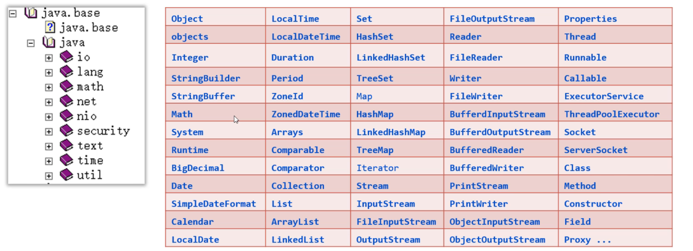
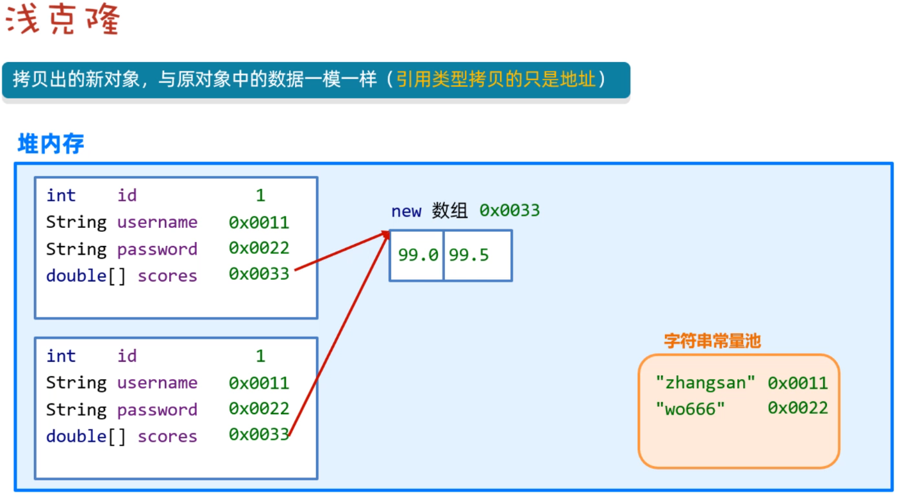
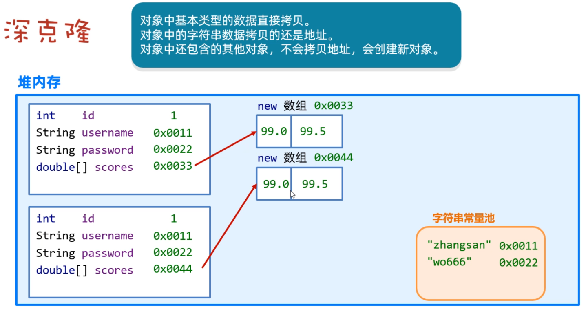
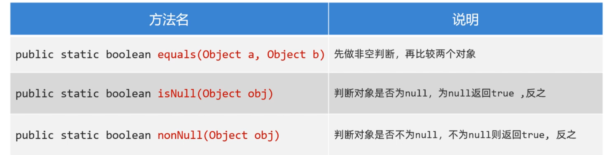
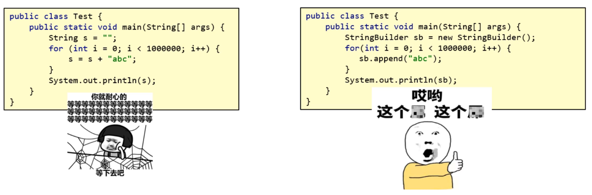
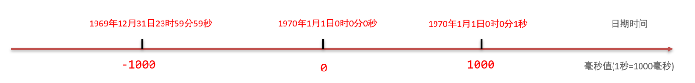

## 一，常用API介绍

### 1，常用API介绍

API（Application Programming interface）意思是应用程序编程接口，说人话就是Java帮我们写好的一些程序，如：类、方法等，我们直接拿过来用就可以解决一些问题。下图中展示了常用API对应的类：



学习API有一个特点就是听都可以听懂，但是记不住，这个大家不要担心，多记、多查、多写代码、孰能生巧！

### 2，Object类

Object类是Java中所有类的祖宗类，因此，Java中所有类的对象都可以直接使用Object类中提供的一些方法。在API文档中可以找以Object类，如下：

Object类中的toString方法可以返回对象的字符串表示形式。默认的格式是：“包名. 类名@哈希值16进制”。有一个学生类，如下：

```java
// 默认都是继承Object类的
class Student{
    private String name;
    private int age;

    public Student() {
    }

    public Student(String name, int age) {
        this.name = name;
        this.age = age;
    }
}
```

测试类：

```java
public class Test {
    public static void main(String[] args) {
        Student s1 = new Student("wc", 19);
        // 在Object类中有一个toString方法
        // toString方法，返回的是对象的字符串表示形式
        // 格式：包名.类名@哈希值
        System.out.println(s1.toString());
    }
}
```

打印结果如下：


在Student类重写toString()方法，那么我们可以返回对象的属性值，代码如下：

```java
class Student{
    private String name;
    private int age;

    public Student() {
    }

    public Student(String name, int age) {
        this.name = name;
        this.age = age;
    }

    @Override
    public String toString() {
        return "Student{" +
                "name='" + name + '\'' +
                ", age=" + age +
                '}';
    }
}
```

打印结果如下：


Object类的equals方法可以判断此对象与参数对象是否"相等"，测试如下：

```java
public class Test {
    public static void main(String[] args) {
        Student s1 = new Student("wc", 19);
        Student s2 = new Student("wc", 19);
        System.out.println(s1 == s2);   // false == 比较的是地址
        // equals是Object类的方法
        System.out.println(s1.equals(s2));  // false  默认情况下，equals效果和==是一样的，比较的都是地址
    }
}
```

重写equals方法，按照对象的属性值进行比较，如下：

```java
// 默认都是继承Object类的
class Student{
    private String name;
    private int age;

    public Student() {
    }

    public Student(String name, int age) {
        this.name = name;
        this.age = age;
    }

    @Override
    public boolean equals(Object o) {
        if (this == o) return true;
        if (o == null || getClass() != o.getClass()) return false;
        Student student = (Student) o;
        return age == student.age && Objects.equals(name, student.name);
    }

    @Override
    public int hashCode() {
        return Objects.hash(name, age);
    }

    @Override
    public String toString() {
        return "Student{" +
                "name='" + name + '\'' +
                ", age=" + age +
                '}';
    }
}


public class Test {
    public static void main(String[] args) {
        Student s1 = new Student("wc", 19);
        Student s2 = new Student("wc", 19);
        Student s3 = new Student("xq", 19);
        System.out.println(s1 == s2);   // false == 比较的是地址
        // equals是Object类的方法
        System.out.println(s1.equals(s2));  // true  重写了equals和hashCode方法，此时比较的就不是地址了
        System.out.println(s1.equals(s3));  // false
    }
}
```

Object类的clone()方法，会复制一个一模一样的新对象，并返回。说白了，就是克隆当前对象，返回一个新对象。想要调用clone()方法，必须让被克隆的类实现Cloneable接口。代码如下：

```java
class User implements Cloneable{
    private String id; //编号
    private String username; //用户名
    private String password; //密码
    private double[] scores; //分数

    public User() {
    }

    public User(String id, String username, String password, double[] scores) {
        this.id = id;
        this.username = username;
        this.password = password;
        this.scores = scores;
    }

    public String getId() {
        return id;
    }

    public void setId(String id) {
        this.id = id;
    }

    public String getUsername() {
        return username;
    }

    public void setUsername(String username) {
        this.username = username;
    }

    public String getPassword() {
        return password;
    }

    public void setPassword(String password) {
        this.password = password;
    }

    public double[] getScores() {
        return scores;
    }

    public void setScores(double[] scores) {
        this.scores = scores;
    }

    @Override
    protected Object clone() throws CloneNotSupportedException {
        return super.clone();
    }
}
```

测试类：

```java
public class Test {
    public static void main(String[] args) throws CloneNotSupportedException {
        User u1 = new User("1", "wc", "123", new double[]{99, 88, 50});
        User u2 = (User) u1.clone();
        System.out.println(u2.getId());
        System.out.println(u2.getUsername());
        System.out.println(u2.getPassword());
        System.out.println(u2.getScores());
    }
}
```

打印结果发现克隆得到的对象u2它的属性值和原来u1对象的属性值是一样的。如下：


上面演示的克隆方式，是一种浅克隆的方法，浅克隆的意思：拷贝出来的对象封装的数据与原对象封装的数据一模一样（引用类型拷贝的是地址值）。



还有一种拷贝方式，称之为深拷贝，拷贝原理如下图所示：



演示深拷贝User对象，如下：

```java
class User implements Cloneable{
    private String id; //编号
    private String username; //用户名
    private String password; //密码
    private double[] scores; //分数

    public User() {
    }

    public User(String id, String username, String password, double[] scores) {
        this.id = id;
        this.username = username;
        this.password = password;
        this.scores = scores;
    }

    public String getId() {
        return id;
    }

    public void setId(String id) {
        this.id = id;
    }

    public String getUsername() {
        return username;
    }

    public void setUsername(String username) {
        this.username = username;
    }

    public String getPassword() {
        return password;
    }

    public void setPassword(String password) {
        this.password = password;
    }

    public double[] getScores() {
        return scores;
    }

    public void setScores(double[] scores) {
        this.scores = scores;
    }

    @Override
    protected Object clone() throws CloneNotSupportedException {
        // 先克隆得到一个新的对象
        User u = (User)super.clone();
        // 把新对象中的引用类型再次克隆
        u.scores = u.scores.clone();
        return u;

        //return super.clone();
    }
}
```

测试类：

```java
public class Test {
    public static void main(String[] args) throws CloneNotSupportedException {
        User u1 = new User("1", "wc", "123", new double[]{99, 88, 50});
        System.out.println(u1.getId());
        System.out.println(u1.getUsername());
        System.out.println(u1.getPassword());
        System.out.println(u1.getScores());

        System.out.println("---------------------------");

        User u2 = (User) u1.clone();
        System.out.println(u2.getId());
        System.out.println(u2.getUsername());
        System.out.println(u2.getPassword());
        System.out.println(u2.getScores());
    }
}
```

结果如下：


### 3，Objects类

Objects是一个工具类，提供了一些方法可以对任意对象进行操作。主要方法如下：



代码演示：

```java
public class Test {
    public static void main(String[] args){
        // Objects 是一个工具类  提供了一些API
        //      equals  也是比较两个对象的  会先做非空判断
        //      isNull  判断对象是否为null，是返回true
        //      nonNull  判断对象是否不为null，不为null是返回true

        String s1 = "java";
        String s2 = "java";
        System.out.println(s1.equals(s2));

        String s3 = null;
        String s4 = "java";
        // 这里会出异常:NullPointerException(空指针异常)，调用者不能为null
        //System.out.println(s3.equals(s3));
        System.out.println(Objects.equals(s3,s4));

        // 判断对象是否为null  等价于==
        System.out.println(Objects.isNull(s3));
        System.out.println(Objects.isNull(s4));

        // 判断对象是否不为null  等价于!=
        System.out.println(Objects.nonNull(s3));
        System.out.println(Objects.nonNull(s4));
    }
}
```

### 4，基础类型包装类

Java中万物皆对象。Java中的8种基本数据类型还不是对象，所以要把它们变成对象，变成对象之后，可以提供一些方法对数据进行操作。Java中8种基本数据类型都用一个包装类与之对应，如下：


学习包装类，需要注意两点：

* 创建包装类的对象方式、自动装箱和拆箱的特性
* 利用包装类提供的方法对字符串和基本类型数据进行相互转换

创建包装类对象，代码演示：

```java

```

在开发中，经常使用包装类对字符串和基本类型数据进行相互转换。

* 把字符串转换为数值型数据：包装类.parseXxx(字符串)
* 将数值型数据转换为字符串：包装类.valueOf(数据)

代码演示：

```java

```


### 5，StringBuilder类

StringBuilder是可变字符串对象，相当于是一个容器，它里面的字符串是可以改变的，就是用来操作字符串的。StringBuilder比String更合适做字符串的修改操作，效率更高，代码也更加简洁。


代码演示：

```java

```


为什么要用StringBuilder对字符串进行操作呢？因为它的效率比String更高，我们可以下面两段代码验证一下。




经过验证，直接使用Stirng拼接100万次，等了1分钟，还没结束，我等不下去了；但是使用StringBuilder做拼接，不到1秒钟出结果了。


StringBuilder应用案例，代码如下：

```java

```


### 6，StringJoiner类

前面使用StringBuilder拼接字符串的时，代码写起来还是有一点麻烦，而StringJoiner号称是拼接神器，不仅效率高，而且代码简洁。代码演示：

```java

```


使用StirngJoiner改写前面把数组转换为字符串的案例，代码如下：

```java

```


### 7，Math类

Math是数学的意思，该类提供了很多个进行数学运算的方法，如求绝对值，求最大值，四舍五入等，直接上代码：

```java

```


### 8，System类

System是系统类，提供了一些获取获取系统数据的方法。比如获取系统时间。代码如下：

```java

```


### 9，Runtime类

Runtime类是一个Java的运行时类，这个类可以用来获取JVM的一些信息，也可以用这个类去执行其他的程序。代码如下：

```java

```


### 10，BigDecimal类


先看如下代码的执行结果：

```java

```


结果并和我们想看到的不太一样。如下：


为了解决计算精度损失的问题，Java给我们提供了BigDecimal类，它提供了一些方法可以对数据进行四则运算，而且不丢失精度，同时还可以保留指定的小数位。代码如下：

```java

```


### 11，Date类


在Java中，使用Date类来表示日期或者时间。Date对象记录的时间是用毫秒值来表示的。Java语言规定，1970年1月1日0时0分0秒认为是时间的起点，此时记作0，那么1000（1秒=1000毫秒）就表示1970年1月1日0时0分1秒，依次内推。




Date类的构造方法和常见方法：

- public Date()   创建一个Date对象，代表的是系统当前此刻日期时间。
- public Date(long time)  把时间毫秒值转换成Date日期对象
- public long getTime()  返回从1970年1月1日  00:00:00 走到此刻的总的毫秒数
- public void setTime()  设置日期对象的时间为当前时间毫秒值对应的时间


直接上代码：

```java

```


### 12，SimpleDateFormat类

SimpleDateFormat类可以转换Date对象表示日期时间的显示格式。把Date对象转换为指定格式的日期字符串这个操作，叫做日期格式化。反过来把指定格式的日期符串转换为Date对象的操作，叫做日期解析。常见的构造器和格式化时间的方法：

- public SimpleDateFormat(String pattern) 创建简单日期格式化对象，并封装时间格式。
- public final String format(Date date) 将日期格式化成日期/时间字符串
- public final String format(Object time) 将时间毫秒值格式化成日期/时间字符串


创建SimpleDateFormat对象时，在构造方法的参数位置传递日期格式，而日期格式是由一些特定的字母拼接而来的。我们需要记住常用的几种日期/时间格式。

```txt
字母	   表示含义
yyyy	年
MM		月
dd		日
HH		时
mm		分
ss		秒
SSS		毫秒

"2024年12月12日" 的格式是 "yyyy年MM月dd日"
"2024-12-12 12:12:12" 的格式是 "yyyy-MM-dd HH:mm:ss"
按照上面的格式可以任意拼接，但是字母不能写错
```


代码演示：

```java

```


秒杀案例：

- 秒杀开始时间为：2023年11月11日 0:0:0 
- 秒杀结束时间为：2023年11月11日 0:10:0 
- wc下单并付款时间为：2023年11月11日 0:01:18 
- xq下单并付款时间为：2023年11月11日 0:10:18 
- 写代码说明这两位同学有没有参加上秒杀活动


代码如下：

```java

```


### 13，Calendar类

Calendar类表示日历，也是一个和日期相关的类，它提供了一些比Date类更好用的方法。有些案例使用Date类就不太好做，使用Calendar就非常方便。因为Calendar类提供了方法可以直接对日历中的年、月、日、时、分、秒等进行运算。Calendar常见方法：

- public static Calendar getInstance() 获取当前日历对象
- public int get(int field) 获取日历中的某个信息
- public final Date  getTime() 获取日期对象
- public long getTimeInMillis() 获取时间毫秒值
- public void set(int field, int value) 修改日历的某个时间
- public void add(int field, int amount) 为某个信息增加/减少指定的值


案例：将2023年10月10日增加一个月。


代码如下：

```java

```


### 14，JDK8日期、时间、日期时间


传统的时间类（Date、SimpleDateFormat、Calendar）存在如下问题：

- 设计不合理，使用不方便，很多都被淘汰了。
- 都是可变对象，修改后会丢失最开始的时间信息。
- 线程不安全。
- 不能精确到纳秒，只能精确到毫秒。


代码演示：

```java

```


JDK8新增的日期类，相比JDK8之前传统的时间API，优势：

- 设计更合理，功能丰富，使用方便
- 都是不可变对象，修改后会返回新的时间对象，不会丢失最开始时间
- 线程安全
- 能精确到毫秒，纳秒


JDK8新增的日期类分得更细致一些，比如表示年月日用LocalDate类、表示时间秒用LocalTime类、而表示年月日时分秒用LocalDateTime类等；除了这些类还提供了对时区、时间间隔进行操作的类等。它们几乎把对日期/时间的所有操作都通过了API方法，用起来特别方便。


先学习表示日期、时间、日期时间的类；有LocalDate、LocalTime、以及LocalDateTime类。这三个类的用法套路都是一样的。LocalDate类代码演示：

```java

```


LocalTime类的基本使用，代码演示：

```java

```


LocalDateTime类的基本使用，代码演示：

```java

```


### 15，时区

由于世界各个国家与地区的经度不同，各地区的时间也有所不同，因此会划分为不同的时区。每一个时区的时间也不太一样。ZoneId（时区）和ZonedDateTime（带时区的时间）是代表时区的两个类。代码演示：

```java

```


### 16，Instant类


前面我们学习的LocalDate, LocalTime, LocalDateTime, ZoneId, ZonedDateTime等都是为了代替Calendar。还有一个代替Date的类，叫Instant类（时间线上的某个时刻/时间戳）。通过获取Instant的对象可以拿到此刻的时间，该时间由两部分组成：从1970-01-01 00:00:00 开始走到此刻的总秒数+不够1秒的纳秒数。


该类提供的方法如下图所示，可以用来获取当前时间，也可以对时间进行加、减、获取等操作。


作用：可以用来记录代码的执行时间，或用于记录用户操作某个事件的时间点。代码演示：

```java

```


### 17，DateTimeFormater类


DateTimeFormater是新的日期格式化类，用于代替之前的SimpleDateFormat类的。常用方法：

- public static DateTimeFormatter ofPattern   获取格式化器对象
- public String format  格式化时间
- public String format(DateTimeFormatter formatter)  格式化时间
- public static LocalDateTime parse(CharSequence text, DateTimeFormatter formatter)  解析时间


代码演示：

```java

```


### 18，Period类和Duration类

JDK8还补充了两个类，一个叫Period类、一个叫Duration类；这两个类可以用来对计算两个时间点的时间间隔。其中Period用来计算日期间隔（年、月、日），Duration用来计算时间间隔（时、分、秒、纳秒）


Period类只能两个计算LocalDate对象之间的间隔。可以用来计算两个日期之间相隔的年、相隔的月、相隔的日。常用方法：

- public static Period between(LocalDate start, LocalDate end)  传入2个日期对象，得到Period对象
- public int get Years()  计算隔几年，并返回
- public int getMonths()  计算隔几个月，并返回
- public int getDays()  计算隔多少天，并返回


代码演示：

```java

```


Duration类可以用于计算两个时间对象相差的天数、小时数、分数、秒数、纳秒数；支持LocalTime、LocalDateTime、Instant等时间。常用方法：

- public static Duration between(开始时间对象1，截止时间对象2)   传入2个时间对象，得到Duration对象
- public long toDays()   计算隔多少天，并返回
- public long toHours()   计算隔多少小时，并返回
- public long toMinutes()   计算隔多少分，并返回
- public long toSeconds()   计算隔多少秒，并返回
- public long toMillis()   计算隔多少毫秒，并返回
- public long toNanos()    计算隔多少纳秒，并返回


代码演示：

```java

```


### 19，Arrays类

Arrays是操作数组的工具类，它可以很方便的对数组中的元素进行遍历、拷贝、排序等操作。演示几个常用的方法

- public static String toString(类型[] arr)  返回数组内容
- public static int[] copyOfRange(类型[] arr, 起始索引，结束索引)  拷贝数组（指定范围）
- public static copyOf(类型[] arr, int newLength) 拷贝数组
- public static setAll(double[] array, IntToDoubleFunction generator)  把数组中的原数据改为新数据
- public static void sort(类型[] arr) 对数组进行排序（默认是升序排序）


代码演示：

```java

```


前面我们使用Arrays操作数组时，数组中存储存储的元素是int类型、double类型，是可以直接排序的，而且默认是升序排列。如果数组中存储的元素类型是自定义的对象，如何进行排序呢，先准备一个Student类，如下：

```java

```


测试类，往数组中存储4个学生对象，如下：

```java

```


测试如下：


上面代码报错的原因是Arrays根本不知道按什么规则进行排序。为了让Arrays知道按照什么规则排序，我们有如下的两种办法。

- 排序方式1：让Student类实现Comparable接口，同时重写compareTo方法。
- 排序方式2：在调用`Arrays.sort(数组,Comparator比较器);`时，除了传递数组之外，传递一个Comparator比较器对象。


排序方式1：让Student类实现Comparable接口，同时重写compareTo方法。Arrays的sort方法底层会根据compareTo方法的返回值是正数、负数、还是0来确定谁大、谁小、谁相等。代码如下：

```java

```


排序方式2：在调用`Arrays.sort(数组,Comparator比较器);`时，除了传递数组之外，传递一个Comparator比较器对象。Arrays的sort方法底层会根据Comparator比较器对象的compare方法方法的返回值是正数、负数、还是0来确定谁大、谁小、谁相等。代码如下：

```java

```


