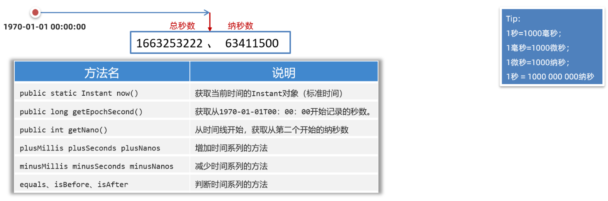

## 一，常用API介绍

### 1，常用API介绍

API（Application Programming interface）意思是应用程序编程接口，说人话就是Java帮我们写好的一些程序，如：类、方法等，我们直接拿过来用就可以解决一些问题。下图中展示了常用API对应的类：


学习API有一个特点就是听都可以听懂，但是记不住，这个大家不要担心，多记、多查、多写代码、孰能生巧！

### 2，Object类

Object类是Java中所有类的祖宗类，因此，Java中所有类的对象都可以直接使用Object类中提供的一些方法。在API文档中可以找以Object类，如下：

Object类中的toString方法可以返回对象的字符串表示形式。默认的格式是：“包名. 类名@哈希值16进制”。有一个学生类，如下：

```java
public class Student{
    private String name;
    private int age;
    
    public Student(String name, int age){
        this.name=name;
        this.age=age;
    }
}
```

测试类：

```java
public class Test{
    public static void main(String[] args){
        Student s1 = new Student("wc",23);
        System.out.println(s1.toString()); 
    }
}
```

打印结果如下：

在Student类重写toString()方法，那么我们可以返回对象的属性值，代码如下：

```java
public class Student{
    private String name;
    private int age;
    
    public Student(String name, int age){
        this.name=name;
        this.age=age;
    }
    
    @Override
    public String toString(){
        return "Student{name=‘"+name+"’, age="+age+"}";
    }
}
```

打印结果如下：

Object类的equals方法可以判断此对象与参数对象是否"相等"，测试如下：

```java
public class Test{
	public static void main(String[] args){
        Student s1 = new Student("赵薇",23);
        Student s2 = new Student("赵薇",23);
        
        //equals本身也是比较对象的地址，和"=="没有区别
        System.out.println(s1.equals(s2)); //false
         //"=="比较对象的地址
        System.out.println(s1==s2); //false
    }
}
```

重写equals方法，按照对象的属性值进行比较，如下：

```java
public class Student{
    private String name;
    private int age;
    
    public Student(String name, int age){
        this.name=name;
        this.age=age;
    }
    
    @Override
    public String toString(){
        return "Student{name=‘"+name+"’, age="+age+"}";
    }
    
    //重写equals方法，按照对象的属性值进行比较
    @Override
    public boolean equals(Object o) {
        if (this == o) return true;
        if (o == null || getClass() != o.getClass()) return false;

        Student student = (Student) o;

        if (age != student.age) return false;
        return name != null ? name.equals(student.name) : student.name == null;
    }
}
```

Object类的clone()方法，会复制一个一模一样的新对象，并返回。说白了，就是克隆当前对象，返回一个新对象。想要调用clone()方法，必须让被克隆的类实现Cloneable接口。代码如下：

```java
public class User implements Cloneable{
    private String id; //编号
    private String username; //用户名
    private String password; //密码
    private double[] scores; //分数

    public User() {
    }

    public User(String id, String username, String password, double[] scores) {
        this.id = id;
        this.username = username;
        this.password = password;
        this.scores = scores;
    }

    //...get和set...方法自己加上

    @Override
    protected Object clone() throws CloneNotSupportedException {
        return super.clone();
    }
}
```

测试类：

```java
public class Test {
    public static void main(String[] args) throws CloneNotSupportedException {
        User u1 = new User(1,"zhangsan","wo666",new double[]{99.0,99.5});
		//调用方法克隆得到一个新对象
        User u2 = (User) u1.clone();
        System.out.println(u2.getId());
        System.out.println(u2.getUsername());
        System.out.println(u2.getPassword());
        System.out.println(u2.getScores()); 
    }
}
```

打印结果发现克隆得到的对象u2它的属性值和原来u1对象的属性值是一样的。如下：

上面演示的克隆方式，是一种浅克隆的方法，浅克隆的意思：拷贝出来的对象封装的数据与原对象封装的数据一模一样（引用类型拷贝的是地址值）。


还有一种拷贝方式，称之为深拷贝，拷贝原理如下图所示：


演示深拷贝User对象，如下：

```java
public class User implements Cloneable{
    private String id; //编号
    private String username; //用户名
    private String password; //密码
    private double[] scores; //分数

    public User() {
    }

    public User(String id, String username, String password, double[] scores) {
        this.id = id;
        this.username = username;
        this.password = password;
        this.scores = scores;
    }

    //...get和set...方法自己加上

	@Override
    protected Object clone() throws CloneNotSupportedException {
        //先克隆得到一个新对象
        User u = (User) super.clone();
        //再将新对象中的引用类型数据，再次克隆
        u.scores = u.scores.clone();
        return u;
    }
}
```

测试类：

```java

```

结果如下：

### 3，Objects类

Objects是一个工具类，提供了一些方法可以对任意对象进行操作。主要方法如下：


代码演示：

```java
public class Test{
    public static void main(String[] args){
        String s1 = null;
        String s2 = "malu";
        
        //这里会出现NullPointerException异常，调用者不能为null
        System.out.println(s1.equals(s2));
        //此时不会有NullPointerException异常，底层会自动先判断空
        System.out.println(Objects.equals(s1,s2));
        
        //判断对象是否为null，等价于==
        System.out.println(Objects.isNull(s1)); //true
        System.out.println(s1==null); //true
        
        //判断对象是否不为null，等价于!=
        System.out.println(Objects.nonNull(s2)); //true
        System.out.println(s2!=null); //true
    }
}
```

### 4，基础类型包装类

Java中万物皆对象。Java中的8种基本数据类型还不是对象，所以要把它们变成对象，变成对象之后，可以提供一些方法对数据进行操作。Java中8种基本数据类型都用一个包装类与之对应，如下：


学习包装类，需要注意两点：

* 创建包装类的对象方式、自动装箱和拆箱的特性
* 利用包装类提供的方法对字符串和基本类型数据进行相互转换

创建包装类对象，代码演示：

```java
//1.创建Integer对象，封装基本类型数据10
Integer a = new Integer(10);

//2.使用Integer类的静态方法valueOf(数据)
Integer b = Integer.valueOf(10);

//3.还有一种自动装箱的写法（意思就是自动将基本类型转换为引用类型）
Integer c = 10;

//4.有装箱肯定还有拆箱（意思就是自动将引用类型转换为基本类型）
int d = c;

//5.装箱和拆箱在使用集合时就有体现
ArrayList<Integer> list = new ArrayList<>();
//添加的元素是基本类型，实际上会自动装箱为Integer类型
list.add(100);
//获取元素时，会将Integer类型自动拆箱为int类型
int e = list.get(0);
```

在开发中，经常使用包装类对字符串和基本类型数据进行相互转换。

* 把字符串转换为数值型数据：包装类.parseXxx(字符串)
* 将数值型数据转换为字符串：包装类.valueOf(数据)

代码演示：

```java
//1.字符串转换为数值型数据
String ageStr = "29";
int age1 = Integer.parseInt(ageStr);

String scoreStr = 3.14;
double score = Double.prarseDouble(scoreStr);

//2.整数转换为字符串，以下几种方式都可以（挑中你喜欢的记一下）
Integer a = 23;
String s1 = Integer.toString(a);
String s2 = a.toString();
String s3 = a+"";
String s4 = String.valueOf(a);
```


### 5，StringBuilder类

StringBuilder是可变字符串对象，相当于是一个容器，它里面的字符串是可以改变的，就是用来操作字符串的。StringBuilder比String更合适做字符串的修改操作，效率更高，代码也更加简洁。


代码演示：

```java
public class Test{
    public static void main(String[] args){
        StringBuilder sb = new StringBuilder("malu");
        
        //1.拼接内容
        sb.append(12);
        sb.append("码路");
        sb.append(true);
        
        //2.append方法，支持链式编程
        sb.append(666).append("码路2").append(666);
        System.out.println(sb); 
        
        //3.反转操作
        sb.reverse();
        System.out.println(sb);
        
        //4.返回字符串的长度
        System.out.println(sb.length());
        
        //5.StringBuilder还可以转换为字符串
        String s = sb.toString();
        System.out.println(s); 
    }
}
```


为什么要用StringBuilder对字符串进行操作呢？因为它的效率比String更高，我们可以下面两段代码验证一下。


经过验证，直接使用Stirng拼接100万次，等了1分钟，还没结束，我等不下去了；但是使用StringBuilder做拼接，不到1秒钟出结果了。


StringBuilder应用案例，代码如下：

```java
public class Test{
    public static void main(String[] args){
        String str = getArrayData( new int[]{11,22,33});
        System.out.println(str);
    }
    
    //方法作用：将int数组转换为指定格式的字符串
    public static String getArrayData(int[] arr){
        //1.判断数组是否为null
        if(arr==null){
            return null;
        }
        //2.如果数组不为null，再遍历，并拼接数组中的元素
        StringBuilder sb = new StringBuilder("[");
        for(int i=0; i<arr.length; i++){
            if(i==arr.legnth-1){
                sb.append(arr[i]).append("]");;
            }else{
                sb.append(arr[i]).append(",");
            }
        }
        //3、把StirngBuilder转换为String，并返回。
        return sb.toString();
    }
}
```


### 6，StringJoiner类

前面使用StringBuilder拼接字符串的时，代码写起来还是有一点麻烦，而StringJoiner号称是拼接神器，不仅效率高，而且代码简洁。代码演示：

```java
public class Test{
    public static void main(String[] args){
        StringJoiner s = new StringJoiner(",");
        s.add("java1");
        s.add("java2");
        s.add("java3");
        System.out.println(s); //结果为： java1,java2,java3
        
        //参数1：间隔符
        //参数2：开头
        //参数3：结尾
        StringJoiner s1 = new StringJoiner(",","[","]");
        s1.add("java1");
        s1.add("java2");
        s1.add("java3");
        System.out.println(s1); //结果为： [java1,java2,java3]
    }
}
```


使用StirngJoiner改写前面把数组转换为字符串的案例，代码如下：

```java
public class Test{
    public static void main(String[] args){
        String str = getArrayData( new int[]{11,22,33});
        System.out.println(str);
    }
    
    //方法作用：将int数组转换为指定格式的字符串
    public static String getArrayData(int[] arr){
        //1.判断数组是否为null
        if(arr==null){
            return null;
        }
        //2.如果数组不为null，再遍历，并拼接数组中的元素
        StringJoiner s = new StringJoiner(", ","[","]");
        for(int i=0; i<arr.length; i++){
            //加""是因为add方法的参数要的是String类型
            s.add(String.valueOf(arr[i]));
        }
        //3、把StringJoiner转换为String，并返回。
        return s.toString();
    }
}
```


### 7，Math类

Math是数学的意思，该类提供了很多个进行数学运算的方法，如求绝对值，求最大值，四舍五入等，直接上代码：

```java
public class MathTest {
    public static void main(String[] args) {
        // 1、public static int abs(int a)：取绝对值（拿到的结果一定是正数）
        //    public static double abs(double a)
        System.out.println(Math.abs(-12)); // 12
        System.out.println(Math.abs(123)); // 123
        System.out.println(Math.abs(-3.14)); // 3.14

        // 2、public static double ceil(double a): 向上取整
        System.out.println(Math.ceil(4.0000001)); // 5.0
        System.out.println(Math.ceil(4.0)); // 4.0

        // 3、public static double floor(double a): 向下取整
        System.out.println(Math.floor(4.999999)); // 4.0
        System.out.println(Math.floor(4.0)); // 4.0

        // 4、public static long round(double a)：四舍五入
        System.out.println(Math.round(3.4999)); // 3
        System.out.println(Math.round(3.50001)); // 4

        // 5、public static int max(int a, int b)：取较大值
        //   public static int min(int a, int b)：取较小值
        System.out.println(Math.max(10, 20)); // 20
        System.out.println(Math.min(10, 20)); // 10

        // 6、 public static double pow(double a, double b)：取次方
        System.out.println(Math.pow(2, 3)); // 2的3次方   8.0
        System.out.println(Math.pow(3, 2)); // 3的2次方   9.0

        // 7、public static double random()： 取随机数 [0.0 , 1.0) (包前不包后)
        System.out.println(Math.random());
    }
}
```


### 8，System类

System是系统类，提供了一些获取获取系统数据的方法。比如获取系统时间。代码如下：

```java
public class Test {
    public static void main(String[] args) {

        // 1、public static void exit(int status):
        //   终止当前运行的Java虚拟机。
        //   该参数用作状态代码; 按照惯例，非零状态代码表示异常终止。
        System.exit(0); // 人为的终止虚拟机。(不要使用)

        // 2、public static long currentTimeMillis():
        //    获取当前系统的时间
        //    返回的是long类型的时间毫秒值：指的是从1970-1-1 0:0:0开始走到此刻的总的毫秒值，1s = 1000ms
        long time = System.currentTimeMillis();
        System.out.println(time);

        for (int i = 0; i < 1000000; i++) {
            System.out.println("输出了：" + i);
        }

        long time2 = System.currentTimeMillis();
        System.out.println((time2 - time) / 1000.0 + "s");
    }
}
```


### 9，Runtime类

Runtime类是一个Java的运行时类，这个类可以用来获取JVM的一些信息，也可以用这个类去执行其他的程序。代码如下：

```java
public class RuntimeTest {
    public static void main(String[] args) throws IOException, InterruptedException {

        // 1、public static Runtime getRuntime() 返回与当前Java应用程序关联的运行时对象。
        Runtime r = Runtime.getRuntime();

        // 2、public void exit(int status) 终止当前运行的虚拟机,该参数用作状态代码; 按照惯例，非零状态代码表示异常终止。
        // r.exit(0);

        // 3、public int availableProcessors(): 获取虚拟机能够使用的处理器数。
        System.out.println(r.availableProcessors());

        // 4、public long totalMemory() 返回Java虚拟机中的内存总量。
        System.out.println(r.totalMemory()/1024.0/1024.0 + "MB"); // 1024 = 1K     1024 * 1024 = 1M

        // 5、public long freeMemory() 返回Java虚拟机中的可用内存量
        System.out.println(r.freeMemory()/1024.0/1024.0 + "MB");

        // 6、public Process exec(String command) 启动某个程序，并返回代表该程序的对象。
        // r.exec("D:\\soft\\XMind\\XMind.exe");
        Process p = r.exec("QQ");
        Thread.sleep(5000); // 让程序在这里暂停5s后继续往下走！！
        p.destroy(); // 销毁！关闭程序！
    }
}
```


### 10，BigDecimal类


先看如下代码的执行结果：

```java
public class Test {
    public static void main(String[] args) {
        System.out.println(0.1 + 0.2);
        System.out.println(1.0 - 0.32);
        System.out.println(1.015 * 100);
        System.out.println(1.301 / 100);
    }
}
```


结果并和我们想看到的不太一样。如下：


为了解决计算精度损失的问题，Java给我们提供了BigDecimal类，它提供了一些方法可以对数据进行四则运算，而且不丢失精度，同时还可以保留指定的小数位。代码如下：

```java
public class Test2 {
    public static void main(String[] args) {
        double a = 0.1;
        double b = 0.2;

        // 1、把浮点型数据封装成BigDecimal对象，再来参与运算。
        // a、public BigDecimal(double val) 得到的BigDecimal对象是无法精确计算浮点型数据的。 注意：不推荐使用这个，
        // b、public BigDecimal(String val)  得到的BigDecimal对象是可以精确计算浮点型数据的。 可以使用。
        // c、public static BigDecimal valueOf(double val): 通过这个静态方法得到的BigDecimal对象是可以精确运算的。是最好的方案。
        BigDecimal a1 = BigDecimal.valueOf(a);
        BigDecimal b1 = BigDecimal.valueOf(b);

        // 2、public BigDecimal add(BigDecimal augend): 加法
        BigDecimal c1 = a1.add(b1);
        System.out.println(c1);

        // 3、public BigDecimal subtract(BigDecimal augend): 减法
        BigDecimal c2 = a1.subtract(b1);
        System.out.println(c2);

        // 4、public BigDecimal multiply(BigDecimal augend): 乘法
        BigDecimal c3 = a1.multiply(b1);
        System.out.println(c3);

        // 5、public BigDecimal divide(BigDecimal b): 除法
        BigDecimal c4 = a1.divide(b1);
        System.out.println(c4);

//        BigDecimal d1 = BigDecimal.valueOf(0.1);
//        BigDecimal d2 = BigDecimal.valueOf(0.3);
//        BigDecimal d3 = d1.divide(d2);
//        System.out.println(d3);

        // 6、public BigDecimal divide(另一个BigDecimal对象，精确几位，舍入模式) : 除法，可以设置精确几位。
        BigDecimal d1 = BigDecimal.valueOf(0.1);
        BigDecimal d2 = BigDecimal.valueOf(0.3);
        BigDecimal d3 = d1.divide(d2,  2, RoundingMode.HALF_UP); // 0.33
        System.out.println(d3);

        // 7、public double doubleValue() : 把BigDecimal对象又转换成double类型的数据。
        //print(d3);
        //print(c1);
        double db1 = d3.doubleValue();
        double db2 = c1.doubleValue();
        print(db1);
        print(db2);
    }

    public static void print(double a){
        System.out.println(a);
    }
}

```


### 11，Date类


在Java中，使用Date类来表示日期或者时间。Date对象记录的时间是用毫秒值来表示的。Java语言规定，1970年1月1日0时0分0秒认为是时间的起点，此时记作0，那么1000（1秒=1000毫秒）就表示1970年1月1日0时0分1秒，依次内推。


Date类的构造方法和常见方法：

- public Date()   创建一个Date对象，代表的是系统当前此刻日期时间。
- public Date(long time)  把时间毫秒值转换成Date日期对象
- public long getTime()  返回从1970年1月1日  00:00:00 走到此刻的总的毫秒数
- public void setTime()  设置日期对象的时间为当前时间毫秒值对应的时间


直接上代码：

```java
public class Test1Date {
    public static void main(String[] args) {
        // 1、创建一个Date的对象：代表系统当前时间信息的。
        Date d = new Date();
        System.out.println(d);

        // 2、拿到时间毫秒值。
        long time = d.getTime();
        System.out.println(time);

        // 3、把时间毫秒值转换成日期对象： 2s之后的时间是多少。
        time += 2 * 1000;
        Date d2 = new Date(time);
        System.out.println(d2);

        // 4、直接把日期对象的时间通过setTime方法进行修改
        Date d3 = new Date();
        d3.setTime(time);
        System.out.println(d3);
    }
}
```


### 12，SimpleDateFormat类

SimpleDateFormat类可以转换Date对象表示日期时间的显示格式。把Date对象转换为指定格式的日期字符串这个操作，叫做日期格式化。反过来把指定格式的日期符串转换为Date对象的操作，叫做日期解析。常见的构造器和格式化时间的方法：

- public SimpleDateFormat(String pattern) 创建简单日期格式化对象，并封装时间格式。
- public final String format(Date date) 将日期格式化成日期/时间字符串
- public final String format(Object time) 将时间毫秒值格式化成日期/时间字符串


创建SimpleDateFormat对象时，在构造方法的参数位置传递日期格式，而日期格式是由一些特定的字母拼接而来的。我们需要记住常用的几种日期/时间格式。

```txt
字母	   表示含义
yyyy	年
MM		月
dd		日
HH		时
mm		分
ss		秒
SSS		毫秒

"2024年12月12日" 的格式是 "yyyy年MM月dd日"
"2024-12-12 12:12:12" 的格式是 "yyyy-MM-dd HH:mm:ss"
按照上面的格式可以任意拼接，但是字母不能写错
```


代码演示：

```java
public class Test {
    public static void main(String[] args) throws ParseException {
        // 1、准备一些时间
        Date d = new Date();
        System.out.println(d);

        long time = d.getTime();
        System.out.println(time);

        // 2、格式化日期对象，和时间 毫秒值。
        SimpleDateFormat sdf = new SimpleDateFormat("yyyy年MM月dd日 HH:mm:ss EEE a");

        String rs = sdf.format(d);
        String rs2 = sdf.format(time);
        System.out.println(rs);
        System.out.println(rs2);
        System.out.println("----------------------------------------------");

        String dateStr = "2022-12-12 12:12:11";
        // 1、创建简单日期格式化对象 , 指定的时间格式必须与被解析的时间格式一模一样，否则程序会出bug.
        SimpleDateFormat sdf2 = new SimpleDateFormat("yyyy-MM-dd HH:mm:ss");
        Date d2 = sdf2.parse(dateStr);
        System.out.println(d2);
    }
}
```


秒杀案例：

- 秒杀开始时间为：2023年11月11日 0:0:0 
- 秒杀结束时间为：2023年11月11日 0:10:0 
- wc下单并付款时间为：2023年11月11日 0:01:18 
- xq下单并付款时间为：2023年11月11日 0:10:18 
- 写代码说明这两位同学有没有参加上秒杀活动


代码如下：

```java
public class Test3 {
    public static void main(String[] args) throws ParseException {
        // 1、把开始时间、结束时间、wc下单时间、xq下单时间拿到程序中来。
        String start = "2023年11月11日 0:0:0";
        String end = "2023年11月11日 0:10:0";
        String xj = "2023年11月11日 0:01:18";
        String xp = "2023年11月11日 0:10:57";

        // 2、把字符串的时间解析成日期对象。
        SimpleDateFormat sdf = new SimpleDateFormat("yyyy年MM月dd日 HH:mm:ss");
        Date startDt = sdf.parse(start);
        Date endDt = sdf.parse(end);
        Date xjDt = sdf.parse(xj);
        Date xpDt = sdf.parse(xp);

        // 3、开始判断小皮和小贾是否秒杀成功了。
        // 把日期对象转换成时间毫秒值来判断
        long startTime = startDt.getTime();
        long endTime = endDt.getTime();
        long xjTime = xjDt.getTime();
        long xpTime = xpDt.getTime();

        if(xjTime >= startTime && xjTime <= endTime){
            System.out.println("小贾您秒杀成功了~~");
        }else {
            System.out.println("小贾您秒杀失败了~~");
        }

        if(xpTime >= startTime && xpTime <= endTime){
            System.out.println("小皮您秒杀成功了~~");
        }else {
            System.out.println("小皮您秒杀失败了~~");
        }
    }
}
```


### 13，Calendar类

Calendar类表示日历，也是一个和日期相关的类，它提供了一些比Date类更好用的方法。有些案例使用Date类就不太好做，使用Calendar就非常方便。因为Calendar类提供了方法可以直接对日历中的年、月、日、时、分、秒等进行运算。Calendar常见方法：

- public static Calendar getInstance() 获取当前日历对象
- public int get(int field) 获取日历中的某个信息
- public final Date  getTime() 获取日期对象
- public long getTimeInMillis() 获取时间毫秒值
- public void set(int field, int value) 修改日历的某个时间
- public void add(int field, int amount) 为某个信息增加/减少指定的值


案例：将2023年10月10日增加一个月。


代码如下：

```java
public class Test4Calendar {
    public static void main(String[] args) {
        // calendar是可变对象，一旦修改后其对象本身表示的时间将产生变化。
        
        // 1、得到系统此刻时间对应的日历对象。
        Calendar now = Calendar.getInstance();
        System.out.println(now);

        // 2、获取日历中的某个信息
        int year = now.get(Calendar.YEAR);
        System.out.println(year);

        int days = now.get(Calendar.DAY_OF_YEAR);
        System.out.println(days);

        // 3、拿到日历中记录的日期对象。
        Date d = now.getTime();
        System.out.println(d);

        // 4、拿到时间毫秒值
        long time = now.getTimeInMillis();
        System.out.println(time);

        // 5、修改日历中的某个信息
        now.set(Calendar.MONTH, 9); // 修改月份成为10月份。
        now.set(Calendar.DAY_OF_YEAR, 125); // 修改成一年中的第125天。
        System.out.println(now);

        // 6、为某个信息增加或者减少多少
        now.add(Calendar.DAY_OF_YEAR, 100);
        now.add(Calendar.DAY_OF_YEAR, -10);
        now.add(Calendar.DAY_OF_MONTH, 6);
        now.add(Calendar.HOUR, 12);
        now.set(2026, 11, 22);
        System.out.println(now);
    }
}
```


### 14，JDK8日期、时间、日期时间


传统的时间类（Date、SimpleDateFormat、Calendar）存在如下问题：

- 设计不合理，使用不方便，很多都被淘汰了。
- 都是可变对象，修改后会丢失最开始的时间信息。
- 线程不安全。
- 不能精确到纳秒，只能精确到毫秒。


代码演示：

```java
public class Test {
    public static void main(String[] args) {
        // 传统的时间类（Date、SimpleDateFormat、Calendar）存在如下问题：
        // 1、设计不合理，使用不方便，很多都被淘汰了。
        Date d = new Date();
        //System.out.println(d.getYear() + 1900);

        Calendar c = Calendar.getInstance();
        int year = c.get(Calendar.YEAR);
        System.out.println(year);

        // 2、都是可变对象，修改后会丢失最开始的时间信息。

        // 3、线程不安全。

        // 4、不能精确到纳秒，只能精确到毫秒。
        // 1秒 = 1000毫秒
        // 1毫秒 = 1000微妙
        // 1微妙 = 1000纳秒
    }
}
```


JDK8新增的日期类，相比JDK8之前传统的时间API，优势：

- 设计更合理，功能丰富，使用方便
- 都是不可变对象，修改后会返回新的时间对象，不会丢失最开始时间
- 线程安全
- 能精确到毫秒，纳秒


JDK8新增的日期类分得更细致一些，比如表示年月日用LocalDate类、表示时间秒用LocalTime类、而表示年月日时分秒用LocalDateTime类等；除了这些类还提供了对时区、时间间隔进行操作的类等。它们几乎把对日期/时间的所有操作都通过了API方法，用起来特别方便。


先学习表示日期、时间、日期时间的类；有LocalDate、LocalTime、以及LocalDateTime类。这三个类的用法套路都是一样的。LocalDate类代码演示：

```java
public class Test {
    public static void main(String[] args) {
        // 0、获取本地日期对象(不可变对象)
        LocalDate ld = LocalDate.now(); // 年 月 日
        System.out.println(ld);

        // 1、获取日期对象中的信息
        int year = ld.getYear(); // 年
        int month = ld.getMonthValue(); // 月(1-12)
        int day = ld.getDayOfMonth(); // 日
        int dayOfYear = ld.getDayOfYear();  // 一年中的第几天
        int dayOfWeek = ld.getDayOfWeek().getValue(); // 星期几
        System.out.println(year);
        System.out.println(day);
        System.out.println(dayOfWeek);

        // 2、直接修改某个信息: withYear、withMonth、withDayOfMonth、withDayOfYear
        LocalDate ld2 = ld.withYear(2099);
        LocalDate ld3 = ld.withMonth(12);
        System.out.println(ld2);
        System.out.println(ld3);
        System.out.println(ld);

        // 3、把某个信息加多少: plusYears、plusMonths、plusDays、plusWeeks
        LocalDate ld4 = ld.plusYears(2);
        LocalDate ld5 = ld.plusMonths(2);

        // 4、把某个信息减多少：minusYears、minusMonths、minusDays、minusWeeks
        LocalDate ld6 = ld.minusYears(2);
        LocalDate ld7 = ld.minusMonths(2);

        // 5、获取指定日期的LocalDate对象： public static LocalDate of(int year, int month, int dayOfMonth)
        LocalDate ld8 = LocalDate.of(2099, 12, 12);
        LocalDate ld9 = LocalDate.of(2099, 12, 12);

        // 6、判断2个日期对象，是否相等，在前还是在后： equals isBefore isAfter
        System.out.println(ld8.equals(ld9));// true
        System.out.println(ld8.isAfter(ld)); // true
        System.out.println(ld8.isBefore(ld)); // false
    }
}
```


LocalTime类的基本使用，代码演示：

```java
public class Test {
    public static void main(String[] args) {
        // 0、获取本地时间对象
        LocalTime lt = LocalTime.now(); // 时 分 秒 纳秒 不可变的
        System.out.println(lt);

        // 1、获取时间中的信息
        int hour = lt.getHour(); //时
        int minute = lt.getMinute(); //分
        int second = lt.getSecond(); //秒
        int nano = lt.getNano(); //纳秒

        // 2、修改时间：withHour、withMinute、withSecond、withNano
        LocalTime lt3 = lt.withHour(10);
        LocalTime lt4 = lt.withMinute(10);
        LocalTime lt5 = lt.withSecond(10);
        LocalTime lt6 = lt.withNano(10);

        // 3、加多少：plusHours、plusMinutes、plusSeconds、plusNanos
        LocalTime lt7 = lt.plusHours(10);
        LocalTime lt8 = lt.plusMinutes(10);
        LocalTime lt9 = lt.plusSeconds(10);
        LocalTime lt10 = lt.plusNanos(10);

        // 4、减多少：minusHours、minusMinutes、minusSeconds、minusNanos
        LocalTime lt11 = lt.minusHours(10);
        LocalTime lt12 = lt.minusMinutes(10);
        LocalTime lt13 = lt.minusSeconds(10);
        LocalTime lt14 = lt.minusNanos(10);

        // 5、获取指定时间的LocalTime对象：
        // public static LocalTime of(int hour, int minute, int second)
        LocalTime lt15 = LocalTime.of(12, 12, 12);
        LocalTime lt16 = LocalTime.of(12, 12, 12);

        // 6、判断2个时间对象，是否相等，在前还是在后： equals isBefore isAfter
        System.out.println(lt15.equals(lt16)); // true
        System.out.println(lt15.isAfter(lt)); // false
        System.out.println(lt15.isBefore(lt)); // true

    }
}
```


LocalDateTime类的基本使用，代码演示：

```java
public class Test {
    public static void main(String[] args) {
        // 0、获取本地日期和时间对象。
        LocalDateTime ldt = LocalDateTime.now(); // 年 月 日 时 分 秒 纳秒
        System.out.println(ldt);

        // 1、可以获取日期和时间的全部信息
        int year = ldt.getYear(); // 年
        int month = ldt.getMonthValue(); // 月
        int day = ldt.getDayOfMonth(); // 日
        int dayOfYear = ldt.getDayOfYear();  // 一年中的第几天
        int dayOfWeek = ldt.getDayOfWeek().getValue();  // 获取是周几
        int hour = ldt.getHour(); //时
        int minute = ldt.getMinute(); //分
        int second = ldt.getSecond(); //秒
        int nano = ldt.getNano(); //纳秒

        // 2、修改时间信息：
        // withYear withMonth withDayOfMonth withDayOfYear withHour
        // withMinute withSecond withNano
        LocalDateTime ldt2 = ldt.withYear(2029);
        LocalDateTime ldt3 = ldt.withMinute(59);

        // 3、加多少:
        // plusYears  plusMonths plusDays plusWeeks plusHours plusMinutes plusSeconds plusNanos
        LocalDateTime ldt4 = ldt.plusYears(2);
        LocalDateTime ldt5 = ldt.plusMinutes(3);

        // 4、减多少：
        // minusDays minusYears minusMonths minusWeeks minusHours minusMinutes minusSeconds minusNanos
        LocalDateTime ldt6 = ldt.minusYears(2);
        LocalDateTime ldt7 = ldt.minusMinutes(3);


        // 5、获取指定日期和时间的LocalDateTime对象：
        // public static LocalDateTime of(int year, Month month, int dayOfMonth, int hour,
        //                                  int minute, int second, int nanoOfSecond)
        LocalDateTime ldt8 = LocalDateTime.of(2029, 12, 12, 12, 12, 12, 1222);
        LocalDateTime ldt9 = LocalDateTime.of(2029, 12, 12, 12, 12, 12, 1222);

        // 6、 判断2个日期、时间对象，是否相等，在前还是在后： equals、isBefore、isAfter
        System.out.println(ldt9.equals(ldt8));
        System.out.println(ldt9.isAfter(ldt));
        System.out.println(ldt9.isBefore(ldt));

        // 7、可以把LocalDateTime转换成LocalDate和LocalTime
        // public LocalDate toLocalDate()
        // public LocalTime toLocalTime()
        // public static LocalDateTime of(LocalDate date, LocalTime time)
        LocalDate ld = ldt.toLocalDate();
        LocalTime lt = ldt.toLocalTime();
        LocalDateTime ldt10 = LocalDateTime.of(ld, lt);

    }
}
```


### 15，时区

由于世界各个国家与地区的经度不同，各地区的时间也有所不同，因此会划分为不同的时区。每一个时区的时间也不太一样。ZoneId（时区）和ZonedDateTime（带时区的时间）是代表时区的两个类。代码演示：

```java
public class Test4_ZoneId_ZonedDateTime {
    public static void main(String[] args) {
        // 目标：了解时区和带时区的时间。
        // 1、ZoneId的常见方法：
        // public static ZoneId systemDefault(): 获取系统默认的时区
        ZoneId zoneId = ZoneId.systemDefault();
        System.out.println(zoneId.getId());
        System.out.println(zoneId);

        // public static Set<String> getAvailableZoneIds(): 获取Java支持的全部时区Id
        System.out.println(ZoneId.getAvailableZoneIds());

        // public static ZoneId of(String zoneId) : 把某个时区id封装成ZoneId对象。
        ZoneId zoneId1 = ZoneId.of("America/New_York");

        // 2、ZonedDateTime：带时区的时间。
        // public static ZonedDateTime now(ZoneId zone): 获取某个时区的ZonedDateTime对象。
        ZonedDateTime now = ZonedDateTime.now(zoneId1);
        System.out.println(now);

        // 世界标准时间了
        ZonedDateTime now1 = ZonedDateTime.now(Clock.systemUTC());
        System.out.println(now1);

        // public static ZonedDateTime now()：获取系统默认时区的ZonedDateTime对象
        ZonedDateTime now2 = ZonedDateTime.now();
        System.out.println(now2);

        // Calendar instance = Calendar.getInstance(TimeZone.getTimeZone(zoneId1));
    }
}
```


### 16，Instant类


前面我们学习的LocalDate, LocalTime, LocalDateTime, ZoneId, ZonedDateTime等都是为了代替Calendar。还有一个代替Date的类，叫Instant类（时间线上的某个时刻/时间戳）。通过获取Instant的对象可以拿到此刻的时间，该时间由两部分组成：从1970-01-01 00:00:00 开始走到此刻的总秒数+不够1秒的纳秒数。


该类提供的方法如下图所示，可以用来获取当前时间，也可以对时间进行加、减、获取等操作。




作用：可以用来记录代码的执行时间，或用于记录用户操作某个事件的时间点。代码演示：

```java
public class Test5_Instant {
    public static void main(String[] args) {
       // 1、创建Instant的对象，获取此刻时间信息
        Instant now = Instant.now(); // 不可变对象

        // 2、获取总秒数
        long second = now.getEpochSecond();
        System.out.println(second);

        // 3、不够1秒的纳秒数
        int nano = now.getNano();
        System.out.println(nano);

        System.out.println(now);

        Instant instant = now.plusNanos(111);

        // Instant对象的作用：做代码的性能分析，或者记录用户的操作时间点
        Instant now1 = Instant.now();
        // 代码执行....
        Instant now2 = Instant.now();

        LocalDateTime l = LocalDateTime.now();
    }
}
```


### 17，DateTimeFormater类


DateTimeFormater是新的日期格式化类，用于代替之前的SimpleDateFormat类的。常用方法：

- public static DateTimeFormatter ofPattern   获取格式化器对象
- public String format  格式化时间
- public String format(DateTimeFormatter formatter)  格式化时间
- public static LocalDateTime parse(CharSequence text, DateTimeFormatter formatter)  解析时间


代码演示：

```java
public class Test6_DateTimeFormatter {
    public static void main(String[] args) {
        // 1、创建一个日期时间格式化器对象出来。
        DateTimeFormatter formatter = DateTimeFormatter.ofPattern("yyyy年MM月dd日 HH:mm:ss");

        // 2、对时间进行格式化
        LocalDateTime now = LocalDateTime.now();
        System.out.println(now);

        String rs = formatter.format(now); // 正向格式化
        System.out.println(rs);

        // 3、格式化时间，其实还有一种方案。
        String rs2 = now.format(formatter); // 反向格式化
        System.out.println(rs2);

        // 4、解析时间：解析时间一般使用LocalDateTime提供的解析方法来解析。
        String dateStr = "2029年12月12日 12:12:11";
        LocalDateTime ldt = LocalDateTime.parse(dateStr, formatter);
        System.out.println(ldt);
    }
}
```


### 18，Period类和Duration类

JDK8还补充了两个类，一个叫Period类、一个叫Duration类；这两个类可以用来对计算两个时间点的时间间隔。其中Period用来计算日期间隔（年、月、日），Duration用来计算时间间隔（时、分、秒、纳秒）


Period类只能两个计算LocalDate对象之间的间隔。可以用来计算两个日期之间相隔的年、相隔的月、相隔的日。常用方法：

- public static Period between(LocalDate start, LocalDate end)  传入2个日期对象，得到Period对象
- public int get Years()  计算隔几年，并返回
- public int getMonths()  计算隔几个月，并返回
- public int getDays()  计算隔多少天，并返回


代码演示：

```java
public class Test7_Period {
    public static void main(String[] args) {
        LocalDate start = LocalDate.of(2029, 8, 10);
        LocalDate end = LocalDate.of(2029, 12, 15);

        // 1、创建Period对象，封装两个日期对象。
        Period period = Period.between(start, end);

        // 2、通过period对象获取两个日期对象相差的信息。
        System.out.println(period.getYears());
        System.out.println(period.getMonths());
        System.out.println(period.getDays());
    }
}
```


Duration类可以用于计算两个时间对象相差的天数、小时数、分数、秒数、纳秒数；支持LocalTime、LocalDateTime、Instant等时间。常用方法：

- public static Duration between(开始时间对象1，截止时间对象2)   传入2个时间对象，得到Duration对象
- public long toDays()   计算隔多少天，并返回
- public long toHours()   计算隔多少小时，并返回
- public long toMinutes()   计算隔多少分，并返回
- public long toSeconds()   计算隔多少秒，并返回
- public long toMillis()   计算隔多少毫秒，并返回
- public long toNanos()    计算隔多少纳秒，并返回


代码演示：

```java
public class Test {
    public static void main(String[] args) {
        LocalDateTime start = LocalDateTime.of(2025, 11, 11, 11, 10, 10);
        LocalDateTime end = LocalDateTime.of(2025, 11, 11, 11, 11, 11);
        // 1、得到Duration对象
        Duration duration = Duration.between(start, end);

        // 2、获取两个时间对象间隔的信息
        System.out.println(duration.toDays());// 间隔多少天
        System.out.println(duration.toHours());// 间隔多少小时
        System.out.println(duration.toMinutes());// 间隔多少分
        System.out.println(duration.toSeconds());// 间隔多少秒
        System.out.println(duration.toMillis());// 间隔多少毫秒
        System.out.println(duration.toNanos());// 间隔多少纳秒

    }
}
```


### 19，Arrays类

Arrays是操作数组的工具类，它可以很方便的对数组中的元素进行遍历、拷贝、排序等操作。演示几个常用的方法

- public static String toString(类型[] arr)  返回数组内容
- public static int[] copyOfRange(类型[] arr, 起始索引，结束索引)  拷贝数组（指定范围）
- public static copyOf(类型[] arr, int newLength) 拷贝数组
- public static setAll(double[] array, IntToDoubleFunction generator)  把数组中的原数据改为新数据
- public static void sort(类型[] arr) 对数组进行排序（默认是升序排序）


代码演示：

```java
public class Test {
    public static void main(String[] args) {
        // 1、public static String toString(类型[] arr): 返回数组的内容
        int[] arr = {10, 20, 30, 40, 50, 60};
        System.out.println(Arrays.toString(arr));

        // 2、public static 类型[] copyOfRange(类型[] arr, 起始索引, 结束索引) ：拷贝数组（指定范围，包前不包后）
        int[] arr2 = Arrays.copyOfRange(arr, 1, 4);
        System.out.println(Arrays.toString(arr2));

        // 3、public static copyOf(类型[] arr, int newLength)：拷贝数组，可以指定新数组的长度。
        int[] arr3 = Arrays.copyOf(arr, 10);
        System.out.println(Arrays.toString(arr3));

        // 4、public static setAll(double[] array, IntToDoubleFunction generator)：把数组中的原数据改为新数据又存进去。
        double[] prices = {99.8, 128, 100};
        //                  0     1    2
        // 把所有的价格都打八折，然后又存进去。
        Arrays.setAll(prices, new IntToDoubleFunction() {
            @Override
            public double applyAsDouble(int value) {
                // value = 0  1  2
                return prices[value] * 0.8;
            }
        });
        System.out.println(Arrays.toString(prices));

        // 5、public static void sort(类型[] arr)：对数组进行排序(默认是升序排序)
        Arrays.sort(prices);
        System.out.println(Arrays.toString(prices));
    }
}
```


前面我们使用Arrays操作数组时，数组中存储存储的元素是int类型、double类型，是可以直接排序的，而且默认是升序排列。如果数组中存储的元素类型是自定义的对象，如何进行排序呢，先准备一个Student类，如下：

```java
public class Student implements Comparable<Student>{
    private String name;
    private double height;
    private int age;
	
    public Student(String name, double height, int age) {
        this.name = name;
        this.height = height;
        this.age = age;
    }

	@Override
    public String toString() {
        return "Student{" +
                "name='" + name + '\'' +
                ", height=" + height +
                ", age=" + age +
                '}';
    }
}
```


测试类，往数组中存储4个学生对象，如下：

```java
public class Test {
    public static void main(String[] args) {
        // 目标：掌握如何对数组中的对象进行排序。
        Student[] students = new Student[4];
        students[0] = new Student("蜘蛛精", 169.5, 23);
        students[1] = new Student("紫霞", 163.8, 26);
        students[2] = new Student("紫霞", 163.8, 26);
        students[3] = new Student("至尊宝", 167.5, 24);

        // 1、public static void sort(类型[] arr)：对数组进行排序。
		Arrays.sort(students);
		System.out.println(Arrays.toString(students));
    }
}
```


测试如下：


上面代码报错的原因是Arrays根本不知道按什么规则进行排序。为了让Arrays知道按照什么规则排序，我们有如下的两种办法。

- 排序方式1：让Student类实现Comparable接口，同时重写compareTo方法。
- 排序方式2：在调用`Arrays.sort(数组,Comparator比较器);`时，除了传递数组之外，传递一个Comparator比较器对象。


排序方式1：让Student类实现Comparable接口，同时重写compareTo方法。Arrays的sort方法底层会根据compareTo方法的返回值是正数、负数、还是0来确定谁大、谁小、谁相等。代码如下：

```java
public class Student implements Comparable<Student>{
    private String name;
    private double height;
    private int age;
    
    //...get、set、空参数构造方法、有参数构造方法...自己补全

    // 指定比较规则
    // this  o
    @Override
    public int compareTo(Student o) {
        // 约定1：认为左边对象 大于 右边对象 请您返回正整数
        // 约定2：认为左边对象 小于 右边对象 请您返回负整数
        // 约定3：认为左边对象 等于 右边对象 请您一定返回0
		/* if(this.age > o.age){
            return 1;
        }else if(this.age < o.age){
            return -1;
        }
        return 0;*/

        //上面的if语句，也可以简化为下面的一行代码
        return this.age - o.age; // 按照年龄升序排列
        // return o.age - this.age; // 按照年龄降序排列
    }
    
    @Override
    public String toString() {
        return "Student{" +
                "name='" + name + '\'' +
                ", height=" + height +
                ", age=" + age +
                '}';
    }
}
```


排序方式2：在调用`Arrays.sort(数组,Comparator比较器);`时，除了传递数组之外，传递一个Comparator比较器对象。Arrays的sort方法底层会根据Comparator比较器对象的compare方法方法的返回值是正数、负数、还是0来确定谁大、谁小、谁相等。代码如下：

```java
public class Test {
    public static void main(String[] args) {
        // 目标：掌握如何对数组中的对象进行排序。
        Student[] students = new Student[4];
        students[0] = new Student("蜘蛛精", 169.5, 23);
        students[1] = new Student("紫霞", 163.8, 26);
        students[2] = new Student("紫霞", 163.8, 26);
        students[3] = new Student("至尊宝", 167.5, 24);

		// 2、public static <T> void sort(T[] arr, Comparator<? super T> c)
        // 参数一：需要排序的数组
        // 参数二：Comparator比较器对象（用来制定对象的比较规则）
        Arrays.sort(students, new Comparator<Student>() {
            @Override
            public int compare(Student o1, Student o2) {
                // 制定比较规则了：左边对象 o1   右边对象 o2
                // 约定1：认为左边对象 大于 右边对象 请您返回正整数
                // 约定2：认为左边对象 小于 右边对象 请您返回负整数
                // 约定3：认为左边对象 等于 右边对象 请您一定返回0
//                if(o1.getHeight() > o2.getHeight()){
//                    return 1;
//                }else if(o1.getHeight() < o2.getHeight()){
//                    return -1;
//                }
//                return 0; // 升序
                 return Double.compare(o1.getHeight(), o2.getHeight()); // 升序
                // return Double.compare(o2.getHeight(), o1.getHeight()); // 降序
            }
        });
        System.out.println(Arrays.toString(students));
    }
}
```


