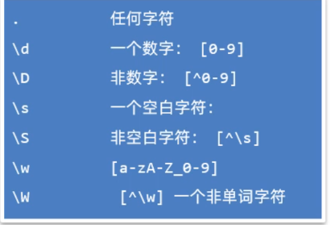

## 一，Lambda表达式

Lambda表达式是JDK8新增的一种语法形式，用于简化匿名内部类代码的书写。


### 1，Lambda表达式的基本使用

在使用Lambda表达式之前，必须先有一个接口，而且接口中只能有一个抽象方法。（注意：不能是抽象类，只能是接口）。如下的接口，我们叫函数式接口，只有基于函数式接口的匿名内部类才能被Lambda表达式简化。

```java
public interface Swimming{
    void swim();
}
```

有了以上的Swimming接口之后，使用匿名内部类，如下：

```java
public class Test {
    public static void main(String[] args) {
        //1.创建一个Swimming接口的匿名内部类对象
		Swimming s = new Swimming(){
             @Override
             public void swim() {
                 System.out.println("学生快乐的游泳~~~~");
             }
         };
         s.swim();
    }
}
```


然后，开始演示Lanmbda表达式。Lamdba是有特有的格式的，按照下面的格式来编写Lamdba。

```java
(被重写方法的形参列表) -> {
    被重写方法的方法体代码;
}
```


开始演示，使用Lambda表达式，简化匿名内部类书写。代码如下：

```java
public class LambdaTest1 {
    public static void main(String[] args) {
        //1.创建一个Swimming接口的匿名内部类对象
		Swimming s = new Swimming(){
             @Override
             public void swim() {
                 System.out.println("学生快乐的游泳~~~~");
             }
         };
         s.swim();
		
        //2.使用Lambda表达式对Swimming接口的匿名内部类进行简化
        Swimming s1 = () -> {
              System.out.println("学生快乐的游泳~~~~");
        };
        s1.swim();
    }
}
```


我们现在已经知道Lamdba表达式可以简化基于函数式接口的匿名内部类的书写。接下来，我们可以把刚才使用Arrays方法时的代码，使用Lambda表达式简化一下了。代码如下：

```java
public class LambdaTest2 {
    public static void main(String[] args) {
        double[] prices = {99.8, 128, 100};
		//1.把所有元素*0.8: 先用匿名内部类写法
        Arrays.setAll(prices, new IntToDoubleFunction() {
            @Override
            public double applyAsDouble(int value) {
                // value = 0  1  2
                return prices[value] * 0.8;
            }
        });
		//2.把所有元素*0.8: 改用Lamdba表达式写法
        Arrays.setAll(prices, (int value) -> {
                return prices[value] * 0.8;
        });

        System.out.println(Arrays.toString(prices));
        System.out.println("-----------------------------------------------");
		
        Student[] students = new Student[4];
        students[0] = new Student("蜘蛛精", 169.5, 23);
        students[1] = new Student("紫霞", 163.8, 26);
        students[2] = new Student("紫霞", 163.8, 26);
        students[3] = new Student("至尊宝", 167.5, 24);
		//3.对数组中的元素按照年龄升序排列: 先用匿名内部类写法
        Arrays.sort(students, new Comparator<Student>() {
            @Override
            public int compare(Student o1, Student o2) {
                return Double.compare(o1.getHeight(), o2.getHeight()); // 升序
            }
        });
		//4.对数组中的元素按照年龄升序排列: 改用Lambda写法
        Arrays.sort(students, (Student o1, Student o2) -> {
                return Double.compare(o1.getHeight(), o2.getHeight()); // 升序
        });
        System.out.println(Arrays.toString(students));
    }
}
```


### 2，Lambda表达式的省略规则

Lamdba表达式有几种简化写法。具体的简化规则如下：

```java
1.Lambda的标准格式
	(参数类型1 参数名1, 参数类型2 参数名2)->{
		...方法体的代码...
		return 返回值;
	}

2.在标准格式的基础上()中的参数类型可以直接省略
	(参数名1, 参数名2)->{
		...方法体的代码...
		return 返回值;
	}
	
3.如果{}总的语句只有一条语句，则{}可以省略、return关键字、以及最后的“;”都可以省略
	(参数名1, 参数名2)-> 结果
	
4.如果()里面只有一个参数，则()可以省略
	(参数名)->结果
```

接下来从匿名内部类开始、到Lambda标准格式、再到Lambda简化格式，一步一步来简化一下。代码如下：

```java
public class LambdaTest2 {
    public static void main(String[] args) {
        // 目标：使用Lambda简化函数式接口。
        double[] prices = {99.8, 128, 100};
		//1.对数组中的每一个元素*0.8: 匿名内部类写法
        Arrays.setAll(prices, new IntToDoubleFunction() {
            @Override
            public double applyAsDouble(int value) {
                // value = 0  1  2
                return prices[value] * 0.8;
            }
        });
		//2.需求：对数组中的每一个元素*0.8,使用Lambda表达式标准写法
        Arrays.setAll(prices, (int value) -> {
                return prices[value] * 0.8;
        });
		//3.使用Lambda表达式简化格式1——省略参数类型
        Arrays.setAll(prices, (value) -> {
            return prices[value] * 0.8;
        });
		//4.使用Lambda表达式简化格式2——省略()
        Arrays.setAll(prices, value -> {
            return prices[value] * 0.8;
        });
        //5.使用Lambda表达式简化格式3——省略{}
        Arrays.setAll(prices, value -> prices[value] * 0.8 );

        System.out.println(Arrays.toString(prices));
        
        System.out.println("------------------------------------

        Student[] students = new Student[4];
        students[0] = new Student("蜘蛛精", 169.5, 23);
        students[1] = new Student("紫霞", 163.8, 26);
        students[2] = new Student("紫霞", 163.8, 26);
        students[3] = new Student("至尊宝", 167.5, 24);
		
        //1.使用匿名内部类
        Arrays.sort(students, new Comparator<Student>() {
            @Override
            public int compare(Student o1, Student o2) {
                return Double.compare(o1.getHeight(), o2.getHeight()); // 升序
            }
        });
		//2.使用Lambda表达式表达式——标准格式
        Arrays.sort(students, (Student o1, Student o2) -> {
                return Double.compare(o1.getHeight(), o2.getHeight()); // 升序
        });
		//3.使用Lambda表达式表达式——省略参数类型
        Arrays.sort(students, ( o1,  o2) -> {
            return Double.compare(o1.getHeight(), o2.getHeight()); // 升序
        });
		//4.使用Lambda表达式表达式——省略{}
        Arrays.sort(students, ( o1,  o2) -> Double.compare(o1.getHeight(), o2.getHeight()));


        System.out.println(Arrays.toString(students));
    }
}
```


## 二，方法引用


方法引用是JDK8的另一个新特性。Lambda是用来简化匿名代码的书写格式的，而方法引用是用来进一步简化Lambda表达式的，它简化的更加过分。


### 1，静态方法引用

用之前Arrays代码来做演示。现在准备好下面的代码：

```java
public class Test {
    public static void main(String[] args) {
        Student[] students = new Student[4];
        students[0] = new Student("蜘蛛精", 169.5, 23);
        students[1] = new Student("紫霞", 163.8, 26);
        students[2] = new Student("紫霞", 163.8, 26);
        students[3] = new Student("至尊宝", 167.5, 24);

        // 原始写法：对数组中的学生对象，按照年龄升序排序
        Arrays.sort(students, new Comparator<Student>() {
            @Override
            public int compare(Student o1, Student o2) {
                return o1.getAge() - o2.getAge(); // 按照年龄升序排序
            }
        });

        // 使用Lambda简化后的形式
        Arrays.sort(students, (o1, o2) -> o1.getAge() - o2.getAge());
    }
}
```

现在，我想要把Lambda表达式的方法体，用一个静态方法代替。准备另外一个类CompareByData类，用于封装Lambda表达式的方法体代码；

```java
public class CompareByData {
    public static int compareByAge(Student o1, Student o2){
        return o1.getAge() - o2.getAge(); // 升序排序的规则
    }
}
```

现在我们就可以把Lambda表达式的方法体代码，改为下面的样子：

```java
Arrays.sort(students, (o1, o2) -> CompareByData.compareByAge(o1, o2));
```

Java为了简化上面Lambda表达式的写法，利用方法引用可以改进为下面的样子。**实际上就是用类名调用方法，但是把参数给省略了。**这就是静态方法引用。代码如下：

```java
//静态方法引用：类名::方法名
Arrays.sort(students, CompareByData::compareByAge);
```


### 2，实例方法引用


还是上面的案例，想要把Lambda表达式的方法体，用一个实例方法代替。在CompareByData类中，再添加一个实例方法，用于封装Lambda表达式的方法体。如下：

```java
public class CompareByData {
    public static int compareByAge(Student o1, Student o2){
        return o1.getAge() - o2.getAge(); // 升序排序的规则
    }
    public int compareByAgeDesc(Student o1, Student o2){
        return o2.getAge() - o1.getAge(); // 降序排序的规则
    }
}
```

把Lambda表达式的方法体，改用对象调用方法，如下：

```java
CompareByData compare = new CompareByData();
Arrays.sort(students, (o1, o2) -> compare.compareByAgeDesc(o1, o2)); // 降序
```

最后，再将Lambda表达式的方法体，直接改成方法引用写法。**实际上就是用类名调用方法，但是省略的参数**。这就是实例方法引用，如下：

```java
CompareByData compare = new CompareByData();
Arrays.sort(students, compare::compareByAgeDesc); // 降序
```


### 3，特定类型的方法引用

特定类型的方法引用是没有什么道理的，只是语法的一种约定，遇到这种场景，就可以这样用。如果某个Lambda表达式里只是调用一个实例方法，并且前面参数列表中的第一个参数作为方法的主调，后面的所有参数都是作为该实例方法的入参时，则就可以使用特定类型的方法引用。代码如下：

```java
public class Test {
    public static void main(String[] args) {
        String[] names = {"boby", "angela", "Andy" ,"dlei", "caocao", "Babo", "jack", "Cici"};
        
        // 要求忽略首字符大小写进行排序。
        Arrays.sort(names, new Comparator<String>() {
            @Override
            public int compare(String o1, String o2) {
                // 制定比较规则。o1 = "Andy"  o2 = "angela"
                return o1.compareToIgnoreCase(o2);
            }
        });
		
        //lambda表达式写法
        Arrays.sort(names, ( o1,  o2) -> o1.compareToIgnoreCase(o2) );
        //特定类型的方法引用！  格式：类型::方法名
        Arrays.sort(names, String::compareToIgnoreCase);

        System.out.println(Arrays.toString(names));
    }
}
```


### 4，构造器引用

构造器引用在实际开发中应用的并不多，目前还没有找到构造器的应用场景。所以大家在学习的时候，也只是关注语法就可以了。准备一个JavaBean类（Car类），如下：

```java
public class Car {
    private String name;
    private double price;

    public Car() {

    }

    public Car(String name, double price) {
        this.name = name;
        this.price = price;
    }

    public String getName() {
        return name;
    }

    public void setName(String name) {
        this.name = name;
    }

    public double getPrice() {
        return price;
    }

    public void setPrice(double price) {
        this.price = price;
    }

    @Override
    public String toString() {
        return "Car{" +
                "name='" + name + '\'' +
                ", price=" + price +
                '}';
    }
}
```


因为方法引用是基于Lamdba表达式简化的，所以也要按照Lamdba表达式的使用前提来用，需要一个函数式接口，接口中代码的返回值类型是Car类型，如下：

```java
interface CreateCar{
    Car create(String name, double price);
}
```

在测试类中创建CreateCar接口的实现类对象，先用匿名内部类创建、再用Lambda表达式创建，最后改用方法引用创建。同学们只关注格式就可以，不要去想为什么（语法就是这么设计的）。如下：

```java
public class Test {
    public static void main(String[] args) {
        // 1、创建这个接口的匿名内部类对象。
        CreateCar cc1 = new CreateCar(){
            @Override
            public Car create(String name, double price) {
                return new Car(name, price);
            }
        };
		//2、使用匿名内部类改进
        CreateCar cc2 = (name,  price) -> new Car(name, price);

        //3、使用方法引用改进：构造器引用
        CreateCar cc3 = Car::new;
        
        //注意：以上是创建CreateCar接口实现类对象的几种形式而已，语法一步一步简化。
        
        //4、对象调用方法
        Car car = cc3.create("奔驰", 49.9);
        System.out.println(car);
    }
}
```


## 三，正则表达式

正则表达式其实是由一些特殊的符号组成的，它代表的是某种规则。作用有二：

- 作用1：用来校验字符串数据是否合法
- 作用2：可以从一段文本中查找满足要求的内容


### 1，初识正则表达式


不使用正则表达式，校验QQ号码代码是这样的，代码如下：

```java
public static boolean checkQQ(String qq){
    // 1、判断qq号码是否为null
    if(qq == null || qq.startsWith("0") || qq.length() < 6 || qq.length() > 20){
        return false;
    }

    // 2、qq至少是不是null,不是以0开头的，满足6-20之间的长度。
    // 判断qq号码中是否都是数字。
    // qq = 2514ghd234
    for (int i = 0; i < qq.length(); i++) {
        // 根据索引提取当前位置处的字符。
        char ch = qq.charAt(i);
        // 判断ch记住的字符，如果不是数字，qq号码不合法。
        if(ch < '0' || ch > '9'){
            return false;
        }
    }
    // 3、说明qq号码肯定是合法
    return true;
}
```


使用正则表达式，如下：

```java
public static boolean checkQQ1(String qq){
    return qq != null && qq.matches("[1-9]\\d{5,19}");
}
```


### 2，正则书写规则

前面我们已经体验过正则表达式可以简化校验数据的代码书写。使用到的方法叫matches是属于String类的方法。此方法用于判断字符串是否匹配正则表达式，匹配返回true，不匹配返回false。参数需要调用者传递一个正则表达式。正则表达式是有特定规则的，接下来，我们学习一下，正则表达式的规则。规则如下：

- 只匹配单个字符（字符类）

  

- 只匹配单个字符（预定义字符）

  

- 数量词

  


代码演示：

```java
public class Test {
    public static void main(String[] args) {
        // 1、字符类(只能匹配单个字符)
        System.out.println("a".matches("[abc]"));    // [abc]只能匹配a、b、c
        System.out.println("e".matches("[abcd]")); // false

        System.out.println("d".matches("[^abc]"));   // [^abc] 不能是abc
        System.out.println("a".matches("[^abc]"));  // false

        System.out.println("b".matches("[a-zA-Z]")); // [a-zA-Z] 只能是a-z A-Z的字符
        System.out.println("2".matches("[a-zA-Z]")); // false

        System.out.println("k".matches("[a-z&&[^bc]]")); // ： a到z，除了b和c
        System.out.println("b".matches("[a-z&&[^bc]]")); // false

        System.out.println("ab".matches("[a-zA-Z0-9]")); // false 注意：以上带 [内容] 的规则都只能用于匹配单个字符

        // 2、预定义字符(只能匹配单个字符)  .  \d  \D   \s  \S  \w  \W
        System.out.println("徐".matches(".")); // .可以匹配任意字符
        System.out.println("徐徐".matches(".")); // false

        // \转义
        System.out.println("\"");
        // \n \t
        System.out.println("3".matches("\\d"));  // \d: 0-9
        System.out.println("a".matches("\\d"));  //false

        System.out.println(" ".matches("\\s"));   // \s: 代表一个空白字符
        System.out.println("a".matches("\s")); // false

        System.out.println("a".matches("\\S"));  // \S: 代表一个非空白字符
        System.out.println(" ".matches("\\S")); // false

        System.out.println("a".matches("\\w"));  // \w: [a-zA-Z_0-9]
        System.out.println("_".matches("\\w")); // true
        System.out.println("徐".matches("\\w")); // false

        System.out.println("徐".matches("\\W"));  // [^\w]不能是a-zA-Z_0-9
        System.out.println("a".matches("\\W"));  // false

        System.out.println("23232".matches("\\d")); // false 注意：以上预定义字符都只能匹配单个字符。

        // 3、数量词： ?   *   +   {n}   {n, }  {n, m}
        System.out.println("a".matches("\\w?"));   // ? 代表0次或1次
        System.out.println("".matches("\\w?"));    // true
        System.out.println("abc".matches("\\w?")); // false

        System.out.println("abc12".matches("\\w*"));   // * 代表0次或多次
        System.out.println("".matches("\\w*"));        // true
        System.out.println("abc12张".matches("\\w*")); // false

        System.out.println("abc12".matches("\\w+"));   // + 代表1次或多次
        System.out.println("".matches("\\w+"));       // false
        System.out.println("abc12张".matches("\\w+")); // false

        System.out.println("a3c".matches("\\w{3}"));   // {3} 代表要正好是n次
        System.out.println("abcd".matches("\\w{3}"));  // false
        System.out.println("abcd".matches("\\w{3,}"));     // {3,} 代表是>=3次
        System.out.println("ab".matches("\\w{3,}"));     // false
        System.out.println("abcde徐".matches("\\w{3,}"));     // false
        System.out.println("abc232d".matches("\\w{3,9}"));     // {3, 9} 代表是  大于等于3次，小于等于9次

        // 4、其他几个常用的符号：(?i)忽略大小写 、 或：| 、  分组：()
        System.out.println("abc".matches("(?i)abc")); // true
        System.out.println("ABC".matches("(?i)abc")); // true
        System.out.println("aBc".matches("a((?i)b)c")); // true
        System.out.println("ABc".matches("a((?i)b)c")); // false

        // 需求1：要求要么是3个小写字母，要么是3个数字。
        System.out.println("abc".matches("[a-z]{3}|\\d{3}")); // true
        System.out.println("ABC".matches("[a-z]{3}|\\d{3}")); // false
        System.out.println("123".matches("[a-z]{3}|\\d{3}")); // true
        System.out.println("A12".matches("[a-z]{3}|\\d{3}")); // false

        // 需求2：必须是”我爱“开头，中间可以是至少一个”编程“，最后至少是1个”666“
        System.out.println("我爱编程编程666666".matches("我爱(编程)+(666)+"));
        System.out.println("我爱编程编程66666".matches("我爱(编程)+(666)+"));
    }
}
```


### 3，正则案例


案例一：校验手机号码

```java
public class Test {
    public static void main(String[] args) {
        checkPhone();
    }

    public static void checkPhone(){
        while (true) {
            System.out.println("请您输入您的电话号码(手机|座机): ");
            Scanner sc = new Scanner(System.in);
            String phone = sc.nextLine();
            // 18676769999  010-3424242424 0104644535
            if(phone.matches("(1[3-9]\\d{9})|(0\\d{2,7}-?[1-9]\\d{4,19})")){
                System.out.println("您输入的号码格式正确~~~");
                break;
            }else {
                System.out.println("您输入的号码格式不正确~~~");
            }
        }
    }
}
```


案例二：校验邮箱

```java
public class Test {
    public static void main(String[] args) {
        checkEmail();
    }

    public static void checkEmail(){
        while (true) {
            System.out.println("请您输入您的邮箱： ");
            Scanner sc = new Scanner(System.in);
            String email = sc.nextLine();
            /**
             * dlei0009@163.com
             * 25143242@qq.com
             */
            if(email.matches("\\w{2,}@\\w{2,20}(\\.\\w{2,10}){1,2}")){
                System.out.println("您输入的邮箱格式正确~~~");
                break;
            }else {
                System.out.println("您输入的邮箱格式不正确~~~");
            }
        }
    }
}

```


### 4，信息爬取


前面我们讲了正则表达式的作用之一，校验数据格式的正确性。但是正则还有第二个作用：在一段文本中查找满足要求的内容。直接上案例：把一段文本中的电话，邮箱，座机号码，热线都爬取出来。

```java
 String data = " 来XXX大学学习Java，\n" +
                "        电话：1866668888，18699997777\n" +
                "        或者联系邮箱：8765678@qq.cn，\n" +
                "        座机电话：01034727895，010-98993216\n" +
                "        邮箱：dbdea@qq.cn，\n" +
                "        邮箱：dnfa0459@163.com，\n" +
                "        热线电话：400-612-9090 ，400-612-4000，4006124000，4006129090";
```


代码如下：

```java
public class RegexTest4 {
    public static void main(String[] args) {
        method1();
    }

    // 需求1：从以下内容中爬取出，手机，邮箱，座机、400电话等信息。
    public static void method1(){
 		String data = " 来XXX大学学习Java，\n" +
                "        电话：1866668888，18699997777\n" +
                "        或者联系邮箱：8765678@qq.cn，\n" +
                "        座机电话：01034727895，010-98993216\n" +
                "        邮箱：dbdea@qq.cn，\n" +
                "        邮箱：dnfa0459@163.com，\n" +
                "        热线电话：400-612-9090 ，400-612-4000，4006124000，4006129090";
        // 1、定义爬取规则
        String regex = "(1[3-9]\\d{9})|(0\\d{2,7}-?[1-9]\\d{4,19})|(\\w{2,}@\\w{2,20}(\\.\\w{2,10}){1,2})"
                + "|(400-?\\d{3,7}-?\\d{3,7})";
        // 2、把正则表达式封装成一个Pattern对象
        Pattern pattern = Pattern.compile(regex);
        // 3、通过pattern对象去获取查找内容的匹配器对象。
        Matcher matcher = pattern.matcher(data);
        // 4、定义一个循环开始爬取信息
        while (matcher.find()){
            String rs = matcher.group(); // 获取到了找到的内容了。
            System.out.println(rs);
        }
    }
}
```


### 5，搜索，替换


之前我们学习过String类中两个方法：

- public String replaceAll(String regex, String newStr)  按照正则表达式匹配的内容进行替换
- public String[] split(String regex) 按照正则表达式匹配的内容进行分割字符串，返回一个字符串数组


上面两个方法，我们可以指定正则，代码如下：

```java
public class Test {
    public static void main(String[] args) {
        // 1、public String replaceAll(String regex , String newStr)：按照正则表达式匹配的内容进行替换
        // 需求1：请把下面字符串中的不是汉字的部分替换为 “-”
        String s1 = "古力娜扎ai8888迪丽热巴999aa5566马尔扎哈fbbfsfs42425卡尔扎巴";
        System.out.println(s1.replaceAll("\\w+", "-"));
        
        // 需求2(拓展)：某语音系统，收到一个口吃的人说的“我我我喜欢编编编编编编编编编编编编程程程！”，需要优化成“我喜欢编程！”。
        String s2 = "我我我喜欢编编编编编编编编编编编编程程程";
        System.out.println(s2.replaceAll("(.)\\1+", "$1"));

        // 2、public String[] split(String regex)：按照正则表达式匹配的内容进行分割字符串，反回一个字符串数组。
        // 需求1：请把下面字符串中的人名取出来，使用切割来做
        String s3 = "古力娜扎ai8888迪丽热巴999aa5566马尔扎哈fbbfsfs42425卡尔扎巴";
        String[] names = s3.split("\\w+");
        System.out.println(Arrays.toString(names));
    }
}
```


## 四，异常


### 1，什么是异常

 我们调用一个方法时，经常一部小心就出异常了，然后在控制台打印一些异常信息。其实打印的这些异常信息，就叫做异常。我们需要知道异常是如何产生的，只有你知道异常是如何产生的，才能避免出现异常。以及产生异常之后如何处理。


看如下代码：

```java
public class Test {
    public static void main(String[] args) {
        // Sun公司的程序员在编写valueOf这个方法时，在方法中有对调用者传递过来的参数进行校验，
        // 如果校验数据不合法，就会将异常信息封装成一个对象，并抛出，JVM接收到异常对象之后，
        // 就把异常打印在控制台
        Integer.valueOf('abc');
    }
}        
```


测试如下：


写代码时经常会出现问题，Java的设计者们早就为我们写好了很多个异常类，来描述不同场景下的问题。而有些类是有共性的所以就有了异常的继承体系，如下：


解释：

- Error：表示系统级别错误，属于严重问题。也就是说系统一旦出现问题，sun公司会把这些问题封装成Error对象给抛出来。说白了，Error是给Sun公司自己用的，不是给我们程序员用的，我们开发者不用管它。
- Exception：叫异常，它代表的才是我们程序可能出现的问题。所以，我们程序员通常会用Exception以及它的孩子封装程序出现的问题。
  - RuntimeException：运行时异常 ，编译阶段不会出现错误提醒，运行时才出现，如数组索引越界异常
  - 编译时异常：在编译阶段就会出现错误提醒的，如日期解析异常


**演示运行时异常：**

```java
int[] arr = {11,22,33};
// 5是一个不存在的索引，所以此时产生ArrayIndexOutOfBoundsExcpetion
// 非法索引访问数组时抛出的异常，如果索引为负或大于等于数组大小，则索引为非法索引
System.out.println(arr[5]); 
```


ArrayIndexOutOfBoundsExcpetion类的继承体系：


**演示编译时异常：**

```java
public class Test {
    public static void main(String[] args){
        // 我们在调用SimpleDateFormat对象的parse方法时，要求传递的参数必须和指定的日期格式一致，否则就会出现异常。 Java比较贴心，它为了更加强烈的提醒方法的调用者，设计了编译时异常，它把异常的提醒提前了，你调用方法是否真的有问题，只要可能有问题就给你报出异常提示（红色波浪线）。
        SimpleDateFormat sdf = new SimpleDateFormat("yyyy-MM-dd HH:mm:ss");
        Date d = sdf.parse("2028-11-11 10:24");
        System.out.println(d);
    }
}
```


编译时异常的目的：意思就是告诉你，你小子注意了！！，这里小心点容易出错，仔细检查一下。有人说，我检查过了，我确认我的代码没问题，为了让它不报错，继续将代码写下去。我们这里有两种解决方案。


第一种：使用throws在方法上声明，意思就是告诉下一个调用者，这里面可能有异常啊，你调用时注意一下。

```java
public class Test {
    public static void main(String[] args) throws ParseException{
        SimpleDateFormat sdf = new SimpleDateFormat("yyyy-MM-dd HH:mm:ss");
        Date d = sdf.parse("2028-11-11 10:24");
        System.out.println(d);
    }
}
```

第二种：使用try...catch语句块异常进行处理。

```java
public class Test {
    public static void main(String[] args){
        try {
            SimpleDateFormat sdf = new SimpleDateFormat("yyyy-MM-dd HH:mm:ss");
            Date d = sdf.parse("2028-11-11 10:24");
            System.out.println(d);
        } catch (ParseException e) {
            e.printStackTrace();
        }
    }
}
```


### 2，自定义异常

我们无法为这个世界上的全部问题都提供异常类，如果企业自己的某种问题，想通过异常来表示，那就需要自己来定义异常类了。通过一个实际场景，来给大家演示自定义异常。需求：

- 写一个saveAge(int age)方法，在方法中对参数age进行判断，如果age<0或者>=150就认为年龄不合法，如果年龄不合法，就给调用者抛出一个年龄非法异常。（Java的API中是没有年龄非常这个异常的，所以我们可以自定义一个异常类，用来表示年龄非法异常，然后再方法中抛出自定义异常即可。）


先写一个异常类AgeIllegalException，必须让这个类继承自Exception，才能成为一个编译时异常类。如下：

```java
// 1、必须让这个类继承自Exception，才能成为一个编译时异常类。
public class AgeIllegalException extends Exception{
    public AgeIllegalException() {
    }

    public AgeIllegalException(String message) {
        super(message);
    }
}
```


在测试类中定义一个saveAge(int age)方法，对age判断如果年龄不在0~150之间，就抛出一个AgeIllegalException异常对象给调用者。

```java
public class Test {
    public static void main(String[] args) {
        // 需求：保存一个合法的年
        try {
            saveAge2(225);
            System.out.println("saveAge2底层执行是成功的！");
        } catch (AgeIllegalException e) {
            e.printStackTrace();
            System.out.println("saveAge2底层执行是出现bug的！");
        }
    }

	//2、在方法中对age进行判断，不合法则抛出AgeIllegalException
    public static void saveAge(int age){
        if(age > 0 && age < 150){
            System.out.println("年龄被成功保存： " + age);
        }else {
            // 用一个异常对象封装这个问题
            // throw 抛出去这个异常对象
            throw new AgeIllegalRuntimeException("/age is illegal, your age is " + age);
        }
    }
}
```


自定义异常可能是编译时异常，也可以是运行时异常

- 如果自定义异常类继承Excpetion，则是编译时异常。特点：方法中抛出的是编译时异常，必须在方法上使用throws声明，强制调用者处理。
- 如果自定义异常类继承RuntimeException，则运行时异常。特点：方法中抛出的是运行时异常，不需要在方法上用throws声明。

### 3，异常处理

有这样一个场景：A调用用B，B调用C；C中有异常产生抛给B，B中有异常产生又抛给A；异常到了A这里就不建议再抛出了，因为最终抛出被JVM处理程序就会异常终止，并且给用户看异常信息，用户也看不懂，体验很不好。此时比较好的做法就是：1.将异常捕获，将比较友好的信息显示给用户看；2.尝试重新执行，看是是否能修复这个问题。


main方法调用test1方法，test1方法调用test2方法，test1和test2方法中都有扔异常。第一种处理方式是，在main方法中对异常进行try...catch捕获处理了，给出友好提示。

```java
public class Test {
    public static void main(String[] args)  {
        try {
            test1();
        } catch (FileNotFoundException e) {
            System.out.println("您要找的文件不存在！！");
            e.printStackTrace(); // 打印出这个异常对象的信息。记录下来。
        } catch (ParseException e) {
            System.out.println("您要解析的时间有问题了！");
            e.printStackTrace(); // 打印出这个异常对象的信息。记录下来。
        }
    }

    public static void test1() throws FileNotFoundException, ParseException {
        SimpleDateFormat sdf = new SimpleDateFormat("yyyy-MM-dd HH:mm:ss");
        Date d = sdf.parse("2028-11-11 10:24:11");
        System.out.println(d);
        test2();
    }

    public static void test2() throws FileNotFoundException {
        // 读取文件的。
        InputStream is = new FileInputStream("D:/meinv.png");
    }
}
```


第二种处理方式是：在main方法中对异常进行捕获，并尝试修复

```java
public class ExceptionTest4 {
    public static void main(String[] args) {
        // 需求：调用一个方法，让用户输入一个合适的价格返回为止。
        // 尝试修复
        while (true) {
            try {
                System.out.println(getMoney());
                break;
            } catch (Exception e) {
                System.out.println("请您输入合法的数字！！");
            }
        }
    }

    public static double getMoney(){
        Scanner sc = new Scanner(System.in);
        while (true) {
            System.out.println("请您输入合适的价格：");
            double money = sc.nextDouble();
            if(money >= 0){
                return money;
            }else {
                System.out.println("您输入的价格是不合适的！");
            }
        }
    }
}
```


