## 一，集合介绍


### 1，集合分类


前面我们学习过了ArrayList集合，但是除了ArrayList集合，Java还提供了很多种其他的集合。

- Collection
- List
- ArrayList
- LinkedList
- Map
- Set
- HashMap
- HashSet
- TreeSet
- TreeMap
- LinkedHashSet
- LinkedHashMap
- ....


上面的这么多集合，分两类：

- 单列集合（元素是一个一个的），Collection表示单列集合
- 双列集合（元素是一对一对的），Map表示双列集合


## 二，Collection集合


### 1，Collection集合介绍

Collection是单列集合的根接口，Collection接口下面又有两个子接口List接口、Set接口，List和Set下面分别有不同的实现类，如下图所示：

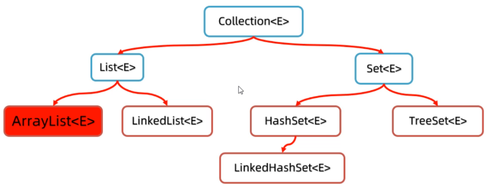


List系列集合特点：

- 添加的元素是有序，可重复，有索引。有ArrayList，LinkedList。


Set系列集合特点：

- 添加的元素无序，不重复，无索引。有HashSet，LinkedHashSet，TreeSet
- HashSet无序，不重复，无索引。
- LinkedHashSet有序，不重复，无索引。
- TreeSet按照大小默认升序排序，不重复，无索引。


代码演示：

```java
public class Test {
    public static void main(String[] args){
        // 集合：ArrayList  当成JS中的数组来用
        // 不同的集合有不同的特点

        // Collection 接口 单列集合  集合里面是一个个的元素
        //    List接口
        //       ArrayList实现类   LinkedList实现类
        //    Set接口
        //       HashSet实现类
        //       .....

        // ----------------------------------------------------------

        // Map   双列集合  集合里面是一个个的键值对
        //    .....

        // 创建ArrayList集合  List集合的特点：1）添加的元素是有序  2）可重复的  3）有索引
        ArrayList<String> list = new ArrayList<String>();
        list.add("ok");
        list.add("java");
        list.add("java");
        list.add("vue");
        System.out.println(list);
        System.out.println(list.get(0));

        // HashSet特点：1）添加的元素是无序的  2）不重复  3）无索引的
        HashSet<String> hashSet = new HashSet<>();
        hashSet.add("ok");
        hashSet.add("java");
        hashSet.add("java");
        hashSet.add("vue");
        System.out.println(hashSet);
        System.out.println(hashSet);
    }
}
```


### 2，Collection集合常用方法

Collection集合的有一些常用方法，这些方法所有Collection实现类都可以使用，以创建ArrayList为例，代码演示：

```java
import java.util.ArrayList;
import java.util.Arrays;
import java.util.Collection;
import java.util.HashSet;

public class Test {
    public static void main(String[] args){
        // 多态
        Collection<String> c = new ArrayList<String>();
        // 添加元素到集合中
        c.add("ok");
        c.add("java");
        c.add("java");
        c.add("vue");
        System.out.println(c); // [ok, java, java, vue]


        // 获取集合的大小
        System.out.println(c.size());

        // 判断集合中是否包含某个元素
        System.out.println(c.contains("java"));
        System.out.println(c.contains("小程序"));

        // 删除某个元素，如果有多个重复元素只能删除第一个
        System.out.println(c.remove("vue"));
        System.out.println(c);

        System.out.println(c.remove("java"));
        System.out.println(c);

        // 清空集合的元素
        //c.clear();
        //System.out.println(c);

        // 判断集合是否为空
        System.out.println(c.isEmpty());

        // 把集合转化成数组
        Object[] array = c.toArray();
        System.out.println(array);
        System.out.println(Arrays.toString(array));

        // 把集合转化成指定类型的数组
        String[] array1 = c.toArray(new String[c.size()]);
        System.out.println(Arrays.toString(array1));

        // 也可以把一个集合中的元素添加到另一个集合中
        Collection<String> c1 = new ArrayList<>();
        c1.add("java1");
        c1.add("java2");
        Collection<String> c2 = new ArrayList<>();
        c2.add("java3");
        c2.add("java4");
        c1.addAll(c2); // 把c2集合中的全部元素添加到c2集合中
    }
}
```


总结一下Collection集合的常用功能，ArrayList、LinkedList、HashSet、LinkedHashSet、TreeSet集合都可以调用下面的方法。

- public boolean add(E e)   把给定的对象添加到当前集合中
- public void clear()   清空集合中所有的元素
- public boolean remove(E e)   把给定的对象大当前集合中删除
- public boolean contains(Object obj)   判断当前集合中是否包含给定的对象
- public boolean isEmpty()   判断当前集合是否为空
- public int size()    返回集合中元素的个数
- public Object[] toArray()   把集合中的元素，存储到数组中


### 3，Collection迭代器遍历

普通的for循环只能遍历List集合，不能遍历Set集合，因为以前的普通for循环遍历需要索引，只有List集合有索引，而Set集合没有索引。接下来，我们学习一些常见的遍历集合方式。迭代器就是一种集合的通用遍历方式。


代码演示：

```java
public class Test {
    public static void main(String[] args){
        Collection<String> c = new ArrayList<String>();
        c.add("ok");
        c.add("java");
        c.add("java");
        c.add("vue");
        System.out.println(c); // [ok, java, java, vue]

        // 得到迭代器对象
        Iterator<String> it = c.iterator();
        //System.out.println(it.next());
        //System.out.println(it.hasNext());  // 判断是否迭代完毕
        //System.out.println(it.next());
        //System.out.println(it.hasNext());  // 判断是否迭代完毕
        //System.out.println(it.next());
        //System.out.println(it.hasNext());  // 判断是否迭代完毕
        //System.out.println(it.next());
        //System.out.println(it.hasNext());  // 判断是否迭代完毕
        //System.out.println(it.next());
        //System.out.println(it.hasNext());  // 判断是否迭代完毕

        while (it.hasNext()){
            System.out.println(it.next());
        }
    }
}
```


分析如下：

- 当调用iterator()方法获取迭代器时，当前指向第一个元素
- hasNext()方法则判断这个位置是否有元素，如果有则返回true，进入循环
- 调用next()方法获取元素，并将当月元素指向下一个位置，
- 等下次循环时，则获取下一个元素，依此内推


### 4，Collection增强for循环遍历


增强for循环的格式：

```java
for(元素的数据类型 变量名 : 数组或集合){}
```


增强for不光可以遍历集合，还可以遍历数组。代码演示：

```java
public class Test {
    public static void main(String[] args){
        Collection<String> c = new ArrayList<String>();
        c.add("ok");
        c.add("java");
        c.add("java");
        c.add("vue");
        System.out.println(c); // [ok, java, java, vue]

        for (String s : c) {
            System.out.println(s);
        }

        System.out.println("--------------");

        String[] arr = {"abc","def","ok","vue","webpack"};
        // 增强for循环也可以遍历数组
        for (String name : arr) {
            System.out.println(name);
        }
    }
}
```


### 5，Collection forEach遍历

forEach方法的参数是一个Consumer接口，而Consumer是一个函数式接口，所以可以传递Lambda表达式。代码演示：

```java
public class Test {
    public static void main(String[] args){
        Collection<String> c = new ArrayList<String>();
        c.add("ok");
        c.add("java");
        c.add("java");
        c.add("vue");
        System.out.println(c); // [ok, java, java, vue]

        // 原始写法
        c.forEach(new Consumer<String>() {
            @Override
            public void accept(String s) {
                System.out.println(s);
            }
        });

        System.out.println("--------------");

        // 使用lambda表达式进行简写
        c.forEach(s->System.out.println(s));
    }
}
```


### 6，遍历案例


案例：展示多部电影信息，每部电影都是一个对象，多部电影要使用集合装起来。遍历集合中的3个电影对象，输出每部电影的详情信息。


写一个电影类，用来描述每一步电影应该有哪些信息。

```java
class Movie{
    private String name; //电影名称
    private double score; //评分
    private String actor; //演员

    // 无参构造，全参构造，getter，setter，toString
}
```


测试类，完成上面的需求，如下：

```java
public class Test {
    public static void main(String[] args){
        Collection<Movie> movies = new ArrayList<>();
        movies.add(new Movie("《肖申克的救赎》", 9.7, "罗宾斯"));
        movies.add(new Movie("《霸王别姬》", 9.6, "张国荣、张丰毅"));
        movies.add(new Movie("《阿甘正传》", 9.5, "汤姆汉克斯"));

        for (Movie m : movies) {
            System.out.println("电影名：" + m.getName());
            System.out.println("评分：" + m.getScore());
            System.out.println("主演：" + m.getActor());
        }
    }
}
```


## 三，List系列集合

前面我们已经把Collection通用的功能学习完了，接下来我们学习Collection下面的一个子体系List集合。如下图所示：

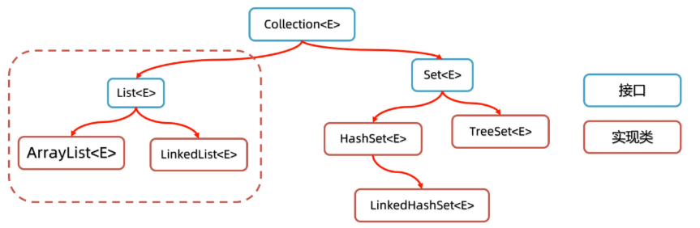


List系列集合(ArrayList和LinkedList底层实现不同，适合的场景不同)特点：

- ArrayList：有序，可重复，有索引
- LinkedList： 有序，可重复，有索引


### 1，List集合的常用方法

List集合是有索引的，所以多了一些有索引操作的方法。

- void add(int index, E element)  在此集合中的指定位置插入指定的元素
- E remove(int index)  删除指定索引处的元素，返回被删除的元素
- E set(int index, E element) 修改指定索引处的元素，返回被修改的元素
- E get(int index) 返回指定索引处的元素


代码演示：

```java
public class Test {
    public static void main(String[] args){
        // List是一个接口，有索引，所以又添加了一些关于索引相关的api
        List<String> c = new ArrayList<String>();
        c.add("ok");
        c.add("java1");
        c.add("java2");
        c.add("vue");
        System.out.println(c);

        // 此处的add是List接口中的api  在某个索引位置插入元素
        c.add(1,"react");
        System.out.println(c);

        // 根据索引删除某个元素，返回被删除的那个元素
        System.out.println(c.remove(1));
        System.out.println(c);

        // 返回集合中指定位置的元素
        System.out.println(c.get(1));

        // set是根据索引修改某个元素，返回修改前的那个元素
        System.out.println(c.set(1,"java666"));
        System.out.println(c);
    }
}
```


### 2，List集合的遍历方式


List集合相比于前面的Collection多了一种可以通过索引遍历的方式，所以List集合遍历方式一共有四种：

- 普通for循环（只因为List有索引）
- 迭代器
- 增强for
- Lambda表达式


代码演示：

```java
public class Test {
    public static void main(String[] args){
        // List是一个接口，有索引，所以又添加了一些关于索引相关的api
        List<String> list = new ArrayList<String>();
        list.add("ok");
        list.add("java1");
        list.add("java2");
        list.add("vue");
        System.out.println(list);

        //1.普通for循环
        for(int i = 0; i< list.size(); i++){
            //i = 0, 1, 2
            String e = list.get(i);
            System.out.println(e);
        }

        //2.增强for遍历
        for(String s : list){
            System.out.println(s);
        }

        //3.迭代器遍历
        Iterator<String> it = list.iterator();
        while(it.hasNext()){
            String s = it.next();
            System.out.println(s);
        }

        //4.lambda表达式遍历
        list.forEach(s->System.out.println(s));
    }
}
```


### 3，ArrayList底层原理


ArrayList集合底层是基于数组结构实现的，也就是说当你往集合容器中存储元素时，底层本质上是往数组中存储元素。 特点如下：

- 查询速度快：查询数据通过地址值和索引定位，查询任意数据耗时相同。
- 删除效率低：可能需要把后面很多数据进行前移。
- 添加效率极低：可能需要把后面很多的数据后移，再添加元素。也可能需要进行数据扩容。


我们知道数组的长度是固定的，但是集合的长度是可变的，这是怎么做到的呢？原理如下：

1. 利用无参构造器创建集合，会在底层创建一个默认长度为0的数组。
2. 添加第1个元素时，底层会创建一个新的长度为10的数组。
3. 存满时，会扩容1.5倍。
4. 如果一次添加多个元素，1.5倍还放不下，则新创建数组的长度以实际为准。


数组扩容，并不是在原数组上扩容（原数组是不可以扩容的），底层是创建一个新数组，然后把原数组中的元素全部复制到新数组中去。


### 4，LinkedList底层原理


LinkedList底层是链表结构，链表结构是由一个一个的节点组成，一个节点由数据值、下一个元素的地址组成。特点如下：

- 查询慢，无论查询哪个数据都要从头开始找。
- 增删相对快，只需要动两个指针就行。


链表也是分两种：

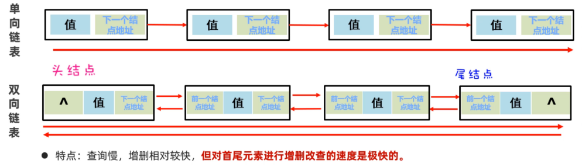


LinkedList集合是基于双向链表实现了，所以相对于ArrayList新增了一些可以针对头尾进行操作的方法：

- public void addFirst(E e) 在该列表开头插入指定元素
- public void addLast(E e) 在指定的元素追加到此列表的末尾
- public E getFirst() 返回此列表中的第1个元素
- public E getLast() 返回此列表中的最后一个元素
- public E removeFirst() 从此列表中删除并返回第一个元素
- public E removeLast() 从此列表中删除并返回最后一个元素


### 5，LinkedList应用场景


可以使用LinkList来设计栈结构、队列结构。栈和队列的特点：

- 队列结构两端开口，一端进，一端出

  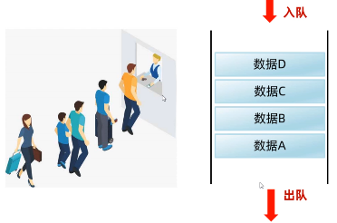

- 栈结构的特点是先进后出，后进先出

  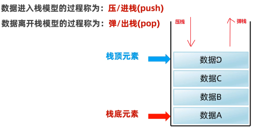


使用LinkedList模拟队列结构，入队列可以调用LinkedList集合的addLast方法，出队列可以调用removeFirst()方法，如下：

```java

```


使用LinkedList模拟栈结构，如下：

```java

```


## 四，Set系列集合


### 1，Set集合的特点

Set集合是属于Collection体系下的另一个分支，如下图：

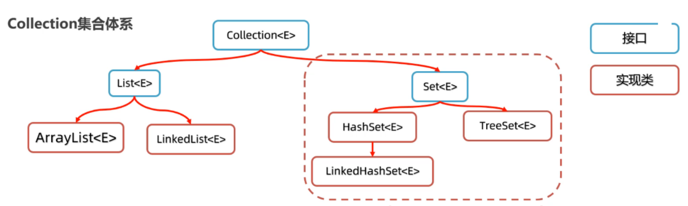


Set系列集合的特点：

- HashSet: 无序，不重复，无索引
- LinkedHashSet: 有序，不重复，无索引
- TreeSet: 排序，不重复，无索引


代码演示：

```java
//Set<Integer> set = new HashSet<>();	//无序、无索引、不重复
//Set<Integer> set = new LinkedHashSet<>(); //有序、无索引、不重复
Set<Integer> set = new TreeSet<>(); //可排序(升序)、无索引、不重复
set.add(666);
set.add(555);
set.add(555);
set.add(888);
set.add(888);
set.add(777);
set.add(777);
System.out.println(set); //[555, 666, 777, 888]
```


### 2，HashSet集合底层原理

通过了解HashSet的底层原理。我们可以更加透彻的理解HashSet为什么可以去重。HashSet集合底层是基于哈希表实现的，哈希表根据JDK版本的不同，也是有点区别的：

- JDK8以前：哈希表 = 数组+链表
- JDK8以后：哈希表 = 数组+链表+红黑树


往HashSet集合中存储元素时，底层调用了元素的两个方法：一个是hashCode方法获取元素的hashCode值（哈希值）；另一个是调用了元素的equals方法，用来比较新添加的元素和集合中已有的元素是否相同。 

- 只有新添加元素的hashCode值和集合中已有元素的hashCode值相同、新添加的元素调用equals方法和集合中已有元素比较结果为true, 才认为元素重复。
- 如果hashCode值相同，equals比较不同，则以链表的形式连接在数组的同一个索引为位置

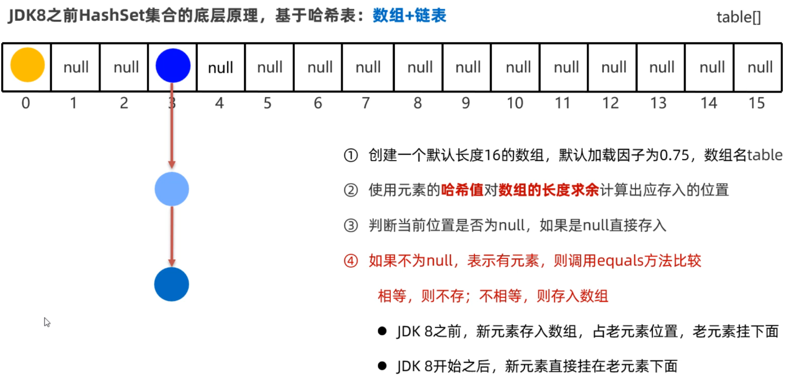


在JDK8开始后，为了提高性能，当链表的长度超过8时，就会把链表转换为红黑树，如下图所示：

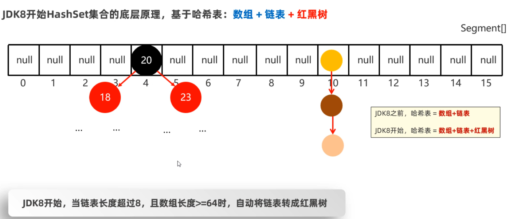


### 3，HashSet去重原理


前面学习了HashSet存储元素的原理，依赖于两个方法：一个是hashCode方法用来确定在底层数组中存储的位置，另一个是用equals方法判断新添加的元素是否和集合中已有的元素相同。要想保证在HashSet集合中没有重复元素，我们需要重写元素类的hashCode和equals方法。比如以下面的Student类为例，假设把Student类的对象作为HashSet集合的元素，想要让学生的姓名和年龄相同，就认为元素重复。代码如下：

```java
public class Student{
    private String name; //姓名
    private int age; //年龄
    private double height; //身高
 
    //无参数构造方法
    public Student(){}
    //全参数构造方法
    public Student(String name, int age, double height){
        this.name=name;
        this.age=age;
        this.height=height;
    }
    //...get、set、toString()方法自己补上..
    
    //按快捷键生成hashCode和equals方法
    //alt+insert 选择 hashCode and equals
    @Override
    public boolean equals(Object o) {
        if (this == o) return true;
        if (o == null || getClass() != o.getClass()) return false;

        Student student = (Student) o;

        if (age != student.age) return false;
        if (Double.compare(student.height, height) != 0) return false;
        return name != null ? name.equals(student.name) : student.name == null;
    }

    @Override
    public int hashCode() {
        int result;
        long temp;
        result = name != null ? name.hashCode() : 0;
        result = 31 * result + age;
        temp = Double.doubleToLongBits(height);
        result = 31 * result + (int) (temp ^ (temp >>> 32));
        return result;
    }
}
```

写一个测试类，往HashSet集合中存储Student对象。

```java
public class Test{
    public static void main(String[] args){
        Set<Student> students = new HashSet<>();
        Student s1 = new Student("至尊宝",20, 169.6);
        Student s2 = new Student("蜘蛛精",23, 169.6);
        Student s3 = new Student("蜘蛛精",23, 169.6);
        Student s4 = new Student("牛魔王",48, 169.6);
        
        students.add(s1);
        students.add(s2);
        students.add(s3);
        students.add(s4);
        
        for(Student s : students){
            System.out.println(s);
        }
    }
}
```


打印结果如下，我们发现存了两个蜘蛛精，当时实际打印出来只有一个，而且是无序的。

```java
Student{name='牛魔王', age=48, height=169.6}
Student{name='至尊宝', age=20, height=169.6}
Student{name='蜘蛛精', age=23, height=169.6}
```


### 4，LinkedHashSet底层原理

LinkedHashSet类是HashSet的子类。LinkedHashSet它底层采用的是也是哈希表结构，只不过额外新增了一个双向链表来维护元素的存取顺序。如下下图所示：

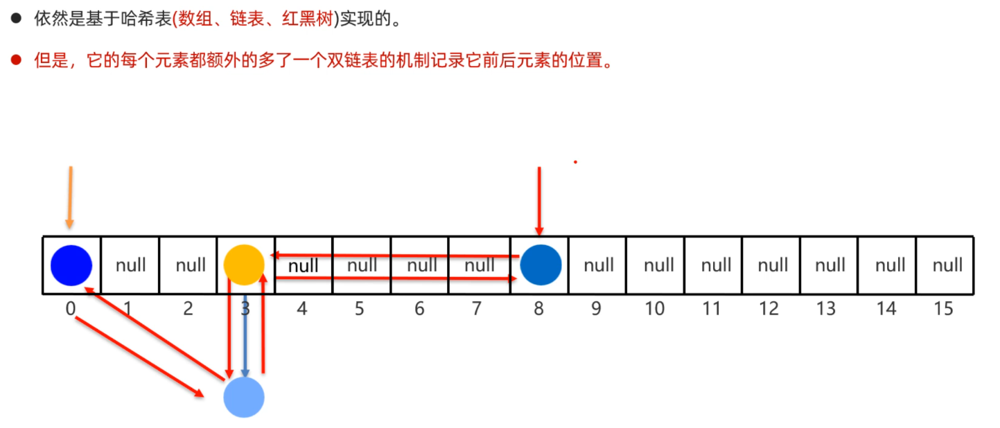


每次添加元素，就和上一个元素用双向链表连接一下。第一个添加的元素是双向链表的头节点，最后一个添加的元素是双向链表的尾节点。把上个案例中的集合改成LinkedList集合，我们观察效果怎样，如下：

```java
public class Test{
    public static void main(String[] args){
        Set<Student> students = new LinkedHashSet<>();
        Student s1 = new Student("至尊宝",20, 169.6);
        Student s2 = new Student("蜘蛛精",23, 169.6);
        Student s3 = new Student("蜘蛛精",23, 169.6);
        Student s4 = new Student("牛魔王",48, 169.6);
        
        students.add(s1);
        students.add(s2);
        students.add(s3);
        students.add(s4);
        
        for(Student s : students){
            System.out.println(s);
        }
    }
}
```


打印结果如下：

```java
Student{name='至尊宝', age=20, height=169.6}
Student{name='蜘蛛精', age=23, height=169.6}
Student{name='牛魔王', age=48, height=169.6}
```


### 5，TreeSet集合

TreeSet集合的特点是可以对元素进行排序，但是必须指定元素的排序规则。如果往集合中存储String类型的元素，或者Integer类型的元素，它们本身就具备排序规则，所以直接就可以排序。代码演示：

```java
Set<Integer> set1= new TreeSet<>();
set1.add(8);
set1.add(6);
set1.add(4);
set1.add(3);
set1.add(7);
set1.add(1);
set1.add(5);
set1.add(2);
System.out.println(set1); //[1,2,3,4,5,6,7,8]

Set<Integer> set2= new TreeSet<>();
set2.add("a");
set2.add("c");
set2.add("e");
set2.add("b");
set2.add("d");
set2.add("f");
set2.add("g");
System.out.println(set1); //[a,b,c,d,e,f,g]
```


如果往TreeSet集合中存储自定义类型的元素，比如说Student类型，则需要我们自己指定排序规则，否则会出现异常。代码演示：

```java
//创建TreeSet集合，元素为Student类型
Set<Student> students = new TreeSet<>();

//创建4个Student对象
Student s1 = new Student("至尊宝",20, 169.6);
Student s2 = new Student("紫霞",23, 169.8);
Student s3 = new Student("蜘蛛精",23, 169.6);
Student s4 = new Student("牛魔王",48, 169.6);

//添加Studnet对象到集合
students.add(s1);
students.add(s2);
students.add(s3);
students.add(s4);
System.out.println(students); 
```


此时运行代码，会直接报错。原因是TreeSet不知道按照什么条件对Student对象来排序。如下：


我们想要告诉TreeSet集合按照指定的规则排序，有两种办法：

- 第一种：让元素的类实现Comparable接口，重写compareTo方法
- 第二种：在创建TreeSet集合时，通过构造方法传递Compartor比较器对象


演示第一种排序方式，如下：

```java
//第一步：先让Student类，实现Comparable接口
//注意：Student类的对象是作为TreeSet集合的元素的
public class Student implements Comparable<Student>{
    private String name;
    private int age;
    private double height;
	//无参数构造方法
    public Student(){}
    //全参数构造方法
    public Student(String name, int age, double height){
        this.name=name;
        this.age=age;
        this.height=height;
    }
    //...get、set、toString()方法自己补上..
    
    //第二步：重写compareTo方法
    //按照年龄进行比较，只需要在方法中让this.age和o.age相减就可以。
    /*
    原理：
    在往TreeSet集合中添加元素时，add方法底层会调用compareTo方法，根据该方法的
    结果是正数、负数、还是零，决定元素放在后面、前面还是不存。
    */
    @Override
    public int compareTo(Student o) {
        //this：表示将要添加进去的Student对象
        //o: 表示集合中已有的Student对象
        return this.age-o.age;
    }
}
```

此时，再运行测试类，结果如下

```java
Student{name='至尊宝', age=20, height=169.6}
Student{name='紫霞', age=20, height=169.8}
Student{name='蜘蛛精', age=23, height=169.6}
Student{name='牛魔王', age=48, height=169.6}
```


演示第二种排序方式，如下：

```java
//创建TreeSet集合时，传递比较器对象排序
/*
原理：当调用add方法时，底层会先用比较器，根据Comparator的compare方是正数、负数、还是零，决定谁在后，谁在前，谁不存。
*/
//下面代码中是按照学生的年龄升序排序
Set<Student> students = new TreeSet<>(new Comparator<Student>{
    @Override
    public int compare(Student o1, Student o2){
        //需求：按照学生的身高排序
        return Double.compare(o1,o2); 
    }
});

//创建4个Student对象
Student s1 = new Student("至尊宝",20, 169.6);
Student s2 = new Student("紫霞",23, 169.8);
Student s3 = new Student("蜘蛛精",23, 169.6);
Student s4 = new Student("牛魔王",48, 169.6);

//添加Studnet对象到集合
students.add(s1);
students.add(s2);
students.add(s3);
students.add(s4);
System.out.println(students); 
```


### 7，并发修改异常

在使用迭代器遍历集合时，可能存在并发修改异常。演示一下这个异常：

```java
List<String> list = new ArrayList<>();
list.add("王麻子");
list.add("小李子");
list.add("李爱花");
list.add("张全蛋");
list.add("晓李");
list.add("李玉刚");
System.out.println(list); // [王麻子, 小李子, 李爱花, 张全蛋, 晓李, 李玉刚]

//需求：找出集合中带"李"字的姓名，并从集合中删除
Iterator<String> it = list.iterator();
while(it.hasNext()){
    String name = it.next();
    if(name.contains("李")){
        list.remove(name);
    }
}
System.out.println(list);
```


运行上面的代码，会出现下面的异常：


为什么会出现这个异常呢？那是因为迭代器遍历机制，规定迭代器遍历集合的同时，不允许集合自己去增删元素，否则就会出现这个异常。怎么解决这个问题呢？不使用集合的删除方法，而是使用迭代器的删除方法，代码如下：

```java
List<String> list = new ArrayList<>();
list.add("王麻子");
list.add("小李子");
list.add("李爱花");
list.add("张全蛋");
list.add("晓李");
list.add("李玉刚");
System.out.println(list); // [王麻子, 小李子, 李爱花, 张全蛋, 晓李, 李玉刚]

//需求：找出集合中带"李"字的姓名，并从集合中删除
Iterator<String> it = list.iterator();
while(it.hasNext()){
    String name = it.next();
    if(name.contains("李")){
        //list.remove(name);
        it.remove(); //当前迭代器指向谁，就删除谁
    }
}
System.out.println(list);
```


## 五，Collection其它操作


前面我们已经把Collection家族的集合都学习完了。为了更加方便的对Collection集合进行操作，今天我们还要学习一个操作Collection集合的工具类，叫做Collections。但是Collections工具类中需要用到一个没有学过的小知识点，叫做可变参数，所以必须先学习这个前置知识可变参数，再学习Collections工具类，最后再利用这个工具类做一个综合案例。


### 1，可变参数

可变参数是一种特殊的形式参数，定义在方法、构造器的形参列表处，它可以让方法接收多个同类型的实际参数。可变参数在方法内部，本质上是一个数组。代码演示：

```java
public class ParamTest{
    public static void main(String[] args){
        //不传递参数，下面的nums长度则为0, 打印元素是[]
        test();	
        
        //传递3个参数，下面的nums长度为3，打印元素是[10, 20, 30]
        test(10,20,30); 
        
        //传递一个数组，下面数组长度为4，打印元素是[10,20,30,40] 
        int[] arr = new int[]{10,20,30,40}
        test(arr); 
    }
    
    public static void test(int...nums){
        //可变参数在方法内部，本质上是一个数组
        System.out.println(nums.length);
        System.out.println(Arrays.toString(nums));
        System.out.println("----------------");
    }
}
```


注意点（大家自行写代码演示）：

- 一个形参列表中，只能有一个可变参数；否则会报错
- 一个形参列表中如果多个参数，可变参数需要写在最后；否则会报错


### 2，Collections工具类

Collections并不是集合，它比Collection多了一个s，一般后缀为s的类很多都是工具类。这里的Collections是用来操作Collection的工具类。它提供了一些好用的静态方法，如下：

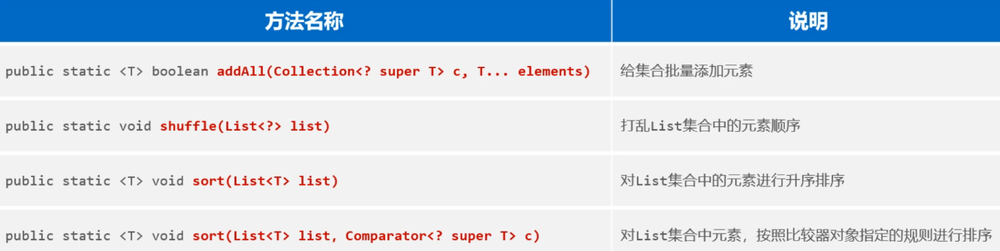


代码演示：

```java
public class CollectionsTest{
    public static void main(String[] args){
        //1.public static <T> boolean addAll(Collection<? super T> c, T...e)
        List<String> names = new ArrayList<>();
        Collections.addAll(names, "张三","王五","李四", "张麻子");
        System.out.println(names);
        
        //2.public static void shuffle(List<?> list)：对集合打乱顺序
        Collections.shuffle(names);
        System.out.println(names);
        
        //3.public static <T> void short(List<T list): 对List集合排序
        List<Integer> list = new ArrayList<>();
        list.add(3);
        list.add(5);
        list.add(2);
        Collections.sort(list);
        System.out.println(list);
    }
}
```


上面我们往集合中存储的元素要么是Stirng类型，要么是Integer类型，他们本来就有一种自然顺序所以可以直接排序。但是如果我们往List集合中存储Student对象，这个时候想要对List集合进行排序自定义比较规则的。指定排序规则有两种方式，如下：

- 排序方式1：让元素实现Comparable接口，重写compareTo方法
- 排序方式2：使用调用sort方法是，传递比较器


排序方式1：让元素实现Comparable接口，重写compareTo方法

```java
public class Student implements Comparable<Student>{
    private String name;
    private int age;
    private double height;
    
     //排序时：底层会自动调用此方法，this和o表示需要比较的两个对象
    @Override
    public int compareTo(Student o){
        //需求：按照年龄升序排序
        //如果返回正数：说明左边对象的年龄>右边对象的年龄
        //如果返回负数：说明左边对象的年龄<右边对象的年龄，
        //如果返回0：说明左边对象的年龄和右边对象的年龄相同
        return this.age - o.age;
    }
    
    //...getter、setter、constructor..
}
```

然后再使用`Collections.sort(list集合)`对List集合排序，如下：

```java
//3.public static <T> void short(List<T list): 对List集合排序
List<Student> students = new ArrayList<>();
students.add(new Student("蜘蛛精",23,169.7));
students.add(new Student("紫霞",22,169.8));
students.add(new Student("紫霞",22,169.8));
students.add(new Student("至尊宝",26,169.5));

/*
原理：sort方法底层会遍历students集合中的每一个元素，采用排序算法，将任意两个元素两两比较；
	每次比较时，会用一个Student对象调用compareTo方法和另一个Student对象进行比较；
	根据compareTo方法返回的结果是正数、负数，零来决定谁大，谁小，谁相等，重新排序元素的位置
	
	注意：这些都是sort方法底层自动完成的，想要完全理解，必须要懂排序算法才行；
*/
Collections.sort(students);	
System.out.println(students);
```


排序方式2：使用调用sort方法是，传递比较器

```java
/*
原理：sort方法底层会遍历students集合中的每一个元素，采用排序算法，将任意两个元素两两比较；
	每次比较，会将比较的两个元素传递给Comparator比较器对象的compare方法的两个参数o1和o2,
	根据compare方法的返回结果是正数，负数，或者0来决定谁大，谁小，谁相等，重新排序元素的位置
	
	注意：这些都是sort方法底层自动完成的，不需要我们完全理解，想要理解它必须要懂排序算法才行.
*/
Collections.sort(students, new Comparator<Student>(){
    @Override
    public int compare(Student o1, Student o2){
        return o1.getAge()-o2.getAge();
    }
});	
System.out.println(students);
```


### 3，斗地主案例

我们先分析一下业务需求：

- 总共有54张牌，每一张牌有花色和点数两个属性、为了排序还可以再加一个序号
- 点数可以是：`“3”,"4","5","6","7","8","9","10","J","Q","K","A","2"`
- 花色可以是：`“♣”,"♠","♥","♦"`
- 斗地主时：三个玩家没人手里17张牌，剩余3张牌作为底牌


第一步：为了表示每一张牌有哪些属性，首先应该新建一个扑克牌的类(定义一个扑克类Card)

```java
public class Card {
    private String number;
    private String color;
    // 每张牌是存在大小的。
    private int size; // 0 1 2 ....

    public Card() {
    }

    public Card(String number, String color, int size) {
        this.number = number;
        this.color = color;
        this.size = size;
    }

    public String getNumber() {
        return number;
    }

    public void setNumber(String number) {
        this.number = number;
    }

    public String getColor() {
        return color;
    }

    public void setColor(String color) {
        this.color = color;
    }

    public int getSize() {
        return size;
    }

    public void setSize(int size) {
        this.size = size;
    }

    @Override
    public String toString() {
        return color + number ;
    }
}
```


第二步：启动游戏时，就应该提前准备好54张牌(定义一个房间类，初始化房间时准备好54张牌)

```java
public class Room {
    // 必须有一副牌。
    private List<Card> allCards = new ArrayList<>();

    public Room(){
        // 1、做出54张牌，存入到集合allCards
        // a、点数：个数确定了，类型确定。
        String[] numbers = {"3","4","5","6","7","8","9","10","J","Q","K","A","2"};
        // b、花色：个数确定了，类型确定。
        String[] colors = {"♠", "♥", "♣", "♦"};
        int size = 0; // 表示每张牌的大小
        // c、遍历点数，再遍历花色，组织牌
        for (String number : numbers) {
            // number = "3"
            size++; // 1 2 ....
            for (String color : colors) {
                // 得到一张牌
                Card c = new Card(number, color, size);
                allCards.add(c); // 存入了牌
            }
        }
        // 单独存入小大王的。
        Card c1 = new Card("",  "🃏" , ++size);
        Card c2 = new Card("", "👲" , ++size);
        Collections.addAll(allCards, c1, c2);
        System.out.println("新牌：" + allCards);
    }
}
```


第三步：定义一个启动游戏的方法，完成洗牌、发牌、捋牌、看牌的业务逻辑

```java
public void start() {
    // 1、洗牌： allCards
    Collections.shuffle(allCards);
    System.out.println("洗牌后：" + allCards);

    // 2、发牌，首先肯定要定义 三个玩家。 List(ArrayList)  Set(TreeSet)
    List<Card> linHuChong = new ArrayList<>();
    List<Card> jiuMoZhi = new ArrayList<>();
    List<Card> renYingYing = new ArrayList<>();
    // 正式发牌给这三个玩家，依次发出51张牌，剩余3张做为底牌。
    // allCards = [♥3, ♣10, ♣4, ♥K, ♦Q, ♣2, 🃏, ♣8, ....
    //             0     1   2   3   4   5   6 ...   % 3
    for (int i = 0; i < allCards.size() - 3; i++) {
        Card c = allCards.get(i);
        // 判断牌发给谁
        if(i % 3 == 0){
            // 请啊冲接牌
            linHuChong.add(c);
        }else if(i % 3 == 1){
            // 请啊鸠来接牌
            jiuMoZhi.add(c);
        }else if(i % 3 == 2){
            // 请盈盈接牌
            renYingYing.add(c);
        }
    }

    // 3、对3个玩家的牌进行排序
    sortCards(linHuChong);
    sortCards(jiuMoZhi);
    sortCards(renYingYing);
    // 4、看牌
    System.out.println("啊冲：" + linHuChong);
    System.out.println("啊鸠：" + jiuMoZhi);
    System.out.println("盈盈：" + renYingYing);
    List<Card> lastThreeCards = allCards.subList(allCards.size() - 3, allCards.size()); // 51 52 53
    System.out.println("底牌：" + lastThreeCards);
    jiuMoZhi.addAll(lastThreeCards);
    sortCards(jiuMoZhi);
    System.out.println("啊鸠抢到地主后：" + jiuMoZhi);
}

/**
     * 集中进行排序
     * @param cards
     */
private void sortCards(List<Card> cards) {
    Collections.sort(cards, new Comparator<Card>() {
        @Override
        public int compare(Card o1, Card o2) {
            // return o1.getSize() - o2.getSize(); // 升序排序
            return o2.getSize() - o1.getSize(); // 降序排序
        }
    });
}
```


测试类，如下：

```java
public class GameDemo {
    public static void main(String[] args) {
        //  1、牌类。
        //  2、房间
        Room m = new Room();
        //  3、启动游戏
        m.start();
    }
}
```


## 六，Map集合


### 1，Map介绍

Map是双列集合，就是说集合中的元素是一对一对的。Map集合中的每一个元素是以`key=value`的形式存在的，一个`key=value`就称之为一个键值对，而且在Java中有一个类叫Entry类，Entry的对象用来表示键值对对象。所有的Map集合有如下的特点：键不能重复，值可以重复，每一个键只能找到自己对应的值。


代码演示：

```java
public class Test {
    public static void main(String[] args) {
        // Map<String, Integer> map = new HashMap<>(); // 一行经典代码。 按照键 无序，不重复，无索引。
        Map<String, Integer> map = new LinkedHashMap<>(); // 有序，不重复，无索引。
        map.put("手表", 100);
        map.put("手表", 220); // 后面重复的数据会覆盖前面的数据（键）
        map.put("手机", 2);
        map.put("Java", 2);
        map.put(null, null);
        System.out.println(map);

        Map<Integer, String> map1 = new TreeMap<>(); // 可排序，不重复，无索引
        map1.put(23, "Java");
        map1.put(23, "MySQL");
        map1.put(19, "李四");
        map1.put(20, "王五");
        System.out.println(map1);
    }
}
```


Map集合也有很多种，在Java中使用不同的类来表示的，每一种Map集合其键的特点是有些差异的，值是键的一个附属值，所以我们只关注键的特点就可以了。

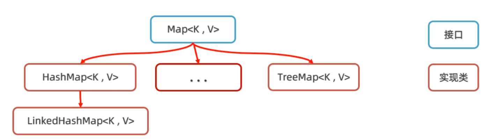


Map集合的特点（由键决定的，值只是一个附属品，值是不做要求的）：

- HashMap：无序，不重复，无索引，用的最多。
- LinkedHashMap：有序，不重复，无索引。
- TreeMap：按照大小默认升序排序，不重复，无索引。


### 2，Map集合常用方法

Map是所有双列集合的父接口，所以我们只需要学习Map接口中每一个方法是什么含义，那么所有的Map集合方法你就都会用了。

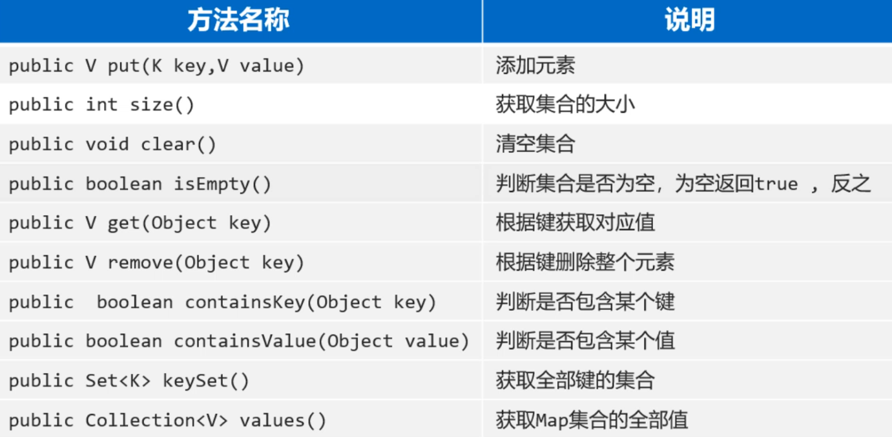


代码演示：

```java
public class Test {
    public static void main(String[] args) {
        // 1.添加元素: 无序，不重复，无索引。
        Map<String, Integer> map = new HashMap<>();
        map.put("手表", 100);
        map.put("手表", 220);
        map.put("手机", 2);
        map.put("Java", 2);
        map.put(null, null);
        System.out.println(map);
        // map = {null=null, 手表=220, Java=2, 手机=2}

        // 2.public int size():获取集合的大小
        System.out.println(map.size());

        // 3、public void clear():清空集合
        //map.clear();
        //System.out.println(map);

        // 4.public boolean isEmpty(): 判断集合是否为空，为空返回true ,反之！
        System.out.println(map.isEmpty());

        // 5.public V get(Object key)：根据键获取对应值
        int v1 = map.get("手表");
        System.out.println(v1);
        System.out.println(map.get("手机")); // 2
        System.out.println(map.get("张三")); // null

        // 6. public V remove(Object key)：根据键删除整个元素(删除键会返回键的值)
        System.out.println(map.remove("手表"));
        System.out.println(map);

        // 7.public  boolean containsKey(Object key): 判断是否包含某个键 ，包含返回true ,反之
        System.out.println(map.containsKey("手表")); // false
        System.out.println(map.containsKey("手机")); // true
        System.out.println(map.containsKey("java")); // false
        System.out.println(map.containsKey("Java")); // true

        // 8.public boolean containsValue(Object value): 判断是否包含某个值。
        System.out.println(map.containsValue(2)); // true
        System.out.println(map.containsValue("2")); // false

        // 9.public Set<K> keySet(): 获取Map集合的全部键。
        Set<String> keys = map.keySet();
        System.out.println(keys);

        // 10.public Collection<V> values(); 获取Map集合的全部值。
        Collection<Integer> values = map.values();
        System.out.println(values);

        // 11.把其他Map集合的数据倒入到自己集合中来。(拓展)
        Map<String, Integer> map1 = new HashMap<>();
        map1.put("java1",  10);
        map1.put("java2",  20);
        Map<String, Integer> map2 = new HashMap<>();
        map2.put("java3",  10);
        map2.put("java2",  222);
        map1.putAll(map2); // putAll：把map2集合中的元素全部倒入一份到map1集合中去。
        System.out.println(map1);
        System.out.println(map2);
    }
}
```


### 3，Map集合遍历


Map集合的遍历方式1：键找值。 代码演示：

```java
public class Test {
    public static void main(String[] args) {
        // 准备一个Map集合。
        Map<String, Double> map = new HashMap<>();
        map.put("蜘蛛精", 162.5);
        map.put("蜘蛛精", 169.8);
        map.put("紫霞", 165.8);
        map.put("至尊宝", 169.5);
        map.put("牛魔王", 183.6);
        System.out.println(map);
        // map = {蜘蛛精=169.8, 牛魔王=183.6, 至尊宝=169.5, 紫霞=165.8}

        // 1、获取Map集合的全部键
        Set<String> keys = map.keySet();
        // System.out.println(keys);
        // [蜘蛛精, 牛魔王, 至尊宝, 紫霞]
        //         key
        // 2、遍历全部的键，根据键获取其对应的值
        for (String key : keys) {
            // 根据键获取对应的值
            double value = map.get(key);
            System.out.println(key + "=====>" + value);
        }
    }
}
```


Map集合的遍历方式2：直接获取每一个Entry对象，把Entry存储扫Set集合中去，再通过Entry对象获取键和值。

```java
public class MapTest2 {
    public static void main(String[] args) {
        Map<String, Double> map = new HashMap<>();
        map.put("蜘蛛精", 169.8);
        map.put("紫霞", 165.8);
        map.put("至尊宝", 169.5);
        map.put("牛魔王", 183.6);
        System.out.println(map);
        // map = {蜘蛛精=169.8, 牛魔王=183.6, 至尊宝=169.5, 紫霞=165.8}
        // entries = [(蜘蛛精=169.8), (牛魔王=183.6), (至尊宝=169.5), (紫霞=165.8)]
        // entry = (蜘蛛精=169.8)
        // entry = (牛魔王=183.6)
        // ...
		
        // 1、调用Map集合提供entrySet方法，把Map集合转换成键值对类型的Set集合
        Set<Map.Entry<String, Double>> entries = map.entrySet();
        for (Map.Entry<String, Double> entry : entries) {
            String key = entry.getKey();
            double value = entry.getValue();
            System.out.println(key + "---->" + value);
        }
    }
}
```


Map集合的遍历方式3：forEach

```java
public class Test {
    public static void main(String[] args) {
        Map<String, Double> map = new HashMap<>();
        map.put("蜘蛛精", 169.8);
        map.put("紫霞", 165.8);
        map.put("至尊宝", 169.5);
        map.put("牛魔王", 183.6);
        System.out.println(map);
        // map = {蜘蛛精=169.8, 牛魔王=183.6, 至尊宝=169.5, 紫霞=165.8}


		//遍历map集合，传递匿名内部类
        map.forEach(new BiConsumer<String, Double>() {
            @Override
            public void accept(String k, Double v) {
                System.out.println(k + "---->" + v);
            }
        });
		//遍历map集合，传递Lambda表达式
        map.forEach(( k,  v) -> {
            System.out.println(k + "---->" + v);
        });
    }
}
```


### 4，Map集合案例


案例：某个班级有80名学生，现在需要组织秋游活动，班长提供了四个景点，依次是A，B，C，D。每个学生只能选择一个景点，请统计出最终哪个景点想去的人数最多。


分析：

1. 首先可以将80个学生选择的景点放到一个集合中去（也就是说，集合中的元素是80个任意的ABCD元素）
2. 准备一个Map集合用来存储景点，以及景点被选择的次数
3. 遍历80个学生选择景点的集合，得到每一个景点，判断Map集合中是否包含该景点
   a. 如果不包含，则存储"景点=1"
   b. 如果包含，则存获取该景点原先的值，再存储"景点=原来的值+1"; 此时新值会覆盖旧值


代码如下：

```java
public class Test {
    public static void main(String[] args) {
        // 1、把80个学生选择的景点数据拿到程序中来。
        List<String> data = new ArrayList<>();
        String[] selects = {"A", "B", "C", "D"};
        Random r = new Random();
        for (int i = 1; i <= 80; i++) {
            // 每次模拟一个学生选择一个景点，存入到集合中去。
            int index = r.nextInt(4); // 0 1 2 3
            data.add(selects[index]);
        }
        System.out.println(data);

        // 2、开始统计每个景点的投票人数
        // 准备一个Map集合用于统计最终的结果
        Map<String, Integer> result = new HashMap<>();

        // 3、开始遍历80个景点数据
        for (String s : data) {
            // 问问Map集合中是否存在该景点
            if(result.containsKey(s)){
                // 说明这个景点之前统计过。其值+1. 存入到Map集合中去
                result.put(s, result.get(s) + 1);
            }else {
                // 说明这个景点是第一次统计，存入"景点=1"
                result.put(s, 1);
            }
        }
        System.out.println(result);
    }
}
```


### 5，HashMap

Map接口下面有三个实现类HashMap、LinkedHashMap、TreeMap。实际上这三个实现类并没有什么特有方法需要我们学习，它们的方法就是前面学习Map的方法。这里我们主要学习它们的底层原理。


前面我们学习过HashSet的底层原理，实际上HashMap底层原理和HashSet是一样的。为什么这么说呢？因为我们往HashSet集合中添加元素时，实际上是把元素作为添加添加到了HashMap集合中。下面是Map集合的体系结构，HashMap集合的特点是由键决定的： **它的键是无序、不能重复，而且没有索引的**。再各种Map集合中也是用得最多的一种集合。

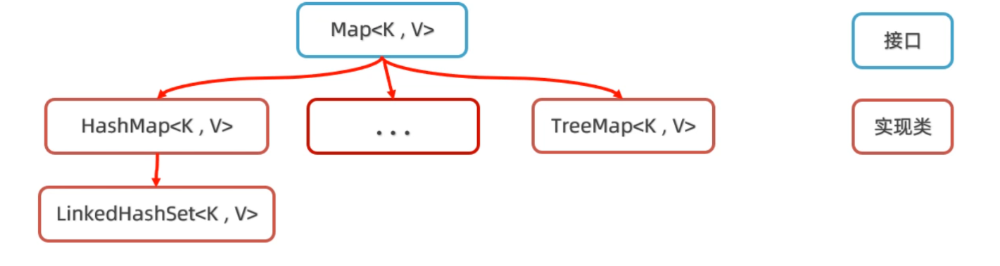


HashMap的特点：

- 无序，不重复，无索引，用的最多。


HashSet底层就是HashMap，创建HashSet集合时，底层帮你创建了HashMap集合；往HashSet集合中添加添加元素时，底层却是调用了Map集合的put方法把元素作为了键来存储。所以实际上根本没有什么HashSet集合，把HashMap的集合的值忽略不看就是HashSet集合。HashSet的原理我们之前已经学过了，所以HashMap是一样的，底层是哈希表结构。

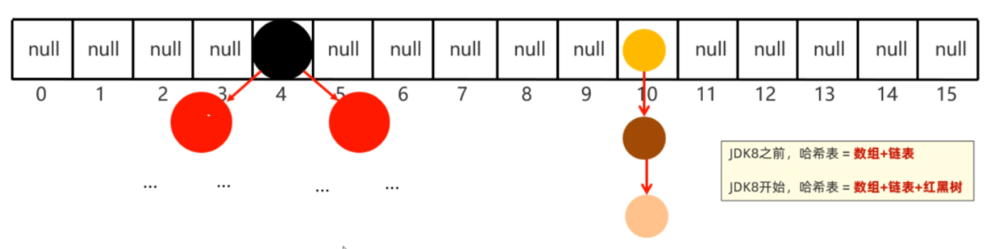


HashMap底层数据结构: 哈希表结构

- JDK8之前的哈希表 = 数组+链表
- JDK8之后的哈希表 = 数组+链表+红黑树
- 哈希表是一种增删改查数据，性能相对都较好的数据结构


往HashMap集合中存储键值对数据时，底层步骤如下

- 第1步：当你第一次往HashMap集合中存储键值对时，底层会创建一个长度为16的数组
- 第2步：将键和值封装成一个对象，叫做Entry对象
- 第3步：再根据Entry对象的键计算hashCode值（和值无关）
- 第4步：利用hashCode值和数组的长度做一个类似求余数的算法，会得到一个索引位置
- 第5步：判断这个索引的位置是否为null，如果为null,就直接将这个Entry对象存储到这个索引位置。如果不为null，则还需要进行第6步的判断
- 第6步：继续调用equals方法判断两个对象键是否相同。如果equals返回false，则以链表的形式往下挂。如果equals方法true,则认为键重复，此时新的键值对会替换就的键值对。


HashMap底层需要注意这几点：

- 底层数组默认长度为16，如果数组中有超过12个位置已经存储了元素，则会对数组进行扩容2倍。数组扩容的加载因子是0.75，意思是：16*0.75=12 	
- 数组的同一个索引位置有多个元素、并且在8个元素以内(包括8)，则以链表的形式存储
  - JDK7版本：链表采用头插法（新元素往链表的头部添加）
  - JDK8版本：链表采用尾插法（新元素我那个链表的尾部添加）
- 数组的同一个索引位置有多个元素、并且超过了8个，则以红黑树形式存储


从HashMap底层存储键值对的过程中我们发现：决定键是否重复依赖两个方法，一个是hashCode方法、一个是equals方法。有两个键计算得到的hashCode值相同，并且两个键使用equals比较为true，就认为键重复。所以，往Map集合中存储自定义对象作为键，为了保证键的唯一性，我们应该重写hashCode方法和equals方法。有如下案例：往HashMap集合中存储Student对象作为键，学生的家庭住址当做值。要求，当学生对象的姓名和年龄相同时就认为键重复。

```java
public class Student implements Comparable<Student> {
    private String name;
    private int age;
    private double height;

    // this  o
    @Override
    public int compareTo(Student o) {
        return this.age - o.age; // 年龄升序排序
    }

    @Override
    public boolean equals(Object o) {
        if (this == o) return true;
        if (o == null || getClass() != o.getClass()) return false;
        Student student = (Student) o;
        return age == student.age && Double.compare(student.height, height) == 0 && Objects.equals(name, student.name);
    }

    @Override
    public int hashCode() {
        return Objects.hash(name, age, height);
    }

    public Student() {
    }

    public Student(String name, int age, double height) {
        this.name = name;
        this.age = age;
        this.height = height;
    }

	//...get,set方法自己补全....

    @Override
    public String toString() {
        return "Student{" +
                "name='" + name + '\'' +
                ", age=" + age +
                ", height=" + height +
                '}';
    }
}
```

在测试类中，创建HashMap集合，键是Student类型，值是Stirng类型

```java
public class Test {
    public static void main(String[] args) {
        Map<Student, String> map = new HashMap<>();
        map.put(new Student("蜘蛛精", 25, 168.5), "盘丝洞");
        map.put(new Student("蜘蛛精", 25, 168.5), "水帘洞");
        map.put(new Student("至尊宝", 23, 163.5), "水帘洞");
        map.put(new Student("牛魔王", 28, 183.5), "牛头山");
        System.out.println(map);
    }
}
```


上面存储的键，有两个蜘蛛精，但是打印出只会有最后一个，如下：


### 6，LinkedHashMap

LinkedHashMap集合的特点也是由键决定的：**有序的、不重复、无索引**。

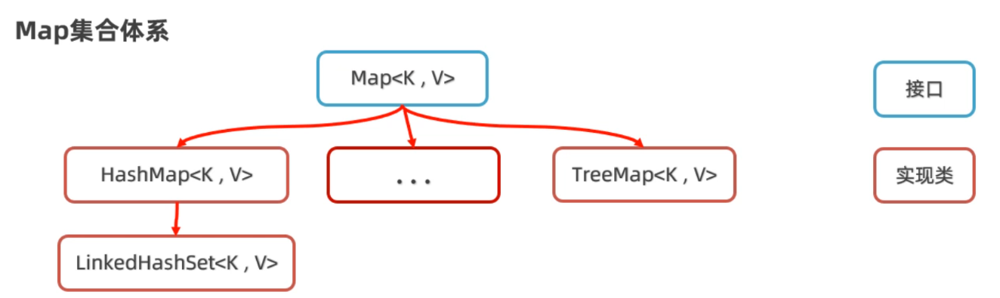


代码演示：

```java
public class Test {
    public static void main(String[] args) {
        // Map<String, Integer> map = new HashMap<>();    //  按照键 无序，不重复，无索引。
        LinkedHashMap<String, Integer> map = new LinkedHashMap<>(); //  按照键 有序，不重复，无索引。
        map.put("手表", 100);
        map.put("手表", 220);
        map.put("手机", 2);
        map.put("Java", 2);
        map.put(null, null);
        System.out.println(map);
    }
}
```


运行上面代码发现，如果是LinedHashMap集合键存储和取出的顺序是一样的，如下：


如果是HashMap，键存储和取出的顺序是不一致的，如下：


LinkedHashMap的底层原理，和LinkedHashSet底层原理是一样的。底层多个一个双向链表来维护键的存储顺序。取元素时，先取头节点元素，然后再依次取下一个几点，一直到尾结点。所以是有序的。

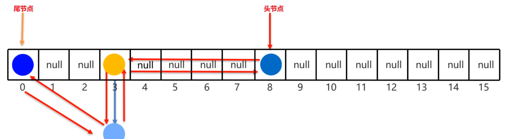


### 7，TreeMap

TreeMap集合的特点也是由键决定的，默认按照键的升序排列，键不重复，也是无索引的。

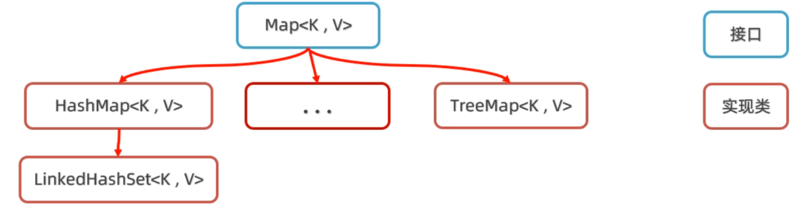


TreeMap集合的底层原理和TreeSet也是一样的，底层都是红黑树实现的。所以可以对键进行排序。比如往TreeMap集合中存储Student对象作为键，排序方法有两种。

- 排序方式1：写一个Student类，让Student类实现Comparable接口
- 排序方式2：在创建TreeMap集合时，直接传递Comparator比较器对象。


排序方式1：写一个Student类，让Student类实现Comparable接口

```java
//第一步：先让Student类，实现Comparable接口
public class Student implements Comparable<Student>{
    private String name;
    private int age;
    private double height;
	//无参数构造方法
    public Student(){}
    //全参数构造方法
    public Student(String name, int age, double height){
        this.name=name;
        this.age=age;
        this.height=height;
    }
    //...get、set、toString()方法自己补上..
    
    //按照年龄进行比较，只需要在方法中让this.age和o.age相减就可以。
    /*
    原理：
    在往TreeSet集合中添加元素时，add方法底层会调用compareTo方法，根据该方法的
    结果是正数、负数、还是零，决定元素放在后面、前面还是不存。
    */
    @Override
    public int compareTo(Student o) {
        //this：表示将要添加进去的Student对象
        //o: 表示集合中已有的Student对象
        return this.age-o.age;
    }
}
```


排序方式2：在创建TreeMap集合时，直接传递Comparator比较器对象。

```java
public class Test3TreeMap {
    public static void main(String[] args) {
        Map<Student, String> map = new TreeMap<>(new Comparator<Student>() {
            @Override
            public int compare(Student o1, Student o2) {
                return Double.compare(o1.getHeight(), o2.getHeight());
            }
        });
//        Map<Student, String> map = new TreeMap<>(( o1,  o2) ->   Double.compare(o2.getHeight(), o1.getHeight()));
        map.put(new Student("蜘蛛精", 25, 168.5), "盘丝洞");
        map.put(new Student("蜘蛛精", 25, 168.5), "水帘洞");
        map.put(new Student("至尊宝", 23, 163.5), "水帘洞");
        map.put(new Student("牛魔王", 28, 183.5), "牛头山");
        System.out.println(map);
    }
}
```

注意：只有TreeMap的键才能排序，HashMap键不能排序。


### 8，集合嵌套

把一个集合当做元素，存储到另一个集合中去，我们把这种用法称之为集合嵌套。需求：在程序中记住如下省份和其对应的城市信息，记录成功后，要求可以查询出湖北省的城市信息。

```java
/**
 * 江苏省 = "南京市","扬州市","苏州市“,"无锡市","常州市"
 * 湖北省 = "武汉市","孝感市","十堰市","宜昌市","鄂州市"
 * 河北省 = "石家庄市","唐山市", "邢台市", "保定市", "张家口市"
 */
```


分析：

1. 从需求中我们可以看到，有三个省份，每一个省份有多个城市。我们可以用一个Map集合的键表示省份名称，而值表示省份有哪些城市
2. 又因为一个身份有多个城市，同一个省份的多个城市可以再用一个List集合来存储。所以Map集合的键是String类型，而指是List集合类型


代码演示：

```java
public class Test {
    public static void main(String[] args) {
        // 1、定义一个Map集合存储全部的省份信息，和其对应的城市信息。
        Map<String, List<String>> map = new HashMap<>();

        List<String> cities1 = new ArrayList<>();
        Collections.addAll(cities1, "南京市","扬州市","苏州市" ,"无锡市","常州市");
        map.put("江苏省", cities1);

        List<String> cities2 = new ArrayList<>();
        Collections.addAll(cities2, "武汉市","孝感市","十堰市","宜昌市","鄂州市");
        map.put("湖北省", cities2);

        List<String> cities3 = new ArrayList<>();
        Collections.addAll(cities3, "石家庄市","唐山市", "邢台市", "保定市", "张家口市");
        map.put("河北省", cities3);
        System.out.println(map);

        List<String> cities = map.get("湖北省");
        for (String city : cities) {
            System.out.println(city);
        }

        map.forEach((p, c) -> {
            System.out.println(p + "----->" + c);
        });
    }
}
```


## 七，Stream流


### 1，什么是Stream流

Stream流是JDK8以后才有的一个新特性，是专业用于对集合或者数组进行便捷操作的。需求：有一个List集合，元素有`"张三丰","张无忌","周芷若","赵敏","张强"`，找出姓张，且是3个字的名字，存入到一个新集合中去。


代码演示：

```java
List<String> names = new ArrayList<>();
Collections.addAll(names, "张三丰","张无忌","周芷若","赵敏","张强");
System.out.println(names);

// 找出姓张，且是3个字的名字，存入到一个新集合中去。
// 传统方式
List<String> list = new ArrayList<>();
for (String name : names) {
    if(name.startsWith("张") && name.length() == 3){
        list.add(name);
    }
}
System.out.println(list);
```


用Stream流来做，代码是这样的：

```java
List<String> list2 = names.stream().filter(s -> s.startsWith("张")).filter(a -> a.length()==3).collect(Collectors.toList());
System.out.println(list2);
```


学习Stream流的步骤：

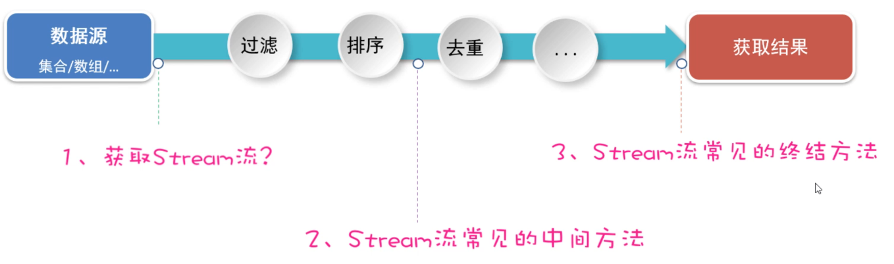


### 2，Stream流的创建


如何创建Stream流，也就是如何获取Stream流。四种Stream流的获取：

1. 如何获取List集合的Stream流？
2. 如何获取Set集合的Stream流？
3. 如何获取Map集合的Stream流？
4. 如何获取数组的Stream流？


代码演示：

```java
public class Test {
    public static void main(String[] args) {
        // 1、如何获取List集合的Stream流？
        List<String> names = new ArrayList<>();
        Collections.addAll(names, "张三丰","张无忌","周芷若","赵敏","张强");
        Stream<String> stream = names.stream();

        // 2、如何获取Set集合的Stream流？
        Set<String> set = new HashSet<>();
        Collections.addAll(set, "刘德华","张曼玉","蜘蛛精","马德","德玛西亚");
        Stream<String> stream1 = set.stream();
        stream1.filter(s -> s.contains("德")).forEach(s -> System.out.println(s));

        // 3、如何获取Map集合的Stream流？
        Map<String, Double> map = new HashMap<>();
        map.put("古力娜扎", 172.3);
        map.put("迪丽热巴", 168.3);
        map.put("马尔扎哈", 166.3);
        map.put("卡尔扎巴", 168.3);

        Set<String> keys = map.keySet();
        Stream<String> ks = keys.stream();

        Collection<Double> values = map.values();
        Stream<Double> vs = values.stream();

        Set<Map.Entry<String, Double>> entries = map.entrySet();
        Stream<Map.Entry<String, Double>> kvs = entries.stream();
        kvs.filter(e -> e.getKey().contains("巴"))
                .forEach(e -> System.out.println(e.getKey()+ "-->" + e.getValue()));

        // 4、如何获取数组的Stream流？
        String[] names2 = {"张翠山", "东方不败", "唐大山", "独孤求败"};
        Stream<String> s1 = Arrays.stream(names2);
        Stream<String> s2 = Stream.of(names2);
    }
}
```


### 3，Stream流中间方法

中间方法指的是：调用完方法之后其结果是一个新的Stream流，于是可以继续调用方法，这样一来就可以支持链式编程（或者叫流式编程）

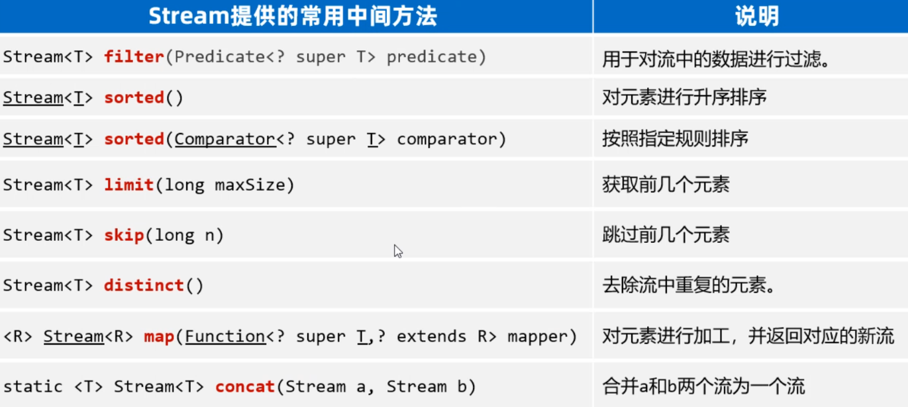


代码演示：

```java
public class StreamTest3 {
    public static void main(String[] args) {
        List<Double> scores = new ArrayList<>();
        Collections.addAll(scores, 88.5, 100.0, 60.0, 99.0, 9.5, 99.6, 25.0);
        // 需求1：找出成绩大于等于60分的数据，并升序后，再输出。
        scores.stream().filter(s -> s >= 60).sorted().forEach(s -> System.out.println(s));

        List<Student> students = new ArrayList<>();
        Student s1 = new Student("蜘蛛精", 26, 172.5);
        Student s2 = new Student("蜘蛛精", 26, 172.5);
        Student s3 = new Student("紫霞", 23, 167.6);
        Student s4 = new Student("白晶晶", 25, 169.0);
        Student s5 = new Student("牛魔王", 35, 183.3);
        Student s6 = new Student("牛夫人", 34, 168.5);
        Collections.addAll(students, s1, s2, s3, s4, s5, s6);
        // 需求2：找出年龄大于等于23,且年龄小于等于30岁的学生，并按照年龄降序输出.
        students.stream().filter(s -> s.getAge() >= 23 && s.getAge() <= 30)
                .sorted((o1, o2) -> o2.getAge() - o1.getAge())
                .forEach(s -> System.out.println(s));

        // 需求3：取出身高最高的前3名学生，并输出。
        students.stream().sorted((o1, o2) -> Double.compare(o2.getHeight(), o1.getHeight()))
                .limit(3).forEach(System.out::println);
        System.out.println("-----------------------------------------------");

        // 需求4：取出身高倒数的2名学生，并输出。   s1 s2 s3 s4 s5 s6
        students.stream().sorted((o1, o2) -> Double.compare(o2.getHeight(), o1.getHeight()))
                .skip(students.size() - 2).forEach(System.out::println);

        // 需求5：找出身高超过168的学生叫什么名字，要求去除重复的名字，再输出。
        students.stream().filter(s -> s.getHeight() > 168).map(Student::getName)
               .distinct().forEach(System.out::println);

        // distinct去重复，自定义类型的对象（希望内容一样就认为重复，重写hashCode,equals）
        students.stream().filter(s -> s.getHeight() > 168)
                .distinct().forEach(System.out::println);

        Stream<String> st1 = Stream.of("张三", "李四");
        Stream<String> st2 = Stream.of("张三2", "李四2", "王五");
        Stream<String> allSt = Stream.concat(st1, st2);
        allSt.forEach(System.out::println);
    }
}
```


### 4，Stream流终结方法


调用完Stream流终结方法之后，其结果就不再是Stream流了，所以不支持链式编程。

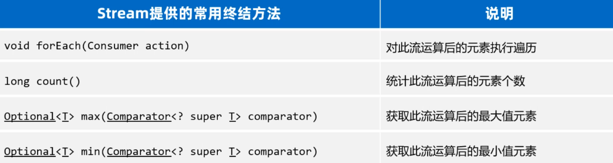


代码演示：

```java
public class StreamTest4 {
    public static void main(String[] args) {
        List<Student> students = new ArrayList<>();
        Student s1 = new Student("蜘蛛精", 26, 172.5);
        Student s2 = new Student("蜘蛛精", 26, 172.5);
        Student s3 = new Student("紫霞", 23, 167.6);
        Student s4 = new Student("白晶晶", 25, 169.0);
        Student s5 = new Student("牛魔王", 35, 183.3);
        Student s6 = new Student("牛夫人", 34, 168.5);
        Collections.addAll(students, s1, s2, s3, s4, s5, s6);
        // 需求1：请计算出身高超过168的学生有几人。
        long size = students.stream().filter(s -> s.getHeight() > 168).count();
        System.out.println(size);

        // 需求2：请找出身高最高的学生对象，并输出。
        Student s = students.stream().max((o1, o2) -> Double.compare(o1.getHeight(), o2.getHeight())).get();
        System.out.println(s);

        // 需求3：请找出身高最矮的学生对象，并输出。
        Student ss = students.stream().min((o1, o2) -> Double.compare(o1.getHeight(), o2.getHeight())).get();
        System.out.println(ss);

        // 需求4：请找出身高超过170的学生对象，并放到一个新集合中去返回。
        // 流只能收集一次。
        List<Student> students1 = students.stream().filter(a -> a.getHeight() > 170).collect(Collectors.toList());
        System.out.println(students1);

        Set<Student> students2 = students.stream().filter(a -> a.getHeight() > 170).collect(Collectors.toSet());
        System.out.println(students2);

        // 需求5：请找出身高超过170的学生对象，并把学生对象的名字和身高，存入到一个Map集合返回。
        Map<String, Double> map =
                students.stream().filter(a -> a.getHeight() > 170)
                        .distinct().collect(Collectors.toMap(a -> a.getName(), a -> a.getHeight()));
        System.out.println(map);

        // Object[] arr = students.stream().filter(a -> a.getHeight() > 170).toArray();
        Student[] arr = students.stream().filter(a -> a.getHeight() > 170).toArray(len -> new Student[len]);
        System.out.println(Arrays.toString(arr));
    }
}
```


