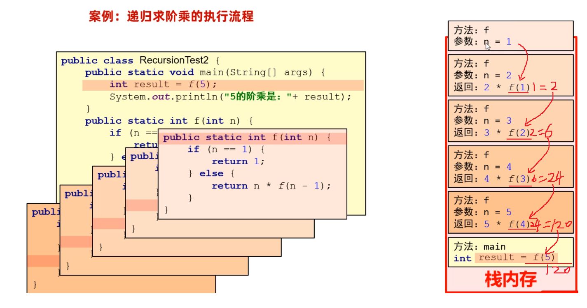

## 一，File类


### 1，File类介绍与创建

存储数据，可以把数据存储到变量，数组，对象，集合中，但是这些数据都是存储在内存中的，只要程序执行结束，或者断电了，数据就消失了。不能永久存储。有些数据要长久保存，可以将数据以文件的形式存在硬盘里，即使程序结束了，断电了只要硬盘没坏，数据就永久存在。<br/><br/>


我们要学习的File类，它的就用来表示当前系统下的文件（也可以是文件夹），通过File类提供的方法可以获取文件大小、判断文件是否存在、创建文件、创建文件夹等。需要我们注意：File对象只能对文件进行操作，不能操作文件中的内容。<br/><br/>


学习File类和其他类一样，第一步是创建File类的对象。 想要创建对象，我们得看File类有哪些构造方法


代码演示：

```java
public class Test {
    public static void main(String[] args) {
        // 1、创建一个File对象，指代某个具体的文件。
        // 路径分隔符
        // File f1 = new File("D:/resource/ab.txt");
        // 路径中"\"要写成"\\"， 路径中"/"可以直接用
        // File f1 = new File("D:\\resource\\ab.txt"); 
        File f1 = new File("D:" + File.separator +"resource" + File.separator + "ab.txt");
        System.out.println(f1.length()); // 文件大小

        File f2 = new File("D:/resource");
        System.out.println(f2.length());

        // 注意：File对象可以指代一个不存在的文件路径
        File f3 = new File("D:/resource/aaaa.txt");
        System.out.println(f3.length());
        System.out.println(f3.exists()); // false

        // 我现在要定位的文件是在模块中，应该怎么定位呢？
        // 绝对路径：带盘符的
        // File f4 = new File("D:\\code\\javasepromax\\file-io-app\\src\\abc.txt");
        // 相对路径（重点）：不带盘符，默认是直接去工程下寻找文件的。
        File f4 = new File("file-io-app\\src\\abc.txt");
        System.out.println(f4.length());
    }
}
```


### 2，File判断和获取方法

File对象封装的路径是存在还是不存在，是文件还是文件夹其实是不清楚的。好在File类提供了方法可以帮我们做判断。


判断文件路径是否存在，判断文件类型，如下：

```java
public class FileTest2 {
    public static void main(String[] args) throws UnsupportedEncodingException {
        // 1.创建文件对象，指代某个文件
        File f1 = new File("D:/resource/ab.txt");
        //File f1 = new File("D:/resource/");

        // 2、public boolean exists()：判断当前文件对象，对应的文件路径是否存在，存在返回true.
        System.out.println(f1.exists());

        // 3、public boolean isFile() : 判断当前文件对象指代的是否是文件，是文件返回true，反之。
        System.out.println(f1.isFile());

        // 4、public boolean isDirectory()  : 判断当前文件对象指代的是否是文件夹，是文件夹返回true，反之。
        System.out.println(f1.isDirectory());
    }
}
```


除了判断功能还有一些获取功能，如下：

```java
File f1 = new File("D:/resource/ab.txt");

// 5.public String getName()：获取文件的名称（包含后缀）
System.out.println(f1.getName());

// 6.public long length()：获取文件的大小，返回字节个数
System.out.println(f1.length());

// 7.public long lastModified()：获取文件的最后修改时间。
long time = f1.lastModified();
SimpleDateFormat sdf = new SimpleDateFormat("yyyy/MM/dd HH:mm:ss");
System.out.println(sdf.format(time));

// 8.public String getPath()：获取创建文件对象时，使用的路径
File f2 = new File("D:\\resource\\ab.txt");
File f3 = new File("file-io-app\\src\\abc.txt");
System.out.println(f2.getPath());
System.out.println(f3.getPath());

// 9.public String getAbsolutePath()：获取绝对路径
System.out.println(f2.getAbsolutePath());
System.out.println(f3.getAbsolutePath());
```


### 3，创建和删除方法


File类提供了创建和删除文件的方法，代码如下：

```java
public class FileTest3 {
    public static void main(String[] args) throws Exception {
        // 1、public boolean createNewFile()：创建一个新文件（文件内容为空），创建成功返回true,反之。
        File f1 = new File("D:/resource/abc2.txt");
        System.out.println(f1.createNewFile());

        // 2、public boolean mkdir()：用于创建文件夹，注意：只能创建一级文件夹
        File f2 = new File("D:/resource/aaa");
        System.out.println(f2.mkdir());  // mkdir(): 只能创建单级文件夹

        // 3、public boolean mkdirs()：用于创建文件夹，注意：可以创建多级文件夹
        File f3 = new File("D:/resource/bbb/ccc/ddd/eee/fff/ggg");
        System.out.println(f3.mkdirs());  // mkdirs(): 才能创建多级文件夹

        // 3、public boolean delete()
        // delete(): 文件可以直接删除，但是文件夹只能删除空的文件夹，文件夹有内容删除不了。
        System.out.println(f1.delete());
        System.out.println(f2.delete());
        File f4 = new File("D:/resource");
        System.out.println(f4.delete());
    }
}
```


### 4，遍历文件夹

有如下两个方法：


代码演示：

```java
public class FileTest4 {
    public static void main(String[] args) {
        // 1、public String[] list()：获取当前目录下所有的"一级文件名称"到一个字符串数组中去返回。
        File f1 = new File("D:\\course\\待研发内容");
        String[] names = f1.list();
        for (String name : names) {
            System.out.println(name);
        }

        // 2、public File[] listFiles():（重点）获取当前目录下所有的"一级文件对象"到一个文件对象数组中去返回（重点）
        File[] files = f1.listFiles();
        for (File file : files) {
            System.out.println(file.getAbsolutePath());
        }

        File f = new File("D:/resource/aaa");
        File[] files1 = f.listFiles();
        System.out.println(Arrays.toString(files1));
    }
}
```


注意细节：

1. 当主调是文件时，或者路径不存在时，返回null
2. 当主调是空文件夹时，返回一个长度为0的数组
3. 当主调是一个有内容的文件夹时，将里面所有一级文件和文件夹路径放在File数组中，并把数组返回
4. 当主调是一个文件夹，且里面有隐藏文件时，将里面所有文件和文件夹的路径放在FIle数组中，包含隐藏文件
5. 当主调是一个文件夹，但是没有权限访问时，返回null


如果想要获取文件夹中子文件夹的内容，那目前还做不到。需要使用到递归内容。下面就开始学习递归内容。


## 二，递归


### 1，什么是递归

为了获取文件夹中子文件夹的内容，我们就需要学习递归这个知识点。递归是一种算法，从形式上来说，方法调用自己的形式称之为递归。有直接递归、间接递归，如下面的代码。代码演示：

```java
public class RecursionTest1 {
    public static void main(String[] args) {
        test1();
    }

    // 直接方法递归
    public static void test1(){
        System.out.println("----test1---");
        test1(); // 直接方法递归
    }

    // 间接方法递归
    public static void test2(){
        System.out.println("---test2---");
        test3();
    }

    public static void test3(){
        test2(); // 间接递归
    }
}
```


直接执行上面的代码，会进入死循环，最终导致栈内存溢出，如下：


### 2，递归算法的执行流程

案例需求：计算n的阶乘，比如5的阶乘 = 1 * 2 * 3 * 4 * 5 ； 6 的阶乘 =  1 * 2 * 3 * 4 * 5 * 6


分析：

```text
假设f(n)表示n的阶乘，那么我们可以推导出下面的式子
	f(5) = 1+2+3+4+5
    f(5) = f(4)+5
    f(4) = f(3)+4
    f(3) = f(2)+3
    f(2) = f(1)+2
    f(1) = 1
总结规律：
	除了f(1) = 1; 出口
	其他的f(n) = f(n-1)+n
```

把f(n)当做一个方法，那么方法的写法如下

```java
public class RecursionTest2 {
    public static void main(String[] args) {
        System.out.println("5的阶乘是：" + f(5));
    }

    //求n个数的阶乘
    public static int f(int n){
        // 终结点
        if(n == 1){
            return 1;
        }else {
            return f(n - 1) * n;
        }
    }
}
```


这个代码的执行流程，我们用内存图的形式来分析一下，该案例中递归调用的特点是：一层一层调用，再一层一层往回返。如下：




### 3，递归文件搜索


使用递归来遍历文件夹，在D盘中，搜索QQ.exe这个文件，然后直接输出。分析：

1. 先调用文件夹的listFiles方法，获取文件夹的一级内容，得到一个数组

2. 然后再遍历数组，获取数组中的File对象

3. 因为File对象可能是文件也可能是文件夹，所以接下来就需要判断

   a. 判断File对象如果是文件，就获取文件名，如果文件名是`QQ.exe`则打印，否则不打印

   b. 判断File对象如果是文件夹，就递归执行1,2,3步骤

4. 把1，2,3步骤写成方法，递归调用即可。


代码演示：

```java
public class RecursionTest3 {
    public static void main(String[] args) throws Exception {
          searchFile(new File("D:/") , "QQ.exe");
    }

    /**
     * 去目录下搜索某个文件
     * @param dir  目录
     * @param fileName 要搜索的文件名称
     */
    public static void searchFile(File dir, String fileName) throws Exception {
        // 1、把非法的情况都拦截住
        if(dir == null || !dir.exists() || dir.isFile()){
            return; // 代表无法搜索
        }

        // 2、dir不是null,存在，一定是目录对象。
        // 获取当前目录下的全部一级文件对象。
        File[] files = dir.listFiles();

        // 3、判断当前目录下是否存在一级文件对象，以及是否可以拿到一级文件对象。
        if(files != null && files.length > 0){
            // 4、遍历全部一级文件对象。
            for (File f : files) {
                // 5、判断文件是否是文件,还是文件夹
                if(f.isFile()){
                    // 是文件，判断这个文件名是否是我们要找的
                    if(f.getName().contains(fileName)){
                        System.out.println("找到了：" + f.getAbsolutePath());
                        Runtime runtime = Runtime.getRuntime();
                        runtime.exec(f.getAbsolutePath());
                    }
                }else {
                    // 是文件夹，继续重复这个过程（递归）
                    searchFile(f, fileName);
                }
            }
        }
    }
}
```


## 三，字符集


### 1，字符集的历史

我们前面学习的File类，不能操作文件中的内容。要想操作文件中的内容，我们还得学习IO流。要是要把IO流搞懂，我们必须把字符集搞清楚。


计算机是美国人发明的，由于计算机能够处理的数据只能是0和1组成的二进制数据，为了让计算机能够处理字符，于是美国人就把他们会用到的每一个字符进行了编码（**所谓编码，就是为一个字符编一个二进制数据**），如下图所示：


美国人常用的字符有英文字母、标点符号、数字以及一些特殊字符，这些字符一共也不到128个，所以他们用1个字节来存储1字符就够了。 美国人把他们用到的字符和字符对应的编码总结成了一张码表，这张码表叫做ASCII码表（也叫ASCII字符集）。


其实计算机只在美国用是没有问题的，但是计算机慢慢的普及到全世界，当普及到中国的时候，在计算机中想要存储中文，那ASCII字符集就不够用了，因为中文太多了，随便数一数也有几万个字符。


于是中国人为了在计算机中存储中文，也编了一个中国人用的字符集叫做GBK字符集，这里面包含2万多个汉字字符，**GBK中一个汉字采用两个字节来存储**，为了能够显示英文字母，GBK字符集也兼容了ASCII字符集，**在GBK字符集中一个字母还是采用一个字节来存储**。


### 2，汉字和字母的编码特点

 如果一个文件中既有中文，也有英文，那计算机怎么知道哪几个字节表示一个汉字，哪几个字节表示一个字母呢？在文件中存储一个`我a你`，底层其实存储的是这样的二进制数据。


需要我们注意汉字和字母的编码特点：

- 如果是存储字母，采用1个字节来存储，一共8位，其中第1位是0
- 如果是存储汉字，采用2个字节来存储，一共16位，其中第1位是1


当读取文件中的字符时，通过识别读取到的第1位是0还是1来判断是字母还是汉字

- 如果读取到第1位是0，就认为是一个字母，此时往后读1个字节。
- 如果读取到第1位是1，就认为是一个汉字，此时往后读2个字节。


### 3，Unicode字符集

咱们国家可以用GBK字符集来表示中国人使用的文字，那世界上还有很多其他的国家，他们也有自己的文字，他们也想要自己国家的文字在计算机中处理，于是其他国家也在搞自己的字符集，就这样全世界搞了上百个字符集，而且各个国家的字符集互不兼容。 这样其实很不利于国际化的交流，可能一个文件在我们国家的电脑上打开好好的，但是在其他国家打开就是乱码了。


为了解决各个国家字符集互不兼容的问题，由国际化标准组织牵头，设计了一套全世界通用的字符集，叫做Unicode字符集。在Unicode字符集中包含了世界上所有国家的文字，一个字符采用4个字节才存储。


在Unicode字符集中，采用一个字符4个字节的编码方案，又造成另一个问题：如果是说英语的国家，他们只需要用到26大小写字母，加上一些标点符号就够了，本身一个字节就可以表示完，用4个字节就有点浪费。


于是又对Unicode字符集中的字符进行了重新编码，一共设计了三种编码方案。分别是UTF-32、UTF-16、UTF-8;  其中比较常用的编码方案是UTF-8


UTF-8这种编码方案的特点：

- UTF-8是一种可变长的编码方案，工分为4个长度区
- 英文字母、数字占1个字节兼容(ASCII编码)
- 汉字字符占3个字节
- 极少数字符占4个字节


### 4，字符集小结


字符集小结：

- ASCII字符集：《美国信息交换标准代码》，包含英文字母、数字、标点符号、控制字符
  - 特点：1个字符占1个字节
- GBK字符集：中国人自己的字符集，兼容ASCII字符集，还包含2万多个汉字
  - 特点：1个字母占用1个字节；1个汉字占用2个字节
- Unicode字符集：包含世界上所有国家的文字，有三种编码方案，最常用的是UTF-8
  - UTF-8编码方案：英文字母、数字占1个字节兼容(ASCII编码)、汉字字符占3个字节


### 5，编码和解码


其实String类类中就提供了相应的方法，可以完成编码和解码的操作。

- 编码：把字符串按照指定的字符集转换为字节数组
- 解码：把字节数组按照指定的字符集转换为字符串


代码演示：

```java
public class Test {
    public static void main(String[] args) throws Exception {
        // 1、编码
        String data = "a我b";
        byte[] bytes = data.getBytes(); // 默认是按照平台字符集（UTF-8）进行编码的。
        System.out.println(Arrays.toString(bytes));

        // 按照指定字符集进行编码。
        byte[] bytes1 = data.getBytes("GBK");
        System.out.println(Arrays.toString(bytes1));

        // 2、解码
        String s1 = new String(bytes); // 按照平台默认编码（UTF-8）解码
        System.out.println(s1);

        String s2 = new String(bytes1, "GBK");
        System.out.println(s2);
    }
}
```


