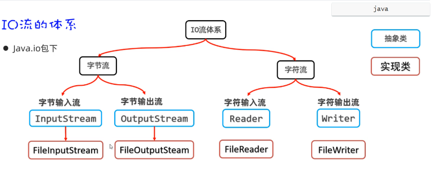

## 一，字节流

### 1，IO流概述

前面我们已经学习过File类。但是我们知道File只能操作文件，但是不能操作文件中的内容。我们也学习了字符集，不同的字符集存字符数据的原理是不一样的。有了前面两个知识的基础，接下来我们再学习IO流，就可以对文件中的数据进行操作了。


IO流的作用：就是可以对文件或者网络中的数据进行读、写的操作。

- 把数据从磁盘、网络中读取到程序中来，用到的是输入流。
- 把程序中的数据写入磁盘、网络中，用到的是输出流。
- 输入流（读数据）、输出流（写数据）


IO流在Java中有很多种，不同的流来干不同的事情。Java把各种流用不同的类来表示，这些流的继承体系如下图所示：

- 字节流：字节流又分为字节输入流、字节输出流
- 字符流：字符流由分为字符输入流、字符输出流





### 2，FileInputStream读取一个字节

InputStream表示字节流中的字节输入流。InputStream是抽象类，我们用的是它的子类，叫FileInputStream。

作用：以内存为基准，把磁盘文件中的数据以字节的形式读到内存中。


构造方法：

- public FileInputStream(File file)  创建字节输入流管道与源文件接通
- public FileInputStream(String pathname) 创建字节输入流管道与源文件接通


成员方法：

- public int read()  每次读取一个字节返回，如果发现没有数据可读，会返回-1
- public int read(byte[] buffer)  每次用一个字节数组去读取数据，返回字节数组读取了多少个字节，如果发现没有数据可读，会返回-1


使用FileInputStream读取文件中的字节数据，步骤如下

- 第一步：创建FileInputStream文件字节输入流管道，与源文件接通。
- 第二步：调用read()方法开始读取文件的字节数据。
- 第三步：调用close()方法释放资源

代码演示：

```java
public class Test {
    public static void main(String[] args) throws Exception {
        // File只能操作文件，不能操作文件中的内容。
        // 要操作文件中的内容，需要使用IO流。
        // I Input 输入流 从硬盘或网络中输入到内存中（程序中）
        // O Output 输出流  把内存中（程序中）中的数据写入磁盘，网络中。
        // 输入流就是读数据，输出流就是写数据

        // IO流分类：
        //   字节流：
        //      字节输入流  InputStream接口  FileInputStream类
        //      字节输出流  OutputStream接口  FileOutputStream类
        //   字符流：
        //      字符输入流  Reader接口  FileReader类
        //      字符输出流  Writer接口  FileWriter类

        // FileInputStream类   字节输入流  每次只能读取一个字节，如果没有数据，就返回-1

        // 第一步：创建FileInputStream文件字节输入流管道，与源文件接通。
        InputStream is = new FileInputStream("module01\\src\\01.txt");
        //System.out.println((char)is.read());
        //System.out.println((char)is.read());
        //System.out.println((char)is.read());
        //System.out.println((char)is.read());
        //System.out.println((char)is.read());
        //System.out.println((char)is.read());
        //System.out.println((char)is.read());

        // 用于记住读取的字节
        int b;
        while ((b = is.read()) != -1){
            System.out.println(b);
            System.out.println((char)b);
        }
    }
}
```

这里需要注意一个问题：由于一个中文在UTF-8编码方案中是占3个字节，采用一次读取一个字节的方式，读一个字节就相当于读了1/3个汉字，此时将这个字节转换为字符，是会有乱码的。


### 3，FileInputStream读取多个字节

FileInputStream调用read()方法，可以一次读取一个字节。但是这种读取方式效率太太太太慢了。 为了提高效率，我们可以使用另一个read(byte[] bytes)的重载方法，可以一次读取多个字节，至于一次读多少个字节，就在于你传递的数组有多大。


使用FileInputStream一次读取多个字节的步骤如下

- 第一步：创建FileInputStream文件字节输入流管道，与源文件接通。
- 第二步：调用read(byte[] bytes)方法开始读取文件的字节数据。
- 第三步：调用close()方法释放资源


代码演示：

```java
public class Test {
    public static void main(String[] args) throws Exception {

        // 创建FileInputStream文件字节输入流管道，与源文件接通。
        InputStream is = new FileInputStream("module01\\src\\01.txt");

        // 一次读取多个字节
        byte[] buffer = new byte[3];  // 创建一个字节数组
        // 每次读取多个字节到字节数组中去，返回读取的字节数量，读取完毕会返回-1.
        //System.out.println(is.read(buffer));
        //System.out.println(is.read(buffer));
        //System.out.println(is.read(buffer));

        // 一次性读取多个字节，可以避免读汉字出现乱码
        int len; // 记住每一次读取多少个字节
        while ((len=is.read(buffer)) != -1){
            // 第一次循环，读到了3个字节，就把这3个字节放到了字节数组中，读多少，就倒出多少
            String rs = new String(buffer, 0, len);
            System.out.println(rs);
        }

        // 流使用完毕后，需要关闭，释放系统资源
        is.close();
    }
}
```


read(byte[] bytes)它的返回值，表示当前这一次读取的字节个数。假设有一个a.txt文件如下：

```text
abcde
```


每次读取过程如下：

- 第一次调用read(bytes)读取了3个字节(分别是97,98,99)，并且往数组中存，此时返回值就是3
- 第二次调用read(bytes)读取了2个字节(分别是99,100),并且往数组中存，此时返回值是2
- 第三次调用read(bytes)文件中后面已经没有数据了，此时返回值为-1
- 也就是说，并不是每次读取的时候都把数组装满


采用一次读取多个字节的方式，也是可能有乱码的。因为也有可能读取到半个汉字的情况。


### 4，FileInputStream读取全部字节

前面我们到的读取方式，不管是一次读取一个字节，还是一次读取多个字节，都有可能有乱码。那么接下来我们介绍一种，不出现乱码的读取方式。我们可以一次性读取文件中的全部字节，然后把全部字节转换为一个字符串，就不会有乱码了。有两种方式：

- 方式一：自已定义一个字节数组与被读取的文件大小一样大，然后使用该字节数组，一次读完文件的全部字节
- 方式二：Java官方为InputStream提供的方法，可以直接把文件的全部字节读取到一个字节数组中并返回


方式一：自已定义一个字节数组与被读取的文件大小一样大，然后使用该字节数组，一次读完文件的全部字节

```java
public class Test {
    public static void main(String[] args) throws Exception {

        InputStream is = new FileInputStream("module01\\src\\01.txt");
        File f1 = new File("module01\\src\\01.txt");
        System.out.println(f1.length());

        long size = f1.length();
        // 准备一个字节数组，大小与文件的大小正好一样大。
        byte[] buffer = new byte[(int)size];

        int len = is.read(buffer);
        System.out.println(new String(buffer));
        System.out.println(len);

        is.close();
    }
}

```


方式二：Java官方为InputStream提供的方法（Java9中），可以直接把文件的全部字节读取到一个字节数组中并返回

```java
public class Test {
    public static void main(String[] args) throws Exception {

        InputStream is = new FileInputStream("module01\\src\\01.txt");

        // readAllBytes 是java9中的API
        byte[] buffer = is.readAllBytes();
        System.out.println(new String(buffer));

        is.close();
    }
}

```


一次读取所有字节虽然可以解决乱码问题，但是文件不能过大，如果文件过大，可能导致内存溢出。


### 5，FileOutputStream写字节

使用FIleInputStream读取文件中的字节数据，往文件中写数据需要用到OutputStream下面的一个子类FileOutputStream。写输入的流程如下图所示


FileOutputStream作用：以内存为基准，把内存中的数据以字节的形式写出到文件中去。


使用FileOutputStream往文件中写数据的步骤如下

- 第一步：创建FileOutputStream文件字节输出流管道，与目标文件接通。
- 第二步：调用wirte()方法往文件中写数据
- 第三步：调用close()方法释放资源


代码演示：

```java
public class Test {
    public static void main(String[] args) throws Exception {

        // 创建fos字节输出流，与目标文件连通  默认创建的，会覆盖之前的数据
        //OutputStream os = new FileOutputStream("module01\\src\\01.txt");

        // 追加数据
        OutputStream os = new FileOutputStream("module01\\src\\01.txt",true);

        // 调用write往文件中写数据
        //os.write(97); // 写字节数据，一次写一个字节  97代表a
        //os.write('b');
        //os.write('c');
        //os.write('码');  // 一次只能写一个字节

        byte[] bytes = "我爱java".getBytes();
        //for (byte b : bytes) {
        //    System.out.println(b);
        //}
        //os.write(bytes);
        os.write(bytes,0,3);
        // 换行符
        os.write("\r\n".getBytes());
        os.write(bytes,3,3);

        os.close();
    }
}
```


### 6，字节流复制文件


前面已经把字节输入流和字节输出流都学习完了。现在我们就可以用这两种流配合起来使用，做一个文件复制的综合案例。比如：我们要复制一张图片，从磁盘`D:/resource/a.png`的一个位置，复制到`E:/resource/a.png`位置。思路如下：

1. 需要创建一个FileInputStream流与源文件接通，创建FileOutputStream与目标文件接通
2. 然后创建一个数组，使用FileInputStream每次读取一个字节数组的数据，存如数组中
3. 然后再使用FileOutputStream把字节数组中的有效元素，写入到目标文件中


代码演示：

```java
public class Test {
    public static void main(String[] args) throws Exception {

        // 创建字节输入流，与源文件连通
        FileInputStream is = new FileInputStream("D:/resource/a.png");

        // 创建字节输出流，，与源文件连通
        FileOutputStream os = new FileOutputStream("E:/resource/a.png");

        // 创建一个字节数组，负责转移字节数据
        byte[] buffer = new byte[1024]; // 1024个字节，就是1KB

        int len;  // 记住每一次读取多少个字节
        while ((len = is.read(buffer)) != -1){
            os.write(buffer,0,len);
        }

        os.close();
        is.close();
        System.out.println("复制完成~~！");
    }
}
```


## 二，IO流资源释放


流使用完之后一定要释放资源。但是我们之前的代码并不是很专业。  如果代码中出现异常了，程序中终止了，释放资源的代码就没有机会执行，如下：

```java
public class Test {
    public static void main(String[] args) throws Exception {

        // 创建字节输入流，与源文件连通
        FileInputStream is = new FileInputStream("D:/resource/a.png");

        // 创建字节输出流，，与源文件连通
        FileOutputStream os = new FileOutputStream("E:/resource/a.png");

        // 这里已经出现异常了，异常下面的代码是不会执行的，也就是说
        // 关闭流的那两行代码是不会执行的。
        System.out.println(1/0);

        // 创建一个字节数组，负责转移字节数据
        byte[] buffer = new byte[1024]; // 1024个字节，就是1KB

        int len;  // 记住每一次读取多少个字节
        while ((len = is.read(buffer)) != -1){
            os.write(buffer,0,len);
        }

        os.close();
        is.close();
        System.out.println("复制完成~~！");
    }
}
```


对于上面的问题，在JDK7以前，和JDK7以后分别给出了不同的处理方案。


### 1，JDK7以前的资源释放

在JDK7版本以前，我们可以使用try...catch...finally语句来处理。格式如下


try...catch...finally格式如下：

```java
try{
    //有可能产生异常的代码
}catch(异常类 e){
    //处理异常的代码
}finally{
    //释放资源的代码
    //finally里面的代码有一个特点，不管异常是否发生，finally里面的代码都会执行。
}
```


改造上面的代码：

```java
public class Test {
    public static void main(String[] args){

        InputStream is = null;
        OutputStream os = null;

        try{

            // 这里已经出现异常了，异常下面的代码是不会执行的，也就是说
            // 关闭流的那两行代码是不会执行的。
            System.out.println(1/0);

            // 创建字节输入流，与源文件连通
            is = new FileInputStream("D:/resource/a.png");

            // 创建字节输出流，与源文件连通
            os = new FileOutputStream("E:/resource/a.png");


            // 创建一个字节数组，负责转移字节数据
            byte[] buffer = new byte[1024]; // 1024个字节，就是1KB

            int len;  // 记住每一次读取多少个字节
            while ((len = is.read(buffer)) != -1){
                os.write(buffer,0,len);
            }
            System.out.println("复制完成~~！");
        }catch (Exception e){
            e.printStackTrace();
        }finally{
            System.out.println("finally.....");
            try{
                if(os != null){
                    os.close();
                }
            }catch(Exception e){
                e.printStackTrace();
            }

            try{
                if(is != null){
                    is.close();
                }
            }catch(Exception e){
                e.printStackTrace();
            }
        }
    }
}
```


代码写到这里，有很多同学就已经看不下去了。是的，我也看不下去，本来几行代码就写完了的，加上try...catch...finally之后代码多了十几行，而且阅读性并不高。难受....


### 2，JDK7以后的资源释放


刚才很多同学已经发现了try...catch...finally处理异常，并释放资源代码比较繁琐。Java在JDK7版本为我们提供了一种简化的是否资源的操作，它会自动是否资源。代码写起来也想当简单。


格式如下：

```java
try(资源对象1; 资源对象2;){
    使用资源的代码
}catch(异常类 e){
    处理异常的代码
}

//注意：注意到没有，这里没有释放资源的代码。它会自动是否资源
```


改造上面的代码：

```java
public class Test {
    public static void main(String[] args) {

        // 并不需要写关闭流的代码，它会自动释放资源
        try (
            // 创建字节输入流，与源文件连通
            InputStream is = new FileInputStream("D:/resource/a.png");
            // 创建字节输出流，与源文件连通
            OutputStream os = new FileOutputStream("E:/resource/a.png");
        ) {
            byte[] buffer = new byte[1024]; // 1024个字节，就是1KB

            int len;  // 记住每一次读取多少个字节
            while ((len = is.read(buffer)) != -1) {
                os.write(buffer, 0, len);
            }
            System.out.println("复制完成~~！");
        } catch (Exception e) {
            e.printStackTrace();
        }
    }
}

```


