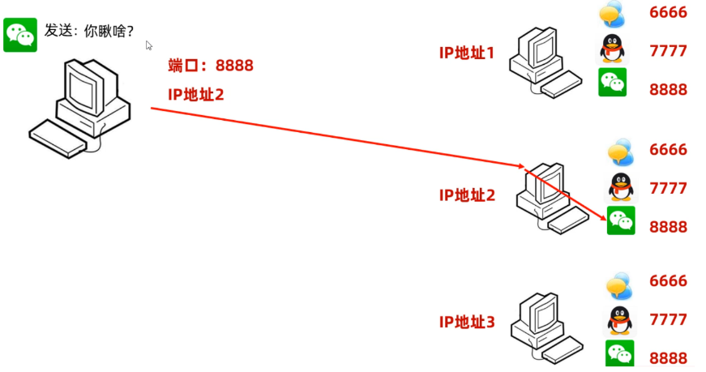
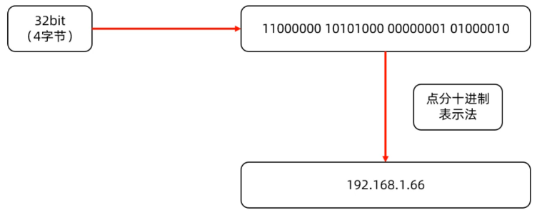
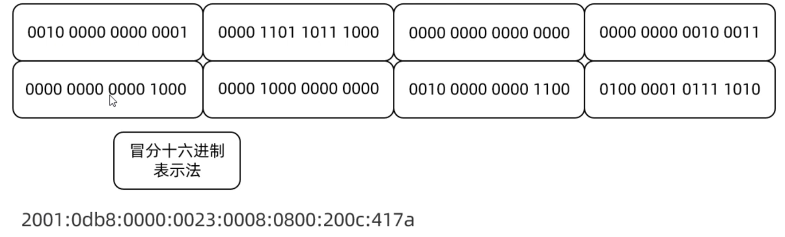
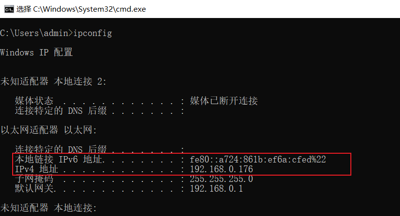
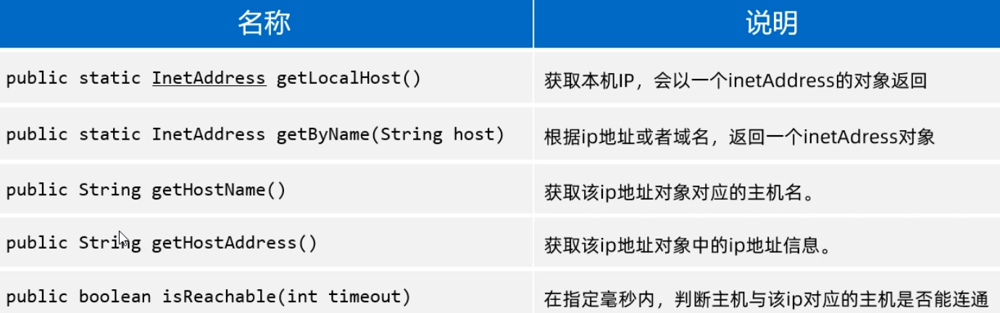
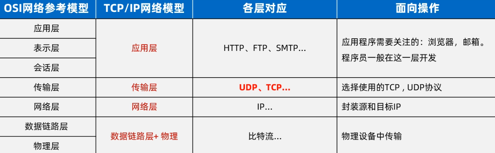
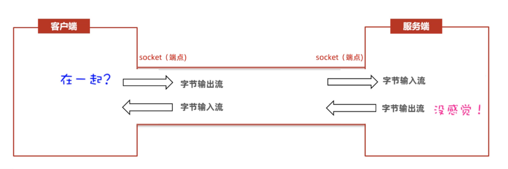
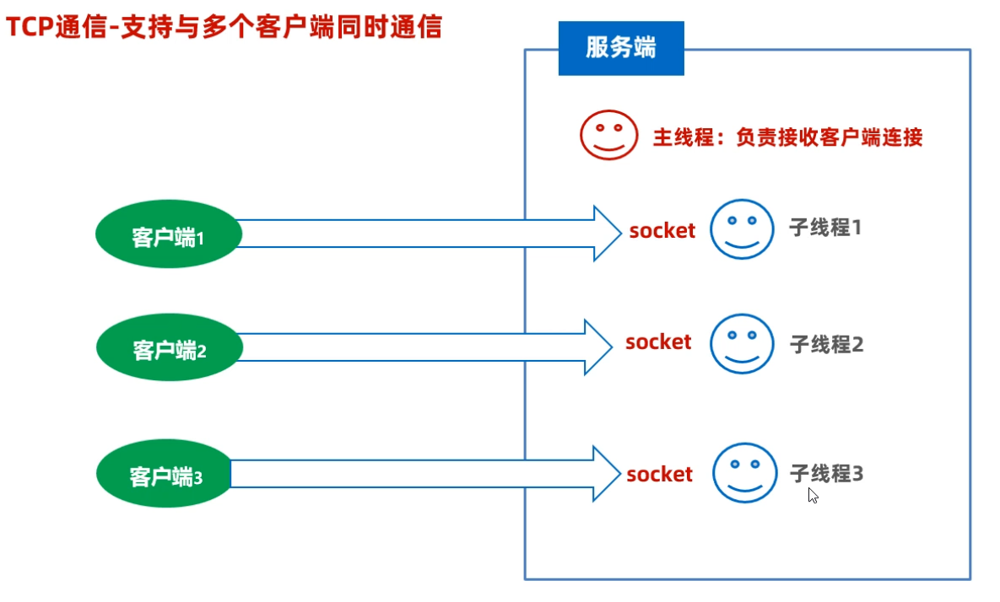

## 一，网络编程三要素


网络编程三要素，分别是IP地址、端口号、通信协议。

- IP地址：表示设备在网络中的地址，是网络中设备的唯一标识
- 端口号：应用程序在设备中唯一的标识
- 协议：连接和数据在网络中传输的规则。


如下图所示：假设现在要从一台电脑中的微信上，发一句“你愁啥？”到其他电脑的微信上，流程如下

- 先通过ip地址找到对方的电脑
- 再通过端口号找到对方的电脑上的应用程序
- 按照双方约定好的规则发送、接收数据





### 1，IP地址

IP（Ineternet Protocol）全称互联网协议地址，是分配给网络设备的唯一表示。IP地址分为：IPV4地址、IPV6地址。IPV4地址由32个比特位（4个字节）组成，如果下图所示，但是由于采用二进制太不容易阅读了，于是就将每8位看成一组，把每一组用十进制表示（叫做点分十进制表示法）。所以就有了我们经常看到的IP地址形式，如：192.168.1.66




经过不断的发展，现在越来越多的设备需要联网，IPV4地址已经不够用了，所以扩展出来了IPV6地址。IPV6采用128位二进制数据来表示（16个字节），号称可以为地球上的每一粒沙子编一个IP地址，IPV6比较长，为了方便阅读，每16位编成一组，每组采用十六进制数据表示，然后用冒号隔开（称为冒分十六进制表示法），如下图所示




现在的网络设备，一般IPV4和IPV6地址都是支持的。通过ipconfig命令，可以查看：




域名和IP其实是一一对应的，由运营商来管理域名和IP的对应关系。我们在浏览器上敲一个域名时，首先由运营商的域名解析服务，把域名转换为ip地址，再通过IP地址去访问对应的服务器设备。关于IP地址，还有一个特殊的地址需要我们记住一下。就是我们在学习阶段进行测试时，经常会自己给自己消息，需要用到一个本地回送地址：`127.0.0.1`


### 2，InetAddress类

IP地址。按照面向对象的设计思想，Java中也有一个类用来表IP地址，这个类是InetAddress类。我们在开发网络通信程序的时候，可能有时候会获取本机的IP地址，以及测试与其他地址是否连通，这个时候就可以使用InetAddress类来完成。下面学习几个InetAddress的方法。




代码演示：

```java
public class InetAddressTest {
    public static void main(String[] args) throws Exception {
        // 1、获取本机IP地址对象的
        InetAddress ip1 = InetAddress.getLocalHost();
        System.out.println(ip1.getHostName());
        System.out.println(ip1.getHostAddress());

        // 2、获取指定IP或者域名的IP地址对象。
        InetAddress ip2 = InetAddress.getByName("www.baidu.com");
        System.out.println(ip2.getHostName());
        System.out.println(ip2.getHostAddress());

        // ping www.baidu.com
        System.out.println(ip2.isReachable(6000));
    }
}
```


### 3，端口号


端口号：指的是计算机设备上运行的应用程序的标识，被规定为一个16位的二进制数据，范围（0~65535）

端口号分为一下几类（了解一下）

- 系统端口：0~1023，被预先定义的知名应用程序占用（如：HTTP占用80，FTP占用21）
- 注册端口：1024~49151，分配给用户经常访问的应用程序或者某些应用程序
- 动态端口：49152~65536，之所以称为动态端口，是因为它一般不固定分配给某进程，而是动态分配的。

需要我们注意的是，同一个计算机设备中，不能出现两个应用程序，用同一个端口号


### 4，协议

前面我们已经学习了IP地址和端口号，但是想要完成数据通信还需要有通信协议。网络上通信的设备，事先规定的连接规则，以及传输数据的规则被称为网络通信协议。


为了让世界上各种上网设备能够互联互通，肯定需要有一个组织出来，指定一个规则，大家都遵守这个规则，才能进行数据通信。开放式网络互联标准：OSI网络参考模型

- OSI网络参考模型：全球网络互联标准
- TCP/IP网络模型：事实上的国际标准





只要按照OSI网络参考模型制造的设备，就可以在国际互联网上互联互通。其中传输层有两个协议，是我们今天会接触到的（UDP协议、TCP协议）


UDP特点：

- 无连接，不可靠通信
- 不事先建立连接，数据按照包发，一包数据包含：自己的IP地址，程序端口，目的地IP，程序端口和数据等。
- 发送方不管对方是否在线，数据在中间丢失也不管，如果接收方收到数据也不返回确认，故是不可靠的。
- 通信效率高。场景：语音通话，视频直播。


TCP特点：

- 面向连接，可靠通信
- TCP的最终目的：要保证在不可靠的信道上实现可靠的传输
- TCP主要有三个步骤实现可靠传输：三次握手建立连接，传输数据进行确认，四次挥手断开连接。


## 二，UDP通信入门案例

UDP是面向无连接的、不需要确认双方是否存在，所以它是不可靠的协议。Java提供了一个类叫DatagramSocket来完成基于UDP协议的收发数据。使用DatagramSocket收发数据时，数据要以数据包的形式体现，一个数据包限制在64KB以内。


### 1，UDP通信入门


下面我们看一个案例，需要有两个程序，一个表示客户端程序，一个表示服务端程序。需求：客户端程序发一个字符串数据给服务端，服务端程序接收数据并打印。


客户端程序：

```java
/**
 * 目标：完成UDP通信快速入门：实现1发1收。
 */
public class Client {
    public static void main(String[] args) throws Exception {
        // 1、创建客户端对象（发韭菜出去的人）
        DatagramSocket socket = new DatagramSocket(7777);

        // 2、创建数据包对象封装要发出去的数据（创建一个韭菜盘子）
       /* public DatagramPacket(byte buf[], int length,
             InetAddress address, int port)
               参数一：封装要发出去的数据。
               参数二：发送出去的数据大小（字节个数）
               参数三：服务端的IP地址（找到服务端主机）
               参数四：服务端程序的端口。
             */
        byte[] bytes = "我是快乐的客户端，我爱你abc".getBytes();
        DatagramPacket packet = new DatagramPacket(bytes, bytes.length
                , InetAddress.getLocalHost(),  6666);

        // 3、开始正式发送这个数据包的数据出去了
        socket.send(packet);

        System.out.println("客户端数据发送完毕~~~");
        socket.close(); // 释放资源！
    }
}
```


服务端程序：

```java
public class Server {
    public static void main(String[] args) throws Exception {
        System.out.println("----服务端启动----");
        // 1、创建一个服务端对象（创建一个接韭菜的人） 注册端口
        DatagramSocket socket = new DatagramSocket(6666);

        // 2、创建一个数据包对象，用于接收数据的（创建一个韭菜盘子）
        byte[] buffer = new byte[1024 * 64]; // 64KB.
        DatagramPacket packet = new DatagramPacket(buffer, buffer.length);

        // 3、开始正式使用数据包来接收客户端发来的数据
        socket.receive(packet);

        // 4、从字节数组中，把接收到的数据直接打印出来
        // 接收多少就倒出多少
        // 获取本次数据包接收了多少数据。
        int len = packet.getLength();

        String rs = new String(buffer, 0 , len);
        System.out.println(rs);

        System.out.println(packet.getAddress().getHostAddress());
        System.out.println(packet.getPort());

        socket.close(); // 释放资源
    }
}
```


## 三，UDP通信多发多收


### 1，UDP通信多发多收


刚才的案例，我们只能客户端发一次，服务端接收一次就结束了。下面我们想把这个代码改进一下，

需求：实现客户端不断的发数据，而服务端能不断的接收数据，客户端发送exit时客户端程序退出。


客户端程序：

```java
/**
 * 目标：完成UDP通信快速入门：实现客户端反复的发。
 */
public class Client {
    public static void main(String[] args) throws Exception {
        // 1、创建客户端对象（发韭菜出去的人）
        DatagramSocket socket = new DatagramSocket();

        // 2、创建数据包对象封装要发出去的数据（创建一个韭菜盘子）
       /* public DatagramPacket(byte buf[], int length,
             InetAddress address, int port)
               参数一：封装要发出去的数据。
               参数二：发送出去的数据大小（字节个数）
               参数三：服务端的IP地址（找到服务端主机）
               参数四：服务端程序的端口。
             */
        Scanner sc = new Scanner(System.in);
        while (true) {
            System.out.println("请说：");
            String msg = sc.nextLine();

            // 一旦发现用户输入的exit命令，就退出客户端
            if("exit".equals(msg)){
                System.out.println("欢迎下次光临！退出成功！");
                socket.close(); // 释放资源
                break; // 跳出死循环
            }

            byte[] bytes = msg.getBytes();
            DatagramPacket packet = new DatagramPacket(bytes, bytes.length
                    , InetAddress.getLocalHost(),  6666);

            // 3、开始正式发送这个数据包的数据出去了
            socket.send(packet);
        }
    }
}
```


服务端程序：

```java
/**
 * 目标：完成UDP通信快速入门-服务端反复的收
 */
public class Server {
    public static void main(String[] args) throws Exception {
        System.out.println("----服务端启动----");
        // 1、创建一个服务端对象（创建一个接韭菜的人） 注册端口
        DatagramSocket socket = new DatagramSocket(6666);

        // 2、创建一个数据包对象，用于接收数据的（创建一个韭菜盘子）
        byte[] buffer = new byte[1024 * 64]; // 64KB.
        DatagramPacket packet = new DatagramPacket(buffer, buffer.length);

        while (true) {
            // 3、开始正式使用数据包来接收客户端发来的数据
            socket.receive(packet);

            // 4、从字节数组中，把接收到的数据直接打印出来
            // 接收多少就倒出多少
            // 获取本次数据包接收了多少数据。
            int len = packet.getLength();

            String rs = new String(buffer, 0 , len);
            System.out.println(rs);

            System.out.println(packet.getAddress().getHostAddress());
            System.out.println(packet.getPort());
            System.out.println("--------------------------------------");
        }
    }
}
```


## 四，TCP通信一发一收


### 1，TCP通信一发一收


学习完UDP通信的代码编写之后，接下来我们学习TCP通信的代码如何编写。Java提供了一个java.net.Socket类来完成TCP通信。

我们先讲一下Socket完成TCP通信的流程，再讲代码怎么编写就很好理解了。如下图所示

1. 当创建Socket对象时，就会在客户端和服务端创建一个数据通信的管道，在客户端和服务端两边都会有一个Socket对象来访问这个通信管道。
2. 现在假设客户端要发送一个“在一起”给服务端，客户端这边先需要通过Socket对象获取到一个字节输出流，通过字节输出流写数据到服务端
3. 然后服务端这边通过Socket对象可以获取字节输入流，通过字节输入流就可以读取客户端写过来的数据，并对数据进行处理。
4. 服务端处理完数据之后，假设需要把“没感觉”发给客户端端，那么服务端这边再通过Socket获取到一个字节输出流，将数据写给客户端
5. 客户端这边再获取输入流，通过字节输入流来读取服务端写过来的数据。





下面我们写一个客户端，用来往服务端发数据。由于原始的字节流不是很好用，这里根据我的经验，我原始的OutputStream包装为DataOutputStream是比较好用的。客户端程序：

```java
/**
 *  目标：完成TCP通信快速入门-客户端开发：实现1发1收。
 */
public class Client {
    public static void main(String[] args) throws Exception {
        // 1、创建Socket对象，并同时请求与服务端程序的连接。
        Socket socket = new Socket("127.0.0.1", 8888);

        // 2、从socket通信管道中得到一个字节输出流，用来发数据给服务端程序。
        OutputStream os = socket.getOutputStream();

        // 3、把低级的字节输出流包装成数据输出流
        DataOutputStream dos = new DataOutputStream(os);

        // 4、开始写数据出去了
        dos.writeUTF("在一起，好吗？");
        dos.close();

        socket.close(); // 释放连接资源
    }
}
```


服务端用来接收客户端发过来的数据。如下：

```java
/**
 *  目标：完成TCP通信快速入门-服务端开发：实现1发1收。
 */
public class Server {
    public static void main(String[] args) throws Exception {
        System.out.println("-----服务端启动成功-------");
        // 1、创建ServerSocket的对象，同时为服务端注册端口。
        ServerSocket serverSocket = new ServerSocket(8888);

        // 2、使用serverSocket对象，调用一个accept方法，等待客户端的连接请求
        Socket socket = serverSocket.accept();

        // 3、从socket通信管道中得到一个字节输入流。
        InputStream is = socket.getInputStream();

        // 4、把原始的字节输入流包装成数据输入流
        DataInputStream dis = new DataInputStream(is);

        // 5、使用数据输入流读取客户端发送过来的消息
        String rs = dis.readUTF();
        System.out.println(rs);
        // 其实我们也可以获取客户端的IP地址
        System.out.println(socket.getRemoteSocketAddress());

        dis.close();
        socket.close();
    }
}
```


## 五，TCP通信多发多收


### 1，TCP通信多发多收

把客户端代码改写一下，采用键盘录入的方式发消息，为了让客户端能够一直发，我们只需要将发送消息的代码套一层循环就可以了，当用户输入exit时，客户端退出循环并结束客户端。


TCP客户端：

```java
/**
 *  目标：完成TCP通信快速入门-客户端开发：实现客户端可以反复的发消息出去
 */
public class Client {
    public static void main(String[] args) throws Exception {
        // 1、创建Socket对象，并同时请求与服务端程序的连接。
        Socket socket = new Socket("127.0.0.1", 8888);

        // 2、从socket通信管道中得到一个字节输出流，用来发数据给服务端程序。
        OutputStream os = socket.getOutputStream();

        // 3、把低级的字节输出流包装成数据输出流
        DataOutputStream dos = new DataOutputStream(os);

        Scanner sc = new Scanner(System.in);
        while (true) {
            System.out.println("请说：");
            String msg = sc.nextLine();

            // 一旦用户输入了exit，就退出客户端程序
            if("exit".equals(msg)){
                System.out.println("欢迎您下次光临！退出成功！");
                dos.close();
                socket.close();
                break;
            }

            // 4、开始写数据出去了
            dos.writeUTF(msg);
            dos.flush();
        }
    }
}
```


为了让服务端能够一直接收客户端发过来的消息，服务端代码也得改写一下。我们只需要将读取数据的代码加一个循环就可以了。

但是需要我们注意的时，如果客户端Socket退出之后，就表示连接客户端与服务端的数据通道被关闭了，这时服务端就会出现异常。服务端可以通过出异常来判断客户端下线了，所以可以用try...catch把读取客户端数据的代码套一起来，catch捕获到异常后，打印客户端下线。


```java
/**
 *  目标：完成TCP通信快速入门-服务端开发：实现服务端反复发消息
 */
public class Server {
    public static void main(String[] args) throws Exception {
        System.out.println("-----服务端启动成功-------");
        // 1、创建ServerSocket的对象，同时为服务端注册端口。
        ServerSocket serverSocket = new ServerSocket(8888);

        // 2、使用serverSocket对象，调用一个accept方法，等待客户端的连接请求
        Socket socket = serverSocket.accept();

        // 3、从socket通信管道中得到一个字节输入流。
        InputStream is = socket.getInputStream();

        // 4、把原始的字节输入流包装成数据输入流
        DataInputStream dis = new DataInputStream(is);

        while (true) {
            try {
                // 5、使用数据输入流读取客户端发送过来的消息
                String rs = dis.readUTF();
                System.out.println(rs);
            } catch (Exception e) {
                System.out.println(socket.getRemoteSocketAddress() + "离线了！");
                dis.close();
                socket.close();
                break;
            }
        }
    }
}
```


## 六，TCP通信多线程


### 1，TCP通信多线程改进

上面案例中我们写的服务端程序只能和一个客户端通信，如果有多个客户端连接服务端，此时服务端是不支持的。

为了让服务端能够支持多个客户端通信，就需要用到多线程技术。具体的实现思路如下图所示：每当有一个客户端连接服务端，在服务端这边就为Socket开启一条线程取执行读取数据的操作，来多少个客户端，就有多少条线程。按照这样的设计，服务端就可以支持多个客户端连接了。




写一个服务端的读取数据的线程类，代码如下

```java
public class ServerReaderThread extends Thread{
    private Socket socket;
    public ServerReaderThread(Socket socket){
        this.socket = socket;
    }
    @Override
    public void run() {
        try {
            InputStream is = socket.getInputStream();
            DataInputStream dis = new DataInputStream(is);
            while (true){
                try {
                    String msg = dis.readUTF();
                    System.out.println(msg);

                } catch (Exception e) {
                    System.out.println("有人下线了：" + socket.getRemoteSocketAddress());
                    dis.close();
                    socket.close();
                    break;
                }
            }
        } catch (Exception e) {
            e.printStackTrace();
        }
    }
}
```


改写服务端的主程序代码，如下：

```java
/**
 *  目标：完成TCP通信快速入门-服务端开发：要求实现与多个客户端同时通信。
 */
public class Server {
    public static void main(String[] args) throws Exception {
        System.out.println("-----服务端启动成功-------");
        // 1、创建ServerSocket的对象，同时为服务端注册端口。
        ServerSocket serverSocket = new ServerSocket(8888);

        while (true) {
            // 2、使用serverSocket对象，调用一个accept方法，等待客户端的连接请求
            Socket socket = serverSocket.accept();

            System.out.println("有人上线了：" + socket.getRemoteSocketAddress());

            // 3、把这个客户端对应的socket通信管道，交给一个独立的线程负责处理。
            new ServerReaderThread(socket).start();
        }
    }
}
```


