## 一，数据库相关概念

### 1，数据库的管理系统

数据库管理系统是管理数据库的大型软件，英文：DataBase Management System，简称 DBMS。电脑上安装了数据库管理系统后，就可以通过数据库管理系统创建数据库来存储数据，也可以通过该系统对数据库中的数据进行数据的增删改查相关的操作。我们平时说的MySQL数据库其实是MySQL数据库管理系统。

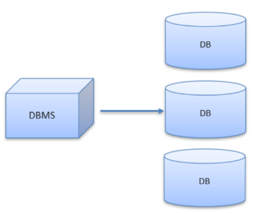

常见的数据库管理系统：

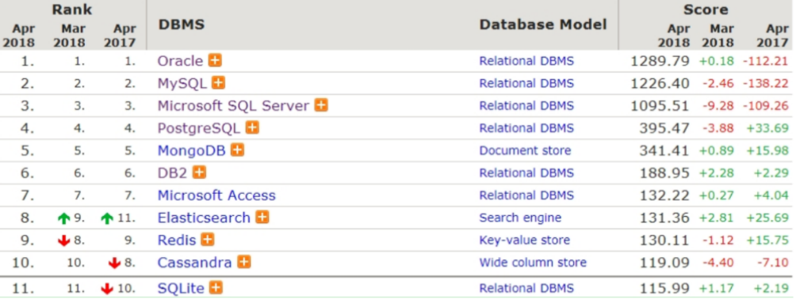

### 2，什么是SQL

Structured Query Language，简称 SQL，结构化查询语言，操作关系型数据库的编程语言，定义操作所有关系型数据库的统一标准，可以使用SQL操作所有的关系型数据库管理系统，以后工作中如果使用到了其他的数据库管理系统，也同样的使用SQL来操作。

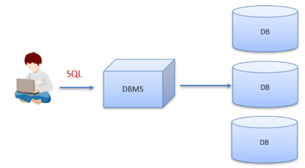

### 3，MySQL的安装

大家直接安装小皮就行，简单粗暴，如下：

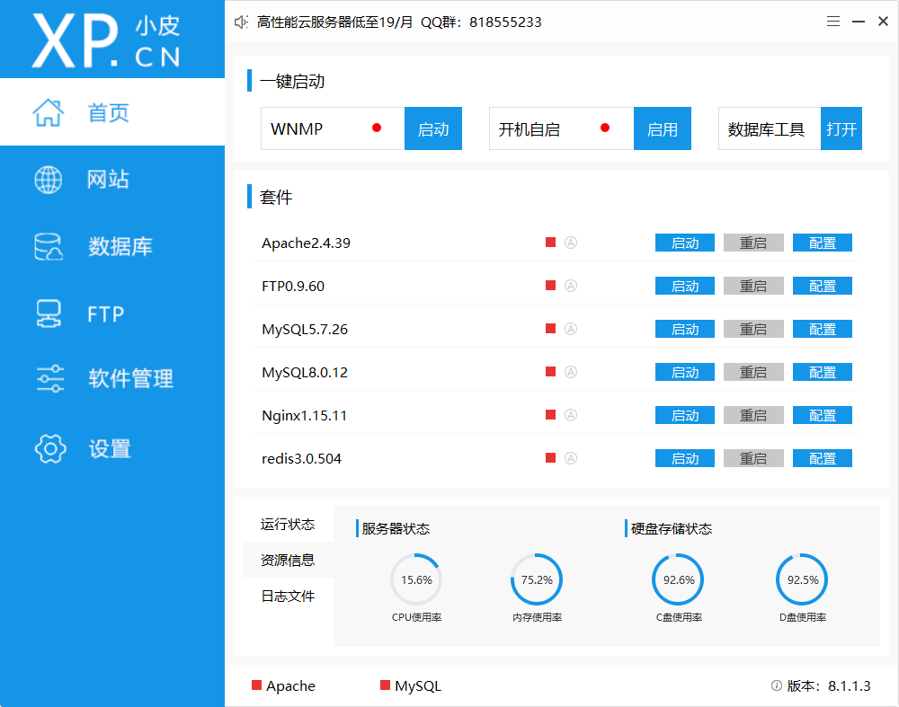

这个小皮软件中，内置了很多的软件，其中就包含mysql。如果我们直接下载mysql安装的话，过程比较烦索。

### 4，SQLyog安装

安装了mysql，我后我们可以安装SQLyog软件，这个软件是用来连接mysql管理系统的。连接上后，可以通过可视化操作mysql。安装如下：

### 5，MySQL的数据模型

关系型数据库：

* 关系型数据库是建立在关系模型基础上的数据库，简单说，关系型数据库是由多张能互相连接的 二维表 组成的数据库
* 关系型数据库都可以通过SQL进行操作，所以使用方便。
* 数据存储在磁盘中，安全。

`订单信息表` 和 `客户信息表` 都是有行有列二维表我们将这样的称为关系型数据库。如下：

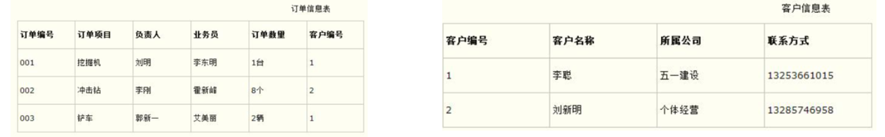

数据模型：

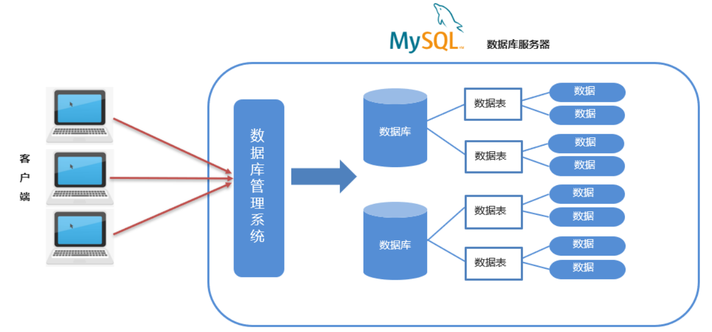

通过客户端可以通过数据库管理系统创建数据库，在数据库中创建表，在表中添加数据。创建的每一个数据库对应到磁盘上都是一个文件夹。

一个数据库下可以创建多张表，我们到MySQL中自带的mysql数据库的文件夹目录下：

`db.frm` 是表文件， `db.MYD` 是数据文件，通过这两个文件就可以查询到数据展示成二维表的效果。

小结：

* MySQL中可以创建多个数据库，每个数据库对应到磁盘上的一个文件夹
* 在每个数据库中可以创建多个表，每张都对应到磁盘上一个 frm 文件
* 每张表可以存储多条数据，数据会被存储到磁盘中  MYD 文件中

## 二，SQL概述

通过SQL语句对数据库、表、数据进行增删改查操作。 

### 1，SQL的通用语法

SQL 语句可以单行或多行书写，以分号结尾。以分号结尾才是一个完整的sql语句（show databases; ）。如下：

MySQL 数据库的 SQL 语句不区分大小写，关键字建议使用大写。同样的一条sql语句写成如下的样子（Show Databases; ），一样可以运行处结果。

单行注释: -- 注释内容 或 #注释内容(MySQL 特有)。使用-- 添加单行注释时，--后面一定要加空格，而#没有要求。多行注释: /* 注释 */

### 2，SQL分类

DDL（Data Definition Language）就是用来操作数据库，表等。

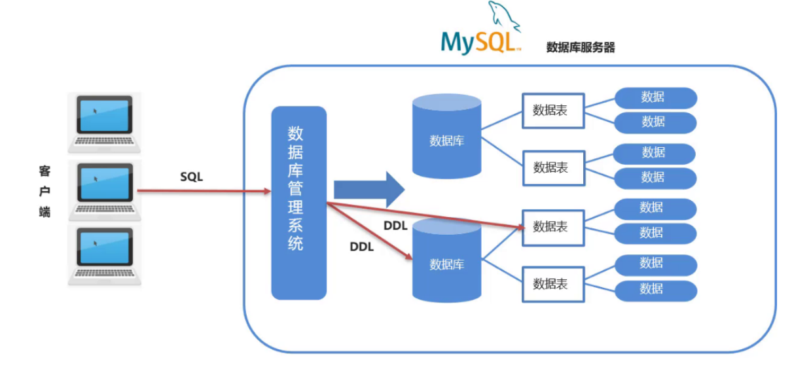

DML（Data Manipulation Language）就是对表中数据进行增删改的。DQL（Data Query Language）就是对数据进行查询操作。从数据库表中查询到我们想要的数据。

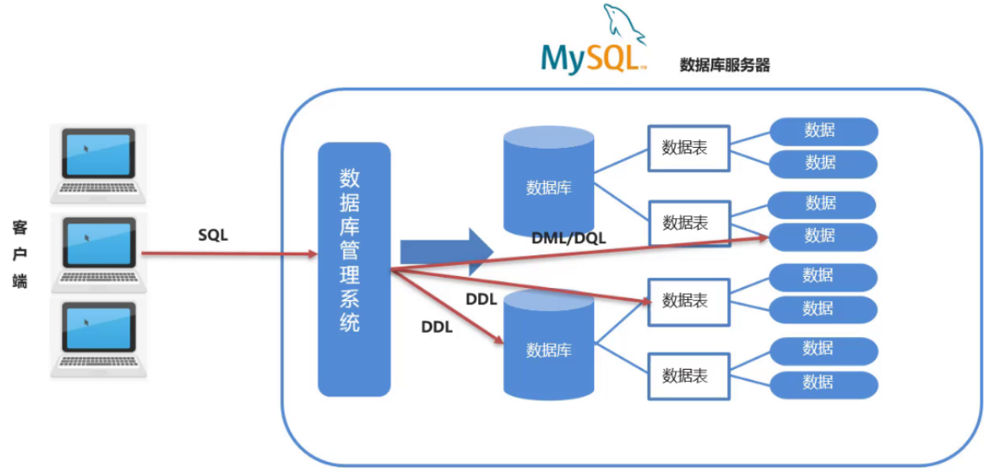

DML就是对数据库进行权限控制。比如我让某一个数据库表只能让某一个用户进行操作等。

总结：

*  以后我们最常操作的是 `DML` 和 `DQL`  ，因为我们开发中最常操作的就是数据。

## 三，DDL操作数据库

DDL主要就是对数据库的增删查操作。

### 1，查询

查询所有的数据库：

```mysql
SHOW DATABASES;
```

运行上面语句效果如下：

上述查询到的是的这些数据库是mysql安装好自带的数据库，我们以后不要操作这些数据库。

### 2，创建数据库

创建数据库：

```mysql
CREATE DATABASE 数据库名称;
```

运行语句效果如下：

而在创建数据库的时候，我并不知道db1数据库有没有创建，直接再次创建名为db1的数据库就会出现错误。如下：

为了避免上面的错误，在创建数据库的时候先做判断，如果不存在再创建。

```mysql
CREATE DATABASE IF NOT EXISTS 数据库名称;
```

运行语句效果如下：

从上面的效果可以看到虽然db1数据库已经存在，再创建db1也没有报错，而创建db2数据库则创建成功。

### 3，删除数据库

删除数据库：

```mysql
DROP DATABASE 数据库名称;
```

删除数据库(判断，如果存在则删除)：

```mysql
DROP DATABASE IF EXISTS 数据库名称;
```

运行语句效果如下：

### 4，使用数据库

数据库创建好了，要在数据库中创建表，得先明确在哪儿个数据库中操作，此时就需要使用数据库。

```mysql
USE 数据库名称;
```

查看当前使用的数据库：

```mysql
SELECT DATABASE();
```

运行语句效果如下：

## 四，DDL操作表

操作表也就是对表进行增（Create）删（Retrieve）改（Update）查（Delete）。

### 1，查询表

询当前数据库下所有表名称：

```mysql
SHOW TABLES;
```

我们创建的数据库中没有任何表，因此我们进入mysql自带的mysql数据库，执行上述语句查看

查询表结构：

```mysql
DESC 表名称;
```

查看mysql数据库中func表的结构，运行语句如下：

### 2，创建表

创建表：

```mysql
CREATE TABLE 表名 (
	字段名1  数据类型1,
	字段名2  数据类型2,
	…
	字段名n  数据类型n  -- 注意：最后一行末尾，不能加逗号
);
```

知道了创建表的语句，那么我们创建创建如下结构的表：

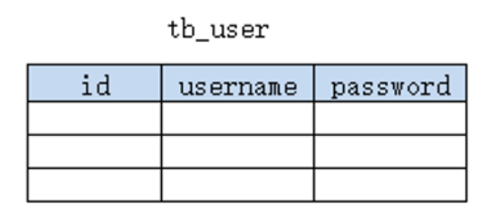

语句如下：

```mysql
create table tb_user (
	id int,
    username varchar(20),
    password varchar(32)
);

show tables;

desc tb_user;
```

运行语句如下：

### 3，数据类型

MySQL 支持多种类型，可以分为三类：

* 数值
* 日期
* 字符串

数值：

* tinyint : 小整数型，占一个字节
* int： 大整数类型，占四个字节。eg： age int
* double ： 浮点类型，使用格式： 字段名 double(总长度, 小数点后保留的位数)。eg： score double(5, 2)   

日期：

* date：日期值。只包含年月日。eg：birthday date ： 
* datetime ： 混合日期和时间值。包含年月日时分秒

字符串：

* char：  定长字符串。优点：存储性能高。缺点：浪费空间。eg： name char(10)  如果存储的数据字符个数不足10个，也会占10个的空间
* varchar： 变长字符串。优点：节约空间。缺点：存储性能底。eg： name varchar(10) 如果存储的数据字符个数不足10个，那就数据字符个数是几就占几个的空间

参考如下：

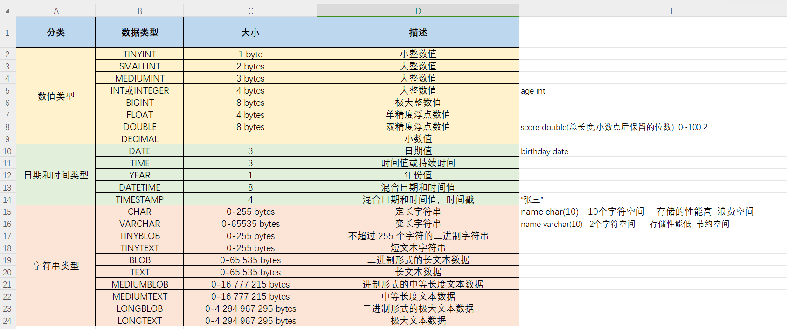

案例：

```text
需求：设计一张学生表，请注重数据类型、长度的合理性
	1. 编号
	2. 姓名，姓名最长不超过10个汉字
	3. 性别，因为取值只有两种可能，因此最多一个汉字
	4. 生日，取值为年月日
	5. 入学成绩，小数点后保留两位
	6. 邮件地址，最大长度不超过 64
	7. 家庭联系电话，不一定是手机号码，可能会出现 - 等字符
	8. 学生状态（用数字表示，正常、休学、毕业...）
```

语句设计：

```mysql
create table student (
	id int,
    name varchar(10),
    gender char(1),
    birthday date,
    score double(5,2),
    email varchar(15),
    tel varchar(15),
    status tinyint
);
```

### 4，删除表

删除表：

```mysql
DROP TABLE 表名;
```

删除表时判断是否存在：

```mysql
DROP TABLE IF EXISTS 表名;
```

运行语句效果如下：

### 5，修改表

修改表名：

```mysql
ALTER TABLE 表名 RENAME TO 新的表名;

-- 将表名student修改为stu
alter table student rename to stu;
```

添加一列：

```mysql
ALTER TABLE 表名 ADD 列名 数据类型;

-- 给stu表添加一列address，该字段类型是varchar(50)
alter table stu add address varchar(50);
```

修改数据类型：

```mysql
ALTER TABLE 表名 MODIFY 列名 新数据类型;

-- 将stu表中的address字段的类型改为 char(50)
alter table stu modify address char(50);
```

修改列名和数据类型：

```mysql
ALTER TABLE 表名 CHANGE 列名 新列名 新数据类型;

-- 将stu表中的address字段名改为 addr，类型改为varchar(50)
alter table stu change address addr varchar(50);
```

删除列：

```mysql
ALTER TABLE 表名 DROP 列名;

-- 将stu表中的addr字段 删除
alter table stu drop addr;
```

## 五，DML

DML主要是对数据进行增（insert）删（delete）改（update）操作。

### 1，添加数据

给指定列添加数据：

```mysql
INSERT INTO 表名(列名1,列名2,…) VALUES(值1,值2,…);
```

给全部列添加数据：

```mysql
INSERT INTO 表名 VALUES(值1,值2,…);
```

批量添加数据：

```mysql
INSERT INTO 表名(列名1,列名2,…) VALUES(值1,值2,…),(值1,值2,…),(值1,值2,…)…;
INSERT INTO 表名 VALUES(值1,值2,…),(值1,值2,…),(值1,值2,…)…;
```

为了演示以下的增删改操作是否操作成功，故先将查询所有数据的语句介绍给大家：

```mysql
select * from stu;
```

效果如下：

操作如下：

```mysql
-- 给指定列添加数据
INSERT INTO stu (id, NAME) VALUES (1, '张三');
-- 给所有列添加数据，列名的列表可以省略的
INSERT INTO stu (id,NAME,sex,birthday,score,email,tel,STATUS) VALUES (2,'李四','男','1999-11-11',88.88,'lisi@qq.cn','13888888888',1);

INSERT INTO stu VALUES (2,'李四','男','1999-11-11',88.88,'lisi@itcast.cn','13888888888',1);

-- 批量添加数据
INSERT INTO stu VALUES 
	(2,'李四','男','1999-11-11',88.88,'lisi@qq.cn','13888888888',1),
	(2,'李四','男','1999-11-11',88.88,'lisi@qq.cn','13888888888',1),
	(2,'李四','男','1999-11-11',88.88,'lisi@qq.cn','13888888888',1);
```

### 2，修改数据

修改表数据：

```mysql
UPDATE 表名 SET 列名1=值1,列名2=值2,… [WHERE 条件] ;
-- 修改语句中如果不加条件，则将所有数据都修改！
-- 像上面的语句中的中括号，表示在写sql语句中可以省略这部分
```

将张三的性别改为女：

```mysql
update stu set sex = '女' where name = '张三';
```

将张三的生日改为 1999-12-12 分数改为99.99：

```mysql
update stu set birthday = '1999-12-12', score = 99.99 where name = '张三';
```

如果update语句没有加where条件，则会将表中所有数据全部修改：

```mysql
update stu set sex = '女';
```

上面语句的执行完后查询到的结果是：

### 3，删除数据

删除数据：

```mysql
DELETE FROM 表名 [WHERE 条件] ;
```

练习：

```mysql
-- 删除张三记录
delete from stu where name = '张三';

-- 删除stu表中所有的数据
delete from stu;
```

## 六，DQL(重点)

### 1，基础查询

查询的完整语法：

```mysql
SELECT 
    字段列表
FROM 
    表名列表 
WHERE 
    条件列表
GROUP BY
    分组字段
HAVING
    分组后条件
ORDER BY
    排序字段
LIMIT
    分页限定
```

为了给大家演示查询的语句，我们需要先准备表及一些数据：

```mysql
-- 删除stu表
drop table if exists stu;

-- 创建stu表
CREATE TABLE stu (
 id int, -- 编号
 name varchar(20), -- 姓名
 age int, -- 年龄
 sex varchar(5), -- 性别
 address varchar(100), -- 地址
 math double(5,2), -- 数学成绩
 english double(5,2), -- 英语成绩
 hire_date date -- 入学时间
);

-- 添加数据
INSERT INTO stu(id,NAME,age,sex,address,math,english,hire_date) 
VALUES 
(1,'马运',55,'男','杭州',66,78,'1995-09-01'),
(2,'马花疼',45,'女','深圳',98,87,'1998-09-01'),
(3,'马斯克',55,'男','香港',56,77,'1999-09-02'),
(4,'柳白',20,'女','湖南',76,65,'1997-09-05'),
(5,'柳青',20,'男','湖南',86,NULL,'1998-09-01'),
(6,'刘德花',57,'男','香港',99,99,'1998-09-01'),
(7,'张学右',22,'女','香港',99,99,'1998-09-01'),
(8,'德玛西亚',18,'男','南京',56,65,'1994-09-02');
```

查询多个字段语法格式：

```mysql
SELECT 字段列表 FROM 表名;
SELECT * FROM 表名; -- 查询所有数据
```

去除重复记录语法格式：

```mysql
SELECT DISTINCT 字段列表 FROM 表名;
```

起别名语法格式：

```mysql
AS: AS 也可以省略
```

查询name、age两列：

```mysql
select name,age from stu;
```

查询所有列的数据，列名的列表可以使用*替代：

```mysql
select * from stu;

-- 上面语句中的*不建议大家使用，因为在这写\*不方便我们阅读sql语句。我们写字段列表的话，可以添加注释对每一个字段进行说明。而在上课期间为了简约课程的时间，老师很多地方都会写*。

select 
	name, -- 姓名
	age  -- 年龄
from 
	stu;
```

查询地址信息：

```mysql
select address from stu;
```

从上面的结果我们可以看到有重复的数据，我们也可以使用 `distinct` 关键字去重重复数据。去除重复记录：

```mysql
select distinct address from stu;
```

查询姓名、数学成绩、英语成绩。并通过as给math和english起别名（as关键字可以省略）：

```mysql
select name,math as 数学成绩,english as 英文成绩 from stu;
select name,math 数学成绩,english 英文成绩 from stu;
```

### 2，条件查询

条件查询语法：

```mysql
SELECT 字段列表 FROM 表名 WHERE 条件列表;
```

条件列表可以使用以下运算符：

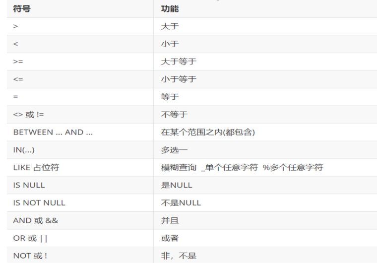

查询年龄大于20岁的学员信息：

```mysql
select * from stu where age > 20;
```

查询年龄大于等于20岁的学员信息：

```mysql
select * from stu where age >= 20;
```

查询年龄大于等于20岁 并且 年龄 小于等于 30岁 的学员信息：

```mysql
select * from stu where age >= 20 &&  age <= 30;
select * from stu where age >= 20 and  age <= 30;

-- 上面语句中 &&  和  and  都表示并且的意思。建议使用 and 。
-- 也可以使用  between ... and 来实现上面需求

select * from stu where age BETWEEN 20 and 30;
```

查询入学日期在'1998-09-01' 到 '1999-09-01'  之间的学员信息：

```mysql
select * from stu where hire_date BETWEEN '1998-09-01' and '1999-09-01';
```

查询年龄等于18岁的学员信息：

```mysql
select * from stu where age = 18;
```

查询年龄不等于18岁的学员信息：

```mysql
select * from stu where age != 18;
select * from stu where age <> 18;
```

查询年龄等于18岁 或者 年龄等于20岁 或者 年龄等于22岁的学员信息：

```mysql
select * from stu where age = 18 or age = 20 or age = 22;
select * from stu where age in (18,20 ,22);
```

查询英语成绩为 null的学员信息：

```mysql
select * from stu where english = null; -- 这个语句是不行的
select * from stu where english is null;
select * from stu where english is not null;

-- null值的比较不能使用 =  或者 != 。需要使用 is  或者 is not
```

模糊查询使用like关键字，可以使用通配符进行占位:

* _ : 代表单个任意字符
* % : 代表任意个数字符

查询姓'马'的学员信息：

```mysql
select * from stu where name like '马%';
```

查询第二个字是'花'的学员信息：

```mysql
select * from stu where name like '_花%';
```

查询名字中包含 '德' 的学员信息：

```mysql
select * from stu where name like '%德%';
```

### 3，排序查询

语法：

```mysql
SELECT 字段列表 FROM 表名 ORDER BY 排序字段名1 [排序方式1],排序字段名2 [排序方式2] …;
```

上述语句中的排序方式有两种，分别是：

* ASC ： 升序排列 （默认值）
* DESC ： 降序排列
* 如果有多个排序条件，当前边的条件值一样时，才会根据第二条件进行排序

查询学生信息，按照年龄升序排列 ：

```mysql
select * from stu order by age ;
```

查询学生信息，按照数学成绩降序排列：

```mysql
select * from stu order by math desc ;
```

查询学生信息，按照数学成绩降序排列，如果数学成绩一样，再按照英语成绩升序排列：

```mysql
select * from stu order by math desc , english asc ;
```

### 4，聚合函数

将一列数据作为一个整体，进行纵向计算。假设有如下表

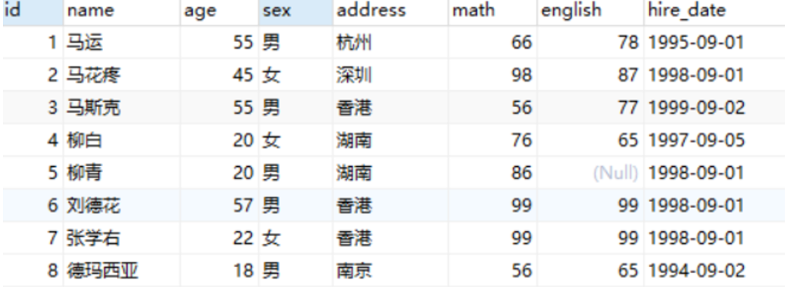

现有一需求让我们求表中所有数据的数学成绩的总和。这就是对math字段进行纵向求和。聚合函数分类：

| 函数名      | 功能                             |
| ----------- | -------------------------------- |
| count(列名) | 统计数量（一般选用不为null的列） |
| max(列名)   | 最大值                           |
| min(列名)   | 最小值                           |
| sum(列名)   | 求和                             |
| avg(列名)   | 平均值                           |

语法：

```mysql
SELECT 聚合函数名(列名) FROM 表; -- null 值不参与所有聚合函数运算
```

统计班级一共有多少个学生：

```mysql
select count(id) from stu;
select count(english) from stu;
```

上面语句根据某个字段进行统计，如果该字段某一行的值为null的话，将不会被统计。所以可以在count(*) 来实现。\* 表示所有字段数据，一行中也不可能所有的数据都为null，所以建议使用 count(\*)：

```mysql
select count(*) from stu;
```

查询数学成绩的最高分：

```mysql
select max(math) from stu;
```

查询数学成绩的最低分：

```mysql
select min(math) from stu;
```

查询数学成绩的总分：

```mysql
select sum(math) from stu;
```

查询数学成绩的平均分：

```mysql
select avg(math) from stu;
```

查询英语成绩的最低分：

```mysql
select min(english) from stu;
```

### 5，分组查询

语法：

```mysql
SELECT 字段列表 FROM 表名 [WHERE 分组前条件限定] GROUP BY 分组字段名 [HAVING 分组后条件过滤];
--  分组之后，查询的字段为聚合函数和分组字段，查询其他字段无任何意义
```

查询男同学和女同学各自的数学平均分：

```mysql
select sex, avg(math) from stu group by sex;

-- 分组之后，查询的字段为聚合函数和分组字段，查询其他字段无任何意义
select name, sex, avg(math) from stu group by sex;  -- 这里查询name字段就没有任何意义
```

查询男同学和女同学各自的数学平均分，以及各自人数：

```mysql
select sex, avg(math),count(*) from stu group by sex;
```

查询男同学和女同学各自的数学平均分，以及各自人数，要求：分数低于70分的不参与分组：

```mysql
select sex, avg(math),count(*) from stu where math > 70 group by sex;
```

查询男同学和女同学各自的数学平均分，以及各自人数，要求：分数低于70分的不参与分组，分组之后人数大于2个的：

```mysql
select sex, avg(math),count(*) from stu where math > 70 group by sex having count(*)  > 2;
```

where 和 having 区别：

* 执行时机不一样：where 是分组之前进行限定，不满足where条件，则不参与分组，而having是分组之后对结果进行过滤。
* 可判断的条件不一样：where 不能对聚合函数进行判断，having 可以。

### 6，分页查询

语法：

```mysql
SELECT 字段列表 FROM 表名 LIMIT  起始索引 , 查询条目数;

-- 上述语句中的起始索引是从0开始
```

从0开始查询，查询3条数据：

```mysql
select * from stu limit 0 , 3;
```

每页显示3条数据，查询第1页数据：

```mysql
select * from stu limit 0 , 3;
```

每页显示3条数据，查询第2页数据：

```mysql
select * from stu limit 3 , 3;
```

每页显示3条数据，查询第3页数据：

```mysql
select * from stu limit 6 , 3;
```

从上面的练习推导出起始索引计算公式：

```mysql
起始索引 = (当前页码 - 1) * 每页显示的条数
```
