## 一，Java背景

本门课程的讲解是建立在你已经掌握了一门编程语言的基础上进行讲解的。默认你已经会了一门编程语言，如：JS。如果你是完全零基础的小白，那就不适合本门课程。

### 1，Java历史（了解）

* **Java是哪家公司的产品？**

  Java是美国Sun（Stanford University Network，斯坦福大学网络公司）公司在1995年推出的一门计算机**高级编程语言**。但是在2009年是Sun公司被Oracle（甲骨文）公司给收购了，所以目前Java语言是Oracle公司所有产品。

* **Java名称的来历？**

  早期这门语言的名字其实不叫Java，当时称为Oak（橡树的意思），为什么叫橡树呢？原因是因为Sun公司的门口种了很多橡树，但是后来由于商标注册时，Oak商标已经其他公司注册了，所以后面改名为Java了。那么有人好奇为什么叫Java呢？Java是印度的一个岛屿，上面盛产咖啡，可能是因为他们公司的程序员喜欢喝咖啡，所以就改名为Java了。

* **Java的创始人是谁？**

  说完Java名称的来历之后，接下来我们聊聊Java的祖师爷是谁？ Java的联合创始人有很多，但是行业普遍认可的Java的创始人 是**詹姆斯●高斯林**，被称为Java之父

### 2，Java能做什么（了解）

其实Java能做的事情非常多，它可以做桌面应用的开发、企业互联网应用开发、移动应用开发、服务器系统开发、大数据开发、游戏开发等等。

1. 桌面应用开发：能够在电脑桌面运行的软件
	举例：财务管理软件、编写程序用的IDEA开发工具等，可以用Java语言开发
	

2. 企业级应用开发：大型的互联网应用程序
	举例：淘宝、京东等

3. 移动应用开发：运行的Android手机端的软件
	举例：QQ客户端、抖音APP等

4. 服务器系统：应用程序的后台（为客户端程序提供数据）
	举例：服务器系统为用户推荐那你喜爱的视频

5. 大数据开发：大数据是一个互联网开发方向
	举例：目前最火的大数据开发平台是Hadoop，就是用Java语言开发的

6. 游戏开发：游戏本质上是给用户提供娱乐的软件，有良好的交互感受
	举例：我的世界MineCraft就是用Java语言开发的

### 3，Java技术体系

Java为了满足不同的应用场景提供了不同的技术版本，主要有三个版本。

* Java SE（Java Standard Edition）：叫做标准版，它是后面两个版本的基础，也就是学习后面两个版本必须先学习JavaSE。**我们现阶段学习的就是这个版本中的技术，它是Java技术的核心和基础**。
* Java EE（Java Enterprise Edition）: 叫做企业版，它是为企业级应用开发提供的一套解决方案。**在后面课程中主要学习这个版本中的技术**。
* Java ME（Java Micro Edition）：叫做小型版，它为开发移动设备的应用提供了一套解决方案。**目前已经不被市场认可（淘汰），取而代之的是基于Android系统的应用开发**。

## 二，Java快速入门

### 1，安装JDK

要使用Java语言开发程序，我们得先得安装Java的开发环境，所谓的Java开发环境，实际上就是Java官方提供的一个软件，叫做JDK（全称是Java Develop Kit），翻译过来意思就是Java开发工具包。我们先要到官网上去下载JDK，然后安装在自己的电脑上，才可以在自己的电脑上使用JDK来开发Java程序。JDK的版本有很多，下图是JDK版本更新的历程图，有LTS标识的是长期支持版本（意思就是Oracle会不定期更新）。目前公司中用得最多的版本是JDK8版本。

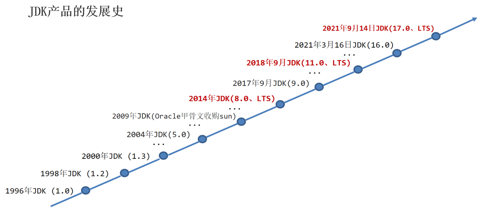

下载JDK，大家直接使用我们下载好的JDK就行。如下：

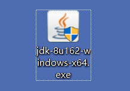

双击安装包，按照下图引导，点击下一步即可安装。**需要注意的是安装JDK后不像你安装QQ一样会在桌面上显示一个图标，JDK安装后桌面上没有图标！！！**  课堂演示安装流程：

文件资源管理器打开JDK的安装目录的bin目录，会发现有两个命令工具 `javac.exe`  `java.exe` ，这就是JDK提供给我们使用的**编译工具和运行工具**，如下：

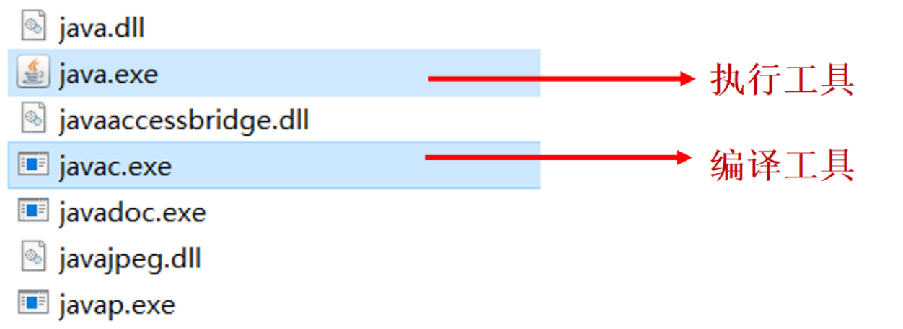

将来我们写好的Java程序都是高级语言，计算机底层是硬件不能识别这些语言。必须先通过javac编译工具进行翻译，然后再通过java执行工具执行才可以驱动机器干活。

### 2，配置环境变量

什么是Path环境变量？

* Path环境变量是让系统程序的路径，方便程序员在命令行窗口的任意目录下启动程序；

如何配置环境变量呢？比如把QQ的启动程序，配置到Path环境变量下就可以在任意目录下启动QQ，按照一下步骤操作。步骤如下：

**第一步：**先找到QQ启动程序所在的目录 `C:\Program Files (x86)\Tencent\QQ\Bin` ，复制这个路径

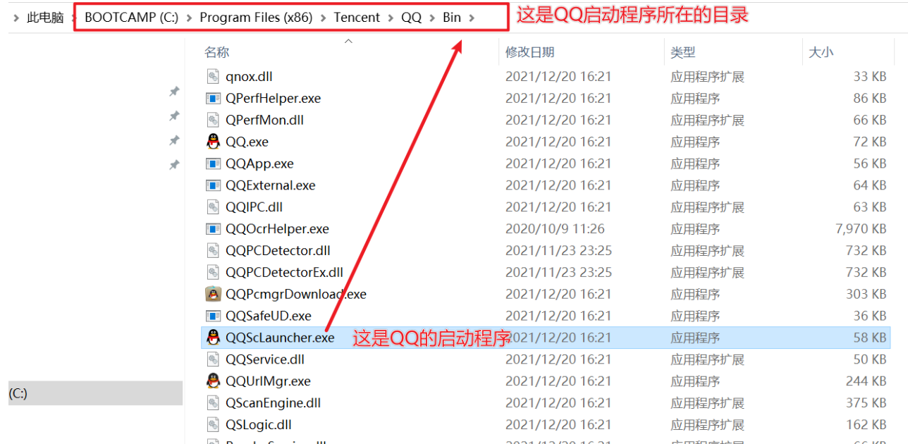

**第二步：**按照下面的步骤，找到Path环境变量。首先找到此电脑，右键点击属性，可以按照下面的界面；点击【高级系统设置】，再点击【环境变量】

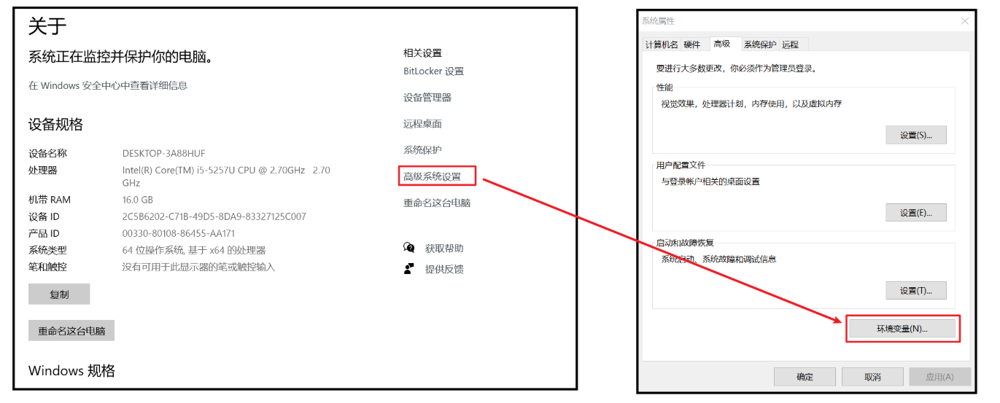

双击Path后，点击新建，把QQ启动目录粘贴进来，不要忘记点确定，如下：

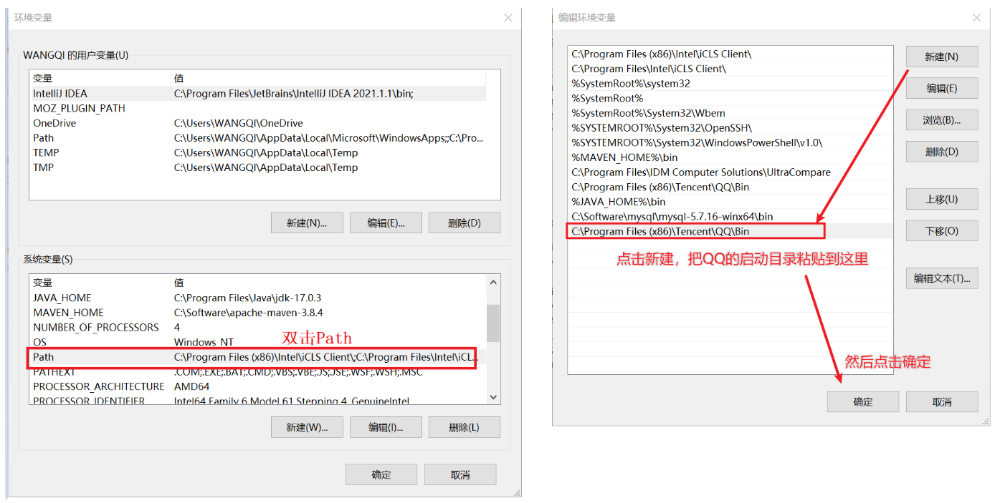

**第三步：**配置好之后，检查是否配置成功。Win+R 输入cmd回车，打开命令行窗口。输入QQScLanucher，可以看到QQ启动了，如下：

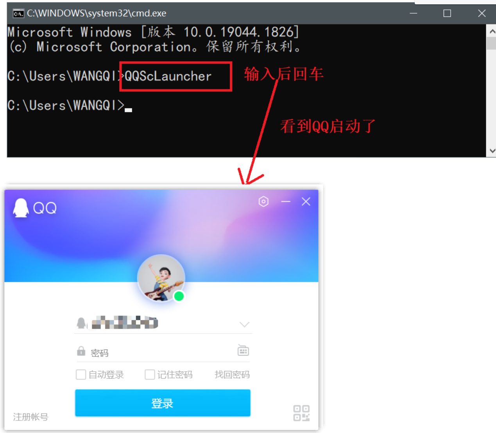

把JDK配置到Path中，我们把JDK的bin目录配置到Path环境变量下，这样就可以在任意目录下启动javac和java命令来完成编译和运行了。我们先配置Java_home环境变量，JAVA_HOME：告诉操作系统JDK安装在了哪个位置（将来其他技术要通过这个环境变量找JDK）。配置如下：

**第一步：**找到JDK的目录

**第二步：**将JDK的bin目录粘贴在Path环境变量后面

**第三步：检测否配置成功**

验证JDK安装成功的方式：查询JDK的版本号。按下 Win + R ，在运行输入框中输入 cmd，敲回车。在命令行 窗口中分别输入javac –version 及 java –version看版本提示，如果版本提示与自己安装的版本号一致，则代表JDK环境搭建成功。如下：

### 2，Java入门程序

编写一个Java程序需要经过3个步骤：编写代码，编译代码，运行代码。如下：

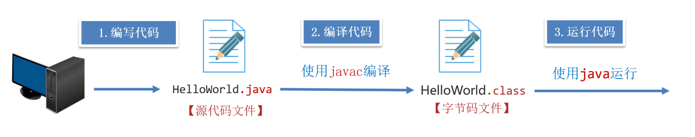

* 编写代码：任何一个文本编辑器都可以些代码，如Windows系统自带的记事本

* 编译代码：将人能看懂的源代码（.java文件）转换为Java虚拟机能够执行的字节码文件（.class文件）

* 运行代码：将字节码文件交给Java虚拟机执行

第一步：新建一个后缀为.java的文本文件 `HelloWorld.java` ，用记事本编写代码如下。

```java
public class HelloWorld {
   public static void main(String[] args) {
     System.out.println(" HelloWorld ");
    }
}
```

第二步：进入 `HelloWorld.java` 文件所在目录，在地址栏输入cmd回车，即可在此处打开命令行窗口。

编译：在命令行窗口输入编译命令 `javac HelloWorld` 完成编译，编译后会生成一个 `HelloWorld.class` 文件。

第三步：再接着输入 `java HelloWorld` 就可以运行了，运行结果如下

### 3，入门程序常见问题

* Windows的文件扩展名没有勾选

* 代码写了，但是忘记保存了

* 文件名和类名不一致。

* 英文大小写错误，单词拼写错误，存在中文符号，找不到main方法。

* 括号不配对。

* 编译或执行工具使用不当。

### 4，JDK的组成

JDK由JVM、核心类库、开发工具组成，如下：

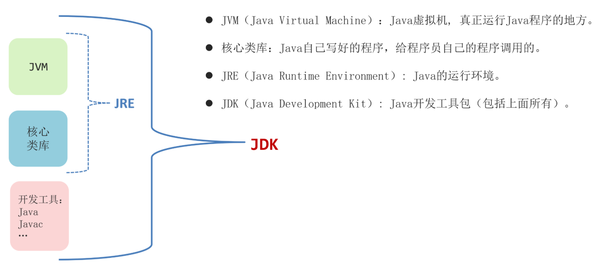

什么是JVM?

* JDK最核心的组成部分是JVM（Java Virtual Machine），它是Java虚拟机，真正运行Java程序的地方。

什么是核心类库？

* 它是Java本身写好的一些程序，给程序员调用的。 Java程序员并不是凭空开始写代码，是要基于核心类库提供的一些基础代码，进行编程。

什么是JRE?

* JRE（Java Runtime Enviroment），意思是Java的运行环境；它是由JVM和核心类库组成的；如果你不是开发人员，只需要在电脑上安装JRE就可以运行Java程序。

什么是开发工具呢？

* Java程序员写好源代码之后，需要编译成字节码，这里会提供一个编译工具叫做javac.exe，编写好源代码之后，想要把class文件加载到内存中运行，这里需要用到运行工具java.exe。除了编译工具和运行工具，还有一些其他的反编译工具、文档工具等待...

**总结：**

* 用JDK开发程序，交给JRE运行

## 三，IDEA

集成开发环境（ IDE, Integrated Development Environment ）

* 把代码编写，编译，执行等多种功能综合到一起的开发工具，可以进行代码智能提示，错误提醒，项目管理等

* 常见的Java  IDE工具有：Eclipse、MyEclipse、IntelliJ IDEA、Jbuilder、NetBeans等。

  

### 1，IDEA下载和安装

IDEA详细的安装和使用步骤如下：

### 2，Java程序的工程结构

想要在IDEA正确的写一个Java程序，必须先认识一下IDEA的管理Java程序的工程结构。

* 第一步：首先得在IDEA中创建一个Project（工程、也叫项目），后面统称为工程。理解成小区的院子。
* 第二步：需要在Project中创建Module（模块），一个工程中可以包含多个模块。理解成小区院子里面的每一栋楼。
* 第三步：需要在Module中新建Package（包），一个模块中可以有多个包。理解成每一栋楼的一层。
* 第四步：需要在Package中新建Class（类），一个包中可以包含多个类。理解成每一层的住户。

创建工程，创建模块，创建包，创建类流程如下：

### 3，IDEA各种配置

主题配置：

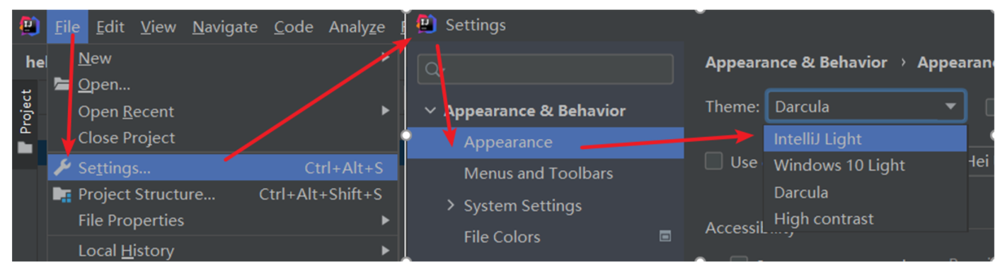

字体配置：


背景色配置，把背景色的颜色值，调为204、238、200；就是豆沙绿的护眼色了：

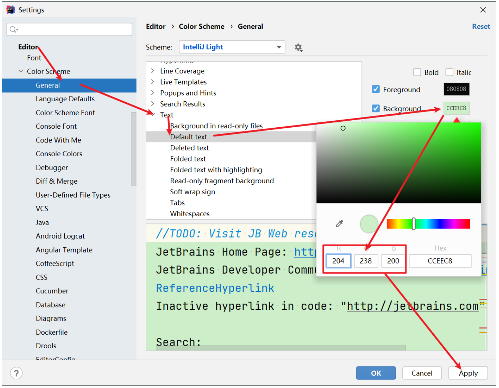

### 4，快捷键

| **快捷键**                        | **功能效果**                     |
| --------------------------------- | -------------------------------- |
| main/psvm、sout、…                | 快速键入相关代码                 |
| Ctrl + D                          | 复制当前行数据到下一行           |
| Ctrl + Y                          | 删除所在行，建议用Ctrl + X       |
| Ctrl + ALT + L                    | 格式化代码                       |
| ALT + SHIFT + ↑ , ALT + SHIFT + ↓ | 上下移动当前代码                 |
| Ctrl + / , Ctrl + Shift + /       | 对代码进行注释(讲注释的时候再说) |

快捷键其实有很多，这里列举的是现阶段我们用得比较多的，现在记住不也不要紧，以后经常用，用着用着就记住了。

## 四，Java基础语法

### 1，注释

```java
1.单行注释：
	//后面根解释文字
2.多行注释
    /*
    这里写注释文字
    可以写多行
    */
3.文档注释
    /**
    这里写文档注释
    也可以写多行，文档注释可以利用JDK的工具生成帮助文档
    */
```

快捷键：

* Ctrl + / 	单行注释（对当前行进行注释）
* Ctrl + Shift + / 	对选中的代码进行多行注释。

### 2，字面量

什么是字面量？

* 字面量其实就是告诉程序员数据在程序中的书写格式。下面是常用的数据在程序中的书写格式。
* 对于字面量，大家只要能够正确写出各种数据就可以了

代码演示：

```java
public class HelloWorld{
    public static void main(String[] args){
        //1.整数
        System.out.println(666);
        
        //2.小数
        System.out.println(3.66);
        
        //3.字符: 字符必须用单引号引起来
        System.out.println('a');
        System.out.println('0');
        System.out.println('中');
        System.out.println(' '); //空格也算字符
        //特殊字符：\t表示制表符 \n表示换行
        System.out.println('\t'); //这相当于一个tab键，专业叫做制表符
        System.out.println('\n'); //这是换行的意思
        
        //4.字符串：字符串是双引号引起来的
        System.out.println("我爱你");
        
        //5.布尔值：只有两个值true和false
        System.out.println(true);
        System.out.println(false);
    }
}
```

### 3，变量

什么是变量

* 变量是用来记录程序中的数据的。其本质上是内存中的一块区域，你可以把这块区域理解成一个小盒子。
* Java中定义变量和JS中定义变量，是有区别的。

代码演示：

```java
int x = 10;
double money = 188.8;
int count = 0
```

变量的小细节：

```java
// 变量的作用域(变量的有效范围)：
{
    int a = 10;
    System.out.println(a); //这是是对的
}
System.out.println(a); //这里会出错

// 同一个作用域内，不能有两个同名的变量
{
    int a = 10;
    int a = 20; //这里会出错
}

// 变量没有初始化只，不能直接使用
int a; //仅仅定义了变量，但是没有初始值
System.out.println(a); //这里会出错

// 变量可以定义在同一行
int a=10, b=20; //a和b都是int类型
```

### 4，关键字

Java中的关键字：

* 关键字是java语言中有特殊含义的单词。比如用int表示整数，用double表示小数，等等！
* 我们学习Java的语法其本质就是学习这些关键字的含义，一共有50多个关键字，我们不是一次性把这些关键字学完，会在后续的课程中每天学一点，慢慢得你就都学会了。
* 关键字都是小写的，关键字在idea中有特殊颜色标记，默认是蓝色的。

| **abstract**   | **assert**       | **boolean**   | **break**      | **byte**   |
| -------------- | ---------------- | ------------- | -------------- | ---------- |
| **case**       | **catch**        | **char**      | **class**      | **const**  |
| **continue**   | **default**      | **do**        | **double**     | **else**   |
| **enum**       | **extends**      | **final**     | **finally**    | **float**  |
| **for**        | **goto**         | **if**        | **implements** | **import** |
| **instanceof** | **int**          | **interface** | **long**       | **native** |
| **new**        | **package**      | **private**   | **protected**  | **public** |
| **return**     | **strictfp**     | **short**     | **static**     | **super**  |
| **switch**     | **synchronized** | **this**      | **throw**      | **throws** |
| **transient**  | **try**          | **void**      | **volatile**   | **while**  |

### 5，标识符

标识符：

* 类名，变量名其实都是标志符，取名字的规则，不能让我们随即便瞎取。有些规则是强制要求的，不遵守就会报错。还有一些规则是我们建议大家遵守的，这样取名字显得我们更加专业

强制要求：必须遵守，不遵守就会报错

* 最好是字母、数字、下划线、$组成
* 不能以数字开头
* 不能是Java的关键字

建议遵守：按照下面的方式取名字会显得更加专业

* 所有的名字要见名知意，便于自己和别人阅读
* 类名：首字母大写（大驼峰命名）
* 变量名：第二个单词开始首字母大写（小驼峰命名）

### 6，数据的表示

任何数据在计算机中都是以**二进制**表示的。整数在计算机中存储都是以二进制形式存储的。现在想要在计算机中存储一个整数6，转换为二进制是110，那么计算机中只是存110吗三位数字吗？ 其实不是的，**计算机中最小的存储单位是字节（Byte），一个字节占8位（bit）**，也就是说即使这个数据不足8位也需要用8位来存储。

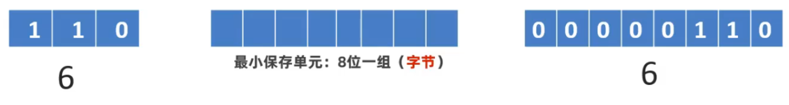

字符并不是直接存储的，而是把每一个字符编为一个整数，存储的是字符对应整数的二进制形式。美国人搞了一套字符和整数的对应关系表，叫做ASCII编码表。

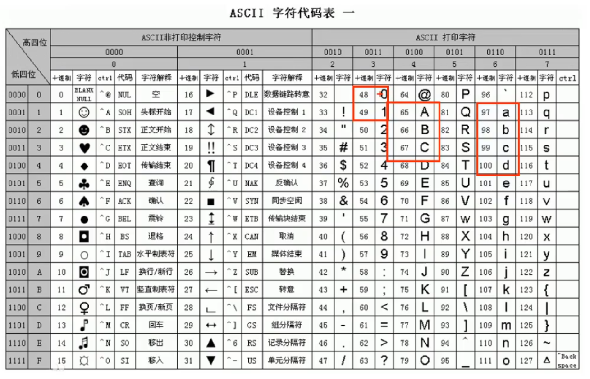

再说一下图片的存储，把一张图片不断的放大，你会看到有马赛克的效果。你会发现图片中的每一个细节是由一个一个的小方格组成的，每一个小方格中其实就是一种颜色。任何一种颜色可以使用三原色来表示，简称RGB，其中R（红色），G（绿色），B（蓝色），而RGB中每一种颜色又用一个字节的整数来表示，最小值是0最大值是255。


同样，视频和图片是一样的，把多张图片连续播放，在一秒钟内连续播放24张以上，由于人眼存在视觉暂留现象，人眼感受不到画面切换的时间间隔，就认为是连续的视频了。


声音是以波的形式传播的。我们可以把声波在表示在一个坐标系上，然后在坐标系上取一些点，把这些点的坐标值以二进制的形式存储到计算机中，这就是声音的存储原理。


### 7，数据类型

Java的数据类型整体上来说分为两大类： 

* 基本数据类型
* 引用数据类型

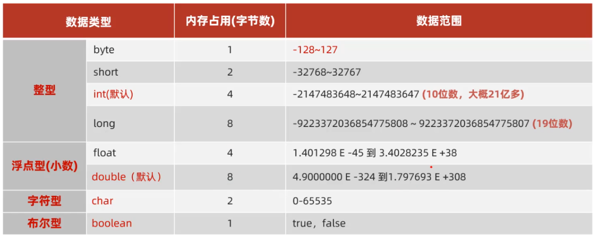

整数和小数的默认类型：

* 比如23，它默认就为int类型；如果加上后缀L，则为long类型
* 比如23.8，它默认为double类型；如果加上后缀F，则为float类型

参考代码：

```java
public class HelloWorld {
    public static void main(String[] args) {
        // 1、整型
        byte number = 98;
        System.out.println(number);

        short number2 = 9000;

        int number3 = 12323232; // 默认

        // 注意：随便写一个整型字面量，默认是int类型的，73642422442424虽然没有超过long的范围，但是它超过了本身int的范围了。
        // 如果希望随便写一个整型字面量是long类型的，需要在其后面加上L/l
        long number4 = 73642422442424L;

        // 2、浮点型
        //随便写一个小数字面量，默认当成double类型对待的，
        //如果希望这个小数是float类型的，需要在后面加上：F/f
        float score1 = 99.5F;
        double score2 = 99.8; // 默认定义方案。

        // 3、字符型
        char ch1 = 'a';
        char ch2 = '中';
        char ch3 = '国';

        // 4、布尔型
        boolean b1 = true;
        boolean b2 = false;

        // 引用数据类型：String
        String name = "码路";
        System.out.println(name);
    }
}
```

### 8，数据类型转化

分类：

* 自动类型转化
* 强制类型转化

自动类型转化：

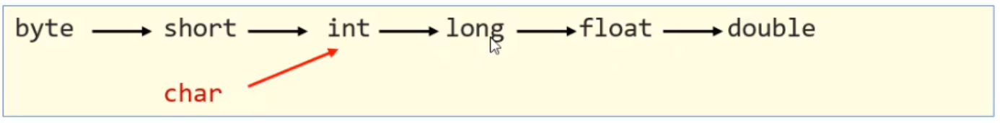

```java
byte a = 12;
int b = a; // 发生了自动类型转换了
System.out.println(a);
System.out.println(b);

int c = 100; // 4
double d = c;// 8 发生了自动类型转换了
System.out.println(d);

char ch = 'a'; // 'a' 97 
int i = ch; // 发生了自动类型转换了 
System.out.println(i);
```

自动类型转化之表达式类型转化

* 所谓表达式指的是几个变量或者几个数据一起参与运算的式子
* 多种数据类型参与运算，其结果以大的数据类型为准
* byte, short, char 三种类型数据在和其他类型数据运算时，都会转换为int类型再运算

参考代码：

```java
byte a = 10;
int b = 20;
long c = 30;
long rs = a + b + c;
System.out.println(rs);

double rs2 = a + b + 1.0;
System.out.println(rs2);

byte i = 10;
short j = 30;
int rs3 = i + j;
System.out.println(rs3);

// 面试笔试题： 即使两个byte运算，结果也会提升为int
byte b1 = 110;
byte b2 = 80;
int b3 = b1 + b2;
System.out.println(b3);
```

强制类型转化

* 强行将范围大的数据，赋值给范围小的变量也是可以的，这里就需要用到强制类型转换
* 格式：目标数据类型  变量名  =  (目标数据类型)被转换的数据
* 强制类型转化，有数据丢失风险

参考代码：

```java
int a = 20;
byte b = (byte) a;  // ALT + ENTER 强制类型转换。
System.out.println(a);
System.out.println(b);

int i = 1500;
byte j = (byte) i;
System.out.println(j);

double d = 99.5;
int m = (int) d; // 强制类型转换
System.out.println(m); // 丢掉小数部分，保留整数部分
```

### 9，算术运算符

运算符就是参与运算的符号。Java提供的运算符有很多种，可以分为算术下面几种

* 基本算术运算符
* 自增自减运算符
* 赋值运算符
* 关系运算符
* 逻辑运算符
* 三元运算符

算术运算符直接上代码：

```java
System.out.println(5 / 2); // 2.5 ==> 2
System.out.println(5.0 / 2); // 2.5
int i = 5;
int j = 2;
System.out.println(1.0 * i / j); // 2.5

System.out.println(a % b); // 0
System.out.println(3 % 2); // 1

int a2 = 5;
System.out.println("abc" + a2); // "abc5"
System.out.println(a2 + 5); //  10
System.out.println("malu" + a2 + 'a'); 
System.out.println(a2 + 'a' + "malu"); 
```

### 10，自增自减运算符

不管是++在前，还是++在后，自己本身的值肯定要加的，但是如何++在前，整体的值是一个新值，如果++在后，整体的值是一个旧值。和JS是一样的。

### 11，赋值运算符

同JS一样。区别如下：

```java
a += b  //  a = (a的类型)（a+b)
a -= b  //  a = (a的类型)（a-b)
a *= b  //  a = (a的类型)（a*b)
a /= b  //  a = (a的类型)（a/b)
a %= b  //  a = (a的类型)（a%b)
    
byte x = 10;
byte y = 30;
x = x + y;  // 两个byte类型数据相加，会提升为int类型

-------------------
    
byte x = 10;
byte y = 30;
x+=3; //这句代码没有问题，因为这里有隐含的强制类型转换
//x+=3; 等价于 byte x = (byte)(x+y);
```

### 12，关系运算符

和JS一样，关系运算符得到的结果要么为true，要么为false。

### 13，逻辑运算符

这个和我们JS的逻辑运算符略有区别：


参考代码：

```java
public class OperatorDemo5 {
    public static void main(String[] args) {
        // 目标：掌握逻辑运算符的使用。
        // 需求：要求手机必须满足尺寸大于等于6.95，且内存必须大于等于8.
        double size = 6.8;
        int storage = 16;
        // 1、& 前后的条件的结果必须都是true ,结果才是true.
        boolean rs = size >= 6.95 & storage >= 8;
        System.out.println(rs);

        // 需求2：要求手机要么满足尺寸大于等于6.95，要么内存必须大于等于8.
        // 2、| 只要多个条件中有一个是true,结果就是true.
        boolean rs2 = size >= 6.95 | storage >= 8;
        System.out.println(rs2);

        // 3、!取反的意思
        System.out.println(!true); // false
        System.out.println(!false); // true
        System.out.println(!(2 > 1)); // false

        // 4、^ 前后条件的结果相同时返回false，不同时返回true.
        System.out.println(true ^ true); // false
        System.out.println(false ^ false); // false
        System.out.println(true ^ false); // true
        System.out.println(false ^ true); // true

        // 5、&& 左边为false，右边不执行。
        int i = 10;
        int j = 20;
        // System.out.println(i > 100 && ++j > 99);
        System.out.println(i > 100 & ++j > 99);
        System.out.println(j);

        // 6、|| 左边是true ，右边就不执行。
        int m = 10;
        int n = 30;
        // System.out.println(m > 3 || ++n > 40);
        System.out.println(m > 3 | ++n > 40);
        System.out.println(n);
    }
}
```

### 14，三元运算符

和JS是一样的，格式:

```java
关系表达式? 值1 : 值2;
```

### 15，获取用户输入

键盘录入数据，第一步：在class类上导包：一般不需要我们自己做，idea工具会自动帮助我们 导包的。

```java
import java.util.Scanner;
```

第二步：得到一个用于键盘扫描器对象

```java
//Scanner是键盘扫描器对象(你就把它理解成一个东西)，这个东西有录入的功能
//sc是给这个东西取的名字
Scanner sc = new Scanner(System.in);
```

第3步：开始调用sc的功能，来接收用户键盘输入的数据。

```java
System.out.println("请您输入您的年龄：");
int age = sc.nextInt(); // 录入整数
System.out.println("我的年龄是:"+age);

System.out.println("请您输入您的名字：");
String name = sc.next(); // 录入字符串
System.out.println("我的姓名是:"+name);
```
