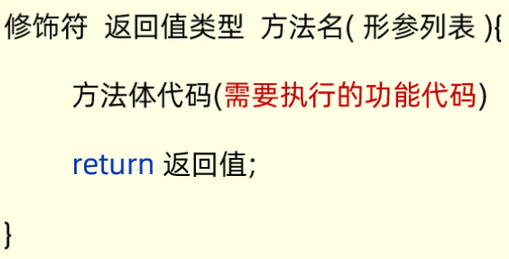
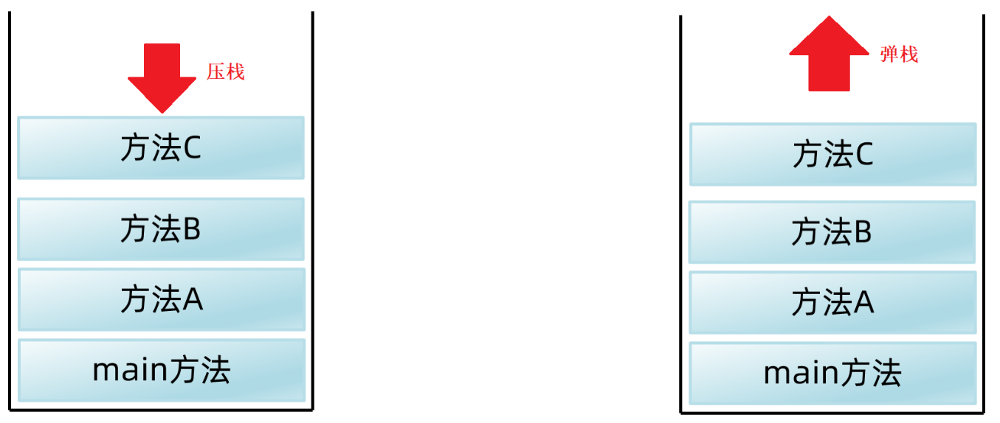
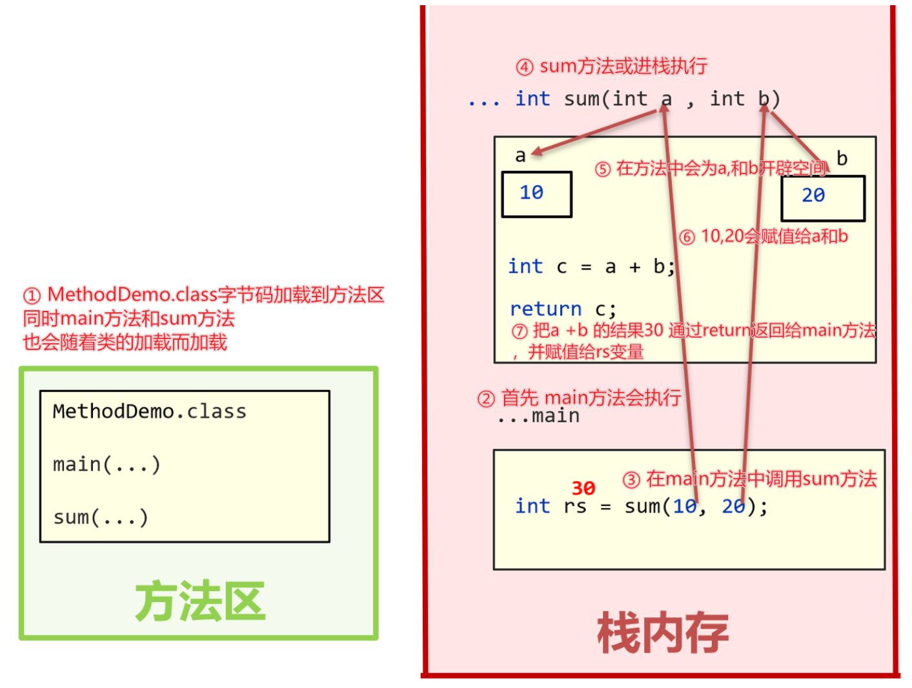

## 一，分支结构

### 1，if和switch语句

流程控制一般分为3种：

* 顺序结构
* 分支结构
* 循环结构

对于if分支结构，和JS是一样的。参考代码：

```java
int score = 298;
if(score >= 0 && score < 60) {
    System.out.println("您的绩效级别是： D");
}else if(score >= 60 && score < 80){
    System.out.println("您的绩效级别是： C");
}else if(score >= 80 && score < 90){
    System.out.println("您的绩效级别是： B");
}else if(score >= 90 && score <= 100){
    System.out.println("您的绩效级别是： A");
}else {
    System.out.println("您录入的分数有毛病~~");
}
```

switch分支和JS也是一样的，switch小括号中的表达式类型可以是byte、short、int、char、枚举、String。不支持double、float、double。case后面的值，只能是字面量不能是变量。

参考代码：

```java
String week = "周三";
switch (week){
    case "周一":
        System.out.println("埋头苦干，解决bug");
        break;
    case "周二":
        System.out.println("请求大牛程序员帮忙");
        break;
    case "周三":
        System.out.println("今晚啤酒、龙虾、小烧烤");
        break;
    case "周四":
        System.out.println("主动帮助新来的女程序解决bug");
        break;
    case "周五":
        System.out.println("今晚吃鸡");
        break;
    case "周六":
        System.out.println("与王婆介绍的小芳相亲");
        break;
    case "周日":
        System.out.println("郁郁寡欢、准备上班");
        break;
    default:
        System.out.println("您输入的星期信息不存在~~~");
}
```

if和switch选择：

* if 分支 的功能是更加强大的，switch分支能做的事情if 分支都能做
* 如果是对一个范围进行判断，建议使用if分支结构
* 如果是与一个一个的值比较的时候，建议使用switch分支结构

## 二，循环结构

### 1，for循环

for循环和JS也是一样的，求1~100中所有整数的和：

```java
// 求1~100中所有整数的和
int sum = 0;
//定义一个循环，先产生1-100，这100个数
for (int i = 1; i <= 100; i++) {
    //每产生一个数据，就把这个数和sum累加
    sum += i; //sum = sum  + i;
}
System.out.println("1-100的数据和：" +  sum);
```

求奇数和：

```java
//1)定义一个变量用于求和
int sum1 = 0;
//2)定义一个循环产生1-100之间的奇数
for (int i = 1; i < 100; i+=2) {
    // i = 1 3 5 7 ...
    //3)让需要求和的数据和sum1累加，
    sum1 += i;
}
System.out.println("1-100之间的奇数和：" +  sum1);

// --------------------------------------------

// 另一种写法：
//1)首先需要定义一个求和变量，这里命名为sum2
int sum2 = 0; 
//2)再遍历得到所有需要求和的数据(1~100之间的所有整数)
for (int i = 1; i <= 100; i++) {
    //i = 1 2 3 4 5 6 ... 99 100
    //3)在求和之前先对数据判断，如果是奇数，才和sum1累加；否则什么也不干
    if(i % 2 == 1){
        // i = 1 3 5 7 9 ... 99
        sum2 += i;
    }
}
System.out.println("1-100之间的奇数和：" + sum2);
```

### 2，while循环

while循环和JS是一样的。直接做一些题目，如下：

for和while的选择：

* 从功能来说：能够用for循环做的，都能用while循环做。
* 使用规范上来说：知道循环几次，建议使用for；不知道循环几次建议使用while

再看一下题目：世界最高山峰珠穆朗玛峰高度是：8848.86米=8848860毫米，假如我有一张足够大的它的厚度是0.1毫米。请问：该纸张折叠多少次，可以折成珠穆朗玛峰的高度？

```java
// 1、定义变量记住珠穆朗玛峰的高度和纸张的高度。
double peakHeight = 8848860;
double paperThickness = 0.1;

// 3、定义一个变量count用于记住纸张折叠了多少次
int count = 0;

// 2、定义while循环控制纸张开始折叠
while (paperThickness < peakHeight) {
    // 把纸张进行折叠，把纸张的厚度变成原来的2倍。
    paperThickness = paperThickness * 2;
    count++;
}
System.out.println("需要折叠多少次：" + count);
System.out.println("最终纸张的厚度是：" + paperThickness);
```

### 3，do...while循环

和JS是一样的，做几道题吧，如下：

### 4，死循环

死循环的应用场景：最典型的是可以用死循环来做服务器程序， 比如百度的服务器程序就是一直在执行的，你随时都可以通过浏览器去访问百度。如果哪一天百度的服务器停止了运行，有就意味着所有的人都永不了百度提供的服务了。

```java
//for死循环
for ( ; ; ){
    System.out.println("Hello World1");
}

//while死循环
while (true) {
    System.out.println("Hello World2");
}

//do-while死循环
do {
    System.out.println("Hello World3");
}while (true);
```

### 5，循环嵌套

直接上题目：

### 6，跳转语句break，continue

要在循环过程中提前跳出循环怎么做呢？

* break作用：跳出并结束当前所在循环的执行，只能用于结束所在循环，或结束所在的switch分支的执行。
* continue作用：结束本次循环，进入下一次循环，只能在循环中使用。

## 三，生成随机数

### 1，生成随机数

生成随机数的功能，其实 Java已经给我们提供了，在JDK中提供了一个类叫做Random，我们只需要调用Random这个类提供的功能就可以了。

参考代码：

```java
import java.util.Random;
public class RandomDemo1 {
    public static void main(String[] args) {
        // 2、创建一个Random对象，用于生成随机数。
        Random r = new Random();
        // 3、调用Random提供的功能：nextInt得到随机数。
        // nextInt(n) 只能生成0~n-1之间的随机数，不包含n
        for (int i = 1; i <= 20; i++) {
            int data = r.nextInt(10); // 0 - 9
            System.out.println(data);
        }
    }
}
```

### 2，猜数字小游戏

需求：随机生成一个1-100之间的数据，提示用户猜测，猜大提示过大，猜小提示过小，直到猜中结束游戏。

参考代码：

```java
import java.util.Random;
import java.util.Scanner;

public class Test {
    public static void main(String[] args) {
        // 1、随机产生一个1-100之间的数据，做为中奖号码。
        Random r = new Random();
        int luckNumber = r.nextInt(100) + 1;

        // 2、定义一个死循环，让用户不断的猜测数据
        Scanner sc = new Scanner(System.in);
        while (true) {
            // 提示用户猜测
            System.out.println("请您输入您猜测的数据：");
            int guessNumber = sc.nextInt();

            // 3、判断用户猜测的数字与幸运号码的大小情况
            if(guessNumber > luckNumber){
                System.out.println("您猜测的数字过大~~");
            }else if(guessNumber < luckNumber){
                System.out.println("您猜测的数字过小~~");
            }else {
                System.out.println("恭喜您，猜测成功了，可以买单了~~");
                break; // 结束死循环
            }
        }
    }
}
```

## 四，数组

Java中的数组和JS中的数组还是有区别的，Java中的数组是用来存一批同种类型的数据的。如：想要存储 20, 10, 80, 60, 90 这些数据。 我们可以把代码写成这样：

```java
int[] array = {20,10,80,60,90};
```

数组变量名中存储的是数组在内存中的地址，数组是一种引用数据类型。

### 1，数组的静态初始化

数组有两种初始化的方式：

* 静态初始化
* 动态初始化

所谓静态初始化指的是：在定义数组时直接给数组中的数据赋值。格式：

```java
数据类型[] 变量名 = new 数据类型[]{元素1,元素2,元素3};

//定义数组，用来存储多个年龄
int[] ages = new int[]{12, 24, 36}
//定义数组，用来存储多个成绩
double[] scores = new double[]{89.9, 99.5, 59.5, 88.0};
```

静态初始化简化格式：

```java
数据类型[] 变量名 = {元素1,元素2,元素3};

//定义数组，用来存储多个年龄
int[] ages = {12, 24, 36}
//定义数组，用来存储多个成绩
double[] scores = {89.9, 99.5, 59.5, 88.0};

//以下两种写法是等价的。但是建议大家用第一种，因为这种写法更加普遍
int[] ages = {12, 24, 36};
int ages[] = {12, 24, 36}
```

### 2，数组的元素访问

访问数组中的元素也是通过索引来访问的，如下：

```java
//索引：	   0   1   2
int[] arr = {12, 24, 36};
// 1、访问数组的全部数据
System.out.println(arr[0]); //12
System.out.println(arr[1]); //24
System.out.println(arr[2]); //36
//下面代码没有3索引，会出现ArrayIndexOutOfBoundsException 索引越界异常
//System.out.println(arr[3]); 

// 2、修改数组中的数据
arr[0] = 66;
arr[2] = 100;
System.out.println(arr[0]); //66
System.out.println(arr[1]); 0
System.out.println(arr[2]); //100

// 3、访问数组的元素个数：数组名.length
System.out.println(arr.length);

// 技巧：获取数组的最大索引: arr.length - 1(前提是数组中存在数据)
System.out.println(arr.length - 1);

int[] arr2 = {};
System.out.println(arr2.length - 1);
```

### 3，数组遍历

使用for循环对数组进行遍历：

```java
int[] ages = {12, 24, 36};
for (int i = 0; i < ages.length; i++) {
    // i的取值 = 0,1,2
    System.out.println(ages[i]); 
}
```

需求：某部门5名员工的销售额分别是：16、26、36、6、100，请计算出他们部门的总销售额。

参考代码：

```java
// 1、定义一个数组存储5名员工的销售额
//索引          0   1    2  3   4
int[] money = {16, 26, 36, 6, 100};

// 3、定义一个变量用于累加求和
int sum = 0;

// 2、遍历这个数组中的每个数据。
for (int i = 0; i < money.length; i++) {
    // i = 0  1  2  3  4
    sum += money[i];
}
System.out.println("员工的销售总额：" + sum);
```

### 4，数组的动态初始化

另一个初始化数组的方式叫 **动态初始化**。动态初始化不需要我们写出具体的元素，而是指定元素类型和长度就行。格式如下：

```java
//数据类型[]  数组名 = new 数据类型[长度];
// 数组中的元素默认值是0
int[] arr = new int[3];
```

使用动态初始化定义数组时，根据元素类型不同，默认值也有所不同。

* byte, short, char, int, long  默认值是0
* float, double 默认值是0.0
* boolean 默认值是false
* 引用类型（类，接口，数组，String） 默认值是null

案例需求：某歌唱比赛，需要开发一个系统：可以录入6名评委的打分，录入完毕后立即输出平均分

```java
// 1、定义一个动态初始化的数组，负责后期存储6个评委的打分。
double[] scores = new double[6];

Scanner sc  = new Scanner(System.in);

// 2、遍历数组中的每个位置，录入评委的分数，存入到数组中去
for (int i = 0; i < scores.length; i++) {
    // i = 0 1 2 3 4 5
    System.out.println("请您输入当前第" + (i + 1) +"个评委的分数：");
    double score = sc.nextDouble();
    scores[i] = score;
}

// 3、遍历数组中的每个元素进行求和
double sum  = 0;
for (int i = 0; i < scores.length; i++) {
    sum += scores[i];
}
System.out.println("选手最终得分是：" + sum / scores.length);
```

### 5，Java程序的执行

Java为了便于虚拟机执行Java程序，将虚拟机的内存划分为 方法区、栈、堆、本地方法栈、寄存器 这5块区域。同学们需要重点关注的是  **方法区、栈、堆**。

下面把每一个块内存区域作用介绍一下，我们大致只需要知道每一部分存储什么内容就行。

* **方法区**：字节码文件先加载到这里
* **栈**：方法运行时所进入的内存区域，由于变量在方法中，所以变量也在这一块区域中
* **堆**：存储new出来的东西，并分配地址。由于数组是new 出来的，所以数组也在这块区域。

有如下程序：

```java
public class Test {
    public static void main(String[] args) {
        int a = 10;
        System.out.println(a);

        int[] arr = new int[]{11, 22, 33};
        System.out.println(arr);

        System.out.println(arr[1]);

        arr[0] = 44;
        arr[1] = 55;
        arr[2] = 66;

        System.out.println(arr[0]);
        System.out.println(arr[1]);
        System.out.println(arr[2]);
    }
}
```

执行流程：


### 6，练习题

需求：定义一个int类型数组，求数组中元素的最大值，并打印最大值

参考代码：

```java
public class Test {
    public static void main(String[] args) {
        // 1、把颜值数据拿到程序中来，用数组装起来
        int[] faceScores = {15, 9000, 10000, 20000, 9500, -5};

        // 2、定义一个变量用于最终记住最大值。
        int max = faceScores[0];

        // 3、从数组的第二个位置开始遍历。
        for (int i = 1; i < faceScores.length; i++) {
            // i = 1  2  3  4  5
            // 判断一下当前遍历的这个数据，是否大于最大值变量max存储的数据，
            //如果大于，当前遍历的数据需要赋值给max
            if(faceScores[i] > max ){
                max = faceScores[i];
            }
        }
        System.out.println("最高颜值是：" + max);
    }
}
```

需求：某个数组有5个数据：10, 20, 30, 40, 50，请将这个数组中的数据进行反转。

      [10, 20, 30, 40, 50]  反转后 [50, 40, 30, 20, 10]

参考代码：

```java
public class Test {
    public static void main(String[] args) {
        // 目标：完成数组反转。
        // 1、准备一个数组
        int[] arr = {10, 20, 30, 40, 50};  

        // 2、定义一个循环，设计2个变量，一个在前，一个在后
        for (int i = 0, j = arr.length - 1; i < j; i++, j--) {
            // arr[i]   arr[j]
            // 交换
            // 1、定义一个临时变量记住后一个位置处的值
            int temp = arr[j];
            // 2、把前一个位置处的值赋值给后一个位置了
            arr[j] = arr[i];
            // 3、把临时变量中记住的后一个位置处的值赋值给前一个位置处
            arr[i] = temp;
        }

        // 3、遍历数组中的每个数据，看是否反转成功了
        for (int i = 0; i < arr.length; i++) {
            System.out.print(arr[i] + " ");
        }
    }
}
```

需求：某公司开发部5名开发人员，要进行项目进展汇报演讲，现在采取随机排名后进行汇报。请先依次录入5名员工的工号，然后展示出一组随机的排名顺序。

参考代码：

```java
public class Test {
    public static void main(String[] args) {
        // 目标：完成随机排名
        // 1、定义一个动态初始化的数组用于存储5名员工的工号
        int[] codes = new int[5];

        // 2、提示用户录入5名员工的工号。
        Scanner sc = new Scanner(System.in);
        for (int i = 0; i < codes.length; i++) {
            // i = 0 1 2 3 4
            System.out.println("请您输入第" + (i + 1) +"个员工的工号：");
            int code = sc.nextInt();
            codes[i] = code;
        }

        // 3、打乱数组中的元素顺序。
        // [12, 33, 54, 26, 8]
        //  i       index
        Random r =  new Random();
        for (int i = 0; i < codes.length; i++) {
            // codes[i]
            // 每遍历到一个数据，都随机一个数组索引范围内的值。
            //然后让当前遍历的数据与该索引位置处的值交换。
            int index = r.nextInt(codes.length); // 0 - 4
            // 定义一个临时变量记住index位置处的值
            int temp = codes[index];
            // 把i位置处的值赋值给index位置处
            codes[index] = codes[i];
            // 把index位置原来的值赋值给i位置处
            codes[i] = temp;
        }

        // 4、遍历数组中的工号输出即可
        for (int i = 0; i < codes.length; i++) {
            System.out.print(codes[i] + " ");
        }
    }
}
```

### 7，Debug

* 第一步：打断点，如下图的红色小圆点
* 第二步：右键Debug方式启动程序
* 第三步：点击箭头按钮，一行一行往下执行

## 五，方法

### 1，什么是方法

在一个类中可以写多个方法，格式：



说明：

* 方法的修饰符：暂时都使用public static 修饰。（目前看做是固定写法，后面是可以改动的）
* 方法申明了具体的返回值类型，内部必须使用return返回对应类型的数据。
* 形参列表可以有多个，甚至可以没有； 如果有多个形参，多个形参必须用“，”隔开，且不能给初始化值。

设计一个方法原则：

* 如果方法不需要返回数据，返回值类型必须申明成void（无返回值申明）, 此时方法内部不可以使用return返回数据。
* 方法如果不需要接收外部传递进来的数据，则不需要定义形参，且调用方法时也不可以传数据给方法。
* 没有参数，且没有返回值类型（void）的方法，称为值无参数、无返回值方法。此时调用方法时不能传递数据给方法。

定义一个方法，计算1~n的和，如下：

```java
public static void main(String[] args) {
    int rs = add(5);
    System.out.println("1-5的和是：" + rs); //15
    
    int rs = add(6);
    System.out.println("1-6的和是：" + rs); //21
}

public static int add(int n){
    int sum = 0;
    for (int i = 1; i <= n; i++) {
        // i = 1 2 3 ... n
        sum += i;
    }
    return sum;
}
```

定义一个方法，判断一个整数是奇数还是偶数：

```java
public static void judge(int number){
    if(number % 2 == 0){
        System.out.println(number + "是一个偶数！");
    }else {
        System.out.println(number + "是一个奇数！");
    }
}

public static void main(String[] args) {
    judge(7); //调用后打印：7是一个奇数
    judge(8); //调用后打印：8是一个偶数
}
```

### 2，方法的执行原理

每次调用方法，方法都会进栈执行；执行完后，又会弹栈出去。假设在main方法中依次调用A方法、B方法、C方法，在内存中的执行流程如下：

* 每次调用方法，方法都会从栈顶压栈执行没执行
* 每个方法执行完后，会从栈顶弹栈出去



有返回值的方法，内存分析，代码：

```java
public class Test {
    public static void main(String[] args) {
        int rs = sum(10, 20);
        System.out.println(rs);
	}
    public static int sum(int a, int b ){
        int c = a + b; 
        return c;  
    }
}
```

如下图所示：以上代码在内存中的执行过程，按照①②③④⑤⑥⑦的步骤执行



无返回值的方法，内存分析，代码：

```java
public class Test {
    public static void main(String[] args) {
        study();
    }

    public static void study(){
		eat();
		System.out.println("学习");
		sleep();
	}
    public static void eat(){
        System.out.println("吃饭");
    }
    
    public static void sleep(){
        System.out.println("睡觉");
    }
}
```

分析：


### 3，参数传递机制

Java的参数传递机制都是：值传递。

* 如果传递的基本类型，那么形参相当于函数内部的局部变量
* 如果传递的引用类型，那么传送的地址

需求：输出一个int类型的数组内容，要求输出格式为：[11, 22, 33, 44, 55]。

```java
public class Test {
    public static void main(String[] args) {
        // 目标：完成打印int类型的数组内容。
        int[] arr = {10, 30, 50, 70};
        printArray(arr);

        int[] arr2 = null;
        printArray(arr2);

        int[] arr3 = {};
        printArray(arr3);
    }

    /*
    	参数：int[] arr表示要被打印元素的数组，需要调用者传递
    */
    public static void printArray(int[] arr){
        if(arr == null){
            System.out.println(arr); // null
            return; // 跳出当前方法
        }

        System.out.print("[");
        // 直接遍历接到的数组元素
        for (int i = 0; i < arr.length; i++) {
            if(i == arr.length - 1){
                System.out.print(arr[i]);
            }else {
                System.out.print(arr[i] + ", ");
            }
        }
        System.out.println("]");
    }
}
```

需求：比较两个int类型的数组是否一样，返回true或者false

```java
public class Test {
    public static void main(String[] args) {
        // 目标：完成判断两个int类型的数组是否一样。
        int[] arr1 = {10, 20, 30};
        int[] arr2 = {10, 20, 30};
        System.out.println(equals(arr1, arr2));
    }

    /*
    	参数：
    		int[] arr1, 参与比较的第一个int数组
    		int[] arr2  参与比较的第二个int数组
    	返回值:
    		返回比较的结果true或者false
    */
    public static boolean equals(int[] arr1, int[] arr2){
        // 1、判断arr1和arr2是否都是null.
        if(arr1 == null && arr2 == null){
            return true; // 相等的
        }

        // 2、判断arr1是null，或者arr2是null.
        if(arr1 == null || arr2 == null) {
            return false; // 不相等
        }

        // 3、判断2个数组的长度是否一样，如果长度不一样，直接返回false.
        if(arr1.length != arr2.length){
            return false; // 不相等
        }

        // 4、两个数组的长度是一样的，接着比较它们的内容是否一样。
        // arr1 = [10, 20, 30]
        // arr2 = [10, 20, 30]
        for (int i = 0; i < arr1.length; i++) {
            // 判断当前位置2个数组的元素是否不一样，不一样直接返回false
            if(arr1[i] != arr2[i]){
                return false; // 不相等的
            }
        }
        return true; // 两个数组是一样的。
    }
}
```

### 4，方法重载

重载指的是：一个类中，出现多个相同的方法名，但是它们的形参列表是不同的，那么这些方法就称为方法重载了。其它的都不管（如：修饰符，返回值类型是否一样都无所谓）。

```java
// 多个test方法，但是参数列表都不一样，它们都是重载的方法。调用时只需要通过参数来区分即可。
public class Test {
    public static void main(String[] args) {
        // 目标：认识方法重载，并掌握其应用场景。
        test();
        test(100);
    }

    public static void test(){
        System.out.println("===test1===");
    }

    public static void test(int a){
        System.out.println("===test2===" + a);
    }

    void test(double a){

    }

    void test(double a, int b){
    }

    void test(int b, double a){
    }

    int test(int a, int b){
        return a + b;
    }
}
```

需求：开发武器系统，功能需求如下：

    可以默认发一枚武器。
    可以指定地区发射一枚武器。
    可以指定地区发射多枚武器。

```java
public class Test {
    public static void main(String[] args) {
        // 目标：掌握方法重载的应用场景。
        fire();
        fire("岛国2");
        fire("米国", 999);
    }

    public static void fire(){
        fire("岛国");
    }

    public static void fire(String country){
        fire(country, 1);
    }

    public static void fire(String country, int number){
        System.out.println("发射了" + number + "枚武器给" + country);
    }
}
```

方法重载有啥应用场景？
答：开发中我们经常需要为处理一类业务，提供多种解决方案，此时用方法重载来设计是很专业的。

### 5，return单独使用

单独使用return语句，可以结束函数调用。

```java
public class Test {
    public static void main(String[] args) {
        System.out.println("开始");
        chu(10 , 0);
        System.out.println("结束");
    }
    
    public static void chu(int a , int b){
        if(b == 0){
            System.err.println(“您的数据有误！！不执行！！”);
            return; // 直接跳出并结束当前chu方法的执行
        }
        int c = a / b;
        System.out.println("除法结果是："+c); 
    }
}
```

### 6，案例

开发一个程序，生成指定位数的验证码。考虑到实际工作中生成验证码的功能很多地方都会用到，为了提高代码的复用性，我们还是把生成验证码的功能写成方法比较好。

```java
public class Test {
    public static void main(String[] args) {
        // 目标：完成生成随机验证码。
        System.out.println(createCode(8));
    }

    public static String createCode(int n){
        //1)先按照方法接收的验证码位数n,循环n次
        Random r = new Random();
        //3)定义一个String类型的变量用于记住产生的每位随机字符
        String code = "";
        for (int i = 1; i <= n; i++) {
            // i = 1 2 3 4 5
            //2)每次循环，产生一个字符，可以是数字字符、或者大小写字母字符
            // 思路：随机一个0 1 2之间的数字出来，0代表随机一个数字字符，1、2代表随机大写字母，小写字母。
            int type = r.nextInt(3); // 0 1 2
            switch (type) {
                case 0:
                    // 随机一个数字字符
                    code += r.nextInt(10); // 0 - 9  code = code + 8
                    break;
                case 1:
                    // 随机一个大写字符 A 65   Z 65+25    (0 - 25) + 65
                    char ch1 = (char) (r.nextInt(26) + 65);
                    code += ch1;
                    break;
                case 2:
                    // 随机一个小写字符 a 97   z 97+25    (0 - 25) + 97
                    char ch2 = (char) (r.nextInt(26) + 97);
                    code += ch2;
                    break;
            }
        }
        return code;
    }
}
```

在唱歌比赛中，可能有多名评委要给选手打分，分数是0~100之间，选手最后得分是去掉最高分，去掉最低分后剩余平均分，请编写程序录入多名评委的分数，并算出选手最终得分。

```java
public class Test3 {
    public static void main(String[] args) {
        // 目标：完成评委打分案例。
        System.out.println("当前选手得分是：" + getAverageScore(6));
    }

    public static double getAverageScore(int n){
        // 1、定义一个动态初始化的数组，负责后期存入评委的打分
        int[] scores = new int[n]; // 6
        // scores = [0, 0, 0, 0, 0, 0]

        // 2、遍历数组的每个位置，依次录入评委的分数
        Scanner sc = new Scanner(System.in);
        for (int i = 0; i < scores.length; i++) {
            // i = 0 1 2 3 4 5
            System.out.println("请您录入第"+ (i + 1) +"个评委的分数：");
            int score = sc.nextInt();
            scores[i] = score;
        }

        // 3、从数组中计算出总分，找出最高分，最低分。
        int sum = 0; // 求总分用的变量
        int max = scores[0]; // 求最大值的
        int min = scores[0]; // 求最小值的。

        // 遍历数组找出这些数据的。
        for (int i = 0; i < scores.length; i++) {
            // i = 0 1 2 3 4 5
            int score = scores[i];
            // 求和
            sum += score;
            // 求最大值
            if(score > max){
                max = score;
            }
            // 求最小值
            if(score < min){
                min = score;
            }
        }
        // 4、计算出平均分并返回
        return 1.0 * (sum - min - max) / (number - 2);
    }
}
```

某系统的数字密码是一个四位数，如1983，为了安全，需要加密后再传输，加密规则是：对密码中的每位数，都加5，再对10取余，最后将所有数字顺序反转，得到一串加密后的新数，请设计出满足需求的加密程序。

```java
public class Test {
    public static void main(String[] args) {
        // 目标：完成数字加密程序的开发。
        System.out.println("加密后的结果是：" + encrypt(8346));
    }

    public static String encrypt(int number){
        // number = 1983
        // 1、把这个密码拆分成一个一个的数字，才可以对其进行加密啊。
        int[] numbers = split(number);
        // numbers = [1, 9, 8, 3]

        // 2、遍历这个数组中的每个数字，对其进行加密处理。
        for (int i = 0; i < numbers.length; i++) {
            // i = 0 1 2 3
            numbers[i] = (numbers[i] + 5) % 10;
        }
        // numbers = [6, 4, 3, 8]

        // 3、对数组反转，把对数组进行反转的操作交给一个独立的方法来完成
        reverse(numbers);
        // numbers = [8, 3, 4, 6]

        // 4、把这些加密的数字拼接起来做为加密后的结果返回即可。
        String data = "";
        for (int i = 0; i < numbers.length; i++) {
            data += numbers[i];
        }
        return data;
    }

    public static void reverse(int[] numbers) {
        // 反转数组的
        // numbers = [6, 4, 3, 8]
        //            i        j
        for (int i = 0, j = numbers.length - 1; i < j; i++,j--) {
            // 交换i和j位置处的值。
            // 1、把后一个位置处的值交给一个临时变量先存起来
            int temp = numbers[j];
            // 2、把前一个位置处的值赋值给后一个位置处
            numbers[j] = numbers[i];
            // 3、把后一个位置处原来的值（由临时变量记住着）赋值给前一个位置
            numbers[i] = temp;
        }
    }

    public static int[] split(int number) {
        // number = 1983
        int[] numbers = new int[4];
        numbers[0] = number / 1000;
        numbers[1] = (number / 100) % 10;
        numbers[2] = (number / 10) % 10;
        numbers[3] = number % 10;
        return numbers;
    }
}
```

请把一个整型数组，例如存了数据：11, 22, 33, 拷贝成一个一模一样的新数组来。

```java
public class Test {
    public static void main(String[] args) {
        // 目标：掌握数组拷贝。
        int[] arr = {11, 22, 33};
        int[] arr2 = copy(arr);
        printArray(arr2);

        // 注意：这个不是拷贝数组，叫把数组变量赋值给另一个数组变量。
        //        int[] arr3 = arr;
        //        arr3[1] = 666;
        //        System.out.println(arr[1]);

        arr2[1] = 666;
        System.out.println(arr[1]);
    }

    public static int[] copy(int[] arr){
        // arr = [11, 22, 33]
        //        0    1   2

        // 1、创建一个长度一样的整型数组出来。
        int[] arr2 = new int[arr.length];
        // arr2 = [0, 0, 0]
        //         0  1  2

        // 2、把原数组的元素值对应位置赋值给新数组。
        for (int i = 0; i < arr.length; i++) {
            // i = 0 1 2
            arr2[i] = arr[i];
        }

        return arr2;
    }

    public static void printArray(int[] arr){
        System.out.print("[");
        for (int i = 0; i < arr.length; i++) {
            System.out.print(i==arr.length-1 ? arr[i] : arr[i] + ", ");
        }
        System.out.println("]");
    }
}
```

分别有9, 666, 188, 520, 99999五个红包，请模拟粉丝抽奖，按照先来先得，随机抽取，抽完为止，一个红包只能被抽一次，先抽或后抽哪一个红包是随机的。

```java
public class Test6 {
    public static void main(String[] args) {
        int[] moneys = {100,999,50,520,1314};
        start(moneys);
    }
    //开始抽奖
    public static void start(int[] moneys){
        //1)首先，写一个循环，循环次数为数组的长度
        for (int i = 0; i < moneys.length; i++) {
            //2)每次循环，键盘录入，提示"用户录入任意键抽奖："
            while (true){
                Scanner sc = new Scanner(System.in);
                System.out.print("用户录入任意键抽奖：");
                String msg = sc.next();
                //3)随机从数组中产生一个索引，获取索引位置的元素，这个元素就表示抽的红包
                Random r = new Random();
                int index = r.nextInt(moneys.length);
                int money = moneys[index];
                if(money!=0){
                    //如果值不为0，则打印如："恭喜您，您抽中了520元"
                    System.out.println("恭喜您，您抽中了"+money+"元");
                    moneys[index] = 0;
                    break;
                }else {
                    //如果值为0，则说明这个红包被抽过，重新循环到第2步，重新抽奖
                    //此时这一次抽奖机会被浪费掉了，可以把控制循环的次数自减一下
                    i--;
                }
            }
        }
    }
}
```

打印输出101~200之间 或 n~m之间的素数，并求有多少个？

```java
public class Test {
    public static void main(String[] args) {
        // 目标：完成找素数。
        System.out.println("当前素数的个数是：" + search(101, 200));
    }

    public static int search(int start, int end){
        int count = 0;
        // start = 101   end = 200
        // 1、定义一个for循环找到101到200之间的每个数据
        for (int i = start; i <= end ; i++) {
            // i = 101 102 103 ... 199 200

            // 信号位思想
            boolean flag = true; // 假设的意思：默认当前i记住的数据是素数。
            // 2、判断当前i记住的这个数据是否是素数。
            for (int j = 2; j <= i / 2; j++) {
                if(i % j == 0){
                    // i当前记住的这个数据不是素数了
                    flag = false;
                    break;
                }
            }
            // 3、根据判定的结果决定是否输出i当前记住的数据：是素数才输出展示。
            if(flag){
                System.out.println(i);
                count++;
            }
        }
        return count;
    }
}
```
