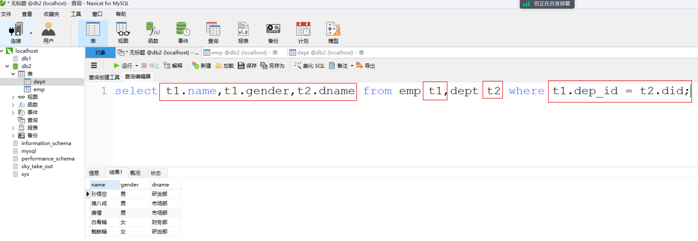
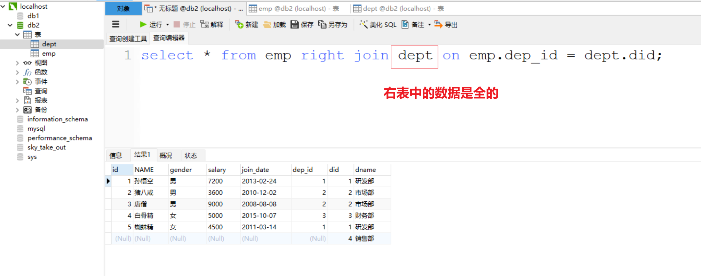

## 一，约束

### 1，什么是约束

看如下表：


上面表存在的一些问题：

* id 列一般是用标示数据的唯一性的，而上述表中的id为1的有三条数据，并且 `马花疼` 没有id进行标示
* `柳白` 这条数据的age列的数据是3000，而人也不可能活到3000岁
* `马运`  这条数据的math数学成绩是-5，而数学学得再不好也不可能出现负分
* `柳青` 这条数据的english列（英文成绩）值为null，而成绩即使没考也得是0分

针对上面的遇到的问题，从数据库层面在添加数据的时候进行限制，这个就是约束。约束是作用于表中列上的规则，用于限制加入表的数据。例如：我们可以给id列加约束，让其值不能重复，不能为null值。

约束的存在保证了数据库中数据的正确性、有效性和完整性。添加约束可以在添加数据的时候就限制不正确的数据，年龄是3000，数学成绩是-5分这样无效的数据，继而保障数据的完整性。

### 2，分类

非空约束： 关键字是 NOT NULL

* 保证列中所有的数据不能有null值。
* 例如：id列在添加 `马花疼` 这条数据时就不能添加成功。

唯一约束：关键字是  UNIQUE

* 保证列中所有数据各不相同。
* 例如：id列中三条数据的值都是1，这样的数据在添加时是绝对不允许的。

主键约束： 关键字是  PRIMARY KEY

* 主键是一行数据的唯一标识，要求非空且唯一。一般我们都会给没张表添加一个主键列用来唯一标识数据。
* 例如：上图表中id就可以作为主键，来标识每条数据。那么这样就要求数据中id的值不能重复，不能为null值。

检查约束： 关键字是  CHECK

* 保证列中的值满足某一条件。
* 例如：我们可以给age列添加一个范围，最低年龄可以设置为1，最大年龄就可以设置为300，这样的数据才更合理些。
* MySQL不支持检查约束。从数据库层面不能保证，以后可以在java代码中进行限制，一样也可以实现要求。

默认约束： 关键字是   DEFAULT

* 保存数据时，未指定值则采用默认值。
* 例如：我们在给english列添加该约束，指定默认值是0，这样在添加数据时没有指定具体值时就会采用默认给定的0。

外键约束： 关键字是  FOREIGN KEY

* 外键用来让两个表的数据之间建立链接，保证数据的一致性和完整性。
* 外键约束现在可能还不太好理解，后面我们会重点进行讲解。

### 3，非空约束

非空约束用于保证列中所有数据不能有NULL值。添加约束：

```mysql
-- 创建表时添加非空约束
CREATE TABLE 表名(
   列名 数据类型 NOT NULL,
   …
); 

-- 建完表后添加非空约束
ALTER TABLE 表名 MODIFY 字段名 数据类型 NOT NULL;
```


删除约束：

```mysql
ALTER TABLE 表名 MODIFY 字段名 数据类型;
```

### 4，唯一约束

唯一约束用于保证列中所有数据各不相同。添加约束语法：

```mysql
-- 创建表时添加唯一约束
CREATE TABLE 表名(
   列名 数据类型 UNIQUE [AUTO_INCREMENT],
   -- AUTO_INCREMENT: 当不指定值时自动增长
   …
); 
CREATE TABLE 表名(
   列名 数据类型,
   …
   [CONSTRAINT] [约束名称] UNIQUE(列名)
); 

-- 建完表后添加唯一约束
ALTER TABLE 表名 MODIFY 字段名 数据类型 UNIQUE;
```


删除约束：

```mysql
ALTER TABLE 表名 DROP INDEX 字段名;
```

### 5，主键约束

键是一行数据的唯一标识，要求非空且唯一。一张表只能有一个主键。添加约束语法：

```mysql
-- 创建表时添加主键约束
CREATE TABLE 表名(
   列名 数据类型 PRIMARY KEY [AUTO_INCREMENT],
   …
); 
CREATE TABLE 表名(
   列名 数据类型,
   [CONSTRAINT] [约束名称] PRIMARY KEY(列名)
); 

-- 建完表后添加主键约束
ALTER TABLE 表名 ADD PRIMARY KEY(字段名);
```


删除约束：

```mysql
ALTER TABLE 表名 DROP PRIMARY KEY;
```

### 6，默认约束

保存数据时，未指定值则采用默认值，添加约束语法：

```mysql
-- 创建表时添加默认约束
CREATE TABLE 表名(
   列名 数据类型 DEFAULT 默认值,
   …
); 

-- 建完表后添加默认约束
ALTER TABLE 表名 ALTER 列名 SET DEFAULT 默认值;
```


删除约束：

```mysql
ALTER TABLE 表名 ALTER 列名 DROP DEFAULT;
```

### 7，约束练习

需求：

```mysql
-- 员工表
CREATE TABLE emp (
	id INT,  -- 员工id，主键且自增长
    ename VARCHAR(50), -- 员工姓名，非空且唯一
    joindate DATE,  -- 入职日期，非空
    salary DOUBLE(7,2),  -- 工资，非空
    bonus DOUBLE(7,2)  -- 奖金，如果没有将近默认为0
);
```

上面一定给出了具体的要求，我们可以根据要求创建这张表，并为每一列添加对应的约束。建表语句如下：

```mysql
DROP TABLE IF EXISTS emp;

-- 员工表
CREATE TABLE emp (
  id INT PRIMARY KEY, -- 员工id，主键且自增长
  ename VARCHAR(50) NOT NULL UNIQUE, -- 员工姓名，非空并且唯一
  joindate DATE NOT NULL , -- 入职日期，非空
  salary DOUBLE(7,2) NOT NULL , -- 工资，非空
  bonus DOUBLE(7,2) DEFAULT 0 -- 奖金，如果没有奖金默认为0
);
```


通过上面语句可以创建带有约束的 `emp` 表，约束能不能发挥作用呢。接下来我们一一进行验证，先添加一条没有问题的数据：

```mysql
INSERT INTO emp(id,ename,joindate,salary,bonus) values(1,'张三','1999-11-11',8800,5000);
```


#### a）验证主键约束

验证主键约束，非空且唯一：

```mysql
INSERT INTO emp(id,ename,joindate,salary,bonus) values(null,'malu','1999-11-11',8800,5000);
```

执行结果如下：


从上面的结果可以看到，字段 `id` 不能为null。那我们重新添加一条数据，如下：

```mysql
INSERT INTO emp(id,ename,joindate,salary,bonus) values(1,'wc','1999-11-11',8800,5000);
```


执行结果如下：


从上面结果可以看到，1这个值重复了。所以主键约束是用来限制数据非空且唯一的。那我们再添加一条符合要求的数据

```mysql
INSERT INTO emp(id,ename,joindate,salary,bonus) values(2,'李四','1999-11-11',8800,5000);
```

执行结果如下：


#### b）验证非空约束

验证非空约束：

```mysql
INSERT INTO emp(id,ename,joindate,salary,bonus) values(3,null,'1999-11-11',8800,5000);
```

执行结果：


从上面结果可以看到， `ename` 字段的非空约束生效了。

#### c）验证唯一约束

验证唯一约束：

```mysql
INSERT INTO emp(id,ename,joindate,salary,bonus) values(3,'李四','1999-11-11',8800,5000);
```

执行结果如下：


从上面结果可以看到， `ename` 字段的唯一约束生效了。

#### d）验证默认约束

验证默认约束：

```mysql
INSERT INTO emp(id,ename,joindate,salary) values(3,'王五','1999-11-11',8800);
```

执行完上面语句后查询表中数据，如下图可以看到王五这条数据的bonus列就有了默认值0。如下：


默认约束只有在不给值时才会采用默认值。如果给了null，那值就是null值。

```mysql
INSERT INTO emp(id,ename,joindate,salary,bonus) values(4,'赵六','1999-11-11',8800,null);
```

执行结果如下：


#### e）验证自动增长约束

条件： auto_increment  当列是数字类型 并且唯一约束

重新创建 `emp` 表，并给id列添加自动增长：

```mysql
-- 员工表
CREATE TABLE emp (
  id INT PRIMARY KEY auto_increment, -- 员工id，主键且自增长
  ename VARCHAR(50) NOT NULL UNIQUE, -- 员工姓名，非空并且唯一
  joindate DATE NOT NULL , -- 入职日期，非空
  salary DOUBLE(7,2) NOT NULL , -- 工资，非空
  bonus DOUBLE(7,2) DEFAULT 0 -- 奖金，如果没有奖金默认为0
);
```


接下来给emp添加数据，分别验证不给id列添加值以及给id列添加null值，id列的值会不会自动增长：

```mysql
INSERT INTO emp(ename,joindate,salary,bonus) values('赵六','1999-11-11',8800,null);
INSERT INTO emp(id,ename,joindate,salary,bonus) values(null,'赵六2','1999-11-11',8800,null);
INSERT INTO emp(id,ename,joindate,salary,bonus) values(null,'赵六3','1999-11-11',8800,null);
```


### 8，外键约束

外键用来让两个表的数据之间建立链接，保证数据的一致性和完整性。如何理解上面的概念呢？如下图有两张表，员工表和部门表：


员工表中的dep_id字段是部门表的id字段关联，也就是说1号学生张三属于1号部门研发部的员工。现在我要删除1号部门，就会出现错误的数据（员工表中属于1号部门的数据）。而我们上面说的两张表的关系只是我们认为它们有关系，此时需要通过外键让这两张表产生数据库层面的关系，这样你要删除部门表中的1号部门的数据将无法删除。

添加外键约束语法：

```mysql
-- 创建表时添加外键约束
CREATE TABLE 表名(
   列名 数据类型,
   …
   [CONSTRAINT] [外键名称] FOREIGN KEY(外键列名) REFERENCES 主表(主表列名) 
); 

-- 建完表后添加外键约束
ALTER TABLE 表名 ADD CONSTRAINT 外键名称 FOREIGN KEY (外键字段名称) REFERENCES 主表名称(主表列名称);
```

删除外键约束：

```mysql
ALTER TABLE 表名 DROP FOREIGN KEY 外键名称;
```

据上述语法创建员工表和部门表，并添加上外键约束：：

```mysql
-- 删除表
DROP TABLE IF EXISTS emp;
DROP TABLE IF EXISTS dept;

-- 部门表
CREATE TABLE dept(
	id int primary key auto_increment,
	dep_name varchar(20),
	addr varchar(20)
);
-- 员工表 
CREATE TABLE emp(
	id int primary key auto_increment,
	name varchar(20),
	age int,
	dep_id int,

	-- 添加外键 dep_id,关联 dept 表的id主键
	CONSTRAINT fk_emp_dept FOREIGN KEY(dep_id) REFERENCES dept(id)	
);
```


添加数据：

```mysql
-- 添加 2 个部门
insert into dept(dep_name,addr) values
('研发部','广州'),('销售部', '深圳');

-- 添加员工,dep_id 表示员工所在的部门
INSERT INTO emp (NAME, age, dep_id) VALUES 
('张三', 20, 1),
('李四', 20, 1),
('王五', 20, 1),
('赵六', 20, 2),
('孙七', 22, 2),
('周八', 18, 2);
```


此时删除 `研发部` 这条数据，会发现无法删除。


删除外键：

```mysql
alter table emp drop FOREIGN key fk_emp_dept;
```

重新添加外键：

```mysql
alter table emp add CONSTRAINT fk_emp_dept FOREIGN key(dep_id) REFERENCES dept(id);
```

## 二，数据库设计

### 1，什么是数据库设计

所谓的数据库设计，就是设计一个项目中都有哪些表，以及表与表之间的关系。表关系分为：

* 一对一
* 一对多
* 多对多


一对一：

* 如用户与身份证就是一对一。如用户和用户详情就是一对一。
* 一对一关系多用于表拆分，将一个实体中经常使用的字段放一张表，不经常使用的字段放另一张表，用于提升查询性能


一对多：

* 如部门和员工就是一对多。一个部门对应多个员工，一个员工对应一个部门。


多对多：

* 如商品和订单就是多对多。一个商品对应多个订单，一个订单包含多个商品。

### 2，一对多

实现方式：

* 在多的一方建立外键，指向一的一方的主键

以 `员工表` 和 `部门表` 举例。员工表属于多的一方，而部门表属于一的一方，此时我们会在员工表中添加一列（dep_id），指向于部门表的主键（id）：


建表语句如下：

```mysql
-- 删除表
DROP TABLE IF EXISTS tb_emp;
DROP TABLE IF EXISTS tb_dept;

-- 部门表
CREATE TABLE tb_dept(
	id int primary key auto_increment,
	dep_name varchar(20),
	addr varchar(20)
);
-- 员工表 
CREATE TABLE tb_emp(
	id int primary key auto_increment,
	name varchar(20),
	age int,
	dep_id int,

	-- 添加外键 dep_id,关联 dept 表的id主键
	CONSTRAINT fk_emp_dept FOREIGN KEY(dep_id) REFERENCES tb_dept(id)	
);
```

查看表结构模型图：


### 3，多对多

实现方式：

* 建立第三张中间表，中间表至少包含两个外键，分别关联两方主键

以 `订单表` 和 `商品表` 举例，订单表和商品表都属于多的一方，此时需要创建一个中间表，在中间表中添加订单表的外键和商品表的外键指向两张表的主键：


建表语句：

```mysql
-- 删除表
DROP TABLE IF EXISTS tb_order_goods;
DROP TABLE IF EXISTS tb_order;
DROP TABLE IF EXISTS tb_goods;

-- 订单表
CREATE TABLE tb_order(
	id int primary key auto_increment,
	payment double(10,2),
	payment_type TINYINT,
	status TINYINT
);

-- 商品表
CREATE TABLE tb_goods(
	id int primary key auto_increment,
	title varchar(100),
	price double(10,2)
);

-- 订单商品中间表
CREATE TABLE tb_order_goods(
	id int primary key auto_increment,
	order_id int,
	goods_id int,
	count int
);

-- 建完表后，添加外键
alter table tb_order_goods add CONSTRAINT fk_order_id FOREIGN key(order_id) REFERENCES tb_order(id);
alter table tb_order_goods add CONSTRAINT fk_goods_id FOREIGN key(goods_id) REFERENCES tb_goods(id);
```

查看表结构模型图：


### 4，一对一

一对一关系多用于表拆分，将一个实体中经常使用的字段放一张表，不经常使用的字段放另一张表，用于提升查询性能。实现方式：

* 在任意一方加入外键，关联另一方主键，并且设置外键为唯一(UNIQUE)

以 `用户表` 举例：


真正使用过程中发现 id、photo、nickname、age、gender 字段比较常用，此时就可以将这张表查分成两张表。


建表语句：

```mysql
create table tb_user_desc (
	id int primary key auto_increment,
	city varchar(20),
	edu varchar(10),
	income int,
	status char(2),
	des varchar(100)
);

create table tb_user (
	id int primary key auto_increment,
	photo varchar(100),
	nickname varchar(50),
	age int,
	gender char(1),
	desc_id int unique,
	-- 添加外键
	CONSTRAINT fk_user_desc FOREIGN KEY(desc_id) REFERENCES tb_user_desc(id)	
);
```

查看表结构模型图：


### 5，案例

根据下图设计表及表和表之间的关系：


经过分析，我们分为 `专辑表`  `曲目表`  `短评表`  `用户表` 4张表。


一个专辑可以有多个曲目，一个曲目只能属于某一张专辑，所以专辑表和曲目表的关系是：

* 一对多

一个专辑可以被多个用户进行评论，一个用户可以对多个专辑进行评论，所以专辑表和用户表的关系是

* 多对多

一个用户可以发多个短评，一个短评只能是某一个人发的，所以用户表和短评表的关系是

* 一对多


## 三，多表查询

多表查询顾名思义就是从多张表中一次性的查询出我们想要的数据。准备环境：

```mysql
DROP TABLE IF EXISTS emp;
DROP TABLE IF EXISTS dept;

# 创建部门表
CREATE TABLE dept(
    did INT PRIMARY KEY AUTO_INCREMENT,
    dname VARCHAR(20)
);

# 创建员工表
CREATE TABLE emp (
    id INT PRIMARY KEY AUTO_INCREMENT,
    NAME VARCHAR(10),
    gender CHAR(1), -- 性别
    salary DOUBLE, -- 工资
    join_date DATE, -- 入职日期
    dep_id INT,
    FOREIGN KEY (dep_id) REFERENCES dept(did) -- 外键，关联部门表(部门表的主键)
);
-- 添加部门数据
INSERT INTO dept (dNAME) VALUES ('研发部'),('市场部'),('财务部'),('销售部');
-- 添加员工数据
INSERT INTO emp(NAME,gender,salary,join_date,dep_id) VALUES
('孙悟空','男',7200,'2013-02-24',1),
('猪八戒','男',3600,'2010-12-02',2),
('唐僧','男',9000,'2008-08-08',2),
('白骨精','女',5000,'2015-10-07',3),
('蜘蛛精','女',4500,'2011-03-14',1),
('小白龙','男',2500,'2011-02-14',null);	
```


执行下面的多表查询语句：

```mysql
select * from emp , dept;  -- 从emp和dept表中查询所有的字段数据
```

结果如下：


从上面的结果我们看到有一些无效的数据，如 `孙悟空` 这个员工属于1号部门，但也同时关联的2、3、4号部门。所以我们要通过限制员工表中的 `dep_id` 字段的值和部门表 `did` 字段的值相等来消除这些无效的数据，

```mysql
select * from emp , dept where emp.dep_id = dept.did;
```

执行后结果如下：


上面语句就是连接查询，那么多表查询都有哪些呢？

* 连接查询

  + 内连接查询：相当于查询AB交集数据
  + 外连接查询
    - 左外连接查询：相当于查询A表所有数据和交集部门数据
    - 右外连接查询：相当于查询B表所有数据和交集部分数据

* 子查询

  

图示：


### 1，内连接查询

内连接相当于查询 A B 交集数据。语法：

```mysql
-- 隐式内连接
SELECT 字段列表 FROM 表1,表2… WHERE 条件;

-- 显示内连接
SELECT 字段列表 FROM 表1 [INNER] JOIN 表2 ON 条件;
```

隐式内连接：

```mysql
SELECT
	*
FROM
	emp,
	dept
WHERE
	emp.dep_id = dept.did;
```

执行结果如下：


查询 emp的 name， gender，dept表的dname：

```mysql
SELECT
	emp. NAME,
	emp.gender,
	dept.dname
FROM
	emp,
	dept
WHERE
	emp.dep_id = dept.did;
```

执行语句如下：


上面语句中使用表名指定字段所属有点麻烦，sql也支持给表指别名，上述语句可以改进为：

```mysql
SELECT
	t1. NAME,
	t1.gender,
	t2.dname
FROM
	emp t1,
	dept t2
WHERE
	t1.dep_id = t2.did;
```

执行语句如下：




显式内连接：

```mysql
select * from emp inner join dept on emp.dep_id = dept.did;
-- 上面语句中的inner可以省略，可以书写为如下语句
select * from emp  join dept on emp.dep_id = dept.did;
```

执行结果如下：


### 2，外连接查询

语法：

```mysql
-- 左外连接（相当于查询A表所有数据和交集部分数据）
SELECT 字段列表 FROM 表1 LEFT [OUTER] JOIN 表2 ON 条件;

-- 右外连接（相当于查询B表所有数据和交集部分数据）
SELECT 字段列表 FROM 表1 RIGHT [OUTER] JOIN 表2 ON 条件;
```

图示：


查询emp表所有数据和对应的部门信息（左外连接）：

```mysql
select * from emp left join dept on emp.dep_id = dept.did;
```

执行结果：


结果显示查询到了左表（emp）中所有的数据及两张表能关联的数据。

查询dept表所有数据和对应的员工信息（右外连接）：

```mysql
select * from emp right join dept on emp.dep_id = dept.did;
```

执行结果：




结果显示查询到了右表（dept）中所有的数据及两张表能关联的数据。

要查询出部门表中所有的数据，也可以通过左外连接实现，只需要将两个表的位置进行互换：

```mysql
select * from dept left join emp on emp.dep_id = dept.did;
```


### 3，子查询

查询中嵌套查询，称嵌套查询为子查询。举个例子：查询工资高于猪八戒的员工信息。实现这个需求，我们就可以通过二步实现，第一步：先查询出来 猪八戒的工资

```mysql
select salary from emp where name = '猪八戒'
```

 


第二步：查询工资高于猪八戒的员工信息：

```mysql
select * from emp where salary > 3600;
```


第二步中的3600可以通过第一步的sql查询出来，所以将3600用第一步的sql语句进行替换：

```mysql
select * from emp where salary > (select salary from emp where name = '猪八戒');
```


这就是查询语句中嵌套查询语句。子查询根据查询结果不同，作用不同

* 子查询语句结果是单行单列，子查询语句作为条件值，使用 =  !=  >  <  等进行条件判断
* 子查询语句结果是多行单列，子查询语句作为条件值，使用 in 等关键字进行条件判断
* 子查询语句结果是多行多列，子查询语句作为虚拟表

查询 '财务部' 和 '市场部' 所有的员工信息：

```mysql
-- 查询 '财务部' 或者 '市场部' 所有的员工的部门did
-- 结果是多行单列
select did from dept where dname = '财务部' or dname = '市场部';

select * from emp where dep_id in (select did from dept where dname = '财务部' or dname = '市场部');
```


查询入职日期是 '2011-11-11' 之后的员工信息和部门信息：

```mysql
-- 查询入职日期是 '2011-11-11' 之后的员工信息
select * from emp where join_date > '2011-11-11' ;
-- 将上面语句的结果作为虚拟表和dept表进行内连接查询
select * from (select * from emp where join_date > '2011-11-11' ) t1, dept where t1.dep_id = dept.did;
```


### 4，案例

环境准备：

```mysql
DROP TABLE IF EXISTS emp;
DROP TABLE IF EXISTS dept;
DROP TABLE IF EXISTS job;
DROP TABLE IF EXISTS salarygrade;

-- 部门表
CREATE TABLE dept (
  did INT PRIMARY KEY PRIMARY KEY, -- 部门id
  dname VARCHAR(50), -- 部门名称
  loc VARCHAR(50) -- 部门所在地
);

-- 职务表，职务名称，职务描述
CREATE TABLE job (
  id INT PRIMARY KEY,
  jname VARCHAR(20),
  description VARCHAR(50)
);

-- 员工表
CREATE TABLE emp (
  id INT PRIMARY KEY, -- 员工id
  ename VARCHAR(50), -- 员工姓名
  job_id INT, -- 职务id
  mgr INT , -- 上级领导
  joindate DATE, -- 入职日期
  salary DECIMAL(7,2), -- 工资
  bonus DECIMAL(7,2), -- 奖金
  dept_id INT, -- 所在部门编号
  CONSTRAINT emp_jobid_ref_job_id_fk FOREIGN KEY (job_id) REFERENCES job (id),
  CONSTRAINT emp_deptid_ref_dept_id_fk FOREIGN KEY (dept_id) REFERENCES dept (id)
);
-- 工资等级表
CREATE TABLE salarygrade (
  grade INT PRIMARY KEY,   -- 级别
  losalary INT,  -- 最低工资
  hisalary INT -- 最高工资
);
				
-- 添加4个部门
INSERT INTO dept(did,dname,loc) VALUES 
(10,'教研部','北京'),
(20,'学工部','上海'),
(30,'销售部','广州'),
(40,'财务部','深圳');

-- 添加4个职务
INSERT INTO job (id, jname, description) VALUES
(1, '董事长', '管理整个公司，接单'),
(2, '经理', '管理部门员工'),
(3, '销售员', '向客人推销产品'),
(4, '文员', '使用办公软件');

-- 添加员工
INSERT INTO emp(id,ename,job_id,mgr,joindate,salary,bonus,dept_id) VALUES 
(1001,'孙悟空',4,1004,'2000-12-17','8000.00',NULL,20),
(1002,'卢俊义',3,1006,'2001-02-20','16000.00','3000.00',30),
(1003,'林冲',3,1006,'2001-02-22','12500.00','5000.00',30),
(1004,'唐僧',2,1009,'2001-04-02','29750.00',NULL,20),
(1005,'李逵',4,1006,'2001-09-28','12500.00','14000.00',30),
(1006,'宋江',2,1009,'2001-05-01','28500.00',NULL,30),
(1007,'刘备',2,1009,'2001-09-01','24500.00',NULL,10),
(1008,'猪八戒',4,1004,'2007-04-19','30000.00',NULL,20),
(1009,'罗贯中',1,NULL,'2001-11-17','50000.00',NULL,10),
(1010,'吴用',3,1006,'2001-09-08','15000.00','0.00',30),
(1011,'沙僧',4,1004,'2007-05-23','11000.00',NULL,20),
(1012,'李逵',4,1006,'2001-12-03','9500.00',NULL,30),
(1013,'小白龙',4,1004,'2001-12-03','30000.00',NULL,20),
(1014,'关羽',4,1007,'2002-01-23','13000.00',NULL,10);

-- 添加5个工资等级
INSERT INTO salarygrade(grade,losalary,hisalary) VALUES 
(1,7000,12000),
(2,12010,14000),
(3,14010,20000),
(4,20010,30000),
(5,30010,99990);
```


查询所有员工信息。查询员工编号，员工姓名，工资，职务名称，职务描述：

```mysql
/*
	分析：
		1. 员工编号，员工姓名，工资 信息在emp 员工表中
		2. 职务名称，职务描述 信息在 job 职务表中
		3. job 职务表 和 emp 员工表 是 一对多的关系 emp.job_id = job.id
*/
-- 方式一 ：隐式内连接
SELECT
	emp.id,
	emp.ename,
	emp.salary,
	job.jname,
	job.description
FROM
	emp,
	job
WHERE
	emp.job_id = job.id;

-- 方式二 ：显式内连接
SELECT
	emp.id,
	emp.ename,
	emp.salary,
	job.jname,
	job.description
FROM
	emp
INNER JOIN job ON emp.job_id = job.id;
```


查询员工编号，员工姓名，工资，职务名称，职务描述，部门名称，部门位置：

```mysql
/*
	分析：
		1. 员工编号，员工姓名，工资 信息在emp 员工表中
		2. 职务名称，职务描述 信息在 job 职务表中
		3. job 职务表 和 emp 员工表 是 一对多的关系 emp.job_id = job.id

		4. 部门名称，部门位置 来自于 部门表 dept
		5. dept 和 emp 一对多关系 dept.id = emp.dept_id
*/

-- 方式一 ：隐式内连接
SELECT
	emp.id,
	emp.ename,
	emp.salary,
	job.jname,
	job.description,
	dept.dname,
	dept.loc
FROM
	emp,
	job,
	dept
WHERE
	emp.job_id = job.id
	and dept.id = emp.dept_id
;

-- 方式二 ：显式内连接
SELECT
	emp.id,
	emp.ename,
	emp.salary,
	job.jname,
	job.description,
	dept.dname,
	dept.loc
FROM
	emp
INNER JOIN job ON emp.job_id = job.id
INNER JOIN dept ON dept.id = emp.dept_id
```


查询员工姓名，工资，工资等级：

```mysql
/*
	分析：
		1. 员工姓名，工资 信息在emp 员工表中
		2. 工资等级 信息在 salarygrade 工资等级表中
		3. emp.salary >= salarygrade.losalary  and emp.salary <= salarygrade.hisalary
*/
SELECT
	emp.ename,
	emp.salary,
	t2.*
FROM
	emp,
	salarygrade t2
WHERE
	emp.salary >= t2.losalary
AND emp.salary <= t2.hisalary
```


查询员工姓名，工资，职务名称，职务描述，部门名称，部门位置，工资等级：

```mysql
/*
	分析：
		1. 员工编号，员工姓名，工资 信息在emp 员工表中
		2. 职务名称，职务描述 信息在 job 职务表中
		3. job 职务表 和 emp 员工表 是 一对多的关系 emp.job_id = job.id

		4. 部门名称，部门位置 来自于 部门表 dept
		5. dept 和 emp 一对多关系 dept.id = emp.dept_id
		6. 工资等级 信息在 salarygrade 工资等级表中
		7. emp.salary >= salarygrade.losalary  and emp.salary <= salarygrade.hisalary
*/
SELECT
	emp.id,
	emp.ename,
	emp.salary,
	job.jname,
	job.description,
	dept.dname,
	dept.loc,
	t2.grade
FROM
	emp
INNER JOIN job ON emp.job_id = job.id
INNER JOIN dept ON dept.id = emp.dept_id
INNER JOIN salarygrade t2 ON emp.salary BETWEEN t2.losalary and t2.hisalary;
```


查询出部门编号、部门名称、部门位置、部门人数：

```mysql
/*
	分析：
		1. 部门编号、部门名称、部门位置 来自于部门 dept 表
		2. 部门人数: 在emp表中 按照dept_id 进行分组，然后count(*)统计数量
		3. 使用子查询，让部门表和分组后的表进行内连接
*/
-- 根据部门id分组查询每一个部门id和员工数
select dept_id, count(*) from emp group by dept_id;

SELECT
	dept.id,
	dept.dname,
	dept.loc,
	t1.count
FROM
	dept,
	(
		SELECT
			dept_id,
			count(*) count
		FROM
			emp
		GROUP BY
			dept_id
	) t1
WHERE
	dept.id = t1.dept_id
```

## 四，案例

### 1，创建一些表

创建一些表：

- 班级表  class
- 学生表 student
- 老师表 teacher
- 课程表 course
- 成绩表 score


创建班级表：

```mysql
create table class(
    cid int primary key auto_increment ,
    caption varchar(16) not null
);
INSERT INTO class VALUES ('1', '三年二班'), ('2', '三年三班'), ('3', '一年二班'), ('4', '二年九班');
```


创建学生表：

```mysql
create table student(
    sid int primary key auto_increment,
    gender char(1) not null,
    class_id int not null,
    sname varchar(16) not null,
    constraint fk_student_class foreign key (class_id) references class(cid)
)default charset=utf8;

INSERT INTO student VALUES ('1', '男', '1', '理解'), ('2', '女', '1', '钢蛋'), ('3', '男', '1', '张三'), ('4', '男', '1', '张一'), ('5', '女', '1', '张二'), ('6', '男', '1', '张四'), ('7', '女', '2', '铁锤'), ('8', '男', '2', '李三'), ('9', '男', '2', '李一'), ('10', '女', '2', '李二'), ('11', '男', '2', '李四'), ('12', '女', '3', '如花'), ('13', '男', '3', '刘三'), ('14', '男', '3', '刘一'), ('15', '女', '3', '刘二'), ('16', '男', '3', '刘四');
```


创建老师表：

```mysql
create table teacher(
    tid int primary key auto_increment ,
    tname varchar(16) not null
)default charset=utf8;

INSERT INTO `teacher` VALUES ('1', '张磊老师'), ('2', '李平老师'), ('3', '刘海燕老师'), ('4', '朱云海老师'), ('5', '李杰老师');
```


创建课程表：

```mysql
create table course(
    cid int primary key auto_increment,
    cname varchar(16) not null,
    teacher_id int not null,
    constraint fk_course_teacher foreign key (teacher_id) references teacher(tid)
)default charset=utf8;

INSERT INTO `course` VALUES ('1', '生物', '1'), ('2', '物理', '2'), ('3', '体育', '3'), ('4', '美术', '2');
```


创建成绩表：

```mysql
CREATE TABLE `score` (
  `sid` int NOT NULL AUTO_INCREMENT PRIMARY KEY,
  `student_id` int NOT NULL,
  `course_id` int NOT NULL,
  `num` int NOT NULL,
  CONSTRAINT `fk_score_course` FOREIGN KEY (`course_id`) REFERENCES `course` (`cid`),
  CONSTRAINT `fk_score_student` FOREIGN KEY (`student_id`) REFERENCES `student` (`sid`)
) DEFAULT CHARSET=utf8;


INSERT INTO `score` VALUES ('1', '1', '1', '10'), ('2', '1', '2', '9'), ('5', '1', '4', '66'), ('6', '2', '1', '8'), ('8', '2', '3', '68'), ('9', '2', '4', '99'), ('10', '3', '1', '77'), ('11', '3', '2', '66'), ('12', '3', '3', '87'), ('13', '3', '4', '99'), ('14', '4', '1', '79'), ('15', '4', '2', '11'), ('16', '4', '3', '67'), ('17', '4', '4', '100'), ('18', '5', '1', '79'), ('19', '5', '2', '11'), ('20', '5', '3', '67'), ('21', '5', '4', '100'), ('22', '6', '1', '9'), ('23', '6', '2', '100'), ('24', '6', '3', '67'), ('25', '6', '4', '100'), ('26', '7', '1', '9'), ('27', '7', '2', '100'), ('28', '7', '3', '67'), ('29', '7', '4', '88'), ('30', '8', '1', '9'), ('31', '8', '2', '100'), ('32', '8', '3', '67'), ('33', '8', '4', '88'), ('34', '9', '1', '91'), ('35', '9', '2', '88'), ('36', '9', '3', '67'), ('37', '9', '4', '22'), ('38', '10', '1', '90'), ('39', '10', '2', '77'), ('40', '10', '3', '43'), ('41', '10', '4', '87'), ('42', '11', '1', '90'), ('43', '11', '2', '77'), ('44', '11', '3', '43'), ('45', '11', '4', '87'), ('46', '12', '1', '90'), ('47', '12', '2', '77'), ('48', '12', '3', '43'), ('49', '12', '4', '87'), ('52', '13', '3', '87');
```


### 2，练习题

1. 查询姓“李”的老师的个数。
2. 查询姓“张”的学生名单。
3. 查询男生、女生的人数。
4. 查询同名同姓学生名单，并统计同名人数。
5. 查询 “三年二班” 的所有学生。
6. 查询 每个 班级的 班级名称、班级人数。
7. 查询成绩小于60分的同学的学号、姓名、成绩、课程名称。
8. 查询选修了 “生物课” 的所有学生ID、学生姓名、成绩。
9. 查询选修了 “生物课” 且分数低于60的的所有学生ID、学生姓名、成绩。
10. 查询所有同学的学号、姓名、选课数、总成绩。
11. 查询各科被选修的学生数。
12. 查询各科成绩的总分、最高分、最低分，显示：课程ID、课程名称、总分、最高分、最低分。
13. 查询各科成绩的平均分，显示：课程ID、课程名称、平均分。
14. 查询各科成绩的平均分，显示：课程ID、课程名称、平均分（按平均分从大到小排序）。
15. 查询各科成绩的平均分和及格率，显示：课程ID、课程名称、平均分、及格率。
16. 查询平均成绩大于60的所有学生的学号、平均成绩；。
17. 查询平均成绩大于85的所有学生的学号、平均成绩、姓名。
18. 查询 “三年二班”  每个学生的 学号、姓名、总成绩、平均成绩。
19. 查询各个班级的班级名称、总成绩、平均成绩、及格率（按平均成绩从大到小排序）。
20. 查询学过 “波多” 老师课的同学的学号、姓名。
21. 查询没学过 “波多” 老师课的同学的学号、姓名。
22. 查询选修 “苍空” 老师所授课程的学生中，成绩最高的学生姓名及其成绩（不考虑并列）。
23. 查询选修 “苍空” 老师所授课程的学生中，成绩最高的学生姓名及其成绩（考虑并列）。
24. 查询只选修了一门课程的全部学生的学号、姓名。
25. 查询至少选修两门课程的学生学号、学生姓名、选修课程数量。
26. 查询两门及以上不及格的同学的学号、学生姓名、选修课程数量。
27. 查询选修了所有课程的学生的学号、姓名。
28. 查询未选修所有课程的学生的学号、姓名。
29. 查询所有学生都选修了的课程的课程号、课程名。
30. 查询选修 “生物” 和 “物理” 课程的所有学生学号、姓名。
31. 查询至少有一门课与学号为“1”的学生所选的课程相同的其他学生学号 和 姓名 。
32. 查询与学号为 “2” 的同学选修的课程完全相同的其他 学生学号 和 姓名 。
33. 查询“生物”课程比“物理”课程成绩高的所有学生的学号；
34. 查询每门课程成绩最好的前3名 (不考虑成绩并列情况) 。
35. 查询每门课程成绩最好的前3名 (考虑成绩并列情况) 。
36. 创建一个表 `sc`，然后将 score 表中所有数据插入到 sc 表中。
37. 向 sc 表中插入一些记录，这些记录要求符合以下条件：
    - 学生ID为：没上过课程ID为 “2” 课程的学生的 学号；
    - 课程ID为：2
    - 成绩为：80
38. 向 sc 表中插入一些记录，这些记录要求符合以下条件：
    - 学生ID为：没上过课程ID为 “2” 课程的学生的 学号。
    - 课程ID为：2。
    - 成绩为：课程ID为3的最高分。


### 3，参考答案

1. 查询姓“李”的老师的个数。
   ```mysql
   select count(*) from teacher where tname like "李%";
   ```
2. 查询姓“张”的学生名单。
   ```mysql
   select * from student where sname like "张%";
   ```
3. 查询男生、女生的人数。
   ```mysql
   select gender,count(*) from student group by gender;
   ```
4. 查询同名同姓学生名单，并统计同名人数。
   ```mysql
   select sname,count(*) from student group by sname having count(*) > 1;
   ```
5. 查询 “三年二班” 的所有学生。
   ```mysql
   -- 内连接（隐式内连接，显示内连接） 求交集
   -- 左外连接，右外连接   左外连接（左表中的数据是全的）
   -- 子查询
   select * from student left join class on student.class_id = class.cid where class.caption="三年二班";
   
   
   -- student.class_id = class.cid
   -- class.caption="三年二班";
   ```
6. 查询 每个 班级的 班级名称、班级人数。
   ```mysql
   select class_id, count(*) from student group by class_id;
   
   select class.caption,count(*) from student left join class on student.class_id = class.cid group by class.caption;
   ```
7. 查询成绩小于60分的同学的学号、姓名、成绩、课程名称。
   ```mysql
   -- select * from score where num<60;
   
   select 
     student.sid,
     student.sname,
     score.num,
     course.cname
   from 
   	score 
     left join student on score.student_id = student.sid
     left join course on score.course_id = course.cid
   where num<60;
   ```
8. 查询选修了 “生物课” 的所有学生ID、学生姓名、成绩。
   ```mysql
   select 
     student.sid,
     student.sname,
     score.num
   from 
     score 
     left join course on score.course_id=course.cid 
     left join student on score.student_id=student.sid 
   where course.cname="生物";
   ```
9. 查询选修了 “生物课” 且分数低于60的的所有学生ID、学生姓名、成绩。
   ```mysql
   select 
     student.sid,
     student.sname,
     score.num
   from 
     score 
     left join course on score.course_id=course.cid 
     left join student on score.student_id=student.sid 
   where course.cname="生物" and score.num<60;
   ```
10. 查询所有同学的学号、姓名、选课数、总成绩。
   ```mysql
select 
  student_id, -- 学号
  count(*), -- 选课数
  sum(num),  -- 总成绩
  student.sname -- 姓名
from 
  score 
  left join student on score.student_id=student.sid 
group by 
  student_id;
   ```
11. 查询各科被选修的学生数。
   ```mysql
-- select course_id,count(*) from score group by course_id;

-- count(*) 表示这门课有多少个成绩，有多少个成绩就表示有多少人选修
select course_id,course.cname,count(*) from score left join course on score.course_id = course.cid group by course_id;
   ```
12. 查询各科成绩的总分、最高分、最低分，显示：课程ID、课程名称、总分、最高分、最低分。
   ```mysql
select course_id,course.cname,sum(num),max(num),min(num) from score left join course on score.course_id = course.cid group by course_id;   
   ```
13. 查询各科成绩的平均分，显示：课程ID、课程名称、平均分。
   ```mysql
select course_id,course.cname,avg(num) from score left join course on score.course_id = course.cid group by course_id;   
   ```
14. 查询各科成绩的平均分，显示：课程ID、课程名称、平均分（按平均分从大到小排序）。
   ```mysql
select 
	course_id,course.cname,avg(num) 
from 
	score 
left join 
	course on score.course_id = course.cid 
group by 
	course_id
order by 
  avg(num) desc;   
   ```
15. 查询各科成绩的平均分和及格率，显示：课程ID、课程名称、平均分、及格率。
   ```mysql
select 
    course_id,
	  course.cname,
    avg(num),
		count(*) as total,
    sum(case when score.num > 60 then 1 else 0 end)/count(*) * 100 as percent
from 
	score
left join 
	course on score.course_id = course.cid 
group by 
	course_id;   
   ```
16. 查询平均成绩大于60的所有学生的学号、平均成绩；。
   ```mysql
select 
  student_id,
  avg(num)
from 
	score
group by 
	student_id
having avg(num) > 60;
   ```
17. 查询平均成绩大于85的所有学生的学号、平均成绩、姓名。
   ```mysql
select 
  student_id,
  avg(num),
  student.sname
from 
	score
left join 
  student on score.student_id = student.sid 
group by 
	student_id
having avg(num) > 85;
   ```
18. 查询 “三年二班”  每个学生的 学号、姓名、总成绩、平均成绩。
   ```mysql
select 
  student_id,
  sname, 
  sum(num),
  avg(num)
from 
	score
left join student on score.student_id = student.sid
left join class on class.cid = student.class_id
where 
  class.caption = "三年二班"
group by 
  student_id;
   ```
19. 查询各个班级的班级名称、总成绩、平均成绩、及格率（按平均成绩从大到小排序）。
   ```mysql
SELECT
    class.cid,
    class.caption,
    sum( num ),
    avg( num ) as av,
    sum( CASE WHEN score.num > 60 THEN 1 ELSE 0 END ) / count( 1 ) * 100 as JG
FROM
    score
    LEFT JOIN student ON score.student_id = student.sid
    LEFT JOIN class ON class.cid = student.class_id 
GROUP BY
    class.cid
ORDER BY
    av desc
   ```
20. 查询学过 “波多” 老师课的同学的学号、姓名。
   ```mysql
SELECT
    student.sid,
    student.sname
FROM
    score
    LEFT JOIN student ON score.student_id = student.sid
    LEFT JOIN course ON score.course_id = course.cid
    LEFT JOIN teacher ON course.teacher_id = teacher.tid
WHERE
    teacher.tname = "波多"
   ```
21. 查询没学过 “波多” 老师课的同学的学号、姓名。
   ```mysql
SELECT
    student.sid,
    student.sname
FROM
    score
    LEFT JOIN student ON score.student_id = student.sid
    LEFT JOIN course ON score.course_id = course.cid
    LEFT JOIN teacher ON course.teacher_id = teacher.tid
WHERE
    teacher.tname != "波多" 
    
select * from student where sid not in(
    SELECT
        student.sid
    FROM
        score
        LEFT JOIN student ON score.student_id = student.sid
        LEFT JOIN course ON score.course_id = course.cid
        LEFT JOIN teacher ON course.teacher_id = teacher.tid
    WHERE
        teacher.tname = "波多" 
)
   ```
22. 查询选修 “苍空” 老师所授课程的学生中，成绩最高的学生姓名及其成绩（不考虑并列）。
   ```mysql
SELECT
    student.sid,
    student.sname 
FROM
    score
    LEFT JOIN student ON score.student_id = student.sid
    LEFT JOIN course ON score.course_id = course.cid
    LEFT JOIN teacher ON course.teacher_id = teacher.tid 
WHERE
    teacher.tname = "苍空" 
ORDER BY
    score.num DESC 
    LIMIT 1   
   ```
23. 查询选修 “苍空” 老师所授课程的学生中，成绩最高的学生姓名及其成绩（考虑并列）。
   ```mysql
SELECT
    student.sid,
    student.sname 
FROM
    score
    LEFT JOIN student ON score.student_id = student.sid
    LEFT JOIN course ON score.course_id = course.cid
    LEFT JOIN teacher ON course.teacher_id = teacher.tid 
WHERE
    teacher.tname = "苍空" 
    AND score.num = (
        SELECT
            max( num ) 
        FROM
            score
            LEFT JOIN course ON score.course_id = course.cid
            LEFT JOIN teacher ON course.teacher_id = teacher.tid 
        WHERE
        teacher.tname = "苍空" 
    )
   ```
24. 查询只选修了一门课程的全部学生的学号、姓名。
   ```mysql
SELECT
    student.sid,
    student.sname 
FROM
    score
    LEFT JOIN student ON score.student_id = student.sid 
GROUP BY
    student_id 
HAVING
    count( 1 ) =1
   ```
25. 查询至少选修两门课程的学生学号、学生姓名、选修课程数量。
   ```mysql
SELECT
    student.sid,
    student.sname ,
    count(1)
FROM
    score
    LEFT JOIN student ON score.student_id = student.sid 
GROUP BY
    student_id 
HAVING
    count( 1 ) >= 2
   ```
26. 查询两门及以上不及格的同学的学号、学生姓名、选修课程数量。
   ```mysql
SELECT
    student.sid,
    student.sname ,
    count(1)
FROM
    score
    LEFT JOIN student ON score.student_id = student.sid 
where 
    num < 60
GROUP BY
    student_id 
HAVING
    count( 1 ) >= 2
   ```
27. 查询选修了所有课程的学生的学号、姓名。
   ```mysql
SELECT
    student.sid,
    student.sname
FROM
    score
    LEFT JOIN student ON score.student_id = student.sid 
GROUP BY
    student_id 
HAVING
    count( 1 ) = ( SELECT count( 1 ) FROM course )
   ```
28. 查询未选修所有课程的学生的学号、姓名。
   ```mysql
SELECT
    student.sid,
    student.sname
FROM
    score
    LEFT JOIN student ON score.student_id = student.sid 
GROUP BY
    student_id 
HAVING
    count( 1 ) != ( SELECT count( 1 ) FROM course )
   ```
29. 查询所有学生都选修了的课程的课程号、课程名。
   ```mysql
SELECT
    course.cid,
    course.cname
FROM
    score
    LEFT JOIN course ON score.course_id = course.cid
GROUP BY
    course_id 
HAVING
    count( 1 ) = ( SELECT count( 1 ) FROM student )
   ```
30. 查询选修 “生物” 和 “物理” 课程的所有学生学号、姓名。
   ```mysql
SELECT
    student.sid,
    student.sname
FROM
    score
    LEFT JOIN course ON score.course_id = course.cid
    LEFT JOIN student ON score.student_id = student.sid
WHERE
    course.cname in ("生物","物理")
GROUP BY
    student_id
having 
    count(1) = 2;
   ```
31. 查询至少有一门课与学号为“1”的学生所选的课程相同的其他学生学号 和 姓名 。
   ```mysql
SELECT
    student.sid,
    student.sname
FROM
    score
    LEFT JOIN course ON score.course_id = course.cid
    LEFT JOIN student ON score.student_id = student.sid
WHERE
    score.course_id in ( select course_id from score where student_id=1)
    and score.student_id != 1
GROUP BY
    student_id
HAVING
    count(1) > 1
   ```
32. 查询与学号为 “2” 的同学选修的课程完全相同的其他 学生学号 和 姓名 。
   ```mysql
SELECT
    student.sid,
    student.sname
FROM
    score
    LEFT JOIN course ON score.course_id = course.cid
    LEFT JOIN student ON score.student_id = student.sid
WHERE
    score.course_id in ( select course_id from score where student_id=2)
    and score.student_id in (
        select student_id from score where student_id!=2 group by student having count(1) = select count(1) from score where student_id=2
    )
GROUP BY
    student_id
HAVING
    count(1) = ( select count(1) from score where student_id=2 )
    
    
# 如果id=2学生他的课程数量和其他人的课程数量是一样。
select student_id from score where student_id!=2 group by student having count(1) = select count(1) from score where student_id=2

select 
    student_id 
from 
    score 
where 
    student_id!=2 
group by 
    student_id 
having 
    count(1) = select count(1) from score where student_id=2
   ```
33. 查询“生物”课程比“物理”课程成绩高的所有学生的学号；
   ```mysql
SELECT
    * 
FROM
    score
    LEFT JOIN course ON score.course_id = course.cid
where 
    cname in ("生物","物理");
    
    
    
    
SELECT
    *,
    case cname WHEN "生物" then num else -1 end sw,
    case cname WHEN "物理" then num else -1 end wl
FROM
    score
    LEFT JOIN course ON score.course_id = course.cid
where 
    cname in ("生物","物理");


SELECT
    student_id,
    max(case cname WHEN "生物" then num else -1 end) as sw,
    max(case cname WHEN "物理" then num else -1 end) as wl
FROM
    score
    LEFT JOIN course ON score.course_id = course.cid
where 
    cname in ("生物","物理")
GROUP BY
    student_id;
   
   
   
   
SELECT
    student_id,
    max( CASE cname WHEN "生物" THEN num ELSE 0 END ) AS sw,
    max( CASE cname WHEN "物理" THEN num ELSE 0 END ) AS wl 
FROM
    score
    LEFT JOIN course ON score.course_id = course.cid 
WHERE
    cname IN ( "生物", "物理" ) 
GROUP BY
    student_id 
HAVING
    sw > wl;
   ```
34. 查询每门课程成绩最好的前3名 (不考虑成绩并列情况) 。
   ```mysql
SELECT
    cid,
    cname,
    ( select student.sname from score left join student on student.sid = score.student_id where course_id = course.cid order by num desc limit 1 offset 0) as "第1名",
    ( select student.sname from score left join student on student.sid = score.student_id where course_id = course.cid order by num desc limit 1 offset 1) as "第2名",
    ( select student.sname from score left join student on student.sid = score.student_id where course_id = course.cid order by num desc limit 1 offset 2) as "第3名"
FROM
    course;
   ```
35. 查询每门课程成绩最好的前3名 (考虑成绩并列情况) 。
   ```mysql
SELECT
    cid,
    cname,
    ( select num from score  where course_id = course.cid GROUP BY num order by num desc limit 1 offset 0) as "最高分",
    ( select num from score  where course_id = course.cid GROUP BY num order by num desc limit 1 offset 1) as "第二高分",
    ( select num from score  where course_id = course.cid GROUP BY num order by num desc limit 1 offset 2) as "第三高分"
FROM
    course;
    
    
    
    
select 
    * 
from 
    score 
    
    left join (
        SELECT
            cid,
            cname,
            ( select num from score  where course_id = course.cid GROUP BY num order by num desc limit 1 offset 0) as "最高分",
            ( select num from score  where course_id = course.cid GROUP BY num order by num desc limit 1 offset 1) as "第二高分",
            ( select num from score  where course_id = course.cid GROUP BY num order by num desc limit 1 offset 2) as third
        FROM
            course ) as C on score.course_id = C.cid 
WHERE
    score.num >= C.third
   ```
36. 创建一个表 `sc`，然后将 score 表中所有数据插入到 sc 表中。
   ```mysql
CREATE TABLE `sc` (
  `sid` int NOT NULL AUTO_INCREMENT PRIMARY KEY,
  `student_id` int NOT NULL,
  `course_id` int NOT NULL,
  `num` int NOT NULL,
  CONSTRAINT `fk_sc_course` FOREIGN KEY (`course_id`) REFERENCES `course` (`cid`),
  CONSTRAINT `fk_sc_student` FOREIGN KEY (`student_id`) REFERENCES `student` (`sid`)
) DEFAULT CHARSET=utf8;


INSERT INTO sc SELECT * from score;
   ```
37. 向 sc 表中插入一些记录，这些记录要求符合以下条件：

    - 学生ID为：没上过课程ID为 “2” 课程的学生的 学号；
    - 课程ID为：2
    - 成绩为：80
   ```mysql
-- 上过
select student_id from score where course_id =2;

-- 没上过
SELECT
    sid
FROM
    student 
WHERE
    sid NOT IN ( SELECT student_id FROM score WHERE course_id = 2 )


-- 构造数据
SELECT
    sid,
    2,
    80
FROM
    student 
WHERE
    sid NOT IN ( SELECT student_id FROM score WHERE course_id = 2 );
    
    
    
    
INSERT INTO sc ( student_id, course_id, num ) SELECT
sid,
2,
80 
FROM
    student 
WHERE
    sid NOT IN ( SELECT student_id FROM score WHERE course_id = 2 )
   ```
38. 向 sc 表中插入一些记录，这些记录要求符合以下条件：

    - 学生ID为：没上过课程ID为 “2” 课程的学生的 学号。
    - 课程ID为：2。
    - 成绩为：课程ID为3的最高分。
   ```mysql
SELECT
sid,
2,
(select max(num) from score where course_id=3) as num
FROM
    student 
WHERE
    sid NOT IN ( SELECT student_id FROM score WHERE course_id = 2 );
   
   
    
INSERT INTO sc ( student_id, course_id, num ) SELECT
sid,
2,
(select max(num) from score where course_id=3) as num
FROM
    student 
WHERE
    sid NOT IN ( SELECT student_id FROM score WHERE course_id = 2 )
   ```


## 五，事务

### 1，什么是事务

数据库的事务（Transaction）是一种机制、一个操作序列，包含了一组数据库操作命令。事务把所有的命令作为一个整体一起向系统提交或撤销操作请求，即这一组数据库命令要么同时成功，要么同时失败。事务是一个不可分割的工作逻辑单元。

这些概念不好理解，接下来举例说明，张三和李四账户中各有100块钱，现李四需要转换500块钱给张三，具体的转账操作为

* 第一步：查询李四账户余额
* 第二步：从李四账户金额 -500
* 第三步：给张三账户金额 +500

现在假设在转账过程中第二步完成后出现了异常第三步没有执行，就会造成李四账户金额少了500，而张三金额并没有多500；这样的系统是有问题的。如果解决呢？使用事务可以解决上述问题


从上图可以看到在转账前开启事务，如果出现了异常回滚事务，三步正常执行就提交事务，这样就可以完美解决问题。

### 2，语法

开启事务：

```mysql
START TRANSACTION;
或者  
BEGIN;
```

提交事务：

```mysql
commit;
```

回滚事务：

```mysql
rollback;
```

### 3，代码验证

环境准备：

```mysql
DROP TABLE IF EXISTS account;

-- 创建账户表
CREATE TABLE account(
	id int PRIMARY KEY auto_increment,
	name varchar(10),
	money double(10,2)
);

-- 添加数据
INSERT INTO account(name,money) values('张三',1000),('李四',1000);
```

不加事务演示问题：

```mysql
-- 转账操作
-- 1. 查询李四账户金额是否大于500

-- 2. 李四账户 -500
UPDATE account set money = money - 500 where name = '李四';

出现异常了...  -- 此处不是注释，在整体执行时会出问题，后面的sql则不执行
-- 3. 张三账户 +500
UPDATE account set money = money + 500 where name = '张三';
```

整体执行结果肯定会出问题，我们查询账户表中数据，发现李四账户少了500。

添加事务sql如下：

```mysql
-- 开启事务
BEGIN;
-- 转账操作
-- 1. 查询李四账户金额是否大于500

-- 2. 李四账户 -500
UPDATE account set money = money - 500 where name = '李四';

出现异常了...  -- 此处不是注释，在整体执行时会出问题，后面的sql则不执行
-- 3. 张三账户 +500
UPDATE account set money = money + 500 where name = '张三';

-- 提交事务
COMMIT;

-- 回滚事务
ROLLBACK;
```

上面sql中的执行成功进选择执行提交事务，而出现问题则执行回滚事务的语句。以后我们肯定不可能这样操作，而是在java中进行操作，在java中可以抓取异常，没出现异常提交事务，出现异常回滚事务。

### 4，事务的四大特征

事务有四在特征：

* 原子性（Atomicity）: 事务是不可分割的最小操作单位，要么同时成功，要么同时失败
* 一致性（Consistency） : 事务完成时，必须使所有的数据都保持一致状态
* 隔离性（Isolation） : 多个事务之间，操作的可见性
* 持久性（Durability） : 事务一旦提交或回滚，它对数据库中的数据的改变就是永久的

注意：

* mysql中事务是自动提交的。也就是说我们不添加事务执行sql语句，语句执行完毕会自动的提交事务。

* 可以通过下面语句查询默认提交方式：

  

```mysql
  SELECT @@autocommit;
```

* 查询到的结果是1 则表示自动提交，结果是0表示手动提交。当然也可以通过下面语句修改提交方式

  

```mysql
  set @@autocommit = 0;
```
