## 一，JDBC概述

### 1，JDBC概念

JDBC就是使用Java语言操作关系型数据库的一套API。全称：( Java DataBase Connectivity ) Java 数据库连接。

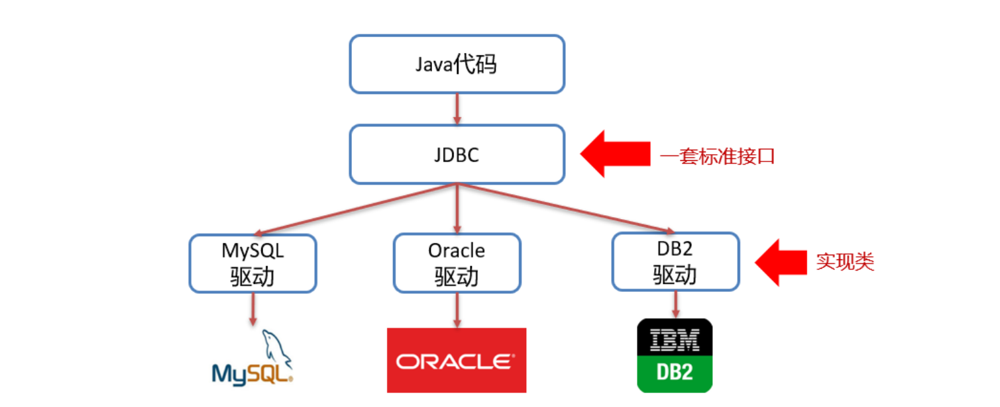

同一套Java代码是无法操作不同的关系型数据库，因为每一个关系型数据库的底层实现细节都不一样。如果这样，问题就很大了，在公司中可以在开发阶段使用的是MySQL数据库，而上线时公司最终选用oracle数据库，我们就需要对代码进行大批量修改，这显然并不是我们想看到的。我们要做到的是同一套Java代码操作不同的关系型数据库，而此时sun公司就指定了一套标准接口（JDBC），JDBC中定义了所有操作关系型数据库的规则。众所周知接口是无法直接使用的，我们需要使用接口的实现类，而这套实现类（称之为：驱动）就由各自的数据库厂商给出。

JDBC总结：

* 官方（sun公司）定义的一套操作所有关系型数据库的规则，即接口
* 各个数据库厂商去实现这套接口，提供数据库驱动jar包
* 可以使用这套接口（JDBC）编程，真正执行的代码是驱动jar包中的实现类

JDBC好上：

* 各数据库厂商使用相同的接口，Java代码不需要针对不同数据库分别开发
* 可随时替换底层数据库，访问数据库的Java代码基本不变
* 以后编写操作数据库的代码只需要面向JDBC（接口），操作哪儿个关系型数据库就需要导入该数据库的驱动包，如需要操作MySQL数据库，就需要再项目中导入MySQL数据库的驱动包。

### 2，JDBC快速入门

通过Java操作数据库的流程如下：


步骤：

* 第一步：编写Java代码
* 第二步：Java代码将SQL发送到MySQL服务端
* 第三步：MySQL服务端接收到SQL语句并执行该SQL语句
* 第四步：将SQL语句执行的结果返回给Java代码

创建新的空的项目：

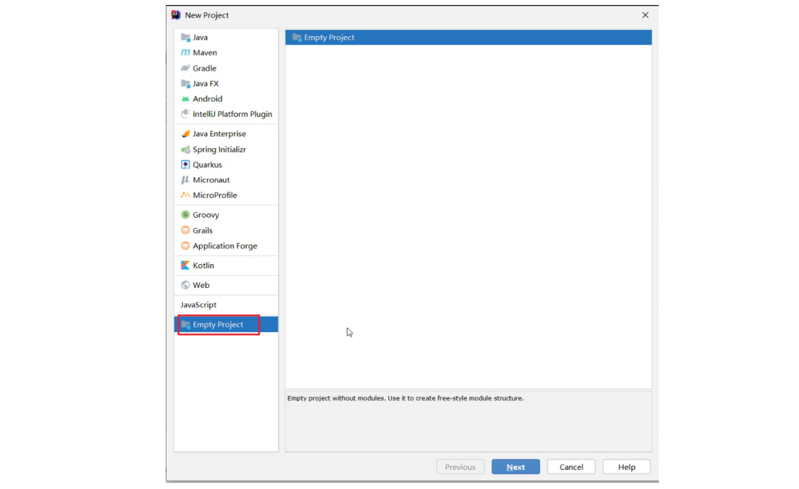

定义项目的名称，并指定位置：


对项目进行设置，JDK版本、编译版本：

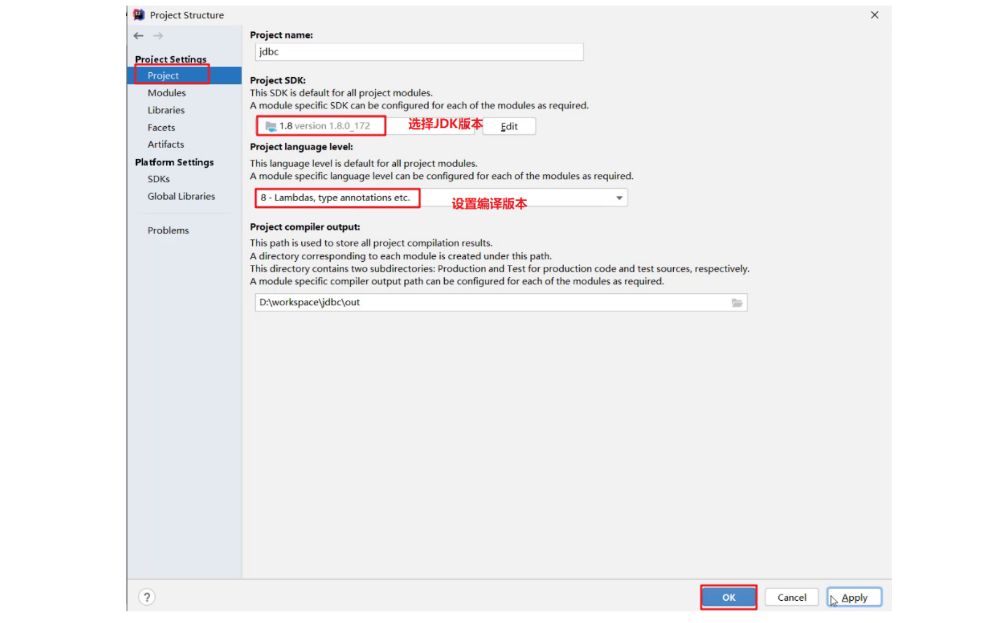

创建模块，指定模块的名称及位置：

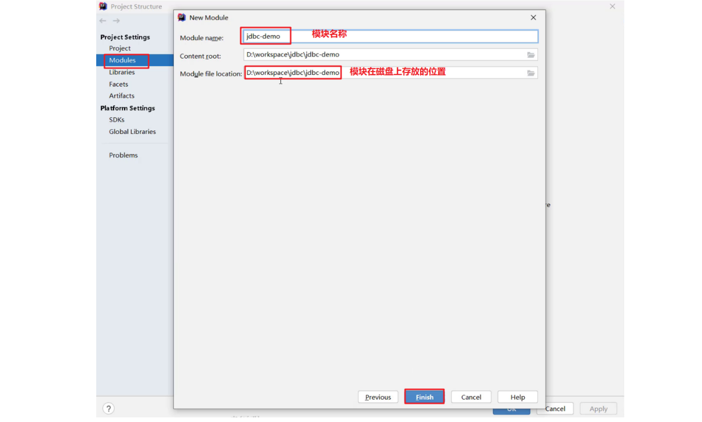

将mysql的驱动包放在模块下的lib目录（随意命名）下，并将该jar包添加为库文件：

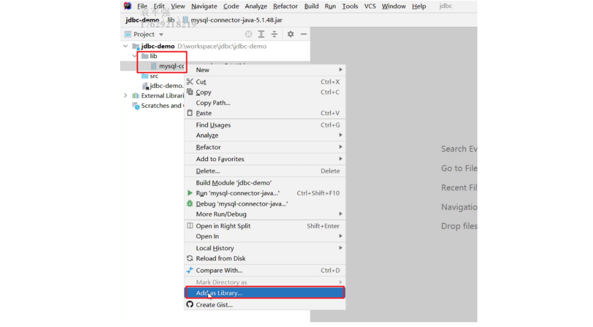

在添加为库文件的时候，有如下三个选项

* Global Library  ： 全局有效
* Project Library :   项目有效
* Module Library ： 模块有效


在src下创建类：

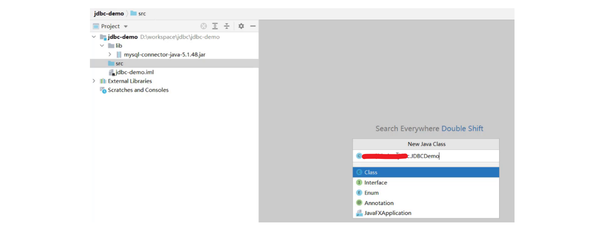

编写如下代码：

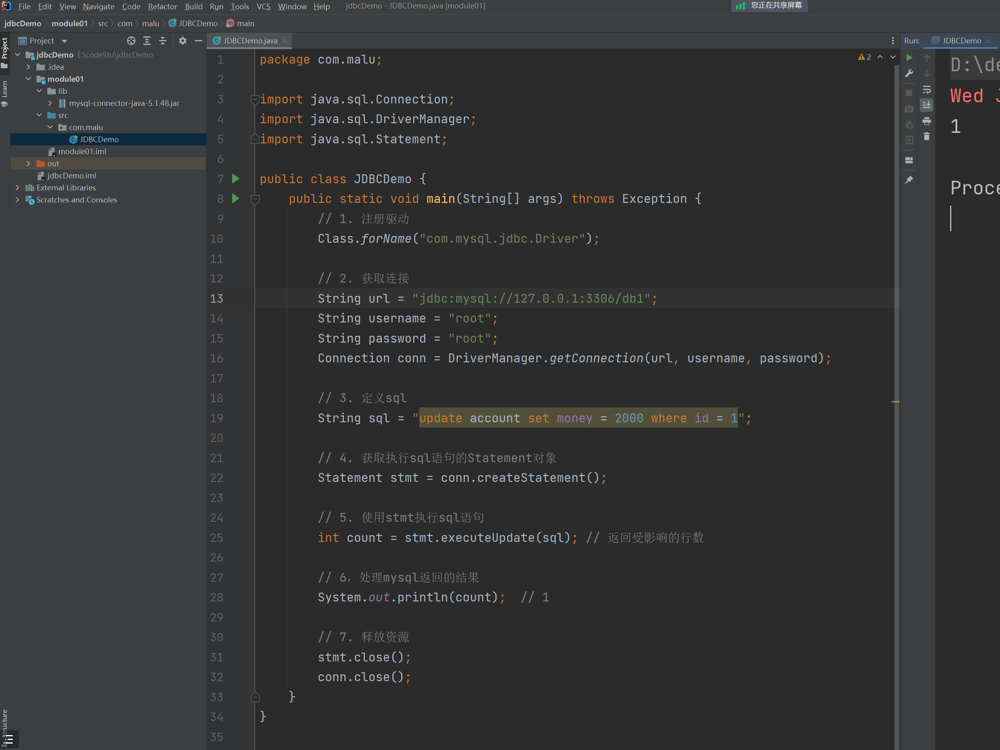

```java
package com.malu;

import java.sql.Connection;
import java.sql.DriverManager;
import java.sql.Statement;

public class JDBCDemo {
    public static void main(String[] args) throws Exception {
        // 1. 注册驱动
        Class.forName("com.mysql.jdbc.Driver");

        // 2. 获取连接
        String url = "jdbc:mysql://127.0.0.1:3306/db1";
        String username = "root";
        String password = "root";
        Connection conn = DriverManager.getConnection(url, username, password);

        // 3. 定义sql
        String sql = "update account set money = 2000 where id = 1";

        // 4. 获取执行sql语句的Statement对象
        Statement stmt = conn.createStatement();

        // 5. 使用stmt执行sql语句
        int count = stmt.executeUpdate(sql); // 返回受影响的行数

        // 6，处理mysql返回的结果
        System.out.println(count);  // 1 

        // 7. 释放资源
        stmt.close();
        conn.close();
    }
}
```


看数据库如下：

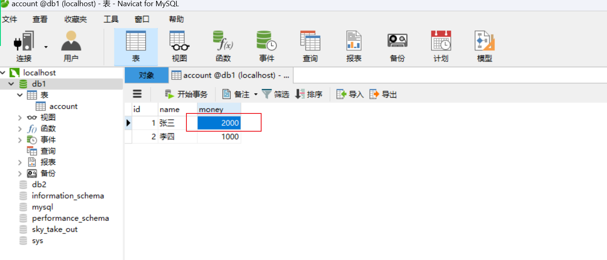


### 3，JDBC API详解

#### 3.1 DriverManager

**注册驱动API**

* static void registerDriver(Driver dirveer)   使用DriverManager注册给定的驱动程序

  

registerDriver方法是用于注册驱动的，但是我们之前做的入门案例并不是这样写的。而是如下实现：

```java
Class.forName("com.mysql.jdbc.Driver");
```

询MySQL提供的Driver类，看它是如何实现的，源码如下：

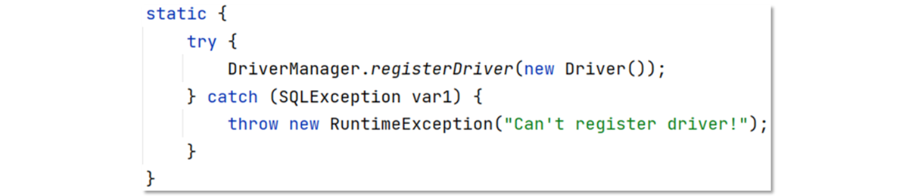

在该类中的静态代码块中已经执行了 `DriverManager` 对象的 `registerDriver()` 方法进行驱动的注册了，那么我们只需要加载 `Driver` 类，该静态代码块就会执行。而 `Class.forName("com.mysql.jdbc.Driver");` 就可以加载 `Driver` 类。

注意细节：

* MySQL 5之后的驱动包，可以省略注册驱动的步骤
* 自动加载jar包中META-INF/services/java.sql. Driver文件中的驱动类

**获取数据库连接API**

* static Connection  getConnection(String url, String user, String password)  尝试建立与给定数据库URL的连接。

参数说明：

* url ：连接路径。语法：jdbc:mysql://ip地址(域名): 端口号/数据库名称? 参数键值对1&参数键值对2…
  + 如果连接的是本机mysql服务器，并且mysql服务默认端口是3306，则url可以简写为：jdbc:mysql:///数据库名称? 参数键值对
  + 配置 useSSL=false 参数，禁用安全连接方式，解决警告提示
* user ：用户名
* poassword ：密码

#### 3.2 Connection

Connection（数据库连接对象）作用：

* 获取执行 SQL 的对象
* 管理事务

**获取执行对象API**

* Statement createStatement()    普通执行SQL对象
* PreparedStatement  prepareStatement(sql)   预编译SQL的执行SQL对象：防止SQL注入
* CallableStatement prepareCall(sql)   执行存储过程的对象。存储过程在MySQL中不常用，了解。

**事务管理：** 回顾一下MySQL事务管理的操作（MySQL默认是自动提交事务）：

* 开启事务 ： BEGIN; 或者 START TRANSACTION; 
* 提交事务 ： COMMIT; 
* 回滚事务 ： ROLLBACK; 

**JDBC事务管理API**

* void setAutoCommit(boolean autoCommit)   参与autoCommit 表示是否自动提交事务，true表示自动提交事务，false表示手动提交事务。而开启事务需要将该参数设为为false。
* void commit()  提交事务
* void rollback()  回滚事务

代码演示：

```java
package com.malu;

import java.sql.Connection;
import java.sql.DriverManager;
import java.sql.Statement;

public class JDBCDemo {
    public static void main(String[] args) throws Exception {
        // 1. 注册驱动
        //Class.forName("com.mysql.jdbc.Driver");

        // 2. 获取连接
        String url = "jdbc:mysql://127.0.0.1:3306/db1";
        String username = "root";
        String password = "root";
        Connection conn = DriverManager.getConnection(url, username, password);

        // 3. 定义sql
        String sql1 = "update account set money = 4000 where id = 1";
        String sql2 = "update account set money = 4000 where id = 2";

        // 4. 获取执行sql语句的Statement对象
        Statement stmt = conn.createStatement();

        try{
            // ============开启事务==========
            conn.setAutoCommit(false); // 设置事务手动提交
            // 5. 执行sql语句
            int count1 = stmt.executeUpdate(sql1); // 返回受影响的行数
            //6. 处理结果
            System.out.println(count1);
            int i = 1/0;
            int count2 = stmt.executeUpdate(sql2); // 返回受影响的行数
            //6. 处理结果
            System.out.println(count2);

            // ============提交事务==========
            //程序运行到此处，说明没有出现任何问题，则需求提交事务
            conn.commit();
        }catch (Exception e){
            // ============回滚事务==========
            //程序在出现异常时会执行到这个地方，此时就需要回滚事务
            conn.rollback();
            e.printStackTrace();
        }

        // 7. 释放资源
        stmt.close();
        conn.close();
    }
}
```

#### 3.3 Statement

Statement对象的作用就是用来执行SQL语句。而针对不同类型的SQL语句使用的方法也不一样。

* 执行DDL，DML语句： exeecuteUpdate(String sql)
* 执行DQL语句：executeQuery(String sql)

执行DML语句代码演示：

```java
package com.malu;

import java.sql.Connection;
import java.sql.DriverManager;
import java.sql.Statement;

public class JDBCDemo {
    public static void main(String[] args) throws Exception {
        // 1. 注册驱动
        //Class.forName("com.mysql.jdbc.Driver");

        // 2. 获取连接
        String url = "jdbc:mysql://127.0.0.1:3306/db1";
        String username = "root";
        String password = "root";
        Connection conn = DriverManager.getConnection(url, username, password);

        // 3. 定义sql
        String sql = "update account set money = 4000 where id = 1";

        // 4. 获取执行sql语句的Statement对象
        Statement stmt = conn.createStatement();

        // 5. 执行sql语句
        int count = stmt.executeUpdate(sql); // 返回受影响的行数
        // 6. 处理结果
        if(count > 0){
            System.out.println("修改成功~");
        }else{
            System.out.println("修改失败~");
        }

        // 7. 释放资源
        stmt.close();
        conn.close();
    }
}
```

结果如下：

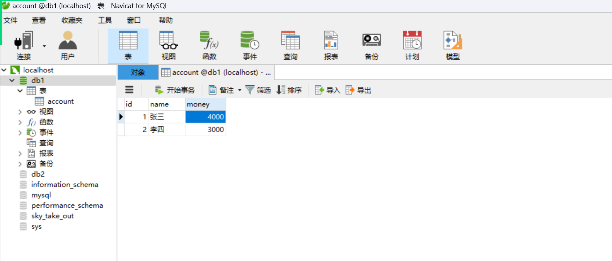


执行DDL语句代码演示(以后开发很少使用java代码操作DDL语句)：

```java
package com.malu;

import java.sql.Connection;
import java.sql.DriverManager;
import java.sql.Statement;

public class JDBCDemo {
    public static void main(String[] args) throws Exception {
        // 1. 注册驱动
        //Class.forName("com.mysql.jdbc.Driver");

        // 2. 获取连接
        String url = "jdbc:mysql://127.0.0.1:3306/db1";
        String username = "root";
        String password = "root";
        Connection conn = DriverManager.getConnection(url, username, password);

        // 3. 定义sql
        String sql = "drop database db2";

        // 4. 获取执行sql语句的Statement对象
        Statement stmt = conn.createStatement();

        // 5. 执行sql语句
        int count = stmt.executeUpdate(sql); // 返回受影响的行数  可能是0
        // 6. 处理结果
        System.out.println(count);

        // 7. 释放资源
        stmt.close();
        conn.close();
    }
}
```

#### 3.4 ReusltSet

ResultSet（结果集对象）作用：封装了SQL查询语句的结果。执行了DQL语句后就会返回该对象。我们就可以从 `ResultSet` 对象中获取我们想要的数据。 `ResultSet` 对象提供了操作查询结果数据的方法，如下：

* boolean next()    将光标从当前位置向前移动一行，判断当前行是否为有效行。
  + 方法返回值为true，有效行，当前行有数据
  + 方法返回值为false，无效行，当前行没有数据
* xxx getXxx(参数)  获取数据
  + xxx : 数据类型；如： int getInt(参数) ；String getString(参数)
  + int类型的参数：列的编号，从1开始。String类型的参数： 列的名称。

如下图为执行SQL语句后的结果：


一开始光标指定于第一行前，如图所示红色箭头指向于表头行。当我们调用了 `next()` 方法后，光标就下移到第一行数据，并且方法返回true，此时就可以通过 `getInt("id")` 获取当前行id字段的值，也可以通过 `getString("name")` 获取当前行name字段的值。如果想获取下一行的数据，继续调用 `next()` 方法，以此类推。


数据库中的数据如下：

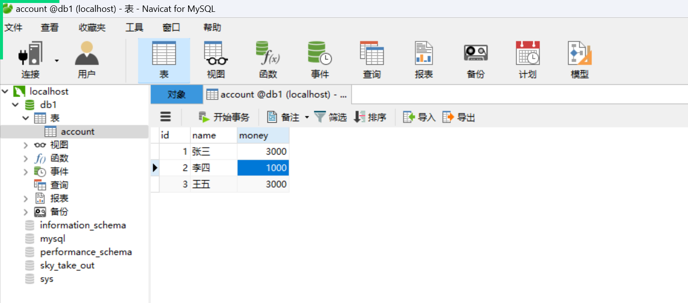


代码演示：

```java
package com.malu;

import java.sql.Connection;
import java.sql.DriverManager;
import java.sql.ResultSet;
import java.sql.Statement;

public class JDBCDemo {
    public static void main(String[] args) throws Exception {
        // 1. 注册驱动
        //Class.forName("com.mysql.jdbc.Driver");

        // 2. 获取连接
        String url = "jdbc:mysql://127.0.0.1:3306/db1?useSSL=false";
        String username = "root";
        String password = "root";
        Connection conn = DriverManager.getConnection(url, username, password);

        // 3. 定义sql
        String sql = "select * from account";

        // 4. 获取执行sql语句的Statement对象
        Statement stmt = conn.createStatement();

        // 5. 执行sql语句  rs是结果集
        ResultSet rs = stmt.executeQuery(sql);

        // 6. 处理结果
        while (rs.next()){
            int id = rs.getInt("id");
            String name = rs.getString("name");
            Double money = rs.getDouble("money");

            System.out.println(id);
            System.out.println(name);
            System.out.println(money);

            System.out.println("--------------");
        }

        // 7. 释放资源
        rs.close();
        stmt.close();
        conn.close();
    }
}
```


结果如下：

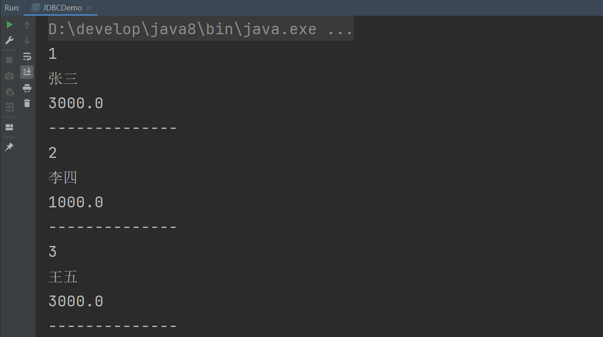


有了上面的基础后，我们做一个小案例。需求：查询account账户表数据，封装为Account对象中，并且存储到ArrayList集合中。


创建Account实体类，如下：

```java
public class Account {

    private int id;
    private String name;
    private double money;

    public int getId() {
        return id;
    }

    public void setId(int id) {
        this.id = id;
    }

    public String getName() {
        return name;
    }

    public void setName(String name) {
        this.name = name;
    }

    public double getMoney() {
        return money;
    }

    public void setMoney(double money) {
        this.money = money;
    }

    @Override
    public String toString() {
        return "Account{" +
                "id=" + id +
                ", name='" + name + '\'' +
                ", money=" + money +
                '}';
    }
}
```


把查询到的数据封装成一个Account对象，把这个对象放到ArrayList集合中，如一上：

```java
package com.malu;

import java.sql.Connection;
import java.sql.DriverManager;
import java.sql.ResultSet;
import java.sql.Statement;
import java.util.ArrayList;

/**
 * 查询account账户表数据，封装为Account对象中，并且存储到ArrayList集合中
 * 1. 定义实体类Account
 * 2. 查询数据，封装到Account对象中
 * 3. 将Account对象存入ArrayList集合中
 */
public class JDBCDemo {
    public static void main(String[] args) throws Exception {
        // 1. 注册驱动
        //Class.forName("com.mysql.jdbc.Driver");

        // 2. 获取连接
        String url = "jdbc:mysql://127.0.0.1:3306/db1?useSSL=false";
        String username = "root";
        String password = "root";
        Connection conn = DriverManager.getConnection(url, username, password);

        // 3. 定义sql
        String sql = "select * from account";

        // 4. 获取执行sql语句的Statement对象
        Statement stmt = conn.createStatement();

        // 5. 执行sql语句  rs是结果集
        ResultSet rs = stmt.executeQuery(sql);

        ArrayList<Account> arrayList = new ArrayList<>();

        // 6. 处理结果
        while (rs.next()){
            Account account = new Account();

            int id = rs.getInt("id");
            String name = rs.getString("name");
            Double money = rs.getDouble("money");

            account.setId(id);
            account.setName(name);
            account.setMoney(money);

            arrayList.add(account);
        }

        System.out.println(arrayList);

        // 7. 释放资源
        rs.close();
        stmt.close();
        conn.close();
    }
}
```


结果如下：

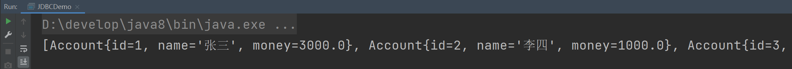


#### 3.5 PreparedStatement

PreparedStatement作用：预编译SQL语句并执行，预防SQL注入问题。我们先要搞清楚什么是SQL注入。SQL注入是通过操作输入来修改事先定义好的SQL语句，用以达到执行代码对服务器进行攻击的方法。

创建一张表：

```mysql
-- 删除tb_user表
DROP TABLE IF EXISTS tb_user;
-- 创建tb_user表
CREATE TABLE tb_user(
	id int,
	username VARCHAR(20),
	password VARCHAR(32)
);
-- 添加数据
INSERT INTO tb_user VALUES(1,'wc','123'),(2,'xq','456');
```


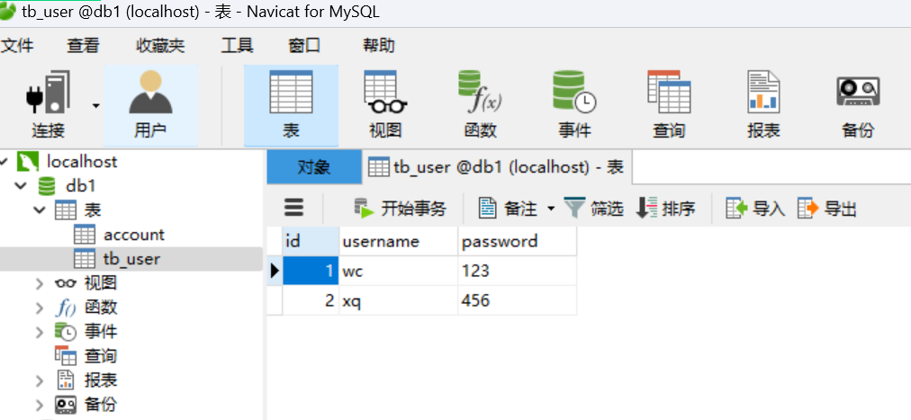


代码模拟SQL注入问题：

```java
public class JDBCDemo {
    public static void main(String[] args) throws Exception {
        // 1. 注册驱动
        //Class.forName("com.mysql.jdbc.Driver");

        // 2. 获取连接
        String url = "jdbc:mysql://127.0.0.1:3306/db1?useSSL=false";
        String username = "root";
        String password = "root";
        Connection conn = DriverManager.getConnection(url, username, password);

        // 3. 定义sql
        String name = "wc";
        //String pwd = "1234";
        String pwd = "' or '1' = '1";
        String sql = "select * from tb_user where username = '"+name+"' and password = '"+pwd+"'";
        System.out.println("sql:"+sql);

        // 4. 获取执行sql语句的Statement对象
        Statement stmt = conn.createStatement();

        // 5. 执行sql语句  rs是结果集
        ResultSet rs = stmt.executeQuery(sql);

        // 6. 处理结果
        // 判断登录是否成功
        if(rs.next()){
            System.out.println("登录成功~");
        }else{
            System.out.println("登录失败~");
        }

        // 7. 释放资源
        rs.close();
        stmt.close();
        conn.close();
    }
}
```

上面代码是将用户名和密码拼接到sql语句中，拼接后的sql语句如下：

```java
select * from tb_user where username = 'wc' and password = ''or '1' = '1'
```

从上面语句可以看出条件 `username = 'wc' and password = ''` 不管是否满足，而 `or` 后面的 `'1' = '1'` 是始终满足的，最终条件是成立的，就可以正常的进行登陆了。

知道了什么是SQL注入，接下来我们学习PreparedStatement。它的作用就是预编译SQL语句并执行，预防SQL注入问题。获取 PreparedStatement 对象

```java
// SQL语句中的参数值，使用？占位符替代
String sql = "select * from user where username = ? and password = ?";
// 通过Connection对象获取，并传入对应的sql语句
PreparedStatement pstmt = conn.prepareStatement(sql);
```

上面的sql语句中参数使用 ? 进行占位，在之前之前肯定要设置这些 ?  的值。

* PreparedStatement对象：setXxx(参数1，参数2)：给 ? 赋值
  + Xxx：数据类型 ； 如 setInt (参数1，参数2)
  + 参数1： ？的位置编号，从1 开始
  + 参数2： ？的值

执行SQL语句：

* executeUpdate(); 执行DDL语句和DML语句
* executeQuery(); 执行DQL语句
* 调用这两个方法时不需要传递SQL语句，因为获取SQL语句执行对象时已经对SQL语句进行预编译了。

代码演示：

```java
public class JDBCDemo {
    public static void main(String[] args) throws Exception {
        // 1. 注册驱动
        //Class.forName("com.mysql.jdbc.Driver");

        // 2. 获取连接
        String url = "jdbc:mysql://127.0.0.1:3306/db1?useSSL=false";
        String username = "root";
        String password = "root";
        Connection conn = DriverManager.getConnection(url, username, password);

        // 3. 定义sql
        String name = "wc";
        //String pwd = "123";
        String pwd = "' or '1' = '1";
        String sql = "select * from tb_user where username = ? and password = ?";
        System.out.println("sql:"+sql);

        // 4. 获取执行sql语句的Statement对象
        PreparedStatement pstmt = conn.prepareStatement(sql);
        // 设置参数
        pstmt.setString(1,name);
        pstmt.setString(2,pwd);

        // 5. 执行sql语句  rs是结果集
        ResultSet rs = pstmt.executeQuery();

        // 6. 处理结果
        // 判断登录是否成功
        if(rs.next()){
            System.out.println("登录成功~");
        }else{
            System.out.println("登录失败~");
        }

        // 7. 释放资源
        rs.close();
        pstmt.close();
        conn.close();
    }
}
```

执行上面语句就可以发现不会出现SQL注入漏洞问题了。那么PreparedStatement又是如何解决的呢？它是将特殊字符进行了转义，转义的SQL如下：

```java
select * from tb_user where username = 'wc' and password = '\'or \'1\' = \'1'
```

PreparedStatement 好处：

* 预编译SQL，性能更高
* 防止SQL注入：将敏感字符进行转义

## 二，数据库连接池

### 1，什么是数据库连接池

数据库连接池是个容器，负责分配、管理数据库连接(Connection)。它允许应用程序重复使用一个现有的数据库连接，而不是再重新建立一个；释放空闲时间超过最大空闲时间的数据库连接来避免因为没有释放数据库连接而引起的数据库连接遗漏。它的好处在于：

* 资源重用
* 提升系统响应速度
* 避免数据库连接遗漏

之前我们代码中使用连接是没有使用数据库连接池的，都创建一个Connection对象，使用完毕就会将其销毁。这样重复创建销毁的过程是特别耗费计算机的性能的及消耗时间的。

而数据库使用了数据库连接池后，就能达到Connection对象的复用，如下图


连接池是在一开始就创建好了一些连接（Connection）对象存储起来。用户需要连接数据库时，不需要自己创建连接，而只需要从连接池中获取一个连接进行使用，使用完毕后再将连接对象归还给连接池；这样就可以起到资源重用，也节省了频繁创建连接销毁连接所花费的时间，从而提升了系统响应的速度。

官方(SUN) 提供的数据库连接池标准接口，由第三方组织实现此接口。该接口提供了获取连接的功能： `Connection getConnection()` ，以后就不需要通过 `DriverManager` 对象获取 `Connection` 对象，而是通过连接池（DataSource）获取 `Connection` 对象。常见的数据库连接池：

* DBCP
* C3P0
* Druid（现在使用最多，性能比其他两个会好一些）

### 2，Druid

Druid连接池是阿里巴巴开源的数据库连接池项目，功能强大，性能优秀，是Java语言最好的数据库连接池之一。接下来我们演示一下Druid的使用。步骤：

* 导入jar包 druid-1.1.12.jar
* 定义配置文件
* 加载配置文件
* 获取数据库连接池对象
* 获取连接

现在通过代码实现，首先需要先将druid的jar包放到项目下的lib下并添加为库文件

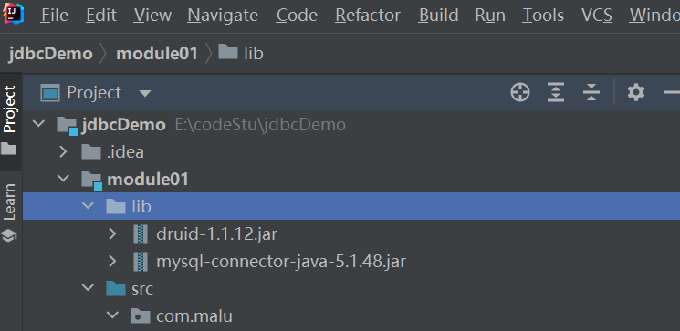


编写配置文件如下：

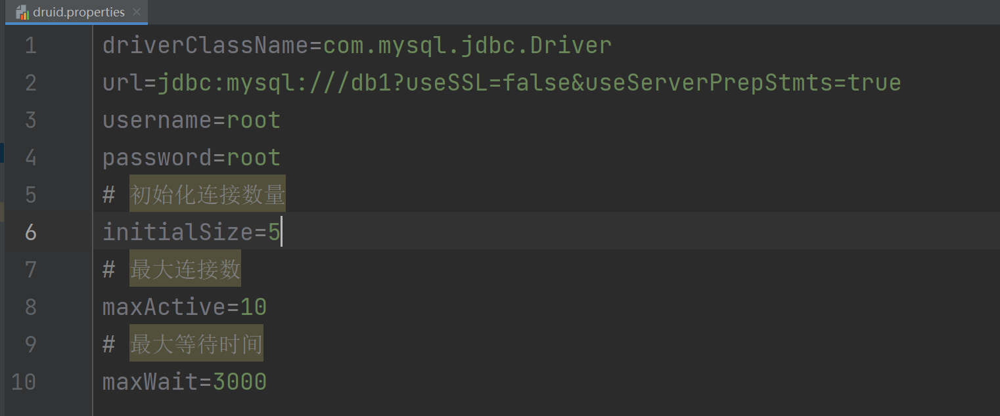

参考：

```properties
driverClassName=com.mysql.jdbc.Driver
url=jdbc:mysql:///db1?useSSL=false&useServerPrepStmts=true
username=root
password=1234
# 初始化连接数量
initialSize=5
# 最大连接数
maxActive=10
# 最大等待时间
maxWait=3000
```


项目结构如下：

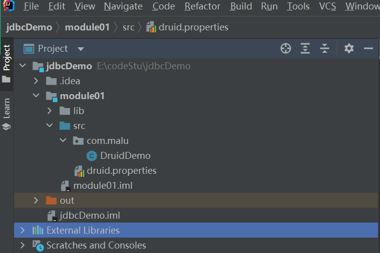


使用druid的代码如下：

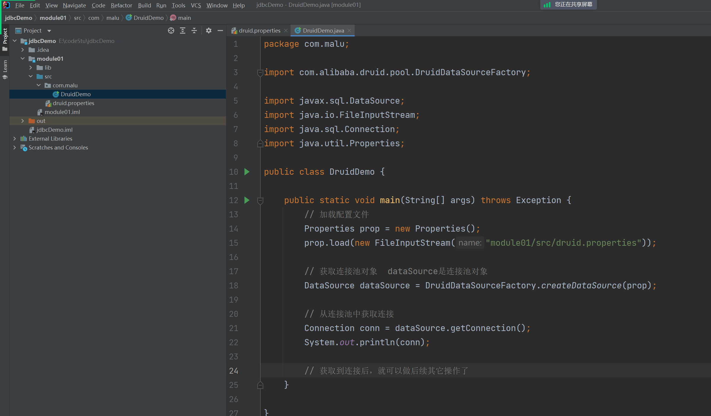


参考：

```java
package com.malu;

import com.alibaba.druid.pool.DruidDataSourceFactory;

import javax.sql.DataSource;
import java.io.FileInputStream;
import java.sql.Connection;
import java.util.Properties;

public class DruidDemo {

    public static void main(String[] args) throws Exception {
        // 加载配置文件
        Properties prop = new Properties();
        prop.load(new FileInputStream("module01/src/druid.properties"));

        // 获取连接池对象  dataSource是连接池对象
        DataSource dataSource = DruidDataSourceFactory.createDataSource(prop);

        // 从连接池中获取连接
        Connection conn = dataSource.getConnection();
        System.out.println(conn);
        
        // 获取到连接后，就可以做后续其它操作了
    }

}
```

## 三，案例

### 1，准备工作

完成商品品牌数据的增删改查操作

* 查询：查询所有数据
* 添加：添加品牌
* 修改：根据id修改
* 删除：根据id删除

数据库表 `tb_brand`

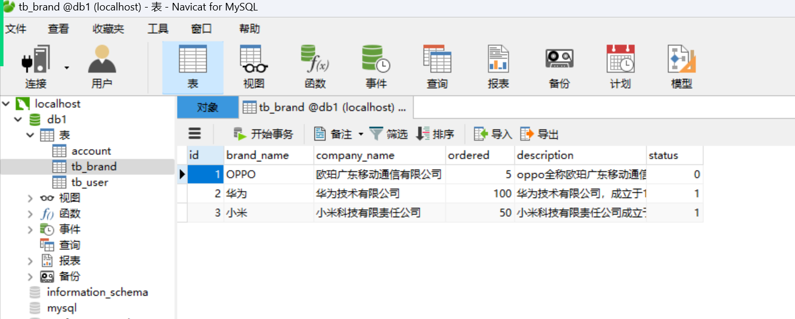


```mysql
-- 删除tb_brand表
drop table if exists tb_brand;
-- 创建tb_brand表
create table tb_brand (
    -- id 主键
    id int primary key auto_increment,
    -- 品牌名称
    brand_name varchar(20),
    -- 企业名称
    company_name varchar(20),
    -- 排序字段
    ordered int,
    -- 描述信息
    description varchar(100),
    -- 状态：0：禁用  1：启用
    status int
);
-- 添加数据
insert into tb_brand (brand_name, company_name, ordered, description, status)
values ('OPPO', '欧珀广东移动通信有限公司', 5, 'oppo全称欧珀广东移动通信有限公司，成立于2004年，CEO为陈明永', 0),
       ('华为', '华为技术有限公司', 100, '华为技术有限公司，成立于1987年，总部位于广东省深圳市龙岗区。', 1),
       ('小米', '小米科技有限责任公司', 50, '小米科技有限责任公司成立于2010年3月3日，是专注于智能硬件、电子产品、芯片研发、智能手机、智能电动汽车、通信、金融、互联网电视及智能家居生态链建设的全球化移动互联网企业、创新型科技企业。', 1);
```

在pojo包下实体类 Brand

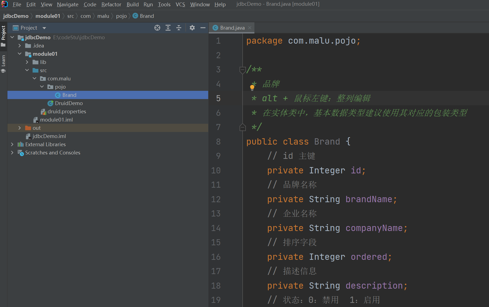

参考：

```java
package com.malu.pojo;

/**
 * 品牌
 * alt + 鼠标左键：整列编辑
 * 在实体类中，基本数据类型建议使用其对应的包装类型
 */
public class Brand {
    // id 主键
    private Integer id;
    // 品牌名称
    private String brandName;
    // 企业名称
    private String companyName;
    // 排序字段
    private Integer ordered;
    // 描述信息
    private String description;
    // 状态：0：禁用  1：启用
    private Integer status;

    public Integer getId() {
        return id;
    }

    public void setId(Integer id) {
        this.id = id;
    }

    public String getBrandName() {
        return brandName;
    }

    public void setBrandName(String brandName) {
        this.brandName = brandName;
    }

    public String getCompanyName() {
        return companyName;
    }

    public void setCompanyName(String companyName) {
        this.companyName = companyName;
    }

    public Integer getOrdered() {
        return ordered;
    }

    public void setOrdered(Integer ordered) {
        this.ordered = ordered;
    }

    public String getDescription() {
        return description;
    }

    public void setDescription(String description) {
        this.description = description;
    }

    public Integer getStatus() {
        return status;
    }

    public void setStatus(Integer status) {
        this.status = status;
    }

    @Override
    public String toString() {
        return "Brand{" +
                "id=" + id +
                ", brandName='" + brandName + '\'' +
                ", companyName='" + companyName + '\'' +
                ", ordered=" + ordered +
                ", description='" + description + '\'' +
                ", status=" + status +
                '}';
    }
}
```

### 2，查询所有

```java
package com.malu;

import com.alibaba.druid.pool.DruidDataSourceFactory;
import com.malu.pojo.Brand;

import javax.sql.DataSource;
import java.io.FileInputStream;
import java.sql.Connection;
import java.sql.PreparedStatement;
import java.sql.ResultSet;
import java.util.ArrayList;
import java.util.Properties;

public class DruidDemo {

    public static void main(String[] args) throws Exception {
        // 加载配置文件
        Properties prop = new Properties();
        prop.load(new FileInputStream("module01/src/druid.properties"));

        // 获取连接池对象  dataSource是连接池对象
        DataSource dataSource = DruidDataSourceFactory.createDataSource(prop);

        // 从连接池中获取连接
        Connection conn = dataSource.getConnection();
        System.out.println(conn);

        // 定义SQL语句
        String sql = "select * from tb_brand";

        // 获取pstmt对象
        PreparedStatement pstmt = conn.prepareStatement(sql);

        ResultSet rs = pstmt.executeQuery();

        Brand brand = null;
        ArrayList<Brand> brands = new ArrayList<Brand>();

        while (rs.next()){
            //获取数据
            int id = rs.getInt("id");
            String brandName = rs.getString("brand_name");
            String companyName = rs.getString("company_name");
            int ordered = rs.getInt("ordered");
            String description = rs.getString("description");
            int status = rs.getInt("status");
            //封装Brand对象
            brand = new Brand();
            brand.setId(id);
            brand.setBrandName(brandName);
            brand.setCompanyName(companyName);
            brand.setOrdered(ordered);
            brand.setDescription(description);
            brand.setStatus(status);

            brands.add(brand);
        }

        for (Brand brand1 : brands) {
            System.out.println(brand1);
        }

        rs.close();
        pstmt.close();
        conn.close();
    }

}
```


结果如下：

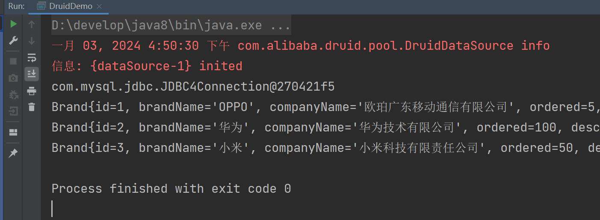

### 3，添加数据

```java
package com.malu;

import com.alibaba.druid.pool.DruidDataSourceFactory;

import javax.sql.DataSource;
import java.io.FileInputStream;
import java.sql.Connection;
import java.sql.PreparedStatement;
import java.util.Properties;

public class DruidDemo {

    public static void main(String[] args) throws Exception {

        // 模拟前端提交过来的数据
        String brandName = "百度";
        String companyName = "百度在线网络技术（北京）有限公司";
        int ordered = 1;
        String description = "百度（Nasdaq简称：BIDU）是全球最大的中文搜索引擎，2000年1月由李彦宏、徐勇两人创立于北京中关村，致力于向人们提供“简单，可依赖”的信息获取方式。";
        int status = 1;

        // 加载配置文件
        Properties prop = new Properties();
        prop.load(new FileInputStream("module01/src/druid.properties"));

        // 获取连接池对象  dataSource是连接池对象
        DataSource dataSource = DruidDataSourceFactory.createDataSource(prop);

        // 从连接池中获取连接
        Connection conn = dataSource.getConnection();
        System.out.println(conn);

        // 定义SQL语句
        String sql = "insert into tb_brand(brand_name, company_name, ordered, description, status) values(?,?,?,?,?);";

        // 获取pstmt对象
        PreparedStatement pstmt = conn.prepareStatement(sql);
        // 设置参数
        pstmt.setString(1,brandName);
        pstmt.setString(2,companyName);
        pstmt.setInt(3,ordered);
        pstmt.setString(4,description);
        pstmt.setInt(5,status);

        int count = pstmt.executeUpdate();
        System.out.println(count>0);

        pstmt.close();
        conn.close();
    }

}
```


执行结果：

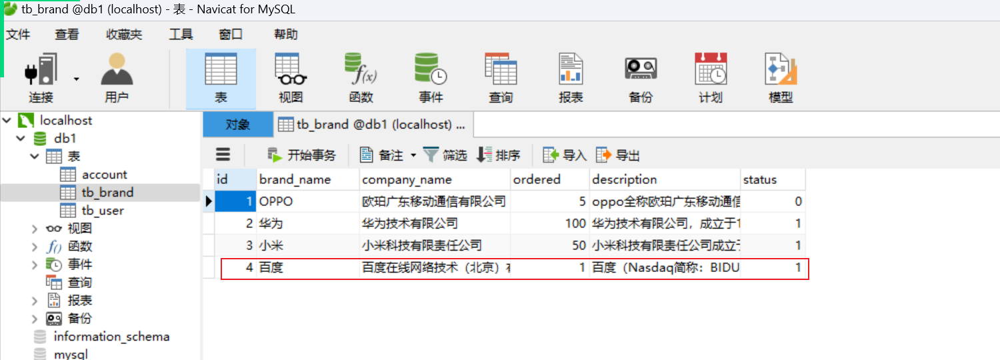


### 4，修改数据

```java
package com.malu;

import com.alibaba.druid.pool.DruidDataSourceFactory;

import javax.sql.DataSource;
import java.io.FileInputStream;
import java.sql.Connection;
import java.sql.PreparedStatement;
import java.util.Properties;

public class DruidDemo {

    public static void main(String[] args) throws Exception {

        // 模拟前端提交过来的数据
        String brandName = "百度6";
        String companyName = "百度在线网络技术（北京）有限公司6";
        int ordered = 16;
        String description = "百度（Nasdaq简称：BIDU）是全球最大的中文搜索引擎，2000年1月由李彦宏、徐勇两人创立于北京中关村，致力于向人们提供“简单，可依赖”的信息获取方式。";
        int status = 0;
        int id = 4; // 修改相比添加多了一个id参数

        // 加载配置文件
        Properties prop = new Properties();
        prop.load(new FileInputStream("module01/src/druid.properties"));

        // 获取连接池对象  dataSource是连接池对象
        DataSource dataSource = DruidDataSourceFactory.createDataSource(prop);

        // 从连接池中获取连接
        Connection conn = dataSource.getConnection();
        System.out.println(conn);

        // 定义SQL语句
        String sql = " update tb_brand\n" +
                "         set brand_name  = ?,\n" +
                "         company_name= ?,\n" +
                "         ordered     = ?,\n" +
                "         description = ?,\n" +
                "         status      = ?\n" +
                "     where id = ?";

        // 获取pstmt对象
        PreparedStatement pstmt = conn.prepareStatement(sql);
        // 设置参数
        pstmt.setString(1,brandName);
        pstmt.setString(2,companyName);
        pstmt.setInt(3,ordered);
        pstmt.setString(4,description);
        pstmt.setInt(5,status);
        pstmt.setInt(6,id);

        int count = pstmt.executeUpdate();
        System.out.println(count>0);

        pstmt.close();
        conn.close();
    }

}
```


执行结果：

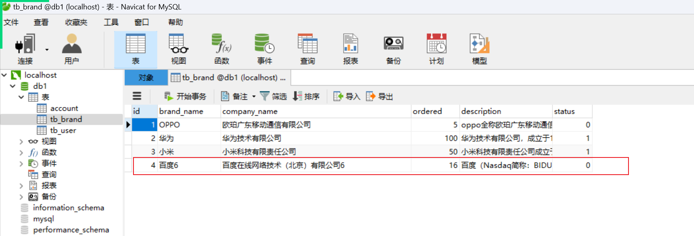


### 5，删除数据

```java
package com.malu;

import com.alibaba.druid.pool.DruidDataSourceFactory;

import javax.sql.DataSource;
import java.io.FileInputStream;
import java.sql.Connection;
import java.sql.PreparedStatement;
import java.util.Properties;

public class DruidDemo {

    public static void main(String[] args) throws Exception {

        // 模拟前端提交过来的数据
        int id = 4;

        // 加载配置文件
        Properties prop = new Properties();
        prop.load(new FileInputStream("module01/src/druid.properties"));

        // 获取连接池对象  dataSource是连接池对象
        DataSource dataSource = DruidDataSourceFactory.createDataSource(prop);

        // 从连接池中获取连接
        Connection conn = dataSource.getConnection();
        System.out.println(conn);

        // 定义SQL语句
        String sql = " delete from tb_brand where id = ?";

        // 获取pstmt对象
        PreparedStatement pstmt = conn.prepareStatement(sql);
        // 设置参数
        pstmt.setInt(1,id);

        int count = pstmt.executeUpdate();
        System.out.println(count>0);

        pstmt.close();
        conn.close();
    }

}
```


执行的结果：

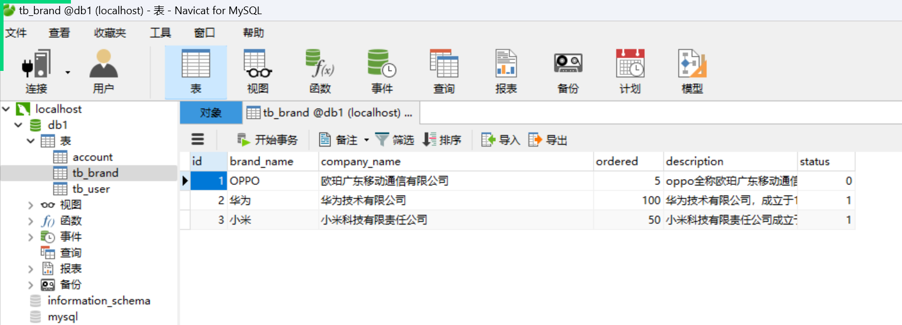

