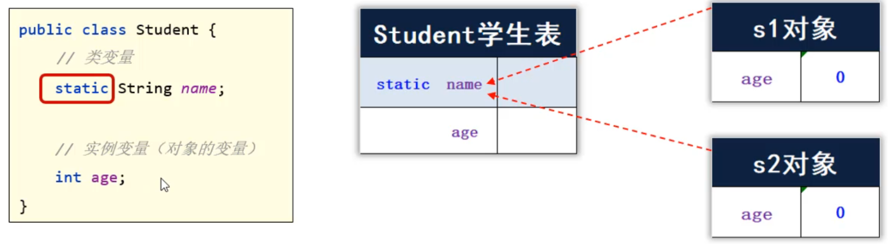

## 一，静态

面向对象最核心的套路是：**设计对象来处理数据，解决问题。** 学习OOP进阶，目的就是让我们设计出来的对象更加好用。接下来，我们会学习很多小的知识点，这些小的知识点需要我们尽可能学生，到后面我们利用这些知识点去设计对象。

### 1，Static修饰成员变量

先学习一个static关键字，static读作静态，可以用来修饰成员变量，也能修饰成员方法。当static修饰成员变量时，被static修饰的成员变量，叫类变量，反之叫实例变量。

* 类变量：有static修饰，属于类，在计算机中只有一份，会被类的全部对象共享，用类名调用。
* 实例变量：无static修饰，属于每个对象的，每一个对象都有一份，用对象调用。



访问或调用方式：

* 由于静态变量是属于类的，只需要通过类名就可以调用：**类名. 静态变量**
* 实例变量是属于对象的，需要通过对象才能调用：**对象. 实例变量**

代码：

```java
public class Student {
    // 类变量
    static String name;
    // 实例变量（对象的变量）
    int age;
}

public class Test {
    public static void main(String[] args) {
        // 1、类变量的用法。
        // 类名.类变量（推荐）
        Student.name = "袁华";

        // 对象.类变量（不推荐）
        Student s1 = new Student();
        s1.name = "马冬梅";

        Student s2 = new Student();
        s2.name = "秋雅";

        System.out.println(s1.name); // 秋雅
        System.out.println(Student.name); // 秋雅

        // 2、实例变量的用法：属于每个对象的变量
        // 对象.实例变量
        s1.age = 23;
        s2.age = 18;
        System.out.println(s1.age); // 23

        // System.out.println(Student.age); // 报错
    }
}
```

在实际开发中，如果某个数据只需要一份，且希望能够被共享（访问、修改），则该数据可以定义成类变量来记住。需求：系统启动后，要求用于类可以记住自己创建了多少个用户对象。

第一步：先定义一个 `User` 类，在用户类中定义一个static修饰的变量，用来表示在线人数；

```java
public class User {
    // 类变量
    public static int number;

    public User(){
        // User.number++;
        // 注意：在同一个类中，访问自己类的类变量，才可以省略类名不写。
        number++;
    }
}
```

第二步：再写一个测试类，再测试类中创建4个User对象，再打印number的值，观察number的值是否再自增。

```java
public class Test{
    public static void main(String[] args){
        //创建4个对象
        new User();
        new User();
        new User();
        new User(); 
        
        //查看系统创建了多少个User对象
        System.out.println("系统创建的User对象个数："+User.number);
    }
}
```

### 2，Static修饰成员方法

成员方法根据有无static也分为两类：**类方法、实例方法**

* 类方法：有static修饰的成员方法，属于类。调用时直接用类名调用即可。
* 实例方法：无static修饰的成员方法，属于对象。调用时，需要使用对象调用。

定义一个Student类，在类中定义一个类方法、定义一个实例方法：

```java
public class Student {
    double score;
    // 类方法
    public static void printHelloWorld(){
        System.out.println("Hello World");
        System.out.println("Hello World");
    }

    // 实例方法（对象的方法）
    public void printPass(){
        System.out.println("成绩：" +
                (score >= 60 ? "及格": "不及格"));
    }
}
```

在定义一个测试类，注意类方法、对象方法调用的区别：

```java
public class Test {
    public static void main(String[] args) {
        // 1、类方法的用法
        // 类名.类方法（推荐）
        Student.printHelloWorld();

        // 对象.类方法（不推荐）
        Student s = new Student();
        s.printHelloWorld();

        // 2、实例方法的用法
        // 对象.实例方法
        s.printPass();
        // Student.printPass(); // 报错
    }
}
```

类方法细节：

* static修饰的方法，可以被类名调用，是因为它是随着类的加载而加载的，所以类名直接就可以找到static修饰的方法。
* 非static修饰的方法，需要创建对象后才能调用，是因为实例方法中可能会访问实例变量，而实例变量需要创建对象后才存在。所以实例方法，必须创建对象后才能调用。

### 3，工具类

类方法的一个应用场景之一就是做工具类，一个工具类它里面的方法可以全都是静态的，那么这个类中的方法就全都可以被类名直接调用，调用起来非常方便。

实现一个生厉验证码的工具类：

```java
import java.util.Random;

public class MyUtil {
    public static String createCode(int n){
        String code = "";
        String data = "abcdefghijklmnopqrstuvwxyzABCDEFGHIJKLMNOPQRSTUVWXYZ0123456789";

        Random r = new Random();
        // 2、开始定义一个循环产生每位随机字符
        for (int i = 0; i < n; i++) {
            // 3、随机一个字符范围内的索引。
            int index = r.nextInt(data.length());
            // 4、根据索引去全部字符中提取该字符
            code += data.charAt(index); // code = code + 字符
        }
        return code;
    }
}
```

调用 `MyUtils` 的 `createCOde()方法` 产生任意个数的验证码：

```java
public class Test{
    public static void main(String[] args){
        System.out.println(MyUtils.createCode());
    }
}
```

工具类里的方法全都是静态的，推荐用类名调用为了防止使用者用对象调用。我们可以把工具类的构造方法私有化。如下：

```java
import java.util.Random;

public class MyUtil {
    // 私有化构造方法：这样别人就不能使用构造方法new对象了
    private MyUtil(){
    }

    public static String createCode(int n){
        String code = "";
        String data = "abcdefghijklmnopqrstuvwxyzABCDEFGHIJKLMNOPQRSTUVWXYZ0123456789";

        Random r = new Random();
        // 2、开始定义一个循环产生每位随机字符
        for (int i = 0; i < n; i++) {
            // 3、随机一个字符范围内的索引。
            int index = r.nextInt(data.length());
            // 4、根据索引去全部字符中提取该字符
            code += data.charAt(index); // code = code + 字符
        }
        return code;
    }
}
```

### 4，Static注意事项

注意事项：

* 类方法中可以直接访问类的成员，不可以直接访问实例成员。

* 实例方法中即可以直接访问类成员，也可以直接访问实例成员。

* 实例方法中可以出现this关键字，类方法中不可以出现this关键字。

代码：

```java
public class Student {
    static String schoolName; // 类变量
    double score; // 实例变量

    // 1、类方法中可以直接访问类的成员，不可以直接访问实例成员。
    public static void printHelloWorld(){
        // 注意：同一个类中，访问类成员，可以省略类名不写。
        schoolName = "中国";
        printHelloWorld2();

        // System.out.println(score); // 报错的
        // printPass(); // 报错的

        // System.out.println(this); // 报错的
    }

    // 类方法
    public static void printHelloWorld2(){

    }

    // 2、实例方法中既可以直接访问类成员，也可以直接访问实例成员。
    // 实例方法
    // 3、实例方法中可以出现this关键字，类方法中不可以出现this关键字的
    public void printPass(){
        schoolName = "中国2";
        printHelloWorld2();

        System.out.println(score);
        printPass2();

        System.out.println(this);
    }

    // 实例方法
    public void printPass2(){

    }
}
```

### 5，代码块

代码块根据有无static修饰分为两种：静态代码块、实例代码块

* 静态代码块，类加载时自动执行，类只会加载一次，所以静态代码块也只会加载一次。可以大静态代码块中，对类变量进行初始化赋值。静态代码块不需要创建对象就能够执行。
* 每次创建对象，就会执行实例代码块，在构造器之前执行。和构造器一样，都是用来完成对象初始化的，可以对实例变量进行初始化赋值。作用和构造器作用是一样的。

静态代码块和实例代码块代码：

```java
public class Student {
    static int number = 80;
    static String schoolName = "北大";
    // 静态代码块
    static {
        System.out.println("静态代码块执行了~~");
        // schoolName = "北大";
    }
    int age;
    // 实例代码块
    {
        System.out.println("实例代码块执行了~~");
        // age = 18;
        System.out.println("有人创建了对象：" + this);
    }

    public Student(){
        System.out.println("无参数构造器执行了~~");
    }

    public Student(String name){
        System.out.println("有参数构造器执行了~~");
    }
}

public class Test {
    public static void main(String[] args) {
        // 目标：认识两种代码块，了解他们的特点和基本作用。
        System.out.println(Student.number);
        System.out.println(Student.number);
        System.out.println(Student.number);

        System.out.println(Student.schoolName); // 北大

        System.out.println("---------------------------------------");
        Student s1 = new Student();
        Student s2 = new Student("张三");
        System.out.println(s1.age);
        System.out.println(s2.age);
    }
}
```

### 6，单例

单例设计模式，所谓设计模式指的是，一类问题可能会有多种解决方案，而设计模式是在编程实践中，多种方案中的一种最优方案。讲两种单例：

* 饿汉式单例
* 懒汉式单例

饿汉式单例：

```java
public class A {
    // 2、定义一个类变量记住类的一个对象
    private static A a = new A();

    // 1、必须私有类的构造器
    private A(){

    }

    // 3、定义一个类方法返回类的对象
    public static A getObject(){
        return a;
    }
}

public class Test {
    public static void main(String[] args) {
        // 目标：掌握单例设计模式的写法。
        A a1 = A.getObject();
        A a2 = A.getObject();
        System.out.println(a1);
        System.out.println(a2);
    }
}
```

懒汉式单例:

```java
public class B {
    // 2、定义一个类变量，用于存储这个类的一个对象。
    private static B b;

    // 1、把类的构造器私有
    private B(){

    }

    // 3、定义一个类方法，这个方法要保证第一次调用时才创建一个对象，后面调用时都会用这同一个对象返回。
    public static B getInstance(){
        if(b == null){
            System.out.println("第一次创建对象~");
            b = new B();
        }
        return b;
    }
}

public class Test {
    public static void main(String[] args) {
        B b1 = B.getInstance(); // 第一次拿对象
        B b2 = B.getInstance();
        System.out.println(b1 == b2);
    }
}
```

## 二，继承

### 1，什么是继承

面向对象的三大特征：

* 封装
* 继承
* 多态

子类能继承父类的非私有成员（成员变量和成员方法），创建子类对象是由子类和父类共同完成的。代码演示：

```java
public class A {
    // 公开成员
    public int i;
    public void print1(){
        System.out.println("===print1===");
    }

    // 私有成员
    private int j;
    private void print2(){
        System.out.println("===print2===");
    }
}

// 子类
public class B extends A{
    private int k;
    // 子类是可以继承父类的非私有成员
    public void print3(){
        System.out.println(i);
        print1();

        // System.out.println(j);
        // print2();
    }
}

public class Test {
    public static void main(String[] args) {
        B b = new B();
        System.out.println(b.i);
        // System.out.println(b.j);
        // System.out.println(b.k);

        b.print1();
        //b.print2();
        b.print3();
    }
}
```
