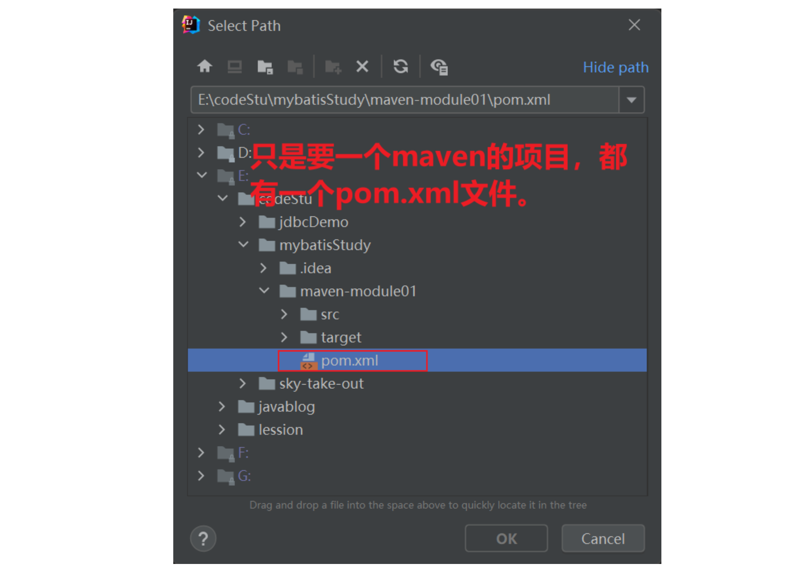
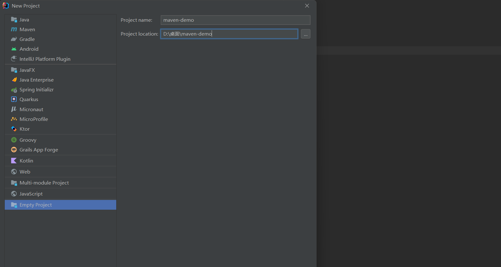
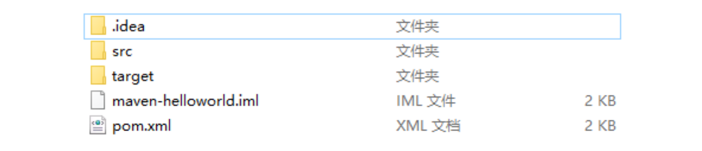
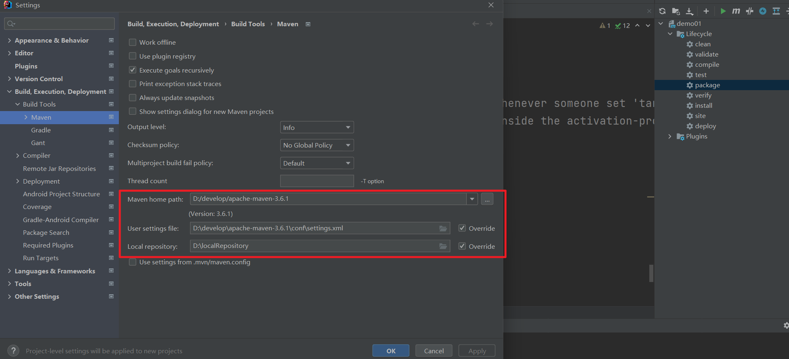

## 一，Maven介绍

### 1，什么是Maven

Apache Maven 是一个项目管理和构建工具，它基于项目对象模型(POM)的概念，通过一小段描述信息来管理项目的构建、报告和文档。官网：http://maven.apache.org/ 

Maven是专门用于管理和构建Java项目的工具，它的主要功能有：

* 提供了一套标准化的项目结构，所有IDE使用Maven构建的项目结构完全一样，所有IDE创建的Maven项目可以通用
* 提供了一套依赖管理机制
* 提供了一套标准化的构建流程（编译，测试，打包，发布……）

标准化的项目结构：


标准化的构建流程（Maven提供了一套简单的命令来完成项目构建）：


依赖管理（依赖管理其实就是管理你项目所依赖的第三方资源，如：jar包、插件…）。传统依赖管理：


Maven依赖管理是使用标准的坐标配置来管理各种依赖，只需要简单的配置就可以完成依赖管理：


### 2，Maven 模型

Maven 模型：


说明：

* 项目对象模型 (Project Object Model)
* 依赖管理模型(Dependency)
* 插件(Plugin)

### 3，仓库


仓库分类：

* 本地仓库：自己计算机上的一个目录
* 中央仓库：由Maven团队维护的全球唯一的仓库，地址：https://repo1.maven.org/maven2/
* 远程仓库(私服)：一般由公司团队搭建的私有仓库

当项目中使用坐标引入对应依赖jar包后，首先会查找本地仓库中是否有对应的jar包：

* 如果有，则在项目直接引用; 
* 如果没有，则去中央仓库中下载对应的jar包到本地仓库。

还可以搭建远程仓库，将来jar包的查找顺序则变为：

* 本地仓库=>远程仓库=>中央仓库

## 二，Maven安装和配置

### 1，Maven的安装和配置

配置步骤如下：

* 解压 apache-maven-3.6.1.rar 既安装完成

  

* 配置环境变量 MAVEN_HOME 为安装路径的bin目录

  

* JAVA_HOME也配置一下，没有就点击新建

  

  

* 配置本地仓库：修改 conf/settings.xml 中的 localRepository 为一个指定目录，localRepository本地仓库目录

  

  上面的目录，必须要有，如下：

  

* 配置阿里云私服：修改 conf/settings.xml 中的 mirrors标签，为其添加如下子标签：

  

配置阿里云私服：

```xml
<mirror>  
    <id>alimaven</id>  
    <name>aliyun maven</name>  
    <url>http://maven.aliyun.com/nexus/content/groups/public/</url>
    <mirrorOf>central</mirrorOf>          
</mirror>
```


## 三，IDEA配置Maven

### 1，IDEA配置Maven环境

第一步：选择 IDEA中 File => Settings


第二步：搜索 maven，设置 IDEA 使用本地安装的 Maven，并修改配置文件路径


### 2，Maven坐标详解

什么是坐标？

* Maven 中的坐标是资源的唯一标识
* 使用坐标来定义项目或引入项目中需要的依赖

Maven 坐标主要组成

* groupId：定义当前Maven项目隶属组织名称（通常是域名反写，例如：com.malu）
* artifactId：定义当前Maven项目名称（通常是模块名称，例如 order-service、goods-service）
* version：定义当前项目版本号


### 3，IDEA创建基于Maven的项目

第一步：先创建一个空的项目，并配置JDK


第二步：创建模块，选择Maven，点击Next


第二步：填写模块名称，坐标信息，点击finish，创建完成


创建完毕后，对应的目录结构如下：


第三步：编写 HelloWorld，并运行，如下：


### 4，IDEA导入别人的Maven项目

第一步：选择右侧Maven面板，点击 + 号


第二步：选中对应项目的pom.xml文件，双击即可



第三步：如果没有Maven面板，选择View=>Appearance=>Tool Window Bars


### 5，IDEA配置Maven插件

第一步：选择 IDEA中 File --> Settings


第二步：选择 Plugins


第三步：搜索 Maven，选择第一个 Maven Helper，点击Install安装，弹出面板中点击Accept


第四步：重启 IDEA


## 四，依赖管理

### 1，使用坐标导入jar包

依赖坐标：https://mvnrepository.com/


使用步骤：

- 第一步：在 pom.xml 中编写 dependencies标签

  

- 第二步：在 dependencies 标签中 使用 dependency引入坐标，定义坐标的 groupId，artifactId，version。点击刷新按钮，使坐标生效

  


再演示一下，下载druid数据库连接池，如下：


看本地仓库，如下：


从maven面板中查看：


### 2，快捷方式

第一步：在 pom.xml 中 按 alt + insert，选择 Dependency


第二步：在弹出的面板中搜索对应坐标，然后双击选中对应坐标


第三步：点击刷新按钮，使坐标生效


### 3，依赖范围

通过设置坐标的依赖范围(scope)，可以设置 对应jar包的作用范围：编译环境、测试环境、运行环境。


依赖范围解释（scope默认值：compile）：


## 五，Maven构建项目

### 1，Maven构建项目

常用命令：

* compile ：编译
* clean：清理
* test：测试
* package：打包
* install：安装

生命周期讲解：Maven 构建项目生命周期描述的是一次构建过程经历经历了多少个事件。Maven 对项目构建的生命周期划分为3套：

* clean：清理工作
* default：核心工作，例如编译，测试，打包，安装等
* site：产生报告，发布站点等


default构建生命周期：


演示编译命令：


演示清理命令：


演示测试命令：


演示打包命令：


演示安装命令，所谓的安装，就是把你写的项目安装到本地仓库：


## 六，Maven知识梳理

### 1，什么是Maven


Maven是一个项目管理工具。它可以帮助程序员构建工程，管理项目中的jar包，编译代码，完成测试，项目打包等...


**作用：**

- 一键构建：我们的项目往往都要经历编译、测试、运行、打包、安装 ，部署等一系列过程，这些过程称之为构建。通过Maven工具，可以使用简单的命令轻松完成构建工作

- 依赖管理：传统的Web项目中，我们必须将工程所依赖的jar包复制到工程中，导致了工程的变得很大。如果一个公司具有相同架构的项目有十个，那么就需要将这一份jar包复制到十个不同的工程中，非常浪费资源。maven工程中不直接将jar包导入到工程中，而是有一个专门存放jar包的仓库，仓库中的每个jar包都有自己的坐标。maven工程中只要配置jar包坐标即可，运行项目需要使用jar包时，根据坐标即可从maven仓库中拿到jar包即可运行。 

  

  


### 2，Maven安装

进入https://maven.apache.org/download.cgi即可完成下载


解压下载好的安装文件，解压后目录结构如下：


目录说明：

- bin：存放maven的命令
- boot：存放maven本身的引导程序，如类加载器等
- conf：存放maven的配置文件
- lib：存放maven本身运行所需的jar包


由于Maven是由Java语言开发的，运行时依赖Java环境，所以要在计算机的环境变量中配置 JAVA_HOME ，如下：


不要忘了，要path环境变量中添加JAVA_HOME，如下：


为了更方便的使用Maven命令，需要在环境变量中配置 MAVEN_HOME和 Path


打开CMD命令窗口，输入 mvn -v ，显示Maven版本和Java版本，证明安装成功


### 3，创建一个基于Maven的项目

创建一个空项目：




创建模块：


设置JDK：


创建完毕后，它的目录结构如下：


每一个maven都有一个pom.xml文件如下：


### 3，Maven工程的类型和结构


工程类型：

- POM工程：POM工程是逻辑工程，Maven并不会对该类型工程做打包处理，这些工程往往不包含具体的业务，而是用来整合其他工程的
- JAR工程：普通Java工程，在打包时会将项目打成jar包。
- WAR工程：JAVA Web工程，在打包时会将项目打成war包。


接下来我们通过一个WAR工程学习Maven工程的结构，目录结构：




说明：

- src：源代码
- target：编译生成的文件
- pom.xml：Maven工程配置文件，如坐标信息等。


项目结构：


说明：

- src/main/java：存放项目的java 文件
- src/main/resources：存放项目资源文件，如配置文件
- src/test/java：存放项目的测试文件
- src/test/resources：存放测试时的资源文件


### 4，构建

书写代码：


使用maven完成项目的构建的过程中，包括：验证、编译、测试、 打包、部署等过程，maven将这些过程规范为项目构建的生命周期。 


在Maven构建项目的每一步都可以使用一句简单的命令完成，接下来我们学习这些命令： 


演示：


可视化操作：


### 5，仓库


本地仓库：

- 本地仓库指用户计算机中的文件夹。用来存储从远程仓库或中央仓库下载的jar包，只有下载到本地仓库的jar包才能使用，项目使用jar包时优先从本地仓库查找。 


远程仓库：

- 远程仓库一般指私服，它是架设在局域网的仓库服务，可以从中央仓库下载资源，供局域网使用，从而减少每个程序员都从中央仓库下载浪费的带宽。
- 如果项目需要的jar包本地仓库没有，则会去远程仓库下载，下载到本地仓库即可使用。
- 远程仓库不是必须配置的，如果本地仓库没有jar包，也没有配置远程仓库，则会直接从中央仓库下载。


中央仓库

- 中央仓库是互联网上的服务器，是Maven提供的最大的仓库，里面拥有最全的jar包资源。 
- 如果项目需要的jar包，本地仓库和远程仓库都没有，则会去中央仓库下载，下载到本地仓库使用。
- Maven中央仓库访问页面：https://mvnrepository.com/


### 6，配置mavne的下载源

* 配置本地仓库：修改 conf/settings.xml 中的 localRepository 为一个指定目录，localRepository本地仓库目录

  

  上面的目录，必须要有，如下：

  

* 配置阿里云私服：修改 conf/settings.xml 中的 mirrors标签，为其添加如下子标签：

  

配置阿里云私服：

```xml
<mirror>  
    <id>alimaven</id>  
    <name>aliyun maven</name>  
    <url>http://maven.aliyun.com/nexus/content/groups/public/</url>
    <mirrorOf>central</mirrorOf>          
</mirror>
```


### 7，IDEA配置Maven环境

配置如下：


如果上面配置完毕了 ，你再去创建一个新的项目，maven的配置还是默认的配置，我想让每次创建项目时，都是上面的maven配置，操作如下：





### 8，Maven插件

第一步：选择 IDEA中 File --> Settings


第二步：选择 Plugins


第三步：搜索 Maven，选择第一个 Maven Helper，点击Install安装，弹出面板中点击Accept


第四步：重启 IDEA


### 9，pom文件中的配置

pom文件最上方是项目基本信息：


说明：

- groupId一般定义项目组名，命名规则使用反向域名。
- artifactId一般定义项目名，命名使用小写字母。项目发布后，它的坐标是groupId+artifactId。 
- version定义版本号。版本号一般有三段，第一段：革命性的产品升级。第二段：新功能版本。第三段：修正一些bug。 
- packaging定义打包方式。


properties 标签中定义一些配置信息：


```xml
<?xml version="1.0" encoding="UTF-8"?>
<project xmlns="http://maven.apache.org/POM/4.0.0"
         xmlns:xsi="http://www.w3.org/2001/XMLSchema-instance"
         xsi:schemaLocation="http://maven.apache.org/POM/4.0.0 http://maven.apache.org/xsd/maven-4.0.0.xsd">
    <modelVersion>4.0.0</modelVersion>

    <groupId>com.malu</groupId>
    <artifactId>demo01</artifactId>
    <version>1.0-SNAPSHOT</version>
    <packaging>jar</packaging>

    <!-- 定义一些配置信息-->
    <properties>
        <!-- java版本，但这个实际没什么用，单做一种描述信息看 -->
        <java.version>1.8</java.version>
        <!-- 实际指定编译版本可以使用如下 -->
        <maven.complier.source>1.8</maven.complier.source>
        <maven.complier.target>1.8</maven.complier.target>
        <project.build.sourceEncoding>UTF-8</project.build.sourceEncoding>
    </properties>
</project>
```


dependencies中定义依赖的jar包坐标：


```xml
<?xml version="1.0" encoding="UTF-8"?>
<project xmlns="http://maven.apache.org/POM/4.0.0"
         xmlns:xsi="http://www.w3.org/2001/XMLSchema-instance"
         xsi:schemaLocation="http://maven.apache.org/POM/4.0.0 http://maven.apache.org/xsd/maven-4.0.0.xsd">
    <modelVersion>4.0.0</modelVersion>

    <groupId>com.malu</groupId>
    <artifactId>demo01</artifactId>
    <version>1.0-SNAPSHOT</version>
    <packaging>jar</packaging>

    <!-- 定义一些配置信息-->
    <properties>
        <!-- java版本，但这个实际没什么用，单做一种描述信息看 -->
        <java.version>1.8</java.version>
        <!-- 实际指定编译版本可以使用如下 -->
        <maven.complier.source>1.8</maven.complier.source>
        <maven.complier.target>1.8</maven.complier.target>
        <project.build.sourceEncoding>UTF-8</project.build.sourceEncoding>
    </properties>

    <dependencies>
        <dependency>
            <groupId>mysql</groupId>
            <artifactId>mysql-connector-java</artifactId>
            <version>5.1.47</version>
        </dependency>
        <dependency>
            <groupId>junit</groupId>
            <artifactId>junit</artifactId>
            <version>4.11</version>
            <scope>test</scope>
        </dependency>
    </dependencies>
</project>
```


plugins 中定义第三方插件：


```xml
<?xml version="1.0" encoding="UTF-8"?>
<project xmlns="http://maven.apache.org/POM/4.0.0"
         xmlns:xsi="http://www.w3.org/2001/XMLSchema-instance"
         xsi:schemaLocation="http://maven.apache.org/POM/4.0.0 http://maven.apache.org/xsd/maven-4.0.0.xsd">
    <modelVersion>4.0.0</modelVersion>

    <groupId>com.malu</groupId>
    <artifactId>demo01</artifactId>
    <version>1.0-SNAPSHOT</version>
    <packaging>jar</packaging>

    <!-- 定义一些配置信息-->
    <properties>
        <!-- java版本，但这个实际没什么用，单做一种描述信息看 -->
        <java.version>1.8</java.version>
        <!-- 实际指定编译版本可以使用如下 -->
        <maven.complier.source>1.8</maven.complier.source>
        <maven.complier.target>1.8</maven.complier.target>
        <project.build.sourceEncoding>UTF-8</project.build.sourceEncoding>
    </properties>

    <dependencies>
        <dependency>
            <groupId>mysql</groupId>
            <artifactId>mysql-connector-java</artifactId>
            <version>5.1.47</version>
        </dependency>
        <dependency>
            <groupId>junit</groupId>
            <artifactId>junit</artifactId>
            <version>4.11</version>
            <scope>test</scope>
        </dependency>
    </dependencies>

    <build>
        <plugins>
            <!-- 配置JDK编译插件 -->
            <plugin>
                <groupId>org.apache.maven.plugins</groupId>
                <artifactId>maven-compiler-plugin</artifactId>
                <version>3.8.1</version>
                <configuration>
                    <source>1.8</source>
                    <target>1.8</target>
                </configuration>
            </plugin>

            <!-- 配置测试运行插件 -->
            <plugin>
                <groupId>org.apache.maven.plugins</groupId>
                <artifactId>maven-surefire-plugin</artifactId>
                <version>2.22.2</version>
                <configuration>
                    <!-- 可以在这里配置测试相关的参数 -->
                </configuration>
            </plugin>
        </plugins>
    </build>
</project>
```


