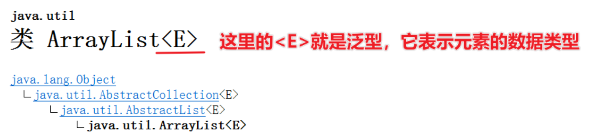

## 一，final关键字


### 1，final关键字介绍


在面向对象编程中偶尔会用到的一个关键字叫final，后面学习抽象类和接口，也需要知道final是什么，所以我们现在来学习一下final关键字。


final关键字是最终的意思，可以修饰类、修饰方法、修饰变量。

- final修饰类：该类称为最终类，特点是不能被继承
- final修饰方法：该方法称之为最终方法，特点是不能被重写
- final修饰变量：该变量只能被赋值一次


代码演示：

```java
// final的作用：修饰类，类不能被继承了
final class A{}
class B extends A{}
```


```java
class C{
    // final修饰方法，方法不能被重写了
    public final void test(){
    }
}

class D extends C{
//    @Override
//    public void test() {
//    }
}
```


```java
class E{
    final String name = "张三";  // final修饰实例变量
    final static String schoolName = "北大"; // final修饰类变量
}

// final修饰变量：该变量只能被赋值一次
public class Test {
    public static void main(String[] args) {

        // 变量有几种？ 局部变量  成员变量（类变量，实例变量）
        final double a = 3.14;
        // a = 3.15; // 第二次赋值

        pay(0.8);

        E e = new E();
        // e.name = "李四";
        // E.schoolName = "清华"; // 第二次赋值

        // 注意事项：
        final int a2 = 10;
        // a2 = 23;

        final int[] arr1 = {10, 20, 30};
        // arr1 = null; // 第二次赋值
        arr1[1] = 222;  // 修改数组的元素是可以的
        System.out.println(arr1[1]);
    }

    public static void pay(final double z){
        // z = 0.9; // 第二次赋值
    }
}
```


### 2，常量


真实开发中，经常使用final来定义常量。

- 被 static final 修饰的成员变量，称之为常量。
- 通常用于记录系统的配置信息


直接上代码：

```java
public class Constant {
    //常量: 定义一个常量表示学校名称
    //为了方便在其他类中被访问所以一般还会加上public修饰符
    //常量命名规范：建议都采用大写字母命名，多个单词之前有_隔开
    public static final String SCHOOL_NAME = "北大";
}

public class FinalDemo2 {
    public static void main(String[] args) {
        //由于常量是static的所以，在使用时直接用类名就可以调用
        System.out.println(Constant.SCHOOL_NAME);
        System.out.println(Constant.SCHOOL_NAME);
        System.out.println(Constant.SCHOOL_NAME);
        System.out.println(Constant.SCHOOL_NAME);
        System.out.println(Constant.SCHOOL_NAME);
        System.out.println(Constant.SCHOOL_NAME);
        System.out.println(Constant.SCHOOL_NAME);
    }
}
```


## 二，抽象


### 1，抽象类介绍

Java中有一个关键字叫abstract，它就是抽象的意思，它可以修饰类也可以修饰方法。

- 被abstract修饰的类，就是抽象类
- 被abstract修饰的方法，就是抽象方法（不允许有方法体）


上代码：

```java
//abstract修饰类，这个类就是抽象类
public abstract class A{
    //abstract修饰方法，这个方法就是抽象方法
    public abstract void test();
}

// 类的成员（成员变量、成员方法、构造器），类的成员都可以有
public abstract class A {
    //成员变量
    private String name;
    static String schoolName;

    //构造方法
    public A(){

    }

    //抽象方法
    public abstract void test();

    //实例方法
    public String getName() {
        return name;
    }

    public void setName(String name) {
        this.name = name;
    }
}
```


抽象类是不能创建对象的，也就是说抽象类不能new，如下：

```java
public class Test {
    public static void main(String[] args) {
        // 抽象类不能创建对象
        A a = new A();
    }
}
```


抽象类虽然不能创建对象，但是它可以作为父类让子类继承。而且子类继承父类必须重写父类的所有抽象方法。

```java
//B类继承A类，必须复写test方法
public class B extends A {
    @Override
    public void test() {

    }
}
```

子类继承父类如果不复写父类的抽象方法，要想不出错，这个子类也必须是抽象类

```java
//B类基础A类，此时B类也是抽象类，这个时候就可以不重写A类的抽象方法
public abstract class B extends A {
}
```


抽象类案例：某宠物游戏，需要管理猫，狗的数据，猫的数据有名字，行为是喵喵喵的叫。狗的数据有名字，行为是汪汪汪的叫。使用面向对象编程设计此程序。


把共同行为提取出一个父类Animal，如下：

```java
public abstract class Animal {
    private String name;

    //动物叫的行为：不具体，是抽象的
    public abstract void cry();

    public String getName() {
        return name;
    }

    public void setName(String name) {
        this.name = name;
    }
}
```


Animal的子类，Dog类：

```java
public class Dog extends Animal{
    public void cry(){
        System.out.println(getName() + "汪汪汪的叫~~");
    }
}
```


Animal的子类，Cat类：

```java
public class Cat extends Animal{
    public void cry(){
        System.out.println(getName() + "喵喵喵的叫~~");
    }
}
```


测试类：

```java
public class Test {
    public static void main(String[] args) {
        // 目标：掌握抽象类的使用场景和好处.
        Animal a = new Dog();
        a.cry();	//这时执行的是Dog类的cry方法
    }
}
```


假设现在系统有需要加一个Pig类，也有叫的行为，这时候也很容易原有功能扩展。只需要让Pig类继承Animal，复写cry方法就行。

```java
public class Pig extends Animal{
    @Override
    public void cry() {
        System.out.println(getName() + "嚯嚯嚯~~~");
    }
}
```


抽象类的使用场景和好处：

- 用抽象类可以把父类中相同的代码，包括方法声明都抽取到父类，这样能更好的支持多态，一提高代码的灵活性。
- 反过来用，我们不知道系统未来具体的业务实现时，我们可以先定义抽象类，将来让子类去实现，以方便系统的扩展。


### 2，模板方法模式

**设计模式是解决某一类问题的最优方案**。模板方法模式主要解决方法中存在重复代码的问题，比如A类和B类都有sing()方法，sing()方法的开头和结尾都是一样的，只是中间一段内容不一样。此时A类和B类的sing()方法中就存在一些相同的代码。如下：


怎么解决上面的重复代码问题呢？ 我们可以写一个抽象类C类，在C类中写一个doSing()的抽象方法。再写一个sing()方法，代码如下：

```java
// 模板方法设计模式
public abstract class C {
    // 模板方法
    public final void sing(){
        System.out.println("唱一首你喜欢的歌：");

        doSing();

        System.out.println("唱完了!");
    }

    public abstract void doSing();
}
```


A类继承C类，复写doSing()方法：

```java
public class A extends C{
    @Override
    public void doSing() {
        System.out.println("我是一只小小小小鸟，想要飞就能飞的高~~~");
    }
}
```


B类继承C类，也复写doSing()方法：

```java
public class B extends C{
    @Override
    public void doSing() {
        System.out.println("我们一起学猫叫，喵喵喵喵喵喵喵~~");
    }
}
```


测试类：

```java
public class Test {
    public static void main(String[] args) {
        B b = new B();
        b.sing();
    }
}
```


模板方法模式解决了多个子类中有相同代码的问题。具体实现步骤如下

- 第1步：定义一个抽象类，把子类中相同的代码写成一个模板方法。
- 第2步：把模板方法中不能确定的代码写成抽象方法，并在模板方法中调用。
- 第3步：子类继承抽象类，只需要父类抽象方法就可以了。


## 三，接口


### 1，什么是接口

接口是比抽象类抽象得更加彻底的一种特殊结构。Java已经发展了20多年了，在发展的过程中不同JDK版本的接口也有一些变化，所以我们在学习接口时，先以老版本为基础，学习完老版本接口的特性之后，再顺带着了解一些新版本接口的特性。定义接口使用interface关键字，格式如下：

```java
public interface 接口名{
    //成员变量（常量）
    //成员方法（抽象方法）
}
```


定义一个接口如下：

```java
public interface A{
    //这里public static final可以加，可以不加。
    public static final String SCHOOL_NAME = "北大";
    
    //这里的public abstract可以加，可以不加。
    public abstract void test();
}
```


测试类：

```java
public class Test{
    public static void main(String[] args){
        //打印A接口中的常量
        System.out.println(A.SCHOOL_NAME);
        
        //接口是不能创建对象的
        A a = new A();
    }
}
```


定义好接口之后，是不能创建对象的。那接口到底有使用呢？

- 接口是用来被类实现（implements）的，我们称之为实现类。
- 个类是可以实现多个接口的（接口可以理解成干爹），类实现接口必须重写所有接口的全部抽象方法，否则这个类也必须是抽象类


定义一个B接口，如下：

```java
public interface B {
    void testb1();
    void testb2();
}
```


定义一个C接口，里面有两个方法testc1(), testc2()，如下：

```java
public interface C {
    void testc1();
    void testc2();
}
```


实现类D，同时实现B接口和C接口，此时就需要复写四个方法，如下：

```java
// 实现类
public class D implements B, C{
    @Override
    public void testb1() {

    }

    @Override
    public void testb2() {

    }

    @Override
    public void testc1() {

    }

    @Override
    public void testc2() {

    }
}
```


测试类：

```java
public class Test {
    public static void main(String[] args) {
        D d = new D();
    }
}
```


接口到底有什么好处？

- 弥补了类单继承的不足，一个类同时可以实现多个接口。
- 让程序可以面向接口编程，这样程序员可以灵活方便的切换各种业务实现。


案例：假设有一个Studnet学生类，还有一个Driver司机的接口，还有一个Singer歌手的接口。写一个A类，想让他既是学生，偶然也是司机能够开车，偶尔也是歌手能够唱歌。

```java
class Student{

}

interface Driver{
    void drive();
}

interface Singer{
    void sing();
}


//A类是Student的子类，同时也实现了Dirver接口和Singer接口
class A extends Student implements Driver, Singer{
    @Override
    public void drive() {

    }

    @Override
    public void sing() {

    }
}

public class Test {
    public static void main(String[] args) {
        //想唱歌的时候，A类对象就表现为Singer类型
        Singer s = new A();
        s.sing();
		
        //想开车的时候，A类对象就表现为Driver类型
        Driver d = new A();
        d.drive();
    }
}
```


### 2，接口案例


设计一个班级学生信息管理模块：

- 数据有：姓名，性别，成绩
- 功能1：打印出全班学生信息
- 功能2：打印出全班学生的平均成绩


以上功能的业务实现有多套方案：

- 方案1：能打印出班级全部学生信息，能打印出班级全部学生的平均分
- 方案2：能打印出班级全部学生信息（包含男女人数），能打印出班级全部学生的平均分（要求去掉最高分，最低分）。


为了实现上面的两种方案，需要你设计的系统可以支持灵活的切换这些方案。先定义学生实体类，如下：

```java
public class Student {
    private String name;
    private char sex;
    private double score;

    public Student() {
    }

    public Student(String name, char sex, double score) {
        this.name = name;
        this.sex = sex;
        this.score = score;
    }

    public String getName() {
        return name;
    }

    public void setName(String name) {
        this.name = name;
    }

    public char getSex() {
        return sex;
    }

    public void setSex(char sex) {
        this.sex = sex;
    }

    public double getScore() {
        return score;
    }

    public void setScore(double score) {
        this.score = score;
    }
}
```


写一个StudentOperator接口，表示学生信息管理系统的两个功能。使用接口来表示它具备什么样的能力，如下：

```java
public interface StudentOperator {
    void printAllInfo(ArrayList<Student> students);
    void printAverageScore(ArrayList<Student> students);
}
```


写一个StudentOperator接口的实现类StudentOperatorImpl1，采用第1套方案对业务进行实现。如下：

```java
public class StudentOperatorImpl1 implements StudentOperator{
    @Override
    public void printAllInfo(ArrayList<Student> students) {
        System.out.println("----------全班全部学生信息如下--------------");
        for (int i = 0; i < students.size(); i++) {
            Student s = students.get(i);
            System.out.println("姓名：" + s.getName() + ", 性别：" + s.getSex() + ", 成绩：" + s.getScore());
        }
        System.out.println("-----------------------------------------");
    }

    @Override
    public void printAverageScore(ArrayList<Student> students) {
        double allScore = 0.0;
        for (int i = 0; i < students.size(); i++) {
            Student s = students.get(i);
            allScore += s.getScore();
        }
        System.out.println("平均分：" + (allScore) / students.size());
    }
}
```


再写一个StudentOperator接口的实现类StudentOperatorImpl2，采用第2套方案对业务进行实现。如下：

```java
public class StudentOperatorImpl2 implements StudentOperator{
    @Override
    public void printAllInfo(ArrayList<Student> students) {
        System.out.println("----------全班全部学生信息如下--------------");
        int count1 = 0;
        int count2 = 0;
        for (int i = 0; i < students.size(); i++) {
            Student s = students.get(i);
            System.out.println("姓名：" + s.getName() + ", 性别：" + s.getSex() + ", 成绩：" + s.getScore());
            if(s.getSex() == '男'){
                count1++;
            }else {
                count2 ++;
            }
        }
        System.out.println("男生人数是：" + count1  + ", 女士人数是：" + count2);
        System.out.println("班级总人数是：" + students.size());
        System.out.println("-----------------------------------------");
    }

    @Override
    public void printAverageScore(ArrayList<Student> students) {
        double allScore = 0.0;
        double max = students.get(0).getScore();
        double min = students.get(0).getScore();
        for (int i = 0; i < students.size(); i++) {
            Student s = students.get(i);
            if(s.getScore() > max) max = s.getScore();
            if(s.getScore() < min) min = s.getScore();
            allScore += s.getScore();
        }
        System.out.println("学生的最高分是：" + max);
        System.out.println("学生的最低分是：" + min);
        System.out.println("平均分：" + (allScore - max - min) / (students.size() - 2));
    }
}
```


再写一个班级管理类ClassManager，在班级管理类中使用StudentOperator的实现类StudentOperatorImpl1对学生进行操作：

```java
public class ClassManager {
    private ArrayList<Student> students = new ArrayList<>();
    private StudentOperator studentOperator = new StudentOperatorImpl1();

    public ClassManager(){
        students.add(new Student("迪丽热巴", '女', 99));
        students.add(new Student("古力娜扎", '女', 100));
        students.add(new Student("马尔扎哈", '男', 80));
        students.add(new Student("卡尔扎巴", '男', 60));
    }

    // 打印全班全部学生的信息
    public void printInfo(){
        studentOperator.printAllInfo(students);
    }

    // 打印全班全部学生的平均分
    public void printScore(){
        studentOperator.printAverageScore(students);
    }
}
```


最后，再写一个测试类Test，在测试类中使用ClassMananger完成班级学生信息的管理。如下：

```java
public class Test {
    public static void main(String[] args) {
        // 目标：完成班级学生信息管理的案例。
        ClassManager clazz = new ClassManager();
        clazz.printInfo();
        clazz.printScore();
    }
}
```


如果想切换班级管理系统的业务功能，随时可以将StudentOperatorImpl1切换为StudentOperatorImpl2。


### 3，JDK8新特性


随着JDK版本的升级，在JDK8版本以后接口中能够定义的成员也做了一些更新，从JDK8开始，接口中新增的三种方法形式。JDK8对接口新增的特性，有利于对程序进行扩展。代码如下：

```java
public interface A {
    /**
     * 1、默认方法：必须使用default修饰，默认会被public修饰
     * 实例方法：对象的方法，必须使用实现类的对象来访问。
     */
    default void test1(){
        System.out.println("===默认方法==");
        test2();
    }

    /**
     * 2、私有方法：必须使用private修饰。(JDK 9开始才支持的)
     *   实例方法：对象的方法。
     */
    private void test2(){
        System.out.println("===私有方法==");
    }

    /**
     * 3、静态方法：必须使用static修饰，默认会被public修饰
     */
     static void test3(){
        System.out.println("==静态方法==");
     }

     void test4();
     void test5();
     default void test6(){

     }
}
```


写一个B类，实现A接口。B类作为A接口的实现类，只需要重写抽象方法就尅了，对于默认方法不需要子类重写。代码如下：

```java
public class B implements A{
    @Override
    public void test4() {

    }

    @Override
    public void test5() {

    }
}
```


测试类，观察接口中的三种方法，是如何调用的：

```java
public class Test {
    public static void main(String[] args) {
        // 目标：掌握接口新增的三种方法形式
        B b = new B();
        b.test1();	//默认方法使用对象调用
        // b.test2();	//A接口中的私有方法，B类调用不了
        A.test3();	//静态方法，使用接口名调用
    }
}
```


### 4，接口细节


使用接口的其他细节之一，一个接口可以继承多个接口：

```java
interface A{
    void test1();
}
interface B{
    void test2();
}
interface C{}

//比如：D接口继承C、B、A
interface D extends C, B, A{

}

//E类在实现D接口时，必须重写D接口、以及其父类中的所有抽象方法。
class E implements D{
    @Override
    public void test1() {

    }

    @Override
    public void test2() {

    }
}
```


## 三，内部类


### 1，什么是内部类

内部类是类中的五大成分之一（成员变量、方法、构造器、内部类、代码块），如果一个类定义在另一个类的内部，这个类就是内部类。当一个类的内部，包含一个完整的事物，且这个事物没有必要单独设计时，就可以把这个事物设计成内部类。比如：汽车、的内部有发动机，发动机是包含在汽车内部的一个完整事物，可以把发动机设计成内部类。如下：

```java
public class Car{
	//内部类
    public class Engine{
        
    }
}
```


内部类有四种形式：

- 成员内部类
- 静态内部类
- 局部内部类
- 匿名内部类


### 2，成员内部类

成员内部类就是类中的一个普通成员，类似于成员变量、成员方法。代码如下：

```java
public class Outer {
    private int age = 99;
    public static String a="中国";

    // 成员内部类
    public class Inner{
        private String name;
        private  int age = 88;

        //在内部类中既可以访问自己类的成员，也可以访问外部类的成员
        public void test(){
            System.out.println(age); //88
            System.out.println(a);   //中国

            int age = 77;
            System.out.println(age); //77
            System.out.println(this.age); //88
            System.out.println(Outer.this.age); //99
        }

        public String getName() {
            return name;
        }

        public void setName(String name) {
            this.name = name;
        }

        public int getAge() {
            return age;
        }

        public void setAge(int age) {
            this.age = age;
        }
    }
}
```


成员内部类创建对象：

```java
//外部类.内部类 变量名 = new 外部类().new 内部类();
Outer.Inner in = new Outer().new Inner();
//调用内部类的方法
in.test();
```


内部类访问成员的特点:

- 既可以访问内部类成员、也可以访问外部类成员
- 如果内部类成员和外部类成员同名，可以使用**`类名.this.成员`**区分


### 3，静态内部类

静态内部类，其实就是在成员内部类的前面加了一个static关键字。静态内部类属于外部类自己持有。代码如下：

```java
public class Outer {
    private int age = 99;
    public static String schoolName="北大";

    // 静态内部类
    public static class Inner{
        //静态内部类访问外部类的静态变量，是可以的；
        //静态内部类访问外部类的实例变量，是不行的
        public void test(){
            System.out.println(schoolName); //99
            //System.out.println(age);   //报错
        }
    }
}
```


静态内部类创建对象时，需要使用外部类的类名调用。如下：

```java
//格式：外部类.内部类 变量名 = new 外部类.内部类();
Outer.Inner in = new Outer.Inner();
in.test();
```


### 4，局部内部类

局部内部类是定义在方法中的类，和局部变量一样，只能在方法中有效。所以局部内部类的局限性很强，一般在开发中是不会使用的。如下：

```java
public class Outer{
    public void test(){
        //局部内部类
        class Inner{
            public void show(){
                System.out.println("Inner...show");
            }
        }
        //局部内部类只能在方法中创建对象，并使用
        Inner in = new Inner();
        in.show();
    }
}
```


### 5，匿名内部类

实际开发中用得最多的一种内部类，叫匿名内部类。相比于前面几种内部类，匿名内部类就比较重要的。它是一种特殊的局部内部类；所谓匿名，指的是程序员不需要为这个类声明名字。格式如下：

```java
new 父类/接口(参数值){
    @Override
    重写父类/接口的方法;
}
```

匿名内部类本质上是一个没有名字的子类对象、或者接口的实现类对象。比如，先定义一个Animal抽象类，里面定义一个cry()方法，表示所有的动物有叫的行为，但是因为动物还不具体，cry()这个行为并不能具体化，所以写成抽象方法。如下：

```java
public abstract class Animal{
    public abstract void cry();
}
```


接下来，我想要在不定义子类的情况下创建Animal的子类对象，就可以使用匿名内部类，如下：

```java
public class Test{
    public static void main(String[] args){
        //这里后面new 的部分，其实就是一个Animal的子类对象
        //这里隐含的有多态的特性： Animal a = Animal子类对象;
        Animal a = new Animal(){
            @Override
            public void cry(){
                System.out.println("猫喵喵喵的叫~~~");
            }
        }
        a.eat(); //直线上面重写的cry()方法
    }
}
```


需要注意的是，匿名内部类在编写代码时没有名字，编译后系统会为自动为匿名内部类生产字节码，字节码的名称会以`外部类$1.class`的方法命名，如下：


匿名内部类的作用：

- 简化了创建子类对象、实现类对象的书写格式。


### 6，匿名内部类的应用场景

在调用方法时，当方法的形参是一个接口或者抽象类，为了简化代码书写，而直接传递匿名内部类对象给方法。这样就可以少写一个类。如下：

```java
public class Test{
    public static void main(String[] args){
        Swimming s1 = new Swimming(){
            public void swim(){
                System.out.println("狗刨飞快");
            }
        };
        go(s1);
        
        Swimming s1 = new Swimming(){
            public void swim(){
                System.out.println("猴子游泳也还行");
            }
        };
        go(s1);
    }
    //形参是Swimming接口，实参可以接收任意Swimming接口的实现类对象
    public static void go(Swimming s){
        System.out.println("开始~~~~~~~~");
        s.swim();
        System.out.println("结束~~~~~~~~");
    }
}
```


## 四，枚举


### 1，什么是枚举

枚举是一种特殊的类，它的格式是：

```java
public enum 枚举类名{
    枚举项1,枚举项2,枚举项3;
}
```


枚举项就表示枚举类的对象，只是这些对象在定义枚举类时就预先写好了，以后就只能用这几个固定的对象。定义一个枚举类A，在枚举类中定义三个枚举项X, Y, Z。如下：

```java
public enum A{
    X,Y,Z;
}
```


获取枚举类中的枚举项，只需要用类名调用就可以了：

```java
public class Test{
    public static void main(String[] args){
        //获取枚举A类的，枚举项
        A a1 = A.X;
        A a2 = A.Y;
        A a3 = A.Z;
    }
}
```


枚举项实际上是枚举类的对象，这一点其实可以通过反编译的形式来验证（需要用到反编译的命令，这里不能直接将字节码拖进idea反编译）。通过javap 工具进行反编译，如下：

```java

```

我们会看到，枚举类A是用class定义的，说明枚举确实是一个类，而且X，Y，Z都是A类的对象；而且每一个枚举项都是被`public static final `修饰，所以被可以类名调用，而且不能更改。


既然枚举是一个类的话，我们能不能在枚举类中定义构造器、成员变量、成员方法呢？答案是可以的。代码如下：

```java
public enum A{
    //定义枚举项
    X,Y,Z("张三"); //枚举项后面加括号，就是在执行枚举类的带参数构造方法。
    
    //定义空构造器
    public A(){
        
    }
    
    //成员变量
    private String name;
    //定义带参数构造器
    public A(String name){
        this.name=name;
    }
    
    //成员方法
    public String getName(){
        return name;
    }
    ...
}
```

虽然枚举类中可以像类一样，写一些类的其他成员，但是一般不会这么写，如果你真要这么干的话，到不如直接写普通类来的直接。


### 2，枚举的应用场景

枚举一般表示一组信息(一般表示几个固定的值)，然后作为参数进行传输。比如我们现在有这么一个应用，用户进入应用时，需要让用户选择是女生、还是男生，然后系统会根据用户选择的是男生，还是女生推荐不同的信息给用户观看。


这里我们就可以先定义一个枚举类，用来表示男生、或者女生，如下：

```java
public class Constant{
    BOY,GRIL
}
```


测试类，完成用户进入系统后的选择，如下：

```java
public class Test{
    public static void main(String[] args){
        //调用方法，传递男生
        provideInfo(Constant.BOY);
    }
    
    public static void provideInfo(Constant c){
        switch(c){
            case BOY:
                System.out.println("展示一些信息给男生看");
                break;
            case GRIL:
                System.out.println("展示一些信息给女生看");
                break;
        }
    }
}
```


## 五，泛型


### 1，什么是泛型

所谓泛型指的是，在定义类、接口、方法时，同时声明了一个或者多个类型变量（如：E），称为泛型类、泛型接口、泛型方法、它们统称为泛型。前面学过的ArrayList类就是一个泛型类，我们可以打开API文档看一下ArrayList类的声明。




ArrayList集合的设计者在定义ArrayList集合时，就已经明确ArrayList集合时给别人装数据用的，但是别人用ArrayList集合时候，装什么类型的数据他不知道，所以就用一个`E`表示元素的数据类型。当别人使用ArrayList集合创建对象时，`new ArrayList<String> `就表示元素为String类型，`new ArrayList<Integer>`表示元素为Integer类型。代码如下：

```java
public class Test {
    public static void main(String[] args) {
        // 目标：认识泛型
        ArrayList list = new ArrayList();
        list.add("java1");
        list.add("java2");
        list.add("java3");
        // list.add(new Cat());

        for (int i = 0; i < list.size(); i++) {
            String e = (String) list.get(i);
            System.out.println(e);
        }

        System.out.println("-----------------------------------");
//        ArrayList<String> list1 = new ArrayList<String>();
        ArrayList<String> list1 = new ArrayList<>(); // JDK 1.7开始，后面的数据类型可以不声明
        list1.add("java1");
        list1.add("java2");
        list1.add("java3");
        // list1.add(new Cat());

        for (int i = 0; i < list1.size(); i++) {
            String e = list1.get(i);
            System.out.println(e);
        }

    }
}
```

总结一下泛型的作用、本质：

- **泛型的好处：在编译阶段可以避免出现一些非法的数据。**
- **泛型的本质：把具体的数据类型传递给类型变量。**


### 2，自定义泛型类


### 3，自定义泛型接口


### 4，泛型方法


### 5，泛型限定


### 6，泛型擦除


