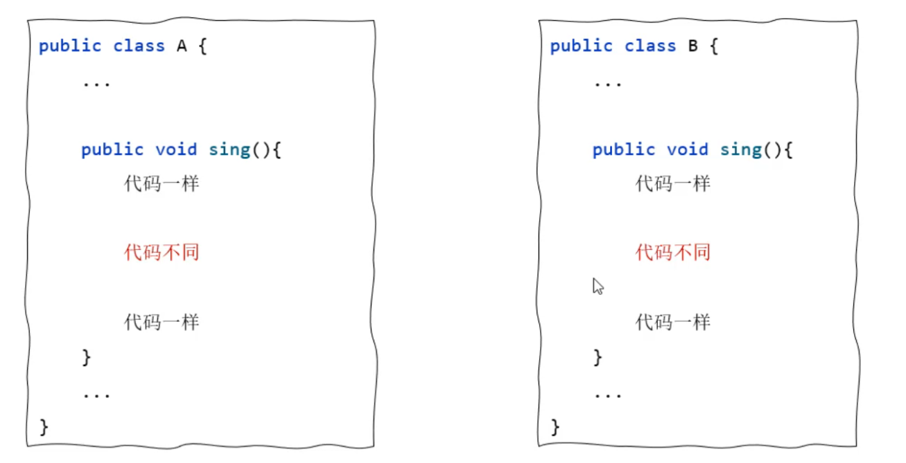

## 一，final关键字


### 1，final关键字介绍


在面向对象编程中偶尔会用到的一个关键字叫final，后面学习抽象类和接口，也需要知道final是什么，所以我们现在来学习一下final关键字。


final关键字是最终的意思，可以修饰类、修饰方法、修饰变量。

- final修饰类：该类称为最终类，特点是不能被继承
- final修饰方法：该方法称之为最终方法，特点是不能被重写
- final修饰变量：该变量只能被赋值一次


代码演示：

```java
// final的作用：修饰类，类不能被继承了
final class A{}
class B extends A{}
```


```java
class C{
    // final修饰方法，方法不能被重写了
    public final void test(){
    }
}

class D extends C{
//    @Override
//    public void test() {
//    }
}
```


```java
class E{
    final String name = "张三";  // final修饰实例变量
    final static String schoolName = "北大"; // final修饰类变量
}

// final修饰变量：该变量只能被赋值一次
public class Test {
    public static void main(String[] args) {

        // 变量有几种？ 局部变量  成员变量（类变量，实例变量）
        final double a = 3.14;
        // a = 3.15; // 第二次赋值

        pay(0.8);

        E e = new E();
        // e.name = "李四";
        // E.schoolName = "清华"; // 第二次赋值

        // 注意事项：
        final int a2 = 10;
        // a2 = 23;

        final int[] arr1 = {10, 20, 30};
        // arr1 = null; // 第二次赋值
        arr1[1] = 222;  // 修改数组的元素是可以的
        System.out.println(arr1[1]);
    }

    public static void pay(final double z){
        // z = 0.9; // 第二次赋值
    }
}
```


### 2，常量


真实开发中，经常使用final来定义常量。

- 被 static final 修饰的成员变量，称之为常量。
- 通常用于记录系统的配置信息


直接上代码：

```java
public class Constant {
    //常量: 定义一个常量表示学校名称
    //为了方便在其他类中被访问所以一般还会加上public修饰符
    //常量命名规范：建议都采用大写字母命名，多个单词之前有_隔开
    public static final String SCHOOL_NAME = "北大";
}

public class FinalDemo2 {
    public static void main(String[] args) {
        //由于常量是static的所以，在使用时直接用类名就可以调用
        System.out.println(Constant.SCHOOL_NAME);
        System.out.println(Constant.SCHOOL_NAME);
        System.out.println(Constant.SCHOOL_NAME);
        System.out.println(Constant.SCHOOL_NAME);
        System.out.println(Constant.SCHOOL_NAME);
        System.out.println(Constant.SCHOOL_NAME);
        System.out.println(Constant.SCHOOL_NAME);
    }
}
```


## 二，抽象


### 1，抽象类介绍

Java中有一个关键字叫abstract，它就是抽象的意思，它可以修饰类也可以修饰方法。

- 被abstract修饰的类，就是抽象类
- 被abstract修饰的方法，就是抽象方法（不允许有方法体）


上代码：

```java
//abstract修饰类，这个类就是抽象类
public abstract class A{
    //abstract修饰方法，这个方法就是抽象方法
    public abstract void test();
}

// 类的成员（成员变量、成员方法、构造器），类的成员都可以有
public abstract class A {
    //成员变量
    private String name;
    static String schoolName;

    //构造方法
    public A(){

    }

    //抽象方法
    public abstract void test();

    //实例方法
    public String getName() {
        return name;
    }

    public void setName(String name) {
        this.name = name;
    }
}
```


抽象类是不能创建对象的，也就是说抽象类不能new，如下：

```java
public class Test {
    public static void main(String[] args) {
        // 抽象类不能创建对象
        A a = new A();
    }
}
```


抽象类虽然不能创建对象，但是它可以作为父类让子类继承。而且子类继承父类必须重写父类的所有抽象方法。

```java
//B类继承A类，必须复写test方法
public class B extends A {
    @Override
    public void test() {

    }
}
```

子类继承父类如果不复写父类的抽象方法，要想不出错，这个子类也必须是抽象类

```java
//B类基础A类，此时B类也是抽象类，这个时候就可以不重写A类的抽象方法
public abstract class B extends A {
}
```


抽象类案例：某宠物游戏，需要管理猫，狗的数据，猫的数据有名字，行为是喵喵喵的叫。狗的数据有名字，行为是汪汪汪的叫。使用面向对象编程设计此程序。


把共同行为提取出一个父类Animal，如下：

```java
public abstract class Animal {
    private String name;

    //动物叫的行为：不具体，是抽象的
    public abstract void cry();

    public String getName() {
        return name;
    }

    public void setName(String name) {
        this.name = name;
    }
}
```


Animal的子类，Dog类：

```java
public class Dog extends Animal{
    public void cry(){
        System.out.println(getName() + "汪汪汪的叫~~");
    }
}
```


Animal的子类，Cat类：

```java
public class Cat extends Animal{
    public void cry(){
        System.out.println(getName() + "喵喵喵的叫~~");
    }
}
```


测试类：

```java
public class Test {
    public static void main(String[] args) {
        // 目标：掌握抽象类的使用场景和好处.
        Animal a = new Dog();
        a.cry();	//这时执行的是Dog类的cry方法
    }
}
```


假设现在系统有需要加一个Pig类，也有叫的行为，这时候也很容易原有功能扩展。只需要让Pig类继承Animal，复写cry方法就行。

```java
public class Pig extends Animal{
    @Override
    public void cry() {
        System.out.println(getName() + "嚯嚯嚯~~~");
    }
}
```


抽象类的使用场景和好处：

- 用抽象类可以把父类中相同的代码，包括方法声明都抽取到父类，这样能更好的支持多态，一提高代码的灵活性。
- 反过来用，我们不知道系统未来具体的业务实现时，我们可以先定义抽象类，将来让子类去实现，以方便系统的扩展。


### 2，模板方法模式

**设计模式是解决某一类问题的最优方案**。模板方法模式主要解决方法中存在重复代码的问题，比如A类和B类都有sing()方法，sing()方法的开头和结尾都是一样的，只是中间一段内容不一样。此时A类和B类的sing()方法中就存在一些相同的代码。如下：




怎么解决上面的重复代码问题呢？ 我们可以写一个抽象类C类，在C类中写一个doSing()的抽象方法。再写一个sing()方法，代码如下：

```java
// 模板方法设计模式
public abstract class C {
    // 模板方法
    public final void sing(){
        System.out.println("唱一首你喜欢的歌：");

        doSing();

        System.out.println("唱完了!");
    }

    public abstract void doSing();
}
```


A类继承C类，复写doSing()方法：

```java
public class A extends C{
    @Override
    public void doSing() {
        System.out.println("我是一只小小小小鸟，想要飞就能飞的高~~~");
    }
}
```


B类继承C类，也复写doSing()方法：

```java
public class B extends C{
    @Override
    public void doSing() {
        System.out.println("我们一起学猫叫，喵喵喵喵喵喵喵~~");
    }
}
```


测试类：

```java
public class Test {
    public static void main(String[] args) {
        B b = new B();
        b.sing();
    }
}
```


模板方法模式解决了多个子类中有相同代码的问题。具体实现步骤如下

- 第1步：定义一个抽象类，把子类中相同的代码写成一个模板方法。
- 第2步：把模板方法中不能确定的代码写成抽象方法，并在模板方法中调用。
- 第3步：子类继承抽象类，只需要父类抽象方法就可以了。


## 三，接口


### 1，什么是接口

接口是比抽象类抽象得更加彻底的一种特殊结构。Java已经发展了20多年了，在发展的过程中不同JDK版本的接口也有一些变化，所以我们在学习接口时，先以老版本为基础，学习完老版本接口的特性之后，再顺带着了解一些新版本接口的特性。定义接口使用interface关键字，格式如下：

```java
public interface 接口名{
    //成员变量（常量）
    //成员方法（抽象方法）
}
```


定义一个接口如下：

```java
public interface A{
    //这里public static final可以加，可以不加。
    public static final String SCHOOL_NAME = "北大";
    
    //这里的public abstract可以加，可以不加。
    public abstract void test();
}
```


测试类：

```java
public class Test{
    public static void main(String[] args){
        //打印A接口中的常量
        System.out.println(A.SCHOOL_NAME);
        
        //接口是不能创建对象的
        A a = new A();
    }
}
```


定义好接口之后，是不能创建对象的。那接口到底有使用呢？

- 接口是用来被类实现（implements）的，我们称之为实现类。
- 个类是可以实现多个接口的（接口可以理解成干爹），类实现接口必须重写所有接口的全部抽象方法，否则这个类也必须是抽象类


定义一个B接口，如下：

```java
public interface B {
    void testb1();
    void testb2();
}
```


定义一个C接口，里面有两个方法testc1(), testc2()，如下：

```java
public interface C {
    void testc1();
    void testc2();
}
```


实现类D，同时实现B接口和C接口，此时就需要复写四个方法，如下：

```java
// 实现类
public class D implements B, C{
    @Override
    public void testb1() {

    }

    @Override
    public void testb2() {

    }

    @Override
    public void testc1() {

    }

    @Override
    public void testc2() {

    }
}
```


测试类：

```java
public class Test {
    public static void main(String[] args) {
        D d = new D();
    }
}
```


接口到底有什么好处？

- 弥补了类单继承的不足，一个类同时可以实现多个接口。
- 让程序可以面向接口编程，这样程序员可以灵活方便的切换各种业务实现。


案例：假设有一个Studnet学生类，还有一个Driver司机的接口，还有一个Singer歌手的接口。写一个A类，想让他既是学生，偶然也是司机能够开车，偶尔也是歌手能够唱歌。

```java
class Student{

}

interface Driver{
    void drive();
}

interface Singer{
    void sing();
}


//A类是Student的子类，同时也实现了Dirver接口和Singer接口
class A extends Student implements Driver, Singer{
    @Override
    public void drive() {

    }

    @Override
    public void sing() {

    }
}

public class Test {
    public static void main(String[] args) {
        //想唱歌的时候，A类对象就表现为Singer类型
        Singer s = new A();
        s.sing();
		
        //想开车的时候，A类对象就表现为Driver类型
        Driver d = new A();
        d.drive();
    }
}
```


### 2，接口案例


### 3，JDK8新特性


### 4，接口细节


