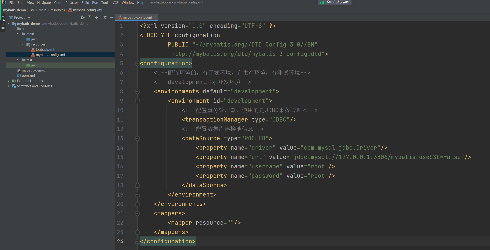
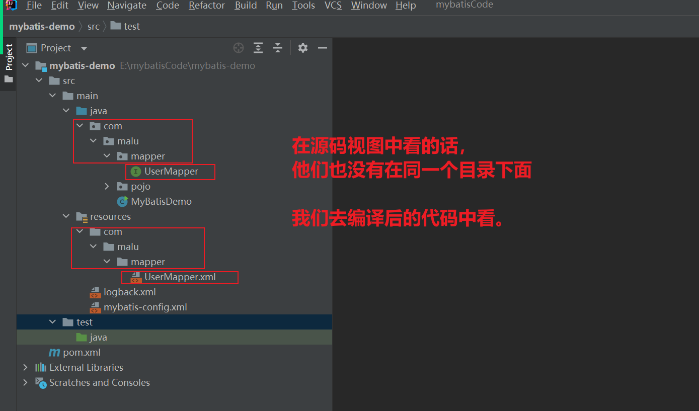
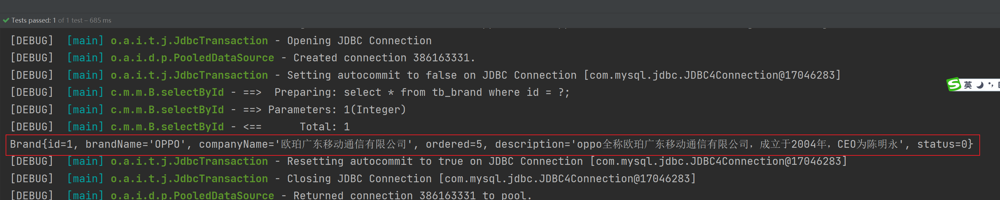
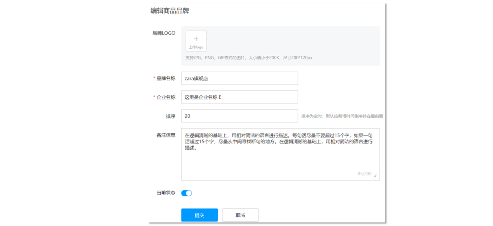

## 一，MyBatis介绍

### 1，Mybatis介绍和优势

MyBatis 是一款优秀的**持久层**框架，用于简化 JDBC 开发。它本是 Apache 的一个开源项目iBatis, 2010年这个项目由apache software foundation 迁移到了google code，并且改名为MyBatis 。2013年11月迁移到Github。

官网：https://mybatis.org/mybatis-3/zh/index.html 

什么是持久层：

* 所谓持久层就是负责将数据到保存到数据库的那一层代码。JavaEE三层架构：表现层、业务层、**持久层**。

什么是框架：

* 框架就是一个半成品软件，是一套可重用的、通用的、软件基础代码模型。在框架的基础之上构建软件编写更加高效、规范、通用、可扩展。

为什么是学习Mybatis呢，首先我们要了解JDBC的缺点：


使用MyBatis简化：


MyBatis 免除了几乎所有的 JDBC 代码，以及设置参数和获取结果集的工作。

## 二，MyBatis 快速入门

### 1，准备数据库


SQL文件如下:

```mysql
create database mybatis;
use mybatis;

drop table if exists tb_user;

create table tb_user(
	id int primary key auto_increment,
	username varchar(20),
	password varchar(20),
	gender char(1),
	addr varchar(30)
);

INSERT INTO tb_user VALUES (1, 'malu', '123', '男', '北京');
INSERT INTO tb_user VALUES (2, 'wc', '456', '女', '天津');
INSERT INTO tb_user VALUES (3, 'xq', '789', '男', '西安');
```

### 2，创建模块，导入坐标

先创建一个空项目，并设置，如下：


创建模块，如下：


设置maven，如下：


导入坐标：


参考，大家直接copy：

```xml
<?xml version="1.0" encoding="UTF-8"?>
<project xmlns="http://maven.apache.org/POM/4.0.0"
         xmlns:xsi="http://www.w3.org/2001/XMLSchema-instance"
         xsi:schemaLocation="http://maven.apache.org/POM/4.0.0 http://maven.apache.org/xsd/maven-4.0.0.xsd">
    <modelVersion>4.0.0</modelVersion>

    <groupId>com.malu</groupId>
    <artifactId>mybatis-demo</artifactId>
    <version>1.0-SNAPSHOT</version>

    <properties>
        <maven.compiler.source>8</maven.compiler.source>
        <maven.compiler.target>8</maven.compiler.target>
    </properties>

    <dependencies>
        <!--mybatis依赖-->
        <dependency>
            <groupId>org.mybatis</groupId>
            <artifactId>mybatis</artifactId>
            <version>3.5.5</version>
        </dependency>
        <!--mysql 驱动-->
        <dependency>
            <groupId>mysql</groupId>
            <artifactId>mysql-connector-java</artifactId>
            <version>5.1.46</version>
        </dependency>

        <!--junit 单元测试-->
        <dependency>
            <groupId>junit</groupId>
            <artifactId>junit</artifactId>
            <version>4.13</version>
            <scope>test</scope>
        </dependency>

        <!-- 添加slf4j日志api -->
        <dependency>
            <groupId>org.slf4j</groupId>
            <artifactId>slf4j-api</artifactId>
            <version>1.7.20</version>
        </dependency>
        <!-- 添加logback-classic依赖 -->
        <dependency>
            <groupId>ch.qos.logback</groupId>
            <artifactId>logback-classic</artifactId>
            <version>1.2.3</version>
        </dependency>
        <!-- 添加logback-core依赖 -->
        <dependency>
            <groupId>ch.qos.logback</groupId>
            <artifactId>logback-core</artifactId>
            <version>1.2.3</version>
        </dependency>
    </dependencies>

</project>
```

日志配置文件：


```xml
<?xml version="1.0" encoding="UTF-8"?>
<configuration>
    <!--
        CONSOLE ：表示当前的日志信息是可以输出到控制台的。
    -->
    <appender name="Console" class="ch.qos.logback.core.ConsoleAppender">
        <encoder>
            <pattern>[%level]  %cyan([%thread]) %boldGreen(%logger{15}) - %msg %n</pattern>
        </encoder>
    </appender>

    <logger name="com.malu" level="DEBUG" additivity="false">
        <appender-ref ref="Console"/>
    </logger>


    <!--

      level:用来设置打印级别，大小写无关：TRACE, DEBUG, INFO, WARN, ERROR, ALL 和 OFF
     ， 默认debug
      <root>可以包含零个或多个<appender-ref>元素，标识这个输出位置将会被本日志级别控制。
      -->
    <root level="DEBUG">
        <appender-ref ref="Console"/>
    </root>
</configuration>
```

### 3，编写MyBatis核心配置文件

mybatis核心配置文件，如下：



```xml
<?xml version="1.0" encoding="UTF-8" ?>
<!DOCTYPE configuration
        PUBLIC "-//mybatis.org//DTD Config 3.0//EN"
        "http://mybatis.org/dtd/mybatis-3-config.dtd">
<configuration>
    <!--配置环境的，有开发环境，有生产环境，有测试环境-->
    <!--development表示开发环境-->
    <environments default="development">
        <environment id="development">
            <!--配置事务管理器，使用的是JDBC事务管理器-->
            <transactionManager type="JDBC"/>
            <!--配置数据库连接池信息-->
            <dataSource type="POOLED">
                <property name="driver" value="com.mysql.jdbc.Driver"/>
                <property name="url" value="jdbc:mysql://127.0.0.1:3306/mybatis?useSSL=false"/>
                <property name="username" value="root"/>
                <property name="password" value="root"/>
            </dataSource>
        </environment>
    </environments>
    <mappers>
        <mapper resource=""/>
    </mappers>
</configuration>
```

### 4，编写 SQL 映射文件

SQL映射文件，如下：


```xml
<?xml version="1.0" encoding="UTF-8" ?>
<!DOCTYPE mapper
        PUBLIC "-//mybatis.org//DTD Mapper 3.0//EN"
        "http://mybatis.org/dtd/mybatis-3-mapper.dtd">
<mapper namespace="test">
    <select id="selectAll" resultType="com.malu.pojo.User">
        select * from tb_user;
    </select>
</mapper>
```

在MyBatis的核心配置文件中，配置SQL映射文件，如下：


### 5，编码测试

定义pojo类：


参考：

```java
package com.malu.pojo;

public class User {
    private Integer id;
    private  String username;
    private  String password;
    private  String gender;
    private  String addr;
	// .... 自已补全
}

```

定义测试类，完成其它操作：


```java
package com.malu;

import com.malu.pojo.User;
import org.apache.ibatis.io.Resources;
import org.apache.ibatis.session.SqlSession;
import org.apache.ibatis.session.SqlSessionFactory;
import org.apache.ibatis.session.SqlSessionFactoryBuilder;

import java.io.InputStream;
import java.util.List;

public class MyBatisDemo {
    public static void main(String[] args) throws Exception {
        // 1. 加载mybaitis核心配置文件
        InputStream inputStream = Resources.getResourceAsStream("mybatis-config.xml");

        // 2. 获取SqlSessionFactory
        SqlSessionFactory sqlSessionFactory = new SqlSessionFactoryBuilder().build(inputStream);

        // 3. 获取SqlSession对象，用来执行sql
        SqlSession sqlSession = sqlSessionFactory.openSession();

        // 4.执行sql
        List<User> users = sqlSession.selectList("test.selectAll");
        System.out.println(users);

        // 5. 释放资源
        sqlSession.close();
    }
}

```

测试如下：


### 6，解决SQL映射文件的警告提示

产生原因：Idea和数据库没有建立连接，不识别表信息。在Idea中配置MySQL数据库连接就可以解决。


注意：

* 也需要下载对应的驱动文件

  

## 三，Mapper 代理开发（重要）

使用 Mapper 代理方式步骤：

1. 定义与SQL映射文件同名的Mapper接口，并且将Mapper接口和SQL映射文件放置在同一目录下
2. 设置SQL映射文件的namespace属性为Mapper接口全限定名
3. 在 Mapper 接口中定义方法，方法名就是SQL映射文件中sql语句的id，并保持参数类型和返回值类型一致
4. 编码
   - 通过 SqlSession 的 getMapper方法获取 Mapper接口的代理对象
   - 调用对应方法完成sql的执行

### 1，定义同名接口并设置同一目录

定义与SQL映射文件同名的Mapper接口：


```java
package com.malu.mapper;

import com.malu.pojo.User;
import java.util.List;

public interface UserMapper {
    List<User> selectAll();
}
```

查看mapper接口和sql映射文件分别位于什么地方：


它俩目前不在同一个目录。将Mapper接口和SQL映射文件放置在同一目录下：





编译之，如下：


再次测试有没有在同一个目录下面，如下：


设置SQL映射文件的namespace属性为Mapper接口全限定名：


```xml
<?xml version="1.0" encoding="UTF-8" ?>
<!DOCTYPE mapper
        PUBLIC "-//mybatis.org//DTD Mapper 3.0//EN"
        "http://mybatis.org/dtd/mybatis-3-mapper.dtd">
<mapper namespace="com.malu.mapper.UserMapper">
    <select id="selectAll" resultType="com.malu.pojo.User">
        select * from tb_user;
    </select>
</mapper>
```


### 2，接口中定义方法

在 Mapper 接口中定义方法，方法名就是SQL映射文件中sql语句的id，并保持参数类型和返回值类型一致：


由于动了sql映射文件位置，所以加载时，需要修改路径：


### 3，测试

测试：


```java
package com.malu;

import com.malu.mapper.UserMapper;
import com.malu.pojo.User;
import org.apache.ibatis.io.Resources;
import org.apache.ibatis.session.SqlSession;
import org.apache.ibatis.session.SqlSessionFactory;
import org.apache.ibatis.session.SqlSessionFactoryBuilder;

import java.io.InputStream;
import java.util.List;

public class MyBatisDemo {
    public static void main(String[] args) throws Exception {
        // 1. 加载mybaitis核心配置文件
        InputStream inputStream = Resources.getResourceAsStream("mybatis-config.xml");

        // 2. 获取SqlSessionFactory
        SqlSessionFactory sqlSessionFactory = new SqlSessionFactoryBuilder().build(inputStream);

        // 3. 获取SqlSession对象，用来执行sql
        SqlSession sqlSession = sqlSessionFactory.openSession();

        // 4.执行sql
        //List<User> users = sqlSession.selectList("test.selectAll");

        // 4. 获取UserMapper接口的代理对象   mapper层只需要写接口，不需要写实现类，mybatis底层会根据接口实现代理对象
        UserMapper userMapper = sqlSession.getMapper(UserMapper.class);
        List<User> users = userMapper.selectAll();
        System.out.println(users);

        // 5. 释放资源
        sqlSession.close();
    }
}
```

效果：


如果Mapper接口名称和SQL映射文件名称相同，并在同一目录下，则可以使用包扫描的方式简化SQL映射文件的加载：


## 四，MyBatis 核心配置文件

### 1，MyBatis核心配置文件


注意细节：

* 配置各个标签时，需要遵守前后顺序


配置类型别名：


配置环境：


参考配置：

```xml
<?xml version="1.0" encoding="UTF-8" ?>
<!DOCTYPE configuration
        PUBLIC "-//mybatis.org//DTD Config 3.0//EN"
        "http://mybatis.org/dtd/mybatis-3-config.dtd">
<configuration>

    <!--类型别名-->
    <typeAliases>
        <package name="com.malu.pojo"/>
    </typeAliases>

    <!--配置环境的，有开发环境，有生产环境，有测试环境-->
    <!--development表示开发环境，通过default属性来切换不同的环境-->
    <environments default="development">
        <environment id="development">
            <!--配置事务管理器，使用的是JDBC事务管理器-->
            <transactionManager type="JDBC"/>
            <!--配置数据库连接池信息-->
            <dataSource type="POOLED">
                <property name="driver" value="com.mysql.jdbc.Driver"/>
                <property name="url" value="jdbc:mysql://127.0.0.1:3306/mybatis?useSSL=false"/>
                <property name="username" value="root"/>
                <property name="password" value="root"/>
            </dataSource>
        </environment>
        <environment id="test">
            <transactionManager type="JDBC"/>
            <dataSource type="POOLED">
                <property name="driver" value="com.mysql.jdbc.Driver"/>
                <property name="url" value="jdbc:mysql://127.0.0.1:3306/mybatis?useSSL=false"/>
                <property name="username" value="root"/>
                <property name="password" value="root"/>
            </dataSource>
        </environment>
    </environments>
    <mappers>
        <!-- <mapper resource="com/malu/mapper/UserMapper.xml"/>-->
        <!--利用包扫描的方式，简化sql映射文件的加载-->
        <package name="com.malu.mapper"/>
    </mappers>
</configuration>
```

## 五，配置文件完成增删改查

### 1，准备工作

数据库表（tb_brand）及数据准备：


对应的sql：

```mysql
-- 删除tb_brand表
drop table if exists tb_brand;
-- 创建tb_brand表
create table tb_brand (
    -- id 主键
    id int primary key auto_increment,
    -- 品牌名称
    brand_name varchar(20),
    -- 企业名称
    company_name varchar(20),
    -- 排序字段
    ordered int,
    -- 描述信息
    description varchar(100),
    -- 状态：0：禁用  1：启用
    status int
);
-- 添加数据
insert into tb_brand (brand_name, company_name, ordered, description, status)
values ('OPPO', '欧珀广东移动通信有限公司', 5, 'oppo全称欧珀广东移动通信有限公司，成立于2004年，CEO为陈明永', 0),
       ('华为', '华为技术有限公司', 100, '华为技术有限公司，成立于1987年，总部位于广东省深圳市龙岗区。', 1),
       ('小米', '小米科技有限责任公司', 50, '小米科技有限责任公司成立于2010年3月3日，是专注于智能硬件、电子产品、芯片研发、智能手机、智能电动汽车、通信、金融、互联网电视及智能家居生态链建设的全球化移动互联网企业、创新型科技企业。', 1);
```

在 `com.malu.pojo` 包下创建 Brand 实体类。


```java
package com.malu.pojo;

public class Brand {
    // id 主键
    private Integer id;
    // 品牌名称
    private String brandName;
    // 企业名称
    private String companyName;
    // 排序字段
    private Integer ordered;
    // 描述信息
    private String description;
    // 状态：0：禁用  1：启用
    private Integer status;
  
    // 其它自己补全....
}
```

安装 MyBatisX 插件，MybatisX 是一款基于 IDEA 的快速开发插件，为效率而生。主要功能：

* XML映射配置文件 和 接口方法 间相互跳转
* 根据接口方法生成 statement 

点击 `file` ，选择 `settings` ，就能看到如下图所示界面，安装完毕后需要重启IDEA。


插件效果：


红色头绳的表示映射配置文件，蓝色头绳的表示mapper接口。在mapper接口点击红色头绳的小鸟图标会自动跳转到对应的映射配置文件，在映射配置文件中点击蓝色头绳的小鸟图标会自动跳转到对应的mapper接口。


### 2，查询所有数据

编写Mapper接口考虑：

* 参数：无，查询所有数据功能是不需要根据任何条件进行查询的，所以此方法不需要参数。
* 结果：List集合，将查询出来的每一条数据封装成一个 `Brand` 对象，而多条数据封装多个 `Brand` 对象，需要将这些对象封装到List集合中返回。

在 `com.malu.mapper` 包写创建名为 `BrandMapper` 的接口。并在该接口中定义 `List<Brand> selectAll()` 方法，以在mapper接口中定义方法，自动生成映射配置文件中的 `statement`


```java
package com.malu.mapper;

import com.malu.pojo.Brand;

import java.util.List;

public interface BrandMapper {

    List<Brand> selectAll();

}
```

在 `reources` 下创建 `com/malu/mapper` 目录结构，并在该目录下创建名为 `BrandMapper.xml` 的映射配置文件


```xml
<?xml version="1.0" encoding="UTF-8" ?>
<!DOCTYPE mapper
        PUBLIC "-//mybatis.org//DTD Mapper 3.0//EN"
        "http://mybatis.org/dtd/mybatis-3-mapper.dtd">
<mapper namespace="com.malu.mapper.BrandMapper">
    <select id="selectAll" resultType="Brand">
        select * from tb_brand;
    </select>
</mapper>
```

在 `MybatisTest` 类中编写测试查询所有的方法，现在我们测试这部分代码写起来特别麻烦，我们可以先忍忍。以后我们只会写上面的第3步的代码，其他的都不需要我们来完成。


```java
package com.malu.test;

import com.malu.mapper.BrandMapper;
import com.malu.pojo.Brand;
import org.apache.ibatis.io.Resources;
import org.apache.ibatis.session.SqlSession;
import org.apache.ibatis.session.SqlSessionFactory;
import org.apache.ibatis.session.SqlSessionFactoryBuilder;
import org.junit.Test;

import java.io.InputStream;
import java.util.List;

public class MybatisTest {
    @Test
    public void testSelectAll() throws Exception{
        // 1. 加载mybaitis核心配置文件
        InputStream inputStream = Resources.getResourceAsStream("mybatis-config.xml");

        // 2. 获取SqlSessionFactory
        SqlSessionFactory sqlSessionFactory = new SqlSessionFactoryBuilder().build(inputStream);

        // 3. 获取SqlSession对象，用来执行sql
        SqlSession sqlSession = sqlSessionFactory.openSession();

        // 4. 获取UserMapper接口的代理对象   mapper层只需要写接口，不需要写实现类，mybatis底层会根据接口实现代理对象
        BrandMapper brandMapper = sqlSession.getMapper(BrandMapper.class);
        List<Brand> brands = brandMapper.selectAll();
        System.out.println(brands);

        // 5. 释放资源
        sqlSession.close();
    }
}
```

结果如下：


从上面结果我们看到了问题，有些数据封装成功了，而有些数据并没有封装成功。为什么这样呢？这个问题可以通过两种方式进行解决：

* 给字段起别名
* 使用resultMap定义字段和属性的映射关系

#### 3.1 起别名解决数据封装不成功情况

从上面结果可以看到 `brandName` 和 `companyName` 这两个属性的数据没有封装成功，查询 实体类 和 表中的字段 发现，在实体类中属性名是 `brandName` 和 `companyName` ，而表中的字段名为 `brand_name` 和 `company_name` ，如下图所示 。那么我们只需要保持这两部分的名称一致这个问题就迎刃而解。


在写sql语句时给这两个字段起别名，将别名定义成和属性名一致即可。


```mysql
<select id="selectAll" resultType="brand">
    select
    id, brand_name as brandName, company_name as companyName, ordered, description, status
    from tb_brand;
</select>
```

测试结果：


上面的SQL语句中的字段列表书写麻烦，如果表中还有更多的字段，同时其他的功能也需要查询这些字段时就显得我们的代码不够精炼。Mybatis提供了 `sql` 片段可以提高sql的复用性。将需要复用的SQL片段抽取到 `sql` 标签中


```xml
<?xml version="1.0" encoding="UTF-8" ?>
<!DOCTYPE mapper
        PUBLIC "-//mybatis.org//DTD Mapper 3.0//EN"
        "http://mybatis.org/dtd/mybatis-3-mapper.dtd">
<mapper namespace="com.malu.mapper.BrandMapper">
    <!-- sql片段  id属性值是唯一标识，引用时也是通过该值进行引用。-->
    <sql id="brand_column">
        id, brand_name as brandName, company_name as companyName, ordered, description, status
    </sql>

    <select id="selectAll" resultType="Brand">
        select
          <include refid="brand_column"></include>
        from tb_brand;
    </select>
</mapper>
```

#### 3.2 resultMap解决数据封装不成功情况

起别名 + sql片段的方式可以解决上述问题，但是它也存在问题。如果还有功能只需要查询部分字段，而不是查询所有字段，那么我们就需要再定义一个 SQL 片段，这就显得不是那么灵活。那么我们也可以使用resultMap来定义字段和属性的映射关系的方式解决上述问题。在映射配置文件中使用resultMap定义 字段 和 属性 的映射关系


```xml
<?xml version="1.0" encoding="UTF-8" ?>
<!DOCTYPE mapper
        PUBLIC "-//mybatis.org//DTD Mapper 3.0//EN"
        "http://mybatis.org/dtd/mybatis-3-mapper.dtd">
<mapper namespace="com.malu.mapper.BrandMapper">

    <!--
         id：完成主键字段的映射
              column：表的列名
              property：实体类的属性名
         result：完成一般字段的映射
                  column：表的列名
                  property：实体类的属性名
         只需要定义 字段名 和 属性名 不一样的映射，而一样的则不需要专门定义出来。
    -->
    <resultMap id="brandResultMap" type="Brand">
        <result column="brand_name" property="brandName"></result>
        <result column="company_name" property="companyName"></result>
    </resultMap>

    <select id="selectAll" resultMap="brandResultMap">
        select
            id, brand_name, company_name, ordered, description, status
        from tb_brand;
    </select>
</mapper>
```

测试结果如下：


总结：

* 实体类属性名 和 数据库表列名 不一致，不能自动封装数据
* 解决方式一：在SQL语句中，对不一样的列名起别名，别名和实体类属性名一样
* 解决方式二：定义resultMap 完成不一致的属性名和列名的映射

我们最终选择使用 resultMap的方式。查询映射配置文件中查询所有的 statement 书写如下：

```xml
<mapper namespace="com.malu.mapper.BrandMapper">
    <!--
         id：完成主键字段的映射
              column：表的列名
              property：实体类的属性名
         result：完成一般字段的映射
                  column：表的列名
                  property：实体类的属性名
         只需要定义 字段名 和 属性名 不一样的映射，而一样的则不需要专门定义出来。
    -->
    <resultMap id="brandResultMap" type="Brand">
        <result column="brand_name" property="brandName"></result>
        <result column="company_name" property="companyName"></result>
    </resultMap>

    <select id="selectAll" resultMap="brandResultMap">
        select
            id, brand_name, company_name, ordered, description, status
        from tb_brand;
    </select>
</mapper>
```

### 3，查询详情

#### 3.1 查询详情实现

编写Mapper接口考虑：

* 参数：id，查看详情就是查询某一行数据，所以需要根据id进行查询。而id以后是由页面传递过来。
* 结果：Brand，根据id查询出来的数据只要一条，而将一条数据封装成一个Brand对象即可

在 `BrandMapper` 接口中定义根据id查询数据的方法 


```java
/**
  * 查看详情：根据Id查询
  */
Brand selectById(int id);
```

在 `BrandMapper.xml` 映射配置文件中编写 `statement` ，使用 `resultMap` 而不是使用 `resultType`


```xml
<?xml version="1.0" encoding="UTF-8" ?>
<!DOCTYPE mapper
        PUBLIC "-//mybatis.org//DTD Mapper 3.0//EN"
        "http://mybatis.org/dtd/mybatis-3-mapper.dtd">
<mapper namespace="com.malu.mapper.BrandMapper">

    <!--
         id：完成主键字段的映射
              column：表的列名
              property：实体类的属性名
         result：完成一般字段的映射
                  column：表的列名
                  property：实体类的属性名
         只需要定义 字段名 和 属性名 不一样的映射，而一样的则不需要专门定义出来。
    -->
    <resultMap id="brandResultMap" type="Brand">
        <result column="brand_name" property="brandName"></result>
        <result column="company_name" property="companyName"></result>
    </resultMap>

    <select id="selectAll" resultMap="brandResultMap">
        select
            id, brand_name, company_name, ordered, description, status
        from tb_brand;
    </select>


    <select id="selectById" resultMap="brandResultMap">
        select * from tb_brand where id = #{id};
    </select>
</mapper>
```

编写测试方法：


```java
 @Test
public void testSelectById() throws Exception{
    // 模拟前端传递过来的id
    int id = 1;

    // 1. 加载mybaitis核心配置文件
    InputStream inputStream = Resources.getResourceAsStream("mybatis-config.xml");

    // 2. 获取SqlSessionFactory
    SqlSessionFactory sqlSessionFactory = new SqlSessionFactoryBuilder().build(inputStream);

    // 3. 获取SqlSession对象，用来执行sql
    SqlSession sqlSession = sqlSessionFactory.openSession();

    // 4. 获取BrandMapper接口的代理对象
    BrandMapper brandMapper = sqlSession.getMapper(BrandMapper.class);
    Brand brand = brandMapper.selectById(id);
    System.out.println(brand);

    // 5. 释放资源
    sqlSession.close();
}
```

运行效果如下：




#### 3.2 参数占位符

在映射配置文件中的写的 `#{id}` 最终会被？进行占位。mybatis提供了两种参数占位符：

* #{} ：执行SQL时，会将 #{} 占位符替换为？，将来自动设置参数值。从上述例子可以看出使用#{} 底层使用的是 `PreparedStatement`。以后开发我们使用 #{} 参数占位符。

  


* ${} ：拼接SQL。底层使用的是 `Statement`，会存在SQL注入问题。如下图将 映射配置文件中的 #{} 替换成 ${} 来看效果

  

#### 3.3 parameterType使用

对于有参数的mapper接口方法，我们在映射配置文件中应该配置 `ParameterType` 来指定参数类型。只不过该属性都可以省略。如下图：


```xml
<select id="selectById" parameterType="int" resultMap="brandResultMap">
    select *
    from tb_brand where id = ${id};
</select>
```

#### 3.4 SQL语句中特殊字段处理

以后肯定会在SQL语句中写一下特殊字符，比如某一个字段大于某个值，如下图


可以看出报错了，因为映射配置文件是xml类型的问题，而 > < 等这些字符在xml中有特殊含义，所以此时我们需要将这些符号进行转义，可以使用以下两种方式进行转义

* 转义字符

  

* < ![CDATA[内容]] >

  

### 4，多条件查询

#### 4.1  多条件查询实现

所谓的多条件意思是，条件可能有1个，也可能有2个，也可能有3个，也可能有4个...   对于多条件，我们需要把握两点：

* 条件表达式
* 如何连接

条件字段 `企业名称` 和 `品牌名称` 需要进行模糊查询，所以条件应该是：


编写接口：

* 参数：所有查询条件
* 结果：List，List中有N个满足条件的Brand

在 `BrandMapper` 接口中定义多条件查询的方法。而该功能有三个参数，我们就需要考虑定义接口时，参数应该如何定义。Mybatis针对多参数有多种实现

##### 4.1.1 第一种写法

使用 `@Param("参数名称")` 标记每一个参数，在映射配置文件中就需要使用 `#{参数名称}` 进行占位


```java
  List<Brand> selectByCondition(@Param("status") int status, @Param("companyName") String companyName,@Param("brandName") String brandName);
```

  

书写SQL映射文件，如下：


```xml
<select id="selectByCondition" resultMap="brandResultMap">
    select *
    from tb_brand
    where status = #{status}
    and company_name like #{companyName}
    and brand_name like #{brandName}
</select>
```


开始测试：


```java
@Test
public void testSelectByCondition() throws Exception{
    // 模拟前端传递过来的三个参数
    int status = 0;
    String companyName="欧珀";
    String brandName="OPPO";

    // 处理参数
    companyName = "%" + companyName + "%";
    brandName = "%" + brandName + "%";

    // 1. 加载mybaitis核心配置文件
    InputStream inputStream = Resources.getResourceAsStream("mybatis-config.xml");

    // 2. 获取SqlSessionFactory
    SqlSessionFactory sqlSessionFactory = new SqlSessionFactoryBuilder().build(inputStream);

    // 3. 获取SqlSession对象，用来执行sql
    SqlSession sqlSession = sqlSessionFactory.openSession();

    // 4. 获取BrandMapper接口的代理对象
    BrandMapper brandMapper = sqlSession.getMapper(BrandMapper.class);
    List<Brand> brands = brandMapper.selectByCondition(status, companyName, brandName);
    System.out.println(brands);

    // 5. 释放资源
    sqlSession.close();
}
```


执行结果如下：


##### 4.1.2 第二种写法

将多个参数封装成一个 实体对象 ，将该实体对象作为接口的方法参数。该方式要求在映射配置文件的SQL中使用 `#{内容}` 时，里面的内容必须和实体类属性名保持一致。


```java
  List<Brand> selectByCondition(Brand brand);
```

  

写SQL映射文件：


```xml
<!-- #{status}  #{companyName}  #{brandName} 需要和实体类中的属性保持一样-->
<select id="selectByCondition" resultMap="brandResultMap">
    select *
    from tb_brand
    where status = #{status}
    and company_name like #{companyName}
    and brand_name like #{brandName}
</select>
```


测试文件：


```java
@Test
public void testSelectByCondition() throws Exception{
    // 模拟前端传递过来的三个参数
    int status = 0;
    String companyName="欧珀";
    String brandName="OPPO";

    // 处理参数
    companyName = "%" + companyName + "%";
    brandName = "%" + brandName + "%";

    // 封装Brand对象
    Brand brand = new Brand();
    brand.setStatus(status);
    brand.setCompanyName(companyName);
    brand.setBrandName(brandName);

    // 1. 加载mybaitis核心配置文件
    InputStream inputStream = Resources.getResourceAsStream("mybatis-config.xml");

    // 2. 获取SqlSessionFactory
    SqlSessionFactory sqlSessionFactory = new SqlSessionFactoryBuilder().build(inputStream);

    // 3. 获取SqlSession对象，用来执行sql
    SqlSession sqlSession = sqlSessionFactory.openSession();

    // 4. 获取BrandMapper接口的代理对象
    BrandMapper brandMapper = sqlSession.getMapper(BrandMapper.class);
    List<Brand> brands = brandMapper.selectByCondition(brand);
    System.out.println(brands);

    // 5. 释放资源
    sqlSession.close();
}
```


测试结果：


##### 4.1.3 第三种写法

将多个参数封装到map集合中，将map集合作为接口的方法参数。该方式要求在映射配置文件的SQL中使用 `#{内容}` 时，里面的内容必须和map集合中键的名称一致。


```java
List<Brand> selectByCondition(Map map);
```


SQL映射文件，如下：


```xml
<!-- #{status}  #{companyName}  #{brandName} 需要和Map集合中的键保持一样-->
<select id="selectByCondition" resultMap="brandResultMap">
    select *
    from tb_brand
    where status = #{status}
    and company_name like #{companyName}
    and brand_name like #{brandName}
</select>
```


测试文件：


```java
@Test
public void testSelectByCondition() throws Exception{
    // 模拟前端传递过来的三个参数
    int status = 0;
    String companyName="欧珀";
    String brandName="OPPO";

    // 处理参数
    companyName = "%" + companyName + "%";
    brandName = "%" + brandName + "%";

    // 创建Map对象，封装参数
    Map hashMap = new HashMap();
    hashMap.put("status",status);
    hashMap.put("companyName",companyName);
    hashMap.put("brandName",brandName);

    // 1. 加载mybaitis核心配置文件
    InputStream inputStream = Resources.getResourceAsStream("mybatis-config.xml");

    // 2. 获取SqlSessionFactory
    SqlSessionFactory sqlSessionFactory = new SqlSessionFactoryBuilder().build(inputStream);

    // 3. 获取SqlSession对象，用来执行sql
    SqlSession sqlSession = sqlSessionFactory.openSession();

    // 4. 获取BrandMapper接口的代理对象
    BrandMapper brandMapper = sqlSession.getMapper(BrandMapper.class);
    List<Brand> brands = brandMapper.selectByCondition(hashMap);
    System.out.println(brands);

    // 5. 释放资源
    sqlSession.close();
}
```


结果如下：


#### 4.2 动态sql

上述功能实现存在很大的问题。用户在输入条件时，肯定不会所有的条件都填写，这个时候我们的SQL语句就不能那样写的。例如用户只输入 当前状态 时，SQL语句就是

```mysql
select * from tb_brand where status = #{status}
```

而用户如果只输入企业名称时，SQL语句就是

```mysql
select * from tb_brand where company_name like #{companName}
```

而用户如果输入了 `当前状态` 和 `企业名称 ` 时，SQL语句又不一样

```mysql
select * from tb_brand where status = #{status} and company_name like #{companName}
```

针对上述的需要，Mybatis对动态SQL有很强大的支撑：

* if

* choose (when, otherwise)

* trim (where, set)

* foreach

  

#### 4.3 if标签

if 标签是进行条件判断的，其中test 属性是逻辑表达式。如下：


```xml
<select id="selectByCondition" resultMap="brandResultMap">
    select *
    from tb_brand
    where
        <if test="status != null">
            status = #{status}
        </if>
        <if test="companyName != null and companyName != '' ">
            and company_name like #{companyName}
        </if>
        <if test="brandName != null and brandName != '' ">
            and brand_name like #{brandName}
        </if>
</select>
```

如上的这种SQL语句就会根据传递的参数值进行动态的拼接。如果此时status和companyName有值那么就会值拼接这两个条件。


```java
@Test
public void testSelectByCondition() throws IOException {
    //接收参数
    int status = 1;
    String companyName = "华为";

    // 处理参数
    companyName = "%" + companyName + "%";

    //1. 获取SqlSessionFactory
    String resource = "mybatis-config.xml";
    InputStream inputStream = Resources.getResourceAsStream(resource);
    SqlSessionFactory sqlSessionFactory = new SqlSessionFactoryBuilder().build(inputStream);
    //2. 获取SqlSession对象
    SqlSession sqlSession = sqlSessionFactory.openSession();
    //3. 获取Mapper接口的代理对象
    BrandMapper brandMapper = sqlSession.getMapper(BrandMapper.class);

    //方式三 ：接口方法参数是 map集合对象 方式调用的方法
    Map map = new HashMap();
    map.put("status" , status);
    map.put("companyName", companyName);
    List<Brand> brands = brandMapper.selectByCondition(map);
    System.out.println(brands);

    //5. 释放资源
    sqlSession.close();
} 
```

运行结果：


换两个条件，如下：


```java
@Test
public void testSelectByCondition() throws Exception{
    // 模拟前端传递过来的三个参数
    int status = 0;
    String companyName="欧珀";
    String brandName="OPPO";

    // 处理参数
    companyName = "%" + companyName + "%";
    brandName = "%" + brandName + "%";

    // 创建Map对象，封装参数
    Map hashMap = new HashMap();
    //hashMap.put("status",status);
    hashMap.put("companyName",companyName);
    hashMap.put("brandName",brandName);

    // 1. 加载mybaitis核心配置文件
    InputStream inputStream = Resources.getResourceAsStream("mybatis-config.xml");

    // 2. 获取SqlSessionFactory
    SqlSessionFactory sqlSessionFactory = new SqlSessionFactoryBuilder().build(inputStream);

    // 3. 获取SqlSession对象，用来执行sql
    SqlSession sqlSession = sqlSessionFactory.openSession();

    // 4. 获取BrandMapper接口的代理对象
    BrandMapper brandMapper = sqlSession.getMapper(BrandMapper.class);
    List<Brand> brands = brandMapper.selectByCondition(hashMap);
    System.out.println(brands);

    // 5. 释放资源
    sqlSession.close();
}
```

运行结果如下：


上面的语句中 where 关键后直接跟 and 关键字，这就是一条错误的SQL语句。这个时候就可以使用 where 标签解决。

#### 4.4 where标签

where标签可以替换where关键字，会动态的去掉第一个条件前的 and，如果所有的参数没有值则不加where关键字。


```xml
<select id="selectByCondition" resultMap="brandResultMap">
    select *
    from tb_brand
    <where>
        <if test="status != null">
            and status = #{status}
        </if>
        <if test="companyName != null and companyName != ''">
            and company_name like #{companyName}
        </if>
        <if test="brandName != null and brandName != ''">
            and brand_name like #{brandName}
        </if>
    </where>
</select>
```

测试：


```java
@Test
public void testSelectByCondition() throws Exception{
    // 模拟前端传递过来的三个参数
    int status = 0;
    String companyName="欧珀";
    String brandName="OPPO";

    // 处理参数
    companyName = "%" + companyName + "%";
    brandName = "%" + brandName + "%";

    // 创建Map对象，封装参数
    Map hashMap = new HashMap();
    //hashMap.put("status",status);
    hashMap.put("companyName",companyName);
    hashMap.put("brandName",brandName);

    // 1. 加载mybaitis核心配置文件
    InputStream inputStream = Resources.getResourceAsStream("mybatis-config.xml");

    // 2. 获取SqlSessionFactory
    SqlSessionFactory sqlSessionFactory = new SqlSessionFactoryBuilder().build(inputStream);

    // 3. 获取SqlSession对象，用来执行sql
    SqlSession sqlSession = sqlSessionFactory.openSession();

    // 4. 获取BrandMapper接口的代理对象
    BrandMapper brandMapper = sqlSession.getMapper(BrandMapper.class);
    List<Brand> brands = brandMapper.selectByCondition(hashMap);
    System.out.println(brands);

    // 5. 释放资源
    sqlSession.close();
}
```

运行效果：


### 5，单条件查询


在查询时只能选择 `品牌名称` 、 `当前状态` 、 `企业名称` 这三个条件中的一个，但是用户到底选择哪儿一个，我们并不能确定。这种就属于单个条件的动态SQL语句。 这种需求需要使用到 `choose（when，otherwise）标签` 实现，  而 `choose` 标签类似于Java 中的switch语句。

在 `BrandMapper` 接口中定义单条件查询的方法。


```java
/**
  * 单条件动态查询
  * @param brand
  * @return
*/
List<Brand> selectByConditionSingle(Brand brand);
```

在 `BrandMapper.xml` 映射配置文件中编写 `statement` ，使用 `resultMap` 而不是使用 `resultType`


```xml
<select id="selectByConditionSingle" resultMap="brandResultMap">
    select *
    from tb_brand
    <where>
        <choose><!--相当于switch-->
            <when test="status != null"><!--相当于case-->
                status = #{status}
            </when>
            <when test="companyName != null and companyName != '' "><!--相当于case-->
                company_name like #{companyName}
            </when>
            <when test="brandName != null and brandName != ''"><!--相当于case-->
                brand_name like #{brandName}
            </when>
        </choose>
    </where>
</select>
```

测试方法:

```java
@Test
public void testSelectByConditionSingle() throws Exception{
    // 模拟前端传递过来的三个参数
    int status = 0;
    String companyName="欧珀";
    String brandName="OPPO";

    // 处理参数
    companyName = "%" + companyName + "%";
    brandName = "%" + brandName + "%";

    // 创建Brand对象   三个条件只能选一个
    Brand brand = new Brand();
    //brand.setStatus(status);
    brand.setCompanyName(companyName);
    //brand.setBrandName(brandName);

    // 1. 加载mybaitis核心配置文件
    InputStream inputStream = Resources.getResourceAsStream("mybatis-config.xml");

    // 2. 获取SqlSessionFactory
    SqlSessionFactory sqlSessionFactory = new SqlSessionFactoryBuilder().build(inputStream);

    // 3. 获取SqlSession对象，用来执行sql
    SqlSession sqlSession = sqlSessionFactory.openSession();

    // 4. 获取BrandMapper接口的代理对象
    BrandMapper brandMapper = sqlSession.getMapper(BrandMapper.class);
    List<Brand> brands = brandMapper.selectByConditionSingle(brand);
    System.out.println(brands);

    // 5. 释放资源
    sqlSession.close();
}
```

运行结果：


### 6，添加数据


在上面的页面输入想要的数据后添加 `提交` 按钮，就会将这些数据添加到数据库中。接下来我们就来实现添加数据的操作。

编写接口方法：

* 参数：除了id之外的所有的数据。id对应的是表中主键值，而主键我们是自动增长生成的。
* 无返回值（当前也可以有返回值，返回受影响的行数）

书写代码：


```java
 /**
   * 添加
   */
void add(Brand brand);
```

在 `BrandMapper.xml` 映射配置文件中编写添加数据的 `statement`


```xml
<insert id="add">
    insert into tb_brand (brand_name, company_name, ordered, description, status)
    values (#{brandName}, #{companyName}, #{ordered}, #{description}, #{status});
</insert>
```

编写测试方法，如下：

```java
@Test
public void tetAdd() throws Exception{
    // 模拟前端传递过来参数
    int status = 1;
    String companyName = "码路科技公司";
    String brandName = "码路";
    String description = "码路123456";
    int ordered = 100;

    // 创建Brand对象
    Brand brand = new Brand();
    brand.setStatus(status);
    brand.setCompanyName(companyName);
    brand.setBrandName(brandName);
    brand.setDescription(description);
    brand.setOrdered(ordered);

    // 1. 加载mybaitis核心配置文件
    InputStream inputStream = Resources.getResourceAsStream("mybatis-config.xml");

    // 2. 获取SqlSessionFactory
    SqlSessionFactory sqlSessionFactory = new SqlSessionFactoryBuilder().build(inputStream);

    // 3. 获取SqlSession对象，用来执行sql
    SqlSession sqlSession = sqlSessionFactory.openSession();  // 需要手动的提交事务
    //SqlSession sqlSession = sqlSessionFactory.openSession(true);  // 设置了自动提交事务

    // 4. 获取BrandMapper接口的代理对象
    BrandMapper brandMapper = sqlSession.getMapper(BrandMapper.class);
    brandMapper.add(brand); // 没有返回值，也可以返回受影响的行数

    // 提交事务
    sqlSession.commit();

    // 5. 释放资源
    sqlSession.close();
}
```

运行效果：


看数据库，如下：


在数据添加成功后，有时候需要获取插入数据库数据的主键（主键是自增长）。简单模拟一下，在添加完数据后打印id属性值，能打印出来说明已经获取到了。我们将上面添加品牌数据的案例中映射配置文件里 `statement` 进行修改，如下


```xml
<insert id="add" useGeneratedKeys="true" keyProperty="id">
    insert into tb_brand (brand_name, company_name, ordered, description, status)
    values (#{brandName}, #{companyName}, #{ordered}, #{description}, #{status});
</insert>
```

在 insert 标签上添加如下属性：

* useGeneratedKeys：是够获取自动增长的主键值。true表示获取
* keyProperty  ：指定将获取到的主键值封装到哪儿个属性里


删除码路那一条记录：


测试如下：


看数据库：


### 7，修改



用户在上面页面书写需要修改的数据，点击 `提交` 按钮，就会将数据库中对应的数据进行修改。注意一点，如果哪儿个输入框没有输入内容，我们是将表中数据对应字段值替换为空白还是保留字段之前的值？答案肯定是保留之前的数据。

编写接口：


```java
 /**
   * Brand 就是封装了需要修改的数据，而id肯定是有数据的，这也是和添加方法的区别。
   */
void update(Brand brand);
```

在 `BrandMapper.xml` 映射配置文件中编写修改数据的 `statement` 。


```xml
<update id="update">
    update tb_brand
    <!-- set 标签可以用于动态包含需要更新的列，忽略其它不更新的列。-->
    <set>
        <if test="brandName != null and brandName != ''">
            brand_name = #{brandName},
        </if>
        <if test="companyName != null and companyName != ''">
            company_name = #{companyName},
        </if>
        <if test="ordered != null">
            ordered = #{ordered},
        </if>
        <if test="description != null and description != ''">
            description = #{description},
        </if>
        <if test="status != null">
            status = #{status}
        </if>
    </set>
    where id = #{id};
</update>
```

编写测试方法：

```java
@Test
public void testUpdate() throws Exception{
    // 模拟前端传递过来参数
    int status = 0;
    String companyName = "码路科技公司666";
    String brandName = "码路";  // 码路不动
    String description = "码路123456666";
    int ordered = 100;  // 100不动
    int id = 6;

    // 创建Brand对象
    Brand brand = new Brand();
    brand.setStatus(status);
    brand.setCompanyName(companyName);
    brand.setBrandName(brandName);
    brand.setDescription(description);
    brand.setOrdered(ordered);
    brand.setId(id);

    // 1. 加载mybaitis核心配置文件
    InputStream inputStream = Resources.getResourceAsStream("mybatis-config.xml");

    // 2. 获取SqlSessionFactory
    SqlSessionFactory sqlSessionFactory = new SqlSessionFactoryBuilder().build(inputStream);

    // 3. 获取SqlSession对象，用来执行sql
    SqlSession sqlSession = sqlSessionFactory.openSession();  // 需要手动的提交事务
    //SqlSession sqlSession = sqlSessionFactory.openSession(true);  // 设置了自动提交事务

    // 4. 获取BrandMapper接口的代理对象
    BrandMapper brandMapper = sqlSession.getMapper(BrandMapper.class);
    brandMapper.update(brand);

    // 提交事务
    sqlSession.commit();

    // 5. 释放资源
    sqlSession.close();
}
```

运行测试：


看数据库：


### 8，删除一行数据


每行数据后面都有一个 `删除` 按钮，当用户点击了该按钮，就会将改行数据删除掉。那我们就需要思考，这种删除是根据什么进行删除呢？是通过主键id删除，因为id是表中数据的唯一标识。

在 `BrandMapper` 接口中定义根据id删除方法。


```java
/**
  * 根据id删除
  */
void deleteById(int id);
```

在 `BrandMapper.xml` 映射配置文件中编写删除一行数据的 `statement`


```xml
<delete id="deleteById">
    delete from tb_brand where id = #{id};
</delete>
```

编写测试方法：

```java
@Test
public void testDelete() throws Exception{
    // 模拟前端传递过来参数
    int id = 6;

    // 1. 加载mybaitis核心配置文件
    InputStream inputStream = Resources.getResourceAsStream("mybatis-config.xml");

    // 2. 获取SqlSessionFactory
    SqlSessionFactory sqlSessionFactory = new SqlSessionFactoryBuilder().build(inputStream);

    // 3. 获取SqlSession对象，用来执行sql
    SqlSession sqlSession = sqlSessionFactory.openSession();  // 需要手动的提交事务
    //SqlSession sqlSession = sqlSessionFactory.openSession(true);  // 设置了自动提交事务

    // 4. 获取BrandMapper接口的代理对象
    BrandMapper brandMapper = sqlSession.getMapper(BrandMapper.class);
    brandMapper.deleteById(id);

    // 提交事务
    sqlSession.commit();

    // 5. 释放资源
    sqlSession.close();
}
```

运行测试：


看数据库，数据被删除了：


### 9，批量删除


如上图所示，用户可以选择多条数据，然后点击上面的 `删除` 按钮，就会删除数据库中对应的多行数据。

在 `BrandMapper` 接口中定义删除多行数据的方法。


在 `BrandMapper.xml` 映射配置文件中编写删除多条数据的 `statement` 。编写SQL时需要遍历数组来拼接SQL语句。Mybatis 提供了 `foreach` 标签供我们使用。用来迭代任何可迭代的对象（如数组，集合）。


```xml
<delete id="deleteByIds">
    delete from tb_brand where id in
    <foreach collection="array" item="id" separator="," open="(" close=")">
        #{id}
    </foreach>;
</delete>
```

foreach标签对应属性的解释说明：

* collection 属性：
  + mybatis会将数组参数，封装为一个Map集合。
    - 默认：array = 数组
    - 使用@Param注解改变map集合的默认key的名称
* item 属性：本次迭代获取到的元素。
* separator 属性：集合项迭代之间的分隔符。`foreach` 标签不会错误地添加多余的分隔符。也就是最后一次迭代不会加分隔符。
* open 属性：该属性值是在拼接SQL语句之前拼接的语句，只会拼接一次
* close 属性：该属性值是在拼接SQL语句拼接后拼接的语句，只会拼接一次

假如数组中的id数据是{1, 2, 3}，那么拼接后的sql语句就是：

```mysql
delete from tb_brand where id in (1,2,3);
```

编写测试方法：


```java
@Test
public void testDeleteByIds() throws Exception{
    // 模拟前端传递过来参数
    int[] ids = {1,3};

    // 1. 加载mybaitis核心配置文件
    InputStream inputStream = Resources.getResourceAsStream("mybatis-config.xml");

    // 2. 获取SqlSessionFactory
    SqlSessionFactory sqlSessionFactory = new SqlSessionFactoryBuilder().build(inputStream);

    // 3. 获取SqlSession对象，用来执行sql
    SqlSession sqlSession = sqlSessionFactory.openSession();

    // 4. 获取BrandMapper接口的代理对象
    BrandMapper brandMapper = sqlSession.getMapper(BrandMapper.class);
    brandMapper.deleteByIds(ids);

    // 提交事务
    sqlSession.commit();

    // 5. 释放资源
    sqlSession.close();
}
```

运行测试：


看数据库：


### 10，Mybatis参数传递

Mybatis 接口方法中可以接收各种各样的参数，如下：

* 多个参数
* 单个参数：单个参数又可以是如下类型
  + POJO 类型
  + Map 集合类型
  + Collection 集合类型
  + List 集合类型
  + Array 类型
  + 其他类型

#### 10.1 多个参数

重新创建一张表，如下：


```mysql
drop table if exists tb_user;

create table tb_user(
	id int primary key auto_increment,
	username varchar(20),
	password varchar(20),
	gender char(1),
	addr varchar(30)
);

INSERT INTO tb_user VALUES (1, 'malu', '123', '男', '北京');
INSERT INTO tb_user VALUES (2, 'wc', '456', '女', '天津');
INSERT INTO tb_user VALUES (3, 'xq', '789', '男', '西安');
```


创建实体类，如下：


参考：

```java
public class User {
    private Integer id;
    private String username;
    private String password;
    private String gender;
    private String addr;
	// 其它自己补全....
}
```


创建mapper接口，如下：


创建对应的sql映射文件：


测试：

```java
@Test
public void testSelectUser() throws Exception{
    // 模拟前端传递过来的用户名和密码
    String username="malu";
    String password="123";

    // 1. 加载mybaitis核心配置文件
    InputStream inputStream = Resources.getResourceAsStream("mybatis-config.xml");

    // 2. 获取SqlSessionFactory
    SqlSessionFactory sqlSessionFactory = new SqlSessionFactoryBuilder().build(inputStream);

    // 3. 获取SqlSession对象，用来执行sql
    SqlSession sqlSession = sqlSessionFactory.openSession();

    // 4. 获取BrandMapper接口的代理对象
    UserMapper userMapper = sqlSession.getMapper(UserMapper.class);
    User user = userMapper.select(username, password);
    System.out.println(user);

    // 提交事务
    sqlSession.commit();

    // 5. 释放资源
    sqlSession.close();
}
```


打印如下：


不去写@Param注解：


我们在接口方法中定义多个参数，Mybatis 会将这些参数封装成 Map 集合对象，值就是参数值，而键在没有使用 `@Param` 注解时有以下命名规则：

* 以 arg 开头  ：第一个参数就叫 arg0，第二个参数就叫 arg1，以此类推。如：

  > map.put("arg0"，参数值1); 
  >
  > map.put("arg1"，参数值2); 

* 以 param 开头 ： 第一个参数就叫 param1，第二个参数就叫 param2，依次类推。如：

  > map.put("param1"，参数值1); 
  >
  > map.put("param2"，参数值2); 

在 `UserMapper` 接口中定义如下方法


```java
User select(String username,String password);
```

在 `UserMapper.xml` 映射配置文件中定义SQL


或者：


```xml
<select id="select" resultType="user">
	select *
    from tb_user
    where 
    	username=#{arg0}
    	and password=#{arg1}
</select>

或者

<select id="select" resultType="user">
	select *
    from tb_user
    where 
    	username=#{param1}
    	and password=#{param2}
</select>
```


在映射配合文件的SQL语句中使用用 `arg` 开头的和 `param` 书写，代码的可读性会变的特别差，此时可以使用 `@Param` 注解。在接口方法参数上使用 `@Param` 注解，Mybatis 会将 `arg` 开头的键名替换为对应注解的属性值。

在 `UserMapper` 接口中定义如下方法，在 `username` 参数前加上 `@Param` 注解


```java
User select(@Param("username") String username, String password);
```


换完之后，在写sql映射文件时，就可以使用换过的键：


Mybatis 在封装 Map 集合时，键名就会变成如下：

> map.put("username"，参数值1); 
>
> map.put("password"，参数值2); 
>
> map.put("param1"，参数值1); 
>
> map.put("param2"，参数值2); 


使用了@Param，就不能使用arg0和arg1，如下：


```java
<select id="select" resultType="user">
	select *
    from tb_user
    where 
    	username=#{arg0}
    	and password=#{arg1}
</select>
```


**以后接口参数是多个时，在每个参数上都使用 `@Param` 注解。这样代码的可读性更高。**


#### 10.2 单个参数

POJO类型

* 直接使用。要求 `属性名` 和 `参数占位符名称` 一致

  

Map 集合类型

* 直接使用。要求 `map集合的键名` 和 `参数占位符名称` 一致

  

Collection 集合类型

* Mybatis 会将集合封装到 map 集合中，可以使用 `@Param` 注解替换map集合中默认的 arg 键名。如下：

  > map.put("arg0"，collection集合); 
  >
  > map.put("collection"，collection集合; 

List集合类型

* Mybatis 会将集合封装到 map 集合中，可以使用 `@Param` 注解替换map集合中默认的 arg 键名。如下：

  > map.put("arg0"，list集合); 
  >
  > map.put("collection"，list集合); 
  >
  > map.put("list"，list集合); 

Array 类型

* Mybatis 会将集合封装到 map 集合中，可以使用 `@Param` 注解替换map集合中默认的 arg 键名。如下：

  > map.put("arg0"，数组); 
  >
  > map.put("array"，数组); 

  

其他类型：

* 比如int类型，`参数占位符名称` 叫什么都可以。尽量做到见名知意

  

## 六，注解完成增删改查

### 1，注解开发介绍

使用注解开发会比配置文件开发更加方便。如下就是使用注解进行开发。注解是用来替换映射配置文件方式配置的，所以使用了注解，就不需要再映射配置文件中书写对应的 `statement`

```java
@Select(value = "select * from tb_user where id = #{id}")
public User select(int id);
```

Mybatis 针对 CURD 操作都提供了对应的注解，已经做到见名知意。如下：

* 查询 ：@Select
* 添加 ：@Insert
* 修改 ：@Update
* 删除 ：@Delete

### 2，注解开发练习

将之前案例中 `UserMapper.xml` 中的删除所有的`statement`。


在 `UserMapper` 接口的方法上添加注解，如下：


运行测试程序也能正常查询到数据：


一般情况下：**注解完成简单功能，配置文件完成复杂功能。** 


## 七，Mybatis映射关联关系

### 1，关联关系概念


体现在数据库表中的数量关系：

- 一对一
  - 人和身份证号，夫妻关系
- 一对多
  - 锁和钥匙，用户和用户的订单
- 多对多
  - 老师和学生，部门和员工（也有一个员工属于多个部门的情况）


体现在Java实体类中：

- 双向：双方都可以访问到对方
  - Customer：包含Order的集合属性
  - Order: 包含单个Customer的属性
- 单向：双向中只有一方能够访问到对方
  - Customer：不包含Order的集合属性，访问不到Order
  - Order: 包含单个Customer的属性


创建实体类：


```java
public class Customer {
    private Integer customerId;
    private String customerName;
    private List<Order> orderList; // 体现的就是对多的关系
```


```java
public class Order {
    private Integer orderId;
    private String orderName;
    private Customer customer;  // 体现的是对一的关系
```


创建表：

```mysql
CREATE TABLE `t_customer` (
     `customer_id` INT NOT NULL AUTO_INCREMENT, 
     `customer_name` CHAR(100), 
     PRIMARY KEY (`customer_id`) 
);
CREATE TABLE `t_order` ( 
    `order_id` INT NOT NULL AUTO_INCREMENT, 
    `order_name` CHAR(100), 
    `customer_id` INT, 
    PRIMARY KEY (`order_id`) 
); 
INSERT INTO `t_customer` (`customer_name`) VALUES ('malu');
INSERT INTO `t_order` (`order_name`, `customer_id`) VALUES ('o1', '1'); 
INSERT INTO `t_order` (`order_name`, `customer_id`) VALUES ('o2', '1'); 
INSERT INTO `t_order` (`order_name`, `customer_id`) VALUES ('o3', '1'); 
```

实际开发时，一般在开发过程中，不给数据库表设置外键约束。避免调试不方便。一般是功能开发完成，再加外键约束检查是否有bug。


创建完毕后，如下：


### 2，查带用户的订单（对一）


### 3，查带订单的用户（对多）


