## 一，Tomcat

### 1，什么是web服务器

Web服务器是一个应该程序（软件），对HTTP协议的操作进行封装，使得程序员不必直接对协议进行操作，让Web开发更加便捷。主要功能是"提供网上信息浏览服务"。


Web服务器是安装在服务器端的一款软件，将来我们把自己写的Web项目部署到Web Tomcat服务器软件中，当Web服务器软件启动后，部署在Web服务器软件中的页面就可以直接通过浏览器来访问了。对于Web服务器来说，实现的方案有很多，Tomcat只是其中的一种，而除了Tomcat以外，还有很多优秀的Web服务器，比如:


Tomcat的相关概念:

* Tomcat是Apache软件基金会一个核心项目，是一个开源免费的轻量级Web服务器，支持Servlet/JSP少量JavaEE规范。
* 概念中提到了JavaEE规范，那什么又是JavaEE规范呢? 概念中提到了JavaEE规范，那什么又是JavaEE规范呢?
  + JavaEE: Java Enterprise Edition, Java企业版。指Java企业级开发的技术规范总和。包含13项技术规范: JDBC、JNDI、EJB、RMI、JSP、Servlet、XML、JMS、Java IDL、JTS、JTA、JavaMail、JAF。
* 因为Tomcat支持Servlet/JSP规范，所以Tomcat也被称为Web容器、Servlet容器。Servlet需要依赖Tomcat才能运行。
* Tomcat的官网: https://tomcat.apache.org/ 从官网上可以下载对应的版本进行使用。

### 2，Tomcat的基本使用

#### 2.1 Tomcat的基本使用

直接从官网下载

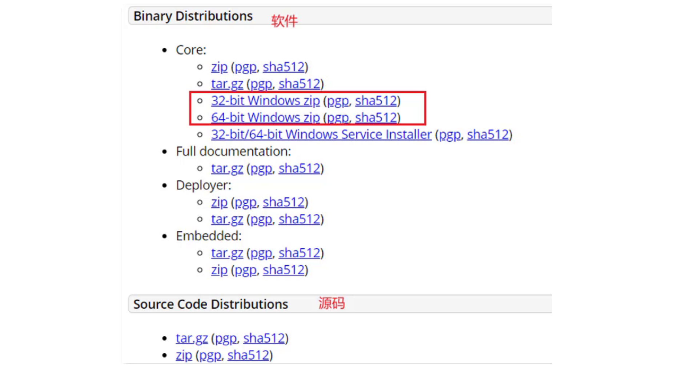

Tomcat是绿色版, 直接解压即可。在D盘的software目录下，将 `apache-tomcat-8.5.68-windows-x64.zip` 进行解压缩，会得到一个 `apache-tomcat-8.5.68` 的目录，Tomcat就已经安装成功。Tomcat在解压缩的时候，解压所在的目录可以任意，但最好解压到一个不包含中文和空格的目录，因为后期在部署项目的时候，如果路径有中文或者空格可能会导致程序部署失败。打开 `apache-tomcat-8.5.68` 目录就能看到如下目录结构，每个目录中包含的内容需要认识下


* bin: 目录下有两类文件，一种是以`.bat`结尾的，是Windows系统的可执行文件，一种是以`.sh`结尾的，是Linux系统的可执行文件。
* webapps: 就是以后项目部署的目录

到此，Tomcat的安装就已经完成。要想启动Tomcat，只需要双击: bin\startup.bat。启动后，通过浏览器访问 `http://localhost:8080` 能看到Apache Tomcat的内容就说明Tomcat已经启动成功。

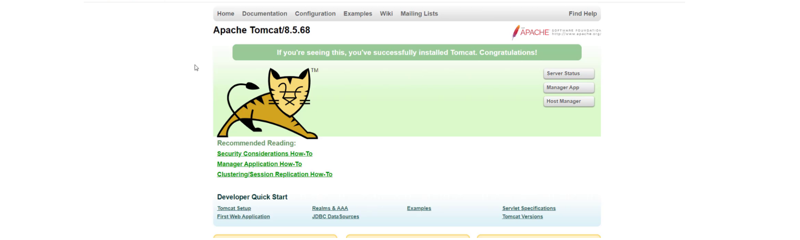

启动的过程中，控制台有中文乱码，需要修改conf/logging.prooperties


如果要想关闭tomcat，有三种方式：

* 直接x掉运行窗口: 强制关闭[不建议]
* bin\shutdown.bat：正常关闭
* ctrl+c： 正常关闭

Tomcat默认的端口是8080，要想修改Tomcat启动的端口号，需要修改 conf/server.xml


Tomcat的端口号取值范围是0-65535之间任意未被占用的端口，如果设置的端口号被占用，启动的时候就会包如下的错误：


Tomcat启动的时候，启动窗口一闪而过: 需要检查JAVA_HOME环境变量是否正确配置

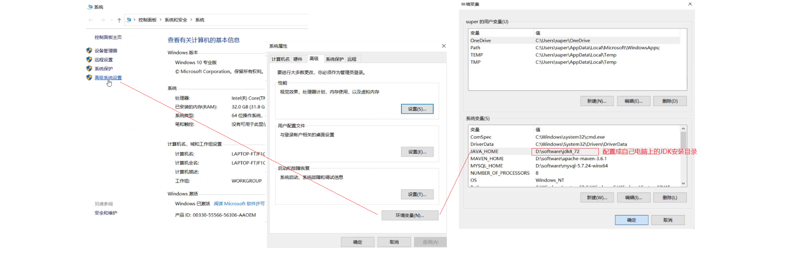

#### 2.2 项目布署

Tomcat部署项目： 将项目放置到webapps目录下，即部署完成。

通过浏览器访问 `http://localhost:8080/hello/a.html` ，能看到下面的内容就说明项目已经部署成功。

但是呢随着项目的增大，项目中的资源也会越来越多，项目在拷贝的过程中也会越来越费时间，该如何解决呢? 一般JavaWeb项目会被打包称war包，然后将war包放到Webapps目录下，Tomcat会自动解压缩war文件。

Tomcat检测到war包后会自动完成解压缩，在webapps目录下就会多一个haha目录：

通过浏览器访问 `http://localhost:8080/haha/a.html` ，能看到下面的内容就说明项目已经部署成功。

### 3，Maven创建web项目

介绍完Tomcat的基本使用后，我们来学习在IDEA中如何创建Maven Web项目，学习这种方式的原因是以后Tomcat中运行的绝大多数都是Web项目，而使用Maven工具能更加简单快捷的把Web项目给创建出来，所以Maven的Web项目具体如何来构建呢?

在真正创建Maven Web项目之前，我们先要知道Web项目长什么样子，具体的结构是什么?

#### 3.1 web项目结构

Web项目的结构分为: 开发中的项目和开发完可以部署的Web项目, 这两种项目的结构是不一样的，我们一个个来介绍下:

* Maven Web项目结构: 开发中的项目

  


* 开发完成部署的Web项目

  


  + 开发项目通过执行Maven打包命令==package==, 可以获取到部署的Web项目目录
  + 编译后的Java字节码文件和resources的资源文件，会被放到WEB-INF下的classes目录下
  + pom.xml中依赖坐标对应的jar包，会被放入WEB-INF下的lib目录下

#### 3.2  创建Maven Web项目

介绍完Maven Web的项目结构后，接下来使用Maven来创建Web项目，创建方式有两种

* 使用骨架
* 不使用骨架

使用骨架创建Maven Web项目步骤：

1. 创建Maven项目

   

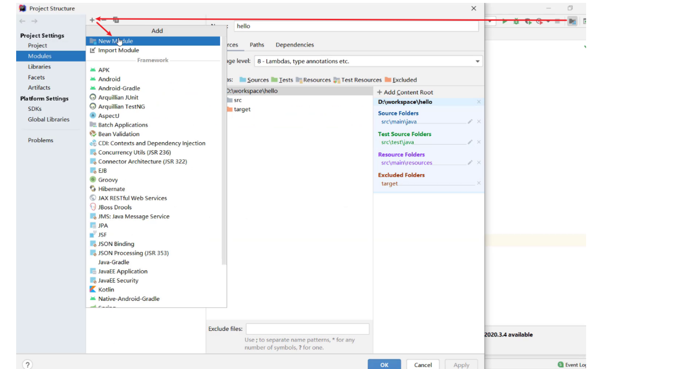

2. 选择使用Web项目骨架

   

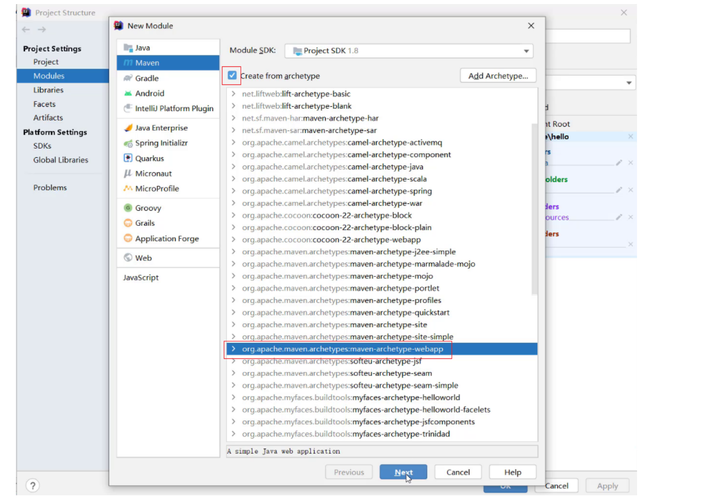

3. 输入Maven项目坐标创建项目

   

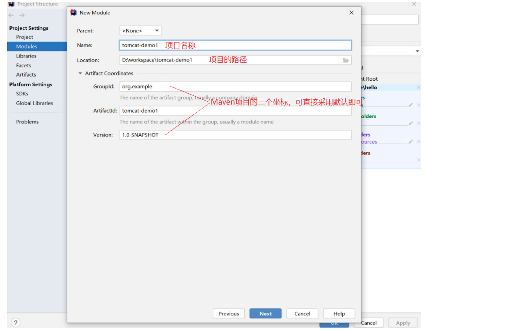

4. 确认Maven相关的配置信息后，完成项目创建

   

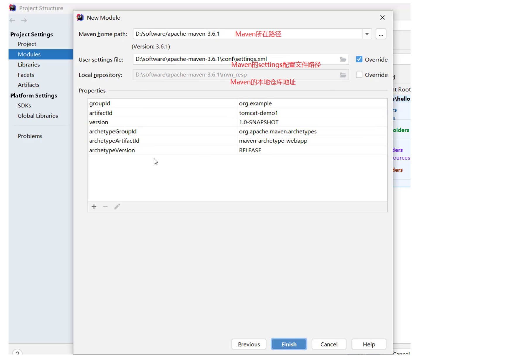

5. 删除pom.xml中多余内容，只留下面的这些内容，注意打包方式 jar和war的区别

   

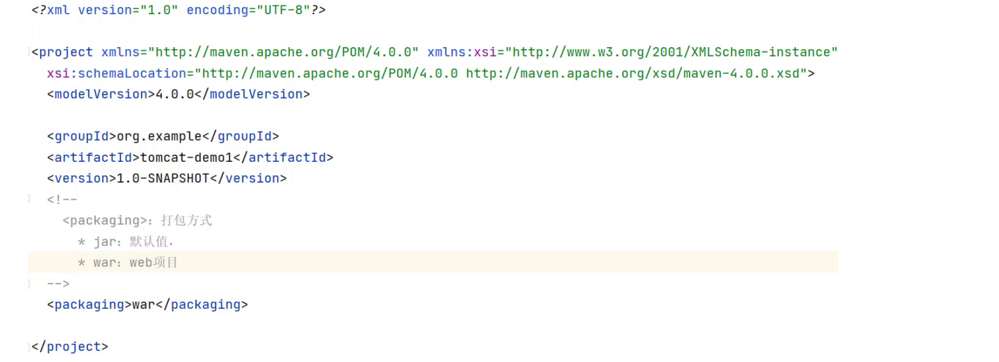

6. 补齐Maven Web项目缺失的目录结构，默认没有java和resources目录，需要手动完成创建补齐，最终的目录结果如下

   


不使用骨架创建Maven Web项目步骤：

1. 创建Maven项目

   

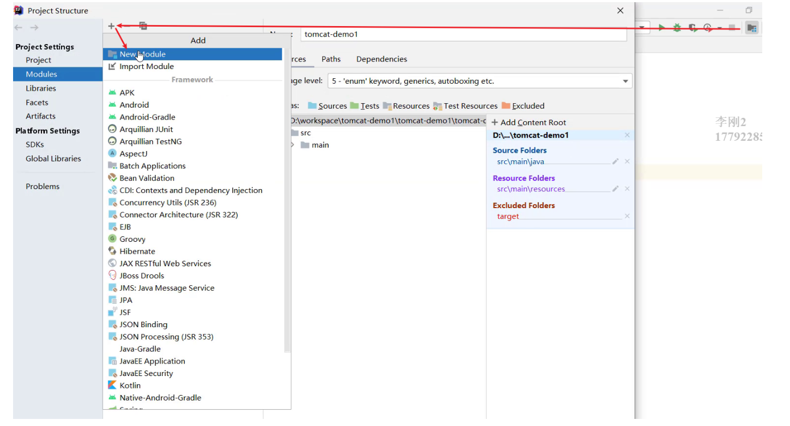

2. 选择不使用Web项目骨架

   

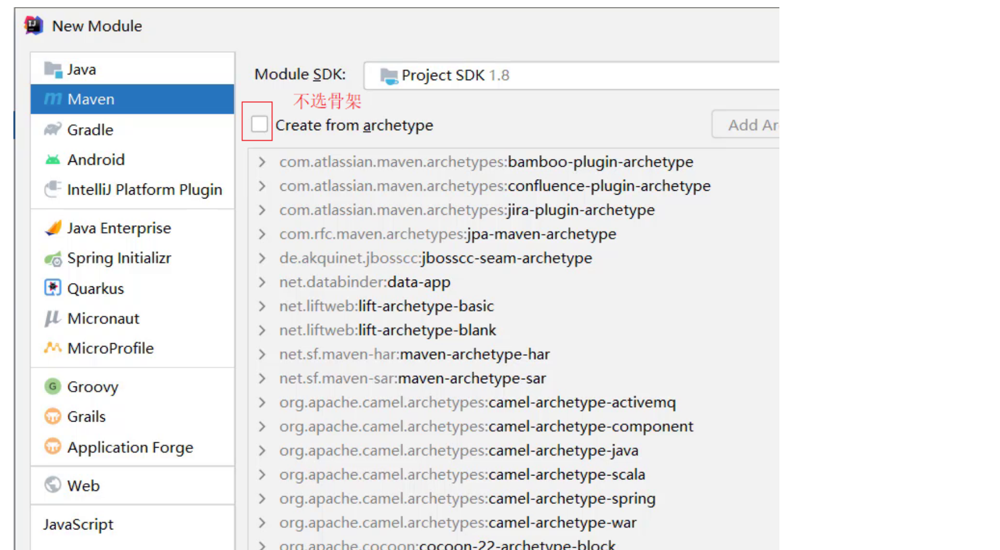

3. 输入Maven项目坐标创建项目

   

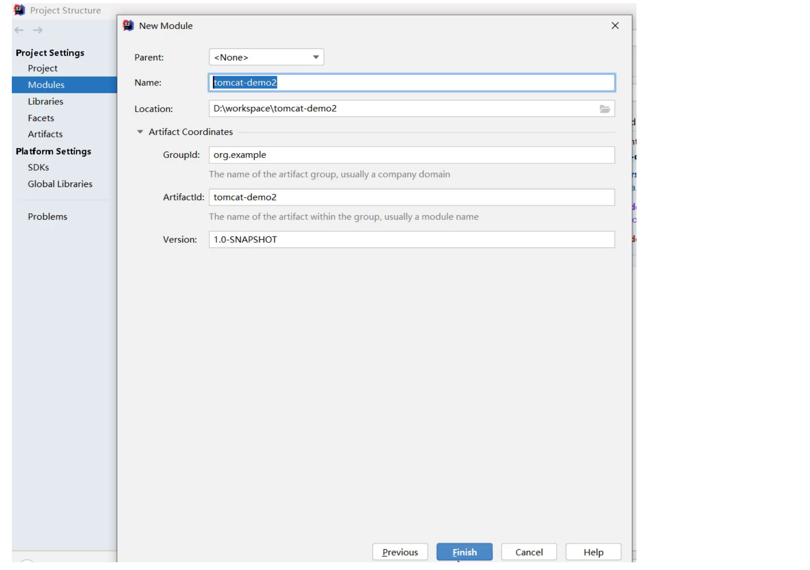

4. 在pom.xml设置打包方式为war,默认是不写代表打包方式为jar

   

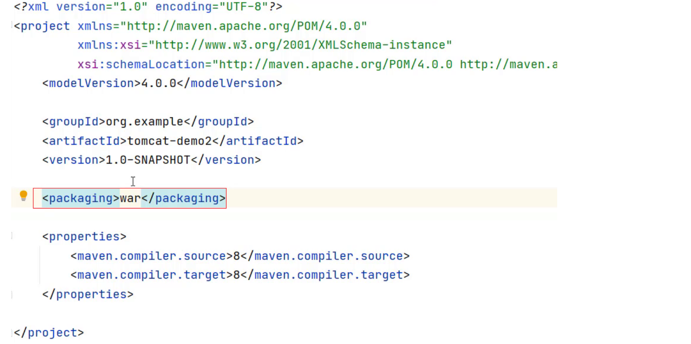

5. 补齐Maven Web项目缺失webapp的目录结构

   

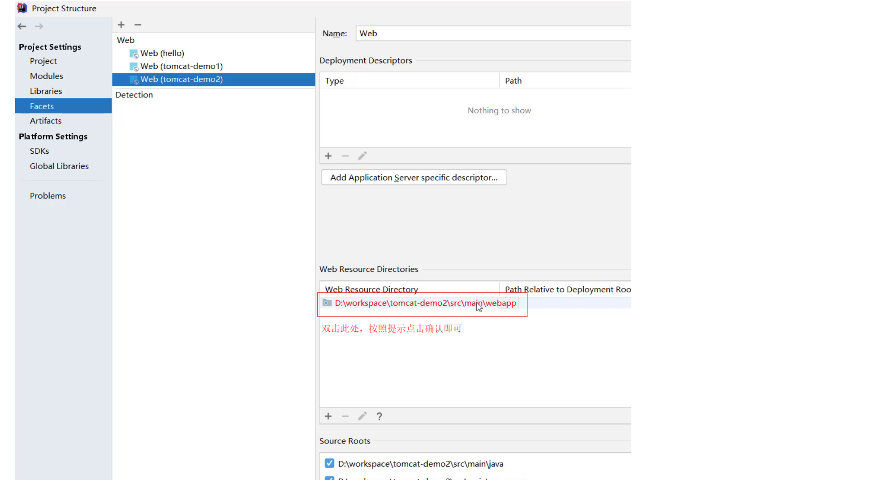

6. 补齐Maven Web项目缺失WEB-INF/web.xml的目录结构

   

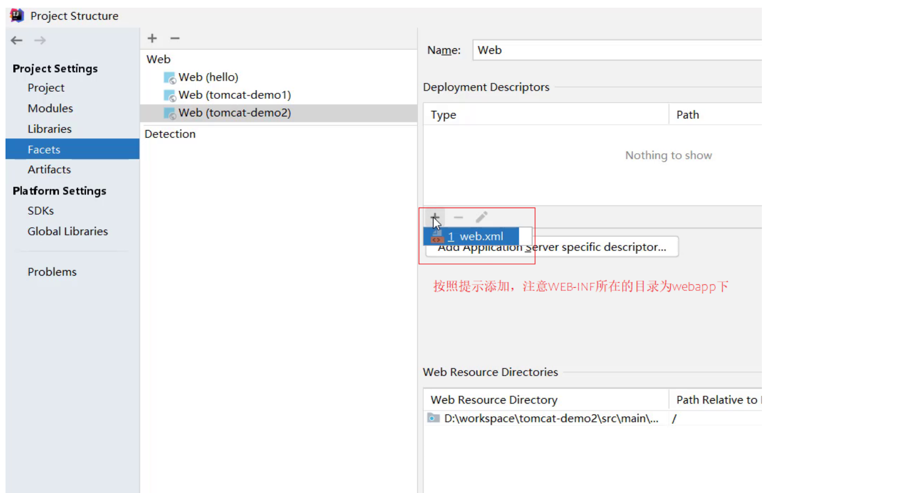

7. 补充完后，最终的项目结构如下:

   

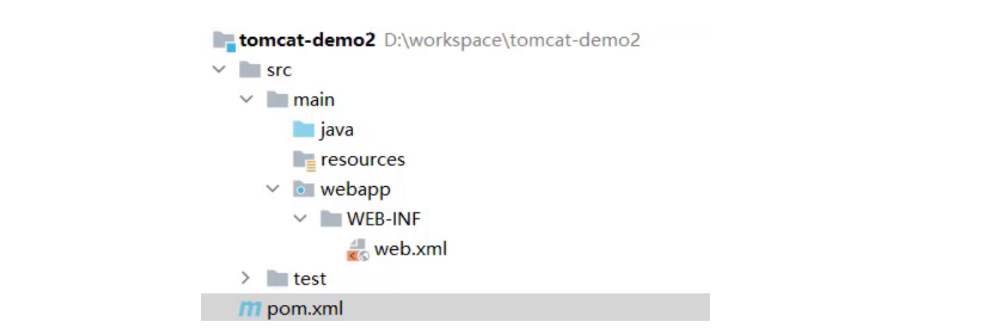

上述两种方式，创建的web项目，都不是很全，需要手动补充内容，至于最终采用哪种方式来创建Maven Web项目，都是可以的，根据各自的喜好来选择使用即可。

### 4，IDEA使用Tomcat

Maven Web项目创建成功后，通过Maven的package命令可以将项目打包成war包，将war文件拷贝到Tomcat的webapps目录下，启动Tomcat就可以将项目部署成功，然后通过浏览器进行访问即可。然而我们在开发的过程中，项目中的内容会经常发生变化，如果按照上面这种方式来部署测试，是非常不方便的。如何在IDEA中能快速使用Tomcat呢? 在IDEA中集成使用Tomcat有两种方式，分别是

* 集成本地Tomcat
* Tomcat Maven插件

#### 4.1 集成本地Tomcat

将刚才本地安装好的Tomcat8集成到IDEA中，完成项目部署，具体的实现步骤

1. 打开添加本地Tomcat的面板

   

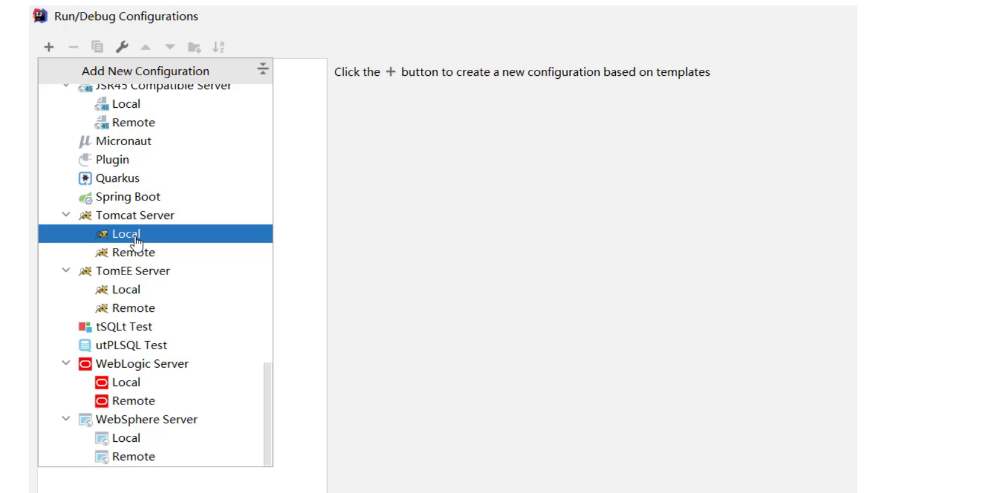

2. 指定本地Tomcat的具体路径

   

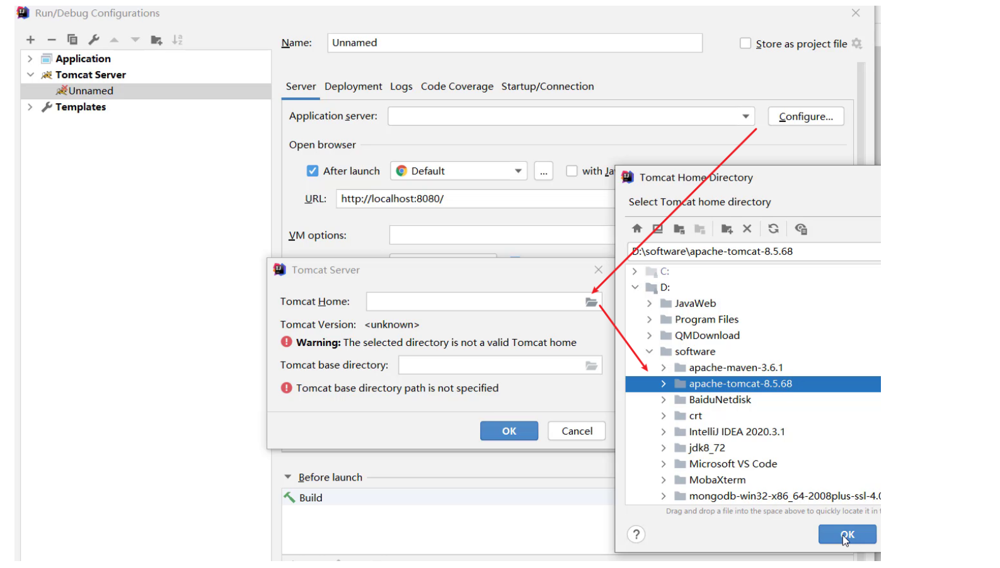

3. 修改Tomcat的名称，此步骤可以不改，只是让名字看起来更有意义，HTTP port中的端口也可以进行修改，比如把8080改成80

   

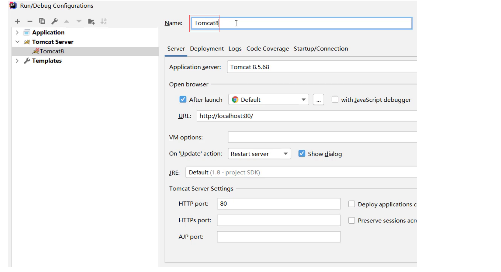

4. 将开发项目部署项目到Tomcat中

   

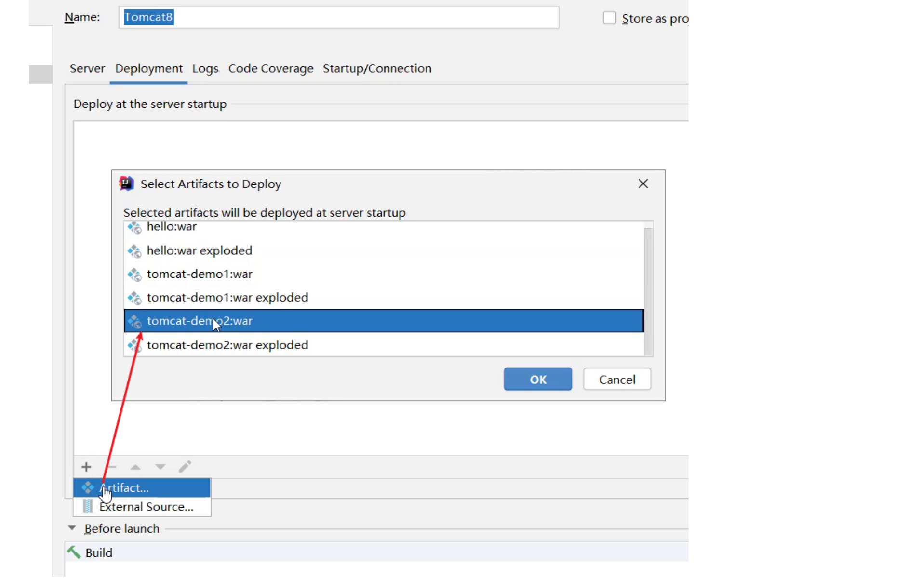

   

5. 部署成功后，就可以启动项目，为了能更好的看到启动的效果，可以在webapp目录下添加a.html页面

   

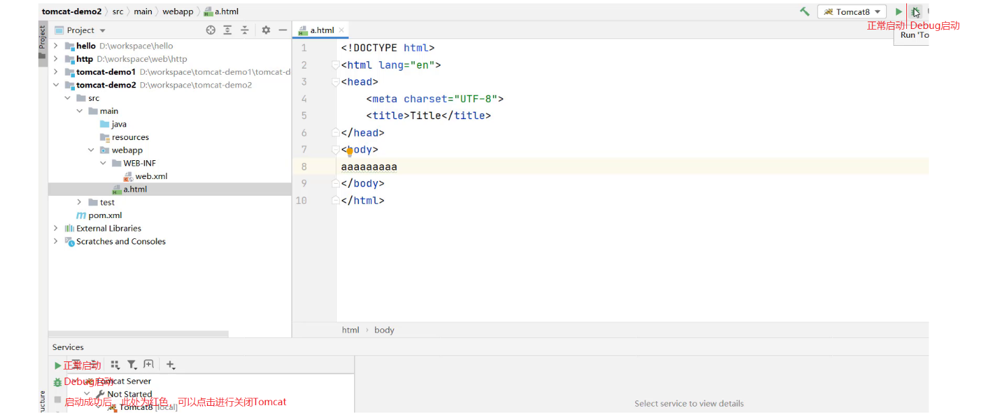

6. 启动成功后，可以通过浏览器进行访问测试

   

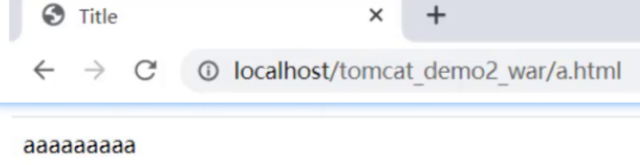

7. 最终的注意事项

   

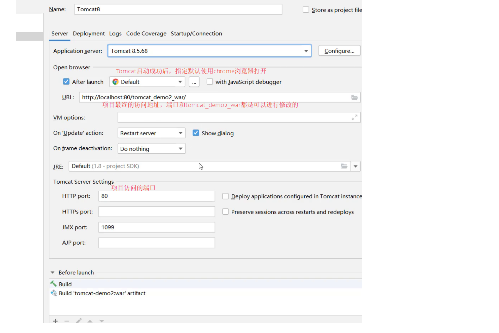

扩展内容： xxx.war和 xxx.war exploded这两种部署项目模式的区别?

* war模式是将WEB工程打成war包，把war包发布到Tomcat服务器上
* war exploded模式是将WEB工程以当前文件夹的位置关系发布到Tomcat服务器上
* war模式部署成功后，Tomcat的webapps目录下会有部署的项目内容
* war exploded模式部署成功后，Tomcat的webapps目录下没有，而使用的是项目的target目录下的内容进行部署
* 建议大家都选war模式进行部署，更符合项目部署的实际情况

至此，IDEA中集成本地Tomcat进行项目部署的内容我们就介绍完了，整体步骤如下，大家需要按照流程进行部署操作练习。

#### 4.2 Tomcat Maven插件

在IDEA中使用本地Tomcat进行项目部署，相对来说步骤比较繁琐，所以我们需要一种更简便的方式来替换它，那就是直接使用Maven中的Tomcat插件来部署项目，具体的实现步骤，只需要两步，分别是:

1. 在pom.xml中添加Tomcat插件

   

```xml
   <build>
       <plugins>
       	<!--Tomcat插件 -->
           <plugin>
               <groupId>org.apache.tomcat.maven</groupId>
               <artifactId>tomcat7-maven-plugin</artifactId>
               <version>2.2</version>
           </plugin>
       </plugins>
   </build>
```

   

2. 使用Maven Helper插件快速启动项目，选中项目，右键=>Run Maven => tomcat7:run

   

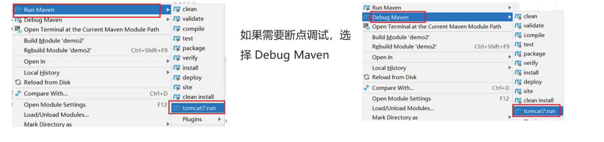

如果选中项目并右键点击后，看不到Run Maven和Debug Maven，这个时候就需要在IDEA中下载Maven Helper插件，具体的操作方式为: File => Settings => Plugins => Maven Helper => Install, 安装完后按照提示重启IDEA，就可以看到了。

注意细节：

* Maven Tomcat插件目前只有Tomcat7版本，没有更高的版本可以使用。如果对于Tomcat的版本有比较高的要求，要在Tomcat7以上，这个时候就只能集成本地Tomcat了。
* 使用Maven Tomcat插件，要想修改Tomcat的端口和访问路径，可以直接修改pom.xml

```xml
<build>
    <plugins>
    	<!--Tomcat插件 -->
        <plugin>
            <groupId>org.apache.tomcat.maven</groupId>
            <artifactId>tomcat7-maven-plugin</artifactId>
            <version>2.2</version>
            <configuration>
            	<port>80</port><!--访问端口号 -->
                <!--项目访问路径
					未配置访问路径: http://localhost:80/tomcat-demo2/a.html
					配置/后访问路径: http://localhost:80/a.html
					如果配置成 /hello,访问路径会变成什么?
						答案: http://localhost:80/hello/a.html
				-->
                <path>/</path>
            </configuration>
        </plugin>
    </plugins>
</build>
```

## 二，Servlet

### 1，Servlet介绍

Servlet是JavaWeb最为核心的内容，它是Java提供的一门动态web资源开发技术。使用Servlet就可以实现，根据不同的登录用户在页面上动态显示不同内容。ervlet是JavaEE规范之一，其实就是一个接口，将来我们需要定义Servlet类实现Servlet接口，并由web服务器运行Servlet。

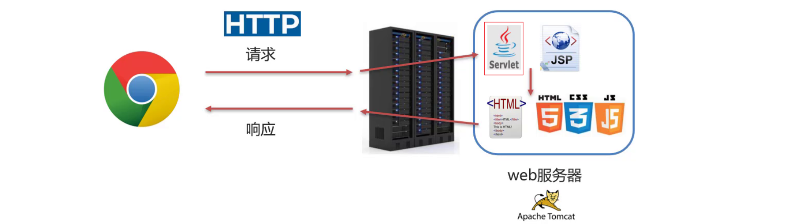

### 2，Servlet快速入门

编写一个Servlet类，并使用IDEA中Tomcat插件进行部署，最终通过浏览器访问所编写的Servlet程序。具体的实现步骤为:

1. 创建Web项目`web-demo`，导入Servlet依赖坐标

   

```xml
   <dependency>
       <groupId>javax.servlet</groupId>
       <artifactId>javax.servlet-api</artifactId>
       <version>3.1.0</version>
       <!--
         此处为什么需要添加该标签?
         provided指的是在编译和测试过程中有效,最后生成的war包时不会加入
          因为Tomcat的lib目录中已经有servlet-api这个jar包，如果在生成war包的时候生效就会和Tomcat中的jar包冲突，导致报错
       -->
       <scope>provided</scope>
   </dependency>
```

   

2. 创建:定义一个类，实现Servlet接口，并重写接口中所有方法，并在service方法中输入一句话

   

```java
   package com.malu.web;
   
   import javax.servlet.*;
   import java.io.IOException;
   
   public class ServletDemo1 implements Servlet {
   
       public void service(ServletRequest servletRequest, ServletResponse servletResponse) throws ServletException, IOException {
           System.out.println("servlet hello world~");
       }
       public void init(ServletConfig servletConfig) throws ServletException {
   
       }
   
       public ServletConfig getServletConfig() {
           return null;
       }
   
       public String getServletInfo() {
           return null;
       }
   
       public void destroy() {
   
       }
   }
```

   

3. 配置:在类上使用@WebServlet注解，配置该Servlet的访问路径

   

```java
   @WebServlet("/demo1")
```

   

4. 访问:启动Tomcat,浏览器中输入URL地址访问该Servlet

   

```url
   http://localhost:8080/web-demo/demo1
```

   

5. 访问后，在控制台会打印`servlet hello world~` 说明servlet程序已经成功运行。

### 3，Servlet执行流程

Servlet程序已经能正常运行，但是我们需要思考个问题: 我们并没有创建ServletDemo1类的对象，也没有调用对象中的service方法，为什么在控制台就打印了 `servlet hello world~` 这句话呢?

要想回答上述问题，我们就需要对Servlet的执行流程进行一个学习。

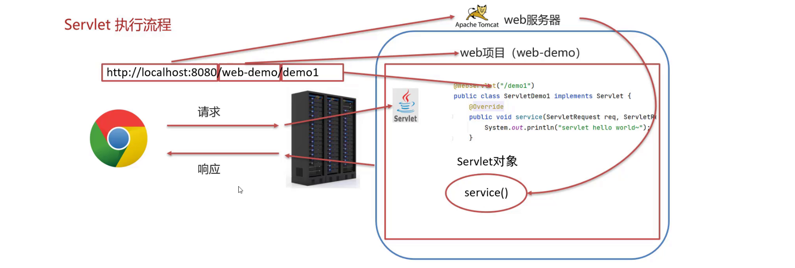

* 浏览器发出`http://localhost:8080/web-demo/demo1`请求，从请求中可以解析出三部分内容，分别是`localhost:8080`、`web-demo`、`demo1`
  + 根据`localhost:8080`可以找到要访问的Tomcat Web服务器
  + 根据`web-demo`可以找到部署在Tomcat服务器上的web-demo项目
  + 根据`demo1`可以找到要访问的是项目中的哪个Servlet类，根据@WebServlet后面的值进行匹配
* 找到ServletDemo1这个类后，Tomcat Web服务器就会为ServletDemo1这个类创建一个对象，然后调用对象中的service方法
  + ServletDemo1实现了Servlet接口，所以类中必然会重写service方法供Tomcat Web服务器进行调用
  + service方法中有ServletRequest和ServletResponse两个参数，ServletRequest封装的是请求数据，ServletResponse封装的是响应数据，后期我们可以通过这两个参数实现前后端的数据交互

总结：

* Servlet由谁创建? Servlet方法由谁调用?
  + Servlet由web服务器创建，Servlet方法由web服务器调用
* 服务器怎么知道Servlet中一定有service方法?
  + 因为我们自定义的Servlet, 必须实现Servlet接口并复写其方法，而Servlet接口中有service方法

### 4，Servlet生命周期

Tomcat什么时候创建的Servlet对象? 接下来，我们研究一下Servlet的生命周期。对象的生命周期指一个对象从被创建到被销毁的整个过程。Servlet运行在Servlet容器(web服务器)中，其生命周期由容器来管理，分为4个阶段：

1. 加载和实例化：默认情况下，当Servlet第一次被访问时，由容器创建Servlet对象

   > 默认情况，Servlet会在第一次访问被容器创建，但是如果创建Servlet比较耗时的话，那么第一个访问的人等待的时间就比较长，用户的体验就比较差，那么我们能不能把Servlet的创建放到服务器启动的时候来创建，具体如何来配置?
   >
   > 
   >
   > @WebServlet(urlPatterns = "/demo1", loadOnStartup = 1)
   > loadOnstartup的取值有两类情况
   > 	（1）负整数: 第一次访问时创建Servlet对象
   > 	（2）0或正整数: 服务器启动时创建Servlet对象，数字越小优先级越高

2. 初始化：在Servlet实例化之后，容器将调用Servlet的init()方法初始化这个对象，完成一些如加载配置文件、创建连接等初始化的工作。该方法只调用一次

3. 请求处理：每次请求Servlet时，Servlet容器都会调用Servlet的service()方法对请求进行处理

4. 服务终止：当需要释放内存或者容器关闭时，容器就会调用Servlet实例的destroy()方法完成资源的释放。在destroy()方法调用之后，容器会释放这个Servlet实例，该实例随后会被Java的垃圾收集器所回收

代码演示Servlet的生命周期：

```java
package com.malu.web;

import javax.servlet.*;
import javax.servlet.annotation.WebServlet;
import java.io.IOException;
/**
* Servlet生命周期方法
*/
@WebServlet(urlPatterns = "/demo2",loadOnStartup = 1)
public class ServletDemo2 implements Servlet {

    /**
     *  初始化方法
     *  1.调用时机：默认情况下，Servlet被第一次访问时，调用
     *      * loadOnStartup: 默认为-1，修改为0或者正整数，则会在服务器启动的时候，调用
     *  2.调用次数: 1次
     * @param config
     * @throws ServletException
     */
    public void init(ServletConfig config) throws ServletException {
        System.out.println("init...");
    }

    /**
     * 提供服务
     * 1.调用时机:每一次Servlet被访问时，调用
     * 2.调用次数: 多次
     * @param req
     * @param res
     * @throws ServletException
     * @throws IOException
     */
    public void service(ServletRequest req, ServletResponse res) throws ServletException, IOException {
        System.out.println("servlet hello world~");
    }

    /**
     * 销毁方法
     * 1.调用时机：内存释放或者服务器关闭的时候，Servlet对象会被销毁，调用
     * 2.调用次数: 1次
     */
    public void destroy() {
        System.out.println("destroy...");
    }
    public ServletConfig getServletConfig() {
        return null;
    }

    public String getServletInfo() {
        return null;
    }

}
```

如何才能让Servlet中的destroy方法被执行？

* 在Terminal命令行中，先使用`mvn tomcat7:run`启动，然后再使用`ctrl+c`关闭tomcat

总结：

* Servlet对象在什么时候被创建的?
  + 默认是第一次访问的时候被创建，可以使用@WebServlet(urlPatterns = "/demo2", loadOnStartup = 1)的loadOnStartup 修改成在服务器启动的时候创建。
* Servlet生命周期中涉及到的三个方法，这三个方法是什么? 什么时候被调用? 调用几次?
  + 涉及到三个方法，分别是 init()、service()、destroy()
  + init方法在Servlet对象被创建的时候执行，只执行1次
  + service方法在Servlet被访问的时候调用，每访问1次就调用1次
  + destroy方法在Servlet对象被销毁的时候调用，只执行1次

### 5，其它两个方法介绍

Servlet中总共有5个方法，我们已经介绍过其中的三个，剩下的两个方法作用分别是什么？

* 获取Servlet信息

  

```java
  String getServletInfo() 
  //该方法用来返回Servlet的相关信息，没有什么太大的用处，一般我们返回一个空字符串即可
  public String getServletInfo() {
      return "";
  }
```

  

* 获取ServletConfig对象

  

```java
  ServletConfig getServletConfig()
```

ServletConfig对象，在init方法的参数中有，而Tomcat Web服务器在创建Servlet对象的时候会调用init方法，必定会传入一个ServletConfig对象，我们只需要将服务器传过来的ServletConfig进行返回即可。具体如何操作?

```java
package com.malu.web;

import javax.servlet.*;
import javax.servlet.annotation.WebServlet;
import java.io.IOException;

/**
 * Servlet方法介绍
 */
@WebServlet(urlPatterns = "/demo3",loadOnStartup = 1)
public class ServletDemo3 implements Servlet {

    private ServletConfig servletConfig;
    /**
     *  初始化方法
     *  1.调用时机：默认情况下，Servlet被第一次访问时，调用
     *      * loadOnStartup: 默认为-1，修改为0或者正整数，则会在服务器启动的时候，调用
     *  2.调用次数: 1次
     * @param config
     * @throws ServletException
     */
    public void init(ServletConfig config) throws ServletException {
        this.servletConfig = config;
        System.out.println("init...");
    }
    public ServletConfig getServletConfig() {
        return servletConfig;
    }
    
    /**
     * 提供服务
     * 1.调用时机:每一次Servlet被访问时，调用
     * 2.调用次数: 多次
     * @param req
     * @param res
     * @throws ServletException
     * @throws IOException
     */
    public void service(ServletRequest req, ServletResponse res) throws ServletException, IOException {
        System.out.println("servlet hello world~");
    }

    /**
     * 销毁方法
     * 1.调用时机：内存释放或者服务器关闭的时候，Servlet对象会被销毁，调用
     * 2.调用次数: 1次
     */
    public void destroy() {
        System.out.println("destroy...");
    }
    
    public String getServletInfo() {
        return "";
    }
}
```

getServletInfo()和getServletConfig()这两个方法使用的不是很多，大家了解下。

### 6，体系结构

通过上面的学习，我们知道要想编写一个Servlet就必须要实现Servlet接口，重写接口中的5个方法，虽然已经能完成要求，但是编写起来还是比较麻烦的，因为我们更关注的其实只有service方法，那有没有更简单方式来创建Servlet呢?要想解决上面的问题，我们需要先对Servlet的体系结构进行下了解:

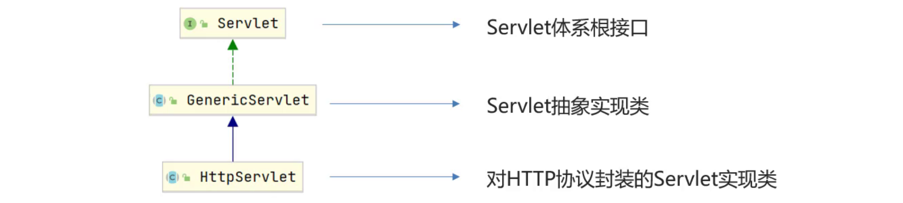


因为我们将来开发B/S架构的web项目，都是针对HTTP协议，所以我们自定义Servlet,会通过继承HttpServlet。代码演示：

```java
@WebServlet("/demo4")
public class ServletDemo4 extends HttpServlet {
    @Override
    protected void doGet(HttpServletRequest req, HttpServletResponse resp) throws ServletException, IOException {
        //TODO GET 请求方式处理逻辑
        System.out.println("get...");
    }
    @Override
    protected void doPost(HttpServletRequest req, HttpServletResponse resp) throws ServletException, IOException {
        //TODO Post 请求方式处理逻辑
        System.out.println("post...");
    }
}
```

要想发送一个GET请求，请求该Servlet，只需要通过浏览器发送`http://localhost:8080/web-demo/demo4`,就能看到doGet方法被执行了。要想发送一个POST请求，请求该Servlet，单单通过浏览器是无法实现的，这个时候就需要编写一个form表单来发送请求，在webapp下创建一个`a.html`页面，内容如下:

```html
<!DOCTYPE html>
<html lang="en">
<head>
    <meta charset="UTF-8">
    <title>Title</title>
</head>
<body>
    <form action="/web-demo/demo4" method="post">
        <input name="username"/><input type="submit"/>
    </form>
</body>
</html>
```


启动测试，即可看到doPost方法被执行了。


Servlet的简化编写就介绍完了，接着需要思考两个问题:

1. HttpServlet中为什么要根据请求方式的不同，调用不同的方法?
2. 如何调用?


针对问题一，我们需要回顾之前的知识点==前端发送GET和POST请求的时候，参数的位置不一致，GET请求参数在请求行中，POST请求参数在请求体中==，为了能处理不同的请求方式，我们得在service方法中进行判断，然后写不同的业务处理，这样能实现，但是每个Servlet类中都将有相似的代码，针对这个问题，有什么可以优化的策略么? 代码演示：

```java
package com.malu.web;

import javax.servlet.*;
import javax.servlet.annotation.WebServlet;
import javax.servlet.http.HttpServlet;
import javax.servlet.http.HttpServletRequest;
import javax.servlet.http.HttpServletResponse;
import java.io.IOException;


@WebServlet("/demo5")
public class ServletDemo5 implements Servlet {

    public void init(ServletConfig config) throws ServletException {

    }

    public ServletConfig getServletConfig() {
        return null;
    }

    public void service(ServletRequest req, ServletResponse res) throws ServletException, IOException {
        //如何调用?
        //获取请求方式，根据不同的请求方式进行不同的业务处理
        HttpServletRequest request = (HttpServletRequest)req;
       //1. 获取请求方式
        String method = request.getMethod();
        //2. 判断
        if("GET".equals(method)){
            // get方式的处理逻辑
        }else if("POST".equals(method)){
            // post方式的处理逻辑
        }
    }

    public String getServletInfo() {
        return null;
    }

    public void destroy() {

    }
}
```


要解决上述问题，我们可以对Servlet接口进行继承封装，来简化代码开发。

```java
package com.malu.web;

import javax.servlet.*;
import javax.servlet.http.HttpServletRequest;
import java.io.IOException;

public class MyHttpServlet implements Servlet {
    public void init(ServletConfig config) throws ServletException {

    }

    public ServletConfig getServletConfig() {
        return null;
    }

    public void service(ServletRequest req, ServletResponse res) throws ServletException, IOException {
        HttpServletRequest request = (HttpServletRequest)req;
        //1. 获取请求方式
        String method = request.getMethod();
        //2. 判断
        if("GET".equals(method)){
            // get方式的处理逻辑
            doGet(req,res);
        }else if("POST".equals(method)){
            // post方式的处理逻辑
            doPost(req,res);
        }
    }

    protected void doPost(ServletRequest req, ServletResponse res) {
    }

    protected void doGet(ServletRequest req, ServletResponse res) {
    }

    public String getServletInfo() {
        return null;
    }

    public void destroy() {

    }
}
```


有了MyHttpServlet这个类，以后我们再编写Servlet类的时候，只需要继承MyHttpServlet，重写父类中的doGet和doPost方法，就可以用来处理GET和POST请求的业务逻辑。接下来，可以把ServletDemo5代码进行改造

```java
@WebServlet("/demo5")
public class ServletDemo5 extends MyHttpServlet {

    @Override
    protected void doGet(ServletRequest req, ServletResponse res) {
        System.out.println("get...");
    }

    @Override
    protected void doPost(ServletRequest req, ServletResponse res) {
        System.out.println("post...");
    }
}
```


将来页面发送的是GET请求，则会进入到doGet方法中进行执行，如果是POST请求，则进入到doPost方法。这样代码在编写的时候就相对来说更加简单快捷。

类似MyHttpServlet这样的类Servlet中已经为我们提供好了，就是HttpServlet,翻开源码，大家可以搜索`service()`方法，你会发现HttpServlet做的事更多，不仅可以处理GET和POST还可以处理其他五种请求方式。

```java
protected void service(HttpServletRequest req, HttpServletResponse resp)
    throws ServletException, IOException
    {
        String method = req.getMethod();

        if (method.equals(METHOD_GET)) {
            long lastModified = getLastModified(req);
            if (lastModified == -1) {
                // servlet doesn't support if-modified-since, no reason
                // to go through further expensive logic
                doGet(req, resp);
            } else {
                long ifModifiedSince = req.getDateHeader(HEADER_IFMODSINCE);
                if (ifModifiedSince < lastModified) {
                    // If the servlet mod time is later, call doGet()
                    // Round down to the nearest second for a proper compare
                    // A ifModifiedSince of -1 will always be less
                    maybeSetLastModified(resp, lastModified);
                    doGet(req, resp);
                } else {
                    resp.setStatus(HttpServletResponse.SC_NOT_MODIFIED);
                }
            }

        } else if (method.equals(METHOD_HEAD)) {
            long lastModified = getLastModified(req);
            maybeSetLastModified(resp, lastModified);
            doHead(req, resp);

        } else if (method.equals(METHOD_POST)) {
            doPost(req, resp);

        } else if (method.equals(METHOD_PUT)) {
            doPut(req, resp);

        } else if (method.equals(METHOD_DELETE)) {
            doDelete(req, resp);

        } else if (method.equals(METHOD_OPTIONS)) {
            doOptions(req,resp);

        } else if (method.equals(METHOD_TRACE)) {
            doTrace(req,resp);

        } else {
            //
            // Note that this means NO servlet supports whatever
            // method was requested, anywhere on this server.
            //

            String errMsg = lStrings.getString("http.method_not_implemented");
            Object[] errArgs = new Object[1];
            errArgs[0] = method;
            errMsg = MessageFormat.format(errMsg, errArgs);

            resp.sendError(HttpServletResponse.SC_NOT_IMPLEMENTED, errMsg);
        }
    }
```


总结：

- HttpServlet的使用步骤
  - 继承HttpServlet，重写doGet和doPost方法
- HttpServlet原理
  - 获取请求方式，并根据不同的请求方式，调用不同的doXxx方法


### 7，urlPattern配置

Servlet类编写好后，要想被访问到，就需要配置其访问路径urlPattern。一个Servlet,可以配置多个urlPattern：

```java
package com.malu.web;

import javax.servlet.ServletRequest;
import javax.servlet.ServletResponse;
import javax.servlet.annotation.WebServlet;

/**
* urlPattern: 一个Servlet可以配置多个访问路径
*/
@WebServlet(urlPatterns = {"/demo7","/demo8"})
public class ServletDemo7 extends MyHttpServlet {

    @Override
    protected void doGet(ServletRequest req, ServletResponse res) {
        
        System.out.println("demo7 get...");
    }
    @Override
    protected void doPost(ServletRequest req, ServletResponse res) {
    }
}
```


在浏览器上输入`http://localhost:8080/web-demo/demo7`,`http://localhost:8080/web-demo/demo8`这两个地址都能访问到ServletDemo7的doGet方法。


#### 7.1 精确匹配

代码演示：

```java
/**
 * UrlPattern:
 * * 精确匹配
 */
@WebServlet(urlPatterns = "/user/select")
public class ServletDemo8 extends MyHttpServlet {

    @Override
    protected void doGet(ServletRequest req, ServletResponse res) {

        System.out.println("demo8 get...");
    }
    @Override
    protected void doPost(ServletRequest req, ServletResponse res) {
    }
}
```


访问路径：http://localhost:8080/web-demo/user/select


#### 7.2 目录匹配

代码演示：

```java
/**
 * UrlPattern:
 * 目录匹配: /user/
 * /user/*`中的`/*`代表的是零或多个层级访问目录同时精确匹配优先级要高于目录匹配。
 */
@WebServlet(urlPatterns = "/user/*")
public class ServletDemo9 extends MyHttpServlet {

    @Override
    protected void doGet(ServletRequest req, ServletResponse res) {

        System.out.println("demo9 get...");
    }
    @Override
    protected void doPost(ServletRequest req, ServletResponse res) {
    }
}
```


访问路径：http://localhost:8080/web-demo/user/任意


#### 7.3 扩展名匹配


代码演示：

```java
/**
 * UrlPattern:
 * * 扩展名匹配: *.do
 */
@WebServlet(urlPatterns = "*.do")
public class ServletDemo10 extends MyHttpServlet {

    @Override
    protected void doGet(ServletRequest req, ServletResponse res) {

        System.out.println("demo10 get...");
    }
    @Override
    protected void doPost(ServletRequest req, ServletResponse res) {
    }
}
```


访问路径：http://localhost:8080/web-demo/任意.do


注意细节：

- 如果路径配置的不是扩展名，那么在路径的前面就必须要加`/`否则会报错
- 如果路径配置的是`*.do`,那么在*.do的前面不能加`/`,否则会报错


#### 7.4 任意匹配


任意匹配代码演示一：

```java
/**
 * UrlPattern:
 * * 任意匹配： /
 */
@WebServlet(urlPatterns = "/")
public class ServletDemo11 extends MyHttpServlet {

    @Override
    protected void doGet(ServletRequest req, ServletResponse res) {

        System.out.println("demo11 get...");
    }
    @Override
    protected void doPost(ServletRequest req, ServletResponse res) {
    }
}
```


访问路径：http://localhost:8080/demo-web/任意


任意匹配代码演示二：

```java
/**
 * UrlPattern:
 * * 任意匹配： /*
 */
@WebServlet(urlPatterns = "/*")
public class ServletDemo12 extends MyHttpServlet {

    @Override
    protected void doGet(ServletRequest req, ServletResponse res) {

        System.out.println("demo12 get...");
    }
    @Override
    protected void doPost(ServletRequest req, ServletResponse res) {
    }
}
```


`/`和`/*`的区别?

- 当我们的项目中的Servlet配置了 "/",会覆盖掉tomcat中的DefaultServlet,当其他的url-pattern都匹配不上时都会走这个Servlet
- 当我们的项目中配置了"/*",意味着匹配任意访问路径
- DefaultServlet是用来处理静态资源，如果配置了"/"会把默认的覆盖掉，就会引发请求静态资源的时候没有走默认的而是走了自定义的Servlet类，最终导致静态资源不能被访问


总结：

- urlPattern总共有四种配置方式，分别是精确匹配、目录匹配、扩展名匹配、任意匹配
- 五种配置的优先级为 精确匹配 > 目录匹配> 扩展名匹配 > /* > / ,无需记，以最终运行结果为准。


### 8，XML配置

前面对应Servlet的配置，我们都使用的是@WebServlet,这个是Servlet从3.0版本后开始支持注解配置，3.0版本前只支持XML配置文件的配置方法。对于XML的配置步骤有两步:

1. 编写Servleet类

   ```java
   package com.malu.web;
   
   import javax.servlet.ServletRequest;
   import javax.servlet.ServletResponse;
   import javax.servlet.annotation.WebServlet;
   
   public class ServletDemo13 extends MyHttpServlet {
   
       @Override
       protected void doGet(ServletRequest req, ServletResponse res) {
   
           System.out.println("demo13 get...");
       }
       @Override
       protected void doPost(ServletRequest req, ServletResponse res) {
       }
   }
   ```

   

2. 在web.xml中配置Servlet

   ```xml
   <?xml version="1.0" encoding="UTF-8"?>
   <web-app xmlns="http://xmlns.jcp.org/xml/ns/javaee"
            xmlns:xsi="http://www.w3.org/2001/XMLSchema-instance"
            xsi:schemaLocation="http://xmlns.jcp.org/xml/ns/javaee http://xmlns.jcp.org/xml/ns/javaee/web-app_4_0.xsd"
            version="4.0">
       
       
       
       <!-- 
           Servlet 全类名
       -->
       <servlet>
           <!-- servlet的名称，名字任意-->
           <servlet-name>demo13</servlet-name>
           <!--servlet的类全名-->
           <servlet-class>com.malu.web.ServletDemo13</servlet-class>
       </servlet>
   
       <!-- 
           Servlet 访问路径
       -->
       <servlet-mapping>
           <!-- servlet的名称，要和上面的名称一致-->
           <servlet-name>demo13</servlet-name>
           <!-- servlet的访问路径-->
           <url-pattern>/demo13</url-pattern>
       </servlet-mapping>
   </web-app>
   ```

   

这种配置方式和注解比起来，确认麻烦很多，所以建议大家使用注解来开发。但是大家要认识上面这种配置方式，因为并不是所有的项目都是基于注解开发的。