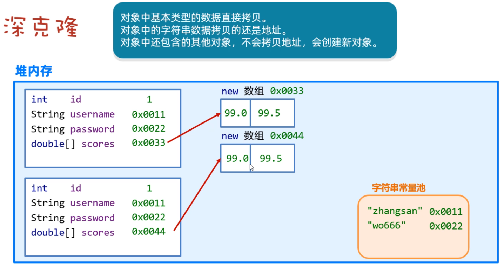
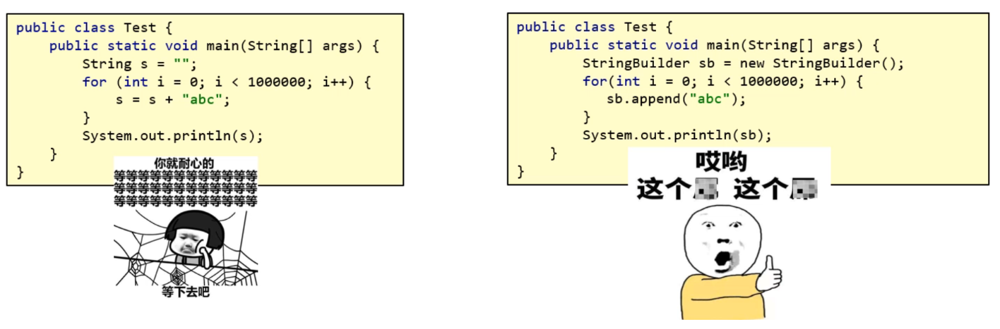

## 一，常用API介绍

### 1，常用API介绍

API（Application Programming interface）意思是应用程序编程接口，说人话就是Java帮我们写好的一些程序，如：类、方法等，我们直接拿过来用就可以解决一些问题。下图中展示了常用API对应的类：


学习API有一个特点就是听都可以听懂，但是记不住，这个大家不要担心，多记、多查、多写代码、孰能生巧！

### 2，Object类

Object类是Java中所有类的祖宗类，因此，Java中所有类的对象都可以直接使用Object类中提供的一些方法。在API文档中可以找以Object类，如下：

Object类中的toString方法可以返回对象的字符串表示形式。默认的格式是：“包名. 类名@哈希值16进制”。有一个学生类，如下：

```java
public class Student{
    private String name;
    private int age;
    
    public Student(String name, int age){
        this.name=name;
        this.age=age;
    }
}
```

测试类：

```java
public class Test{
    public static void main(String[] args){
        Student s1 = new Student("wc",23);
        System.out.println(s1.toString()); 
    }
}
```

打印结果如下：

在Student类重写toString()方法，那么我们可以返回对象的属性值，代码如下：

```java
public class Student{
    private String name;
    private int age;
    
    public Student(String name, int age){
        this.name=name;
        this.age=age;
    }
    
    @Override
    public String toString(){
        return "Student{name=‘"+name+"’, age="+age+"}";
    }
}
```

打印结果如下：

Object类的equals方法可以判断此对象与参数对象是否"相等"，测试如下：

```java
public class Test{
	public static void main(String[] args){
        Student s1 = new Student("赵薇",23);
        Student s2 = new Student("赵薇",23);
        
        //equals本身也是比较对象的地址，和"=="没有区别
        System.out.println(s1.equals(s2)); //false
         //"=="比较对象的地址
        System.out.println(s1==s2); //false
    }
}
```

重写equals方法，按照对象的属性值进行比较，如下：

```java
public class Student{
    private String name;
    private int age;
    
    public Student(String name, int age){
        this.name=name;
        this.age=age;
    }
    
    @Override
    public String toString(){
        return "Student{name=‘"+name+"’, age="+age+"}";
    }
    
    //重写equals方法，按照对象的属性值进行比较
    @Override
    public boolean equals(Object o) {
        if (this == o) return true;
        if (o == null || getClass() != o.getClass()) return false;

        Student student = (Student) o;

        if (age != student.age) return false;
        return name != null ? name.equals(student.name) : student.name == null;
    }
}
```

Object类的clone()方法，会复制一个一模一样的新对象，并返回。说白了，就是克隆当前对象，返回一个新对象。想要调用clone()方法，必须让被克隆的类实现Cloneable接口。代码如下：

```java
public class User implements Cloneable{
    private String id; //编号
    private String username; //用户名
    private String password; //密码
    private double[] scores; //分数

    public User() {
    }

    public User(String id, String username, String password, double[] scores) {
        this.id = id;
        this.username = username;
        this.password = password;
        this.scores = scores;
    }

    //...get和set...方法自己加上

    @Override
    protected Object clone() throws CloneNotSupportedException {
        return super.clone();
    }
}
```

测试类：

```java
public class Test {
    public static void main(String[] args) throws CloneNotSupportedException {
        User u1 = new User(1,"zhangsan","wo666",new double[]{99.0,99.5});
		//调用方法克隆得到一个新对象
        User u2 = (User) u1.clone();
        System.out.println(u2.getId());
        System.out.println(u2.getUsername());
        System.out.println(u2.getPassword());
        System.out.println(u2.getScores()); 
    }
}
```

打印结果发现克隆得到的对象u2它的属性值和原来u1对象的属性值是一样的。如下：

上面演示的克隆方式，是一种浅克隆的方法，浅克隆的意思：拷贝出来的对象封装的数据与原对象封装的数据一模一样（引用类型拷贝的是地址值）。


还有一种拷贝方式，称之为深拷贝，拷贝原理如下图所示：



演示深拷贝User对象，如下：

```java
public class User implements Cloneable{
    private String id; //编号
    private String username; //用户名
    private String password; //密码
    private double[] scores; //分数

    public User() {
    }

    public User(String id, String username, String password, double[] scores) {
        this.id = id;
        this.username = username;
        this.password = password;
        this.scores = scores;
    }

    //...get和set...方法自己加上

	@Override
    protected Object clone() throws CloneNotSupportedException {
        //先克隆得到一个新对象
        User u = (User) super.clone();
        //再将新对象中的引用类型数据，再次克隆
        u.scores = u.scores.clone();
        return u;
    }
}
```

测试类：

```java

```

结果如下：

### 3，Objects类

Objects是一个工具类，提供了一些方法可以对任意对象进行操作。主要方法如下：


代码演示：

```java
public class Test{
    public static void main(String[] args){
        String s1 = null;
        String s2 = "malu";
        
        //这里会出现NullPointerException异常，调用者不能为null
        System.out.println(s1.equals(s2));
        //此时不会有NullPointerException异常，底层会自动先判断空
        System.out.println(Objects.equals(s1,s2));
        
        //判断对象是否为null，等价于==
        System.out.println(Objects.isNull(s1)); //true
        System.out.println(s1==null); //true
        
        //判断对象是否不为null，等价于!=
        System.out.println(Objects.nonNull(s2)); //true
        System.out.println(s2!=null); //true
    }
}
```

### 4，基础类型包装类

Java中万物皆对象。Java中的8种基本数据类型还不是对象，所以要把它们变成对象，变成对象之后，可以提供一些方法对数据进行操作。Java中8种基本数据类型都用一个包装类与之对应，如下：


学习包装类，需要注意两点：

* 创建包装类的对象方式、自动装箱和拆箱的特性
* 利用包装类提供的方法对字符串和基本类型数据进行相互转换

创建包装类对象，代码演示：

```java
//1.创建Integer对象，封装基本类型数据10
Integer a = new Integer(10);

//2.使用Integer类的静态方法valueOf(数据)
Integer b = Integer.valueOf(10);

//3.还有一种自动装箱的写法（意思就是自动将基本类型转换为引用类型）
Integer c = 10;

//4.有装箱肯定还有拆箱（意思就是自动将引用类型转换为基本类型）
int d = c;

//5.装箱和拆箱在使用集合时就有体现
ArrayList<Integer> list = new ArrayList<>();
//添加的元素是基本类型，实际上会自动装箱为Integer类型
list.add(100);
//获取元素时，会将Integer类型自动拆箱为int类型
int e = list.get(0);
```

在开发中，经常使用包装类对字符串和基本类型数据进行相互转换。

* 把字符串转换为数值型数据：包装类.parseXxx(字符串)
* 将数值型数据转换为字符串：包装类.valueOf(数据)

代码演示：

```java
//1.字符串转换为数值型数据
String ageStr = "29";
int age1 = Integer.parseInt(ageStr);

String scoreStr = 3.14;
double score = Double.prarseDouble(scoreStr);

//2.整数转换为字符串，以下几种方式都可以（挑中你喜欢的记一下）
Integer a = 23;
String s1 = Integer.toString(a);
String s2 = a.toString();
String s3 = a+"";
String s4 = String.valueOf(a);
```


### 5，StringBuilder类

StringBuilder是可变字符串对象，相当于是一个容器，它里面的字符串是可以改变的，就是用来操作字符串的。StringBuilder比String更合适做字符串的修改操作，效率更高，代码也更加简洁。


代码演示：

```java
public class Test{
    public static void main(String[] args){
        StringBuilder sb = new StringBuilder("malu");
        
        //1.拼接内容
        sb.append(12);
        sb.append("码路");
        sb.append(true);
        
        //2.append方法，支持链式编程
        sb.append(666).append("码路2").append(666);
        System.out.println(sb); 
        
        //3.反转操作
        sb.reverse();
        System.out.println(sb);
        
        //4.返回字符串的长度
        System.out.println(sb.length());
        
        //5.StringBuilder还可以转换为字符串
        String s = sb.toString();
        System.out.println(s); 
    }
}
```


为什么要用StringBuilder对字符串进行操作呢？因为它的效率比String更高，我们可以下面两段代码验证一下。




经过验证，直接使用Stirng拼接100万次，等了1分钟，还没结束，我等不下去了；但是使用StringBuilder做拼接，不到1秒钟出结果了。


StringBuilder应用案例，代码如下：

```java
public class Test{
    public static void main(String[] args){
        String str = getArrayData( new int[]{11,22,33});
        System.out.println(str);
    }
    
    //方法作用：将int数组转换为指定格式的字符串
    public static String getArrayData(int[] arr){
        //1.判断数组是否为null
        if(arr==null){
            return null;
        }
        //2.如果数组不为null，再遍历，并拼接数组中的元素
        StringBuilder sb = new StringBuilder("[");
        for(int i=0; i<arr.length; i++){
            if(i==arr.legnth-1){
                sb.append(arr[i]).append("]");;
            }else{
                sb.append(arr[i]).append(",");
            }
        }
        //3、把StirngBuilder转换为String，并返回。
        return sb.toString();
    }
}
```


### 6，StringJoiner类

前面使用StringBuilder拼接字符串的时，代码写起来还是有一点麻烦，而StringJoiner号称是拼接神器，不仅效率高，而且代码简洁。代码演示：

```java
public class Test{
    public static void main(String[] args){
        StringJoiner s = new StringJoiner(",");
        s.add("java1");
        s.add("java2");
        s.add("java3");
        System.out.println(s); //结果为： java1,java2,java3
        
        //参数1：间隔符
        //参数2：开头
        //参数3：结尾
        StringJoiner s1 = new StringJoiner(",","[","]");
        s1.add("java1");
        s1.add("java2");
        s1.add("java3");
        System.out.println(s1); //结果为： [java1,java2,java3]
    }
}
```


使用StirngJoiner改写前面把数组转换为字符串的案例，代码如下：

```java
public class Test{
    public static void main(String[] args){
        String str = getArrayData( new int[]{11,22,33});
        System.out.println(str);
    }
    
    //方法作用：将int数组转换为指定格式的字符串
    public static String getArrayData(int[] arr){
        //1.判断数组是否为null
        if(arr==null){
            return null;
        }
        //2.如果数组不为null，再遍历，并拼接数组中的元素
        StringJoiner s = new StringJoiner(", ","[","]");
        for(int i=0; i<arr.length; i++){
            //加""是因为add方法的参数要的是String类型
            s.add(String.valueOf(arr[i]));
        }
        //3、把StringJoiner转换为String，并返回。
        return s.toString();
    }
}
```


### 7，Math类

Math是数学的意思，该类提供了很多个进行数学运算的方法，如求绝对值，求最大值，四舍五入等，直接上代码：

```java
public class MathTest {
    public static void main(String[] args) {
        // 1、public static int abs(int a)：取绝对值（拿到的结果一定是正数）
        //    public static double abs(double a)
        System.out.println(Math.abs(-12)); // 12
        System.out.println(Math.abs(123)); // 123
        System.out.println(Math.abs(-3.14)); // 3.14

        // 2、public static double ceil(double a): 向上取整
        System.out.println(Math.ceil(4.0000001)); // 5.0
        System.out.println(Math.ceil(4.0)); // 4.0

        // 3、public static double floor(double a): 向下取整
        System.out.println(Math.floor(4.999999)); // 4.0
        System.out.println(Math.floor(4.0)); // 4.0

        // 4、public static long round(double a)：四舍五入
        System.out.println(Math.round(3.4999)); // 3
        System.out.println(Math.round(3.50001)); // 4

        // 5、public static int max(int a, int b)：取较大值
        //   public static int min(int a, int b)：取较小值
        System.out.println(Math.max(10, 20)); // 20
        System.out.println(Math.min(10, 20)); // 10

        // 6、 public static double pow(double a, double b)：取次方
        System.out.println(Math.pow(2, 3)); // 2的3次方   8.0
        System.out.println(Math.pow(3, 2)); // 3的2次方   9.0

        // 7、public static double random()： 取随机数 [0.0 , 1.0) (包前不包后)
        System.out.println(Math.random());
    }
}
```


### 8，System类

System是系统类，提供了一些获取获取系统数据的方法。比如获取系统时间。代码如下：

```java
public class Test {
    public static void main(String[] args) {

        // 1、public static void exit(int status):
        //   终止当前运行的Java虚拟机。
        //   该参数用作状态代码; 按照惯例，非零状态代码表示异常终止。
        System.exit(0); // 人为的终止虚拟机。(不要使用)

        // 2、public static long currentTimeMillis():
        //    获取当前系统的时间
        //    返回的是long类型的时间毫秒值：指的是从1970-1-1 0:0:0开始走到此刻的总的毫秒值，1s = 1000ms
        long time = System.currentTimeMillis();
        System.out.println(time);

        for (int i = 0; i < 1000000; i++) {
            System.out.println("输出了：" + i);
        }

        long time2 = System.currentTimeMillis();
        System.out.println((time2 - time) / 1000.0 + "s");
    }
}
```


### 9，Runtime类

Runtime类是一个Java的运行时类，这个类可以用来获取JVM的一些信息，也可以用这个类去执行其他的程序。代码如下：

```java
public class RuntimeTest {
    public static void main(String[] args) throws IOException, InterruptedException {

        // 1、public static Runtime getRuntime() 返回与当前Java应用程序关联的运行时对象。
        Runtime r = Runtime.getRuntime();

        // 2、public void exit(int status) 终止当前运行的虚拟机,该参数用作状态代码; 按照惯例，非零状态代码表示异常终止。
        // r.exit(0);

        // 3、public int availableProcessors(): 获取虚拟机能够使用的处理器数。
        System.out.println(r.availableProcessors());

        // 4、public long totalMemory() 返回Java虚拟机中的内存总量。
        System.out.println(r.totalMemory()/1024.0/1024.0 + "MB"); // 1024 = 1K     1024 * 1024 = 1M

        // 5、public long freeMemory() 返回Java虚拟机中的可用内存量
        System.out.println(r.freeMemory()/1024.0/1024.0 + "MB");

        // 6、public Process exec(String command) 启动某个程序，并返回代表该程序的对象。
        // r.exec("D:\\soft\\XMind\\XMind.exe");
        Process p = r.exec("QQ");
        Thread.sleep(5000); // 让程序在这里暂停5s后继续往下走！！
        p.destroy(); // 销毁！关闭程序！
    }
}
```


### 10，BigDecimal类


先看如下代码的执行结果：

```java
public class Test {
    public static void main(String[] args) {
        System.out.println(0.1 + 0.2);
        System.out.println(1.0 - 0.32);
        System.out.println(1.015 * 100);
        System.out.println(1.301 / 100);
    }
}
```


结果并和我们想看到的不太一样。如下：


为了解决计算精度损失的问题，Java给我们提供了BigDecimal类，它提供了一些方法可以对数据进行四则运算，而且不丢失精度，同时还可以保留指定的小数位。代码如下：

```java
public class Test2 {
    public static void main(String[] args) {
        double a = 0.1;
        double b = 0.2;

        // 1、把浮点型数据封装成BigDecimal对象，再来参与运算。
        // a、public BigDecimal(double val) 得到的BigDecimal对象是无法精确计算浮点型数据的。 注意：不推荐使用这个，
        // b、public BigDecimal(String val)  得到的BigDecimal对象是可以精确计算浮点型数据的。 可以使用。
        // c、public static BigDecimal valueOf(double val): 通过这个静态方法得到的BigDecimal对象是可以精确运算的。是最好的方案。
        BigDecimal a1 = BigDecimal.valueOf(a);
        BigDecimal b1 = BigDecimal.valueOf(b);

        // 2、public BigDecimal add(BigDecimal augend): 加法
        BigDecimal c1 = a1.add(b1);
        System.out.println(c1);

        // 3、public BigDecimal subtract(BigDecimal augend): 减法
        BigDecimal c2 = a1.subtract(b1);
        System.out.println(c2);

        // 4、public BigDecimal multiply(BigDecimal augend): 乘法
        BigDecimal c3 = a1.multiply(b1);
        System.out.println(c3);

        // 5、public BigDecimal divide(BigDecimal b): 除法
        BigDecimal c4 = a1.divide(b1);
        System.out.println(c4);

//        BigDecimal d1 = BigDecimal.valueOf(0.1);
//        BigDecimal d2 = BigDecimal.valueOf(0.3);
//        BigDecimal d3 = d1.divide(d2);
//        System.out.println(d3);

        // 6、public BigDecimal divide(另一个BigDecimal对象，精确几位，舍入模式) : 除法，可以设置精确几位。
        BigDecimal d1 = BigDecimal.valueOf(0.1);
        BigDecimal d2 = BigDecimal.valueOf(0.3);
        BigDecimal d3 = d1.divide(d2,  2, RoundingMode.HALF_UP); // 0.33
        System.out.println(d3);

        // 7、public double doubleValue() : 把BigDecimal对象又转换成double类型的数据。
        //print(d3);
        //print(c1);
        double db1 = d3.doubleValue();
        double db2 = c1.doubleValue();
        print(db1);
        print(db2);
    }

    public static void print(double a){
        System.out.println(a);
    }
}

```


### 11，Date类


在Java中，使用Date类来表示日期或者时间。Date对象记录的时间是用毫秒值来表示的。Java语言规定，1970年1月1日0时0分0秒认为是时间的起点，此时记作0，那么1000（1秒=1000毫秒）就表示1970年1月1日0时0分1秒，依次内推。


Date类的构造方法和常见方法：

- public Date()   创建一个Date对象，代表的是系统当前此刻日期时间。
- public Date(long time)  把时间毫秒值转换成Date日期对象
- public long getTime()  返回从1970年1月1日  00:00:00 走到此刻的总的毫秒数
- public void setTime()  设置日期对象的时间为当前时间毫秒值对应的时间


直接上代码：

```java
public class Test1Date {
    public static void main(String[] args) {
        // 1、创建一个Date的对象：代表系统当前时间信息的。
        Date d = new Date();
        System.out.println(d);

        // 2、拿到时间毫秒值。
        long time = d.getTime();
        System.out.println(time);

        // 3、把时间毫秒值转换成日期对象： 2s之后的时间是多少。
        time += 2 * 1000;
        Date d2 = new Date(time);
        System.out.println(d2);

        // 4、直接把日期对象的时间通过setTime方法进行修改
        Date d3 = new Date();
        d3.setTime(time);
        System.out.println(d3);
    }
}
```


### 12，SimpleDateFormat类

SimpleDateFormat类可以转换Date对象表示日期时间的显示格式。把Date对象转换为指定格式的日期字符串这个操作，叫做日期格式化。反过来把指定格式的日期符串转换为Date对象的操作，叫做日期解析。常见的构造器和格式化时间的方法：

- public SimpleDateFormat(String pattern) 创建简单日期格式化对象，并封装时间格式。
- public final String format(Date date) 将日期格式化成日期/时间字符串
- public final String format(Object time) 将时间毫秒值格式化成日期/时间字符串


创建SimpleDateFormat对象时，在构造方法的参数位置传递日期格式，而日期格式是由一些特定的字母拼接而来的。我们需要记住常用的几种日期/时间格式。

```txt
字母	   表示含义
yyyy	年
MM		月
dd		日
HH		时
mm		分
ss		秒
SSS		毫秒

"2024年12月12日" 的格式是 "yyyy年MM月dd日"
"2024-12-12 12:12:12" 的格式是 "yyyy-MM-dd HH:mm:ss"
按照上面的格式可以任意拼接，但是字母不能写错
```


代码演示：

```java
public class Test {
    public static void main(String[] args) throws ParseException {
        // 1、准备一些时间
        Date d = new Date();
        System.out.println(d);

        long time = d.getTime();
        System.out.println(time);

        // 2、格式化日期对象，和时间 毫秒值。
        SimpleDateFormat sdf = new SimpleDateFormat("yyyy年MM月dd日 HH:mm:ss EEE a");

        String rs = sdf.format(d);
        String rs2 = sdf.format(time);
        System.out.println(rs);
        System.out.println(rs2);
        System.out.println("----------------------------------------------");

        String dateStr = "2022-12-12 12:12:11";
        // 1、创建简单日期格式化对象 , 指定的时间格式必须与被解析的时间格式一模一样，否则程序会出bug.
        SimpleDateFormat sdf2 = new SimpleDateFormat("yyyy-MM-dd HH:mm:ss");
        Date d2 = sdf2.parse(dateStr);
        System.out.println(d2);
    }
}
```


秒杀案例：

- 秒杀开始时间为：2023年11月11日 0:0:0 
- 秒杀结束时间为：2023年11月11日 0:10:0 
- wc下单并付款时间为：2023年11月11日 0:01:18 
- xq下单并付款时间为：2023年11月11日 0:10:18 
- 写代码说明这两位同学有没有参加上秒杀活动


代码如下：

```java
public class Test3 {
    public static void main(String[] args) throws ParseException {
        // 1、把开始时间、结束时间、wc下单时间、xq下单时间拿到程序中来。
        String start = "2023年11月11日 0:0:0";
        String end = "2023年11月11日 0:10:0";
        String xj = "2023年11月11日 0:01:18";
        String xp = "2023年11月11日 0:10:57";

        // 2、把字符串的时间解析成日期对象。
        SimpleDateFormat sdf = new SimpleDateFormat("yyyy年MM月dd日 HH:mm:ss");
        Date startDt = sdf.parse(start);
        Date endDt = sdf.parse(end);
        Date xjDt = sdf.parse(xj);
        Date xpDt = sdf.parse(xp);

        // 3、开始判断小皮和小贾是否秒杀成功了。
        // 把日期对象转换成时间毫秒值来判断
        long startTime = startDt.getTime();
        long endTime = endDt.getTime();
        long xjTime = xjDt.getTime();
        long xpTime = xpDt.getTime();

        if(xjTime >= startTime && xjTime <= endTime){
            System.out.println("小贾您秒杀成功了~~");
        }else {
            System.out.println("小贾您秒杀失败了~~");
        }

        if(xpTime >= startTime && xpTime <= endTime){
            System.out.println("小皮您秒杀成功了~~");
        }else {
            System.out.println("小皮您秒杀失败了~~");
        }
    }
}
```


### 13，Calendar类

Calendar类表示日历，也是一个和日期相关的类，它提供了一些比Date类更好用的方法。有些案例使用Date类就不太好做，使用Calendar就非常方便。因为Calendar类提供了方法可以直接对日历中的年、月、日、时、分、秒等进行运算。Calendar常见方法：

- public static Calendar getInstance() 获取当前日历对象
- public int get(int field) 获取日历中的某个信息
- public final Date  getTime() 获取日期对象
- public long getTimeInMillis() 获取时间毫秒值
- public void set(int field, int value) 修改日历的某个时间
- public void add(int field, int amount) 为某个信息增加/减少指定的值


案例：将2023年10月10日增加一个月。


代码如下：

```java
public class Test4Calendar {
    public static void main(String[] args) {
        // calendar是可变对象，一旦修改后其对象本身表示的时间将产生变化。
        
        // 1、得到系统此刻时间对应的日历对象。
        Calendar now = Calendar.getInstance();
        System.out.println(now);

        // 2、获取日历中的某个信息
        int year = now.get(Calendar.YEAR);
        System.out.println(year);

        int days = now.get(Calendar.DAY_OF_YEAR);
        System.out.println(days);

        // 3、拿到日历中记录的日期对象。
        Date d = now.getTime();
        System.out.println(d);

        // 4、拿到时间毫秒值
        long time = now.getTimeInMillis();
        System.out.println(time);

        // 5、修改日历中的某个信息
        now.set(Calendar.MONTH, 9); // 修改月份成为10月份。
        now.set(Calendar.DAY_OF_YEAR, 125); // 修改成一年中的第125天。
        System.out.println(now);

        // 6、为某个信息增加或者减少多少
        now.add(Calendar.DAY_OF_YEAR, 100);
        now.add(Calendar.DAY_OF_YEAR, -10);
        now.add(Calendar.DAY_OF_MONTH, 6);
        now.add(Calendar.HOUR, 12);
        now.set(2026, 11, 22);
        System.out.println(now);
    }
}
```


### 14，JDK8日期、时间、日期时间


### 15，JDK8日期（时区）


### 16，JDK8日期


