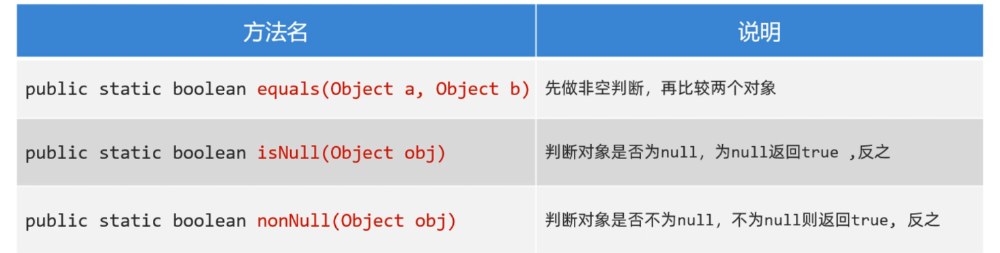
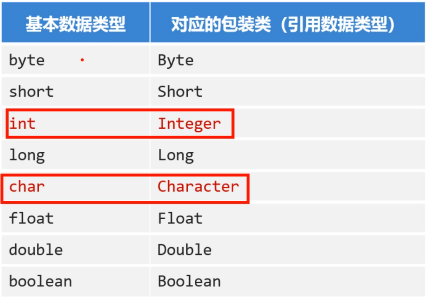

## 一，常用API介绍

### 1，常用API介绍

API（Application Programming interface）意思是应用程序编程接口，说人话就是Java帮我们写好的一些程序，如：类、方法等，我们直接拿过来用就可以解决一些问题。下图中展示了常用API对应的类：


学习API有一个特点就是听都可以听懂，但是记不住，这个大家不要担心，多记、多查、多写代码、孰能生巧！

### 2，Object类

Object类是Java中所有类的祖宗类，因此，Java中所有类的对象都可以直接使用Object类中提供的一些方法。在API文档中可以找以Object类，如下：

Object类中的toString方法可以返回对象的字符串表示形式。默认的格式是：“包名. 类名@哈希值16进制”。有一个学生类，如下：

```java
public class Student{
    private String name;
    private int age;
    
    public Student(String name, int age){
        this.name=name;
        this.age=age;
    }
}
```

测试类：

```java
public class Test{
    public static void main(String[] args){
        Student s1 = new Student("wc",23);
        System.out.println(s1.toString()); 
    }
}
```

打印结果如下：

在Student类重写toString()方法，那么我们可以返回对象的属性值，代码如下：

```java
public class Student{
    private String name;
    private int age;
    
    public Student(String name, int age){
        this.name=name;
        this.age=age;
    }
    
    @Override
    public String toString(){
        return "Student{name=‘"+name+"’, age="+age+"}";
    }
}
```

打印结果如下：

Object类的equals方法可以判断此对象与参数对象是否"相等"，测试如下：

```java
public class Test{
	public static void main(String[] args){
        Student s1 = new Student("赵薇",23);
        Student s2 = new Student("赵薇",23);
        
        //equals本身也是比较对象的地址，和"=="没有区别
        System.out.println(s1.equals(s2)); //false
         //"=="比较对象的地址
        System.out.println(s1==s2); //false
    }
}
```

重写equals方法，按照对象的属性值进行比较，如下：

```java
public class Student{
    private String name;
    private int age;
    
    public Student(String name, int age){
        this.name=name;
        this.age=age;
    }
    
    @Override
    public String toString(){
        return "Student{name=‘"+name+"’, age="+age+"}";
    }
    
    //重写equals方法，按照对象的属性值进行比较
    @Override
    public boolean equals(Object o) {
        if (this == o) return true;
        if (o == null || getClass() != o.getClass()) return false;

        Student student = (Student) o;

        if (age != student.age) return false;
        return name != null ? name.equals(student.name) : student.name == null;
    }
}
```

Object类的clone()方法，会复制一个一模一样的新对象，并返回。说白了，就是克隆当前对象，返回一个新对象。想要调用clone()方法，必须让被克隆的类实现Cloneable接口。代码如下：

```java
public class User implements Cloneable{
    private String id; //编号
    private String username; //用户名
    private String password; //密码
    private double[] scores; //分数

    public User() {
    }

    public User(String id, String username, String password, double[] scores) {
        this.id = id;
        this.username = username;
        this.password = password;
        this.scores = scores;
    }

    //...get和set...方法自己加上

    @Override
    protected Object clone() throws CloneNotSupportedException {
        return super.clone();
    }
}
```

测试类：

```java
public class Test {
    public static void main(String[] args) throws CloneNotSupportedException {
        User u1 = new User(1,"zhangsan","wo666",new double[]{99.0,99.5});
		//调用方法克隆得到一个新对象
        User u2 = (User) u1.clone();
        System.out.println(u2.getId());
        System.out.println(u2.getUsername());
        System.out.println(u2.getPassword());
        System.out.println(u2.getScores()); 
    }
}
```

打印结果发现克隆得到的对象u2它的属性值和原来u1对象的属性值是一样的。如下：

上面演示的克隆方式，是一种浅克隆的方法，浅克隆的意思：拷贝出来的对象封装的数据与原对象封装的数据一模一样（引用类型拷贝的是地址值）。


还有一种拷贝方式，称之为深拷贝，拷贝原理如下图所示：


演示深拷贝User对象，如下：

```java
public class User implements Cloneable{
    private String id; //编号
    private String username; //用户名
    private String password; //密码
    private double[] scores; //分数

    public User() {
    }

    public User(String id, String username, String password, double[] scores) {
        this.id = id;
        this.username = username;
        this.password = password;
        this.scores = scores;
    }

    //...get和set...方法自己加上

	@Override
    protected Object clone() throws CloneNotSupportedException {
        //先克隆得到一个新对象
        User u = (User) super.clone();
        //再将新对象中的引用类型数据，再次克隆
        u.scores = u.scores.clone();
        return u;
    }
}
```

测试类：

```java

```

结果如下：

### 3，Objects类

Objects是一个工具类，提供了一些方法可以对任意对象进行操作。主要方法如下：



代码演示：

```java
public class Test{
    public static void main(String[] args){
        String s1 = null;
        String s2 = "malu";
        
        //这里会出现NullPointerException异常，调用者不能为null
        System.out.println(s1.equals(s2));
        //此时不会有NullPointerException异常，底层会自动先判断空
        System.out.println(Objects.equals(s1,s2));
        
        //判断对象是否为null，等价于==
        System.out.println(Objects.isNull(s1)); //true
        System.out.println(s1==null); //true
        
        //判断对象是否不为null，等价于!=
        System.out.println(Objects.nonNull(s2)); //true
        System.out.println(s2!=null); //true
    }
}
```

### 4，基础类型包装类

Java中万物皆对象。Java中的8种基本数据类型还不是对象，所以要把它们变成对象，变成对象之后，可以提供一些方法对数据进行操作。Java中8种基本数据类型都用一个包装类与之对应，如下：



学习包装类，需要注意两点：

* 创建包装类的对象方式、自动装箱和拆箱的特性
* 利用包装类提供的方法对字符串和基本类型数据进行相互转换

创建包装类对象，代码演示：

```java
//1.创建Integer对象，封装基本类型数据10
Integer a = new Integer(10);

//2.使用Integer类的静态方法valueOf(数据)
Integer b = Integer.valueOf(10);

//3.还有一种自动装箱的写法（意思就是自动将基本类型转换为引用类型）
Integer c = 10;

//4.有装箱肯定还有拆箱（意思就是自动将引用类型转换为基本类型）
int d = c;

//5.装箱和拆箱在使用集合时就有体现
ArrayList<Integer> list = new ArrayList<>();
//添加的元素是基本类型，实际上会自动装箱为Integer类型
list.add(100);
//获取元素时，会将Integer类型自动拆箱为int类型
int e = list.get(0);
```

在开发中，经常使用包装类对字符串和基本类型数据进行相互转换。

* 把字符串转换为数值型数据：包装类.parseXxx(字符串)
* 将数值型数据转换为字符串：包装类.valueOf(数据)

代码演示：

```java
//1.字符串转换为数值型数据
String ageStr = "29";
int age1 = Integer.parseInt(ageStr);

String scoreStr = 3.14;
double score = Double.prarseDouble(scoreStr);

//2.整数转换为字符串，以下几种方式都可以（挑中你喜欢的记一下）
Integer a = 23;
String s1 = Integer.toString(a);
String s2 = a.toString();
String s3 = a+"";
String s4 = String.valueOf(a);
```
