## 一，Request对象

### 1，Request和Response的概述

Request是请求对象，Response是响应对象。这两个对象在我们使用Servlet的时候有看到：

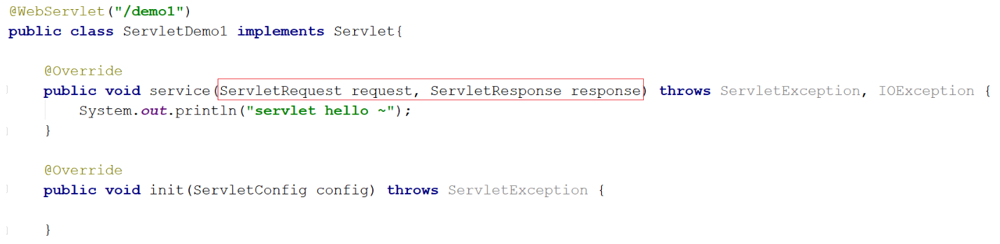

那么request和response这两个参数的作用是什么?

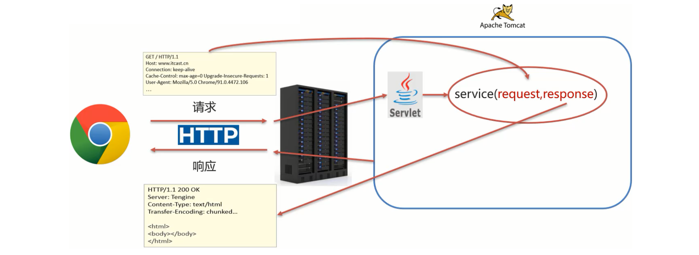

request是用来获取请求数据

* 浏览器会发送HTTP请求到后台服务器[Tomcat]
* HTTP的请求中会包含很多请求数据[请求行+请求头+请求体]
* 后台服务器[Tomcat]会对HTTP请求中的数据进行解析并把解析结果存入到一个对象中
* 所存入的对象即为request对象，所以我们可以从request对象中获取请求的相关参数
* 获取到数据后就可以继续后续的业务，比如获取用户名和密码就可以实现登录操作的相关业务

response是用来设置响应数据

* 业务处理完后，后台就需要给前端返回业务处理的结果即响应数据
* 把响应数据封装到response对象中
* 后台服务器[Tomcat]会解析response对象, 按照[响应行+响应头+响应体]格式拼接结果
* 浏览器最终解析结果，把内容展示在浏览器给用户浏览

代码演示：

```java
@WebServlet("/demo3")
public class ServletDemo3 extends HttpServlet {
    @Override
    protected void doGet(HttpServletRequest request, HttpServletResponse response) throws ServletException, IOException {
        //使用request对象 获取请求数据
        String name = request.getParameter("name");//url?name=zhangsan

        //使用response对象 设置响应数据
        response.setHeader("content-type","text/html;charset=utf-8");
        response.getWriter().write("<h1>"+name+",欢迎您！</h1>");
    }

    @Override
    protected void doPost(HttpServletRequest request, HttpServletResponse response) throws ServletException, IOException {
        System.out.println("Post...");
    }
}
```

### 2，Request继承体系

前面在介绍Request和Reponse对象的时候，比较细心的同学可能已经发现：

* 当我们的Servlet类实现的是Servlet接口的时候，service方法中的参数是ServletRequest和ServletResponse
* 当我们的Servlet类继承的是HttpServlet类的时候，doGet和doPost方法中的参数就变成HttpServletRequest和HttpServletReponse

那么，

* ServletRequest和HttpServletRequest的关系是什么?
* request对象是有谁来创建的?
* request提供了哪些API, 这些API从哪里查?

首先，我们先来看下Request的继承体系:

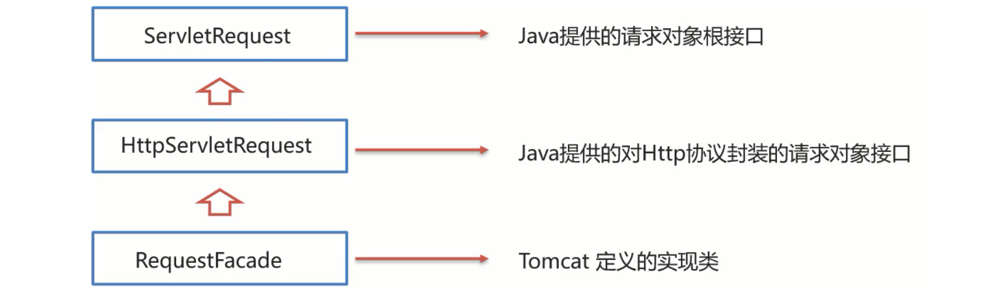

从上图中可以看出，ServletRequest和HttpServletRequest都是Java提供的，所以我们可以打开JavaEE提供的API文档：

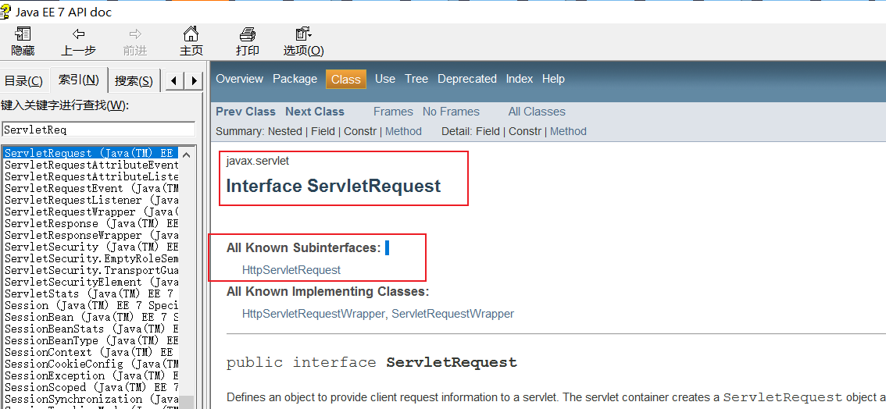

所以ServletRequest和HttpServletRequest是继承关系，并且两个都是接口，接口是无法创建对象，这个时候就引发了下面这个问题:

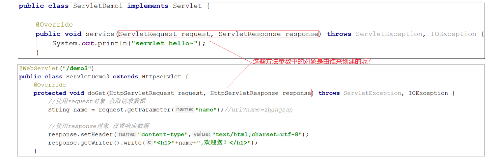

这个时候，我们就需要用到Request继承体系中的 `RequestFacade` :

* 该类实现了HttpServletRequest接口，也间接实现了ServletRequest接口。
* Servlet类中的service方法、doGet方法或者是doPost方法最终都是由Web服务器[Tomcat]来调用的，所以Tomcat提供了方法参数接口的具体实现类，并完成了对象的创建
* 要想了解RequestFacade中都提供了哪些方法，我们可以直接查看JavaEE的API文档中关于ServletRequest和HttpServletRequest的接口文档，因为RequestFacade实现了其接口就需要重写接口中的方法

对于上述结论，要想验证，可以编写一个Servlet，在方法中把request对象打印下，就能看到最终的对象是不是RequestFacade, 代码如下:

```java
@WebServlet("/demo2")
public class ServletDemo2 extends HttpServlet {
    @Override
    protected void doGet(HttpServletRequest request, HttpServletResponse response) throws ServletException, IOException {
        System.out.println(request);
    }

    @Override
    protected void doPost(HttpServletRequest request, HttpServletResponse response) throws ServletException, IOException {
    }
}
```

启动服务器，运行访问 `http://localhost:8080/request-demo/demo2` , 得到运行结果:

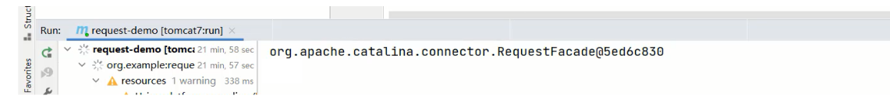

总结：

* Request的继承体系为ServletRequest=>HttpServletRequest=>RequestFacade
* Tomcat需要解析请求数据，封装为request对象, 并且创建request对象传递到service方法
* 使用request对象，可以查阅JavaEE API文档的HttpServletRequest接口中方法说明

### 3，Request获取请求数据

HTTP请求数据总共分为三部分内容，分别是请求行、请求头、请求体，对于这三部分内容的数据，分别该如何获取，首先我们先来学习请求行数据如何获取?

#### 3.1 获取请求行数据

请求行包含三块内容，分别是 `请求方式` 、 `请求资源路径` 、 `HTTP协议及版本`


对于这三部分内容，request对象都提供了对应的API方法来获取，具体如下:

* 获取请求方式: `GET`      
  + String getMethod()
* 获取虚拟目录(项目访问路径): `/request-demo`
  + String getContextPath()
* 获取URL(统一资源定位符): `http://localhost:8080/request-demo/req1`
  + StringBuffer getRequestURL()
* 获取URI(统一资源标识符): `/request-demo/req1`
  + String getRequestURI()
* 获取请求参数(GET方式): `username=zhangsan&password=123`
  + String getQueryString()

代码演示：

```java
/**
 * request 获取请求数据
 */
@WebServlet("/req1")
public class RequestDemo1 extends HttpServlet {
    @Override
    protected void doGet(HttpServletRequest req, HttpServletResponse resp) throws ServletException, IOException {
        // String getMethod()：获取请求方式： GET
        String method = req.getMethod();
        System.out.println(method);//GET
        // String getContextPath()：获取虚拟目录(项目访问路径)：/request-demo
        String contextPath = req.getContextPath();
        System.out.println(contextPath);
        // StringBuffer getRequestURL(): 获取URL(统一资源定位符)：http://localhost:8080/request-demo/req1
        StringBuffer url = req.getRequestURL();
        System.out.println(url.toString());
        // String getRequestURI()：获取URI(统一资源标识符)： /request-demo/req1
        String uri = req.getRequestURI();
        System.out.println(uri);
        // String getQueryString()：获取请求参数（GET方式）： username=zhangsan
        String queryString = req.getQueryString();
        System.out.println(queryString);
    }
    @Override
    protected void doPost(HttpServletRequest req, HttpServletResponse resp) throws ServletException, IOException {
    }
}
```

启动服务器，访问 `http://localhost:8080/request-demo/req1?username=zhangsan&passwrod=123` ，结果如下：

#### 3.2 获取请求头数据

对于请求头的数据，格式为 `key: value` 如下:


所以根据请求头名称获取对应值的方法为:

* String getHeader(String name)

代码演示获取客户端浏览器的版本信息：

```java
/**
 * request 获取请求数据
 */
@WebServlet("/req1")
public class RequestDemo1 extends HttpServlet {
    @Override
    protected void doGet(HttpServletRequest req, HttpServletResponse resp) throws ServletException, IOException {
        //获取请求头: user-agent: 浏览器的版本信息
        String agent = req.getHeader("user-agent");
		System.out.println(agent);
    }
    @Override
    protected void doPost(HttpServletRequest req, HttpServletResponse resp) throws ServletException, IOException {
    }
}
```

重新启动服务器后， `http://localhost:8080/request-demo/req1?username=zhangsan&passwrod=123` ，获取的结果如下:

#### 3.3 获取请求体数据

浏览器在发送GET请求的时候是没有请求体的，所以需要把请求方式变更为POST，请求体中的数据格式如下:


对于请求体中的数据，Request对象提供了如下两种方式来获取其中的数据，分别是:

* 获取字节输入流，如果前端发送的是字节数据，比如传递的是文件数据，则使用该方法
  + ServletInputStream getInputStream()
* 获取字符输入流，如果前端发送的是纯文本数据，则使用该方法
  + BufferedReader getReader()

获取到请求体的内容，具体实现的步骤如下：

1. 准备一个页面，在页面中添加form表单,用来发送post请求。在项目的webapp目录下添加一个html页面，名称为：`req.html`

   

```html
   <!DOCTYPE html>
   <html lang="en">

   <head>
       <meta charset="UTF-8">
       <title>Title</title>
   </head>

   <body>
       <!-- 
       action:form表单提交的请求地址
       method:请求方式，指定为post
   -->
       <form action="/request-demo/req1" method="post">
           <input type="text" name="username">
           <input type="password" name="password">
           <input type="submit">
       </form>
   </body>

   </html>
```

   

2. 在Servlet的doPost方法中获取数据

   

```java
   /**
    * request 获取请求数据
    */
   @WebServlet("/req1")
   public class RequestDemo1 extends HttpServlet {
       @Override
       protected void doGet(HttpServletRequest req, HttpServletResponse resp) throws ServletException, IOException {
       }
       @Override
       protected void doPost(HttpServletRequest req, HttpServletResponse resp) throws ServletException, IOException {
           //在此处获取请求体中的数据
       }
   }
```

   

3. 用getReader()或者getInputStream()方法，因为目前前端传递的是纯文本数据，所以我们采用getReader()方法来获取

   

```java
   /**
    * request 获取请求数据
    */
   @WebServlet("/req1")
   public class RequestDemo1 extends HttpServlet {
       @Override
       protected void doGet(HttpServletRequest req, HttpServletResponse resp) throws ServletException, IOException {
       }
       @Override
       protected void doPost(HttpServletRequest req, HttpServletResponse resp) throws ServletException, IOException {
            //获取post 请求体：请求参数
           //1. 获取字符输入流
           BufferedReader br = req.getReader();
           //2. 读取数据
           String line = br.readLine();
           System.out.println(line);
       }
   }
```

注意：BufferedReader流是通过request对象来获取的，当请求完成后request对象就会被销毁，request对象被销毁后，BufferedReader流就会自动关闭，所以此处就不需要手动关闭流了。

启动服务器，通过浏览器访问 `http://localhost:8080/request-demo/req.html` ，结果如下：

小结：

* 获取请求行
  + getMethod()获取请求方式
  + getContextPath()获取项目访问路径
  + getRequestURL()获取请求URL
  + getRequestURI()获取请求URI
  + getQueryString()获取GET请求方式的请求参数
* 获取请求头
  + getHeader(String name)根据请求头名称获取其对应的值
* 获取请求体
  + 浏览器发送的POST请求才有请求体
  + 如果是纯文本数据:getReader()
  + 如果是字节数据如文件数据:getInputStream()

#### 3.4 获取请求参数的通用方式

所谓的请求参数是我们发送请求时，传递给服务器的数据：

* get请求
  + String getQueryString()
* post请求
  + BufferedReader getReader(); 

案例需求:

* 发送一个GET请求并携带用户名，后台接收后打印到控制台
* 发送一个POST请求并携带用户名，后台接收后打印到控制台

GET请求和POST请求接收参数的方式不一样，具体实现的代码如下:

```java
@WebServlet("/req1")
public class RequestDemo1 extends HttpServlet {
    @Override
    protected void doGet(HttpServletRequest req, HttpServletResponse resp) throws ServletException, IOException {

        String result = req.getQueryString();
        System.out.println(result);

    }
    @Override
    protected void doPost(HttpServletRequest req, HttpServletResponse resp) throws ServletException, IOException {
        BufferedReader br = req.getReader();
        String result = br.readLine();
        System.out.println(result);
    }
}
```

对于上述的代码，会存在什么问题呢?

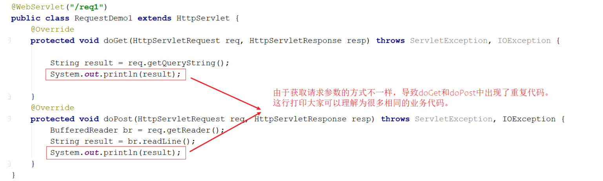

如何解决上述重复代码的问题呢?

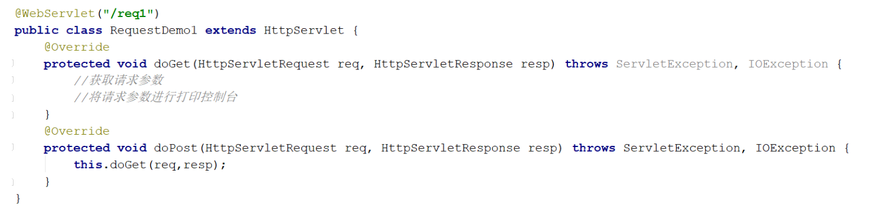

当然，也可以在doGet中调用doPost, 在doPost中完成参数的获取和打印, 另外需要注意的是，doGet和doPost方法都必须存在，不能删除任意一个。GET请求和POST请求获取请求参数的方式不一样，在获取请求参数这块该如何实现呢? GET请求方式和POST请求方式区别主要在于获取请求参数的方式不一样，是否可以提供一种统一获取请求参数的方式，从而统一doGet和doPost方法内的代码?

解决方案一：

```java
@WebServlet("/req1")
public class RequestDemo1 extends HttpServlet {
    @Override
    protected void doGet(HttpServletRequest req, HttpServletResponse resp) throws ServletException, IOException {
        //获取请求方式
        String method = req.getMethod();
        //获取请求参数
        String params = "";
        if("GET".equals(method)){
            params = req.getQueryString();
        }else if("POST".equals(method)){
            BufferedReader reader = req.getReader();
            params = reader.readLine();
        }
        //将请求参数进行打印控制台
        System.out.println(params);
      
    }
    @Override
    protected void doPost(HttpServletRequest req, HttpServletResponse resp) throws ServletException, IOException {
        this.doGet(req,resp);
    }
}
```

使用request的getMethod()来获取请求方式，根据请求方式的不同分别获取请求参数值，这样就可以解决上述问题，但是以后每个Servlet都需要这样写代码，实现起来比较麻烦，这种方案我们不采用。request对象已经将上述获取请求参数的方法进行了封装，并且request提供的方法实现的功能更强大，以后只需要调用request提供的方法即可，在request的方法中都实现了哪些操作?

* 根据不同的请求方式获取请求参数，获取的内容如下:

  


* 把获取到的内容进行分割，内容如下:

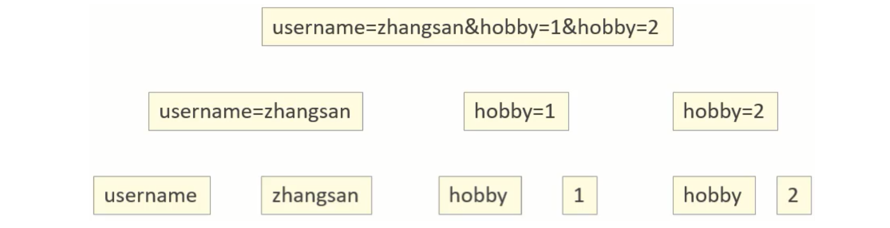

* 把分割后端数据，存入到一个Map集合中(因为参数的值可能是一个，也可能有多个，所以Map的值的类型为String数组。):

  


基于上述理论，request对象为我们提供了如下方法:

* 获取所有参数Map集合
  + Map<String, String[]> getParameterMap()
* 根据名称获取参数值（数组）
  + String[] getParameterValues(String name)
* 根据名称获取参数值(单个值)
  + String getParameter(String name)

接下来，开始代码演示，修改req.html页面，添加爱好选项，爱好可以同时选多个：

```html
<!DOCTYPE html>
<html lang="en">

<head>
    <meta charset="UTF-8">
    <title>Title</title>
</head>

<body>
    <form action="/request-demo/req2" method="get">
        <input type="text" name="username"><br>
        <input type="password" name="password"><br>
        <input type="checkbox" name="hobby" value="1"> 游泳
        <input type="checkbox" name="hobby" value="2"> 爬山 <br>
        <input type="submit">

    </form>
</body>

</html>
```

在Servlet代码中获取页面传递GET请求的参数值。获取GET方式的所有请求参数：

```java
/**
 * request 通用方式获取请求参数
 */
@WebServlet("/req2")
public class RequestDemo2 extends HttpServlet {
    @Override
    protected void doGet(HttpServletRequest req, HttpServletResponse resp) throws ServletException, IOException {
        //GET请求逻辑
        System.out.println("get....");
        //1. 获取所有参数的Map集合
        Map<String, String[]> map = req.getParameterMap();
        for (String key : map.keySet()) {
            // username:zhangsan lisi
            System.out.print(key+":");

            //获取值
            String[] values = map.get(key);
            for (String value : values) {
                System.out.print(value + " ");
            }

            System.out.println();
        }
    }

    @Override
    protected void doPost(HttpServletRequest req, HttpServletResponse resp) throws ServletException, IOException {
    }
}
```

获取的结果为:


获取GET请求参数中的爱好，结果是数组值：

```java
/**
 * request 通用方式获取请求参数
 */
@WebServlet("/req2")
public class RequestDemo2 extends HttpServlet {
    @Override
    protected void doGet(HttpServletRequest req, HttpServletResponse resp) throws ServletException, IOException {
        //GET请求逻辑
        //...
        System.out.println("------------");
        String[] hobbies = req.getParameterValues("hobby");
        for (String hobby : hobbies) {
            System.out.println(hobby);
        }
    }

    @Override
    protected void doPost(HttpServletRequest req, HttpServletResponse resp) throws ServletException, IOException {
    }
}
```

获取的结果为:


获取GET请求参数中的用户名和密码，结果是单个值

```java
/**
 * request 通用方式获取请求参数
 */
@WebServlet("/req2")
public class RequestDemo2 extends HttpServlet {
    @Override
    protected void doGet(HttpServletRequest req, HttpServletResponse resp) throws ServletException, IOException {
        //GET请求逻辑
        //...
        String username = req.getParameter("username");
        String password = req.getParameter("password");
        System.out.println(username);
        System.out.println(password);
    }

    @Override
    protected void doPost(HttpServletRequest req, HttpServletResponse resp) throws ServletException, IOException {
    }
}
```

获取的结果为：


同理，测试Post请求：

* 将req.html页面form表单的提交方式改成post
* 将doGet方法中的内容复制到doPost方法中即可

总结：

* req.getParameter()方法使用的频率会比较高

* 以后我们再写代码的时候，就只需要按照如下格式来编写:

  

```java
  public class RequestDemo1 extends HttpServlet {
      @Override
      protected void doGet(HttpServletRequest req, HttpServletResponse resp) throws ServletException, IOException {
         //采用request提供的获取请求参数的通用方式来获取请求参数
         //编写其他的业务代码...
      }
      @Override
      protected void doPost(HttpServletRequest req, HttpServletResponse resp) throws ServletException, IOException {
          this.doGet(req,resp);
      }
  }
```

  

### 4，IDEA快速创建Servlet

使用通用方式获取请求参数后，屏蔽了GET和POST的请求方式代码的不同，则代码可以定义如下格式:

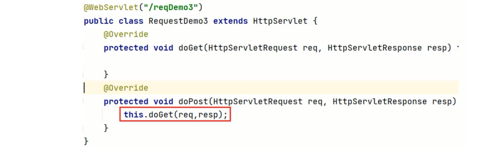

由于格式固定，所以我们可以使用IDEA提供的模板来制作一个Servlet的模板，这样我们后期在创建Servlet的时候就会更高效，具体如何实现:

1. 按照自己的需求，修改Servlet创建的模板内容

   

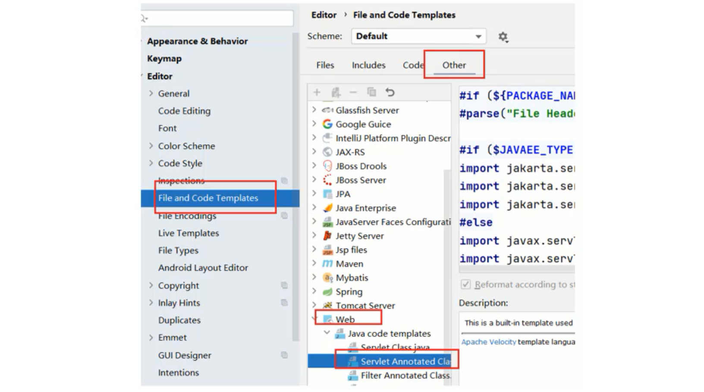

2. 使用servlet模板创建Servlet类

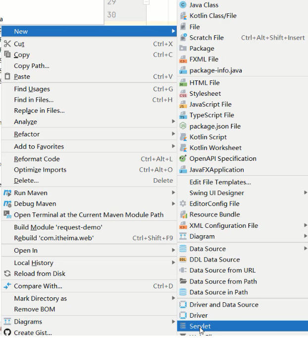

### 5，请求参数中文乱码问题

问题展示：将req.html页面的请求方式修改为get

```html
<!DOCTYPE html>
<html lang="en">

<head>
    <meta charset="UTF-8">
    <title>Title</title>
</head>

<body>
    <form action="/request-demo/req2" method="get">
        <input type="text" name="username"><br>
        <input type="password" name="password"><br>
        <input type="checkbox" name="hobby" value="1"> 游泳
        <input type="checkbox" name="hobby" value="2"> 爬山 <br>
        <input type="submit">

    </form>
</body>

</html>
```

在Servlet方法中获取参数，并打印：

```java
/**
 * 中文乱码问题解决方案
 */
@WebServlet("/req4")
public class RequestDemo4 extends HttpServlet {
    @Override
    protected void doGet(HttpServletRequest request, HttpServletResponse response) throws ServletException, IOException {
       //1. 获取username
       String username = request.getParameter("username");
       System.out.println(username);
    }

    @Override
    protected void doPost(HttpServletRequest request, HttpServletResponse response) throws ServletException, IOException {
        this.doGet(request, response);
    }
}
```

启动服务器，页面上输入中文参数:

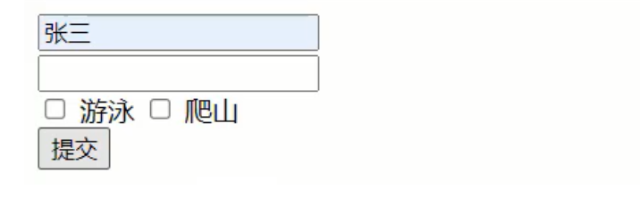

查看控制台打印内容


把req.html页面的请求方式改成post, 再次发送请求和中文参数

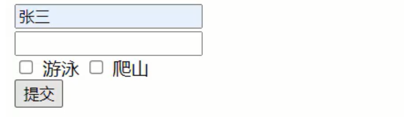

查看控制台打印内容，依然为乱码


通过上面的案例，会发现，不管是GET还是POST请求，在发送的请求参数中如果有中文，在后台接收的时候，都会出现中文乱码的问题。具体该如何解决呢？

#### 5.1 POST请求解决方案

分析出现中文乱码的原因：

* POST的请求参数是通过request的getReader()来获取流中的数据
* TOMCAT在获取流的时候采用的编码是ISO-8859-1
* ISO-8859-1编码是不支持中文的，所以会出现乱码

解决方案：

* 页面设置的编码格式为UTF-8
* 把TOMCAT在获取流数据之前的编码设置为UTF-8
* 通过request.setCharacterEncoding("UTF-8")设置编码, UTF-8也可以写成小写

修改后的代码为：

```java
/**
 * 中文乱码问题解决方案
 */
@WebServlet("/req4")
public class RequestDemo4 extends HttpServlet {
    @Override
    protected void doGet(HttpServletRequest request, HttpServletResponse response) throws ServletException, IOException {
        //1. 解决乱码: POST getReader()
        //设置字符输入流的编码，设置的字符集要和页面保持一致
        request.setCharacterEncoding("UTF-8");
       //2. 获取username
       String username = request.getParameter("username");
       System.out.println(username);
    }

    @Override
    protected void doPost(HttpServletRequest request, HttpServletResponse response) throws ServletException, IOException {
        this.doGet(request, response);
    }
}
```

重新发送POST请求，就会在控制台看到正常展示的中文结果。至此POST请求中文乱码的问题就已经解决，但是这种方案不适用于GET请求。

#### 5.2 GET请求解决方案

分析：

* GET请求获取请求参数的方式是`request.getQueryString()`
* POST请求获取请求参数的方式是`request.getReader()`
* request.setCharacterEncoding("utf-8")是设置request处理流的编码
* getQueryString方法并没有通过流的方式获取数据

所以GET请求不能用设置编码的方式来解决中文乱码问题，那问题又来了，如何解决GET请求的中文乱码呢? 首先我们需要先分析下GET请求出现乱码的原因:

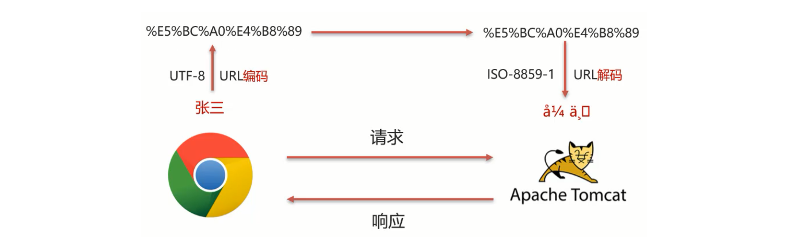

流程如下：

1. 浏览器通过HTTP协议发送请求和数据给后台服务器（Tomcat)
2. 浏览器在发送HTTP的过程中会对中文数据进行URL编码
3. 在进行URL编码的时候会采用页面`meta`标签指定的UTF-8的方式进行编码，`张三`编码后的结果为`%E5%BC%A0%E4%B8%89`
4. 后台服务器(Tomcat)接收到`%E5%BC%A0%E4%B8%89`后会默认按照`ISO-8859-1`进行URL解码
5. 由于前后编码与解码采用的格式不一样，就会导致后台获取到的数据为乱码。

思考: 如果把 `req.html` 页面的 `<meta>` 标签的charset属性改成 `ISO-8859-1` , 后台不做操作，能解决中文乱码问题么?

答案是否定的，因为 `ISO-8859-1` 本身是不支持中文展示的，所以改了meta标签的charset属性后，会导致页面上的中文内容都无法正常展示。

分析完上面的问题后，我们会发现，其中有两个我们不熟悉的内容就是URL编码和URL解码，什么是URL编码，什么又是URL解码呢? 这块知识我们只需要了解下即可, 具体编码过程分两步，分别是:

1. 将字符串按照编码方式转为二进制
2. 每个字节转为2个16进制数并在前边加上%

`张三` 按照UTF-8的方式转换成二进制的结果为:

```
1110 0101 1011 1100 1010 0000 1110 0100 1011 1000 1000 1001
```

这个结果是如何计算的? 使用 `http://www.mytju.com/classcode/tools/encode_utf8.asp` ，输入 `张三`

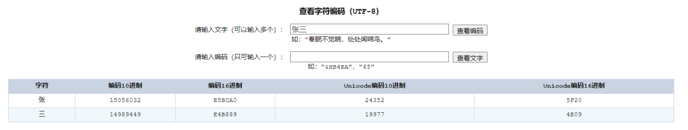

就可以获取张和三分别对应的10进制，然后在使用计算器，选择程序员模式，计算出对应的二进制数据结果:

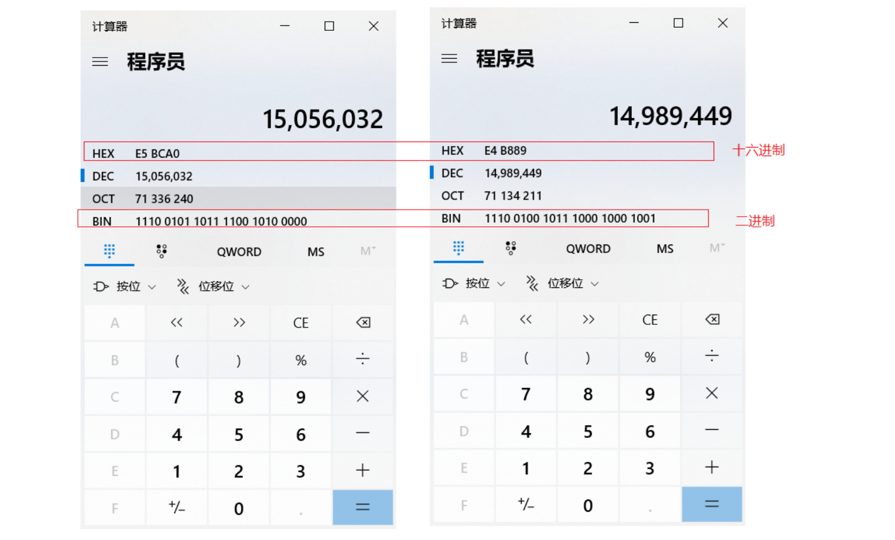

在计算的十六进制结果中，每两位前面加一个%, 就可以获取到 `%E5%BC%A0%E4%B8%89` 。当然你从上面所提供的网站中就已经能看到编码16进制的结果了:

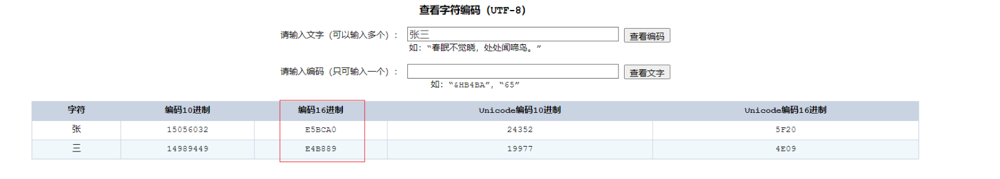

但是对于上面的计算过程，如果没有工具，纯手工计算的话，相对来说还是比较复杂的，我们也不需要进行手动计算，在Java中已经为我们提供了编码和解码的API工具类可以让我们更快速的进行编码和解码:

编码：

```java
java.net.URLEncoder.encode("需要被编码的内容","字符集(UTF-8)")
```

解码：

```java
java.net.URLDecoder.decode("需要被解码的内容","字符集(UTF-8)")
```

接下来咱们对 `张三` 来进行编码和解码

```java
public class URLDemo {

  public static void main(String[] args) throws UnsupportedEncodingException {
        String username = "张三";
        //1. URL编码
        String encode = URLEncoder.encode(username, "utf-8");
        System.out.println(encode); //打印:%E5%BC%A0%E4%B8%89

       //2. URL解码
       //String decode = URLDecoder.decode(encode, "utf-8");//打印:张三
       String decode = URLDecoder.decode(encode, "ISO-8859-1");//打印:`å¼ ä¸ `
       System.out.println(decode);
    }
}
```

到这，我们就可以分析出GET请求中文参数出现乱码的原因了，

* 浏览器把中文参数按照`UTF-8`进行URL编码
* Tomcat对获取到的内容进行了`ISO-8859-1`的URL解码
* 在控制台就会出现类上`å¼ ä¸‰`的乱码，最后一位是个空格

清楚了出现乱码的原因，接下来我们就需要想办法进行解决

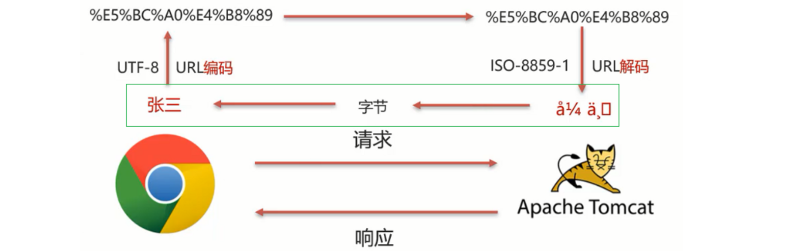

在进行编码和解码的时候，不管使用的是哪个字符集，他们对应的 `%E5%BC%A0%E4%B8%89` 是一致的。那他们对应的二进制值也是一样的，为:

```
1110 0101 1011 1100 1010 0000 1110 0100 1011 1000 1000 1001
```

为所以我们可以考虑把 `å¼ ä¸‰` 转换成字节，在把字节转换成 `张三` ，在转换的过程中是它们的编码一致，就可以解决中文乱码问题。具体的实现步骤为:

1. 按照ISO-8859-1编码获取乱码`å¼ ä¸‰`对应的字节数组

2. 按照UTF-8编码获取字节数组对应的字符串

代码实现：

```java
public class URLDemo {

  public static void main(String[] args) throws UnsupportedEncodingException {
        String username = "张三";
        //1. URL编码
        String encode = URLEncoder.encode(username, "utf-8");
        System.out.println(encode);
        //2. URL解码
        String decode = URLDecoder.decode(encode, "ISO-8859-1");

        System.out.println(decode); //此处打印的是对应的乱码数据

        //3. 转换为字节数据,编码
        byte[] bytes = decode.getBytes("ISO-8859-1");
        for (byte b : bytes) {
            System.out.print(b + " ");
        }
		//此处打印的是:-27 -68 -96 -28 -72 -119
        //4. 将字节数组转为字符串，解码
        String s = new String(bytes, "utf-8");
        System.out.println(s); //此处打印的是张三
    }
}
```

打印的数据是 `-27 -68 -96 -28 -72 -119` 和 `张三` 转换成的二进制数据 `1110 0101 1011 1100 1010 0000 1110 0100 1011 1000 1000 1001` 为什么不一样呢？其实打印出来的是十进制数据，我们只需要使用计算机换算下就能得到他们的对应关系，如下图:

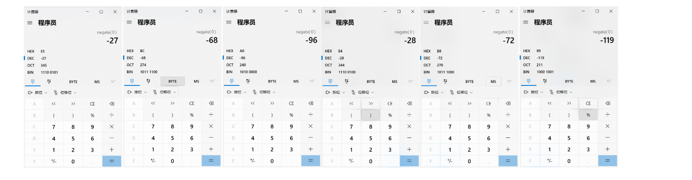

至此对于GET请求中文乱码的解决方案，我们就已经分析完了，最后在代码中去实现下:

```java
/**
 * 中文乱码问题解决方案
 */
@WebServlet("/req4")
public class RequestDemo4 extends HttpServlet {
    @Override
    protected void doGet(HttpServletRequest request, HttpServletResponse response) throws ServletException, IOException {
        //1. 解决乱码：POST，getReader()
        //request.setCharacterEncoding("UTF-8");//设置字符输入流的编码

        //2. 获取username
        String username = request.getParameter("username");
        System.out.println("解决乱码前："+username);

        //3. GET,获取参数的方式：getQueryString
        // 乱码原因：tomcat进行URL解码，默认的字符集ISO-8859-1
       /* //3.1 先对乱码数据进行编码：转为字节数组
        byte[] bytes = username.getBytes(StandardCharsets.ISO_8859_1);
        //3.2 字节数组解码
        username = new String(bytes, StandardCharsets.UTF_8);*/

        username  = new String(username.getBytes(StandardCharsets.ISO_8859_1),StandardCharsets.UTF_8);

        System.out.println("解决乱码后："+username);

    }

    @Override
    protected void doPost(HttpServletRequest request, HttpServletResponse response) throws ServletException, IOException {
        this.doGet(request, response);
    }
}
```

注意细节：

* 把`request.setCharacterEncoding("UTF-8")`代码注释掉后，会发现GET请求参数乱码解决方案同时也可也把POST请求参数乱码的问题也解决了
* 只不过对于POST请求参数一般都会比较多，采用这种方式解决乱码起来比较麻烦，所以对于POST请求还是建议使用设置编码的方式进行。
* Tomcat8.0之后，已将GET请求乱码问题解决，设置默认的解码方式为UTF-8

总结：

* POST请求和GET请求的参数中如果有中文，后台接收数据就会出现中文乱码问题。GET请求在Tomcat8.0以后的版本就不会出现了。

* POST请求解决方案是: 设置输入流的编码

  

```java
  request.setCharacterEncoding("UTF-8");
  注意:设置的字符集要和页面保持一致
```

* 通用方式（GET/POST）：需要先解码，再编码

  

```java
  new String(username.getBytes("ISO-8859-1"),"UTF-8");
```

* URL编码:

  

```java
  URLEncoder.encode(str,"UTF-8");
```

* URL解码:

  

```java
  URLDecoder.decode(s,"ISO-8859-1");
```

  

### 6，Request请求转发

#### 6.1 请求转发演示

请求转发(forward): 一种在服务器内部的资源跳转方式。

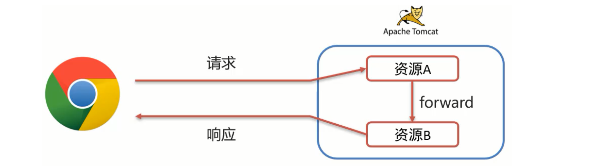

流程：

1. 浏览器发送请求给服务器，服务器中对应的资源A接收到请求
2. 资源A处理完请求后将请求发给资源B
3. 资源B处理完后将结果响应给浏览器
4. 请求从资源A到资源B的过程就叫请求转发

请求转发的实现方式:

```java
req.getRequestDispatcher("资源B路径").forward(req,resp);
```

具体如何来使用，我们先来看下需求:

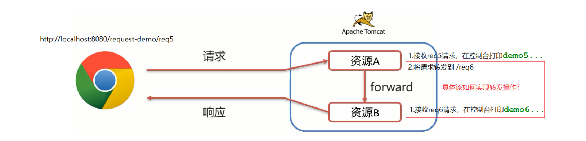

代码演示：

1. 创建一个RequestDemo5类，接收/req5的请求，在doGet方法中打印`demo5`

   

```java
   /**
    * 请求转发
    */
   @WebServlet("/req5")
   public class RequestDemo5 extends HttpServlet {
       @Override
       protected void doGet(HttpServletRequest request, HttpServletResponse response) throws ServletException, IOException {
           System.out.println("demo5...");
       }
   
       @Override
       protected void doPost(HttpServletRequest request, HttpServletResponse response) throws ServletException, IOException {
           this.doGet(request, response);
       }
   }
```

2. 创建一个RequestDemo6类，接收/req6的请求，在doGet方法中打印`demo6`

   

```java
   /**
    * 请求转发
    */
   @WebServlet("/req6")
   public class RequestDemo6 extends HttpServlet {
       @Override
       protected void doGet(HttpServletRequest request, HttpServletResponse response) throws ServletException, IOException {
           System.out.println("demo6...");
       }
   
       @Override
       protected void doPost(HttpServletRequest request, HttpServletResponse response) throws ServletException, IOException {
           this.doGet(request, response);
       }
   }
```

3. 在RequestDemo5的doGet方法中进行请求转发

   

```java
   /**
    * 请求转发
    */
   @WebServlet("/req5")
   public class RequestDemo5 extends HttpServlet {
       @Override
       protected void doGet(HttpServletRequest request, HttpServletResponse response) throws ServletException, IOException {
           System.out.println("demo5...");
           //请求转发
           request.getRequestDispatcher("/req6").forward(request,response);
       }
   
       @Override
       protected void doPost(HttpServletRequest request, HttpServletResponse response) throws ServletException, IOException {
           this.doGet(request, response);
       }
   }
```

4. 启动测试，访问`http://localhost:8080/request-demo/req5`,就可以在控制台看到如下内容:

   


#### 6.2 请求转发资源间共享数据

把请求从`/req5`转发到`/req6`的时候，如何传递数据给`/req6`。需要使用request对象提供的三个方法:

- 存储数据到request域[范围,数据是存储在request对象]中
  - void setAttribute(String name,Object o);
- 根据key获取值
  - Object getAttribute(String name);
- 根据key删除该键值对
  - void removeAttribute(String name);


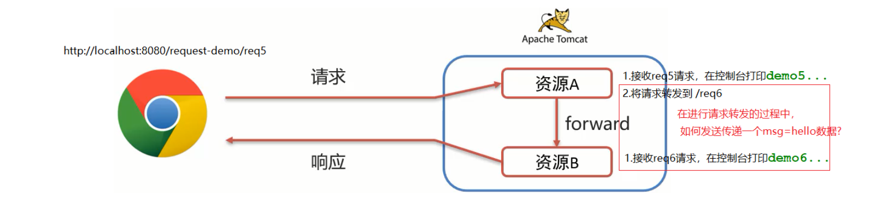


操作流程：

1. 在RequestDemo5的doGet方法中转发请求之前，将数据存入request域对象中

   ```java
   @WebServlet("/req5")
   public class RequestDemo5 extends HttpServlet {
       @Override
       protected void doGet(HttpServletRequest request, HttpServletResponse response) throws ServletException, IOException {
           System.out.println("demo5...");
           //存储数据
           request.setAttribute("msg","hello");
           //请求转发
           request.getRequestDispatcher("/req6").forward(request,response);
   
       }
   
       @Override
       protected void doPost(HttpServletRequest request, HttpServletResponse response) throws ServletException, IOException {
           this.doGet(request, response);
       }
   }
   ```

   

2. 在RequestDemo6的doGet方法从request域对象中获取数据，并将数据打印到控制台

   ```java
   /**
    * 请求转发
    */
   @WebServlet("/req6")
   public class RequestDemo6 extends HttpServlet {
       @Override
       protected void doGet(HttpServletRequest request, HttpServletResponse response) throws ServletException, IOException {
           System.out.println("demo6...");
           //获取数据
           Object msg = request.getAttribute("msg");
           System.out.println(msg);
   
       }
   
       @Override
       protected void doPost(HttpServletRequest request, HttpServletResponse response) throws ServletException, IOException {
           this.doGet(request, response);
       }
   }
   ```

   

3. 启动测试。访问`http://localhost:8080/request-demo/req5`,就可以在控制台看到如下内容:

   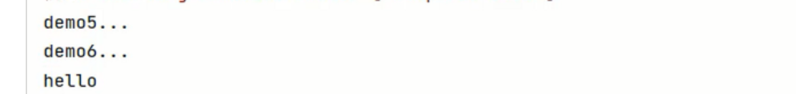


#### 6.3 请求转发的特点

- 虽然后台从`/req5`转发到`/req6`,但是浏览器的地址一直是`/req5`,未发生变化
- 只能转发到当前服务器的内部资源，不能从一个服务器通过转发访问另一台服务器
- 一次请求，可以在转发资源间使用request共享数据，虽然后台从`/req5`转发到`/req6`，但是这个只有一次请求


## 二，Response对象

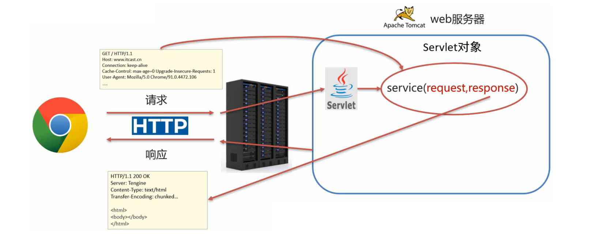


- Request:使用request对象来获取请求数据
- Response:使用response对象来设置响应数据


Reponse的继承体系和Request的继承体系也非常相似:

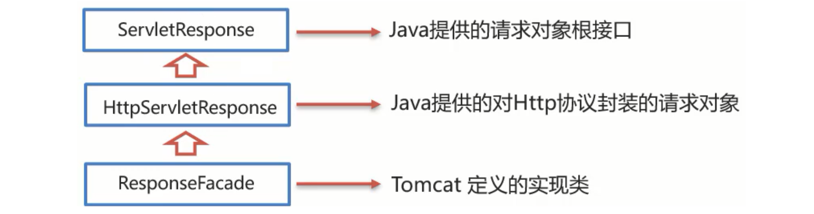


### 1，Response设置响应数据功能介绍

HTTP响应数据总共分为三部分内容，分别是响应行、响应头、响应体，对于这三部分内容的数据，respone对象都提供了哪些方法来进行设置?

对于响应行，比较常用的就是设置响应状态码:


设置响应头键值对：


对于响应体，是通过字符、字节输出流的方式往浏览器写：


获取字符输出流:

- PrintWriter getWriter();

获取字节输出流

- ServletOutputStream getOutputStream();

### 2，Respones请求重定向

#### 2.1 完成重定向

Response重定向(redirect):一种资源跳转方式。

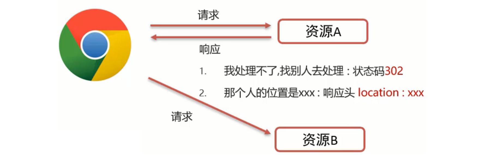


流程：

1. 浏览器发送请求给服务器，服务器中对应的资源A接收到请求
2. 资源A现在无法处理该请求，就会给浏览器响应一个302的状态码+location的一个访问资源B的路径
3. 浏览器接收到响应状态码为302就会重新发送请求到location对应的访问地址去访问资源B
4. 资源B接收到请求后进行处理并最终给浏览器响应结果，这整个过程就叫重定向


先来看如下需求:

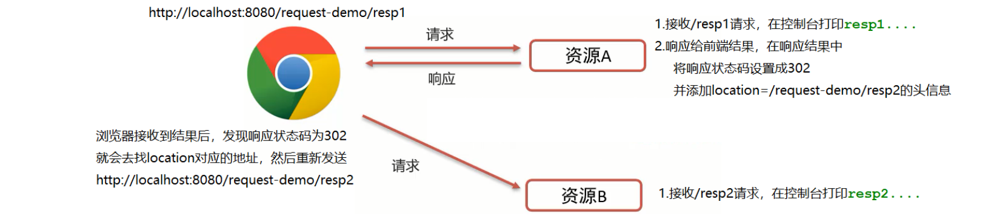


实现上面的需求：

1. 创建一个ResponseDemo1类，接收/resp1的请求，在doGet方法中打印`resp1....`

   ```java
   @WebServlet("/resp1")
   public class ResponseDemo1 extends HttpServlet {
       @Override
       protected void doGet(HttpServletRequest request, HttpServletResponse response) throws ServletException, IOException {
           System.out.println("resp1....");
       }
   
       @Override
       protected void doPost(HttpServletRequest request, HttpServletResponse response) throws ServletException, IOException {
           this.doGet(request, response);
       }
   }
   ```

   

2. 创建一个ResponseDemo2类，接收/resp2的请求，在doGet方法中打印`resp2....`

   ```java
   @WebServlet("/resp1")
   public class ResponseDemo1 extends HttpServlet {
       @Override
       protected void doGet(HttpServletRequest request, HttpServletResponse response) throws ServletException, IOException {
           System.out.println("resp1....");
       }
   
       @Override
       protected void doPost(HttpServletRequest request, HttpServletResponse response) throws ServletException, IOException {
           this.doGet(request, response);
       }
   }
   ```

   

3. 在ResponseDemo1的doGet方法中给前端响应数据

   ```java
   @WebServlet("/resp1")
   public class ResponseDemo1 extends HttpServlet {
       @Override
       protected void doGet(HttpServletRequest request, HttpServletResponse response) throws ServletException, IOException {
           System.out.println("resp1....");
           //重定向
           //1.设置响应状态码 302
           response.setStatus(302);
           //2. 设置响应头 Location    resp.setHeader("location","资源B的访问路径");
           response.setHeader("Location","/request-demo/resp2");
       }
   
       @Override
       protected void doPost(HttpServletRequest request, HttpServletResponse response) throws ServletException, IOException {
           this.doGet(request, response);
       }
   }
   ```

   

4. 启动测试，访问`http://localhost:8080/request-demo/resp1`,就可以在控制台看到如下内容:

   

说明`/resp1`和`/resp2`都被访问到了。到这重定向就已经完成了。虽然功能已经实现，但是从设置重定向的两行代码来看，会发现除了重定向的地址不一样，其他的内容都是一模一样，所以request对象给我们提供了简化的编写方式为:

```java
resposne.sendRedirect("/request-demo/resp2")
```


所以第3步中的代码就可以简化为：

```java
@WebServlet("/resp1")
public class ResponseDemo1 extends HttpServlet {
    @Override
    protected void doGet(HttpServletRequest request, HttpServletResponse response) throws ServletException, IOException {
        System.out.println("resp1....");
        //重定向
        resposne.sendRedirect("/request-demo/resp2")；
    }

    @Override
    protected void doPost(HttpServletRequest request, HttpServletResponse response) throws ServletException, IOException {
        this.doGet(request, response);
    }
}
```


#### 2.2 重定向的特点

- 当进行重定向访问的时候，由于是由浏览器发送的两次请求，所以地址会发生变化
- 可以重定向到任何位置的资源(服务内容、外部均可)
- 两次请求，不能在多个资源使用request共享数据。因为浏览器发送了两次请求，是两个不同的request对象，就无法通过request对象进行共享数据


介绍完请求重定向和请求转发以后，接下来需要把这两个放在一块对比下:

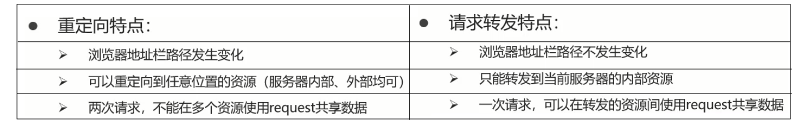

以后到底用哪个，还是需要根据具体的业务来决定。


### 3，路径问题

问题1：转发的时候路径上没有加`/request-demo`而重定向加了，那么到底什么时候需要加，什么时候不需要加呢?

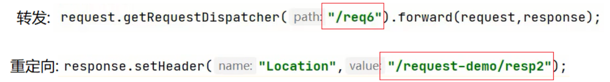


其实判断的依据很简单，只需要记住下面的规则即可:

- 浏览器使用:需要加虚拟目录(项目访问路径)
- 服务端使用:不需要加虚拟目录


对于转发来说，因为是在服务端进行的，所以不需要加虚拟目录。对于重定向来说，路径最终是由浏览器来发送请求，就需要添加虚拟目录。掌握了这个规则，接下来就通过一些练习来强化下知识的学习:

```java
<a href='路劲'>   // 超链接，从浏览器发送，需要加
<form action='路径'> // 表单，从浏览器发送，需要加
req.getRequestDispatcher("路径") // 转发，是从服务器内部跳转，不需要加
resp.sendRedirect("路径") // 重定向，是由浏览器进行跳转，需要加
```


问题2：在重定向的代码中，`/request-demo`是固定编码的，如果后期通过Tomcat插件配置了项目的访问路径，那么所有需要重定向的地方都需要重新修改，该如何优化?

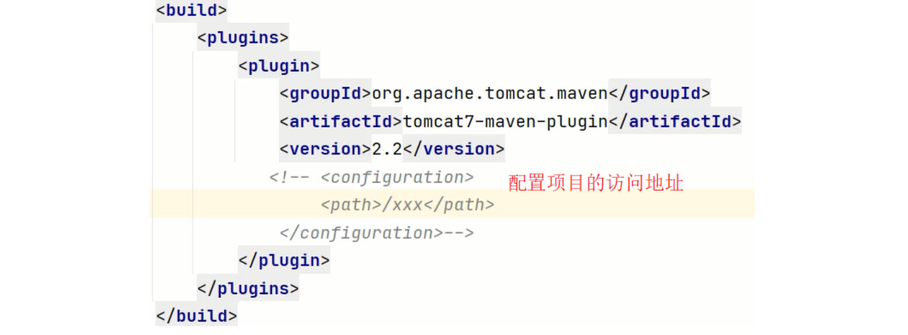


答案也比较简单，我们可以在代码中动态去获取项目访问的虚拟目录，具体如何获取，我们可以借助前面咱们所学习的request对象中的getContextPath()方法，修改后的代码如下:

```java
@WebServlet("/resp1")
public class ResponseDemo1 extends HttpServlet {
    @Override
    protected void doGet(HttpServletRequest request, HttpServletResponse response) throws ServletException, IOException {
        System.out.println("resp1....");

        //简化方式完成重定向
        //动态获取虚拟目录
        String contextPath = request.getContextPath();
        response.sendRedirect(contextPath+"/resp2");
    }

    @Override
    protected void doPost(HttpServletRequest request, HttpServletResponse response) throws ServletException, IOException {
        this.doGet(request, response);
    }
}
```

重新启动访问测试，功能依然能够实现，此时就可以动态获取项目访问的虚拟路径，从而降低代码的耦合度。


### 4，Response响应字符数据

要想将字符数据写回到浏览器，我们需要两个步骤:

- 通过Response对象获取字符输出流： PrintWriter writer = resp.getWriter();
- 通过字符输出流写数据: writer.write("aaa");


返回一个简单的字符串`aaa`，代码演示：

```java
/**
 * 响应字符数据：设置字符数据的响应体
 */
@WebServlet("/resp3")
public class ResponseDemo3 extends HttpServlet {
    @Override
    protected void doGet(HttpServletRequest request, HttpServletResponse response) throws ServletException, IOException {
        response.setContentType("text/html;charset=utf-8");
        //1. 获取字符输出流
        PrintWriter writer = response.getWriter();
		 writer.write("aaa");
    }
    @Override
    protected void doPost(HttpServletRequest request, HttpServletResponse response) throws ServletException, IOException {
        this.doGet(request, response);
    }
}
```


返回一串html字符串，并且能被浏览器解析。代码演示：

```java
PrintWriter writer = response.getWriter();
//content-type，告诉浏览器返回的数据类型是HTML类型数据，这样浏览器才会解析HTML标签
response.setHeader("content-type","text/html");
writer.write("<h1>aaa</h1>");

// 注意：一次请求响应结束后，response对象就会被销毁掉，所以不要手动关闭流。
```


返回一个中文的字符串`你好`，需要注意设置响应数据的编码为`utf-8`。代码演示：

```java
//设置响应的数据格式及数据的编码
response.setContentType("text/html;charset=utf-8");
writer.write("你好");
```


### 5，Response响应字节数据

要想将字节数据写回到浏览器，我们需要两个步骤:

- 通过Response对象获取字节输出流：ServletOutputStream outputStream = resp.getOutputStream();
- 通过字节输出流写数据: outputStream.write(字节数据);


返回一个图片文件到浏览器。代码演示：

```java
/**
 * 响应字节数据：设置字节数据的响应体
 */
@WebServlet("/resp4")
public class ResponseDemo4 extends HttpServlet {
    @Override
    protected void doGet(HttpServletRequest request, HttpServletResponse response) throws ServletException, IOException {
        //1. 读取文件
        FileInputStream fis = new FileInputStream("d://a.jpg");
        //2. 获取response字节输出流
        ServletOutputStream os = response.getOutputStream();
        //3. 完成流的copy
        byte[] buff = new byte[1024];
        int len = 0;
        while ((len = fis.read(buff))!= -1){
            os.write(buff,0,len);
        }
        fis.close();
    }

    @Override
    protected void doPost(HttpServletRequest request, HttpServletResponse response) throws ServletException, IOException {
        this.doGet(request, response);
    }
}
```


上述代码中，对于流的copy的代码还是比较复杂的，所以我们可以使用别人提供好的方法来简化代码的开发，具体的步骤是:

1. pom.xml添加依赖

   ```xml
   <dependency>
       <groupId>commons-io</groupId>
       <artifactId>commons-io</artifactId>
       <version>2.6</version>
   </dependency>
   ```

   

2. 调用工具类方法

   ```java
   //fis:输入流
   //os:输出流
   IOUtils.copy(fis,os);
   ```


优化后的代码:

```java
/**
 * 响应字节数据：设置字节数据的响应体
 */
@WebServlet("/resp4")
public class ResponseDemo4 extends HttpServlet {
    @Override
    protected void doGet(HttpServletRequest request, HttpServletResponse response) throws ServletException, IOException {
        //1. 读取文件
        FileInputStream fis = new FileInputStream("d://a.jpg");
        //2. 获取response字节输出流
        ServletOutputStream os = response.getOutputStream();
        //3. 完成流的copy
      	IOUtils.copy(fis,os);
        fis.close();
    }

    @Override
    protected void doPost(HttpServletRequest request, HttpServletResponse response) throws ServletException, IOException {
        this.doGet(request, response);
    }
}
```


## 三，用户注册登录案例

### 1，准备工作

数据库准备数据如下：


对应的SQL文件如下：

```mysql

```


准备pojo，如下：


参考代码如下：

```java

```


在项目的pom.xml导入Mybatis和Mysql驱动坐标

```xml
<dependency>
    <groupId>org.mybatis</groupId>
    <artifactId>mybatis</artifactId>
    <version>3.5.5</version>
</dependency>

<dependency>
    <groupId>mysql</groupId>
    <artifactId>mysql-connector-java</artifactId>
    <version>5.1.34</version>
</dependency>
```


创建mybatis-config.xml核心配置文件：


参考代码如下：

```xml
<?xml version="1.0" encoding="UTF-8" ?>
<!DOCTYPE configuration
        PUBLIC "-//mybatis.org//DTD Config 3.0//EN"
        "http://mybatis.org/dtd/mybatis-3-config.dtd">
<configuration>
    <!--起别名-->
    <typeAliases>
        <package name="com.malu.pojo"/>
    </typeAliases>

    <environments default="development">
        <environment id="development">
            <transactionManager type="JDBC"/>
            <dataSource type="POOLED">
                <property name="driver" value="com.mysql.jdbc.Driver"/>
                <!--
                    useSSL:关闭SSL安全连接 性能更高
                    useServerPrepStmts:开启预编译功能
                    &amp; 等同于 & ,xml配置文件中不能直接写 &符号
                -->
                <property name="url" value="jdbc:mysql:///db1?useSSL=false&amp;useServerPrepStmts=true"/>
                <property name="username" value="root"/>
                <property name="password" value="root"/>
            </dataSource>
        </environment>
    </environments>
    <mappers>
        <!--扫描mapper-->
        <package name="com.malu.mapper"/>
    </mappers>
</configuration>
```


在com.malu.mapper包下创建UserMapper接口


参考代码如下：

```java
/**
     * 根据用户名和密码查询用户对象
     * @param username
     * @param password
     * @return
     * 
     */
// @Param注解的作用:用于传递参数,是方法的参数可以与SQL中的字段名相对应。
@Select("select * from tb_user where username = #{username} and password = #{password}")
User select(@Param("username") String username,@Param("password")  String password);
```


在resources下创建UserMapper.xml，如下：


参考代码如下：

```xml

```


### 2，用户登录

编写LoginServlet

```java
@WebServlet("/loginServlet")
public class LoginServlet extends HttpServlet {
    @Override
    protected void doGet(HttpServletRequest request, HttpServletResponse response) throws ServletException, IOException {
        //1. 接收用户名和密码
        String username = request.getParameter("username");
        String password = request.getParameter("password");

        //2. 调用MyBatis完成查询
        //2.1 获取SqlSessionFactory对象
        String resource = "mybatis-config.xml";
        InputStream inputStream = Resources.getResourceAsStream(resource);
        SqlSessionFactory sqlSessionFactory = new SqlSessionFactoryBuilder().build(inputStream);
        //2.2 获取SqlSession对象
        SqlSession sqlSession = sqlSessionFactory.openSession();
        //2.3 获取Mapper
        UserMapper userMapper = sqlSession.getMapper(UserMapper.class);
        //2.4 调用方法
        User user = userMapper.select(username, password);
        //2.5 释放资源
        sqlSession.close();


        //获取字符输出流，并设置content type
        response.setContentType("text/html;charset=utf-8");
        PrintWriter writer = response.getWriter();
        //3. 判断user释放为null
        if(user != null){
            // 登陆成功
            writer.write("登陆成功");
        }else {
            // 登陆失败
            writer.write("登陆失败");
        }
    }

    @Override
    protected void doPost(HttpServletRequest request, HttpServletResponse response) throws ServletException, IOException {
        this.doGet(request, response);
    }
}
```


启动服务器测试：


### 3，用户注册

编写UserMapper提供根据用户名查询用户数据方法和添加用户方法

```java
/**
* 根据用户名查询用户对象
* @param username
* @return
*/
@Select("select * from tb_user where username = #{username}")
User selectByUsername(String username);

/**
* 添加用户
* @param user
*/
@Insert("insert into tb_user values(null,#{username},#{password})")
void add(User user);
```


创建RegisterServlet类：

```java
@WebServlet("/registerServlet")
public class RegisterServlet extends HttpServlet {
    @Override
    protected void doGet(HttpServletRequest request, HttpServletResponse response) throws ServletException, IOException {
        //1. 接收用户数据
        String username = request.getParameter("username");
        String password = request.getParameter("password");

        //封装用户对象
        User user = new User();
        user.setUsername(username);
        user.setPassword(password);

        //2. 调用mapper 根据用户名查询用户对象
        //2.1 获取SqlSessionFactory对象
        String resource = "mybatis-config.xml";
        InputStream inputStream = Resources.getResourceAsStream(resource);
        SqlSessionFactory sqlSessionFactory = new SqlSessionFactoryBuilder().build(inputStream);
        //2.2 获取SqlSession对象
        SqlSession sqlSession = sqlSessionFactory.openSession();
        //2.3 获取Mapper
        UserMapper userMapper = sqlSession.getMapper(UserMapper.class);

        //2.4 调用方法
        User u = userMapper.selectByUsername(username);

        //3. 判断用户对象释放为null
        if( u == null){
            // 用户名不存在，添加用户
            userMapper.add(user);

            // 提交事务
            sqlSession.commit();
            // 释放资源
            sqlSession.close();
        }else {
            // 用户名存在，给出提示信息
            response.setContentType("text/html;charset=utf-8");
            response.getWriter().write("用户名已存在");
        }

    }

    @Override
    protected void doPost(HttpServletRequest request, HttpServletResponse response) throws ServletException, IOException {
        this.doGet(request, response);
    }
}
```


启动服务器进行测试：


### 4，SqlSessionFactory工具类

上面两个功能已经实现，但是在写Servlet的时候，因为需要使用Mybatis来完成数据库的操作，所以对于Mybatis的基础操作就出现了些重复代码，如下

```java
String resource = "mybatis-config.xml";
InputStream inputStream = Resources.getResourceAsStream(resource);
SqlSessionFactory sqlSessionFactory = new 
	SqlSessionFactoryBuilder().build(inputStream);
```


有了这些重复代码就会造成一些问题:

- 重复代码不利于后期的维护
- SqlSessionFactory工厂类进行重复创建
  - 相当于每次买手机都需要重新创建一个手机生产工厂来给你制造一个手机一样，资源消耗非常大但性能却非常低。所以这么做是不允许的。


那如何来优化呢？

- 代码重复可以抽取工具类
- 对指定代码只需要执行一次可以使用静态代码块


代码编写：

```java
public class SqlSessionFactoryUtils {

    private static SqlSessionFactory sqlSessionFactory;

    static {
        //静态代码块会随着类的加载而自动执行，且只执行一次
        try {
            String resource = "mybatis-config.xml";
            InputStream inputStream = Resources.getResourceAsStream(resource);
            sqlSessionFactory = new SqlSessionFactoryBuilder().build(inputStream);
        } catch (IOException e) {
            e.printStackTrace();
        }
    }


    public static SqlSessionFactory getSqlSessionFactory(){
        return sqlSessionFactory;
    }
}
```


工具类抽取以后，以后在对Mybatis的SqlSession进行操作的时候，就可以直接使用

```java
SqlSessionFactory sqlSessionFactory =SqlSessionFactoryUtils.getSqlSessionFactory();
```


这样就可以很好的解决上面所说的代码重复和重复创建工厂导致性能低的问题了。