## 一，JSP快速入门

### 1，JSP概述

JSP（全称：Java Server Pages）：Java 服务端页面。是一种动态的网页技术，其中既可以定义 HTML、JS、CSS等静态内容，还可以定义 Java代码的动态内容，也就是 `JSP = HTML + Java`。如下就是jsp代码

```jsp
<html>
    <head>
        <title>Title</title>
    </head>
    <body>
        <h1>JSP,Hello World</h1>
        <%
        	System.out.println("hello,jsp~");
        %>
    </body>
</html>
```

上面代码 `h1` 标签内容是展示在页面上，而 Java 的输出语句是输出在 idea 的控制台。


那么，JSP 能做什么呢？我们思考，如果我人使用 `servlet` 返回一张网页的话，那要写很多非常恶心的代码，如下：

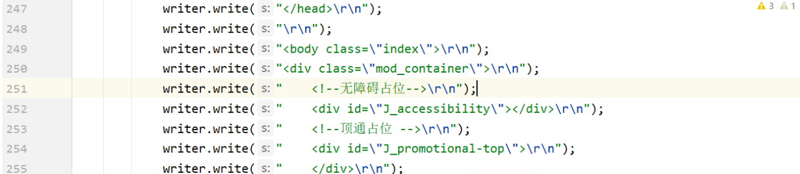


并且如果在上面的网页中插入动态数据时，就更加不方便了：

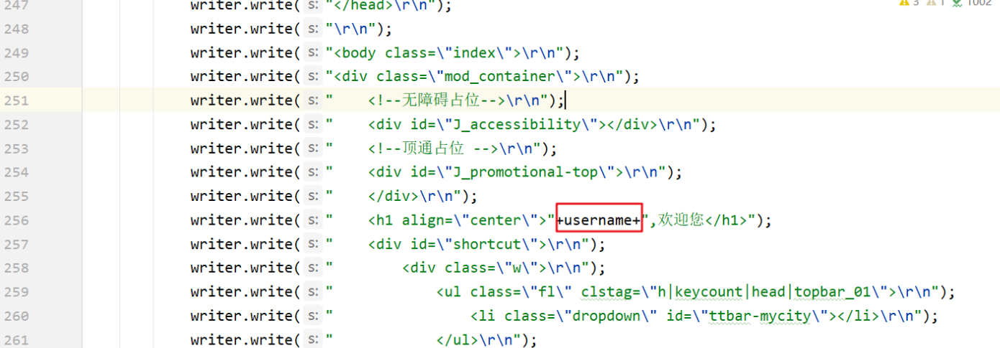


上面的代码有大量使用到 `writer` 对象向页面写标签内容，这样我们的代码就显得很麻烦；将来如果展示的效果出现了问题，排错也显得有点力不从心。而 JSP 就是解决这个问题的。基本都是 `HTML` 标签，而动态数据使用 Java 代码进行展示；这样操作看起来要比用 `servlet` 实现要舒服很多。

JSP 作用：简化开发，避免了在Servlet中直接输出HTML标签。


### 2，JSP快速入门

创建一个maven的 web 项目，项目结构如下：


`pom.xml` 文件内容如下：

```xml
<?xml version="1.0" encoding="UTF-8"?>
<project xmlns="http://maven.apache.org/POM/4.0.0"
         xmlns:xsi="http://www.w3.org/2001/XMLSchema-instance"
         xsi:schemaLocation="http://maven.apache.org/POM/4.0.0 http://maven.apache.org/xsd/maven-4.0.0.xsd">
    <modelVersion>4.0.0</modelVersion>

    <groupId>org.example</groupId>
    <artifactId>jsp-demo</artifactId>
    <version>1.0-SNAPSHOT</version>
    <packaging>war</packaging>

    <properties>
        <maven.compiler.source>8</maven.compiler.source>
        <maven.compiler.target>8</maven.compiler.target>
    </properties>

    <dependencies>
      <dependency>
            <groupId>javax.servlet</groupId>
            <artifactId>javax.servlet-api</artifactId>
            <version>3.1.0</version>
            <scope>provided</scope>
        </dependency>
    </dependencies>

    <build>
        <plugins>
            <plugin>
                <groupId>org.apache.tomcat.maven</groupId>
                <artifactId>tomcat7-maven-plugin</artifactId>
                <version>2.2</version>
            </plugin>
        </plugins>
    </build>
</project>
```


在 `dependencies` 标签中导入 JSP 的依赖，如下

```xml
<dependency>
    <groupId>javax.servlet.jsp</groupId>
    <artifactId>jsp-api</artifactId>
    <version>2.2</version>
    <scope>provided</scope>
</dependency>
```

该依赖的 `scope` 必须设置为 `provided`，因为 tomcat 中有这个jar包了，所以在打包时我们是不希望将该依赖打进到我们工程的war包中。


在项目的 `webapp` 下创建jsp页面，名为 `hello.jsp` ，如下：

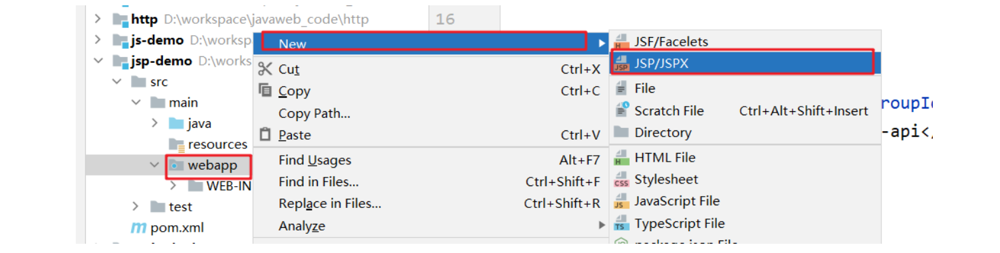


在 `hello.jsp` 页面中书写 `HTML` 标签和 `Java` 代码，如下

```jsp
<%@ page contentType="text/html;charset=UTF-8" language="java" %>
<html>
<head>
    <title>Title</title>
</head>
<body>
    <h1>hello jsp</h1>

    <%
        System.out.println("hello,jsp~");
    %>
</body>
</html>
```


启动服务器并在浏览器地址栏输入 `http://localhost:8080/jsp-demo/hello.jsp`，我们可以在页面上看到如下内容

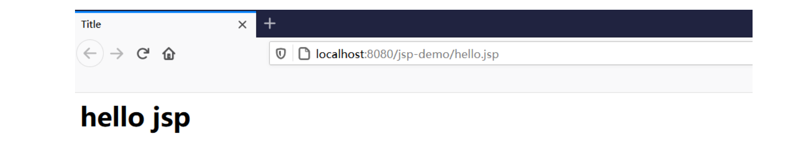


同时也可以看到在 `idea` 的控制台看到输出的 `hello,jsp~` 内容。


## 二，JSP原理和JSP脚本

### 1，JSP原理

我们之前说 JSP 就是一个页面，那么在 JSP 中写 `html` 标签，我们能理解，但是为什么还可以写 `Java` 代码呢？JSP 本质上就是一个 Servlet。访问JSP流程如下：

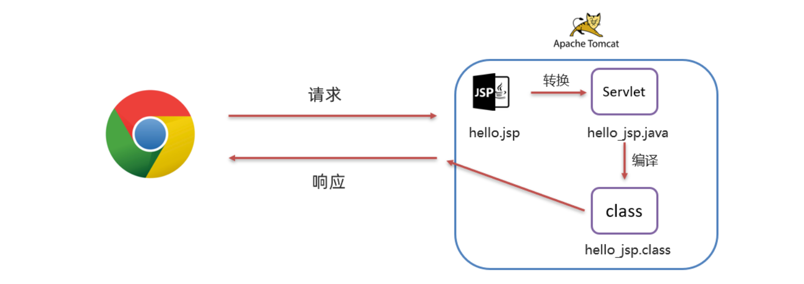

流程：

1. 浏览器第一次访问 `hello.jsp` 页面
2. `tomcat` 会将 `hello.jsp` 转换为名为 `hello_jsp.java` 的一个 `Servlet`
3. `tomcat` 再将转换的 `servlet` 编译成字节码文件 `hello_jsp.class`
4. `tomcat` 会执行该字节码文件，向外提供服务


我们可以到项目所在磁盘目录下找 `target\tomcat\work\Tomcat\localhost\jsp-demo\org\apache\jsp` 目录，而这个目录下就能看到转换后的 `servlet`


打开 `hello_jsp.java` 文件，来查看里面的代码


由上面的类的继承关系可以看到继承了名为 `HttpJspBase` 这个类，那我们在看该类的继承关系。找到tomcat源码。在`tomcat源码\apache-tomcat-8.5.68-src\java\org\apache\jasper\runtime` ，该目录下就有 `HttpJspBase` 类，查看该类的继承关系


可以看到该类继承了 `HttpServlet` ；那么 `hello_jsp` 这个类就间接的继承了 `HttpServlet` ，也就说明 `hello_jsp` 是一个 `servlet`。


继续阅读 `hello_jsp` 类的代码，可以看到有一个名为 `_jspService()` 的方法，该方法就是每次访问 `jsp` 时自动执行的方法，和 `servlet` 中的 `service` 方法一样 。而在 `_jspService()` 方法中可以看到往浏览器写标签的代码：

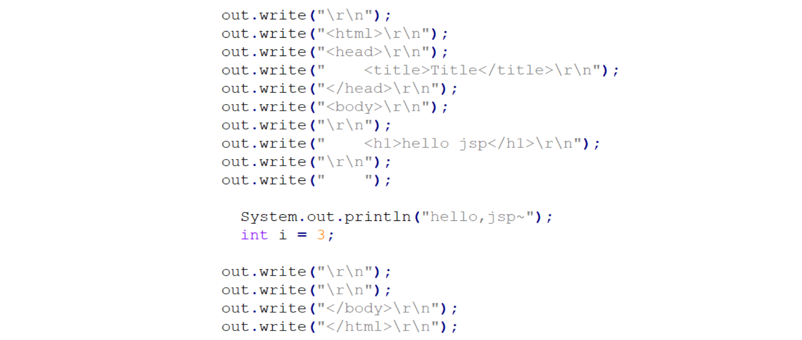


以前我们自己写 `servlet` 时，这部分代码是由我们自己来写，现在有了 `jsp` 后，由tomcat完成这部分功能。


### 2，JSP脚本分类

JSP脚本用于在 JSP页面内定义 Java代码。在之前的入门案例中我们就在 JSP 页面定义的 Java 代码就是 JSP 脚本。

JSP 脚本有如下三个分类：

- <%...%>：内容会直接放到_jspService()方法之中
- <%=…%>：内容会放到out.print()中，作为out.print()的参数
- <%!…%>：内容会放到_jspService()方法之外，被类直接包含


在 `hello.jsp` 中书写

```jsp
<%
    System.out.println("hello,jsp~");
    int i = 3;
%>
```


通过浏览器访问 `hello.jsp` 后，查看转换的 `hello_jsp.java` 文件，i 变量定义在了 `_jspService()` 方法中


在 `hello.jsp` 中书写

```jsp
<%="hello"%>
<%=i%>
```


通过浏览器访问 `hello.jsp` 后，查看转换的 `hello_jsp.java` 文件，该脚本的内容被放在了 `out.print()` 中，作为参数


在 `hello.jsp` 中书写

```jsp
<%!
    void  show(){}
	String name = "zhangsan";
%>
```


通过浏览器访问 `hello.jsp` 后，查看转换的 `hello_jsp.java` 文件，该脚本的内容被放在了成员位置

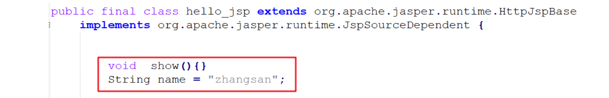


### 3，案例

使用JSP展示品牌数据：

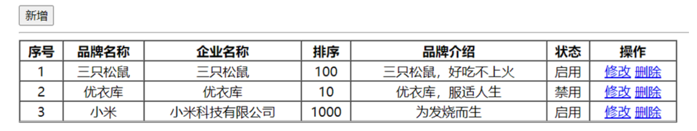


`Brand.java`实体类如下：

```java

```


`brand.html`静态页面如下：

```html

```


`brand.jsp` 内容如下：

```jsp
<%@ page contentType="text/html;charset=UTF-8" language="java" %>
<!DOCTYPE html>
<html lang="en">
<head>
    <meta charset="UTF-8">
    <title>Title</title>
</head>
<body>
<input type="button" value="新增"><br>
<hr>
    <table border="1" cellspacing="0" width="800">
        <tr>
            <th>序号</th>
            <th>品牌名称</th>
            <th>企业名称</th>
            <th>排序</th>
            <th>品牌介绍</th>
            <th>状态</th>
            <th>操作</th>

        </tr>
        <tr align="center">
            <td>1</td>
            <td>三只松鼠</td>
            <td>三只松鼠</td>
            <td>100</td>
            <td>三只松鼠，好吃不上火</td>
            <td>启用</td>
            <td><a href="#">修改</a> <a href="#">删除</a></td>
        </tr>

        <tr align="center">
            <td>2</td>
            <td>优衣库</td>
            <td>优衣库</td>
            <td>10</td>
            <td>优衣库，服适人生</td>
            <td>禁用</td>

            <td><a href="#">修改</a> <a href="#">删除</a></td>
        </tr>

        <tr align="center">
            <td>3</td>
            <td>小米</td>
            <td>小米科技有限公司</td>
            <td>1000</td>
            <td>为发烧而生</td>
            <td>启用</td>

            <td><a href="#">修改</a> <a href="#">删除</a></td>
        </tr>
    </table>
</body>
</html>
```


在 `brand.jsp` 中准备一些数据

```jsp
<%
    // 查询数据库
    List<Brand> brands = new ArrayList<Brand>();
    brands.add(new Brand(1,"三只松鼠","三只松鼠",100,"三只松鼠，好吃不上火",1));
    brands.add(new Brand(2,"优衣库","优衣库",200,"优衣库，服适人生",0));
    brands.add(new Brand(3,"小米","小米科技有限公司",1000,"为发烧而生",1));
%>
```


将 `brand.jsp` 页面中的 `table` 标签中的数据改为动态的，<%%> 里面写的是 Java 代码，而外边写的是 HTML 标签。

```jsp
<table border="1" cellspacing="0" width="800">
    <tr>
        <th>序号</th>
        <th>品牌名称</th>
        <th>企业名称</th>
        <th>排序</th>
        <th>品牌介绍</th>
        <th>状态</th>
        <th>操作</th>

    </tr>
    
    <%
     for (int i = 0; i < brands.size(); i++) {
         //获取集合中的 每一个 Brand 对象
         Brand brand = brands.get(i);
    %>
    	 <tr align="center">
            <td>1</td>
            <td>三只松鼠</td>
            <td>三只松鼠</td>
            <td>100</td>
            <td>三只松鼠，好吃不上火</td>
            <td>启用</td>
            <td><a href="#">修改</a> <a href="#">删除</a></td>
        </tr>
    <%
     }
    %>
   
</table>
```


上面代码中的 `td` 标签中的数据都需要是动态的，所以还需要改进

```jsp
<table border="1" cellspacing="0" width="800">
    <tr>
        <th>序号</th>
        <th>品牌名称</th>
        <th>企业名称</th>
        <th>排序</th>
        <th>品牌介绍</th>
        <th>状态</th>
        <th>操作</th>

    </tr>
    
    <%
     for (int i = 0; i < brands.size(); i++) {
         //获取集合中的 每一个 Brand 对象
         Brand brand = brands.get(i);
    %>
    	 <tr align="center">
            <td><%=brand.getId()%></td>
            <td><%=brand.getBrandName()%></td>
            <td><%=brand.getCompanyName()%></td>
            <td><%=brand.getOrdered()%></td>
            <td><%=brand.getDescription()%></td>
            <td><%=brand.getStatus() == 1 ? "启用":"禁用"%></td>
            <td><a href="#">修改</a> <a href="#">删除</a></td>
        </tr>
    <%
     }
    %>
   
</table>
```


最终代码：

```jsp
<%@ page import="com.itheima.pojo.Brand" %>
<%@ page import="java.util.List" %>
<%@ page import="java.util.ArrayList" %>
<%@ page contentType="text/html;charset=UTF-8" language="java" %>

<%
    // 查询数据库
    List<Brand> brands = new ArrayList<Brand>();
    brands.add(new Brand(1,"三只松鼠","三只松鼠",100,"三只松鼠，好吃不上火",1));
    brands.add(new Brand(2,"优衣库","优衣库",200,"优衣库，服适人生",0));
    brands.add(new Brand(3,"小米","小米科技有限公司",1000,"为发烧而生",1));

%>


<!DOCTYPE html>
<html lang="en">
<head>
    <meta charset="UTF-8">
    <title>Title</title>
</head>
<body>
<input type="button" value="新增"><br>
<hr>
<table border="1" cellspacing="0" width="800">
    <tr>
        <th>序号</th>
        <th>品牌名称</th>
        <th>企业名称</th>
        <th>排序</th>
        <th>品牌介绍</th>
        <th>状态</th>
        <th>操作</th>
    </tr>
    <%
        for (int i = 0; i < brands.size(); i++) {
            Brand brand = brands.get(i);
    %>

    <tr align="center">
        <td><%=brand.getId()%></td>
        <td><%=brand.getBrandName()%></td>
        <td><%=brand.getCompanyName()%></td>
        <td><%=brand.getOrdered()%></td>
        <td><%=brand.getDescription()%></td>
		<td><%=brand.getStatus() == 1 ? "启用":"禁用"%></td>
        <td><a href="#">修改</a> <a href="#">删除</a></td>
    </tr>

    <%
        }
    %>
</table>
</body>
</html>
```


在浏览器地址栏输入 `http://localhost:8080/jsp-demo/brand.jsp` ，页面展示效果如下

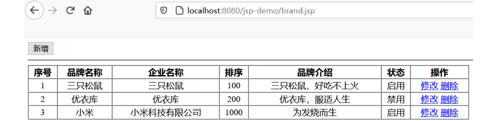


### 4，JSP缺点

通过上面的案例，我们可以看到 JSP 的很多缺点。

由于 JSP页面内，既可以定义 HTML 标签，又可以定义 Java代码，造成了以下问题：

- 书写麻烦：特别是复杂的页面，既要写 HTML 标签，还要写 Java 代码
- 阅读麻烦：上面案例的代码，相信你后期再看这段代码时还需要花费很长的时间去梳理
- 复杂度高：运行需要依赖于各种环境，JRE，JSP容器，JavaEE…
- 占内存和磁盘：JSP会自动生成.java和.class文件占磁盘，运行的是.class文件占内存
- 调试困难：出错后，需要找到自动生成的.java文件进行调试
- 不利于团队协作：前端人员不会 Java，后端人员不精 HTML。如果页面布局发生变化，前端工程师对静态页面进行修改，然后再交给后端工程师，由后端工程师再将该页面改为 JSP 页面


由于上述的问题， JSP 已逐渐退出历史舞台，以后开发更多的是使用前后端分离开发，后端仅仅提供API接口，前端使用ajax发送请求，获取数据，前端渲染数据。


使用JAVA构建项目，也是经过4个阶段发展的：


1. 第一阶段：使用 `servlet` 即实现逻辑代码编写，也对页面进行拼接。这种模式我们之前也接触过

2. 第二阶段：随着技术的发展，出现了 `JSP` ，人们发现 `JSP` 使用起来比 `Servlet` 方便很多，但是还是要在 `JSP` 中嵌套 `Java` 代码，也不利于后期的维护

3. 第三阶段：使用 `Servlet` 进行逻辑代码开发，而使用 `JSP` 进行数据展示

   

4. 第四阶段：使用 `servlet` 进行后端逻辑代码开发，而使用 `HTML` 进行数据展示。而这里面就存在问题，`HTML` 是静态页面，怎么进行动态数据展示呢？这就是 `ajax` 的作用了。


 JSP虽然已退出历史舞台，但我们还是需要简单了解一它，我们如果不经历这些复杂的过程，就不能体现后面阶段开发的简单。接下来我们来学习第三阶段，使用 `EL表达式` 和 `JSTL` 标签库替换 `JSP` 中的 `Java` 代码。


## 三，EL表达式

### 1，什么是EL表达式

EL（全称Expression Language ）表达式语言，用于简化 JSP 页面内的 Java 代码。EL 表达式的主要作用是获取数据。其实就是从域对象中获取数据，然后将数据展示在页面上。而 EL 表达式的语法也比较简单，${expression}。例如：${brands} 就是获取域中存储的 key 为 brands 的数据。


定义servlet，在 servlet 中封装一些数据并存储到 request 域对象中并转发到 `el-demo.jsp` 页面。

```java
@WebServlet("/demo1")
public class ServletDemo1 extends HttpServlet {
    @Override
    protected void doGet(HttpServletRequest request, HttpServletResponse response) throws ServletException, IOException {
        //1. 准备数据
        List<Brand> brands = new ArrayList<Brand>();
        brands.add(new Brand(1,"三只松鼠","三只松鼠",100,"三只松鼠，好吃不上火",1));
        brands.add(new Brand(2,"优衣库","优衣库",200,"优衣库，服适人生",0));
        brands.add(new Brand(3,"小米","小米科技有限公司",1000,"为发烧而生",1));

        //2. 存储到request域中
        request.setAttribute("brands",brands);

        //3. 转发到 el-demo.jsp
        // 此处需要用转发，因为转发才可以使用 request 对象作为域对象进行数据共享
        request.getRequestDispatcher("/el-demo.jsp").forward(request,response);
    }

    @Override
    protected void doPost(HttpServletRequest request, HttpServletResponse response) throws ServletException, IOException {
        this.doGet(request, response);
    }
}
```


在 `el-demo.jsp` 中通过 EL表达式 获取数据

```jsp
<%@ page contentType="text/html;charset=UTF-8" language="java" %>
<html>
<head>
    <title>Title</title>
</head>
<body>
    ${brands}
</body>
</html>
```


在浏览器的地址栏输入 `http://localhost:8080/jsp-demo/demo1` ，页面效果如下：

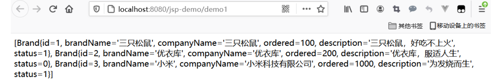


### 2，域对象

JavaWeb中有四大域对象，分别是：

- page：当前页面有效
- request：当前请求有效
- session：当前会话有效
- application：当前应用有效


el 表达式获取数据，会依次从这4个域中寻找，直到找到为止。而这四个域对象的作用范围如下图所示


例如： ${brands}，el 表达式获取数据，会先从page域对象中获取数据，如果没有再到 requet 域对象中获取数据，如果再没有再到 session 域对象中获取，如果还没有才会到 application 中获取数据。


## 四，JSTL标签

### 1，什么是JSTL标签

JSP标准标签库(Jsp Standarded Tag Library) ，使用标签取代JSP页面上的Java代码。如下代码就是JSTL标签

```xml
<c:if test="${flag == 1}">
    男
</c:if>
<c:if test="${flag == 2}">
    女
</c:if>
```


上面代码看起来是不是比 JSP 中嵌套 Java 代码看起来舒服好了。而且前端工程师对标签是特别敏感的，他们看到这段代码是能看懂的。

JSTL 提供了很多标签，如下图

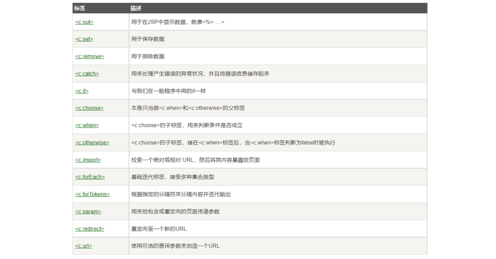


我们只对两个最常用的标签进行讲解，`<c:forEach>` 标签和 `<c:if>` 标签。JSTL 使用也是比较简单的，分为如下步骤：

1. 导入坐标

   ```xml
   <dependency>
       <groupId>jstl</groupId>
       <artifactId>jstl</artifactId>
       <version>1.2</version>
   </dependency>
   <dependency>
       <groupId>taglibs</groupId>
       <artifactId>standard</artifactId>
       <version>1.1.2</version>
   </dependency>
   ```

2. 在JSP页面上引入JSTL标签库

   ```jsp
   <%@ taglib prefix="c" uri="http://java.sun.com/jsp/jstl/core" %> 
   ```

3. 使用标签


### 2，if标签

`<c:if>`：相当于 if 判断。属性test，用于定义条件表达式

```xmxl
<c:if test="${flag == 1}">
    男
</c:if>
<c:if test="${flag == 2}">
    女
</c:if>
```


定义一个 `servlet` ，在该 `servlet` 中向 request 域对象中添加 键是 `status` ，值为 `1` 的数据

```xml
@WebServlet("/demo2")
public class ServletDemo2 extends HttpServlet {
    @Override
    protected void doGet(HttpServletRequest request, HttpServletResponse response) throws ServletException, IOException {
        //1. 存储数据到request域中
        request.setAttribute("status",1);

        //2. 转发到 jstl-if.jsp
        数据request.getRequestDispatcher("/jstl-if.jsp").forward(request,response);
    }

    @Override
    protected void doPost(HttpServletRequest request, HttpServletResponse response) throws ServletException, IOException {
        this.doGet(request, response);
    }
}
```


定义 `jstl-if.jsp` 页面，在该页面使用 `<c:if>` 标签(在该页面已经要引入 JSTL核心标签库)。

```jsp
<%@ page contentType="text/html;charset=UTF-8" language="java" %>
<%@ taglib prefix="c" uri="http://java.sun.com/jsp/jstl/core" %>
<html>
<head>
    <title>Title</title>
</head>
<body>
    <%--
        c:if：来完成逻辑判断，替换java  if else
    --%>
    <c:if test="${status ==1}">
        启用
    </c:if>

    <c:if test="${status ==0}">
        禁用
    </c:if>
</body>
</html>
```


### 3，forEach标签

`<c:forEach>`：相当于 for 循环。java中有增强for循环和普通for循环，JSTL 中的 `<c:forEach>` 也有两种用法。


用法一：类似于 Java 中的增强for循环。涉及到的 `<c:forEach>` 中的属性如下

- items：被遍历的容器
- var：遍历产生的临时变量
- varStatus：遍历状态对象


如下代码，是从域对象中获取名为 brands 数据，该数据是一个集合；遍历遍历，并给该集合中的每一个元素起名为 `brand`，是 Brand对象。在循环里面使用 EL表达式获取每一个Brand对象的属性值

```xml
<c:forEach items="${brands}" var="brand">
    <tr align="center">
        <td>${brand.id}</td>
        <td>${brand.brandName}</td>
        <td>${brand.companyName}</td>
        <td>${brand.description}</td>
    </tr>
</c:forEach>
```


`servlet` 还是使用之前的名为 `ServletDemo1` ，然后定义名为 `jstl-foreach.jsp` 页面，内容如下：

```jsp
<%@ page contentType="text/html;charset=UTF-8" language="java" %>
<%@ taglib prefix="c" uri="http://java.sun.com/jsp/jstl/core" %>

<!DOCTYPE html>
<html lang="en">
<head>
    <meta charset="UTF-8">
    <title>Title</title>
</head>
<body>
<input type="button" value="新增"><br>
<hr>
<table border="1" cellspacing="0" width="800">
    <tr>
        <th>序号</th>
        <th>品牌名称</th>
        <th>企业名称</th>
        <th>排序</th>
        <th>品牌介绍</th>
        <th>状态</th>
        <th>操作</th>
    </tr>

    <c:forEach items="${brands}" var="brand" varStatus="status">
        <tr align="center">
            <%--<td>${brand.id}</td>--%>
            <td>${status.count}</td>
            <td>${brand.brandName}</td>
            <td>${brand.companyName}</td>
            <td>${brand.ordered}</td>
            <td>${brand.description}</td>
            <c:if test="${brand.status == 1}">
                <td>启用</td>
            </c:if>
            <c:if test="${brand.status != 1}">
                <td>禁用</td>
            </c:if>
            <td><a href="#">修改</a> <a href="#">删除</a></td>
        </tr>
    </c:forEach>
</table>
</body>
</html>
```


用法二：类似于 Java 中的普通for循环。涉及到的 `<c:forEach>` 中的属性如下

- begin：开始数
- end：结束数
- step：步长

从0循环到10，变量名是 `i` ，每次自增1。代码演示：

```xml
<c:forEach begin="0" end="10" step="1" var="i">
    ${i}
</c:forEach>
```


## 五，MVC模式和三层架构

MVC 模式和三层架构是一些理论的知识，将来我们使用了它们进行代码开发会让我们代码维护性和扩展性更好。

### 1，MVC模式

MVC 是一种分层开发的模式，其中：

- M：Model，业务模型，处理业务
- V：View，视图，界面展示
- C：Controller，控制器，处理请求，调用模型和视图


控制器（serlvlet）用来接收浏览器发送过来的请求，控制器调用模型（JavaBean）来获取数据，比如从数据库查询数据；控制器获取到数据后再交由视图（JSP）进行数据展示。


**MVC 好处：**

- 职责单一，互不影响。每个角色做它自己的事，各司其职。
- 有利于分工协作。
- 有利于组件重用


### 2，三层框架

三层架构是将我们的项目分成了三个层面，分别是 `表现层`、`业务逻辑层`、`数据访问层`。

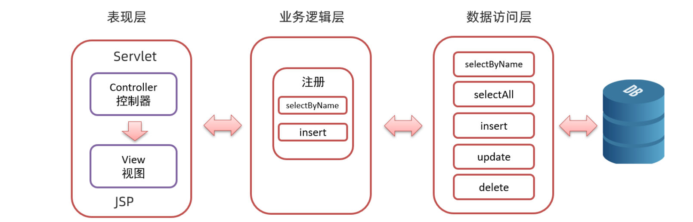


- 数据访问层：对数据库的CRUD基本操作
- 业务逻辑层：对业务逻辑进行封装，组合数据访问层层中基本功能，形成复杂的业务逻辑功能。例如 `注册业务功能` ，我们会先调用 `数据访问层` 的 `selectByName()` 方法判断该用户名是否存在，如果不存在再调用 `数据访问层` 的 `insert()` 方法进行数据的添加操作
- 表现层：接收请求，封装数据，调用业务逻辑层，响应数据


而整个流程是，浏览器发送请求，表现层的Servlet接收请求并调用业务逻辑层的方法进行业务逻辑处理，而业务逻辑层方法调用数据访问层方法进行数据的操作，依次返回到serlvet，然后servlet将数据交由 JSP 进行展示。

三层架构的每一层都有特有的包名称：

- 表现层： `com.malu.controller` 或者 `com.malu.web`
- 业务逻辑层：`com.malu.service`
- 数据访问层：`com.malu.dao` 或者 `com.malu.mapper`


### 3，MVC模式和三层架构

通过 MVC 和 三层架构 的学习，有些人肯定混淆了。那他们有什么区别和联系？

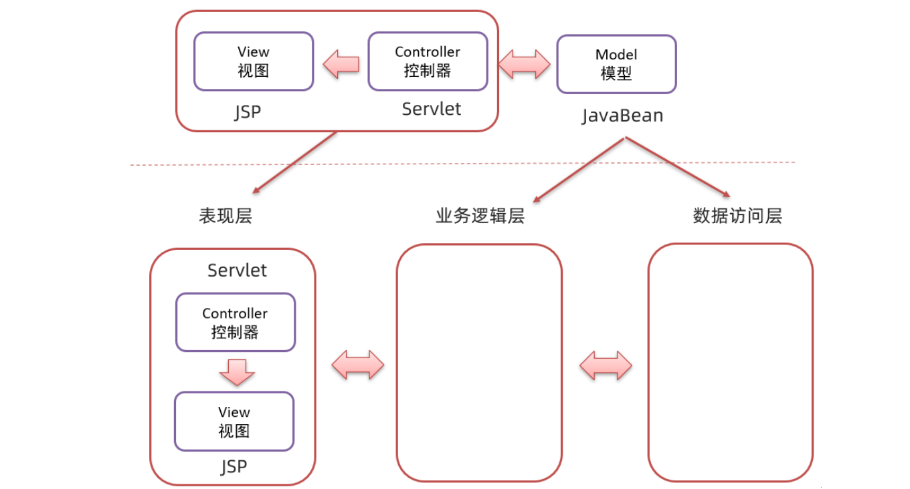

如上图上半部分是 MVC 模式，上图下半部分是三层架构。 `MVC 模式` 中的 C（控制器）和 V（视图）就是 `三层架构` 中的表现层，而 `MVC 模式` 中的 M（模型）就是 `三层架构` 中的 业务逻辑层 和 数据访问层。

可以将 `MVC 模式` 理解成是一个大的概念，而 `三层架构` 是对 `MVC 模式` 实现架构的思想。 那么我们以后按照要求将不同层的代码写在不同的包下，每一层里功能职责做到单一，将来如果将表现层的技术换掉，而业务逻辑层和数据访问层的代码不需要发生变化。


## 六，案例

### 1，准备工作

创建新的模块 brand_demo，引入坐标。我们只要分析出要用到哪儿些技术，那么需要哪儿些坐标也就明确了

- 需要操作数据库。mysql的驱动包
- 要使用mybatis框架。mybaits的依赖包
- web项目需要用到servlet和jsp。servlet和jsp的依赖包
- 需要使用 jstl 进行数据展示。jstl的依赖包


`pom.xml` 内容如下：

```xml
<?xml version="1.0" encoding="UTF-8"?>
<project xmlns="http://maven.apache.org/POM/4.0.0"
         xmlns:xsi="http://www.w3.org/2001/XMLSchema-instance"
         xsi:schemaLocation="http://maven.apache.org/POM/4.0.0 http://maven.apache.org/xsd/maven-4.0.0.xsd">
    <modelVersion>4.0.0</modelVersion>
    <groupId>org.example</groupId>
    <artifactId>brand-demo</artifactId>
    <version>1.0-SNAPSHOT</version>
    <packaging>war</packaging>

    <properties>
        <maven.compiler.source>8</maven.compiler.source>
        <maven.compiler.target>8</maven.compiler.target>
    </properties>

    <dependencies>
        <!-- mybatis -->
        <dependency>
            <groupId>org.mybatis</groupId>
            <artifactId>mybatis</artifactId>
            <version>3.5.5</version>
        </dependency>

        <!--mysql-->
        <dependency>
            <groupId>mysql</groupId>
            <artifactId>mysql-connector-java</artifactId>
            <version>5.1.34</version>
        </dependency>

        <!--servlet-->
        <dependency>
            <groupId>javax.servlet</groupId>
            <artifactId>javax.servlet-api</artifactId>
            <version>3.1.0</version>
            <scope>provided</scope>
        </dependency>

        <!--jsp-->
        <dependency>
            <groupId>javax.servlet.jsp</groupId>
            <artifactId>jsp-api</artifactId>
            <version>2.2</version>
            <scope>provided</scope>
        </dependency>

        <!--jstl-->
        <dependency>
            <groupId>jstl</groupId>
            <artifactId>jstl</artifactId>
            <version>1.2</version>
        </dependency>
        <dependency>
            <groupId>taglibs</groupId>
            <artifactId>standard</artifactId>
            <version>1.1.2</version>
        </dependency>
    </dependencies>

    <build>
        <plugins>
            <plugin>
                <groupId>org.apache.tomcat.maven</groupId>
                <artifactId>tomcat7-maven-plugin</artifactId>
                <version>2.2</version>
            </plugin>
        </plugins>
    </build>
</project>
```


创建不同的包结构，用来存储不同的类。包结构如下：


创建表：

```mysql
-- 删除tb_brand表
drop table if exists tb_brand;
-- 创建tb_brand表
create table tb_brand
(
    -- id 主键
    id           int primary key auto_increment,
    -- 品牌名称
    brand_name   varchar(20),
    -- 企业名称
    company_name varchar(20),
    -- 排序字段
    ordered      int,
    -- 描述信息
    description  varchar(100),
    -- 状态：0：禁用  1：启用
    status       int
);
-- 添加数据
insert into tb_brand (brand_name, company_name, ordered, description, status)
values ('三只松鼠', '三只松鼠股份有限公司', 5, '好吃不上火', 0),
       ('华为', '华为技术有限公司', 100, '华为致力于把数字世界带入每个人、每个家庭、每个组织，构建万物互联的智能世界', 1),
       ('小米', '小米科技有限公司', 50, 'are you ok', 1);
```


在 `pojo` 包下创建名为 `Brand` 的类。

```java
public class Brand {
    // id 主键
    private Integer id;
    // 品牌名称
    private String brandName;
    // 企业名称
    private String companyName;
    // 排序字段
    private Integer ordered;
    // 描述信息
    private String description;
    // 状态：0：禁用  1：启用
    private Integer status;


    public Brand() {
    }

    public Brand(Integer id, String brandName, String companyName, String description) {
        this.id = id;
        this.brandName = brandName;
        this.companyName = companyName;
        this.description = description;
    }

    public Brand(Integer id, String brandName, String companyName, Integer ordered, String description, Integer status) {
        this.id = id;
        this.brandName = brandName;
        this.companyName = companyName;
        this.ordered = ordered;
        this.description = description;
        this.status = status;
    }

    public Integer getId() {
        return id;
    }

    public void setId(Integer id) {
        this.id = id;
    }

    public String getBrandName() {
        return brandName;
    }

    public void setBrandName(String brandName) {
        this.brandName = brandName;
    }

    public String getCompanyName() {
        return companyName;
    }

    public void setCompanyName(String companyName) {
        this.companyName = companyName;
    }

    public Integer getOrdered() {
        return ordered;
    }

    public void setOrdered(Integer ordered) {
        this.ordered = ordered;
    }

    public String getDescription() {
        return description;
    }

    public void setDescription(String description) {
        this.description = description;
    }

    public Integer getStatus() {
        return status;
    }

    public void setStatus(Integer status) {
        this.status = status;
    }

    @Override
    public String toString() {
        return "Brand{" +
                "id=" + id +
                ", brandName='" + brandName + '\'' +
                ", companyName='" + companyName + '\'' +
                ", ordered=" + ordered +
                ", description='" + description + '\'' +
                ", status=" + status +
                '}';
    }
}
```


定义核心配置文件 `Mybatis-config.xml` ，并将该文件放置在 `resources` 下

```xml
<?xml version="1.0" encoding="UTF-8" ?>
<!DOCTYPE configuration
        PUBLIC "-//mybatis.org//DTD Config 3.0//EN"
        "http://mybatis.org/dtd/mybatis-3-config.dtd">
<configuration>
    <!--起别名-->
    <typeAliases>
        <package name="com.malu.pojo"/>
    </typeAliases>

    <environments default="development">
        <environment id="development">
            <transactionManager type="JDBC"/>
            <dataSource type="POOLED">
                <property name="driver" value="com.mysql.jdbc.Driver"/>
                <property name="url" value="jdbc:mysql:///db1?useSSL=false&amp;useServerPrepStmts=true"/>
                <property name="username" value="root"/>
                <property name="password" value="root"/>
            </dataSource>
        </environment>
    </environments>
    <mappers>
        <!--扫描mapper-->
        <package name="com.malu.mapper"/>
    </mappers>
</configuration>
```


在 `resources` 下创建放置映射配置文件的目录结构 `com/malu/mapper`，并在该目录下创建映射配置文件 `BrandMapper.xml`

```xml
<?xml version="1.0" encoding="UTF-8" ?>
<!DOCTYPE mapper
        PUBLIC "-//mybatis.org//DTD Mapper 3.0//EN"
        "http://mybatis.org/dtd/mybatis-3-mapper.dtd">
<mapper namespace="com.malu.mapper.BrandMapper">
    
</mapper>
```


### 2，查询所有

当我们点击 `index.html` 页面中的 `查询所有` 这个超链接时，就能查询到上图右半部分的数据。

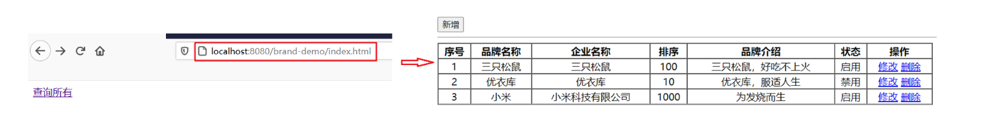

对于上述的功能，点击 `查询所有` 超链接是需要先请后端的 `servlet` ，由 `servlet` 跳转到对应的页面进行数据的动态展示。而整个流程如下图：

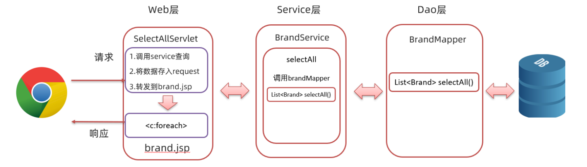


在 `mapper` 包下创建创建 `BrandMapper` 接口，在接口中定义 `selectAll()` 方法

```java
/**
  * 查询所有
  * @return
  */
@Select("select * from tb_brand")
List<Brand> selectAll();
```


在 `com.malu` 包下创建 `utils` 包，并在该包下创建名为 `SqlSessionFactoryUtils` 工具类

```java
public class SqlSessionFactoryUtils {

    private static SqlSessionFactory sqlSessionFactory;

    static {
        //静态代码块会随着类的加载而自动执行，且只执行一次
        try {
            String resource = "mybatis-config.xml";
            InputStream inputStream = Resources.getResourceAsStream(resource);
            sqlSessionFactory = new SqlSessionFactoryBuilder().build(inputStream);
        } catch (IOException e) {
            e.printStackTrace();
        }
    }

    public static SqlSessionFactory getSqlSessionFactory(){
        return sqlSessionFactory;
    }
}
```


在 `service` 包下创建 `BrandService` 类

```java
public class BrandService {
    SqlSessionFactory factory = SqlSessionFactoryUtils.getSqlSessionFactory();

    /**
     * 查询所有
     * @return
     */
    public List<Brand> selectAll(){
        //调用BrandMapper.selectAll()

        //2. 获取SqlSession
        SqlSession sqlSession = factory.openSession();
        //3. 获取BrandMapper
        BrandMapper mapper = sqlSession.getMapper(BrandMapper.class);

        //4. 调用方法
        List<Brand> brands = mapper.selectAll();

        sqlSession.close();

        return brands;
    }
}
```


在 `web` 包下创建名为 `SelectAllServlet` 的 `servlet`，该 `servlet` 的逻辑如下：

- 调用 `BrandService` 的 `selectAll()` 方法进行业务逻辑处理，并接收返回的结果
- 将上一步返回的结果存储到 `request` 域对象中
- 跳转到 `brand.jsp` 页面进行数据的展示

代码演示：

```java
@WebServlet("/selectAllServlet")
public class SelectAllServlet extends HttpServlet {
    private  BrandService service = new BrandService();

    @Override
    protected void doGet(HttpServletRequest request, HttpServletResponse response) throws ServletException, IOException {

        //1. 调用BrandService完成查询
        List<Brand> brands = service.selectAll();
        //2. 存入request域中
        request.setAttribute("brands",brands);
        //3. 转发到brand.jsp
        request.getRequestDispatcher("/brand.jsp").forward(request,response);
    }

    @Override
    protected void doPost(HttpServletRequest request, HttpServletResponse response) throws ServletException, IOException {
        this.doGet(request, response);
    }
}
```


编写brand.jsp页面， `brand.jsp` 页面在表格中使用 `JSTL` 和 `EL表达式` 从request域对象中获取名为 `brands` 的集合数据并展示出来。页面内容如下：

```jsp
<%@ page contentType="text/html;charset=UTF-8" language="java" %>
<%@ taglib prefix="c" uri="http://java.sun.com/jsp/jstl/core" %>

<!DOCTYPE html>
<html lang="en">
<head>
    <meta charset="UTF-8">
    <title>Title</title>
</head>
<body>
<hr>
<table border="1" cellspacing="0" width="80%">
    <tr>
        <th>序号</th>
        <th>品牌名称</th>
        <th>企业名称</th>
        <th>排序</th>
        <th>品牌介绍</th>
        <th>状态</th>
        <th>操作</th>
    </tr>

    <c:forEach items="${brands}" var="brand" varStatus="status">
        <tr align="center">
            <%--<td>${brand.id}</td>--%>
            <td>${status.count}</td>
            <td>${brand.brandName}</td>
            <td>${brand.companyName}</td>
            <td>${brand.ordered}</td>
            <td>${brand.description}</td>
            <c:if test="${brand.status == 1}">
                <td>启用</td>
            </c:if>
            <c:if test="${brand.status != 1}">
                <td>禁用</td>
            </c:if>
            <td><a href="/brand-demo/selectByIdServlet?id=${brand.id}">修改</a> <a href="#">删除</a></td>
        </tr>
    </c:forEach>
</table>
</body>
</html>
```


启动服务器，并在浏览器输入 `http://localhost:8080/brand-demo/index.html`，看到如下 `查询所有` 的超链接，点击该链接就可以查询出所有的品牌数据

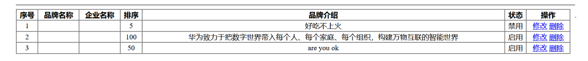

为什么出现这个问题呢？是因为查询到的字段名和实体类对象的属性名没有一一对应。相比看到这大家一定会解决了，就是在映射配置文件中使用 `resultMap` 标签定义映射关系。映射配置文件内容如下：

```xml
<?xml version="1.0" encoding="UTF-8" ?>
<!DOCTYPE mapper
        PUBLIC "-//mybatis.org//DTD Mapper 3.0//EN"
        "http://mybatis.org/dtd/mybatis-3-mapper.dtd">
<mapper namespace="com.malu.mapper.BrandMapper">

    <resultMap id="brandResultMap" type="brand">
        <result column="brand_name" property="brandName"></result>
        <result column="company_name" property="companyName"></result>
    </resultMap>
</mapper>
```


并且在 `BrandMapper` 接口中的 `selectAll()` 上使用 `@ResuleMap` 注解指定使用该映射

```java
/**
  * 查询所有
  * @return
  */
@Select("select * from tb_brand")
@ResultMap("brandResultMap")
List<Brand> selectAll();
```


重启服务器，再次访问就能看到我们想要的数据了

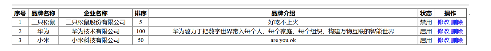


### 3，添加

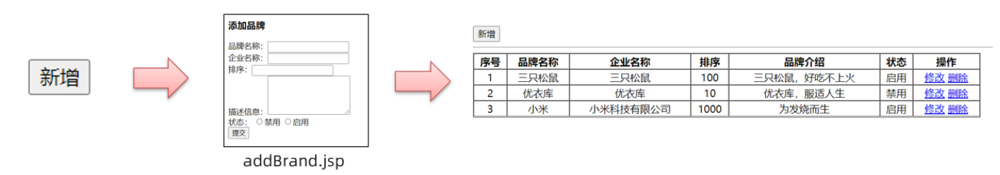


上图是做 添加 功能流程。点击 `新增` 按钮后，会先跳转到 `addBrand.jsp` 新增页面，在该页面输入要添加的数据，输入完毕后点击 `提交` 按钮，需要将数据提交到后端，而后端进行数据添加操作，并重新将所有的数据查询出来。整个流程如下：

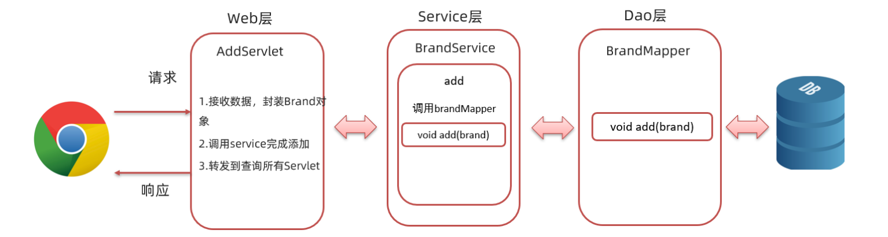


在 `BrandMapper` 接口，在接口中定义 `add(Brand brand)` 方法

```java
@Insert("insert into tb_brand values(null,#{brandName},#{companyName},#{ordered},#{description},#{status})")
void add(Brand brand);
```


在 `BrandService` 类中定义添加品牌数据方法 `add(Brand brand)`

```java
 	/**
     * 添加
     * @param brand
     */
    public void add(Brand brand){

        //2. 获取SqlSession
        SqlSession sqlSession = factory.openSession();
        //3. 获取BrandMapper
        BrandMapper mapper = sqlSession.getMapper(BrandMapper.class);

        //4. 调用方法
        mapper.add(brand);

        //提交事务
        sqlSession.commit();
        //释放资源
        sqlSession.close();
    }
```


我们需要在该页面表格的上面添加 `新增` 按钮

```html
<input type="button" value="新增" id="add"><br>
```

并给该按钮绑定单击事件，当点击了该按钮需要跳转到 `brand.jsp` 添加品牌数据的页面

```html
<script>
    document.getElementById("add").onclick = function (){
        location.href = "/brand-demo/addBrand.jsp";
    }
</script>
```


编写addBrand.jsp页面：

```jsp
<%@ page contentType="text/html;charset=UTF-8" language="java" %>
<!DOCTYPE html>
<html lang="en">

<head>
    <meta charset="UTF-8">
    <title>添加品牌</title>
</head>
<body>
<h3>添加品牌</h3>
<form action="/brand-demo/addServlet" method="post">
    品牌名称：<input name="brandName"><br>
    企业名称：<input name="companyName"><br>
    排序：<input name="ordered"><br>
    描述信息：<textarea rows="5" cols="20" name="description"></textarea><br>
    状态：
    <input type="radio" name="status" value="0">禁用
    <input type="radio" name="status" value="1">启用<br>

    <input type="submit" value="提交">
</form>
</body>
</html>
```


在 `web` 包下创建 `AddServlet` 的 `servlet`，该 `servlet` 的逻辑如下:

- 设置处理post请求乱码的字符集
- 接收客户端提交的数据
- 将接收到的数据封装到 `Brand` 对象中
- 调用 `BrandService` 的`add()` 方法进行添加的业务逻辑处理
- 跳转到 `selectAllServlet` 资源重新查询数据

具体的代码如下：

```java
@WebServlet("/addServlet")
public class AddServlet extends HttpServlet {
    private BrandService service = new BrandService();


    @Override
    protected void doGet(HttpServletRequest request, HttpServletResponse response) throws ServletException, IOException {

        //处理POST请求的乱码问题
        request.setCharacterEncoding("utf-8");

        //1. 接收表单提交的数据，封装为一个Brand对象
        String brandName = request.getParameter("brandName");
        String companyName = request.getParameter("companyName");
        String ordered = request.getParameter("ordered");
        String description = request.getParameter("description");
        String status = request.getParameter("status");

        //封装为一个Brand对象
        Brand brand = new Brand();
        brand.setBrandName(brandName);
        brand.setCompanyName(companyName);
        brand.setOrdered(Integer.parseInt(ordered));
        brand.setDescription(description);
        brand.setStatus(Integer.parseInt(status));

        //2. 调用service 完成添加
        service.add(brand);

        //3. 转发到查询所有Servlet
        request.getRequestDispatcher("/selectAllServlet").forward(request,response);
    }

    @Override
    protected void doPost(HttpServletRequest request, HttpServletResponse response) throws ServletException, IOException {
        this.doGet(request, response);
    }
}
```


 点击 `brand.jsp` 页面的 `新增` 按钮，会跳转到 `addBrand.jsp`页面

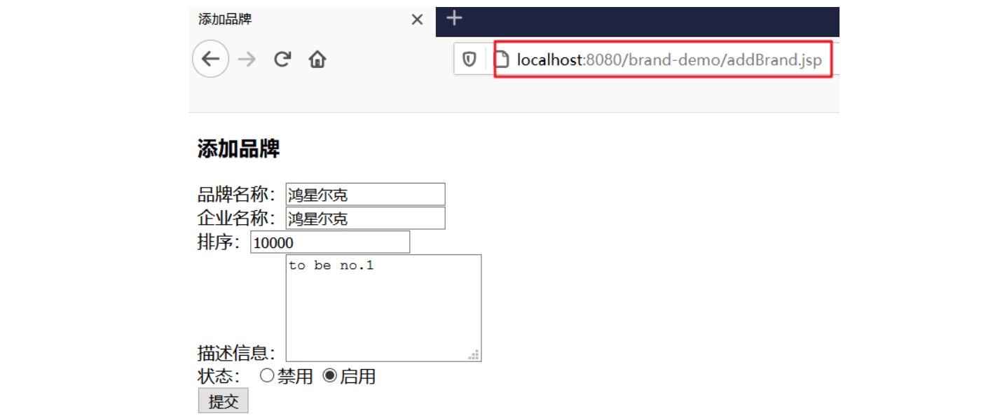


点击 `提交` 按钮，就能看到如下页面，里面就包含我们刚添加的数据

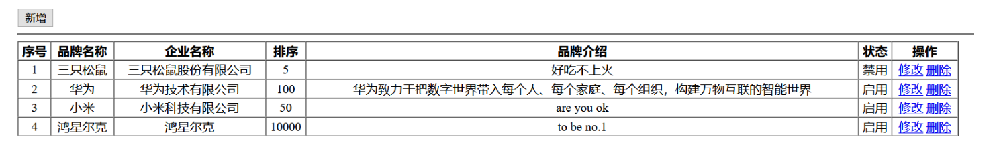


### 4，修改之数据回显

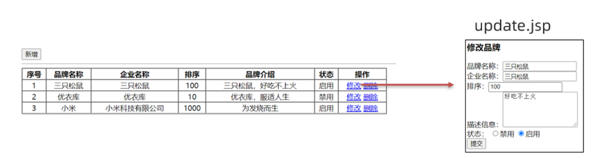

上图就是回显数据的效果。要实现这个效果，那当点击 `修改` 按钮时不能直接跳转到 `update.jsp` 页面，而是需要先带着当前行数据的 `id` 请求后端程序，后端程序根据 `id` 查询数据，将数据存储到域对象中跳转到 `update.jsp` 页面进行数据展示。整体流程如下

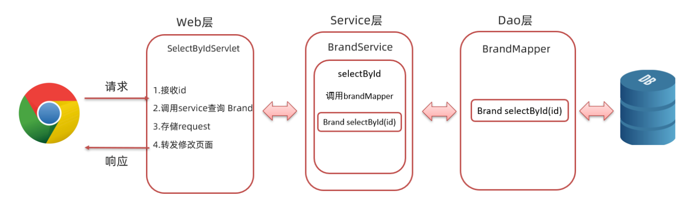


在 `BrandMapper` 接口，在接口中定义 `selectById(int id)` 方法

```java
/**
  * 根据id查询
  * @param id
  * @return
  */
@Select("select * from tb_brand where id = #{id}")
@ResultMap("brandResultMap")
Brand selectById(int id);
```


在 `BrandService` 类中定义根据id查询数据方法 `selectById(int id)` 

```java
/**
  * 根据id查询
  * @return
  */
public Brand selectById(int id){
    //调用BrandMapper.selectAll()
    //2. 获取SqlSession
    SqlSession sqlSession = factory.openSession();
    //3. 获取BrandMapper
    BrandMapper mapper = sqlSession.getMapper(BrandMapper.class);
    //4. 调用方法
    Brand brand = mapper.selectById(id);
    sqlSession.close();
    return brand;
}
```


在 `web` 包下创建 `SelectByIdServlet` 的 `servlet`，该 `servlet` 的逻辑如下:

- 获取请求数据 `id`
- 调用 `BrandService` 的 `selectById()` 方法进行数据查询的业务逻辑
- 将查询到的数据存储到 request 域对象中
- 跳转到 `update.jsp` 页面进行数据真实

具体代码如下：

```java
@WebServlet("/selectByIdServlet")
public class SelectByIdServlet extends HttpServlet {
    private  BrandService service = new BrandService();

    @Override
    protected void doGet(HttpServletRequest request, HttpServletResponse response) throws ServletException, IOException {
        //1. 接收id
        String id = request.getParameter("id");
        //2. 调用service查询
        Brand brand = service.selectById(Integer.parseInt(id));
        //3. 存储到request中
        request.setAttribute("brand",brand);
        //4. 转发到update.jsp
        request.getRequestDispatcher("/update.jsp").forward(request,response);
    }

    @Override
    protected void doPost(HttpServletRequest request, HttpServletResponse response) throws ServletException, IOException {
        this.doGet(request, response);
    }
}
```


编写update.jsp页面

```jsp
<%@ page contentType="text/html;charset=UTF-8" language="java" %>
<%@ taglib prefix="c" uri="http://java.sun.com/jsp/jstl/core" %>
<!DOCTYPE html>
<html lang="en">
<head>
    <meta charset="UTF-8">
    <title>修改品牌</title>
</head>
<body>
<h3>修改品牌</h3>
<form action="/brand-demo/updateServlet" method="post">

    品牌名称：<input name="brandName" value="${brand.brandName}"><br>
    企业名称：<input name="companyName" value="${brand.companyName}"><br>
    排序：<input name="ordered" value="${brand.ordered}"><br>
    描述信息：<textarea rows="5" cols="20" name="description">${brand.description} </textarea><br>
    状态：
    <c:if test="${brand.status == 0}">
        <input type="radio" name="status" value="0" checked>禁用
        <input type="radio" name="status" value="1">启用<br>
    </c:if>

    <c:if test="${brand.status == 1}">
        <input type="radio" name="status" value="0" >禁用
        <input type="radio" name="status" value="1" checked>启用<br>
    </c:if>

    <input type="submit" value="提交">
</form>
</body>
</html>
```


### 5，实现修改


做完回显数据后，接下来我们要做修改数据了，而下图是修改数据的效果：

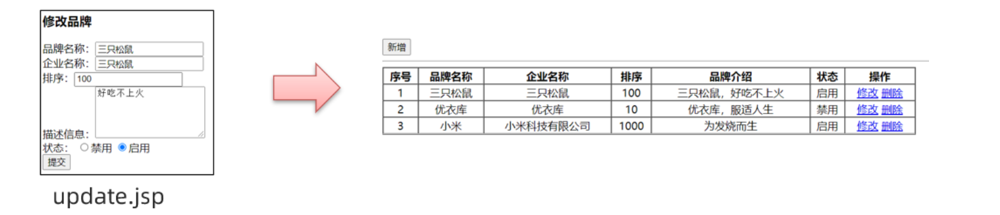


在修改页面进行数据修改，点击 `提交` 按钮，会将数据提交到后端程序，后端程序会对表中的数据进行修改操作，然后重新进行数据的查询操作。整体流程如下：

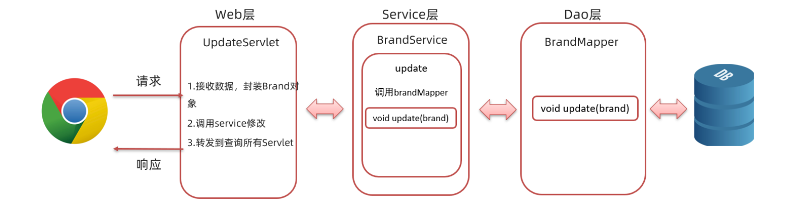


在 `BrandMapper` 接口，在接口中定义 `update(Brand brand)` 方法

```java
/**
  * 修改
  * @param brand
  */
@Update("update tb_brand set brand_name = #{brandName},company_name = #{companyName},ordered = #{ordered},description = #{description},status = #{status} where id = #{id}")
void update(Brand brand);
```


在 `BrandService` 类中定义根据id查询数据方法 `update(Brand brand)` 

```java
	/**
     * 修改
     * @param brand
     */
    public void update(Brand brand){
        //2. 获取SqlSession
        SqlSession sqlSession = factory.openSession();
        //3. 获取BrandMapper
        BrandMapper mapper = sqlSession.getMapper(BrandMapper.class);
        //4. 调用方法
        mapper.update(brand);
        //提交事务
        sqlSession.commit();
        //释放资源
        sqlSession.close();
    }
```


在 `web` 包下创建 `AddServlet` 的 `servlet`，该 `servlet` 的逻辑如下:

- 设置处理post请求乱码的字符集
- 接收客户端提交的数据
- 将接收到的数据封装到 `Brand` 对象中
- 调用 `BrandService` 的`update()` 方法进行添加的业务逻辑处理
- 跳转到 `selectAllServlet` 资源重新查询数据

具体的代码如下：

```java
@WebServlet("/updateServlet")
public class UpdateServlet extends HttpServlet {
    private BrandService service = new BrandService();

    @Override
    protected void doGet(HttpServletRequest request, HttpServletResponse response) throws ServletException, IOException {

        //处理POST请求的乱码问题
        request.setCharacterEncoding("utf-8");
        //1. 接收表单提交的数据，封装为一个Brand对象
        String id = request.getParameter("id");
        String brandName = request.getParameter("brandName");
        String companyName = request.getParameter("companyName");
        String ordered = request.getParameter("ordered");
        String description = request.getParameter("description");
        String status = request.getParameter("status");

        //封装为一个Brand对象
        Brand brand = new Brand();
        brand.setId(Integer.parseInt(id));
        brand.setBrandName(brandName);
        brand.setCompanyName(companyName);
        brand.setOrdered(Integer.parseInt(ordered));
        brand.setDescription(description);
        brand.setStatus(Integer.parseInt(status));

        //2. 调用service 完成修改
        service.update(brand);

        //3. 转发到查询所有Servlet
        request.getRequestDispatcher("/selectAllServlet").forward(request,response);
    }

    @Override
    protected void doPost(HttpServletRequest request, HttpServletResponse response) throws ServletException, IOException {
        this.doGet(request, response);
    }
}
```


存在问题：update.jsp 页面提交数据时是没有携带主键数据的，而后台修改数据需要根据主键进行修改。针对这个问题，我们不希望页面将主键id展示给用户看，但是又希望在提交数据时能将主键id提交到后端。此时我们就想到了在学习 HTML 时学习的隐藏域，在 `update.jsp` 页面的表单中添加如下代码：

```html
<%--隐藏域，提交id--%>
<input type="hidden" name="id" value="${brand.id}">
```


`update.jsp` 页面的最终代码如下：

```jsp
<%@ page contentType="text/html;charset=UTF-8" language="java" %>
<%@ taglib prefix="c" uri="http://java.sun.com/jsp/jstl/core" %>
<!DOCTYPE html>
<html lang="en">
<head>
    <meta charset="UTF-8">
    <title>修改品牌</title>
</head>
<body>
<h3>修改品牌</h3>
<form action="/brand-demo/updateServlet" method="post">

    <%--隐藏域，提交id--%>
    <input type="hidden" name="id" value="${brand.id}">

    品牌名称：<input name="brandName" value="${brand.brandName}"><br>
    企业名称：<input name="companyName" value="${brand.companyName}"><br>
    排序：<input name="ordered" value="${brand.ordered}"><br>
    描述信息：<textarea rows="5" cols="20" name="description">${brand.description} </textarea><br>
    状态：
    <c:if test="${brand.status == 0}">
        <input type="radio" name="status" value="0" checked>禁用
        <input type="radio" name="status" value="1">启用<br>
    </c:if>

    <c:if test="${brand.status == 1}">
        <input type="radio" name="status" value="0" >禁用
        <input type="radio" name="status" value="1" checked>启用<br>
    </c:if>
    <input type="submit" value="提交">
</form>
</body>
</html>
```


