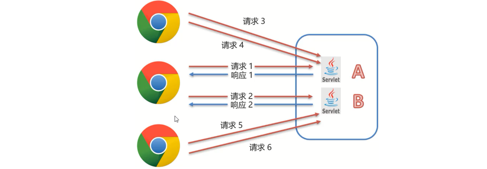
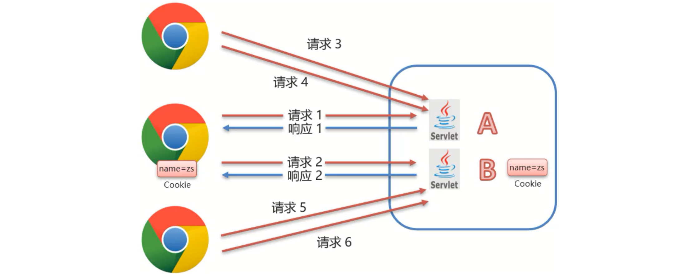
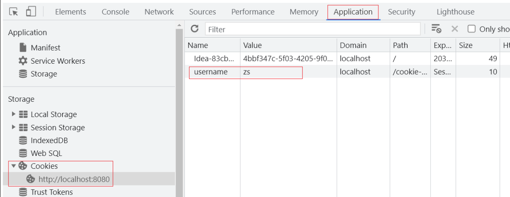
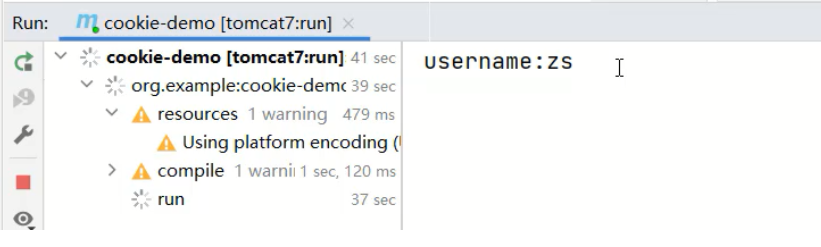
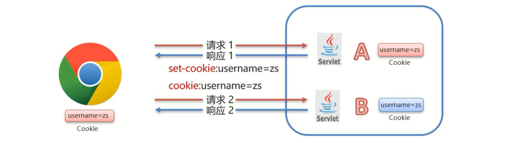
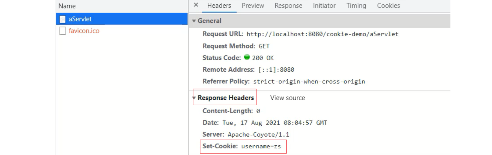
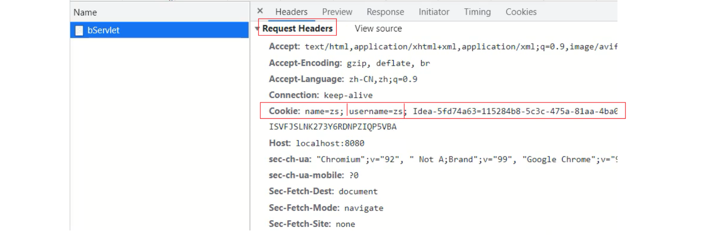
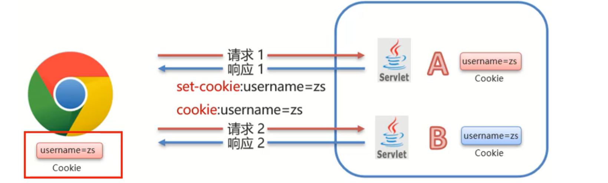
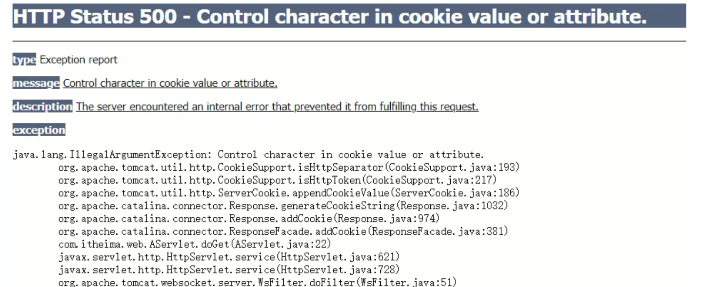

## 一，什么是会话技术

### 1，会话技术概述

对于`会话跟踪`这四个词，我们需要拆开来进行解释，首先要理解什么是`会话`，然后再去理解什么是`会话跟踪`。


会话:用户打开浏览器，访问web服务器的资源，会话建立，直到有一方断开连接，会话结束。在一次会话中可以包含多次请求和响应。

- 从浏览器发出请求到服务端响应数据给前端之后，一次会话(在浏览器和服务器之间)就被建立了
- 会话被建立后，如果浏览器或服务端都没有被关闭，则会话就会持续建立着
- 浏览器和服务器就可以继续使用该会话进行请求发送和响应，上述的整个过程就被称之为会话。


用实际场景来理解下会话，比如在我们访问京东的时候，当打开浏览器进入京东首页后，浏览器和京东的服务器之间就建立了一次会话，后面的搜索商品,查看商品的详情,加入购物车等都是在这一次会话中完成。



图中总共建立了3个会话，每个浏览器都会与服务端建立了一个会话。


会话跟踪是一种维护浏览器状态的方法，服务器需要识别多次请求是否来自于同一浏览器，以便在同一次会话的多次请求间共享数据

- 服务器会收到多个请求，这多个请求可能来自多个浏览器，如上图中的6个请求来自3个浏览器
- 服务器需要用来识别请求是否来自同一个浏览器
- 服务器用来识别浏览器的过程，这个过程就是会话跟踪
- 服务器识别浏览器后就可以在同一个会话中多次请求之间来共享数据


那么我们又有一个问题需要思考，一个会话中的多次请求为什么要共享数据呢?有了这个数据共享功能后能实现哪些功能呢?

- 购物车: `加入购物车`和`去购物车结算`是两次请求，但是后面这次请求要想展示前一次请求所添加的商品，就需要用到数据共享。
- 页面展示用户登录信息:很多网站，登录后访问多个功能发送多次请求后，浏览器上都会有当前登录用户的信息[用户名]，比如百度、京东、码云等。
- 网站登录页面的`记住我`功能:当用户登录成功后，勾选`记住我`按钮后下次再登录的时候，网站就会自动填充用户名和密码，简化用户的登录操作，多次登录就会有多次请求，他们之间也涉及到共享数据
- 登录页面的验证码功能:生成验证码和输入验证码点击注册这也是两次请求，这两次请求的数据之间要进行对比，相同则允许注册，不同则拒绝注册，该功能的实现也需要在同一次会话中共享数据。
- ....


通过这几个例子的讲解，相信大家对`会话追踪`技术已经有了一定的理解，该技术在实际开发中也非常重要。那么接下来我们就需要去学习下`会话跟踪`技术，在学习这些技术之前，我们需要思考:为什么现在浏览器和服务器不支持数据共享呢?

- 浏览器和服务器之间使用的是HTTP请求来进行数据传输
- HTTP协议是无状态的，每次浏览器向服务器请求时，服务器都会将该请求视为新的请求
- HTTP协议设计成无状态的目的是让每次请求之间相互独立，互不影响
- 请求与请求之间独立后，就无法实现多次请求之间的数据共享


分析完具体的原因后，那么该如何实现会话跟踪技术呢? 具体的实现方式有:

1. 客户端会话跟踪技术：Cookie

2. 服务端会话跟踪技术：Session

这两个技术都可以实现会话跟踪，它们之间最大的区别:Cookie是存储在浏览器端而Session是存储在服务器端


总结：

- HTTP协议是无状态的，靠HTTP协议是无法实现会话跟踪
- 想要实现会话跟踪，就需要用到Cookie和Session


## 二，Cookie

### 1，Cookie的基本使用

Cookie：客户端会话技术，将数据保存到客户端，以后每次请求都携带Cookie数据进行访问。


Cookie的工作流程：




- 服务端提供了两个Servlet，分别是ServletA和ServletB
- 浏览器发送HTTP请求1给服务端，服务端ServletA接收请求并进行业务处理
- 服务端ServletA在处理的过程中可以创建一个Cookie对象并将`name=zs`的数据存入Cookie
- 服务端ServletA在响应数据的时候，会把Cookie对象响应给浏览器
- 浏览器接收到响应数据，会把Cookie对象中的数据存储在浏览器内存中，此时浏览器和服务端就建立了一次会话
- 在同一次会话中浏览器再次发送HTTP请求2给服务端ServletB，浏览器会携带Cookie对象中的所有数据
- ServletB接收到请求和数据后，就可以获取到存储在Cookie对象中的数据，这样同一个会话中的多次请求之间就实现了数据共享


对于Cookie的使用，我们更关注的应该是后台代码如何操作Cookie，对于Cookie的操作主要分两大类，本别是发送Cookie和获取Cookie,对于上面这两块内容，分别该如何实现呢?


发送Cookie：

- 创建Cookie对象，并设置数据

  ```java
  Cookie cookie = new Cookie("key","value");
  ```

- 发送Cookie到客户端：使用response对象

  ```java
  response.addCookie(cookie);
  ```

  

介绍完发送Cookie对应的步骤后，接下面通过一个案例来完成Cookie的发送，具体实现步骤为:

1. 创建Maven项目cookie-demo，并在pom.xml添加依赖

   ```java
   <properties>
       <maven.compiler.source>8</maven.compiler.source>
       <maven.compiler.target>8</maven.compiler.target>
   </properties>
   
   <dependencies>
       <!--servlet-->
       <dependency>
           <groupId>javax.servlet</groupId>
           <artifactId>javax.servlet-api</artifactId>
           <version>3.1.0</version>
           <scope>provided</scope>
       </dependency>
       <!--jsp-->
       <dependency>
           <groupId>javax.servlet.jsp</groupId>
           <artifactId>jsp-api</artifactId>
           <version>2.2</version>
           <scope>provided</scope>
       </dependency>
       <!--jstl-->
       <dependency>
           <groupId>jstl</groupId>
           <artifactId>jstl</artifactId>
           <version>1.2</version>
       </dependency>
       <dependency>
           <groupId>taglibs</groupId>
           <artifactId>standard</artifactId>
           <version>1.1.2</version>
       </dependency>
   </dependencies>
   <build>
       <plugins>
           <plugin>
               <groupId>org.apache.tomcat.maven</groupId>
               <artifactId>tomcat7-maven-plugin</artifactId>
               <version>2.2</version>
           </plugin>
       </plugins>
   </build>
   ```

2. 编写Servlet类，名称为AServlet

   ```java
   @WebServlet("/aServlet")
   public class AServlet extends HttpServlet {
       @Override
       protected void doGet(HttpServletRequest request, HttpServletResponse response) throws ServletException, IOException {
   
       }
   
       @Override
       protected void doPost(HttpServletRequest request, HttpServletResponse response) throws ServletException, IOException {
           this.doGet(request, response);
       }
   }
   ```

3. 在Servlet中创建Cookie对象，存入数据，发送给前端

   ```java
   @WebServlet("/aServlet")
   public class AServlet extends HttpServlet {
       @Override
       protected void doGet(HttpServletRequest request, HttpServletResponse response) throws ServletException, IOException {
           //发送Cookie
           //1. 创建Cookie对象
           Cookie cookie = new Cookie("username","zs");
           //2. 发送Cookie，response
           response.addCookie(cookie);
       }
   
       @Override
       protected void doPost(HttpServletRequest request, HttpServletResponse response) throws ServletException, IOException {
           this.doGet(request, response);
       }
   }
   ```

4. 启动测试，在浏览器查看Cookie对象中的值

   


获取客户端携带的所有Cookie，使用request对象

```java
Cookie[] cookies = request.getCookies();
```

遍历数组，获取每一个Cookie对象，使用Cookie对象方法获取数据

```java
cookie.getName();
cookie.getValue();
```


介绍完获取Cookie对应的步骤后，接下面再通过一个案例来完成Cookie的获取，具体实现步骤为:

1. 编写一个新Servlet类，名称为BServlet

   ```java
   @WebServlet("/bServlet")
   public class BServlet extends HttpServlet {
       @Override
       protected void doGet(HttpServletRequest request, HttpServletResponse response) throws ServletException, IOException {
   
       }
   
       @Override
       protected void doPost(HttpServletRequest request, HttpServletResponse response) throws ServletException, IOException {
           this.doGet(request, response);
       }
   }
   ```

2. 在BServlet中使用request对象获取Cookie数组，遍历数组，从数据中获取指定名称对应的值

   ```java
   @WebServlet("/bServlet")
   public class BServlet extends HttpServlet {
       @Override
       protected void doGet(HttpServletRequest request, HttpServletResponse response) throws ServletException, IOException {
           //获取Cookie
           //1. 获取Cookie数组
           Cookie[] cookies = request.getCookies();
           //2. 遍历数组
           for (Cookie cookie : cookies) {
               //3. 获取数据
               String name = cookie.getName();
               if("username".equals(name)){
                   String value = cookie.getValue();
                   System.out.println(name+":"+value);
                   break;
               }
           }
   
       }
   
       @Override
       protected void doPost(HttpServletRequest request, HttpServletResponse response) throws ServletException, IOException {
           this.doGet(request, response);
       }
   }
   ```

3. 启动测试，在控制台打印出获取的值

   


总结：

- 发送Cookie
  - 创建Cookie对象，并设置值:Cookie cookie = new Cookie("key","value");
  - 发送Cookie到客户端使用的是Reponse对象:response.addCookie(cookie);
- 获取Cookie
  - 使用Request对象获取Cookie数组:Cookie[] cookies = request.getCookies();
  - 遍历数组
  - 获取数组中每个Cookie对象的值:cookie.getName()和cookie.getValue()


### 2，Cookie的原理分析

对于Cookie的实现原理是基于HTTP协议的,其中设计到HTTP协议中的两个请求头信息:

- 响应头:set-cookie
- 请求头: cookie




流程：

- 前面的案例中已经能够实现，AServlet给前端发送Cookie,BServlet从request中获取Cookie的功能
- 对于AServlet响应数据的时候，Tomcat服务器都是基于HTTP协议来响应数据
- 当Tomcat发现后端要返回的是一个Cookie对象之后，Tomcat就会在响应头中添加一行数据`Set-Cookie:username=zs`
- 浏览器获取到响应结果后，从响应头中就可以获取到`Set-Cookie`对应值`username=zs`,并将数据存储在浏览器的内存中
- 浏览器再次发送请求给BServlet的时候，浏览器会自动在请求头中添加`Cookie: username=zs`发送给服务端BServlet
- Request对象会把请求头中cookie对应的值封装成一个个Cookie对象，最终形成一个数组
- BServlet通过Request对象获取到Cookie[]后，就可以从中获取自己需要的数据


访问AServlet对应的地址`http://localhost:8080/cookie-demo/aServlet`。使用Chrom浏览器打开开发者工具(F12或Crtl+Shift+I)进行查看响应头中的数据




访问BServlet对应的地址`http://localhost:8080/cookie-demo/bServlet`。使用Chrom浏览器打开开发者工具(F12或Crtl+Shift+I)进行查看请求头中的数据




### 3，Cookie的使用细节

Cookie的细节中，主要讲解两个知识：

- Cookie的存活时间
- Cookie如何存储中文


流程：




1. 浏览器发送请求给AServlet,AServlet会响应一个存有`usernanme=zs`的Cookie对象给浏览器

2. 浏览器接收到响应数据将cookie存入到浏览器内存中

3. 当浏览器再次发送请求给BServlet,BServlet就可以使用Request对象获取到Cookie数据

4. 在发送请求到BServlet之前，如果把浏览器关闭再打开进行访问，BServlet能否获取到Cookie数据?


经过测试，会发现，BServlet中无法再获取到Cookie数据。默认情况下，Cookie存储在浏览器内存中，当浏览器关闭，内存释放，则Cookie被销毁。那么如何将Cookie持久化存储?


Cookie其实已经为我们提供好了对应的API来完成这件事，这个API就是setMaxAge。用于设置Cookie存活时间

```java
setMaxAge(int seconds)
```


参数值：

- 正数：将Cookie写入浏览器所在电脑的硬盘，持久化存储。到时间自动删除
- 负数：默认值，Cookie在当前浏览器内存中，当浏览器关闭，则Cookie被销毁
- 零：删除对应Cookie


接下来，咱们就在AServlet中去设置Cookie的存活时间。

```java
@WebServlet("/aServlet")
public class AServlet extends HttpServlet {
    @Override
    protected void doGet(HttpServletRequest request, HttpServletResponse response) throws ServletException, IOException {
        //发送Cookie
        //1. 创建Cookie对象
        Cookie cookie = new Cookie("username","zs");
        //设置存活时间   ，1周 7天
        cookie.setMaxAge(60*60*24*7); //易阅读，需程序计算
		//cookie.setMaxAge(604800); //不易阅读(可以使用注解弥补)，程序少进行一次计算
        //2. 发送Cookie，response
        response.addCookie(cookie);
    }

    @Override
    protected void doPost(HttpServletRequest request, HttpServletResponse response) throws ServletException, IOException {
        this.doGet(request, response);
    }
}
```


访问一个AServlet后，把浏览器关闭重启后，再去访问`http://localhost:8080/cookie-demo/bServet`,能在控制台打印出`username:zs`,说明Cookie没有随着浏览器关闭而被销毁。通过浏览器查看Cookie的内容，会发现Cookie的相关信息如下：


还有一个问题是，Cookie中如何存储中文，将之前`username=zs`的值改成`username=张三`，把汉字`张三`存入到Cookie中，看是什么效果:

```java
@WebServlet("/aServlet")
public class AServlet extends HttpServlet {
    @Override
    protected void doGet(HttpServletRequest request, HttpServletResponse response) throws ServletException, IOException {
 		//发送Cookie
        String value = "张三";
        Cookie cookie = new Cookie("username",value);
        //设置存活时间   ，1周 7天
        cookie.setMaxAge(60*60*24*7);
        //2. 发送Cookie，response
        response.addCookie(cookie);
    }

    @Override
    protected void doPost(HttpServletRequest request, HttpServletResponse response) throws ServletException, IOException {
        this.doGet(request, response);
    }
}
```


启动访问测试，访问`http://localhost:8080/cookie-demo/aServlet`会发现浏览器会提示错误信息




通过上面的案例演示，我们得到一个结论: Cookie不能直接存储中文。但是如果有这方面的需求，这个时候该如何解决呢? 这个时候，我们可以使用之前学过的一个知识点叫`URL编码`，所以如果需要存储中文，就需要进行转码，具体的实现思路为:

1. 在AServlet中对中文进行URL编码，采用URLEncoder.encode()，将编码后的值存入Cookie中

   ```java
   @WebServlet("/aServlet")
   public class AServlet extends HttpServlet {
       @Override
       protected void doGet(HttpServletRequest request, HttpServletResponse response) throws ServletException, IOException {
           //发送Cookie
           String value = "张三";
           //对中文进行URL编码
           value = URLEncoder.encode(value, "UTF-8");
           System.out.println("存储数据："+value);
           //将编码后的值存入Cookie中
           Cookie cookie = new Cookie("username",value);
           //设置存活时间   ，1周 7天
           cookie.setMaxAge(60*60*24*7);
           //2. 发送Cookie，response
           response.addCookie(cookie);
       }
   
       @Override
       protected void doPost(HttpServletRequest request, HttpServletResponse response) throws ServletException, IOException {
           this.doGet(request, response);
       }
   }
   ```

2. 在BServlet中获取Cookie中的值,获取的值为URL编码后的值。将获取的值在进行URL解码,采用URLDecoder.decode()，就可以获取到对应的中文值

   ```java
   @WebServlet("/bServlet")
   public class BServlet extends HttpServlet {
       @Override
       protected void doGet(HttpServletRequest request, HttpServletResponse response) throws ServletException, IOException {
           //获取Cookie
           //1. 获取Cookie数组
           Cookie[] cookies = request.getCookies();
           //2. 遍历数组
           for (Cookie cookie : cookies) {
               //3. 获取数据
               String name = cookie.getName();
               if("username".equals(name)){
                   String value = cookie.getValue();//获取的是URL编码后的值 %E5%BC%A0%E4%B8%89
                   //URL解码
                   value = URLDecoder.decode(value,"UTF-8");
                   System.out.println(name+":"+value);//value解码后为 张三
                   break;
               }
           }
   
       }
   
       @Override
       protected void doPost(HttpServletRequest request, HttpServletResponse response) throws ServletException, IOException {
           this.doGet(request, response);
       }
   }
   ```


Cookie的使用细节中，我们讲了Cookie的`存活时间`和`存储中文`:

- 存活时间，需要掌握setMaxAage()API的使用

- 存储中文，需要掌握URL编码和解码的使用

  

## 三，Session
### 1，Session的基本使用


### 2，Session的原理分析


### 3，Session的使用细节


## 四，登录注册
### 1，需求分析


### 2，登录实现


### 3，记住我功能


### 4，注册实现


### 5，验证码展示


### 6，验证码校验

