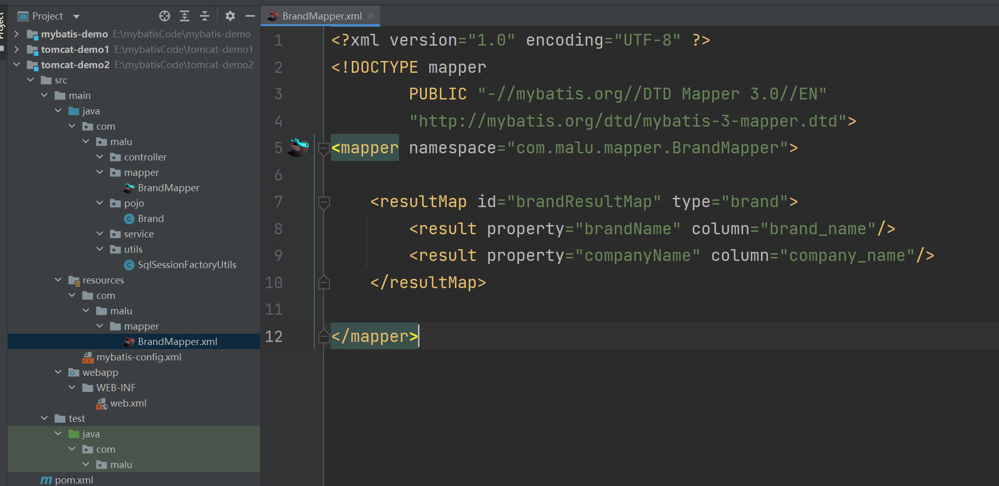
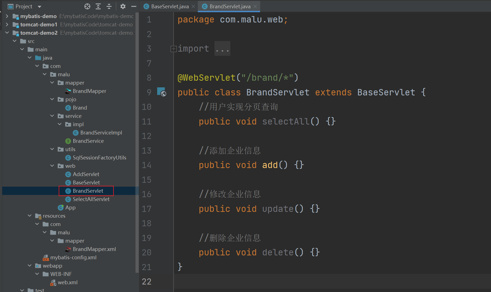

## 一，Filter

### 1，Filter快速入门

Filter 表示过滤器，是 JavaWeb 三大组件(Servlet、Filter、Listener)之一。Vue2中也有过滤器。Vue中的过滤器是对数据进行格式化的。Servlet 我们之前都已经学习过了，Filter和Listener 我们今天都会进行学习。过滤器可以把对资源的请求拦截下来，从而实现一些特殊的功能。


不拦截的图示：


拦截图示：


拦截器拦截到后可以做什么功能呢？

- 每个资源都要写一些代码完成某个功能，我们总不能在每个资源中写这样的代码吧，而此时我们可以将这些代码写在过滤器中，因为请求每一个资源都要经过过滤器。


进行 `Filter` 开发分成以下三步实现

1. 定义类，实现 Filter接口，并重写其所有方法

   

2. 配置Filter拦截资源的路径：在类上定义 `@WebFilter` 注解。而注解的 `value` 属性值 `/*` 表示拦截所有的资源

   

3. 在doFilter方法中输出一句话，并放行

   


代码演示：

1. 创建一个项目，项目下有一个 `hello.jsp` 页面，项目结构如下：

   

2. `pom.xml` 配置文件内容如下：

   

   ```xml
   <?xml version="1.0" encoding="UTF-8"?>
   
   <project xmlns="http://maven.apache.org/POM/4.0.0" xmlns:xsi="http://www.w3.org/2001/XMLSchema-instance"
     xsi:schemaLocation="http://maven.apache.org/POM/4.0.0 http://maven.apache.org/xsd/maven-4.0.0.xsd">
     <modelVersion>4.0.0</modelVersion>
   
     <groupId>com.malu</groupId>
     <artifactId>untitled</artifactId>
     <version>1.0-SNAPSHOT</version>
     <packaging>war</packaging>
   
     <dependencies>
       <dependency>
         <groupId>javax.servlet</groupId>
         <artifactId>javax.servlet-api</artifactId>
         <version>3.1.0</version>
         <scope>provided</scope>
       </dependency>
     </dependencies>
   
     <properties>
       <project.build.sourceEncoding>UTF-8</project.build.sourceEncoding>
       <maven.compiler.source>1.8</maven.compiler.source>
       <maven.compiler.target>1.8</maven.compiler.target>
     </properties>
   
     <build>
       <plugins>
         <plugin>
           <groupId>org.apache.tomcat.maven</groupId>
           <artifactId>tomcat7-maven-plugin</artifactId>
           <version>2.2</version>
           <configuration>
             <port>8081</port>
             <path>/dingcan</path>
           </configuration>
         </plugin>
       </plugins>
     </build>
   
   </project>
   
   ```

3. `hello.jsp` 页面内容如下：

   

   ```jsp
   <%@ page contentType="text/html;charset=UTF-8" language="java" %>
   <html>
   <head>
       <title>Title</title>
   </head>
   <body>
       <h1>hello JSP~</h1>
   </body>
   </html>
   ```

4. 我们现在在浏览器输入 `http://localhost:8081/dingcan/hello.jsp` 访问 `hello.jsp` 页面，这里是可以访问到 `hello.jsp` 页面内容的。

   

   

   

5. 将 `filter` 创建在 `com.malu.web.filter` 包下，起名为 `FilterDemo`

   

   ```java
   @WebFilter("/*")
   public class FilterDemo implements Filter {
   
       @Override
       public void doFilter(ServletRequest request, ServletResponse response, FilterChain chain) throws IOException, ServletException {
           System.out.println("FilterDemo...");
       }
   
       @Override
       public void init(FilterConfig filterConfig) throws ServletException {
       }
   
       @Override
       public void destroy() {
       }
   }
   ```

6. 重启启动服务器，再次重新访问 `hello.jsp` 页面，这次发现页面没有任何效果，但是在 `idea` 的控制台可以看到如下内容

   


上述效果说明 `FilterDemo` 这个过滤器的 `doFilter()` 方法执行了，但是为什么在浏览器上看不到 `hello.jsp` 页面的内容呢？这是因为在 `doFilter()` 方法中添加放行的方法才能访问到 `hello.jsp` 页面。那就在 `doFilter()` 方法中添加放行的代码

```java
//放行
filterChain.doFilter(servletRequest,servletResponse);
```


再次重启服务器并访问 `hello.jsp` 页面，发现这次就可以在浏览器上看到页面效果。FilterDemo` 过滤器完整代码如下：


```java
package com.malu.web.filter;

import javax.servlet.*;
import javax.servlet.annotation.WebFilter;
import java.io.IOException;

// 创建过滤器，作用是拦截请求的
@WebFilter("/*")
public class FilterDemo implements Filter {
    @Override
    public void init(FilterConfig filterConfig) throws ServletException {

    }

    @Override
    public void doFilter(ServletRequest servletRequest, ServletResponse servletResponse, FilterChain filterChain) throws IOException, ServletException {
        System.out.println("FilterDemo....");

        // 放行~
        filterChain.doFilter(servletRequest,servletResponse);
    }

    @Override
    public void destroy() {

    }
}
```


测试之：


### 2，Filter执行流程


如上图是使用过滤器的流程，我们通过以下问题来研究过滤器的执行流程：

- 放行后访问对应资源，资源访问完成后，还会回到Filter中吗？从上图就可以看出肯定 会 回到Filter中
- 如果回到Filter中，是重头执行还是执行放行后的逻辑呢？如果是重头执行的话，就意味着 `放行前逻辑` 会被执行两次，肯定不会这样设计了；所以访问完资源后，会回到 `放行后逻辑`，执行该部分代码。

通过上述的说明，我们就可以总结Filter的执行流程如下：


接下来我们通过代码验证一下，在 `doFilter()` 方法前后都加上输出语句，如下


```java
// 创建过滤器，作用是拦截请求的
@WebFilter("/*")
public class FilterDemo implements Filter {
    @Override
    public void init(FilterConfig filterConfig) throws ServletException {

    }

    @Override
    public void doFilter(ServletRequest servletRequest, ServletResponse servletResponse, FilterChain filterChain) throws IOException, ServletException {

        // 放行前逻辑
        System.out.println("1.FilterDemo....");

        // 放行~
        filterChain.doFilter(servletRequest,servletResponse);

        // 放行后逻辑
        System.out.println("3.FilterDemo....");
    }

    @Override
    public void destroy() {

    }
}
```


同时在 `hello.jsp` 页面加上输出语句，如下


执行访问该资源打印的顺序是按照我们标记的标号进行打印的话，说明我们上边总结出来的流程是没有问题的。启动服务器访问 `hello.jsp` 页面，在控制台打印的内容如下：


以后我们可以将对请求进行处理的代码放在放行之前进行处理，而如果请求完资源后还要对响应的数据进行处理时可以在放行后进行逻辑处理。


### 3，Filter拦截路径配置

拦截路径表示 Filter 会对请求的哪些资源进行拦截，使用 `@WebFilter` 注解进行配置。如：`@WebFilter("拦截路径")` 

拦截路径有如下四种配置方式：

- 拦截具体的资源：/index.jsp：只有访问index.jsp时才会被拦截
- 目录拦截：/user/*：访问/user下的所有资源，都会被拦截
- 后缀名拦截：/*.jsp：访问后缀名为jsp的资源，都会被拦截
- 拦截所有：/*：访问所有资源，都会被拦截

通过上面拦截路径的学习，大家会发现拦截路径的配置方式和 `Servlet` 的请求资源路径配置方式一样，但是表示的含义不同。


### 4，过滤器链

过滤器链是指在一个Web应用，可以配置多个过滤器，这多个过滤器称为过滤器链。如下图就是一个过滤器链，我们学习过滤器链主要是学习过滤器链执行的流程


上图中的过滤器链执行是按照以下流程执行：

1. 执行 `Filter1` 的放行前逻辑代码
2. 执行 `Filter1` 的放行代码
3. 执行 `Filter2` 的放行前逻辑代码
4. 执行 `Filter2` 的放行代码
5. 访问到资源
6. 执行 `Filter2` 的放行后逻辑代码
7. 执行 `Filter1` 的放行后逻辑代码

以上流程串起来就像一条链子，故称之为过滤器链。


编写第一个过滤器 `FilterDemo` ，配置成拦截所有资源


```java
@WebFilter("/*")
public class FilterDemo implements Filter {
    @Override
    public void init(FilterConfig filterConfig) throws ServletException {

    }

    @Override
    public void doFilter(ServletRequest servletRequest, ServletResponse servletResponse, FilterChain filterChain) throws IOException, ServletException {

        // 放行前逻辑
        System.out.println("1.FilterDemo....");

        // 放行~
        filterChain.doFilter(servletRequest,servletResponse);

        // 放行后逻辑
        System.out.println("2.FilterDemo....");
    }

    @Override
    public void destroy() {

    }
}
```


编写第二个过滤器 `FilterDemo2` ，配置成拦截所有资源


```java
@WebFilter("/*")
public class FilterDemo2 implements Filter {
    @Override
    public void init(FilterConfig filterConfig) throws ServletException {

    }

    @Override
    public void doFilter(ServletRequest servletRequest, ServletResponse servletResponse, FilterChain filterChain) throws IOException, ServletException {

        // 放行前逻辑
        System.out.println("1.FilterDemo2....");

        // 放行~
        filterChain.doFilter(servletRequest,servletResponse);

        // 放行后逻辑
        System.out.println("2.FilterDemo2....");
    }

    @Override
    public void destroy() {

    }
}
```


修改 `hello.jsp` 页面中脚本的输出语句


```jsp
<%@ page contentType="text/html;charset=UTF-8" language="java" %>
<html>
<head>
    <title>Title</title>
</head>
<body>
    <h1>hello JSP~</h1>
    <%
        System.out.println("hello jsp");
    %>
</body>
</html>
```


启动服务器，在浏览器输入 `http://localhost/filter-demo/hello.jsp` 进行测试，在控制台打印内容如下


上面代码中为什么是先执行 `FilterDemo` ，后执行 `FilterDemo2` 呢？我们现在使用的是注解配置Filter，而这种配置方式的优先级是按照过滤器类名(字符串)的自然排序。比如有如下两个名称的过滤器 ： `BFilterDemo` 和 `AFilterDemo` 。那一定是 `AFilterDemo` 过滤器先执行。

### 5，案例

访问服务器资源时，需要先进行登录验证，如果没有登录，则自动跳转到登录页面。要实现该功能是在每一个资源里加入登陆状态校验的代码吗？显然是不需要的，只需要写一个 `Filter` ，在该过滤器中进行登陆状态校验即可。而在该 `Filter` 中逻辑如下：


在 `tomcat-demo1` 工程创建 `com.malu.web.filter`  包，在该下创建名为 `LoginFilter` 的过滤器


```java
@WebFilter("/*")
public class LoginFilter implements Filter {
    @Override
    public void init(FilterConfig filterConfig) throws ServletException {

    }

    @Override
    public void doFilter(ServletRequest servletRequest, ServletResponse servletResponse, FilterChain filterChain) throws IOException, ServletException {

    }

    @Override
    public void destroy() {

    }
}
```

在 `doFilter()` 方法中编写登陆状态校验的逻辑代码。首先需要从 `session` 对象中获取用户信息，但是 `ServletRequest` 类型的 requset 对象没有获取 session 对象的方法，所以此时需要将 request对象强转成 `HttpServletRequest` 对象。然后完成以下逻辑

- 获取Session对象
- 从Session对象中获取名为 `user` 的数据
- 判断获取到的数据是否是 null
  - 如果不是，说明已经登陆，放行
  - 如果是，说明尚未登陆，将提示信息存储到域对象中并跳转到登陆页面

代码如下：


```java
@WebFilter("/*")
public class LoginFilter implements Filter {

    @Override
    public void doFilter(ServletRequest servletRequest, ServletResponse servletResponse, FilterChain filterChain) throws IOException, ServletException {
        // 把servletRequest 强制转化成 HttpServletRequest
        HttpServletRequest req = (HttpServletRequest)servletRequest;

        // 得到session对象
        HttpSession session = req.getSession();
        Object user = session.getAttribute("user");

        // 判断user是否为null
        if(user != null){
            // 登录了
            filterChain.doFilter(servletRequest,servletResponse);
        }else{
            // 没有登录
            req.setAttribute("login_msg","您尚未登陆！");
            req.getRequestDispatcher("/login.jsp").forward(req,servletResponse);
        }
    }

    @Override
    public void init(FilterConfig filterConfig) throws ServletException {
    }
    @Override
    public void destroy() {
    }
}
```


login.jsp，如下：


```jsp
<%@ page contentType="text/html;charset=UTF-8" language="java" %>
<!DOCTYPE html>
<html lang="en">
<head>
    <meta charset="UTF-8">
    <title>login</title>
</head>
<body>
<div>
    <form action="/dingcan/loginServlet" method="post" id="form">
        <p>Username:<input id="username" name="username" type="text" ></p>
        <p>Password:<input id="password" name="password" type="password" ></p>
        <p>Remember:<input id="remember" name="remember" value="1" type="checkbox"></p>
        <div id="subDiv">
            <input type="submit" class="button" value="login up">
            <input type="reset" class="button" value="reset">&nbsp;&nbsp;&nbsp;
            <a href="register.jsp">没有账号？</a>
        </div>
    </form>
</div>
</body>
</html>
```


在浏览器上输入 `http://localhost:8081/cart/` ，由于没有登录，那么就会被拦截下来，可以看到如下页面效果


/*会拦截所有的资源，有些资源想直接放行，可以配置：

```java
//判断访问资源路径是否和登录注册相关
//1,在数组中存储登陆和注册相关的资源路径
String[] urls = {"/login.jsp","/imgs/","/css/"};
//2,获取当前访问的资源路径
String url = req.getRequestURL().toString(); 

//3,遍历数组，获取到每一个需要放行的资源路径
for (String u : urls) {
    //4,判断当前访问的资源路径字符串是否包含要放行的的资源路径字符串
    /*
    	比如当前访问的资源路径是  /dingcan/login.jsp
    	而字符串 /dingcan/login.jsp 包含了  字符串 /login.jsp ，所以这个字符串就需要放行
    */
    if(url.contains(u)){
        //找到了，放行
        chain.doFilter(request, response);
        //break;
        return;
    }
}
```


过滤器完整代码：

```java
@WebFilter("/*")
public class LoginFilter implements Filter {
    @Override
    public void doFilter(ServletRequest request, ServletResponse response, FilterChain chain) throws ServletException, IOException {
        HttpServletRequest req = (HttpServletRequest) request;
        
        //判断访问资源路径是否和登录注册相关
        //1,在数组中存储登陆和注册相关的资源路径
        String[] urls = {"/login.jsp","/imgs/","/css/","/loginServlet","/register.jsp","/registerServlet","/checkCodeServlet"};
        //2,获取当前访问的资源路径
        String url = req.getRequestURL().toString(); 

        //3,遍历数组，获取到每一个需要放行的资源路径
        for (String u : urls) {
            //4,判断当前访问的资源路径字符串是否包含要放行的的资源路径字符串
            if(url.contains(u)){
                //找到了，放行
                chain.doFilter(request, response);
                //break;
                return;
            }
        }
   
        //1. 判断session中是否有user
        HttpSession session = req.getSession();
        Object user = session.getAttribute("user");

        //2. 判断user是否为null
        if(user != null){
            // 登录过了
            //放行
            chain.doFilter(request, response);
        }else {
            // 没有登陆，存储提示信息，跳转到登录页面

            req.setAttribute("login_msg","您尚未登陆！");
            req.getRequestDispatcher("/login.jsp").forward(req,response);
        }
    }

    public void init(FilterConfig config) throws ServletException {
    }

    public void destroy() {
    }
}
```


## 二，Listener

### 1，监听器分类

Listener 表示监听器，是 JavaWeb 三大组件(Servlet、Filter、Listener)之一。监听器可以监听就是在 `application`，`session`，`request` 三个对象创建、销毁或者往其中添加修改删除属性时自动执行代码的功能组件。request 和 session 我们学习过。而 `application` 是 `ServletContext` 类型的对象。`ServletContext` 代表整个web应用，在服务器启动的时候，tomcat会自动创建该对象。在服务器关闭时会自动销毁该对象。


JavaWeb 提供了8个监听器：


这里面只有 `ServletContextListener` 这个监听器后期我们会接触到，`ServletContextListener` 是用来监听 `ServletContext` 对象的创建和销毁。ServletContextListener` 接口中有以下两个方法

- `void contextInitialized(ServletContextEvent sce)`：`ServletContext` 对象被创建了会自动执行的方法
- `void contextDestroyed(ServletContextEvent sce)`：`ServletContext` 对象被销毁时会自动执行的方法

### 2，代码演示

演示一下 `ServletContextListener` 监听器

- 定义一个类，实现`ServletContextListener` 接口
- 重写所有的抽象方法
- 使用 `@WebListener` 进行配置


代码如下：


```java
@WebListener
public class ContextLoaderListener implements ServletContextListener {
    @Override
    public void contextInitialized(ServletContextEvent sce) {
        //加载资源
        System.out.println("ContextLoaderListener...");
    }

    @Override
    public void contextDestroyed(ServletContextEvent sce) {
        //释放资源
    }
}
```


启动服务器，就可以在启动的日志信息中看到 `contextInitialized()` 方法输出的内容，同时也说明了 `ServletContext` 对象在服务器启动的时候被创建了。


## 三，案例练习


### 1，Fastjson介绍

`Fastjson` 是阿里巴巴提供的一个Java语言编写的高性能功能完善的 `JSON` 库，是目前Java语言中最快的 `JSON` 库，可以实现 `Java` 对象和 `JSON` 字符串的相互转换。


`Fastjson` 使用也是比较简单的，分为以下三步完成

1. 导入坐标

   

   ```xml
   <dependency>
       <groupId>com.alibaba</groupId>
       <artifactId>fastjson</artifactId>
       <version>1.2.62</version>
   </dependency>
   ```

2. Java对象转JSON

   ```java
   // 将 Java 对象转换为 JSON 串，只需要使用 `Fastjson` 提供的 `JSON` 类中的 `toJSONString()` 静态方法即可。
   String jsonStr = JSON.toJSONString(obj);
   ```

3. JSON字符串转Java对象

   ```java
   // 将 json 转换为 Java 对象，只需要使用 `Fastjson` 提供的 `JSON` 类中的 `parseObject()` 静态方法即可。
   User user = JSON.parseObject(jsonStr, User.class);
   ```


准备pojo，如下：


```java
package com.malu.pojo;

public class User {

    private Integer id;
    private String username;
    private String password;

    public Integer getId() {
        return id;
    }

    public void setId(Integer id) {
        this.id = id;
    }

    public String getUsername() {
        return username;
    }

    public void setUsername(String username) {
        this.username = username;
    }

    public String getPassword() {
        return password;
    }

    public void setPassword(String password) {
        this.password = password;
    }

    @Override
    public String toString() {
        return "User{" +
                "id=" + id +
                ", username='" + username + '\'' +
                ", password='" + password + '\'' +
                '}';
    }
}
```


代码演示：


```java
public class Application {
    public static void main(String[] args) {
        // 创建java对象
        User user = new User();
        user.setId(1);
        user.setUsername("malu");
        user.setPassword("123");

        // 将Java对象转为JSON字符串
        String jsonString = JSON.toJSONString(user);
        System.out.println(jsonString);

        // 把JSON转换成JAVA对象
        User u = JSON.parseObject("{\"id\":1,\"password\":\"123\",\"username\":\"malu\"}",User.class);
        System.out.println(u);

    }
}
```


### 2，案例功能介绍

本案例就是去写一个模块的一套接口，也就是CURD操作。


功能列表：

1. 查询所有
2. 新增品牌
3. 修改品牌
4. 删除品牌
5. 批量删除
6. 分页查询
7. 条件查询


### 3，环境准备

数据库如下：


tb_brand.sql脚本，如下：

```mysql
-- 删除tb_brand表
drop table if exists tb_brand;
-- 创建tb_brand表
create table tb_brand (
    -- id 主键
    id           int primary key auto_increment,
    -- 品牌名称
    brand_name   varchar(20),
    -- 企业名称
    company_name varchar(20),
    -- 排序字段
    ordered      int,
    -- 描述信息
    description  varchar(100),
    -- 状态：0：禁用  1：启用
    status       int
);
-- 添加数据
insert into tb_brand (brand_name, company_name, ordered, description, status)
values 
       ('品牌01', '公司01', 100, '描述01', 1),
       ('品牌02', '公司02', 50, '描述02', 1),
       ('品牌03', '公司03', 30, '描述03', 1),
       ('品牌04', '公司04', 10, '描述04', 1),
       ('品牌05', '公司05', 50, '描述05', 0),
       ('品牌06', '公司06', 5, '描述06', 0),
       ('品牌07', '公司07', 40, '描述07', 1),
       ('品牌08', '公司08', 40, '描述08', 1),
       ('品牌09', '公司09', 50, '描述09', 1),
       ('品牌10', '公司10', 5, '描述10', 0),
       ('品牌11', '公司11', 100, '描述11', 1),
       ('品牌12', '公司12', 50, '描述12', 1),
       ('品牌13', '公司13', 30, '描述13', 1),
       ('品牌14', '公司14', 10, '描述14', 1),
       ('品牌15', '公司15', 50, '描述15', 0),
       ('品牌16', '公司16', 5, '描述16', 0),
       ('品牌17', '公司17', 40, '描述17', 1),
       ('品牌18', '公司18', 100, '描述18', 1),
       ('品牌19', '公司19', 50, '描述19', 1),
       ('品牌20', '公司20', 30, '描述20', 1),
       ('品牌21', '公司21', 10, '描述21', 1),
       ('品牌22', '公司22', 50, '描述22', 0),
       ('品牌23', '公司23', 5, '描述23', 0),
       ('品牌24', '公司24', 40, '描述24', 1),
       ('品牌25', '公司25', 50, '描述25', 1),
       ('品牌26', '公司26', 5, '描述26', 0),
       ('品牌27', '公司27', 100, '描述27', 1),
       ('品牌28', '公司28', 50, '描述28', 1),
       ('品牌29', '公司29', 30, '描述29', 1),
       ('品牌30', '公司30', 10, '描述30', 1),
       ('品牌31', '公司31', 50, '描述31', 0),
       ('品牌32', '公司32', 5, '描述32', 0),
       ('品牌33', '公司33', 40, '描述33', 1),
       ('品牌34', '公司34', 100, '描述34', 1),
       ('品牌35', '公司35', 50, '描述35', 1),
       ('品牌36', '公司36', 30, '描述36', 1),
       ('品牌37', '公司37', 10, '描述37', 1),
       ('品牌38', '公司38', 50, '描述38', 0),
       ('品牌39', '公司39', 5, '描述39', 0),
       ('品牌40', '公司40', 40, '描述40', 1),
       ('品牌41', '公司41', 50, '描述41', 1),
       ('品牌42', '公司42', 5, '描述42', 0),
       ('品牌43', '公司43', 100, '描述43', 1),
       ('品牌44', '公司44', 50, '描述44', 1),
       ('品牌45', '公司45', 30, '描述45', 1),
       ('品牌46', '公司46', 10, '描述46', 1),
       ('品牌47', '公司47', 50, '描述47', 0),
       ('品牌48', '公司48', 5, '描述48', 0),
       ('品牌49', '公司49', 40, '描述49', 1);
```


创建项目，pom.xml如下：

```xml
<?xml version="1.0" encoding="UTF-8"?>
<project xmlns="http://maven.apache.org/POM/4.0.0"
         xmlns:xsi="http://www.w3.org/2001/XMLSchema-instance"
         xsi:schemaLocation="http://maven.apache.org/POM/4.0.0 http://maven.apache.org/xsd/maven-4.0.0.xsd">
    <modelVersion>4.0.0</modelVersion>

    <groupId>com.malu</groupId>
    <artifactId>tomcat-demo2</artifactId>
    <version>1.0-SNAPSHOT</version>
    <packaging>war</packaging>

    <properties>
        <maven.compiler.source>8</maven.compiler.source>
        <maven.compiler.target>8</maven.compiler.target>
    </properties>
    <dependencies>
        <!-- mybatis -->
        <dependency>
            <groupId>org.mybatis</groupId>
            <artifactId>mybatis</artifactId>
            <version>3.5.5</version>
        </dependency>

        <!--mysql-->
        <dependency>
            <groupId>mysql</groupId>
            <artifactId>mysql-connector-java</artifactId>
            <version>5.1.34</version>
        </dependency>

        <!--servlet-->
        <dependency>
            <groupId>javax.servlet</groupId>
            <artifactId>javax.servlet-api</artifactId>
            <version>3.1.0</version>
            <scope>provided</scope>
        </dependency>

        <!--fastjson-->
        <dependency>
            <groupId>com.alibaba</groupId>
            <artifactId>fastjson</artifactId>
            <version>1.2.62</version>
        </dependency>
    </dependencies>
    <build>
        <plugins>
            <plugin>
                <groupId>org.apache.tomcat.maven</groupId>
                <artifactId>tomcat7-maven-plugin</artifactId>
                <version>2.2</version>
                <configuration>
                    <port>8081</port>
                    <path>/dingcan</path>
                </configuration>
            </plugin>
        </plugins>
    </build>
</project>
```


项目的目录结构如下：


mybatis核心配置文件：


```xml
<?xml version="1.0" encoding="UTF-8" ?>
<!DOCTYPE configuration
        PUBLIC "-//mybatis.org//DTD Config 3.0//EN"
        "http://mybatis.org/dtd/mybatis-3-config.dtd">
<configuration>
    <!--起别名-->
    <typeAliases>
        <package name="com.malu.pojo"/>
    </typeAliases>

    <environments default="development">
        <environment id="development">
            <transactionManager type="JDBC"/>
            <dataSource type="POOLED">
                <property name="driver" value="com.mysql.jdbc.Driver"/>
                <property name="url" value="jdbc:mysql:///db1?useSSL=false&amp;useServerPrepStmts=true"/>
                <property name="username" value="root"/>
                <property name="password" value="root"/>
            </dataSource>
        </environment>
    </environments>
    <mappers>
        <!--扫描mapper-->
        <package name="com.malu.mapper"/>
    </mappers>
</configuration>
```


SqlSessionFactoryUtils工具类：


```java
package com.malu.utils;

import org.apache.ibatis.io.Resources;
import org.apache.ibatis.session.SqlSessionFactory;
import org.apache.ibatis.session.SqlSessionFactoryBuilder;

import java.io.IOException;
import java.io.InputStream;

public class SqlSessionFactoryUtils {

    private static SqlSessionFactory sqlSessionFactory;

    static {
        //静态代码块会随着类的加载而自动执行，且只执行一次
        try {
            String resource = "mybatis-config.xml";
            InputStream inputStream = Resources.getResourceAsStream(resource);
            sqlSessionFactory = new SqlSessionFactoryBuilder().build(inputStream);
        } catch (IOException e) {
            e.printStackTrace();
        }
    }

    public static SqlSessionFactory getSqlSessionFactory(){
        return sqlSessionFactory;
    }
}
```


POJO，如下：


```java
package com.malu.pojo;

public class Brand {
    // id 主键
    private Integer id;
    // 品牌名称
    private String brandName;
    // 企业名称
    private String companyName;
    // 排序字段
    private Integer ordered;
    // 描述信息
    private String description;
    // 状态：0：禁用  1：启用
    private Integer status;


    public Integer getId() {
        return id;
    }

    public void setId(Integer id) {
        this.id = id;
    }

    public String getBrandName() {
        return brandName;
    }

    public void setBrandName(String brandName) {
        this.brandName = brandName;
    }

    public String getCompanyName() {
        return companyName;
    }

    public void setCompanyName(String companyName) {
        this.companyName = companyName;
    }

    public Integer getOrdered() {
        return ordered;
    }

    public void setOrdered(Integer ordered) {
        this.ordered = ordered;
    }

    public String getDescription() {
        return description;
    }

    public void setDescription(String description) {
        this.description = description;
    }

    public Integer getStatus() {
        return status;
    }
    //逻辑视图
    public String getStatusStr(){
        if (status == null){
            return "未知";
        }
        return status == 0 ? "禁用":"启用";
    }

    public void setStatus(Integer status) {
        this.status = status;
    }

    @Override
    public String toString() {
        return "Brand{" +
                "id=" + id +
                ", brandName='" + brandName + '\'' +
                ", companyName='" + companyName + '\'' +
                ", ordered=" + ordered +
                ", description='" + description + '\'' +
                ", status=" + status +
                '}';
    }
}
```


创建BrandMapper接口：


```java
package com.malu.mapper;

public interface BrandMapper {

}
```


创建Mapper对象的xml文件，如下：


```xml
<?xml version="1.0" encoding="UTF-8" ?>
<!DOCTYPE mapper
        PUBLIC "-//mybatis.org//DTD Mapper 3.0//EN"
        "http://mybatis.org/dtd/mybatis-3-mapper.dtd">
<mapper namespace="com.malu.mapper.BrandMapper">

</mapper>
```


### 4，查询所有


查询是否需要携带参数？

- 目前来看查询所有功能不需要携带什么参数。


响应的数据格式是什么样？

- 后端是需要将 `List<Brand>` 对象转换为 JSON 格式的数据并响应回给浏览器。


流程：


#### 4.1 DOA层


在 `com.malu.mapper.BrandMapper` 接口中定义抽象方法，并使用 `@Select` 注解编写 sql 语句


```java
package com.malu.mapper;

import com.malu.pojo.Brand;
import org.apache.ibatis.annotations.Select;

import java.util.List;

public interface BrandMapper {

    // 查询所有
    @Select("select * from tb_brand")
    List<Brand> selectAll();
}
```


由于表中有些字段名和实体类中的属性名没有对应，所以需要在 `com/malu/mapper/BrandMapper.xml` 映射配置文件中定义结果映射 ，使用`resultMap` 标签。映射配置文件内容如下：



```xml
<?xml version="1.0" encoding="UTF-8" ?>
<!DOCTYPE mapper
        PUBLIC "-//mybatis.org//DTD Mapper 3.0//EN"
        "http://mybatis.org/dtd/mybatis-3-mapper.dtd">
<mapper namespace="com.malu.mapper.BrandMapper">

    <resultMap id="brandResultMap" type="brand">
        <result property="brandName" column="brand_name"/>
        <result property="companyName" column="company_name"/>
    </resultMap>

</mapper>
```


定义完结果映射关系后，在接口 `selectAll()` 方法上引用该结构映射。使用 `@ResultMap("brandResultMap")` 注解。完整接口的 `selectAll()` 方法如下：


```java
public interface BrandMapper {

    // 查询所有
    @Select("select * from tb_brand")
    @ResultMap("brandResultMap")
    List<Brand> selectAll();
}
```


#### 4.2 Service层

在 `com.malu.service` 包下创建 `BrandService` 接口，在该接口中定义查询所有的抽象方法


```java
package com.malu.service;

import com.malu.pojo.Brand;

import java.util.List;

// 一般是面向接口开发，先创建一个接口，在接口中定义查询所有的抽象方法
public interface BrandService {
    List<Brand> selectAll();
}
```


并在 `com.malu.service` 下再创建 `impl` 包；`impl` 表示是放 service 层接口的实现类的包。 在该包下创建名为 `BrandServiceImpl` 类


```java
public class BrandServiceImpl implements BrandService {
    @Override
    public List<Brand> selectAll() {
        return null;
    }
}
```


此处为什么要给 service 定义接口呢？因为service定义了接口后，在 servlet 中就可以使用多态的形式创建Service实现类的对象，如下：


这里使用多态是因为方便我们后期解除 `Servlet` 和 `service` 的耦合。从上面的代码我们可以看到 `SelectAllServlet` 类和 `BrandServiceImpl` 类之间是耦合在一起的，如果后期 `BrandService` 有其它更好的实现类（例如叫 `BrandServiceImpl`），那就需要修改 `SelectAllServlet` 类中的代码。后面我们学习了 `Spring` 框架后就可以解除 `SelectAllServlet` 类和红色框括起来的代码耦合。而现在咱们还做不到解除耦合，在这里只需要理解为什么定义接口即可。


`BrandServiceImpl` 类代码如下：


```java
public class BrandServiceImpl implements BrandService {
    //1. 创建SqlSessionFactory 工厂对象
    SqlSessionFactory factory = SqlSessionFactoryUtils.getSqlSessionFactory();

    @Override
    public List<Brand> selectAll() {
        //2. 获取SqlSession对象
        SqlSession sqlSession = factory.openSession();
        //3. 获取BrandMapper
        BrandMapper mapper = sqlSession.getMapper(BrandMapper.class);
        //4. 调用方法
        List<Brand> brands = mapper.selectAll();
        //5. 释放资源
        sqlSession.close();
        return brands;
    }
}
```


#### 4.3 web层

在 `com.malu.web.servlet` 包下定义名为 `SelectAllServlet` 的查询所有的 `servlet`。该 `servlet` 逻辑如下：

- 调用service的 `selectAll()` 方法查询所有的品牌数据，并接口返回结果
- 将返回的结果转换为 json 数据
- 响应 json 数据


代码如下：


```java
@WebServlet("/selectAllServlet")
public class SelectAllServlet extends HttpServlet {

    private BrandService brandService = new BrandServiceImpl();

    @Override
    protected void doGet(HttpServletRequest request, HttpServletResponse response) throws ServletException, IOException {
        // 调用service查询
        List<Brand> brands = brandService.selectAll();
        // 转化JSON
        String jsonString = JSON.toJSONString(brands);
        // 响应JSON
        response.setContentType("text/json;charset=utf-8"); //告知浏览器响应的数据是什么， 告知浏览器使用什么字符集进行解码
        response.getWriter().write(jsonString);
    }

    @Override
    protected void doPost(HttpServletRequest request, HttpServletResponse response) throws ServletException, IOException {
        this.doGet(request,response);
    }
}
```


在浏览器输入访问 servlet 的资源路径 `http://localhost:8081/dingcan/selectAllServlet` ，如果没有报错，并能看到如下信息表明后端程序没有问题


### 5，添加功能

流程：


注意：这里把前端数据的给后端，也是以JSON的形式的给后端的。JSON数据中不需要有ID值。


#### 5.1 DOA层

在 `BrandMapper` 接口中定义 `add()` 添加方法，并使用 `@Insert` 注解编写sql语句


```java
public interface BrandMapper {

    // 查询所有
    @Select("select * from tb_brand")
    @ResultMap("brandResultMap")
    List<Brand> selectAll();

    // 添加数据
    @Insert("insert into tb_brand values(null,#{brandName},#{companyName},#{ordered},#{description},#{status})")
    void add(Brand brand);
}
```


#### 5.2 Service层

在 `BrandService` 接口中定义 `add()` 添加数据的业务逻辑方法


```java
// 添加数据
void add(Brand brand);
```

在 `BrandServiceImpl` 类中重写 `add()` 方法，并进行业务逻辑实现


```java
// 添加品牌
@Override
public void add(Brand brand) {
    //2. 获取SqlSession对象
    SqlSession sqlSession = factory.openSession();
    //3. 获取BrandMapper
    BrandMapper mapper = sqlSession.getMapper(BrandMapper.class);
    //4. 调用方法
    mapper.add(brand);
    sqlSession.commit(); // 增删改操作一定要提交事务，查询不需要
    //5. 释放资源
    sqlSession.close();
}
```


#### 5.3 web层

在 `com.malu.web.servlet` 包写定义名为 `AddServlet` 的 Servlet。该 Servlet 的逻辑如下：

- 接收页面提交的数据。页面到时候提交的数据是 json 格式的数据，所以此处需要使用输入流读取数据
- 将接收到的数据转换为 `Brand` 对象
- 调用 service 的 `add()` 方法进行添加的业务逻辑处理
- 给浏览器响应添加成功的标识，这里直接给浏览器响应 `success` 字符串表示成功

servlet 代码实现如下：


```java
@WebServlet("/addServlet")
public class AddServlet extends HttpServlet {

    private BrandService brandService = new BrandServiceImpl();

    @Override
    protected void doGet(HttpServletRequest request, HttpServletResponse response) throws ServletException, IOException {
        // 设置字符输入流的编码，设置的字符集要和页面保持一致
        request.setCharacterEncoding("UTF-8");

        //接收数据  前端是以JSON的形式把数据传递过来
        BufferedReader br = request.getReader();
        String jsonStr = br.readLine();
        // 把json转化成java对象
        Brand brand = JSON.parseObject(jsonStr, Brand.class);
        // 调用service完成添加
        brandService.add(brand);
        response.setContentType("text/html;charset=utf-8");
        response.getWriter().write("添加成功");
    }

    @Override
    protected void doPost(HttpServletRequest request, HttpServletResponse response) throws ServletException, IOException {
        this.doGet(request,response);
    }
}
```


准备对应的JSON串：

```json
{"brandName":"品牌50","companyName":"公司50","description":"描述50","ordered":111,"status":1,"statusStr":"启用"}
```


测试之，如下：


### 6，servlet优化

Web 层的 Servlet 个数太多了，不利于管理和编写。通过之前的两个功能，我们发现每一个功能都需要定义一个 `servlet`，一个模块需要实现增删改查功能，就需要4个 `servlet`，模块一多就会造成`servlet` 泛滥。此时我们就想 `servlet` 能不能像 `service` 一样，一个模块只定义一个 `servlet`，而每一个功能只需要在该 `servlet` 中定义对应的方法。例如下面代码：

```java
@WebServlet("/brand/*")
public class BrandServlet {
    //查询所有
	public void selectAll(...) {}
    
    //添加数据
    public void add(...) {}
    
     //修改数据
    public void update(...) {}
    
    //删除删除
    public void delete(...) {}
}
```


而我们知道发送请求 `servlet`，`tomcat` 会自动的调用 `service()` 方法，之前我们在自定义的 `servlet` 中重写 `doGet()` 方法和 `doPost()` 方法，当我们访问该 `servlet` 时会根据请求方式将请求分发给 `doGet()` 或者 `doPost()`  方法，如下图


那么我们也可以仿照这样请求分发的思想，在 `service()` 方法中根据具体的操作调用对应的方法，如：查询所有就调用 `selectAll()` 方法，添加企业信息就调用 `add()` 方法。

为了做到通用，我们定义一个通用的 `servlet` 类，在定义其他的 `servlet` 是不需要继承 `HttpServlet`，而继承我们定义的 `BaseServlet`，在` BaseServlet` 中调用具体 `servlet`（如`BrandServlet`）中的对应方法。


```java
public class BaseServlet extends HttpServlet {
    @Override
    protected void service(HttpServletRequest req, HttpServletResponse resp) throws ServletException, IOException {
        // 完成请求的分发
    }
}
```

`BrandServlet` 定义就需要修改为如下：



```java
@WebServlet("/brand/*")
public class BrandServlet extends BaseServlet {
    //用户实现分页查询
    public void selectAll() {}

    //添加企业信息
    public void add() {}

    //修改企业信息
    public void update() {}

    //删除企业信息
    public void delete() {}
}
```


那么如何在 `BaseServlet` 中调用对应的方法呢？比如查询所有就调用 `selectAll()` 方法。可以规定在发送请求时，请求资源的二级路径（/brandServlet/selectAll）和需要调用的方法名相同，如：

- 查询所有数据的路径以后就需要写成： `http://localhost:8081/dingcan/brandServlet/selectAll`
- 添加数据的路径以后就需要写成： `http://localhost:8081/dingcan/brandServlet/add`
- 修改数据的路径以后就需要写成： `http://localhost:8081/dingcan/brandServlet/update`
- 删除数据的路径以后就需要写成： `http://localhost:8081/dingcan/brandServlet/delete`


这样的话，在 `BaseServlet` 中就需要获取到资源的二级路径作为方法名，然后调用该方法

```java
public class BaseServlet extends HttpServlet {
    @Override
    protected void service(HttpServletRequest req, HttpServletResponse resp) throws ServletException, IOException {
        // 完成请求的分发

        // 得到访问的路径  例如路径为：/dingcan/brand/selectAll
        String uri = req.getRequestURI();
        //获取最后一段路径，方法名
        int index = uri.lastIndexOf("/");
        String methodName = uri.substring(index + 1); // 获取二级路径  selectAll

        // 通过反射让方法执行
        Class<? extends BaseServlet> cls = this.getClass();  // 获取BaseServlet 字节码对象
        try {
            Method method = cls.getMethod(methodName,"?","?","?"); // ?????
            method.invoke(this,"?","?","?");
        } catch (NoSuchMethodException e) {
            e.printStackTrace();
        } catch (IllegalAccessException e) {
            e.printStackTrace();
        } catch (InvocationTargetException e) {
            e.printStackTrace();
        }
    }
}
```


通过上面代码发现根据方法名获取对应方法的 `Method` 对象时需要指定方法参数的字节码对象。解决这个问题，可以将方法的参数类型规定死，而方法中可能需要用到 `request` 对象和 `response` 对象，所以指定方法的参数为 `HttpServletRequest` 和 `HttpServletResponse`，那么 `BrandServlet` 代码就可以改进为：


```java
@WebServlet("/brand/*")
public class BrandServlet extends BaseServlet {
    //用户实现分页查询
	public void selectAll(HttpServletRequest req, HttpServletResponse resp) {}
    
    //添加企业信息
    public void add(HttpServletRequest req, HttpServletResponse resp) {}
    
    //修改企业信息
    public void update(HttpServletRequest req, HttpServletResponse resp) {}
    
    //删除企业信息
    public void delete(HttpServletRequest req, HttpServletResponse resp) {}
}
```


BaseServlet代码可以改进为：


```java
public class BaseServlet extends HttpServlet {
    @Override
    protected void service(HttpServletRequest req, HttpServletResponse resp) throws ServletException, IOException {
        // 完成请求的分发

        // 得到访问的路径  例如路径为：/dingcan/brand/selectAll
        String uri = req.getRequestURI();
        //获取最后一段路径，方法名
        int index = uri.lastIndexOf("/");
        String methodName = uri.substring(index + 1); // 获取二级路径  selectAll

        // 通过反射让方法执行
        Class<? extends BaseServlet> cls = this.getClass();  // 获取BaseServlet 字节码对象
        try {
            Method method = cls.getMethod(methodName,HttpServletRequest.class,HttpServletResponse.class); // ?????
            method.invoke(this,req,resp);
        } catch (NoSuchMethodException e) {
            e.printStackTrace();
        } catch (IllegalAccessException e) {
            e.printStackTrace();
        } catch (InvocationTargetException e) {
            e.printStackTrace();
        }
    }
}
```


定义了 `BaseServlet` 后，针对品牌模块我们定义一个 `BrandServlet` 的 Servlet，并使其继承 `BaseServlet` 。在`BrandServlet`中定义 以下功能的方法：

- `查询所有`  功能：方法名声明为 `selectAll` ，并将之前的 `SelectAllServlet` 中的逻辑代码拷贝到该方法中
- `添加数据` 功能：方法名声明为 `add` ，并将之前的 `AddServlet` 中的逻辑代码拷贝到该方法中


代码演示：


```java
@WebServlet("/brand/*")
public class BrandServlet extends BaseServlet {
    private BrandService brandService = new BrandServiceImpl();

    //用户实现查询所有
    public void selectAll(HttpServletRequest request, HttpServletResponse response) throws ServletException,IOException {
        // 调用service查询
        List<Brand> brands = brandService.selectAll();
        // 转化JSON
        String jsonString = JSON.toJSONString(brands);
        // 响应JSON
        response.setContentType("text/json;charset=utf-8"); //告知浏览器响应的数据是什么， 告知浏览器使用什么字符集进行解码
        response.getWriter().write(jsonString);
    }

    //添加企业信息
    public void add(HttpServletRequest request, HttpServletResponse response) throws ServletException,IOException {
        // 设置字符输入流的编码，设置的字符集要和页面保持一致
        request.setCharacterEncoding("UTF-8");

        //接收数据  前端是以JSON的形式把数据传递过来
        BufferedReader br = request.getReader();
        String jsonStr = br.readLine();
        // 把json转化成java对象
        Brand brand = JSON.parseObject(jsonStr, Brand.class);
        // 调用service完成添加
        brandService.add(brand);
        response.setContentType("text/html;charset=utf-8");
        response.getWriter().write("添加成功");
    }

    //修改企业信息
    public void update(HttpServletRequest request, HttpServletResponse response) {}

    //删除企业信息
    public void delete(HttpServletRequest request, HttpServletResponse response) {}
}
```


测试之，如下：


### 7，批量删除

流程：


前端发送请求时需要将要删除的多个id值以json格式提交给后端，而该json格式数据如下：

```js
[1,2,3,4]
```


#### 7.1 DOA层

在 `BrandMapper` 接口中定义 `deleteByIds()` 添加方法，由于这里面要用到动态 sql ，属于复杂的sql操作，建议使用映射配置文件。

接口方法声明如下：


```java
 /**
     * 批量删除
     * @param ids
     */
void deleteByIds(@Param("ids") int[] ids);
```

在 `BrandMapper.xml` 映射配置文件中添加 statement


```xml
<delete id="deleteByIds">
    delete from tb_brand where id in
    <foreach collection="ids" item="id" separator="," open="(" close=")">
        #{id}
    </foreach>
</delete>
```

#### 7.2 Service层

在 `BrandService` 接口中定义 `deleteByIds()` 批量删除的业务逻辑方法


```java
/**
     * 批量删除
     * @param ids
     */
void deleteByIds( int[] ids);
```

在 `BrandServiceImpl` 类中重写 `deleteByIds()` 方法，并进行业务逻辑实现


```java
@Override
public void deleteByIds(int[] ids) {
    //2. 获取SqlSession对象
    SqlSession sqlSession = factory.openSession();
    //3. 获取BrandMapper
    BrandMapper mapper = sqlSession.getMapper(BrandMapper.class);

    //4. 调用方法
    mapper.deleteByIds(ids);

    sqlSession.commit();//提交事务

    //5. 释放资源
    sqlSession.close();
}
```


#### 7.3web层

在 `BrandServlet` 类中定义 `deleteByIds()`  方法。而该方法的逻辑如下：

- 接收页面提交的数据。页面到时候提交的数据是 json 格式的数据，所以此处需要使用输入流读取数据
- 将接收到的数据转换为 `int[]` 数组
- 调用 service 的 `deleteByIds()` 方法进行批量删除的业务逻辑处理
- 给浏览器响应添加成功的标识，这里直接给浏览器响应 `success` 字符串表示成功


`servlet 中 `deleteByIds()` 方法代码实现如下：


```java
// 批量删除
public void deleteByIds(HttpServletRequest request, HttpServletResponse response)throws ServletException,IOException {
    //1. 接收数据 json  [1,2,3]
    BufferedReader br = request.getReader();
    String params = br.readLine();//json字符串
    //转为 int[]
    int[] ids = JSON.parseObject(params, int[].class);
    //2. 调用service添加
    brandService.deleteByIds(ids);
    //3. 响应成功的标识
    response.setContentType("text/html;charset=utf-8");
    response.getWriter().write("删除成功");
}
```


测试之，如下：


数据确实删除了。


### 8，分页查询

#### 8.1 分析

我们之前做的 `查询所有` 功能中将数据库中所有的数据查询出来并展示到页面上，试想如果数据库中的数据有很多（假设有十几万条）的时候，将数据全部展示出来肯定不现实，那如何解决这个问题呢？几乎所有的网站都会使用分页解决这个问题。每次只展示一页的数据，比如一页展示10条数据，如果还想看其他的数据，可以通过点击页码进行查询


分页查询也是从数据库进行查询的，所以我们要分页对应的SQL语句应该怎么写。分页查询使用 `LIMIT` 关键字，格式为：`LIMIT 开始索引 每页显示的条数`。以后前端页面在发送请求携带参数时，它并不明确开始索引是什么，但是它知道查询第几页。所以 `开始索引` 需要在后端进行计算，计算的公式是 ：开始索引 （当前页码 -  1）*  每页显示条数

比如查询第一页的数据的 SQL 语句是：

```
select * from tb_brand  limit 0,5;
```

查询第二页的数据的 SQL 语句是：

```
select * from tb_brand  limit 5,5;
```

查询第三页的数据的 SQL 语句是：

```
select * from tb_brand  limit 10,5;
```

#### 

根据上一步对分页查询 SQL 语句分析得出，前端需要给后端两个参数

- 当前页码 ： currentPage
- 每页显示条数：pageSize


后端需要响应什么数据给前端

- 当前页需要展示的数据。我们在后端一般会存储到 List 集合中
- 共记录数。在上图页面中需要展示总的记录数，所以这部分数据也需要。总的页面 elementUI 的分页组件会自动计算，我们不需要关心

而这两部分需要封装到 PageBean 对象中，并将该对象转换为 json 格式的数据响应回给浏览器


在 `pojo` 包下创建 `PageBean` 类，为了做到通过会将其定义成泛型类，代码如下：


```java
package com.malu.pojo;

import java.util.List;

//分页查询的JavaBean
public class PageBean<T> {
    // 总记录数
    private int totalCount;
    // 当前页数据
    private List<T> rows;


    public int getTotalCount() {
        return totalCount;
    }

    public void setTotalCount(int totalCount) {
        this.totalCount = totalCount;
    }

    public List<T> getRows() {
        return rows;
    }

    public void setRows(List<T> rows) {
        this.rows = rows;
    }
}
```


后端需要响应`总记录数` 和 `当前页的数据` 两部分数据给前端，所以在 `BrandMapper`  接口中需要定义两个方法：

- selectByPage() ：查询当前页的数据的方法
- selectTotalCount() ：查询总记录的方法


流程：


#### 8.2 DOA层

在 `BrandMapper` 接口中定义 `selectByPage()` 方法进行分页查询，代码如下：


```java
/**
     * 分页查询
     * @param begin
     * @param size
     * @return
     */
@Select("select * from tb_brand limit #{begin} , #{size}")
@ResultMap("brandResultMap")
List<Brand> selectByPage(@Param("begin") int begin,@Param("size") int size);
```


在 `BrandMapper` 接口中定义 `selectTotalCount()` 方法进行统计记录数，代码如下：


```java
/**
     * 查询总记录数
     * @return
     */
@Select("select count(*) from tb_brand ")
int selectTotalCount();
```


#### 8.3 Service层

在 `BrandService` 接口中定义 `selectByPage()` 分页查询数据的业务逻辑方法


```java
/**
     * 分页查询
     * @param currentPage  当前页码
     * @param pageSize   每页展示条数
     * @return
     */
    PageBean<Brand>  selectByPage(int currentPage,int pageSize);
```


在 `BrandServiceImpl` 类中重写 `selectByPage()` 方法，并进行业务逻辑实现


```java
// 分页查询
@Override
public PageBean<Brand> selectByPage(int currentPage, int pageSize) {
    SqlSession sqlSession = factory.openSession();
    BrandMapper mapper = sqlSession.getMapper(BrandMapper.class);

    int begin = (currentPage-1)*pageSize;
    int size = pageSize;

    List<Brand> rows = mapper.selectByPage(begin, size);
    int totalCount = mapper.selectTotalCount();

    PageBean<Brand> pageBean = new PageBean<>();
    pageBean.setRows(rows);
    pageBean.setTotalCount(totalCount);

    // 释放资源
    sqlSession.close();
    return pageBean;
}
```


#### 8.4 web层

在 `BrandServlet` 类中定义 `selectByPage()`  方法。而该方法的逻辑如下：

- 获取页面提交的 `当前页码` 和 `每页显示条目数` 两个数据。这两个参数是在url后进行拼接的，格式是  `url?currentPage=1&pageSize=5`。获取这样的参数需要使用 `requet.getparameter()` 方法获取。
- 调用 service 的 `selectByPage()` 方法进行分页查询的业务逻辑处理
- 将查询到的数据转换为 json 格式的数据
- 响应 json 数据

servlet 中 `selectByPage()` 方法代码实现如下：


```java
public void selectByPage(HttpServletRequest request, HttpServletResponse response) throws ServletException, IOException {
    //1. 接收 当前页码 和 每页展示条数    url?currentPage=1&pageSize=5
    String _currentPage = request.getParameter("currentPage");
    String _pageSize = request.getParameter("pageSize");

    int currentPage = Integer.parseInt(_currentPage);
    int pageSize = Integer.parseInt(_pageSize);

    //2. 调用service查询
    PageBean<Brand> pageBean = brandService.selectByPage(currentPage, pageSize);

    //2. 转为JSON
    String jsonString = JSON.toJSONString(pageBean);
    //3. 写数据
    response.setContentType("text/json;charset=utf-8");
    response.getWriter().write(jsonString);
}
```


在浏览器上地址栏输入 `http://localhost:8081/dingcan/brand/selectByPage?currentPage=1&pageSize=5` ，查询到以下数据


### 9，条件查询


上图就是用来输入条件查询的条件数据的。要做条件查询功能，先明确以下三个问题

- 3个条件之间什么关系？

  同时满足，所用 SQL 中多个条件需要使用 and 关键字连接

- 3个条件必须全部填写吗？

  不需要。想根据哪儿个条件查询就写那个，所以这里需要使用动态 sql 语句

- 条件查询需要分页吗？

  需要

根据上面三个问题的明确，我们就可以确定sql语句了：


条件分页流程：


#### 9.1 DOA层


在 `BrandMapper` 接口中定义 `selectByPageAndCondition()` 方法 和 `selectTotalCountByCondition` 方法，用来进行条件分页查询功能，方法如下：


```java
/**
     * 分页条件查询
     * @param begin
     * @param size
     * @return
     */
List<Brand> selectByPageAndCondition(@Param("begin") int begin,@Param("size") int size,@Param("brand") Brand brand);

/**
     * 根据条件查询总记录数
     * @return
     */
int selectTotalCountByCondition(Brand brand);
```

参数：

- `begin` 分页查询的起始索引
- `size` 分页查询的每页条目数
- `brand` 用来封装条件的对象

由于这是一个复杂的查询语句，需要使用动态sql；所以我们在映射配置文件中书写 sql 语句。`brand_name` 字段和 `company_name` 字段需要进行模糊查询，所以需要使用 `%` 占位符。映射配置文件中 statement 书写如下：


```xml
<!--查询满足条件的数据并进行分页-->
<select id="selectByPageAndCondition" resultMap="brandResultMap">
    select *
    from tb_brand
    <where>
        <if test="brand.brandName != null and brand.brandName != '' ">
            and  brand_name like #{brand.brandName}
        </if>

        <if test="brand.companyName != null and brand.companyName != '' ">
            and  company_name like #{brand.companyName}
        </if>

        <if test="brand.status != null">
            and  status = #{brand.status}
        </if>
    </where>
    limit #{begin} , #{size}
</select>

<!--查询满足条件的数据条目数-->
<select id="selectTotalCountByCondition" resultType="java.lang.Integer">
    select count(*)
    from tb_brand
    <where>
        <if test="brandName != null and brandName != '' ">
            and  brand_name like #{brandName}
        </if>

        <if test="companyName != null and companyName != '' ">
            and  company_name like #{companyName}
        </if>

        <if test="status != null">
            and  status = #{status}
        </if>
    </where>
</select>
```


#### 9.2 Service层

在 `BrandService` 接口中定义 `selectByPageAndCondition()` 分页查询数据的业务逻辑方法


```java
 /**
     * 分页条件查询
     * @param currentPage
     * @param pageSize
     * @param brand
     * @return
     */
PageBean<Brand>  selectByPageAndCondition(int currentPage,int pageSize,Brand brand);
```

在 `BrandServiceImpl` 类中重写 `selectByPageAndCondition()` 方法，并进行业务逻辑实现


```java
    // 带条件的分页查询
    @Override
    public PageBean<Brand> selectByPageAndCondition(int currentPage, int pageSize, Brand brand) {
        SqlSession sqlSession = factory.openSession();
        BrandMapper mapper = sqlSession.getMapper(BrandMapper.class);

        int begin = (currentPage-1)*pageSize;
        int size = pageSize;

        // 处理brand条件，模糊表达式
        String brandName = brand.getBrandName();
        if (brandName != null && brandName.length() > 0) {
            brand.setBrandName("%" + brandName + "%");
        }

        String companyName = brand.getCompanyName();
        if (companyName != null && companyName.length() > 0) {
            brand.setCompanyName("%" + companyName + "%");
        }

        // 查询当前页数据
        List<Brand> rows = mapper.selectByPageAndCondition(begin, size, brand);

        // 查询总记录数
        int totalCount = mapper.selectTotalCountByCondition(brand);

        // 封装PageBean对象
        PageBean<Brand> pageBean = new PageBean<>();
        pageBean.setRows(rows);
        pageBean.setTotalCount(totalCount);

        // 释放资源
        sqlSession.close();
        return pageBean;
    }
}
```


注意：brandName 和 companyName 属性值到时候需要进行模糊查询，所以前后需要拼接上%。


#### 9.3 web层

在 `BrandServlet` 类中定义 `selectByPageAndCondition()`  方法。而该方法的逻辑如下：

- 获取页面提交的 `当前页码` 和 `每页显示条目数` 两个数据。这两个参数是在url后进行拼接的，格式是  `url?currentPage=1&pageSize=5`。获取这样的参数需要使用 `requet.getparameter()` 方法获取。

- 获取页面提交的 `条件数据` ，并将数据封装到一个Brand对象中。由于这部分数据到时候是需要以 json 格式进行提交的，所以我们需要通过流获取数据，具体代码如下：

  ```java
  // 获取查询条件对象
  BufferedReader br = request.getReader();
  String params = br.readLine();//json字符串
  
  //转为 Brand
  Brand brand = JSON.parseObject(params, Brand.class);
  ```

- 调用 service 的 `selectByPageAndCondition()` 方法进行分页查询的业务逻辑处理

- 将查询到的数据转换为 json 格式的数据

- 响应 json 数据

servlet 中 `selectByPageAndCondition()` 方法代码实现如下：


```java
// 带条件的分页查询
public void selectByPageAndCondition(HttpServletRequest request, HttpServletResponse response) throws ServletException, IOException {

    // 设置字符输入流的编码，设置的字符集要和页面保持一致
    request.setCharacterEncoding("UTF-8");

    //1. 接收 当前页码 和 每页展示条数    url?currentPage=1&pageSize=5
    String _currentPage = request.getParameter("currentPage");
    String _pageSize = request.getParameter("pageSize");
    int currentPage = Integer.parseInt(_currentPage);
    int pageSize = Integer.parseInt(_pageSize);

    // 获取查询条件对象
    BufferedReader br = request.getReader();
    String params = br.readLine();//json字符串

    //转为 Brand
    Brand brand = JSON.parseObject(params, Brand.class);


    // 调用service查询
    PageBean<Brand> pageBean = brandService.selectByPageAndCondition(currentPage, pageSize, brand);

    // 把数据转化成json
    String jsonStr = JSON.toJSONString(pageBean);
    response.setContentType("text/json;charset=utf-8");
    response.getWriter().write(jsonStr);
}
```


测试一下：


