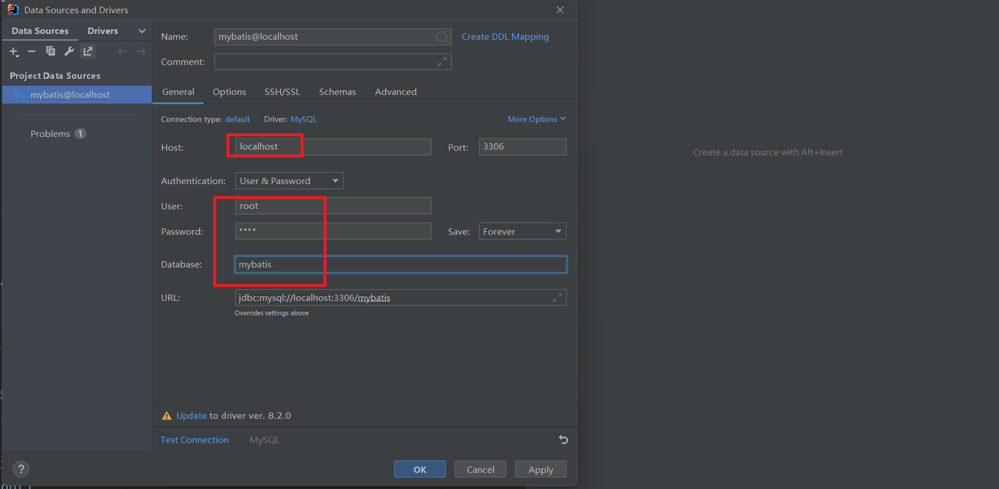

### 1，什么是框架

我的理解：框架就是在合适的位置写合适的代码，你写的代码需要让框架去调用。


框架即一个半成品软件。开发者从头开发一个软件需要花费大量精力，于是有一些项目组开发出半成品软件，开发者在这些软件的基础上进行开发，这样的软件就称之为框架。 


如果将开发完成的软件比作是一套已经装修完毕的新房，框架就好比是一套已经修建好的毛坯房。用户直接购买毛坯房，保证建筑质量和户型合理的同时可以进行风格的自由装修。


使用框架开发的好处：

- 省去大量的代码编写、减少开发时间、降低开发难度
- 限制程序员必须使用框架规范开发，增强代码的规范性，降低程序员之间沟通及日后维护的成本。 
- 将程序员的注意力从技术中抽离出来，更集中在业务层面。


使用框架就好比和世界上最优秀的软件工程师共同完成一个项目， 并且他们完成的还是基础、全局的工作。


ORM（Object Relationl Mapping），对象关系映射，即在数据库和对象之间作映射处理。 之前我们使用JDBC操作数据库，必须手动进行数据库和对象间的数据转换。看一下JDBC中的新增和查询。可以看到，数据库数据与对象数据的转换代码繁琐、无技术含量。而使用ORM框架代替JDBC后，框架可以帮助程序员自动进行转换，只要像平时一样操作对象，ORM框架就会根据映射完成对数据库的操作，极大的增强了开发效率。 


### 2，ORM框架

MyBatis是一个半自动的ORM框架，其本质是对JDBC的封装。使用MyBatis不需要写JDBC代码，但需要程序员编写SQL语句。之前是apache的一个开源项目iBatis，2010年改名为MyBatis。 


### 3，MyBatis介绍

MyBatis 是一款优秀的**持久层**框架，用于简化 JDBC 开发。它本是 Apache 的一个开源项目iBatis, 2010年这个项目由apache software foundation 迁移到了google code，并且改名为MyBatis 。2013年11月迁移到Github。


官网：https://mybatis.org/mybatis-3/zh/index.html 


什么是持久层：

- 所谓持久层就是负责将数据到保存到数据库的那一层代码。JavaEE三层架构：表现层、业务层、**持久层**。


### 4，入门案例


步骤：

1. 将SQL文件导入数据库
2. 创建maven工程，引入依赖
3. 创建mybatis核心配置文件SqlMapConfig.xml
4. 将log4j.properties文件放入resources中，让控制台打印SQL语句。 
5. 创建实体类
6. 在java目录创建持久层接口
7. 在resource目录创建映射文件
8. 将映射文件配置到mybatis核心配置文件中
9. 测试持久层接口方法


创建一个数据库，叫mybatis，将SQL文件导入数据库：


```sql
/*
SQLyog Ultimate v12.09 (64 bit)
MySQL - 5.7.35-log : Database - mybatis
*********************************************************************
*/


/*!40101 SET NAMES utf8 */;

/*!40101 SET SQL_MODE=''*/;

/*!40014 SET @OLD_UNIQUE_CHECKS=@@UNIQUE_CHECKS, UNIQUE_CHECKS=0 */;
/*!40014 SET @OLD_FOREIGN_KEY_CHECKS=@@FOREIGN_KEY_CHECKS, FOREIGN_KEY_CHECKS=0 */;
/*!40101 SET @OLD_SQL_MODE=@@SQL_MODE, SQL_MODE='NO_AUTO_VALUE_ON_ZERO' */;
/*!40111 SET @OLD_SQL_NOTES=@@SQL_NOTES, SQL_NOTES=0 */;
CREATE DATABASE /*!32312 IF NOT EXISTS*/`mybatis` /*!40100 DEFAULT CHARACTER SET utf8 */;

USE `mybatis`;

/*Table structure for table `classes` */

DROP TABLE IF EXISTS `classes`;

CREATE TABLE `classes` (
  `cid` int(11) NOT NULL AUTO_INCREMENT,
  `className` varchar(255) DEFAULT NULL,
  PRIMARY KEY (`cid`) USING BTREE
) ENGINE=InnoDB AUTO_INCREMENT=3 DEFAULT CHARSET=utf8 ROW_FORMAT=DYNAMIC;

/*Data for the table `classes` */

insert  into `classes`(`cid`,`className`) values (1,'三年一班'),(2,'三年二班');

/*Table structure for table `classes_teacher` */

DROP TABLE IF EXISTS `classes_teacher`;

CREATE TABLE `classes_teacher` (
  `cid` int(11) NOT NULL,
  `tid` int(11) NOT NULL,
  PRIMARY KEY (`cid`,`tid`) USING BTREE,
  KEY `tid` (`tid`) USING BTREE,
  CONSTRAINT `classes_teacher_ibfk_1` FOREIGN KEY (`cid`) REFERENCES `classes` (`cid`),
  CONSTRAINT `classes_teacher_ibfk_2` FOREIGN KEY (`tid`) REFERENCES `teacher` (`tid`)
) ENGINE=InnoDB DEFAULT CHARSET=utf8 ROW_FORMAT=DYNAMIC;

/*Data for the table `classes_teacher` */

insert  into `classes_teacher`(`cid`,`tid`) values (1,1),(1,2),(2,2),(2,3);

/*Table structure for table `student` */

DROP TABLE IF EXISTS `student`;

CREATE TABLE `student` (
  `sid` int(11) NOT NULL AUTO_INCREMENT,
  `name` varchar(255) DEFAULT NULL,
  `age` int(11) DEFAULT NULL,
  `sex` varchar(255) DEFAULT NULL,
  `classId` int(11) DEFAULT NULL,
  PRIMARY KEY (`sid`) USING BTREE,
  KEY `classId` (`classId`) USING BTREE,
  CONSTRAINT `student_ibfk_1` FOREIGN KEY (`classId`) REFERENCES `classes` (`cid`)
) ENGINE=InnoDB AUTO_INCREMENT=6 DEFAULT CHARSET=utf8 ROW_FORMAT=DYNAMIC;

/*Data for the table `student` */

insert  into `student`(`sid`,`name`,`age`,`sex`,`classId`) values (1,'张三',10,'男',1),(2,'李四',10,'女',1),(3,'八六三',10,'男',2),(4,'码路',11,'男',2),(5,'王五',10,'男',2);

/*Table structure for table `teacher` */

DROP TABLE IF EXISTS `teacher`;

CREATE TABLE `teacher` (
  `tid` int(11) NOT NULL AUTO_INCREMENT,
  `tname` varchar(255) DEFAULT NULL,
  PRIMARY KEY (`tid`) USING BTREE
) ENGINE=InnoDB AUTO_INCREMENT=4 DEFAULT CHARSET=utf8 ROW_FORMAT=DYNAMIC;

/*Data for the table `teacher` */

insert  into `teacher`(`tid`,`tname`) values (1,'王老师'),(2,'李老师'),(3,'张老师');

/*Table structure for table `user` */

DROP TABLE IF EXISTS `user`;

CREATE TABLE `user` (
  `id` int(11) NOT NULL AUTO_INCREMENT,
  `username` varchar(255) DEFAULT NULL,
  `sex` varchar(255) DEFAULT NULL,
  `address` varchar(255) DEFAULT NULL,
  PRIMARY KEY (`id`) USING BTREE
) ENGINE=InnoDB AUTO_INCREMENT=7 DEFAULT CHARSET=utf8 ROW_FORMAT=DYNAMIC;

/*Data for the table `user` */

insert  into `user`(`id`,`username`,`sex`,`address`) values (1,'北京码路','男','北京'),(2,'上海码路','男','上海'),(3,'广州码路','女','广州'),(4,'北京八六三','男','北京'),(5,'太原八六三','男','太原'),(6,'西安八六三','男','西安');

/*!40101 SET SQL_MODE=@OLD_SQL_MODE */;
/*!40014 SET FOREIGN_KEY_CHECKS=@OLD_FOREIGN_KEY_CHECKS */;
/*!40014 SET UNIQUE_CHECKS=@OLD_UNIQUE_CHECKS */;
/*!40111 SET SQL_NOTES=@OLD_SQL_NOTES */;
```


创建maven工程，引入依赖，如下：


```xml
<?xml version="1.0" encoding="UTF-8"?>
<project xmlns="http://maven.apache.org/POM/4.0.0"
         xmlns:xsi="http://www.w3.org/2001/XMLSchema-instance"
         xsi:schemaLocation="http://maven.apache.org/POM/4.0.0 http://maven.apache.org/xsd/maven-4.0.0.xsd">
    <modelVersion>4.0.0</modelVersion>

    <groupId>com.malu</groupId>
    <artifactId>mybatis-demo01</artifactId>
    <version>1.0-SNAPSHOT</version>

    <properties>
        <maven.compiler.source>8</maven.compiler.source>
        <maven.compiler.target>8</maven.compiler.target>
    </properties>

    <dependencies>
        <!--  mybatis  -->
        <dependency>
            <groupId>org.mybatis</groupId>
            <artifactId>mybatis</artifactId>
            <version>3.5.7</version>
        </dependency>
        <!-- mysql 驱动-->
        <dependency>
            <groupId>mysql</groupId>
            <artifactId>mysql-connector-java</artifactId>
            <version>5.1.46</version>
        </dependency>
        <!--  junit  -->
        <dependency>
            <groupId>junit</groupId>
            <artifactId>junit</artifactId>
            <version>4.10</version>
        </dependency>
        <!--  log4j  -->
        <dependency>
            <groupId>log4j</groupId>
            <artifactId>log4j</artifactId>
            <version>1.2.12</version>
        </dependency>
    </dependencies>

    <build>
        <plugins>
            <plugin>
                <groupId>org.apache.maven.plugins</groupId>
                <artifactId>maven-compiler-plugin</artifactId>
                <configuration>
                    <source>8</source>
                    <target>8</target>
                </configuration>
            </plugin>
        </plugins>
    </build>

</project>
```


创建mybatis核心配置文件SqlMapConfig.xml


```xml
<?xml version="1.0" encoding="UTF-8"?>
<!DOCTYPE configuration
        PUBLIC "-//mybatis.org//DTD Config 3.0//EN"
        "http://mybatis.org/dtd/mybatis-3-config.dtd">
<configuration>

    <!--配置环境-->
    <environments default="development">
        <environment id="development">
            <!-- 事务类型：JDBC中的事务类型 -->
            <transactionManager type="JDBC"/>
            <!-- 数据源 -->
            <dataSource type="POOLED">
                <property name="driver" value="com.mysql.jdbc.Driver"/>
                <property name="url" value="jdbc:mysql:///mybatis"/>
                <property name="username" value="root"/>
                <property name="password" value="root"/>
            </dataSource>
        </environment>
    </environments>

</configuration>
```


将log4j.properties文件放入resources中，让控制台打印SQL语句。 


```properties
# Set root category priority to INFO and its only appender to CONSOLE.
#log4j.rootCategory=INFO, CONSOLE            debug   info   warn error fatal
log4j.rootCategory=debug, CONSOLE

# Set the enterprise logger category to FATAL and its only appender to CONSOLE.
#log4j.logger.org.apache.axis.enterprise=FATAL, CONSOLE

# CONSOLE is set to be a ConsoleAppender using a PatternLayout.
log4j.appender.CONSOLE=org.apache.log4j.ConsoleAppender
log4j.appender.CONSOLE.layout=org.apache.log4j.PatternLayout
log4j.appender.CONSOLE.layout.ConversionPattern=[%d{MM/dd HH:mm:ss}] %-6r [%15.15t] %-5p %30.30c %x - %m\n
```


创建实体类:


```java
public class User {
    private int id;
    private String username;
    private String sex;
    private String address;
    // 省略getter/setter/构造方法/toString方法
}
```


在java目录创建持久层接口:


```java
package com.malu.mapper;

import com.malu.pojo.User;

import java.util.List;

public interface UserMapper {
    List<User> findAll();
}
```


在resource目录创建映射文件


```xml
<?xml version="1.0" encoding="UTF-8"?>
<!DOCTYPE mapper PUBLIC "-//mybatis.org//DTD Mapper 3.0//EN"
        "http://mybatis.org/dtd/mybatis-3-mapper.dtd">
<mapper namespace="com.malu.mapper.UserMapper">

    <select id="findAll" resultType="com.malu.pojo.User">
        select * from user
    </select>

</mapper>
```


将映射文件配置到mybatis核心配置文件中


```xml
<?xml version="1.0" encoding="UTF-8"?>
<!DOCTYPE configuration
        PUBLIC "-//mybatis.org//DTD Config 3.0//EN"
        "http://mybatis.org/dtd/mybatis-3-config.dtd">
<configuration>

    <!--配置环境-->
    <environments default="development">
        <environment id="development">
            <!-- 事务类型：JDBC中的事务类型 -->
            <transactionManager type="JDBC"/>
            <!-- 数据源 -->
            <dataSource type="POOLED">
                <property name="driver" value="com.mysql.jdbc.Driver"/>
                <property name="url" value="jdbc:mysql:///mybatis"/>
                <property name="username" value="root"/>
                <property name="password" value="root"/>
            </dataSource>
        </environment>
    </environments>

    <!--注册映射文件-->
    <mappers>
        <mapper resource="com/malu/mapper/UserMapper.xml"></mapper>
    </mappers>

</configuration>
```


测试持久层接口方法:


```java
public class TestUserMapper {

    @Test
    public void testFindAll() throws Exception{

        // （1）读取核心配置文件
        InputStream is = Resources.getResourceAsStream("SqlMapConfig.xml");

        // （2）创建SqlSessionFactoryBuilder对象
        SqlSessionFactoryBuilder builder = new SqlSessionFactoryBuilder();

        // （3）SqlSessionFactoryBuilder对象获取SqlSessionFactory对象
        SqlSessionFactory factory = builder.build(is);

        // （4）SqlSessionFactory对象获取SqlSession对象
        SqlSession session = factory.openSession();

        // （5）SqlSession对象获取代理对象
        UserMapper userMapper = session.getMapper(UserMapper.class);

        // （6）代理对象执行方法
        List<User> all = userMapper.findAll();
        all.forEach(user-> System.out.println(user));

        // （7）释放资源
        session.close();
        is.close();
    }

}
```


执行结果：


映射文件注意事项：

- 映射文件要和接口名称相同。
- 映射文件要和接口的目录结构相同。
- 映射文件中namespace属性要写接口的全名。
- 映射文件中标签的id属性是接口方法的方法名。
- 映射文件中标签的resultType属性是接口方法的返回值类型。
- 映射文件中标签的parameterType属性是接口方法的参数类型。
- 映射文件中resultType、parameterType属性要写全类名，如果是集合类型，则写其泛型的全类名。


### 5，MyBatis核心对象及工作流程


MyBatis核心对象：

- SqlSessionFactoryBuilder   SqlSession工厂构建者对象，使用构造者模式创建SqlSession工厂对象
- SqlSessionFactory   SqlSession工厂，使用工厂模式创建SqlSession对象。
- SqlSession    该对象可以操作数据库，也可以使用动态代理模式创建持久层接口的代理对象操作数据库。 
- Mapper   持久层接口的代理对象，他具体实现了持久层接口，用来操作数据库。


MyBatis工作流程：

- 创建SqlSessionFactoryBuilder对象
- SqlSessionFactoryBuilder对象构建了SqlSessionFactory对象：构造者模式
- SqlSessionFactory对象生产了SqlSession对象：工厂模式
- SqlSession对象创建了持久层接口的代理对象：动态代理模式
- 代理对象操作数据库


通过idea连接mysql:





### 6，使用SqlSession操作数据库

除了代理对象能够操作数据库，SqlSession也能操作数据库。只是这种方式在开发中使用的较少，接下来我们使用SqlSession操作数据库：


```java
    @Test
    public void testFindAll2() throws Exception{
        // （1）读取核心配置文件
        InputStream is = Resources.getResourceAsStream("SqlMapConfig.xml");

        // （2）创建SqlSessionFactoryBuilder对象
        SqlSessionFactoryBuilder builder = new SqlSessionFactoryBuilder();

        // （3）SqlSessionFactoryBuilder对象获取SqlSessionFactory对象
        SqlSessionFactory factory = builder.build(is);

        // （4）SqlSessionFactory对象获取SqlSession对象
        SqlSession session = factory.openSession();

        // （5）SqlSession直接操作数据库
        List<Object> users = session.selectList("com.malu.mapper.UserMapper.findAll");
        users.forEach(user-> System.out.println(user));

        // （6）关闭资源
        session.close();
        is.close();
    }
```


### 7，MyBatis新增

持久层接口添加方法：


```java
    void add(User user);
```


映射文件添加标签:


```xml
    <insert id="add" parameterType="com.malu.pojo.User">
        insert into user(username,sex,address) value (#{username},#{sex},#{address})
    </insert>
```


编写测试方法:


```java
    @Test
    public void testAdd() throws Exception{
        InputStream is= Resources.getResourceAsStream("SqlMapConfig.xml");
        SqlSessionFactoryBuilder builder = new SqlSessionFactoryBuilder();
        SqlSessionFactory factory = builder.build(is);
        SqlSession session = factory.openSession();
        UserMapper userMapper = session.getMapper(UserMapper.class);

        User user = new User("程序员", "男", "上海");

        userMapper.add(user);

        // 手动提交事务
        session.commit();
        session.close();
        is.close();
    }
```


不要忘记给User添加一个3个参数的构造器：


注意：

- 当接口方法的参数类型为POJO类型时，SQL语句中绑定参数时使用 #{POJO的属性名} 即可。
- MyBatis事务默认手动提交，所以在执行完增删改方法后，需要手动调用SqlSession对象的事务提交方法，否则数据库将不发生改变。 


### 8，MyBatis修改

我们发现MyBatis的测试方法在操作数据库前都需要获取代理对象，操作数据库后都需要释放资源，可以利用Junit的前置后置方法，优化测试类代码。 


```java
    InputStream is = null;
    UserMapper userMapper = null;
    SqlSession session = null;

	@Before
    public void before() throws Exception{
        is= Resources.getResourceAsStream("SqlMapConfig.xml");
        SqlSessionFactoryBuilder builder = new SqlSessionFactoryBuilder();
        SqlSessionFactory factory = builder.build(is);
        session = factory.openSession();
        userMapper = session.getMapper(UserMapper.class);
    }

    @After
    public void after() throws Exception{
        session.close();
        is.close();
    }
```


这样Junit就会自动执行获取代理对象和释放资源的方法。


持久层接口修改方法：


```java
    void update(User user);
```


映射文件添加标签:


```xml
    <update id="update" parameterType="com.malu.pojo.User">
        update user
        set username = #{username},
            sex = #{sex},
            address = #{address}
        where id=#{id}
    </update>
```


编写测试方法:


```java
    @Test
    public void testUpdate() throws Exception{
        User user = new User(7, "程序员666", "女", "深圳");
        userMapper.update(user);
        session.commit();
    }
```


效果如下：


### 9，MyBatis删除和根据ID查询


持久层接口添加方法：


```java
    void delete(int userId);
```


映射文件添加标签:


```xml
    <delete id="delete" parameterType="int">
        delete from user where id = #{id}
    </delete>
```


注意：

- 当方法的参数类型是简单数据类型时，#{}中可以写任意名称
- 简单数据类型：基本数据类型、字符串等


编写测试方法:


```java
    @Test
    public void testDelete() throws Exception{
        userMapper.delete(7);
        session.commit();
    }
```


效果如下：


接下来再根据ID查询用户，操作流程如下，持久层接口添加方法：


```java
    User findById(int userId);
```


映射文件添加标签:


```xml
    <select id="findById" parameterType="int" resultType="com.malu.pojo.User">
        select * from user where id = #{id}
    </select>
```


编写测试方法:


```java
    @Test
    public void testFillById() throws Exception{
        User user = userMapper.findById(1);
        System.out.println(user);
    }
```


### 10，MyBatis模糊查询


持久层接口添加方法：

```java

```


映射文件添加标签:

```xml

```


编写测试方法:

```java

```


我们看到在映射文件中，parameterType的值为 string 而没有写java.lang.String ，这是为什么呢？

- 参数/返回值类型为基本数据类型/包装类/String等类型时，我们可以写全类名，也可以写别名。 


模糊查询如果不想在调用方法时参数加%，可以使用拼接参数的方式设置Sql： 

```xml

```


测试方法写法如下：

```java

```


#和$的区别：

- #表示sql模板的占位符，$表示将字符串拼接到sql模板中
- #可以防止sql注入，一般能用#就不用$。
- ${}内部的参数名必须写value。


如果使用 # 还不想在调用方法的参数中添加 % ，可以使用 bind>， bind 允许我们在 Sql语句以外创建一个变量，并可以将其绑定到当前的Sql语句中。用法如下： 

```xml

```


测试方法写法如下：

```java

```


### 11，MyBatis分页查询


分页查询时，Sql语句使用limit关键字，需要传入开始索引和每页条数两个参数。MyBatis的多参数处理有以下方式：

- 顺序传参
- @Param传参


Sql中的参数使用arg0，arg1...或param1，param2...表示参数的顺序。此方法可读性较低，在开发中不建议使用。

持久层接口方法：

```java

```


映射文件:

```java

```


测试类:

```java

```


在接口方法的参数列表中通过@Param定义参数名称，在Sql语句中通过注解中所定义的参数名称指定参数位置。此方式参数比较直观的，推荐使用。 


持久层接口方法:

```java

```


映射文件:

```xml

```


测试类:

```java

```


自定义POJO类，该类的属性就是要传递的参数，在SQL语句中绑定参数时使用POJO的属性名作为参数名即可。此方式推荐使用。自定义POJO：

```java

```


持久层接口方法:

```java

```


映射文件:

```xml

```


测试类：

```java

```


如果不想自定义POJO，可以使用Map作为传递参数的载体，在SQL语句中绑定参数时使用Map的Key作为参数名即可。此方法推荐使用。持久层接口方法:

```java

```


映射文件:

```xml

```


测试类：

```java

```


### 12，MyBatis聚合查询，主键回填

持久层接口方法:

```java

```


映射文件:

```xml

```


测试类：

```java

```


有时我们需要获取新插入数据的主键值。如果数据库中主键是自增的，这时我们就需要使用MyBatis的主键回填功能。 

持久层接口方法:

```java

```


映射文件:

```xml

```


注意：

- SELECT LAST_INSERT_ID()：查询刚刚插入的记录的主键值，只适用于自增主键，且必须和insert语句一起执行。 


测试类：

```java

```


### 13，MyBatis配置文件

MyBatis配置文件结构：


**properties** 

- 属性值定义。properties标签中可以定义属性值，也可以引入外部配置文件。无论是内部定义还是外部引入，都可以使用${name}获取值。 
- 例如：我们可以将数据源配置写到外部的db.properties中，再使用properties标签引入外部配置文件，这样可以做到动态配置数据 源。 


编写db.properties 

```properties

```


在配置文件中引入db.properties

```xml

```


当然我们也可以将数据源数据通过 properties>配置到MyBatis配置文件内，但这样做没什么意义。 如下：

```xml

```


settings是配置MyBatis运行时的一些行为的，例如缓存、延迟加载、命名规则等一系列控制性参数。后期我们会使用该标签配置缓 存和延迟加载等。 


plugins 是配置MyBatis插件的。插件可以增强MyBatis功能，比如进行sql增强，打印日志，异常处理等。后期我们会使用该标签配置 分页插件。


MyBatis对常用类有默认别名支持，比如java.lang.Stirng的别名为string。除此之外，我们也可以使用 typeAliases设置自定义别名。 为一个类配置别名：

```xml

```


此时我们即可在映射文件中使用自定义别名，如：

配置文件：

```xml

```


映射文件：

```xml

```


为一个所有包下的所有类配置别名:

```xml

```


此时该包下的所有类都有了别名，别名省略包名，和类名相同。 如： 

配置文件：

```xml

```

映射文件：

```xml

```


environments可以为MyBatis配置数据环境。事务管理：

```xml

```


连接池：

```xml

```


dataSource的type属性：

- POOLED：使用连接池管理连接，使用MyBatis自带的连接池。
- UNPOOLED：不使用连接池，直接由JDBC连接。
- JNDI：由JAVAEE服务器管理连接，如果使用Tomcat作为服务器则使用Tomcat自带的连接池管理。


mappers 用于注册映射文件或持久层接口，只有注册的映射文件才能使用，共有四种方式都可以完成注册：

- 使用相对路径注册映射文件
- 使用绝对路径注册映射文件
- 注册持久层接口
- 注册一个包下的所有持久层接口


### 14，MyBatis映射文件

MyBatis映射文件中除了 insert、 delete 、 update 、 select 外，还有一些标签可以使用： 

- resultMap
- sql
- include


**resultMap** 标签的作用的自定义映射关系。 MyBatis可以将数据库结果集封装到对象中，是因为结果集的列名 

和对象属性名相同：


当POJO属性名和数据库列名不一致时，MyBatis无法自动完成映射 关系。如： 


此时有两种解决方案：

- Sql语句的查询字段起与POJO属性相同的别名。
- 自定义映射关系，在映射文件中，使用 resultMap自定义映射关系：


sql用来定义可重用的Sql片段，通过include 引入该片段。如：Sql 语句的查询字段起与POJO属性相同的别名，该Sql片段就可以重 用。 


在Mybatis映射文件中尽量不要使用一些特殊字符，如： < ， > 等。我们可以使用符号的实体来表示：


如：

```xml

```


### 15，MyBatis动态SQL


动态SQL-if


一个查询的方法的Sql语句不一定是固定的。比如电商网站的查询商品，用户使用不同条件查询，Sql语句就会添加不同的查询条件。此时就需要在方法中使用动态Sql语句。 


### 16，缓存


### 17，关联查询


### 18，一对一关联查询


### 19，一对多关联查询


### 20，多对多关联查询


### 21，分解式查询一对多


### 22，分解式查询一对一


### 23，MyBatis延迟加载


### 23，注解开发


### 24，注解开发之增删改查


### 25，注解开发动态SQL


### 26，注解开发自定义映射关系


### 27，注解开发二级缓存


### 28，注解开发一对一


### 29，注解开发一对多


### 30，注解开发成映射文件开发对比


### 31，分页插件


