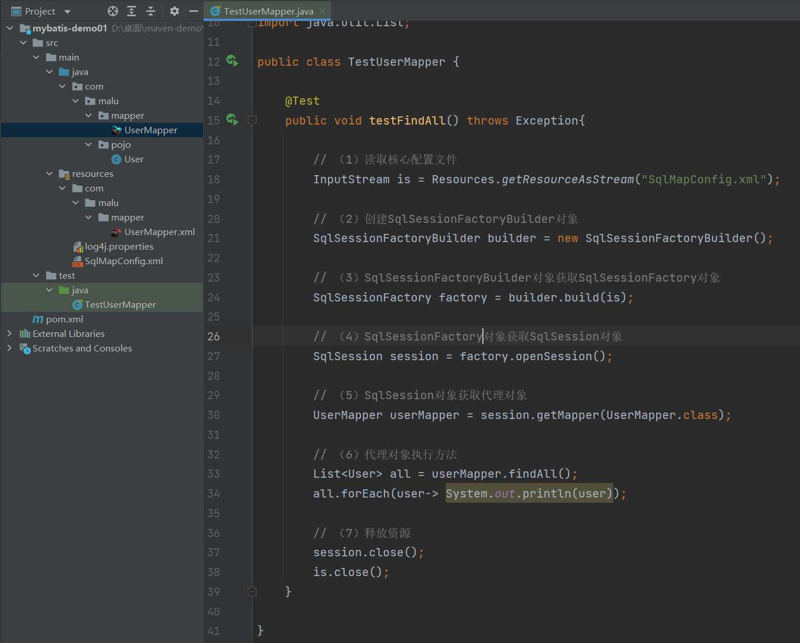
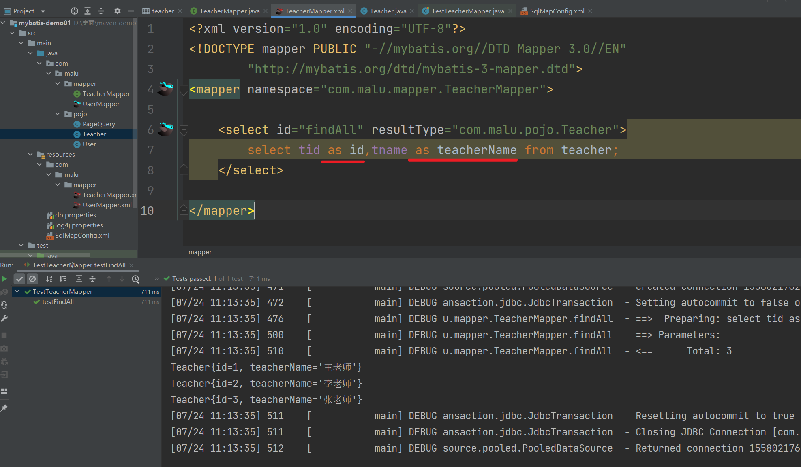
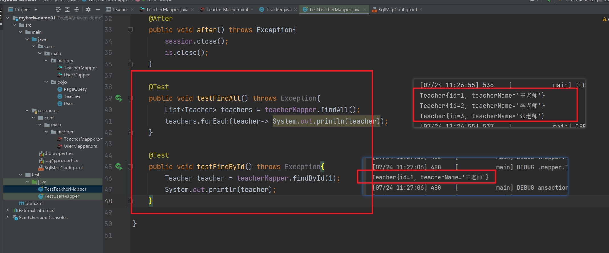
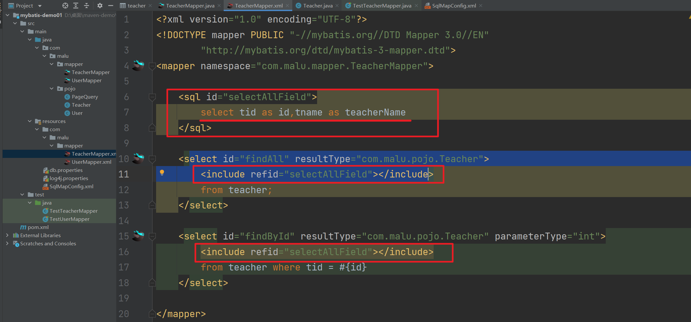
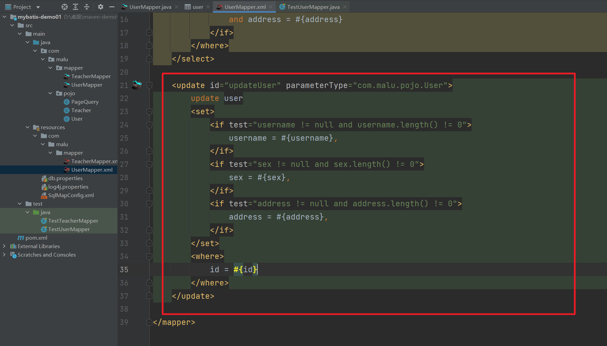

### 1，什么是框架

我的理解：框架就是在合适的位置写合适的代码，你写的代码需要让框架去调用。


框架即一个半成品软件。开发者从头开发一个软件需要花费大量精力，于是有一些项目组开发出半成品软件，开发者在这些软件的基础上进行开发，这样的软件就称之为框架。 


如果将开发完成的软件比作是一套已经装修完毕的新房，框架就好比是一套已经修建好的毛坯房。用户直接购买毛坯房，保证建筑质量和户型合理的同时可以进行风格的自由装修。


使用框架开发的好处：

- 省去大量的代码编写、减少开发时间、降低开发难度
- 限制程序员必须使用框架规范开发，增强代码的规范性，降低程序员之间沟通及日后维护的成本。 
- 将程序员的注意力从技术中抽离出来，更集中在业务层面。


使用框架就好比和世界上最优秀的软件工程师共同完成一个项目， 并且他们完成的还是基础、全局的工作。


ORM（Object Relationl Mapping），对象关系映射，即在数据库和对象之间作映射处理。 之前我们使用JDBC操作数据库，必须手动进行数据库和对象间的数据转换。看一下JDBC中的新增和查询。可以看到，数据库数据与对象数据的转换代码繁琐、无技术含量。而使用ORM框架代替JDBC后，框架可以帮助程序员自动进行转换，只要像平时一样操作对象，ORM框架就会根据映射完成对数据库的操作，极大的增强了开发效率。 


### 2，ORM框架

MyBatis是一个半自动的ORM框架，其本质是对JDBC的封装。使用MyBatis不需要写JDBC代码，但需要程序员编写SQL语句。之前是apache的一个开源项目iBatis，2010年改名为MyBatis。 


### 3，MyBatis介绍

MyBatis 是一款优秀的**持久层**框架，用于简化 JDBC 开发。它本是 Apache 的一个开源项目iBatis, 2010年这个项目由apache software foundation 迁移到了google code，并且改名为MyBatis 。2013年11月迁移到Github。


官网：https://mybatis.org/mybatis-3/zh/index.html 


什么是持久层：

- 所谓持久层就是负责将数据到保存到数据库的那一层代码。JavaEE三层架构：表现层、业务层、**持久层**。


### 4，入门案例


步骤：

1. 将SQL文件导入数据库
2. 创建maven工程，引入依赖
3. 创建mybatis核心配置文件SqlMapConfig.xml
4. 将log4j.properties文件放入resources中，让控制台打印SQL语句。 
5. 创建实体类
6. 在java目录创建持久层接口
7. 在resource目录创建映射文件
8. 将映射文件配置到mybatis核心配置文件中
9. 测试持久层接口方法


创建一个数据库，叫mybatis，将SQL文件导入数据库：


```sql
/*
SQLyog Ultimate v12.09 (64 bit)
MySQL - 5.7.35-log : Database - mybatis
*********************************************************************
*/


/*!40101 SET NAMES utf8 */;

/*!40101 SET SQL_MODE=''*/;

/*!40014 SET @OLD_UNIQUE_CHECKS=@@UNIQUE_CHECKS, UNIQUE_CHECKS=0 */;
/*!40014 SET @OLD_FOREIGN_KEY_CHECKS=@@FOREIGN_KEY_CHECKS, FOREIGN_KEY_CHECKS=0 */;
/*!40101 SET @OLD_SQL_MODE=@@SQL_MODE, SQL_MODE='NO_AUTO_VALUE_ON_ZERO' */;
/*!40111 SET @OLD_SQL_NOTES=@@SQL_NOTES, SQL_NOTES=0 */;
CREATE DATABASE /*!32312 IF NOT EXISTS*/`mybatis` /*!40100 DEFAULT CHARACTER SET utf8 */;

USE `mybatis`;

/*Table structure for table `classes` */

DROP TABLE IF EXISTS `classes`;

CREATE TABLE `classes` (
  `cid` int(11) NOT NULL AUTO_INCREMENT,
  `className` varchar(255) DEFAULT NULL,
  PRIMARY KEY (`cid`) USING BTREE
) ENGINE=InnoDB AUTO_INCREMENT=3 DEFAULT CHARSET=utf8 ROW_FORMAT=DYNAMIC;

/*Data for the table `classes` */

insert  into `classes`(`cid`,`className`) values (1,'三年一班'),(2,'三年二班');

/*Table structure for table `classes_teacher` */

DROP TABLE IF EXISTS `classes_teacher`;

CREATE TABLE `classes_teacher` (
  `cid` int(11) NOT NULL,
  `tid` int(11) NOT NULL,
  PRIMARY KEY (`cid`,`tid`) USING BTREE,
  KEY `tid` (`tid`) USING BTREE,
  CONSTRAINT `classes_teacher_ibfk_1` FOREIGN KEY (`cid`) REFERENCES `classes` (`cid`),
  CONSTRAINT `classes_teacher_ibfk_2` FOREIGN KEY (`tid`) REFERENCES `teacher` (`tid`)
) ENGINE=InnoDB DEFAULT CHARSET=utf8 ROW_FORMAT=DYNAMIC;

/*Data for the table `classes_teacher` */

insert  into `classes_teacher`(`cid`,`tid`) values (1,1),(1,2),(2,2),(2,3);

/*Table structure for table `student` */

DROP TABLE IF EXISTS `student`;

CREATE TABLE `student` (
  `sid` int(11) NOT NULL AUTO_INCREMENT,
  `name` varchar(255) DEFAULT NULL,
  `age` int(11) DEFAULT NULL,
  `sex` varchar(255) DEFAULT NULL,
  `classId` int(11) DEFAULT NULL,
  PRIMARY KEY (`sid`) USING BTREE,
  KEY `classId` (`classId`) USING BTREE,
  CONSTRAINT `student_ibfk_1` FOREIGN KEY (`classId`) REFERENCES `classes` (`cid`)
) ENGINE=InnoDB AUTO_INCREMENT=6 DEFAULT CHARSET=utf8 ROW_FORMAT=DYNAMIC;

/*Data for the table `student` */

insert  into `student`(`sid`,`name`,`age`,`sex`,`classId`) values (1,'张三',10,'男',1),(2,'李四',10,'女',1),(3,'八六三',10,'男',2),(4,'码路',11,'男',2),(5,'王五',10,'男',2);

/*Table structure for table `teacher` */

DROP TABLE IF EXISTS `teacher`;

CREATE TABLE `teacher` (
  `tid` int(11) NOT NULL AUTO_INCREMENT,
  `tname` varchar(255) DEFAULT NULL,
  PRIMARY KEY (`tid`) USING BTREE
) ENGINE=InnoDB AUTO_INCREMENT=4 DEFAULT CHARSET=utf8 ROW_FORMAT=DYNAMIC;

/*Data for the table `teacher` */

insert  into `teacher`(`tid`,`tname`) values (1,'王老师'),(2,'李老师'),(3,'张老师');

/*Table structure for table `user` */

DROP TABLE IF EXISTS `user`;

CREATE TABLE `user` (
  `id` int(11) NOT NULL AUTO_INCREMENT,
  `username` varchar(255) DEFAULT NULL,
  `sex` varchar(255) DEFAULT NULL,
  `address` varchar(255) DEFAULT NULL,
  PRIMARY KEY (`id`) USING BTREE
) ENGINE=InnoDB AUTO_INCREMENT=7 DEFAULT CHARSET=utf8 ROW_FORMAT=DYNAMIC;

/*Data for the table `user` */

insert  into `user`(`id`,`username`,`sex`,`address`) values (1,'北京码路','男','北京'),(2,'上海码路','男','上海'),(3,'广州码路','女','广州'),(4,'北京八六三','男','北京'),(5,'太原八六三','男','太原'),(6,'西安八六三','男','西安');

/*!40101 SET SQL_MODE=@OLD_SQL_MODE */;
/*!40014 SET FOREIGN_KEY_CHECKS=@OLD_FOREIGN_KEY_CHECKS */;
/*!40014 SET UNIQUE_CHECKS=@OLD_UNIQUE_CHECKS */;
/*!40111 SET SQL_NOTES=@OLD_SQL_NOTES */;
```


创建maven工程，引入依赖，如下：


```xml
<?xml version="1.0" encoding="UTF-8"?>
<project xmlns="http://maven.apache.org/POM/4.0.0"
         xmlns:xsi="http://www.w3.org/2001/XMLSchema-instance"
         xsi:schemaLocation="http://maven.apache.org/POM/4.0.0 http://maven.apache.org/xsd/maven-4.0.0.xsd">
    <modelVersion>4.0.0</modelVersion>

    <groupId>com.malu</groupId>
    <artifactId>mybatis-demo01</artifactId>
    <version>1.0-SNAPSHOT</version>

    <properties>
        <maven.compiler.source>8</maven.compiler.source>
        <maven.compiler.target>8</maven.compiler.target>
    </properties>

    <dependencies>
        <!--  mybatis  -->
        <dependency>
            <groupId>org.mybatis</groupId>
            <artifactId>mybatis</artifactId>
            <version>3.5.7</version>
        </dependency>
        <!-- mysql 驱动-->
        <dependency>
            <groupId>mysql</groupId>
            <artifactId>mysql-connector-java</artifactId>
            <version>5.1.46</version>
        </dependency>
        <!--  junit  -->
        <dependency>
            <groupId>junit</groupId>
            <artifactId>junit</artifactId>
            <version>4.10</version>
        </dependency>
        <!--  log4j  -->
        <dependency>
            <groupId>log4j</groupId>
            <artifactId>log4j</artifactId>
            <version>1.2.12</version>
        </dependency>
    </dependencies>

    <build>
        <plugins>
            <plugin>
                <groupId>org.apache.maven.plugins</groupId>
                <artifactId>maven-compiler-plugin</artifactId>
                <configuration>
                    <source>8</source>
                    <target>8</target>
                </configuration>
            </plugin>
        </plugins>
    </build>

</project>
```


创建mybatis核心配置文件SqlMapConfig.xml


```xml
<?xml version="1.0" encoding="UTF-8"?>
<!DOCTYPE configuration
        PUBLIC "-//mybatis.org//DTD Config 3.0//EN"
        "http://mybatis.org/dtd/mybatis-3-config.dtd">
<configuration>

    <!--配置环境-->
    <environments default="development">
        <environment id="development">
            <!-- 事务类型：JDBC中的事务类型 -->
            <transactionManager type="JDBC"/>
            <!-- 数据源 -->
            <dataSource type="POOLED">
                <property name="driver" value="com.mysql.jdbc.Driver"/>
                <property name="url" value="jdbc:mysql:///mybatis"/>
                <property name="username" value="root"/>
                <property name="password" value="root"/>
            </dataSource>
        </environment>
    </environments>

</configuration>
```


将log4j.properties文件放入resources中，让控制台打印SQL语句。 


```properties
# Set root category priority to INFO and its only appender to CONSOLE.
#log4j.rootCategory=INFO, CONSOLE            debug   info   warn error fatal
log4j.rootCategory=debug, CONSOLE

# Set the enterprise logger category to FATAL and its only appender to CONSOLE.
#log4j.logger.org.apache.axis.enterprise=FATAL, CONSOLE

# CONSOLE is set to be a ConsoleAppender using a PatternLayout.
log4j.appender.CONSOLE=org.apache.log4j.ConsoleAppender
log4j.appender.CONSOLE.layout=org.apache.log4j.PatternLayout
log4j.appender.CONSOLE.layout.ConversionPattern=[%d{MM/dd HH:mm:ss}] %-6r [%15.15t] %-5p %30.30c %x - %m\n
```


创建实体类:


```java
public class User {
    private int id;
    private String username;
    private String sex;
    private String address;
    // 省略getter/setter/构造方法/toString方法
}
```


在java目录创建持久层接口:


```java
package com.malu.mapper;

import com.malu.pojo.User;

import java.util.List;

public interface UserMapper {
    List<User> findAll();
}
```


在resource目录创建映射文件


```xml
<?xml version="1.0" encoding="UTF-8"?>
<!DOCTYPE mapper PUBLIC "-//mybatis.org//DTD Mapper 3.0//EN"
        "http://mybatis.org/dtd/mybatis-3-mapper.dtd">
<mapper namespace="com.malu.mapper.UserMapper">

    <select id="findAll" resultType="com.malu.pojo.User">
        select * from user
    </select>

</mapper>
```


将映射文件配置到mybatis核心配置文件中


```xml
<?xml version="1.0" encoding="UTF-8"?>
<!DOCTYPE configuration
        PUBLIC "-//mybatis.org//DTD Config 3.0//EN"
        "http://mybatis.org/dtd/mybatis-3-config.dtd">
<configuration>

    <!--配置环境-->
    <environments default="development">
        <environment id="development">
            <!-- 事务类型：JDBC中的事务类型 -->
            <transactionManager type="JDBC"/>
            <!-- 数据源 -->
            <dataSource type="POOLED">
                <property name="driver" value="com.mysql.jdbc.Driver"/>
                <property name="url" value="jdbc:mysql:///mybatis"/>
                <property name="username" value="root"/>
                <property name="password" value="root"/>
            </dataSource>
        </environment>
    </environments>

    <!--注册映射文件-->
    <mappers>
        <mapper resource="com/malu/mapper/UserMapper.xml"></mapper>
    </mappers>

</configuration>
```


测试持久层接口方法:



```java
public class TestUserMapper {

    @Test
    public void testFindAll() throws Exception{

        // （1）读取核心配置文件
        InputStream is = Resources.getResourceAsStream("SqlMapConfig.xml");

        // （2）创建SqlSessionFactoryBuilder对象
        SqlSessionFactoryBuilder builder = new SqlSessionFactoryBuilder();

        // （3）SqlSessionFactoryBuilder对象获取SqlSessionFactory对象
        SqlSessionFactory factory = builder.build(is);

        // （4）SqlSessionFactory对象获取SqlSession对象
        SqlSession session = factory.openSession();

        // （5）SqlSession对象获取代理对象
        UserMapper userMapper = session.getMapper(UserMapper.class);

        // （6）代理对象执行方法
        List<User> all = userMapper.findAll();
        all.forEach(user-> System.out.println(user));

        // （7）释放资源
        session.close();
        is.close();
    }

}
```


执行结果：


映射文件注意事项：

- 映射文件要和接口名称相同。
- 映射文件要和接口的目录结构相同。
- 映射文件中namespace属性要写接口的全名。
- 映射文件中标签的id属性是接口方法的方法名。
- 映射文件中标签的resultType属性是接口方法的返回值类型。
- 映射文件中标签的parameterType属性是接口方法的参数类型。
- 映射文件中resultType、parameterType属性要写全类名，如果是集合类型，则写其泛型的全类名。


### 5，MyBatis核心对象及工作流程


MyBatis核心对象：

- SqlSessionFactoryBuilder   SqlSession工厂构建者对象，使用构造者模式创建SqlSession工厂对象
- SqlSessionFactory   SqlSession工厂，使用工厂模式创建SqlSession对象。
- SqlSession    该对象可以操作数据库，也可以使用动态代理模式创建持久层接口的代理对象操作数据库。 
- Mapper   持久层接口的代理对象，他具体实现了持久层接口，用来操作数据库。


MyBatis工作流程：

- 创建SqlSessionFactoryBuilder对象
- SqlSessionFactoryBuilder对象构建了SqlSessionFactory对象：构造者模式
- SqlSessionFactory对象生产了SqlSession对象：工厂模式
- SqlSession对象创建了持久层接口的代理对象：动态代理模式
- 代理对象操作数据库


通过idea连接mysql:


### 6，使用SqlSession操作数据库

除了代理对象能够操作数据库，SqlSession也能操作数据库。只是这种方式在开发中使用的较少，接下来我们使用SqlSession操作数据库：


```java
    @Test
    public void testFindAll2() throws Exception{
        // （1）读取核心配置文件
        InputStream is = Resources.getResourceAsStream("SqlMapConfig.xml");

        // （2）创建SqlSessionFactoryBuilder对象
        SqlSessionFactoryBuilder builder = new SqlSessionFactoryBuilder();

        // （3）SqlSessionFactoryBuilder对象获取SqlSessionFactory对象
        SqlSessionFactory factory = builder.build(is);

        // （4）SqlSessionFactory对象获取SqlSession对象
        SqlSession session = factory.openSession();

        // （5）SqlSession直接操作数据库
        List<Object> users = session.selectList("com.malu.mapper.UserMapper.findAll");
        users.forEach(user-> System.out.println(user));

        // （6）关闭资源
        session.close();
        is.close();
    }
```


### 7，MyBatis新增

持久层接口添加方法：


```java
    void add(User user);
```


映射文件添加标签:


```xml
    <insert id="add" parameterType="com.malu.pojo.User">
        insert into user(username,sex,address) value (#{username},#{sex},#{address})
    </insert>
```


编写测试方法:


```java
    @Test
    public void testAdd() throws Exception{
        InputStream is= Resources.getResourceAsStream("SqlMapConfig.xml");
        SqlSessionFactoryBuilder builder = new SqlSessionFactoryBuilder();
        SqlSessionFactory factory = builder.build(is);
        SqlSession session = factory.openSession();
        UserMapper userMapper = session.getMapper(UserMapper.class);

        User user = new User("程序员", "男", "上海");

        userMapper.add(user);

        // 手动提交事务
        session.commit();
        session.close();
        is.close();
    }
```


不要忘记给User添加一个3个参数的构造器：


注意：

- 当接口方法的参数类型为POJO类型时，SQL语句中绑定参数时使用 #{POJO的属性名} 即可。
- MyBatis事务默认手动提交，所以在执行完增删改方法后，需要手动调用SqlSession对象的事务提交方法，否则数据库将不发生改变。 


### 8，MyBatis修改

我们发现MyBatis的测试方法在操作数据库前都需要获取代理对象，操作数据库后都需要释放资源，可以利用Junit的前置后置方法，优化测试类代码。 


```java
    InputStream is = null;
    UserMapper userMapper = null;
    SqlSession session = null;

	@Before
    public void before() throws Exception{
        is= Resources.getResourceAsStream("SqlMapConfig.xml");
        SqlSessionFactoryBuilder builder = new SqlSessionFactoryBuilder();
        SqlSessionFactory factory = builder.build(is);
        session = factory.openSession();
        userMapper = session.getMapper(UserMapper.class);
    }

    @After
    public void after() throws Exception{
        session.close();
        is.close();
    }
```


这样Junit就会自动执行获取代理对象和释放资源的方法。


持久层接口修改方法：


```java
    void update(User user);
```


映射文件添加标签:


```xml
    <update id="update" parameterType="com.malu.pojo.User">
        update user
        set username = #{username},
            sex = #{sex},
            address = #{address}
        where id=#{id}
    </update>
```


编写测试方法:


```java
    @Test
    public void testUpdate() throws Exception{
        User user = new User(7, "程序员666", "女", "深圳");
        userMapper.update(user);
        session.commit();
    }
```


效果如下：


### 9，MyBatis删除和根据ID查询


持久层接口添加方法：


```java
    void delete(int userId);
```


映射文件添加标签:


```xml
    <delete id="delete" parameterType="int">
        delete from user where id = #{id}
    </delete>
```


注意：

- 当方法的参数类型是简单数据类型时，#{}中可以写任意名称
- 简单数据类型：基本数据类型、字符串等


编写测试方法:


```java
    @Test
    public void testDelete() throws Exception{
        userMapper.delete(7);
        session.commit();
    }
```


效果如下：


接下来再根据ID查询用户，操作流程如下，持久层接口添加方法：


```java
    User findById(int userId);
```


映射文件添加标签:


```xml
    <select id="findById" parameterType="int" resultType="com.malu.pojo.User">
        select * from user where id = #{id}
    </select>
```


编写测试方法:


```java
    @Test
    public void testFillById() throws Exception{
        User user = userMapper.findById(1);
        System.out.println(user);
    }
```


### 10，MyBatis模糊查询


持久层接口添加方法：


```java
    List<User> findByNameLike(String username);
```


映射文件添加标签:


```xml
    <select id="findByNameLike" parameterType="string" resultType="com.malu.pojo.User">
        select * from user where username like #{username}
    </select>
```


编写测试方法:


```java
    @Test
    public void testFindByNameLike() throws Exception{
        List<User> users = userMapper.findByNameLike("%码路%");
        users.forEach(user-> System.out.println(user));
    }
```


我们看到在映射文件中，parameterType的值为 string 而没有写java.lang.String ，这是为什么呢？

- 参数/返回值类型为基本数据类型/包装类/String等类型时，我们可以写全类名，也可以写别名。 


模糊查询如果不想在调用方法时参数加%，可以使用拼接参数的方式设置Sql： 


```xml
    <select id="findByNameLike" parameterType="string" resultType="com.malu.pojo.User">
        select * from user where username like '%${username}%'
    </select>
```


测试方法写法如下：


```java
    @Test
    public void testFindByNameLike() throws Exception{
        List<User> users = userMapper.findByNameLike("码路");
        users.forEach(user-> System.out.println(user));
    }
```


#和$的区别：

- #表示sql模板的占位符，$表示将字符串拼接到sql模板中
- #可以防止sql注入，一般能用#就不用$。
- ${}内部的参数名必须写value。(????)


如果使用 # 还不想在调用方法的参数中添加 % ，可以使用 bind， bind 允许我们在 Sql语句以外创建一个变量，并可以将其绑定到当前的Sql语句中。用法如下： 


```xml
    <select id="findByNameLike" parameterType="string" resultType="com.malu.pojo.User">
        <bind name="likeName" value="'%'+username+'%'"/>
        select * from user where username like #{likeName}
    </select>
```


测试方法写法如下：


```java
    @Test
    public void testFindByNameLike() throws Exception{
        List<User> users = userMapper.findByNameLike("码路");
        users.forEach(user-> System.out.println(user));
    }
```


### 11，MyBatis分页查询


分页查询时，Sql语句使用limit关键字，需要传入开始索引和每页条数两个参数。MyBatis的多参数处理有以下方式：

- 顺序传参
- @Param传参


Sql中的参数使用arg0，arg1...或param1，param2...表示参数的顺序。此方法可读性较低，在开发中不建议使用。

持久层接口方法：


```java
    List<User> findPage(int startIndex,int pageSize);
```


映射文件:


```xml
    <!-- parameterType="int" 加它也可以 -->
    <select id="findPage" resultType="com.malu.pojo.User">
        select * from user limit #{arg0},#{arg1}
    </select>
```


测试类:


```java
    @Test
    public void testFindByNameLike() throws Exception{
        List<User> users = userMapper.findPage(0,2);
        users.forEach(user-> System.out.println(user));
    }
```


还有一种写法：


```xml
    <select id="findPage" resultType="com.malu.pojo.User" parameterType="int">
        select * from user limit #{param1},#{param2}
    </select>
```


在接口方法的参数列表中通过@Param定义参数名称，在Sql语句中通过注解中所定义的参数名称指定参数位置。此方式参数比较直观的，推荐使用。 


持久层接口方法:


```java
    List<User> findPage(@Param("startIndex") int startIndex, @Param("pageSize") int pageSize);
```


映射文件:


```xml
    <select id="findPage" resultType="com.malu.pojo.User" parameterType="int">
        select * from user limit #{startIndex},#{pageSize}
    </select>
```


测试类:


```java
    @Test
    public void testFindByNameLike() throws Exception{
        List<User> users = userMapper.findPage(0,2);
        users.forEach(user-> System.out.println(user));
    }
```


自定义POJO类，该类的属性就是要传递的参数，在SQL语句中绑定参数时使用POJO的属性名作为参数名即可。此方式推荐使用。自定义POJO：


```java
package com.malu.pojo;

public class PageQuery {
    private int startIndex;
    private int pageSize;

    public PageQuery() {
    }

    public PageQuery(int startIndex, int pageSize) {
        this.startIndex = startIndex;
        this.pageSize = pageSize;
    }

    public int getStartIndex() {
        return startIndex;
    }

    public void setStartIndex(int startIndex) {
        this.startIndex = startIndex;
    }

    public int getPageSize() {
        return pageSize;
    }

    public void setPageSize(int pageSize) {
        this.pageSize = pageSize;
    }

    @Override
    public String toString() {
        return "PageQuery{" +
                "startIndex=" + startIndex +
                ", pageSize=" + pageSize +
                '}';
    }
}
```


持久层接口方法:


```java
    List<User> findPage(PageQuery pageQuery);
```


映射文件:


```xml
    <select id="findPage" resultType="com.malu.pojo.User" parameterType="com.malu.pojo.PageQuery">
        select * from user limit #{startIndex},#{pageSize}
    </select>
```


测试类：


```java
    @Test
    public void testFindByNameLike() throws Exception{
        PageQuery pageQuery = new PageQuery(0, 2);
        List<User> users = userMapper.findPage(pageQuery);
        users.forEach(user-> System.out.println(user));
    }
```


如果不想自定义POJO，可以使用Map作为传递参数的载体，在SQL语句中绑定参数时使用Map的Key作为参数名即可。此方法推荐使用。持久层接口方法:


```java
    List<User> findPage(Map<String,Object> params);
```


映射文件:


```xml
    <select id="findPage" resultType="com.malu.pojo.User" parameterType="map">
        select * from user limit #{startIndex},#{pageSize}
    </select>
```


测试类：


```java
    @Test
    public void testFindByNameLike() throws Exception{
        HashMap<String, Object> params = new HashMap<>();
        params.put("startIndex",0);
        params.put("pageSize",2);
        List<User> users = userMapper.findPage(params);
        users.forEach(user-> System.out.println(user));
    }
```


### 12，MyBatis聚合查询，主键回填


查询出来，user表中有多少人，持久层接口方法:


```java
    int findCount();
```


映射文件:


```xml
    <select id="findCount" resultType="int">
        select count(id) from user
    </select>
```


测试类：


```java
    @Test
    public void testFindCount() throws Exception{
        int count = userMapper.findCount();
        System.out.println(count);
    }
```


有时我们需要获取新插入数据的主键值。如果数据库中主键是自增的，这时我们就需要使用MyBatis的主键回填功能。 

持久层接口方法:


```java
    void add2(User user);
```


映射文件:


```xml
    <insert id="add2" parameterType="com.malu.pojo.User">
        <!-- keyProperty:主键属性名 keyColumn:主键列名  resultType:主键类型  order:执行时机 -->
        <selectKey keyProperty="id" keyColumn="id" resultType="int" order="AFTER">
            SELECT LAST_INSERT_ID();
        </selectKey>
        insert into user(username, sex, address)
        values (#{username}, #{sex}, #{address})
    </insert>
```


注意：

- SELECT LAST_INSERT_ID()：查询刚刚插入的记录的主键值，只适用于自增主键，且必须和insert语句一起执行。 


测试类：


```java
    @Test
    public void testAdd2(){
        User user = new User("程序员", "男", "上海");
        userMapper.add2(user);
        session.commit();

        System.out.println(user.getId());
    }
```


### 13，MyBatis核心配置文件

MyBatis配置文件结构：


**properties** 

- 属性值定义。properties标签中可以定义属性值，也可以引入外部配置文件。无论是内部定义还是外部引入，都可以使用${name}获取值。 
- 例如：我们可以将数据源配置写到外部的db.properties中，再使用properties标签引入外部配置文件，这样可以做到动态配置数据 源。 


编写db.properties 


```properties
jdbc.driver=com.mysql.jdbc.Driver
jdbc.url=jdbc:mysql:///mybatis
jdbc.username=root
jdbc.password=root
```


在配置文件中引入db.properties


```xml
<?xml version="1.0" encoding="UTF-8"?>
<!DOCTYPE configuration
        PUBLIC "-//mybatis.org//DTD Config 3.0//EN"
        "http://mybatis.org/dtd/mybatis-3-config.dtd">
<configuration>

    <properties resource="db.properties"></properties>

    <!--配置环境-->
    <environments default="development">
        <environment id="development">
            <!-- 事务类型：JDBC中的事务类型 -->
            <transactionManager type="JDBC"/>
            <!-- 数据源 -->
            <dataSource type="POOLED">
                <property name="driver" value="${jdbc.driver}"/>
                <property name="url" value="${jdbc.url}"/>
                <property name="username" value="${jdbc.username}"/>
                <property name="password" value="${jdbc.password}"/>
            </dataSource>
        </environment>
    </environments>

    <!--注册映射文件-->
    <mappers>
        <mapper resource="com/malu/mapper/UserMapper.xml"></mapper>
    </mappers>

</configuration>
```


当然我们也可以将数据源数据通过 properties>配置到MyBatis配置文件内，但这样做没什么意义。 如下：


```xml
<?xml version="1.0" encoding="UTF-8"?>
<!DOCTYPE configuration
        PUBLIC "-//mybatis.org//DTD Config 3.0//EN"
        "http://mybatis.org/dtd/mybatis-3-config.dtd">
<configuration>

    <properties>
        <property name="jdbc.driver" value="com.mysql.jdbc.Driver"/>
        <property name="jdbc.url" value="jdbc:mysql:///mybatis"/>
        <property name="jdbc.username" value="root"/>
        <property name="jdbc.password" value="root"/>
    </properties>

    <!--配置环境-->
    <environments default="development">
        <environment id="development">
            <!-- 事务类型：JDBC中的事务类型 -->
            <transactionManager type="JDBC"/>
            <!-- 数据源 -->
            <dataSource type="POOLED">
                <property name="driver" value="${jdbc.driver}"/>
                <property name="url" value="${jdbc.url}"/>
                <property name="username" value="${jdbc.username}"/>
                <property name="password" value="${jdbc.password}"/>
            </dataSource>
        </environment>
    </environments>

    <!--注册映射文件-->
    <mappers>
        <mapper resource="com/malu/mapper/UserMapper.xml"></mapper>
    </mappers>

</configuration>
```


settings是配置MyBatis运行时的一些行为的，例如缓存、延迟加载、命名规则等一系列控制性参数。后期我们会使用该标签配置缓 存和延迟加载等。 


plugins 是配置MyBatis插件的。插件可以增强MyBatis功能，比如进行sql增强，打印日志，异常处理等。后期我们会使用该标签配置 分页插件。


MyBatis对常用类有默认别名支持，比如java.lang.Stirng的别名为string。除此之外，我们也可以使用 typeAliases设置自定义别名。 为一个类配置别名：


```xml
    <typeAliases>
        <typeAlias type="com.malu.pojo.User" alias="user"></typeAlias>
    </typeAliases>
```


此时我们即可在映射文件中使用自定义别名，如：

配置文件：

```xml
    <typeAliases>
        <typeAlias type="com.malu.pojo.User" alias="user"></typeAlias>
    </typeAliases>
```


映射文件：


```xml
    <select id="findById" parameterType="int" resultType="user">
        select * from user where id = #{id}
    </select>
```


测试之：


为一个所有包下的所有类配置别名:


```xml
    <typeAliases>
        <!-- type:全类名  alias:别名 -->
        <!--<typeAlias type="com.malu.pojo.User" alias="user"></typeAlias>-->
        <!-- 为该包下的所有类配置别名，别名省略包名，和类名相同   -->
        <package name="com.malu.pojo"/>
    </typeAliases>
```


映射文件使用别名：


environments可以为MyBatis配置数据环境。事务管理：


```xml
    <environments default="development">
        <environment id="development">
            <!--事务管理，使用JDBC的事务管理，进行提交和回滚-->
            <!--<transactionManager type="JDBC"/>-->
            <!--MANAGED表示不做事务处理-->
            <transactionManager type="MANAGED"/>
            <dataSource type="POOLED">
                <property name="driver" value="${jdbc.driver}"/>
                <property name="url" value="${jdbc.url}"/>
                <property name="username" value="${jdbc.username}"/>
                <property name="password" value="${jdbc.password}"/>
            </dataSource>
        </environment>
    </environments>
```


连接池：


```xml
    <environments default="development">
        <environment id="development">
            <transactionManager type="JDBC"/>
            <!--POOLED：使用连接池管理连接，使用MyBatis自带的连接池。-->
            <!--UNPOOLED：不使用连接池，直接由JDBC连接。-->
            <!--JNDI：由JAVAEE服务器管理连接，如果使用Tomcat作为服务器则使用Tomcat自带的连接池管理。-->
            <dataSource type="POOLED">
                <property name="driver" value="${jdbc.driver}"/>
                <property name="url" value="${jdbc.url}"/>
                <property name="username" value="${jdbc.username}"/>
                <property name="password" value="${jdbc.password}"/>
            </dataSource>
        </environment>
    </environments>
```


dataSource的type属性：

- POOLED：使用连接池管理连接，使用MyBatis自带的连接池。
- UNPOOLED：不使用连接池，直接由JDBC连接。
- JNDI：由JAVAEE服务器管理连接，如果使用Tomcat作为服务器则使用Tomcat自带的连接池管理。


mappers 用于注册映射文件或持久层接口，只有注册的映射文件才能使用，共有四种方式都可以完成注册：

- 使用相对路径注册映射文件

  ```xml
  <mapper resource="com/malu/mapper/UserMapper.xml"></mapper>
  ```

- 使用绝对路径注册映射文件

  ```xml
  <mapper url="file:///D:/桌面/maven-demo/mybatis-demo01/src/main/resources/com/malu/mapper/UserMapper.xml" />
  ```

- 注册持久层接口

  ```xml
   <mapper class="com.malu.mapper.UserMapper" />
  ```

- 注册一个包下的所有持久层接口

  ```xml
   <package name="com.malu.mapper"/>
  ```

  


之前写的：


### 14，MyBatis映射文件

MyBatis映射文件中除了 insert、 delete 、 update 、 select 外，还有一些标签可以使用： 

- resultMap
- sql
- include


**resultMap** 标签的作用的自定义映射关系。 MyBatis可以将数据库结果集封装到对象中，是因为结果集的列名 

和对象属性名相同：


当POJO属性名和数据库列名不一致时，MyBatis无法自动完成映射 关系。如： 


此时有两种解决方案：

- Sql语句的查询字段起与POJO属性相同的别名。
- 自定义映射关系，在映射文件中，使用 resultMap自定义映射关系：


Sql语句的查询字段起与POJO属性相同的别名。接口：


```java
public interface TeacherMapper {
    List<Teacher> findAll();
}
```


映射文件：



```xml
<?xml version="1.0" encoding="UTF-8"?>
<!DOCTYPE mapper PUBLIC "-//mybatis.org//DTD Mapper 3.0//EN"
        "http://mybatis.org/dtd/mybatis-3-mapper.dtd">
<mapper namespace="com.malu.mapper.TeacherMapper">

    <select id="findAll" resultType="com.malu.pojo.Teacher">
        select tid as id,tname as teacherName from teacher;
    </select>

</mapper>
```


测试：


```java
import com.malu.mapper.TeacherMapper;
import com.malu.mapper.UserMapper;
import com.malu.pojo.Teacher;
import com.malu.pojo.User;
import org.apache.ibatis.io.Resources;
import org.apache.ibatis.session.SqlSession;
import org.apache.ibatis.session.SqlSessionFactory;
import org.apache.ibatis.session.SqlSessionFactoryBuilder;
import org.junit.After;
import org.junit.Before;
import org.junit.Test;

import java.io.InputStream;
import java.util.HashMap;
import java.util.List;

public class TestTeacherMapper {

    InputStream is = null;
    TeacherMapper teacherMapper = null;
    SqlSession session = null;

    @Before
    public void before() throws Exception{
        is= Resources.getResourceAsStream("SqlMapConfig.xml");
        SqlSessionFactoryBuilder builder = new SqlSessionFactoryBuilder();
        SqlSessionFactory factory = builder.build(is);
        session = factory.openSession();
        teacherMapper = session.getMapper(TeacherMapper.class);
    }

    @After
    public void after() throws Exception{
        session.close();
        is.close();
    }

    @Test
    public void testFindAll() throws Exception{
        List<Teacher> teachers = teacherMapper.findAll();
        teachers.forEach(teacher-> System.out.println(teacher));
    }

}
```


如果不起别名，可以使用第2种方式，就是使用resultMap，如下：


```xml
<?xml version="1.0" encoding="UTF-8"?>
<!DOCTYPE mapper PUBLIC "-//mybatis.org//DTD Mapper 3.0//EN"
        "http://mybatis.org/dtd/mybatis-3-mapper.dtd">
<mapper namespace="com.malu.mapper.TeacherMapper">

    <!-- id：自定义映射名   type:自定义映射的对象类型-->
    <resultMap id="teacherMapper" type="com.malu.pojo.Teacher">
        <!--id标签：定义主键列   property: POJO中的属性名  column: 数据库列名-->
        <id property="id" column="tid"></id>
        <!-- result标签：定义普通列   property: POJO中的属性名  column: 数据库列名-->
        <result property="teacherName" column="tname"></result>
    </resultMap>

    <select id="findAll" resultMap="teacherMapper">
        select tid,tname from teacher;
    </select>

</mapper>
```


sql用来定义可重用的Sql片段，通过include 引入该片段。如：Sql 语句的查询字段起与POJO属性相同的别名，该Sql片段就可以重用。 再定义一个接口：


```java
    Teacher findById(int id);
```


映射文件：


```xml
<?xml version="1.0" encoding="UTF-8"?>
<!DOCTYPE mapper PUBLIC "-//mybatis.org//DTD Mapper 3.0//EN"
        "http://mybatis.org/dtd/mybatis-3-mapper.dtd">
<mapper namespace="com.malu.mapper.TeacherMapper">

    <select id="findAll" resultType="com.malu.pojo.Teacher">
        select tid as id,tname as teacherName from teacher;
    </select>

    <select id="findById" resultType="com.malu.pojo.Teacher" parameterType="int">
        select tid as id,tname as teacherName from teacher where tid = #{id}
    </select>

</mapper>
```


测试：




此时就可以使用sql和include标签了，如下：



```xml
<?xml version="1.0" encoding="UTF-8"?>
<!DOCTYPE mapper PUBLIC "-//mybatis.org//DTD Mapper 3.0//EN"
        "http://mybatis.org/dtd/mybatis-3-mapper.dtd">
<mapper namespace="com.malu.mapper.TeacherMapper">

    <sql id="selectAllField">
        select tid as id,tname as teacherName
    </sql>

    <select id="findAll" resultType="com.malu.pojo.Teacher">
        <include refid="selectAllField"></include>
        from teacher;
    </select>

    <select id="findById" resultType="com.malu.pojo.Teacher" parameterType="int">
        <include refid="selectAllField"></include>
        from teacher where tid = #{id}
    </select>

</mapper>
```


在Mybatis映射文件中尽量不要使用一些特殊字符，如： < ， > 等。我们可以使用符号的实体来表示：


接口：


```xml
    // 查询id大于某个值的老师
    List<Teacher> findById2(int id);
```


映射文件：


```xml
    <select id="findById2" resultType="com.malu.pojo.Teacher" parameterType="int">
        <include refid="selectAllField"></include>
        from teacher where tid > #{id}
    </select>
```


测试：


对于特殊符号的处理：


### 15，MyBatis动态SQL


动态SQL-if


一个查询的方法的Sql语句不一定是固定的。比如电商网站的查询商品，用户使用不同条件查询，Sql语句就会添加不同的查询条件。此时就需要在方法中使用动态Sql语句。 


标签内的Sql片段在满足条件后才会添加，例如：根据不同条件查询用户，持久层接口添加方法：


```java
    // 条件查询
    List<User> findByCondition(User user);
```


 

映射文件添加标签:


```xml
<?xml version="1.0" encoding="UTF-8"?>
<!DOCTYPE mapper PUBLIC "-//mybatis.org//DTD Mapper 3.0//EN"
        "http://mybatis.org/dtd/mybatis-3-mapper.dtd">
<mapper namespace="com.malu.mapper.UserMapper">

    <select id="findByCondition" resultType="com.malu.pojo.User" parameterType="com.malu.pojo.User">
        select * from user where 1=1
        <if test="username != null and username.length() != 0">
            and username like #{username}
        </if>
        <if test="sex != null and sex.length() != 0">
            and sex = #{sex}
        </if>
        <if test="address != null and address.length() != 0">
            and address = #{address}
        </if>
    </select>

</mapper>
```


编写测试方法:


```java
    @Test
    public void testFindByCondition(){
        User user = new User("%八六三%", "", "北京");
        List<User> users = userMapper.findByCondition(user);
        users.forEach(xx -> System.out.println(xx));
    }
```


注意：

- if中的条件不能使用&&/||，而应该使用and/or
- if中的条件可以直接通过属性名获取参数POJO的属性值，并且该值可以调用方法。 
- where后为什么要加1=1？， 任意条件都可能拼接到Sql中。如果有多个条件，从第二个条件开始前都需要加And关键字。加上1=1这个永久成立的条件，就不需要考虑后面的条件哪个是第一个条件，后面的条件前都加And关键字即可。


where可以代替sql中的where 1=1 和第一个and，更符合程序员的开发习惯，使用 where 后的映射文件如下： 


```xml
    <select id="findByCondition" resultType="com.malu.pojo.User" parameterType="com.malu.pojo.User">
        select * from user
        <where>
            <if test="username != null and username.length() != 0">
                and username like #{username}
            </if>
            <if test="sex != null and sex.length() != 0">
                and sex = #{sex}
            </if>
            <if test="address != null and address.length() != 0">
                and address = #{address}
            </if>
        </where>
    </select>
```


set标签用在update语句中。借助 if ，可以只对有具体值的字段进行更新。 set会自动添加set关键字，并去掉最后一个if语句中多余的逗号。接口如下：


```xml
    // 更新某个用户
    void updateUser(User user);
```


映射文件：



```xml
    <update id="updateUser" parameterType="com.malu.pojo.User">
        update user
        <set>
            <if test="username != null and username.length() != 0">
                username = #{username},
            </if>
            <if test="sex != null and sex.length() != 0">
                sex = #{sex},
            </if>
            <if test="address != null and address.length() != 0">
                address = #{address},
            </if>
        </set>
        <where>
            id = #{id}
        </where>
    </update>
```


测试类：


```java
    @Test
    public void testUpdate(){
        User user = new User(8,"程序员666", "女", "zz");
        userMapper.updateUser(user);
        session.commit();
    }
```


choose、when、otherwise这些标签表示多条件分支，类似JAVA中的 switch...case 。 choose类似switch ， when类似 case ， otherwise 类似 default ，接口如下：


```java
    // 根据用户名查询用户
    // 参数长度小于5：模糊查询
    // 参数长度5~10：精确查询
    // 否则：返回id为1的用户
    List<User> findByUsername(String username);
```


映射文件：


```xml
    <select id="findByUsername" resultType="com.malu.pojo.User"  parameterType="string">
        select * from user
        <where>
            <choose>
                <when test="username.length() &lt; 5">
                    <bind name="likename" value="'%'+username+'%'"/>
                    username like #{likename}
                </when>
                <when test="username.length() &lt; 10">
                    username = #{username}
                </when>
                <otherwise>
                    id = 1
                </otherwise>
            </choose>
        </where>
    </select>
```


测试：


```xml
    @Test
    public void testFindByUserName(){
        List<User> users = userMapper.findByUsername("北京八六三北京八六三北京八六三");
        users.forEach(xxx-> System.out.println(xxx));
    }
```

这段代码的含义为：用户名<5时使用模糊查询，用户名>=5并且 <10时使用精确查询，否则查询id为1的用户


foreach类似JAVA中的for循环，可以遍历集合或数组。 foreach 有如下属性：

- collection：遍历的对象类型
- open：开始的sql语句
- close：结束的sql语句
- separator：遍历每项间的分隔符
- item：表示本次遍历获取的元素，遍历List、Set、数组时表示每项元素，遍历map时表示键值对的值。
- index：遍历List、数组时表示遍历的索引，遍历map时表示键值对的键


使用 foreach遍历数组进行批量删除。持久层接口添加方法:


```java
    // 批量删除
    void deleteBatch(int[] ids);
```


映射文件添加标签:


```xml
    <delete id="deleteBatch" parameterType="int">
        delete from user
        <where>
            <foreach open="id in(" close=")" separator="," collection="array" item="id" >
                #{id}
            </foreach>
        </where>
    </delete>
```


编写测试方法：


```java
    @Test
    public void testDeleteBatch(){
        int[] ids = {10,11,12};
        userMapper.deleteBatch(ids);
        session.commit();
    }
```


foreach遍历List和Set的方法是一样的，我们使用 foreach 遍历List进行批量添加。 持久层接口添加方法:


```java
    // 批量添加
    void insertBatch(List<User> users);
```


映射文件添加标签:


```xml
    <insert id="insertBatch" parameterType="com.malu.pojo.User">
        insert into user values
        <foreach collection="list" item="user" separator=",">
            (null , #{user.username}, #{user.sex}, #{user.address})
        </foreach>
    </insert>
```


编写测试方法 :


```java
    @Test
    public void testInsertBatch(){

        User user1 = new User("程序员1", "男", "北京");
        User user2 = new User("程序员2", "女", "上海");
        List<User> users = new ArrayList();
        users.add(user1);
        users.add(user2);

        userMapper.insertBatch(users);
        session.commit();
    }
```


使用 foreach遍历Map进行多条件查询。持久层接口添加方法


```java
    // 多条件查询
    List<User> findUser(@Param("queryMap") Map<String,Object> map);
```


映射文件添加标签:


```xml
    <select id="findUser" resultType="com.malu.pojo.User" parameterType="map">
        select * from user
        <where>
            <foreach collection="queryMap" separator="and" index="key" item="value">
                ${key} = #{value}
            </foreach>
        </where>
    </select>
```


编写测试方法:


```java
    @Test
    public void testFindUser(){

        HashMap<String, Object> queryMap = new HashMap<>();
        queryMap.put("sex","男");
        queryMap.put("address","北京");

        List<User> users = userMapper.findUser(queryMap);
        users.forEach(xxx-> System.out.println(xxx));
    }
```


### 16，缓存


缓存是内存当中一块存储数据的区域，目的是提高**查询**效率。MyBatis会将查询结果存储在缓存当中，当下次执行**相同**的SQL时不访问数据库，而是直接从缓存中获取结果，从而减少服务器的压力。 


什么是缓存：

- 就是内存中的一块区域（一块数据）


缓存有什么作用？

- 减少程序和数据库的交互，提高查询效率，降低服务器和数据库的压力。 


什么样的数据使用缓存？

- 经常查询但不常改变的，改变后对结果影响不大的数据。


MyBatis缓存分为哪几类？

- 一级缓存和二级缓存


如何判断两次Sql是相同的？

- 查询的Sql语句相同
- 传递的参数值相同
- 对结果集的要求相同
- 预编译的模板Id相同


**一级缓存：**


说明：

- MyBatis一级缓存也叫本地缓存。SqlSession对象中包含一个Executor对象，Executor对象中包含一个PerpetualCache对象，在该对象存放一级缓存数据。
- 由于一级缓存是在SqlSession对象中，所以只有使用同一个SqlSession对象操作数据库时才能共享一级缓存。
- MyBatis的一级缓存是默认开启的，不需要任何的配置。


测试一级缓存，接口如下：


```java
    User findById(int userId);
```


映射文件：


```xml
    <select id="findById" resultType="com.malu.pojo.User" parameterType="int">
        select *
        from user
        where id = #{userId}
    </select>
```


测试：


```java
    @Test
    public void testCache1() throws Exception{
        InputStream is = Resources.getResourceAsStream("SqlMapConfig.xml");
        SqlSessionFactoryBuilder builder = new SqlSessionFactoryBuilder();
        SqlSessionFactory factory = builder.build(is);
        SqlSession session = factory.openSession();

        UserMapper mapper1 = session.getMapper(UserMapper.class);
        UserMapper mapper2 = session.getMapper(UserMapper.class);

        User user1 = mapper1.findById(1);
        System.out.println(user1);
        System.out.println(user1.hashCode());
        System.out.println("-------------------");
        User user2 = mapper2.findById(1);
        System.out.println(user2);
        System.out.println(user2.hashCode());
    }
```


如果不是同一个SqlSeesion，如下：


MyBatis清空一级缓存，进行以下操作可以清空MyBatis一级缓存：

- SqlSession 调用 close() ：操作后SqlSession对象不可用，该对象的缓存数据也不可用。 
- SqlSession 调用 clearCache() / commit() ：操作会清空一级缓存数据。 
- SqlSession 调用增删改方法：操作会清空一级缓存数据，因为增删改后数据库发生改变，缓存数据将不准确。 


测试：


```java
    @Test
    public void testCache1() throws Exception{
        InputStream is = Resources.getResourceAsStream("SqlMapConfig.xml");
        SqlSessionFactoryBuilder builder = new SqlSessionFactoryBuilder();
        SqlSessionFactory factory = builder.build(is);
        SqlSession session = factory.openSession();

        UserMapper mapper1 = session.getMapper(UserMapper.class);
        UserMapper mapper2 = session.getMapper(UserMapper.class);

        User user1 = mapper1.findById(1);
        System.out.println(user1);
        System.out.println(user1.hashCode());
        // session.close();
        session.clearCache();
        // session.commit();
        // 调用了增删改方法，也会清缓存
        System.out.println("-------------------");
        User user2 = mapper2.findById(1);
        System.out.println(user2);
        System.out.println(user2.hashCode());
    }
```


**MyBatis二级缓存**


说明：

- MyBatis二级缓存也叫全局缓存。数据存放在SqlSessionFactory中，只要是同一个工厂对象创建SqlSession，在进行查询时都 能共享数据。一般在项目中只有一个SqlSessionFactory对象， 所以二级缓存的数据是全项目共享的。 
- MyBatis一级缓存存放的是对象，二级缓存存放的是对象的数据。所以要求二级缓存存放的POJO必须是可序列化的，也就是要实现Serializable接口。
- MyBatis二级缓存默认不开启，手动开启后数据先存放在一级缓存中，只有一级缓存数据清空后，数据才会存到二级缓存中。 


POJO类实现Serializable接口：


```java
public class User implements Serializable {
    private int id;
    private String username;
    private String sex;
    private String address;
```


在MyBatis配置文件添加如下设置：由于cacheEnabled默认值是true，所以该设置可以省略。


```xml
    <settings>
        <setting name="cacheEnabled" value="true"/>
    </settings>
```


在映射文件添加 cache 标签，该映射文件下的所有方法都支持二级缓存。如果查询到的集合中对象过多，二级缓存只能缓存1024个对象引用。可以通过 cache标签的size属性修改该数量。 


```xml
    <cache size="2048"/>
```


测试二级缓存:


```java
    @Test
    public void testCache1() throws Exception{
        InputStream is = Resources.getResourceAsStream("SqlMapConfig.xml");
        SqlSessionFactoryBuilder builder = new SqlSessionFactoryBuilder();
        SqlSessionFactory factory = builder.build(is);
        SqlSession session = factory.openSession();

        UserMapper mapper1 = session.getMapper(UserMapper.class);
        UserMapper mapper2 = session.getMapper(UserMapper.class);

        User user1 = mapper1.findById(1);
        System.out.println(user1);
        System.out.println(user1.hashCode());
        // session.close();
        // session.clearCache();
        session.commit();  // 让一级缓存失效
        // 调用了增删改方法，也会清缓存
        System.out.println("-------------------");
        User user2 = mapper2.findById(1);
        System.out.println(user2);
        System.out.println(user2.hashCode());
    }
```


### 17，关联查询

MyBatis的关联查询分为一对一关联查询和一对多关联查询。

- 查询对象时，将关联的另一个**对象**查询出来，就是一对一关联查询。
- 查询对象时，将关联的另一个对象的**集合**查询出来，就是一对多关联查询。


例如有学生类和班级类：

- 一个学生对应一个班级，也就是学生类中有一个班级属性，这就是一对一关系。 
- 一个班级对应多个学生，也就是班级类中有一个学生集合属性，这就是一对多关系。 


实体类设计如下：


```java
package com.malu.pojo;

public class Student {
    private int sid;
    private String name;
    private int age;
    private String sex;
    private Classes classes;

    public Student() {
    }

    public Student(int sid, String name, int age, String sex, Classes classes) {
        this.sid = sid;
        this.name = name;
        this.age = age;
        this.sex = sex;
        this.classes = classes;
    }

    public int getSid() {
        return sid;
    }

    public void setSid(int sid) {
        this.sid = sid;
    }

    public String getName() {
        return name;
    }

    public void setName(String name) {
        this.name = name;
    }

    public int getAge() {
        return age;
    }

    public void setAge(int age) {
        this.age = age;
    }

    public String getSex() {
        return sex;
    }

    public void setSex(String sex) {
        this.sex = sex;
    }

    public Classes getClasses() {
        return classes;
    }

    public void setClasses(Classes classes) {
        this.classes = classes;
    }

    @Override
    public String toString() {
        return "Student{" +
                "sid=" + sid +
                ", name='" + name + '\'' +
                ", age=" + age +
                ", sex='" + sex + '\'' +
                ", classes=" + classes +
                '}';
    }
}

```

```java
package com.malu.pojo;

import java.util.List;

public class Classes {
    private int cid;
    private String className;
    private List<Student> studentList;

    public Classes() {
    }

    public Classes(int cid, String className, List<Student> studentList) {
        this.cid = cid;
        this.className = className;
        this.studentList = studentList;
    }

    public int getCid() {
        return cid;
    }

    public void setCid(int cid) {
        this.cid = cid;
    }

    public String getClassName() {
        return className;
    }

    public void setClassName(String className) {
        this.className = className;
    }

    public List<Student> getStudentList() {
        return studentList;
    }

    public void setStudentList(List<Student> studentList) {
        this.studentList = studentList;
    }

    @Override
    public String toString() {
        return "Classes{" +
                "cid=" + cid +
                ", className='" + className + '\'' +
                ", studentList=" + studentList +
                '}';
    }
}

```


数据库设计如下：


### 18，一对一关联查询

查询学生时，将关联的一个班级对象查询出来，就是一对一关联查询。 


创建持久层接口:


```java
    List<Student> findAll();
```


创建映射文件:


```xml
<?xml version="1.0" encoding="UTF-8"?>
<!DOCTYPE mapper PUBLIC "-//mybatis.org//DTD Mapper 3.0//EN"
        "http://mybatis.org/dtd/mybatis-3-mapper.dtd">
<mapper namespace="com.malu.mapper.StudentMapper">

    <resultMap id="studentMapper" type="com.malu.pojo.Student">
        <!-- 主键列 -->
        <id property="sid" column="sid"></id>
        <!-- 普通列 -->
        <result property="name" column="name"></result>
        <result property="age" column="age"></result>
        <result property="sex" column="sex"></result>
        <!-- 一对一对象列  property:属性名  column:关联列名  javaType：对象类型-->
        <association property="classes" column="classId" javaType="com.malu.pojo.Classes">
            <id property="cid" column="cid"></id>
            <result property="className" column="className"></result>
        </association>
    </resultMap>

    <select id="findAll" resultMap="studentMapper">
        select * from student left join classes on student.classId = classes.cid
    </select>

</mapper>
```


测试一对一关联查询:


```java
    @Test
    public void testFindALl() throws Exception{
        List<Student> students = studentMapper.findAll();
        students.forEach(student-> System.out.println(student));
    }
```


### 19，一对多关联查询


查询班级时，将关联的学生集合查询出来，就是一对多关联查询。创建持久层接口：


```java
    List<Classes> findAll();
```


创建映射文件:


```xml
<?xml version="1.0" encoding="UTF-8"?>
<!DOCTYPE mapper PUBLIC "-//mybatis.org//DTD Mapper 3.0//EN"
        "http://mybatis.org/dtd/mybatis-3-mapper.dtd">
<mapper namespace="com.malu.mapper.ClassesMapper">

    <resultMap id="classesMapper" type="com.malu.pojo.Classes">
        <id property="cid" column="cid"></id>
        <result property="className" column="className"></result>
        <collection property="studentList" ofType="com.malu.pojo.Student">
            <id property="sid" column="sid"></id>
            <result property="name" column="name"></result>
            <result property="age" column="age"></result>
            <result property="sex" column="sex"></result>
        </collection>
    </resultMap>

    <select id="findAll" resultMap="classesMapper">
        select * from classes left join student on classes.cid = student.classId
    </select>

</mapper>
```


测试一对多关联查询:


```java
import com.malu.mapper.ClassesMapper;
import com.malu.mapper.StudentMapper;
import com.malu.mapper.UserMapper;
import com.malu.pojo.Classes;
import com.malu.pojo.Student;
import com.malu.pojo.User;
import org.apache.ibatis.io.Resources;
import org.apache.ibatis.session.SqlSession;
import org.apache.ibatis.session.SqlSessionFactory;
import org.apache.ibatis.session.SqlSessionFactoryBuilder;
import org.junit.After;
import org.junit.Before;
import org.junit.Test;

import java.io.InputStream;
import java.util.List;

public class TestClassesMapper {

    InputStream is = null;
    ClassesMapper classesMapper = null;
    SqlSession session = null;

    @Before
    public void before() throws Exception{
        is= Resources.getResourceAsStream("SqlMapConfig.xml");
        SqlSessionFactoryBuilder builder = new SqlSessionFactoryBuilder();
        SqlSessionFactory factory = builder.build(is);
        session = factory.openSession();
        classesMapper = session.getMapper(ClassesMapper.class);
    }

    @After
    public void after() throws Exception{
        session.close();
        is.close();
    }


    @Test
    public void testFindALl() throws Exception{
        List<Classes> classes = classesMapper.findAll();
        classes.forEach(xxx-> System.out.println(xxx));
    }


}

```


### 20，多对多关联查询


MyBatis多对多关联查询本质就是两个一对多关联查询。例如有老师类和班级类：

- 一个老师对应多个班级，也就是老师类中有一个班级集合属性。
- 一个班级对应多个老师，也就是班级类中有一个老师集合属性。


实体类设计如下：


```java
package com.malu.pojo;

import java.util.List;

public class Teacher {
    private int tid;
    private String tname;
    private List<Classes> classes;

    public Teacher() {
    }

    public Teacher(int tid, String tname, List<Classes> classes) {
        this.tid = tid;
        this.tname = tname;
        this.classes = classes;
    }

    public int getTid() {
        return tid;
    }

    public void setTid(int tid) {
        this.tid = tid;
    }

    public String getTname() {
        return tname;
    }

    public void setTname(String tname) {
        this.tname = tname;
    }

    public List<Classes> getClasses() {
        return classes;
    }

    public void setClasses(List<Classes> classes) {
        this.classes = classes;
    }

    @Override
    public String toString() {
        return "Teacher{" +
                "tid=" + tid +
                ", tname='" + tname + '\'' +
                ", classes=" + classes +
                '}';
    }
}
```

```java
package com.malu.pojo;

import java.util.List;

public class Classes {
    private int cid;
    private String className;
    private List<Student> studentList;
    private List<Teacher> teacherList;


    public Classes() {
    }

    public Classes(int cid, String className, List<Student> studentList, List<Teacher> teacherList) {
        this.cid = cid;
        this.className = className;
        this.studentList = studentList;
        this.teacherList = teacherList;
    }

    public int getCid() {
        return cid;
    }

    public void setCid(int cid) {
        this.cid = cid;
    }

    public String getClassName() {
        return className;
    }

    public void setClassName(String className) {
        this.className = className;
    }

    public List<Student> getStudentList() {
        return studentList;
    }

    public void setStudentList(List<Student> studentList) {
        this.studentList = studentList;
    }

    public List<Teacher> getTeacherList() {
        return teacherList;
    }

    public void setTeacherList(List<Teacher> teacherList) {
        this.teacherList = teacherList;
    }

    @Override
    public String toString() {
        return "Classes{" +
                "cid=" + cid +
                ", className='" + className + '\'' +
                ", studentList=" + studentList +
                ", teacherList=" + teacherList +
                '}';
    }
}
```


在数据库设计中，需要建立中间表，双方与中间表均为一对多关系。 


接下来测试查询老师时，将关联的班级集合查询出来。创建持久层接口


```java
    List<Teacher> findAll();
```


创建映射文件:


```xml
<?xml version="1.0" encoding="UTF-8"?>
<!DOCTYPE mapper PUBLIC "-//mybatis.org//DTD Mapper 3.0//EN"
        "http://mybatis.org/dtd/mybatis-3-mapper.dtd">
<mapper namespace="com.malu.mapper.TeacherMapper">

    <resultMap id="teacherMapper" type="com.malu.pojo.Teacher">
        <id column="tid" property="tid"></id>
        <result column="tname" property="tname"></result>
        <collection property="classes" ofType="com.malu.pojo.Classes">
            <id column="cid" property="cid"></id>
            <result column="className" property="className"></result>
        </collection>
    </resultMap>

    <select id="findAll" resultMap="teacherMapper">
        select * from teacher
            left join classes_teacher on teacher.tid = classes_teacher.tid
            left join classes on classes_teacher.cid = classes.cid
    </select>


</mapper>
```


测试多对多关联查询:


```java
import com.malu.mapper.TeacherMapper;
import com.malu.mapper.UserMapper;
import com.malu.pojo.Teacher;
import com.malu.pojo.User;
import org.apache.ibatis.io.Resources;
import org.apache.ibatis.session.SqlSession;
import org.apache.ibatis.session.SqlSessionFactory;
import org.apache.ibatis.session.SqlSessionFactoryBuilder;
import org.junit.After;
import org.junit.Before;
import org.junit.Test;

import java.io.InputStream;
import java.util.HashMap;
import java.util.List;

public class TestTeacherMapper {

    InputStream is = null;
    TeacherMapper teacherMapper = null;
    SqlSession session = null;

    @Before
    public void before() throws Exception{
        is= Resources.getResourceAsStream("SqlMapConfig.xml");
        SqlSessionFactoryBuilder builder = new SqlSessionFactoryBuilder();
        SqlSessionFactory factory = builder.build(is);
        session = factory.openSession();
        teacherMapper = session.getMapper(TeacherMapper.class);
    }

    @After
    public void after() throws Exception{
        session.close();
        is.close();
    }

    @Test
    public void testFindAll() throws Exception{
        List<Teacher> teachers = teacherMapper.findAll();
        teachers.forEach(teacher-> System.out.println(teacher));
    }

}

```


如果想查询班级时，将关联的老师集合查询出来，只需要修改班级映射文件的Sql语句和 resultMap即可：

```xml
<?xml version="1.0" encoding="UTF-8"?>
<!DOCTYPE mapper PUBLIC "-//mybatis.org//DTD Mapper 3.0//EN"
        "http://mybatis.org/dtd/mybatis-3-mapper.dtd">
<mapper namespace="com.malu.mapper.ClassesMapper">

    <resultMap id="classesMapper" type="com.malu.pojo.Classes">
        <id property="cid" column="cid"></id>
        <result property="className" column="className"></result>
        <collection property="studentList" ofType="com.malu.pojo.Student">
            <id property="sid" column="sid"></id>
            <result property="name" column="name"></result>
            <result property="age" column="age"></result>
            <result property="sex" column="sex"></result>
        </collection>
        <collection property="teacherList" ofType="com.malu.pojo.Teacher">
            <id property="tid" column="tid"></id>
            <result property="tname" column="tname"></result>
        </collection>
    </resultMap>

    <select id="findAll" resultMap="classesMapper">
        select * from classes
            left join student on classes.cid = student.classId
            left join classes_teacher on classes.cid = classes_teacher.cid
            left join teacher on classes_teacher.tid = teacher.tid
    </select>

</mapper>
```


测试：


```java
import com.malu.mapper.ClassesMapper;
import com.malu.mapper.StudentMapper;
import com.malu.mapper.UserMapper;
import com.malu.pojo.Classes;
import com.malu.pojo.Student;
import com.malu.pojo.User;
import org.apache.ibatis.io.Resources;
import org.apache.ibatis.session.SqlSession;
import org.apache.ibatis.session.SqlSessionFactory;
import org.apache.ibatis.session.SqlSessionFactoryBuilder;
import org.junit.After;
import org.junit.Before;
import org.junit.Test;

import java.io.InputStream;
import java.util.List;

public class TestClassesMapper {

    InputStream is = null;
    ClassesMapper classesMapper = null;
    SqlSession session = null;

    @Before
    public void before() throws Exception{
        is= Resources.getResourceAsStream("SqlMapConfig.xml");
        SqlSessionFactoryBuilder builder = new SqlSessionFactoryBuilder();
        SqlSessionFactory factory = builder.build(is);
        session = factory.openSession();
        classesMapper = session.getMapper(ClassesMapper.class);
    }

    @After
    public void after() throws Exception{
        session.close();
        is.close();
    }

    @Test
    public void testFindALl() throws Exception{
        List<Classes> classes = classesMapper.findAll();
        classes.forEach(xxx-> System.out.println(xxx));
    }
}
```


### 21，分解式查询一对多


### 22，分解式查询一对一


### 23，MyBatis延迟加载


### 23，注解开发


### 24，注解开发之增删改查


### 25，注解开发动态SQL


### 26，注解开发自定义映射关系


### 27，注解开发二级缓存


### 28，注解开发一对一


### 29，注解开发一对多


### 30，注解开发成映射文件开发对比


### 31，分页插件


### 32，MyBatis代码生成器


