## 一，Node介绍与安装


### 1，node.js介绍

官网地址：https://nodejs.org/en


node是什么？

- 是一个开源和跨平台的JavaScript运行时环境。浏览器也是JavaScript运行时环境。
- node是基于v8引擎的，谷歌浏览器也是基于v8引擎的。
- node可以构建web服务器，说白了，就是可以开接口。
- node是单线程的，但是 是 非阻塞的，允许单个服务器可以处理数千个并发请求。
- node可以使用新的ES标准。


### 2，node安装

nodejs的安装，先下载node，默认下载的是最新版本，如下：


有时候，电脑上需要下载不同版本的node，此时可以安装一个工具，如下：


上面的工具也是傻瓜式安装，一路下一步就可以了，验证是否安装成功，如下：


安装其它版本的node，如下：


切换版本，需要使用管理员的身份打开cmd窗口，如下：


安装了node后，会自动的安装npm，测试之：


Node.js 历史版本下载地址：https://nodejs.org/dist


### 3，运行JS脚本


运行js脚本方式一：


运行js脚本方式二：


运行js脚本方式三：


## 二，Node.js事件环


### 1，node.js事件环


当前node版本：


node的事件环（事件循环）阐明了node如何做到异步且有非阻塞IO。目前和浏览器事件环基本上是一样的。回顾一下浏览器事件环：https://yujingbo1023.github.io/javablog/public/blogs/base/07.html


看如下的代码：

```js
// 下面的代码都是同步代码
const bar = () => console.log('bar')
const baz = () => console.log('baz')
const foo = () => {
    console.log('foo')
    bar();
    baz();
}
foo();
```


执行的结果如下：


写一个宏任务：

```js
const bar = () => console.log('bar')
const baz = () => console.log('baz')
const foo = () => {
    console.log('foo')
    // 代码执行时，会把宏任务放到宏任务队列中（消息队列）
    // bar叫回调函数，是把回调函数放到宏任务队列中（消息队列）
    setTimeout(bar,0); // 宏任务
    baz();
}
foo();
```


执行结果：


写一个微任务：

```js
const bar = () => console.log('bar')
const baz = () => console.log('baz')
const foo = () => {
    console.log('foo')
    // then里面的回调函数也是异步任务
    // 这个异步任务是微任务，需要放到微任务队列（作业队列）
    // 微任务队列优先级高于宏任务队列
    new Promise((resolve,reject)=>{
        resolve("包包")
    }).then(data=>console.log(data))
    baz();
}
foo();
```


执行结果：


如果有宏任务，也是微任务，执行流程如下：


### 2，process.nextTick()

同步代码执行完毕后，就开始事件循环，在下一个事件循环开始之前执行process.nextTick中的回调函数。

```js
const bar = () => console.log('bar')
const baz = () => console.log('baz')
const fn = () => console.log('fn')
const foo = () => {
    console.log('foo')  // 同步代码
    new Promise((resolve,reject)=>{
        resolve("包包1")
    }).then(data=>console.log(data))  // then中的回调是微任务
    setTimeout(fn,0);  // 定时器中的回调是宏任务
    // 传递给process.nextTick的函数   process.nextTick中的回调函数是微任务
    // 同步代码执行完毕后，就开始事件循环，在下一个事件循环开始之前执行process.nextTick中的回调函数
    process.nextTick(bar)  // nextTick中的回调是异步代码
    new Promise((resolve,reject)=>{
        resolve("包包2")
    }).then(data=>console.log(data))
    baz();
}
foo();
```


## 三，Node.js全局对象


### 1，nodejs全局对象

在浏览器 JavaScript 中，通常 window 是全局对象， 而 Node.js 中的全局对象是 global ，所有全局变量（除了 global 本身以外）都是global 对象的属性。


全局变量可以直接进行使用，不需要引入。

- _ _filename：表示当前正在执行的脚本的文件名，输出文件所在位置的绝对路径
- _ _dirname：表示当前执行脚本所在的目录
- setTimeout(cb, ms)
- clearTimeout(t)
- setInterval(cb, ms)
- console
- process：用于描述当前Node.js 进程状态的对象，提供了一个与操作系统的简单接口
  - process.exit()—退出当前的node进程
  - process.env—获取所有环境变量
  - process.on('uncaughtException',callFn)—捕获未捕获的异常


代码：

```js
// console.log(window); // node环境中没有window
// console.log(global)
// node环境中的全局变量，不需要定义，直接使用
console.log(__filename)
console.log(__dirname)

setTimeout(()=>{
    console.log("这是定时器的回调~")
},2000)

// process.exit();

let a = 1;
console.log(a)

// console.log(process.env)

process.on('uncaughtException',(err)=>{
    console.log("捕获到异常了~~~")
})

function fn(){
    throw new Error("我报错了~")
}
fn();

```


执行的结果：


## 四，模块规范


### 1，模块化规范

之前讲前端，已经把模块化说的非常细了，地址：https://yujingbo1023.github.io/javablog/public/blogs/base/08.html#%E4%BA%8C-%E6%A8%A1%E5%9D%97%E5%8C%96


## 五，事件（发布订阅）


在node中有一个模块，叫events模块，是node内置的，直接使用，代码如下：

```js
let events = require("events"); // 引入 events 事件模块
let eventEmitter = new events.EventEmitter();  // 创建事件触发器

// on 添加事件监听器(订阅)
eventEmitter.on("eat",function(e){
    console.log("eat事件发生了123~")
    console.log(e)
})
eventEmitter.on("eat",function(e){
    console.log("eat事件发生了456~")
    console.log(e)
})

setTimeout(()=>{
    eventEmitter.removeAllListeners(['eat'])
},1000)

setTimeout(()=>{
    // 触发事件(发布)
    // eventEmitter.emit("eat")
    console.log("--------")
    eventEmitter.emit("eat",'123')
},3000)
```


执行结果如下：


## 六，缓冲区与流


### 1，Buffer

Buffer是内存区域，一个专门存放二进制数据的缓冲区。创建buffer，将数据写入缓冲区，


代码如下：

```js
// 将数据写入缓冲区  存储的是二进制数据
let buf = Buffer.from("malu");
// 打印出来的,是以16进制表示的
console.log(buf)

// 从缓冲区读取数据
console.log(buf.toString())
console.log(buf.toString('utf-8',1,2))

// 合并buffer
const buf1 = Buffer.from("malu")
const buf2 = Buffer.from("LY")
const buf3 = Buffer.concat([buf1,buf2])
console.log(buf3.toString())
console.log(buf1+buf2)
```


执行结果如下：


### 2，可读流

没有流的话：


有流的情况下：


流是一种以高效的方式处理读/写文件，网络通信，或任何类型的端到端的数据交换。优点：

1. 内存效率：无需加载大量的数据到内存中，就可以进行处理。
2. 时间效率：当获取到数据后就可以立即开始处理数据，这样所需的时间更少。


所有的流都是EventEmitter的实例，演示一下不使用流的代码：

```js
// 演示读文件操作
// fs模块是node内置模块
let fs = require("fs"); 
fs.readFile(__dirname+"/1.txt",(err,data)=>{
    // console.log(data); // 直接打印是一个buffer
    console.log(data.toString())
})
```

结果如下：


可读流可以从文件中读取数据，读取的数据可以暂时存放在缓存（Buffer）中，防止程序无法及时处理，演示：

```js
let fs = require("fs"); 

// 创建可读流
let readStream = fs.createReadStream(__dirname+"/1.txt");

let res = "";

// data是一个事件
readStream.on("data",(chunk)=>{
    // console.log(chunk)
    res += chunk;
})

readStream.on("end",()=>{
    console.log("res=>",res)
})
```


结果：


上面的是通过fs.createReadStream创建的可读流，也可以手动创建可读流，如下：

```js
// 手动创建可读流
const Stream = require("stream");
const readStream = new Stream.Readable();
// 实现_read方法
readStream._read =()=>{}

readStream.on("data",(chunk)=>{
    console.log(chunk.toString())
})

// 往流中存储数据
readStream.push("malu")
readStream.push("ly")
```


结果：


小结一下：

- 所有的流都是EventEmitter的实例
- fs.createReadStream 可以创建一个可读流
- new Stream.Readable() 也可以创建一个可读流
- 通过readStream.on("data")可以读取可读流的数据


### 3，流的类型和流常用的事件


Stream有四种类型：

- Readable Stream 可读流
- Writable Stream 可写流
- Duplex Stream 可读可写流
- Transform  转化流


流常用的事件：

- data  当有数据可读时触发
- end  没有数据可读了，就会触发
- error  发生错误时会触发
- finish  所有数据已被写入到底层系统时触发


可写流：


创建可写流：

```js
const Stream = require("stream");
// 创建可写流对象
const writableStream = new Stream.Writable()
// 实现_write方法
writableStream._write = (chunk,encoding,next)=>{
    console.log(chunk.toString())
    next();
}
// 写入数据
writableStream.write("malu");
writableStream.write("ly");
writableStream.write("manman");
```


结果：


写入文件：

```js
const fs = require("fs");
// writableStream 是可写流，可写流可以将数据写入文件中
// 为了防止因为写入数据处理速度太慢导致数据丢失，写入的数据可以暂存在可写流内部的缓存（buffer）中
const writableStream = fs.createWriteStream("2.txt");
writableStream.write("malu","utf-8")
writableStream.write("ly","utf-8")
// 标记文件末尾
writableStream.end()
// 监听写入文件完成
writableStream.on("finish",function(){
    console.log("写入完成~~")
})

```


结果：


小结：

- new Stream.Writable 可以创建可写流
- fs.createWriteStream 也可以创建可写流
- writableStream.on("finish"）监听写入文件是否完成


### 4，管道流

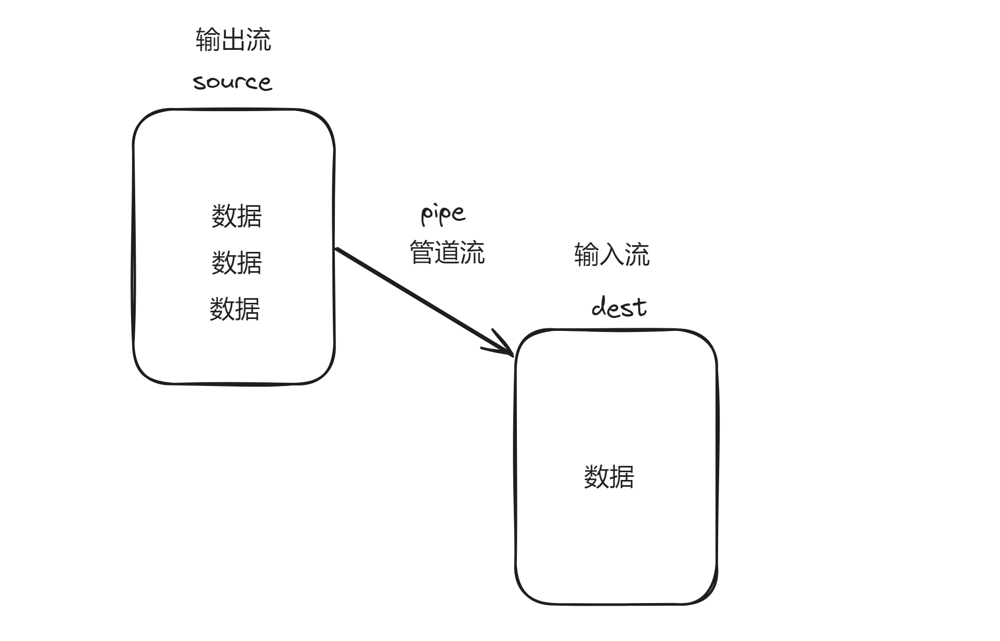


管道提供一个数据从输出流到输入流的机制。使用管道可以从一个流中获取数据并将数据传递到另外一个流中。如复制文件，我们把文件比作装水的桶，而水就是文件里的内容，我们用一根管子 (pipe) 连接两个桶使得水从一个桶流入另一个桶，这样就慢慢的实现了大文件的复制过程。代码演示：

```js
const fs = require("fs");

// 可读流
let readStream = fs.createReadStream("1.txt")
// 可写流
let writeStream = fs.createWriteStream("2.txt")

// 使用管道读写操作
// 读取1.txt文件中的内容,并将内容写入到2.txt中
readStream.pipe(writeStream)
```


效果如下：

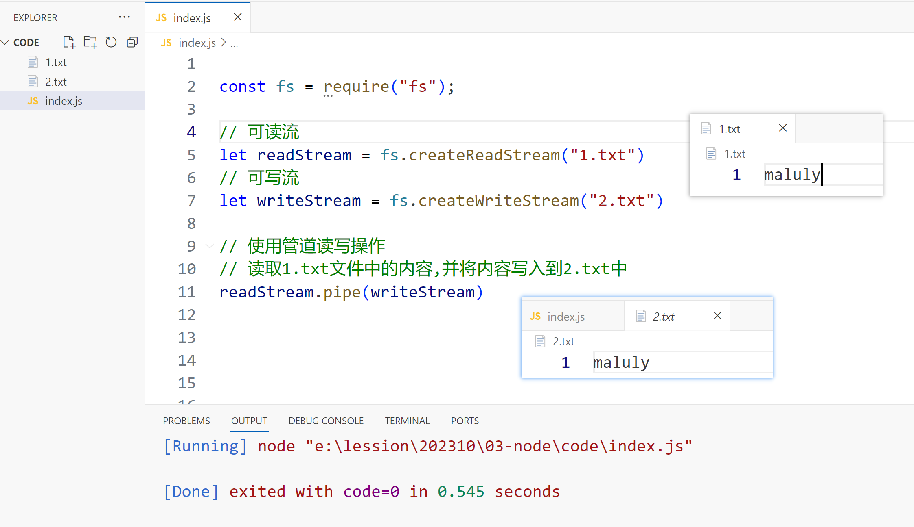


### 5，链式流

流可以进行链式操作，还是pipe方法，pipe方法是输出流和输入流之间的管道，pipe返回的是目标流，可以进行链式操作。实现压缩文件，如下：

```js
const fs = require("fs");
const zlib = require("zlib");

// 可读流
let readStream = fs.createReadStream("1.txt")

// pipe返回的是目标流(zlib.createGzip())
// pipe链式操作
readStream.pipe(zlib.createGzip()).pipe(fs.createWriteStream("1.zip"))
```


效果如下：

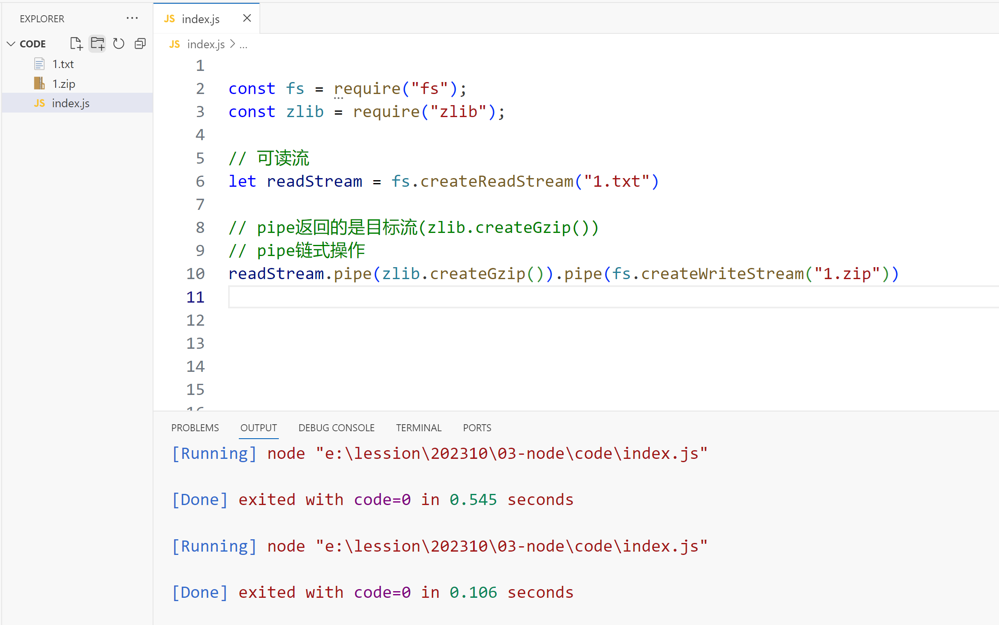


同理，也可以进行解压，如下：

```js
const fs = require("fs");
const zlib = require("zlib");

// 可读流
let readStream = fs.createReadStream("1.zip")

// 解压操作
readStream.pipe(zlib.createGunzip()).pipe(fs.createWriteStream("1.txt"))
```


效果如下：

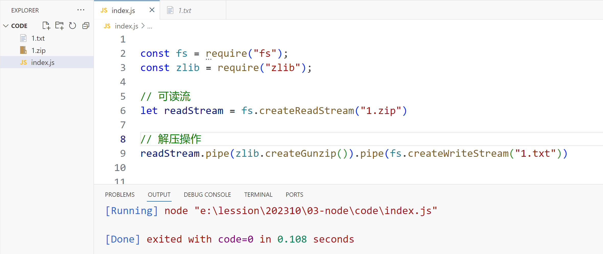


## 七，http模块


### 1，http模块的介绍

http模块就可以创建web服务器，演示之，如下：

```js
// 引入http模块  
const http = require("http");

// 动了服务器的代码,需要重启服务器

// 创建web服务器
// req表示请求  是一个可读流
// res表示响应  是一个可写流
const server = http.createServer(function(req,res){
    res.writeHead(200,{'Content-Type':'text/plain;charset=utf-8'})
    res.write("hello,浏览器~")
    res.end(); // 结束响应
});

server.listen("3000",function(){
    console.log("server is running on 3000~")
})
```


效果如下：

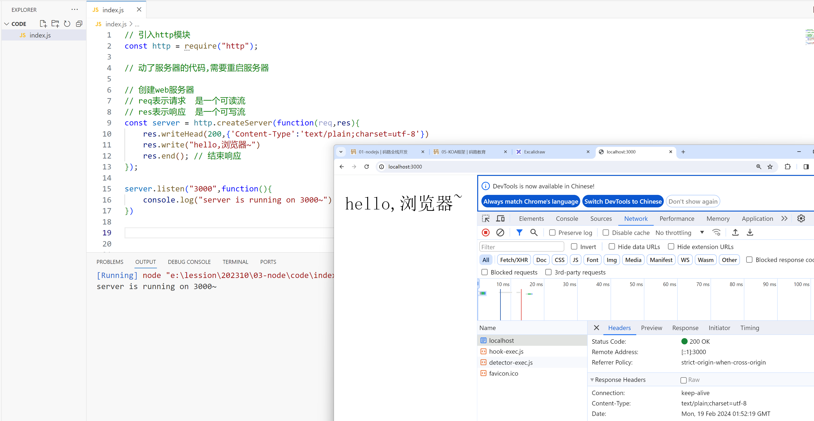


### 2，post请求

使用Postman发送Post请求，如下：

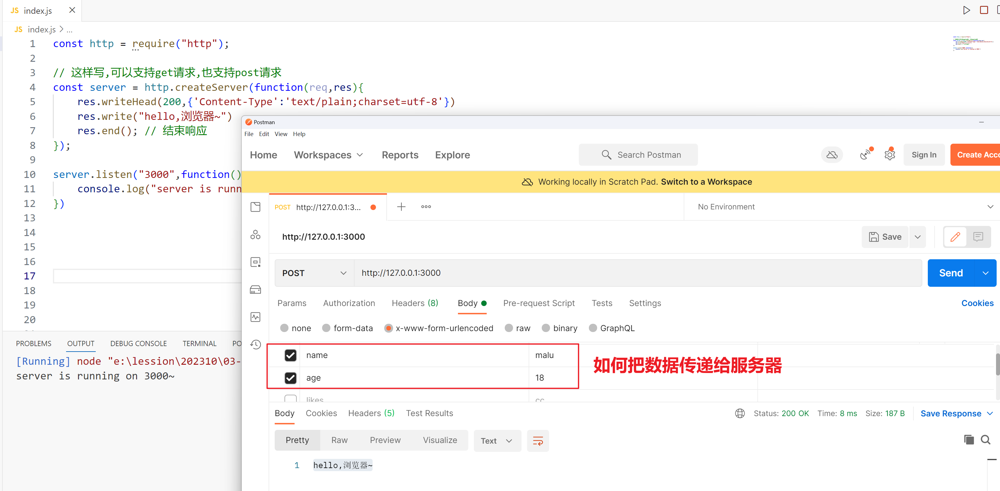


服务器如何接收数据，数据可以从可读流中获取，如下：

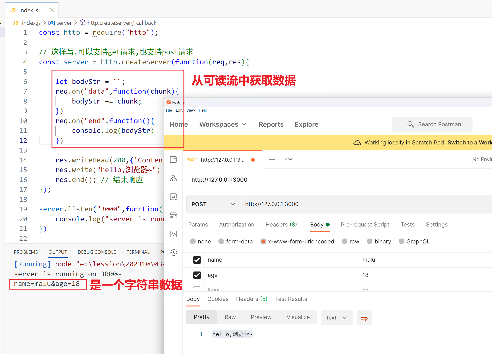


可以使用一个模块，把上面的字符串数据转化成对象，如下：

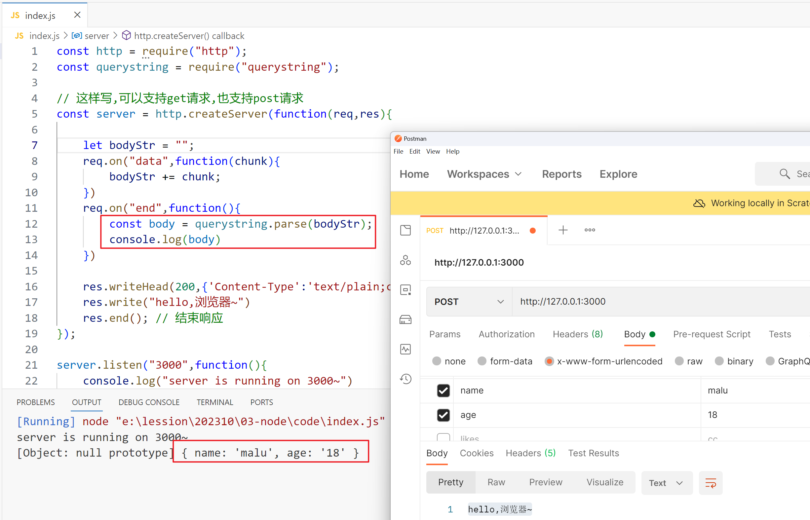


服务器可以把接收到的数据，重新返回给浏览器，如下：

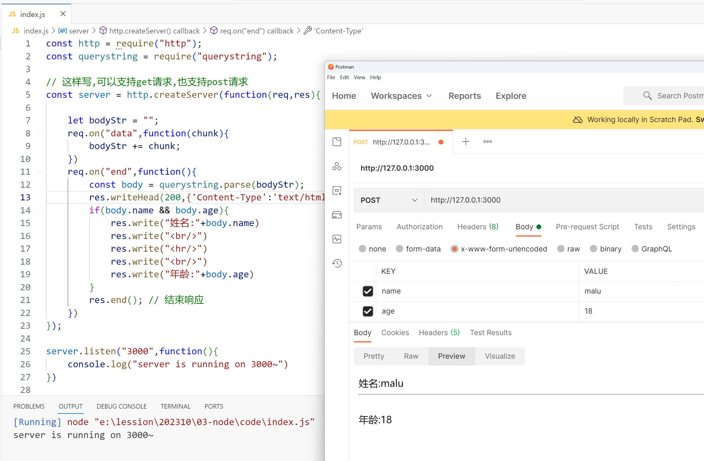

代码如下：

```js
const http = require("http");
const querystring = require("querystring");

// 这样写,可以支持get请求,也支持post请求
const server = http.createServer(function(req,res){

    let bodyStr = "";
    req.on("data",function(chunk){
        bodyStr += chunk;
    })
    req.on("end",function(){
        const body = querystring.parse(bodyStr);
        res.writeHead(200,{'Content-Type':'text/html;charset=utf-8'})
        if(body.name && body.age){
            res.write("姓名:"+body.name)
            res.write("<br/>")
            res.write("<hr/>")
            res.write("<br/>")
            res.write("年龄:"+body.age)
        }
        res.end(); // 结束响应
    })
});

server.listen("3000",function(){
    console.log("server is running on 3000~")
})
```


### 3，get请求

发送get请求，如下：

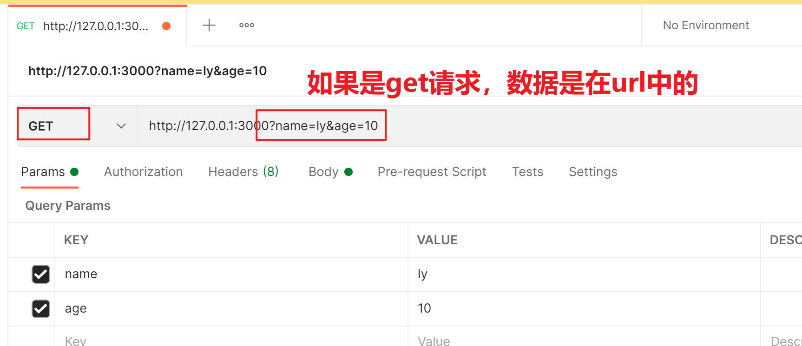


后端如何获取get请求中的数据呢？如下：

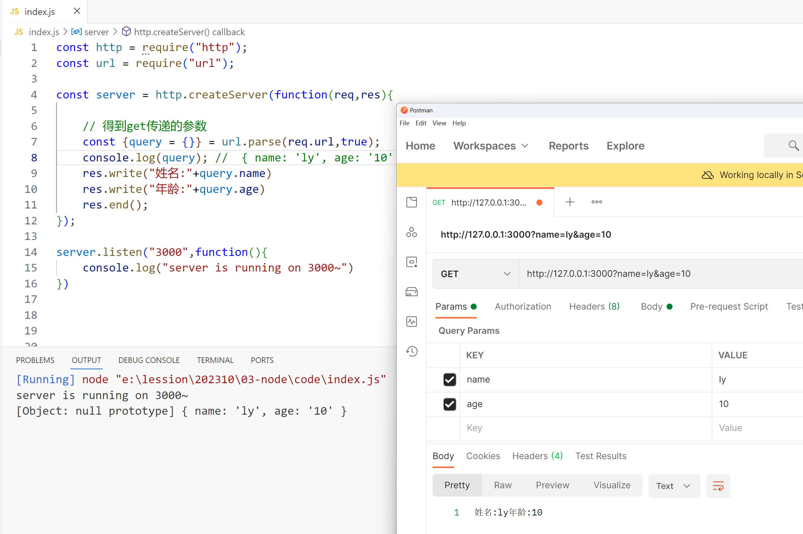


代码如下：

```js
const http = require("http");
const url = require("url");

const server = http.createServer(function(req,res){

    // 得到get传递的参数
    const {query = {}} = url.parse(req.url,true);
    console.log(query); //  { name: 'ly', age: '10' }
    res.write("姓名:"+query.name)
    res.write("年龄:"+query.age)
    res.end();
});

server.listen("3000",function(){
    console.log("server is running on 3000~")
})
```


## 八，路由与创建客户端


### 1，后端路由

所谓的后端路由，就是请求不同的url，后端给你返回不同的数据。直接上代码：

```js
const http = require("http");
const url = require("url");

const server = http.createServer(function(req,res){
   
    // url.parse 用于解析url
    // pathname 表示请求的路径
    // console.log(url.parse(req.url))
    const pathname = url.parse(req.url).pathname;
    if(pathname == "/"){
        res.writeHead(200,{'Content-Type':'text/plain;charset=utf-8'})
        res.end("hello 你好~");
    }else if(pathname == "/cart"){
        res.writeHead(200,{'Content-Type':'application/json;charset=utf-8'})
        res.write(JSON.stringify({code:20001, data:[{id:1,text:"001"},{id:2,text:"002"}]}))
        res.end();
    }else{
        res.writeHead(200,{'Content-Type':'text/plain;charset=utf-8'})
        res.end("你访问的路径不对~");
    }
   
    res.end();
});

server.listen("3000",function(){
    console.log("server is running on 3000~")
})
```


效果如下：

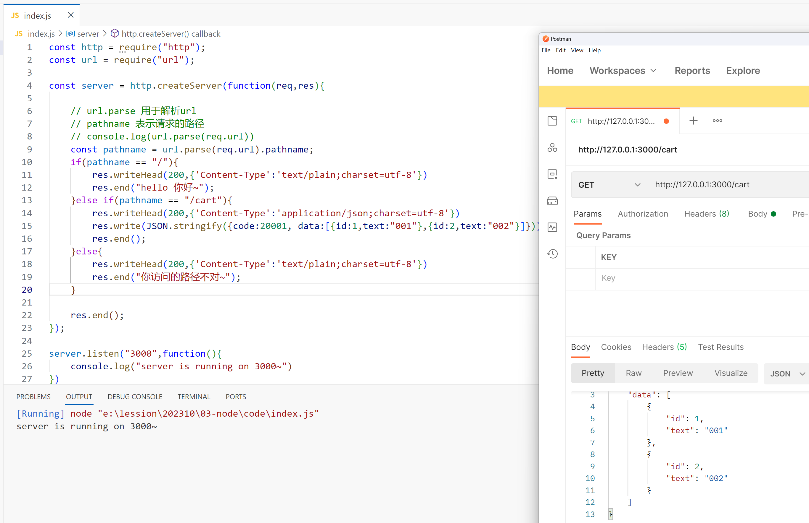


可以把路由代码抽离出去，如下：

```js
module.exports = (pathname,res)=>{
    if(pathname == "/"){
        res.writeHead(200,{'Content-Type':'text/plain;charset=utf-8'})
        res.end("hello 你好~");
    }else if(pathname == "/cart"){
        res.writeHead(200,{'Content-Type':'application/json;charset=utf-8'})
        res.write(JSON.stringify({code:20001, data:[{id:1,text:"001"},{id:2,text:"002"}]}))
        res.end();
    }else{
        res.writeHead(200,{'Content-Type':'text/plain;charset=utf-8'})
        res.end("你访问的路径不对~");
    }
}
```

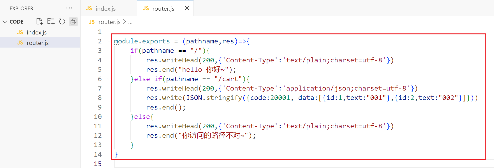


在index.js中，使用之，如下：

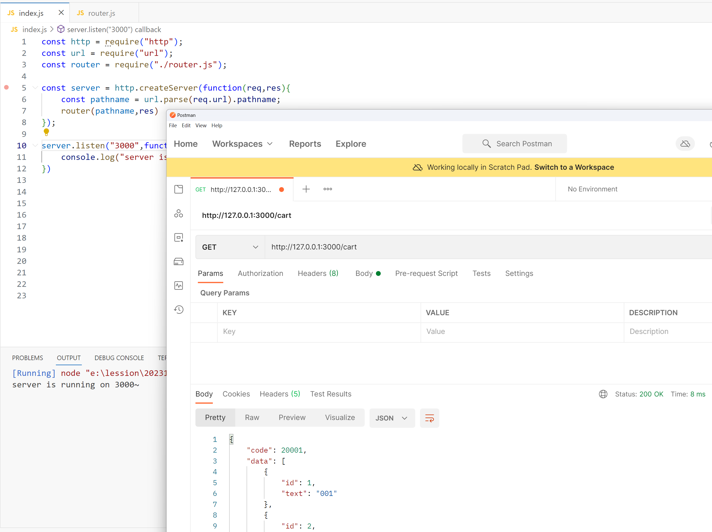


上面的代码还是比较复杂的，后面学完框架，很容易实现路由。


### 3，node创建客户端


之前，我们是使用浏览器或postman，或ajax充当客户端，使用node代码也可以去创建客户端，先创建服务器如下：

```js
const http = require("http");
const url = require("url");

const server = http.createServer(function(req,res){
    const pathname = url.parse(req.url).pathname;
    if(pathname == "/malu"){
        res.end("hello maluly~")
    }
});

server.listen("3000",function(){
    console.log("server is running on 3000~")
})
```


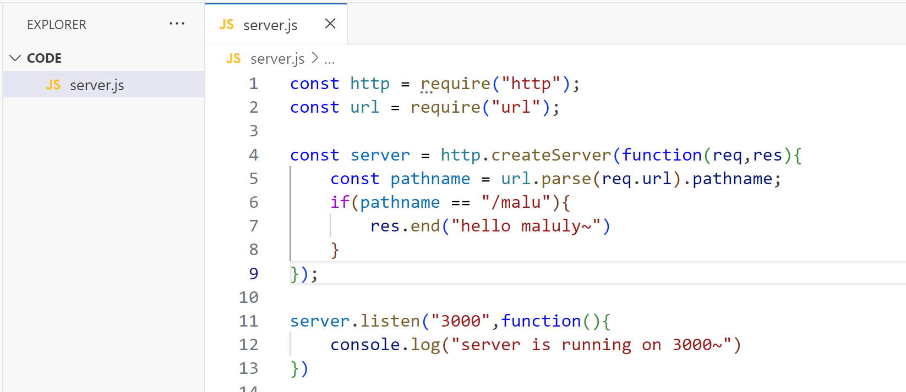


写代码创建客户端，如下：

```js
// http模块不仅可以创建服务器,也可以创建客户端
const http = require("http");

// 请求选项
let options = {
    host:"localhost",
    port:"3000",
    path:"/malu"
}

// 利用http模块,直接可以向服务器发请求
let req = http.request(options,function(res){
    let body = "";
    res.on("data",function(chunk){
        body+=chunk;
    })
    res.on("end",function(){
        // 数据接收完毕
        console.log(body)
    })
});
req.end(); // 结束请求
```


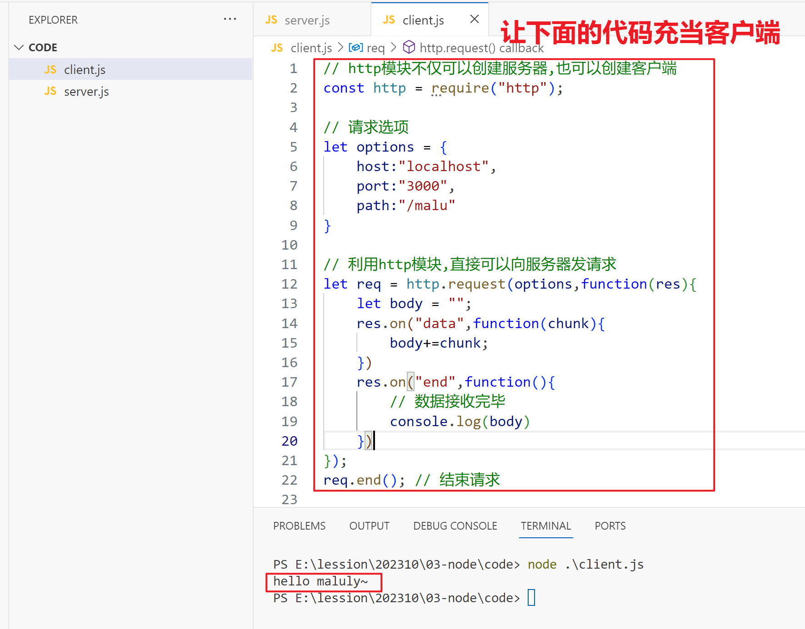


## 九，中间层


### 1，中间层介绍


如果没有中间层，如下：

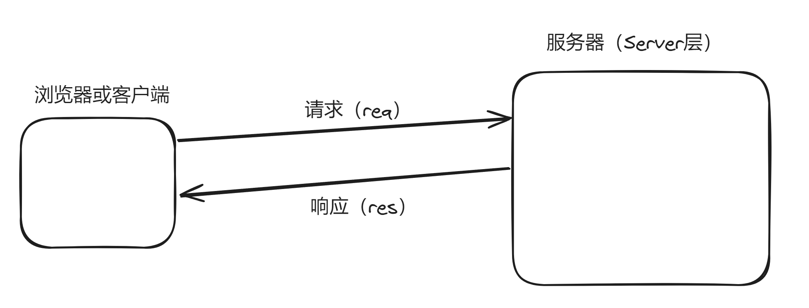


可以让Node充当中间层，如下：

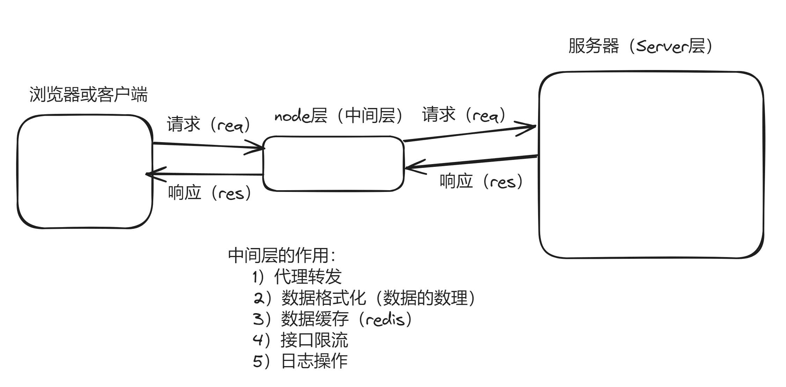


准备服务器如下：

```js
const http = require("http");
const url = require("url");

const server = http.createServer(function(req,res){
   const {headers = {}} = req;
   res.writeHead(200,{'Content-Type': 'application/json; charset=utf-8'})
   if(headers.token){
     res.end(JSON.stringify({code:0,message:'成功',data:[]}))
   }else{
     res.end(JSON.stringify({code:-1,message:'您还没有权限'}))
   }
});

server.listen("3000",function(){
    console.log("server is running on 3000~")
})
```

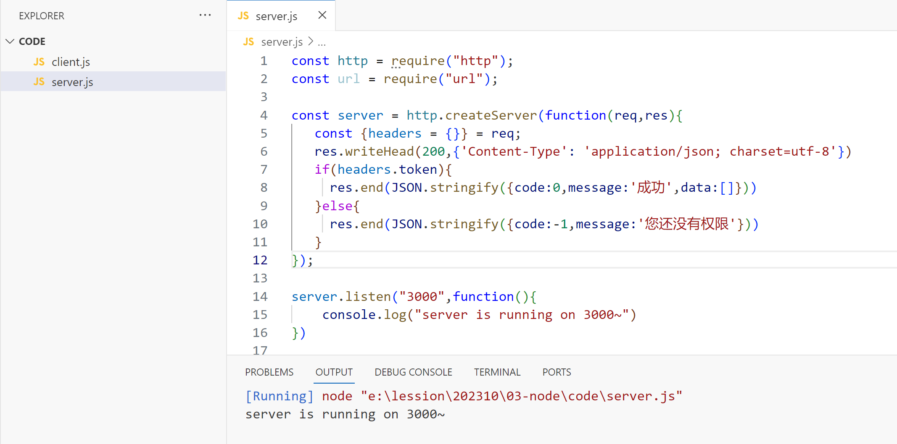


创建中间层，如下：

```js
const http = require('http')
const url = require('url')

http.createServer(function (req, res) {
    const { pathname } = url.parse(req.url)
    const options = {
        host: 'localhost',
        port: '3000',
        path: pathname,
        headers: { token: 'xxxxxxxx' }
    }
    const callback = (response) => {
        const { statusCode, headers } = response
        res.writeHead(statusCode,{...headers})
        response.pipe(res)
    }
    http.request(options, callback).end()
}).listen('8080')
```

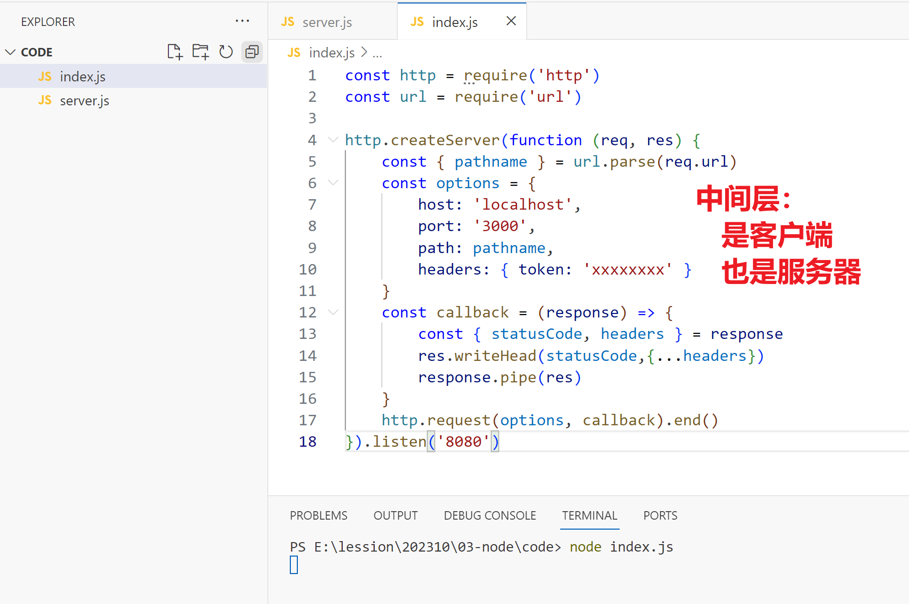


客户端发出请求，如下：

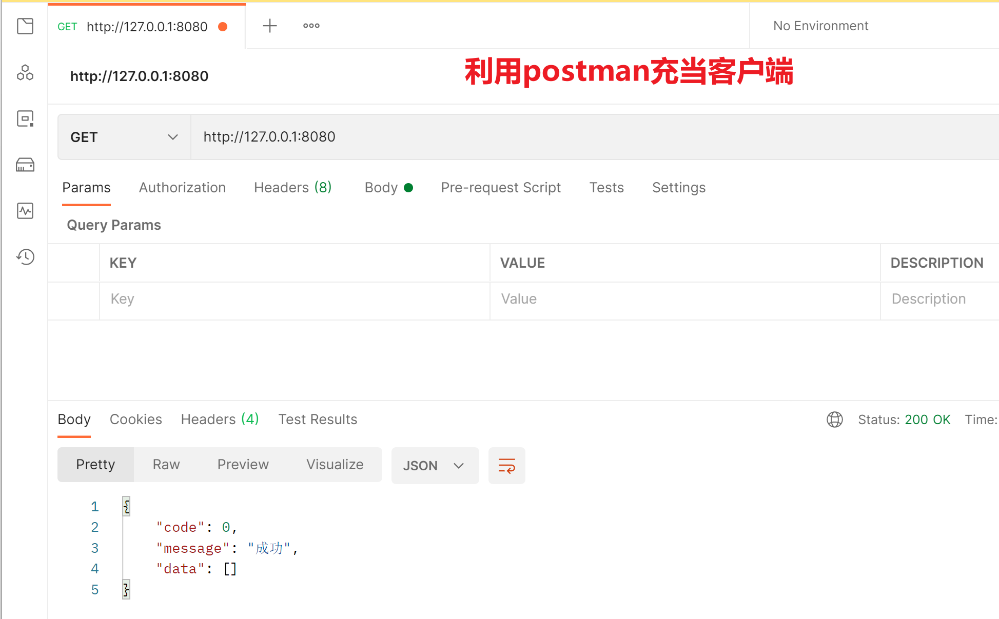


## 十，文件系统

### 1，同步读文件和异步读文件

filesystem是fs的全称，fs模块提供了非常多的api，对文件进行操作，这些api分两套，一套是同步的，一套是异步的。使用代码演示同步读文件和异步读文件，如下：

```js
const fs = require('fs')

console.log("start...")
// 异步读取文件  第一个参数是err 错误优先
fs.readFile("1.txt",function(err,data){
    if(err){
        return console.log("err:",err)
    }
    console.log("异步读取成功:"+data)
    console.log("异步读取成功:"+data.toString())
})

console.log("end...")
```


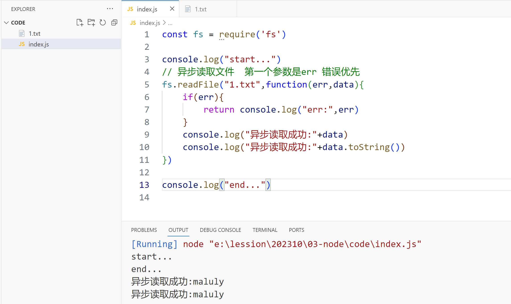


同步读取文件，如下：

```js
const fs = require('fs')

console.log("start...")

// api中带有Sync都是同步读取
let data = fs.readFileSync("1.txt")
console.log("同步读取: " + data.toString());

console.log("end...")
```


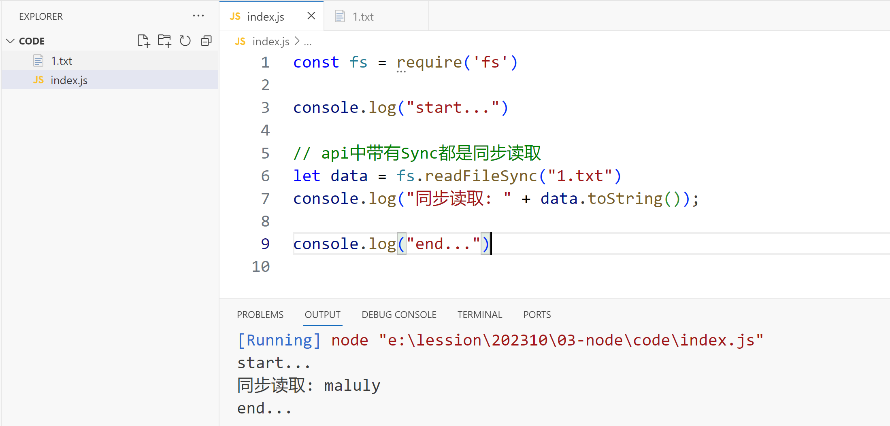


### 2，打开文件


## 十一，路径模块


## 十二，操作数据库


