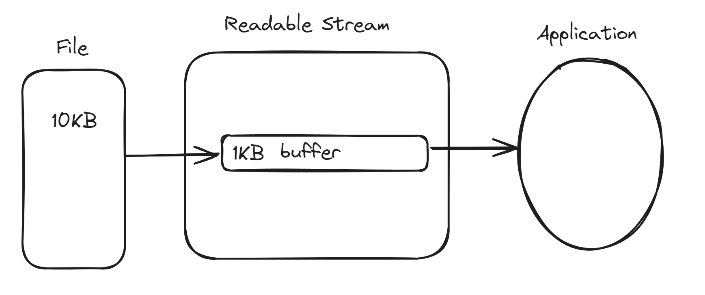

## 一，Node介绍与安装


### 1，node.js介绍

官网地址：https://nodejs.org/en


node是什么？

- 是一个开源和跨平台的JavaScript运行时环境。浏览器也是JavaScript运行时环境。
- node是基于v8引擎的，谷歌浏览器也是基于v8引擎的。
- node可以构建web服务器，说白了，就是可以开接口。
- node是单线程的，但是 是 非阻塞的，允许单个服务器可以处理数千个并发请求。
- node可以使用新的ES标准。


### 2，node安装

nodejs的安装，先下载node，默认下载的是最新版本，如下：


有时候，电脑上需要下载不同版本的node，此时可以安装一个工具，如下：


上面的工具也是傻瓜式安装，一路下一步就可以了，验证是否安装成功，如下：


安装其它版本的node，如下：


切换版本，需要使用管理员的身份打开cmd窗口，如下：


安装了node后，会自动的安装npm，测试之：


Node.js 历史版本下载地址：https://nodejs.org/dist


### 3，运行JS脚本


运行js脚本方式一：


运行js脚本方式二：


运行js脚本方式三：


## 二，Node.js事件环


### 1，node.js事件环


当前node版本：


node的事件环（事件循环）阐明了node如何做到异步且有非阻塞IO。目前和浏览器事件环基本上是一样的。回顾一下浏览器事件环：https://yujingbo1023.github.io/javablog/public/blogs/base/07.html


看如下的代码：

```js
// 下面的代码都是同步代码
const bar = () => console.log('bar')
const baz = () => console.log('baz')
const foo = () => {
    console.log('foo')
    bar();
    baz();
}
foo();
```


执行的结果如下：


写一个宏任务：

```js
const bar = () => console.log('bar')
const baz = () => console.log('baz')
const foo = () => {
    console.log('foo')
    // 代码执行时，会把宏任务放到宏任务队列中（消息队列）
    // bar叫回调函数，是把回调函数放到宏任务队列中（消息队列）
    setTimeout(bar,0); // 宏任务
    baz();
}
foo();
```


执行结果：


写一个微任务：

```js
const bar = () => console.log('bar')
const baz = () => console.log('baz')
const foo = () => {
    console.log('foo')
    // then里面的回调函数也是异步任务
    // 这个异步任务是微任务，需要放到微任务队列（作业队列）
    // 微任务队列优先级高于宏任务队列
    new Promise((resolve,reject)=>{
        resolve("包包")
    }).then(data=>console.log(data))
    baz();
}
foo();
```


执行结果：


如果有宏任务，也是微任务，执行流程如下：


### 2，process.nextTick()

同步代码执行完毕后，就开始事件循环，在下一个事件循环开始之前执行process.nextTick中的回调函数。

```js
const bar = () => console.log('bar')
const baz = () => console.log('baz')
const fn = () => console.log('fn')
const foo = () => {
    console.log('foo')  // 同步代码
    new Promise((resolve,reject)=>{
        resolve("包包1")
    }).then(data=>console.log(data))  // then中的回调是微任务
    setTimeout(fn,0);  // 定时器中的回调是宏任务
    // 传递给process.nextTick的函数   process.nextTick中的回调函数是微任务
    // 同步代码执行完毕后，就开始事件循环，在下一个事件循环开始之前执行process.nextTick中的回调函数
    process.nextTick(bar)  // nextTick中的回调是异步代码
    new Promise((resolve,reject)=>{
        resolve("包包2")
    }).then(data=>console.log(data))
    baz();
}
foo();
```


## 三，Node.js全局对象


### 1，nodejs全局对象

在浏览器 JavaScript 中，通常 window 是全局对象， 而 Node.js 中的全局对象是 global ，所有全局变量（除了 global 本身以外）都是global 对象的属性。


全局变量可以直接进行使用，不需要引入。

- _ _filename：表示当前正在执行的脚本的文件名，输出文件所在位置的绝对路径
- _ _dirname：表示当前执行脚本所在的目录
- setTimeout(cb, ms)
- clearTimeout(t)
- setInterval(cb, ms)
- console
- process：用于描述当前Node.js 进程状态的对象，提供了一个与操作系统的简单接口
  - process.exit()—退出当前的node进程
  - process.env—获取所有环境变量
  - process.on('uncaughtException',callFn)—捕获未捕获的异常


代码：

```js
// console.log(window); // node环境中没有window
// console.log(global)
// node环境中的全局变量，不需要定义，直接使用
console.log(__filename)
console.log(__dirname)

setTimeout(()=>{
    console.log("这是定时器的回调~")
},2000)

// process.exit();

let a = 1;
console.log(a)

// console.log(process.env)

process.on('uncaughtException',(err)=>{
    console.log("捕获到异常了~~~")
})

function fn(){
    throw new Error("我报错了~")
}
fn();

```


执行的结果：


## 四，模块规范


### 1，模块化规范

之前讲前端，已经把模块化说的非常细了，地址：https://yujingbo1023.github.io/javablog/public/blogs/base/08.html#%E4%BA%8C-%E6%A8%A1%E5%9D%97%E5%8C%96


## 五，事件（发布订阅）


在node中有一个模块，叫events模块，是node内置的，直接使用，代码如下：

```js
let events = require("events"); // 引入 events 事件模块
let eventEmitter = new events.EventEmitter();  // 创建事件触发器

// on 添加事件监听器(订阅)
eventEmitter.on("eat",function(e){
    console.log("eat事件发生了123~")
    console.log(e)
})
eventEmitter.on("eat",function(e){
    console.log("eat事件发生了456~")
    console.log(e)
})

setTimeout(()=>{
    eventEmitter.removeAllListeners(['eat'])
},1000)

setTimeout(()=>{
    // 触发事件(发布)
    // eventEmitter.emit("eat")
    console.log("--------")
    eventEmitter.emit("eat",'123')
},3000)
```


执行结果如下：


## 六，缓冲区与流


### 1，Buffer

Buffer是内存区域，一个专门存放二进制数据的缓冲区。创建buffer，将数据写入缓冲区，


代码如下：

```js
// 将数据写入缓冲区  存储的是二进制数据
let buf = Buffer.from("malu");
// 打印出来的,是以16进制表示的
console.log(buf)

// 从缓冲区读取数据
console.log(buf.toString())
console.log(buf.toString('utf-8',1,2))

// 合并buffer
const buf1 = Buffer.from("malu")
const buf2 = Buffer.from("LY")
const buf3 = Buffer.concat([buf1,buf2])
console.log(buf3.toString())
console.log(buf1+buf2)
```


执行结果如下：


### 2，流(Stream)

没有流的话：


有流的情况下：




流是一种以高效的方式处理读/写文件，网络通信，或任何类型的端到端的数据交换。优点：

1. 内存效率：无需加载大量的数据到内存中，就可以进行处理。
2. 时间效率：当获取到数据后就可以立即开始处理数据，这样所需的时间更少。


所有的流都是EventEmitter的实例，演示一下不使用流的代码：

```js
// 演示读文件操作
// fs模块是node内置模块
let fs = require("fs"); 
fs.readFile(__dirname+"/1.txt",(err,data)=>{
    // console.log(data); // 直接打印是一个buffer
    console.log(data.toString())
})
```

结果如下：


可读流可以从文件中读取数据，读取的数据可以暂时存放在缓存（Buffer）中，防止程序无法及时处理，演示：

```js
let fs = require("fs"); 

// 创建可读流
let readStream = fs.createReadStream(__dirname+"/1.txt");

let res = "";

// data是一个事件
readStream.on("data",(chunk)=>{
    // console.log(chunk)
    res += chunk;
})

readStream.on("end",()=>{
    console.log("res=>",res)
})
```


结果：


上面的是通过fs.createReadStream创建的可读流，也可以手动创建可读流，如下：

```js
// 手动创建可读流
const Stream = require("stream");
const readStream = new Stream.Readable();
// 实现_read方法
readStream._read =()=>{}

readStream.on("data",(chunk)=>{
    console.log(chunk.toString())
})

// 往流中存储数据
readStream.push("malu")
readStream.push("ly")
```


结果：


小结一下：

- 所有的流都是EventEmitter的实例
- fs.createReadStream 可以创建一个可读流
- new Stream.Readable() 也可以创建一个可读流
- 通过readStream.on("data")可以读取可读流的数据


### 3，流的类型和流常用的事件


Stream有四种类型：

- Readable Stream 可读流
- Writable Stream 可读流
- Duplex Stream 可读可写流
- Transform  转化流


流常用的事件：

- data  当有数据可读时触发
- end  没有数据可读了，就会触发
- error  发生错误时会触发
- finish  所有数据已被写入到底层系统时触发


可写流：


创建可写流：

```js
const Stream = require("stream");
// 创建可写流对象
const writableStream = new Stream.Writable()
// 实现_write方法
writableStream._write = (chunk,encoding,next)=>{
    console.log(chunk.toString())
    next();
}
// 写入数据
writableStream.write("malu");
writableStream.write("ly");
writableStream.write("manman");
```


结果：


写入文件：

```js
const fs = require("fs");
// writableStream 是可写流，可写流可以将数据写入文件中
// 为了防止因为写入数据处理速度太慢导致数据丢失，写入的数据可以暂存在可写流内部的缓存（buffer）中
const writableStream = fs.createWriteStream("2.txt");
writableStream.write("malu","utf-8")
writableStream.write("ly","utf-8")
// 标记文件末尾
writableStream.end()
// 监听写入文件完成
writableStream.on("finish",function(){
    console.log("写入完成~~")
})

```


结果：


小结：

- new Stream.Writable 可以创建可写流
- fs.createWriteStream 也可以创建可写流
- writableStream.on("finish"）监听写入文件是否完成


### 4，管道流


### 5，链式流


## 七，http模块


## 八，路由与创建客户端


## 九，中间层


## 十，文件系统


## 十一，路径模块


## 十二，操作数据库


