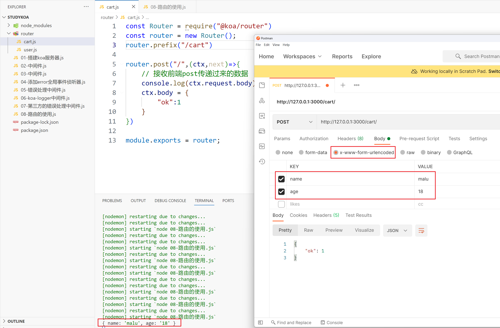

## 一，koa框架

### 1，koa框架介绍

官方文档：https://koa.bootcss.com/


Koa 是一个新的 web 框架，由 Express 幕后的原班人马打造， 致力于成为 web 应用和 API 开发领域中的一个更小、更富有表现力、更健壮的基石。 通过利用 async 函数，Koa 帮你丢弃回调函数，并有力地增强错误处理。 Koa 并没有捆绑任何中间件， 而是提供了一套优雅的方法，帮助您快速而愉快地编写服务端应用程序。


使用步骤：

- 创建文件夹 studyKoa
- 进入文件夹，生成项目配置文件 npm init -y
- 安装koa: npm i koa@2.13.4 -S
- 在studyKoa文件夹下，创建 01-搭建koa服务器.js


操作如下：


创建一台服务器：

```js
const Koa = require('koa');
const app = new Koa();

// app.use表示使用中间件
app.use(async ctx => {
  ctx.body = 'Hello World';
});

app.listen(3000);
```


测试之：


### 2，中间件


写代码演示两个中间件，如下：

```js
const Koa = require('koa');
const app = new Koa();

app.use(async (ctx,next) => {
    console.log(1)
    // 上一个中间件不调用next,不会走下一个中间件
    next();
});

app.use(async (ctx,next) => {
  ctx.body = 'Hello World';
});

app.listen(3000);
```


看如下代码，为什么结果是 1 2 3，如下：


在koa中，中间的执行流程是遵循洋葱模型，如下：


看一下，官方代码：

```js
const Koa = require('koa');
const app = new Koa();

// logger  日志中间件
app.use(async (ctx, next) => {
  console.log(1)
  await next();
  console.log(5)
  const rt = ctx.response.get('X-Response-Time');
  console.log(`${ctx.method} ${ctx.url} - ${rt}`);
});

// x-response-time  计算当前请求所消耗的时间
app.use(async (ctx, next) => {
  const start = Date.now();
  console.log(2)
  await next();
  console.log(4)
  const ms = Date.now() - start;
  ctx.set('X-Response-Time', `${ms}ms`);
});

// response
app.use(async ctx => {
  console.log(3)
  ctx.body = 'Hello World';
});

app.listen(3000);
```


### 3，错误监听


 每次修改了服务器代码，都需要重新启动服务器，为了方便，可以全局安装nodemon。安装之：

```shell
npm i nodemon -g
```


后面再启动服务器，通过nodemon这个工具来启动，如下：


添加error全局事件侦听器，如下：

```js
const Koa = require('koa');
const app = new Koa();

app.use(async ctx => {
    throw new Error("未知错误~~~~")
});

// 全局错误处理  目前的处理仅仅是后台打印
app.on("error",err=>{
    console.log('全局错误处理', err.message)
})

app.listen(3000);
```


### 4，手写错误处理中间件（给客户端提示）


现在没有提示：


写一个中间件，给出提示：

```js
const Koa = require('koa');
const app = new Koa();

// 错误处理中间件
app.use(async (ctx,next) => {
    try{
        await next();
    }catch(error){
        // console.log(error.statusCode)
        // console.log(error.status)
        // 给⽤户显示状态码
        ctx.status = error.statusCode || error.status || 500;
        // 如果是ajax请求,返回的是json错误数据
        ctx.type = "json"
        ctx.body = {
            ok:0,
            message:error.message
        }
    }
})

app.use(async ctx => {
    throw new Error("未知错误~~~~")
});

// 全局错误处理 后台打印
app.on("error",err=>{
    console.log('全局错误处理', err.message)
})

app.listen(3000);
```


### 5，日志中间件之koa-logger

**安装：** npm i koa-logger@3.2.1


上代码演示：

```js
const Koa = require('koa');
const logger = require('koa-logger')

const app = new Koa();

// 使用中间件
app.use(logger())

app.use(async ctx => {
    ctx.body = "hello koa~"
});

// 全局错误处理 后台打印
app.on("error",err=>{
    console.log('全局错误处理', err.message)
})

app.listen(3000);
```


### 6，第三方错误处理中间件

**安装：** npm i koa-onerror@4.2.0


使用之：

```js
const Koa = require('koa');
const logger = require('koa-logger')
const onerror = require('koa-onerror')

const app = new Koa();

// 使用中间件
app.use(logger())
onerror(app)

app.use(async ctx => {
    // const err = new Error("未授权");
    // err.status = 401;
    // throw err;
    ctx.throw(401,"未授权")
});

// 全局错误处理 后台打印
app.on("error",err=>{
    console.log('全局错误处理', err.message)
})

app.listen(3000);
```


### 7，路由中间件


安装： npm i @koa/router@10.1.1


创建router文件夹，在router文件夹下，创建user.js，再创建cart.js，如下：


用户模块路由，如下：

```js
// 路由就是一种特殊的中间件

const Router = require("@koa/router")
const router = new Router();
router.prefix("/user")

router.get("/",(ctx,next)=>{
    ctx.body = "用户管理"
})

module.exports = router;
```


购物车模块路由，如下：

```js
const Router = require("@koa/router")
const router = new Router();
router.prefix("/cart")

router.get("/",(ctx,next)=>{
    ctx.body = "购物车管理"
})

module.exports = router;
```


在入口中，导入上面的两个路由，如下：

```js
const Koa = require('koa');
const user = require("./router/user")
const cart = require("./router/cart")

const app = new Koa();

// 注册路由
app.use(user.routes())
user.allowedMethods();
app.use(cart.routes())
cart.allowedMethods();

app.listen(3000);
```


测试之：


### 8，接收get请求参数


get请求有两种形式把数据传递给后端： 

- 访问http://localhost:3000/user/3/1
- 访问http://localhost:3000/user?name=wc&age=18


代码演示：

```js
const Router = require("@koa/router")
const router = new Router();
router.prefix("/user")

// http://localhost:3000/user?name=wc&age=18
router.get("/",(ctx,next)=>{
    // 得到查询字符串参数
    console.log(ctx.query.name, ctx.query.age)
    ctx.body = "用户管理"
})

// 访问http://localhost:3000/user/3/1
router.get("/:id/:pid",(ctx,next)=>{
    // 得到路径参数
    console.log(ctx.params.id, ctx.params.pid);
    ctx.body = "用户管理"
})

module.exports = router;
```


效果如下：


### 9，接收post请求参数

安装：npm i koa-bodyparser@4.3.0


使用之，如下：

```js
const Koa = require('koa');
const user = require("./router/user")
const cart = require("./router/cart")
const bodyparser = require("koa-bodyparser")

const app = new Koa();

app.use(bodyparser())

// 注册路由
app.use(user.routes())
user.allowedMethods();
app.use(cart.routes())
cart.allowedMethods();

app.listen(3000);
```


接收前端post请求传递的数据，如下：

```js
const Router = require("@koa/router")
const router = new Router();
router.prefix("/cart")

router.post("/",(ctx,next)=>{
    // 接收前端post传递过来的数据
    console.log(ctx.request.body)
    ctx.body = {
        "ok":1
    }
})

module.exports = router;
```


测试之：




前端给后端传递一个json，如下：


### 10，重定向

定义登录注册路由，如下：

```js
const Router = require("@koa/router")
const router = new Router();

router.get("/login",(ctx,next)=>{
    // xxxxx

    // 当访问/login  重定向到/reg
    ctx.redirect("/reg")
    ctx.status = 301; // 301 表示重定向
})

router.get("/reg",(ctx,next)=>{
    ctx.body = "注册页面~"
})

module.exports = router;
```


注册路由：

```js
const Koa = require('koa');
const user = require("./router/user")
const cart = require("./router/cart")
const loginReg = require("./router/loginReg")
const bodyparser = require("koa-bodyparser")

const app = new Koa();

app.use(bodyparser())

// 注册路由
app.use(user.routes())
user.allowedMethods();
app.use(cart.routes())
cart.allowedMethods();
app.use(loginReg.routes())
loginReg.allowedMethods();

app.listen(3000);
```


测试之：


### 11，托管静态资源

安装：npm i koa-static@5.0.0


准备静态资源：


配置托管静态资源：

```js
const Koa = require('koa');
const static = require('koa-static');
const app = new Koa();

//配置静态web服务的中间件
//app.use(static('./public'));
app.use(static(__dirname+'/public')); // __dirname是当前文件夹

app.listen(3000);
```


测试：


### 12，解决跨域

**安装：** npm i koa2-cors


使用之：

```js
const koa = require('koa');
const cors = require('koa2-cors');
const app = new koa();
app.use(cors());
```


### 13，文件上传

**安装：** npm i koa-multer@1.0.2


创建服务器，如下：


测试之，如下：


实现文件上传，如下：

```js
const Router = require("@koa/router")
const multer=require("koa-multer")

let storage=multer.diskStorage({
    // 文件保存的路径
    destination:function(req,file,cb){
        cb(null,"static/upload")
    },
    // 修改文件名称   z3  78f8dsfgasd8fg8asdgasdf.png  l4  fsadf7gas0dg7asdgasd.png
    filename:function(req,file,cb){  // logo.png  ['logo','png']    68568756767.png
        var fileFormat = (file.originalname).split(".");
        cb(null,Date.now() + "." + fileFormat[fileFormat.length - 1]);
    }
})
let upload=multer({storage})

const router = new Router();

router.post("/upload",upload.single("avatar"),(ctx,next)=>{
    console.log(ctx.req.file.filename)
    ctx.body = {
        ok:1
    }
})

module.exports = router;
```


测试：


### 14，表单验证

**安装：** npm i koa-bouncer@6.0.0


创建一个新的路由，如下：


后端接收数据，如下：


开始进行校验，如下：


校验代码如下：

```js
const Router = require("@koa/router")
const bouncer = require('koa-bouncer')
const router = new Router();
router.prefix("/user")

// 表单验证
router.post("/",async (ctx,next)=>{
    console.log(ctx.request.body)  // 获取前端传递过来的数据

    try{
        // ctx.validateBody('username').required('用户名是必须传的~').isString().isLength(3, 15, 'Username must be 3-15 chars');

        ctx
            .validateBody('uname')
            .required('用户名是必须的')
            .isString()
            .trim()
            .isLength(4, 8, '用户名必须是4~8位')
        ctx
            .validateBody('email')
            .optional()
            .isString()
            .trim()
            .isEmail('非法的邮箱格式')
        ctx
            .validateBody('pwd1')
            .required('密码是必填项')
            .isString()
            .trim()
            .isLength(6, 16, '密码必须是6~16位')
        ctx
            .validateBody('pwd2')
            .required('密码是必填项')
            .isString()
            .trim()
            .eq(ctx.vals.pwd1, '两次密码不一致')

        console.log(ctx.vals)


        ctx.body = {
            code:1
        }
    }catch (error) {
        if(error instanceof bouncer.ValidationError){
            ctx.status = 400
            ctx.body = {
                code: 400,
                message: '校验失败:' + error.message,
            }
            return
        }
    }
})

module.exports = router;
```


### 15，图形验证码


**安装：** npm i trek-captcha@0.4.0


创建路由，如下：


生成验证码：

```js
const Router = require("@koa/router")
const captcha = require("trek-captcha")
const router = new Router();
router.prefix("/login")

router.get("/captcha",async (ctx,next)=>{
    const {
        token,
        buffer
    } = await captcha({size:4})
    ctx.body = buffer;
})

module.exports = router;
```


测试：


写一个Img标签测试之，如下：


## 二，鉴权


## 三，MongoDB


## 四，实战项目


